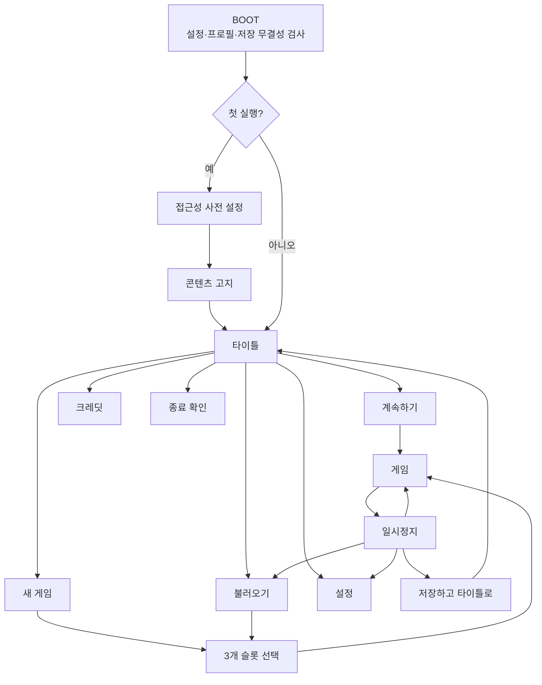

# GGB 메타 UI·인벤토리·저장 화면 계약

## 1. 목적

본 문서는 개별 퍼즐 밖에서 항상 같은 방식으로 작동해야 하는 부트, 타이틀, 슬롯, 일시정지, 인벤토리, 수첩, 대화 기록과 종료 흐름을 정의한다. 이벤트별 UI가 이 계약과 다르면 본 문서를 우선하고, 서사상 예외는 명시적 결정 기록을 요구한다.

## 2. 전체 흐름



## 3. 부트와 첫 실행

부트 순서:

1. 사용자 프로필 설정을 읽는다.
2. 세 슬롯의 current·backup·transaction 상태를 읽기 전용으로 검사한다.
3. 손상 슬롯은 자동 덮어쓰지 않고 복구 후보를 표시한다.
4. 첫 실행이면 언어, 자막, 텍스트 배율, 모션 감소, 광과민 보호, 색상 서명 표시를 게임 시작 전에 설정한다.
5. `docs/content_advisory.md`의 고지를 표시한다.
6. 타이틀로 진입한다.

첫 실행 화면은 건너뛰어도 기본 안전값을 사용한다: 자막 켬, 모션 기본, 광과민 보호 제안 노출, 자동 진행 끔.

## 4. 타이틀

| 항목 | 표시 조건 | 동작 |
| --- | --- | --- |
| 계속하기 | 유효 슬롯 1개 이상 | 가장 최근에 갱신된 유효 슬롯의 안전 지점 로드 |
| 새 게임 | 항상 | 빈 슬롯 선택. 사용 중 슬롯은 2단계 덮어쓰기 확인 |
| 불러오기 | 항상 | 3개 슬롯과 복구 상태 표시 |
| 데모 저장 가져오기 | 본편 build, 유효 demo save 발견 | 읽기 전용 검사 뒤 가져오기 흐름 |
| 설정 | 항상 | 접근성·화면·오디오·입력·언어 |
| 콘텐츠 상세 | 항상 | 민감 콘텐츠 인벤토리 재열람 |
| 크레딧 | 항상 | 제작·라이선스·제3자 고지 |
| 종료 | 항상 | Windows로 종료 확인 |

`계속하기`는 손상 슬롯, 호환 불가 슬롯, 트랜잭션 복구 대기 슬롯을 자동으로 선택하지 않는다.

## 5. 슬롯 화면

각 슬롯은 다음을 표시한다.

```text
슬롯 번호 / 챕터·사건 표시명
마지막 저장 시각 / 누적 플레이 시간
현재 세계 상태: 정상 루프 / 파열 이후 / 엔딩 분기
build flavor / 저장 버전 호환 상태
수첩 단계 / 관계 완료 수
미리보기 이미지 또는 중립 장소 아이콘
```

- 퍼즐 정답, 엔딩 선택, 숨은 인물 정보는 표시하지 않는다.
- 슬롯 삭제는 슬롯 번호와 마지막 사건을 다시 보여 주는 별도 확인을 사용한다.
- 삭제 후 1회 실행 동안 로컬 휴지통 복구 후보를 둘 수 있으나 Steam Cloud 정책과 충돌하면 출시 전에 결정한다.
- 손상 시 `current → backup → 안전한 이전 저장` 순서의 복구 후보를 보여 주고 사용자가 선택한다.

## 6. 일시정지

| 메뉴 | 기능 |
| --- | --- |
| 계속 | 정확한 이전 포커스로 복귀 |
| 수첩 | 영구 정보·가설·실패 기록 |
| 대화 기록 | 이미 본 대사 최대 2,000개 재열람 |
| 불러오기 | 미확정 입력 폐기 경고 뒤 슬롯 화면 |
| 설정 | 즉시 적용 가능한 항목과 확인이 필요한 화면 항목 구분 |
| 저장하고 타이틀로 | 최근 안전 지점까지 원자 커밋 또는 롤백 뒤 이동 |
| 타이틀로 | 저장하지 않은 안전 지점 이후 진행 손실을 구체적으로 고지 |
| 종료 | 같은 고지 뒤 Windows 종료 |

퍼즐 확정 트랜잭션 중에는 메뉴를 열 수 있지만 `불러오기`, `타이틀`, `종료`는 커밋·롤백 완료 뒤 실행한다.

## 7. 공통 인벤토리

### 7.1 상태

```text
closed
→ browse
→ item_selected
→ target_mode
→ use_confirmed | invalid_target | cancel
→ browse | closed
```

### 7.2 선택과 사용

1. 아이템을 한 번 선택하면 이름, 감각 설명, 현재 루프 수명을 보여 준다.
2. `사용` 또는 같은 아이템 재확정으로 대상 선택 모드에 들어간다.
3. 월드 핫스폿 또는 다른 아이템을 확정한다.
4. 등록된 상호작용이면 결과 확인 뒤 원자 적용한다.
5. 잘못된 대상이면 아이템을 소비하지 않고 구체적인 이유를 한 문장으로 보여 준다.
6. 취소하면 선택 아이템을 유지한 browse 또는 직전 월드 포커스로 돌아간다.

기본 동사:

| 동사 | 기능 |
| --- | --- |
| 본다 | 아이템 설명·현재 상태 |
| 사용한다 | 월드 대상 선택 |
| 조합한다 | 다른 인벤토리 아이템 선택 |
| 분리한다 | 레시피가 명시적으로 허용한 조합만 되돌림 |
| 취소 | 소비·상태 변화 없이 이전 단계 |

### 7.3 조합

- 첫 아이템 선택 뒤 호환 가능한 아이템을 자동으로 숨기지 않는다. 미발견 레시피를 UI가 누설할 수 있기 때문이다.
- 조합 실패는 `붙지 않는다`가 아니라 재료·순서·용기·상태 중 플레이어가 이미 알 수 있는 이유를 말한다.
- 비가역 조합은 결과, 현재 루프 고정 여부와 취소 가능 시점을 확인한다.
- 레시피 성공은 입력 두 아이템, 출력, 수명 주기, event ID를 한 트랜잭션으로 기록한다.

### 7.4 수명 표시

첫 NORMAL_RESET을 확인한 뒤부터 아이템 상세에 다음 라벨을 사용한다.

| 라벨 | 의미 |
| --- | --- |
| 현재 하루 | 잠들면 원래 위치·상태로 돌아가는 물리 아이템 |
| 영구 기록 | 수첩·탁본처럼 RESET 뒤 유지 |
| 정보만 유지 | 물건은 사라지지만 조합법·관찰은 남음 |
| 파열 이후 유지 | D5 이후 현재 물리 상태를 유지 |

프롤로그에서는 이 라벨로 리셋을 미리 스포일러하지 않는다.

## 8. 공통 입력 action

| action | 기본 키 예시 | 요구 |
| --- | --- | --- |
| `ui_focus_*` | 방향키/WASD | 핫스폿·메뉴 공간 순회 |
| `ui_accept` | Enter/Space | 명시적 확정 |
| `ui_cancel` | Esc | 이전 단계, 입력 소비 없음 |
| `open_inventory` | I/Tab | 마지막 인벤토리 포커스 복구 |
| `open_notebook` | N | 현재 목표 관련 페이지가 아닌 마지막 본 페이지 |
| `open_dialogue_history` | H | 마지막 대사에 포커스 |
| `pause_game` | Esc | 월드에서 일시정지, 하위 UI에서는 취소 우선 |
| `cycle_hotspot_next/prev` | 재지정 가능 | 화면 밖 핫스폿으로 카메라가 튀지 않음 |

모든 action은 재지정할 수 있고 중복 충돌을 저장 전에 알려 준다. 게임패드·터치는 1.0 계약에서 제외한다.

## 9. 오류와 피드백

| 상황 | 피드백 |
| --- | --- |
| 잘못된 아이템 대상 | 소비 없음, 현재 이유 1문장, 선택 유지 |
| 잠긴 공간 | 필요한 정보 범주와 현재 조사 가능 경로 |
| 저장 중 종료 | 저장 표시 뒤 종료, 5초 초과 시 롤백·재시도 선택 |
| 호환 불가 저장 | 원본 보존, 버전·build flavor·가능한 조치 표시 |
| 포커스 대상 소실 | 가까운 상위 컨테이너 또는 마지막 안전 포커스 |
| 언어 변경 | 현재 line ID부터 새 locale로 재해석, 진행 상태 불변 |

붉은색, 소리, 진동만으로 오류를 전달하지 않는다.

## 10. QA

| QA ID | 경로 | 통과 기준 |
| --- | --- | --- |
| `QA-UI-BOOT-01` | 첫 실행→설정→고지→타이틀 | 마우스·키보드 각각 완료 |
| `QA-UI-SLOT-01` | 3슬롯 생성·덮어쓰기·삭제·복구 | 잘못된 슬롯 변경 없음 |
| `QA-UI-INV-01` | 선택→잘못된 대상→취소→정답 대상 | 아이템 중복·소실 없음 |
| `QA-UI-INV-02` | 조합 성공 중 강제 종료 | 전체 롤백 또는 전체 커밋 |
| `QA-UI-A11Y-01` | 1280x720, UI·텍스트 200% | 버튼·설명·포커스 잘림 없음 |
| `QA-UI-FOCUS-01` | 모든 화면 키보드 순회 | 순환·복귀 지점 결정적 |
| `QA-UI-RESET-01` | 첫 RESET 전후 수명 라벨 | 스포일러 없이 정확히 전환 |
| `QA-UI-LOC-01` | ko-KR·en-US·pseudo | 진행·버튼 수·확인 횟수 동일 |

현재는 구현 전 기획 계약이다. UI prefab, action map, SaveManager 동작이 생기기 전에는 구현 완료로 판정하지 않는다.
