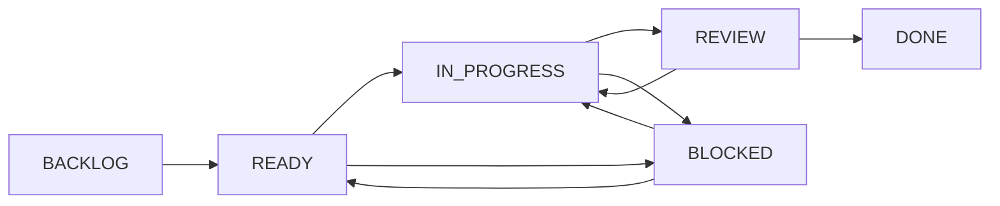

# GGB 프로젝트 운영 기준

## 1. 목적

이 문서는 GGB의 기획, 구현, 검증 작업을 같은 기준으로 추적하기 위한 운영 규칙이다.

다음 질문에 누구나 같은 답을 얻을 수 있어야 한다.

- 지금 시작할 수 있는 작업은 무엇인가.
- 누가 무엇을 맡고 있으며, 무엇 때문에 멈춰 있는가.
- 어떤 기획 문서, 이벤트 ID, 구현 파일이 한 작업과 연결되는가.
- 작업이 끝났다고 판단할 근거는 무엇인가.
- 중요한 선택을 누가 왜 결정했는가.

## 2. 영역별 기준 정보

한 정보를 여러 장소에서 직접 수정하지 않는다. 영역별 기준 정보는 다음과 같다.

| 영역 | 기준 정보 | 비고 |
| --- | --- | --- |
| 기획·서사·이벤트 규칙 | `ideas/md/v04/` | 사람이 읽는 기획 정본 |
| 충돌·기획 오류 | `ideas/md/v04/issues/items/` | `GGB-CNF`, `GGB-ERR`의 해결 상태와 증거 |
| 구현 데이터·코드 | `game/` | 게임이 실제로 읽거나 실행하는 내용 |
| 작업 흐름 | 현재는 작업 문서, 향후 GitHub Issue/Project | GitHub 연동 전까지 본 문서의 필드를 사용 |
| 중요 결정 | `docs/decisions/` | `GGB-DEC` 기록 |
| 역할 | `docs/project_roles.md` | 프로젝트 관리자와 영역 책임 |
| 마일스톤 | `docs/milestones.md` | 결과물 범위, 완료 조건, 목표일 |
| 공개 데모 범위 | `docs/demo_definition.md` | 2장 데모의 콘텐츠·품질·플랫폼 기준 |
| 완성본 범위 | `docs/full_game_definition.md` | 프롤로그~4장·엔딩의 콘텐츠·품질·출시 기준 |
| Steam 출시 준비 | `docs/steam_release_plan.md` | 계정, 상점, 심사, Next Fest, 출시 게이트 |
| Discord 운영 | `docs/discord_operations.md` | Git 알림, 회의, 에셋 접수, 일정 표시 기준 |
| 다음 작업 계획 | `docs/next_work_plan.md` | 기획 기준선 이후 협업 시스템 구현 순서 |
| 회의 일정 | 외부 캘린더 | 참석 일정과 리마인더 관리 |
| 대화·알림 | Discord | 결정과 작업의 기준 정보로 사용하지 않음 |

대시보드와 Discord는 위 기준 정보를 읽어 보여주는 출력 계층으로 취급한다.

## 3. ID 체계

발급한 ID는 삭제하거나 다른 항목에 재사용하지 않는다.

| ID | 대상 | 예시 |
| --- | --- | --- |
| `GGB-WRK-YYYY-NNNN` | 기능, 콘텐츠, 아트, 운영 등 일반 작업 | `GGB-WRK-2026-0001` |
| `GGB-CNF-YYYY-NNNN` | 둘 이상의 기획 문서가 서로 다른 규칙을 정의한 충돌 | `GGB-CNF-2026-0003` |
| `GGB-ERR-YYYY-NNNN` | 누락, 잘못된 참조 등 기획·데이터 계약 오류 | `GGB-ERR-2026-0002` |
| `GGB-DEC-YYYY-NNNN` | 중요한 선택과 근거 | `GGB-DEC-2026-0001` |
| `QA-*` | 검증 시나리오 또는 자동 검사 | `QA-CNF-0003-ORDER` |

구현 중 발견된 일반 버그는 우선 `GGB-WRK`로 등록하고 유형을 `BUG`로 둔다. 둘 이상의 기준 문서가 충돌하면 `GGB-CNF`, 기획 또는 데이터 계약 자체가 잘못되었으면 `GGB-ERR`를 사용한다.

## 4. 공통 작업 필드

새 작업은 [작업 항목 템플릿](templates/work_item.md)을 사용한다. 기존 `GGB-CNF/ERR` 항목에도 다음 운영 필드를 둔다.

| 필드 | 필수 시점 | 규칙 |
| --- | --- | --- |
| ID | 등록 시 | 고유하고 재사용하지 않음 |
| 제목 | 등록 시 | 결과가 드러나는 짧은 문장 |
| 유형 | 등록 시 | `FEATURE`, `CONTENT`, `ART`, `AUDIO`, `BUG`, `DOCS`, `QA`, `OPS`, `CNF`, `ERR` |
| 작업 상태 | 등록 시 | 5절의 공통 작업 흐름 사용 |
| 해결 상태 | `CNF/ERR`만 | 기존 `OPEN`부터 `VERIFIED`까지의 상태 사용 |
| 우선순위 | 등록 시 | `P0`부터 `P3`까지 사용 |
| 심각도 | 결함 항목만 | `높음`, `중간`, `낮음` 사용 |
| 담당자 | `IN_PROGRESS` 전 | 결과에 책임지는 사람 한 명 |
| 참여자 | 필요 시 | 공동 작업자, 여러 명 가능 |
| 검토자 | `REVIEW` 전 | 완료 조건과 증거를 확인할 사람 |
| 목표 마일스톤 | `IN_PROGRESS` 전 | 어느 결과물에 포함되는지 표시 |
| 목표일 | 필요 시 | 외부 약속이나 선행 관계가 있을 때만 사용 |
| 선행 항목 | 등록 시 | 먼저 완료되어야 하는 작업 ID |
| 관련 대상 | 등록 시 | 문서, 이벤트 ID, 구현 파일, PR, 결정 ID |
| 완료 조건 | `READY` 전 | 확인 가능한 체크리스트 |
| 검증 근거 | `DONE` 전 | 테스트 ID, PR, 스크린샷, 빌드 등 |
| 상태 변경 이력 | 변경 시 | 날짜, 이전·새 상태, 변경자, 이유 |

`UNASSIGNED`와 `UNSCHEDULED`는 누락이 아니라 아직 정하지 않았다는 명시적 값이다. 다만 `IN_PROGRESS`로 이동하기 전에는 담당자와 목표 마일스톤을 실제 값으로 바꿔야 한다.

## 5. 공통 작업 흐름



| 작업 상태 | 의미 | 진입 조건 |
| --- | --- | --- |
| `BACKLOG` | 필요성은 확인했지만 아직 시작 준비가 안 됨 | 제목, 유형, 배경이 있음 |
| `READY` | 바로 선택해 시작할 수 있음 | 선행 항목 해결, 범위와 완료 조건 명확 |
| `IN_PROGRESS` | 담당자가 실제 작업 중 | 담당자와 목표 마일스톤 지정 |
| `REVIEW` | 변경은 끝났고 검토·검증 중 | 완료 조건 체크, 변경과 검증 근거 연결 |
| `BLOCKED` | 결정 또는 선행 작업 때문에 진행 불가 | 차단 원인 ID와 해제 조건 기록 |
| `DONE` | 검토와 필요한 검증이 끝남 | 완료 조건 충족, 검증 근거 기록 |

단순히 파일을 수정했거나 코드를 작성했다는 이유만으로 `DONE`으로 바꾸지 않는다.

### 5.1 충돌·오류 상태와의 관계

`GGB-CNF/ERR`은 문제 해결 상태와 공통 작업 상태를 함께 가진다. 두 상태는 목적이 다르다.

| 해결 상태 | 일반적인 작업 상태 |
| --- | --- |
| `OPEN` | `BACKLOG`, `READY`, `IN_PROGRESS`, `BLOCKED` |
| `IN_PROGRESS` | `IN_PROGRESS` |
| `RESOLVED` | `REVIEW` |
| `VERIFIED` | `DONE` |
| `DEFERRED` | `BACKLOG` |
| `WONT_FIX` | `DONE`과 함께 유지 결정 근거 필요 |

개별 이슈 파일의 `상태`는 해결 상태, `작업 상태`는 실제 수행 흐름을 뜻한다.

## 6. 우선순위와 심각도

우선순위는 처리 순서이고, 심각도는 문제가 프로젝트에 미치는 영향이다. 둘을 같은 값으로 취급하지 않는다.

| 우선순위 | 기준 |
| --- | --- |
| `P0` | 저장 손상, 작업 불가 등 즉시 대응해야 하는 문제 |
| `P1` | 현재 마일스톤 또는 여러 후속 작업을 막는 문제 |
| `P2` | 중요한 일반 작업, 일정 안에서 계획적으로 처리 |
| `P3` | 개선, 정리, 후속 버전 후보 |

높은 심각도의 문제라도 현재 마일스톤 범위 밖이면 `P2`일 수 있고, 낮은 심각도의 오탈자라도 릴리즈를 막으면 `P1`일 수 있다. 이유를 항목에 기록한다.

## 7. 담당과 검토

현재 역할 배정은 [프로젝트 역할](project_roles.md)을 기준으로 한다.

- 담당자는 한 명만 지정한다. 참여자는 여러 명이어도 된다.
- `IN_PROGRESS` 작업은 담당자가 상태와 다음 행동을 최신으로 유지한다.
- 검토자는 완료 조건과 검증 근거를 확인한다.
- 팀 규모상 별도 검토자가 없으면 자기 검토를 허용하되, 사용한 체크리스트와 검증 결과를 남긴다.
- 담당자가 3영업일 이상 작업을 진행할 수 없으면 `BLOCKED`로 바꾸거나 다시 배정한다.

## 8. 선행 관계와 차단

`BLOCKED` 항목에는 설명만 쓰지 않고 차단 원인 ID와 해제 조건을 적는다.

### 8.2 `DEFERRED` 운영

`DEFERRED`는 일정과 위험에 따라 유동적으로 사용할 수 있지만, 단순히 마감에서 숨기는 상태로 쓰지 않는다.

- 프로젝트 관리자 `beru`와 영향 영역 팀장이 보류 여부를 판단한다.
- 보류 이유, 영향, 재검토 시점 또는 재개 조건을 기록한다.
- 현재 마일스톤을 막는 `P0`는 보류하지 않는다.
- `P1`을 보류하려면 개발·공개 빌드를 막지 않는 근거와 `beru` 승인이 필요하다.
- `P2`, `P3`는 현재 목표에 영향이 없으면 후속 마일스톤으로 옮길 수 있다.
- 재검토 조건이 충족되면 `OPEN`으로 되돌리고 우선순위를 다시 판단한다.

```yaml
status: DEFERRED
deferred_by: beru + affected_team_lead
reason: 현재 마일스톤을 막지 않는 이유
impact: 사용자·개발·QA 영향
review_on_or_when: YYYY-MM-DD 또는 재개 조건
target_milestone: 후속 마일스톤 ID
```

```text
blocked_by: GGB-CNF-2026-0003
unblock_when: SYS_COMMIT·SYS_MEMORY 공식 순서가 결정되고 기준 문서가 수정됨
```

선행 항목이 `DONE` 또는 `VERIFIED`가 되면 후속 항목을 자동 또는 수동으로 다시 검토해 `READY`로 전환한다.

## 9. 시작 준비와 완료 기준

### 9.1 Definition of Ready

다음을 모두 만족해야 `READY`로 이동한다.

- 목적과 결과물이 명확하다.
- 포함 범위와 제외 범위가 구분되어 있다.
- 관련 기획 문서나 이벤트 ID가 연결되어 있다.
- 완료 조건이 확인 가능한 문장으로 작성되어 있다.
- 선행 항목이 해결되었거나 없다.
- 중요한 미확정 결정이 남아 있지 않다.

### 9.2 공통 Definition of Done

다음을 모두 만족해야 `DONE`으로 이동한다.

- 완료 조건을 모두 충족했다.
- 관련 문서, 데이터, 코드가 함께 갱신되었다.
- 필요한 자동·수동 검증을 통과했다.
- PR, commit, QA ID 등 검증 근거가 연결되었다.
- 후속 작업과 새로 발견한 문제를 별도 ID로 등록했다.
- `CNF/ERR`이면 해결 상태가 `VERIFIED` 또는 근거가 있는 `WONT_FIX`다.

## 10. 결정 기록

다음 중 하나에 해당하면 대화나 회의록만 남기지 않고 `GGB-DEC`를 만든다.

- 둘 이상의 유효한 선택지 중 하나를 채택한다.
- 기획 정본이나 데이터 계약의 의미를 바꾼다.
- 이후 되돌리기 어렵거나 여러 영역에 영향을 준다.
- 같은 논의가 반복될 가능성이 높다.
- `GGB-CNF` 해결의 기준안을 확정한다.

결정 기록은 [결정 기록 안내](decisions/README.md)와 [결정 템플릿](templates/decision_record.md)을 따른다. 결정 상태는 다음을 사용한다.

```text
PROPOSED → ACCEPTED → SUPERSEDED
             └──────→ REJECTED
```

이미 승인한 결정을 바꿀 때 과거 파일을 덮어쓰지 않는다. 새 `GGB-DEC`를 만들고 기존 기록을 `SUPERSEDED`로 변경한 뒤 `superseded_by`를 적는다.

## 11. 작업 갱신 절차

1. 작업 ID를 등록하고 배경, 범위, 완료 조건을 작성한다.
2. 선행 항목과 관련 문서·이벤트를 연결한다.
3. 준비가 끝나면 `READY`로 바꾼다.
4. 시작할 때 담당자와 목표 마일스톤을 정하고 `IN_PROGRESS`로 바꾼다.
5. 변경 후 검증 근거를 연결하고 `REVIEW`로 바꾼다.
6. 완료 조건을 확인한 뒤 `DONE`으로 바꾼다.
7. 중요한 선택이 있었다면 연결된 `GGB-DEC`가 있는지 확인한다.

## 12. 현재 적용 범위

이번 기반 정리에서는 다음을 적용한다.

- 공통 작업 상태와 필드 정의.
- 일반 작업과 결정 기록 템플릿 제공.
- 기존 13개 `GGB-CNF/ERR`에 작업 상태, 담당자, 목표 마일스톤 추가.
- 저장소 진입 문서와 기여 규칙에서 본 운영 기준 연결.

GitHub Issue/Project 동기화, Discord 알림, 회의 안건 자동 생성, 자동 검증은 후속 단계에서 이 필드를 기준으로 구현한다.
