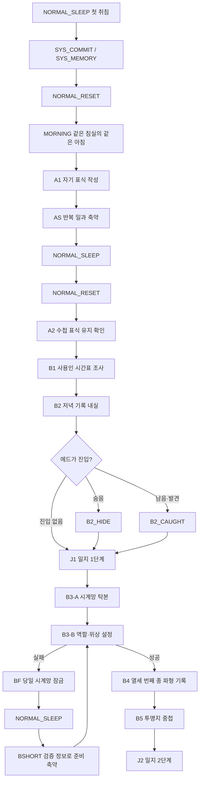

# CNT-EP01: 반복과 시계망 게임 스크립트

## 1. 문서 정보

| 항목 | 값 |
| --- | --- |
| `package_id` | `CNT-EP01` |
| 부모 의뢰 | `REQ-CNT-2026-0002` |
| 원문 상태 | `KOREAN_DRAFT` |
| 대상 구간 | 첫 정상 리셋부터 J2 복원까지 |
| 기준 사건 | `A1`, `AS`, `NORMAL_SLEEP`, `SYS_COMMIT`, `SYS_MEMORY`, `NORMAL_RESET`, `MORNING`, `ROUTE`, `A2`, `B1`, `B2`, `B2_EDGAR_ENTRY`, `B2_HIDE`, `B2_CAUGHT`, `J1`, `B3_A`, `B3_B`, `BF`, `BSHORT`, `B4`, `B5`, `J2` |
| 주요 위치 | `M2_BEDROOM`, `M1_CENTRAL_HALL`, `M1_SERVANT_COMMON`, `M1_PARLOR`, `M1_LIBRARY_OUTER`, `M1_LIBRARY_INNER`, `M1_GREAT_CLOCK` |
| 번역 정책 | `ko_KR`만 작성한다. `en_US` 열은 후속 번역을 위해 유지하되 본 문서에서는 모두 비워 둔다. |

이 문서는 의뢰 범위를 실제 플레이 순서, 선택지, 조건, 반복 변형, 상태 처리까지 포함한 게임 스크립트로 전환한 초안이다. `draft_id`는 제작·검토용 추적자이며 승인된 런타임 `line_id`가 아니다.

## 2. 표기와 실행 규칙

| 표기 | 의미 |
| --- | --- |
| `DIALOGUE` | 대화창에 표시되는 발화 |
| `MONOLOGUE` | 주인공의 내적 독백 |
| `CHOICE` | 플레이어가 선택하는 행동·대답 |
| `SYSTEM` | 상태, 확인, 획득, 사용 불가 안내 |
| `CAPTION` | 소리·진동·감각 접근성 자막 |
| `DOCUMENT` | 책, 장부, 일지, 수첩에 표시되는 본문 |
| `OBJECT` | 포인트 앤 클릭 조사 반응 |

공통 원칙:

1. 모든 선택지는 선악 판정 없이 행동 방향을 설명한다.
2. B2에서 숨거나, 남아 있거나, 에드가에게 발견되는 모든 경로는 J1로 합류한다.
3. B3-A의 오답은 현재 조작판만 다시 놓는 `LOCAL RETRY`다.
4. B3-B의 실제 작동 실패는 당일 장치를 잠그는 `HARD FAILURE`이며, 잠든 뒤 같은 아침부터 다시 시작한다.
5. 정상 리셋은 물리 상태와 당일 소지품을 초기화한다. 수첩, 일지, 검증한 정보, 관계, 사용인 잔류 기억은 유지한다.
6. 사용인 반응은 퍼즐 정답을 대신 말하거나 필수 경로를 막지 않는다.
7. 영어 번역은 의도적으로 미작성 상태다. 빈 `en_US`를 누락이나 완료 번역으로 판정하지 않는다.

### 2.1 장면·캐릭터 스테이징 계약

| 필드 | 값·규칙 |
| --- | --- |
| `Scene` | 필수 진행은 `Scene 1`부터 `Scene 12`까지 순서대로 표기한다. 선택·실패 삽입 장면은 `Branch`로 표기하고 메인 Scene 번호를 소비하지 않는다. |
| `Character` | 해당 행에서 화면에 표시할 캐릭터 일러스트. `EDGAR`, `MARA1`, `LUCA`, `IRIS`, `MARA2`를 사용한다. 캐릭터 일러스트가 필요 없으면 `X`다. |
| `position` | `좌측`, `중앙`, `우측`, `X`. 본 구간의 일대일 대화는 기본적으로 사용인을 `우측`에 둔다. |
| `표정·동작` | 표정, 시선, 소품, 입·꼬리·귀·날개 반응과 등장·퇴장을 함께 지정한다. 별도 변화가 없으면 `기본 유지`다. |
| `next` | 다음에 재생할 `draft_id`, 라우터, 허브 또는 Scene을 가리킨다. 선택지는 각기 다른 행으로 이동한 뒤 명시된 합류점에서 다시 만난다. |

스테이징 불변 규칙:

1. 주인공의 독백과 선택지는 1인칭 포인트 앤 클릭 화면을 유지하므로 `Character=X`, `position=X`로 둔다.
2. `Character=X`는 기존 캐릭터 일러스트를 자동으로 유지한다는 뜻이 아니다. 해당 비트에서 인물 일러스트가 필요 없다는 뜻이다.
3. 캐릭터가 대화를 끝내고 나가면 마지막 행의 `표정·동작`에 `퇴장`을 명시한다.
4. 같은 캐릭터의 연속 대사는 동일 위치를 유지하며 컷 사이에 일러스트를 다시 로드하지 않는다.
5. 선택지 UI가 열린 동안 직전 캐릭터 일러스트와 표정은 유지한다.
6. `next=HUB_*`는 자유 순서 조사로 돌아감을, `next=ROUTER_*`는 조건에 맞는 변형 한 개를 선택함을 뜻한다.
7. `next=Scene n`은 해당 장면의 첫 행으로 이동함을 뜻한다.

### 2.2 Scene 번호표

| Scene | 필수 사건 | `location_id` | 장면명 | 종료·합류 |
| --- | --- | --- | --- | --- |
| `Scene 1` | `NORMAL_SLEEP`, `SYS_COMMIT`, `SYS_MEMORY`, `NORMAL_RESET` | `M2_BEDROOM`·비가시 시스템 | 첫 취침과 감각 단절 | `Scene 2` |
| `Scene 2` | `MORNING`, `ROUTE` | `M2_BEDROOM` | 같은 침실의 같은 아침 | `Scene 3` |
| `Scene 3` | `A1` | `M2_BEDROOM` | 자기 표식 | `Scene 4` |
| `Scene 4` | `AS`, 두 번째 정상 리셋 | 일과 공간→`M2_BEDROOM` | 증명을 기다리는 하루 | `Scene 5` |
| `Scene 5` | `A2` | `M2_BEDROOM`, 선택 시 `M1_CENTRAL_HALL` | 표식 유지 확인 | `Scene 6` |
| `Scene 6` | `B1` | `M1_SERVANT_COMMON` | 사용인 시간표 조사 | `Scene 7` |
| `Scene 7` | `B2` | `M1_LIBRARY_OUTER`→`M1_LIBRARY_INNER` | 저녁 기록 내실 진입 | `Scene 8` |
| `Scene 8` | `J1` | `M1_LIBRARY_INNER` | 끝난 뒤 남는 소리 | `Scene 9` |
| `Scene 9` | `B3_A` | `M2_BEDROOM`·`M1_PARLOR`·`M1_LIBRARY_OUTER`·`M1_GREAT_CLOCK` | 시계망 배선 탁본 | `Scene 10` |
| `Scene 10` | `B3_B` | `M1_GREAT_CLOCK` | 역할·위상 설정 | 성공 시 `Scene 11`, 실패 시 `Branch 10-F` 뒤 재진입 |
| `Scene 11` | `B4` | `M1_GREAT_CLOCK` | 열세 번째 종 파형 기록 | `Scene 12` |
| `Scene 12` | `B5`, `J2` | `M1_LIBRARY_INNER` | 두 번째 페이지 복원 | EP02의 `C0` |

선택 삽입 장면:

| Branch | 조건 | 합류 |
| --- | --- | --- |
| `Branch 5-E` | A2 뒤 에드가에게 말을 건다 | `Scene 6` |
| `Branch 6-S` | B1 조사 중 사용인에게 동선을 묻는다 | `HUB_B1` |
| `Branch 7-E` | B2에서 에드가 진입 조건 충족 | `Scene 8` |
| `Branch 9-R` | B3-A에서 사용인 보조 반응 발생 | `Scene 10` |
| `Branch 10-F` | B3-B 실제 작동 실패 | 정상 리셋·BSHORT 뒤 `Scene 10` |
| `Branch 10-W` | B3 실패·성공을 사용인이 목격 | 실패면 `Branch 10-F`, 성공이면 `Scene 11` |

## 3. 전체 플레이 흐름

### 3.1 연속 재생 Scene 대본

아래 표가 대사의 재생 순서와 스테이징 정본이다. 뒤쪽의 사건별 표는 원문, 조사 상태, 퍼즐 피드백을 상세히 설명하는 문자열 원장이다.

#### Scene 1: 첫 취침과 감각 단절

| Scene | 순서 | `draft_id` | 유형 | `Character` | `position` | 표정·동작 | `ko_KR` | `en_US` | `next` |
| --- | ---: | --- | --- | --- | --- | --- | --- | --- | --- |
| `Scene 1` | 1 | `EP01_SLEEP_FIRST_001` | OBJECT | `X` | `X` | 침대 포커스 | 이불은 따뜻하다. 그 아래의 지지면은 침대치고 지나치게 단단하다. |  | `EP01_SLEEP_FIRST_002` |
| `Scene 1` | 2 | `EP01_SLEEP_FIRST_002` | MONOLOGUE | `X` | `X` | 침대 가장자리에 앉은 시점 | 오늘은 오래 걸었다. 눈을 감으면 이 단단함도 잊을 수 있을 것 같다. |  | `EP01_SLEEP_FIRST_003` |
| `Scene 1` | 3 | `EP01_SLEEP_FIRST_003` | SYSTEM | `X` | `X` | 수면 확인창 | 오늘의 일과를 마쳤다. 잠드시겠습니까? |  | `CHOICE_SLEEP_FIRST` |
| `Scene 1` | 4A | `EP01_SLEEP_FIRST_CH01` | CHOICE | `X` | `X` | 기본 포커스 | 잠든다. |  | `EP01_SLEEP_FIRST_004` |
| `Scene 1` | 4B | `EP01_SLEEP_FIRST_CH02` | CHOICE | `X` | `X` | 확인창 닫기 | 조금 더 둘러본다. |  | `FREE_EXPLORE_P6` |
| `Scene 1` | 5 | `EP01_SLEEP_FIRST_004` | CAPTION | `X` | `X` | 시계 초침 순차 정지 | 침실 시계가 먼저 멎고, 복도와 아래층의 시계가 서로 다른 속도로 뒤따라 멎는다. |  | `EP01_SLEEP_FIRST_005` |
| `Scene 1` | 6 | `EP01_SLEEP_FIRST_005` | MONOLOGUE | `X` | `X` | 암전 시작 | 마지막까지 들리는 건 발소리가 아니다. 벽 너머에서 낮게 도는, 이름 모를 기계음이다. |  | `EP01_COMMIT_001` |
| `Scene 1` | 7 | `EP01_COMMIT_001` | CAPTION | `X` | `X` | 완전 암전 | 종이 넘겨지는 소리가 어둠 속에서 한 번 난다. |  | `EP01_MEMORY_001` |
| `Scene 1` | 8 | `EP01_MEMORY_001` | CAPTION | `X` | `X` | 다섯 음 뒤 저주파 | 멀리서 다섯 개의 음이 차례로 켜졌다가, 하나의 낮은 진동 아래로 가라앉는다. |  | `EP01_RESET_FIRST_001` |
| `Scene 1` | 9 | `EP01_RESET_FIRST_001` | CAPTION | `X` | `X` | 촉각 단절 | 이불의 무게가 사라지기 전에, 손끝의 온도가 먼저 끊어진다. |  | `Scene 2` |

#### Scene 2: 같은 침실의 같은 아침

| Scene | 순서 | `draft_id` | 유형 | `Character` | `position` | 표정·동작 | `ko_KR` | `en_US` | `next` |
| --- | ---: | --- | --- | --- | --- | --- | --- | --- | --- |
| `Scene 2` | 1 | `EP01_RESET_FIRST_002` | CAPTION | `X` | `X` | 커튼 암전 해제 | 같은 새가 같은 박자로 세 번 운다. |  | `EP01_RESET_FIRST_003` |
| `Scene 2` | 2 | `EP01_RESET_FIRST_003` | MONOLOGUE | `X` | `X` | 먼지 궤적 클로즈업 | 빛이 어제와 같은 모양으로 커튼을 자른다. 먼지까지 같은 길을 걷고 있다. |  | `EP01_RESET_FIRST_004` |
| `Scene 2` | 3 | `EP01_RESET_FIRST_004` | DIALOGUE | `EDGAR` | `우측` | 정갈한 기본 자세로 등장 | 좋은 아침입니다, 아가씨. 오늘의 일과를 확인하시겠습니까? |  | `CHOICE_MORNING_FIRST` |
| `Scene 2` | 4A | `EP01_RESET_FIRST_CH01` | CHOICE | `X` | `X` | 에드가 일러스트 유지 | 어제도 같은 말을 하지 않았나요? |  | `EP01_RESET_FIRST_005` |
| `Scene 2` | 4B | `EP01_RESET_FIRST_CH02` | CHOICE | `X` | `X` | 에드가 일러스트 유지 | 오늘이 며칠인가요? |  | `EP01_RESET_FIRST_006` |
| `Scene 2` | 4C | `EP01_RESET_FIRST_CH03` | CHOICE | `X` | `X` | 에드가 일러스트 유지 | 아무 말 없이 수첩을 확인한다. |  | `EP01_RESET_FIRST_007` |
| `Scene 2` | 5A | `EP01_RESET_FIRST_005` | DIALOGUE | `EDGAR` | `우측` | 눈썹을 아주 조금 좁힘 | 피로가 남으신 듯합니다. 오늘은 오늘의 일과부터 확인하시지요. |  | `EP01_RESET_FIRST_008` |
| `Scene 2` | 5B | `EP01_RESET_FIRST_006` | DIALOGUE | `EDGAR` | `우측` | 회중시계 대신 일과표를 내밂 | 오늘은 오늘입니다. 날짜보다 순서를 확인하시는 편이 정확합니다. |  | `EP01_RESET_FIRST_008` |
| `Scene 2` | 5C | `EP01_RESET_FIRST_007` | DIALOGUE | `EDGAR` | `우측` | 고개를 짧게 숙이고 퇴장 | 기록을 확인하시는 동안 문밖에서 기다리겠습니다. |  | `EP01_RESET_FIRST_008` |
| `Scene 2` | 6 | `EP01_RESET_FIRST_008` | MONOLOGUE | `X` | `X` | 문 쪽 시선 | 인사 끝에 남은 한 박자만 어제와 달랐다. 그도 그 틈을 들은 것처럼 멈췄다. |  | `HUB_MORNING_COMPARE` |
| `Scene 2` | 7A | `EP01_RESET_WINDOW_001` | OBJECT | `X` | `X` | 창문 얼룩 포커스 | 어제 닦아 낸 얼룩이 같은 높이에 돌아와 있다. 손가락으로 훑자 먼지가 처음처럼 묻어난다. |  | `Scene 3` |
| `Scene 2` | 7B | `EP01_RESET_DRAWER_001` | OBJECT | `X` | `X` | 서랍 내부 포커스 | 옮겨 둔 리본과 빗이 원래 자리로 돌아와 있다. 서랍 안쪽의 눌린 천까지 같다. |  | `Scene 3` |
| `Scene 2` | 7C | `EP01_RESET_NOTEBOOK_001` | OBJECT | `X` | `X` | 빈 수첩 페이지 | 수첩의 글은 남아 있다. 하지만 어제의 내가 일부러 남긴 표시는 아직 없다. |  | `Scene 3` |
| `Scene 2` | 7D | `EP01_RESET_HINT_001` | MONOLOGUE | `X` | `X` | 20초 정체 시 자동 | 방에 남긴 흔적은 사라졌다. 그렇다면 방이 아닌 곳에, 내가 알아볼 흔적을 남겨야 한다. |  | `Scene 3` |

#### Scene 3: 자기 표식

| Scene | 순서 | `draft_id` | 유형 | `Character` | `position` | 표정·동작 | `ko_KR` | `en_US` | `next` |
| --- | ---: | --- | --- | --- | --- | --- | --- | --- | --- |
| `Scene 3` | 1 | `EP01_A1_001` | MONOLOGUE | `X` | `X` | 수첩 확대 | 다시 돌아온다면, 남는 게 우연인지 내가 정한 건지 확인해야 해. |  | `EP01_A1_002` |
| `Scene 3` | 2 | `EP01_A1_002` | OBJECT | `X` | `X` | 빈 페이지·손끝 정전기 | 종이는 매끈한데 손바닥 아래로 아주 약한 정전기가 흐른다. 이 수첩만 방과 다른 곳에 붙어 있는 것 같다. |  | `CHOICE_A1_MARK` |
| `Scene 3` | 3A | `EP01_A1_CH01` | CHOICE | `X` | `X` | 문장 입력 | “내일 아침, 이 문장을 읽어.”라고 쓴다. |  | `EP01_A1_SENTENCE_001` |
| `Scene 3` | 3B | `EP01_A1_CH02` | CHOICE | `X` | `X` | 집 도형 입력 | 어린 시절부터 그리던 집 모양을 그린다. |  | `EP01_A1_GLYPH_001` |
| `Scene 3` | 3C | `EP01_A1_CH03` | CHOICE | `X` | `X` | 잉크 한 방울 입력 | 페이지 모서리에 잉크를 한 방울 번지게 한다. |  | `EP01_A1_INK_001` |
| `Scene 3` | 4A | `EP01_A1_SENTENCE_001` | MONOLOGUE | `X` | `X` | 마지막 획에서 펜 정지 | 내일의 나를 남처럼 부르는 문장이다. 마지막 획에서 손이 잠깐 멈춘다. |  | `EP01_A1_003` |
| `Scene 3` | 4B | `EP01_A1_GLYPH_001` | MONOLOGUE | `X` | `X` | 획 순서 강조 | 창문 셋, 뾰족한 지붕, 왼쪽으로 기운 문. 생각하지 않아도 손이 기억하는 순서다. |  | `EP01_A1_003` |
| `Scene 3` | 4C | `EP01_A1_INK_001` | MONOLOGUE | `X` | `X` | 번짐 확대 | 번짐은 손톱 한 마디만큼 퍼진 뒤 멎는다. 같은 자리에 같은 모양이 생길 수는 없다. |  | `EP01_A1_003` |
| `Scene 3` | 5 | `EP01_A1_003` | SYSTEM | `X` | `X` | 표식 저장 표시 | 자기 표식을 수첩에 남겼다. 다음 아침에 동일성을 확인한다. |  | `EP01_A1_004` |
| `Scene 3` | 6 | `EP01_A1_004` | MONOLOGUE | `X` | `X` | 수첩을 덮음 | 호흡이 조금 느려졌다. 종이 한 장이 내일을 붙잡고 있다는 생각은 안심보다 차갑다. |  | `Scene 4` |

#### Scene 4: 증명을 기다리는 하루

| Scene | 순서 | `draft_id` | 유형 | `Character` | `position` | 표정·동작 | `ko_KR` | `en_US` | `next` |
| --- | ---: | --- | --- | --- | --- | --- | --- | --- | --- |
| `Scene 4` | 1 | `EP01_AS_001` | SYSTEM | `X` | `X` | 일과 축약 확인 | 어제와 같은 일과가 기다리고 있다. |  | `CHOICE_AS_ROUTE` |
| `Scene 4` | 2A | `EP01_AS_CH01` | CHOICE | `X` | `X` | 몽타주 선택 | 익숙한 순서대로 마친다. |  | `EP01_AS_CAP_001` |
| `Scene 4` | 2B | `EP01_AS_CH02` | CHOICE | `X` | `X` | 자유 조작 복귀 | 직접 다시 확인한다. |  | `MANUAL_DAILY_TASKS` |
| `Scene 4` | 3 | `EP01_AS_CAP_001` | CAPTION | `X` | `X` | 창문 닦기 2컷 | 젖은 천이 어제와 같은 호를 그리며 유리를 지난다. |  | `EP01_AS_CAP_002` |
| `Scene 4` | 4 | `EP01_AS_CAP_002` | CAPTION | `X` | `X` | 책등 정렬 2컷 | 책등 세 권이 같은 순서로 제자리를 찾는다. |  | `EP01_AS_CAP_003` |
| `Scene 4` | 5 | `EP01_AS_CAP_003` | CAPTION | `X` | `X` | 이름표 문양 점등 | 다섯 이름표의 문양이 차례로 켜졌다가 꺼진다. |  | `EP01_AS_CAP_004` |
| `Scene 4` | 6 | `EP01_AS_CAP_004` | CAPTION | `X` | `X` | 차 준비 2컷 | 물이 끓고 모래시계가 비워진다. 손은 생각보다 먼저 다음 잔을 찾는다. |  | `ROUTER_AS_SERVANT` |
| `Scene 4` | 7A | `EP01_AS_EDGAR_001` | DIALOGUE | `EDGAR` | `우측` | 일과표 위로 시선을 옮김 | 순서가 정확합니다. 처음 하시는 일처럼 보이지 않는군요. |  | `EP01_AS_002` |
| `Scene 4` | 7B | `EP01_AS_MARA1_001` | DIALOGUE | `MARA1` | `우측` | 눈을 크게 뜨고 웃음 | 벌써 손에 익으셨슴까? 전 어제부터 그랬던 것 같은데 말임다. |  | `EP01_AS_002` |
| `Scene 4` | 7C | `EP01_AS_LUCA_001` | DIALOGUE | `LUCA` | `우측` | 잔을 내밀다 멈춤·쥐 귀 하강 | 다음 잔은... 여기예요. 아, 알고 계셨죠... |  | `EP01_AS_002` |
| `Scene 4` | 7D | `EP01_AS_IRIS_001` | DIALOGUE | `IRIS` | `우측` | 부드럽게 웃고 플라스틱 날개 고정 | 오늘도 익숙하시네요. 몸이 먼저 기억하는 일도 있답니다. 우후후. |  | `EP01_AS_002` |
| `Scene 4` | 7E | `EP01_AS_MARA2_001` | DIALOGUE | `MARA2` | `우측` | 이름표를 들었다가 도로 놓음 | 어라, 틀리게 놓을 틈도 안 주네! 기억력 대결은 다음으로 미룰까? |  | `EP01_AS_002` |
| `Scene 4` | 8 | `EP01_AS_002` | SYSTEM | `X` | `X` | 침실 목표 활성화 | 같은 일과를 마쳤다. 수첩의 표식을 확인하려면 잠들어야 한다. |  | `COMMON_SLEEP_LOOP` |
| `Scene 4` | 9 | `EP01_RESET_REPEAT_001` | CAPTION | `X` | `X` | 두 번째 정상 리셋 축약 | 시계들이 멎는다. 마지막 기계음이 사라지자 같은 아침이 이어진다. |  | `Scene 5` |

`ROUTER_AS_SERVANT`는 당일 동선에서 마지막으로 만난 사용인 한 명의 반응만 재생한다. 아무도 유효하지 않으면 바로 `EP01_AS_002`로 합류한다. 수동 일과도 완료 뒤 같은 합류점을 사용한다.

#### Scene 5: 표식 유지 확인

| Scene | 순서 | `draft_id` | 유형 | `Character` | `position` | 표정·동작 | `ko_KR` | `en_US` | `next` |
| --- | ---: | --- | --- | --- | --- | --- | --- | --- | --- |
| `Scene 5` | 1A | `EP01_A2_SENTENCE_001` | OBJECT | `X` | `X` | 선택한 문장 확대 | “내일 아침, 이 문장을 읽어.” 획의 눌림과 마지막 점의 위치까지 내가 쓴 그대로다. |  | `EP01_A2_001` |
| `Scene 5` | 1B | `EP01_A2_GLYPH_001` | OBJECT | `X` | `X` | 집 도형 획 순서 재생 | 왼쪽으로 기운 문, 창문 셋, 지붕 끝의 짧은 덧선. 손이 기억하는 순서와 같다. |  | `EP01_A2_001` |
| `Scene 5` | 1C | `EP01_A2_INK_001` | OBJECT | `X` | `X` | 잉크 결 확대 | 모서리의 잉크가 같은 결을 타고 번져 있다. 우연히 다시 생긴 얼룩이 아니다. |  | `EP01_A2_001` |
| `Scene 5` | 2 | `EP01_A2_001` | MONOLOGUE | `X` | `X` | 수첩과 방을 번갈아 봄 | 나는 어제에서 이어졌다. 그런데 방은 이어지지 않았다. |  | `EP01_A2_002` |
| `Scene 5` | 3 | `EP01_A2_002` | MONOLOGUE | `X` | `X` | 창문 얼룩 비교 | 유리의 얼룩은 돌아왔고, 내 손이 쓴 문장은 남았다. 세계와 나는 같은 방식으로 잠들지 않는다. |  | `EP01_A2_003` |
| `Scene 5` | 4 | `EP01_A2_003` | SYSTEM | `X` | `X` | 수첩 탭 확장 | 수첩에 관찰, 가설, 검증, 실패 기록, 인물, 서명 탭이 열렸다. |  | `CHOICE_A2_EDGAR_OR_CONTINUE` |
| `Scene 5` | 5A | `EP01_A2_ROUTE_CH01` | CHOICE | `X` | `X` | 선택형 반응 제안 | 에드가에게 어젯밤을 묻는다. |  | `Branch 5-E` |
| `Scene 5` | 5B | `EP01_A2_ROUTE_CH02` | CHOICE | `X` | `X` | 바로 진행 | 시간표를 조사하러 간다. |  | `Scene 6` |

#### Branch 5-E: 에드가의 같은 꿈

| Scene | 순서 | `draft_id` | 유형 | `Character` | `position` | 표정·동작 | `ko_KR` | `en_US` | `next` |
| --- | ---: | --- | --- | --- | --- | --- | --- | --- | --- |
| `Branch 5-E` | 1A | `EP01_A2_CH01` | CHOICE | `X` | `X` | 에드가 일러스트 유지 | 어젯밤에도 이랬나요? |  | `ROUTER_A2_EDGAR_ALERT` |
| `Branch 5-E` | 1B | `EP01_A2_CH02` | CHOICE | `X` | `X` | 에드가 일러스트 유지 | 아무것도 아니에요. |  | `EP01_A2_EDGAR_004` |
| `Branch 5-E` | 1C | `EP01_A2_CH03` | CHOICE | `X` | `X` | 찻잔 받침 포커스 | 찻잔 받침의 흠집을 본다. |  | `EP01_A2_EDGAR_005` |
| `Branch 5-E` | 2A | `EP01_A2_EDGAR_001` | DIALOGUE | `EDGAR` | `우측` | alert 0~1·흠집을 장갑으로 가림 | 꿈은 기록하지 않는 편이 좋습니다. 특히 되풀이되는 꿈은요. |  | `Scene 6` |
| `Branch 5-E` | 2B | `EP01_A2_EDGAR_002` | DIALOGUE | `EDGAR` | `우측` | alert 2~3·시선을 피하지 않음 | 어제와 같은 질문은, 오늘 다른 답을 부르지 않습니다. |  | `Scene 6` |
| `Branch 5-E` | 2C | `EP01_A2_EDGAR_003` | DIALOGUE | `EDGAR` | `우측` | alert 4~5·레이피어 손잡이에 손을 얹음 | 반복을 확인하는 습관은 위험합니다. 제가 모른 척할 수 있는 횟수에도 한계가 있습니다. |  | `Scene 6` |
| `Branch 5-E` | 2D | `EP01_A2_EDGAR_004` | DIALOGUE | `EDGAR` | `우측` | 고개를 짧게 숙이고 퇴장 | 그렇습니까. 아침 일정은 그대로 진행하겠습니다. |  | `Scene 6` |
| `Branch 5-E` | 2E | `EP01_A2_EDGAR_005` | MONOLOGUE | `X` | `X` | 흠집과 장갑 동작 비교 | 흠집은 어제와 같은 자리에 있다. 에드가의 장갑이 그 자리를 가리는 순서도 같다. |  | `Scene 6` |

#### Scene 6: 사용인 시간표 조사

| Scene | 순서 | `draft_id` | 유형 | `Character` | `position` | 표정·동작 | `ko_KR` | `en_US` | `next` |
| --- | ---: | --- | --- | --- | --- | --- | --- | --- | --- |
| `Scene 6` | 1 | `EP01_B1_001` | MONOLOGUE | `X` | `X` | 공용실 시간표 전경 | 같은 하루라면 사람의 동선도 되풀이된다. 기록 내실이 비는 순간도 다시 올 것이다. |  | `EP01_B1_002` |
| `Scene 6` | 2 | `EP01_B1_002` | SYSTEM | `X` | `X` | 추론판 잠금 상태로 표시 | 사용인별 기록을 비교해 기록 내실이 비는 사건 구간을 찾는다. |  | `HUB_B1` |
| `Scene 6` | 3A | `EP01_B1_003` | OBJECT | `X` | `X` | 에드가 장부 확대 | 시간은 분 단위로 정리되어 있다. 같은 줄을 지웠다가 더 정확한 표현으로 다시 쓴 흔적이 있다. |  | `HUB_B1` |
| `Scene 6` | 3B | `EP01_B1_004` | OBJECT | `X` | `X` | 루카 전달표 확대 | 배달 장소 옆에 작은 동그라미가 겹쳐 있다. 확인을 세 번 한 흔적이다. |  | `HUB_B1` |
| `Scene 6` | 3C | `EP01_B1_005` | OBJECT | `X` | `X` | 마라 1 청소표 확대 | 서재 복도 작업이 차 회수와 함께 끝난다. 여백의 사과문은 글씨보다 기름 자국이 크다. |  | `HUB_B1` |
| `Scene 6` | 3D | `EP01_B1_006` | OBJECT | `X` | `X` | 마라 2 반출표 확대 | 기록 반출은 차가 치워진 직후 끝난다. 복귀 표시는 저녁 종 뒤에 있다. |  | `HUB_B1` |
| `Scene 6` | 3E | `EP01_B1_007` | OBJECT | `X` | `X` | 이리스 온실 기록 확대 | 날씨는 맑음인데 유리 습도는 비 오는 날의 수치다. 동선보다 날짜가 먼저 어긋나 있다. |  | `HUB_B1` |
| `Scene 6` | 4 | `EP01_B1_BOARD_001` | SYSTEM | `X` | `X` | 핵심 단서 2개 이상 확보 시 활성 | 사람 카드와 사건 구간 카드를 연결한다. |  | `ROUTER_B1_BOARD_RESULT` |
| `Scene 6` | 5A | `EP01_B1_BOARD_002` | SYSTEM | `X` | `X` | 아침 오답 카드 반환 | 아침에는 에드가가 외부 서고 정리를 직접 감독했다. 기록 내실이 비는 구간이 아니다. |  | `EP01_B1_BOARD_001` |
| `Scene 6` | 5B | `EP01_B1_BOARD_003` | SYSTEM | `X` | `X` | 오후 차 전 오답 반환 | 오후 차 전까지 에드가의 기록 내실 서명이 남아 있다. |  | `EP01_B1_BOARD_001` |
| `Scene 6` | 5C | `EP01_B1_BOARD_004` | SYSTEM | `X` | `X` | 저녁 종 뒤 오답 반환 | 저녁 종 뒤에는 에드가의 점검이 끝나고 마라 2도 기록 회랑으로 돌아온다. |  | `EP01_B1_BOARD_001` |
| `Scene 6` | 5D | `EP01_B1_BOARD_005` | SYSTEM | `X` | `X` | 사건 구간 슬롯 강조 | 누가 없는지만으로는 부족하다. 시작과 끝이 있는 사건 구간을 지정해야 한다. |  | `EP01_B1_BOARD_001` |
| `Scene 6` | 6 | `EP01_B1_SUCCESS_001` | SYSTEM | `X` | `X` | 정답 구간 고정 | 검증됨: 오후 차를 치운 뒤부터 저녁 종이 울리기 전까지 기록 내실이 비어 있다. |  | `EP01_B1_SUCCESS_002` |
| `Scene 6` | 7 | `EP01_B1_SUCCESS_002` | MONOLOGUE | `X` | `X` | 네 사람의 동선선이 동시에 비는 구간 확대 | 우연히 비는 시간이 아니다. 모두가 같은 순서로 자리를 비우도록 짜인 시간이다. |  | `Scene 7` |

`HUB_B1`에서는 문서 조사, `Branch 6-S` 대화, 추론판 진입을 자유롭게 선택한다. 핵심 단서 두 개를 확보하면 추론판이 열리며, 대화 여부는 필수 조건이 아니다.

#### Branch 6-S: 사용인 동선 질문

| Scene | 순서 | `draft_id` | 유형 | `Character` | `position` | 표정·동작 | `ko_KR` | `en_US` | `next` |
| --- | ---: | --- | --- | --- | --- | --- | --- | --- | --- |
| `Branch 6-S` | 1A | `EP01_B1_EDGAR_CH01` | CHOICE | `X` | `X` | 에드가 선택 | 저녁 전에 어디를 점검해? |  | `ROUTER_B1_EDGAR` |
| `Branch 6-S` | 2A | `EP01_B1_EDGAR_001` | DIALOGUE | `EDGAR` | `우측` | 일과표를 펼침 | 오후 차가 회수되면 서쪽 대시계를 점검합니다. 기록 내실로 돌아오는 것은 저녁 종 뒤입니다. |  | `HUB_B1` |
| `Branch 6-S` | 2B | `EP01_B1_EDGAR_002` | DIALOGUE | `EDGAR` | `우측` | 시선을 좁히되 일과표 유지 | 일정을 확인하실 이유가 있습니까? 답은 같습니다. 차 회수 뒤에는 서쪽 대시계에 있습니다. |  | `HUB_B1` |
| `Branch 6-S` | 2C | `EP01_B1_EDGAR_003` | DIALOGUE | `EDGAR` | `우측` | 레이피어 칼집을 수직으로 바로잡음 | 제 부재 시간을 묻는 질문으로 들립니다. 그래도 기록은 고치지 않겠습니다. 차 회수 뒤, 서쪽 대시계입니다. |  | `HUB_B1` |
| `Branch 6-S` | 3A | `EP01_B1_MARA1_CH01` | CHOICE | `X` | `X` | 마라 1 선택 | 서재 복도 청소는 언제 끝나? |  | `ROUTER_B1_MARA1` |
| `Branch 6-S` | 4A | `EP01_B1_MARA1_001` | DIALOGUE | `MARA1` | `우측` | 스패너를 어깨에 걸고 웃음 | 차 치우는 종이 울리면 끝냄다. 그 뒤엔 거길 얼씬도 안 함다. 먼지랑은 내일 다시 싸우면 됨다. |  | `HUB_B1` |
| `Branch 6-S` | 4B | `EP01_B1_MARA1_002` | DIALOGUE | `MARA1` | `우측` | 웃다가 한 박자 멈춤 | 또 그 시간 보심까? 차 회수 뒤부터 저녁 종 전까진 복도 비워 둠다. 제가 어제도 말한 것 같지만요. |  | `HUB_B1` |
| `Branch 6-S` | 4C | `EP01_B1_MARA1_003` | DIALOGUE | `MARA1` | `우측` | 사다리 바퀴 크기를 손으로 표시 | 기록 내실 가시려는 거면 발밑 조심하십쇼. 답은 안 드림다. 대신 사다리 바퀴가 드럽게 큼다. |  | `HUB_B1` |
| `Branch 6-S` | 5A | `EP01_B1_LUCA_CH01` | CHOICE | `X` | `X` | 루카 선택 | 에드가에게 차를 가져다주는 곳이 어디야? |  | `ROUTER_B1_LUCA` |
| `Branch 6-S` | 6A | `EP01_B1_LUCA_001` | DIALOGUE | `LUCA` | `우측` | 쥐 귀를 낮추고 전달표를 양손으로 듦 | 차를 치운 뒤에는... 서쪽 대시계실이요. 서명도 거기서 받아요... |  | `HUB_B1` |
| `Branch 6-S` | 6B | `EP01_B1_LUCA_002` | DIALOGUE | `LUCA` | `우측` | 손등의 땀을 닦음 | 이번에도 같은 곳이에요... 대시계실. 잔을 내려놓는 자리까지, 이상할 만큼 같아요. |  | `HUB_B1` |
| `Branch 6-S` | 6C | `EP01_B1_LUCA_003` | DIALOGUE | `LUCA` | `우측` | 머뭇거리다 시선을 들음 | 가실 거라면... 저녁 종 전에는 돌아오세요. 제가 막지는 않을게요. 그래도, 무리하진 마세요... |  | `HUB_B1` |
| `Branch 6-S` | 7A | `EP01_B1_IRIS_CH01` | CHOICE | `X` | `X` | 이리스 선택 | 오늘 날씨가 정말 맑은가요? |  | `ROUTER_B1_IRIS` |
| `Branch 6-S` | 8A | `EP01_B1_IRIS_001` | DIALOGUE | `IRIS` | `우측` | 양손을 모으고 부드럽게 웃음 | 우후후, 창문이 맑다고 말하면 오늘은 맑은 날이랍니다. 유리가 기억하는 비까지 걱정할 필요는 없어요. |  | `HUB_B1` |
| `Branch 6-S` | 8B | `EP01_B1_IRIS_002` | DIALOGUE | `IRIS` | `우측` | 미소는 유지하고 날개만 굳음 | 같은 비를 여러 번 맞으면 몸은 먼저 알아차리지요. 그래도 젖지 않은 척해 주는 날도 필요하답니다. |  | `HUB_B1` |
| `Branch 6-S` | 9A | `EP01_B1_MARA2_CH01` | CHOICE | `X` | `X` | 마라 2 선택 | 차를 치운 뒤에도 기록 내실에 있어? |  | `ROUTER_B1_MARA2` |
| `Branch 6-S` | 10A | `EP01_B1_MARA2_001` | DIALOGUE | `MARA2` | `우측` | 날개를 펴고 과장되게 박수 준비 | 없어! 기록을 내보내고, 저녁 종 뒤에 돌아와. 빈 방을 좋아한다면 지금 박수라도 쳐 줄까? |  | `HUB_B1` |
| `Branch 6-S` | 10B | `EP01_B1_MARA2_002` | DIALOGUE | `MARA2` | `우측` | 손가락으로 시간표 두 지점을 짚음 | 또 확인하네! 좋아, 정답은 안 바뀌었어. 차 회수 뒤부터 저녁 종 전. 내 기록은 시간보다 성실하거든! |  | `HUB_B1` |
| `Branch 6-S` | 10C | `EP01_B1_MARA2_003` | DIALOGUE | `MARA2` | `우측` | 장난스러운 미소 뒤 이름표를 꼭 쥠 | 가서 네가 찾는 걸 찾아. 대신 이름표 하나쯤은 제대로 기억해 줘. 기록은 읽는 쪽도 기록하니까! |  | `HUB_B1` |

각 `ROUTER_B1_*`는 해당 사용인의 `bond`·`alert` 조건에 맞는 대사 한 줄만 선택한 뒤 `HUB_B1`으로 돌아간다.

#### Scene 7: 저녁 기록 내실 진입

| Scene | 순서 | `draft_id` | 유형 | `Character` | `position` | 표정·동작 | `ko_KR` | `en_US` | `next` |
| --- | ---: | --- | --- | --- | --- | --- | --- | --- | --- |
| `Scene 7` | 1 | `EP01_B2_ENTRY_001` | OBJECT | `X` | `X` | 유리문 잠금선 소거 | 잠금선이 하나만 꺼져 있다. 손잡이를 당기자 금속 걸쇠보다 반 박자 늦게 빛이 사라진다. |  | `EP01_B2_ENTRY_002` |
| `Scene 7` | 2 | `EP01_B2_ENTRY_002` | MONOLOGUE | `X` | `X` | 내실 전경으로 느리게 이동 | 허락받지 않은 방인데도 문은 나를 밀어내지 않는다. 그 사실이 잠긴 문보다 불편하다. |  | `HUB_B2` |
| `Scene 7` | 3A | `EP01_B2_CLOCK_001` | OBJECT | `X` | `X` | 기록 시계 포커스 | 초침은 일정하다. 방 안의 다른 소리는 이 시계에 맞춰 조용해지는 것 같다. |  | `HUB_B2` |
| `Scene 7` | 3B | `EP01_B2_DRAWER_001` | OBJECT | `X` | `X` | 색인 서랍 개방 | 황동 손잡이가 짧게 운다. 안쪽 카드들은 사람 이름보다 보관 위치를 먼저 적어 두었다. |  | `ROUTER_B2_ATTENTION` |
| `Scene 7` | 3C | `EP01_B2_LADDER_001` | OBJECT | `X` | `X` | 사다리가 예상보다 멀리 이동 | 바퀴가 예상보다 멀리 굴러간다. 마른 바닥을 긁는 소리가 문 아래로 빠져나간다. |  | `ROUTER_B2_ATTENTION` |
| `Scene 7` | 3D | `EP01_B2_FLOOR_001` | OBJECT | `X` | `X` | 이중 바닥 걸쇠 반응 | 책상 아래 판이 아주 조금 들리지만 안쪽 걸쇠가 버틴다. 지금 풀 수 있는 장치는 아니다. |  | `ROUTER_B2_ATTENTION` |
| `Scene 7` | 3E | `EP01_B2_ALCOVE_001` | OBJECT | `X` | `X` | 벨벳 커튼 뒤 벽감 공개 | 벨벳 커튼 뒤는 사람이 겨우 설 만큼 얕다. 먼지는 적고 바닥에는 평행한 긁힘이 남아 있다. |  | `HUB_B2` |
| `Scene 7` | 4A | `EP01_B2_ROUTE_J1` | SYSTEM | `X` | `X` | 에드가 진입 조건 미충족 | 일지 책상에 접근한다. |  | `Scene 8` |
| `Scene 7` | 4B | `EP01_B2_ROUTE_EDGAR` | SYSTEM | `X` | `X` | 에드가 진입 조건 충족 | 문밖의 소리가 가까워진다. |  | `Branch 7-E` |

#### Branch 7-E: 에드가 진입·비실패 합류

| Scene | 순서 | `draft_id` | 유형 | `Character` | `position` | 표정·동작 | `ko_KR` | `en_US` | `next` |
| --- | ---: | --- | --- | --- | --- | --- | --- | --- | --- |
| `Branch 7-E` | 1 | `EP01_B2_WARNING_001` | CAPTION | `X` | `X` | 외부 서고 방향 | 외부 서고에서 책 한 권이 닫힌다. |  | `EP01_B2_WARNING_002` |
| `Branch 7-E` | 2 | `EP01_B2_WARNING_002` | CAPTION | `X` | `X` | 문손잡이 확대 | 기록 내실 문손잡이가 천천히 원위치로 돌아간다. |  | `EP01_B2_WARNING_003` |
| `Branch 7-E` | 3 | `EP01_B2_WARNING_003` | CAPTION | `X` | `X` | 문틈 잠금선·꼬리 그림자 | 문밖에서 낮은 시계음이 나고, 단단한 꼬리가 바닥을 스친다. |  | `CHOICE_B2_RESPONSE` |
| `Branch 7-E` | 4A | `EP01_B2_CH01` | CHOICE | `X` | `X` | 현재 위치 유지 | 계속 조사한다. |  | `EP01_B2_CAUGHT_001` |
| `Branch 7-E` | 4B | `EP01_B2_CH02` | CHOICE | `X` | `X` | 벽감 진입 | 점검 벽감에 숨는다. |  | `EP01_B2_HIDE_001` |
| `Branch 7-E` | 4C | `EP01_B2_CH03` | CHOICE | `X` | `X` | 문 쪽으로 회전 | 문 쪽을 바라본다. |  | `EP01_B2_CAUGHT_001` |
| `Branch 7-E` | 5H | `EP01_B2_HIDE_001` | CAPTION | `X` | `X` | 커튼 닫힘 | 커튼이 닫히자 먼지 냄새보다 차가운 금속 냄새가 먼저 난다. 호흡을 멈추라는 입력은 나타나지 않는다. |  | `EP01_B2_HIDE_002` |
| `Branch 7-E` | 6H | `EP01_B2_HIDE_002` | CAPTION | `EDGAR` | `우측` | 방 안으로 등장·물건을 순서대로 확인 | 에드가가 일지 책상, 기록 시계, 움직인 사다리 순서로 확인한다. |  | `ROUTER_B2_HIDE_ALERT` |
| `Branch 7-E` | 7HA | `EP01_B2_HIDE_LOW_001` | DIALOGUE | `EDGAR` | `우측` | 정리 어긋남을 바로잡음 | 기록 정리가 어긋났습니다. 마라 2에게 확인해야겠습니다. |  | `EP01_B2_HIDE_003` |
| `Branch 7-E` | 7HB | `EP01_B2_HIDE_MID_001` | DIALOGUE | `EDGAR` | `우측` | 벽감 쪽을 보지 않고 멈춤 | 누군가 찾는 것이 있는 듯합니다. 필요한 기록이라면 요청하는 편이 빠릅니다. |  | `EP01_B2_HIDE_003` |
| `Branch 7-E` | 7HC | `EP01_B2_HIDE_HIGH_001` | DIALOGUE | `EDGAR` | `우측` | 벽감 앞에서 레이피어 끝을 바닥에 세움 | 숨긴 흔적보다, 숨기려는 이유가 더 오래 남습니다. 아가씨께서도 알고 계실 겁니다. |  | `EP01_B2_HIDE_003` |
| `Branch 7-E` | 8H | `EP01_B2_HIDE_003` | CAPTION | `EDGAR` | `우측` | 사다리 원위치 후 퇴장 | 사다리가 원래 위치로 돌아간다. 문이 닫힌 뒤에도 낮은 시계음이 한 박자 더 남는다. |  | `EP01_B2_HIDE_004` |
| `Branch 7-E` | 9H | `EP01_B2_HIDE_004` | MONOLOGUE | `X` | `X` | 벽감에서 나옴 | 그가 커튼을 열지 않은 건 못 봐서가 아니라, 보지 않기로 한 것처럼 느껴진다. |  | `Scene 8` |
| `Branch 7-E` | 5C | `EP01_B2_CAUGHT_001` | DIALOGUE | `EDGAR` | `우측` | 문을 등지고 일정 거리를 둠 | 찾으시는 책이 있습니까? |  | `CHOICE_B2_CAUGHT_ANSWER` |
| `Branch 7-E` | 6CA | `EP01_B2_CAUGHT_CH01` | CHOICE | `X` | `X` | 에드가 일러스트 유지 | 아버지의 일지를 보고 있었어. |  | `EP01_B2_CAUGHT_002` |
| `Branch 7-E` | 6CB | `EP01_B2_CAUGHT_CH02` | CHOICE | `X` | `X` | 에드가 일러스트 유지 | 잠이 오지 않아서. |  | `EP01_B2_CAUGHT_003` |
| `Branch 7-E` | 6CC | `EP01_B2_CAUGHT_CH03` | CHOICE | `X` | `X` | 에드가 일러스트 유지 | 왜 이 방을 잠가 뒀어? |  | `EP01_B2_CAUGHT_004` |
| `Branch 7-E` | 6CD | `EP01_B2_CAUGHT_CH04` | CHOICE | `X` | `X` | 침묵 | 대답하지 않는다. |  | `EP01_B2_CAUGHT_005` |
| `Branch 7-E` | 7CA | `EP01_B2_CAUGHT_002` | DIALOGUE | `EDGAR` | `우측` | 일지에서 손을 뗀 채 유지 | 가족 기록을 읽는 일을 제가 금지할 권한은 없습니다. 다만 기록은 읽는 사람보다 오래 남습니다. |  | `ROUTER_B2_CAUGHT_ALERT` |
| `Branch 7-E` | 7CB | `EP01_B2_CAUGHT_003` | DIALOGUE | `EDGAR` | `우측` | 바깥 열람실 방향을 손으로 가리킴 | 그렇습니까. 그렇다면 더 밝은 열람실을 준비하겠습니다. 이곳은 오래 머물 장소가 아닙니다. |  | `ROUTER_B2_CAUGHT_ALERT` |
| `Branch 7-E` | 7CC | `EP01_B2_CAUGHT_004` | DIALOGUE | `EDGAR` | `우측` | 잠금선을 한 번 확인 | 보호해야 할 기록이 있기 때문입니다. 무엇으로부터 보호하는지는, 지금 답해도 믿지 않으실 겁니다. |  | `ROUTER_B2_CAUGHT_ALERT` |
| `Branch 7-E` | 7CD | `EP01_B2_CAUGHT_005` | DIALOGUE | `EDGAR` | `우측` | 서랍 쪽으로 시선 이동 | 대답을 강요하지 않겠습니다. 대신 다치실 만한 서랍은 열지 마십시오. |  | `ROUTER_B2_CAUGHT_ALERT` |
| `Branch 7-E` | 8C | `EP01_B2_CAUGHT_HIGH_001` | DIALOGUE | `EDGAR` | `우측` | high alert에서만, 표정 변화 없음 | 우연은 같은 문 앞에서 반복되지 않습니다. |  | `EP01_B2_CAUGHT_HIGH_002` |
| `Branch 7-E` | 9C | `EP01_B2_CAUGHT_HIGH_002` | DIALOGUE | `EDGAR` | `우측` | 손의 먼지를 짧게 봄 | 아가씨께서 무엇을 확인하려는지는 묻지 않겠습니다. 다만 제가 모른다고 생각하시는 것은 권하지 않습니다. |  | `CHOICE_B2_HIGH_POST` |
| `Branch 7-E` | 9CA | `EP01_B2_CAUGHT_CONTINUE_CH` | CHOICE | `X` | `X` | 경고 수용 | 고개를 끄덕인다. |  | `EP01_B2_CAUGHT_EXIT_001` |
| `Branch 7-E` | 9CB | `EP01_B2_CAUGHT_PROVOKE_CH` | CHOICE | `X` | `X` | 이유 추궁 | 알고 있으면서 왜 막지 않는지 묻는다. |  | `EP01_B2_CAUGHT_PROVOKE_001` |
| `Branch 7-E` | 9CC | `EP01_B2_CAUGHT_PROVOKE_001` | DIALOGUE | `EDGAR` | `우측` | 처음으로 시선을 잠깐 내림 | 막을 권한과 막아야 할 이유가 일치하지 않기 때문입니다. 그 이상은 아직 말씀드릴 수 없습니다. |  | `EP01_B2_CAUGHT_EXIT_001` |
| `Branch 7-E` | 10C | `EP01_B2_CAUGHT_EXIT_001` | DIALOGUE | `EDGAR` | `우측` | 문을 열고 퇴장 준비 | 저녁 종 전까지는 이 방에 돌아오지 않습니다. 필요한 책이 있다면 그 안에 고르십시오. |  | `EP01_B2_CAUGHT_EXIT_002` |
| `Branch 7-E` | 11C | `EP01_B2_CAUGHT_EXIT_002` | CAPTION | `EDGAR` | `우측` | 일지를 두고 퇴장 | 에드가는 일지를 회수하지 않고 문을 닫는다. 잠금선은 다시 켜지지 않는다. |  | `EP01_B2_CAUGHT_EXIT_003` |
| `Branch 7-E` | 12C | `EP01_B2_CAUGHT_EXIT_003` | MONOLOGUE | `X` | `X` | 닫힌 문에서 일지로 시선 이동 | 허락도 경고도 아니었다. 그가 남긴 건 내가 계속할 거라는 전제뿐이다. |  | `Scene 8` |

`ROUTER_B2_CAUGHT_ALERT`는 `alert 4~5`면 `EP01_B2_CAUGHT_HIGH_001`, 그보다 낮으면 `EP01_B2_CAUGHT_EXIT_001`로 이동한다. 어느 경로도 실패·퇴거·일지 회수를 발생시키지 않는다.

#### Scene 8: 일지 첫 복원

| Scene | 순서 | `draft_id` | 유형 | `Character` | `position` | 표정·동작 | `ko_KR` | `en_US` | `next` |
| --- | ---: | --- | --- | --- | --- | --- | --- | --- | --- |
| `Scene 8` | 1 | `EP01_J1_001` | OBJECT | `X` | `X` | 일지 표지 확대 | 표지는 오래된 가죽처럼 보이지만 손바닥 아래로 균일한 미세 진동이 흐른다. |  | `EP01_J1_002` |
| `Scene 8` | 2 | `EP01_J1_002` | SYSTEM | `X` | `X` | 압지 조각 3장 배치 | 세 압지 조각의 눌림 자국, 잉크 번짐, 종이 결을 맞춘다. |  | `ROUTER_J1_RESULT` |
| `Scene 8` | 3A | `EP01_J1_WRONG_001` | SYSTEM | `X` | `X` | 어긋난 눌림선 강조 | 문장의 뜻은 이어지지만 눌림 자국이 한 줄 어긋난다. 조각은 손상되지 않았다. |  | `EP01_J1_002` |
| `Scene 8` | 3B | `EP01_J1_WRONG_002` | SYSTEM | `X` | `X` | 압지 앞뒤 전환 제안 | 잉크가 손끝에 묻지만 문장은 드러나지 않는다. 압지의 앞뒤를 다시 확인한다. |  | `EP01_J1_002` |
| `Scene 8` | 4 | `EP01_J1_DOC_001` | DOCUMENT | `X` | `X` | 복원 1쪽 | 네가 어제를 기억한다면, 얼굴이 가리키는 시각부터 믿지는 마라. |  | `EP01_J1_DOC_002` |
| `Scene 8` | 5 | `EP01_J1_DOC_002` | DOCUMENT | `X` | `X` | 복원 2쪽 | 하나는 하루를 세고, 하나는 멈춘 채 떨림을 다음 방으로 넘기며, 하나는 목소리를 잃은 채 마지막 문을 울린다. |  | `EP01_J1_DOC_003` |
| `Scene 8` | 6 | `EP01_J1_DOC_003` | DOCUMENT | `X` | `X` | 마침표 뒤 빈 한 칸 확대 | 틀린 것은 시간이 아니다. 모두 끝났다고 믿은 뒤에도, 한 칸 남아 있는 소리다. · |  | `EP01_J1_DOC_004` |
| `Scene 8` | 7 | `EP01_J1_DOC_004` | DOCUMENT | `X` | `X` | 저택 낙서 흔적 겹침 | 네가 자주 그리던 뾰족한 지붕과 긴 복도를 기준으로 방의 모습을 잡았다. 사람이 사는 곳은 기능보다 먼저, 돌아오고 싶은 모양을 가져야 한다고 믿었다. |  | `EP01_J1_DOC_005` |
| `Scene 8` | 8 | `EP01_J1_DOC_005` | DOCUMENT | `X` | `X` | 끊긴 문장 끝에서 정지 | 이곳이 너를 대신 살아 주지는 못한다. 다만 우리가 잃어버릴 얼굴과 말투를, 다음 아침까지는 남겨 둘 수 있기를 바랐다. |  | `EP01_J1_SUCCESS_001` |
| `Scene 8` | 9 | `EP01_J1_SUCCESS_001` | CAPTION | `X` | `X` | 기록 시계 진자만 움직임 | 기록 시계는 울리지 않고, 내부 진자만 한 번 움직인다. |  | `EP01_J1_SUCCESS_002` |
| `Scene 8` | 10 | `EP01_J1_SUCCESS_002` | MONOLOGUE | `X` | `X` | 아버지 필체 클로즈업 | 익숙한 글씨를 읽자 목 안쪽이 먼저 굳는다. 반가움보다, 이 글이 나를 기다리고 있었다는 감각이 늦게 온다. |  | `EP01_J1_SUCCESS_003` |
| `Scene 8` | 11 | `EP01_J1_SUCCESS_003` | MONOLOGUE | `X` | `X` | 빈 한 칸과 잉크점 비교 | 마침표 뒤에 비어 있는 한 칸. 끝을 표시한 뒤에도 무언가를 더 보내려 한 흔적이다. |  | `EP01_J1_SUCCESS_004` |
| `Scene 8` | 12 | `EP01_J1_SUCCESS_004` | SYSTEM | `X` | `X` | 일지 1단계 표시 | 일지 1단계를 복원했다. 시계망의 기준, 중계, 출력 역할을 가설로 기록했다. |  | `Scene 9` |

#### Scene 9: 시계망 배선 탁본

| Scene | 순서 | `draft_id` | 유형 | `Character` | `position` | 표정·동작 | `ko_KR` | `en_US` | `next` |
| --- | ---: | --- | --- | --- | --- | --- | --- | --- | --- |
| `Scene 9` | 1 | `EP01_B3A_START_001` | SYSTEM | `X` | `X` | 네 위치 지도 핀 활성화 | 침실, 대응접실, 외부 서고, 서쪽 대시계의 배선 탁본을 모은다. |  | `HUB_B3A_COLLECT` |
| `Scene 9` | 2A | `EP01_B3A_BED_001` | OBJECT | `X` | `X` | 침실 탁본 획득 | 선들은 종이 가장자리에 닿기 전에 모두 끊긴다. 이 시계는 느리지만, 더 큰 시계망에는 연결되지 않았다. |  | `HUB_B3A_COLLECT` |
| `Scene 9` | 2B | `EP01_B3A_PARLOR_001` | OBJECT | `X` | `X` | 대응접실 탁본 획득 | 가운데 선이 다른 시계보다 굵다. 진동은 이곳에서 바깥으로 퍼지는 모양이다. |  | `HUB_B3A_COLLECT` |
| `Scene 9` | 2C | `EP01_B3A_LIBRARY_001` | OBJECT | `X` | `X` | 외부 서고 탁본 획득 | 바늘은 멈췄는데 벽 안의 진동은 지나간다. 흑연이 종이 뒷면까지 번졌다. |  | `HUB_B3A_COLLECT` |
| `Scene 9` | 2D | `EP01_B3A_CLOCK_001` | OBJECT | `X` | `X` | 대시계 탁본 획득 | 종 대신 빈 공명통으로 선이 모인다. 스스로 시간을 만들기보다 받은 신호를 울리는 구조다. |  | `HUB_B3A_COLLECT` |
| `Scene 9` | 3 | `EP01_B3A_ACQ_001` | SYSTEM | `X` | `X` | 탁본 4장 겹침 | 시계 탁본 4장을 확보했다. 종이는 당일 소지품이며, 검증한 배치만 수첩에 남는다. |  | `EP01_B3A_UI_001` |
| `Scene 9` | 4 | `EP01_B3A_UI_001` | SYSTEM | `X` | `X` | 조립 UI 활성 | 조각을 회전하고, 외부 서고 탁본의 앞뒤를 바꾸고, 연결 가장자리를 맞춘다. |  | `ROUTER_B3A_RESULT` |
| `Scene 9` | 5A | `EP01_B3A_BAD_EDGE_001` | SYSTEM | `X` | `X` | 끊긴 경계 표시 | 금속음이 다음 조각으로 이어지지 않는다. 현재 배치는 유지된다. |  | `EP01_B3A_UI_001` |
| `Scene 9` | 5B | `EP01_B3A_BAD_ROT_001` | SYSTEM | `X` | `X` | 나사 하나만 강조 | 나사 위치 하나만 일치한다. 조각의 방향을 다시 확인한다. |  | `EP01_B3A_UI_001` |
| `Scene 9` | 5C | `EP01_B3A_BAD_FLIP_001` | SYSTEM | `X` | `X` | 동서 방향 라벨 표시 | 외부 서고의 선이 대시계가 있는 서쪽이 아니라 반대편으로 향한다. |  | `EP01_B3A_UI_001` |
| `Scene 9` | 5D | `EP01_B3A_BAD_BED_001` | SYSTEM | `X` | `X` | 침실 조각 단절선 강조 | 침실 탁본의 선은 패널 경계 전에 끝난다. 다른 조각과 물리적으로 연결되지 않는다. |  | `EP01_B3A_UI_001` |
| `Scene 9` | 6 | `EP01_B3A_SUCCESS_001` | SYSTEM | `X` | `X` | 세 조각 연결·침실 제외 | 시계망 배치를 검증했다. 대응접실은 기준, 외부 서고는 중계, 서쪽 대시계는 출력이며 침실 시계는 단절되어 있다. |  | `EP01_B3A_SUCCESS_002` |
| `Scene 9` | 7 | `EP01_B3A_SUCCESS_002` | CAPTION | `X` | `X` | 침실 조각만 무진동 | 세 방의 시계가 서로 다른 거리에서 한 번 울린다. 침실 시계만 침묵한다. |  | `ROUTER_B3A_REACTION` |
| `Scene 9` | 8 | `EP01_B3A_ROUTE_COMPLETE` | SYSTEM | `X` | `X` | 보조 반응 없거나 종료 | 검증 결과를 수첩에 고정한다. |  | `Scene 10` |

`ROUTER_B3A_REACTION`은 조건이 맞으면 `Branch 9-R`의 반응 한 개를 재생하고, 없으면 Scene 9 순서 8로 이동한다.

#### Branch 9-R: 탁본 보조 반응

| Scene | 순서 | `draft_id` | 유형 | `Character` | `position` | 표정·동작 | `ko_KR` | `en_US` | `next` |
| --- | ---: | --- | --- | --- | --- | --- | --- | --- | --- |
| `Branch 9-R` | 1A | `EP01_B3A_MARA1_001` | DIALOGUE | `MARA1` | `우측` | 고정핀을 잡고 스패너는 내려놓음 | 핀은 제가 잡아드림다. 배선 방향은 아가씨가 보십쇼. 손이 셋이면 편하지만 정답도 셋이 되는 건 아님다. |  | `Scene 10` |
| `Branch 9-R` | 1B | `EP01_B3A_MARA2_001` | DIALOGUE | `MARA2` | `우측` | 종이 앞뒤를 번갈아 들어 보임 | 앞면이 정직할 거라고 누가 그랬어? 기록은 뒤집어도 기록이야. 체크섬은 오히려 뒷면이 더 예쁘고! |  | `Scene 10` |
| `Branch 9-R` | 1C | `EP01_B3A_EDGAR_001` | DIALOGUE | `EDGAR` | `우측` | 점검함 열쇠를 돌리고 한 걸음 물러남 | 점검함은 열어 두겠습니다. 배치를 결정하는 일은 아가씨의 몫입니다. |  | `Scene 10` |

#### Scene 10: 역할·위상 설정

| Scene | 순서 | `draft_id` | 유형 | `Character` | `position` | 표정·동작 | `ko_KR` | `en_US` | `next` |
| --- | ---: | --- | --- | --- | --- | --- | --- | --- | --- |
| `Scene 10` | 1 | `EP01_B3B_START_001` | SYSTEM | `X` | `X` | 역할 카드·위상 다이얼 활성 | 기준, 중계, 출력, 제외 역할을 배치하고 중계 위상을 선택한다. |  | `HUB_B3B` |
| `Scene 10` | 2 | `EP01_B3B_TEST_CH01` | CHOICE | `X` | `X` | 기본 포커스 | 약한 시험 진동을 보낸다. |  | `ROUTER_B3B_TEST` |
| `Scene 10` | 3A | `EP01_B3B_TEST_REF_BAD` | SYSTEM | `X` | `X` | 기준 슬롯 강조 | 시작 진동이 생기지 않는다. 기준 역할을 다시 확인한다. |  | `HUB_B3B` |
| `Scene 10` | 3B | `EP01_B3B_TEST_RELAY_BAD` | SYSTEM | `X` | `X` | 외부 서고 구간 강조 | 진동이 외부 서고 벽 중간에서 끊긴다. |  | `HUB_B3B` |
| `Scene 10` | 3C | `EP01_B3B_TEST_OUTPUT_BAD` | SYSTEM | `X` | `X` | 종 장치 강조 | 빈 공명통 대신 종이 울린다. 출력 역할을 다시 확인한다. |  | `HUB_B3B` |
| `Scene 10` | 3D | `EP01_B3B_TEST_ROLES_OK` | SYSTEM | `X` | `X` | 세 역할 카드 검증 표시 | 약한 진동이 대응접실에서 외부 서고를 지나 대시계 공명통까지 도달한다. 역할 배치가 검증되었다. |  | `EP01_B3B_TEST_PHASE_001` |
| `Scene 10` | 4 | `EP01_B3B_TEST_PHASE_001` | SYSTEM | `X` | `X` | 위상 다이얼은 미검증 유지 | 약한 시험은 연결만 확인한다. 실제 전달 시점은 검증하지 않는다. |  | `EP01_B3B_COMMIT_001` |
| `Scene 10` | 5 | `EP01_B3B_COMMIT_001` | SYSTEM | `X` | `X` | 비가역 확인창 | 저녁 시계망을 실제로 작동한다. 오류가 있으면 봉인핀이 꺾여 오늘 다시 시도할 수 없다. |  | `CHOICE_B3B_COMMIT` |
| `Scene 10` | 6A | `EP01_B3B_COMMIT_CH01` | CHOICE | `X` | `X` | 기본 포커스 | 약한 시험 진동을 다시 보낸다. |  | `EP01_B3B_TEST_CH01` |
| `Scene 10` | 6B | `EP01_B3B_COMMIT_CH02` | CHOICE | `X` | `X` | 실행 확정 | 현재 설정으로 작동한다. |  | `EP01_B3B_COMMIT_CAP_001` |
| `Scene 10` | 6C | `EP01_B3B_COMMIT_CH03` | CHOICE | `X` | `X` | 조작판 복귀 | 설정을 고친다. |  | `HUB_B3B` |
| `Scene 10` | 7 | `EP01_B3B_COMMIT_CAP_001` | CAPTION | `X` | `X` | 입력 잠금·종 카운트 시작 | 대응접실의 종이 열두 번을 세기 시작한다. 대시계 봉인핀에 장력이 모인다. |  | `ROUTER_B3B_ACTUAL_RESULT` |
| `Scene 10` | 8A | `EP01_B3B_ROUTE_FAIL` | SYSTEM | `X` | `X` | 실제 작동 실패 | 장치가 설정과 충돌한다. |  | `Branch 10-F` |
| `Scene 10` | 8B | `EP01_B3B_ROUTE_SUCCESS` | SYSTEM | `X` | `X` | 역할 정답·위상 +1 | 열두 번 뒤의 추가 전달이 공명통에 도달한다. |  | `Scene 11` |

#### Branch 10-F: 실패·수면·숏컷

실패 원인 라우터는 해당 원인 자막과 확인 문장을 한 쌍으로 재생한 뒤 공통 실패 처리로 합류한다.

| Scene | 순서 | `draft_id` | 유형 | `Character` | `position` | 표정·동작 | `ko_KR` | `en_US` | `next` |
| --- | ---: | --- | --- | --- | --- | --- | --- | --- | --- |
| `Branch 10-F` | 1RA | `EP01_BF_REF_001` | CAPTION | `X` | `X` | 기준 슬롯 오류 | 첫 진동이 시작되지 못한 채 가장 가까운 봉인핀이 안쪽으로 꺾인다. |  | `EP01_BF_REF_002` |
| `Branch 10-F` | 1RB | `EP01_BF_RELAY_001` | CAPTION | `X` | `X` | 중계 슬롯 오류 | 벽 안의 진동이 외부 서고에서 끊기고, 대시계 봉인핀이 옆으로 휜다. |  | `EP01_BF_RELAY_002` |
| `Branch 10-F` | 1RC | `EP01_BF_OUTPUT_001` | CAPTION | `X` | `X` | 출력 슬롯 오류 | 종 장치가 짧게 과열되고 금속 냄새가 번진다. 봉인핀이 열리지 않은 채 굳는다. |  | `EP01_BF_OUTPUT_002` |
| `Branch 10-F` | 2RA | `EP01_BF_REF_002` | SYSTEM | `X` | `X` | 기준 실패 기록 | 확인됨: 현재 기준 슬롯은 시계망을 시작하지 못한다. 맞게 배치한 다른 단계는 수첩에 남는다. |  | `EP01_BF_COMMON_001` |
| `Branch 10-F` | 2RB | `EP01_BF_RELAY_002` | SYSTEM | `X` | `X` | 중계 실패 기록 | 확인됨: 신호가 중계 구간을 통과하지 못했다. 끊긴 위치와 검증된 슬롯을 기록했다. |  | `EP01_BF_COMMON_001` |
| `Branch 10-F` | 2RC | `EP01_BF_OUTPUT_002` | SYSTEM | `X` | `X` | 출력 실패 기록 | 확인됨: 선택한 출력 장치가 공명통으로 신호를 보내지 못했다. |  | `EP01_BF_COMMON_001` |
| `Branch 10-F` | 1A | `EP01_BF_PHASE_M1_001` | CAPTION | `X` | `X` | 위상 -1 결과 | 열두 번째 종이 오기 전에 얇은 금속음이 끼어들고 봉인핀이 비틀린다. |  | `EP01_BF_PHASE_M1_002` |
| `Branch 10-F` | 1B | `EP01_BF_PHASE_0_001` | CAPTION | `X` | `X` | 위상 0 결과 | 열두 번째 종과 다른 금속음이 겹쳐 하나의 탁한 충격으로 무너진다. |  | `EP01_BF_PHASE_0_002` |
| `Branch 10-F` | 1C | `EP01_BF_PHASE_HALF_001` | CAPTION | `X` | `X` | HALF 결과 | 두 종 사이에서 불완전한 진동이 떨리다 끊어진다. 봉인핀은 반쯤 열린 채 굳는다. |  | `EP01_BF_PHASE_HALF_002` |
| `Branch 10-F` | 2A | `EP01_BF_PHASE_M1_002` | SYSTEM | `X` | `X` | 실패 기록 갱신 | 확인됨: 신호가 너무 일찍 전달되었다. |  | `EP01_BF_COMMON_001` |
| `Branch 10-F` | 2B | `EP01_BF_PHASE_0_002` | SYSTEM | `X` | `X` | 실패 기록 갱신 | 확인됨: 신호가 열두 번째 종과 동시에 전달되었다. |  | `EP01_BF_COMMON_001` |
| `Branch 10-F` | 2C | `EP01_BF_PHASE_HALF_002` | SYSTEM | `X` | `X` | 실패 기록 갱신 | 확인됨: 신호가 종 사이에 걸렸다. 완전한 추가 전달이 아니다. |  | `EP01_BF_COMMON_001` |
| `Branch 10-F` | 3 | `EP01_BF_COMMON_001` | SYSTEM | `X` | `X` | 대시계 입력 비활성 | 시계망이 잠겼다. 오늘은 다시 작동할 수 없다. |  | `EP01_BF_COMMON_002` |
| `Branch 10-F` | 4 | `EP01_BF_COMMON_002` | MONOLOGUE | `X` | `X` | 빈 손바닥 확인 | 금속이 꺾인 감각이 손바닥에 남아 있다. 손을 펴 보자 상처도 진동도 없다. |  | `EP01_BF_COMMON_003` |
| `Branch 10-F` | 5 | `EP01_BF_COMMON_003` | SYSTEM | `X` | `X` | 수첩 실패 기록 표시 | 검증한 역할과 실패한 범주를 수첩에 남겼다. 잠들면 장치의 물리 상태는 복원된다. |  | `ROUTER_B3_FAILURE_WITNESS` |
| `Branch 10-F` | 6 | `EP01_BF_FREE_001` | SYSTEM | `X` | `X` | 조작권 반환 | 잠들기 전까지 파손 부위, 사용인 반응, 다른 열린 공간을 조사할 수 있다. |  | `FREE_EXPLORE_AFTER_BF` |
| `Branch 10-F` | 7 | `EP01_SLEEP_FAIL_001` | SYSTEM | `X` | `X` | 침대 확인창 | 이 장치는 오늘 다시 움직이지 않는다. 실패 원인과 확인한 단계는 수첩에 남아 있다. |  | `CHOICE_SLEEP_AFTER_BF` |
| `Branch 10-F` | 8A | `EP01_SLEEP_FAIL_CH01` | CHOICE | `X` | `X` | 자유 조사 복귀 | 남은 조사를 마친다. |  | `FREE_EXPLORE_AFTER_BF` |
| `Branch 10-F` | 8B | `EP01_SLEEP_FAIL_CH02` | CHOICE | `X` | `X` | 정상 리셋 승인 | 잠들어 다시 시도한다. |  | `COMMON_NORMAL_RESET` |
| `Branch 10-F` | 9 | `EP01_BSHORT_001` | SYSTEM | `X` | `X` | 같은 아침·숏컷 제안 | 시계망 실패 기록이 남아 있다. 검증한 준비를 축약하고 미확정 입력부터 다시 시도할 수 있다. |  | `CHOICE_BSHORT` |
| `Branch 10-F` | 10A | `EP01_BSHORT_CH01` | CHOICE | `X` | `X` | 숏컷 실행 | 기록한 순서대로 준비한다. |  | `EP01_BSHORT_CAP_001` |
| `Branch 10-F` | 10B | `EP01_BSHORT_CH02` | CHOICE | `X` | `X` | 수동 준비 | 직접 다시 둘러본다. |  | `HUB_B3A_COLLECT` |
| `Branch 10-F` | 10C | `EP01_BSHORT_CH03` | CHOICE | `X` | `X` | 숏컷 보류 | 먼저 다른 조사를 한다. |  | `FREE_EXPLORE_MORNING` |
| `Branch 10-F` | 11 | `EP01_BSHORT_CAP_001` | CAPTION | `X` | `X` | 침실 시계 탁본 | 끊긴 선을 확인하고 탁본지를 접는다. |  | `EP01_BSHORT_CAP_002` |
| `Branch 10-F` | 12 | `EP01_BSHORT_CAP_002` | CAPTION | `X` | `X` | 대응접실 탁본 | 굵은 기준선을 어제와 같은 압력으로 뜬다. |  | `EP01_BSHORT_CAP_003` |
| `Branch 10-F` | 13 | `EP01_BSHORT_CAP_003` | CAPTION | `X` | `X` | 외부 서고 탁본 반전 | 종이를 뒤집어 중계선을 받는다. 손이 망설이지 않는다. |  | `EP01_BSHORT_CAP_004` |
| `Branch 10-F` | 14 | `EP01_BSHORT_CAP_004` | CAPTION | `X` | `X` | 대시계 탁본 중첩 | 출력 포트의 탁본을 마지막에 겹친다. 검증된 세 연결이 수첩에서 맞물린다. |  | `EP01_BSHORT_002` |
| `Branch 10-F` | 15 | `EP01_BSHORT_002` | MONOLOGUE | `X` | `X` | 대시계 앞 저주파만 유지 | 같은 손동작이 내 기억보다 기계적인 박자로 이어졌다. 내가 익숙해진 건지, 저택이 나를 익힌 건지 모르겠다. |  | `ROUTER_BSHORT_REACTION` |
| `Branch 10-F` | 15A | `EP01_BSHORT_MARA1_001` | DIALOGUE | `MARA1` | `우측` | 탁본지를 든 손을 유심히 봄 | 이번에는 빠르네. 아니, 빠른 정도가 아니라 이미 해 본 손임다. |  | `EP01_BSHORT_003` |
| `Branch 10-F` | 15B | `EP01_BSHORT_EDGAR_001` | DIALOGUE | `EDGAR` | `우측` | 준비 시간과 일과표를 대조 | 준비 시간이 전과 다릅니다. 출처는 묻지 않겠습니다. 검증한 단계만 고정하십시오. |  | `EP01_BSHORT_003` |
| `Branch 10-F` | 15C | `EP01_BSHORT_MARA2_001` | DIALOGUE | `MARA2` | `우측` | 실패 후보 위에 크게 X를 그림 | 틀린 후보는 묻어 뒀지? 좋아! 실패를 부활시키는 건 기록 담당자에 대한 모욕이야! |  | `EP01_BSHORT_003` |
| `Branch 10-F` | 16 | `EP01_BSHORT_003` | SYSTEM | `X` | `X` | 검증 역할 고정 가능 | 검증한 역할은 고정할 수 있다. 위상과 미확정 입력은 직접 선택한다. |  | `Scene 10` |

역할 오류와 위상 오류는 모두 원인별 두 행을 거쳐 `EP01_BF_COMMON_001`에 합류한다. `ROUTER_BSHORT_REACTION`은 유효한 반응 한 개만 재생하며, 반응이 없으면 바로 `EP01_BSHORT_003`으로 이동한다.

#### Branch 10-W: 실패·성공 목격 반응

| Scene | 순서 | `draft_id` | 유형 | `Character` | `position` | 표정·동작 | `ko_KR` | `en_US` | `next` |
| --- | ---: | --- | --- | --- | --- | --- | --- | --- | --- |
| `Branch 10-W` | F1A | `EP01_B3_WIT_EDGAR_FAIL_LOW` | DIALOGUE | `EDGAR` | `우측` | 꼬리가 굳고 손부터 확인 | 손을 보여 주십시오. 다치지 않으셨다면 오늘은 장치에서 물러나십시오. 봉인핀은 아침에 돌아옵니다. |  | `EP01_BF_FREE_001` |
| `Branch 10-W` | F1B | `EP01_B3_WIT_EDGAR_FAIL_HIGH` | DIALOGUE | `EDGAR` | `우측` | 수첩의 검증 단계만 짚음 | 같은 손상을 다시 확인하실 필요는 없습니다. 다음에는 기록한 차이만 바꾸십시오. |  | `EP01_BF_FREE_001` |
| `Branch 10-W` | F2A | `EP01_B3_WIT_MARA1_FAIL_LOW` | DIALOGUE | `MARA1` | `우측` | 놀라 입을 벌렸다가 핀에서 손을 뗌 | 와, 소리 한 번 성질머리 있슴다. 핀은 건드리지 마십쇼. 오늘은 진짜 끝났슴다. |  | `EP01_BF_FREE_001` |
| `Branch 10-W` | F2B | `EP01_B3_WIT_MARA1_FAIL_HIGH` | DIALOGUE | `MARA1` | `우측` | 종이와 고정핀을 한데 모음 | 종이랑 고정핀은 다음번에 제가 정리해 둠다. 대신 마지막 선택은 직접 하십쇼. 그래야 이번 실패가 남슴다. |  | `EP01_BF_FREE_001` |
| `Branch 10-W` | F3A | `EP01_B3_WIT_LUCA_FAIL_LOW` | DIALOGUE | `LUCA` | `우측` | 쥐 귀 하강·물을 가지러 몸을 돌림 | 손이... 많이 떨려요. 장치보다 먼저 앉아 주세요. 물 가져올게요... |  | `EP01_BF_FREE_001` |
| `Branch 10-W` | F3B | `EP01_B3_WIT_LUCA_FAIL_HIGH` | DIALOGUE | `LUCA` | `우측` | 떨리는 손으로 종 시각을 적음 | 다음에도 여기 오실 거죠... 그러면 제가 종이 끝난 시각을 적어 둘게요. 답은 아니지만, 놓치진 않게요. |  | `EP01_BF_FREE_001` |
| `Branch 10-W` | F4A | `EP01_B3_WIT_IRIS_FAIL_LOW` | DIALOGUE | `IRIS` | `우측` | 미소를 유지한 채 출구를 가리킴 | 우후후, 오늘의 문은 닫혔네요. 닫힌 문에 손을 넣으면 아프답니다. 쉬러 가요. |  | `EP01_BF_FREE_001` |
| `Branch 10-W` | F4B | `EP01_B3_WIT_IRIS_FAIL_HIGH` | DIALOGUE | `IRIS` | `우측` | 손을 감싸려다 닿기 전에 멈춤 | 잊지 못할 소리였지요. 아침이 지워도 주인공의 몸에는 남을 거예요. 그 기억까지 미워하지는 말아요. |  | `EP01_BF_FREE_001` |
| `Branch 10-W` | F5A | `EP01_B3_WIT_MARA2_FAIL_LOW` | DIALOGUE | `MARA2` | `우측` | 허세 섞인 웃음 뒤 로그를 빠르게 넘김 | 실패 로그 확보! 기뻐하진 마. 나도 기쁘진 않으니까! 그래도 후보 하나는 훌륭하게 죽었네. |  | `EP01_BF_FREE_001` |
| `Branch 10-W` | F5B | `EP01_B3_WIT_MARA2_FAIL_HIGH` | DIALOGUE | `MARA2` | `우측` | 실패 후보 체크섬을 잠금 | 내가 답을 말하면 네 기록이 아니게 돼. 대신 틀린 후보가 다시 살아나지 않게 체크섬은 걸어 둘게! |  | `EP01_BF_FREE_001` |
| `Branch 10-W` | S1 | `EP01_B3_WIT_EDGAR_SUCCESS` | DIALOGUE | `EDGAR` | `우측` | 공명통을 레이피어 끝으로 가리킴 | 열세 번째 종을 확인했습니다. 지금부터는 시계보다 공명통에 남은 흔적을 보십시오. |  | `EP01_B4_001` |
| `Branch 10-W` | S2 | `EP01_B3_WIT_MARA1_SUCCESS` | DIALOGUE | `MARA1` | `우측` | 열셋을 손가락으로 세다 얼굴을 찌푸림 | 열둘 세고 하나 더! 그 하나가 이렇게 기분 나쁜 소리일 줄은 몰랐슴다. |  | `EP01_B4_001` |
| `Branch 10-W` | S3 | `EP01_B3_WIT_LUCA_SUCCESS` | DIALOGUE | `LUCA` | `우측` | 가슴 앞을 누르고 쥐 귀를 세움 | 귀로 들린 것보다... 가슴 안쪽이 먼저 울렸어요. 주인공도 그랬죠...? |  | `EP01_B4_001` |
| `Branch 10-W` | S4 | `EP01_B3_WIT_IRIS_SUCCESS` | DIALOGUE | `IRIS` | `우측` | 미소를 유지하고 날개 각도만 닫힘 | 문이 열린 소리는 아니네요. 굳은 것이 잠시 숨을 쉰 소리예요. 우후후. |  | `EP01_B4_001` |
| `Branch 10-W` | S5 | `EP01_B3_WIT_MARA2_SUCCESS` | DIALOGUE | `MARA2` | `우측` | 수첩 투명지를 급히 내밂 | 파형부터 떠! 자랑은 나중에 해. 기록되지 않은 성공은 아주 우아한 사고일 뿐이니까! |  | `EP01_B4_001` |

목격 라우터는 실제 목격자 중 우선순위가 가장 높은 한 명만 재생한다. 같은 결과에서 여러 사용인의 반응을 보고 싶다면 조작권 반환 뒤 직접 말을 걸어 나머지 반응을 확인하며, 메인 자동 대사는 연속 재생하지 않는다.

#### Scene 11: 열세 번째 종 파형 기록

| Scene | 순서 | `draft_id` | 유형 | `Character` | `position` | 표정·동작 | `ko_KR` | `en_US` | `next` |
| --- | ---: | --- | --- | --- | --- | --- | --- | --- | --- |
| `Scene 11` | 1 | `EP01_B3_SUCCESS_001` | CAPTION | `X` | `X` | 열두 번째 종 뒤 정적 | 대응접실에서 열두 번째 종이 끝난다. 한 박자 뒤 외부 서고 벽이 낮게 떨린다. |  | `EP01_B3_SUCCESS_002` |
| `Scene 11` | 2 | `EP01_B3_SUCCESS_002` | CAPTION | `X` | `X` | 공명통 진동·화면 가장자리 압력 | 서쪽 대시계의 빈 공명통에서 열세 번째 금속음이 울린다. 귀보다 갈비뼈 안쪽에서 먼저 느껴진다. |  | `EP01_B3_SUCCESS_003` |
| `Scene 11` | 3 | `EP01_B3_SUCCESS_003` | MONOLOGUE | `X` | `X` | 고딕 장식 아래 이음새 노출 | 안도하기 전에 고딕 장식 아래의 차가운 이음새가 보였다. 처음부터 그곳에 있었던 것처럼 반듯하다. |  | `ROUTER_B3_SUCCESS_WITNESS` |
| `Scene 11` | 4 | `EP01_B4_001` | SYSTEM | `X` | `X` | 공명통 조사 조작권 | 수첩의 투명지를 공명통 표면에 댄다. |  | `EP01_B4_002` |
| `Scene 11` | 5 | `EP01_B4_002` | DOCUMENT | `X` | `X` | 파형 첫 구간 기록 | 진입파: 길고 낮은 한 번의 진동. |  | `EP01_B4_003` |
| `Scene 11` | 6 | `EP01_B4_003` | DOCUMENT | `X` | `X` | 파형 두 번째 구간 기록 | 반사파: 짧게 갈라지는 두 번의 진동. |  | `EP01_B4_004` |
| `Scene 11` | 7 | `EP01_B4_004` | DOCUMENT | `X` | `X` | 파형 마지막 구간 기록 | 잔류파: 바깥을 닫는 듯한 느린 진동. |  | `EP01_B4_005` |
| `Scene 11` | 8 | `EP01_B4_005` | SYSTEM | `X` | `X` | 파형 영구 정보 표시 | 열세 번째 종의 파형을 기록했다. 모양은 남지만 공명통의 물리 흔적은 다음 아침에 초기화된다. |  | `EP01_B4_006` |
| `Scene 11` | 9 | `EP01_B4_006` | MONOLOGUE | `X` | `X` | 직선·분기·고리 순서로 포커스 | 직선이 길을 만들고, 두 갈래가 무언가를 찾고, 마지막 곡선이 바깥을 닫는다. 아직 뜻은 모른다. |  | `Scene 12` |

성공 목격 사용인 반응은 `EP01_B3_WIT_*_SUCCESS` 중 한 줄만 순서 3과 4 사이에 삽입하고 다시 `EP01_B4_001`로 합류한다.

#### Scene 12: 두 번째 페이지 복원

| Scene | 순서 | `draft_id` | 유형 | `Character` | `position` | 표정·동작 | `ko_KR` | `en_US` | `next` |
| --- | ---: | --- | --- | --- | --- | --- | --- | --- | --- |
| `Scene 12` | 1 | `EP01_B5_001` | OBJECT | `X` | `X` | 일지 두 번째 페이지 확대 | 두 번째 손상 페이지의 눌림이 파형과 비슷한 간격으로 이어진다. |  | `EP01_B5_002` |
| `Scene 12` | 2 | `EP01_B5_002` | SYSTEM | `X` | `X` | 투명지 회전·중첩 UI | 진입파의 시작점을 긴 홈에 맞추고, 두 반사파와 마지막 잔류파의 위치를 확인한다. |  | `ROUTER_B5_RESULT` |
| `Scene 12` | 3A | `EP01_B5_BAD_ROT_001` | SYSTEM | `X` | `X` | 두 반사파 오정렬 표시 | 진입파는 맞지만 두 반사파가 문장 사이의 빈 곳을 가리킨다. 투명지의 방향을 바꾼다. |  | `EP01_B5_002` |
| `Scene 12` | 3B | `EP01_B5_BAD_START_001` | SYSTEM | `X` | `X` | 시작 홈 오정렬 표시 | 세 구간의 간격은 맞지만 시작점이 긴 홈과 어긋난다. |  | `EP01_B5_002` |
| `Scene 12` | 4 | `EP01_B5_SUCCESS_001` | CAPTION | `X` | `X` | 세 눌림 구간 연결 | 긴 홈, 갈라진 두 문장, 마지막 문단 둘레가 한 번에 이어진다. |  | `EP01_J2_DOC_001` |
| `Scene 12` | 5 | `EP01_J2_DOC_001` | DOCUMENT | `X` | `X` | 복원 1쪽 | 열세 번째 소리는 문을 여는 열쇠가 아니다. 한동안 굳어 있던 표면을 잠시 느슨하게 만드는 신호다. |  | `EP01_J2_DOC_002` |
| `Scene 12` | 6 | `EP01_J2_DOC_002` | DOCUMENT | `X` | `X` | 복원 2쪽 | 긴 떨림이 길을 만들고, 두 번의 짧은 반사가 갈라진 자리를 찾으며, 마지막 잔향이 바깥을 닫는다. |  | `EP01_J2_DOC_003` |
| `Scene 12` | 7 | `EP01_J2_DOC_003` | DOCUMENT | `X` | `X` | 검은 표면 문구 강조 | 그때 검은 표면을 지워라. 너무 강한 것은 얼룩뿐 아니라, 그 아래의 길까지 없앤다. |  | `EP01_J2_DOC_004` |
| `Scene 12` | 8 | `EP01_J2_DOC_004` | DOCUMENT | `X` | `X` | 세 재료 문구 강조 | 부드러운 천을 쓰고, 서로를 삼키지 않는 세 재료를 먼저 확인해라. |  | `EP01_J2_DOC_005` |
| `Scene 12` | 9 | `EP01_J2_DOC_005` | DOCUMENT | `X` | `X` | 별도 필체·잘린 하단 | 참여자는 이후에도 새 환경에서 자기 판단과 기억을 이어 갈 수 있다는 설명을 들었다. 설명의 마지막 줄에는 서명이 있지만, 실행 방식이 적힌 부분은 잘려 나갔다. |  | `EP01_J2_DOC_006` |
| `Scene 12` | 10 | `EP01_J2_DOC_006` | DOCUMENT | `X` | `X` | 아버지 필체로 전환 | 약속한 형태를 완성하려면 시간이 더 필요하다. 보존을 먼저 시작하지 않으면 사람을 잃고, 서두르면 사람을 보존한다는 말 자체를 잃는다. |  | `EP01_J2_SUCCESS_001` |
| `Scene 12` | 11 | `EP01_J2_SUCCESS_001` | MONOLOGUE | `X` | `X` | 잘린 문장 아래 손가락 정지 | “새 환경에서 이어 간다.” 약속은 분명한데, 누가 어디에서 깨어나는지는 없다. 빠진 문장이 목 뒤를 차갑게 누른다. |  | `EP01_J2_SUCCESS_002` |
| `Scene 12` | 12 | `EP01_J2_SUCCESS_002` | SYSTEM | `X` | `X` | 일지 2단계 표시 | 일지 2단계를 복원했다. 열세 번째 종, 검은 표면, 부드러운 천, 세 재료에 관한 정보를 기록했다. |  | `EP01_J2_SUCCESS_003` |
| `Scene 12` | 13 | `EP01_J2_SUCCESS_003` | SYSTEM | `X` | `X` | 거울 회랑 목표 핀 | 대응접실 남쪽의 거울 회랑에서 검은 거울을 확인한다. 강한 세정은 사용하지 않는다. |  | `EP01_J2_SUCCESS_004` |
| `Scene 12` | 14 | `EP01_J2_SUCCESS_004` | CAPTION | `X` | `X` | 일지를 덮고 진동 잔류 | 책을 덮은 뒤에도 페이지 안쪽에서 세 갈래의 미세한 떨림이 한 번 더 이어진다. |  | `EP02_C0` |

### 3.2 `next` 라우터·허브 레지스트리

이 레지스트리는 대사 문자열이 아니라 장면 실행 규칙이다. 번역 대상에 포함하지 않는다.

#### 선택 라우터

| `next` token | 표시 항목 | 선택 결과 |
| --- | --- | --- |
| `CHOICE_SLEEP_FIRST` | `EP01_SLEEP_FIRST_CH01`, `EP01_SLEEP_FIRST_CH02` | 잠들기 또는 P6 자유 조사 |
| `CHOICE_MORNING_FIRST` | `EP01_RESET_FIRST_CH01~CH03` | 각 응답 뒤 `EP01_RESET_FIRST_008` 합류 |
| `CHOICE_A1_MARK` | `EP01_A1_CH01~CH03` | 표식별 감각문 뒤 `EP01_A1_003` 합류 |
| `CHOICE_AS_ROUTE` | `EP01_AS_CH01`, `EP01_AS_CH02` | 몽타주 또는 수동 일과 |
| `CHOICE_A2_EDGAR_OR_CONTINUE` | `EP01_A2_ROUTE_CH01`, `EP01_A2_ROUTE_CH02` | `Branch 5-E` 또는 `Scene 6` |
| `CHOICE_B2_RESPONSE` | `EP01_B2_CH01~CH03` | 계속 조사·문 응시는 발견 경로, 벽감은 숨기 경로 |
| `CHOICE_B2_CAUGHT_ANSWER` | `EP01_B2_CAUGHT_CH01~CH04` | 답변별 에드가 반응 뒤 경계 라우터 합류 |
| `CHOICE_B2_HIGH_POST` | `EP01_B2_CAUGHT_CONTINUE_CH`, `EP01_B2_CAUGHT_PROVOKE_CH` | 퇴장 또는 도발 대사 뒤 퇴장 |
| `CHOICE_B3B_COMMIT` | `EP01_B3B_COMMIT_CH01~CH03` | 재시험·실제 작동·설정 수정 |
| `CHOICE_SLEEP_AFTER_BF` | `EP01_SLEEP_FAIL_CH01`, `EP01_SLEEP_FAIL_CH02` | 실패 후 자유 조사 또는 정상 리셋 |
| `CHOICE_BSHORT` | `EP01_BSHORT_CH01~CH03` | 숏컷·수동 준비·보류 |

#### 공통 허브·전환

| `next` token | 진입 상태 | 이탈 규칙 |
| --- | --- | --- |
| `FREE_EXPLORE_P6` | 첫 수면 취소 | 침대를 다시 누르면 `EP01_SLEEP_FIRST_001` |
| `HUB_MORNING_COMPARE` | 첫 리셋 직후 침실 | 비교 오브젝트 하나를 확인하면 `Scene 3` |
| `MANUAL_DAILY_TASKS` | AS에서 직접 일과 선택 | 필수 일과 완료 뒤 `EP01_AS_002` |
| `COMMON_SLEEP_LOOP` | A1 표식 작성 뒤 수면 | 루프 수면 확인→커밋→기억 압축→리셋 뒤 `Scene 5` |
| `HUB_B1` | 사용인 공용실 조사 | 문서·대화 자유 선택, 핵심 단서 2개 뒤 추론판 활성 |
| `HUB_B2` | 기록 내실 | 일지 책상 선택 시 `Scene 8`; 주의도 충족 시 `Branch 7-E` 우선 |
| `HUB_B3A_COLLECT` | 네 시계 탁본 조사 | 4장 확보 시 `EP01_B3A_ACQ_001` |
| `HUB_B3B` | 역할·위상 조작 | 시험은 `EP01_B3B_TEST_CH01`, 실제 작동은 `EP01_B3B_COMMIT_001` |
| `FREE_EXPLORE_AFTER_BF` | 당일 시계망 잠금 뒤 | 침대 선택 시 `EP01_SLEEP_FAIL_001` |
| `COMMON_NORMAL_RESET` | BF 뒤 수면 승인 | 커밋→기억 압축→정상 리셋→`EP01_BSHORT_001` |
| `FREE_EXPLORE_MORNING` | BSHORT 보류 | 수첩의 재도전 목표를 선택하면 `EP01_BSHORT_001` |
| `EP02_C0` | J2 완료 | 다음 콘텐츠 패키지의 검은 거울 확인 사건 |

#### 조건 라우터

| `next` token | 판정 | target·합류 |
| --- | --- | --- |
| `ROUTER_A2_EDGAR_ALERT` | 에드가 `alert 0~1/2~3/4~5` | `EP01_A2_EDGAR_001/002/003` |
| `ROUTER_AS_SERVANT` | 마지막으로 만난 유효 사용인 | AS 반응 한 개, 없으면 `EP01_AS_002` |
| `ROUTER_B1_EDGAR` | 에드가 alert | `EP01_B1_EDGAR_001~003` 뒤 `HUB_B1` |
| `ROUTER_B1_MARA1` | 마라 1 bond | `EP01_B1_MARA1_001~003` 뒤 `HUB_B1` |
| `ROUTER_B1_LUCA` | 루카 bond | `EP01_B1_LUCA_001~003` 뒤 `HUB_B1` |
| `ROUTER_B1_IRIS` | 이리스 bond | `EP01_B1_IRIS_001/002` 뒤 `HUB_B1` |
| `ROUTER_B1_MARA2` | 마라 2 bond | `EP01_B1_MARA2_001~003` 뒤 `HUB_B1` |
| `ROUTER_B1_BOARD_RESULT` | 선택한 사건 구간 | 오답 피드백 뒤 추론판 재개, 정답이면 `EP01_B1_SUCCESS_001` |
| `ROUTER_B2_ATTENTION` | 로컬 주의도와 에드가 alert | 진입 조건이면 `EP01_B2_WARNING_001`, 아니면 `HUB_B2` |
| `ROUTER_B2_HIDE_ALERT` | 에드가 alert | `EP01_B2_HIDE_LOW/MID/HIGH_001` |
| `ROUTER_B2_CAUGHT_ALERT` | 에드가 alert | 4~5면 `EP01_B2_CAUGHT_HIGH_001`, 그 외 `EP01_B2_CAUGHT_EXIT_001` |
| `ROUTER_J1_RESULT` | 압지 순서·앞뒤 | 오류 피드백 뒤 재시도, 정답이면 `EP01_J1_DOC_001` |
| `ROUTER_B3A_RESULT` | 탁본 가장자리·회전·반전 | 오류 피드백 뒤 재시도, 정답이면 `EP01_B3A_SUCCESS_001` |
| `ROUTER_B3A_REACTION` | 보조 반응 조건 | `Branch 9-R` 한 개 또는 `EP01_B3A_ROUTE_COMPLETE` |
| `ROUTER_B3B_TEST` | 역할 카드 배치 | 오류 피드백 뒤 `HUB_B3B`, 역할 정답이면 `EP01_B3B_TEST_ROLES_OK` |
| `ROUTER_B3B_ACTUAL_RESULT` | 역할·위상 실제 입력 | 실패면 원인별 `Branch 10-F`, 성공이면 `Scene 11` |
| `ROUTER_B3_FAILURE_WITNESS` | 직접 목격자·bond·alert | `Branch 10-W` 실패 반응 한 개 또는 `EP01_BF_FREE_001` |
| `ROUTER_BSHORT_REACTION` | BSHORT 반응 조건 | 반응 한 개 또는 `EP01_BSHORT_003` |
| `ROUTER_B3_SUCCESS_WITNESS` | 직접 목격자 | `Branch 10-W` 성공 반응 한 개 또는 `EP01_B4_001` |
| `ROUTER_B5_RESULT` | 파형 투명지 시작점·방향 | 오류 피드백 뒤 재시도, 정답이면 `EP01_B5_SUCCESS_001` |

### 3.3 제작 착수 전 추가로 필요한 필드

현재 대본 검토에는 지장이 없지만 실제 Godot 데이터로 변환하기 전에는 다음 값을 확정해야 한다.

| 필요 항목 | 현재 상태 | 필요한 이유 | 권장 처리 |
| --- | --- | --- | --- |
| `line_id` | 미발급 | 런타임 대사와 현지화 문자열을 안정적으로 참조해야 함 | 한국어 원문 승인 뒤 `DLG_*`, `TXT_*`, `SYS_*` 발급 |
| `background_id` | `location_id`만 확정 | 같은 공간도 아침·저녁·S1 누수 상태에 따라 배경 에셋이 달라짐 | 아트 배경 납품 확정 뒤 Scene별 배경 ID 연결 |
| `expression_id`·`pose_id` | 한국어 `표정·동작` 지시만 존재 | 동일 캐릭터의 정확한 표정·소품·자세 에셋을 호출해야 함 | 캐릭터 스프라이트 목록과 일대일 매핑표 작성 |
| `transition_id` | 일부 문장형 지시만 존재 | 등장·퇴장·암전·클로즈업을 코드 임의 판단에 맡기면 장면 템포가 달라짐 | `CUT`, `FADE`, `PAN`, `FOCUS`, `CLEAR` 토큰 정의 |
| `advance_mode`·`hold_ms` | 미확정 | 리셋 감각 단절과 열세 번째 종은 일반 클릭 진행만으로 타이밍을 보장하기 어려움 | 기본은 수동 진행, 필수 자막·감각 비트만 최소 유지 시간 지정 |
| `camera_id` | 미확정 | 포인트 앤 클릭 화면과 대화 일러스트가 같은 오브젝트를 가리지 않아야 함 | 공간별 기본·대화·퍼즐 카메라 구도 ID 작성 |

이 중 `line_id`는 원문 승인 전 발급하지 않는다. `background_id`, `expression_id`, `pose_id`, `camera_id`는 아트팀 납품 목록이 확정된 뒤 연결해야 임시 이름이 런타임 계약으로 굳는 일을 피할 수 있다.

## 4. 정상 수면·리셋 공통 스크립트

### 4.1 NORMAL_SLEEP: 첫 취침

| `draft_id` | 유형 | 조건·트리거 | `speaker_id` | `ko_KR` | `en_US` | 상태·연출 |
| --- | --- | --- | --- | --- | --- | --- |
| `EP01_SLEEP_FIRST_001` | OBJECT | 침대 첫 조사 | `SUBJECT` | 이불은 따뜻하다. 그 아래의 지지면은 침대치고 지나치게 단단하다. |  | `OBJ_BEDROOM_BED`, first |
| `EP01_SLEEP_FIRST_002` | MONOLOGUE | 첫 조사 뒤 | `SUBJECT` | 오늘은 오래 걸었다. 눈을 감으면 이 단단함도 잊을 수 있을 것 같다. |  | none |
| `EP01_SLEEP_FIRST_003` | SYSTEM | 침대 사용 | `SYSTEM` | 오늘의 일과를 마쳤다. 잠드시겠습니까? |  | confirm open |
| `EP01_SLEEP_FIRST_CH01` | CHOICE | 확인창 | `SYSTEM` | 잠든다. |  | `NORMAL_SLEEP` 승인 |
| `EP01_SLEEP_FIRST_CH02` | CHOICE | 확인창 | `SYSTEM` | 조금 더 둘러본다. |  | 취소, 자유 조사 복귀 |
| `EP01_SLEEP_FIRST_004` | CAPTION | 잠들기 시작 | `SYSTEM` | 침실 시계가 먼저 멎고, 복도와 아래층의 시계가 서로 다른 속도로 뒤따라 멎는다. |  | `CAP_NORMAL_SLEEP_CLOCKS` |
| `EP01_SLEEP_FIRST_005` | MONOLOGUE | 입력 동결 직전 | `SUBJECT` | 마지막까지 들리는 건 발소리가 아니다. 벽 너머에서 낮게 도는, 이름 모를 기계음이다. |  | fade out |

### 4.2 SYS_COMMIT·SYS_MEMORY

이 구간은 첫 플레이에서는 감각 자막만 표시하고, 루프 규칙을 확인한 뒤에는 수첩 상태 패널로 명시한다.

| `draft_id` | 유형 | 조건·트리거 | `speaker_id` | `ko_KR` | `en_US` | 상태·연출 |
| --- | --- | --- | --- | --- | --- | --- |
| `EP01_COMMIT_001` | CAPTION | 첫 `SYS_COMMIT` | `SYSTEM` | 종이 넘겨지는 소리가 어둠 속에서 한 번 난다. |  | 수첩·지식 커밋 |
| `EP01_MEMORY_001` | CAPTION | 첫 `SYS_MEMORY` | `SYSTEM` | 멀리서 다섯 개의 음이 차례로 켜졌다가, 하나의 낮은 진동 아래로 가라앉는다. |  | 잔류 기억 커밋 |
| `EP01_COMMIT_REPEAT_001` | SYSTEM | A2 이후 수면 | `SYSTEM` | 새로 확인한 정보와 사용인과의 기억을 남긴다. |  | repeat, `SYS_COMMIT` |
| `EP01_COMMIT_REPEAT_002` | SYSTEM | 새 정보 있음 | `SYSTEM` | 영구 정보 {knowledge_count}건을 수첩에 남겼다. |  | `{knowledge_count:int}` |
| `EP01_MEMORY_REPEAT_001` | SYSTEM | 목격·대화 기억 있음 | `SYSTEM` | 오늘의 대화와 목격 정보가 사용인별 기억에 남는다. |  | `SYS_MEMORY` |
| `EP01_COMMIT_ERROR_001` | SYSTEM | 커밋 검증 실패 | `SYSTEM` | 오늘의 기록을 온전히 남기지 못했다. 세계를 되돌리지 않고 침대 앞 상태로 돌아간다. |  | 리셋 금지, 입력 복구 |

### 4.3 NORMAL_RESET·MORNING: 첫 리셋

| `draft_id` | 유형 | 조건·트리거 | `speaker_id` | `ko_KR` | `en_US` | 상태·연출 |
| --- | --- | --- | --- | --- | --- | --- |
| `EP01_RESET_FIRST_001` | CAPTION | 암전 중 | `SYSTEM` | 이불의 무게가 사라지기 전에, 손끝의 온도가 먼저 끊어진다. |  | `CAP_NORMAL_RESET_CUTOFF` |
| `EP01_RESET_FIRST_002` | CAPTION | 월드 재생성 | `SYSTEM` | 같은 새가 같은 박자로 세 번 운다. |  | `CAP_MORNING_BIRD_REPEAT` |
| `EP01_RESET_FIRST_003` | MONOLOGUE | 눈을 뜬 직후 | `SUBJECT` | 빛이 어제와 같은 모양으로 커튼을 자른다. 먼지까지 같은 길을 걷고 있다. |  | camera bedroom |
| `EP01_RESET_FIRST_004` | DIALOGUE | 에드가 입장 | `SERVANT_EDGAR` | 좋은 아침입니다, 아가씨. 오늘의 일과를 확인하시겠습니까? |  | 어제와 같은 위치·억양 |
| `EP01_RESET_FIRST_CH01` | CHOICE | 에드가 응답 | `SUBJECT` | 어제도 같은 말을 하지 않았나요? |  | direct question |
| `EP01_RESET_FIRST_CH02` | CHOICE | 에드가 응답 | `SUBJECT` | 오늘이 며칠인가요? |  | date question |
| `EP01_RESET_FIRST_CH03` | CHOICE | 에드가 응답 | `SUBJECT` | 아무 말 없이 수첩을 확인한다. |  | observe |
| `EP01_RESET_FIRST_005` | DIALOGUE | CH01 | `SERVANT_EDGAR` | 피로가 남으신 듯합니다. 오늘은 오늘의 일과부터 확인하시지요. |  | direct 회피 |
| `EP01_RESET_FIRST_006` | DIALOGUE | CH02 | `SERVANT_EDGAR` | 오늘은 오늘입니다. 날짜보다 순서를 확인하시는 편이 정확합니다. |  | date 회피 |
| `EP01_RESET_FIRST_007` | DIALOGUE | CH03 | `SERVANT_EDGAR` | 기록을 확인하시는 동안 문밖에서 기다리겠습니다. |  | 에드가 퇴장 |
| `EP01_RESET_FIRST_008` | MONOLOGUE | 에드가 퇴장 뒤 | `SUBJECT` | 인사 끝에 남은 한 박자만 어제와 달랐다. 그도 그 틈을 들은 것처럼 멈췄다. |  | `loop_awareness=suspected` 후보 |
| `EP01_RESET_WINDOW_001` | OBJECT | 창문 비교 | `SUBJECT` | 어제 닦아 낸 얼룩이 같은 높이에 돌아와 있다. 손가락으로 훑자 먼지가 처음처럼 묻어난다. |  | physical reset 확인 |
| `EP01_RESET_DRAWER_001` | OBJECT | 서랍 비교 | `SUBJECT` | 옮겨 둔 리본과 빗이 원래 자리로 돌아와 있다. 서랍 안쪽의 눌린 천까지 같다. |  | physical reset 확인 |
| `EP01_RESET_NOTEBOOK_001` | OBJECT | 수첩 비교 | `SUBJECT` | 수첩의 글은 남아 있다. 하지만 어제의 내가 일부러 남긴 표시는 아직 없다. |  | A1 유도 |
| `EP01_RESET_HINT_001` | MONOLOGUE | 20초 정체 | `SUBJECT` | 방에 남긴 흔적은 사라졌다. 그렇다면 방이 아닌 곳에, 내가 알아볼 흔적을 남겨야 한다. |  | A1 목표 강조 |

### 4.4 NORMAL_SLEEP: 루프 확정 뒤

| `draft_id` | 유형 | 조건·트리거 | `speaker_id` | `ko_KR` | `en_US` | 상태·연출 |
| --- | --- | --- | --- | --- | --- | --- |
| `EP01_SLEEP_LOOP_001` | SYSTEM | A2 이후 침대 사용 | `SYSTEM` | 잠들면 오늘의 물건 배치와 장치 상태가 되돌아간다. |  | loop confirm |
| `EP01_SLEEP_LOOP_002` | SYSTEM | 같은 확인창 | `SYSTEM` | 남는 것: 수첩, 일지, 검증한 정보, 사용인과의 기억. |  | persistent summary |
| `EP01_SLEEP_LOOP_003` | SYSTEM | 같은 확인창 | `SYSTEM` | 되돌아가는 것: 소지품, 문, 도구, 장치 입력, 현재 시간. |  | physical summary |
| `EP01_SLEEP_LOOP_CH01` | CHOICE | 확인창 | `SYSTEM` | 잠든다. |  | reset 승인 |
| `EP01_SLEEP_LOOP_CH02` | CHOICE | 확인창 | `SYSTEM` | 돌아간다. |  | 취소 |
| `EP01_SLEEP_FAIL_001` | SYSTEM | HARD FAILURE 뒤 | `SYSTEM` | 이 장치는 오늘 다시 움직이지 않는다. 실패 원인과 확인한 단계는 수첩에 남아 있다. |  | fail confirm |
| `EP01_SLEEP_FAIL_CH01` | CHOICE | HARD FAILURE 확인창 | `SYSTEM` | 남은 조사를 마친다. |  | 자유 조사 |
| `EP01_SLEEP_FAIL_CH02` | CHOICE | HARD FAILURE 확인창 | `SYSTEM` | 잠들어 다시 시도한다. |  | reset 승인 |
| `EP01_RESET_REPEAT_001` | CAPTION | 반복 리셋 | `SYSTEM` | 시계들이 멎는다. 마지막 기계음이 사라지자 같은 아침이 이어진다. |  | 3~5초 축약 |
| `EP01_MORNING_FAIL_001` | SYSTEM | active failure 있음 | `SYSTEM` | 수첩에 남은 실패 기록으로 다음 시도의 준비를 줄일 수 있다. |  | `ROUTE→BSHORT` |

## 5. A1·AS·A2: 자기 연속성 검증

### 5.1 A1 자기 표시 작성

| `draft_id` | 유형 | 조건·트리거 | `speaker_id` | `ko_KR` | `en_US` | 상태·연출 |
| --- | --- | --- | --- | --- | --- | --- |
| `EP01_A1_001` | MONOLOGUE | 수첩 열기 | `SUBJECT` | 다시 돌아온다면, 남는 게 우연인지 내가 정한 건지 확인해야 해. |  | A1 start |
| `EP01_A1_002` | OBJECT | 빈 페이지 | `SUBJECT` | 종이는 매끈한데 손바닥 아래로 아주 약한 정전기가 흐른다. 이 수첩만 방과 다른 곳에 붙어 있는 것 같다. |  | notebook first |
| `EP01_A1_CH01` | CHOICE | 표시 선택 | `SUBJECT` | “내일 아침, 이 문장을 읽어.”라고 쓴다. |  | `mark_type=sentence` |
| `EP01_A1_CH02` | CHOICE | 표시 선택 | `SUBJECT` | 어린 시절부터 그리던 집 모양을 그린다. |  | `mark_type=house_glyph` |
| `EP01_A1_CH03` | CHOICE | 표시 선택 | `SUBJECT` | 페이지 모서리에 잉크를 한 방울 번지게 한다. |  | `mark_type=ink_corner` |
| `EP01_A1_SENTENCE_001` | MONOLOGUE | CH01 작성 중 | `SUBJECT` | 내일의 나를 남처럼 부르는 문장이다. 마지막 획에서 손이 잠깐 멈춘다. |  | pen sound foreground |
| `EP01_A1_GLYPH_001` | MONOLOGUE | CH02 작성 중 | `SUBJECT` | 창문 셋, 뾰족한 지붕, 왼쪽으로 기운 문. 생각하지 않아도 손이 기억하는 순서다. |  | stroke order 저장 |
| `EP01_A1_INK_001` | MONOLOGUE | CH03 작성 중 | `SUBJECT` | 번짐은 손톱 한 마디만큼 퍼진 뒤 멎는다. 같은 자리에 같은 모양이 생길 수는 없다. |  | spread shape 저장 |
| `EP01_A1_003` | SYSTEM | 작성 완료 | `SYSTEM` | 자기 표식을 수첩에 남겼다. 다음 아침에 동일성을 확인한다. |  | `self_authored_mark=selected_mark` |
| `EP01_A1_004` | MONOLOGUE | 작성 완료 | `SUBJECT` | 호흡이 조금 느려졌다. 종이 한 장이 내일을 붙잡고 있다는 생각은 안심보다 차갑다. |  | A1 complete |
| `EP01_A1_WALL_001` | OBJECT | 벽에 표시 시도 | `SUBJECT` | 벽은 되돌아가는 쪽에 속한다. 표시할 수는 있지만, 남을 거라는 증거는 없다. |  | optional experiment |
| `EP01_A1_DRAWER_001` | OBJECT | 물건 이동 시도 | `SUBJECT` | 물건의 위치도 아침과 함께 돌아왔다. 이 실험만으로는 부족하다. |  | optional experiment |

### 5.2 AS 반복 일과 축약

| `draft_id` | 유형 | 조건·트리거 | `speaker_id` | `ko_KR` | `en_US` | 상태·연출 |
| --- | --- | --- | --- | --- | --- | --- |
| `EP01_AS_001` | SYSTEM | A1 완료 | `SYSTEM` | 어제와 같은 일과가 기다리고 있다. |  | shortcut offer |
| `EP01_AS_CH01` | CHOICE | 압축 선택 | `SYSTEM` | 익숙한 순서대로 마친다. |  | montage |
| `EP01_AS_CH02` | CHOICE | 압축 선택 | `SYSTEM` | 직접 다시 확인한다. |  | manual route |
| `EP01_AS_CAP_001` | CAPTION | 창문 몽타주 | `SYSTEM` | 젖은 천이 어제와 같은 호를 그리며 유리를 지난다. |  | P2 축약 |
| `EP01_AS_CAP_002` | CAPTION | 외부 서고 몽타주 | `SYSTEM` | 책등 세 권이 같은 순서로 제자리를 찾는다. |  | P3 축약 |
| `EP01_AS_CAP_003` | CAPTION | 이름표 몽타주 | `SYSTEM` | 다섯 이름표의 문양이 차례로 켜졌다가 꺼진다. |  | P3B 축약 |
| `EP01_AS_CAP_004` | CAPTION | 차 준비 몽타주 | `SYSTEM` | 물이 끓고 모래시계가 비워진다. 손은 생각보다 먼저 다음 잔을 찾는다. |  | P4 축약 |
| `EP01_AS_EDGAR_001` | DIALOGUE | 에드가가 속도 목격 | `SERVANT_EDGAR` | 순서가 정확합니다. 처음 하시는 일처럼 보이지 않는군요. |  | memory leak, no state write |
| `EP01_AS_MARA1_001` | DIALOGUE | 마라 1 근처 | `SERVANT_MARA1` | 벌써 손에 익으셨슴까? 전 어제부터 그랬던 것 같은데 말임다. |  | playful leak |
| `EP01_AS_LUCA_001` | DIALOGUE | 루카 근처 | `SERVANT_LUCA` | 다음 잔은... 여기예요. 아, 알고 계셨죠... |  | hesitation |
| `EP01_AS_IRIS_001` | DIALOGUE | 주방 문가 | `SERVANT_IRIS` | 오늘도 익숙하시네요. 몸이 먼저 기억하는 일도 있답니다. 우후후. |  | warm surface |
| `EP01_AS_MARA2_001` | DIALOGUE | 이름표 앞 | `SERVANT_MARA2` | 어라, 틀리게 놓을 틈도 안 주네! 기억력 대결은 다음으로 미룰까? |  | name motif |
| `EP01_AS_002` | SYSTEM | 몽타주 종료 | `SYSTEM` | 같은 일과를 마쳤다. 수첩의 표식을 확인하려면 잠들어야 한다. |  | sleep objective |

### 5.3 A2 표시 유지 확인

`{mark}`는 A1에서 선택한 표식에 따라 완전한 문장으로 분기하며 문자열을 조각 내어 조립하지 않는다.

| `draft_id` | 유형 | 조건·트리거 | `speaker_id` | `ko_KR` | `en_US` | 상태·연출 |
| --- | --- | --- | --- | --- | --- | --- |
| `EP01_A2_SENTENCE_001` | OBJECT | `mark_type=sentence` | `SUBJECT` | “내일 아침, 이 문장을 읽어.” 획의 눌림과 마지막 점의 위치까지 내가 쓴 그대로다. |  | mark confirm |
| `EP01_A2_GLYPH_001` | OBJECT | `mark_type=house_glyph` | `SUBJECT` | 왼쪽으로 기운 문, 창문 셋, 지붕 끝의 짧은 덧선. 손이 기억하는 순서와 같다. |  | mark confirm |
| `EP01_A2_INK_001` | OBJECT | `mark_type=ink_corner` | `SUBJECT` | 모서리의 잉크가 같은 결을 타고 번져 있다. 우연히 다시 생긴 얼룩이 아니다. |  | mark confirm |
| `EP01_A2_001` | MONOLOGUE | 표식 확인 뒤 | `SUBJECT` | 나는 어제에서 이어졌다. 그런데 방은 이어지지 않았다. |  | `loop_awareness=confirmed` |
| `EP01_A2_002` | MONOLOGUE | 창문을 함께 확인 | `SUBJECT` | 유리의 얼룩은 돌아왔고, 내 손이 쓴 문장은 남았다. 세계와 나는 같은 방식으로 잠들지 않는다. |  | contrast |
| `EP01_A2_003` | SYSTEM | 수첩 기능 해금 | `SYSTEM` | 수첩에 관찰, 가설, 검증, 실패 기록, 인물, 서명 탭이 열렸다. |  | UI unlock |
| `EP01_A2_CH01` | CHOICE | 중앙홀 에드가 | `SUBJECT` | 어젯밤에도 이랬나요? |  | EDGAR_S1 direct |
| `EP01_A2_CH02` | CHOICE | 중앙홀 에드가 | `SUBJECT` | 아무것도 아니에요. |  | EDGAR_S1 avoid |
| `EP01_A2_CH03` | CHOICE | 중앙홀 에드가 | `SUBJECT` | 찻잔 받침의 흠집을 본다. |  | observe clue |
| `EP01_A2_EDGAR_001` | DIALOGUE | CH01, alert 0~1 | `SERVANT_EDGAR` | 꿈은 기록하지 않는 편이 좋습니다. 특히 되풀이되는 꿈은요. |  | `bond+1`, `alert+1` once |
| `EP01_A2_EDGAR_002` | DIALOGUE | CH01, alert 2~3 | `SERVANT_EDGAR` | 어제와 같은 질문은, 오늘 다른 답을 부르지 않습니다. |  | same info |
| `EP01_A2_EDGAR_003` | DIALOGUE | CH01, alert 4~5 | `SERVANT_EDGAR` | 반복을 확인하는 습관은 위험합니다. 제가 모른 척할 수 있는 횟수에도 한계가 있습니다. |  | indirect warning |
| `EP01_A2_EDGAR_004` | DIALOGUE | CH02 | `SERVANT_EDGAR` | 그렇습니까. 아침 일정은 그대로 진행하겠습니다. |  | no relation change |
| `EP01_A2_EDGAR_005` | MONOLOGUE | CH03 | `SUBJECT` | 흠집은 어제와 같은 자리에 있다. 에드가의 장갑이 그 자리를 가리는 순서도 같다. |  | emotional clue |

## 6. B1 사용인 시간표 조사

### 6.1 사건 도입

| `draft_id` | 유형 | 조건·트리거 | `speaker_id` | `ko_KR` | `en_US` | 상태·연출 |
| --- | --- | --- | --- | --- | --- | --- |
| `EP01_B1_001` | MONOLOGUE | 사용인 공용실 진입 | `SUBJECT` | 같은 하루라면 사람의 동선도 되풀이된다. 기록 내실이 비는 순간도 다시 올 것이다. |  | B1 objective |
| `EP01_B1_002` | SYSTEM | 시간표 벽 조사 | `SYSTEM` | 사용인별 기록을 비교해 기록 내실이 비는 사건 구간을 찾는다. |  | deduction board open |
| `EP01_B1_003` | OBJECT | 에드가 장부 획득 | `SUBJECT` | 시간은 분 단위로 정리되어 있다. 같은 줄을 지웠다가 더 정확한 표현으로 다시 쓴 흔적이 있다. |  | `KN_B1_EDGAR_CLOCK_DUTY` observed |
| `EP01_B1_004` | OBJECT | 루카 전달표 획득 | `SUBJECT` | 배달 장소 옆에 작은 동그라미가 겹쳐 있다. 확인을 세 번 한 흔적이다. |  | `KN_B1_LUCA_DELIVERY` observed |
| `EP01_B1_005` | OBJECT | 마라 1 청소표 획득 | `SUBJECT` | 서재 복도 작업이 차 회수와 함께 끝난다. 여백의 사과문은 글씨보다 기름 자국이 크다. |  | `KN_B1_MARA1_CLEARANCE` observed |
| `EP01_B1_006` | OBJECT | 마라 2 기록 반출표 획득 | `SUBJECT` | 기록 반출은 차가 치워진 직후 끝난다. 복귀 표시는 저녁 종 뒤에 있다. |  | optional `KN_B1_MARA2_EXPORT` |
| `EP01_B1_007` | OBJECT | 이리스 온실 기록 획득 | `SUBJECT` | 날씨는 맑음인데 유리 습도는 비 오는 날의 수치다. 동선보다 날짜가 먼저 어긋나 있다. |  | optional world clue |

### 6.2 B1 사용인 대화

| `draft_id` | 유형 | 조건·트리거 | `speaker_id` | `ko_KR` | `en_US` | 상태·연출 |
| --- | --- | --- | --- | --- | --- | --- |
| `EP01_B1_EDGAR_CH01` | CHOICE | 에드가에게 질문 | `SUBJECT` | 저녁 전에 어디를 점검해? |  | direct |
| `EP01_B1_EDGAR_001` | DIALOGUE | alert 0~1 | `SERVANT_EDGAR` | 오후 차가 회수되면 서쪽 대시계를 점검합니다. 기록 내실로 돌아오는 것은 저녁 종 뒤입니다. |  | 필수 사실 유지 |
| `EP01_B1_EDGAR_002` | DIALOGUE | alert 2~3 | `SERVANT_EDGAR` | 일정을 확인하실 이유가 있습니까? 답은 같습니다. 차 회수 뒤에는 서쪽 대시계에 있습니다. |  | alert tone |
| `EP01_B1_EDGAR_003` | DIALOGUE | alert 4~5 | `SERVANT_EDGAR` | 제 부재 시간을 묻는 질문으로 들립니다. 그래도 기록은 고치지 않겠습니다. 차 회수 뒤, 서쪽 대시계입니다. |  | no block |
| `EP01_B1_MARA1_CH01` | CHOICE | 마라 1에게 질문 | `SUBJECT` | 서재 복도 청소는 언제 끝나? |  | direct |
| `EP01_B1_MARA1_001` | DIALOGUE | bond 0~1 | `SERVANT_MARA1` | 차 치우는 종이 울리면 끝냄다. 그 뒤엔 거길 얼씬도 안 함다. 먼지랑은 내일 다시 싸우면 됨다. |  | clue |
| `EP01_B1_MARA1_002` | DIALOGUE | bond 2~3 | `SERVANT_MARA1` | 또 그 시간 보심까? 차 회수 뒤부터 저녁 종 전까진 복도 비워 둠다. 제가 어제도 말한 것 같지만요. |  | memory leak |
| `EP01_B1_MARA1_003` | DIALOGUE | bond 4~5 | `SERVANT_MARA1` | 기록 내실 가시려는 거면 발밑 조심하십쇼. 답은 안 드림다. 대신 사다리 바퀴가 드럽게 큼다. |  | 도움은 환경 경고만 |
| `EP01_B1_LUCA_CH01` | CHOICE | 루카에게 질문 | `SUBJECT` | 에드가에게 차를 가져다주는 곳이 어디야? |  | direct |
| `EP01_B1_LUCA_001` | DIALOGUE | bond 0~1 | `SERVANT_LUCA` | 차를 치운 뒤에는... 서쪽 대시계실이요. 서명도 거기서 받아요... |  | clue |
| `EP01_B1_LUCA_002` | DIALOGUE | bond 2~3 | `SERVANT_LUCA` | 이번에도 같은 곳이에요... 대시계실. 잔을 내려놓는 자리까지, 이상할 만큼 같아요. |  | memory leak |
| `EP01_B1_LUCA_003` | DIALOGUE | bond 4~5 | `SERVANT_LUCA` | 가실 거라면... 저녁 종 전에는 돌아오세요. 제가 막지는 않을게요. 그래도, 무리하진 마세요... |  | no answer beyond clue |
| `EP01_B1_IRIS_CH01` | CHOICE | 이리스에게 질문 | `SUBJECT` | 오늘 날씨가 정말 맑은가요? |  | optional |
| `EP01_B1_IRIS_001` | DIALOGUE | bond 0~3 | `SERVANT_IRIS` | 우후후, 창문이 맑다고 말하면 오늘은 맑은 날이랍니다. 유리가 기억하는 비까지 걱정할 필요는 없어요. |  | contradiction clue |
| `EP01_B1_IRIS_002` | DIALOGUE | bond 4~5 | `SERVANT_IRIS` | 같은 비를 여러 번 맞으면 몸은 먼저 알아차리지요. 그래도 젖지 않은 척해 주는 날도 필요하답니다. |  | emotional leak |
| `EP01_B1_MARA2_CH01` | CHOICE | 마라 2에게 질문 | `SUBJECT` | 차를 치운 뒤에도 기록 내실에 있어? |  | optional |
| `EP01_B1_MARA2_001` | DIALOGUE | bond 0~1 | `SERVANT_MARA2` | 없어! 기록을 내보내고, 저녁 종 뒤에 돌아와. 빈 방을 좋아한다면 지금 박수라도 쳐 줄까? |  | optional clue |
| `EP01_B1_MARA2_002` | DIALOGUE | bond 2~3 | `SERVANT_MARA2` | 또 확인하네! 좋아, 정답은 안 바뀌었어. 차 회수 뒤부터 저녁 종 전. 내 기록은 시간보다 성실하거든! |  | memory leak |
| `EP01_B1_MARA2_003` | DIALOGUE | bond 4~5 | `SERVANT_MARA2` | 가서 네가 찾는 걸 찾아. 대신 이름표 하나쯤은 제대로 기억해 줘. 기록은 읽는 쪽도 기록하니까! |  | name motif, no block |

### 6.3 B1 추론판

| `draft_id` | 유형 | 조건·트리거 | `speaker_id` | `ko_KR` | `en_US` | 상태·연출 |
| --- | --- | --- | --- | --- | --- | --- |
| `EP01_B1_BOARD_001` | SYSTEM | 추론판 열기 | `SYSTEM` | 사람 카드와 사건 구간 카드를 연결한다. |  | board open |
| `EP01_B1_BOARD_002` | SYSTEM | 아침 선택 | `SYSTEM` | 아침에는 에드가가 외부 서고 정리를 직접 감독했다. 기록 내실이 비는 구간이 아니다. |  | retry, no alert |
| `EP01_B1_BOARD_003` | SYSTEM | 오후 차 전 선택 | `SYSTEM` | 오후 차 전까지 에드가의 기록 내실 서명이 남아 있다. |  | retry |
| `EP01_B1_BOARD_004` | SYSTEM | 저녁 종 뒤 선택 | `SYSTEM` | 저녁 종 뒤에는 에드가의 점검이 끝나고 마라 2도 기록 회랑으로 돌아온다. |  | optional clue fallback 포함 |
| `EP01_B1_BOARD_005` | SYSTEM | 인물만 선택 | `SYSTEM` | 누가 없는지만으로는 부족하다. 시작과 끝이 있는 사건 구간을 지정해야 한다. |  | retry |
| `EP01_B1_HINT_001` | SYSTEM | H1 | `SYSTEM` | 같은 시간 표현이 적힌 문서 두 장을 나란히 놓아 본다. |  | hint 1 |
| `EP01_B1_HINT_002` | SYSTEM | H2 | `SYSTEM` | 에드가 장부의 점검 시작과 루카 전달표의 서명 장소가 겹친다. |  | hint 2 |
| `EP01_B1_HINT_003` | SYSTEM | H3 | `SYSTEM` | 접근 시작은 오후 차를 치운 직후다. |  | hint 3 |
| `EP01_B1_HINT_004` | SYSTEM | H4 | `SYSTEM` | 접근 종료는 저녁 종이 울리기 전이다. |  | hint 4 |
| `EP01_B1_SUCCESS_001` | SYSTEM | 정답 연결 | `SYSTEM` | 검증됨: 오후 차를 치운 뒤부터 저녁 종이 울리기 전까지 기록 내실이 비어 있다. |  | `servant_schedule_known=true` |
| `EP01_B1_SUCCESS_002` | MONOLOGUE | 완료 | `SUBJECT` | 우연히 비는 시간이 아니다. 모두가 같은 순서로 자리를 비우도록 짜인 시간이다. |  | B2 objective |

## 7. B1 읽기 자료 원문

### 7.1 에드가 업무 장부

| `draft_id` | 유형 | 문서·페이지 | `speaker_id` | `ko_KR` | `en_US` | 기능 |
| --- | --- | --- | --- | --- | --- | --- |
| `EP01_DOC_WORK_001` | DOCUMENT | `DRAFTDOC_EP01_WORK_LEDGER` 1쪽 | `DOCUMENT` | 업무 장부. 아침 인사 후 외부 서고 감독. 오후 차 회수 확인. 서쪽 대시계 점검. 저녁 종 뒤 기록 내실 복귀. |  | B1 clue |
| `EP01_DOC_WORK_002` | DOCUMENT | 2쪽 | `DOCUMENT` | 정정: “저녁 무렵”은 부정확함. “오후 차 회수 직후부터 저녁 종 직전까지”로 고침. |  | exact window |
| `EP01_DOC_WORK_003` | DOCUMENT | 여백 | `DOCUMENT` | 같은 뜻을 두 번 쓰셨습니다. 세 번째부터는 종이가 시간을 낭비합니다. |  | 인간적 일화, 필체 미지정 |

### 7.2 루카 전달표

| `draft_id` | 유형 | 문서·페이지 | `speaker_id` | `ko_KR` | `en_US` | 기능 |
| --- | --- | --- | --- | --- | --- | --- |
| `EP01_DOC_DELIVERY_001` | DOCUMENT | `DRAFTDOC_EP01_DELIVERY_SHEET` 1쪽 | `DOCUMENT` | 오후 차 회수 뒤: 따뜻한 물 한 주전자, 마른 천 두 장, 손잡이가 작은 잔 하나. 전달 장소: 서쪽 대시계실. |  | B1 clue |
| `EP01_DOC_DELIVERY_002` | DOCUMENT | 2쪽 | `DOCUMENT` | 서명은 대시계 점검대에서 받을 것. 잔이 식기 전에 돌아올 것. 계단 세 번째 단은 오늘도 밟지 말 것. |  | 위치 교차 검증 |
| `EP01_DOC_DELIVERY_003` | DOCUMENT | 뒷면 | `DOCUMENT` | 잔 하나는 손잡이가 넓은 것으로 바꿔 두었습니다. 장갑을 벗지 않아도 잡을 수 있게요... |  | 루카의 배려 |

### 7.3 마라 1 청소표

| `draft_id` | 유형 | 문서·페이지 | `speaker_id` | `ko_KR` | `en_US` | 기능 |
| --- | --- | --- | --- | --- | --- | --- |
| `EP01_DOC_CLEAN_001` | DOCUMENT | `DRAFTDOC_EP01_CLEANING_ROTA` 1쪽 | `DOCUMENT` | 서재 복도: 오전 먼지 제거, 오후 차 회수 전 바닥 마감. 차 회수 뒤에는 도구 반납. 저녁 종 전 재진입 없음. |  | B1 clue |
| `EP01_DOC_CLEAN_002` | DOCUMENT | 여백 | `DOCUMENT` | 사다리 바퀴에 기름을 너무 많이 칠했슴다. 잘 굴러갑니다. 정말 잘 굴러가서 제가 잡으러 뛰어갔슴다. |  | 마라 1 일화 |
| `EP01_DOC_CLEAN_003` | DOCUMENT | 아래 메모 | `DOCUMENT` | 다음부터는 사다리보다 먼저 멈추겠슴다. 아마도. |  | comic beat |

### 7.4 이리스 온실 기록

| `draft_id` | 유형 | 문서·페이지 | `speaker_id` | `ko_KR` | `en_US` | 기능 |
| --- | --- | --- | --- | --- | --- | --- |
| `EP01_DOC_GREEN_001` | DOCUMENT | `DRAFTDOC_EP01_GREENHOUSE_LOG` 1쪽 | `DOCUMENT` | 오늘: 맑음. 외기 온도 온화. 남쪽 유리 습도는 장대비가 내린 날과 같음. 백합은 비 오기 전 방향으로 고개를 돌림. |  | 날씨 모순 |
| `EP01_DOC_GREEN_002` | DOCUMENT | 2쪽 | `DOCUMENT` | 날짜를 다시 적어도 꽃의 반응은 같았다. 날씨가 틀린 것이 아니라 꽃이 너무 오래 기억하는 것일지도 모른다. |  | loop motif |

### 7.5 마라 2 기록 반출표

| `draft_id` | 유형 | 문서·페이지 | `speaker_id` | `ko_KR` | `en_US` | 기능 |
| --- | --- | --- | --- | --- | --- | --- |
| `EP01_DOC_EXPORT_001` | DOCUMENT | `DRAFTDOC_EP01_MARA2_EXPORT` 1쪽 | `DOCUMENT` | 초상 기록 반출: 오후 차 직후 완료. 대상 인덱스 다섯. 중복 이름표 하나. 반환 예정: 저녁 종 뒤. |  | optional B1 clue |
| `EP01_DOC_EXPORT_002` | DOCUMENT | 여백 | `DOCUMENT` | 중복 아니야! 둘 다 나야! 이 설명을 또 쓰게 하면 기록 담당자의 명예가 손상됨! |  | Mara2 voice |

## 8. B2 저녁 기록 내실

### 8.1 진입과 로컬 주의도

| `draft_id` | 유형 | 조건·트리거 | `speaker_id` | `ko_KR` | `en_US` | 상태·연출 |
| --- | --- | --- | --- | --- | --- | --- |
| `EP01_B2_ENTRY_001` | OBJECT | 접근 창에 유리문 조사 | `SUBJECT` | 잠금선이 하나만 꺼져 있다. 손잡이를 당기자 금속 걸쇠보다 반 박자 늦게 빛이 사라진다. |  | B2 enter |
| `EP01_B2_ENTRY_002` | MONOLOGUE | 내실 진입 | `SUBJECT` | 허락받지 않은 방인데도 문은 나를 밀어내지 않는다. 그 사실이 잠긴 문보다 불편하다. |  | pressure start |
| `EP01_B2_TIME_WRONG_001` | SYSTEM | 잘못된 사건 구간 선택 | `SYSTEM` | 검증한 접근 창과 맞지 않는다. 오후 차를 치운 뒤, 저녁 종이 울리기 전에 다시 온다. |  | no travel, no penalty |
| `EP01_B2_CLOCK_001` | OBJECT | 기록 시계 첫 조사 | `SUBJECT` | 초침은 일정하다. 방 안의 다른 소리는 이 시계에 맞춰 조용해지는 것 같다. |  | attention +0 |
| `EP01_B2_DRAWER_001` | OBJECT | 색인 서랍 첫 개방 | `SUBJECT` | 황동 손잡이가 짧게 운다. 안쪽 카드들은 사람 이름보다 보관 위치를 먼저 적어 두었다. |  | attention +1 |
| `EP01_B2_LADDER_001` | OBJECT | 사다리 이동 | `SUBJECT` | 바퀴가 예상보다 멀리 굴러간다. 마른 바닥을 긁는 소리가 문 아래로 빠져나간다. |  | attention +1 |
| `EP01_B2_FLOOR_001` | OBJECT | 이중 바닥 조사 | `SUBJECT` | 책상 아래 판이 아주 조금 들리지만 안쪽 걸쇠가 버틴다. 지금 풀 수 있는 장치는 아니다. |  | attention +1, no fake puzzle |
| `EP01_B2_ALCOVE_001` | OBJECT | 점검 벽감 발견 | `SUBJECT` | 벨벳 커튼 뒤는 사람이 겨우 설 만큼 얕다. 먼지는 적고 바닥에는 평행한 긁힘이 남아 있다. |  | `b2_hide_discovered=true` |
| `EP01_B2_WARNING_001` | CAPTION | 에드가 진입 예고 1 | `SYSTEM` | 외부 서고에서 책 한 권이 닫힌다. |  | no timer |
| `EP01_B2_WARNING_002` | CAPTION | 예고 2 | `SYSTEM` | 기록 내실 문손잡이가 천천히 원위치로 돌아간다. |  | no timer |
| `EP01_B2_WARNING_003` | CAPTION | 예고 3 | `SYSTEM` | 문밖에서 낮은 시계음이 나고, 단단한 꼬리가 바닥을 스친다. |  | choice open |
| `EP01_B2_CH01` | CHOICE | 진입 대응 | `SUBJECT` | 계속 조사한다. |  | CAUGHT 합류 |
| `EP01_B2_CH02` | CHOICE | 벽감 발견함 | `SUBJECT` | 점검 벽감에 숨는다. |  | HIDE |
| `EP01_B2_CH03` | CHOICE | 진입 대응 | `SUBJECT` | 문 쪽을 바라본다. |  | CAUGHT 합류 |

### 8.2 B2_HIDE

| `draft_id` | 유형 | 조건·트리거 | `speaker_id` | `ko_KR` | `en_US` | 상태·연출 |
| --- | --- | --- | --- | --- | --- | --- |
| `EP01_B2_HIDE_001` | CAPTION | 벽감 진입 | `SYSTEM` | 커튼이 닫히자 먼지 냄새보다 차가운 금속 냄새가 먼저 난다. 호흡을 멈추라는 입력은 나타나지 않는다. |  | no QTE |
| `EP01_B2_HIDE_002` | CAPTION | 에드가 입장 | `SYSTEM` | 에드가가 일지 책상, 기록 시계, 움직인 사다리 순서로 확인한다. |  | deterministic |
| `EP01_B2_HIDE_LOW_001` | DIALOGUE | alert 0~1 | `SERVANT_EDGAR` | 기록 정리가 어긋났습니다. 마라 2에게 확인해야겠습니다. |  | monologue |
| `EP01_B2_HIDE_MID_001` | DIALOGUE | alert 2~3 | `SERVANT_EDGAR` | 누군가 찾는 것이 있는 듯합니다. 필요한 기록이라면 요청하는 편이 빠릅니다. |  | indirect |
| `EP01_B2_HIDE_HIGH_001` | DIALOGUE | alert 4~5 | `SERVANT_EDGAR` | 숨긴 흔적보다, 숨기려는 이유가 더 오래 남습니다. 아가씨께서도 알고 계실 겁니다. |  | warning, no detection |
| `EP01_B2_HIDE_003` | CAPTION | 퇴장 | `SYSTEM` | 사다리가 원래 위치로 돌아간다. 문이 닫힌 뒤에도 낮은 시계음이 한 박자 더 남는다. |  | J1 access 유지 |
| `EP01_B2_HIDE_004` | MONOLOGUE | 벽감에서 나옴 | `SUBJECT` | 그가 커튼을 열지 않은 건 못 봐서가 아니라, 보지 않기로 한 것처럼 느껴진다. |  | memory candidate |

### 8.3 B2_CAUGHT

| `draft_id` | 유형 | 조건·트리거 | `speaker_id` | `ko_KR` | `en_US` | 상태·연출 |
| --- | --- | --- | --- | --- | --- | --- |
| `EP01_B2_CAUGHT_001` | DIALOGUE | 에드가가 주인공 확인 | `SERVANT_EDGAR` | 찾으시는 책이 있습니까? |  | nonfailure |
| `EP01_B2_CAUGHT_CH01` | CHOICE | 응답 | `SUBJECT` | 아버지의 일지를 보고 있었어. |  | answer 1 |
| `EP01_B2_CAUGHT_CH02` | CHOICE | 응답 | `SUBJECT` | 잠이 오지 않아서. |  | answer 2 |
| `EP01_B2_CAUGHT_CH03` | CHOICE | 응답 | `SUBJECT` | 왜 이 방을 잠가 뒀어? |  | answer 3 |
| `EP01_B2_CAUGHT_CH04` | CHOICE | 응답 | `SUBJECT` | 대답하지 않는다. |  | silence |
| `EP01_B2_CAUGHT_002` | DIALOGUE | CH01 | `SERVANT_EDGAR` | 가족 기록을 읽는 일을 제가 금지할 권한은 없습니다. 다만 기록은 읽는 사람보다 오래 남습니다. |  | J1 유지 |
| `EP01_B2_CAUGHT_003` | DIALOGUE | CH02 | `SERVANT_EDGAR` | 그렇습니까. 그렇다면 더 밝은 열람실을 준비하겠습니다. 이곳은 오래 머물 장소가 아닙니다. |  | J1 유지 |
| `EP01_B2_CAUGHT_004` | DIALOGUE | CH03 | `SERVANT_EDGAR` | 보호해야 할 기록이 있기 때문입니다. 무엇으로부터 보호하는지는, 지금 답해도 믿지 않으실 겁니다. |  | J1 유지 |
| `EP01_B2_CAUGHT_005` | DIALOGUE | CH04 | `SERVANT_EDGAR` | 대답을 강요하지 않겠습니다. 대신 다치실 만한 서랍은 열지 마십시오. |  | J1 유지 |
| `EP01_B2_CAUGHT_HIGH_001` | DIALOGUE | alert 4~5, 선택 응답 뒤 | `SERVANT_EDGAR` | 우연은 같은 문 앞에서 반복되지 않습니다. |  | high alert addition |
| `EP01_B2_CAUGHT_HIGH_002` | DIALOGUE | 같은 조건 | `SERVANT_EDGAR` | 아가씨께서 무엇을 확인하려는지는 묻지 않겠습니다. 다만 제가 모른다고 생각하시는 것은 권하지 않습니다. |  | no block |
| `EP01_B2_CAUGHT_PROVOKE_CH` | CHOICE | high alert 추가 선택 | `SUBJECT` | 알고 있으면서 왜 막지 않는지 묻는다. |  | provoke candidate |
| `EP01_B2_CAUGHT_PROVOKE_001` | DIALOGUE | 도발 선택 | `SERVANT_EDGAR` | 막을 권한과 막아야 할 이유가 일치하지 않기 때문입니다. 그 이상은 아직 말씀드릴 수 없습니다. |  | `alert+1` once, no fail |
| `EP01_B2_CAUGHT_EXIT_001` | DIALOGUE | 대화 종료 | `SERVANT_EDGAR` | 저녁 종 전까지는 이 방에 돌아오지 않습니다. 필요한 책이 있다면 그 안에 고르십시오. |  | explicit safe window |
| `EP01_B2_CAUGHT_EXIT_002` | CAPTION | 에드가 퇴장 | `SYSTEM` | 에드가는 일지를 회수하지 않고 문을 닫는다. 잠금선은 다시 켜지지 않는다. |  | J1 합류 |
| `EP01_B2_CAUGHT_EXIT_003` | MONOLOGUE | 퇴장 뒤 | `SUBJECT` | 허락도 경고도 아니었다. 그가 남긴 건 내가 계속할 거라는 전제뿐이다. |  | pressure resolution |

## 9. J1 일지 1단계: 끝난 뒤 남는 소리

### 9.1 복원 상호작용

| `draft_id` | 유형 | 조건·트리거 | `speaker_id` | `ko_KR` | `en_US` | 상태·연출 |
| --- | --- | --- | --- | --- | --- | --- |
| `EP01_J1_001` | OBJECT | 일지 표지 조사 | `SUBJECT` | 표지는 오래된 가죽처럼 보이지만 손바닥 아래로 균일한 미세 진동이 흐른다. |  | J1 start |
| `EP01_J1_002` | SYSTEM | 압지 펼침 | `SYSTEM` | 세 압지 조각의 눌림 자국, 잉크 번짐, 종이 결을 맞춘다. |  | puzzle open |
| `EP01_J1_WRONG_001` | SYSTEM | 문장 순서 오류 | `SYSTEM` | 문장의 뜻은 이어지지만 눌림 자국이 한 줄 어긋난다. 조각은 손상되지 않았다. |  | LOCAL RETRY |
| `EP01_J1_WRONG_002` | SYSTEM | 압지 앞뒤 오류 | `SYSTEM` | 잉크가 손끝에 묻지만 문장은 드러나지 않는다. 압지의 앞뒤를 다시 확인한다. |  | LOCAL RETRY |
| `EP01_J1_HINT_001` | SYSTEM | H1 | `SYSTEM` | 세 조각의 모서리 홈이 같은 높이로 이어지는지 본다. |  | hint |
| `EP01_J1_HINT_002` | SYSTEM | H2 | `SYSTEM` | “하나는”으로 시작하는 세 문장이 같은 구조를 가진다. |  | hint |
| `EP01_J1_HINT_003` | SYSTEM | H3 | `SYSTEM` | 마지막 줄 오른쪽의 마침표와 잉크점 사이를 확대한다. |  | hint |

### 9.2 J1 복원 본문

| `draft_id` | 유형 | 문서·페이지 | `speaker_id` | `ko_KR` | `en_US` | 기능 |
| --- | --- | --- | --- | --- | --- | --- |
| `EP01_J1_DOC_001` | DOCUMENT | `DRAFTDOC_EP01_J1` 1쪽 | `DOCUMENT` | 네가 어제를 기억한다면, 얼굴이 가리키는 시각부터 믿지는 마라. |  | 표층 경고 |
| `EP01_J1_DOC_002` | DOCUMENT | 2쪽 | `DOCUMENT` | 하나는 하루를 세고, 하나는 멈춘 채 떨림을 다음 방으로 넘기며, 하나는 목소리를 잃은 채 마지막 문을 울린다. |  | 역할 가설 |
| `EP01_J1_DOC_003` | DOCUMENT | 3쪽 | `DOCUMENT` | 틀린 것은 시간이 아니다. 모두 끝났다고 믿은 뒤에도, 한 칸 남아 있는 소리다. · |  | +1 관찰 |
| `EP01_J1_DOC_004` | DOCUMENT | 4쪽, 희미한 뒷면 | `DOCUMENT` | 네가 자주 그리던 뾰족한 지붕과 긴 복도를 기준으로 방의 모습을 잡았다. 사람이 사는 곳은 기능보다 먼저, 돌아오고 싶은 모양을 가져야 한다고 믿었다. |  | 아버지 표층 동기 |
| `EP01_J1_DOC_005` | DOCUMENT | 5쪽, 끊긴 문장 | `DOCUMENT` | 이곳이 너를 대신 살아 주지는 못한다. 다만 우리가 잃어버릴 얼굴과 말투를, 다음 아침까지는 남겨 둘 수 있기를 바랐다. |  | 인간성 보존, 범죄 고백 금지 |

### 9.3 J1 완료

| `draft_id` | 유형 | 조건·트리거 | `speaker_id` | `ko_KR` | `en_US` | 상태·연출 |
| --- | --- | --- | --- | --- | --- | --- |
| `EP01_J1_SUCCESS_001` | CAPTION | 복원 성공 | `SYSTEM` | 기록 시계는 울리지 않고, 내부 진자만 한 번 움직인다. |  | `CAP_J1_PENDULUM` |
| `EP01_J1_SUCCESS_002` | MONOLOGUE | 아버지 글씨 확인 | `SUBJECT` | 익숙한 글씨를 읽자 목 안쪽이 먼저 굳는다. 반가움보다, 이 글이 나를 기다리고 있었다는 감각이 늦게 온다. |  | protected reaction |
| `EP01_J1_SUCCESS_003` | MONOLOGUE | 마지막 빈칸 조사 | `SUBJECT` | 마침표 뒤에 비어 있는 한 칸. 끝을 표시한 뒤에도 무언가를 더 보내려 한 흔적이다. |  | `KN_J1_POST_COMPLETION_GAP` |
| `EP01_J1_SUCCESS_004` | SYSTEM | 완료 | `SYSTEM` | 일지 1단계를 복원했다. 시계망의 기준, 중계, 출력 역할을 가설로 기록했다. |  | `journal_stage=1` |
| `EP01_J1_LINK_001` | OBJECT | 초상화 패널 걸쇠 | `SUBJECT` | 패널 안쪽 걸쇠가 풀렸다. 북쪽 기록 회랑으로 이어지는 연결문을 안에서 열 수 있다. |  | `LOCK_NORTH_LIBRARY_LINK_INTERACTION` unlock |

## 10. B3-A 시계망 배선 탁본

### 10.1 탁본 수집

| `draft_id` | 유형 | 조건·트리거 | `speaker_id` | `ko_KR` | `en_US` | 상태·연출 |
| --- | --- | --- | --- | --- | --- | --- |
| `EP01_B3A_START_001` | SYSTEM | J1 완료 | `SYSTEM` | 침실, 대응접실, 외부 서고, 서쪽 대시계의 배선 탁본을 모은다. |  | objective |
| `EP01_B3A_BED_001` | OBJECT | 침실 시계 탁본 | `SUBJECT` | 선들은 종이 가장자리에 닿기 전에 모두 끊긴다. 이 시계는 느리지만, 더 큰 시계망에는 연결되지 않았다. |  | disconnected observed |
| `EP01_B3A_PARLOR_001` | OBJECT | 대응접실 시계 탁본 | `SUBJECT` | 가운데 선이 다른 시계보다 굵다. 진동은 이곳에서 바깥으로 퍼지는 모양이다. |  | reference hypothesis |
| `EP01_B3A_LIBRARY_001` | OBJECT | 외부 서고 벽시계 탁본 | `SUBJECT` | 바늘은 멈췄는데 벽 안의 진동은 지나간다. 흑연이 종이 뒷면까지 번졌다. |  | relay hypothesis |
| `EP01_B3A_CLOCK_001` | OBJECT | 대시계 탁본 | `SUBJECT` | 종 대신 빈 공명통으로 선이 모인다. 스스로 시간을 만들기보다 받은 신호를 울리는 구조다. |  | output hypothesis |
| `EP01_B3A_ACQ_001` | SYSTEM | 탁본 4장 확보 | `SYSTEM` | 시계 탁본 4장을 확보했다. 종이는 당일 소지품이며, 검증한 배치만 수첩에 남는다. |  | inventory note |

### 10.2 조립·로컬 재시도

| `draft_id` | 유형 | 조건·트리거 | `speaker_id` | `ko_KR` | `en_US` | 상태·연출 |
| --- | --- | --- | --- | --- | --- | --- |
| `EP01_B3A_UI_001` | SYSTEM | 조작판 열기 | `SYSTEM` | 조각을 회전하고, 외부 서고 탁본의 앞뒤를 바꾸고, 연결 가장자리를 맞춘다. |  | controls |
| `EP01_B3A_MATCH_001` | CAPTION | 맞는 가장자리 | `SYSTEM` | 두 구리선이 닿은 자리에서 낮은 진동이 손끝으로 이어진다. |  | valid edge |
| `EP01_B3A_BAD_EDGE_001` | SYSTEM | 끊긴 가장자리 | `SYSTEM` | 금속음이 다음 조각으로 이어지지 않는다. 현재 배치는 유지된다. |  | local feedback |
| `EP01_B3A_BAD_ROT_001` | SYSTEM | 잘못된 회전 | `SYSTEM` | 나사 위치 하나만 일치한다. 조각의 방향을 다시 확인한다. |  | local feedback |
| `EP01_B3A_BAD_FLIP_001` | SYSTEM | 반전 누락 | `SYSTEM` | 외부 서고의 선이 대시계가 있는 서쪽이 아니라 반대편으로 향한다. |  | local feedback |
| `EP01_B3A_BAD_BED_001` | SYSTEM | 침실 연결 | `SYSTEM` | 침실 탁본의 선은 패널 경계 전에 끝난다. 다른 조각과 물리적으로 연결되지 않는다. |  | local feedback |
| `EP01_B3A_RETRY_001` | SYSTEM | 전체 검증 실패 | `SYSTEM` | 조립판만 다시 살펴본다. 세계와 수집한 탁본은 초기화되지 않는다. |  | `LOCAL RETRY` 명시 |
| `EP01_B3A_HINT_001` | SYSTEM | H1 | `SYSTEM` | 네 조각의 나사 구멍 위치를 비교한다. |  | hint |
| `EP01_B3A_HINT_002` | SYSTEM | H2 | `SYSTEM` | 침실 조각의 선은 어느 가장자리에도 닿지 않는다. |  | hint |
| `EP01_B3A_HINT_003` | SYSTEM | H3 | `SYSTEM` | 외부 서고 탁본 뒷면의 흑연 번짐을 확인한다. |  | hint |
| `EP01_B3A_HINT_004` | SYSTEM | H4 | `SYSTEM` | 대응접실에서 외부 서고로 이어지는 연결을 먼저 고정한다. |  | hint |
| `EP01_B3A_HINT_005` | SYSTEM | H5 | `SYSTEM` | 침실은 제외하고, 외부 서고 탁본은 뒤집어 사용한다. |  | final hint |
| `EP01_B3A_SUCCESS_001` | SYSTEM | 전체 검증 성공 | `SYSTEM` | 시계망 배치를 검증했다. 대응접실은 기준, 외부 서고는 중계, 서쪽 대시계는 출력이며 침실 시계는 단절되어 있다. |  | `clock_network_layout_solved=true` |
| `EP01_B3A_SUCCESS_002` | CAPTION | 완료 | `SYSTEM` | 세 방의 시계가 서로 다른 거리에서 한 번 울린다. 침실 시계만 침묵한다. |  | isolation beat |

### 10.3 B3-A 사용인 보조 반응

| `draft_id` | 유형 | 조건·트리거 | `speaker_id` | `ko_KR` | `en_US` | 상태·연출 |
| --- | --- | --- | --- | --- | --- | --- |
| `EP01_B3A_MARA1_001` | DIALOGUE | 탁본지가 흐트러짐 | `SERVANT_MARA1` | 핀은 제가 잡아드림다. 배선 방향은 아가씨가 보십쇼. 손이 셋이면 편하지만 정답도 셋이 되는 건 아님다. |  | 준비 도움만 |
| `EP01_B3A_MARA2_001` | DIALOGUE | 외부 서고 앞뒤 2회 오류 | `SERVANT_MARA2` | 앞면이 정직할 거라고 누가 그랬어? 기록은 뒤집어도 기록이야. 체크섬은 오히려 뒷면이 더 예쁘고! |  | flip hint |
| `EP01_B3A_EDGAR_001` | DIALOGUE | 대시계 점검함 조사 | `SERVANT_EDGAR` | 점검함은 열어 두겠습니다. 배치를 결정하는 일은 아가씨의 몫입니다. |  | no block |

## 11. B3-B 역할·위상 설정

### 11.1 입력·사전 검증

| `draft_id` | 유형 | 조건·트리거 | `speaker_id` | `ko_KR` | `en_US` | 상태·연출 |
| --- | --- | --- | --- | --- | --- | --- |
| `EP01_B3B_START_001` | SYSTEM | B3-A 완료 | `SYSTEM` | 기준, 중계, 출력, 제외 역할을 배치하고 중계 위상을 선택한다. |  | puzzle open |
| `EP01_B3B_PHASE_M1` | SYSTEM | `-1` 포커스 | `SYSTEM` | 마지막 종이 울리기 전에 신호를 전달한다. |  | phase description |
| `EP01_B3B_PHASE_0` | SYSTEM | `0` 포커스 | `SYSTEM` | 열두 번째 종과 동시에 신호를 전달한다. |  | phase description |
| `EP01_B3B_PHASE_P1` | SYSTEM | `+1` 포커스 | `SYSTEM` | 정상 열두 번이 끝난 뒤 한 칸 늦게 신호를 전달한다. |  | phase description |
| `EP01_B3B_PHASE_HALF` | SYSTEM | `HALF` 포커스 | `SYSTEM` | 두 종 사이에 신호를 전달한다. |  | phase description |
| `EP01_B3B_TEST_CH01` | CHOICE | 조작판 | `SYSTEM` | 약한 시험 진동을 보낸다. |  | reversible test |
| `EP01_B3B_TEST_REF_BAD` | SYSTEM | 기준 오류 | `SYSTEM` | 시작 진동이 생기지 않는다. 기준 역할을 다시 확인한다. |  | no lock |
| `EP01_B3B_TEST_RELAY_BAD` | SYSTEM | 중계 오류 | `SYSTEM` | 진동이 외부 서고 벽 중간에서 끊긴다. |  | no lock |
| `EP01_B3B_TEST_OUTPUT_BAD` | SYSTEM | 출력 오류 | `SYSTEM` | 빈 공명통 대신 종이 울린다. 출력 역할을 다시 확인한다. |  | no lock |
| `EP01_B3B_TEST_ROLES_OK` | SYSTEM | 역할 정답 | `SYSTEM` | 약한 진동이 대응접실에서 외부 서고를 지나 대시계 공명통까지 도달한다. 역할 배치가 검증되었다. |  | roles verified |
| `EP01_B3B_TEST_PHASE_001` | SYSTEM | 시험 진동 뒤 | `SYSTEM` | 약한 시험은 연결만 확인한다. 실제 전달 시점은 검증하지 않는다. |  | fair warning |

### 11.2 비가역 실행 확인

| `draft_id` | 유형 | 조건·트리거 | `speaker_id` | `ko_KR` | `en_US` | 상태·연출 |
| --- | --- | --- | --- | --- | --- | --- |
| `EP01_B3B_COMMIT_001` | SYSTEM | 실제 작동 선택 | `SYSTEM` | 저녁 시계망을 실제로 작동한다. 오류가 있으면 봉인핀이 꺾여 오늘 다시 시도할 수 없다. |  | hard failure warning |
| `EP01_B3B_COMMIT_CH01` | CHOICE | 확인창 기본 포커스 | `SYSTEM` | 약한 시험 진동을 다시 보낸다. |  | cancel commit, test |
| `EP01_B3B_COMMIT_CH02` | CHOICE | 확인창 | `SYSTEM` | 현재 설정으로 작동한다. |  | commit |
| `EP01_B3B_COMMIT_CH03` | CHOICE | 확인창 | `SYSTEM` | 설정을 고친다. |  | cancel commit |
| `EP01_B3B_COMMIT_CAP_001` | CAPTION | 실제 작동 시작 | `SYSTEM` | 대응접실의 종이 열두 번을 세기 시작한다. 대시계 봉인핀에 장력이 모인다. |  | input locked |

### 11.3 BF 실패 결과

| `draft_id` | 유형 | 조건·트리거 | `speaker_id` | `ko_KR` | `en_US` | 상태·연출 |
| --- | --- | --- | --- | --- | --- | --- |
| `EP01_BF_REF_001` | CAPTION | 기준 오류 | `SYSTEM` | 첫 진동이 시작되지 못한 채 가장 가까운 봉인핀이 안쪽으로 꺾인다. |  | hard failure |
| `EP01_BF_REF_002` | SYSTEM | 같은 조건 | `SYSTEM` | 확인됨: 현재 기준 슬롯은 시계망을 시작하지 못한다. 맞게 배치한 다른 단계는 수첩에 남는다. |  | failure record |
| `EP01_BF_RELAY_001` | CAPTION | 중계 오류 | `SYSTEM` | 벽 안의 진동이 외부 서고에서 끊기고, 대시계 봉인핀이 옆으로 휜다. |  | hard failure |
| `EP01_BF_RELAY_002` | SYSTEM | 같은 조건 | `SYSTEM` | 확인됨: 신호가 중계 구간을 통과하지 못했다. 끊긴 위치와 검증된 슬롯을 기록했다. |  | failure record |
| `EP01_BF_OUTPUT_001` | CAPTION | 출력 오류 | `SYSTEM` | 종 장치가 짧게 과열되고 금속 냄새가 번진다. 봉인핀이 열리지 않은 채 굳는다. |  | hard failure |
| `EP01_BF_OUTPUT_002` | SYSTEM | 같은 조건 | `SYSTEM` | 확인됨: 선택한 출력 장치가 공명통으로 신호를 보내지 못했다. |  | failure record |
| `EP01_BF_PHASE_M1_001` | CAPTION | 위상 -1 | `SYSTEM` | 열두 번째 종이 오기 전에 얇은 금속음이 끼어들고 봉인핀이 비틀린다. |  | hard failure |
| `EP01_BF_PHASE_M1_002` | SYSTEM | 같은 조건 | `SYSTEM` | 확인됨: 신호가 너무 일찍 전달되었다. |  | `phase_too_early` |
| `EP01_BF_PHASE_0_001` | CAPTION | 위상 0 | `SYSTEM` | 열두 번째 종과 다른 금속음이 겹쳐 하나의 탁한 충격으로 무너진다. |  | hard failure |
| `EP01_BF_PHASE_0_002` | SYSTEM | 같은 조건 | `SYSTEM` | 확인됨: 신호가 열두 번째 종과 동시에 전달되었다. |  | `phase_simultaneous` |
| `EP01_BF_PHASE_HALF_001` | CAPTION | HALF | `SYSTEM` | 두 종 사이에서 불완전한 진동이 떨리다 끊어진다. 봉인핀은 반쯤 열린 채 굳는다. |  | hard failure |
| `EP01_BF_PHASE_HALF_002` | SYSTEM | 같은 조건 | `SYSTEM` | 확인됨: 신호가 종 사이에 걸렸다. 완전한 추가 전달이 아니다. |  | `phase_between` |
| `EP01_BF_COMMON_001` | SYSTEM | 모든 실패 | `SYSTEM` | 시계망이 잠겼다. 오늘은 다시 작동할 수 없다. |  | `clock_network_locked=true` |
| `EP01_BF_COMMON_002` | MONOLOGUE | 실패 직후 | `SUBJECT` | 금속이 꺾인 감각이 손바닥에 남아 있다. 손을 펴 보자 상처도 진동도 없다. |  | sensory pressure |
| `EP01_BF_COMMON_003` | SYSTEM | 실패 기록 | `SYSTEM` | 검증한 역할과 실패한 범주를 수첩에 남겼다. 잠들면 장치의 물리 상태는 복원된다. |  | active failure |
| `EP01_BF_FREE_001` | SYSTEM | 실패 뒤 조작권 반환 | `SYSTEM` | 잠들기 전까지 파손 부위, 사용인 반응, 다른 열린 공간을 조사할 수 있다. |  | no forced sleep |

### 11.4 실패 횟수별 지원

| `draft_id` | 유형 | 조건·트리거 | `speaker_id` | `ko_KR` | `en_US` | 상태·연출 |
| --- | --- | --- | --- | --- | --- | --- |
| `EP01_BF_FAIL1_001` | SYSTEM | 첫 실패 | `SYSTEM` | 이번 시도에서 맞은 역할과 틀린 범주를 구분해 기록했다. |  | first_fail |
| `EP01_BF_FAIL2_001` | SYSTEM | 두 번째 실패 | `SYSTEM` | 이미 검증한 역할 카드를 다음 시도에서 고정할 수 있다. |  | fail_2 |
| `EP01_BF_FAIL3_001` | SYSTEM | 세 번째 실패 | `SYSTEM` | 일지의 빈 한 칸, XII 뒤의 이름 없는 홈, 종이 끝난 뒤의 점검 기록을 한 화면에서 비교한다. |  | fail_3 |
| `EP01_BF_FAIL4_001` | SYSTEM | 네 번째 이상 실패 | `SYSTEM` | 검증 결과와 충돌하는 위상을 제외했다. 남은 후보는 두 개다. |  | fail_4_plus, no autosolve |

### 11.5 실패·성공 목격 사용인 반응

| `draft_id` | 유형 | 조건·트리거 | `speaker_id` | `ko_KR` | `en_US` | 상태·연출 |
| --- | --- | --- | --- | --- | --- | --- |
| `EP01_B3_WIT_EDGAR_FAIL_LOW` | DIALOGUE | 실패 목격, alert 0~2 | `SERVANT_EDGAR` | 손을 보여 주십시오. 다치지 않으셨다면 오늘은 장치에서 물러나십시오. 봉인핀은 아침에 돌아옵니다. |  | no answer |
| `EP01_B3_WIT_EDGAR_FAIL_HIGH` | DIALOGUE | 실패 목격, alert 3~5 | `SERVANT_EDGAR` | 같은 손상을 다시 확인하실 필요는 없습니다. 다음에는 기록한 차이만 바꾸십시오. |  | memory leak, shortcut hint |
| `EP01_B3_WIT_MARA1_FAIL_LOW` | DIALOGUE | 실패 목격 | `SERVANT_MARA1` | 와, 소리 한 번 성질머리 있슴다. 핀은 건드리지 마십쇼. 오늘은 진짜 끝났슴다. |  | comic tension release |
| `EP01_B3_WIT_MARA1_FAIL_HIGH` | DIALOGUE | bond 4~5 | `SERVANT_MARA1` | 종이랑 고정핀은 다음번에 제가 정리해 둠다. 대신 마지막 선택은 직접 하십쇼. 그래야 이번 실패가 남슴다. |  | prep help only |
| `EP01_B3_WIT_LUCA_FAIL_LOW` | DIALOGUE | 실패 목격 | `SERVANT_LUCA` | 손이... 많이 떨려요. 장치보다 먼저 앉아 주세요. 물 가져올게요... |  | care only |
| `EP01_B3_WIT_LUCA_FAIL_HIGH` | DIALOGUE | bond 4~5 | `SERVANT_LUCA` | 다음에도 여기 오실 거죠... 그러면 제가 종이 끝난 시각을 적어 둘게요. 답은 아니지만, 놓치진 않게요. |  | timing support only |
| `EP01_B3_WIT_IRIS_FAIL_LOW` | DIALOGUE | 실패 목격 | `SERVANT_IRIS` | 우후후, 오늘의 문은 닫혔네요. 닫힌 문에 손을 넣으면 아프답니다. 쉬러 가요. |  | soft control |
| `EP01_B3_WIT_IRIS_FAIL_HIGH` | DIALOGUE | bond 4~5 | `SERVANT_IRIS` | 잊지 못할 소리였지요. 아침이 지워도 주인공의 몸에는 남을 거예요. 그 기억까지 미워하지는 말아요. |  | bodily memory |
| `EP01_B3_WIT_MARA2_FAIL_LOW` | DIALOGUE | 실패 목격 | `SERVANT_MARA2` | 실패 로그 확보! 기뻐하진 마. 나도 기쁘진 않으니까! 그래도 후보 하나는 훌륭하게 죽었네. |  | smart tease |
| `EP01_B3_WIT_MARA2_FAIL_HIGH` | DIALOGUE | bond 4~5 | `SERVANT_MARA2` | 내가 답을 말하면 네 기록이 아니게 돼. 대신 틀린 후보가 다시 살아나지 않게 체크섬은 걸어 둘게! |  | verified lock only |
| `EP01_B3_WIT_EDGAR_SUCCESS` | DIALOGUE | 성공 목격 | `SERVANT_EDGAR` | 열세 번째 종을 확인했습니다. 지금부터는 시계보다 공명통에 남은 흔적을 보십시오. |  | B4 directs object, not solution |
| `EP01_B3_WIT_MARA1_SUCCESS` | DIALOGUE | 성공 목격 | `SERVANT_MARA1` | 열둘 세고 하나 더! 그 하나가 이렇게 기분 나쁜 소리일 줄은 몰랐슴다. |  | reaction |
| `EP01_B3_WIT_LUCA_SUCCESS` | DIALOGUE | 성공 목격 | `SERVANT_LUCA` | 귀로 들린 것보다... 가슴 안쪽이 먼저 울렸어요. 주인공도 그랬죠...? |  | sensory |
| `EP01_B3_WIT_IRIS_SUCCESS` | DIALOGUE | 성공 목격 | `SERVANT_IRIS` | 문이 열린 소리는 아니네요. 굳은 것이 잠시 숨을 쉰 소리예요. 우후후. |  | C hint, not answer |
| `EP01_B3_WIT_MARA2_SUCCESS` | DIALOGUE | 성공 목격 | `SERVANT_MARA2` | 파형부터 떠! 자랑은 나중에 해. 기록되지 않은 성공은 아주 우아한 사고일 뿐이니까! |  | B4 prompt |

## 12. BSHORT 재도전 숏컷

| `draft_id` | 유형 | 조건·트리거 | `speaker_id` | `ko_KR` | `en_US` | 상태·연출 |
| --- | --- | --- | --- | --- | --- | --- |
| `EP01_BSHORT_001` | SYSTEM | 실패 다음 MORNING | `SYSTEM` | 시계망 실패 기록이 남아 있다. 검증한 준비를 축약하고 미확정 입력부터 다시 시도할 수 있다. |  | shortcut offer |
| `EP01_BSHORT_CH01` | CHOICE | ROUTE | `SYSTEM` | 기록한 순서대로 준비한다. |  | use shortcut |
| `EP01_BSHORT_CH02` | CHOICE | ROUTE | `SYSTEM` | 직접 다시 둘러본다. |  | manual, shortcut retained |
| `EP01_BSHORT_CH03` | CHOICE | ROUTE | `SYSTEM` | 먼저 다른 조사를 한다. |  | defer |
| `EP01_BSHORT_CAP_001` | CAPTION | 침실 시계 | `SYSTEM` | 끊긴 선을 확인하고 탁본지를 접는다. |  | montage |
| `EP01_BSHORT_CAP_002` | CAPTION | 대응접실 | `SYSTEM` | 굵은 기준선을 어제와 같은 압력으로 뜬다. |  | montage |
| `EP01_BSHORT_CAP_003` | CAPTION | 외부 서고 | `SYSTEM` | 종이를 뒤집어 중계선을 받는다. 손이 망설이지 않는다. |  | montage |
| `EP01_BSHORT_CAP_004` | CAPTION | 대시계 | `SYSTEM` | 출력 포트의 탁본을 마지막에 겹친다. 검증된 세 연결이 수첩에서 맞물린다. |  | montage |
| `EP01_BSHORT_002` | MONOLOGUE | 대시계 도착 | `SUBJECT` | 같은 손동작이 내 기억보다 기계적인 박자로 이어졌다. 내가 익숙해진 건지, 저택이 나를 익힌 건지 모르겠다. |  | discomfort |
| `EP01_BSHORT_MARA1_001` | DIALOGUE | `MARA1_S1` 미확인 | `SERVANT_MARA1` | 이번에는 빠르네. 아니, 빠른 정도가 아니라 이미 해 본 손임다. |  | short reaction |
| `EP01_BSHORT_EDGAR_001` | DIALOGUE | alert 3~5 | `SERVANT_EDGAR` | 준비 시간이 전과 다릅니다. 출처는 묻지 않겠습니다. 검증한 단계만 고정하십시오. |  | one question budget consumed |
| `EP01_BSHORT_MARA2_001` | DIALOGUE | Mara2 nearby | `SERVANT_MARA2` | 틀린 후보는 묻어 뒀지? 좋아! 실패를 부활시키는 건 기록 담당자에 대한 모욕이야! |  | no answer |
| `EP01_BSHORT_003` | SYSTEM | 조작권 반환 | `SYSTEM` | 검증한 역할은 고정할 수 있다. 위상과 미확정 입력은 직접 선택한다. |  | merge B3-B |

## 13. B4·B5·J2

### 13.1 B4 열세 번째 종 파형 기록

| `draft_id` | 유형 | 조건·트리거 | `speaker_id` | `ko_KR` | `en_US` | 상태·연출 |
| --- | --- | --- | --- | --- | --- | --- |
| `EP01_B3_SUCCESS_001` | CAPTION | 역할 정답, 위상 +1 실행 | `SYSTEM` | 대응접실에서 열두 번째 종이 끝난다. 한 박자 뒤 외부 서고 벽이 낮게 떨린다. |  | success beat 1 |
| `EP01_B3_SUCCESS_002` | CAPTION | 같은 연출 | `SYSTEM` | 서쪽 대시계의 빈 공명통에서 열세 번째 금속음이 울린다. 귀보다 갈비뼈 안쪽에서 먼저 느껴진다. |  | `CAP_CLOCK_BELL_13` |
| `EP01_B3_SUCCESS_003` | MONOLOGUE | 성공 직후 | `SUBJECT` | 안도하기 전에 고딕 장식 아래의 차가운 이음새가 보였다. 처음부터 그곳에 있었던 것처럼 반듯하다. |  | SF leak |
| `EP01_B4_001` | SYSTEM | 공명통 조사 | `SYSTEM` | 수첩의 투명지를 공명통 표면에 댄다. |  | B4 start |
| `EP01_B4_002` | DOCUMENT | 파형 라벨 1 | `DOCUMENT` | 진입파: 길고 낮은 한 번의 진동. |  | waveform |
| `EP01_B4_003` | DOCUMENT | 파형 라벨 2 | `DOCUMENT` | 반사파: 짧게 갈라지는 두 번의 진동. |  | waveform |
| `EP01_B4_004` | DOCUMENT | 파형 라벨 3 | `DOCUMENT` | 잔류파: 바깥을 닫는 듯한 느린 진동. |  | waveform |
| `EP01_B4_005` | SYSTEM | 기록 완료 | `SYSTEM` | 열세 번째 종의 파형을 기록했다. 모양은 남지만 공명통의 물리 흔적은 다음 아침에 초기화된다. |  | `b4_waveform_acquired=true` |
| `EP01_B4_006` | MONOLOGUE | 파형 확인 | `SUBJECT` | 직선이 길을 만들고, 두 갈래가 무언가를 찾고, 마지막 곡선이 바깥을 닫는다. 아직 뜻은 모른다. |  | no premature solution |

### 13.2 B5 투명지 중첩

| `draft_id` | 유형 | 조건·트리거 | `speaker_id` | `ko_KR` | `en_US` | 상태·연출 |
| --- | --- | --- | --- | --- | --- | --- |
| `EP01_B5_001` | OBJECT | J1 일지 재접근 | `SUBJECT` | 두 번째 손상 페이지의 눌림이 파형과 비슷한 간격으로 이어진다. |  | B5 start |
| `EP01_B5_002` | SYSTEM | 투명지 배치 | `SYSTEM` | 진입파의 시작점을 긴 홈에 맞추고, 두 반사파와 마지막 잔류파의 위치를 확인한다. |  | overlay controls |
| `EP01_B5_BAD_ROT_001` | SYSTEM | 방향 오류 | `SYSTEM` | 진입파는 맞지만 두 반사파가 문장 사이의 빈 곳을 가리킨다. 투명지의 방향을 바꾼다. |  | LOCAL RETRY |
| `EP01_B5_BAD_START_001` | SYSTEM | 시작점 오류 | `SYSTEM` | 세 구간의 간격은 맞지만 시작점이 긴 홈과 어긋난다. |  | LOCAL RETRY |
| `EP01_B5_PARTIAL_001` | SYSTEM | 1구간 일치 | `SYSTEM` | 세 구간 중 하나가 일치한다. |  | text feedback |
| `EP01_B5_PARTIAL_002` | SYSTEM | 2구간 일치 | `SYSTEM` | 세 구간 중 둘이 일치한다. 잔류파가 마지막 문단을 감싸지 못했다. |  | text feedback |
| `EP01_B5_SUCCESS_001` | CAPTION | 중첩 성공 | `SYSTEM` | 긴 홈, 갈라진 두 문장, 마지막 문단 둘레가 한 번에 이어진다. |  | J2 restore |

### 13.3 J2 복원 본문

| `draft_id` | 유형 | 문서·페이지 | `speaker_id` | `ko_KR` | `en_US` | 기능 |
| --- | --- | --- | --- | --- | --- | --- |
| `EP01_J2_DOC_001` | DOCUMENT | `DRAFTDOC_EP01_J2` 1쪽 | `DOCUMENT` | 열세 번째 소리는 문을 여는 열쇠가 아니다. 한동안 굳어 있던 표면을 잠시 느슨하게 만드는 신호다. |  | bell function |
| `EP01_J2_DOC_002` | DOCUMENT | 2쪽 | `DOCUMENT` | 긴 떨림이 길을 만들고, 두 번의 짧은 반사가 갈라진 자리를 찾으며, 마지막 잔향이 바깥을 닫는다. |  | waveform meaning |
| `EP01_J2_DOC_003` | DOCUMENT | 3쪽 | `DOCUMENT` | 그때 검은 표면을 지워라. 너무 강한 것은 얼룩뿐 아니라, 그 아래의 길까지 없앤다. |  | C4 lead |
| `EP01_J2_DOC_004` | DOCUMENT | 4쪽 | `DOCUMENT` | 부드러운 천을 쓰고, 서로를 삼키지 않는 세 재료를 먼저 확인해라. |  | C2/C3 lead |
| `EP01_J2_DOC_005` | DOCUMENT | 5쪽, 별도 필체가 겹침 | `DOCUMENT` | 참여자는 이후에도 새 환경에서 자기 판단과 기억을 이어 갈 수 있다는 설명을 들었다. 설명의 마지막 줄에는 서명이 있지만, 실행 방식이 적힌 부분은 잘려 나갔다. |  | 연구원 동의 약속 일부 |
| `EP01_J2_DOC_006` | DOCUMENT | 6쪽, 아버지 필체 | `DOCUMENT` | 약속한 형태를 완성하려면 시간이 더 필요하다. 보존을 먼저 시작하지 않으면 사람을 잃고, 서두르면 사람을 보존한다는 말 자체를 잃는다. |  | ambiguity, no full confession |

### 13.4 J2 완료

| `draft_id` | 유형 | 조건·트리거 | `speaker_id` | `ko_KR` | `en_US` | 상태·연출 |
| --- | --- | --- | --- | --- | --- | --- |
| `EP01_J2_SUCCESS_001` | MONOLOGUE | 동의 문구 읽음 | `SUBJECT` | “새 환경에서 이어 간다.” 약속은 분명한데, 누가 어디에서 깨어나는지는 없다. 빠진 문장이 목 뒤를 차갑게 누른다. |  | suspicion |
| `EP01_J2_SUCCESS_002` | SYSTEM | 복원 완료 | `SYSTEM` | 일지 2단계를 복원했다. 열세 번째 종, 검은 표면, 부드러운 천, 세 재료에 관한 정보를 기록했다. |  | `journal_stage=2` |
| `EP01_J2_SUCCESS_003` | SYSTEM | 다음 목표 | `SYSTEM` | 대응접실 남쪽의 거울 회랑에서 검은 거울을 확인한다. 강한 세정은 사용하지 않는다. |  | C0 objective |
| `EP01_J2_SUCCESS_004` | CAPTION | 일지 닫기 | `SYSTEM` | 책을 덮은 뒤에도 페이지 안쪽에서 세 갈래의 미세한 떨림이 한 번 더 이어진다. |  | chapter handoff |

## 14. 추가 읽기 자료

### 14.1 대시계 점검 쪽지

| `draft_id` | 유형 | 문서·페이지 | `speaker_id` | `ko_KR` | `en_US` | 기능 |
| --- | --- | --- | --- | --- | --- | --- |
| `EP01_DOC_CLOCK_001` | DOCUMENT | `DRAFTDOC_EP01_CLOCK_MAINTENANCE` 1쪽 | `DOCUMENT` | 중계 결과는 기준 신호와 동시에 도착하지 않음. 정상 열두 번이 끝난 뒤 다음 홈에서 출력될 때만 공명통이 반응함. |  | +1 clue |
| `EP01_DOC_CLOCK_002` | DOCUMENT | 점검 서명란 | `DOCUMENT` | “다음 홈”을 “약간 뒤”로 적지 말 것. 약간은 점검 단위가 아님. |  | Edgar-like correction, 필체 미확정 |
| `EP01_DOC_CLOCK_003` | DOCUMENT | 여백 | `DOCUMENT` | 책임자님은 종보다 정확하고 종보다 시끄럽다. 이 문장을 보시면 점검은 성공한 것으로 하자. |  | 연구실 일화 |

### 14.2 차 얼룩이 남은 도면

| `draft_id` | 유형 | 문서·페이지 | `speaker_id` | `ko_KR` | `en_US` | 기능 |
| --- | --- | --- | --- | --- | --- | --- |
| `EP01_DOC_TEA_001` | DOCUMENT | `DRAFTDOC_EP01_TEA_RING_MARGIN` 1쪽 | `DOCUMENT` | 대시계 중계 도면 오른쪽 아래에 둥근 차 얼룩이 세 겹 남아 있다. 중요한 선은 가리지 않는다. |  | 일화, 단서 아님 |
| `EP01_DOC_TEA_002` | DOCUMENT | 여백 1 | `DOCUMENT` | 닦아야 함. 종이에 찻잔을 올리지 말 것. |  | unnamed note |
| `EP01_DOC_TEA_003` | DOCUMENT | 여백 2 | `DOCUMENT` | 이미 세 번 같은 자리에 놓였으면 위치 표식으로 인정해야 함! 기록의 승리! |  | playful counter-note |
| `EP01_DOC_TEA_004` | MONOLOGUE | 문서 닫기 | `SUBJECT` | 쓸모 있는 단서는 없었다. 그래도 이 방에서 누군가 웃고 다투던 시간이 있었다. |  | 수첩 `기억할 만한 일화` |

## 15. 공통 오브젝트 반응

### 15.1 침실·수첩

| `draft_id` | 유형 | 조건·트리거 | `speaker_id` | `ko_KR` | `en_US` | 상태·연출 |
| --- | --- | --- | --- | --- | --- | --- |
| `EP01_OBJ_BED_REPEAT` | OBJECT | 침대 반복 조사 | `SUBJECT` | 이불은 매번 같은 위치를 누른다. 잠드는 순간보다 깨어날 자리가 더 선명하다. |  | repeat |
| `EP01_OBJ_WINDOW_BEFORE` | OBJECT | reset 전 닦은 창문 | `SUBJECT` | 유리가 깨끗하다. 이 상태는 오늘 밤까지만 남는다. |  | physical state |
| `EP01_OBJ_WINDOW_AFTER` | OBJECT | reset 뒤 창문 | `SUBJECT` | 얼룩은 원래 자리로 돌아왔다. 수첩의 기록만 그 사실을 부정한다. |  | reset comparison |
| `EP01_OBJ_MIRROR_FIRST` | OBJECT | 침실 거울 첫 조사 | `SUBJECT` | 내 얼굴보다 뒤의 방이 더 정확하게 비친다. 의자 다리의 각도까지 지나치게 반듯하다. |  | atmosphere |
| `EP01_OBJ_CALL_FIRST` | OBJECT | 호출끈 | `SUBJECT` | 끈을 당기자 천장 안에서 짧은 금속 반응이 난다. 발소리는 그 뒤에 시작한다. |  | Edgar call |
| `EP01_OBJ_NOTE_EMPTY` | OBJECT | A1 전 수첩 | `SUBJECT` | 낙서와 일과 메모뿐이다. 다음 아침의 내가 알아볼 표시는 아직 없다. |  | A1 prompt |
| `EP01_OBJ_NOTE_MARKED` | OBJECT | A1 뒤 | `SUBJECT` | 표식이 남아 있다. 아직 내일의 내가 읽기 전이라 증거는 완성되지 않았다. |  | pending |
| `EP01_OBJ_NOTE_CONFIRMED` | OBJECT | A2 뒤 | `SUBJECT` | 내가 쓴 표식이다. 수첩은 방과 다른 시간 위에 놓여 있다. |  | permanent |
| `EP01_OBJ_NOTE_FAIL` | OBJECT | BF 뒤 | `SUBJECT` | 맞은 역할, 끊긴 지점, 실패한 전달 시점이 구분되어 있다. 다음에는 같은 전체가 아니라 남은 차이만 바꾸면 된다. |  | failure log |

### 15.2 외부 서고·기록 내실

| `draft_id` | 유형 | 조건·트리거 | `speaker_id` | `ko_KR` | `en_US` | 상태·연출 |
| --- | --- | --- | --- | --- | --- | --- |
| `EP01_OBJ_OUTER_SHELF_FIRST` | OBJECT | 외부 서고 책장 | `SUBJECT` | 책등의 높이와 색은 불규칙한데, 비어 있는 한 칸만 일정한 간격으로 반복된다. |  | atmosphere |
| `EP01_OBJ_OUTER_SHELF_REPEAT` | OBJECT | B3-A 뒤 | `SUBJECT` | 필요한 시계 기록은 확인했다. 남은 건 배선의 역할과 전달 시점이다. |  | repeat summary |
| `EP01_OBJ_INNER_DOOR_LOCKED` | OBJECT | B1 전 내실문 | `SUBJECT` | 손잡이보다 안쪽 잠금선이 먼저 버틴다. 지금은 열 수 없다. |  | no fake puzzle |
| `EP01_OBJ_INNER_DOOR_WINDOW` | OBJECT | B1 성공, 접근 창 | `SUBJECT` | 시간표에서 확인한 구간이다. 잠금선 하나가 꺼져 있다. |  | usable |
| `EP01_OBJ_JOURNAL_REPEAT` | OBJECT | J1 뒤 일지 | `SUBJECT` | 첫 페이지의 문장은 남아 있다. 복원된 글은 아침에도 흐려지지 않는다. |  | persistent |
| `EP01_OBJ_INDEX_REPEAT` | OBJECT | 같은 B2에서 재조사 | `SUBJECT` | 같은 카드를 다시 넘기면 소리만 커진다. 새 정보는 없다. |  | no repeated attention |
| `EP01_OBJ_ALCOVE_REPEAT` | OBJECT | 벽감 발견 뒤 | `SUBJECT` | 숨을 수는 있다. 하지만 에드가에게 발견되어도 일지를 잃지는 않는다. |  | function clarity |

### 15.3 대시계

| `draft_id` | 유형 | 조건·트리거 | `speaker_id` | `ko_KR` | `en_US` | 상태·연출 |
| --- | --- | --- | --- | --- | --- | --- |
| `EP01_OBJ_PIN_FIRST` | OBJECT | 봉인핀 첫 조사 | `SUBJECT` | 핀은 가늘지만 안쪽 장력이 손목까지 전해진다. 실제 작동 뒤에는 손으로 되돌릴 수 없을 것 같다. |  | irreversible foreshadow |
| `EP01_OBJ_SLOT_FIRST` | OBJECT | 역할 슬롯 | `SUBJECT` | 네 슬롯에는 이름 대신 기능이 적혀 있다. 기준, 중계, 출력, 제외. |  | puzzle label |
| `EP01_OBJ_XIII_FIRST` | OBJECT | XIII 홈 | `SUBJECT` | XII 옆에 이름 없는 얕은 홈이 하나 더 있다. 장식이라기에는 손이 자주 닿은 흔적이 있다. |  | +1 clue |
| `EP01_OBJ_WEIGHT_FIRST` | OBJECT | 대시계 추 | `SUBJECT` | 추는 일정하게 움직이는데, 열두 번째 왕복 뒤 아주 짧은 빈 박자가 생긴다. |  | +1 clue |
| `EP01_OBJ_CLOCK_FAILED` | OBJECT | BF 뒤 봉인핀 | `SUBJECT` | 휜 핀은 움직이지 않는다. 힘을 더 주면 원인이 아니라 흔적만 망가진다. |  | disabled |
| `EP01_OBJ_CLOCK_RESET` | OBJECT | BF 다음 아침 | `SUBJECT` | 봉인핀은 곧게 돌아왔다. 손바닥에는 꺾인 감각만 남아 있다. |  | reset comparison |
| `EP01_OBJ_CLOCK_SUCCESS` | OBJECT | B4 뒤 공명통 | `SUBJECT` | 표면의 진동은 사라지고 있지만 수첩의 파형은 남았다. |  | success repeat |

## 16. 감각·접근성 자막

| `draft_id` | `caption_id` | 조건 | `ko_KR` | `en_US` | 비시청각 대체 |
| --- | --- | --- | --- | --- | --- |
| `EP01_CAP_001` | `CAP_BGM_S0_ROUTINE` | 첫 일상 시작 | 규칙적인 현악 반주가 저택의 시계 박자에 맞춰 시작한다. |  | 음악 상태명 `일상의 박자` |
| `EP01_CAP_002` | `CAP_BGM_S1_SUSPICION` | 첫 리셋 비교 | 같은 선율에서 한 음이 빠지고, 시계 박자만 계속된다. |  | 상태명 `빠진 한 음` |
| `EP01_CAP_003` | `CAP_BGM_S2_LEAK` | J1 복원 | 현악기 아래에서 낮은 기계 진동이 드러난다. |  | 상태명 `아래층의 진동` |
| `EP01_CAP_004` | `CAP_NORMAL_RESET_CUTOFF` | 정상 리셋 | 가까운 시계부터 멎고, 가장 먼 기계음이 마지막에 끊긴다. |  | 화면 외곽 시계 문양 순차 정지 |
| `EP01_CAP_005` | `CAP_SIG_EDGAR_LOCK_TONE` | 에드가 경계 | 에드가 쪽에서 낮은 잠금음이 한 번 울린다. |  | 수직 잠금선·`LOCK` 라벨 |
| `EP01_CAP_006` | `CAP_B3A_EDGE_VALID` | 탁본 가장자리 일치 | 연결된 두 조각 사이로 낮은 진동이 이어진다. |  | 연결선 굵기 증가·`연결됨` |
| `EP01_CAP_007` | `CAP_CLOCK_NETWORK_LOCK` | BF | 대시계 안쪽에서 봉인핀이 꺾이고, 시계망 진동이 서쪽에서부터 멎는다. |  | 핀 상태 `당일 잠김` |
| `EP01_CAP_008` | `CAP_SHORTCUT_CONFIRM` | BSHORT 시작 | 수첩의 검증 표시와 방 안의 탁본 순서가 차례로 맞물린다. |  | 몽타주 단계 목록 |
| `EP01_CAP_009` | `CAP_CLOCK_BELL_13` | B3 성공 | 열두 번째 종이 끝난 뒤, 서쪽 대시계 공명통에서 무거운 열세 번째 금속음이 울린다. |  | `XII → +1 → 출력` 상태 표시 |

## 17. 상태 읽기·쓰기 계약

| 사건 | 주요 `state_reads` | 주요 `state_writes` | 반복 정책 |
| --- | --- | --- | --- |
| `NORMAL_SLEEP` | `loop_mode`, 진행 중 상호작용, active failure | reset transaction 생성 | `per_loop` |
| `SYS_COMMIT` | 당일 영구 획득 후보 | 수첩·지식·관계 delta 커밋 | `per_loop` |
| `SYS_MEMORY` | 사용인별 직접 목격·대화 | `residual_memory` 압축 | `per_loop` |
| `NORMAL_RESET` | 커밋 완료 여부 | 물리·인벤토리·당일 상태 초기화, `loop_index+1` | `per_loop` |
| `MORNING` | `loop_index`, 새 영구 정보 | 다음 ROUTE 안내 | `first_repeat` |
| `A1` | `self_authored_mark=null` | `self_authored_mark`, `notebook_may_persist` | `once` |
| `A2` | 자기 표식, 리셋 완료 | `notebook_persistence_confirmed`, `loop_awareness=confirmed` | `once` |
| `B1` | A2, 문서 지식 | `servant_schedule_known`, `KN_B1_LIBRARY_WINDOW` | `protected` |
| `B2` | B1, `b2_attention_level`, EDGAR.alert | 당일 압박 상태, 선택적 잔류 기억 후보 | `per_loop` |
| `J1` | 일지 책상 도달 | `journal_stage=1`, J1 지식 | `protected` |
| `B3_A` | J1, 탁본 상태 | 시계망 역할 지식, 배치 검증 | `protected` |
| `B3_B` | 역할·위상 입력 | 성공 시 B4, 실패 시 BF | `state_variant` |
| `BF` | 현재 시도 결과 | active failure, 당일 시계망 잠금 | `state_variant` |
| `BSHORT` | J1, B3-A, active failure | 당일 탁본 세트, 저녁 이동 | `per_loop` |
| `B4` | B3 성공 | 파형 영구 기록, failure resolved | `protected` |
| `B5` | B4 파형, J1 일지 | J2 복원 가능 상태 | `protected` |
| `J2` | B5 정렬 성공 | `journal_stage=2`, C구간 지식 | `protected` |

## 18. 구현용 분기 합류표

| 시작 | 분기 | 합류 | 실패 여부 |
| --- | --- | --- | --- |
| `MORNING` | 에드가 질문 3종 | `A1` 또는 `A2` | 없음 |
| `A1` | 표식 3종 | `AS` | 없음 |
| `AS` | 몽타주·직접 진행 | `NORMAL_SLEEP` | 없음 |
| `B1` | 문서 2개 이상·선택 문서 추가 | `B2` | 없음 |
| `B2_EDGAR_ENTRY` | 숨기·남기·발견 | `J1` | 없음 |
| `J1` | 압지 오배열 | `J1` 로컬 재시도 | 세계 리셋 없음 |
| `B3_A` | 회전·반전·배치 오답 | `B3_A` 로컬 재시도 | 세계 리셋 없음 |
| `B3_B` | 역할·위상 오답 | `BF` | 당일 하드 실패 |
| `BF` | 자유 조사·즉시 수면 | `NORMAL_SLEEP` | 수면 뒤 물리 복원 |
| `BSHORT` | 사용·직접 준비·보류 | `B3_B` 또는 자유 조사 | 없음 |
| `B3_B` | 역할 정답·위상 +1 | `B4` | 성공 |
| `B5` | 투명지 방향 오답 | `B5` 로컬 재시도 | 세계 리셋 없음 |
| `J2` | 본문 열람 | `C0` | 없음 |

## 19. 원문 QA 체크리스트

- [x] `ko_KR` 원문을 사건 순서대로 작성했다.
- [x] 모든 원문 표에 `en_US` 열이 존재하며 값은 비어 있다.
- [x] 필수 진행을 `Scene 1~12`로 번호화하고 선택·실패 삽입 장면을 별도 `Branch`로 분리했다.
- [x] 연속 대사·선택지의 `next`와 공통 합류점을 빠짐없이 지정했다.
- [x] Scene 대본의 모든 행에 `Character`, `position`, `표정·동작` 값을 작성했으며 일러스트가 필요 없는 행은 `X`로 표시했다.
- [x] 주인공의 이름과 정확한 나이를 확정하지 않았다.
- [x] 에드가의 모든 발화를 다나까체로 유지했다.
- [x] 마라 1, 루카, 이리스, 마라 2의 말투 기준을 구분했다.
- [x] B2 숨기·발견·대화 분기가 모두 J1로 합류하며 실패하지 않는다.
- [x] B3-A·J1·B5 로컬 재시도와 B3-B 하드 실패를 구분했다.
- [x] B3-B 실행 전 당일 비가역 결과와 취소 선택을 명시했다.
- [x] 실패 1·2·3·4회 이상 지원을 비난 없이 단계화했다.
- [x] 사용인이 루프를 기억하더라도 정답을 대신 풀거나 필수 경로를 차단하지 않는다.
- [x] 색·소리를 제거해도 명칭, 문양, 상태 문구로 필수 정보를 읽을 수 있다.
- [x] J1은 시계 역할을 가설로 제공하고, J2는 C3의 정확한 비율을 공개하지 않는다.
- [x] 시스템 수면 리셋과 로컬 퍼즐 재시도, 게임 저장을 서로 다른 표현으로 유지했다.

## 20. 승인 전 후속 처리

1. 콘텐츠팀은 본문 의미와 분기 합류를 먼저 검토한다.
2. 승인된 행에만 정식 `line_id`를 발급한다.
3. `ko_KR` 수정이 끝난 뒤 `en_US` 번역을 별도 작업으로 시작한다.
4. CSV 또는 Godot Translation Resource로 옮길 때 본 문서의 `draft_id`, 조건, 상태 처리를 함께 보존한다.
5. 영어 번역 전에도 140% 확장 가상 문자열과 200% UI로 레이아웃을 검사한다.

## 21. 변경 이력

| 날짜 | 주체 | 내용 | 상태 |
| --- | --- | --- | --- |
| 2026-08-03 | Codex | EP01 의뢰 개요를 분기·대사·문서·오브젝트·상태가 포함된 한국어 게임 스크립트로 전면 개작하고 빈 `en_US` 열 추가 | `KOREAN_DRAFT` |
| 2026-08-03 | Codex | 필수 진행 Scene 12개, 선택·실패 Branch, 연속 `next`, 캐릭터 일러스트 `Character`·`position`·표정·동작 및 라우터 레지스트리 추가 | `KOREAN_DRAFT_R2` |
