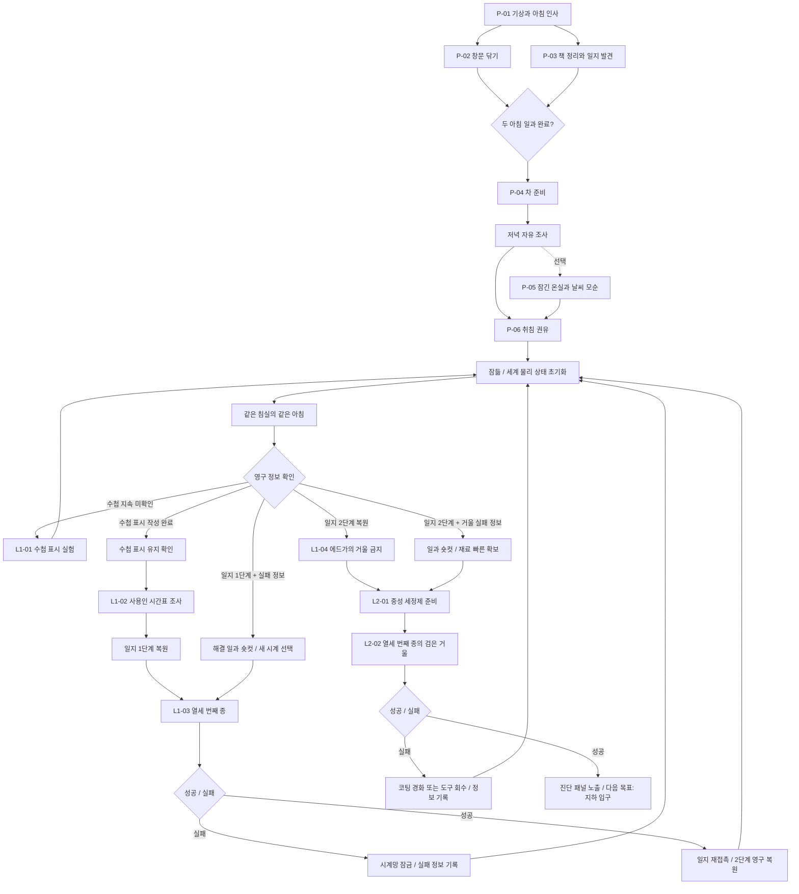
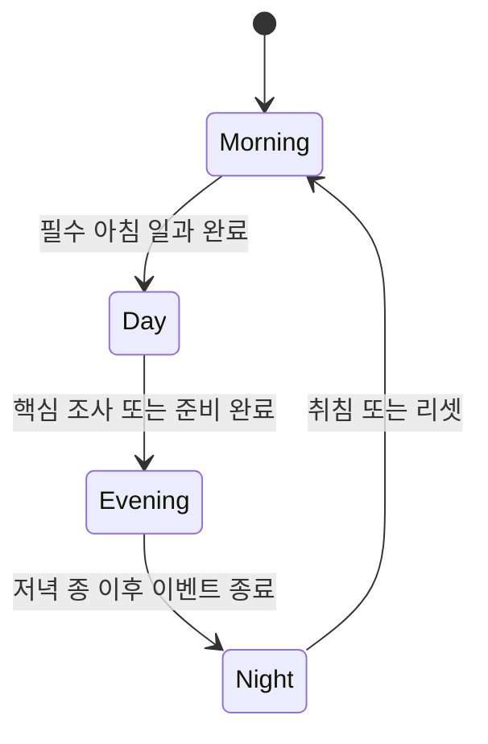

# GGB 버티컬 슬라이스 이벤트 흐름도

## 1. 전체 흐름

위 흐름도의 모든 실패 경로는 중간 체크포인트가 아니라 동일한 `RESET → MORNING`을 거친다. `BSHORT`와 `CSHORT`은 시작 위치를 바꾸는 노드가 아니라, 같은 아침 이후 유지된 지식으로 해결한 내용을 축약하는 과정이다.

`ROUTE`는 아래 우선순위로 가장 진행된 영구 상태 하나만 선택한다.

1. 거울 실패 정보 보유.
2. 일지 2단계 복원.
3. B3 실패 정보 보유.
4. 일지 1단계 복원.
5. 수첩 표시 작성 완료.
6. 수첩 지속 미확인.

## 2. 필수 진행선과 선택 진행선

### 필수 진행선

아래 이벤트는 슬라이스 완료를 위해 반드시 진행한다.

`P-01 → P-02/P-03 → P-04 → P-06 → RESET → L1-01 → RESET → 수첩 확인 → L1-02 → L1-03 → 일지 2단계 → RESET → L1-04 → L2-01 → L2-02`

위 진행선은 성공 기준의 최소 흐름이다. L1-03 또는 L2-02 실패 시 `잠든다 → RESET → MORNING → 영구 정보 기반 숏컷`이 추가된다.

### 선택 진행선

| 이벤트 / 행동 | 진행 필수 여부 | 제공 효과 |
| --- | --- | --- |
| P-05 이리스와 날씨 대화 | 선택 | 바깥 풍경이 가짜일 가능성을 조기 암시 |
| P-04 아버지 질문 선택 | 선택 | 주인공과 아버지 관계의 해석 변화 |
| 첫 리셋 후 에드가에게 직접 질문 | 선택 | 에드가의 회피와 감시 성격 강화 |
| 창밖 새 반복을 수첩에 기록 | 선택 | 반복을 눈치챈 플레이어에게 반응성 제공 |
| 마라에게 거울 얼룩 질문 | 선택 가능하지만 권장 | 중성 세정제 퍼즐의 가장 자연스러운 단서 |

선택 이벤트를 건너뛰어도 메인 진행은 막히지 않는다. 다만 선택 정보를 얻지 않은 플레이어에게는 수첩과 다른 NPC가 대체 단서를 제공한다.

## 3. 이벤트 진입 조건

| 이벤트 | 필수 선행 조건 | 시간대 | 진입 불가 시 피드백 |
| --- | --- | --- | --- |
| P-04 차 준비 | P-02와 P-03 완료 | 낮 | 수첩에 남은 아침 일과 표시 |
| P-06 취침 | P-04 완료 | 밤 | 사용인들이 아직 차 준비가 남았다고 안내 |
| L1-01 수첩 표시 | 첫 리셋 완료 | 자유 | 수첩 여백 강조 |
| L1-02 시간표 조사 | 루프 확신 | 아침~저녁 | 주인공이 먼저 반복을 증명해야 한다고 독백 |
| L1-03 열세 번째 종 | 일지 1단계 복원 | 저녁 | 일지 문장과 시간 기록 페이지 강조 |
| L1-04 거울 금지 | 일지 2단계 복원 | 아침 | 검은 거울 기본 조사만 제공 |
| L2-01 세정제 준비 | 거울 금지 확인 | 아침~낮 | 주인공이 먼저 거울의 얼룩 성질을 알아야 한다고 독백 |
| L2-02 거울 노출 | 중성 세정제, 열세 번째 종 지식 | 저녁 | 부족한 준비 항목을 감각 독백으로 암시 |

## 4. 시간대 전환 흐름

시간대 전환은 자동 타이머가 아니라 이벤트 완료로 발생한다. 전환 직전 플레이어가 놓친 선택 이벤트가 있더라도 메인 진행에 필수적이지 않으면 경고하지 않는다.

## 5. 목표 문장 흐름

수첩에 표시되는 목표는 한 번에 하나의 행동만 요구한다.

| 순서 | 목표 문장 |
| --- | --- |
| 1 | `사용인들의 일을 도와 오늘의 일과를 마치자.` |
| 2 | `어제가 정말 있었는지 확인하자.` |
| 3 | `수첩에 표시를 남기고 다음 아침 확인하자.` |
| 4 | `에드가가 서재를 비우는 때를 찾자.` |
| 5 | `아버지 일지가 말한 틀린 소리를 찾자.` |
| 6 | `열세 번째 종 뒤에 검은 거울을 확인하자.` |
| 7 | `거울의 검은 막을 지울 안전한 용액을 만들자.` |
| 8 | `에드가에게 들키지 않고 거울을 닦자.` |
| 9 | `지하로 이어지는 입구를 찾자.` |

## 6. 소프트락 방지

| 위험 상황 | 방지 처리 |
| --- | --- |
| 준비 단계에서 필수 아이템을 잘못 조합함 | 확정 사용 전에는 재료를 소실하지 않고 오답 반응 제공 |
| 시계망 또는 거울에 확정 행동을 잘못 수행함 | 당일 장치 잠금 또는 재료 소모 후 실패 정보 기록, 잠으로 리셋 |
| 필수 시간대를 지나침 | 다음 시간대로 강제 진행하지 않고 해당 이벤트 완료 전 유지 |
| NPC 단서를 듣지 않음 | 수첩 또는 다른 NPC로 대체 단서 제공 |
| 에드가에게 거울 청소를 들킴 | 도구 회수와 동선 단서 제공, 그날은 재시도 불가 |
| 이미 본 잡일을 반복하기 싫음 | `빠르게 돕기`로 즉시 완료 가능 |
| 목표를 잊음 | 수첩 목표와 관련 기록 강조 |

## 7. 시나리오 수정 시 확인 순서

1. 사건의 원인과 다음 목표가 연결되는지 확인한다.
2. 이벤트 진입 조건이 이전 이벤트에서 반드시 충족되는지 확인한다.
3. 선택 이벤트를 건너뛰어도 필수 단서를 얻을 수 있는지 확인한다.
4. 시간대 전환 때문에 이벤트가 영구적으로 막히지 않는지 확인한다.
5. 루프가 필요한 이유가 정보 부족으로 명확히 제시되는지 확인한다.
6. 이벤트 완료 후 수첩 목표가 즉시 갱신되는지 확인한다.
