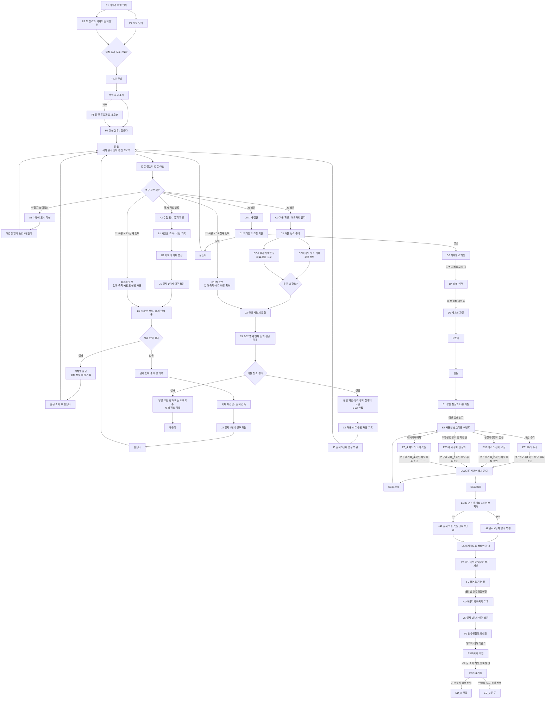

# GGB 신규 이벤트 흐름도 검토 및 보완안

## 1. 이번 수정에서 확정한 루프 원칙

### 1.1 리셋의 발동 조건

- 주인공이 잠들면 세계가 처음 아침 상태로 리셋된다.
- 퍼즐 실패로 그날의 진행이 불가능해져도 즉시 체크포인트로 돌아가지 않는다.
- 플레이어는 남은 정보를 확인한 뒤 잠을 선택하고 같은 아침으로 돌아간다.
- 강제 종료가 필요한 특별한 사건을 제외하면 리셋은 `잠든다`는 세계 안의 행동으로 통일한다.

### 1.2 리셋되는 것

- 시간대와 NPC의 기본 위치.
- 문, 시계 장치, 거울 코팅 등 물리적 상태.
- 일반 아이템과 당일 제조한 세정제.
- 그날 수행한 청소, 차 준비, 장치 조작.
- 실패로 잠기거나 파손된 퍼즐 장치.

### 1.3 리셋되지 않는 것

- 주인공과 플레이어가 알아낸 정보.
- 낙서 수첩의 기록과 해금된 목표.
- 아버지 일지의 복원 단계.
- 사용인의 시간표처럼 이미 확인한 규칙.
- 퍼즐 실패로 얻은 원인 분석과 새 접근법.
- 해결한 일과를 축약할 수 있는 숏컷 권한.

### 1.4 체크포인트 대신 반복 범위를 줄이는 방법

세계는 항상 같은 아침으로 돌아간다. 반복 범위는 시작점을 옮겨 줄이는 것이 아니라, 영구 정보가 같은 하루 안의 행동 가능성을 넓히는 방식으로 줄인다.

| 방식 | 예시 |
| --- | --- |
| 대사 축약 | 이미 들은 인사와 부탁을 한두 문장으로 넘긴다. |
| 일과 숏컷 | 완료한 창문 닦기와 책 정리를 `익숙하게 돕는다`로 빠르게 처리한다. |
| 지식 선행 사용 | 시간표를 다시 조사하지 않고 에드가가 자리를 비우는 시간에 맞춰 행동한다. |
| 준비 자동화 | 제조법을 안다면 재료 확보 후 세정제 조합 과정을 짧게 처리한다. |
| 새 상호작용 | 이전 실패 정보를 이용해 처음부터 다른 시계나 도구를 선택한다. |
| 물리적 우회 | 이전 루프에서 본 구조를 이용해 잠긴 동선이나 기다림을 줄인다. |

숏컷은 메타 메뉴에서 장면을 삭제하기보다 주인공이 이미 아는 사실을 능숙하게 활용하는 연출로 표현한다.

## 2. 검토 대상 흐름의 해석

사용자가 작성한 `B3 → N2 & B3_1`은 성공과 실패가 동시에 발생한다는 의미가 아니라, B3 결과가 성공 또는 실패로 나뉜다는 의도로 해석한다.

Mermaid에서는 의미를 명확히 하기 위해 조건 노드를 사용하는 편이 좋다.


`C4 Re:열세 번째 종`은 별개의 짧은 준비 이벤트가 아니라 게임 기획서 v0.2의 `2-02 열세 번째 종의 검은 거울` 전체 이벤트를 뜻한다.

따라서 C4에는 다음 내용이 포함된다.

1. 열세 번째 종이 울리는 시간까지 거울 접근 준비.
2. 중성 세정제와 천 사용.
3. 검은 코팅 제거.
4. 진단 패널 노출.
5. 냉각 장치 속 주인공 실루엣 확인.
6. 에드가의 말투 붕괴와 제지.

## 3. 현재 구조에서 유지할 장점

- P2와 P3를 병렬로 배치해 프롤로그 일과 순서를 선택할 수 있다.
- 시간표 조사 후 서재에 접근하므로 루프의 정보 활용 목적이 분명하다.
- B3에 성공과 실패를 두어 리셋이 퍼즐 해결 과정에 실제로 개입한다.
- 마라의 기록과 루카의 약품장을 분리해 세정제 퍼즐의 단서 출처가 구체적이다.
- C4가 첫 열세 번째 종에서 얻은 정보를 다시 활용하므로 반복 사건에 새로운 목적이 생긴다.

## 4. 우선 보완해야 할 문제

### [필수 1] `R1`, `R2`, `R3`를 리셋 횟수와 진행 단계 중 무엇으로 사용할지 통일해야 한다

#### 문제

B3 실패 후 R2로 돌아가면 실제로는 세 번째 이상의 리셋이지만 노드 이름은 `두 번째 리셋`이다.

여기서 문제는 같은 아침으로 돌아가는 것 자체가 아니다. 실제 리셋 횟수와 스토리 단계 이름이 섞인다는 점이다.

#### 해결안

세계의 리셋 장소는 하나로 통일하고, A~C를 영구 정보에 따라 열린 진행 단계로 정의한다.

| 구분 | 권장 표기 | 의미 |
| --- | --- | --- |
| 실제 리셋 횟수 | `reset_count` | 플레이 중 잠든 총횟수. 실패에 따라 증가 가능 |
| 진행 단계 | `story_phase = A/B/C` | 현재 영구 정보로 접근 가능한 사건 단계 |
| 리셋 노드 | `RESET_TO_MORNING` | 언제나 동일한 침실 아침으로 돌아감 |

흐름도에서 R1/R2/R3를 유지하고 싶다면 아래처럼 이름을 바꾼다.

- `R1 첫 리셋 / A단계 아침`
- `R2 수첩 확인 리셋 / B단계 아침`
- `R3 일지 2단계 이후 리셋 / C단계 아침`
- B3 실패 후에는 `R2`가 아니라 `아침 리셋 → B단계 숏컷`으로 표기한다.

이것은 체크포인트 복귀가 아니다. 같은 침실에서 같은 아침 인사를 거친 뒤, 유지된 지식으로 이미 해결한 내용을 빠르게 통과하는 구조다.

---

### [필수 2] R2 뒤에 수첩 표시 유지 확인이 필요하다

#### 문제

현재 `A1 수첩 표시 실험 → R2 → B1 시간표 조사`로 바로 이어진다.

리셋 시스템의 첫 학습 보상은 수첩 문장이 다음 아침에도 남아 있음을 직접 확인하는 것이다. 확인 장면이 없으면 플레이어가 왜 루프를 확신했는지 약해진다.

#### 해결안

`A2 수첩 표시 유지 확인`을 추가한다.

```text
A1 수첩에 문장 작성
→ 잠든다
→ 같은 아침으로 완전 리셋
→ A2 수첩 문장 유지 확인
→ B단계 숏컷과 시간표 조사 해금
```

A2 완료 후 유지되는 정보:

- `loop_awareness = confirmed`
- `notebook_persists = true`
- 기록: `나는 어제를 기억한다. 수첩도 기억한다.`

---

### [필수 3] B3 실패는 하루 안에서 돌이킬 수 없는 물리 상태를 만들어야 한다

#### 문제

단순히 잘못된 위치에서 기다렸다는 이유만으로 하루 전체를 리셋하면, 리셋이 필요한 퍼즐이 아니라 재시도 버튼을 잠으로 바꾼 것처럼 느껴질 수 있다.

#### 해결안

B3는 한 번 조작하면 그날에는 되돌릴 수 없는 `시계망 활성화` 퍼즐로 구성한다.

권장 구조:

1. 플레이어는 조사한 시계 중 하나의 봉인핀 또는 추를 해제한다.
2. 해제한 시계가 저녁 종의 신호를 받아 저택 전체 시계망을 한 번 작동시킨다.
3. 한 시계가 작동하면 다른 시계의 장치는 안전 잠금에 들어간다.
4. 잘못된 시계를 선택하면 열두 번의 종만 울리거나 불완전한 금속음이 난다.
5. 봉인핀은 역방향으로 끼울 수 없고 시계망은 그날 다시 작동하지 않는다.
6. 주인공은 실패 원인을 수첩에 기록하고 잠든다.
7. 리셋 후 모든 시계는 원래 상태로 돌아가며, 기록된 정보로 다른 시계를 선택한다.

이 구조의 장점:

- 물리적 변형 때문에 리셋이 필요하다.
- 랜덤성이 없고 결과가 선택한 시계에 따라 결정된다.
- 실패할 때마다 후보가 줄어들거나 작동 원리를 더 이해한다.
- 같은 퍼즐을 반복하지만 새로운 방향으로 접근한다.

#### B3 실패에서 유지되는 정보

- 선택했던 시계.
- 들린 종의 횟수와 음색.
- 잠금이 발생한 조건.
- 다음 루프에서 제외할 선택지.
- 시계망의 물리적 연결에 대한 수첩 스케치.

#### B3 실패에서 초기화되는 상태

- 뽑힌 봉인핀.
- 멈추거나 잠긴 시계.
- 저녁 시간대.
- 획득한 일반 도구.

---

### [필수 4] B3 실패 후에도 반드시 같은 아침부터 시작해야 한다

#### 문제

기존 보완안의 `재시도 리셋 → B3 준비`는 중간 체크포인트에서 재개하는 것처럼 읽힐 수 있었다.

#### 해결안

B3 실패 후 흐름은 아래와 같다.

```text
B3 실패
→ 실패 정보 수첩 기록
→ 남은 상호작용 확인
→ 잠든다
→ 침실의 같은 아침으로 완전 리셋
→ 이미 본 아침 인사 축약
→ 프롤로그 일과 숏컷
→ 시간표 지식으로 서재 접근 과정 단축
→ 일지 1단계는 이미 복원된 상태
→ 시계망 퍼즐의 새 선택지로 B3 재도전
```

반복 범위를 줄이는 핵심은 B3 앞으로 순간 이동하는 것이 아니라, B3까지의 해결된 과정이 짧고 능숙한 행동으로 바뀌는 것이다.

#### 권장 숏컷

| 이전에 완료한 내용 | 다음 루프의 변화 |
| --- | --- |
| 창문 닦기 | 마라에게 `평소처럼 도울게`를 선택하면 짧은 몽타주로 완료 |
| 책 정리 | 책 위치를 알고 있어 한 번의 상호작용으로 정리 |
| 차 준비 | 제조 순서를 알고 있어 루카의 확인 대사 후 즉시 완료 |
| 시간표 조사 | NPC를 다시 추적하지 않고 적절한 시간에 서재 이동 가능 |
| 일지 1단계 복원 | 일지 문장이 처음부터 보이며 재접촉 불필요 |
| 시계 조사 | 조사 완료 시계의 상세 설명을 수첩에서 바로 확인 |

숏컷 사용 여부는 플레이어가 선택할 수 있다. 변경된 대사나 새 이상 현상이 있는 작업은 `무언가 달라졌다` 표시로 직접 플레이를 유도한다.

---

### [필수 5] N2의 복원 방식과 리셋 유지 상태를 명확히 해야 한다

#### 문제

B3 성공 후 N2 일지 2단계가 어떻게 열리는지 정의되지 않았다.

#### 해결안

B3 성공 시 열세 번째 종의 파형 또는 시계망 오류가 일지에 동기화되는 구조를 권장한다.

1. 올바른 시계망을 작동시키면 열세 번째 종이 울린다.
2. 주인공의 수첩 또는 일지 표식이 같은 진동에 반응한다.
3. 플레이어가 일지를 다시 접촉하면 N2가 열린다.
4. N2에서 `열세 번째 종이 울릴 때 검은 거울의 코팅을 제거하라`는 지시를 얻는다.
5. N2는 영구 복원되어 이후 모든 리셋에서 유지된다.

일지가 서재에 있는 물리 오브젝트라면 B3 이후 서재 재접근 행동을 흐름도에 표시한다.

```text
B3 성공
→ 열세 번째 종 파형 기록
→ 서재 재접근
→ 일지 접촉
→ N2 영구 복원
```

---

### [필수 6] R3 뒤에 거울 금지 사건을 배치하는 편이 좋다

#### 문제

현재 R3에서 바로 거울 청소 준비로 이어진다. 이 경우 에드가가 거울의 정체를 알고 있으며 숨긴다는 감정적 증거가 부족하다.

#### 해결안

`C0 거울 확인과 에드가의 금지`를 추가한다.

```text
N2 영구 복원
→ 잠든다
→ 같은 아침으로 리셋
→ N2의 지시를 기억한 채 검은 거울 조사
→ 에드가가 처음으로 직접 금지
→ C1 거울 청소 준비
```

C0의 역할:

- 주인공이 거울을 닦을 감정적 이유 강화.
- 에드가가 보호자이면서 감시자라는 사실 확인.
- 마라의 청소 기록을 조사할 자연스러운 명분 제공.
- C4에서 에드가에게 들킬 위험을 미리 설정.

---

### [필수 7] C4는 `2-02 열세 번째 종의 검은 거울` 전체 이벤트로 명시해야 한다

#### 반영

`Re:열세 번째 종`은 다음 명칭으로 바꾸는 것이 좋다.

`C4 2-02 열세 번째 종의 검은 거울`

C4의 내부 단계:

| 단계 | 내용 |
| --- | --- |
| C4-1 | 해결한 일과와 시간표 지식을 이용해 저녁까지 준비 |
| C4-2 | 거울 앞에서 열세 번째 종 재현 |
| C4-3 | 중성 세정제와 천 사용 |
| C4-4 | 검은 코팅 제거 |
| C4-5 | 진단 패널과 냉각 장치 실루엣 노출 |
| C4-6 | 에드가의 역할극 붕괴와 제지 |

C4는 단순히 종을 다시 듣는 이벤트가 아니다. 첫 B3에서 얻은 지식, C2와 C2-1에서 얻은 정보, C3의 물리적 준비를 결합하는 슬라이스 결산 이벤트다.

## 5. C4에 리셋을 사용하는 실패 구조

C4 역시 하루 안에 돌이키기 어려운 물리 상태를 활용할 수 있다.

### 실패안 A: 잘못된 시간에 세정제 사용

- 열세 번째 종 전에 용액을 바르면 코팅이 용액을 흡수해 굳는다.
- 같은 날에는 코팅을 다시 닦을 수 없다.
- 주인공은 코팅이 종소리에 맞춰 느슨해진다는 사실을 기록한다.
- 잠들어 리셋하면 코팅과 재료가 초기화된다.
- 일지 지시와 실패 정보는 유지된다.

### 실패안 B: 조합은 맞지만 도포 순서가 틀림

- 용액을 천에 묻히지 않고 직접 부으면 코팅 표면에 막이 생긴다.
- 남은 용액으로는 재시도할 수 없다.
- 다음 루프에는 `천에 소량 묻혀 선을 따라 닦는다`는 새 상호작용이 열린다.

### 실패안 C: 에드가의 동선을 고려하지 않음

- 에드가가 거울 청소를 발견해 천과 용액을 회수한다.
- 물리적 도구가 사라져 그날에는 재시도할 수 없다.
- 플레이어는 에드가가 자리를 비우는 짧은 시간을 기록한다.
- 다음 루프에는 시간표 지식으로 거울 접근 숏컷이 열린다.

### 권장 조합

첫 실패 가능성은 A 또는 C 중 하나를 중심으로 사용한다. 실패 원인을 너무 많이 두면 동일 이벤트를 반복하는 횟수가 늘어난다.

- 퍼즐 중심이면 A를 사용한다.
- 인물 긴장 중심이면 C를 사용한다.

랜덤 순찰이나 무작위 재료 배치는 사용하지 않는다.

## 6. 리셋을 요구하는 퍼즐의 기준

모든 퍼즐에 리셋을 붙이지 않는다. 아래 조건 중 3개 이상을 만족하는 퍼즐에만 사용한다.

1. 플레이어 행동이 물리적 상태를 되돌리기 어렵게 바꾼다.
2. 실패 결과를 직접 경험해야만 얻을 수 있는 정보가 있다.
3. 다음 루프에서 유지 정보가 새로운 선택지 또는 해법을 연다.
4. 같은 퍼즐을 반복해도 접근 방식이 달라진다.
5. 리셋 후 숏컷으로 이미 해결한 구간을 빠르게 통과할 수 있다.
6. 실패가 주인공의 심리나 세계관을 드러낸다.

### 리셋을 사용하지 않을 퍼즐

- 단순 위치 맞추기.
- 횟수 제한 없이 즉시 원상 복구할 수 있는 조합.
- 오답을 눌러도 아무 변화 없이 다시 누를 수 있는 장치.
- 정보가 부족하지 않고 시행착오만 요구하는 퍼즐.

### 리셋을 사용할 수 있는 퍼즐

- 한 번 절단하거나 결합하면 그날에는 되돌릴 수 없는 배선.
- 한 번 작동하면 안전 잠금에 들어가는 시계망.
- 도포 후 굳어 버리는 거울 코팅.
- 한 사람에게 사용하면 다른 대상에게 사용할 수 없는 제한 자원.
- 특정 시간대의 행동으로 NPC 동선이 영구 변경되는 하루 단위 사건.

## 7. 랜덤성과 로직 변형 원칙

- NPC 시간표는 고정한다.
- 시계 정답과 재료 위치는 고정한다.
- 실패 결과는 선택한 행동에 따라 결정되며 무작위로 바뀌지 않는다.
- 리셋 후 새로 열리는 경로는 영구 플래그에 의해 결정한다.
- 같은 사건의 대사 변형은 가능하지만 핵심 단서의 위치와 의미는 바꾸지 않는다.
- 랜덤성은 분위기용 작은 오브젝트 반응에만 제한적으로 사용한다.

플레이어가 실패했을 때 `운이 나빴다`가 아니라 `이번에는 무엇을 알게 되었는가`를 설명할 수 있어야 한다.

## 8. 권장 수정 흐름도

아래 흐름은 모든 리셋이 같은 아침으로 돌아간다는 원칙과, 유지 정보로 반복을 줄이는 방식을 반영한 안이다.



## 9. 숏컷 설계 세부안

### 아침 시작은 항상 동일하게 유지

- 같은 침실.
- 같은 커튼 연출.
- 같은 에드가의 첫 인사.
- 같은 기본 시간대.

대신 반복 횟수에 따라 다음 기능을 제공한다.

| 반복 상태 | 변화 |
| --- | --- |
| 첫 반복 | 모든 장면을 직접 확인 |
| 이미 들은 인사 | 대사 넘기기 또는 짧은 변형 대사 |
| 해결한 일과 존재 | 일과별 `익숙하게 처리한다` 선택 |
| 새 이상 현상 존재 | 숏컷 옆에 `무언가 다르다` 표시 |
| 영구 정보로 선행 가능 | 필요한 시간대로 진행할 행동을 즉시 선택 |

### 숏컷 사용 시에도 세계 안의 행동은 남긴다

나쁜 예:

- 메뉴에서 `B3부터 시작`.
- 리셋 직후 서쪽 복도로 순간 이동.
- 실패 직전 자동 저장 불러오기.

권장 예:

- 주인공이 창문과 책을 능숙하게 정리하는 짧은 몽타주.
- 루카에게 필요한 차 재료를 먼저 건네 대화를 축약.
- 에드가의 시간표를 알고 있어 조사 없이 저녁 서재 접근.
- 수첩에서 이전 실패 스케치를 선택해 다른 시계 봉인핀을 바로 확인.

## 10. 상태 설계 보완

물리 아이템과 영구 지식을 분리해야 한다.

| 상태 | 리셋 여부 |
| --- | --- |
| `neutral_cleaner_item` | 초기화 |
| `neutral_cleaner_formula_known` | 유지 |
| `clock_pin_removed` | 초기화 |
| `tested_clock_ids` | 유지 |
| `clock_network_rule_known` | 유지 |
| `mirror_coating_hardened` | 초기화 |
| `mirror_timing_rule_known` | 유지 |
| `servant_schedule_known` | 유지 |
| `journal_stage` | 유지 |
| `shortcut_chore_window` | 유지 |
| `shortcut_chore_books` | 유지 |
| `shortcut_chore_tea` | 유지 |

`이벤트 완료`가 유지된다는 것은 세계의 물리 상태가 유지된다는 뜻이 아니다. 해당 사건을 통해 얻은 지식과 숏컷 권한이 유지된다는 뜻으로 사용한다.

## 11. 표기 보완

### N 접두어

현재 N은 노트 개방으로 정의되어 있으나 아버지 일지와 주인공 수첩이 혼동될 수 있다.

| 접두어 | 대상 |
| --- | --- |
| `NB` | 주인공의 낙서 수첩 기록 |
| `J` | 아버지 일지 복원 |

권장 변경:

- `N1 → J1 일지 1단계 복원`
- `N2 → J2 일지 2단계 복원`
- 시간표 기록은 `NB1` 또는 B1의 결과 플래그로 표기.

### P2와 P3

두 작업은 `선택`이 아니라 `순서 자유인 병렬 필수 작업`인지 명시한다. 둘 다 완료해야 P4가 열린다면 합류 조건 노드를 사용한다.

### P5와 P6

P5가 선택 이벤트라면 P4 직후 P6가 자동 실행되지 않도록 `저녁 자유 조사` 구간을 둔다. 플레이어가 침실로 돌아가거나 저녁 조사를 끝낼 때 P6가 시작된다.

## 12. 최종 권고

이번 원칙을 반영했을 때 반드시 수정할 내용은 다음과 같다.

1. 모든 실패 리셋은 같은 침실의 같은 아침으로 돌아간다.
2. B3 실패 후 중간 시작점으로 복귀하지 않는다.
3. 반복 축소는 일과 숏컷, 영구 일지, 시간표 지식, 새 선택지로 해결한다.
4. B3는 한 번 작동하면 그날 잠기는 시계망 퍼즐로 만들어 리셋의 물리적 필요성을 확보한다.
5. B3 성공/실패는 조건 분기로 명시한다.
6. C4는 v0.2의 `2-02 열세 번째 종의 검은 거울` 전체 이벤트로 취급한다.
7. C4 실패도 코팅 경화나 도구 회수처럼 당일에 돌이킬 수 없는 상태로 설계할 수 있다.
8. 물리 아이템과 영구 지식 플래그를 분리한다.
9. 랜덤성이 아니라 이전 루프에서 얻은 정보가 새 가능성을 열도록 한다.

