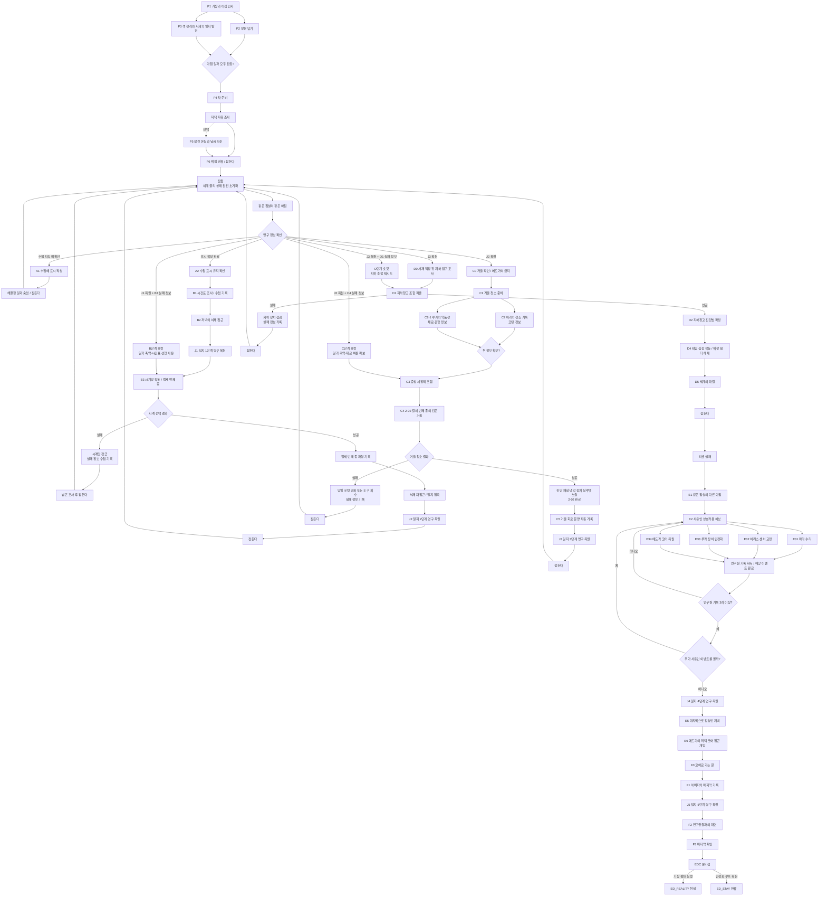

# GGB 전체 이벤트 흐름도 검토 및 보완안

## 1. 검토 범위

이번 문서는 확장된 전체 흐름도, 즉 프롤로그부터 최종 엔딩 분기까지의 구조를 검토한다.

핵심 전제는 아래와 같다.

- 잠들면 세계의 물리 상태가 초기화된다.
- 리셋은 체크포인트가 아니라 같은 침실의 같은 아침으로 돌아가는 구조다.
- 일지, 수첩, 지식, 실패 정보, 숏컷 권한은 유지된다.
- D5 `세계의 파열` 이후에는 정상 리셋이 실패한다.
- 최종 엔딩은 현실 이탈과 잔류 두 갈래다.

## 2. 전체 총평

확장 흐름은 큰 구조가 잘 잡혀 있다.

- C4 이후 거울 회로 문양과 일지 3단계가 지하창고 진입으로 이어진다.
- D5 세계 파열 이후 `같은 침실의 다른 아침`으로 전환되며 3장 구조가 시작된다.
- E구간에서 사용인별 상호작용과 연구원 기록을 수집하는 구조가 명확하다.
- F구간에서 아버지의 마지막 기록, 연구원들과의 대면, 최종 선택으로 이어지는 결말 흐름이 잡혀 있다.

다만 몇몇 노드가 현재 상태로는 진행이 끊기거나, 기존 루프 원칙과 충돌하거나, 플레이어에게 불공정하게 느껴질 수 있다.

## 3. 반드시 수정해야 할 문제

### [필수 1] C4 실패 후 RESET 연결이 누락되어 있다

#### 문제

현재 흐름:

```text
CD 실패 → CF 당일 코팅 경화 또는 도구 회수 → CS 잠든다
```

`CS`가 `RESET`으로 연결되지 않는다. 따라서 C4 실패 후 흐름이 끊긴다.

#### 해결안

아래 연결을 추가한다.

```text
CS → RESET
```

그리고 ROUTE에는 아래 조건이 있어야 한다.

```text
J2 복원 + C4 실패 정보 → C단계 숏컷 → C3 또는 C4 재도전
```

단, 시작 위치는 C3나 C4가 아니다. 같은 아침에서 시작한 뒤 일과와 재료 확보를 숏컷으로 줄여 C3 또는 C4에 빠르게 도달하는 구조다.

---

### [필수 2] D4 `태엽 심잠` 오탈자와 `확정 실패 이벤트` 표현이 위험하다

#### 문제

현재 노드:

```text
D4 태엽 심잠
D4 -- 확정 실패 이벤트 --> D5 세계의 파열
```

문제점:

- `태엽 심잠`은 `태엽 심장`의 오탈자로 보인다.
- `확정 실패 이벤트`라고 쓰면 플레이어가 반드시 실패하도록 강요받는다는 인상이 강하다.
- 플레이어가 퍼즐을 틀려서 세계가 깨지는지, 제대로 작동시켰기 때문에 숨겨진 진실이 드러나는지 불분명하다.

#### 해결안

D4는 실패가 아니라 `거짓 복구의 성공`으로 설계하는 것이 좋다.

권장 명칭:

```text
D4 태엽 심장 작동 / 위장 필터 해제
```

권장 인과:

1. 주인공은 저택을 복구하려고 태엽 심장을 작동한다.
2. 장치는 실제로 고장 복구 장치처럼 보인다.
3. 하지만 아버지의 백도어가 작동하며 고딕 위장 필터가 해제된다.
4. 플레이어 입장에서는 퍼즐을 성공했지만, 결과는 세계의 파열이다.

이렇게 하면 플레이어가 불공정한 강제 실패를 당한 느낌보다, 자신이 진실을 열어버렸다는 책임감을 느낄 수 있다.

---

### [필수 3] D2의 `지역-지하창고 해금`은 물리 영구 해금처럼 보인다

#### 문제

리셋 원칙상 문, 장치, 물리 상태는 잠들면 초기화된다. 그런데 D2에서 `지역-지하창고 해금`이라고 하면 지하창고 문이 영구적으로 열린 것처럼 보인다.

#### 해결안

해금 대상을 물리 상태가 아니라 지식과 숏컷 권한으로 정의한다.

권장 명칭:

```text
D2 지하창고 진입법 확정 / 지하창고 접근 숏컷 해금
```

의미:

- 지하창고 문은 다음 리셋 때 다시 닫힌다.
- 하지만 조합법과 진입 절차는 유지된다.
- 이후 같은 아침에서 시작해도 주인공은 빠르게 지하창고를 다시 열 수 있다.

---

### [필수 4] D1 실패가 어떤 방식으로 리셋을 요구하는지 부족하다

#### 문제

`D1 지하창고 조합 퍼즐`이 실패하면 `D3 잠든다 → RESET`으로 간다.

하지만 실패 원인이 단순 조합 오답이면 리셋까지 요구할 이유가 약하다. 앞서 정한 원칙상 리셋은 되돌리기 어려운 물리 상태가 생겼을 때 쓰는 것이 좋다.

#### 해결안

D1 실패를 하루 단위 잠금으로 만든다.

예시:

- 잘못된 조합을 입력하면 서재 책장 뒤의 승강기 기어가 역방향으로 감긴다.
- 기어는 그날 다시 풀 수 없다.
- 벽 안쪽에서 지하창고 잠금음이 들리고, 수첩에 틀린 조합의 흔적이 남는다.
- 잠들면 물리 장치는 초기화되지만, 틀린 조합과 새 단서는 유지된다.

유지 정보:

- 실패한 조합.
- 반응한 문양.
- 다음 루프에서 제외할 선택지.
- 지하창고 입구가 서재와 연결된다는 확신.

---

### [필수 5] D5 이후 리셋 규칙이 별도 상태로 분리되어야 한다

#### 문제

D5 `세계의 파열` 이후 흐름은 아래와 같다.

```text
D5 → D6 잠든다 → E0 잠듦 → E1 같은 침실의 다른 아침
```

이 구간은 기존 `RESET → MORNING`과 다르다. 하지만 흐름도에서는 `잠든다`가 두 번 반복되고, 정상 리셋과 실패한 리셋의 차이가 명확하지 않다.

#### 해결안

D5 이후에는 별도 노드를 사용한다.

```text
D5 세계의 파열
→ D6 잠든다
→ BROKEN_RESET 리셋 실패
→ E1 같은 침실의 다른 아침
```

의미:

- 주인공은 평소처럼 잠든다.
- 하지만 고딕 저택이 완전히 복구되지 않는다.
- 같은 침실에서 깨지만 방 구조, 소리, 사용인 반응이 달라져 있다.
- 이후에는 정상 루프가 더 이상 안전장치로 작동하지 않는다.

`E0 잠듦`은 D6와 기능이 중복되므로 삭제해도 된다.

---

### [필수 6] E구간의 연구원 기록 3개 조건이 현재는 게이트가 아니다

#### 문제

현재 흐름:

```text
EC32 NO → EC41 연구원 기록 3개 이상 획득
EC41 yes → J4
EC41 no → J41 일지 최종 복원 단계 3단계
J4 & J41 → E5 마지막으로 정상인 저녁
```

이 구조에서는 연구원 기록이 3개 미만이어도 결국 E5로 진행된다. 그러면 `연구원 기록 3개 이상 획득` 조건의 의미가 약해진다.

#### 해결안 A: 3개 이상을 필수 게이트로 사용

권장안이다.

```text
연구원 기록 3개 미만 → E2로 돌아가 남은 사용인 이벤트 진행
연구원 기록 3개 이상 → J4 일지 4단계 복원 → E5
```

장점:

- 사용인 상호작용 파트의 서사적 무게가 유지된다.
- 주인공이 연구원들의 원망에 공감해야 코어 접근이 열린다는 구조가 명확하다.
- E5 저녁 식사의 감정 보상이 충분해진다.

#### 해결안 B: 기록 3개 미만도 진행 가능하게 둔다

이 경우 `J41`은 최종 복원 단계가 아니라 `불완전 복원 상태`로 명명해야 한다.

예시:

```text
J4_FULL: 일지 4단계 완전 복원
J4_PARTIAL: 일지 4단계 불완전 복원
```

그리고 E5와 F2 대화에서 정보 부족의 대가를 반영해야 한다.

다만 현재 기획 방향에서는 해결안 A를 추천한다.

---

### [필수 7] `해당 루트 봉인` 표현은 완료 처리로 바꾸는 편이 좋다

#### 문제

E31~E34에서 각 사용인 루트가 끝나면 `해당 루트 봉인`이라고 되어 있다.

봉인은 플레이어가 선택지를 잃었다는 부정적 느낌이 강하다. 또한 이 게임의 반복 철학은 길을 막는 것보다, 이미 이해한 것을 숏컷으로 전환하는 쪽이 더 잘 맞는다.

#### 해결안

권장 표현:

```text
해당 사용인 이벤트 완료 / 재진입 시 짧은 후속 대화
```

상태:

- 완료한 사용인 이벤트는 다시 전체 퍼즐을 반복하지 않는다.
- 해당 사용인은 E2 허브에서 짧은 후속 대사나 힌트 제공자로 남는다.
- 연구원 기록과 수리 상태는 유지된다.

---

### [필수 8] 엔딩 A/B 명칭이 기존 문서와 충돌한다

#### 문제

이전 기획에서는 대체로 아래와 같이 정리되어 있었다.

- 엔딩 A: 잔류
- 엔딩 B: 현실 이탈

새 흐름도에서는 아래처럼 되어 있다.

- `ED_A 현실`
- `ED_B 잔류`

이 명칭 충돌은 이후 문서와 대사, 파일명, 분기 플래그에서 혼란을 만든다.

#### 해결안

A/B 대신 의미 기반 ID를 쓰는 것을 추천한다.

| 권장 ID | 의미 |
| --- | --- |
| `ED_REALITY` | 기상 절차 실행 / 현실 이탈 |
| `ED_STAY` | 안정화 루프 복원 / 시뮬레이션 잔류 |

플레이어에게 표시되는 이름은 나중에 정하고, 내부 기획과 데이터에서는 의미 기반 ID를 사용한다.

## 4. 추가 보완 사항

### [중요 1] ROUTE 조건이 많아졌으므로 우선순위가 필요하다

현재 ROUTE에는 아래 조건들이 들어간다.

- 수첩 지속 미확인.
- 표시 작성 완료.
- J1 복원 + B3 실패 정보.
- J2 복원.
- J2 복원 + C4 실패 정보.
- J3 복원.

확장 흐름에서는 여기에 D1 실패 정보, 지하창고 접근 숏컷, 세계 파열 이후 상태 등이 추가된다.

권장 우선순위:

| 우선순위 | 조건 | 이동 |
| --- | --- | --- |
| 1 | 세계 파열 이후 | ROUTE를 사용하지 않고 E1로 이동 |
| 2 | J3 복원 + D1 실패 정보 | D단계 숏컷 후 지하창고 재시도 |
| 3 | J3 복원 | D0 서재 / 지하창고 접근 |
| 4 | J2 복원 + C4 실패 정보 | C단계 숏컷 후 거울 재시도 |
| 5 | J2 복원 | C0 거울 금지 |
| 6 | J1 복원 + B3 실패 정보 | B단계 숏컷 후 열세 번째 종 재시도 |
| 7 | J1 복원 | B3 준비 |
| 8 | 수첩 표시 확인 | B1 시간표 조사 |
| 9 | 수첩 표시 작성 완료 | A2 표시 유지 확인 |
| 10 | 없음 | A1 수첩 표시 실험 |

---

### [중요 2] D0 명칭은 서재 접근보다 목적을 드러내는 편이 좋다

`D0 서재 접근`만으로는 왜 다시 서재에 가는지 약하다.

권장 명칭:

```text
D0 서재의 지하창고 단서 재확인
```

또는

```text
D0 서재 책장 뒤 지하 입구 조사
```

---

### [중요 3] E2 사용인 상호작용은 순서 자유 허브로 명시한다

E2에서 네 사용인 이벤트로 갈라지는 구조는 좋다. 다만 E2가 단순 이벤트인지 허브인지 명확히 해야 한다.

권장 정의:

```text
E2 사용인 상호작용 허브
```

규칙:

- 플레이어는 네 사용인 중 원하는 순서로 접근한다.
- 완료한 사용인은 전체 퍼즐을 반복하지 않는다.
- 최소 3개의 연구원 기록이 필요하다.
- 4개를 모두 모으면 마지막 저녁과 코어 대면에서 대사 보상이 강화된다.

---

### [중요 4] EC31 / EC32 / EC41의 명칭이 의미를 드러내지 못한다

현재 노드:

```text
EC31 yes
EC32 NO
EC33 연구원 기록 3개 이상 획득
```

문제:

- 무엇에 대한 yes/no인지 알 수 없다.
- 노드 ID는 EC41인데 라벨은 EC33이다.
- 조건의 의미가 흐름도만 봐서는 불분명하다.

권장 변경:

```text
ECHECK 남은 사용인 이벤트가 있는가?
EC_MORE 계속 진행
EC_STOP 기록 수 확인
EGATE 연구원 기록 3개 이상인가?
```

---

### [중요 5] F0의 깨진 방 연결 퍼즐은 실패 처리가 필요하다

F0는 최종부 퍼즐이므로 실패가 플레이어를 멀리 되돌리면 안 된다. D5 이후에는 정상 리셋이 실패한 상태이기 때문이다.

권장 처리:

- F0 퍼즐은 로컬 실패와 즉시 재조작 중심으로 둔다.
- 오답은 방 연결이 더 불안정해지는 연출만 제공한다.
- 일정 횟수 이상 실패하면 연구원 중 한 명이 힌트를 준다.
- 잠으로 리셋하는 구조를 다시 쓰지 않는다.

---

### [중요 6] J4와 J5의 역할을 분리해야 한다

현재 J4는 연구원 기록 3개 이상, J5는 아버지의 마지막 기록이다. 역할이 좋지만 문서에서 차이를 분명히 해야 한다.

| 단계 | 기능 |
| --- | --- |
| J3 | 지하창고와 태엽 심장으로 이어지는 구조 단서 |
| J4 | 연구원들의 원망과 업로드 진실을 이해한 뒤 열리는 코어 접근 단서 |
| J5 | 아버지가 최종 선택을 대신 정하지 않는다는 마지막 기록 |

J5는 최종 선택의 답을 주면 안 된다. 오히려 아버지가 자신의 잘못과 한계를 인정하는 기록이어야 한다.

## 5. 보완 흐름도 제안

아래는 사용자가 작성한 흐름을 최대한 유지하면서 끊긴 연결과 게이트 문제를 보완한 버전이다.



## 6. E구간 기록 수집 구조 권장안

### 최소 진행 조건

- 연구원 기록 3개 이상.
- 사용인 수리 또는 안정화 이벤트 3개 이상 완료.
- 에드가 이벤트는 코어 접근과 연결되므로 필수에 가깝게 두는 것을 권장한다.

### 4명 모두 완료 보상

- E5 저녁 식사 대사 확장.
- F2 연구원 대면에서 더 솔직한 대사.
- 최종 선택 직전 각 사용인의 짧은 한마디 추가.

### 3명만 완료 시

- 진행은 가능하지만 한 명의 침묵 또는 미완성 감정이 남는다.
- 최종 선택을 막지는 않는다.
- 단, 핵심 진실 이해에 필요한 최소 정보는 확보되어야 한다.

## 7. 최종 결론

현재 확장 흐름에서 가장 먼저 반영할 수정은 아래 순서다.

1. `CS → RESET` 누락 연결 추가.
2. `태엽 심잠`을 `태엽 심장`으로 수정.
3. D4를 `확정 실패`가 아니라 `위장 필터 해제`로 재정의.
4. D2의 지하창고 해금을 물리 영구 해금이 아니라 진입법·숏컷 해금으로 수정.
5. D5 이후 정상 RESET과 분리되는 `BROKEN_RESET` 상태 추가.
6. 연구원 기록 3개 미만일 때 E5로 바로 가지 않도록 게이트 수정.
7. `해당 루트 봉인`을 `이벤트 완료 / 후속 대화 전환`으로 수정.
8. 엔딩 내부 ID를 `ED_REALITY`, `ED_STAY`로 바꿔 A/B 명칭 충돌 제거.

