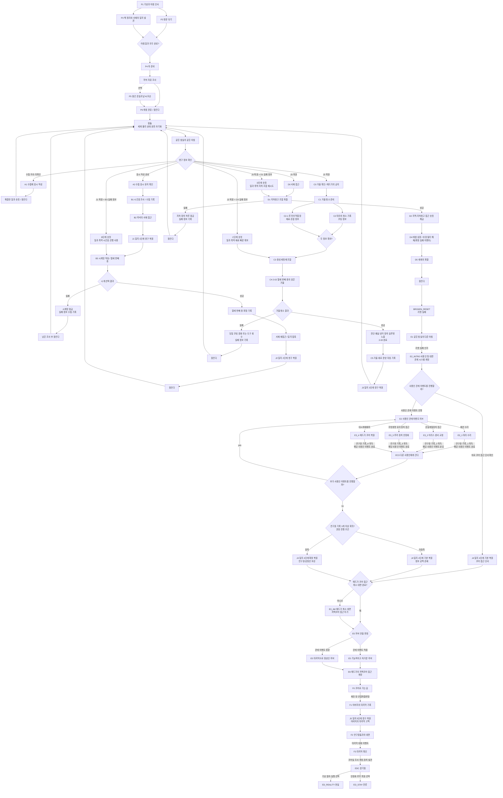

# GGB 전체 이벤트 흐름도 재구성안

## 1. 문서 목적

이 문서는 `09_전체이벤트흐름도_검토및보완안.md`에서 제기된 보완 사항 중 채택된 내용을 반영해 전체 이벤트 흐름도를 재구성한 문서다.

이번 작업에서는 기획서 v0.3을 작성하지 않는다. 아래 내용은 추후 v0.3 작성 시 반영할 기준 흐름도와 규칙 정리로 사용한다.

## 2. 이번 재구성에서 확정한 수정 사항

| 항목 | 처리 |
| --- | --- |
| C4 실패 후 연결 누락 | `CS 잠든다 → RESET` 연결 추가 |
| D4 오탈자 | `태엽 심잠`을 `태엽 심장`으로 수정 |
| D4 표현 | `위장 필터 해제(확정 실패 이벤트)`로 변경 |
| D2 명칭 | `지역-지하창고 접근 숏컷 해금`으로 변경 |
| D1 실패 처리 | 하루 단위 물리 잠금과 실패 정보 기록으로 수정 |
| D5 이후 리셋 | 정상 `RESET`이 아닌 `BROKEN_RESET` 상태로 분리 |
| E구간 기록 조건 | 연구원 기록 3개 이상은 권장 진행 조건으로 유지하고, 메인 진행 필수 게이트에서는 제거 |
| E31~E33 표기 | `E3_1`, `E3_2`, `E3_3`으로 수정 |
| 해당 루트 봉인 | `해당 사용인 이벤트 완료`로 변경 |
| 엔딩 ID | `ED_REALITY`, `ED_STAY`로 변경 |
| J4/J5 역할 | J4는 코어 접근 단서, J5는 아버지의 마지막 기록으로 분리 |

## 3. 전체 이벤트 흐름도

아래 흐름도는 사용자가 작성한 구조를 유지하되, 지정한 수정 사항을 중심으로 재구성한 버전이다.

## 4. ROUTE 권장 우선순위

`ROUTE`는 같은 아침에서 깨어난 뒤 영구 정보를 기준으로 현재 진입 가능한 진행 단계를 판정하는 노드다.

우선순위는 아래 순서를 따른다. 위에 있는 조건일수록 먼저 판정한다.

| 우선순위 | 조건 | 이동 |
| --- | --- | --- |
| 1 | `BROKEN_RESET` 이후 | `ROUTE`를 거치지 않고 `E1 같은 침실의 다른 아침`으로 이동 |
| 2 | `J3 복원 + D1 실패 정보` | `DSHORT D단계 숏컷`을 통해 지하창고 조합 재시도 |
| 3 | `J3 복원` | `D0 서재 접근` |
| 4 | `J2 복원 + C4 실패 정보` | `CSHORT C단계 숏컷`을 통해 거울 청소 재시도 |
| 5 | `J2 복원` | `C0 거울 확인 / 에드가의 금지` |
| 6 | `J1 복원 + B3 실패 정보` | `BSHORT B단계 숏컷`을 통해 열세 번째 종 재시도 |
| 7 | `J1 복원` | `B3 시계망 작동 / 열세 번째 종` |
| 8 | `표시 작성 완료` | `A2 수첩 표시 유지 확인` |
| 9 | `수첩 지속 미확인` | `A1 수첩에 표시 작성` |
| 10 | 영구 정보 없음 | 프롤로그 일과 유지 |

## 5. 채택한 규칙과 정의

### 리셋 기본 규칙

- 잠들면 물리 상태는 같은 침실의 같은 아침으로 돌아간다.
- 문, 장치, 도구 위치, 사용인 배치, 당일 손상 상태는 초기화된다.
- 수첩, 일지, 실패 정보, 조합 배제 정보, 숏컷 권한은 유지된다.
- 세이브포인트나 중간 시작점은 사용하지 않는다.
- 반복 범위는 시작점을 바꾸는 방식이 아니라, 영구 정보와 숏컷으로 줄인다.

### D1 실패 규칙

`D1 지하창고 조합 퍼즐`의 실패는 단순 오답이 아니라 하루 단위 물리 잠금으로 처리한다.

- 잘못된 조합을 입력하면 지하 장치가 역방향으로 감긴다.
- 장치는 그날 다시 조작할 수 없는 상태가 된다.
- 실패한 조합, 반응한 문양, 다음 루프에서 제외할 선택지가 수첩에 남는다.
- 잠들면 장치의 물리 잠금은 초기화되지만 실패 정보는 유지된다.

### D4 위장 필터 해제 규칙

`D4 태엽 심장 / 위장 필터 해제(확정 실패 이벤트)`는 운영진 관점에서는 확정 실패 이벤트지만, 플레이어에게는 실패로 직접 전달하지 않는다.

- 플레이어는 태엽 심장을 작동시키는 데 성공한다.
- 장치는 저택을 복구하는 듯 보인다.
- 실제로는 고딕풍 위장 필터가 해제되고 세계의 파열이 시작된다.
- 이 사건은 새로운 공간과 3챕터로 이어지는 바탕이 된다.

### D2 숏컷 해금 규칙

`D2 지역-지하창고 접근 숏컷 해금`은 지하창고가 물리적으로 영구 개방된다는 뜻이 아니다.

- 다음 리셋 후에도 지하창고 문은 닫혀 있다.
- 주인공은 진입법을 알고 있으므로 일과와 조사 과정을 축약해 빠르게 접근할 수 있다.
- 해금되는 것은 지역 자체가 아니라 접근 절차와 플레이어의 가능성이다.

### D5 이후 리셋 실패 규칙

`D5 세계의 파열` 이후에는 기존 리셋이 깨진다.

- 주인공은 평소처럼 잠든다.
- 하지만 세계는 완전히 초기화되지 않는다.
- 같은 침실에서 깨어나지만 구조, 소리, 사용인의 반응, 일부 오브젝트 상태가 달라져 있다.
- 이 상태는 `BROKEN_RESET`으로 분리한다.

## 6. E구간 사용인 이벤트 상태

E구간은 순서 자유 허브로 운용한다.

- 플레이어는 `마라`, `이리스`, `루카`, `에드가` 이벤트를 원하는 순서로 진행할 수 있다.
- 각 이벤트는 완료 시 `연구원 기록`을 1개 제공한다.
- 완료된 이벤트는 다시 전체 퍼즐을 반복하지 않는다.
- 완료된 사용인은 `해당 사용인 이벤트 완료` 상태가 되며, 재진입 시 짧은 후속 대사 또는 힌트를 제공한다.
- 연구원 기록 3개 이상은 필수 조건이 아니라 권장 진행 조건이다.
- 연구원 기록이 3개 미만이어도 메인 진행은 가능하지만 `J4`, `E5`, `F2`, 엔딩 대사에서 정보 공백과 차가운 감정선이 반영된다.
- 연구원 기록 4개를 모두 획득하면 추후 v0.3에서 대사 보상과 최종 대면 보상을 상세화한다.
- 에드가는 코어 접근과 연결되므로 반필수로 둔다. 전체 `E3_4 에드가 코어 복원`을 완료하지 않아도, `E3_4M 에드가 최소 대면`을 통해 코어 접근 허가는 반드시 처리한다.

## 7. J4와 J5 역할 분리

| 일지 단계 | 역할 |
| --- | --- |
| `J4 일지 4단계 영구 복원` | 연구원들의 과거, 원망, 업로드 진실을 이해한 뒤 열리는 코어 접근 단서 |
| `J5 일지 5단계 영구 복원` | 아버지의 마지막 기록이자 최종 선택 직전의 감정 정리 |

`J4`는 구조적 열쇠다. 기본 복원은 메인 진행으로 보장하지만, 사용인 이벤트를 충분히 진행했을수록 연구원들의 감정과 배신감을 더 깊게 이해한다.

`J5`는 결론을 대신 내려주는 장치가 아니다. 아버지는 자신의 잘못과 한계를 인정하지만, 주인공이 현실로 나갈지 잔류할지는 정하지 않는다.

## 8. v0.3 작성 시 반영할 메모

아래 항목은 이번 문서에서 설정만 확정하고, 본문 상세화는 추후 기획서 v0.3 작성 시 진행한다.

- `D0 서재 접근`에는 `서재의 지하창고 단서 재확인`이라는 설명을 붙인다.
- F0의 `깨진 방 연결퍼즐변형`은 정상 리셋이 아니라 로컬 재조작과 힌트 강화로 처리한다.
- 연구원 기록 3개 이상은 권장 진행 조건으로 안내하고, 4개 획득 시 E5 저녁과 F2 대면에서 추가 대사를 제공한다.
- `ED_REALITY`, `ED_STAY`는 내부 ID로 사용하고, 플레이어에게 표시할 엔딩명은 별도로 정한다.
