# GGB 사용인 영향 이벤트 흐름도 확장 및 보완안

## 1. 문서 목적

이 문서는 [10_전체이벤트흐름도_재구성안.md](10_전체이벤트흐름도_재구성안.md)의 이벤트 흐름도를 기반으로, [11_사용인_기억유지_관계시스템_설계안.md](11_사용인_기억유지_관계시스템_설계안.md)에서 정리한 사용인 기억 유지와 관계 시스템의 영향을 반영해 흐름도의 경우의 수를 확장한다.

이번 문서는 기획서 v0.3을 작성하지 않는다. v0.3 작성 전에 결정해야 할 구조, 충돌점, 보완 과제를 정리하는 작업이다.

## 2. 핵심 충돌과 처리 방향

이전 검토에서 확인한 가장 큰 충돌은 아래 구조 사이에 있었다.

| 기준 | 내용 |
| --- | --- |
| 이전 10번 흐름 | E구간에서 `연구원 기록 3개 이상`이 메인 진행 게이트로 작동했다. |
| 11번 문서 | 사용인 상호작용은 메인 진행에서 분리된 관계 시스템으로 운용하는 것이 좋다. |

이 문서에서는 아래 방향을 확정안으로 채택한다.

> 사용인 상호작용은 메인 진행을 막는 필수 게이트가 아니라, 메인 진행의 정서적 밀도와 엔딩 연출을 바꾸는 영향 시스템으로 둔다.

따라서 기존 `연구원 기록 3개 이상` 게이트는 아래처럼 재정의했다.

| 기존 | 변경 확정 |
| --- | --- |
| 연구원 기록 3개 이상이어야 J4 복원 | J4 기본 복원은 메인 진행으로 가능 |
| 사용인 이벤트 3개 이상이 사실상 필수 | 사용인 이벤트는 J4, E5, F2, 엔딩 대사를 확장 |
| 관계 이벤트 미진행 시 진행 불가 | 관계 이벤트 미진행 시 진행은 가능하지만 감정선이 차갑고 정보가 덜 완성됨 |

이 변경은 사용인 상호작용을 `호감도 시스템`처럼 서브로 빼고자 하는 방향과 더 잘 맞는다. 단, 연구원 기록 3개 이상은 완전히 폐기하지 않고 `권장 진행 조건`으로 남긴다.

## 3. 사용인 영향 상태 변수

흐름도에 사용인 영향을 넣으려면 아래 상태를 별도 계층으로 관리한다.

| 상태 | 리셋 여부 | 용도 |
| --- | --- | --- |
| `bond_servant_id` | 유지 | 주인공에 대한 유대, 신뢰, 애틋함 |
| `alert_servant_id` | 유지 | 주인공의 행동에 대한 경계, 감시, 제지 욕구 |
| `memory_servant_id` | 유지 | 해당 사용인이 직접 관찰한 반복 행동과 대화 플래그 |
| `interference_used_servant_id` | 루프마다 초기화 | 해당 하루에 사용인이 이미 강한 개입을 했는지 |
| `servant_event_done_servant_id` | 유지 | 해당 사용인 이벤트 완료 여부 |
| `research_record_servant_id` | 유지 | 해당 사용인의 연구원 기록 획득 여부 |
| `servant_sync_stage` | 챕터 상태 | D5 이전에는 낮고, D5 이후에는 부분 동기화됨 |

사용인 ID는 임시로 아래처럼 둔다.

| 사용인 | ID |
| --- | --- |
| 에드가 | `edgar` |
| 마라 | `mara` |
| 이리스 | `iris` |
| 루카 | `luca` |

## 4. 확장 흐름도의 기본 원칙

### 4.1 사용인 영향은 메인 진행을 영구 차단하지 않는다

사용인이 높은 `alert` 상태라도 메인 퍼즐을 영구적으로 막지 않는다.

가능한 영향:

- 추가 대사.
- 한 번의 제지.
- 당일 도구 회수.
- 시간 지연.
- 힌트 방향 변화.
- 주인공 독백 변화.
- 다음 루프의 대화 변화.

불가능한 영향:

- 일지 삭제.
- 수첩 삭제.
- 메인 퍼즐 영구 잠금.
- 관계 수치 부족으로 엔딩 선택지 제거.
- 플레이어가 알 수 없는 이유로 진행 차단.

### 4.2 사용인은 알고 있어도 매번 선제 차단하지 못한다

D5 이전 사용인은 아래 제약을 가진다.

- 표층 역할 상태는 매일 아침 리셋된다.
- 잔류 기억은 압축 로그와 감정 기억으로 남는다.
- 행동 권한은 역할 고정 프로토콜과 개입 예산에 의해 제한된다.
- 사용인 간 원본 기억 공유는 불가능하다.

따라서 사용인들은 주인공의 행동을 의심하지만, 처음부터 모든 행동을 완벽하게 막지는 못한다.

### 4.3 관계 이벤트는 조건별로 열린다

관계 이벤트는 별도의 자유 시간에만 존재하지 않는다. 메인 흐름 곳곳에서 조건이 맞으면 짧게 삽입된다.

예시:

- 같은 잡일을 여러 번 숏컷 처리했을 때.
- 특정 사용인에게 루프를 고백했을 때.
- 금지 구역 접근을 반복했을 때.
- 실패 리셋을 여러 번 경험했을 때.
- D5 이후 사용인의 표층 역할이 깨졌을 때.

## 5. 사용인 영향 확장 흐름도

아래 흐름도는 10번 문서의 메인 흐름을 유지하되, 사용인 관계 시스템이 영향을 주는 판정 노드를 추가한 버전이다.

```mermaid
flowchart TB
    P1["P1 기상과 아침 인사"] --> SR0["SR0 사용인 표층 역할 재생<br>잔류 기억 미세 반응"]
    SR0 --> P2["P2 창문 닦기"] & P3["P3 책 정리와 서재의 일지 발견"]
    P2 --> S_MARA_0{"마라 기억 반응 조건?"}
    S_MARA_0 -- "조건 충족" --> SM0["마라 짧은 반응<br>bond 또는 alert 변화"]
    S_MARA_0 -- "조건 없음" --> PG{"아침 일과 모두 완료?"}
    SM0 --> PG
    P3 --> S_EDGAR_0{"에드가 서재 경계 조건?"}
    S_EDGAR_0 -- "alert 높음" --> SE0["에드가 추가 제지<br>서재 조사 시간 감소"]
    S_EDGAR_0 -- "조건 없음" --> PG
    SE0 --> PG

    PG --> P4["P4 차 준비"]
    P4 --> S_LUCA_0{"루카 신체 감시 조건?"}
    S_LUCA_0 -- "피로 또는 반복 고백" --> SL0["루카 돌봄 반응<br>수면·약품 힌트"]
    S_LUCA_0 -- "조건 없음" --> PF["저녁 자유 조사"]
    SL0 --> PF
    PF -. 선택 .-> P5["P5 잠긴 온실과 날씨 모순"]
    P5 --> S_IRIS_0{"이리스 기억 반응 조건?"}
    S_IRIS_0 -- "날씨 모순 기록 있음" --> SI0["이리스 은유 대사<br>외부 현실 암시"]
    S_IRIS_0 -- "조건 없음" --> P6["P6 취침 권유 / 잠든다"]
    SI0 --> P6
    PF --> P6

    P6 --> RESET["잠듦<br>세계 물리 상태 완전 초기화"]
    RESET --> MEMLOG["사용인 잔류 기억 로그 갱신<br>표층 역할은 초기화"]
    MEMLOG --> MORNING["같은 침실의 같은 아침"]
    MORNING --> ROUTE{"영구 정보 확인"}

    ROUTE -- "수첩 지속 미확인" --> A1["A1 수첩에 표시 작성"]
    A1 --> AS["해결한 일과 숏컷 / 잠든다"]
    AS --> RESET

    ROUTE -- "표시 작성 완료" --> A2["A2 수첩 표시 유지 확인"]
    A2 --> B1["B1 시간표 조사 / 수첩 기록"]
    B1 --> SB1{"사용인에게 루프를 말했는가?"}
    SB1 -- "에드가에게 말함" --> SB1E["에드가 꿈 해명<br>alert 상승 또는 bond 미세 상승"]
    SB1 -- "다른 사용인에게 말함" --> SB1O["사용인별 짧은 균열 대사<br>memory 갱신"]
    SB1 -- "말하지 않음" --> B2["B2 저녁의 서재 접근"]
    SB1E --> B2
    SB1O --> B2
    B2 --> J1["J1 일지 1단계 영구 복원"]

    J1 --> B3["B3 시계망 작동 / 열세 번째 종"]
    ROUTE -- "J1 복원 + B3 실패 정보" --> BSHORT["B단계 숏컷<br>일과 축약·시간표 선행 사용"]
    BSHORT --> SB_SHORT{"사용인 숏컷 반응?"}
    SB_SHORT -- "마라 또는 루카 bond 높음" --> SB_HINT["반복을 눈치챈 힌트 대사<br>정답 후보 축소"]
    SB_SHORT -- "에드가 alert 높음" --> SB_DELAY["에드가 시간 지연<br>추가 동선 필요"]
    SB_SHORT -- "조건 없음" --> B3
    SB_HINT --> B3
    SB_DELAY --> B3
    B3 --> BD{"시계 선택 결과"}
    BD -- 실패 --> BF["시계망 잠금<br>실패 정보 수첩 기록"]
    BF --> SBF{"실패를 사용인이 목격했는가?"}
    SBF -- "목격" --> SBF1["목격한 사용인 alert 상승<br>다음 루프 반응 추가"]
    SBF -- "미목격" --> BS["남은 조사 후 잠든다"]
    SBF1 --> BS
    BS --> RESET
    BD -- 성공 --> B4["열세 번째 종 파형 기록"]
    B4 --> B5["서재 재접근 / 일지 접촉"]
    B5 --> J2["J2 일지 2단계 영구 복원"]
    J2 --> JS["잠든다"]
    JS --> RESET

    ROUTE -- "J2 복원" --> C0["C0 거울 확인 / 에드가의 금지"]
    C0 --> SC0{"에드가 alert / bond 판정"}
    SC0 -- "alert 높음 + bond 낮음" --> SC0A["강한 제지<br>당일 접근 시간 감소"]
    SC0 -- "bond 높음" --> SC0B["위험 경고 속 힌트<br>열세 번째 종 암시"]
    SC0 -- "기본" --> C1["C1 거울 청소 준비"]
    SC0A --> C1
    SC0B --> C1
    C1 --> C2["C2 마라의 청소 기록<br>코팅 정보"] & C21["C2-1 루카의 약품장<br>재료·혼합 정보"]
    C2 --> SC2{"마라 bond / alert 판정"}
    SC2 -- "bond 높음" --> SC2B["도구 위치 힌트<br>코팅 손상 주의"]
    SC2 -- "alert 높음" --> SC2A["냉소 대사<br>재료 선택 경고"]
    SC2 -- "기본" --> CG{"두 정보 확보?"}
    SC2B --> CG
    SC2A --> CG
    C21 --> SC21{"루카 bond / alert 판정"}
    SC21 -- "bond 높음" --> SC21B["안전한 혼합 순서 힌트"]
    SC21 -- "alert 높음" --> SC21A["약품장 접근 제지<br>대체 조사 필요"]
    SC21 -- "기본" --> CG
    SC21B --> CG
    SC21A --> CG
    CG --> C3["C3 중성 세정제 조합"]
    ROUTE -- "J2 복원 + C4 실패 정보" --> CSHORT["C단계 숏컷<br>일과 축약·재료 빠른 확보"]
    CSHORT --> SC_SHORT{"C단계 사용인 반응"}
    SC_SHORT -- "도움 조건" --> SC_HELP["빠른 재료 확보 또는 힌트"]
    SC_SHORT -- "경계 조건" --> SC_BLOCK["당일 도구 회수 위험 증가"]
    SC_SHORT -- "기본" --> C3
    SC_HELP --> C3
    SC_BLOCK --> C3
    C3 --> C4["C4 2-02 열세 번째 종의 검은 거울"]
    C4 --> CD{"거울 청소 결과"}
    CD -- 실패 --> CF["당일 코팅 경화 또는 도구 회수<br>실패 정보 기록"]
    CF --> SCF{"누가 실패를 봤는가?"}
    SCF -- "에드가" --> SCFE["에드가 alert 상승<br>다음 루프 감시 강화"]
    SCF -- "마라 또는 루카" --> SCFO["해당 사용인 기억 반응<br>다음 루프 힌트 가능"]
    SCF -- "미목격" --> CS["잠든다"]
    SCFE --> CS
    SCFO --> CS
    CS --> RESET
    CD -- 성공 --> END["진단 패널·냉각 장치 실루엣 노출<br>2-02 완료"]
    END --> C5["C5 거울 회로 문양 자동 기록"]
    C5 --> J3["J3 일지 3단계 영구 복원"]
    J3 --> RESET

    ROUTE -- "J3 복원" --> D0["D0 서재 접근"]
    D0 --> D1["D1 지하창고 조합 퍼즐"]
    ROUTE -- "J3 복원 + D1 실패 정보" --> DSHORT["D단계 숏컷<br>일과 축약·지하 조합 재시도"]
    DSHORT --> SD_SHORT{"D단계 사용인 반응"}
    SD_SHORT -- "마라 bond 높음" --> SDH1["기계식 잠금 힌트"]
    SD_SHORT -- "에드가 alert 높음" --> SDA1["지하 접근 경고<br>추가 동선 필요"]
    SD_SHORT -- "기본" --> D1
    SDH1 --> D1
    SDA1 --> D1
    D1 -- 실패 --> D3["지하 장치 하루 잠금<br>실패 정보 기록"]
    D3 --> SD3{"실패 후 사용인 개입"}
    SD3 -- "루카 bond 높음" --> SD3L["손 떨림·피로 지적<br>다음 루프 안정 힌트"]
    SD3 -- "에드가 alert 높음" --> SD3E["취침 권유 강화"]
    SD3 -- "기본" --> D3S["잠든다"]
    SD3L --> D3S
    SD3E --> D3S
    D3S --> RESET
    D1 -- 성공 --> D2["D2 지역-지하창고 접근 숏컷 해금"]
    D2 --> D4["D4 태엽 심장 / 위장 필터 해제(확정 실패 이벤트)"]
    D4 --> SD4{"사용인 마지막 개입 조건"}
    SD4 -- "에드가 bond 높음" --> SD4E["에드가의 마지막 경고<br>실패라고 말하지 않음"]
    SD4 -- "다른 사용인 bond 높음" --> SD4O["사용인별 불안 반응<br>진실 접근 예감"]
    SD4 -- "조건 없음" --> D5["D5 세계의 파열"]
    SD4E --> D5
    SD4O --> D5
    D5 --> D6["잠든다<br>리셋 실패 트리거"]
    D6 --> BROKEN_RESET["BROKEN_RESET<br>리셋 실패"]
    BROKEN_RESET --> SYNC["사용인 기억 부분 동기화<br>역할 고정 약화"]
    SYNC --> E1["E1 같은 침실의 다른 아침"]

    E1 -- "리셋 실패 인지" --> E2_INTRO["E2_INTRO 사용인 첫 대면<br>관계 시스템 안내"]
    E2_INTRO --> J4B["J4 기본 복원<br>코어 접근 단서"]
    E2_INTRO --> EHUB["E_HUB 사용인 관계 이벤트 허브"]
    EHUB -- 배선 수리 --> E3_1["E3_1 마라 수리"]
    EHUB -- 온실계절장치 접근 --> E3_2["E3_2 이리스 센서 교정"]
    EHUB -- 주방생명 유지 장치 접근 --> E3_3["E3_3 루카 장치 안정화"]
    EHUB -- 대시계재배치 --> E3_4["E3_4 에드가 코어 복원"]
    E3_1 --> ER1["마라 연구원 기록 획득<br>해당 사용인 이벤트 완료"]
    E3_2 --> ER2["이리스 연구원 기록 획득<br>해당 사용인 이벤트 완료"]
    E3_3 --> ER3["루카 연구원 기록 획득<br>해당 사용인 이벤트 완료"]
    E3_4 --> ER4["에드가 연구원 기록 획득<br>해당 사용인 이벤트 완료"]
    ER1 --> ECHECK{"추가 사용인 이벤트를 진행할까?"}
    ER2 --> ECHECK
    ER3 --> ECHECK
    ER4 --> ECHECK
    ECHECK -- yes --> EHUB
    ECHECK -- no --> J4V{"J4 복원 표현 판정"}
    J4V -- "기록 0~1개" --> J4_LOW["J4 기본 복원<br>정보 공백 큼"]
    J4V -- "기록 2~3개" --> J4_MID["J4 확장 복원<br>연구원 원망 일부 이해"]
    J4V -- "기록 4개" --> J4_FULL["J4 완전 복원<br>사용인 감정선 완성"]
    J4B --> EEDGAR{"에드가 코어 접근<br>최소 대면 완료?"}
    J4_LOW --> EEDGAR
    J4_MID --> EEDGAR
    J4_FULL --> EEDGAR
    EEDGAR -- "미완료" --> E3_4M["E3_4M 에드가 최소 대면<br>저택코어 접근 허가"]
    EEDGAR -- "완료" --> E5VAR{"E5 저녁 연출 판정"}
    E3_4M --> E5VAR
    E5VAR -- "관계 낮음" --> E5_LOW["E5 차갑고 기능적인 저녁"]
    E5VAR -- "관계 중간" --> E5_MID["E5 어색하지만 진심이 보이는 저녁"]
    E5VAR -- "관계 높음" --> E5_HIGH["E5 마지막으로 정상인 저녁<br>작별의 예감"]
    E5_LOW --> E6["E6 에드가의 저택코어 접근 개방"]
    E5_MID --> E6
    E5_HIGH --> E6

    E6 --> F0["F0 코어로 가는 길"]
    F0 -- 깨진 방 연결퍼즐변형 --> F1["F1 아버지의 마지막 기록"]
    F1 --> J5["J5 일지 5단계 영구 복원<br>아버지의 마지막 고백"]
    J5 --> F2VAR{"F2 연구원 대면 연출 판정"}
    F2VAR -- "기록 적음" --> F2_LOW["F2 차가운 연구원 대면<br>원망 중심"]
    F2VAR -- "기록 충분" --> F2_MID["F2 갈등과 이해가 섞인 대면"]
    F2VAR -- "기록 완전 + bond 높음" --> F2_HIGH["F2 솔직한 대면<br>보내주거나 붙잡는 진심"]
    F2_LOW --> F3["F3 마지막 확인"]
    F2_MID --> F3
    F2_HIGH --> F3
    F3 -- 코어실 조사 개방,장치 발견 --> ENDCHOOSE["EDC 분기점"]
    ENDCHOOSE -- 기상 절차 실행 선택 --> EDREALITY["ED_REALITY 현실"]
    ENDCHOOSE -- 안정화 루프 복원 선택 --> EDSTAY["ED_STAY 잔류"]
```



## 6. 사용인 영향 분기 정리

### 6.1 P~A구간: 기억 암시와 작은 변주

| 구간 | 사용인 영향 | 권장 처리 |
| --- | --- | --- |
| P1 기상 | 에드가가 같은 인사를 반복하지만 박자가 미세하게 어긋남 | 직접 분기보다 감각 묘사 중심 |
| P2 창문 닦기 | 마라가 반복 작업 속도를 알아차리는 듯한 대사 | `used_fast_chore` 또는 반복 횟수로 조건 판정 |
| P4 차 준비 | 루카가 피로와 수면을 관찰 | `alert_luca` 상승 시 수면 권유 강화 |
| P5 온실 | 이리스가 날씨 모순을 은유로 반복 | `noted_weather_conflict` 유지 시 대사 변화 |

### 6.2 B구간: 시간표와 열세 번째 종

| 상황 | 사용인 영향 | 메인 진행 영향 |
| --- | --- | --- |
| 에드가에게 루프를 말함 | 에드가 `alert` 상승, `bond` 소폭 상승 가능 | 서재 접근 시간이 짧아질 수 있으나 막히지는 않음 |
| B3 실패를 목격당함 | 목격한 사용인의 `alert` 상승 | 다음 루프에서 짧은 제지 또는 힌트 발생 |
| 반복 실패 후 마라 bond 높음 | 마라가 시계 장치의 물리적 반응을 비꼬며 힌트 | 정답 후보 축소 |
| 에드가 alert 높음 | 시간 지연 이벤트 발생 | 추가 동선으로 우회 |

### 6.3 C구간: 거울과 세정제

| 상황 | 사용인 영향 | 메인 진행 영향 |
| --- | --- | --- |
| C0에서 에드가 alert 높음 | 강한 금지와 감시 강화 | 당일 접근 시간이 짧아짐 |
| C0에서 에드가 bond 높음 | 금지 속에 힌트가 섞임 | 열세 번째 종, 위험한 표면 등의 단서 강화 |
| 마라 bond 높음 | 도구 위치와 코팅 손상 힌트 | 세정제 실패 가능성 감소 |
| 루카 alert 높음 | 약품장 접근 제지 | 다른 조사 또는 대화로 우회 |
| C4 실패를 에드가가 봄 | 도구 회수와 다음 루프 감시 강화 | `C4 실패 정보`는 유지, 메인 진행은 유지 |

### 6.4 D구간: 지하창고와 태엽 심장

| 상황 | 사용인 영향 | 메인 진행 영향 |
| --- | --- | --- |
| D1 실패 | 루카가 신체 이상을 지적하거나 에드가가 취침을 권유 | 실패 정보 유지, 다음 루프 숏컷 가능 |
| D단계 숏컷에서 마라 bond 높음 | 지하 장치의 기계식 잠금 힌트 | 조합 후보 축소 |
| D4 직전 에드가 bond 높음 | 마지막 경고 발생 | D5는 막지 않음 |
| D4 직전 다른 사용인 bond 높음 | 불안, 침묵, 회피 반응 | 세계 파열의 감정적 예고 |

### 6.5 E~F구간: 관계 이벤트의 결산

E구간은 메인 필수 게이트가 아니라 관계 이벤트 허브로 재정의한다.

| 기록 수 | J4 표현 | E5 저녁 | F2 대면 |
| --- | --- | --- | --- |
| 0~1개 | 기본 복원. 코어 접근 단서는 얻지만 연구원 감정은 공백이 큼 | 기능적이고 차가운 저녁 | 원망 중심 대면 |
| 2~3개 | 확장 복원. 일부 사용인의 원망과 죄책감 이해 | 어색하지만 진심이 섞임 | 갈등과 이해가 섞인 대면 |
| 4개 | 완전 복원. 사용인 전원의 감정선 완성 | 작별의 예감이 강한 저녁 | 솔직한 대면 |

## 7. 사용인 이벤트의 메인 영향 범위

관계 시스템은 아래 범위까지만 메인 흐름에 영향을 준다.

| 영향 종류 | 허용 여부 | 설명 |
| --- | --- | --- |
| 힌트 강화 | 허용 | bond가 높을 때 단서 문장이 명확해진다. |
| 반복 축약 | 허용 | 이미 본 잡일, 조사, 재료 확보를 더 짧게 처리한다. |
| 당일 제지 | 허용 | alert가 높으면 그날 도구 회수나 시간 지연이 생긴다. |
| 우회 요구 | 허용 | 정면 접근이 막히면 다른 사용인 대화나 시간 변경으로 우회한다. |
| 영구 차단 | 금지 | 관계 수치 때문에 메인 진행이 닫히면 안 된다. |
| 엔딩 선택지 제거 | 금지 | 관계 수치는 엔딩 선택의 감정과 연출을 바꾸는 데 사용한다. |

## 8. 채택된 보완 및 수정 사항

### [P0] 연구원 기록 3개 조건

#### 기존 문제

이전 10번 흐름에서는 연구원 기록 3개 이상이 J4와 E5로 가는 필수 조건이었다. 하지만 사용인 상호작용을 서브 관계 시스템으로 빼면 이 조건은 메인 진행을 막는 장치가 된다.

#### 채택한 해결안

- 연구원 기록 3개 이상 조건은 메인 필수 조건에서 제거한다.
- 연구원 기록 3개 이상은 `권장 진행 조건`으로만 남긴다.
- J4 기본 복원은 메인 진행으로 보장한다.
- 연구원 기록 수는 J4의 문장 밀도, E5 저녁, F2 대면, 엔딩 대사에 반영한다.
- 기록 4개 수집은 완전 감정선 보상으로 둔다.

#### 처리 결과

- 10번 문서의 E구간 흐름도에서 `연구원 기록 3개 이상` 필수 게이트를 제거했다.
- 기록 수는 진행 가능 여부가 아니라 정보 완성도와 감정선의 깊이를 바꾸는 변수로 사용한다.

### [P0] 사용인 기억 유지 규칙

#### 기존 문제

기존 루프 상태표는 주인공의 수첩과 지식 중심이다. 사용인 기억 유지가 공식 규칙으로 들어오면, 리셋 시 유지되는 상태와 초기화되는 상태를 더 세분화해야 한다.

#### 채택한 해결안

- `servant_memory_*`는 유지한다.
- `servant_bond_*`는 유지한다.
- `servant_alert_*`는 유지한다.
- `interference_used_*`는 루프마다 초기화한다.
- 사용인 위치와 표층 역할 대사는 리셋한다.

#### 처리 결과

- v0.3 상태표에 반영할 필수 상태군으로 확정한다.
- 구현 기준으로는 `main_flags`, `loop_state`, `servant_state`, `ending_state`를 분리한다.

### [P0] 사용인 개입 상한

#### 기존 문제

사용인이 기억을 유지하면, 설계상 언제든 주인공을 막을 수 있어 보인다. 이 상한이 없으면 모든 퍼즐에서 “왜 안 막지?”가 반복된다.

#### 채택한 해결안

`interference_budget` 규칙을 공식화한다.

- 사용인당 하루 1회 강한 개입만 허용한다.
- 강한 개입은 도구 회수, 시간 지연, 복도 차단, 취침 권유 등이다.
- 강한 개입 후에는 역할 고정 오류가 발생해 추가 개입이 불가능해진다.
- D5 이전에는 개입이 누적될수록 글리치 연출이 강화된다.

#### 처리 결과

- D5 이전 사용인 개입은 `하루 1회 강한 개입`을 기준으로 한다.
- 강한 개입은 영구 방해가 아니라 리셋 퍼즐의 경우의 수를 만드는 장치로 사용한다.

### [P1] 유대도와 경계도 증감 기준

#### 기존 문제

관계 시스템을 쓰려면 어떤 행동이 유대와 경계를 올리는지 명확해야 한다. 그렇지 않으면 플레이어가 시스템을 이해하지 못하고, 개발 측도 이벤트 조건을 설계하기 어렵다.

#### 채택한 해결안

단일 호감도 대신 유대도와 경계도 2축 구조를 유지한다.

| 행동 | 유대도 | 경계도 |
| --- | --- | --- |
| 사용인의 일을 성실히 돕는다 | + | 0 |
| 루프를 솔직하게 말한다 | + | + |
| 금지 구역에 반복 접근한다 | 0 또는 + | + |
| 사용인의 과거를 존중하는 선택지 | + | - |
| 사용인을 도구처럼 속인다 | - | + |
| 위험한 신체 상태를 무시한다 | 0 | + |

#### 처리 결과

- v0.3 작성 전 `사용인별 유대도/경계도 증감표`를 별도 표로 만든다.

### [P1] 관계 이벤트 배치 방식

#### 기존 문제

관계 이벤트를 서브로 뺀다고 해도, 플레이어가 언제 접근할 수 있는지 불명확하면 시스템이 떠다닌다.

#### 채택한 해결안

| 구간 | 관계 이벤트 창 |
| --- | --- |
| P~A | 짧은 반응 이벤트만 제공 |
| B | 시간표 조사 중 사용인별 짧은 루프 반응 제공 |
| C | 세정제, 거울, 약품장 관련 사용인 이벤트 제공 |
| D | 지하창고와 태엽 심장 직전 마지막 개입 이벤트 제공 |
| E | 본격적인 사용인별 관계 이벤트 허브 제공 |
| F | 결과 반영과 최종 대면 |

#### 처리 결과

- D5 이전에는 명시적 서브 메뉴를 열지 않고 조건부 짧은 이벤트로만 운용한다.
- D5 이후 `BROKEN_RESET`부터 본격적인 사용인 관계 이벤트 허브를 개방한다.

### [P1] 엔딩 연출 변수

#### 기존 문제

현재 엔딩은 `ED_REALITY`, `ED_STAY` 두 선택으로 정리되어 있다. 관계 시스템이 들어오면 같은 선택 안에서도 감정 연출이 달라져야 한다.

#### 채택한 해결안

엔딩 선택지는 유지하고, 내부 연출 변수를 추가한다.

| 변수 | 영향 |
| --- | --- |
| `total_bond` | 사용인들이 마지막에 보내주거나 붙잡는 온도 |
| `total_alert` | 떠나는 선택에 대한 불안, 잔류 선택의 통제감 |
| `records_count` | 연구원들의 진실 이해도 |
| `edgar_event_done` | 코어 접근과 마지막 제지 대사의 강도 |
| `luca_event_done` | 현실 기상 시 주인공 신체 상태 대사 |
| `mara_event_done` | 잔류 엔딩의 냉소와 진심 |
| `iris_event_done` | 외부 세계와 온실 은유 |

#### 처리 결과

- 엔딩 선택지는 `ED_REALITY`, `ED_STAY` 두 개로 유지한다.
- 관계 시스템은 선택지를 늘리거나 제거하지 않고 같은 엔딩의 온도, 대사, 침묵, 사용인 배치만 바꾼다.

### [P1] 플레이어 피드백 방식

#### 기존 문제

관계 수치가 보이지 않으면 조건별 이벤트가 우연처럼 보일 수 있다. 반대로 수치를 노골적으로 보여주면 심리적 불안과 고딕 SF 분위기가 약해질 수 있다.

#### 채택한 해결안

숫자 UI 대신 감각적 피드백을 사용한다.

- 수첩 여백에 사용인별 낙서가 변한다.
- 같은 대사의 호흡, 호칭, 침묵 길이가 변한다.
- 사용인이 남긴 도구 위치가 조금씩 달라진다.
- 저택의 소리와 조명이 사용인별 이벤트 완료 후 변한다.

#### 처리 결과

- 숫자 UI는 사용하지 않는 방향으로 확정한다.
- 플레이어 피드백은 수첩 낙서, 대사 호흡, 도구 위치, 방의 소리 같은 다이에제틱 표현으로 처리한다.

### [P2] Godot 데이터 구조

#### 기존 문제

메인 플래그, 관계 플래그, 루프 상태, 챕터 상태가 섞이면 추후 구현 시 조건 충돌이 많이 생긴다.

#### 채택한 해결안

추후 데이터는 아래 계층으로 나눈다.

```yaml
main_flags:
  journal_stage: 3
  mirror_revealed: true
  basement_shortcut_unlocked: true

loop_state:
  time_phase: evening
  current_items: []
  interference_used:
    edgar: false
    mara: false

servant_state:
  edgar:
    bond: 2
    alert: 4
    memory_flags:
      - told_loop
      - saw_mirror_attempt
    event_done: false

ending_state:
  records_count: 2
  total_bond: 6
  total_alert: 7
```

#### 처리 결과

- v0.3 작성 시 위 구조를 기준으로 상태표를 갱신한다.
- Godot 구현 단계에서는 메인 플래그와 관계 플래그를 분리해 조건 충돌을 줄인다.

### [P2] 용어 정리

#### 기존 문제

현재 문서에서 `호감도`, `관계도`, `bond`, `alert`, `연구원 기록`, `사용인 이벤트`가 함께 쓰이고 있다. v0.3 작성 전 용어를 정해야 한다.

#### 채택한 해결안

| 개념 | 권장 용어 |
| --- | --- |
| 호감도 시스템 | 관계 시스템 |
| 호감도 수치 | 유대도 |
| 경계 수치 | 경계도 |
| bond | `bond` 내부 변수, 문서 표기는 유대도 |
| alert | `alert` 내부 변수, 문서 표기는 경계도 |
| 연구원 기록 | 연구원 기록 |
| 사용인 루트 | 사용인 이벤트 |

#### 처리 결과

- 문서 표기에서는 `관계 시스템`, `유대도`, `경계도`, `사용인 이벤트`를 우선 사용한다.
- 내부 변수명은 `bond`, `alert`를 유지한다.

## 9. v0.3 작성 전 결정 사항

아래 항목은 이번 작업에서 결정한 값이다.

| 질문 | 결정 |
| --- | --- |
| 연구원 기록 3개 이상 조건 | 메인 필수 조건에서 제거하고 `권장 진행 조건`으로만 유지한다. |
| 사용인별 관계 이벤트 수 | 사용인별 `D5 이전 짧은 반응 2개`, `D5 이후 핵심 이벤트 1개`, `완료 후 후속 대사 1개`, `최종부 반영 1회`를 기준으로 한다. |
| D5 이전 관계 이벤트 방식 | 명시적 서브 메뉴 없이 조건부 짧은 이벤트로만 삽입한다. |
| D5 이후 관계 이벤트 방식 | `BROKEN_RESET` 이후 본격적인 사용인 관계 이벤트 허브를 개방한다. |
| 엔딩 반영 범위 | 엔딩 선택지는 유지하고, 대사·침묵·배치·온도 차이로 반영한다. |
| 관계 상태 피드백 | 숫자 UI 없이 수첩 낙서, 대사 호흡, 도구 위치, 방의 소리로 표현한다. |
| 에드가 이벤트 | 반필수로 둔다. 전체 관계 이벤트는 권장이지만, 코어 접근 전 최소 대면은 반드시 발생한다. |
| D5 이후 잠들기 | 핵심 트리거로 사용한다. `D5 세계의 파열` 이후 잠들기는 정상 리셋이 아니라 `BROKEN_RESET`을 여는 장치다. |

### 사용인별 관계 이벤트 권장 수

플레이타임과 몰입도를 고려하면, 사용인별 이벤트 수는 아래 정도가 적절하다.

| 사용인 | D5 이전 짧은 반응 | D5 이후 핵심 이벤트 | 완료 후 후속 대사 | 최종부 반영 | 총 체감 이벤트 |
| --- | --- | --- | --- | --- | --- |
| 마라 | 2개 | 1개 | 1개 | E5 또는 ED_STAY 1회 | 5개 |
| 이리스 | 2개 | 1개 | 1개 | F2 또는 ED_REALITY 1회 | 5개 |
| 루카 | 2개 | 1개 | 1개 | ED_REALITY 1회 | 5개 |
| 에드가 | 3개 | 1개 + 최소 대면 | 1개 | E6, F2, 엔딩 1회 | 6~7개 |

에드가는 감시자, 보호자, 코어 접근 관리자 역할을 동시에 가지므로 다른 사용인보다 체감 이벤트가 조금 많아도 된다. 다만 플레이어가 에드가에게만 끌려가지 않도록, 다른 사용인 3명은 각자의 장치와 감각 연출을 확실히 분리한다.

### D5 이후 잠들기의 최종 정의

D5 이후 잠들기는 아래처럼 정의한다.

```text
D5 세계의 파열
→ 주인공이 평소처럼 잠든다
→ 시뮬레이션은 정상 리셋을 시도한다
→ 태엽 심장과 위장 필터 해제로 인해 리셋이 실패한다
→ BROKEN_RESET 발생
→ 같은 침실의 다른 아침으로 진입
```

`BROKEN_RESET` 이후의 잠들기는 일반 리셋으로 사용하지 않는다. 이후 잠들기는 휴식, 장면 전환, 사용인 기억 동기화, 또는 최종부 진입 전 감정 이벤트의 트리거로 제한한다.

## 10. v0.3 작성에 추가로 필요한 요소

현재 상태에서 v0.3을 작성하려면 아래 자료가 더 필요하다.

| 필요 요소 | 이유 | 권장안 |
| --- | --- | --- |
| 사용인별 상세 이벤트 목록 | 관계 시스템의 실제 플레이 밀도를 결정해야 함 | 각 사용인별 `전조 2개 + 핵심 1개 + 후속 1개 + 최종 반영`으로 초안 작성 |
| J4 기본/확장 복원 문장 | 연구원 기록이 필수 게이트에서 빠졌으므로 정보량 차이를 설계해야 함 | `기본`, `권장 조건 충족`, `완전 복원` 3단계 문장 작성 |
| 에드가 최소 대면 내용 | 반필수 이벤트의 강제감을 줄여야 함 | `막는 장면`이 아니라 `코어 접근 허가를 내키지 않게 여는 장면`으로 설계 |
| E5 저녁 변형 | 관계 이벤트 결과를 플레이어가 체감해야 함 | 낮음/중간/높음 3단계 저녁 연출표 작성 |
| F2 연구원 대면 변형 | 기록 수와 유대도를 결말 직전에 결산해야 함 | 원망 중심/갈등과 이해/솔직한 대면 3단계 작성 |
| D5 이후 수면 규칙 | 리셋 실패 이후 루프 규칙이 달라짐 | `리셋`이 아니라 `휴식·동기화·장면 트리거`로 재정의 |
| 엔딩 변형표 | 두 엔딩 안의 감정 차이를 설계해야 함 | `ED_REALITY_LOW/MID/HIGH`, `ED_STAY_LOW/MID/HIGH` 내부 연출 분기 작성 |
| 아버지의 의도와 실패 원인 | 연구원 뇌 업로드와 주인공 보존의 윤리 문제가 핵심임 | J4/J5에서 나눠 공개할 정보 순서 결정 |

## 11. 스토리 및 흐름도에서 부족한 부분과 해결안

### [S1] J4 기본 복원의 정보량이 아직 불분명하다

#### 문제

연구원 기록 3개 이상 조건을 필수에서 제거했기 때문에, 사용인 이벤트를 거의 보지 않은 플레이어도 J4를 통해 코어 접근 단서를 얻어야 한다. 그런데 J4가 너무 많은 진실을 알려주면 사용인 이벤트의 가치가 줄어들고, 너무 적게 알려주면 후반 전개가 이해되지 않는다.

#### 권장안

J4를 3단계 정보량으로 나눈다.

| 단계 | 조건 | 제공 정보 |
| --- | --- | --- |
| J4 기본 | 메인 진행만 수행 | 코어 위치, 접근 방법, 연구원들이 갇혀 있다는 최소 정보 |
| J4 확장 | 연구원 기록 2~3개 | 연구원들의 원망, 아버지의 약속, 업로드 실패 정황 |
| J4 완전 | 연구원 기록 4개 | 각 사용인의 개인적 상처와 주인공을 붙잡은 이유 |

### [S2] 에드가 반필수 구조가 강제처럼 보일 수 있다

#### 문제

에드가는 코어 접근 때문에 반필수로 두어야 하지만, 플레이어가 “결국 에드가 이벤트를 해야 하네”라고 느끼면 서브 관계 시스템의 자유도가 약해진다.

#### 권장안

에드가를 두 층으로 분리한다.

- `E3_4M 에드가 최소 대면`: 메인 진행상 반드시 발생하는 짧은 코어 접근 허가 이벤트.
- `E3_4 에드가 코어 복원`: 선택형 관계 이벤트. 완료 시 F2와 엔딩에서 에드가의 진심이 크게 달라진다.

### [S3] E5 저녁의 기능이 더 명확해야 한다

#### 문제

E5가 단순히 코어로 가기 전 쉬어가는 장면이면, 사용인 관계 시스템의 결산이 약해진다.

#### 권장안

E5는 관계 시스템의 중간 결산 장면으로 둔다.

- 관계 낮음: 사용인들이 맡은 역할만 수행한다. 침묵이 감시처럼 느껴진다.
- 관계 중간: 몇몇 사용인이 말끝을 흐리거나, 도구가 아닌 식기를 제대로 놓아준다.
- 관계 높음: 사용인들이 주인공을 붙잡고 싶어 하면서도 작별을 준비하는 양가감정을 보인다.

### [S4] D5 이후 수면이 반복 루프로 오해될 수 있다

#### 문제

D5 이후에도 잠들기 행동이 가능하면, 플레이어는 다시 리셋될 것이라 예상할 수 있다.

#### 권장안

D5 직후의 잠들기는 단 한 번의 핵심 트리거로 사용한다. 이후의 잠들기는 `휴식`, `장면 전환`, `기억 동기화`로 명칭과 연출을 바꾼다.

### [S5] 현실 엔딩의 설득력이 아직 외부 정보에 의존한다

#### 문제

현실로 나가는 엔딩이 설득되려면, 플레이어가 황폐한 현실을 전혀 보지 못한 상태에서도 “나가야 할 이유”를 이해해야 한다.

#### 권장안

현실 정보는 직접 보여주기보다 아래 방식으로 조금씩 누수한다.

- 온실의 계절 장치가 실제 외부 기후 데이터를 잘못 해석한다.
- 루카가 주인공의 냉각 장치 생체 지표를 말하다가 멈춘다.
- 거울 진단 패널에 외부 대기 질, 복구율, 전력 잔량이 짧게 보인다.
- J5에서 아버지가 현실을 낙원처럼 포장하지 않는다.

### [S6] 아버지의 죄와 사랑이 한쪽으로만 기울 위험이 있다

#### 문제

아버지가 연구원들을 속여 통속의 뇌로 만들었다는 설정은 강하다. 이유가 약하면 악역처럼만 보이고, 이유가 과하게 정당화되면 연구원들의 원망이 약해진다.

#### 권장안

아버지는 구원자가 아니라 실패한 보호자로 둔다.

- 연구원들에게 미래 육체 제공을 약속했다.
- 실제로는 시간, 기술, 환경 붕괴 때문에 약속을 완수하지 못했다.
- 주인공을 살리기 위해 연구원 인격과 저택 시뮬레이션을 유지했다.
- J5에서는 변명보다 인정과 사과를 남긴다.

## 12. 최종 권장 작업 순서

현재 방향에서는 아래 순서가 가장 안정적이다.

1. 사용인별 상세 이벤트 목록을 작성한다.
2. J4 기본/확장/완전 복원 문장을 작성한다.
3. 에드가 최소 대면과 전체 에드가 관계 이벤트를 분리해 작성한다.
4. E5 저녁 변형표와 F2 연구원 대면 변형표를 작성한다.
5. D5 이후 잠들기 규칙을 상태표에 반영한다.
6. 엔딩 내부 변형표를 작성한다.
7. 위 요소가 정리된 뒤 기획서 v0.3 본문을 작성한다.
