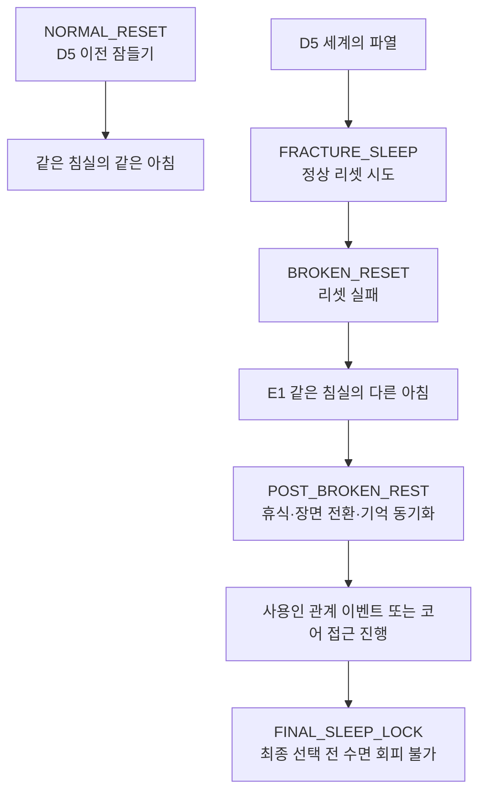

# GGB D5 이후 잠들기 상태 규칙

## 1. 문서 목적

이 문서는 D5 `세계의 파열` 이후 잠들기 행동을 어떻게 처리할지 정의한다.

핵심 결론:

> D5 직후의 잠들기는 정상 리셋이 아니라 `BROKEN_RESET`을 여는 핵심 트리거다.  
> `BROKEN_RESET` 이후의 잠들기는 더 이상 일반 리셋이 아니라 휴식, 장면 전환, 기억 동기화, 감정 이벤트 트리거로 사용한다.

## 2. 상태 구분

| 상태 | 구간 | 잠들기 의미 |
| --- | --- | --- |
| `NORMAL_RESET` | D5 이전 | 물리 상태가 같은 침실의 같은 아침으로 초기화 |
| `FRACTURE_SLEEP` | D5 직후 | 정상 리셋을 시도하지만 실패 |
| `BROKEN_RESET` | D6 이후 | 같은 침실의 다른 아침으로 진입 |
| `POST_BROKEN_REST` | E~F구간 | 휴식, 장면 전환, 기억 동기화 |
| `FINAL_SLEEP_LOCK` | 최종 선택 직전 | 더 이상 잠으로 회피할 수 없음 |

## 3. 상태 전환



## 4. D5 직후 잠들기

### 발생 조건

- D4 `태엽 심장 / 위장 필터 해제(확정 실패 이벤트)` 완료.
- D5 `세계의 파열` 발생.
- 주인공이 침실 또는 무너진 침실 대체 공간에서 잠든다.

### 연출

1. 주인공이 평소처럼 잠든다.
2. 화면은 이전처럼 암전된다.
3. 평소 리셋 때 들리던 시계 소리가 한 박자 늦게 울린다.
4. 고딕풍 침실 이미지가 로딩되다가 중간에 SF 시설 벽이 겹친다.
5. 에드가의 아침 인사가 재생되지만 중간에 끊긴다.
6. 같은 침실이지만 창문, 침대, 벽지, 소리, 공기의 감각이 달라져 있다.

### 플레이어에게 전달할 정보

- 잠들기는 여전히 중요하다.
- 하지만 이제 잠은 안전한 리셋이 아니다.
- 세계는 더 이상 원래대로 돌아가지 않는다.

## 5. BROKEN_RESET 이후 잠들기

`BROKEN_RESET` 이후에는 잠들기 버튼 또는 침대 상호작용의 의미를 바꾼다.

권장 명칭:

| 이전 | 이후 |
| --- | --- |
| 잠든다 | 눈을 붙인다 |
| 취침 | 휴식 |
| 리셋 | 동기화 |

### 가능한 기능

| 기능 | 설명 |
| --- | --- |
| 휴식 | 주인공의 감각 독백을 정리하고 다음 시간대로 넘김 |
| 장면 전환 | 사용인 관계 이벤트 후 공간 상태를 갱신 |
| 기억 동기화 | 사용인들의 잔류 기억 일부가 더 선명해짐 |
| 감정 이벤트 | 특정 사용인의 후속 대사를 트리거 |

### 불가능한 기능

- 물리 상태 완전 초기화.
- D5 이전의 같은 아침으로 복귀.
- 실패한 퍼즐의 리셋.
- 메인 진행 회피.

## 6. 상태 변수

```yaml
reset_state:
  mode: normal # normal, fracture_sleep, broken, rest_only, final_lock
  broken_reset_triggered: false
  post_broken_sleep_count: 0
  last_rest_trigger: null

world_state:
  physical_reset_enabled: true
  gothic_filter_stable: true
  servant_role_lock_strength: high

servant_sync:
  sync_stage: 0 # 0 normal, 1 broken, 2 partial_sync, 3 final
```

### D5 전

```yaml
reset_state:
  mode: normal
world_state:
  physical_reset_enabled: true
  gothic_filter_stable: true
servant_sync:
  sync_stage: 0
```

### D5 직후

```yaml
reset_state:
  mode: fracture_sleep
world_state:
  physical_reset_enabled: unstable
  gothic_filter_stable: false
servant_sync:
  sync_stage: 1
```

### BROKEN_RESET 이후

```yaml
reset_state:
  mode: rest_only
  broken_reset_triggered: true
world_state:
  physical_reset_enabled: false
  gothic_filter_stable: false
servant_sync:
  sync_stage: 2
```

## 7. 흐름도 반영 규칙

| 구간 | 처리 |
| --- | --- |
| P~D4 | 잠들기 = 정상 리셋 |
| D5 직후 | 잠들기 = BROKEN_RESET 트리거 |
| E구간 | 휴식 = 사용인 이벤트 정리와 시간 전환 |
| F구간 | 휴식 = 최종부 진입 전 감정 정리 |
| ENDCHOOSE 직전 | 잠들기 불가. 선택을 회피할 수 없음 |

## 8. 대사 및 독백 예시

### D5 직후 침대 조사

```text
침대는 그대로 있다.
하지만 이불의 무늬가 픽셀처럼 흔들린다.

주인공:
자면 돌아갈까?
아니면... 이번엔 돌아가지 못할까?
```

### BROKEN_RESET 이후 침대 조사

```text
이제 이 침대는 아침으로 데려다주지 않는다.
잠깐 눈을 감을 수는 있다.
그뿐이다.
```

### 최종 선택 직전

```text
눈을 감아도 아침은 오지 않는다.
이제 문을 골라야 한다.
```

## 9. 설계상 장점

- D5 이전 루프 규칙을 흐리지 않는다.
- D5 이후부터는 플레이어에게 세계가 돌이킬 수 없이 변했음을 체감시킨다.
- 잠들기 행동을 버리지 않고, 후반부에서도 감정 트리거로 재활용한다.
- 최종 선택 직전에는 잠으로 회피할 수 없다는 압박을 만든다.

