# GGB 공간 구성 지도 상세안

## 1. 문서 목적

본 문서는 `GGB_게임기획서_v0.3` 기준으로 저택의 공간 구성, 이벤트 발생 위치, 플레이어 동선, 사용인 상호작용 흐름을 정리한 공간 설계안이다.

목표는 아래와 같다.

- 플레이어가 어디에서 무엇을 해야 하는지 한눈에 파악할 수 있게 한다.
- 각 방이 단순 배경이 아니라 루프, 균열, 사용인 기억, 엔딩 선택과 연결되도록 한다.
- 추후 Godot 프로토타입 제작 시 방 단위 Scene, 이동 포인트, 이벤트 플래그를 나누기 쉽게 만든다.

## 2. 공간 설계 핵심

| 원칙 | 설명 |
| --- | --- |
| 침실은 루프의 기준점 | 모든 정상 리셋은 침실에서 시작하고, D5 이후에는 같은 침실의 다른 아침으로 변한다. |
| 중앙홀은 허브 | 침실, 대응접실, 서재, 주방, 온실 앞, 서쪽 복도를 연결하는 기본 동선 허브다. |
| 서쪽은 진실의 방향 | 서재, 서쪽 복도, 대시계, 지하창고, 코어가 이어지는 메인 진실 동선이다. |
| 동쪽은 생존의 방향 | 주방, 약품장, 생명 유지 장치, 루카 이벤트가 주인공의 신체와 현실 생존성을 암시한다. |
| 북쪽은 바깥의 방향 | 온실은 외부 기후 데이터와 현실 회복 가능성을 암시한다. |
| 지하는 위장 해제의 방향 | 지하창고와 태엽 심장은 고딕 저택의 아래에 숨은 시스템 구조를 드러낸다. |
| D5 이후 공간은 겹쳐진다 | 고딕 저택과 SF 시설이 동시에 보이며, 같은 방도 다른 기능을 가진다. |

## 3. 전체 공간 구성 지도

아래 지도는 실제 건축 평면도라기보다 플레이어가 이동하는 노드형 맵이다.

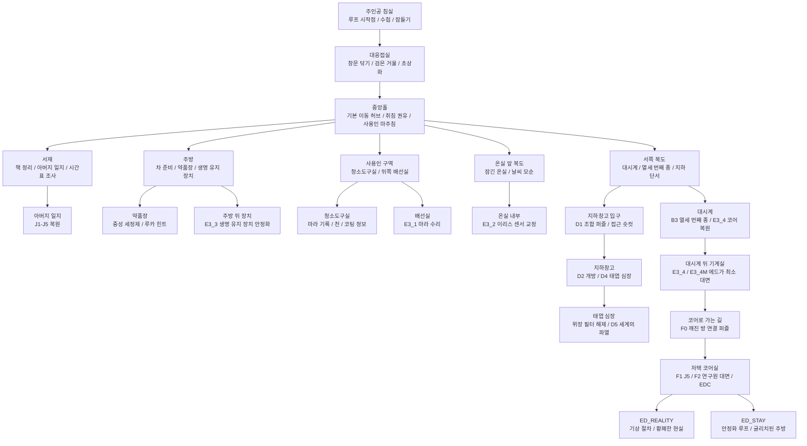
```mermaid
flowchart TB
    BED["주인공 침실<br/>루프 시작점 / 수첩 / 잠들기"] --> PARLOR["대응접실<br/>창문 닦기 / 검은 거울 / 초상화"]
    PARLOR --> HALL["중앙홀<br/>기본 이동 허브 / 취침 권유 / 사용인 마주침"]

    HALL --> LIB["서재<br/>책 정리 / 아버지 일지 / 시간표 조사"]
    HALL --> KITCHEN["주방<br/>차 준비 / 약품장 / 생명 유지 장치"]
    HALL --> GREEN_FRONT["온실 앞 복도<br/>잠긴 온실 / 날씨 모순"]
    HALL --> WEST["서쪽 복도<br/>대시계 / 열세 번째 종 / 지하 단서"]
    HALL --> SERVANT["사용인 구역<br/>청소도구실 / 뒤쪽 배선실"]

    LIB --> JOURNAL["아버지 일지<br/>J1-J5 복원"]
    KITCHEN --> MED["약품장<br/>중성 세정제 / 루카 힌트"]
    KITCHEN --> LIFE["주방 뒤 장치<br/>E3_3 생명 유지 장치 안정화"]
    SERVANT --> TOOL["청소도구실<br/>마라 기록 / 천 / 코팅 정보"]
    SERVANT --> WIRE["배선실<br/>E3_1 마라 수리"]
    GREEN_FRONT --> GREEN["온실 내부<br/>E3_2 이리스 센서 교정"]
    WEST --> CLOCK["대시계<br/>B3 열세 번째 종 / E3_4 코어 복원"]
    WEST --> BASE_ENT["지하창고 입구<br/>D1 조합 퍼즐 / 접근 숏컷"]

    BASE_ENT --> BASE["지하창고<br/>D2 개방 / D4 태엽 심장"]
    BASE --> HEART["태엽 심장<br/>위장 필터 해제 / D5 세계의 파열"]
    CLOCK --> CLOCK_BACK["대시계 뒤 기계실<br/>E3_4 / E3_4M 에드가 최소 대면"]
    CLOCK_BACK --> CORE_PATH["코어로 가는 길<br/>F0 깨진 방 연결 퍼즐"]
    CORE_PATH --> CORE["저택 코어실<br/>F1 J5 / F2 연구원 대면 / EDC"]

    CORE --> REALITY["ED_REALITY<br/>기상 절차 / 황폐한 현실"]
    CORE --> STAY["ED_STAY<br/>안정화 루프 / 글리치된 주방"]
```

## 4. 공간 상태 단계

같은 공간도 챕터와 균열 단계에 따라 기능이 변한다.

| 단계 | 구간 | 공간 상태 | 플레이 의미 |
| --- | --- | --- | --- |
| S0 완전한 저택 | 프롤로그 | 고딕 저택으로만 보임 | 일상, 튜토리얼, 사용인 소개 |
| S1 반복의 저택 | 1챕터 | 물리 상태는 리셋되지만 수첩과 일지는 남음 | 루프 검증, 시간표, 열세 번째 종 |
| S2 금지의 저택 | 2챕터 초중반 | 거울, 대시계, 지하 단서가 서로 연결됨 | 금기를 어기고 위장 코팅을 벗김 |
| S3 파열된 저택 | D5 이후 | 고딕 장식과 SF 시설이 겹쳐 보임 | BROKEN_RESET, 관계 이벤트 허브 |
| S4 코어의 저택 | 4챕터 | 방들이 코어 방향으로 접히거나 연결됨 | 아버지 기록, 연구원 대면, 최종 선택 |
| S5 엔딩 공간 | 엔딩 | 현실 기상실 또는 글리치된 주방 | 선택의 결과와 감정 온도 표현 |

## 5. 챕터별 주요 동선

### 5.1 프롤로그 동선

프롤로그는 저택의 기본 구조와 포인트 앤 클릭 조작을 익히게 하는 구간이다.

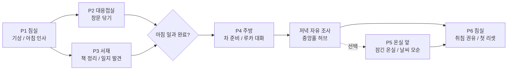
```mermaid
flowchart LR
    P1["P1 침실<br/>기상 / 아침 인사"] --> P2["P2 대응접실<br/>창문 닦기"]
    P1 --> P3["P3 서재<br/>책 정리 / 일지 발견"]
    P2 --> PG{"아침 일과 완료?"}
    P3 --> PG
    PG --> P4["P4 주방<br/>차 준비 / 루카 대화"]
    P4 --> PF["저녁 자유 조사<br/>중앙홀 허브"]
    PF -. 선택 .-> P5["P5 온실 앞<br/>잠긴 온실 / 날씨 모순"]
    PF --> P6["P6 침실<br/>취침 권유 / 첫 리셋"]
    P5 --> P6
```

핵심 의도:

- 침실은 시작과 끝을 담당한다.
- 대응접실은 오브젝트 사용 튜토리얼을 담당한다.
- 서재는 일지와 아버지의 흔적을 처음 보여준다.
- 주방은 루카와 생명 유지 장치의 복선을 심는다.
- 온실 앞은 세계의 모순을 처음 감각적으로 보여준다.

### 5.2 1챕터 동선

1챕터는 같은 저택을 반복하면서 정보가 남는다는 규칙을 검증하는 구간이다.

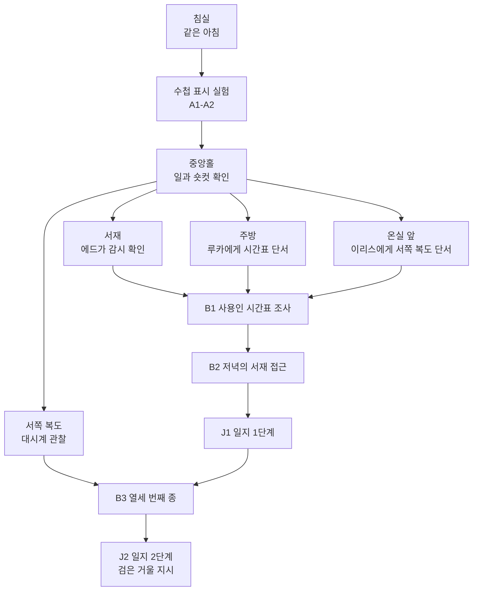
```mermaid
flowchart TB
    MORNING["침실<br/>같은 아침"] --> NOTE["수첩 표시 실험<br/>A1-A2"]
    NOTE --> HALL["중앙홀<br/>일과 숏컷 확인"]
    HALL --> LIB1["서재<br/>에드가 감시 확인"]
    HALL --> KITCHEN1["주방<br/>루카에게 시간표 단서"]
    HALL --> GREEN1["온실 앞<br/>이리스에게 서쪽 복도 단서"]
    HALL --> WEST1["서쪽 복도<br/>대시계 관찰"]

    LIB1 --> SCHEDULE["B1 사용인 시간표 조사"]
    KITCHEN1 --> SCHEDULE
    GREEN1 --> SCHEDULE
    WEST1 --> B3["B3 열세 번째 종"]
    SCHEDULE --> B2["B2 저녁의 서재 접근"]
    B2 --> J1["J1 일지 1단계"]
    J1 --> B3
    B3 --> J2["J2 일지 2단계<br/>검은 거울 지시"]
```

이 구간의 공간 역할:

- 침실: 수첩 지속 확인.
- 서재: 에드가가 지키는 정보 공간.
- 주방, 온실 앞, 서쪽 복도: 시간표 단서를 나눠 가진 보조 공간.
- 서쪽 복도: 열세 번째 종으로 메인 진실 동선 진입.

### 5.3 2챕터 동선

2챕터는 대응접실의 검은 거울에서 지하창고와 태엽 심장으로 내려가는 구간이다.

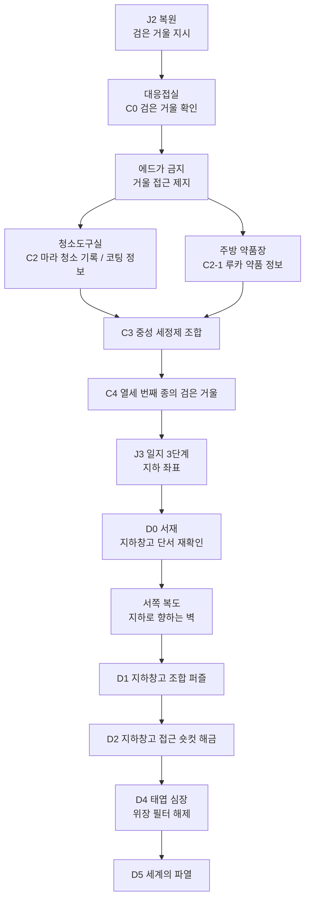
```mermaid
flowchart TB
    J2["J2 복원<br/>검은 거울 지시"] --> PARLOR_C["대응접실<br/>C0 검은 거울 확인"]
    PARLOR_C --> EDGAR_BLOCK["에드가 금지<br/>거울 접근 제지"]
    EDGAR_BLOCK --> TOOL_C["청소도구실<br/>C2 마라 청소 기록 / 코팅 정보"]
    EDGAR_BLOCK --> MED_C["주방 약품장<br/>C2-1 루카 약품 정보"]
    TOOL_C --> MIX["C3 중성 세정제 조합"]
    MED_C --> MIX
    MIX --> MIRROR["C4 열세 번째 종의 검은 거울"]
    MIRROR --> J3["J3 일지 3단계<br/>지하 좌표"]
    J3 --> LIB_D["D0 서재<br/>지하창고 단서 재확인"]
    LIB_D --> WEST_D["서쪽 복도<br/>지하로 향하는 벽"]
    WEST_D --> D1["D1 지하창고 조합 퍼즐"]
    D1 --> D2["D2 지하창고 접근 숏컷 해금"]
    D2 --> D4["D4 태엽 심장<br/>위장 필터 해제"]
    D4 --> D5["D5 세계의 파열"]
```

이 구간의 공간 역할:

- 대응접실: 검은 거울을 통해 고딕 저택이 위장이라는 사실을 처음 드러낸다.
- 청소도구실: 마라의 기능과 코팅 정보 제공.
- 주방 약품장: 루카의 기능과 중성 세정제 정보 제공.
- 서재: 지하 단서 재확인, 아버지의 안내 장치.
- 서쪽 복도: 대시계와 지하 입구의 연결을 체감시킨다.
- 지하창고: D5 이전 마지막 물리 퍼즐 공간.

### 5.4 3챕터 동선

3챕터는 공간 진행보다 관계 이벤트 허브에 가깝다. D5 이후 같은 저택이지만 각 방의 숨은 기능이 드러난다.

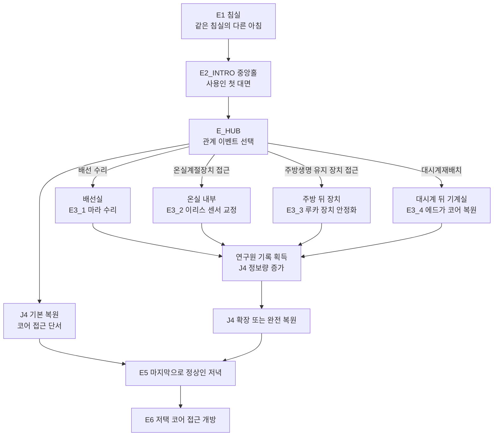
```mermaid
flowchart TB
    BROKEN["E1 침실<br/>같은 침실의 다른 아침"] --> INTRO["E2_INTRO 중앙홀<br/>사용인 첫 대면"]
    INTRO --> HUB["E_HUB<br/>관계 이벤트 선택"]

    HUB -- "배선 수리" --> MARA["배선실<br/>E3_1 마라 수리"]
    HUB -- "온실계절장치 접근" --> IRIS["온실 내부<br/>E3_2 이리스 센서 교정"]
    HUB -- "주방생명 유지 장치 접근" --> LUCA["주방 뒤 장치<br/>E3_3 루카 장치 안정화"]
    HUB -- "대시계재배치" --> EDGAR["대시계 뒤 기계실<br/>E3_4 에드가 코어 복원"]

    MARA --> RECORDS["연구원 기록 획득<br/>J4 정보량 증가"]
    IRIS --> RECORDS
    LUCA --> RECORDS
    EDGAR --> RECORDS

    HUB --> J4_BASE["J4 기본 복원<br/>코어 접근 단서"]
    RECORDS --> J4_VAR["J4 확장 또는 완전 복원"]
    J4_BASE --> E5["E5 마지막으로 정상인 저녁"]
    J4_VAR --> E5
    E5 --> E6["E6 저택 코어 접근 개방"]
```

이 구간의 공간 역할:

- 침실: 더 이상 정상 리셋이 되지 않는다는 첫 체감.
- 중앙홀: 사용인들의 표층 역할이 무너지는 허브.
- 배선실: 마라의 연구원 기록과 저택 표층 유지 기능.
- 온실 내부: 이리스의 외부 환경 데이터와 바깥 현실 암시.
- 주방 뒤 장치: 루카의 생명 유지 장치와 주인공 신체 상태.
- 대시계 뒤 기계실: 에드가의 코어 감시 권한과 코어 접근 허가.

### 5.5 4챕터 동선

4챕터는 방들이 자연스럽게 연결되는 저택이 아니라, 깨진 방들이 코어 방향으로 접히는 최종 동선이다.

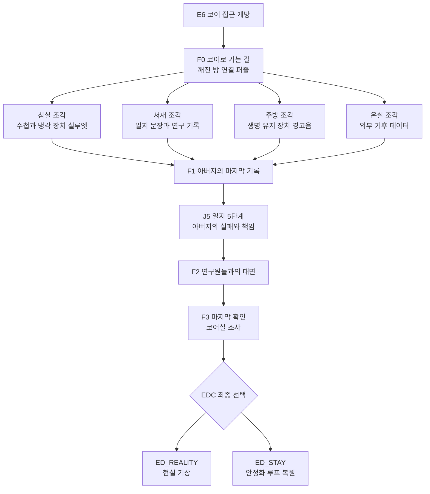
```mermaid
flowchart TB
    E6["E6 코어 접근 개방"] --> F0["F0 코어로 가는 길<br/>깨진 방 연결 퍼즐"]
    F0 --> ROOM_A["침실 조각<br/>수첩과 냉각 장치 실루엣"]
    F0 --> ROOM_B["서재 조각<br/>일지 문장과 연구 기록"]
    F0 --> ROOM_C["주방 조각<br/>생명 유지 장치 경고음"]
    F0 --> ROOM_D["온실 조각<br/>외부 기후 데이터"]
    ROOM_A --> F1["F1 아버지의 마지막 기록"]
    ROOM_B --> F1
    ROOM_C --> F1
    ROOM_D --> F1
    F1 --> J5["J5 일지 5단계<br/>아버지의 실패와 책임"]
    J5 --> F2["F2 연구원들과의 대면"]
    F2 --> F3["F3 마지막 확인<br/>코어실 조사"]
    F3 --> EDC{"EDC 최종 선택"}
    EDC --> ED_REALITY["ED_REALITY<br/>현실 기상"]
    EDC --> ED_STAY["ED_STAY<br/>안정화 루프 복원"]
```

4챕터의 핵심은 공간을 탐험하는 감각보다, 지금까지 지나온 공간들이 전부 하나의 장치였다는 인식을 주는 것이다.

## 6. 방별 상세 카드

### 6.1 주인공 침실

| 항목 | 내용 |
| --- | --- |
| 주요 기능 | 시작점, 리셋 기준점, 수첩 확인, 취침 |
| 주요 이벤트 | P1, P6, SYS-01, A1, A2, E1, D6 |
| 핵심 오브젝트 | 침대, 창문, 아버지 사진, 낙서 수첩 |
| 사용인 | 에드가가 취침 권유 시 등장 가능 |
| 정상 상태 | 따뜻하고 안전한 아가씨의 방 |
| 균열 상태 | 창문 풍경 반복, 벽지 뒤 SF 패널, 냉각 장치 실루엣 |
| D5 이후 | 같은 침실이지만 공기, 소리, 벽면 구조가 달라짐 |

상호작용 흐름:

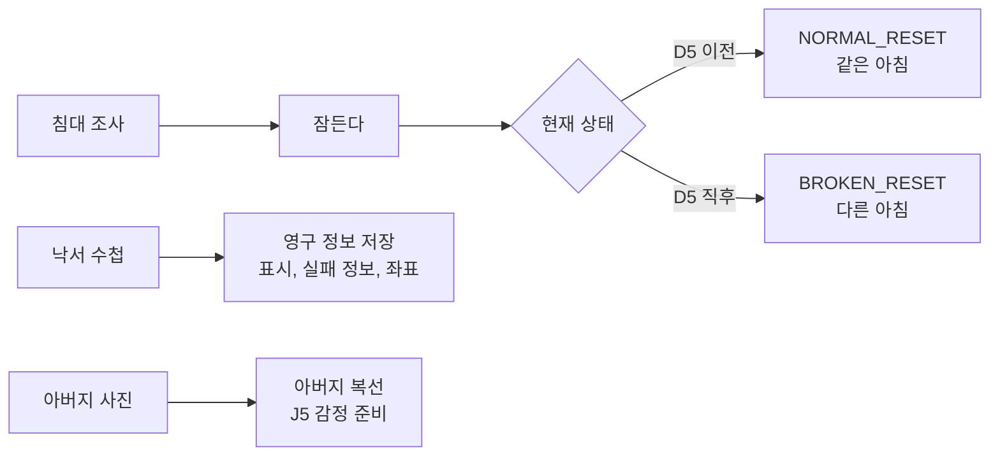
```mermaid
flowchart LR
    BED_OBJ["침대 조사"] --> SLEEP["잠든다"]
    SLEEP --> RESET_RULE{"현재 상태"}
    RESET_RULE -- "D5 이전" --> NORMAL["NORMAL_RESET<br/>같은 아침"]
    RESET_RULE -- "D5 직후" --> BROKEN["BROKEN_RESET<br/>다른 아침"]
    NOTEBOOK["낙서 수첩"] --> PERM["영구 정보 저장<br/>표시, 실패 정보, 좌표"]
    PHOTO["아버지 사진"] --> FATHER["아버지 복선<br/>J5 감정 준비"]
```

### 6.2 대응접실

| 항목 | 내용 |
| --- | --- |
| 주요 기능 | 초반 오브젝트 사용 튜토리얼, 검은 거울 메인 퍼즐 |
| 주요 이벤트 | P2, C0, C4, C5, L1-04 |
| 핵심 오브젝트 | 일반 창문, 검은 거울, 가족 초상화 |
| 사용인 | 에드가, 마라 |
| 정상 상태 | 손님을 맞이하는 고딕 응접 공간 |
| 균열 상태 | 거울 표면 아래 회로, 초상화 배경의 흰 복도 |
| 실패 처리 | 거울 시도 실패 시 코팅 경화 또는 도구 회수 후 리셋 필요 |

상호작용 흐름:

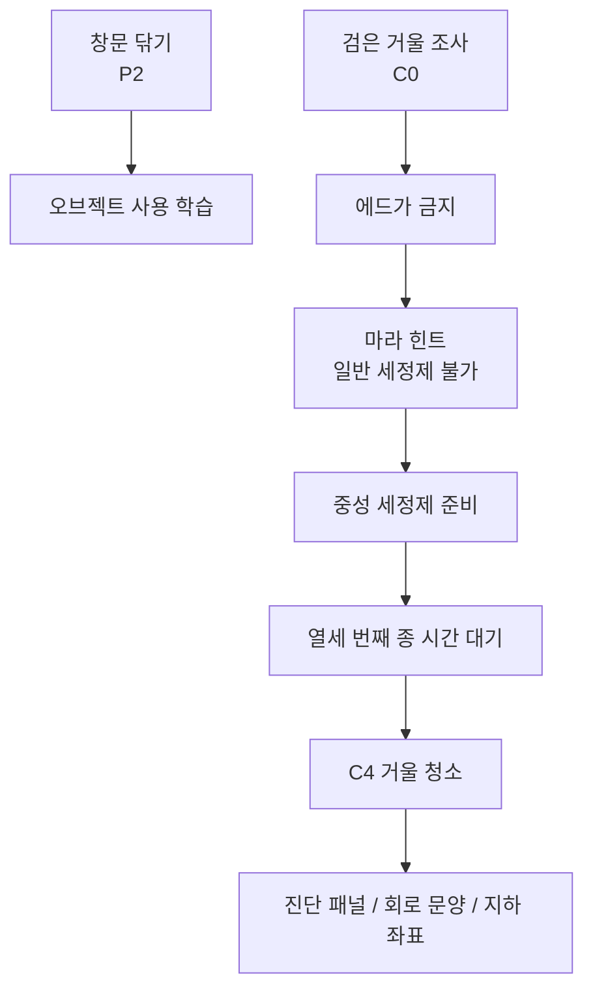
```mermaid
flowchart TB
    WINDOW["창문 닦기<br/>P2"] --> BASIC["오브젝트 사용 학습"]
    MIRROR0["검은 거울 조사<br/>C0"] --> EDGAR["에드가 금지"]
    EDGAR --> MARA_HINT["마라 힌트<br/>일반 세정제 불가"]
    MARA_HINT --> CLEANER["중성 세정제 준비"]
    CLEANER --> CLOCK_TIME["열세 번째 종 시간 대기"]
    CLOCK_TIME --> MIRROR_CLEAN["C4 거울 청소"]
    MIRROR_CLEAN --> PANEL["진단 패널 / 회로 문양 / 지하 좌표"]
```

### 6.3 중앙홀

| 항목 | 내용 |
| --- | --- |
| 주요 기능 | 이동 허브, 시간대 전환, 취침 압박, 사용인 마주침 |
| 주요 이벤트 | P4 이후 자유 조사, P6, E2_INTRO, E_HUB |
| 핵심 오브젝트 | 계단 또는 복도 분기, 촛대, 저택 안내판, 종소리 |
| 사용인 | 네 사용인이 모두 통과 가능 |
| 정상 상태 | 모든 방이 자연스럽게 이어지는 공용 공간 |
| 균열 상태 | 복도 길이가 달라지고, 이동 아이콘이 순간적으로 다른 방을 가리킴 |
| D5 이후 | 관계 이벤트 허브로 기능 |

중앙홀은 플레이어가 다음 목표를 잃었을 때 가장 먼저 돌아오게 되는 공간이다. 수첩 목표, 사용인 반응, 이동 아이콘 강조를 이곳에서 제공한다.

### 6.4 서재

| 항목 | 내용 |
| --- | --- |
| 주요 기능 | 일지 발견, 시간표 퍼즐, 지하 단서 재확인 |
| 주요 이벤트 | P3, B1, B2, J1, J2, D0 |
| 핵심 오브젝트 | 책장, 서재 벽시계, 에드가 업무 장부, 책상 서랍, 아버지 일지 |
| 사용인 | 에드가 |
| 정상 상태 | 지식과 질서의 방 |
| 균열 상태 | 책장 배열이 암호처럼 보이고, 벽시계가 대시계와 공명 |
| 잠금 구조 | 에드가가 있는 시간에는 일지에 오래 접근 불가 |

상호작용 흐름:

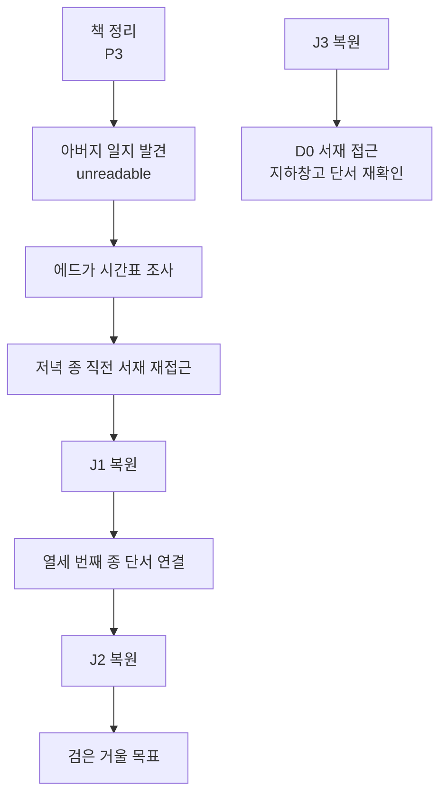
```mermaid
flowchart TB
    BOOKS["책 정리<br/>P3"] --> JOURNAL0["아버지 일지 발견<br/>unreadable"]
    JOURNAL0 --> SCHEDULE["에드가 시간표 조사"]
    SCHEDULE --> EVENING["저녁 종 직전 서재 재접근"]
    EVENING --> J1["J1 복원"]
    J1 --> B3["열세 번째 종 단서 연결"]
    B3 --> J2["J2 복원"]
    J2 --> MIRROR_GOAL["검은 거울 목표"]
    J3["J3 복원"] --> D0["D0 서재 접근<br/>지하창고 단서 재확인"]
```

### 6.5 주방 / 약품장 / 생명 유지 장치

| 항목 | 내용 |
| --- | --- |
| 주요 기능 | 차 준비, 약품 조합, 루카 관계 이벤트, 생명 유지 장치 암시 |
| 주요 이벤트 | P4, C2-1, C3, E3_3 |
| 핵심 오브젝트 | 찻잔, 오븐, 약품장, 조리대, 주방 뒤 장치 |
| 사용인 | 루카 |
| 정상 상태 | 따뜻하고 안정적인 생활 공간 |
| 균열 상태 | 온도 유지 장치, 압력계, 냉각 장치 경고등이 드러남 |
| D5 이후 | 주방 뒤 생명 유지 장치 접근 가능 |

상호작용 흐름:

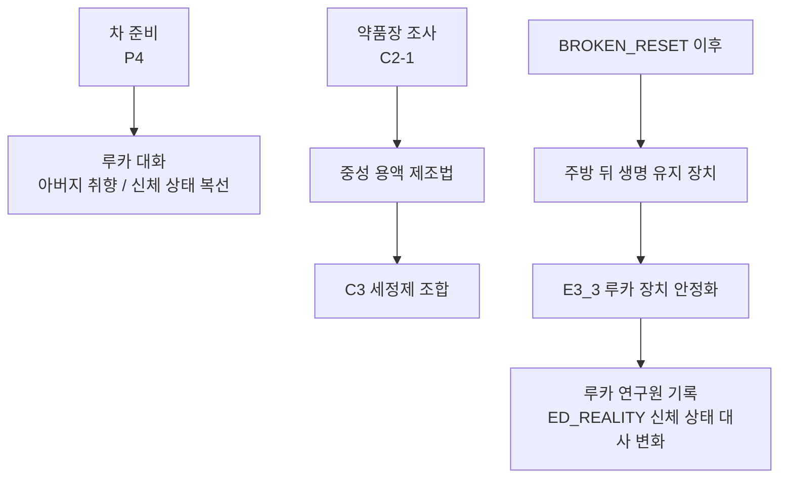
```mermaid
flowchart TB
    TEA["차 준비<br/>P4"] --> LUCA_TALK["루카 대화<br/>아버지 취향 / 신체 상태 복선"]
    MED_LOCK["약품장 조사<br/>C2-1"] --> RECIPE["중성 용액 제조법"]
    RECIPE --> MIX["C3 세정제 조합"]
    BROKEN["BROKEN_RESET 이후"] --> LIFE["주방 뒤 생명 유지 장치"]
    LIFE --> LUCA_E3["E3_3 루카 장치 안정화"]
    LUCA_E3 --> LUCA_RECORD["루카 연구원 기록<br/>ED_REALITY 신체 상태 대사 변화"]
```

### 6.6 청소도구실 / 배선실

| 항목 | 내용 |
| --- | --- |
| 주요 기능 | 마라 힌트, 도구 획득, 배선 수리 관계 이벤트 |
| 주요 이벤트 | C2, C3 보조, E3_1 |
| 핵심 오브젝트 | 청소 기록, 천, 세정제 도구, 배선 패널 |
| 사용인 | 마라 |
| 정상 상태 | 저택을 관리하는 사용인 작업 공간 |
| 균열 상태 | 먼지와 얼룩이 데이터 오류처럼 보임 |
| D5 이후 | 뒤쪽 배선실이 열리고 마라 수리 이벤트 진행 |

상호작용 흐름:

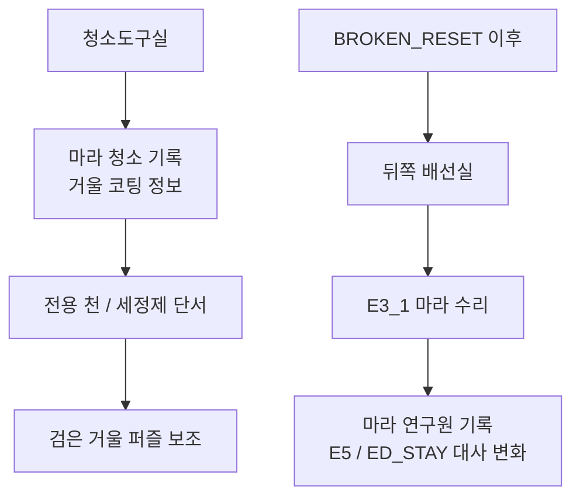
```mermaid
flowchart TB
    TOOL_ROOM["청소도구실"] --> RECORD["마라 청소 기록<br/>거울 코팅 정보"]
    RECORD --> CLOTH["전용 천 / 세정제 단서"]
    CLOTH --> MIRROR["검은 거울 퍼즐 보조"]
    BROKEN["BROKEN_RESET 이후"] --> WIRE_ROOM["뒤쪽 배선실"]
    WIRE_ROOM --> MARA_E3["E3_1 마라 수리"]
    MARA_E3 --> MARA_RECORD["마라 연구원 기록<br/>E5 / ED_STAY 대사 변화"]
```

### 6.7 온실 앞 / 온실 내부

| 항목 | 내용 |
| --- | --- |
| 주요 기능 | 날씨 모순, 외부 환경 데이터 암시, 이리스 관계 이벤트 |
| 주요 이벤트 | P5, IRIS_S1, IRIS_S2, E3_2 |
| 핵심 오브젝트 | 잠긴 온실 문, 온실 유리, 흙, 계절 제어 장치 |
| 사용인 | 이리스 |
| 정상 상태 | 닫혀 있지만 생명이 느껴지는 공간 |
| 균열 상태 | 식물보다 금속 선반과 센서가 먼저 보임 |
| D5 이후 | 깨진 온실 내부 접근 가능 |

상호작용 흐름:

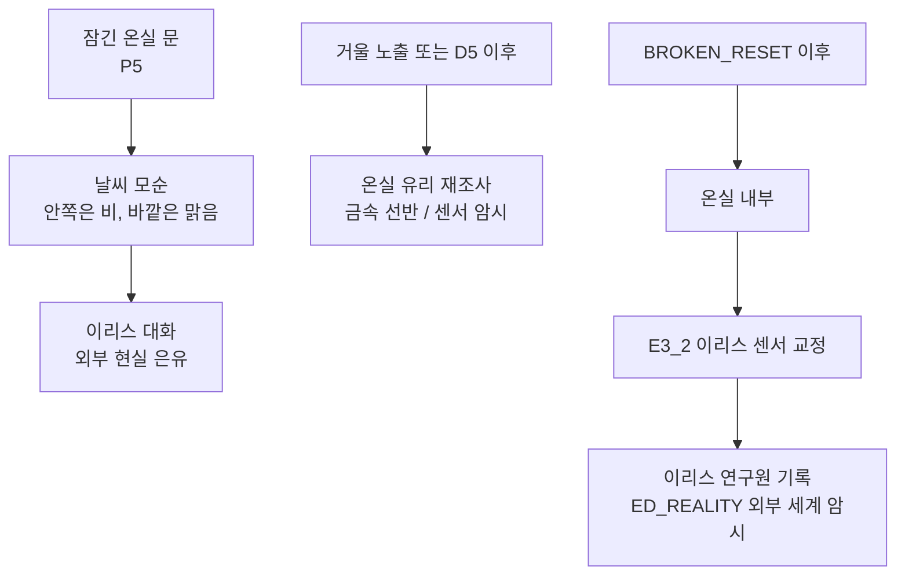
```mermaid
flowchart TB
    DOOR["잠긴 온실 문<br/>P5"] --> WEATHER["날씨 모순<br/>안쪽은 비, 바깥은 맑음"]
    WEATHER --> IRIS_HINT["이리스 대화<br/>외부 현실 은유"]
    J3_OR_D5["거울 노출 또는 D5 이후"] --> GLASS["온실 유리 재조사<br/>금속 선반 / 센서 암시"]
    BROKEN["BROKEN_RESET 이후"] --> GREEN_IN["온실 내부"]
    GREEN_IN --> IRIS_E3["E3_2 이리스 센서 교정"]
    IRIS_E3 --> IRIS_RECORD["이리스 연구원 기록<br/>ED_REALITY 외부 세계 암시"]
```

### 6.8 서쪽 복도 / 대시계 / 지하 입구

| 항목 | 내용 |
| --- | --- |
| 주요 기능 | 열세 번째 종, 지하창고 입구, 에드가 코어 이벤트 |
| 주요 이벤트 | B3, D1, D2, E3_4, E3_4M, E6 |
| 핵심 오브젝트 | 대시계, 벽 장식, 지하로 향하는 벽, 복도 조명 |
| 사용인 | 에드가, 마라 보조 힌트 |
| 정상 상태 | 장식적인 서쪽 복도 |
| 균열 상태 | 대시계가 저택 전체 장치의 일부로 드러남 |
| D5 이후 | 대시계 뒤 기계실과 코어 접근로가 열림 |

상호작용 흐름:

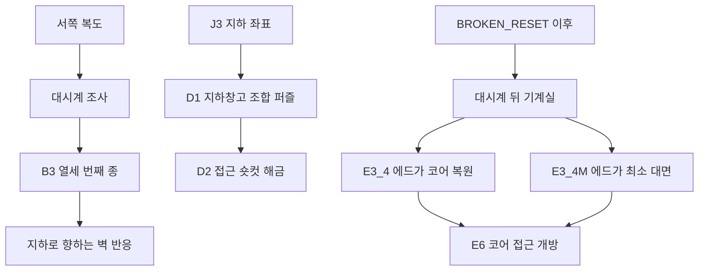
```mermaid
flowchart TB
    WEST["서쪽 복도"] --> CLOCK_OBS["대시계 조사"]
    CLOCK_OBS --> B3["B3 열세 번째 종"]
    B3 --> WALL["지하로 향하는 벽 반응"]
    J3["J3 지하 좌표"] --> D1["D1 지하창고 조합 퍼즐"]
    D1 --> D2["D2 접근 숏컷 해금"]
    BROKEN["BROKEN_RESET 이후"] --> CLOCK_BACK["대시계 뒤 기계실"]
    CLOCK_BACK --> EDGAR_E3["E3_4 에드가 코어 복원"]
    CLOCK_BACK --> EDGAR_MIN["E3_4M 에드가 최소 대면"]
    EDGAR_E3 --> E6["E6 코어 접근 개방"]
    EDGAR_MIN --> E6
```

### 6.9 지하창고 / 태엽 심장

| 항목 | 내용 |
| --- | --- |
| 주요 기능 | D5 이전 마지막 메인 퍼즐, 위장 필터 해제 |
| 주요 이벤트 | D1, D2, D4, D5 |
| 핵심 오브젝트 | 조합 장치, 잠긴 철문, 태엽 심장, 위장 필터 장치 |
| 사용인 | 직접 개입은 적고, 에드가의 감시가 간접적으로 작동 |
| 정상 상태 | 오래된 지하창고처럼 위장됨 |
| 균열 상태 | 장식용 태엽이 아니라 시뮬레이션 위장 필터 장치로 드러남 |
| 실패 처리 | D1 실패 시 지하 장치 하루 잠금, 리셋 후 정보 기반 재시도 |

상호작용 흐름:

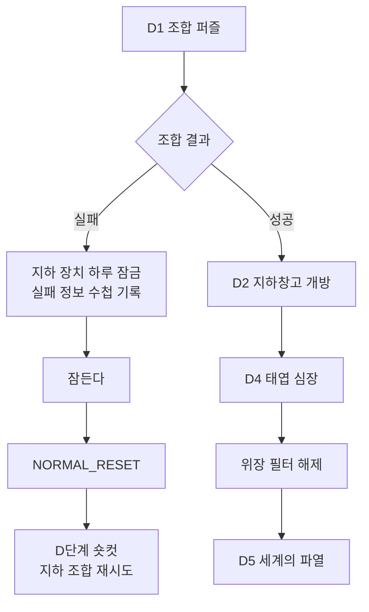
```mermaid
flowchart TB
    D1["D1 조합 퍼즐"] --> RESULT{"조합 결과"}
    RESULT -- "실패" --> LOCK["지하 장치 하루 잠금<br/>실패 정보 수첩 기록"]
    LOCK --> SLEEP["잠든다"]
    SLEEP --> RESET["NORMAL_RESET"]
    RESET --> DSHORT["D단계 숏컷<br/>지하 조합 재시도"]
    RESULT -- "성공" --> OPEN["D2 지하창고 개방"]
    OPEN --> HEART["D4 태엽 심장"]
    HEART --> FILTER["위장 필터 해제"]
    FILTER --> FRACTURE["D5 세계의 파열"]
```

### 6.10 대시계 뒤 기계실 / 코어로 가는 길

| 항목 | 내용 |
| --- | --- |
| 주요 기능 | 에드가 관계 이벤트, 코어 접근 허가, F0 연결 퍼즐 |
| 주요 이벤트 | E3_4, E3_4M, E6, F0 |
| 핵심 오브젝트 | 대시계 톱니, 감시 권한 패널, 코어 접근 문, 깨진 방 연결 장치 |
| 사용인 | 에드가 |
| 정상 상태 | 접근 불가 |
| D5 이후 | 대시계 뒤 공간이 드러나며 에드가의 문지기 역할이 강화됨 |
| 메인 보장 | E3_4를 하지 않아도 E3_4M 최소 대면으로 코어 접근 가능 |

상호작용 흐름:

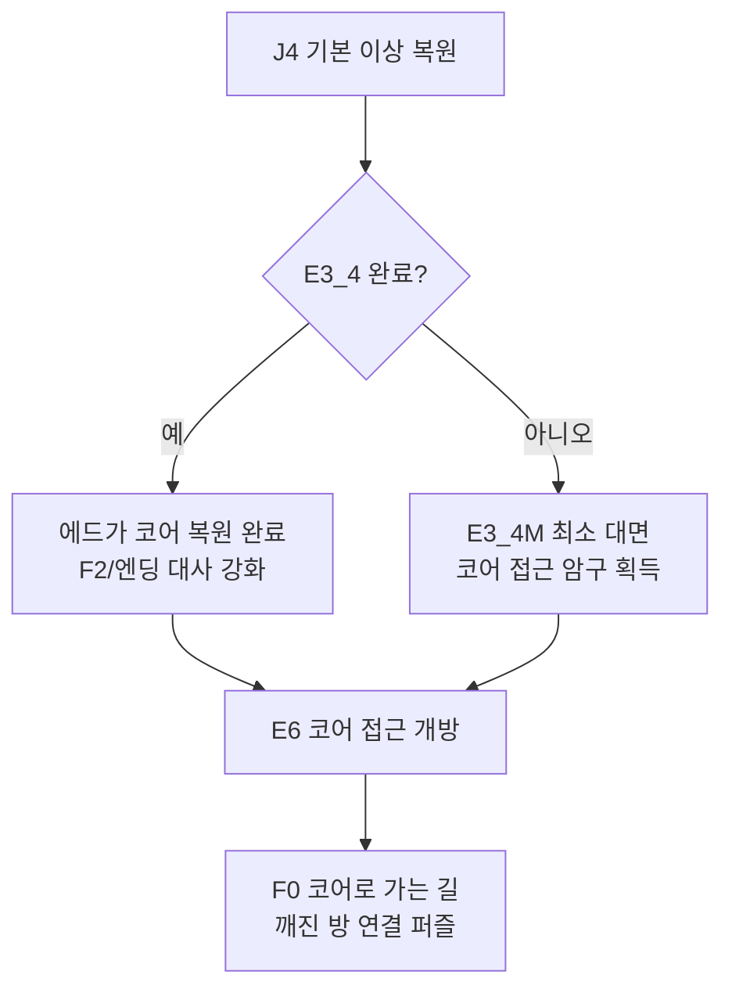
```mermaid
flowchart TB
    J4["J4 기본 이상 복원"] --> CHECK{"E3_4 완료?"}
    CHECK -- "예" --> FULL["에드가 코어 복원 완료<br/>F2/엔딩 대사 강화"]
    CHECK -- "아니오" --> MIN["E3_4M 최소 대면<br/>코어 접근 암구 획득"]
    FULL --> E6["E6 코어 접근 개방"]
    MIN --> E6
    E6 --> F0["F0 코어로 가는 길<br/>깨진 방 연결 퍼즐"]
```

### 6.11 저택 코어실

| 항목 | 내용 |
| --- | --- |
| 주요 기능 | 아버지의 마지막 기록, 연구원 대면, 엔딩 분기 |
| 주요 이벤트 | F1, J5, F2, F3, EDC |
| 핵심 오브젝트 | 코어 콘솔, 기상 장치, 안정화 장치, 냉각 장치 표시, 연구원 인격 데이터 |
| 사용인 | 네 사용인이 연구원 인격으로 대면 |
| 공간 연출 | 고딕 저택의 중심이 아니라 시뮬레이션 서버실처럼 보임 |
| 선택 | ED_REALITY 또는 ED_STAY |

상호작용 흐름:

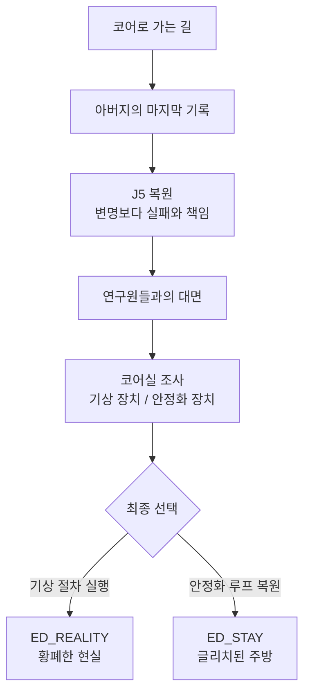
```mermaid
flowchart TB
    F0["코어로 가는 길"] --> F1["아버지의 마지막 기록"]
    F1 --> J5["J5 복원<br/>변명보다 실패와 책임"]
    J5 --> F2["연구원들과의 대면"]
    F2 --> F3["코어실 조사<br/>기상 장치 / 안정화 장치"]
    F3 --> EDC{"최종 선택"}
    EDC -- "기상 절차 실행" --> REALITY["ED_REALITY<br/>황폐한 현실"]
    EDC -- "안정화 루프 복원" --> STAY["ED_STAY<br/>글리치된 주방"]
```

## 7. 사용인별 공간 영향

| 사용인 | 중심 공간 | 보조 공간 | 공간에서 하는 일 | 플레이 영향 |
| --- | --- | --- | --- | --- |
| 에드가 | 서재, 서쪽 복도, 대시계 뒤 기계실, 코어 접근로 | 중앙홀, 대응접실 | 감시, 금지, 코어 접근 허가 | 시간표 퍼즐, 거울 제지, E3_4/E3_4M, 엔딩 대사 |
| 마라 | 청소도구실, 배선실 | 대응접실, 서쪽 복도 | 도구 관리, 표층 오류 청소, 배선 수리 | 중성 세정제 힌트, E3_1, ED_STAY 온도 변화 |
| 이리스 | 온실 앞, 온실 내부 | 중앙홀 | 외부 환경 데이터와 계절 장치 관리 | 날씨 모순, E3_2, ED_REALITY 암시 |
| 루카 | 주방, 약품장, 주방 뒤 장치 | 중앙홀 | 차, 약품, 생명 유지 장치 관리 | 세정제 조합, E3_3, 현실 기상 위험 암시 |

## 8. 사용인 개입 흐름

사용인이 이전 루프를 기억하더라도 모든 행동을 막지 못하도록, 공간별 개입은 아래 규칙을 따른다.

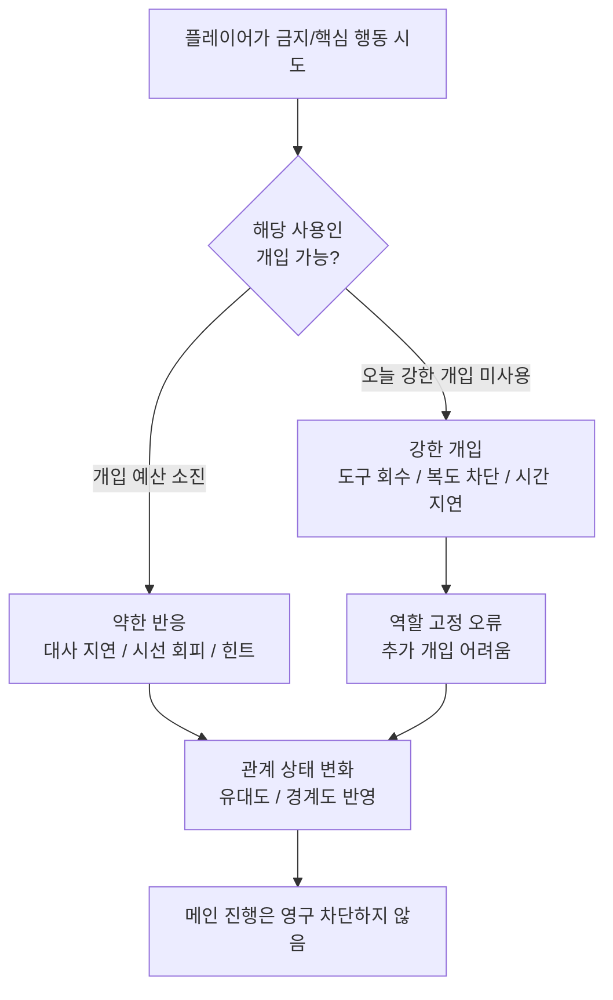
```mermaid
flowchart TB
    PLAYER["플레이어가 금지/핵심 행동 시도"] --> CHECK{"해당 사용인<br/>개입 가능?"}
    CHECK -- "오늘 강한 개입 미사용" --> INTERFERE["강한 개입<br/>도구 회수 / 복도 차단 / 시간 지연"]
    CHECK -- "개입 예산 소진" --> WEAK["약한 반응<br/>대사 지연 / 시선 회피 / 힌트"]
    INTERFERE --> ERROR["역할 고정 오류<br/>추가 개입 어려움"]
    WEAK --> MEMORY["관계 상태 변화<br/>유대도 / 경계도 반영"]
    ERROR --> MEMORY
    MEMORY --> ROUTE["메인 진행은 영구 차단하지 않음"]
```

공간별 강한 개입 예시:

| 공간 | 개입 주체 | 강한 개입 | 제한 |
| --- | --- | --- | --- |
| 대응접실 검은 거울 | 에드가, 마라 | 도구 회수, 거울 접근 차단 | 하루 1회, 실패 정보는 수첩에 남음 |
| 서재 | 에드가 | 일지 앞에 서서 시간 지연 | 시간표 조사로 회피 가능 |
| 서쪽 복도 | 에드가 | 대시계 앞에서 길 막기 | 열세 번째 종 이후 빈틈 발생 |
| 주방 약품장 | 루카 | 위험한 약품 사용 제지 | 중성 조합 힌트로 전환 |
| 온실 문 | 이리스 | 문을 열어주지 않음 | D5 이후 내부 접근 가능 |

## 9. 메인 진행 잠금과 해금

| 잠금 대상 | 잠금 이유 | 해금 조건 | 해금 후 변화 |
| --- | --- | --- | --- |
| 서재 일지 접근 | 에드가 감시 | 사용인 시간표 조사, 저녁 종 직전 접근 | J1, J2 복원 가능 |
| 검은 거울 | 에드가 금지, 위장 코팅 | 중성 세정제, 열세 번째 종 타이밍 | 진단 패널과 지하 좌표 노출 |
| 지하창고 | 좌표와 조합 정보 부족 | J3 복원, D0 단서 재확인, D1 성공 | 지하창고 접근 숏컷 해금 |
| 태엽 심장 | 지하창고 내부 진입 필요 | D2 이후 조사 | D5 세계의 파열 |
| 관계 이벤트 허브 | 정상 리셋 상태에서는 표층 역할 유지 | BROKEN_RESET 진입 | E3_1~E3_4 진행 가능 |
| 코어 접근 | 에드가 권한과 J4 단서 필요 | J4 기본 이상, E3_4 또는 E3_4M | F0 진입 |
| 최종 선택 | J5와 연구원 대면 전에는 의미 부족 | F1, J5, F2, F3 | ED_REALITY / ED_STAY 선택 |

## 10. 오브젝트 상호작용 흐름

공간마다 조사, 대화, 아이템 사용이 따로 놀지 않도록 아래 순서를 기본형으로 둔다.

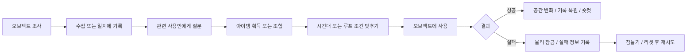
```mermaid
flowchart LR
    LOOK["오브젝트 조사"] --> NOTE["수첩 또는 일지에 기록"]
    NOTE --> ASK["관련 사용인에게 질문"]
    ASK --> ITEM["아이템 획득 또는 조합"]
    ITEM --> TIME["시간대 또는 루프 조건 맞추기"]
    TIME --> USE["오브젝트에 사용"]
    USE --> RESULT{"결과"}
    RESULT -- "성공" --> REWARD["공간 변화 / 기록 복원 / 숏컷"]
    RESULT -- "실패" --> FAIL["물리 잠금 / 실패 정보 기록"]
    FAIL --> RESET["잠들기 / 리셋 후 재시도"]
```

이 구조를 적용하는 대표 퍼즐:

| 퍼즐 | 조사 | 질문 | 아이템/시간 | 성공 보상 | 실패 처리 |
| --- | --- | --- | --- | --- | --- |
| 창문 닦기 | 대응접실 창문 | 마라 기본 안내 | 천 사용 | 조작 튜토리얼 완료 | 즉시 재시도 |
| 책 정리 | 서재 책장 | 에드가 반응 | 책 위치 정렬 | 일지 오브젝트 해금 | 즉시 재시도 |
| 시간표 조사 | 서재, 주방, 온실 앞, 서쪽 복도 | 루카, 이리스, 마라 | 저녁 종 직전 | J1 복원 | 다음 루프 숏컷 |
| 열세 번째 종 | 서재 벽시계, 서쪽 대시계 | 마라 힌트 | 저녁 종 이후 | J2 복원 | 시계망 잠금, 리셋 필요 |
| 중성 세정제 | 청소도구실, 약품장 | 마라, 루카 | 조합 순서 | C4 준비 완료 | 도구 회수 또는 조합 실패 |
| 검은 거울 | 대응접실 거울 | 에드가, 마라 | 열세 번째 종, 세정제 | J3, 지하 좌표 | 코팅 경화, 리셋 필요 |
| 지하창고 조합 | 서재 단서, 서쪽 복도 벽 | 사용인 반응 약함 | 조합 장치 | D2, 태엽 심장 | 하루 잠금, 리셋 필요 |

## 11. 상태별 공간 변화 표

| 공간 | S0 프롤로그 | S1 반복 | S2 금지 | S3 파열 | S4 코어 |
| --- | --- | --- | --- | --- | --- |
| 침실 | 안전한 방 | 수첩만 남음 | 잠들기 전 불안 | 같은 침실의 다른 아침 | 냉각 장치 실루엣 |
| 대응접실 | 창문 닦기 | 거울이 미묘하게 이상함 | 검은 거울 패널 노출 | 반사가 지연됨 | 코어로 가는 방 조각 |
| 중앙홀 | 이동 허브 | 취침 압박 | 사용인 감시 강화 | 관계 이벤트 허브 | 방 연결이 깨짐 |
| 서재 | 책 정리 | 일지 복원 | 지하 단서 | 기록 데이터가 노출 | 아버지 기록 조각 |
| 주방 | 차 준비 | 루카 신체 복선 | 약품장 조합 | 생명 유지 장치 노출 | 기상 절차 경고음 |
| 온실 | 잠김 | 날씨 모순 | 외부 데이터 누수 | 내부 접근, 센서 교정 | 현실의 빛과 공기 암시 |
| 서쪽 복도 | 장식 복도 | 열세 번째 종 | 지하 입구 반응 | 대시계 뒤 기계실 | 코어 접근로 |
| 지하창고 | 접근 불가 | 접근 불가 | 조합 퍼즐 | 파열 이후 의미 변화 | 코어의 하부 구조로 회상 |
| 코어실 | 없음 | 없음 | 없음 | 접근 목표 | 최종 선택 |

## 12. 추천 Godot 방 단위 Scene 분리

| Scene ID | 공간 | 주요 상태 변수 | 연결 Scene |
| --- | --- | --- | --- |
| `room_bedroom` | 주인공 침실 | `loop_state`, `notebook_persistent`, `broken_reset_triggered` | `room_parlor` |
| `room_parlor` | 대응접실 | `mirror_revealed`, `mirror_attempt_failed`, `edgar_alert` | `room_hall`, `room_tool` |
| `room_hall` | 중앙홀 | `time_phase`, `sleep_pressure`, `servant_hub_open` | 모든 1층 주요 방 |
| `room_library` | 서재 | `journal_stage`, `edgar_schedule_known`, `basement_clue_seen` | `room_hall`, `room_west_corridor` |
| `room_kitchen` | 주방 | `tea_done`, `neutral_cleaner_recipe`, `luca_event_done` | `room_hall`, `room_life_support` |
| `room_tool` | 청소도구실 | `coating_info_known`, `mara_hint_seen` | `room_hall`, `room_wire` |
| `room_greenhouse_front` | 온실 앞 | `weather_contradiction_seen`, `iris_hint_seen` | `room_hall`, `room_greenhouse` |
| `room_west_corridor` | 서쪽 복도 | `thirteenth_bell_known`, `basement_shortcut_unlocked` | `room_hall`, `room_basement_entry`, `room_clock_back` |
| `room_basement` | 지하창고 | `basement_puzzle_failed`, `heart_seen`, `fracture_triggered` | `room_west_corridor` |
| `room_clock_back` | 대시계 뒤 기계실 | `edgar_full_event_done`, `edgar_min_event_done`, `core_access_open` | `room_west_corridor`, `room_core_path` |
| `room_core_path` | 코어로 가는 길 | `father_record_seen`, `room_connection_solved` | `room_core` |
| `room_core` | 저택 코어실 | `j5_restored`, `researcher_confronted`, `ending_choice` | 엔딩 Scene |

## 13. 플레이어 동선 요약

최소 메인 동선:

```mermaid
flowchart LR
    BED["침실"] --> PARLOR["대응접실"]
    PARLOR --> LIB["서재"]
    LIB --> KITCHEN["주방"]
    KITCHEN --> BED2["침실 / 첫 리셋"]
    BED2 --> LIB2["서재 / 시간표"]
    LIB2 --> WEST["서쪽 복도 / 열세 번째 종"]
    WEST --> PARLOR2["대응접실 / 검은 거울"]
    PARLOR2 --> LIB3["서재 / 지하 단서"]
    LIB3 --> BASE["지하창고 / 태엽 심장"]
    BASE --> BROKEN["BROKEN_RESET"]
    BROKEN --> HUB["중앙홀 / 관계 허브"]
    HUB --> CLOCK_BACK["대시계 뒤 / 에드가 최소 대면"]
    CLOCK_BACK --> CORE["코어실"]
    CORE --> END["최종 선택"]
```

권장 감정 동선:

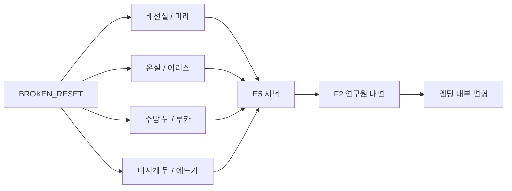
```mermaid
flowchart LR
    BROKEN["BROKEN_RESET"] --> MARA["배선실 / 마라"]
    BROKEN --> IRIS["온실 / 이리스"]
    BROKEN --> LUCA["주방 뒤 / 루카"]
    BROKEN --> EDGAR["대시계 뒤 / 에드가"]
    MARA --> E5["E5 저녁"]
    IRIS --> E5
    LUCA --> E5
    EDGAR --> E5
    E5 --> F2["F2 연구원 대면"]
    F2 --> ENDING["엔딩 내부 변형"]
```

## 14. 설계상 주의점

| 주의점 | 문제 | 권장 처리 |
| --- | --- | --- |
| 중앙홀이 너무 넓은 메뉴처럼 느껴질 수 있음 | 공간감보다 UI 허브처럼 보일 위험 | 시간대별 사용인 배치, 소리, 조명 변화로 실제 저택처럼 느끼게 한다. |
| 서쪽 동선이 너무 중요해질 수 있음 | 플레이어가 다른 방을 덜 보게 됨 | 주방, 온실, 청소도구실에 퍼즐 필수 단서와 감정 단서를 분배한다. |
| D5 이후 방이 전부 열리면 혼란스러움 | 관계 이벤트 허브가 과부하될 수 있음 | E2_INTRO 후 수첩에 `한 명씩 확인하자` 목표를 제공한다. |
| 지하창고와 코어가 겹쳐 보일 수 있음 | 둘 다 숨은 진실 공간이라 역할이 흐려짐 | 지하창고는 위장 필터 해제, 코어는 선택과 책임의 공간으로 분리한다. |
| 침실 리셋이 후반에도 반복되면 규칙이 애매함 | D5 이후 잠들기의 의미가 흐려짐 | D5 이후에는 `잠든다` 대신 `눈을 붙인다`, `휴식`, `동기화` 표현을 사용한다. |

## 15. 다음 상세화 추천

이 문서 다음 단계에서 정하면 좋은 항목은 아래와 같다.

1. 각 방의 실제 화면 구도: 정면 고정 화면인지, 좌우 패닝인지, 확대 조사 컷이 있는지.
2. 이동 아이콘 규칙: 항상 보이는 문, 조건부로 드러나는 문, 글리치 후 바뀌는 문 구분.
3. 방별 오브젝트 수: 메인 오브젝트, 보조 오브젝트, 분위기 오브젝트의 권장 개수.
4. D5 이후 방별 비주얼 변형표: 고딕 오브젝트가 어떤 SF 장치로 드러나는지.
5. E_HUB 관계 이벤트의 권장 순서와 힌트: 플레이어가 어느 사용인부터 만나도 감정 흐름이 깨지지 않게 한다.
6. F0 깨진 방 연결 퍼즐 상세: 침실, 서재, 주방, 온실 조각을 어떤 순서로 연결할지 정한다.
