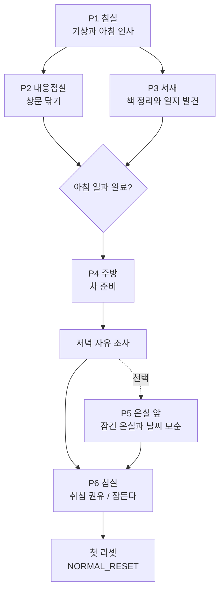
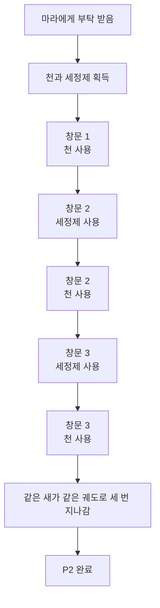
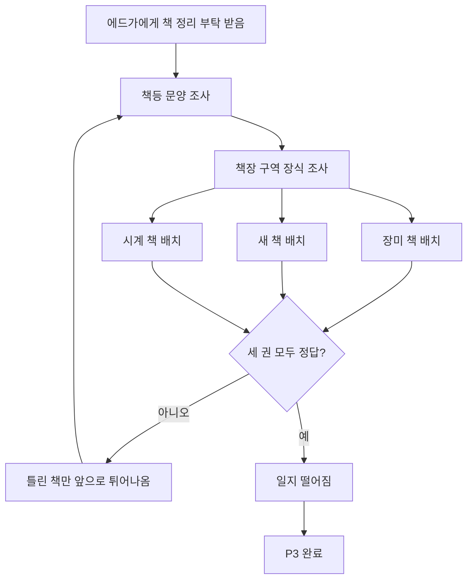

# GGB 이벤트 상세 01: 튜토리얼 / 일상 이벤트

## 1. 문서 목적

본 문서는 전체 이벤트 카테고리 중 첫 번째인 `튜토리얼 / 일상 이벤트`를 상세화한다.

대상 이벤트:

| ID | 이벤트명 | 위치 | 핵심 기능 |
| --- | --- | --- | --- |
| P1 | 기상과 아침 인사 | 주인공 침실 | 기본 조사, 수첩 메뉴, 침실 기준점 소개 |
| P2 | 창문 닦기 | 대응접실 | 아이템 획득, 아이템 사용, 반복 풍경 암시 |
| P3 | 책 정리와 서재의 일지 발견 | 서재 | 관찰 기반 배치 퍼즐, 일지 오브젝트 해금 |
| P4 | 차 준비 | 주방 | 순서형 상호작용, 루카 소개, 아버지 복선 |
| P5 | 잠긴 온실과 날씨 모순 | 온실 앞 | 선택 조사, 이리스 소개, 세계 모순 암시 |
| P6 | 취침 권유 / 첫 리셋 | 중앙홀, 침실 | 하루 종료, 잠들기 확인, 첫 리셋 트리거 |

이 카테고리의 목표는 플레이어가 게임의 기본 조작을 익히는 동시에, `이 저택은 평온하지만 어딘가 반복되고 있다`는 감각을 자연스럽게 받게 하는 것이다.

## 2. 카테고리 전체 흐름



진행 원칙:

- P2와 P3는 순서가 바뀌어도 된다.
- P4는 P2와 P3가 모두 끝난 뒤 열린다.
- P5는 선택 이벤트지만 강하게 유도한다.
- P6는 P4 이후 밤 시간대가 되면 발생한다.

## 3. 공통 상태 변수

| 변수 | 기본값 | 변경 이벤트 | 의미 |
| --- | --- | --- | --- |
| `tutorial_bedroom_done` | false | P1 | 침실 기본 조사 완료 |
| `parlor_windows_cleaned` | false | P2 | 창문 닦기 완료 |
| `library_books_sorted` | false | P3 | 책 정리 완료 |
| `journal_object_unlocked` | false | P3 | 일지 오브젝트가 서재에 등장 |
| `tea_prepared` | false | P4 | 차 준비 완료 |
| `greenhouse_contradiction_seen` | false | P5 | 날씨 모순 확인 |
| `first_sleep_prompt_seen` | false | P6 | 첫 취침 확인 대사 확인 |
| `first_reset_triggered` | false | P6 | 첫 리셋 실행 |
| `notebook_unlocked` | false | P1 | 수첩 UI 사용 가능 |
| `time_phase` | morning | P1~P6 | 아침, 낮, 저녁, 밤 진행 |

## 4. P1 기상과 아침 인사

### 4.1 기본 정보

| 항목 | 내용 |
| --- | --- |
| 이벤트 ID | P1 |
| 이벤트명 | 기상과 아침 인사 |
| 카테고리 | 튜토리얼 / 일상 |
| 발생 위치 | 주인공 침실 |
| 발생 시간대 | 아침 |
| 선행 조건 | 새 게임 시작 |
| 종료 조건 | 침실 문을 사용해 대응접실 또는 중앙홀 방향으로 이동 |
| 주요 NPC | 에드가 |
| 핵심 기능 | 기본 조사, 대화, 이동, 수첩 메뉴 해금 |

### 4.2 플레이어 목표

플레이어는 침실에서 깨어나 주변을 살펴보고, 에드가의 안내를 받은 뒤 방 밖으로 나간다.

겉으로는 평온한 아침이지만, 오브젝트 문장에 `정해진 하루`의 냄새를 아주 얇게 남긴다.

### 4.3 시작 연출

1. 검은 화면에서 작은 종소리 세 번.
2. 침대 위 시점으로 페이드인.
3. 창문에서 들어오는 빛이 너무 균일하게 흔들린다.
4. 에드가가 문밖에서 노크한다.
5. 에드가: `좋은 아침입니다, 아가씨. 오늘도 같은 시간에 눈을 뜨셨군요.`
6. 주인공은 `같은 시간`이라는 표현을 이상하게 여기지 않는다.

### 4.4 핵심 상호작용

| 대상 | 상호작용 | 결과 |
| --- | --- | --- |
| 침대 | 조사 | 잠들기와 침실 기준점 복선 |
| 창문 | 조사 | 좋은 날씨와 반복 풍경 복선 |
| 아버지 사진 | 조사 | 아버지의 부재와 무표정한 기억 제시 |
| 낙서 수첩 | 조사 | 수첩 UI 해금 |
| 침실 문 | 사용 | 방 밖 이동 |
| 에드가 | 대화 | 아침 일과 안내 |

### 4.5 상호작용 상세

#### 침대

첫 조사:

> 이불이 포근하다. 조금 더 누워 있고 싶다.

두 번째 조사:

> 이 방은 너무 조용하다. 조용해서, 내가 숨 쉬는 소리만 크게 들린다.

기능:

- 현재는 잠들 수 없다.
- 밤 시간대 P6 이후에만 `잠든다` 선택지가 열린다.

#### 창문

첫 조사:

> 오늘도 좋은 날씨다.

두 번째 조사:

> 나뭇가지가 바람도 없는데 천천히 흔들린다.

기능:

- P2 창문 닦기에서 바깥 풍경 반복 복선을 회수한다.

#### 아버지 사진

첫 조사:

> 아버지는 사진을 찍을 때도 웃는 법을 몰랐다.

두 번째 조사:

> 그런데도 이 사진은 버리고 싶지 않다.

기능:

- J5 아버지 기록의 감정 기반을 미리 만든다.

#### 낙서 수첩

첫 조사:

> 그릴 게 없을 때는 집을 그린다. 집은 도망가지 않으니까.

시스템:

- `notebook_unlocked = true`
- 수첩 메뉴가 열린다.
- 현재 수첩에는 낙서, 사용인 그림, 저택 단면 그림만 있다.
- 아직 플레이어가 직접 기록할 수는 없다. 직접 기록 기능은 A1에서 열린다.

#### 에드가 대화

초기 대사:

> 에드가: 오늘의 일과는 가볍습니다. 창문을 닦고, 책을 정리하고, 차를 드시면 됩니다.

질문 선택지:

| 선택지 | 에드가 반응 | 기능 |
| --- | --- | --- |
| `왜 매일 일과가 정해져 있어?` | `일과는 마음을 안정시킵니다.` | 반복 구조 복선 |
| `아버지는 어디 있어?` | `서재에 기록을 남기셨습니다. 아직은... 정리 중입니다.` | 서재와 일지 복선 |
| `오늘은 밖에 나가도 돼?` | `정원은 아직 준비되지 않았습니다.` | 온실과 외부 차단 복선 |

### 4.6 완료 조건

아래 중 하나를 만족하면 P1을 완료 처리한다.

- 수첩을 조사한 뒤 침실 문 사용.
- 에드가와 대화한 뒤 침실 문 사용.
- 침실 오브젝트 2개 이상 조사 후 침실 문 사용.

완료 처리:

- `tutorial_bedroom_done = true`
- `notebook_unlocked = true`
- 대응접실, 서재, 중앙홀 이동 가능.
- 수첩 목표: `아침 일과를 돕자.`

### 4.7 실패 / 정체 처리

P1에는 실패가 없다.

정체 시 처리:

| 조건 | 힌트 |
| --- | --- |
| 30초 이상 아무 행동 없음 | 침실 문 아이콘이 아주 약하게 밝아짐 |
| 수첩 미확인 상태로 바로 나가려 함 | 주인공: `수첩은 챙겨야겠다.` |
| 침대만 반복 조사 | 에드가: `아가씨, 아침은 기다려주지 않습니다.` |

### 4.8 월드 변경

- 수첩 UI 해금.
- 침실 문 이동 해금.
- P2, P3 목표 생성.
- 에드가가 중앙홀 또는 서재 쪽으로 이동.

### 4.9 감각 / 심리 연출

- 햇빛은 따뜻하지만 지나치게 균일하다.
- 에드가의 목소리는 친절하지만 문장 끝이 일정하다.
- 침실은 안전하게 느껴져야 한다. 이 안전함이 후반부 잔류 엔딩의 감정적 근거가 된다.

### 4.10 구현 메모

```yaml
event_id: P1
scene: room_bedroom
time_phase: morning
start_flags:
  notebook_unlocked: false
end_flags:
  tutorial_bedroom_done: true
  notebook_unlocked: true
unlocks:
  - room_parlor
  - room_library
  - room_hall
notebook_goal: "아침 일과를 돕자."
```

## 5. P2 창문 닦기

### 5.1 기본 정보

| 항목 | 내용 |
| --- | --- |
| 이벤트 ID | P2 |
| 이벤트명 | 창문 닦기 |
| 카테고리 | 튜토리얼 / 일상 |
| 발생 위치 | 대응접실 |
| 발생 시간대 | 아침 |
| 선행 조건 | P1 완료 |
| 종료 조건 | 창문 세 장 청소 완료 |
| 주요 NPC | 마라 |
| 핵심 기능 | 아이템 획득, 아이템 사용, 단계별 오브젝트 반응 |

### 5.2 플레이어 목표

마라의 부탁을 받아 대응접실 창문 세 장을 닦는다.

겉으로는 가벼운 잡일이지만, 세 번째 창문에서 `같은 새가 같은 궤도로 반복해서 지나간다`는 첫 미세한 이질감을 제공한다.

### 5.3 시작 연출

1. 대응접실에 들어오면 마라가 창틀 아래에 앉아 있다.
2. 마라는 손에 든 천을 주인공에게 건네려다가 잠깐 멈춘다.
3. 마라: `아가씨 손에 물 묻히는 건 예의가 아니겠지만, 오늘은 사람이 부족해서요.`
4. 테이블 위에 `마른 천`, `일반 세정제`가 놓인다.

### 5.4 핵심 상호작용

| 대상 | 상호작용 | 결과 |
| --- | --- | --- |
| 마른 천 | 획득 | 인벤토리 `dry_cloth` 획득 |
| 일반 세정제 | 획득 | 인벤토리 `basic_cleaner` 획득 |
| 첫 번째 창문 | 천 사용 | 바로 닦임 |
| 두 번째 창문 | 세정제 사용 후 천 사용 | 순서형 아이템 사용 학습 |
| 세 번째 창문 | 세정제 사용 후 천 사용 | 새 반복 연출 발생 |
| 마라 | 대화 | 힌트와 태도 변화 |

### 5.5 창문별 기믹

| 창문 | 요구 행동 | 학습 내용 | 보상 |
| --- | --- | --- | --- |
| 창문 1 | 마른 천 사용 | 아이템을 오브젝트에 사용 | 청소 상태 1/3 |
| 창문 2 | 세정제 사용 → 천 사용 | 아이템 순서 | 청소 상태 2/3 |
| 창문 3 | 세정제 사용 → 천 사용 → 바깥 조사 | 완료 후 추가 조사 | 새 반복 기록 |

### 5.6 정답 흐름



### 5.7 오답 / 정체 처리

| 상황 | 반응 | 처리 |
| --- | --- | --- |
| 창문 2에 천만 사용 | `마른 천이 얼룩을 밀어내기만 한다.` | 세정제 아이템 강조 |
| 세정제만 반복 사용 | `얼룩이 흘러내린다. 이제 닦아내야 한다.` | 천 아이템 강조 |
| 창문에 찻잔 사용 | `차를 대접할 상대는 창밖에 없다.` | 진행 변화 없음 |
| 창문 3 완료 후 바로 떠남 | 마라가 `밖에 뭐라도 보셨어요?`라고 묻는다 | 바깥 반복 조사 유도 |
| 60초 이상 진행 없음 | 마라가 순서를 말하지 않고 행동을 묘사한다 | 간접 힌트 |

### 5.8 마라 힌트 단계

| 단계 | 조건 | 대사 |
| --- | --- | --- |
| 1 | 첫 오답 | `마른 걸로는 밀리기만 해요.` |
| 2 | 같은 오답 2회 | `적시고, 닦고. 순서는 보통 그렇죠.` |
| 3 | 장시간 정체 | `아가씨, 세정제는 뿌리라고 있는 거고 천은 닦으라고 있는 거예요.` |

### 5.9 완료 조건

- 세 창문의 상태가 모두 `clean`.
- 세 번째 창문 완료 후 새 반복 연출 확인.

완료 처리:

- `parlor_windows_cleaned = true`
- 수첩 선택 기록: `창밖의 새는 같은 곳을 세 번 날았다.`
- 마라 짧은 관계 플래그 후보: `mara_saw_player_notice_loop = true`
- P3가 아직 미완료라면 수첩 목표: `서재의 책 정리를 돕자.`
- P3가 완료라면 P4 해금.

### 5.10 감각 / 심리 연출

- 첫 번째 창문은 따뜻하다.
- 두 번째 창문은 손끝이 조금 차갑다.
- 세 번째 창문은 유리 안쪽에서 차가움이 올라오는 느낌.
- 새 반복은 노골적인 공포가 아니라 `방금도 본 것 같은데` 수준으로 처리한다.

### 5.11 구현 메모

```yaml
event_id: P2
scene: room_parlor
items:
  required:
    - dry_cloth
    - basic_cleaner
object_states:
  parlor_window_1: dirty
  parlor_window_2: dirty
  parlor_window_3: dirty
end_flags:
  parlor_windows_cleaned: true
  bird_loop_seen: true
notebook_add:
  - "창밖의 새는 같은 곳을 세 번 날았다."
```

## 6. P3 책 정리와 서재의 일지 발견

### 6.1 기본 정보

| 항목 | 내용 |
| --- | --- |
| 이벤트 ID | P3 |
| 이벤트명 | 책 정리와 서재의 일지 발견 |
| 카테고리 | 튜토리얼 / 일상 |
| 발생 위치 | 서재 |
| 발생 시간대 | 아침 |
| 선행 조건 | P1 완료 |
| 종료 조건 | 책 세 권 배치 후 일지 오브젝트 해금 |
| 주요 NPC | 에드가 |
| 핵심 기능 | 문양 관찰, 대응 배치, 일지 발견 |

### 6.2 플레이어 목표

에드가가 건네준 책 세 권을 책장의 올바른 구역에 꽂는다.

이 이벤트는 쉬운 배치 퍼즐이지만, `시계 문양 책`을 통해 일지가 떨어지며 메인 서사의 첫 물리 단서를 제공한다.

### 6.3 시작 연출

1. 서재에 들어가면 에드가가 책장 앞에서 책을 정리하고 있다.
2. 에드가: `아가씨께서 직접 하시면 기억에 더 오래 남겠지요.`
3. 책 세 권이 책상 위에 놓인다.
4. 책장 위에는 세 구역 장식이 있다.

### 6.4 핵심 상호작용

| 대상 | 상호작용 | 결과 |
| --- | --- | --- |
| 장미 문양 책 | 조사 / 들기 / 배치 | 장미 구역에 꽂아야 함 |
| 새 문양 책 | 조사 / 들기 / 배치 | 새 구역에 꽂아야 함 |
| 시계 문양 책 | 조사 / 들기 / 배치 | 시계 구역에 꽂으면 일지 해금 |
| 책장 구역 | 조사 | 구역 장식 힌트 |
| 에드가 | 대화 | 문양 대응 힌트 |
| 떨어진 일지 | 조사 | 현재는 읽을 수 없는 오브젝트로 등록 |

### 6.5 퍼즐 구조

| 책 | 정답 위치 | 오답 반응 |
| --- | --- | --- |
| 장미 문양 책 | 장미 장식 구역 | 책등이 살짝 앞으로 밀려나온다 |
| 새 문양 책 | 새 장식 구역 | 책장에서 작은 먼지가 떨어진다 |
| 시계 문양 책 | 시계 장식 구역 | 바늘 소리와 함께 일지가 떨어진다 |

### 6.6 정답 흐름



### 6.7 힌트 단계

| 단계 | 조건 | 힌트 |
| --- | --- | --- |
| 1 | 책 조사 | `책등에 장미가 새겨져 있다.` |
| 2 | 책장 조사 | `각 구역 위에 서로 다른 장식이 있다.` |
| 3 | 오답 2회 | 에드가: `책 제목보다 겉모습이 더 정직할 때도 있지요.` |
| 4 | 오답 4회 | 틀린 책이 자동으로 아주 조금 앞으로 튀어나온다 |

### 6.8 일지 발견

시계 문양 책을 정답 위치에 꽂는 순간:

1. 책장 뒤쪽에서 아주 작은 금속음.
2. 시계 구역의 장식 바늘이 한 칸 움직인다.
3. 낡은 일지가 책상 아래로 떨어진다.
4. 에드가가 평소보다 빠르게 일지 쪽으로 시선을 돌린다.

일지 조사 문장:

> 표지는 낡았지만 먼지가 거의 없다. 누군가 계속 만졌던 것처럼.

현재 상태:

- 읽을 수 없다.
- 표면의 문장이 검은 잉크로 뭉개져 있다.
- `journal_object_unlocked = true`
- `journal_stage = 0`

### 6.9 완료 조건

- 책 세 권이 모두 정답 위치에 배치됨.
- 일지 오브젝트 조사 또는 에드가의 회수 대사 확인.

완료 처리:

- `library_books_sorted = true`
- `journal_object_unlocked = true`
- 수첩 기록: `아버지의 일지? 에드가는 장부라고 했다.`
- P2가 완료되어 있다면 P4 해금.

### 6.10 감각 / 심리 연출

- 서재는 정돈되어 있지만 숨이 잘 안 쉬어지는 느낌.
- 책을 옮길 때 먼지가 거의 나지 않는다. 오래된 방처럼 보이지만 실제로는 깨끗하다.
- 일지가 떨어질 때 소리가 종소리처럼 들려 B3의 청각 단서를 예고한다.

### 6.11 구현 메모

```yaml
event_id: P3
scene: room_library
puzzle_type: symbol_match
objects:
  books:
    - rose_book
    - bird_book
    - clock_book
  shelves:
    - rose_shelf
    - bird_shelf
    - clock_shelf
success:
  all_books_matched: true
end_flags:
  library_books_sorted: true
  journal_object_unlocked: true
  journal_stage: 0
notebook_add:
  - "아버지의 일지? 에드가는 장부라고 했다."
```

## 7. P4 차 준비

### 7.1 기본 정보

| 항목 | 내용 |
| --- | --- |
| 이벤트 ID | P4 |
| 이벤트명 | 차 준비 |
| 카테고리 | 튜토리얼 / 일상 |
| 발생 위치 | 주방 |
| 발생 시간대 | 낮 |
| 선행 조건 | P2, P3 완료 |
| 종료 조건 | 차를 완성하고 루카와 대화 완료 |
| 주요 NPC | 루카 |
| 핵심 기능 | 순서형 상호작용, 선택 대화, 아버지 복선 |

### 7.2 플레이어 목표

루카의 안내에 따라 아버지가 좋아하던 차를 준비한다.

퍼즐 난이도는 낮게 유지한다. 목적은 조합 퍼즐을 어렵게 만드는 것이 아니라, 이후 C3 중성 세정제 조합을 위한 `순서형 상호작용` 감각을 미리 익히게 하는 것이다.

### 7.3 시작 연출

1. 주방에 들어가면 루카가 이미 찻잔을 정렬해두었다.
2. 물 끓는 소리가 일정한 박자로 반복된다.
3. 루카: `차는 순서를 지키면 맛이 흐트러지지 않습니다. 사람도... 대체로 그렇고요.`

### 7.4 핵심 상호작용

| 대상 | 상호작용 | 결과 |
| --- | --- | --- |
| 주전자 | 조사 / 사용 | 뜨거운 물 준비 |
| 찻잎 통 | 조사 / 사용 | 찻잎 넣기 |
| 찻잔 | 조사 / 사용 | 차 담기 |
| 설탕 | 선택 사용 | 아버지 취향 대화 변화 |
| 루카 | 대화 | 아버지와 신체 상태 복선 |
| 오븐 | 선택 조사 | 일정 온도 유지 복선 |

### 7.5 차 준비 순서

권장 정답:

1. 찻잔 조사.
2. 찻잎 통 사용.
3. 주전자 사용.
4. 잠깐 기다리기.
5. 설탕을 넣을지 선택.
6. 루카에게 완성된 차 전달.

설탕 선택:

| 선택 | 루카 반응 | 수첩 기록 |
| --- | --- | --- |
| 설탕을 넣는다 | `아버님은 달게 드시지 않았습니다. 그래도 아가씨 취향이라면 괜찮겠지요.` | `아버지는 설탕을 넣지 않았다.` |
| 설탕을 넣지 않는다 | `기억하고 계셨군요. 아니, 기억하실 리가...` | `루카는 아버지의 취향을 너무 정확히 기억한다.` |
| 루카에게 묻는다 | `저라면 넣지 않겠습니다.` | `루카는 아버지를 직접 모셨던 것처럼 말했다.` |

### 7.6 오답 / 정체 처리

| 상황 | 반응 | 처리 |
| --- | --- | --- |
| 물 없이 찻잎만 넣음 | `마른 찻잎 냄새만 난다.` | 주전자 강조 |
| 찻잎 없이 물만 넣음 | 루카: `그건 차라기보다 따뜻한 물입니다.` | 찻잎 통 강조 |
| 설탕을 과하게 넣음 | 주인공: `너무 달다. 그런데 루카는 놀라지 않는다.` | 진행 가능, 대사 변화 |
| 오븐만 반복 조사 | `불을 켜지 않았는데도 온도가 일정하다.` | 루카 신체 복선 대화 해금 |

P4는 실패로 막지 않는다. 잘못된 순서도 루카가 바로잡아주며, 플레이어는 차 준비를 완료할 수 있다.

### 7.7 루카 대화

기본 대사:

> 루카: 아버님은 늘 식기 전에 드셨습니다. 뜨거운 것을 오래 붙잡는 걸 싫어하셨죠.

선택지:

| 선택지 | 루카 반응 | 관계 / 정보 |
| --- | --- | --- |
| `아버지를 잘 알아?` | `기록으로는요. 기록은 오래 남으니까요.` | 아버지와 연구원 관계 복선 |
| `왜 주방이 이렇게 따뜻해?` | `사람이 지내려면 일정한 온도가 필요합니다.` | 생명 유지 장치 복선 |
| `나는 어떤 차를 좋아했어?` | 루카가 잠깐 멈춘 뒤 `아직 정해지지 않았습니다.` | 주인공의 반복 삶 암시 |

### 7.8 완료 조건

- 차 준비 완료.
- 루카에게 차 전달 또는 루카의 확인 대사 완료.

완료 처리:

- `tea_prepared = true`
- `time_phase = evening`
- 중앙홀에서 저녁 자유 조사 시작.
- P5 선택 이벤트 해금.
- P6 밤 이벤트 예약.

### 7.9 감각 / 심리 연출

- 주방은 다른 방보다 따뜻하다.
- 그러나 따뜻함이 난로의 온기보다 보온 장치처럼 일정하다.
- 주인공이 찻잔을 잡을 때 손끝이 순간적으로 차갑다는 대사를 넣어 루카가 반응하게 한다.

### 7.10 구현 메모

```yaml
event_id: P4
scene: room_kitchen
time_phase: noon
preconditions:
  parlor_windows_cleaned: true
  library_books_sorted: true
interaction_type: sequence_assist
end_flags:
  tea_prepared: true
  time_phase: evening
unlocks:
  - evening_free_investigation
  - greenhouse_front_optional
scheduled:
  - P6
```

## 8. P5 잠긴 온실과 날씨 모순

### 8.1 기본 정보

| 항목 | 내용 |
| --- | --- |
| 이벤트 ID | P5 |
| 이벤트명 | 잠긴 온실과 날씨 모순 |
| 카테고리 | 튜토리얼 / 일상 |
| 발생 위치 | 온실 앞 복도 |
| 발생 시간대 | 저녁 자유 조사 |
| 선행 조건 | P4 완료 |
| 종료 조건 | 이리스와 대화하고 날씨 모순 확인 |
| 주요 NPC | 이리스 |
| 핵심 기능 | 선택 조사, 세계 모순 암시, 외부 현실 복선 |

### 8.2 플레이어 목표

플레이어는 저녁 자유 조사 중 잠긴 온실 앞을 확인하고, 이리스의 말과 창밖 날씨가 맞지 않는다는 사실을 수첩에 남긴다.

P5는 메인 필수는 아니지만 권장 이벤트다. 보지 않아도 P6로 갈 수 있으나, 이후 이리스 관계 이벤트와 ED_REALITY의 감정 설득력이 약해진다.

### 8.3 시작 조건

P4 완료 후 중앙홀에 나오면 이동 가능한 장소가 늘어난다.

- 침실: 취침 가능하지만 아직 약한 유도만 있음.
- 온실 앞: 새 이동 아이콘 강조.
- 대응접실, 서재, 주방: 짧은 반복 조사 가능.

온실 앞에 처음 진입하면:

1. 유리 너머로 희미한 초록빛.
2. 바깥 하늘은 맑다.
3. 온실 안쪽에서는 빗방울 소리.
4. 이리스가 문 너머에서 `비가 그치지 않네요`라고 말한다.

### 8.4 핵심 상호작용

| 대상 | 상호작용 | 결과 |
| --- | --- | --- |
| 잠긴 온실 문 | 조사 | 문이 잠겨 있고 안쪽에서 습기가 느껴짐 |
| 온실 유리 | 닦기 / 조사 | 잠깐 내부가 보이지만 다시 흐려짐 |
| 복도 창문 | 조사 | 바깥은 맑음 |
| 이리스 | 대화 | 안쪽 날씨와 바깥 날씨 모순 발생 |
| 수첩 | 자동 기록 | 날씨 모순 기록 |

### 8.5 상호작용 상세

#### 잠긴 온실 문

첫 조사:

> 문은 잠겨 있다. 손잡이는 젖어 있지만, 내 손에는 물이 묻지 않는다.

두 번째 조사:

> 안쪽에서 흙냄새가 난다. 오래 닫혀 있던 방에서 날 냄새는 아니다.

#### 온실 유리

첫 조사:

> 안쪽이 습기로 흐리다.

닦기 시도:

> 손바닥으로 닦인 틈 사이로 잎사귀보다 반듯한 금속 선이 먼저 보였다.

현재는 내부 진입 불가.

#### 복도 창문

조사:

> 창밖은 맑다. 비가 올 구름은 없다.

#### 이리스 대화

기본:

> 이리스: 오늘은 비가 길어요. 뿌리가 숨을 쉬기엔 좋은 날이지만요.

선택지:

| 선택지 | 이리스 반응 | 기능 |
| --- | --- | --- |
| `밖은 맑은데?` | `밖이라니요? 아가씨가 보는 곳 말씀이신가요?` | 공간 기준 혼란 |
| `문을 열어줄 수 있어?` | `아직은 안 됩니다. 아직은요.` | D5 이후 개방 복선 |
| `온실 안에는 뭐가 있어?` | `계절을 붙잡아두는 것들이요.` | 계절 장치 복선 |

### 8.6 완료 조건

아래 세 가지 중 두 가지 이상을 확인하면 완료 처리한다.

- 온실 문 조사.
- 복도 창문 조사.
- 이리스에게 날씨 질문.

완료 처리:

- `greenhouse_contradiction_seen = true`
- 수첩 기록: `이리스는 비가 온다고 했다. 창밖은 맑았다.`
- 이리스 짧은 관계 이벤트 후보 `IRIS_S1` 선행 조건 충족.

### 8.7 실패 / 정체 처리

P5는 선택 이벤트라 실패는 없다.

정체 시:

| 조건 | 힌트 |
| --- | --- |
| 온실 문만 반복 조사 | 이리스: `유리 너머의 하늘도 보셨나요?` |
| 복도 창문만 보고 떠남 | 안쪽에서 빗방울 소리가 한 번 크게 들림 |
| P5를 생략하고 침실로 감 | P6 진행 가능. 단, 이후 이리스의 첫 반응이 더 차갑고 설명이 적음 |

### 8.8 감각 / 심리 연출

- 소리와 시각 정보가 서로 맞지 않게 만든다.
- 비는 들리지만 보이지 않는다.
- 습기는 보이지만 손은 젖지 않는다.
- 이리스는 거짓말하는 것처럼 보이지 않는다. 오히려 이리스가 보는 세계와 주인공이 보는 세계가 다르다는 느낌을 준다.

### 8.9 구현 메모

```yaml
event_id: P5
scene: room_greenhouse_front
time_phase: evening
optional: true
completion_rule:
  required_observations: 2
  candidates:
    - greenhouse_door_checked
    - outer_weather_checked
    - iris_weather_dialogue_seen
end_flags:
  greenhouse_contradiction_seen: true
  iris_s1_precondition: true
notebook_add:
  - "이리스는 비가 온다고 했다. 창밖은 맑았다."
```

## 9. P6 취침 권유 / 첫 리셋

### 9.1 기본 정보

| 항목 | 내용 |
| --- | --- |
| 이벤트 ID | P6 |
| 이벤트명 | 취침 권유 / 첫 리셋 |
| 카테고리 | 튜토리얼 / 일상 |
| 발생 위치 | 중앙홀, 저택 공용 공간, 주인공 침실 |
| 발생 시간대 | 밤 |
| 선행 조건 | P4 완료 후 저녁 조사 종료 조건 충족 |
| 종료 조건 | 침대에서 잠든다 선택 |
| 주요 NPC | 에드가, 마라, 루카, 이리스 |
| 핵심 기능 | 하루 종료, 이동 제한, 첫 NORMAL_RESET 트리거 |

### 9.2 플레이어 목표

저택의 사용인들이 밤이 되었음을 알리고, 플레이어는 침실로 돌아가 잠든다.

이 이벤트는 플레이어에게 `잠들기 = 루프 트리거`라는 사실을 아직 설명하지 않는다. 첫 회차에서는 단순한 하루 종료처럼 보이게 한다.

### 9.3 발생 조건

P4 완료 후 아래 중 하나가 충족되면 P6가 시작된다.

- P5 완료.
- 저녁 자유 조사에서 주요 방 2곳 이상 재방문.
- 플레이어가 침실로 돌아가려 함.
- 일정 시간 이상 중앙홀에 머무름.

### 9.4 시작 연출

1. 중앙홀의 조명이 한 단계 어두워진다.
2. 멀리서 종소리 열두 번.
3. 사용인들의 위치가 조금씩 침실 방향 동선에 맞춰 재배치된다.
4. 에드가가 중앙홀 끝에 선다.
5. 에드가: `오늘 하루도 무사히 끝났습니다. 이제 쉬실 시간입니다.`

### 9.5 핵심 상호작용

| 대상 | 상호작용 | 결과 |
| --- | --- | --- |
| 중앙홀 | 이동 | 침실 외 방향은 부드럽게 제한 |
| 에드가 | 대화 | 취침 권유, 다른 방 이동 제한 |
| 마라 | 대화 | 청소를 핑계로 대응접실 재진입 제한 |
| 루카 | 대화 | 따뜻한 차를 권하며 침실 이동 유도 |
| 이리스 | 대화 | 온실 문 닫힘 확인, 내일 언급 |
| 침대 | 사용 | 취침 확인 UI |

### 9.6 이동 제한 방식

P6는 강제 컷신으로 즉시 침실에 보내지 않는다. 플레이어가 저택을 조금 더 돌아보려 할 수 있게 두되, 사용인들이 부드럽게 길을 줄인다.

| 이동 시도 | 처리 |
| --- | --- |
| 대응접실 이동 | 마라가 `바닥이 젖었다`며 막음 |
| 서재 이동 | 에드가가 `서재는 정리 중`이라며 막음 |
| 주방 이동 | 루카가 `밤에는 찬 바닥이 좋지 않다`며 차를 쥐여줌 |
| 온실 앞 이동 | 이리스가 안에서 불을 끄며 `내일 보자`고 말함 |
| 침실 이동 | 정상 진행 |

### 9.7 침대 상호작용

침대 조사:

> 이불이 아침보다 차갑다. 그런데 이 방은 여전히 안전해 보인다.

침대 사용 시 확인:

| 선택지 | 결과 |
| --- | --- |
| `잠든다` | 첫 리셋 진행 |
| `아직` | 침실 조사 가능. 방 밖 이동은 제한 유지 |

두 번 `아직` 선택 시:

> 주인공: 이상하게 모두가 내가 잠들기만을 기다리는 것 같다.

### 9.8 첫 리셋 연출

1. 주인공이 눈을 감는다.
2. 종소리가 아주 멀리서 한 번 더 들린다.
3. 화면 암전.
4. 침대 시트 주름, 창문 빛, 아버지 사진이 빠르게 원래 위치로 돌아가는 짧은 몽타주.
5. 수첩 페이지 하나만 어둠 속에 남는다.
6. 다음 아침, P1과 같은 구도로 눈을 뜬다.
7. 에드가: `좋은 아침입니다, 아가씨. 오늘도 같은 시간에 눈을 뜨셨군요.`
8. 플레이어가 어제와 같은 대사임을 인지한다.

### 9.9 완료 조건

- 침대에서 `잠든다` 선택.
- 첫 리셋 연출 완료.

완료 처리:

- `first_sleep_prompt_seen = true`
- `first_reset_triggered = true`
- `loop_state = NORMAL_RESET`
- `time_phase = morning`
- 물리 상태 초기화.
- 수첩과 플레이어 지식 유지.
- `SYS-01 첫 리셋` 실행.
- 다음 목표: A1 수첩 표시 실험.

### 9.10 실패 / 정체 처리

P6는 실패가 없다. 다만 플레이어가 취침을 거부할 수 있다.

| 조건 | 처리 |
| --- | --- |
| 침실 밖으로 계속 나가려 함 | 사용인들의 제지 대사가 반복되되, 세 번째부터 짧아짐 |
| 침대에서 `아직` 반복 | 방 안 오브젝트 반응이 점점 짧아짐 |
| 3분 이상 취침하지 않음 | 수첩 목표가 `잠들자`로 바뀜 |

### 9.11 사용인별 취침 권유 대사

| 사용인 | 대사 | 숨은 의미 |
| --- | --- | --- |
| 에드가 | `규칙적인 수면은 건강에 좋습니다.` | 루프 규칙 유지 |
| 마라 | `내일이면 다 깨끗해질 거예요.` | 물리 상태 초기화 복선 |
| 이리스 | `밤에는 계절도 문을 닫아요.` | 온실과 외부 데이터 차단 |
| 루카 | `몸을 식히면 안 됩니다.` | 냉각 장치와 생명 유지 복선 |

### 9.12 감각 / 심리 연출

- 첫날의 밤은 무섭기보다 이상하게 단정해야 한다.
- 사용인들이 모두 친절하지만, 방향이 같다. 모두 `잠들라`고 말한다.
- 플레이어가 침실을 감옥이 아니라 안전지대로 받아들이게 만든다.
- 리셋 직후 같은 대사가 반복되며 처음으로 안전함이 불안으로 바뀐다.

### 9.13 구현 메모

```yaml
event_id: P6
scene:
  - room_hall
  - room_bedroom
time_phase: night
preconditions:
  tea_prepared: true
soft_requirements:
  - greenhouse_contradiction_seen
movement_locks:
  allowed:
    - room_bedroom
  blocked:
    - room_parlor
    - room_library
    - room_kitchen
    - room_greenhouse_front
sleep_prompt:
  choices:
    - sleep
    - not_yet
on_sleep:
  first_reset_triggered: true
  loop_state: NORMAL_RESET
  time_phase: morning
next_event: SYS-01
```

## 10. 카테고리 1 완료 기준

튜토리얼 / 일상 이벤트 카테고리는 아래 조건을 만족하면 완료로 본다.

| 조건 | 설명 |
| --- | --- |
| 기본 조사 학습 | 침실 오브젝트와 수첩 조사 |
| 이동 학습 | 침실에서 대응접실, 서재, 주방, 온실 앞까지 이동 |
| 아이템 사용 학습 | P2 창문 닦기 |
| 관찰 배치 학습 | P3 책 정리 |
| 순서형 상호작용 학습 | P4 차 준비 |
| 선택 조사 학습 | P5 온실 모순 |
| 하루 종료 학습 | P6 잠들기 |
| 첫 리셋 진입 | P6 이후 SYS-01 실행 |

## 11. 다음 카테고리로 넘길 정보

다음 문서 `이벤트 상세 02: 루프 / 영구 정보 / 숏컷 이벤트`에서 받아야 하는 정보는 아래와 같다.

| 전달 정보 | 사용처 |
| --- | --- |
| `first_reset_triggered = true` | SYS-01 첫 리셋 |
| `notebook_unlocked = true` | A1 수첩 표시 실험 |
| P2/P3/P4 완료 정보 | 일과 숏컷 처리 |
| `greenhouse_contradiction_seen` | 이리스 짧은 반응, ED_REALITY 복선 |
| `bird_loop_seen` | 반복 풍경 인지 |
| `journal_object_unlocked` | J1 복원 전 서재 일지 접근 |

## 12. 설계상 주의점

| 주의점 | 이유 | 권장 처리 |
| --- | --- | --- |
| 튜토리얼이 너무 길면 안 됨 | 리셋 구조가 늦게 나오면 핵심 재미가 흐려짐 | P1~P6는 10~15분 안에 끝나게 설계 |
| 불안을 너무 빨리 드러내면 안 됨 | 초반 저택의 안정감이 잔류 엔딩의 근거가 됨 | P2/P5의 모순은 작고 감각적으로만 제시 |
| P5를 완전 필수로 만들지 않음 | 자유 조사 감각을 살리기 위해 | 생략 가능하되 이후 이리스 정보량을 줄임 |
| 사용인이 적대적으로 보이면 안 됨 | 후반 관계 시스템의 양가감정이 약해짐 | 제지는 친절하고 절차적으로 표현 |
| 수첩 기능을 너무 일찍 만능으로 보이면 안 됨 | A1의 발견감이 약해짐 | P1에서는 열람만, 직접 기록은 A1에서 해금 |

