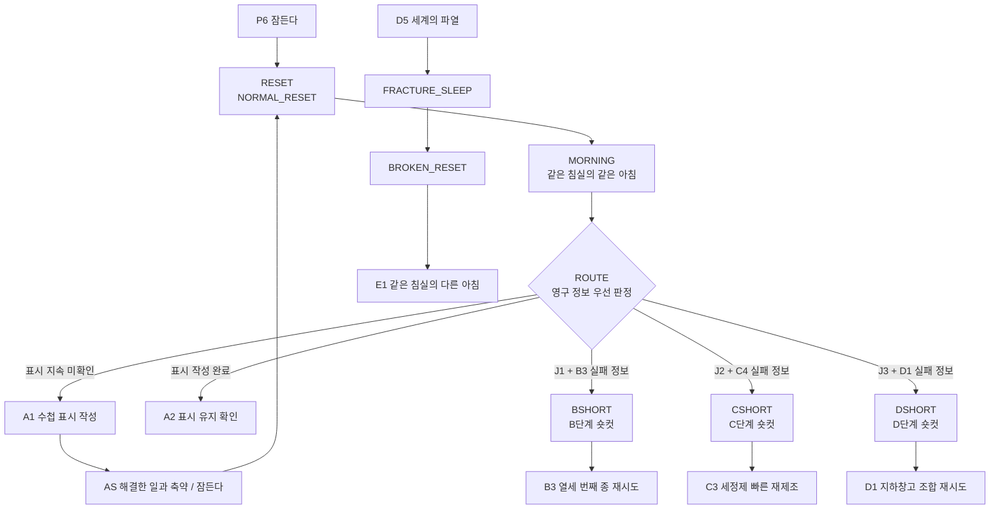
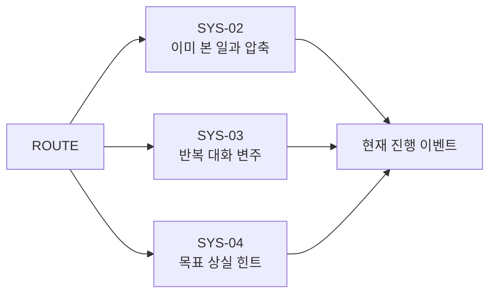
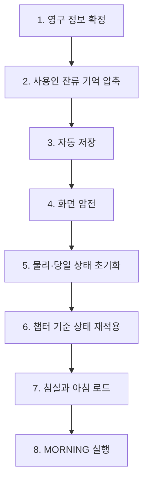
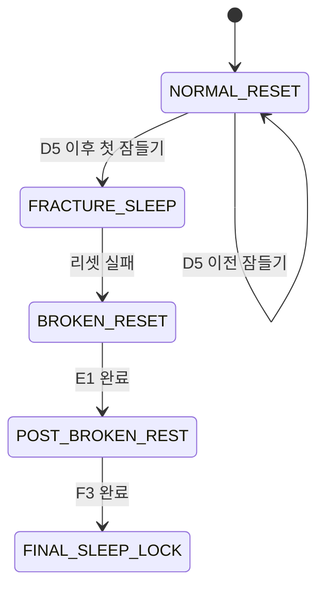
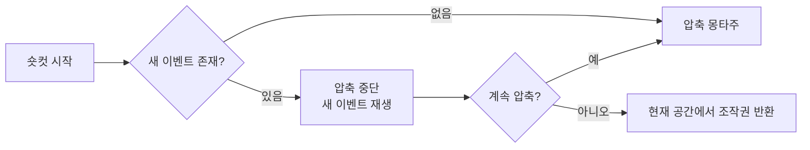

# GGB 이벤트 상세 02: 루프 / 영구 정보 / 숏컷 이벤트

## 1. 문서 목적

본 문서는 GGB의 핵심 시스템인 `잠들기`, `물리 세계 리셋`, `영구 정보 유지`, `반복 경로 압축`을 실제 이벤트 단위로 구체화한다.

이 카테고리의 목표는 다음과 같다.

- 잠드는 행동을 단순한 하루 종료가 아니라 퍼즐 해결 수단으로 만든다.
- 리셋할 때마다 같은 침실의 같은 아침으로 돌아간다는 원칙을 유지한다.
- 체크포인트 없이도 이미 해결한 일과와 이동을 숏컷으로 줄인다.
- 수첩, 일지, 실패 원인, 관계 상태가 다음 루프의 가능성을 넓히게 한다.
- 사용인이 이전 루프를 기억하면서도 메인 진행을 부당하게 막지 않도록 한다.
- D5 이전의 `NORMAL_RESET`과 D5 이후의 `BROKEN_RESET`을 명확히 분리한다.

본 문서에서 상세히 다루는 이벤트는 아래와 같다.

| 구분 | 이벤트 |
| --- | --- |
| 정상 리셋 | `RESET`, `SYS-01` |
| 리셋 후 도입 | `MORNING`, `ROUTE` |
| 루프 증명 | `A1`, `AS`, `A2` |
| 진행 숏컷 | `BSHORT`, `CSHORT`, `DSHORT` |
| 반복 보조 | `SYS-02`, `SYS-03`, `SYS-04` |
| 후반 경계 | `FRACTURE_SLEEP`, `BROKEN_RESET`, `POST_BROKEN_REST`, `FINAL_SLEEP_LOCK`의 시스템 경계 |

`D5 세계의 파열` 이후의 장면 연출과 감정 이벤트는 카테고리 08에서 별도로 상세화한다. 본 문서에서는 상태 전환 규칙만 정의한다.

## 2. 핵심 설계 원칙

### 2.1 리셋은 체크포인트 이동이 아니다

주인공이 D5 이전에 잠들면 언제나 같은 침실의 같은 아침으로 돌아간다.

- 루프 시작 위치를 중간 방으로 옮기지 않는다.
- 해결한 퍼즐 위치에 플레이어를 직접 배치하지 않는다.
- 물리적으로 열어 둔 문과 옮긴 물건은 원래 상태로 돌아간다.
- 반복 축소는 영구 정보와 축약 행동을 통해 제공한다.

### 2.2 리셋은 실패 취소이자 새로운 입력 수단이다

리셋을 요구하는 퍼즐은 플레이어가 당일에 자의적으로 되돌리기 어려운 물리적 변형을 포함한다.

예시:

- 시계망의 잠금 장치가 한 번 작동하면 당일에는 다른 시계를 시험할 수 없다.
- 거울 코팅이 잘못 경화되면 당일에는 제거할 수 없다.
- 지하창고 조합 장치의 축이 잘못 맞물리면 당일에는 다시 돌릴 수 없다.

단순 위치 맞추기나 즉시 되돌릴 수 있는 오답에는 수면 리셋을 강요하지 않는다.

### 2.3 유지되는 정보가 다음 시도의 선택지를 넓힌다

리셋 전 실패는 단순 소모가 아니다.

- 실패 원인이 수첩에 기록된다.
- 잘못된 선택지가 다음 루프에서 제외 표시된다.
- 사용인이 이전 시도를 압축된 기억으로 인식한다.
- 이미 해결한 일과는 축약할 수 있다.
- 같은 퍼즐이라도 더 정확한 정보와 다른 접근법으로 다시 시도한다.

### 2.4 랜덤성으로 반복을 변형하지 않는다

루프마다 정답, 사용인 시간표, 필수 아이템 위치를 무작위로 바꾸지 않는다.

변화는 아래 세 가지에서 발생한다.

1. 플레이어가 새롭게 얻은 영구 정보.
2. 사용인 관계 상태에 따른 반응과 제한적인 도움.
3. 진행 단계에 따른 세계의 균열과 오브젝트 문장 변화.

### 2.5 유연한 시간제를 사용한다

본 게임의 시간은 실시간 카운트다운이 아니라 주요 행동에 따라 전진한다.

- 일반 조사만으로 시간이 흐르지 않는다.
- `일과 완료`, `대기`, `시간표대로 움직이기`, `취침` 같은 명시적 행동이 시간대를 전환한다.
- 플레이어가 읽거나 생각하는 동안 이벤트 기회를 잃지 않는다.
- 숏컷은 실제 이동과 행동을 압축하되, 필요한 시간대까지 논리적으로 시간을 전진시킨다.

## 3. 카테고리 전체 흐름



### 반복 보조 이벤트



## 4. 상태 계층과 리셋 규칙

### 4.1 상태 계층

| 상태 계층 | 리셋 여부 | 예시 |
| --- | --- | --- |
| 물리 월드 상태 | 완전 초기화 | 문 개폐, 오브젝트 위치, 아이템, 장치 잠금, NPC 당일 위치 |
| 당일 이벤트 상태 | 완전 초기화 | 수행 중인 일과, 자유 조사 소비, 현재 시간대, 당일 대화 횟수 |
| 영구 진행 상태 | 유지 | 수첩 기록, 일지 복원 단계, 퍼즐 지식, 실패 정보, 숏컷 권한 |
| 주인공 인지 상태 | 유지 | 루프 의심, 루프 확신, 감각 비교 독백, 선택한 대화 주제 |
| 사용인 표층 역할 | 초기화 | 아침 인사, 기본 동선, 일과 제시, 역할상 제지 |
| 사용인 잔류 기억 | 유지 | 반복 행동의 압축 로그, 관계도, 경계도, 감정 균열 |
| 챕터 상태 | 조건부 유지 | 균열 단계, 검은 거울 노출, D5 이후 리셋 모드 |

### 4.2 리셋 시 유지 목록

- `loop_index`
- `loop_awareness`
- 수첩 기록과 수첩에 그린 표시
- 일지 복원 단계와 이미 읽은 문장
- 퍼즐 규칙 지식
- 실패 원인 기록
- 시험한 선택지 목록
- 해결한 일과의 축약 권한
- 지식 기반 공간 접근 숏컷
- 사용인별 `bond`, `alert`
- 사용인별 압축 기억 로그
- 이미 본 대화와 연출 식별자
- 챕터 진행 플래그

### 4.3 리셋 시 초기화 목록

- 일반 인벤토리
- 물리적으로 제조한 세정제
- 문과 서랍의 개폐 상태
- 옮기거나 파손한 오브젝트
- 시계망의 당일 입력 상태
- 거울 코팅의 당일 상태
- 지하 조합 장치의 축과 잠금 상태
- 사용인의 현재 위치
- 현재 시간대
- 당일 사용한 개입 예산
- 당일 사용한 자유 조사 선택

### 4.4 조건부 유지 목록

| 요소 | 유지 규칙 |
| --- | --- |
| 아버지 일지 | 물리적 위치는 원래대로 돌아가지만 복원된 문장은 유지된다. |
| 검은 거울 | J3 이전에는 코팅이 복원된다. J3 이후에는 노출 상태가 챕터 상태로 고정된다. |
| 지하창고 접근 | 문 자체는 닫히지만 D2 이후 빠른 재개방 절차를 사용할 수 있다. |
| 사용인 기억 | 직접 본 행동과 감정은 남지만 정확한 장면 전체가 아니라 압축 로그로 남는다. |
| 균열 연출 | 현재 챕터가 요구하는 최소 균열 단계까지 복원된다. 당일의 일시적 오류는 초기화된다. |

## 5. 공통 상태 변수

### 5.1 루프 및 진행 변수

```yaml
loop:
  mode: normal
  loop_index: 0
  awareness: none
  first_reset_seen: false
  notebook_mark_written: false
  notebook_persistence_confirmed: false
  current_phase: morning
  current_route: P

progress:
  journal_stage: 0
  current_objective: meet_edgar
  glitch_stage: 0
```

### 5.2 지식 및 실패 변수

```yaml
knowledge:
  servant_schedule_known: false
  clock_network_rule_known: false
  thirteenth_bell_wave_known: false
  neutral_cleaner_formula_known: false
  mirror_timing_rule_known: false
  basement_combination_rule_known: false

failure_log:
  b3_failed_clock_ids: []
  b3_lock_rule_confirmed: false
  c4_failure_causes: []
  d1_failure_causes: []
```

### 5.3 숏컷 변수

```yaml
shortcut:
  chores_fast_clear: false
  b_route_unlocked: false
  c_route_unlocked: false
  d_route_unlocked: false
  basement_access_fast_path: false
```

### 5.4 사용인 기억 변수

```yaml
servants:
  edgar:
    bond: 0
    alert: 0
    residual_memory: []
    daily_interference_used: 0
  mara:
    bond: 0
    alert: 0
    residual_memory: []
    daily_interference_used: 0
  iris:
    bond: 0
    alert: 0
    residual_memory: []
    daily_interference_used: 0
  luca:
    bond: 0
    alert: 0
    residual_memory: []
    daily_interference_used: 0
```

## 6. RESET 정상 물리 리셋

### 6.1 기본 정보

| 항목 | 내용 |
| --- | --- |
| 이벤트 ID | `RESET` |
| 이벤트명 | 정상 물리 리셋 |
| 발생 위치 | 침실 또는 취침이 허용된 당일 종료 지점 |
| 발생 시간대 | 밤 |
| 선행 조건 | D5 이전, `loop.mode = normal`, 주인공이 잠들기 선택 |
| 플레이 시간 | 약 8~15초, 첫 리셋은 `SYS-01`로 확장 |
| 핵심 기능 | 물리 상태 초기화, 영구 상태 보존, 루프 수 증가 |

### 6.2 플레이어 목표

- 현재 하루를 종료한다.
- 되돌릴 수 없는 물리적 실패를 초기화한다.
- 다음 루프에서 영구 정보를 이용해 다른 방법을 시도한다.

### 6.3 실행 단계

1. 현재 이벤트가 취침 가능한 상태인지 확인한다.
2. 당일 획득 정보를 영구 상태로 확정한다.
3. 사용인별 직접 관찰 행동을 압축 로그로 변환한다.
4. 화면을 암전한다.
5. 물리 월드와 당일 이벤트 상태를 초기값으로 되돌린다.
6. `loop_index`를 1 증가시킨다.
7. 아침 시간대와 침실 시작 위치를 적용한다.
8. `MORNING` 이벤트를 호출한다.

### 6.4 리셋 트랜잭션

리셋 도중 저장 순서가 뒤섞이면 영구 기록이 사라지거나 당일 아이템이 남을 수 있다. 아래 순서를 고정한다.



### 6.5 취침 확인 문구

#### 일반 상태

```text
오늘을 끝내고 잠든다.

[잠든다] [조금 더 조사한다]
```

#### 되돌릴 수 없는 퍼즐 실패 후

```text
장치는 오늘 안에는 되돌릴 수 없을 것 같다.
잠들면 저택은 아침의 상태로 돌아간다.

[잠든다] [기록을 더 확인한다]
```

### 6.6 완료 조건

- 현재 루프의 영구 정보 저장 성공.
- 물리 월드 상태 초기화 성공.
- `loop_index += 1`.
- `time_phase = morning`.
- 주인공 위치가 침실 시작점으로 설정됨.
- `MORNING` 호출.

### 6.7 실패 / 예외 처리

| 상황 | 처리 |
| --- | --- |
| 저장 도중 오류 | 월드 초기화를 실행하지 않고 취침 직전 상태로 복귀 |
| 리셋 불가 이벤트 재생 중 | 취침 상호작용을 잠시 비활성화하고 이유를 짧게 표시 |
| D5 이후 취침 | `RESET`을 실행하지 않고 `FRACTURE_SLEEP` 또는 `POST_BROKEN_REST`로 분기 |
| 영구 정보가 새로 없음 | 정상 리셋 허용. 별도 경고를 띄우지 않음 |
| 플레이어가 실수로 취침 선택 | 최종 확인 창에서 취소 가능 |

### 6.8 감각 / 심리 연출

- 암전 직전에 침대 스프링보다 낮은 기계 진동을 들려준다.
- 눈을 감는 순간 시계 초침이 멎고, 완전한 정적 뒤에 아침 새소리가 정확히 같은 지점에서 시작된다.
- 첫 리셋 이후에는 안도보다 불쾌한 익숙함이 먼저 들도록 한다.
- 반복 횟수가 늘수록 암전 시간은 짧아지지만, 마지막 한 프레임에 SF 시설의 차가운 빛이 섞인다.

### 6.9 구현 메모

```yaml
event_id: RESET
category: loop
required:
  loop.mode: normal
  world.d5_triggered: false
actions:
  - commit_persistent_state
  - compress_servant_memories
  - autosave
  - reset_daily_state
  - restore_chapter_baseline
  - increment_loop_index
  - load_scene: bedroom
  - set_time_phase: morning
next_event: MORNING
```

## 7. SYS-01 첫 리셋 연출

### 7.1 기본 정보

| 항목 | 내용 |
| --- | --- |
| 이벤트 ID | `SYS-01` |
| 이벤트명 | 첫 리셋 |
| 발생 위치 | 침실 |
| 발생 시간대 | 첫 취침 직후 |
| 선행 조건 | `P6 완료`, `first_reset_seen = false` |
| 플레이 시간 | 약 45~70초 |
| 핵심 기능 | 세계 반복을 플레이어와 주인공이 처음 인지 |

### 7.2 연출 흐름

1. P6의 취침 연출이 끝난다.
2. 검은 화면에서 시계 소리가 열두 번보다 짧게 압축되어 들린다.
3. 전날 아침과 동일한 카메라 구도로 침실이 나타난다.
4. 에드가가 같은 억양과 같은 타이밍으로 커튼을 연다.
5. 새 한 마리가 전날과 같은 궤적으로 창을 지난다.
6. 주인공은 처음에는 늦잠을 잔 것으로 생각한다.
7. 아버지 사진, 수첩, 찻잔 중 하나를 조사하면 전날과의 일치를 인지한다.
8. `loop_awareness = suspected`로 변경한다.

### 7.3 필수 상호작용

플레이어는 아래 오브젝트 중 하나를 조사해야 방을 나갈 수 있다.

| 오브젝트 | 비교 정보 |
| --- | --- |
| 창문 | 새의 비행 궤적과 바람에 흔들리는 나뭇가지가 완전히 같다. |
| 찻잔 | 전날 남긴 차 얼룩은 사라졌지만 같은 위치에 새 차가 놓여 있다. |
| 아버지 사진 | 사진의 기울기와 유리 위 먼지 모양이 전날 아침과 같다. |
| 수첩 | 전날까지 있던 일반 낙서는 남아 있지만 루프 증명용 표시는 아직 없다. |

### 7.4 에드가 대화

```text
에드가:
좋은 아침입니다, 아가씨.

주인공:
어제도 그렇게 말했어.

에드가:
아침 인사는 대개 비슷한 법이지요.
```

에드가의 답변은 침착하지만 마지막 문장 전에 짧은 지연을 둔다. 이는 에드가의 잔류 기억이 이미 작동하고 있음을 암시한다.

### 7.5 완료 조건

- 비교 오브젝트 1개 이상 조사.
- 에드가의 반복 대화 확인 또는 수첩 조사.
- `first_reset_seen = true`.
- `loop_awareness = suspected`.
- 현재 목표를 `prove_reset`으로 설정.
- `ROUTE` 진입.

### 7.6 정체 처리

- 20초 동안 조사하지 않으면 창가의 새소리를 다시 들려준다.
- 40초 동안 정체되면 주인공이 수첩을 바라본다.
- 에드가에게 세 번 말을 걸면 `기억을 남길 방법이 필요하다`는 독백을 제공한다.

### 7.7 구현 메모

```yaml
event_id: SYS-01
once: true
required:
  event_P6_complete: true
  loop.first_reset_seen: false
set:
  loop.first_reset_seen: true
  loop.awareness: suspected
  progress.current_objective: prove_reset
next_event: ROUTE
```

## 8. MORNING 같은 침실의 같은 아침

### 8.1 기본 정보

| 항목 | 내용 |
| --- | --- |
| 이벤트 ID | `MORNING` |
| 이벤트명 | 같은 침실의 같은 아침 |
| 발생 위치 | 침실 |
| 발생 시간대 | 모든 정상 리셋 직후 |
| 선행 조건 | `RESET 완료`, D5 이전 |
| 플레이 시간 | 첫 실행 45~70초, 이후 5~20초 |
| 핵심 기능 | 리셋 결과 확인, 반복감 조성, ROUTE 연결 |

### 8.2 반복 횟수별 도입 길이

| 조건 | 연출 |
| --- | --- |
| 첫 리셋 | `SYS-01` 전체 연출 실행 |
| 두 번째 리셋 | 에드가의 인사와 창문 비교를 짧게 재생 |
| 세 번째 이후 | 침대에서 눈을 뜨는 2~3초 연출 후 조작권 반환 |
| 새 영구 정보 존재 | 수첩 가장자리 또는 일지 아이콘이 짧게 반응 |
| 퍼즐 실패 후 | 실패 원인 기록을 한 문장으로 회상 |

### 8.3 아침 확인 UI

화면을 별도의 결과창으로 덮지 않는다. 주인공이 수첩을 펼치면 아래 정보가 새 잉크 또는 밑줄로 표시된다.

- 새로 유지된 기록.
- 해금된 숏컷.
- 이전 루프의 실패 원인.
- 현재 권장 목표.

### 8.4 사용인 표층과 잔류 기억

에드가는 매일 같은 아침 인사를 수행한다. 단, 잔류 기억 조건에 따라 아주 짧은 변주가 들어간다.

| 상태 | 반응 |
| --- | --- |
| 기본 | 같은 인사와 같은 동작 |
| 에드가 `alert` 상승 | 주인공의 수첩을 한 번 바라봄 |
| 에드가 `bond` 상승 | 침대 곁에 물을 두고 말하지 않음 |
| 직전 루프에서 강한 제지 발생 | 인사 직후 장갑을 고쳐 끼며 시선을 피함 |

변주는 메인 진행 조건을 바꾸지 않는다.

### 8.5 완료 조건

- 아침 시작 연출 종료.
- 입력 잠금 해제.
- 새 영구 정보 알림 처리.
- `ROUTE` 호출.

### 8.6 감각 / 심리 연출

- 같은 햇빛 각도와 같은 먼지 입자를 반복하여 인공성을 강조한다.
- 주인공이 루프를 확신하기 전에는 익숙함을 설명하려 애쓰고, 확신한 뒤에는 차이점을 찾으려 한다.
- 아침 향기는 늘 같지만, 반복될수록 꽃향기 아래의 소독약 냄새를 더 선명하게 묘사한다.

### 8.7 구현 메모

```yaml
event_id: MORNING
variant_priority:
  - first_reset
  - new_persistent_info
  - failure_recap
  - compact_repeat
actions:
  - apply_morning_baseline
  - select_edgar_residual_variant
  - show_notebook_update_if_any
next_event: ROUTE
```

## 9. ROUTE 영구 정보 우선 판정

### 9.1 기본 정보

| 항목 | 내용 |
| --- | --- |
| 이벤트 ID | `ROUTE` |
| 이벤트명 | 영구 정보 확인 |
| 발생 위치 | 시스템 판정 노드 |
| 발생 시간대 | 정상 리셋 후 아침 |
| 선행 조건 | `MORNING 완료` |
| 플레이 시간 | 즉시 |
| 핵심 기능 | 현재 영구 진행 상태에 맞는 다음 이벤트 결정 |

### 9.2 판정 우선순위

위에서 먼저 충족된 조건 하나만 선택한다.

| 우선순위 | 조건 | 이동 |
| --- | --- | --- |
| 1 | `loop.mode = broken` | `ROUTE`를 거치지 않고 `E1` |
| 2 | `journal_stage >= 3` + D1 실패 정보 존재 | `DSHORT` |
| 3 | `journal_stage >= 3` | `D0` |
| 4 | `journal_stage >= 2` + C4 실패 정보 존재 | `CSHORT` |
| 5 | `journal_stage >= 2` | `C0` |
| 6 | `journal_stage >= 1` + B3 실패 정보 존재 | `BSHORT` |
| 7 | `journal_stage >= 1` | `B3` 진입 준비 |
| 8 | `notebook_mark_written = true` + 지속 미확인 | `A2` |
| 9 | `notebook_persistence_confirmed = false` | `A1` |
| 10 | 그 외 | 현재 챕터의 기본 목표 복구 |

### 9.3 판정 원칙

- 실패 정보는 해당 퍼즐이 성공하면 소비 또는 보관 상태로 전환한다.
- 낮은 단계의 실패 정보가 남아 있어도 높은 단계 진행을 되돌리지 않는다.
- ROUTE는 장면을 직접 해결하지 않는다. 목표, 대화, 숏컷 선택지만 활성화한다.
- 플레이어는 아침 침실에서 시작하며 직접 방을 나간다.
- 숏컷을 사용하지 않고 이전 일과를 다시 플레이하는 선택도 허용한다.

### 9.4 목표 제시 방식

수첩의 현재 목표는 명령문보다 주인공의 추론으로 작성한다.

| 단계 | 목표 문장 예시 |
| --- | --- |
| A | `내일의 나에게 남길 흔적이 필요하다.` |
| B | `서쪽 시계는 한 번 틀리면 다른 시계를 잠근다.` |
| C | `코팅을 굳히지 않으려면 물과 원액의 순서를 바꿔야 한다.` |
| D | `지하 장치의 축은 압력을 받은 뒤 되돌아오지 않는다.` |

### 9.5 오류 방지

| 문제 | 방지 규칙 |
| --- | --- |
| 동시에 여러 숏컷 활성화 | 진행 단계가 가장 높은 조건만 현재 목표로 지정 |
| 성공한 퍼즐이 실패 상태로 복귀 | 성공 시 활성 실패 플래그를 `resolved`로 전환 |
| 수첩 표시 전 B단계 진입 | `notebook_persistence_confirmed`를 B단계 필수 조건으로 사용 |
| D5 이후 정상 루프로 복귀 | `loop.mode`를 최우선 판정하고 NORMAL_RESET 호출 차단 |

### 9.6 구현 메모

```yaml
event_id: ROUTE
type: priority_router
rules:
  - if: loop.mode == broken
    next: E1
  - if: progress.journal_stage >= 3 and failure_log.d1_failure_causes.not_empty
    next: DSHORT
  - if: progress.journal_stage >= 3
    next: D0
  - if: progress.journal_stage >= 2 and failure_log.c4_failure_causes.not_empty
    next: CSHORT
  - if: progress.journal_stage >= 2
    next: C0
  - if: progress.journal_stage >= 1 and failure_log.b3_failed_clock_ids.not_empty
    next: BSHORT
  - if: progress.journal_stage >= 1
    next: B3_PREP
  - if: loop.notebook_mark_written and not loop.notebook_persistence_confirmed
    next: A2
  - if: not loop.notebook_persistence_confirmed
    next: A1
```

## 10. A1 수첩에 표시 작성

### 10.1 기본 정보

| 항목 | 내용 |
| --- | --- |
| 이벤트 ID | `A1` |
| 이벤트명 | 내일의 나에게 남기는 표시 |
| 발생 위치 | 침실 |
| 발생 시간대 | 첫 리셋 이후 아침 |
| 선행 조건 | `loop_awareness = suspected`, 지속 확인 전 |
| 플레이 시간 | 약 3~5분 |
| 핵심 기능 | 리셋을 검증할 영구 흔적 생성 |

### 10.2 플레이어 목표

- 리셋 후에도 남을 가능성이 있는 대상을 찾는다.
- 수첩에 다음 아침의 자신이 알아볼 표시를 남긴다.
- 표시를 확인하기 위해 다시 잠든다.

### 10.3 상호작용 흐름

1. 침실의 세 대상을 조사한다.
2. 물리 오브젝트는 리셋될 수 있다는 독백을 확인한다.
3. 수첩을 펼친다.
4. 표시 방식 하나를 선택한다.
5. 표시가 기록된 페이지를 닫고 에드가에게 하루 축약을 요청하거나 직접 일과를 진행한다.

### 10.4 표시 선택

선택은 정답 차이가 없고 이후 독백만 바꾼다.

| 선택 | 표시 | 후속 독백 |
| --- | --- | --- |
| 문장 | `내일 아침, 이 문장을 읽어.` | 논리적인 검증 태도 강조 |
| 도형 | 어린 시절부터 그리던 집 모양 | 아버지와 낙서 저택의 연결 암시 |
| 잉크 얼룩 | 페이지 모서리에 일부러 잉크를 번짐 | 촉각과 물질 지속성에 대한 집착 강조 |

### 10.5 오답 대상

| 대상 | 반응 |
| --- | --- |
| 창틀 긁기 | 에드가가 저택 훼손을 막는다. 표시 후보로는 부적절하다는 정보 제공 |
| 책 위치 바꾸기 | 전날 책이 원래 위치로 돌아온 사실을 떠올림 |
| 찻잔 깨기 | 루카가 다칠 수 있다며 제지. 파괴 행동을 루프 증명으로 장려하지 않음 |

### 10.6 완료 조건

- 수첩에 표시 1개 기록.
- `notebook_mark_written = true`.
- `loop_awareness`는 아직 `suspected`.
- `AS` 해금.

### 10.7 정체 처리

- 수첩을 두 번 조사하면 표시 도구가 자동 강조된다.
- 물리 대상만 반복해서 선택하면 `어제의 수첩은 그대로였다`는 독백을 제공한다.
- 에드가에게 질문하면 직접 답하지 않고 `기록은 기억보다 오래 남는 법입니다`라고 말한다.

### 10.8 감각 / 심리 연출

- 펜촉이 종이를 긁는 소리를 주변 소리보다 크게 들려준다.
- 표시를 쓰는 손이 떨리지만, 문장을 끝내는 순간 호흡이 잠시 안정된다.
- 주인공은 내일의 자신을 타인처럼 부르는 데서 작고 구체적인 공포를 느낀다.

### 10.9 구현 메모

```yaml
event_id: A1
required:
  loop.awareness: suspected
  loop.notebook_persistence_confirmed: false
interaction:
  type: notebook_mark_choice
  options: [sentence, house_symbol, ink_stain]
set:
  loop.notebook_mark_written: true
  notebook.loop_test_mark: selected_option
  shortcut.chores_fast_clear: true
next_event: AS
```

## 11. AS 해결한 일과 숏컷 / 잠든다

### 11.1 기본 정보

| 항목 | 내용 |
| --- | --- |
| 이벤트 ID | `AS` |
| 이벤트명 | 증명을 기다리는 하루 |
| 발생 위치 | 침실에서 시작, 대응접실·서재·주방을 압축 |
| 발생 시간대 | 아침부터 밤 |
| 선행 조건 | `A1 완료` |
| 플레이 시간 | 약 1~3분 |
| 핵심 기능 | 프롤로그 일과의 첫 축약 경험, 다음 리셋 유도 |

### 11.2 숏컷 선택

에드가와 대화하면 아래 선택지를 제공한다.

```text
[평소 일과를 빠르게 마친다]
[직접 다시 돕는다]
```

`평소 일과를 빠르게 마친다`를 선택하면:

1. 창문 걸레를 드는 손.
2. 책등을 맞추는 손가락.
3. 찻잔에 물을 붓는 장면.
4. 같은 종소리와 저녁 복도.

각 장면을 1~2초로 압축한다. 검은 화면에 `오후` 같은 시간표시만 띄우지 않고 공간과 소리로 시간 경과를 전달한다.

### 11.3 직접 진행 선택

플레이어가 일과를 다시 수행해도 불이익은 없다.

- P2, P3, P4는 단축된 상호작용 수로 다시 플레이한다.
- 새 오브젝트 반응과 사용인 반복 대사를 볼 수 있다.
- 관계 이벤트의 조건을 쌓을 수 있다.
- 시간 진행 결과는 숏컷 선택과 같다.

### 11.4 사용인 반응

| 사용인 | 첫 숏컷 반응 |
| --- | --- |
| 마라 | `손이 익었네. 이상할 만큼.` |
| 루카 | 재료를 먼저 집은 주인공을 보고 잠시 말을 멈춤 |
| 에드가 | 완료 여부를 확인하지만 작업 과정을 묻지 않음 |

반응은 잔류 기억의 암시이며 진행을 차단하지 않는다.

### 11.5 완료 조건

- 저녁 시간대 도달.
- 수첩 표시가 영구 상태에 확정됨.
- 침대에서 잠들기 선택.
- `RESET` 실행.

### 11.6 정체 처리

- 저녁이 된 뒤 현재 목표를 열면 `표시가 남는지 확인하려면 잠들어야 한다`고 안내한다.
- 자유 조사 3개 이후 에드가가 취침을 권한다.
- 플레이어가 계속 조사해도 강제 시간 제한은 없으며, 새 반응이 소진되면 침실 목표를 강조한다.

### 11.7 구현 메모

```yaml
event_id: AS
required:
  loop.notebook_mark_written: true
choices:
  fast_chore:
    advance_time_to: evening
    set:
      presentation.used_fast_chore: true
  replay_chore:
    load_compact_events: [P2_REPEAT, P3_REPEAT, P4_REPEAT]
completion:
  action: sleep
next_event: RESET
```

## 12. A2 수첩 표시 유지 확인

### 12.1 기본 정보

| 항목 | 내용 |
| --- | --- |
| 이벤트 ID | `A2` |
| 이벤트명 | 남아 있는 문장 |
| 발생 위치 | 침실 |
| 발생 시간대 | A1 다음 리셋의 아침 |
| 선행 조건 | `notebook_mark_written = true`, 지속 미확인 |
| 플레이 시간 | 약 2~4분 |
| 핵심 기능 | 루프 확정, 수첩을 영구 정보 인터페이스로 승격 |

### 12.2 시작 연출

- 주인공은 에드가의 인사를 끝까지 듣지 않고 수첩으로 간다.
- 페이지를 넘기는 손이 빨라지다가 표시가 있는 페이지에서 멈춘다.
- 표시 방식에 따라 문장, 집 도형, 잉크 얼룩이 그대로 남아 있다.
- 창밖의 새가 같은 궤적으로 지나가지만 이번에는 주인공이 창을 보지 않는다.

### 12.3 확인 상호작용

플레이어는 표시와 주변 페이지를 각각 조사한다.

| 조사 | 정보 |
| --- | --- |
| 표시 | 전날 자신이 만든 흔적과 일치 |
| 기존 낙서 | 저택 구조가 현재 저택과 닮았음을 처음 의식 |
| 종이 모서리 | 종이는 낡지 않았고, 기록 데이터만 유지되는 듯한 이질감 |

### 12.4 주인공 독백

```text
방은 돌아갔다.
찻잔도, 책도, 창문의 얼룩도.

그런데 이건 남아 있다.
내가 어제를 기억한다는 증거도.
```

### 12.5 에드가 대화 선택

| 선택 | 결과 |
| --- | --- |
| `어제가 반복됐다고 말한다` | `told_edgar_about_loop = true`, 에드가 alert 소폭 상승 |
| `수첩만 보여준다` | 에드가가 표시를 보고도 처음 본 척함 |
| `아무 말도 하지 않는다` | 주인공이 사용인들을 관찰 대상으로 보기 시작 |

어느 선택도 메인 진행을 막지 않는다.

### 12.6 완료 조건

- 표시 조사.
- `notebook_persistence_confirmed = true`.
- `loop_awareness = confirmed`.
- 수첩의 `영구 기록`, `현재 목표`, `실패 기록` 탭 해금.
- `B1 시간표 조사` 목표 활성화.

### 12.7 감각 / 심리 연출

- 확인 전에는 심장 소리를 빠르게, 확인 후에는 오히려 느리고 크게 들려준다.
- 안도와 공포를 동시에 표현한다. 흔적이 남았다는 사실은 탈출의 가능성이자, 반복이 실제라는 증거다.
- 종이를 누르는 손끝에 미세한 정전기가 느껴지는 묘사로 데이터성의 전조를 준다.

### 12.8 구현 메모

```yaml
event_id: A2
required:
  loop.notebook_mark_written: true
  loop.notebook_persistence_confirmed: false
set:
  loop.notebook_persistence_confirmed: true
  loop.awareness: confirmed
  notebook.tabs_unlocked: [persistent_notes, objective, failure_log]
  progress.current_objective: investigate_servant_schedule
next_event: B1
```

## 13. BSHORT B단계 숏컷

### 13.1 기본 정보

| 항목 | 내용 |
| --- | --- |
| 이벤트 ID | `BSHORT` |
| 이벤트명 | 시간표를 앞질러 열세 번째 종으로 |
| 발생 위치 | 침실 → 대응접실 → 서쪽 복도 |
| 발생 시간대 | 아침에서 저녁으로 전진 |
| 선행 조건 | `journal_stage >= 1`, B3 실패 정보 존재 |
| 플레이 시간 | 약 2~5분 |
| 핵심 기능 | 반복 일과와 시간표 조사를 줄이고 B3 재시도 |

### 13.2 해금 조건

- B1에서 사용인 시간표를 기록했다.
- B2와 J1을 완료했다.
- B3에서 시계망 잠금을 한 번 이상 경험했다.
- 실패 원인이 수첩에 기록되었다.

### 13.3 실행 흐름

1. MORNING 후 수첩에 B3 실패 원인이 강조된다.
2. 침실 문에서 `시간표대로 움직인다` 선택지가 열린다.
3. 대응접실에서 마라에게 일과 완료를 짧게 보고한다.
4. 서재가 비는 시간까지 필요한 일과를 몽타주로 압축한다.
5. 서쪽 복도 입구에서 조작권을 돌려준다.
6. 수첩의 시험 완료 시계가 퍼즐 UI에 제외 표시된다.
7. B3를 다시 시작한다.

### 13.4 유지되는 것과 초기화되는 것

| 유지 | 초기화 |
| --- | --- |
| 시험한 시계 ID | 실제 시계 바늘 위치 |
| 한 번 작동하면 망 전체가 잠긴다는 규칙 | 시계망 잠금 |
| 일지 1단계 문장 | 제거한 봉인핀 |
| 사용인 시간표 | 당일 NPC 위치 |

### 13.5 실패 정보의 효과

실패 정보는 정답을 자동으로 알려주지 않는다.

- 이미 시험한 시계에는 수첩 표시가 겹쳐 보인다.
- 같은 시계를 다시 고르면 `이 시계는 전에도 망을 잠갔다`는 확인 문구가 뜬다.
- 플레이어가 원하면 같은 선택을 다시 실행할 수 있지만, 명시적인 재확인을 요구한다.
- 새로운 시계를 고르면 이전 실패에서 얻은 소리와 진동 비교 독백이 추가된다.

### 13.6 사용인 영향

| 상태 | 변형 |
| --- | --- |
| 마라 bond 높음 | 일과 보고를 생략하고 복도 진입을 자연스럽게 열어 줌 |
| 에드가 alert 높음 | 복도에서 한 번 제지하지만 개입 예산 때문에 반복 차단은 불가 |
| 에드가 bond 높음 + alert 높음 | `같은 실수까지 반복할 필요는 없습니다`라는 간접 힌트 |

어떤 상태에서도 B3 접근이 영구 차단되지 않는다.

### 13.7 숏컷 거부

플레이어는 `오늘도 직접 조사한다`를 선택할 수 있다.

- B1과 B2의 축약 버전을 다시 플레이한다.
- 새 관계 대사를 볼 수 있다.
- B3 접근 시간은 늘지만 실패 페널티는 없다.

### 13.8 완료 조건

- 서쪽 복도 도달.
- B3 퍼즐 상태가 아침 기준으로 초기화됨.
- 시험 완료 시계 정보가 UI와 수첩에 반영됨.
- `B3` 시작.

### 13.9 감각 / 심리 연출

- 몽타주 동안 같은 소리와 손동작이 기계적으로 이어진다.
- 주인공은 익숙해진 행동에서 편안함보다 자신의 몸이 역할을 외운 듯한 불안을 느낀다.
- 서쪽 복도에 도착하면 익숙한 일상음이 끊기고 시계 내부의 저주파만 남는다.

### 13.10 구현 메모

```yaml
event_id: BSHORT
required:
  progress.journal_stage_min: 1
  failure_log.b3_failed_clock_ids:
    not_empty: true
effects:
  shortcut.b_route_unlocked: true
  time_phase: evening
  player_spawn_after_montage: west_hall_entry
  puzzle_b3.exclude_marks_from: failure_log.b3_failed_clock_ids
next_event: B3
```

## 14. CSHORT C단계 숏컷

### 14.1 기본 정보

| 항목 | 내용 |
| --- | --- |
| 이벤트 ID | `CSHORT` |
| 이벤트명 | 굳어 버린 코팅을 다시 준비한다 |
| 발생 위치 | 침실 → 주방·청소도구실 → 서쪽 복도 |
| 발생 시간대 | 아침에서 열세 번째 종 직전까지 전진 |
| 선행 조건 | `journal_stage >= 2`, C4 실패 정보 존재 |
| 플레이 시간 | 약 3~7분 |
| 핵심 기능 | 재료 재확보와 제조를 압축하고 C4 재시도 |

### 14.2 해금 조건

- C2 마라의 청소 기록 확인.
- C2-1 루카의 약품장 정보 확인.
- 중성 세정제 제조법 습득.
- C4에서 코팅 경화, 도구 회수, 타이밍 오류 중 하나를 경험.

### 14.3 실행 흐름

1. 아침 수첩에서 직전 C4 실패 원인을 확인한다.
2. `필요한 재료를 다시 모은다`를 선택한다.
3. 주방 또는 청소도구실 중 먼저 갈 장소를 선택한다.
4. 이미 확인한 기록은 읽지 않고 재료만 확보한다.
5. C3 조합대에서 제조 순서를 직접 한 번 입력한다.
6. 성공하면 세정제를 얻고 열세 번째 종 직전으로 시간을 전진시킨다.
7. C4로 이동한다.

### 14.4 숏컷이 자동화하지 않는 것

- 세정제 제조 정답 입력.
- 거울에 사용할 천 선택.
- 열세 번째 종의 타이밍 판정.
- 에드가의 제지를 어떻게 통과할지 선택.

숏컷은 이미 읽은 기록과 긴 이동만 줄이며, 핵심 퍼즐 판단은 남긴다.

### 14.5 실패 원인별 추가 정보

| 직전 실패 | 다음 루프의 변화 |
| --- | --- |
| 원액을 먼저 부어 코팅 경화 | C3에서 물 용기가 먼저 강조됨 |
| 강한 천으로 표면 손상 | 마라의 청소 기록에 `부드러운 천` 밑줄 |
| 종 전후 타이밍 오류 | 수첩에 파형의 시작점과 지속 시간 표시 |
| 에드가에게 도구 회수 | 에드가의 순찰 공백 또는 대화로 시선을 돌릴 선택지 해금 |

### 14.6 사용인 영향

| 사용인 | 조건별 반응 |
| --- | --- |
| 마라 bond 높음 | 부드러운 천을 도구함 바깥에 두어 클릭 수 감소 |
| 마라 alert 높음 | 재료 위치를 바꾸지만 같은 방 안에서 찾을 수 있음 |
| 루카 bond 높음 | 위험한 원액 농도를 미리 희석해 둠 |
| 루카 alert 높음 | 주인공의 손 상태를 확인하는 짧은 대화가 추가되지만 진행은 허용 |
| 에드가 alert 높음 | 서쪽 복도 개입 1회 발생 |

재료의 필수 위치와 정답 규칙은 관계 상태에 따라 무작위로 바뀌지 않는다.

### 14.7 물리 초기화의 체감

이전 루프에서 만든 세정제는 사라진다. 플레이어는 제조법을 알고 있어도 물리 아이템을 다시 만들어야 한다.

이를 통해 다음 원칙을 보여준다.

> 지식은 남지만 손에 쥔 것은 남지 않는다.

### 14.8 완료 조건

- 필요한 재료 재확보.
- C3 빠른 제조 성공.
- 열세 번째 종 직전 시간대 도달.
- C4 퍼즐 상태가 초기 상태로 복원됨.
- `C4` 시작 가능.

### 14.9 실패 / 정체 처리

- C3에서 다시 잘못 조합하면 즉시 재료를 한 번 더 제공한다. 단순 제조 실수만으로 추가 리셋을 강요하지 않는다.
- C4에서 코팅을 비가역적으로 망친 경우에만 취침 리셋을 요구한다.
- 재료 위치를 잊은 경우 수첩에서 마라와 루카의 정보 출처를 다시 확인할 수 있다.

### 14.10 감각 / 심리 연출

- 주인공은 같은 병을 집으면서 손에 남아 있지 않은 화학 냄새를 먼저 떠올린다.
- 거울로 향하는 동안 손끝이 차가워지고, 실패했던 순간의 끈적한 촉감이 환각처럼 되살아난다.
- 빠른 준비가 능숙함이 아니라 되풀이된 공포의 결과처럼 보이게 한다.

### 14.11 구현 메모

```yaml
event_id: CSHORT
required:
  progress.journal_stage_min: 2
  knowledge.neutral_cleaner_formula_known: true
  failure_log.c4_failure_causes:
    not_empty: true
effects:
  shortcut.c_route_unlocked: true
  activate_fast_pickups: [soft_cloth, water, diluted_reagent]
  apply_failure_annotations: failure_log.c4_failure_causes
next_event: C3_FAST
```

## 15. DSHORT D단계 숏컷

### 15.1 기본 정보

| 항목 | 내용 |
| --- | --- |
| 이벤트 ID | `DSHORT` |
| 이벤트명 | 잠긴 축을 다시 맞추러 간다 |
| 발생 위치 | 침실 → 서재 → 지하창고 입구 |
| 발생 시간대 | 아침에서 조사 가능 시간대로 전진 |
| 선행 조건 | `journal_stage >= 3`, D1 실패 정보 존재 |
| 플레이 시간 | 약 2~6분 |
| 핵심 기능 | 지하창고 단서 재확인과 접근을 축약하고 D1 재시도 |

### 15.2 D1 실패가 리셋을 요구하는 이유

D1 조합 장치는 세 개의 축과 압력 잠금으로 구성된다.

1. 잘못된 순서로 축을 밀면 톱니가 압력을 받는다.
2. 압력핀이 내려오며 손잡이를 고정한다.
3. 당일에는 장치 외피를 열 수 없어 축을 되돌릴 수 없다.
4. 잠들면 장치가 아침의 물리 상태로 복원된다.

플레이어에게는 `틀렸다`는 시스템 문구보다 물리적 결과로 실패를 전달한다.

- 손잡이가 움직이지 않는다.
- 톱니 마찰음이 멎는다.
- 지하 문 안쪽에서 잠금쇠가 내려오는 소리가 난다.
- 수첩에 축 순서와 압력 변화가 기록된다.

### 15.3 실행 흐름

1. MORNING 후 수첩에서 D1 실패 도식을 확인한다.
2. `서재의 단서를 재확인하고 지하로 간다`를 선택한다.
3. D0의 이미 읽은 문장을 한 화면으로 압축해 확인한다.
4. 지하창고 입구까지 지식 기반 빠른 동선을 사용한다.
5. D1 장치 앞에서 조작권을 돌려준다.
6. 이전에 실패한 축 순서가 수첩 도식에 표시된다.
7. D1을 다시 시도한다.

### 15.4 D2 전후의 숏컷 차이

| 상태 | 접근 방식 |
| --- | --- |
| D2 이전 | 서재 단서와 숨겨진 입구 조작을 짧게 다시 수행 |
| D2 이후 | `지역-지하창고 접근 숏컷`으로 입구 재개방 절차를 한 번에 실행 |

D2 숏컷은 지하 문이 물리적으로 계속 열려 있다는 뜻이 아니다. 여는 방법과 동선을 주인공이 알고 있어 빠르게 재현하는 것이다.

### 15.5 실패 정보의 효과

| 정보 | 다음 시도 지원 |
| --- | --- |
| 첫 축 압력 방향 | 수첩 도식에 화살표 표시 |
| 실패한 축 순서 | 해당 순서에 취소선 표시 |
| 잠금 발생 시점 | 입력 단계 옆에 압력 경고 표시 |
| 장치의 소리 차이 | 올바른 중간 입력에서 맑은 금속음이 난다는 비교 독백 |

정답 전체를 자동 완성하지 않는다.

### 15.6 사용인 영향

| 상태 | 변형 |
| --- | --- |
| 에드가 alert 높음 | 서재 입구에서 왜 다시 가는지 묻는 제지 대화 1회 |
| 에드가 bond 높음 | 서재의 관련 책을 원래 위치보다 조금 빼 둠 |
| 마라 bond 높음 | 지하로 이어지는 먼지 자국을 지우지 않음 |
| 사용인 개입 예산 소진 | 추가 차단 없이 관찰 대사만 출력 |

사용인의 행동은 클릭 수와 정보 표현을 바꿀 수 있지만 D1 접근 가능 여부는 바꾸지 않는다.

### 15.7 완료 조건

- 지하창고 입구 도달.
- D1 장치가 초기 상태로 복원됨.
- 실패 도식이 수첩에 표시됨.
- `D1` 재시도 가능.

### 15.8 실패 / 정체 처리

- 같은 실패 순서를 다시 입력하려 하면 확인 문구를 제공한다.
- 플레이어가 확인 후 반복 실행하는 것은 허용한다.
- 실패 뒤에는 장치 주변 추가 조사와 수첩 검토를 허용한다.
- 더 이상 얻을 정보가 없을 때 침실로 돌아가는 동선을 축약할 수 있다.

### 15.9 감각 / 심리 연출

- 장치 앞에 서면 이전 실패 때 손잡이가 멈추며 손목에 전해진 충격을 회상한다.
- 지하 공기는 리셋되었는데도 주인공은 녹 냄새가 더 짙어졌다고 느낀다.
- 반복할수록 두려움은 줄지 않고, 실패를 예상하는 몸의 긴장만 빨라진다.

### 15.10 구현 메모

```yaml
event_id: DSHORT
required:
  progress.journal_stage_min: 3
  failure_log.d1_failure_causes:
    not_empty: true
effects:
  shortcut.d_route_unlocked: true
  replay_d0_as_summary: true
  use_basement_fast_path_if_unlocked: true
  puzzle_d1.apply_failure_diagram: true
next_event: D1
```

## 16. SYS-02 이미 본 일과 압축

### 16.1 기본 정보

| 항목 | 내용 |
| --- | --- |
| 이벤트 ID | `SYS-02` |
| 이벤트명 | 반복 일과 압축 |
| 발생 위치 | 일과 시작 상호작용 지점 |
| 발생 시간대 | 아침·낮 |
| 선행 조건 | 해당 일과 1회 이상 완료 |
| 핵심 기능 | 반복 피로 감소, 관계·조사 선택권 보존 |

### 16.2 압축 단계

| 완료 횟수 | 제공 방식 |
| --- | --- |
| 1회 | 전체 이벤트 플레이 |
| 2회 | 핵심 상호작용 수를 절반으로 축소 |
| 3회 이상 | `빠르게 마친다` 선택지 제공 |

완료 횟수만으로 자동 건너뛰지 않는다. 첫 숏컷 해금은 A1 이후로 제한하여 플레이어가 루프와 반복 축소의 관계를 이해하게 한다.

### 16.3 압축 가능한 내용

- 창문 닦기의 반복 동작.
- 책 정리의 이미 확인한 배치.
- 차 준비의 기본 계량.
- 이미 읽은 기록 다시 읽기.
- 사용인 시간표 추적.
- 방 사이의 긴 왕복.

### 16.4 압축 불가능한 내용

- 새 퍼즐 규칙을 처음 배우는 상호작용.
- 관계 이벤트의 최초 발생.
- 실패 원인을 확인하는 장면.
- 세계 균열이 새 단계로 변하는 장면.
- 플레이어의 선택이 필요한 대화.

### 16.5 선택지 표현

```text
[익숙한 순서대로 빠르게 마친다]
[하나씩 다시 한다]
```

`건너뛴다`라는 표현은 피한다. 주인공은 실제로 행동을 수행하며, 플레이어에게만 압축해서 보여주는 것이기 때문이다.

### 16.6 구현 메모

```yaml
system_event: SYS-02
rules:
  unlock_after: A1
  never_auto_skip: true
  preserve_first_time_relationship_events: true
  preserve_new_glitch_reactions: true
```

## 17. SYS-03 반복 대화 변주

### 17.1 기본 정보

| 항목 | 내용 |
| --- | --- |
| 이벤트 ID | `SYS-03` |
| 이벤트명 | 사용인의 반복 인지 |
| 발생 위치 | 사용인 대화 가능 지점 |
| 발생 시간대 | 전체 |
| 선행 조건 | 같은 주제 또는 행동 반복 |
| 핵심 기능 | 사용인 잔류 기억 표현, 반복 대사 피로 감소 |

### 17.2 대화 우선순위

1. 현재 메인 이벤트 전용 대사.
2. 처음 발생한 관계 이벤트.
3. 잔류 기억 조건 대사.
4. 균열 단계 대사.
5. 반복 축약 대사.
6. 기본 역할 대사.

### 17.3 반복 변주 단계

| 단계 | 조건 | 반응 |
| --- | --- | --- |
| 0 | 첫 대화 | 기본 역할 대사 전체 |
| 1 | 같은 주제 두 번째 | 앞부분 축약, 미세한 기시감 |
| 2 | 세 번째 이상 | 한 문장 요약 또는 침묵 반응 |
| 기억 균열 | bond·alert 조건 충족 | 이전 루프 표현을 무심코 되풀이 |

### 17.4 기억 제한

사용인은 모든 클릭을 정확히 기억하지 않는다.

- 직접 본 행동만 선명하다.
- 그 외는 `서재 접근 반복`, `거울 위험 행동 증가` 같은 압축 로그로 남는다.
- D5 이전에는 서로의 원본 기억을 실시간 공유하지 않는다.
- 기억이 있어도 역할 고정과 개입 예산 때문에 무제한 행동할 수 없다.

### 17.5 메인 진행 보호 규칙

- 반복 대화가 필수 힌트를 삭제하지 않는다.
- alert가 높아져도 필수 장소를 영구 봉쇄하지 않는다.
- 사용인의 방해는 한 루프당 정해진 개입 횟수 안에서만 발생한다.
- 관계 상태가 낮아도 수첩과 환경을 통해 필수 정보를 얻을 수 있다.

### 17.6 예시

```text
마라, 첫 대화:
창문은 위에서 아래로 닦으세요. 물자국이 남으니까.

마라, 반복 대화:
위에서 아래로. 그건 이제 내가 말할 필요도 없겠지.
```

```text
에드가, alert 높음:
오늘도 서쪽 복도로 가실 생각입니까?

주인공:
오늘도?

에드가:
말버릇입니다.
```

### 17.7 구현 메모

```yaml
system_event: SYS-03
dialogue_priority:
  - active_story_event
  - unseen_relationship_event
  - residual_memory_variant
  - glitch_variant
  - repeat_summary
  - default_role_line
constraints:
  max_hard_interventions_per_servant_per_loop: 1
  mandatory_hint_never_removed: true
```

## 18. SYS-04 목표 상실 힌트

### 18.1 기본 정보

| 항목 | 내용 |
| --- | --- |
| 이벤트 ID | `SYS-04` |
| 이벤트명 | 루프 목표 복구 |
| 발생 위치 | 수첩, 주인공 독백, 사용인 대화 |
| 발생 시간대 | 전체 |
| 선행 조건 | 장시간 정체, 반복 이동, 같은 실패 반복 |
| 핵심 기능 | 루프 후 목표 상실 방지 |

### 18.2 힌트 발동 기준

실시간 초만 사용하지 않고 행동 패턴을 함께 본다.

| 조건 | 힌트 단계 증가 |
| --- | --- |
| 목적 없는 방 이동 4회 | 1단계 |
| 현재 목표와 무관한 오브젝트 조사 6회 | 1단계 |
| 같은 오답 2회 | 2단계 |
| 수첩 목표를 연 뒤 3분 이상 진행 없음 | 2단계 |
| 플레이어가 직접 `생각 정리` 선택 | 즉시 현재 단계 힌트 |

### 18.3 힌트 단계

| 단계 | 방식 | 예시 |
| --- | --- | --- |
| 1 | 감각적 암시 | 서쪽 복도에서만 시계 진동이 들린다. |
| 2 | 수첩 정보 연결 | `한 번 울린 시계는 다른 시계를 잠근다.` |
| 3 | 행동 후보 제시 | `시험하지 않은 시계를 골라야 한다.` |
| 4 | 접근 경로 표시 | 수첩 지도에 관련 방과 사용인을 표시 |

힌트는 퍼즐 정답 전체보다 다음 행동을 제시한다.

### 18.4 실패 후 전용 힌트

- B3: 시험한 시계와 잠금 규칙을 비교한다.
- C4: 경화 원인, 천, 종 타이밍 중 확인하지 않은 정보를 지목한다.
- D1: 실패한 축 순서와 압력 변화 중 빈칸을 지목한다.

### 18.5 관계 시스템과의 연결

사용인에게 힌트를 묻는 것은 선택 사항이다.

- bond가 높으면 더 직접적인 힌트를 준다.
- alert가 높으면 경고 형태로 말한다.
- 관계 상태가 낮으면 수첩과 환경 힌트가 같은 기능을 보장한다.
- 필수 진행은 특정 사용인의 호감이나 관계 수치에 의존하지 않는다.

### 18.6 구현 메모

```yaml
system_event: SYS-04
track:
  irrelevant_room_transitions: 0
  irrelevant_interactions: 0
  repeated_wrong_choice: 0
hint_sources:
  - environment
  - notebook
  - protagonist_monologue
  - optional_servant_dialogue
rule:
  mandatory_progress_independent_of_relationship: true
```

## 19. D5 전후 수면 시스템 경계

### 19.1 상태 구분

| 상태 | 구간 | 잠들기 결과 |
| --- | --- | --- |
| `NORMAL_RESET` | P1~D4 | 물리 세계를 같은 침실의 같은 아침으로 초기화 |
| `FRACTURE_SLEEP` | D5 직후 | 정상 리셋을 시도하지만 중간에 실패 |
| `BROKEN_RESET` | D6 | 같은 침실의 다른 아침으로 이동 |
| `POST_BROKEN_REST` | E~F | 물리 초기화 없이 휴식·시간 전환·기억 동기화 |
| `FINAL_SLEEP_LOCK` | 최종 선택 직전 | 잠으로 선택을 회피할 수 없음 |

### 19.2 경계 전환



### 19.3 본 카테고리의 처리 범위

- `NORMAL_RESET`의 전체 시스템 처리.
- D5 발생 시 정상 리셋 호출 차단.
- `FRACTURE_SLEEP`로 넘기는 상태 변경.
- 후반부 침대 상호작용 명칭과 기능 분리.

카테고리 08에서 처리할 내용:

- D5 직후 잠들기의 장면 연출.
- 고딕 침실과 SF 시설이 겹치는 전환.
- E1 같은 침실의 다른 아침.
- 사용인 기억 동기화 연출.

### 19.4 후반부 상호작용 명칭

| D5 이전 | D5 이후 |
| --- | --- |
| 잠든다 | 눈을 붙인다 |
| 취침 | 휴식 |
| 리셋 | 동기화 |

## 20. 숏컷 공통 규칙

### 20.1 숏컷의 정의

숏컷은 공간 순간이동이나 체크포인트가 아니다.

> 주인공이 영구 정보로 이미 해결한 행동을 정확하고 빠르게 재현하고, 게임은 그 과정을 짧게 압축해 보여준다.

### 20.2 숏컷 해금 조건

모든 숏컷은 아래 조건을 만족해야 한다.

1. 원본 이벤트를 한 번 이상 직접 완료했다.
2. 필요한 정보가 수첩 또는 일지에 영구 기록되었다.
3. 현재 루프의 물리 상태에서 같은 행동을 재현할 수 있다.
4. 처음 보는 관계·균열 이벤트를 건너뛰지 않는다.

### 20.3 숏컷 사용 원칙

- 기본적으로 선택 사항이다.
- 사용 전에 압축될 행동과 도착 시간대를 짧게 표시한다.
- 숏컷 중 새 필수 이벤트가 발생하면 압축을 중단하고 장면을 재생한다.
- 핵심 퍼즐 입력은 자동 해결하지 않는다.
- 물리 아이템이 필요한 경우 최소한의 재확보와 제작을 남긴다.
- 사용해도 관계도에 불이익을 주지 않는다.

### 20.4 숏컷 연출 길이

| 종류 | 권장 길이 |
| --- | --- |
| 일과 하나 압축 | 3~6초 |
| 여러 방 이동 압축 | 5~10초 |
| 아침에서 저녁까지 전진 | 8~15초 |
| 같은 기록 재확인 | 1~3초 |

한 숏컷 연출이 15초를 넘으면 건너뛰기 입력을 제공한다.

### 20.5 새로운 정보 끼어들기

숏컷 경로에 아직 보지 않은 이벤트가 있으면 아래처럼 처리한다.



## 21. 플레이어 경험 목표

### 21.1 루프별 감정 변화

| 단계 | 주인공의 중심 감정 | 플레이 감각 |
| --- | --- | --- |
| 첫 리셋 | 혼란과 부정 | 같은 장면의 정확한 반복을 관찰 |
| A1 | 불안 속 검증 욕구 | 스스로 실험을 설계 |
| A2 | 공포와 통제감의 동시 발생 | 수첩이 확실한 도구가 됨 |
| BSHORT | 반복에 익숙해지는 불쾌함 | 실패가 후보를 줄임 |
| CSHORT | 몸이 실패를 기억하는 공포 | 지식은 남고 물질은 사라짐 |
| DSHORT | 되돌림에 대한 마지막 신뢰 | 리셋을 의도적으로 퍼즐 도구로 사용 |
| D5 이후 | 안전장치 상실 | 잠이 더 이상 세계를 고치지 못함 |

### 21.2 반복 피로 방지 목표

- 같은 필수 일과를 전체 길이로 세 번 이상 요구하지 않는다.
- 같은 방 왕복은 정보 획득 후 압축 선택지를 제공한다.
- 같은 대사는 두 번째부터 변주하거나 축약한다.
- 실패 직후 다음 루프에는 반드시 새로운 정보 또는 실행상의 이점이 생긴다.
- 플레이어가 실패 원인을 이해하지 못한 채 잠들도록 강요하지 않는다.

## 22. 소프트락 및 악용 방지

| 위험 | 해결 규칙 |
| --- | --- |
| 필수 아이템을 잃음 | 당일에 재획득 가능하게 하거나, 비가역 손상이면 취침 안내 |
| 관계도가 낮아 힌트 차단 | 환경과 수첩에서 동일한 필수 정보 제공 |
| alert가 높아 장소 영구 봉쇄 | 한 루프당 제지 횟수 제한, 우회 또는 대화 후 접근 보장 |
| 실패 로그가 너무 쌓임 | 퍼즐 성공 시 해결된 기록으로 묶고 현재 목표에서 숨김 |
| 과거 단계 ROUTE로 잘못 복귀 | 가장 높은 진행 단계 우선 판정 |
| D5 이후 NORMAL_RESET 실행 | `loop.mode`와 `physical_reset_enabled` 이중 확인 |
| 숏컷으로 새 이벤트 누락 | 미확인 이벤트 감지 시 압축 중단 |
| 반복 취침으로 관계 수치 파밍 | 같은 조건의 관계 변화는 최초 1회만 적용 |

## 23. Godot 데이터 구조 권장안

이번 작업에서는 프로토타입을 제작하지 않는다. 추후 Godot 구현 시 아래와 같이 데이터 책임을 분리한다.

### 23.1 오토로드 권장

| 오토로드 | 책임 |
| --- | --- |
| `PersistentState` | 영구 진행, 수첩, 일지, 지식, 관계 상태 |
| `LoopState` | 당일 시간대, 인벤토리, 물리 퍼즐 상태 |
| `ResetManager` | 리셋 트랜잭션과 챕터 기준 상태 복원 |
| `EventRouter` | ROUTE 우선순위 판정 |
| `ShortcutManager` | 숏컷 해금, 새 이벤트 끼어들기, 몽타주 |
| `DialogueState` | 반복 대화 횟수와 잔류 기억 변주 |

### 23.2 저장 데이터 분리

```yaml
save_data:
  persistent_state:
    loop_index: 3
    loop_awareness: confirmed
    notebook_flags: []
    journal_stage: 2
    knowledge_flags: []
    failure_logs: {}
    shortcuts: {}
    servant_relationships: {}
  current_loop_state:
    time_phase: morning
    inventory: []
    door_states: {}
    puzzle_states: {}
    npc_positions: {}
```

세이브 파일은 현재 루프 중간 재개를 지원할 수 있지만, 이는 서사상의 체크포인트가 아니다. 게임 내 `잠들기`만 세계 리셋을 발생시킨다.

### 23.3 ROUTE 의사 코드

```gdscript
func get_next_route(persistent: PersistentState) -> StringName:
    if persistent.loop_mode == &"broken":
        return &"E1"
    if persistent.journal_stage >= 3:
        return &"DSHORT" if persistent.has_active_d1_failure() else &"D0"
    if persistent.journal_stage >= 2:
        return &"CSHORT" if persistent.has_active_c4_failure() else &"C0"
    if persistent.journal_stage >= 1:
        return &"BSHORT" if persistent.has_active_b3_failure() else &"B3_PREP"
    if persistent.notebook_mark_written:
        return &"A2"
    return &"A1"
```

### 23.4 리셋 이벤트 데이터 예시

```yaml
id: RESET
type: system_reset
required_flags:
  physical_reset_enabled: true
persist_before_reset:
  - notebook
  - journal
  - knowledge
  - failure_log
  - shortcuts
  - servant_relationships
  - servant_residual_memories
clear_on_reset:
  - inventory
  - daily_events
  - puzzle_physical_states
  - npc_positions
  - daily_interference_budget
restore:
  scene: bedroom
  time_phase: morning
next: MORNING
```

## 24. 카테고리 2 완료 기준

| 검증 항목 | 완료 기준 |
| --- | --- |
| 정상 리셋 | D5 이전 잠들기에서 물리 상태만 초기화됨 |
| 루프 증명 | A1의 표시가 다음 루프 A2에서 유지됨 |
| 시작 위치 | 모든 정상 리셋이 같은 침실의 같은 아침에서 시작 |
| ROUTE | 가장 높은 영구 진행 단계 하나만 선택 |
| BSHORT | 시간표와 실패 정보를 이용해 B3 재시도 범위 축소 |
| CSHORT | 물리 재료는 재확보하되 기록 탐색은 축약 |
| DSHORT | D1의 비가역 물리 실패를 리셋 후 새로운 도식으로 재시도 |
| 사용인 기억 | 잔류 기억은 유지되지만 필수 진행을 영구 차단하지 않음 |
| 반복 대사 | 같은 대화가 단계적으로 축약·변주됨 |
| 힌트 | 관계 상태와 무관하게 필수 정보에 접근 가능 |
| D5 경계 | 정상 리셋이 중단되고 BROKEN_RESET 계열로 전환 |

## 25. 다음 카테고리로 넘길 정보

다음 상세 작성 대상은 `메인 퍼즐 이벤트`다.

| 전달 상태 | 사용처 |
| --- | --- |
| `clock_network_rule_known` | B3 열세 번째 종 |
| `b3_failed_clock_ids` | B3 재시도 변형 |
| `neutral_cleaner_formula_known` | C3 세정제 조합 |
| `c4_failure_causes` | C4 검은 거울 재시도 |
| `d1_failure_causes` | D1 지하창고 조합 재시도 |
| `shortcut.b_route_unlocked` | B3 접근 동선 |
| `shortcut.c_route_unlocked` | C3·C4 접근 동선 |
| `shortcut.d_route_unlocked` | D1 접근 동선 |
| `servant residual_memory` | 퍼즐 제지·힌트 대사 변형 |

## 26. 설계상 주의점

1. 리셋을 요구하는 실패는 반드시 물리적으로 되돌리기 어려운 결과여야 한다.
2. 실패 후에는 수첩 기록, 후보 제거, 새 대사 중 최소 하나를 제공한다.
3. 숏컷은 이동과 반복을 줄이되 핵심 판단까지 자동 해결하지 않는다.
4. 사용인의 기억은 플레이어를 알아보는 감정선에 쓰고, 퍼즐을 부당하게 선제 봉쇄하는 기능으로 쓰지 않는다.
5. 같은 아침 연출은 반복될수록 짧아져야 하지만, 새 영구 정보가 생긴 루프는 변화를 분명히 보여준다.
6. D5 이후에는 기존 리셋 함수가 호출되지 않도록 상태와 기능 양쪽에서 차단한다.
7. 수첩은 플레이어가 얻은 정보만 기록해야 하며, 아직 확인하지 않은 정답을 시스템이 대신 추론해서는 안 된다.
