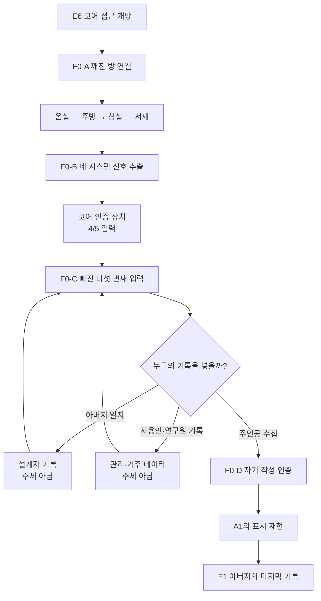
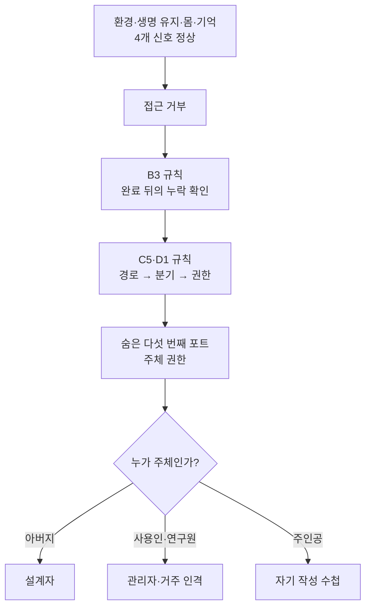

# GGB F0 메타퍼즐 연결 구조 개정안

## 1. 문서 목적

본 문서는 [24_이벤트상세_03_메인퍼즐이벤트.md](24_이벤트상세_03_메인퍼즐이벤트.md)의 F0 `코어로 가는 길 / 깨진 방 연결`을 메타퍼즐로 확장하는 개정안이다.

기존 24 문서는 유지하며, 본 문서를 차후 반영 기준으로 사용한다.

핵심 개정 방향:

> 기존 F0의 방 연결은 메타퍼즐의 1단계가 된다.  
> 방을 모두 연결해도 코어는 열리지 않으며, 플레이어는 지금까지의 퍼즐이 남긴 규칙을 재해석해 `빠진 다섯 번째 입력`을 찾아야 한다.  
> 정답은 주인공이 첫 루프에서 직접 남긴 수첩 표시다.

이 구조의 목적은 다음과 같다.

- A1부터 D4까지의 주요 퍼즐 경험을 최종부에서 회수한다.
- 수첩이 단순 퀘스트 UI가 아니라 주인공의 자기 기록이자 권한 키였음을 드러낸다.
- 연구원 기록과 관계 이벤트를 보상으로 활용하되 메인 진행 필수 조건으로 만들지 않는다.
- 최종 엔딩 선택 전에 `선택할 권한의 주체`를 주인공에게 돌려준다.
- F0를 단순 방 순서 맞추기보다 전체 게임을 이해했는지 묻는 메타퍼즐로 만든다.

## 2. 메타퍼즐의 정의

본 문서에서 말하는 메타퍼즐은 단순히 여러 퍼즐의 정답을 다시 입력하는 퍼즐이 아니다.

메타퍼즐은 다음 세 조건을 만족한다.

1. 이전 퍼즐에서 배운 규칙을 새로운 맥락으로 재해석한다.
2. 서로 무관해 보이던 기록과 오브젝트가 하나의 질문으로 합쳐진다.
3. 정답이 스토리의 핵심 주제와 직접 연결된다.

F0의 최종 질문은 다음과 같다.

```text
환경도 연결되었다.
생명 유지 장치도 연결되었다.
몸과 기억도 연결되었다.

그런데 이 시스템에서 빠진 사람은 누구인가?
```

정답은 `아버지`, `사용인`, `연구원`이 아니라 `주인공 자신`이다.

## 3. 기존 F0의 한계

기존 F0는 아래 순서로 방을 연결한다.

```text
온실 → 주방 → 침실 → 서재 → 코어
```

이 구조는 공간과 시스템의 인과를 설명하는 데에는 적합하다. 다만 최종부 퍼즐로는 다음 한계가 있다.

| 문제 | 이유 |
| --- | --- |
| 정답이 직접적임 | J4의 문장과 방별 입력·출력만 확인하면 순서를 거의 그대로 알 수 있다. |
| 이전 퍼즐 회수가 약함 | B3, C4, D1, D4의 경험이 F0에서 실질적으로 필요하지 않다. |
| 수첩의 의미가 줄어듦 | 초반 루프의 핵심이었던 자기 기록이 후반부에는 목표 표시 UI로만 남는다. |
| 최종 선택과의 연결이 약함 | 코어로 가는 길은 열리지만 `왜 주인공이 선택권을 가져야 하는가`를 플레이로 증명하지 않는다. |

따라서 기존 방 연결을 삭제하기보다 `공간 인과를 이해시키는 1단계`로 짧게 유지하고, 그 결과를 메타퍼즐의 입력으로 사용한다.

## 4. 개정 후 전체 구조

F0는 네 단계로 구성한다.

| 단계 | 이름 | 기능 | 권장 시간 |
| --- | --- | --- | --- |
| `F0-A` | 깨진 방 연결 | 네 시스템 채널을 인과 순서로 연결 | 4~7분 |
| `F0-B` | 네 개의 정상 신호 | 연결된 방에서 시스템 신호를 추출 | 3~5분 |
| `F0-C` | 빠진 다섯 번째 입력 | 과거 퍼즐 규칙으로 누락 채널 발견 | 4~7분 |
| `F0-D` | 자기 작성 인증 | 수첩 표시를 주인공 권한 키로 사용 | 3~5분 |

총 권장 플레이타임은 14~24분이다. 힌트를 적극적으로 사용하면 10~15분 내에 완료할 수 있다.



## 5. 메타 단서 설계

### 5.1 전체 단서 구조

| 기존 이벤트 | 당시 배운 규칙 | F0에서의 재해석 |
| --- | --- | --- |
| A1·A2 | 세계는 초기화돼도 주인공이 직접 쓴 표시는 남는다. | 자기 작성 데이터는 시스템 바깥의 주체 인증이다. |
| B3 | 정상적인 열두 번 뒤에 숨겨진 열세 번째 입력이 있다. | 시스템이 완료됐다고 보여도 누락된 입력이 존재할 수 있다. |
| C4·C5 | 직선, 분기, 고리 문양을 따라 위장층을 벗긴다. | 신호 경로를 따라가고 분기된 빈 채널을 찾아 인증 고리를 연다. |
| D1 | 길을 열고, 힘을 나누며, 닫힌 경계를 푼다. | `경로 확인 → 분기 확인 → 권한 해제`가 메타퍼즐의 조사 순서다. |
| D4 | 복구 장치처럼 보인 것이 실제로는 위장 필터였다. | 화면에 적힌 기능명이 진짜 목적과 다를 수 있다. |
| J4 | 사용인과 연구원은 집을 움직일 수 있지만 떠나는 문은 열 수 없다. | 관리 권한과 주체 권한은 다르다. |

### 5.2 정답 회수 강도

필수 단서는 A1·A2, B3, C4·C5, D1, D4, J4 기본에서 모두 확보된다. 이 이벤트들은 메인 진행에 포함되므로 메타퍼즐이 선택형 콘텐츠에 의존하지 않는다.

연구원 기록과 관계 이벤트는 아래에만 영향을 준다.

- 후보 기록의 의미 설명.
- 힌트 대사.
- 인증 직전 사용인의 감정 반응.
- F1과 F2로 이어지는 연출 밀도.

## 6. 선행 퍼즐 수정 권장안

메타퍼즐을 공정하게 만들기 위해 기존 퍼즐에 작은 단서를 추가한다. 정답과 기본 구조는 바꾸지 않는다.

### 6.1 A1·A2 수첩 표시

#### 현재 기능

- 리셋 후에도 수첩 표시가 남는지 확인한다.

#### 추가 기능

- A1에서 고른 표시 형태를 영구 변수 `self_authored_mark`로 보존한다.
- 표시 주변에 다른 일지 글씨와 다른 미세한 파형이 나타난다.
- A2에서 에드가가 표시를 보았을 때 `이건 시스템 글씨가 아니군요`라고 말하려다 멈춘다.

#### 표시별 F0 변형

| A1 선택 | F0 인증 방식 |
| --- | --- |
| 문장 | 첫 문장의 일부를 다시 적는다. |
| 집 도형 | 같은 획순으로 집 도형을 그린다. |
| 잉크 얼룩 | 얼룩의 세 지점을 차례로 누른다. |

어떤 표시를 골라도 난이도와 결과는 같다.

### 6.2 B3 열세 번째 종

#### 현재 기능

- 정상적인 열두 번 뒤의 열세 번째 소리를 발견한다.

#### 추가 기능

- B4 파형 기록의 열세 번째 칸을 다른 칸과 구분한다.
- 수첩에 `완료 표시 뒤에도 하나가 더 있었다`는 독백을 남긴다.
- F0-C의 인증 장치가 `4/4 정상`이라고 표시한 직후, B3 파형을 겹치면 숨은 `5번째 칸`이 나타난다.

핵심은 숫자 13을 다시 비밀번호로 쓰는 것이 아니다. `완료로 보이는 구조에 누락이 있다`는 사고방식을 재사용한다.

### 6.3 C4·C5 검은 거울 회로 문양

#### 현재 기능

- `직선 → 분기 → 고리` 순서로 위장 코팅을 제거한다.
- 문양을 D1과 D4에서 재사용한다.

#### 추가 기능

C5 기록에서 문양에 아래 의미를 간접 표기한다.

| 문양 | 당시 기능 | 메타 기능 |
| --- | --- | --- |
| 직선 | 신호 경로 노출 | 네 방의 신호를 한 줄로 추적 |
| 분기 | 두 갈래 회로 개방 | 침실과 서재 사이에서 빠진 입력 분기 발견 |
| 고리 | 마지막 코팅 경계 해제 | 주체 인증 고리 활성화 |

동일한 순서를 다시 입력하게 하지 않는다. 플레이어는 문양을 `조작 순서`가 아니라 `조사 도구`로 재해석한다.

### 6.4 D1 지하창고 조합

#### 현재 기능

- 직선축, 분기축, 환형축을 순서대로 작동한다.

#### 추가 기능

D1 성공 후 축 안쪽에 짧은 시스템 표기가 드러난다.

```text
PATH
SPLIT
AUTH
```

플레이어가 영어 표기를 읽지 않아도 문양, 움직임, 수첩 번역으로 의미를 알 수 있게 한다.

이 표기는 F0에서 다음 추론을 보조한다.

```text
경로를 따라간다.
비어 있는 분기를 찾는다.
그 분기를 권한 고리에 연결한다.
```

### 6.5 D4 태엽 심장

#### 현재 기능

- 장치를 복구했다고 생각하지만 실제로는 위장 필터를 해제한다.

#### 추가 기능

위장 필터가 꺼지는 순간 1~2초 동안 다섯 개의 포트 도식이 보인다.

- 네 포트는 신호가 들어와 있다.
- 하나는 빈 고리로 남아 있다.
- 빈 포트의 이름은 깨져 있어 읽을 수 없다.
- 수첩은 포트의 형태만 자동 기록한다.

`SUBJECT`, `CONSENT`, `CHOICE` 같은 정답 단어를 이 시점에 직접 노출하지 않는다.

### 6.6 J4 기본 복원

J4 기본에 다음 한 문장을 추가하는 것을 권장한다.

```text
그들은 집을 움직일 권한을 가졌지만,
누구를 집의 주인으로 정할 권한은 갖지 못했다.
```

이 문장은 사용인이 왜 코어를 직접 열 수 없는지 설명하면서도 `수첩 표시가 정답`이라고 직접 말하지 않는다.

### 6.7 기존 반복 입력 경고 문구

24 문서의 `이미 실패한 입력을 다시 선택할 때 어떻게 보여줄지`는 아래 방식으로 통일한다.

```text
이 입력은 이전 루프에서 장치를 잠갔다.

[수첩의 결과를 본다]
[그래도 같은 입력을 실행한다]
[다른 입력을 고른다]
```

- 기본 선택 위치는 `다른 입력을 고른다`에 둔다.
- 같은 입력을 금지하지 않는다.
- `수첩의 결과를 본다`를 선택하면 실패 원인 카드만 열고 퍼즐 화면으로 돌아온다.
- F0는 로컬 재조작 퍼즐이므로 `이전 루프` 대신 `방금 연결에서`로 문구를 바꾼다.

## 7. F0-A 깨진 방 연결

### 7.1 역할 변경

기존 F0의 방 연결을 삭제하지 않는다. 다만 최종 퍼즐이 아니라 메타퍼즐의 문법을 가르치는 준비 단계로 재정의한다.

### 7.2 목표

네 방의 입력과 출력을 인과 순서로 연결한다.

```text
온실 → 주방 → 침실 → 서재
```

| 방 | 시스템 기능 | 다음 방으로 보내는 것 |
| --- | --- | --- |
| 온실 | 외부 기후 감지·공기 여과 | 정화된 공기 |
| 주방 | 생명 유지·영양 공급 | 생명 유지 흐름 |
| 침실 | 냉각 장치·주인공 신체 | 신경 신호 |
| 서재 | 기억·시뮬레이션 기록 | 코어 접근 요청 |

### 7.3 난이도 조정

기존 10~15분에서 4~7분으로 줄인다.

- 각 방의 입력·출력과 연결 장치의 흐름 방향이 방 순서를 유도한다.
- 맞는 인접 관계는 즉시 고정된다.
- 잘못 연결하면 마지막 조각만 빠진다.
- 첫 방을 맞히면 나머지는 입력·출력 비교로 풀 수 있다.

이 단계에서 플레이어를 오래 막지 않는다. 메타 추론의 핵심은 F0-C와 F0-D다.

### 7.4 완료 결과

네 방이 연결되면 코어 인증 장치에 네 신호가 들어간다.

```text
ENVIRONMENT  STABLE
LIFE_SUPPORT STABLE
SUBJECT_BODY STABLE
MEMORY       STABLE

ACCESS       DENIED
```

화면은 한 번 `4/4 COMPLETE`를 표시한 뒤 다시 `ACCESS DENIED`로 바뀐다.

## 8. F0-B 네 개의 정상 신호

### 8.1 목표

연결된 방을 직접 통과해 각 시스템의 신호 표식을 확보한다.

### 8.2 방별 상호작용

| 순서 | 방 | 필수 상호작용 | 획득 신호 |
| --- | --- | --- | --- |
| 1 | 온실 | 외부 센서의 황폐한 대기 수치 확인 | `ENVIRONMENT` |
| 2 | 주방 | 생명 유지 펌프의 유체 흐름 확인 | `LIFE_SUPPORT` |
| 3 | 침실 | 침대 아래 냉각 장치와 맥박 확인 | `SUBJECT_BODY` |
| 4 | 서재 | 일지 뒤의 기억 저장 장치 확인 | `MEMORY` |

각 신호는 코어 장치로 자동 전송된다.

### 8.3 네 신호의 공통점

네 신호는 모두 주인공을 `유지`하는 데 필요한 요소다.

- 살아갈 환경.
- 몸을 살리는 장치.
- 살아 있는 몸.
- 기억과 인격.

그러나 네 신호 어디에도 주인공이 무엇을 원하는지는 없다.

이 결핍이 메타퍼즐의 서사적 핵심이다.

### 8.4 첫 오해 유도

플레이어는 처음에 다음 중 하나가 고장이라고 생각할 수 있다.

- 방 순서가 틀렸다.
- 신호를 하나 덜 모았다.
- 연구원 기록이 부족하다.
- 에드가의 허가가 완전하지 않다.

장치는 네 신호가 모두 정상이라고 명시해 `고장 수리`가 아니라 `누락된 권한 찾기`로 사고를 전환시킨다.

## 9. F0-C 빠진 다섯 번째 입력

### 9.1 시작 상태

코어 장치에는 네 개의 밝은 포트와 닫힌 외곽 장식이 있다.

초기 화면:

```text
4 CHANNELS VERIFIED
SYSTEM READY
ACCESS DENIED
```

### 9.2 조사 순서

D1에서 배운 `PATH → SPLIT → AUTH`가 조사 순서로 사용된다.

1. `PATH`: 네 방의 신호가 어디로 흐르는지 선을 따라간다.
2. `SPLIT`: 침실의 신경 신호가 서재로 들어가기 전 갈라지는 빈 분기를 찾는다.
3. `AUTH`: 빈 분기를 외곽 고리에 연결해 다섯 번째 포트를 드러낸다.

### 9.3 B3 파형 사용

장치가 `4/4 COMPLETE`라고 표시할 때 B4의 열세 번째 종 파형을 겹쳐 본다.

- 정상 종의 완료선 뒤에 추가 파형이 있었던 것처럼, 네 번째 포트 뒤에 숨은 빈 칸이 나타난다.
- 플레이어는 숫자 13을 입력하지 않는다.
- 파형은 `완료 표시 뒤를 보라`는 렌즈로 사용된다.

### 9.4 다섯 번째 포트

숨은 포트가 나타나면 이름은 깨진 상태다.

```text
S_BJ_CT  A_TH_R_TY
```

초기에는 `SUBJECT AUTHORITY`를 완전히 읽을 수 없다. 후보 기록을 대입할수록 문자가 복원된다.

권장 한국어 수첩 번역:

```text
주체 권한
누가 이 삶의 결정을 내리는가.
```

### 9.5 후보 오브젝트

플레이어는 수첩과 기록 목록에서 인증에 사용할 데이터를 선택한다.

| 후보 | 장치 판정 | 플레이어가 배우는 것 |
| --- | --- | --- |
| 아버지의 일지 | `CREATOR / NOT SUBJECT` | 설계자는 주인공의 결정을 대신할 수 없다. |
| 에드가의 접근 암구 | `CUSTODIAN / NOT SUBJECT` | 문지기는 접근을 허용할 수 있지만 선택의 주체는 아니다. |
| 연구원 기록 | `RESIDENT PROCESS / NOT SUBJECT` | 연구원은 감금된 인격이며 주인공의 권한 키가 아니다. |
| D4 복구 명령 | `SYSTEM COMMAND / NOT SUBJECT` | 시스템 명령은 의지가 아니다. |
| 주인공의 수첩 | `UNVERIFIED SELF-AUTHORED DATA` | 올바른 종류지만 본인 확인이 한 단계 더 필요하다. |

### 9.6 오답 처리

- 후보를 잘못 넣어도 기록은 소실되지 않는다.
- 장치는 후보의 역할을 알려주고 즉시 반환한다.
- 세 번 오답 후 수첩의 A1 페이지 모서리가 약하게 반응한다.
- 연구원 기록이 없는 플레이어에게도 아버지 일지, 에드가 암구, D4 명령, 수첩 후보를 제공한다.

### 9.7 정답 논리



## 10. F0-D 자기 작성 인증

### 10.1 핵심 정답

주인공은 A1에서 직접 만든 표시를 다섯 번째 포트에 다시 작성한다.

이 표시가 정답인 이유:

- 아버지가 미리 작성하지 않았다.
- 사용인이 대신 작성하지 않았다.
- 시스템이 자동 생성하지 않았다.
- 리셋 이전의 주인공과 이후의 주인공이 같은 의지를 이어 썼다.
- 주인공이 자신을 위해 남긴 최초의 선택이다.

### 10.2 인증 절차

1. `주인공의 수첩`을 다섯 번째 포트에 대조한다.
2. 장치가 `UNVERIFIED SELF-AUTHORED DATA`를 표시한다.
3. 수첩의 A1 페이지가 열린다.
4. 플레이어는 당시 선택한 표시를 다시 재현한다.
5. 두 표시의 획순 또는 접촉 순서가 일치한다.
6. 장치가 주인공의 현재 신경 신호와 표시 파형을 비교한다.
7. 다섯 번째 포트가 점등된다.
8. `SUBJECT AUTHORITY RESTORED`가 표시된다.
9. 코어 문이 열리고 F1이 시작된다.

### 10.3 표시 재현 조작

정밀한 그림 그리기를 요구하지 않는다.

| 표시 | 조작 |
| --- | --- |
| 문장 | 세 문장 조각 중 A1에서 고른 문장을 선택 |
| 집 도형 | 지붕, 몸체, 문 순서로 세 지점을 클릭 |
| 잉크 얼룩 | A1에서 번진 세 지점을 같은 순서로 누름 |

오입력 시 수첩 원본을 다시 볼 수 있으며 인증 횟수 제한은 없다.

### 10.4 인증 문구

```text
ENVIRONMENT   VERIFIED
LIFE_SUPPORT  VERIFIED
SUBJECT_BODY  VERIFIED
MEMORY        VERIFIED
AUTHORITY     VERIFIED

SUBJECT AUTHORITY RESTORED
FINAL DECISION: UNSET
```

`FINAL DECISION: UNSET`을 반드시 표시한다.

이는 메타퍼즐 성공이 `ED_REALITY`나 `ED_STAY`를 미리 선택한 것이 아님을 분명히 한다. 주인공은 이제 선택할 권한만 되찾았으며, 실제 선택은 F3 이후 EDC에서 한다.

### 10.5 아버지의 백도어 설정

권장 설정:

- 수첩은 아버지가 만든 영구 기록 파티션에 연결되어 있다.
- 아버지는 특정 정답이나 엔딩을 수첩에 넣지 않았다.
- 시스템은 주인공이 루프 안에서 자발적으로 만든 기록만 주체 서명으로 인정한다.
- 아버지가 남긴 것은 답이 아니라 `주인공이 스스로 답을 만들 수 있는 빈칸`이다.

이 설정은 아버지를 완전한 구원자로 만들지 않는다.

- 그는 연구원들의 동의를 왜곡했고 약속을 완수하지 못했다.
- 주인공을 냉각 장치와 시뮬레이션에 보관했다.
- 다만 마지막 순간, 자신이 선택을 대신해서는 안 된다는 사실을 인정하고 권한 복구 경로만 남겼다.

### 10.6 주인공 독백

```text
아버지의 글도 아니야.
에드가가 알려준 말도 아니고.

내가 나에게 남긴 것.
내일의 내가 믿을 수 있게, 내가 직접 쓴 것.

이 집에서 처음으로 내가 정한 일이었어.
```

## 11. 사용인과 관계 기록의 영향

관계 이벤트는 메타퍼즐의 정답을 바꾸지 않는다.

### 11.1 기록별 추가 음성

| 기록 | F0에서 추가되는 음성 |
| --- | --- |
| 마라 | `우리가 닦아낸 건 오류뿐이었어. 네가 쓴 건 지울 수 없었지.` |
| 이리스 | `바깥의 수치는 네가 갈지 말지를 결정하지 않아.` |
| 루카 | `살아 있게 하는 것과 어떻게 살지 정하는 건 다른 일이야.` |
| 에드가 | `권한을 돌려드리면, 저는 더 이상 명령으로 붙잡을 수 없습니다.` |

### 11.2 기록 수에 따른 힌트

| 상태 | 처리 |
| --- | --- |
| 기록 0~1개 | 환경 단서와 수첩 독백으로 해결 가능 |
| 기록 2~3개 | 후보 오브젝트의 역할을 사용인 음성으로 설명 |
| 기록 4개 | 각 사용인이 자신의 기록을 인증 후보에서 스스로 철회 |

### 11.3 감정 효과

높은 관계 상태에서 사용인들은 정답을 알려주는 대신 자신들이 주체가 아님을 인정한다. 이는 주인공을 놓아줄 준비와 연결된다.

낮은 관계 상태에서는 장치가 기계적으로 후보를 거부하며, 사용인들은 침묵한다. 메인 진행은 동일하지만 장면의 온도가 차가워진다.

## 12. 힌트 단계

### 12.1 F0-A

| 단계 | 힌트 |
| --- | --- |
| 1 | 각 방 출구의 물질과 다음 방 입구의 물질 비교 |
| 2 | 각 방에서 확인한 입력·출력 기록을 방 아이콘 옆에 배치 |
| 3 | 온실을 첫 방으로 고정 |

### 12.2 F0-C

| 단계 | 조건 | 힌트 |
| --- | --- | --- |
| 1 | `4/4 COMPLETE` 후 정체 | 주인공: `완료됐는데, 왜 열리지 않지?` |
| 2 | 코어 장치 3회 조사 | B4 파형 페이지가 약하게 진동 |
| 3 | B4 파형 겹치기 후 정체 | C5의 분기 문양 강조 |
| 4 | 빈 포트 발견 후 정체 | J4의 `집을 움직이는 권한` 문장 강조 |
| 5 | 후보 2회 오답 | A1 표시가 있는 수첩 페이지 강조 |

### 12.3 F0-D

| 단계 | 힌트 |
| --- | --- |
| 1 | 수첩의 처음과 현재 페이지를 비교 |
| 2 | A2 독백 `방은 돌아갔지만 이건 남아 있다` 재생 |
| 3 | 당시 선택한 표시의 세 조각만 후보로 제공 |

힌트는 `수첩을 넣어라`부터 시작하지 않는다. 플레이어가 네 신호의 결핍과 주체 권한을 먼저 이해하게 한다.

## 13. 실패와 재시도

F0는 `BROKEN_RESET` 이후이므로 정상 수면 리셋을 사용하지 않는다.

| 실패 | 처리 |
| --- | --- |
| 방 순서 오배치 | 마지막 연결만 해제 |
| 신호 추출 누락 | 누락된 방으로 즉시 돌아갈 수 있음 |
| 숨은 포트 조사 순서 오류 | 장치가 현재 단계에 필요한 문양을 다시 표시 |
| 잘못된 기록 투입 | 역할 판정 후 즉시 반환 |
| 수첩 표시 재현 오류 | 원본 페이지 확인 후 무제한 재시도 |

진행이 멀리 되돌아가는 경우는 없다.

맞춘 상태는 단계별로 고정한다.

```yaml
f0_checkpoint:
  room_chain_complete: false
  system_signals_verified: []
  hidden_port_revealed: false
  notebook_selected: false
  subject_authority_restored: false
```

이 체크포인트는 세계 리셋 지점이 아니라 F0 내부 퍼즐 상태 보존이다.

## 14. 감각과 심리 연출

### 14.1 네 신호 완료

- 네 방의 기계음이 하나의 안정적인 박동으로 합쳐진다.
- `4/4 COMPLETE`가 나타나며 잠시 안도감을 준다.
- 코어 문은 열리지 않는다.
- 박동 사이에 있어야 할 한 박자가 비어 있는 듯한 정적이 반복된다.

### 14.2 숨은 포트 발견

- 빈 포트는 처음부터 없던 것이 아니라 장식 아래 눌려 있던 홈처럼 드러난다.
- 손을 대면 차갑지 않고 주인공의 체온과 비슷하다.
- 다른 네 포트가 기계 진동을 내는 것과 달리, 빈 포트에서는 주인공의 현재 호흡이 되돌아온다.

### 14.3 잘못된 후보

- 아버지의 일지는 너무 오래된 음성처럼 늘어진다.
- 연구원 기록은 여러 사람의 목소리로 갈라진다.
- 에드가 암구는 문 앞에서 멈추고 안쪽으로 들어가지 못한다.
- 시스템 명령은 문을 열려다 다시 잠근다.

### 14.4 수첩 인증

- A1 표시를 다시 만드는 동안 초반 침실의 펜촉 소리가 재생된다.
- 현재의 SF 코어 화면 위에 첫 루프의 고딕 침실이 겹친다.
- 표시가 완성되면 두 장면 중 어느 쪽도 사라지지 않고 잠시 공존한다.
- 주인공은 공포가 사라진 것이 아니라, 공포 속에서도 자신이 한 행동을 기억한다.

## 15. F1과 엔딩으로의 연결

### 15.1 F1 시작 방식

코어 문이 열리면 아버지의 기록이 자동 재생되지 않는다.

주인공이 안으로 들어가 `기록을 재생한다`를 직접 선택해야 F1이 시작된다. 메타퍼즐에서 되찾은 주체성을 곧바로 조작에 반영한다.

### 15.2 J5와의 역할 분리

| 단계 | 질문 |
| --- | --- |
| F0 메타퍼즐 | `누가 선택할 권한을 가지는가?` |
| F1·J5 | `아버지는 왜 이 구조를 만들었고 무엇을 인정하는가?` |
| F2 | `연구원들은 주인공을 왜 붙잡았으며 이제 어떻게 할 것인가?` |
| F3·EDC | `주인공은 현실과 잔류 중 무엇을 선택하는가?` |

F0는 엔딩의 답을 주지 않는다. 선택권의 소유자만 확정한다.

### 15.3 엔딩 양가성 유지

수첩 인증이 `현실로 나가려는 의지`로만 해석되면 ED_STAY의 정당성이 약해진다.

따라서 인증 문구와 주인공 독백은 아래를 지켜야 한다.

- `나가겠다`가 아니라 `내가 정하겠다`.
- `저택을 거부한다`가 아니라 `저택이 대신 결정하게 두지 않는다`.
- 잔류를 선택하더라도 주인공이 거짓을 알고 스스로 선택했다는 구조 유지.

## 16. 상태 변수와 데이터 구조

### 16.1 영구 메타 단서

```yaml
meta_clues:
  self_authored_mark:
    type: sentence # sentence, house_symbol, ink_stain
    input_pattern: []
    persistence_confirmed: true
  completion_can_hide_extra_input: true
  circuit_semantics_known:
    path: true
    split: true
    auth: true
  five_port_diagram_seen: true
```

### 16.2 F0 상태

```yaml
f0_meta:
  room_order:
    - ROOM_GREENHOUSE
    - ROOM_KITCHEN
    - ROOM_BEDROOM
    - ROOM_LIBRARY
  verified_channels:
    environment: false
    life_support: false
    subject_body: false
    memory: false
  hidden_authority_port:
    revealed: false
    candidate_attempts: []
  subject_authority_restored: false
  final_decision: unset
```

### 16.3 이벤트 전환

```yaml
event_id: F0_META
required:
  world.core_access_open: true
  progress.journal_stage_min: 4
stages:
  - F0_A_ROOM_CHAIN
  - F0_B_SIGNAL_VERIFICATION
  - F0_C_MISSING_AUTHORITY
  - F0_D_SELF_AUTHORED_MARK
on_success:
  f0_meta.subject_authority_restored: true
  f0_meta.final_decision: unset
  world.core_path_stable: true
  next_event: F1
failure_mode: local_retry
normal_reset_allowed: false
```

## 17. 기존 흐름도 반영안

기존:

```text
E6 → F0 깨진 방 연결 → F1 아버지의 마지막 기록
```

개정:

```text
E6
→ F0-A 깨진 방 연결
→ F0-B 네 시스템 신호 확인
→ F0-C 빠진 다섯 번째 입력 발견
→ F0-D 자기 작성 수첩 인증
→ F1 아버지의 마지막 기록
```

메인 이벤트 ID는 `F0`로 유지하고 내부 하위 단계만 추가한다. 전체 흐름도의 노드 수를 줄여야 할 때는 아래처럼 한 노드로 표기한다.


## 18. 공정성 검증

### 18.1 필수 단서 보장

| 필요한 추론 | 필수 획득 경로 |
| --- | --- |
| 완료 뒤 누락 확인 | B3·B4 |
| 경로·분기·권한 문양 | C4·C5, D1 |
| 다섯 포트의 존재 | D4 자동 연출 |
| 관리 권한과 주체 권한의 차이 | J4 기본 |
| 자기 작성 표시 | A1·A2 |

### 18.2 추측 방지

- 후보를 무작위로 넣어도 결국 풀 수는 있지만, 각 거부 판정이 서사 정보를 제공한다.
- 수첩 후보는 숨은 포트를 발견하기 전에는 투입할 수 없다.
- A1 페이지 강조는 최소 두 번의 후보 오답 또는 장시간 정체 후 제공한다.
- 정답을 맞힌 뒤에도 장치가 왜 수첩을 인정했는지 설명한다.

### 18.3 기억 부담 완화

플레이어가 수 시간 전 퍼즐의 세부 정답을 외울 필요는 없다.

- 모든 메타 단서는 수첩에 자동 정리된다.
- 문양 의미는 D1 성공 후 기록된다.
- B3 파형은 코어 장치 근처에서 반응한다.
- A1 표시는 수첩 원본과 비교할 수 있다.

메타퍼즐은 기억력 시험이 아니라 연결 관계를 이해하는 퍼즐이어야 한다.

## 19. 플레이테스트 체크리스트

### F0-A

- 방 연결이 메타퍼즐 전의 준비 단계로 7분 안에 완료되는가.
- 방별 시스템 기능이 순서뿐 아니라 F0-B의 신호 의미로 이어지는가.

### F0-B

- 네 신호가 모두 정상인데 문이 열리지 않는 상황을 버그로 오해하지 않는가.
- `ACCESS DENIED`가 새로운 질문을 제시한다는 점을 이해하는가.

### F0-C

- 플레이어가 B3의 숫자 13 자체가 아니라 `숨은 추가 입력`이라는 규칙을 재사용하는가.
- C5·D1 문양을 같은 순서 재입력이 아니라 조사 방법으로 재해석하는가.
- J4 기본만 본 플레이어도 관리 권한과 주체 권한을 구분할 수 있는가.

### F0-D

- 수첩 표시가 정답이라는 사실이 억지 반전이 아니라 A1부터 준비된 회수로 느껴지는가.
- 표시 재현이 정밀 조작이나 기억력 시험이 되지 않는가.
- 인증 성공이 현실 엔딩 강제가 아니라 선택권 복구로 이해되는가.

### 전체

- 관계 이벤트 미진행 상태에서도 해결 가능한가.
- 오답마다 정보가 늘어나며 소프트락이 없는가.
- 정상 리셋이 불가능한 후반 규칙과 로컬 재시도가 일치하는가.
- F1의 아버지 기록을 듣기 전 주인공의 주체성이 플레이로 확립되는가.

## 20. 채택 권장안 요약

1. 기존 F0 방 연결을 `F0-A`로 축소해 유지한다.
2. 방 연결 뒤 네 시스템 신호를 확인하는 `F0-B`를 추가한다.
3. B3·C5·D1·D4의 규칙으로 숨은 다섯 번째 포트를 찾는 `F0-C`를 추가한다.
4. A1·A2의 자기 작성 수첩 표시로 주체 권한을 복구하는 `F0-D`를 추가한다.
5. 메타퍼즐 성공은 엔딩 선택이 아니라 `선택권 복구`로 한정한다.
6. 연구원 기록과 관계도는 힌트와 감정 연출에만 반영한다.
7. D5 이후이므로 모든 실패는 로컬 재시도로 처리한다.
8. A1, B4, C5, D1, D4, J4에 작은 선행 단서를 추가해 정답의 공정성을 확보한다.

## 21. 설계상 주의점

1. 다섯 번째 포트를 `자유`, `현실`, `탈출`로 명명하지 않는다. 정답은 특정 엔딩이 아니라 주체 권한이다.
2. 아버지의 백도어가 그의 과거 행동을 면죄하지 않도록 F1·J5에서 실패와 책임을 유지한다.
3. 같은 문양을 C4, D1, D4, F0에서 반복할 때 조작 방식까지 똑같이 만들지 않는다.
4. F0-A의 방 순서를 어렵게 숨겨 메타퍼즐 전에 플레이어를 소진시키지 않는다.
5. 관계 기록을 전부 모아야만 수첩 인증이 가능하도록 만들지 않는다.
6. A1의 세 표시 선택은 모두 동일하게 유효해야 한다.
7. 코어 인증 후에도 `FINAL DECISION: UNSET`을 명시해 EDC의 선택을 보존한다.
