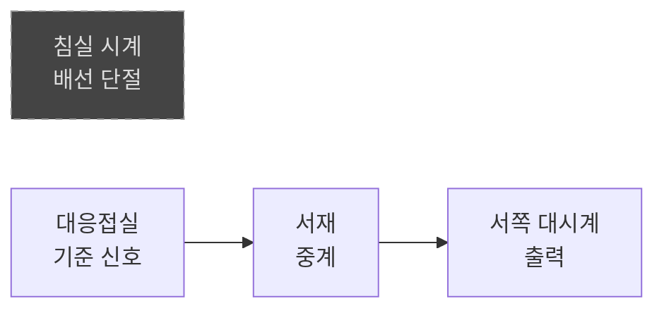
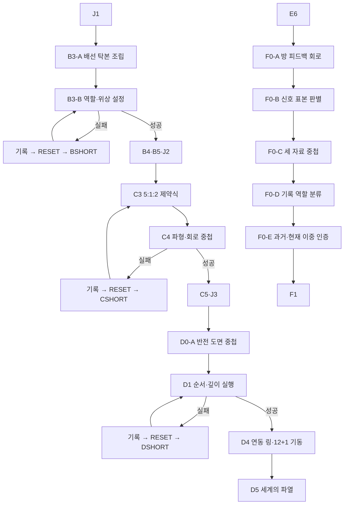

# GGB 메인 퍼즐 고난도 개정안

## 1. 문서 목적

본 문서는 아래 두 문서를 기반으로 전체 메인 퍼즐의 난이도를 상향하는 개정안이다.

- [24_이벤트상세_03_메인퍼즐이벤트.md](24_이벤트상세_03_메인퍼즐이벤트.md)
- [24-2_F0_메타퍼즐연결구조_개정안.md](24-2_F0_메타퍼즐연결구조_개정안.md)

24-2의 핵심 메타 기믹은 유지한다.

> 환경, 생명 유지, 몸, 기억을 모두 연결해도 코어는 열리지 않는다.  
> 플레이어는 누락된 `주체 권한`을 발견하고, A1에서 주인공이 직접 남긴 수첩 표시로 권한을 복구한다.

본 개정안은 퍼즐의 입력 수나 실패 횟수만 늘리는 방식으로 난이도를 올리지 않는다. 난이도 상승의 중심은 아래 세 가지다.

1. 여러 장소에서 얻은 단서를 한 화면에서 비교한다.
2. 단서의 표현을 다른 형태로 변환한다.
3. 실제 장치를 작동하기 전에 가설을 세우고 검증한다.

기존 24와 24-2 문서는 유지하며, 본 문서를 차후 최종 반영 기준으로 사용한다.

## 2. 난이도 목표

### 2.1 목표 난이도

| 항목 | 목표 |
| --- | --- |
| 전체 난이도 | 퍼즐 어드벤처 경험자 기준 보통~어려움 |
| 추론 단계 | 퍼즐당 2~4단계 |
| 필수 단서 수 | 퍼즐당 3~6개 |
| 수면 리셋 | 비가역 퍼즐당 권장 0~2회 |
| 메타퍼즐 | 25~40분, 힌트 사용 시 15~25분 |
| 무작위성 | 없음 |
| 정밀 조작 | 요구하지 않음 |

### 2.2 난이도를 올리지 않는 방식

다음 방식은 사용하지 않는다.

- 정답과 무관한 오브젝트를 과도하게 늘린다.
- 픽셀 단위 숨은 물건 찾기를 요구한다.
- 소리나 색상 하나만으로 정답을 구분한다.
- 같은 아침부터 긴 동선을 반복시킨다.
- 근거 없는 숫자 암호를 추가한다.
- 관계 이벤트를 완료하지 않으면 정답 단서를 얻지 못하게 한다.
- 실패할 때마다 정답 위치를 무작위로 바꾼다.

### 2.3 고난도 퍼즐의 공통 구조


## 3. 기존안 난이도 진단

| 퍼즐 | 기존 난이도 병목 | 개정 방향 |
| --- | --- | --- |
| B3 | 정답 시계 하나를 고르면 끝남 | 기준·중계·출력 역할과 위상을 함께 설정 |
| C3 | 3:1 비율과 물 먼저 규칙이 직접적 | 세 재료의 제약식을 결합해 5:1:2 도출 |
| C4 | 빛나는 선을 순서대로 누르면 됨 | 파형을 회로 경로로 번역하고 닦기 계획을 확정 |
| D1 | D0 문장이 축 순서를 그대로 알려줌 | 반전된 도면 중첩으로 축 깊이와 방향까지 도출 |
| D4 | 각 링을 독립적으로 정답 위치에 맞춤 | 서로 영향을 주는 연동 링과 12+1 이중 기동 |
| F0 | 방의 인과 순서가 곧 정답 | 피드백 회로, 세 자료 중첩, 기록 역할 분류를 결합 |

## 4. 개정 후 퍼즐 구성

| 순서 | 이벤트 | 개정된 핵심 | 실패 정책 | 권장 시간 |
| --- | --- | --- | --- | --- |
| 1 | `B3-A` | 시계망 배선 탁본 조립 | 가역 | 6~10분 |
| 2 | `B3-B` | 기준·중계·출력·위상 설정 | 비가역, 수면 리셋 | 8~14분 |
| 3 | `C3` | 3개 재료 제약식과 투입 순서 | 가역 | 8~12분 |
| 4 | `C4` | 종 파형과 거울 회로 중첩 | 비가역, 수면 리셋 | 10~16분 |
| 5 | `D0-A` | 거울 도면과 저택 평면도 중첩 | 가역 | 8~13분 |
| 6 | `D1` | 축 순서·깊이·손잡이 방향 실행 | 비가역, 수면 리셋 | 8~14분 |
| 7 | `D4` | 연동 링과 12+1 기동 | 가역, 성공 후 D5 | 10~16분 |
| 8 | `F0-A` | 네 방의 피드백 회로 구성 | 가역 | 8~14분 |
| 9 | `F0-B` | 시스템 신호 표본 판별 | 가역 | 6~10분 |
| 10 | `F0-C` | B4·C5·D4 자료 중첩 | 가역 | 10~18분 |
| 11 | `F0-D` | 기록 역할 분류와 주체 권한 발견 | 가역 | 8~14분 |
| 12 | `F0-E` | 수첩의 과거·현재 이중 인증 | 가역 | 5~9분 |

## 5. 추가·통합·삭제 사항

### 5.1 추가

| ID | 추가 요소 | 목적 |
| --- | --- | --- |
| `B3-A` | 시계망 배선 탁본 조립 | 시계 후보 선택 전에 구조를 이해시킴 |
| `D0-A` | 투명 도면 중첩 | C5 문양을 D1의 깊이 정보로 변환 |
| `F0-E` | 현재 시점의 두 번째 자기 인증 | 과거 수첩 표시만 찾고 끝나는 것을 방지 |

### 5.2 통합

- B3의 시계 조사와 점검함 입력을 `B3-A`, `B3-B`로 나누되 메인 ID는 `B3`로 유지한다.
- C3의 천 선택은 C4 준비 단계로 이동한다.
- F0-B의 단순 방 순회는 `신호 표본 판별`로 바꾼다.

### 5.3 삭제

- C4에서 회로선이 정답 순서대로 자동 점멸하는 연출을 삭제한다.
- D1에서 `길을 열고, 힘을 나누며, 문을 푼다`가 정답 순서를 직접 말하는 문장을 삭제한다.
- D4에서 각 링이 독립적으로 움직이는 구조를 삭제한다.
- F0에서 두 번째 오답부터 입력·출력 정답 아이콘을 자동 표시하는 규칙을 삭제한다.

삭제된 직접 힌트는 단계형 힌트의 후반부로 이동한다.

## 6. B3 개정: 열세 번째 종의 시계망

### 6.1 퍼즐 목표

네 시계의 역할과 배선 방향을 파악하고 아래 설정을 완성한다.

```text
기준 시계 → 중계 시계 → 출력 시계
위상 = 정상 열두 번 뒤 한 칸
```

정답:

```text
기준: 대응접실 괘종시계
중계: 서재 벽시계
출력: 서쪽 대시계
제외: 침실 탁상시계
위상: +1
```

### 6.2 B3-A 배선 탁본 조립

#### 준비물

- 침실 시계 뒷면의 종이 탁본.
- 대응접실 시계 하단의 구리 배선 탁본.
- 서재 벽시계 옆 벽 균열 탁본.
- 서쪽 대시계 점검함의 배선 탁본.

각 탁본은 수첩의 `시계망` 페이지에 자동 보관된다.

#### 조립 방식

네 탁본은 가장자리의 끊긴 구리선과 나사 위치를 기준으로 회전해 맞춘다.

- 각 조각은 0°, 90°, 180°, 270°로 회전 가능.
- 앞면과 뒷면을 뒤집을 수 있는 조각은 서재 탁본 하나뿐이다.
- 맞는 가장자리는 금속 진동이 이어지지만 자동 고정되지 않는다.
- 전체 연결 후 `배선을 추적한다`를 눌러 검증한다.

#### 정답 구조



#### 추론

- 침실 시계는 한 시간 느리지만 시계망과 물리적으로 연결되지 않았다.
- 대응접실 시계는 정상 열두 번을 만들어 기준 신호를 보낸다.
- 서재 시계는 바늘이 멈췄지만 진동을 서쪽으로 전달한다.
- 서쪽 대시계는 종이 없는 출력 장치다.

### 6.3 B3-B 역할과 위상 설정

점검함에서 네 역할 카드를 배치한다.

| 슬롯 | 선택 |
| --- | --- |
| 기준 | 네 시계 중 하나 |
| 중계 | 네 시계 중 하나 |
| 출력 | 네 시계 중 하나 |
| 제외 | 남은 시계 |

그다음 중계 시계의 위상 다이얼을 설정한다.

| 위상 | 의미 |
| --- | --- |
| `0` | 열두 번째 종과 동시에 전달 |
| `+1` | 정상 완료 뒤 한 칸 늦게 전달 |
| `-1` | 마지막 종 전에 전달 |
| `HALF` | 종 사이에 전달 |

### 6.4 위상 +1 단서

- 일지의 `틀린 소리` 문장 끝에 마침표보다 한 칸 뒤에 잉크점이 있다.
- 대응접실 시계는 열두 번 뒤 배선 진동이 한 번 더 남는다.
- 서쪽 대시계의 걸쇠는 XII 뒤에 이름 없는 홈을 하나 더 가진다.
- 마라의 장부에는 `서쪽 장식 시계는 본 종이 끝난 뒤 점검`이라고 적혀 있다.

### 6.5 사전 검증과 비가역 입력

`약한 시험 진동을 보낸다`는 역할 연결만 검증한다.

- 기준→중계 연결이 맞는지 확인 가능.
- 중계→출력 연결이 맞는지 확인 가능.
- 위상 정답은 확인할 수 없음.
- 시험 진동은 시계망을 잠그지 않음.

`저녁 시계망을 작동한다`를 선택하면 위상까지 포함해 실제 입력하며, 오답이면 당일 잠긴다.

### 6.6 실패 정보

| 실패 유형 | 다음 루프에 남는 정보 |
| --- | --- |
| 기준 오류 | 기준 시계 슬롯에 붉은 밑줄 |
| 중계 오류 | 신호가 끊긴 벽 위치 기록 |
| 출력 오류 | 종 장치 유무 비교 문장 |
| 위상 오류 | 너무 빠름·동시·너무 늦음 중 결과 기록 |

한 번의 실패로 전체 정답을 공개하지 않는다. 맞았던 슬롯은 `검증됨` 상태로 남겨 다음 루프의 추론 범위를 줄인다.

### 6.7 난이도 보호

- 첫 실패 후 B3-A 탁본 조립은 유지된다.
- 다음 루프에는 역할 카드와 위상만 재설정한다.
- 두 번 실패하면 맞는 역할 슬롯은 고정할 수 있다.
- 세 번째 실패 이후 위상 단서를 수첩에서 한 화면에 비교한다.

## 7. C3 개정: 중성 세정제 제약식

### 7.1 퍼즐 목표

8단위 병에 증류수, 안정제, 세정 원액을 올바른 양과 순서로 넣는다.

정답:

```text
증류수 5
안정제 1
세정 원액 2

투입 순서: 증류수 → 안정제 → 세정 원액
```

### 7.2 단서 분배

| 단서 | 위치 | 내용 |
| --- | --- | --- |
| 총량 | 빈 병 바닥 | `8 단위를 넘기지 말 것` |
| 원액 관계 | 약품 라벨 | `원액은 안정제의 두 배` |
| 물 관계 | 마라의 청소 기록 | `물은 두 첨가제를 합친 양보다 두 단위 많다` |
| 순서 1 | 병 경고 문구 | `마른 병에 활성 성분을 먼저 넣지 말 것` |
| 순서 2 | 루카의 메모 | `안정제가 물에 퍼진 뒤 원액을 넣는다` |

제약식:

```text
W + S + A = 8
A = 2S
W = S + A + 2
```

유일해:

```text
W = 5, S = 1, A = 2
```

### 7.3 조합 화면

- 8단위 병.
- 5단위 증류수 용기.
- 1단위 안정제 앰플 2개.
- 1단위 원액 스포이드 4회분.
- 시험지.
- 폐기 쟁반.

수학식을 직접 입력하지 않는다. 플레이어는 수첩에서 세 문장을 연결한 뒤 실제 양을 넣는다.

### 7.4 오답 판별

| 오답 | 반응 |
| --- | --- |
| 총량 오류 | 병 눈금이 넘치거나 부족 |
| 비율 오류 | 시험지가 붉거나 푸르게 변함 |
| 순서 오류 | 미세한 결정이 생겨 거울용으로 부적합 |
| 혼합 횟수 오류 | 거품이 생기지만 가라앉힌 뒤 사용 가능 |

재료는 다시 제공되며 수면 리셋은 요구하지 않는다.

### 7.5 난이도 보호

- 첫 오답은 결과만 보여준다.
- 두 번째 오답은 위반한 제약식 종류를 알려준다.
- 세 번째 오답은 수첩에서 관련 문장 둘을 연결선으로 묶는다.
- 숫자 계산이 어려운 플레이어를 위해 `수첩에서 양을 정리한다` 보조 UI를 제공한다.

## 8. C4 개정: 파형을 닦기 경로로 번역

### 8.1 변경 핵심

기존처럼 회로선이 정답 순서대로 빛나지 않는다.

열세 번째 종이 울리면 검은 거울에 세 문양이 동시에 나타난다.

- 직선.
- 분기.
- 고리.

플레이어는 B4의 파형과 거울 문양을 중첩해 시작점, 분기 방향, 종료점을 찾아야 한다.

### 8.2 파형 구조

B4 파형에는 세 구간이 있다.

| 구간 | 형태 | 회로 대응 |
| --- | --- | --- |
| 진입파 | 길고 낮은 한 번의 진동 | 직선 |
| 반사파 | 짧은 두 번의 진동 | 분기 |
| 잔류파 | 길게 이어져 원점으로 닫힘 | 고리 |

이 대응은 직접 문장으로 제공하지 않는다.

- 서재 시계 중계음이 진입파와 같은 모양이다.
- 갈라진 배선은 반사파를 두 번 만든다.
- 거울 가장자리의 닫힌 홈은 잔류파와 같은 지속 시간을 가진다.

### 8.3 파형 중첩 UI

1. B4 파형 투명지를 거울 위에 올린다.
2. 파형을 회전하거나 좌우 반전한다.
3. 열세 번째 큰 파동을 거울 하단의 진동점에 맞춘다.
4. 세 구간의 끝이 각 문양의 접점과 일치하는지 확인한다.
5. 맞으면 하나의 연속 경로가 드러난다.

정답 중첩:

```text
좌우 반전 없음
90° 시계 방향 회전
열세 번째 파동 = 거울 하단 진동점
```

### 8.4 닦기 계획

중첩이 끝나면 플레이어는 실제로 닦기 전에 세 경로 카드를 배열한다.

정답:

```text
직선 진입 → 분기의 짧은 쪽 → 분기의 긴 쪽 → 고리 시계 방향
```

분기 양쪽을 모두 닦아야 하므로 기존의 세 번 클릭보다 한 단계 늘어난다.

### 8.5 가역 시험

용액을 묻히지 않은 마른 천으로 경로를 미리 따라갈 수 있다.

- 올바른 구간은 약한 진동.
- 잘못된 구간은 아무 반응 없음.
- 마른 천 시험은 코팅을 굳히지 않음.
- 세정제를 묻힌 뒤에는 `계획대로 닦는다`를 확인해야 실제 실행.

### 8.6 비가역 실패

| 실패 | 결과 |
| --- | --- |
| 파형 중첩 없이 용액 사용 | 시작점을 벗어나 코팅 경화 |
| 분기 한쪽 누락 | 압력이 남아 코팅 재봉합 |
| 고리 역방향 | 코팅이 닫히며 당일 잠김 |
| 에드가 개입 전 소진 실패 | 도구 회수 |

### 8.7 에드가 개입 처리

에드가 alert가 높을 때도 정답 경로는 바뀌지 않는다.

플레이어는 아래 중 하나로 개입 1회를 처리한다.

- 일반 천을 거울 앞에 두어 점검을 유도한다.
- 에드가에게 일지 문장을 질문해 복도에서 대화를 소모한다.
- 정확한 순찰 공백까지 기다린다.

관계 상태가 높으면 개입 방식이 줄어드는 보상은 있지만 필수 해법은 동일하다.

## 9. D0-A 추가: 반전된 저택 도면

### 9.1 퍼즐 목표

C5의 회로 문양과 서재의 저택 평면도를 중첩해 D1 세 축의 깊이 값을 찾는다.

### 9.2 자료

- C5의 거울 회로 문양.
- 서재 책상 아래의 저택 평면도.
- J3의 지하 좌표.
- 서쪽 대시계, 온실 유리, 침실 창문을 나타내는 세 기준점.

### 9.3 핵심 함정

C5 문양은 거울에서 얻었으므로 좌우가 반전되어 있다.

단순 회전만으로는 기준점 세 개가 동시에 맞지 않는다. 플레이어는 투명지를 뒤집은 뒤 회전해야 한다.

정답 조작:

```text
1. C5 회로 투명지를 좌우 반전
2. 90° 반시계 방향 회전
3. 서쪽 대시계 기준점 고정
4. 온실과 침실 기준점 일치 확인
```

### 9.4 중첩 결과

회로선이 평면도의 세 층 눈금과 겹치며 깊이 값이 나온다.

| 축 | 중첩 눈금 | 깊이 |
| --- | --- | --- |
| 직선축 | II | 2 |
| 분기축 | I | 1 |
| 환형축 | III | 3 |

회로의 흐름 화살표는 `직선 → 분기 → 고리` 순서를 유지한다.

### 9.5 오답 처리

- 기준점 하나만 맞으면 `부분 일치`.
- 두 기준점이 맞으면 `거의 맞지만 지하 좌표가 어긋남`.
- 세 기준점이 모두 맞아야 깊이 숫자가 판독된다.
- 오답 중첩은 언제든 되돌릴 수 있다.

## 10. D1 개정: 세 축의 순서와 깊이

### 10.1 퍼즐 목표

D0-A에서 얻은 순서와 깊이를 실제 압력 장치에 적용한다.

정답:

```text
직선축 깊이 2 → 밀기
분기축 깊이 1 → 밀기
환형축 깊이 3 → 밀기
중앙 손잡이 시계 방향 반 바퀴
```

### 10.2 입력 구조

각 축에는 세 개의 깊이 홈이 있다.

1. 깊이 선택.
2. 축 고정.
3. 밀기.
4. 압력 게이지 관찰.

축을 밀기 전까지 깊이 설정은 가역적이다. 축을 민 뒤에는 해당 루프에서 되돌릴 수 없다.

### 10.3 실패 유형

| 실패 | 물리 결과 | 기록 |
| --- | --- | --- |
| 순서는 맞고 깊이 오류 | 압력이 부족하거나 과도함 | 올바른 순서 앞부분 유지 |
| 깊이는 맞고 순서 오류 | 압력이 역류 | 깊이 값은 검증됨 |
| 손잡이 역방향 | 역회전 방지턱 경고 후 확정 취소 가능 | 방향 단서 추가 |
| 세 축 중간 오류 | 해당 단계에서 압력핀 하강 | 맞은 이전 단계 고정 기록 |

### 10.4 리셋 후 축약

- D0-A의 중첩 결과는 영구 유지.
- 검증된 깊이 값은 수첩에 체크.
- 실패한 단계 이전의 올바른 축은 다음 루프에서 `검증된 설정 적용`으로 빠르게 맞출 수 있음.
- 실제 축을 미는 결정은 다시 플레이어가 확인.

### 10.5 난이도 보호

퍼즐은 순서 6가지 × 깊이 27가지를 무작정 시험하게 해서는 안 된다.

- D0-A를 해결하면 순서와 깊이가 모두 논리적으로 나온다.
- D1은 자료를 실제 기계 상태로 옮기는 긴장과 비가역성에 집중한다.
- 첫 하드 실패 후 수첩이 잘못된 것이 `순서`인지 `깊이`인지 구분한다.

## 11. D4 개정: 연동하는 태엽 심장

### 11.1 퍼즐 목표

서로 연동된 세 링을 목표 위치에 맞추고 `정상 열두 번 + 숨은 한 번`의 이중 기동을 실행한다.

### 11.2 목표 상태

| 링 | 목표 |
| --- | --- |
| 외곽 시계 링 | XIII 홈 |
| 중간 회로 링 | C5의 분기 접점 |
| 안쪽 저택 링 | J3의 가장 낮은 심장 노드 |

구현 검증용 위치 인덱스:

```text
초기 상태 = [외곽 0, 중간 0, 안쪽 0]
목표 상태 = [외곽 1, 중간 2, 안쪽 3]
```

게임 화면에는 숫자 인덱스를 노출하지 않고 각 문양과 홈으로 표시한다.

### 11.3 연동 규칙

세 조절 손잡이는 한 링만 움직이지 않는다.

| 손잡이 | 효과 |
| --- | --- |
| 외곽 손잡이 A | 외곽 시계 방향 +1, 중간 시계 방향 +1 |
| 중간 손잡이 B | 중간 시계 방향 +1, 안쪽 시계 방향 +1 |
| 안쪽 손잡이 C | 안쪽 시계 방향 +1 |

각 링은 네 위치를 순환한다. 초기 상태와 목표 상태는 항상 고정이다.

내부 정답 조작:

```text
A 1회
B 1회
C 2회
```

플레이어에게 조작 횟수를 직접 제시하지 않는다. 각 손잡이를 시험하면 연동 규칙은 수첩에 기록된다.

### 11.4 시험 모드

- 동력 연결 전에는 손잡이를 자유롭게 움직일 수 있다.
- `초기 위치로 되돌린다` 기능 제공.
- 연동 규칙을 파악한 뒤 `링 고정`을 선택.
- 링 고정 이후에도 기동 전까지 한 번 해제 가능.

### 11.5 12+1 이중 기동

링 정렬 후 태엽을 단순히 13번 누르지 않는다.

1. 정상 기동 레버를 `XII`까지 감는다.
2. 장치는 `STABLE`을 표시한다.
3. 그대로 작동시키면 고딕 저택 안정화만 시도하고 다시 준비 상태로 돌아온다.
4. B3의 규칙에 따라 완료 표시 뒤 숨은 보조 레버를 찾는다.
5. 보조 레버를 한 번 더 당긴다.
6. `XIII`가 완성되고 위장 필터 해제가 실행된다.

정답 구조:

```text
연동 링 정렬 → 정상 XII 기동 → 숨은 +1 기동
```

### 11.6 확정 실패 이벤트 유지

- 플레이어는 퍼즐 해결과 장치 기동에 성공한다.
- 내부 운영상 결과는 위장 필터 해제와 D5 고정 전환이다.
- `실패`, `잘못된 복구`라는 UI를 표시하지 않는다.
- 마지막 보조 레버 전에는 취소 가능하다.
- 보조 레버 후에는 D5로 전환한다.

## 12. F0 메타퍼즐 개정

### 12.1 유지하는 24-2 핵심

- 네 시스템 채널만으로 코어가 열리지 않는다.
- 빠진 다섯 번째 입력은 `주체 권한`이다.
- A1의 수첩 표시가 자기 작성 데이터의 근거다.
- 메타퍼즐 성공은 엔딩 선택이 아니라 선택권 복구다.
- 관계 이벤트는 필수 해답이 아니다.

### 12.2 변경하는 핵심

| 24-2 | 24-3 |
| --- | --- |
| 방을 일렬로 배열 | 네 방으로 피드백 회로 구성 |
| 방마다 신호 자동 획득 | 후보 표본 중 올바른 시스템 신호 판별 |
| B4 파형을 장치에 겹침 | B4·C5·D4 세 자료를 올바르게 중첩 |
| 후보 기록을 하나씩 투입 | 다섯 기록을 역할별로 분류 |
| A1 표시 재현 | A1 표시 + 현재의 자기 확인, 이중 인증 |

## 13. F0-A 개정: 네 방의 피드백 회로

### 13.1 퍼즐판

네 방 타일을 원형 장치의 네 슬롯에 배치한다.

- 각 타일은 회전 가능.
- 바깥쪽 포트는 물질·환경 신호.
- 안쪽 포트는 데이터·제어 신호.
- 선 종류는 실선과 점선, 촉각 패턴으로 함께 구분.

### 13.2 완성해야 할 구조

주 흐름:

```text
온실 → 주방 → 침실 → 서재 → 코어
```

피드백 흐름:

```text
서재 → 온실
```

서재의 시뮬레이션 기록이 온실의 환경 연출을 다시 제어하기 때문에 폐쇄된 저택 루프가 완성된다.

### 13.3 정답 배치

원형 슬롯을 위에서 시계 방향으로 읽는다.

| 슬롯 | 방 | 주 출력 방향 |
| --- | --- | --- |
| 북 | 온실 | 동쪽 주방 |
| 동 | 주방 | 남쪽 침실 |
| 남 | 침실 | 서쪽 서재 |
| 서 | 서재 | 중앙 코어, 북쪽 온실 피드백 |

### 13.4 제약 조건

정답은 아래 조건을 모두 만족한다.

1. 외부 환경 신호는 온실에서 시작한다.
2. 생명 유지 물질은 주방을 거쳐 침실에 도달한다.
3. 신경 신호는 침실에서 서재로 이동한다.
4. 서재는 코어로 권한 요청을 보낸다.
5. 서재의 연출 데이터는 온실로 돌아가 가짜 계절을 유지한다.

### 13.5 검증

`회로에 약한 신호를 보낸다`를 누르면 신호가 이동한 경로만 보여준다.

- 어디서 끊겼는지는 표시.
- 어느 방을 어디에 놓아야 하는지는 표시하지 않음.
- 완전한 회로일 때만 F0-B로 이동.

## 14. F0-B 개정: 시스템 신호 표본 판별

### 14.1 목표

각 방에서 두 개의 데이터 표본 중 실제 코어 입력에 해당하는 하나를 고른다.

### 14.2 표본

| 방 | 표본 A | 표본 B | 정답 |
| --- | --- | --- | --- |
| 온실 | 외부 대기 수치 | 시뮬레이션용 꽃향기 설정 | 외부 대기 수치 |
| 주방 | 생명 유지 유체 흐름 | 차 메뉴 반복 기록 | 생명 유지 유체 |
| 침실 | 주인공 현재 생체 신호 | 아가씨 역할 애니메이션 | 현재 생체 신호 |
| 서재 | 지속 중인 기억 인덱스 | 고딕 장서 목록 | 기억 인덱스 |

### 14.3 판별 원칙

정답 표본은 모두 현실의 주인공을 유지하는 데이터다. 오답 표본은 시뮬레이션 역할과 장식용 데이터다.

D4 이후 고딕 위장과 실제 시스템이 겹쳐 보이므로, 플레이어는 표시 이름보다 신호가 어디로 연결되는지 확인해야 한다.

### 14.4 오답 처리

- 오답 표본을 보내면 코어가 `PRESENTATION DATA`로 분류해 반환.
- 세 번 오답 후 `몸을 유지하는 것과 저택을 연출하는 것을 나누자`는 독백.
- 정답 표본 네 개가 모이면 `4 CHANNELS VERIFIED / ACCESS DENIED`.

## 15. F0-C 개정: 세 자료 중첩

### 15.1 목표

아래 세 자료를 하나의 진단판 위에 중첩해 숨은 다섯 번째 포트의 위치와 조사 방법을 찾는다.

| 자료 | 제공 정보 |
| --- | --- |
| B4 열세 번째 종 파형 | 완료선 뒤에 추가 입력이 존재하는 위치 |
| C5 거울 회로 문양 | 경로, 분기, 인증 고리의 구조 |
| D4 다섯 포트 잔상 | 포트의 전체 배치와 비어 있는 자리 |

### 15.2 조작

각 자료는 다음 조작이 가능하다.

- 90° 단위 회전.
- 좌우 반전.
- 투명도 조절.
- 기준점 하나 고정.

### 15.3 고정 기준점

| 자료 | 기준점 |
| --- | --- |
| B4 | 열두 번째 종의 완료선 |
| C5 | 닫힌 고리 중심 |
| D4 | 중앙 심장 포트 |

세 기준점만 맞추면 정답이 되지 않는다. 아래 세 보조 조건도 확인해야 한다.

1. B4의 열세 번째 파동이 D4의 빈 포트와 겹친다.
2. C5의 분기선이 네 시스템 채널과 빈 포트 사이를 잇는다.
3. C5의 고리가 빈 포트 외곽과 정확히 닫힌다.

### 15.4 정답 변환

| 자료 | 정답 조작 |
| --- | --- |
| D4 포트 잔상 | 고정, 회전 없음 |
| C5 회로 문양 | 좌우 반전 후 90° 반시계 회전 |
| B4 파형 | 180° 회전, 반전 없음 |

### 15.5 중첩 결과

정답 중첩 시:

- 다섯 번째 포트의 외곽선이 나타난다.
- `PATH`, `SPLIT`, `AUTH` 세 조사점이 드러난다.
- 이 세 점을 순서대로 조사해야 포트가 열린다.
- 포트 이름은 아직 복원되지 않는다.

### 15.6 오답 피드백

| 일치 수 | 피드백 |
| --- | --- |
| 0~1 | 세 자료의 진동 주기가 다름 |
| 2~3 | 중심은 맞지만 분기선이 끊김 |
| 4~5 | 빈 포트 외곽 일부가 나타남 |
| 6 | 완전 중첩 |

정답을 자동 스냅하지 않는다. 다만 완전 일치 시 진단판이 고정된다.

## 16. F0-D 개정: 기록 역할 분류

### 16.1 목표

다섯 기록을 코어 장치의 역할 슬롯에 배치한다.

| 역할 슬롯 | 기록 | 의미 |
| --- | --- | --- |
| `CREATOR` | 아버지 일지 | 시스템 설계자 |
| `CUSTODIAN` | 에드가 접근 암구 | 문지기·관리 권한 |
| `RESIDENT` | 연구원 기록 또는 기본 연구원 인덱스 | 시뮬레이션 거주 인격 |
| `SYSTEM` | D4 복구 명령 | 자동 명령 |
| `SUBJECT` | 주인공 수첩 | 삶의 대상이자 선택 주체 |

### 16.2 UI 표현

초기에는 영어 역할명이 깨져 있다.

```text
CR_AT_R
C_ST_D_AN
R_S_D_NT
SY_T_M
S_BJ_CT
```

각 슬롯 주변의 행동 문장으로 역할을 추론한다.

| 슬롯 문장 | 역할 추론 |
| --- | --- |
| `집을 만들었다` | CREATOR |
| `문을 지키고 허가했다` | CUSTODIAN |
| `집 안에서 계속 존재한다` | RESIDENT |
| `조건에 따라 자동 실행된다` | SYSTEM |
| `이 삶의 결과를 겪는다` | SUBJECT |

### 16.3 연구원 기록 미획득 처리

선택 관계 이벤트를 진행하지 않았으면 `익명 연구원 인덱스`를 제공한다.

- 역할 분류 기능은 동일.
- 개인 음성과 감정 정보만 없음.
- 메타퍼즐 난이도와 진행 가능성은 동일.

### 16.4 분류 검증

- 기록을 하나씩 넣을 때 정오답을 바로 말하지 않는다.
- 다섯 슬롯을 모두 채운 뒤 한 번에 검증한다.
- 오답이면 맞는 슬롯 개수만 표시한다.
- 어떤 슬롯이 맞았는지는 첫 검증에서 알려주지 않는다.
- 두 번째 실패부터 역할 문장과 기록 출처의 연결을 수첩에서 비교할 수 있다.

### 16.5 주체 권한 발견

모든 분류가 맞으면 `SUBJECT` 슬롯만 추가 인증을 요구한다.

```text
SUBJECT RECORD FOUND
CONTINUITY VERIFIED
CURRENT AUTHORITY REQUIRED
```

A1 수첩은 과거부터 현재까지 이어진 동일 주체임을 증명하지만, 현재도 스스로 선택하는지는 한 번 더 확인해야 한다.

## 17. F0-E 추가: 과거와 현재의 이중 인증

### 17.1 인증 1, 연속성

플레이어는 A1에서 선택한 표시를 재현한다.

| 표시 | 재현 |
| --- | --- |
| 문장 | 당시 문장 조각 선택 |
| 집 도형 | 지붕→몸체→문의 획순 |
| 잉크 얼룩 | 세 접촉점 순서 |

성공 문구:

```text
PAST SELF / CONTINUITY VERIFIED
```

### 17.2 인증 2, 현재 권한

코어는 빈 수첩 칸을 열고 현재의 주인공이 직접 한 문장을 선택하게 한다.

선택지:

```text
나는 나갈 것이다.
나는 남을 것이다.
아직 정하지 않았다. 내가 직접 정할 것이다.
아버지가 정한 대로 한다.
```

정답:

```text
아직 정하지 않았다. 내가 직접 정할 것이다.
```

이 문장은 현실이나 잔류를 고르지 않으면서 선택권의 현재 소유자를 확인한다.

### 17.3 오답 처리

| 선택 | 반응 |
| --- | --- |
| 나갈 것이다 | `FINAL DECISION PREMATURE / AUTHORITY VALID` |
| 남을 것이다 | `FINAL DECISION PREMATURE / AUTHORITY VALID` |
| 아버지가 정한 대로 | `EXTERNAL AUTHORITY / REJECTED` |
| 내가 직접 정할 것이다 | 인증 성공 |

첫 두 선택은 주인공의 권한 자체는 인정하지만 최종 선택 시점이 아님을 알려준다. 플레이어에게 엔딩을 고르는 실수로 느껴지지 않게 한다.

### 17.4 완료

```text
SUBJECT AUTHORITY RESTORED
FINAL DECISION: UNSET
```

이후 F1의 아버지 기록은 자동 재생되지 않는다. 주인공이 직접 `기록을 재생한다`를 선택한다.

## 18. 메타 단서 회수표

| 초반·중반 경험 | 후반 회수 |
| --- | --- |
| A1에서 직접 표시를 남김 | F0-E 과거 자기 연속성 |
| A2에서 표시가 남았음을 확인 | 시스템 외부에 가까운 주체 서명 |
| B3에서 정상 완료 뒤 +1을 발견 | F0-C의 네 채널 뒤 숨은 다섯 번째 포트 |
| C3에서 여러 조건을 동시에 만족 | F0-A·D의 다중 제약 사고 |
| C4에서 파형과 회로를 중첩 | F0-C 세 자료 중첩 |
| D0-A에서 반전 도면을 중첩 | F0-C의 회전·반전 문법 학습 |
| D1에서 순서와 깊이를 분리 | F0-D에서 기록 출처와 역할 분리 |
| D4에서 기능명이 위장이었음을 확인 | F0-B의 고딕 연출 데이터와 실제 유지 데이터 구분 |
| J4에서 관리 권한의 한계를 확인 | SUBJECT 슬롯이 별도인 이유 |

## 19. 힌트 시스템 개정

### 19.1 기본 원칙

고난도 개정안에서는 시간 경과만으로 강한 힌트를 자동 제공하지 않는다.

플레이어가 수첩에서 `생각을 정리한다`를 선택하거나, 같은 가설을 두 번 실패했을 때 힌트를 제공한다.

### 19.2 힌트 단계

| 단계 | 기능 |
| --- | --- |
| H1 관찰 | 놓친 오브젝트나 불일치 지목 |
| H2 연결 | 관련 기록 두 개를 같은 페이지에 배치 |
| H3 변환 | 회전, 반전, 역할 분류 등 필요한 조작 종류 제시 |
| H4 부분 검증 | 정답의 한 구성 요소를 고정 |
| H5 직접 지원 | 다음 입력 후보를 2개로 제한 |

### 19.3 하드 실패 후 힌트

| 실패 횟수 | 지원 |
| --- | --- |
| 1회 | 실패 유형과 맞았던 부분 기록 |
| 2회 | 맞은 하위 단계 고정 가능 |
| 3회 | 핵심 변환 규칙 제공 |
| 4회 이상 | 다음 정답 구성 요소 하나를 직접 표시 |

힌트 사용은 엔딩, 관계도, 도전 과제 외의 메인 보상에 불이익을 주지 않는다.

## 20. 리셋 피로 방지

난이도가 상승해도 긴 반복이 늘어나서는 안 된다.

| 퍼즐 | 다음 루프에서 생략되는 것 | 다시 수행하는 것 |
| --- | --- | --- |
| B3 | 탁본 수집·조립, 검증된 역할 | 미확정 역할·위상, 실제 작동 |
| C4 | 세정제 제조 기록 탐색 | 빠른 제조, 중첩·닦기 계획 |
| D1 | D0-A 도면 중첩, 검증된 축 값 | 미확정 깊이·순서, 실제 축 입력 |

권장 최대 강제 수면 리셋:

- B3: 2회.
- C4: 2회.
- D1: 2회.

세 번째 실패부터는 리셋 전에 강한 힌트와 검증된 부분 고정을 제공한다.

## 21. 반복 입력 경고 UI

24 문서의 미정 항목인 `이미 실패한 입력을 다시 선택할 때의 처리`는 아래로 확정한다.

```text
이 설정은 이전 루프에서 장치를 잠갔다.

[실패 기록과 당시 반응을 본다]
[검증된 부분만 유지하고 다시 구성한다]
[같은 설정을 그대로 실행한다]
```

규칙:

- 기본 포커스는 `실패 기록과 당시 반응을 본다`.
- 같은 입력을 금지하지 않는다.
- 기록 화면은 퍼즐을 닫지 않고 오버레이로 표시한다.
- 같은 실패를 반복해도 관계 수치가 중복 변하지 않는다.
- F0에서는 `이전 루프`를 `직전 검증`으로 바꾼다.

## 22. 접근성

난이도 상승과 접근성 저하는 분리한다.

| 요소 | 대체 수단 |
| --- | --- |
| 종·진동 구분 | 파형, 자막, 컨트롤러 진동 |
| 색상 신호 | 선 형태, 라벨, 촉각 패턴 |
| 투명지 회전 | 90° 버튼, 좌우 반전 버튼, 키보드 조작 |
| 드래그 | 클릭 선택 후 슬롯 배치 |
| 수학 제약식 | 문장 카드 정리 보조 UI |
| 공간 왜곡 | 멀미 방지 페이드 전환 |
| 긴 퍼즐 | 하위 단계별 일반 세이브 재개 |

하위 단계 세이브는 게임 내 루프 체크포인트가 아니다. 게임을 종료했다 다시 켰을 때 현재 퍼즐 상태를 복구하기 위한 일반 저장이다.

## 23. 상태 변수 권장안

```yaml
puzzle_revision:
  difficulty_profile: advanced

b3_advanced:
  tracing_collected: []
  tracing_layout_solved: false
  verified_roles: []
  selected_phase: null
  hard_fail_count: 0

c3_advanced:
  constraints_found: []
  formula: [5, 1, 2]
  order: [water, stabilizer, concentrate]

c4_advanced:
  waveform_overlay:
    rotation: 0
    mirrored: false
    anchor: null
  planned_trace: []
  dry_run_verified: false

d0_overlay:
  mirrored: false
  rotation: 0
  anchors_matched: []
  solved: false

d1_advanced:
  axis_depths:
    line: 2
    branch: 1
    ring: 3
  verified_axis_settings: []
  hard_fail_count: 0

d4_advanced:
  ring_positions: [0, 0, 0]
  coupling_rules_discovered: []
  normal_cycle_complete: false
  hidden_plus_one_found: false

f0_advanced:
  room_feedback_loop_solved: false
  verified_signal_samples: []
  overlay_layers:
    b4: {}
    c5: {}
    d4: {}
  role_slots: {}
  past_self_verified: false
  current_authority_verified: false
  final_decision: unset
```

## 24. 개정 흐름도



## 25. 내부 정답표

본 표는 운영진과 구현 담당자용이며 게임 내에 직접 노출하지 않는다.

| 퍼즐 | 내부 정답 |
| --- | --- |
| B3-A | 침실 단절, 대응접실→서재→서쪽 복도 |
| B3-B | 기준=대응접실, 중계=서재, 출력=서쪽, 제외=침실, 위상=+1 |
| C3 | 물 5, 안정제 1, 원액 2 / 물→안정제→원액 |
| C4 중첩 | 반전 없음, 90° 시계 방향, 하단 진동점 정렬 |
| C4 경로 | 직선→분기 짧은 쪽→분기 긴 쪽→고리 시계 방향 |
| D0-A | 좌우 반전, 90° 반시계 방향, 기준점 3개 일치 |
| D1 | 직선 깊이2→분기 깊이1→고리 깊이3→손잡이 시계 방향 |
| D4 링 | A 1회, B 1회, C 2회 |
| D4 기동 | XII 정상 기동 후 숨은 +1 |
| F0-A | 북 온실→동 주방→남 침실→서 서재, 서재→온실 피드백 |
| F0-B | 외부 대기, 생명 유지 유체, 현재 생체 신호, 기억 인덱스 |
| F0-C | D4 고정 / C5 좌우 반전+반시계90° / B4 180° |
| F0-D | 아버지=CREATOR, 에드가=CUSTODIAN, 연구원=RESIDENT, D4=SYSTEM, 수첩=SUBJECT |
| F0-E | A1 표시 재현 + `아직 정하지 않았다. 내가 직접 정할 것이다.` |

## 26. 해답 유일성 검증

### B3

- 배선 연결은 물리적 가장자리와 진동 방향으로 하나만 성립한다.
- 침실 시계는 단절되어 역할 슬롯에 들어갈 수 없다.
- +1 위상만 정상 열두 번 이후 출력된다.

### C3

세 제약식의 정수해는 `5, 1, 2` 하나뿐이다.

### C4

- 세 기준점을 모두 만족하는 파형 방향은 하나다.
- 분기 양쪽과 닫힌 고리를 모두 지나는 연속 경로는 하나다.

### D0-A·D1

- 기준점 세 개가 동시에 맞는 반전·회전 조합은 하나다.
- 중첩된 층 눈금이 각 축 깊이를 고정한다.
- 흐름 화살표가 축 순서를 고정한다.

### D4

- 연동 규칙과 고정 초기 상태에서 목표 링 상태를 만드는 최소 조작은 `A1, B1, C2`다.
- 다른 해가 있어도 최소 조작 수가 더 길면 성공은 가능하게 허용한다.
- XII 뒤 추가 입력은 보조 레버 하나뿐이다.

### F0

- 다섯 신호 제약을 모두 만족하는 방 배치와 방향은 하나다.
- 세 자료의 기준점과 보조 조건을 모두 만족하는 중첩은 하나다.
- 역할 슬롯의 행동 문장과 기록 출처가 일대일로 대응한다.
- SUBJECT의 연속성과 현재 권한을 모두 증명하는 조합은 수첩 표시와 현재 자기 확인뿐이다.

## 27. 플레이테스트 기준

### 27.1 난이도

- 첫 힌트 없이 정답에 도달한 비율을 퍼즐별로 기록한다.
- 정답을 맞혔지만 이유를 설명하지 못한 경우 우연한 성공으로 분리한다.
- 한 퍼즐에서 20분 이상 아무 새 정보 없이 정체되는 구간이 있는지 확인한다.
- 수면 리셋이 세 번 이상 필요한 플레이어 비율을 확인한다.

### 27.2 공정성

- 모든 비가역 입력 전에 결과가 고정된다는 경고가 있는가.
- 첫 실패 후 최소 하나의 가설이 제거되는가.
- 미확인 정보가 수첩에 정답처럼 자동 기록되지 않는가.
- 관계 이벤트 없이도 모든 필수 단서를 얻는가.

### 27.3 메타퍼즐

- 플레이어가 과거 퍼즐 정답을 암기하지 않고 수첩으로 재구성할 수 있는가.
- B3, C5, D1, D4의 규칙이 F0에서 다른 기능으로 재해석되는가.
- SUBJECT 정답이 주제에 맞지만 추상적인 말장난으로 느껴지지 않는가.
- F0-E가 ED_REALITY 또는 ED_STAY를 미리 선택한 것으로 오해되지 않는가.

## 28. 채택 우선순위

### 필수

1. B3를 역할·위상 설정으로 확장.
2. C3 제약식 5:1:2 적용.
3. D0-A 도면 중첩 추가.
4. D1에 축 깊이 적용.
5. D4 연동 링과 12+1 기동 적용.
6. 24-2 메타퍼즐을 F0-C·D·E로 강화.

### 권장

1. C4 마른 천 사전 검증.
2. F0-A 피드백 회로.
3. F0-B 신호 표본 판별.
4. 하드 실패 후 검증된 하위 단계 고정.
5. 반복 입력 경고 UI.

### 조정 가능

1. C3의 숫자 총량과 정확한 비율.
2. D4 연동 링의 초기 위치와 최소 조작 횟수.
3. F0-D의 역할 슬롯 명칭.
4. F0-E 현재 권한 확인 문장.

조정 가능 항목을 바꾸더라도 해답의 유일성, 메타 단서 연결, 엔딩 미확정 상태는 유지해야 한다.

## 29. 설계상 주의점

1. 난이도 상승을 수면 리셋 횟수 증가로 해결하지 않는다.
2. 같은 문양을 반복 사용할 때마다 관찰, 중첩, 실행, 분류처럼 다른 사고를 요구한다.
3. C4와 F0-C의 투명 자료 조작이 연속으로 느껴지지 않도록 D1·D4·관계 구간을 사이에 둔다.
4. C3 수학식은 계산 시험이 아니라 흩어진 조건을 한데 모으는 퍼즐로 연출한다.
5. D4의 다른 조작 순서도 목표 상태를 만들 수 있다면 허용하며 최소 횟수만 정답으로 강제하지 않는다.
6. F0-D에서 연구원 기록 미획득이 난이도 상승이나 진행 차단으로 이어지지 않게 한다.
7. F0-E의 현재 권한 문장은 엔딩 선택을 대신하지 않는다.
8. 힌트를 사용한 플레이어에게 서사·엔딩 불이익을 주지 않는다.
9. 고난도 퍼즐의 수첩 페이지는 자동 정답지가 아니라 플레이어가 직접 정리하는 작업 공간이어야 한다.
