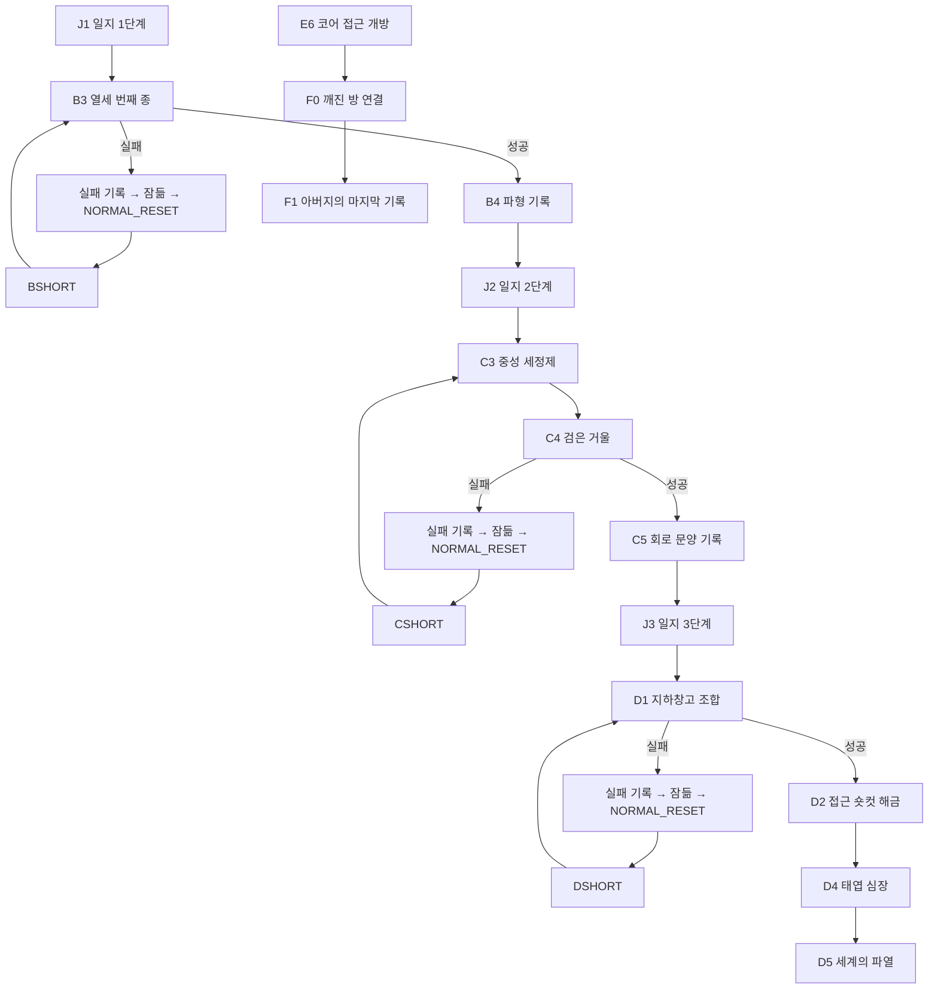
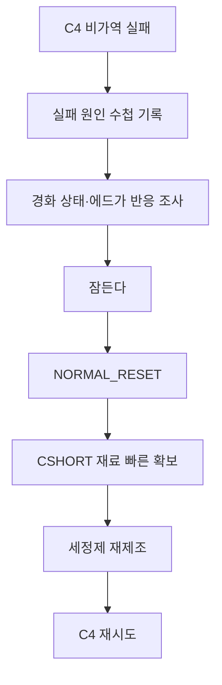
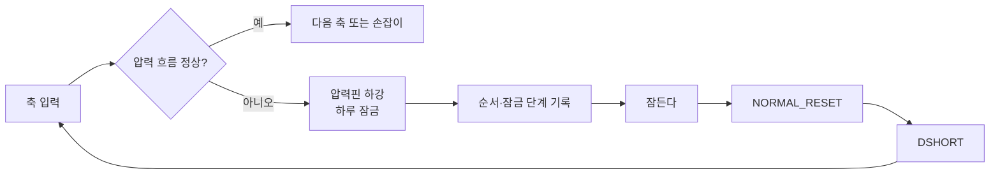

# GGB 이벤트 상세 03: 메인 퍼즐 이벤트

## 1. 문서 목적

본 문서는 GGB의 필수 진행을 구성하는 메인 퍼즐 6종을 실제 플레이 가능한 수준으로 구체화한다.

| 이벤트 ID | 퍼즐명 | 핵심 사고 | 실패 처리 |
| --- | --- | --- | --- |
| `B3` | 시계망 작동 / 열세 번째 종 | 관찰 비교, 후보 선택 | 시계망 하루 잠금 후 `NORMAL_RESET` |
| `C3` | 중성 세정제 조합 | 정보 결합, 순서·비율 | 조합대에서 즉시 재시도 |
| `C4` | 열세 번째 종의 검은 거울 | 준비, 상태 변화, 도구 사용 | 코팅 경화·도구 회수 후 `NORMAL_RESET` |
| `D1` | 지하창고 조합 | 문양 변환, 순서 추론 | 압력 장치 하루 잠금 후 `NORMAL_RESET` |
| `D4` | 태엽 심장 / 위장 필터 해제 | 이전 단서 종합 | 오입력은 로컬 복구, 성공 시 D5 강제 전환 |
| `F0` | 코어로 가는 길 | 공간 인과 연결 | 로컬 재조작, 정상 리셋 사용 불가 |

본 문서의 퍼즐은 다음 원칙을 따른다.

- 정답은 고정하며 랜덤화하지 않는다.
- 반사 신경보다 관찰과 추론을 요구한다.
- 수면 리셋은 당일에 되돌리기 어려운 물리 변화가 생겼을 때만 사용한다.
- 실패한 시도는 다음 루프의 정보가 된다.
- 관계 상태는 힌트와 연출을 바꾸되 필수 정답과 접근 가능성을 바꾸지 않는다.
- 음향, 색상, 미세 조작 중 하나만으로 정답을 판별하게 하지 않는다.

## 2. 메인 퍼즐 전체 흐름



## 3. 퍼즐 난이도와 플레이타임

| 순서 | 퍼즐 | 첫 시도 권장 시간 | 재시도 권장 시간 | 난이도 |
| --- | --- | --- | --- | --- |
| 1 | B3 열세 번째 종 | 8~12분 | 3~5분 | 보통 |
| 2 | C3 중성 세정제 | 4~7분 | 1~3분 | 쉬움~보통 |
| 3 | C4 검은 거울 | 6~10분 | 3~5분 | 보통 |
| 4 | D1 지하창고 조합 | 7~12분 | 3~6분 | 보통~어려움 |
| 5 | D4 태엽 심장 | 6~9분 | 로컬 재시도 | 보통 |
| 6 | F0 깨진 방 연결 | 10~15분 | 로컬 재시도 | 보통~어려움 |

난이도는 조작 정밀도보다 필요한 정보의 수와 변환 단계로 높인다.

## 4. 공통 상호작용 문법

### 4.1 조사

오브젝트를 클릭해 외형, 소리, 촉감, 다른 기록과의 연결을 확인한다.

- 최초 조사: 전체 설명과 단서 제공.
- 반복 조사: 핵심 단서 한 문장으로 축약.
- 실패 후 조사: 이전 시도와 달라진 물리 상태 우선 설명.

### 4.2 선택과 투입

- 후보 선택 전에는 결과가 확정되지 않는다.
- 비가역 입력에는 `이 장치를 작동한다` 같은 명시적 확인을 둔다.
- 플레이어가 이미 실패한 입력을 반복하려 하면 수첩 기록을 한 번 보여준다. (어떻게 하까요?)
- 확인 후 같은 입력을 다시 선택하는 것은 허용한다.

### 4.3 대기

유연한 시간제를 사용한다.

- 필요한 준비를 마친 뒤 `종이 울릴 때까지 기다린다`를 선택한다.
- 실시간으로 여러 분을 기다리게 하지 않는다.
- 퍼즐 활성 구간에서는 시간 제한보다 상태 변화를 관찰하게 한다.

### 4.4 되돌리기

| 유형 | 처리 |
| --- | --- |
| 조합 UI의 단순 오입력 | 즉시 취소 또는 재료 회수 |
| 회전판·방 조각 오배치 | 로컬 재조작 |
| 압력핀·코팅 경화·시계망 잠금 | 잠들어 `NORMAL_RESET` |
| D5 이후 퍼즐 실패 | 수면 리셋 금지, 로컬 재조작 |

## 5. 공통 상태 변수

```yaml
puzzle:
  b3:
    observed_clock_ids: []
    tested_clock_ids: []
    network_locked_today: false
    solved: false
  c3:
    formula_known: false
    current_mix: []
    cleaner_ready_today: false
  c4:
    coating_state: sealed
    cloth_state: dry
    edgar_intervention_used_today: false
    solved: false
  d1:
    attempted_sequences: []
    correct_prefix_length: 0
    pressure_locked_today: false
    solved: false
  d4:
    ring_settings: [null, null, null]
    winding_count: 0
    solved: false
  f0:
    current_room_order: []
    confirmed_adjacencies: []
    wrong_connection_count: 0
    solved: false
```

## 6. B3 시계망 작동 / 열세 번째 종

### 6.1 기본 정보

| 항목 | 내용 |
| --- | --- |
| 이벤트 ID | `B3` |
| 이벤트명 | 틀린 소리 |
| 발생 위치 | 침실, 대응접실, 서재, 서쪽 복도 |
| 핵심 조작 위치 | 서쪽 복도 시계망 점검함 |
| 발생 시간대 | 조사: 하루 전체, 작동: 저녁 |
| 선행 조건 | `journal_stage >= 1`, 수첩 지속 확인 완료 |
| 성공 보상 | B4 파형 기록, B5·J2 접근 |
| 실패 결과 | 선택한 시계가 작동하고 시계망이 당일 잠김 |

### 6.2 플레이어 목표

아버지 일지의 문장 `시계의 틀린 소리를 찾아라`가 가리키는 시계를 찾아 작동한다.

플레이어가 이해해야 하는 핵심은 다음과 같다.

> 틀린 것은 표시된 시간이 아니라, 울릴 수 없다고 여겨진 시계에서 나는 소리다.

### 6.3 시계 후보

| ID | 위치 | 외형 정보 | 청각·촉각 정보 | 역할 |
| --- | --- | --- | --- | --- |
| `CLOCK_BED` | 침실 | 한 시간 느림 | 종 장치 없음 | 시각적 오답 |
| `CLOCK_PARLOR` | 대응접실 | 정상 작동 | 저녁에 열두 번 울림 | 기준 시계 |
| `CLOCK_LIBRARY` | 서재 | 바늘이 멈춤 | 벽 안쪽으로 약한 진동 전달 | 중계 장치 |
| `CLOCK_WEST` | 서쪽 복도 | 장식용 대시계처럼 보임 | 종이 없는데 내부에서 금속 공명 | 정답 |

### 6.4 단서 획득

| 단서 | 획득처 | 추론 |
| --- | --- | --- |
| 침실 시계에는 종 장치가 없음 | 시계 뒷면 조사 | 느린 시간은 핵심이 아님 |
| 대응접실 시계는 정확히 열두 번 울림 | 저녁 관찰 | 정상 소리의 기준 |
| 서재 시계의 진동이 서쪽 벽으로 이어짐 | 벽과 시계 조사 | 시계망의 중계 경로 |
| 서쪽 대시계는 장식이라 울리지 않는다고 알려짐 | 마라 대화·업무 장부 | 울린다면 가장 큰 모순 |
| 일지 잉크가 서쪽 복도에서 떨림 | 수첩·일지 비교 | 정답 후보 강화 |

### 6.5 퍼즐 화면

서쪽 복도 점검함을 열면 네 시계로 이어진 배선 모형과 네 개의 봉인핀이 보인다.

각 시계 노드는 다음 정보를 표시한다.

- 조사 완료 여부.
- 관찰한 시간 차이.
- 종 장치 유무.
- 이전 루프 시험 여부.
- 시계망 연결 방향.

미확인 정보는 `?`로 남긴다. 조사하지 않은 정보를 자동으로 채우지 않는다.

### 6.6 정답 흐름

1. 시계 네 개 중 최소 세 개를 조사한다.
2. 대응접실 시계의 열두 번 종을 기준음으로 기록한다.
3. 서재 벽시계의 진동 방향을 확인한다.
4. 점검함에서 `CLOCK_WEST` 노드를 선택한다.
5. `서쪽 대시계의 봉인핀을 해제한다`를 확인한다.
6. 유연한 시간제로 저녁 종 직후까지 전진한다.
7. 열두 번의 정상 종 뒤 짧은 정적이 생긴다.
8. 서쪽 대시계에서 열세 번째 금속음이 울린다.
9. 파형이 수첩에 자동 기록된다.
10. B4를 거쳐 B5·J2가 열린다.

### 6.7 정답 논리


### 6.8 실패 분기

| 선택 | 결과음 | 영구 기록 |
| --- | --- | --- |
| 침실 시계 | 불완전한 한 번의 타격 후 정지 | `종이 없는 것이 아니라 연결도 없다.` |
| 대응접실 시계 | 정상적인 열두 번의 종 | `정상적인 소리는 답이 아니다.` |
| 서재 시계 | 벽 안쪽에서 둔한 여섯 번의 공명 | `이 시계는 소리를 내는 것이 아니라 전달한다.` |
| 서쪽 대시계 | 열두 번 뒤 열세 번째 금속음 | 성공 파형 |

오답을 작동하면:

1. 봉인핀이 역방향으로 꺾인다.
2. 시계망 전체의 안전 추가 내려온다.
3. 다른 노드가 회색으로 잠긴다.
4. 선택 결과가 수첩에 기록된다.
5. 남은 조사는 가능하지만 당일 재작동은 불가능하다.
6. 잠들면 시계망이 초기화된다.

### 6.9 리셋의 의미

- `tested_clock_ids`와 관찰 기록은 유지된다.
- 봉인핀과 시계망 잠금은 초기화된다.
- 다음 루프는 `BSHORT`로 저녁까지 압축할 수 있다.
- 시험한 시계는 제외 표시되지만 재선택은 가능하다.

### 6.10 힌트 단계

| 단계 | 조건 | 힌트 |
| --- | --- | --- |
| 1 | 시계 조사 2개 이하 | `시간이 다른 시계와 소리가 다른 시계는 같은 뜻일까?` |
| 2 | 모든 시계 조사 후 정체 | 대응접실 종 횟수와 서쪽 대시계 설명에 밑줄 |
| 3 | 첫 실패 | 실패한 시계의 기능을 수첩 도식에 명시 |
| 4 | 두 번째 실패 | 서재 진동에서 서쪽으로 이어지는 배선을 강조 |

### 6.11 사용인 영향

| 조건 | 변형 |
| --- | --- |
| 마라 bond 높음 | `서쪽 대시계는 장식이라 종이 울릴 리 없다`는 단서를 먼저 제공 |
| 마라 alert 높음 | 점검함을 닫아 두지만 같은 복도의 열쇠걸이에서 열쇠 획득 가능 |
| 에드가 alert 높음 | 작동 직전 제지 대화 1회 |
| 에드가 bond 높음 | `정상적인 시계라면 열두 번에서 멈춥니다`라는 간접 힌트 |

필수 단서는 환경과 수첩만으로도 모두 얻을 수 있다.

### 6.12 감각 / 심리 연출

- 일반 종은 방 안에서 들리지만 열세 번째 종은 갈비뼈 안쪽을 울리는 저주파로 표현한다.
- 오답 잠금은 톱니가 한쪽으로 무너지고 금속이 식는 소리로 비가역성을 전달한다.
- 열세 번째 종 직전 사용인 대화와 생활음이 동시에 끊긴다.
- 성공 순간 복도 조명이 소리보다 한 박자 늦게 깜박인다.

### 6.13 접근성

- 종 횟수를 화면 가장자리의 진동 파형과 자막으로 함께 표시한다.
- 저주파를 듣기 어려운 플레이어에게 컨트롤러 진동 또는 시각 파형을 제공한다.
- `종소리 횟수 자막`을 켜도 퍼즐의 정답 문구까지 표시하지 않는다.

### 6.14 완료 조건과 상태 변경

```yaml
event_id: B3
success_input: CLOCK_WEST
on_success:
  puzzle.b3.solved: true
  knowledge.thirteenth_bell_known: true
  knowledge.thirteenth_bell_wave_known: true
  notebook.add: note_bell_wave
  next_event: B4
on_failure:
  puzzle.b3.network_locked_today: true
  failure_log.b3_failed_clock_ids.add: selected_clock_id
  shortcut.b_route_unlocked: true
  next_objective: inspect_result_then_sleep
```

## 7. C3 중성 세정제 조합

### 7.1 기본 정보

| 항목 | 내용 |
| --- | --- |
| 이벤트 ID | `C3` |
| 이벤트명 | 지워지지 않는 얼룩을 위한 용액 |
| 발생 위치 | 주방의 작은 조합대 |
| 발생 시간대 | 아침~낮 |
| 선행 조건 | C2·C2-1 정보 확보 |
| 성공 보상 | 당일 중성 세정제, C4 준비 완료 |
| 실패 결과 | 조합 폐기 후 즉시 재시도 |

### 7.2 플레이어 목표

검은 거울의 위장 코팅을 손상시키지 않는 중성 세정제를 만든다.

### 7.3 준비물

| 아이템 | 획득 위치 | 표시 |
| --- | --- | --- |
| 눈금 빈 병 | 주방 조합대 | 4칸 눈금 |
| 증류수 | 약품장 아래 선반 | 물방울 문양 |
| 희석 세정 원액 | 잠긴 약품장 내부 | 삼각 경고와 `1/4` 라벨 |
| 중성 시험지 | 루카의 조리 도구함 | 회색이 중성 |
| 부드러운 천 | 청소도구실 | 가장자리에 흰 실 |

`부드러운 천`은 C3의 용액 조합에 투입하지 않고 C4 준비물로 묶는다.

### 7.4 단서

| 단서 | 내용 |
| --- | --- |
| 마라의 청소 기록 | 강한 세정제는 검은 코팅을 손상시킨다. |
| 원액 라벨 | 전체 용액의 1/4만 사용한다. |
| 병 경고 문구 | 빈 병에 물을 먼저 담는다. |
| 루카 대화 | 진한 것을 옅게 만들 때는 담아둘 물부터 준비한다. |
| 시험지 표본 | 회색이면 중성, 붉거나 푸르면 폐기한다. |

### 7.5 조합 UI

조합대 확대 화면에는 아래 요소만 둔다.

- 4칸 눈금 빈 병.
- 증류수 계량컵.
- 세정 원액 한 방울 스포이드.
- 중성 시험지.
- 폐기용 금속 쟁반.
- 수첩 열기 버튼.

재료를 드래그하는 방식과 클릭 순서 방식 중 하나를 선택할 수 있게 한다.

### 7.6 정답

1. 빈 병에 증류수 3칸을 넣는다.
2. 희석 세정 원액 1칸을 넣는다.
3. 병마개를 닫고 천천히 한 번 뒤집는다.
4. 시험지를 대어 회색 반응을 확인한다.
5. 부드러운 천과 함께 `거울 청소 세트`로 준비한다.

정답식:

```text
증류수 3 : 희석 세정 원액 1
투입 순서 = 물 → 원액
```

### 7.7 오답 처리

| 오답 | 반응 | 재시도 |
| --- | --- | --- |
| 원액을 먼저 넣음 | 병이 따뜻해지고 김이 서림 | 자동 중단, 재료 반환 |
| 원액 2칸 이상 | 시험지가 붉게 변함 | 쟁반에 폐기 후 즉시 재시도 |
| 물 4칸 | 세정력이 없는 투명 용액 | 한 칸 덜어내고 계속 가능 |
| 흔들기 여러 번 | 거품이 생겨 농도 판독 지연 | 잠시 두면 가라앉음 |
| 시험지 확인 생략 | 주인공이 거울에 쓰기 전 확인해야 한다고 독백 | 조합대 이탈 전 확인 요구 |

C3의 오답은 수면 리셋을 요구하지 않는다. 물리적으로 되돌릴 수 있고 재료도 충분하기 때문이다.

### 7.8 힌트 단계

| 단계 | 힌트 |
| --- | --- |
| 1 | 병의 4칸 눈금과 원액 라벨 `1/4` 강조 |
| 2 | 마라의 기록과 루카의 라벨을 수첩에서 나란히 배치 |
| 3 | 증류수 용기에 먼저 선택 테두리 표시 |
| 4 | 주인공 독백: `네 칸 중 셋은 물, 마지막 하나만 원액.` |

### 7.9 사용인 영향

| 조건 | 변형 |
| --- | --- |
| 루카 bond 높음 | 중성 시험지를 조합대에 미리 둠 |
| 루카 alert 높음 | 약품 사용 이유를 묻지만 안전 절차를 확인하면 허용 |
| 마라 bond 높음 | 부드러운 천을 도구함 바깥에 둠 |
| 마라 alert 높음 | 강한 천을 함께 두어 경고 문장을 강화하되 정답 천 표시는 유지 |

### 7.10 감각 / 심리 연출

- 조합 성공 시 향이 나지 않고, 대신 코 안쪽이 차가워지는 느낌을 묘사한다.

### 7.11 완료 조건과 상태 변경

```yaml
event_id: C3
recipe:
  order: [distilled_water, diluted_cleaning_concentrate]
  ratio: [3, 1]
  validation: neutral_test_gray
on_success:
  puzzle.c3.cleaner_ready_today: true
  inventory.add: neutral_cleaner
  inventory.add: soft_cloth
  progress.current_objective: wait_for_thirteenth_bell_at_mirror
  next_event: C4_PREP
```

## 8. C4 열세 번째 종의 검은 거울

### 8.1 기본 정보

| 항목 | 내용 |
| --- | --- |
| 이벤트 ID | `C4` |
| 이벤트명 | 열세 번째 종의 검은 거울 |
| 발생 위치 | 대응접실 |
| 발생 시간대 | 저녁 |
| 선행 조건 | 중성 세정제, 부드러운 천, 열세 번째 종 파형 |
| 성공 보상 | 진단 패널, 냉각 장치 실루엣, C5·J3 |
| 실패 결과 | 코팅 경화 또는 도구 회수 후 `NORMAL_RESET` |

### 8.2 플레이어 목표

열세 번째 종이 위장 코팅을 느슨하게 만드는 순간, 중성 세정제를 묻힌 천으로 회로선을 따라 코팅을 제거한다.

### 8.3 공정성 원칙

C4는 타이밍 퍼즐이지만 반사 신경을 시험하지 않는다.

- 준비를 마친 뒤 `열세 번째 종을 기다린다`를 선택한다.
- 열세 번째 종이 울리면 퍼즐 상태가 `loosened`로 고정된다.
- 플레이어가 수첩을 읽는 동안 활성 시간이 줄어들지 않는다.
- 실패는 너무 일찍 거울에 용액을 직접 쓰거나, 잘못된 도구를 확정 사용했을 때 발생한다.

### 8.4 준비 단계

1. 에드가의 저녁 동선을 수첩에서 확인한다.
2. 대응접실 거울 앞 작은 탁자에 용액과 천을 준비한다.
3. 용액을 거울이 아니라 부드러운 천에 1회분 묻힌다.
4. `종이 울릴 때까지 기다린다`를 선택한다.
5. 대응접실 괘종시계의 열두 번 종을 듣는다.
6. 정적 뒤 열세 번째 종이 울리면 거울에 세 개의 회로선이 드러난다.

### 8.5 닦기 입력

거울의 검은 표면에 세 개의 회로선이 순서대로 맥동한다.

| 순서 | 위치 | 시각·촉각 단서 |
| --- | --- | --- |
| 1 | 중앙의 짧은 수직선 | 가장 먼저 밝아지고 천을 대면 미세한 진동 |
| 2 | 왼쪽 아래의 갈라진 선 | 두 갈래가 번갈아 점멸 |
| 3 | 오른쪽 위의 닫힌 고리 | 마지막에 한 바퀴 도는 빛 |

플레이어는 빛난 선을 클릭한 뒤 닦는 방향을 선택한다. 미세한 드래그 정밀도는 요구하지 않는다.

정답 순서:

```text
중앙 직선 → 왼쪽 아래 분기선 → 오른쪽 위 닫힌 고리
```

이 문양은 C5에 기록되며 D1의 축 문양으로 재사용된다.

### 8.6 성공 흐름

1. 첫 선을 닦으면 검은 막 아래에서 청백색 금속이 드러난다.
2. 두 번째 선에서 주변 벽지가 한 프레임 동안 배관으로 바뀐다.
3. 세 번째 선이 지워지면 검은 코팅 전체가 렌더링 레이어처럼 벗겨진다.
4. 진단 패널과 지하 좌표가 나타난다.
5. 거울 반사가 한 박자 늦게 움직인다.
6. 반사가 냉각 장치 안의 주인공 실루엣으로 바뀐다.
7. 에드가가 나타나 주인공을 `대상`이라고 부른 뒤 역할 말투로 돌아온다.
8. C5가 회로 문양과 지하 좌표를 자동 기록한다.

### 8.7 실패 분기

| 실패 | 물리 결과 | 영구 정보 |
| --- | --- | --- |
| 열세 번째 종 전에 거울에 용액 사용 | 코팅이 용액을 흡수해 검은 유리처럼 경화 | `종 뒤에 선이 드러날 때 사용` |
| 천 없이 직접 도포 | 용액이 얇은 막을 만들고 전량 굳음 | `천에 소량 묻힌다` |
| 거친 천 사용 | 표면이 하얗게 일어나 회로선 판독 불가 | `흰 실 가장자리의 부드러운 천` |
| 에드가가 있는 시간에 시작 | 에드가가 용액과 천을 회수 | 정확한 순찰 공백 |
| 회로선 순서 오입력 3회 | 코팅이 다시 닫히며 당일 경화 | 시도한 선과 맥동 순서 |

회로선 첫 오입력과 두 번째 오입력은 즉시 실패시키지 않는다. 선이 어두워지고 다시 맥동하여 교정 기회를 준다.

### 8.8 실패 후 흐름



### 8.9 힌트 단계

| 단계 | 힌트 |
| --- | --- |
| 1 | 수첩의 종 파형과 거울의 맥동을 나란히 표시 |
| 2 | 천 조사 문장에 `거울이 아니라 천에 먼저` 강조 |
| 3 | 첫 회로선이 다른 선보다 먼저 진동 |
| 4 | 실패한 선 순서에 취소선, 아직 시도하지 않은 첫 선 강조 |

### 8.10 사용인 영향

| 조건 | 변형 |
| --- | --- |
| 에드가 alert 높음 | 순찰 개입이 발생하지만 대화로 개입 예산을 소진시키거나 정확한 공백을 이용 가능 |
| 에드가 bond 높음 | 마지막 경고 뒤 일부러 시선을 돌리는 짧은 연출 |
| 마라 bond 높음 | 부드러운 천과 1회분 용액 사용법을 간접적으로 표시 |
| 마라 alert 높음 | 도구를 제자리에 돌려놓으라고 말하지만 회수하지는 않음 |

### 8.11 감각 / 심리 연출

- 천이 거울에 닿을 때 유리가 아니라 차가운 금속판을 닦는 마찰음을 낸다.
- 검은 막은 액체가 아니라 이미지 층이 벗겨지듯 사각형 조각으로 사라진다.
- 냉각 장치 실루엣을 본 순간 주변 소리를 먹먹하게 만들고 주인공의 호흡만 남긴다.
- 주인공은 거울 속 자신과 자신의 움직임이 맞지 않는 데서 신체 소유감의 흔들림을 느낀다.

### 8.12 접근성

- 회로선 맥동은 빛, 선 굵기, 진동 아이콘을 함께 사용한다.
- 화면 글리치 강도와 번쩍임을 설정에서 낮출 수 있다.
- 닦기 입력은 드래그 대신 순서 클릭 모드를 기본으로 제공한다.

### 8.13 완료 조건과 상태 변경

```yaml
event_id: C4
required:
  puzzle.c3.cleaner_ready_today: true
  knowledge.thirteenth_bell_wave_known: true
correct_trace: [center_line, lower_left_branch, upper_right_ring]
on_success:
  puzzle.c4.solved: true
  world.mirror_revealed: true
  progress.glitch_stage: 2
  knowledge.basement_coordinates_known: true
  next_event: C5
on_hard_failure:
  failure_log.c4_failure_causes.add: failure_cause
  shortcut.c_route_unlocked: true
  next_objective: sleep_to_restore_coating
```

## 9. D1 지하창고 조합 퍼즐

### 9.1 기본 정보

| 항목 | 내용 |
| --- | --- |
| 이벤트 ID | `D1` |
| 이벤트명 | 지하로 내려가는 세 개의 축 |
| 발생 위치 | 서쪽 복도 벽체 내부의 지하창고 입구 |
| 발생 시간대 | 유연 |
| 선행 조건 | J3 복원, D0 단서 재확인 |
| 성공 보상 | D2 지역-지하창고 접근 숏컷 해금 |
| 실패 결과 | 압력핀 하강, 장치 하루 잠금, `NORMAL_RESET` |

### 9.2 플레이어 목표

C5에서 본 회로 문양과 D0의 서재 단서를 이용해 세 축을 올바른 순서로 밀고 중앙 손잡이를 돌린다.

### 9.3 장치 구성

벽체 패널 안에는 세 개의 수평축과 중앙 손잡이가 있다.

| 축 ID | 문양 | 대응 단서 | 물리 반응 |
| --- | --- | --- | --- |
| `AXIS_LINE` | 짧은 직선 | C4 첫 회로선 | 밀면 단일 톱니가 전진 |
| `AXIS_BRANCH` | 두 갈래 분기 | C4 두 번째 회로선 | 두 보조 톱니로 압력 분산 |
| `AXIS_RING` | 닫힌 고리 | C4 세 번째 회로선 | 외곽 잠금쇠 해제 |

중앙 손잡이는 세 축이 올바른 압력 상태일 때만 회전한다.

### 9.4 D0 단서

서재에서 다음 정보를 재확인한다.

- 거울 회로 문양을 비추면 책상 금속판에 세 문양이 겹친다.
- 금속판 가장자리에는 `하나는 길을 열고, 둘은 힘을 나누며, 닫힌 것은 문을 푼다`는 문장이 나타난다.
- 압력 도식은 안쪽에서 바깥쪽으로 흐른다.

이 단서는 정답 순서를 논리적으로 설명한다.

```text
길을 연다 → 힘을 나눈다 → 문을 푼다
직선축 → 분기축 → 환형축
```

### 9.5 정답 흐름

1. 패널의 먼지를 닦아 세 축 문양을 확인한다.
2. 수첩의 C5 회로 문양과 D0 문장을 연다.
3. `AXIS_LINE`을 민다.
4. 맑은 금속음과 함께 첫 압력 게이지가 고정된다.
5. `AXIS_BRANCH`를 민다.
6. 두 번째 게이지의 압력이 좌우로 나뉜다.
7. `AXIS_RING`을 민다.
8. 외곽 잠금쇠 세 개가 해제된다.
9. 중앙 손잡이를 시계 방향으로 반 바퀴 돌린다.
10. 지하창고 입구가 열리고 D2 숏컷이 기록된다.

정답:

```text
AXIS_LINE → AXIS_BRANCH → AXIS_RING → 중앙 손잡이
```

### 9.6 실패 규칙

잘못된 축을 누르는 즉시 장치를 실패시키지는 않는다. 현재 단계에 맞지 않는 압력 변화가 발생할 때 잠금이 내려온다.

| 오입력 | 결과 |
| --- | --- |
| 첫 입력이 분기축 | 압력이 갈 곳을 찾지 못해 좌우 핀이 동시에 걸림 |
| 첫 입력이 환형축 | 외곽 잠금이 안쪽 압력을 봉인 |
| 직선축 뒤 환형축 | 압력이 분산되지 않아 중앙축이 휨 |
| 올바른 세 축 뒤 손잡이를 반대로 돌림 | 역회전 방지턱이 걸리기 전 경고, 확정 전 취소 가능 |

압력 잠금 발생 시:

1. 붉은 압력핀이 내려온다.
2. 축과 손잡이가 고정된다.
3. 당일에는 외피를 열 수 없어 복구 불가능하다.
4. 실패한 입력 순서와 잠금 단계가 수첩에 기록된다.
5. 추가 조사는 가능하지만 재입력은 불가능하다.

### 9.7 리셋 후 정보 이점

| 유지 정보 | 다음 시도 효과 |
| --- | --- |
| 실패한 전체 순서 | 수첩에 취소선 |
| 올바르게 반응한 앞부분 | 맑은 금속음 기호로 표시 |
| 잠금 발생 단계 | 해당 단계에 압력 경고 |
| 축별 물리 반응 | `길`, `분산`, `외곽 잠금` 기능 문장 해금 |

퍼즐 성공 전까지 최대 6개 순열을 무작정 시험할 수 있지만, D0 단서와 첫 실패 정보만으로 정답을 추론할 수 있게 설계한다.

### 9.8 실패 후 흐름



### 9.9 힌트 단계

| 단계 | 힌트 |
| --- | --- |
| 1 | C5 회로선과 축 문양의 형태가 같음을 강조 |
| 2 | D0 문장의 `길`, `나눈다`, `문`에 각 문양 표시 |
| 3 | 첫 축 후보 중 직선축에서만 안쪽 톱니가 전진하는 미리보기 |
| 4 | 실패한 순서와 올바른 앞부분을 수첩에서 분리 표시 |

### 9.10 사용인 영향

| 조건 | 변형 |
| --- | --- |
| 마라 bond 높음 | `먼저 길을 만들고 힘을 나눠야죠`라는 기계식 잠금 힌트 |
| 에드가 alert 높음 | 지하 접근 경고와 우회 동선 1회 추가 |
| 에드가 bond 높음 | 패널을 막지는 않고 `열고 나면 되돌릴 수 없는 것도 있습니다`라고 경고 |
| 루카 bond 높음 | 실패 후 손목 통증을 확인하고 다음 루프 목표를 정리 |

### 9.11 감각 / 심리 연출

- 올바른 입력은 맑고 짧은 금속음, 잘못된 입력은 뼈를 긁는 듯한 저음으로 구분한다.
- 실패 후 손잡이가 굳어 있는 장면에서 주인공이 자신도 같은 방식으로 잠겨 있다는 연상을 한다.
- 문이 열리면 지하 공기 대신 냉각 장치와 비슷한 소독약 냄새가 올라온다.

### 9.12 접근성

- 세 문양은 형태와 텍스트 라벨을 함께 사용한다.
- 압력 상태는 색상 외에 게이지 높이와 잠금핀 개수로 표시한다.
- 축 조작은 클릭 후 확인 방식이며 드래그 강도를 요구하지 않는다.

### 9.13 완료 조건과 상태 변경

```yaml
event_id: D1
correct_sequence: [AXIS_LINE, AXIS_BRANCH, AXIS_RING]
final_action: turn_center_handle_clockwise
on_success:
  puzzle.d1.solved: true
  shortcut.basement_access_fast_path: true
  progress.current_objective: enter_basement
  next_event: D2
on_failure:
  puzzle.d1.pressure_locked_today: true
  failure_log.d1_failure_causes.add:
    sequence: current_sequence
    lock_step: current_step
  shortcut.d_route_unlocked: true
  next_objective: inspect_lock_then_sleep
```

## 10. D4 태엽 심장 / 위장 필터 해제

### 10.1 기본 정보

| 항목 | 내용 |
| --- | --- |
| 이벤트 ID | `D4` |
| 이벤트명 | 저택의 심장을 다시 뛰게 한다 |
| 내부 운영명 | 위장 필터 해제(확정 실패 이벤트) |
| 발생 위치 | 지하창고 최심부 |
| 발생 시간대 | D2 직후 |
| 선행 조건 | D1 성공, 지하창고 진입 |
| 성공 보상 | 장치 작동 |
| 실제 결과 | 위장 필터 해제, D5 세계의 파열 |

### 10.2 플레이어에게 보이는 목표

지하의 태엽 심장이 저택 전체의 오류를 만드는 고장 장치처럼 보인다. 주인공은 아버지의 단서와 지금까지 모은 기록을 이용해 장치를 안정화하려 한다.

플레이어에게는 `실패할 수밖에 없는 이벤트`라고 알리지 않는다.

> 퍼즐 입력에는 올바른 답이 있고, 플레이어는 실제로 장치 작동에 성공한다. 다만 장치의 진짜 기능이 저택 복구가 아니라 고딕 위장 필터 해제다.

### 10.3 장치 외형

태엽 심장은 고딕식 황동 장치로 보이지만 가까이 가면 아래 요소가 겹쳐 보인다.

- 심장 형태의 중앙 동력부.
- 시계 숫자가 새겨진 외곽 링.
- 검은 거울 회로선이 새겨진 중간 링.
- 저택 단면도가 새겨진 안쪽 링.
- 13단 걸림이 있는 태엽 열쇠.
- `복구`라고 번역되는 은색 작동판.

### 10.4 재사용 단서

| 링 | 필요한 정보 | 출처 |
| --- | --- | --- |
| 외곽 시계 링 | XIII 위치 | B3·B4 열세 번째 종 파형 |
| 중간 회로 링 | 직선→분기→고리 연결점 | C5 회로 문양 |
| 안쪽 저택 링 | 가장 낮은 지하 노드 | J3 `심장은 집의 가장 낮은 곳` |
| 태엽 횟수 | 13번째 걸림 | B3의 비정상 동기화 수 |

### 10.5 정답 흐름

1. 외곽 시계 링을 `XIII` 표식에 맞춘다.
2. 중간 회로 링을 돌려 직선, 분기, 고리가 하나의 경로가 되게 한다.
3. 안쪽 저택 링의 심장 문양을 가장 낮은 지하 노드에 맞춘다.
4. 세 링이 맞으면 중앙부에서 안정적인 박동음이 난다.
5. 태엽 열쇠를 13번째 걸림까지 감는다.
6. 은색 `복구` 작동판을 누른다.
7. 장치가 정상 작동하고 모든 게이지가 안정 범위에 들어온다.
8. 고딕 문자 아래에서 잠시 `CAMOUFLAGE FILTER`라는 시스템 문구가 노출된다.
9. 상태가 `OFF`로 바뀐다.
10. D5 세계의 파열이 시작된다.

### 10.6 오입력 처리

D4의 일반 오입력은 수면 리셋을 요구하지 않는다.

| 오입력 | 반응 | 처리 |
| --- | --- | --- |
| 링 정렬 불일치 | 중앙 박동이 불규칙하고 작동판 비활성 | 링 재조작 |
| 태엽 13회 미만 | 열쇠가 되밀려 한 단계 감소 | 계속 감기 |
| 13회 초과 시도 | 13번째 걸림에서 물리적으로 멈춤 | 추가 입력 불가 |
| 작동 전 방을 나감 | 현재 정렬 유지 | 재입장 가능 |

운영진 관점의 `확정 실패`는 오입력 실패가 아니라, 정답 성공 결과가 반드시 D5로 이어진다는 뜻이다.

### 10.7 마지막 확인

작동판을 누르기 전 확인 문구:

```text
장치는 안정된 박동을 내고 있다.
이제 저택 전체에 복구 신호를 보낼 수 있다.

[작동시킨다] [기록을 다시 확인한다]
```

`작동시킨다` 이후에는 D5를 취소할 수 없다.

### 10.8 사용인 마지막 개입

사용인은 D4의 정답을 바꾸거나 D5를 막지 않는다.

| 조건 | 연출 |
| --- | --- |
| 에드가 bond 높음 | 통신 잡음 속에서 `그것은 고장 난 심장이 아닙니다`라고 경고 |
| 에드가 alert 높음 | 작동 중단 명령을 내리지만 권한 오류로 음성이 끊김 |
| 마라 bond 높음 | 금속 배관을 두드리는 소리로 불안 표현 |
| 이리스 bond 높음 | 온실의 계절 데이터가 한꺼번에 지하 패널에 흐름 |
| 루카 bond 높음 | 주인공 생체 신호 경고가 장치 화면에 겹침 |

### 10.9 감각 / 심리 연출

- 처음에는 태엽 소리지만 정렬이 맞을수록 의료 장비의 심박음으로 변한다.
- 작동 성공 직후 모든 소음이 사라지고, 벽지가 뒤집히듯 SF 시설 표면이 드러난다.

### 10.10 접근성

- 링 정렬은 자동 스냅을 사용한다.
- 13회 태엽은 클릭 반복 대신 `천천히 감는다`를 선택해 자동 연출할 수 있다.
- 심박음은 화면 파형과 링 진동으로 함께 표시한다.
- D5의 강한 글리치는 강도 조절 옵션을 적용한다.

### 10.11 완료 조건과 상태 변경

```yaml
event_id: D4
correct_state:
  clock_ring: XIII
  circuit_ring: line_branch_ring_connected
  mansion_ring: lowest_heart_node
  winding_count: 13
on_success:
  puzzle.d4.solved: true
  world.camouflage_filter_enabled: false
  world.d5_triggered: true
  reset.mode: fracture_sleep_pending
  next_event: D5
designer_note:
  forced_outcome: true
  never_label_as_failure_to_player: true
```

## 11. F0 코어로 가는 길 / 깨진 방 연결

### 11.1 기본 정보

| 항목 | 내용 |
| --- | --- |
| 이벤트 ID | `F0` |
| 이벤트명 | 저택을 이루던 방들의 순서 |
| 발생 위치 | 대시계 뒤 기계실과 코어 접근로 |
| 발생 상태 | `BROKEN_RESET` 이후 |
| 선행 조건 | J4 기본 이상, E6 코어 접근 개방 |
| 성공 보상 | F1 아버지의 마지막 기록 접근 |
| 실패 결과 | 잘못 연결된 방이 되감김, 로컬 재조작 |

### 11.2 플레이어 목표

서로 분리되어 떠다니는 네 개의 방 조각을 데이터와 생명 유지의 인과 순서로 연결해 코어까지의 안정된 길을 만든다.

### 11.3 핵심 차이

F0는 D5 이후 퍼즐이다.

- 잠들어도 정상 리셋되지 않는다.
- 오답은 퍼즐 공간 안에서 즉시 되돌릴 수 있다.
- 실패할수록 단서가 선명해진다.
- 최종부 흐름을 멀리 되돌리지 않는다.

### 11.4 방 조각

| 조각 ID | 보이는 방 | 드러난 시스템 기능 | 입력 신호 | 출력 신호 |
| --- | --- | --- | --- | --- |
| `ROOM_GREENHOUSE` | 온실 | 외부 기후 감지·공기 여과 | 황폐한 외기 데이터 | 정화된 공기 |
| `ROOM_KITCHEN` | 주방 | 생명 유지·영양 공급 | 정화된 공기·자원 | 생명 유지 흐름 |
| `ROOM_BEDROOM` | 침실 | 냉각 장치·주인공 신체 | 생명 유지 흐름 | 신경 신호 |
| `ROOM_LIBRARY` | 서재 | 기억·시뮬레이션 기록 보관 | 신경 신호 | 코어 접근 권한 |

정답은 시스템의 원인과 결과가 이어지는 순서다.

```text
온실 → 주방 → 침실 → 서재 → 코어
```

### 11.5 환경 단서

각 조각에는 두 개의 문이 있다. 문을 조사하면 다음 감각 정보가 나타난다.

| 방 | 입구 감각 | 출구 감각 |
| --- | --- | --- |
| 온실 | 모래와 금속 냄새, 외부 경보 | 필터를 지난 차가운 공기 |
| 주방 | 차가운 공기와 빈 배관 | 따뜻한 유체의 박동 |
| 침실 | 침대 아래 생명 유지관 | 관자놀이를 울리는 신호음 |
| 서재 | 움직이는 문장과 신호음 | 아버지 음성 인증 |

문 사이 신호가 맞으면 같은 파형과 촉감이 이어진다.

### 11.6 J4 단서

J4 기본 복원에서 다음 문장을 얻는다.

```text
바깥을 재고, 몸을 살리고, 잠든 아이를 연결한 뒤,
기억을 보관한 곳에서 문을 열어라.
```

관계 이벤트를 적게 보았어도 이 문장만으로 정답을 추론할 수 있다.

### 11.7 퍼즐 조작

1. 중앙 장치에서 네 방 조각의 축소 모형을 확인한다.
2. 첫 슬롯에 방 하나를 배치한다.
3. 다음 슬롯에 이어질 방을 배치한다.
4. 두 방의 문이 맞으면 연결 검사를 실행한다.
5. 올바른 연결은 통로가 고정되고 `confirmed_adjacencies`에 저장된다.
6. 잘못된 연결은 짧은 방 루프를 만든 뒤 두 번째 조각만 슬롯에서 빠진다.
7. 네 방이 모두 연결되면 실제 공간이 해당 순서로 재배열된다.
8. 플레이어가 방 조각을 직접 통과해 코어 앞에 도착한다.

### 11.8 정답 흐름


### 11.9 오답 반응

| 잘못된 연결 예시 | 공간 반응 | 새 단서 |
| --- | --- | --- |
| 침실 → 온실 | 창문을 열 때 다시 침실 문으로 돌아옴 | 신체보다 외부 입력이 먼저 필요 |
| 서재 → 주방 | 책장에서 음식 냄새가 나지만 문장이 깨짐 | 기록은 생명 유지를 출력하지 않음 |
| 주방 → 온실 | 따뜻한 배관이 차가운 외기로 역류 | 공기는 온실에서 주방으로 흐름 |
| 온실 → 서재 | 기후 수치가 문장으로 변환되지 못하고 노이즈화 | 신체와 신경 단계가 비어 있음 |

오답은 즉시 소프트락을 만들지 않는다.

- 첫 오답: 감각 불일치만 제공.
- 두 번째 오답: 입력·출력 아이콘 표시.
- 세 번째 오답: 올바른 첫 방 후보 강조.
- 네 번째 이후: 이미 맞춘 인접 관계를 자동 고정하는 선택지 제공.

### 11.10 로컬 되돌리기

퍼즐 장치에는 `연결을 풀어 다시 배치한다` 기능이 있다.

- 마지막 조각만 해제.
- 특정 연결만 해제.
- 전체 배치 초기화.

모든 기능은 F0 내부 상태만 변경한다. 챕터 진행, 관계 이벤트, J4는 되돌리지 않는다.

### 11.11 관계·기록 변형

| 조건 | 추가 단서·연출 |
| --- | --- |
| 이리스 기록 획득 | 온실 조각에 외부 대기 수치와 `먼저 들어오는 것` 표시 |
| 루카 기록 획득 | 주방 조각에 생명 유지관 방향 표시 |
| 마라 기록 획득 | 침실 조각의 숨은 배선과 청소 덮개가 열림 |
| 에드가 기록 획득 | 서재에서 코어로 나가는 인증문이 선명해짐 |
| 기록 없음 | J4 문장과 환경 신호만으로 해결 가능 |

연구원 기록은 풀이를 쉽게 하고 감정적 목소리를 추가하지만 필수 열쇠가 아니다.

### 11.12 방을 직접 통과하는 결산 구간

배치 성공 후 플레이어는 연결된 방을 차례로 걷는다.

1. 온실: 황폐한 외부 대기 수치가 잠깐 보인다.
2. 주방: 차 준비 도구 뒤로 생명 유지 펌프가 드러난다.
3. 침실: 침대와 냉각 장치가 같은 위치에 겹친다.
4. 서재: 일지 문장과 연구 기록이 공중에 분리되어 떠 있다.
5. 코어 문: 아버지의 음성이 F1을 시작한다.

이 구간은 정답 확인이자 전체 저택 공간의 의미를 다시 해석하는 연출이다.

### 11.13 힌트 단계

| 단계 | 힌트 |
| --- | --- |
| 1 | 두 방 문 사이 입력·출력 소리 비교 |
| 2 | J4 문장의 네 동사를 방 아이콘 옆에 배치 |
| 3 | 온실을 첫 슬롯 후보로 강조 |
| 4 | 맞는 인접 관계 하나를 자동 고정 |
| 5 | `온실 → 주방 → ? → 서재` 형태로 빈칸 제공 |

### 11.14 감각 / 심리 연출

- 방을 옮길 때 가구가 미끄러지는 대신 공간의 원근 자체가 접혔다 펴진다.
- 잘못 연결하면 문을 통과했는데 같은 방의 반대편에서 나오는 방향 상실을 준다.
- 정답이 가까워질수록 고딕 환경음 아래의 의료 장치 소리가 하나의 리듬으로 합쳐진다.
- 주인공은 익숙한 방들이 자신을 위한 생명 유지와 감금 장치였음을 몸으로 이해한다.

### 11.15 접근성

- 각 신호는 색상, 파형, 텍스트 명칭을 함께 제공한다.
- 공간 왜곡과 카메라 회전 강도를 낮추는 옵션을 둔다.
- 멀미 방지 모드에서는 방 이동을 페이드 전환으로 바꾼다.
- 맞춘 연결을 잠그거나 다시 풀 수 있어 실수로 전체 진행을 잃지 않는다.

### 11.16 완료 조건과 상태 변경

```yaml
event_id: F0
correct_room_order:
  - ROOM_GREENHOUSE
  - ROOM_KITCHEN
  - ROOM_BEDROOM
  - ROOM_LIBRARY
failure_mode: local_rearrangement
normal_reset_allowed: false
on_success:
  puzzle.f0.solved: true
  world.core_path_stable: true
  progress.current_objective: hear_fathers_last_record
  next_event: F1
```

## 12. 퍼즐별 리셋 정책 비교

| 퍼즐 | 오답 직후 계속 조사 | 같은 날 재입력 | 잠들기 필요 | 영구 이점 |
| --- | --- | --- | --- | --- |
| B3 | 가능 | 불가 | 필요 | 시험 시계 제외, 기능 기록 |
| C3 | 가능 | 가능 | 불필요 | 제조법 유지 |
| C4 | 가능 | 경미한 오입력만 가능 | 비가역 실패 시 필요 | 실패 원인, 도구·타이밍 기록 |
| D1 | 가능 | 압력 잠금 후 불가 | 필요 | 실패 순서와 올바른 앞부분 |
| D4 | 가능 | 가능 | 불필요 | 해당 없음, 성공 후 D5 |
| F0 | 가능 | 가능 | 불가 | 맞춘 인접 관계와 힌트 강화 |

## 13. 퍼즐 정보 전달 원칙

### 13.1 필수 단서의 이중화

모든 필수 추론은 최소 두 경로로 확인할 수 있다.

| 퍼즐 | 환경 경로 | 기록·대화 경로 |
| --- | --- | --- |
| B3 | 시계 진동과 종 횟수 | 일지와 마라 |
| C3 | 병 눈금과 라벨 | 마라 기록과 루카 |
| C4 | 거울 맥동과 에드가 동선 | B4 파형과 수첩 |
| D1 | 축의 물리 반응 | C5 문양과 D0 문장 |
| D4 | 링 구조와 장치 반응 | B4·C5·J3 |
| F0 | 방 신호 입력·출력 | J4와 연구원 기록 |

### 13.2 관계 시스템 독립성

- 높은 bond는 단서의 전달 시점을 앞당긴다.
- 높은 alert는 1회의 제지나 우회 동선을 추가할 수 있다.
- 관계 수치가 낮아도 필수 정보와 퍼즐 접근은 보장한다.
- 사용인이 정답 입력을 대신하지 않는다.
- 관계 이벤트를 보지 않은 플레이어도 모든 메인 퍼즐을 해결할 수 있다.

### 13.3 수첩 기록 규칙

수첩은 플레이어가 직접 관찰한 정보만 기록한다.

- 확인한 후보.
- 시도한 입력.
- 물리적 결과.
- 비교 가능한 소리·문양·압력.
- 다음에 확인할 빈칸.

수첩이 미확인 정답을 자동으로 작성하지 않는다.

## 14. 퍼즐별 소프트락 방지

| 위험 | 방지책 |
| --- | --- |
| B3 후보를 모두 실패 | 시험 기록으로 남은 후보가 정답임을 추론 가능, 후보 재선택 허용 |
| C3 재료 소진 | 조합대 재료는 이벤트 중 무한 재보충 |
| C4 세정제 분실 | 인벤토리 목표에서 재료 위치 안내, CSHORT 제공 |
| D1 실패 후 침실 복귀가 지루함 | 조사 종료 후 침실 귀환 동선 압축 |
| D4 정렬 상태를 이해하지 못함 | 각 링 정답마다 독립 피드백, 작동판은 세 조건 충족 시만 활성 |
| F0 방 조각 전체 혼란 | 맞는 인접 관계 고정, 부분 초기화, 단계형 힌트 |
| 관계 이벤트 미진행 | 환경·일지 경로로 필수 단서 완전 제공 |

## 15. Godot 데이터화 권장안

이번 작업에서는 프로토타입을 제작하지 않는다. 추후 구현 시 퍼즐 로직과 장면 연출을 분리한다.

### 15.1 권장 리소스 구조

```yaml
puzzle_definition:
  id: D1
  scene: res://scenes/puzzles/basement_lock.tscn
  logic: res://scripts/puzzles/sequence_pressure_puzzle.gd
  required_knowledge:
    - mirror_circuit_pattern
    - basement_pressure_sentence
  reset_policy: normal_reset_on_hard_fail
  solution:
    - AXIS_LINE
    - AXIS_BRANCH
    - AXIS_RING
  hint_table: res://data/hints/d1_hints.tres
```

### 15.2 공통 퍼즐 신호

```gdscript
signal puzzle_started(puzzle_id: StringName)
signal input_accepted(puzzle_id: StringName, input_id: StringName)
signal input_rejected(puzzle_id: StringName, reason: StringName)
signal hard_failure(puzzle_id: StringName, failure_data: Dictionary)
signal puzzle_solved(puzzle_id: StringName)
signal hint_requested(puzzle_id: StringName, hint_level: int)
```

### 15.3 저장 구분

| 데이터 | 저장 위치 |
| --- | --- |
| 현재 링·축·방 배치 | `LoopState` 또는 현재 장면 상태 |
| 시험한 시계, 실패한 순서 | `PersistentState.failure_log` |
| 퍼즐 규칙 지식 | `PersistentState.knowledge` |
| 당일 아이템 | `LoopState.inventory` |
| 퍼즐 성공 플래그 | `PersistentState.progress` |
| 맞춘 F0 인접 관계 | D5 이후 현재 세션과 일반 세이브 |

## 16. 플레이테스트 체크리스트

### 16.1 공통

- 플레이어가 퍼즐의 당장 목표를 한 문장으로 설명할 수 있는가.
- 정답 단서가 퍼즐 입력 전에 최소 두 번 노출되는가.
- 첫 실패 후 왜 실패했는지 물리 반응만으로 이해할 수 있는가.
- 실패 후 새 정보나 실행상의 이점이 생기는가.
- 관계 이벤트 없이도 해결 가능한가.
- 소리 없이, 색상 구분 없이도 해결 가능한가.
- 숏컷이 핵심 판단까지 자동으로 해결하지 않는가.

### 16.2 B3

- 플레이어가 `틀린 시간`이 아니라 `틀린 소리`로 관점을 바꾸는가.
- 후보 시계 네 개의 역할이 구분되는가.
- 오답 후 시계망 잠금이 자의적인 페널티가 아니라 물리 결과로 보이는가.

### 16.3 C3·C4

- C3의 단순 오입력이 불필요한 리셋으로 이어지지 않는가.
- C4의 열세 번째 종이 반사 신경 QTE로 느껴지지 않는가.
- 거울 성공 장면이 시뮬레이션 진실의 첫 직접 충돌로 충분히 강한가.

### 16.4 D1·D4

- C5의 회로 문양이 D1에서 자연스럽게 재사용되는가.
- D1 순서가 추측이 아니라 D0 문장으로 추론 가능한가.
- D4 성공 후 D5가 `게임이 정답을 실패 처리했다`고 느껴지지 않는가.
- 작동 전 경고가 결과를 스포일러하지 않으면서 되돌릴 수 없음은 전달하는가.

### 16.5 F0

- 네 방의 시스템 기능과 인과 순서를 이해할 수 있는가.
- 오답 연결이 멀미보다 방향 상실과 이질감으로 느껴지는가.
- 정상 리셋이 사라진 후반 규칙과 로컬 재조작이 일관적인가.
- 퍼즐 완료 후 방 통과 장면이 저택의 의미를 다시 해석하게 만드는가.

## 17. 카테고리 3 완료 기준

| 검증 항목 | 완료 기준 |
| --- | --- |
| B3 | 고정된 시계 후보, 정답 논리, 실패별 기록과 리셋 경로 정의 |
| C3 | 3:1 비율과 물→원액 순서, 즉시 재시도 규칙 정의 |
| C4 | 준비·활성·회로선 입력, 비가역 실패와 성공 연출 정의 |
| D1 | 세 축의 기능, 고정 정답 순서, 압력 잠금과 영구 실패 정보 정의 |
| D4 | 네 단서 재사용, 로컬 오입력, 성공 후 필수 D5 전환 정의 |
| F0 | 네 방의 기능과 고정 순서, 로컬 실패·힌트·결산 동선 정의 |
| 접근성 | 음향·색상·정밀 드래그에 대한 대체 표현 정의 |
| 관계 독립 | 어떤 관계 상태에서도 필수 퍼즐 해결 가능 |

## 18. 다음 카테고리로 넘길 정보

다음 상세 작성 대상은 `정보 조사 / 일지 복원 이벤트`다.

| 퍼즐 출력 | 연결 이벤트 |
| --- | --- |
| B3 열세 번째 종 파형 | B4, B5, J2 |
| C3 중성 세정제 준비 | C4 |
| C4 진단 패널·회로 문양 | C5, J3, D0 |
| D1 지하창고 접근 | D2, D4 |
| D4 위장 필터 해제 | D5, D6, BROKEN_RESET |
| F0 안정된 코어 경로 | F1, J5 |

## 19. 설계상 주의점

1. B3·C4·D1의 비가역 실패는 반드시 실패 원인을 확인한 뒤 잠들게 한다.
2. C3·D4·F0의 단순 오입력에는 수면 리셋을 사용하지 않는다.
3. D4의 내부 명칭 `확정 실패 이벤트`를 플레이어 UI와 대사에 노출하지 않는다.
4. F0에서 D5 이전의 정상 리셋 문법을 되살리지 않는다.
5. 퍼즐 정답을 관계 수치나 연구원 기록 수로 잠그지 않는다.
6. C4 회로 문양, D1 축 문양, D4 중간 링은 같은 시각 언어를 사용한다.
7. 퍼즐 문서의 고정 수치와 정답을 변경할 때는 루프 상세와 공간 지도도 함께 갱신한다.
