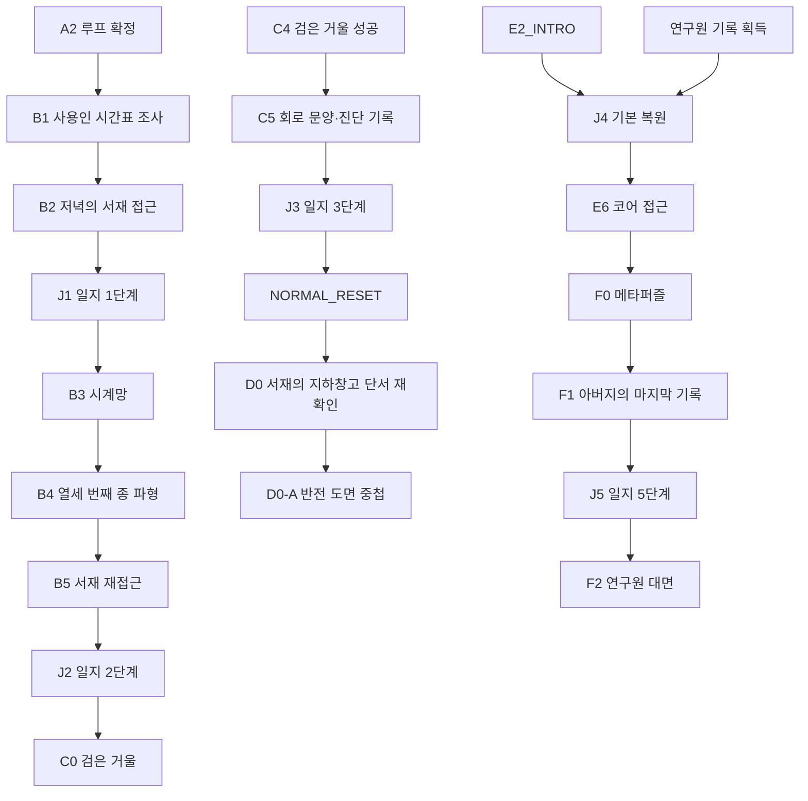
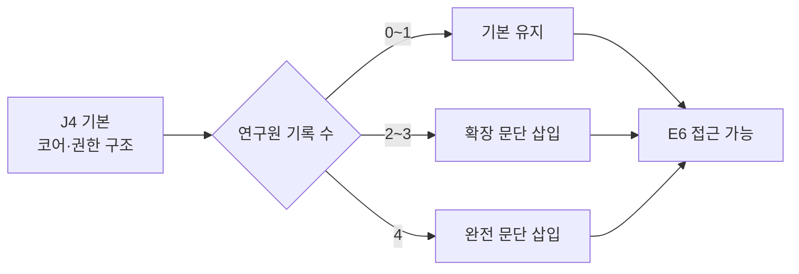

# GGB 이벤트 상세 04: 정보 조사 / 일지 복원 이벤트

## 1. 문서 목적

본 문서는 GGB의 정보 조사와 일지 복원 이벤트를 실제 플레이 가능한 수준으로 구체화한다.

퍼즐 기준은 [24-3_메인퍼즐_고난도개정안.md](24-3_메인퍼즐_고난도개정안.md)를 따른다.

상세 작성 대상:

| 구간 | 이벤트 |
| --- | --- |
| 1챕터 조사 | `B1`, `B2`, `J1`, `B5`, `J2` |
| 2챕터 조사 | `C5`, `J3`, `D0` |
| 3챕터 복원 | `J4 기본`, `J4 확장`, `J4 완전` |
| 4챕터 기록 | `F1`, `J5` |

본 카테고리의 목표는 다음과 같다.

- 플레이어가 퍼즐 정답을 전달받는 것이 아니라 원자료를 직접 비교하게 한다.
- 일지 복원이 다음 행동의 동기와 퍼즐 단서를 동시에 제공하게 한다.
- 아버지와 연구원들의 진실을 한 번에 설명하지 않고 단계적으로 공개한다.
- J4와 J5의 역할을 분리한다.
- 수첩, 일지, 연구원 기록의 기능이 서로 겹치지 않게 한다.
- F0 메타퍼즐에 필요한 정보가 필수 경로에서 모두 확보되게 한다.

## 2. 정보 매체의 역할

| 매체 | 작성 주체 | 핵심 기능 | 신뢰성 |
| --- | --- | --- | --- |
| 수첩 | 주인공 | 직접 관찰, 실패 기록, 자기 작성 표시, 퍼즐 작업 공간 | 관찰한 범위에서는 높음 |
| 아버지 일지 | 아버지 | 백도어 단서, 구조 정보, 실패와 책임의 고백 | 의도적 누락과 자기합리화 가능 |
| 사용인 대화 | 연구원 인격의 표층·잔류 기억 | 감정, 현장 정보, 우회 힌트 | 역할 고정과 감정 때문에 왜곡 가능 |
| 연구원 기록 | 사용인의 과거 인격 | 아버지의 약속과 배신, 각자의 기억 | 개인 관점에 따라 차이 |
| 시스템 진단 | 시뮬레이션 | 물리 상태, 외부 환경, 권한 분류 | 수치는 정확하나 명칭이 위장될 수 있음 |

플레이어는 하나의 매체만 믿지 않고 서로 다른 기록을 비교해야 한다.

## 3. 정보 공개 단계

| 단계 | 주인공이 아는 것 | 아직 모르는 것 |
| --- | --- | --- |
| J0 | 아버지의 낡은 일지가 있다. | 일지가 왜 자신에게 반응하는가. |
| J1 | 반복을 전제로 한 메시지와 비정상 시계망이 있다. | 저택이 시뮬레이션이라는 사실. |
| J2 | 열세 번째 종이 검은 거울의 위장을 약화한다. | 거울 뒤 시설과 자신의 신체 상태. |
| J3 | 저택은 위장층이며 지하에 태엽 심장이 있다. | 사용인들의 연구원 정체와 강제 기동 이유. |
| J4 | 사용인은 연구원 인격이고 코어 권한에서 배제되었다. | 아버지가 실제로 어떤 결정을 내렸는가. |
| J5 | 아버지의 약속, 배신, 주인공 보존 이유와 한계를 안다. | 어떤 엔딩을 선택할지는 여전히 미정. |

## 4. 카테고리 전체 흐름



## 5. 일지 복원 공통 규칙

### 5.1 물리 상태와 데이터 상태

| 요소 | 리셋 처리 |
| --- | --- |
| 일지의 물리 위치 | 서재 책장 안쪽으로 복원 |
| 펼쳐 둔 페이지 | 닫힌 상태로 복원 |
| 복원된 문장 | 영구 유지 |
| 주인공의 밑줄과 메모 | 수첩에 영구 유지 |
| 당일 묻은 먼지·손자국 | 초기화 |
| 일지와 연결된 시스템 표식 | 현재 `journal_stage` 기준으로 복원 |

### 5.2 복원 방식

일지는 일반적인 잉크가 나타나는 책이 아니다.

1. 선행 사건에서 특정 파형이나 권한 신호를 얻는다.
2. 일지 표지 안쪽의 주인공 낙서가 그 신호에 반응한다.
3. 번진 잉크가 글자 단위가 아니라 데이터 블록처럼 재배열된다.
4. 핵심 문장이 먼저 복원된다.
5. 주변 문장은 조사 또는 관계 기록에 따라 추가된다.
6. 복원 완료 내용이 수첩의 `일지 대조` 페이지에 요약된다.

### 5.3 페이지 정보 층

| 층 | 표시 | 기능 |
| --- | --- | --- |
| 핵심 문장 | 선명한 검은 잉크 | 메인 진행 동기 |
| 구조 단서 | 청회색 선·점·도식 | 퍼즐 원자료 |
| 감정 문장 | 번짐과 지워진 흔적 | 아버지 또는 연구원의 감정 |
| 주인공 주석 | 연필·낙서 | 플레이어가 직접 정리한 추론 |

### 5.4 읽기 부담 방지

- 최초 복원 때 핵심 2~4문장만 필수로 보여준다.
- 전체 기록은 수첩이나 일지에서 선택해 읽는다.
- 퍼즐 필수 단서는 `단서 모아보기`에서 별도로 비교할 수 있다.
- 음성 재생 중에도 텍스트를 넘기거나 다시 들을 수 있다.
- 읽은 문장은 반복 시 한 문장 요약으로 축약한다.

## 6. 공통 상태 변수

```yaml
investigation:
  servant_schedule_sources: []
  servant_schedule_known: false
  library_window_known: false
  b4_wave_compared_with_journal: false
  mirror_diagnostics_recorded: false
  basement_materials_collected: []
  father_record_segments_seen: []

journal:
  stage: 0
  restored_sections: []
  examined_clues: []
  researcher_insertions: []
  j4_tier: none
  j5_complete: false

notebook:
  schedule_page_unlocked: false
  clock_network_page_unlocked: false
  journal_comparison_page_unlocked: false
  mirror_tracing_acquired: false
  subject_authority_notes: []
```

## 7. B1 사용인 시간표 조사

### 7.1 기본 정보

| 항목 | 내용 |
| --- | --- |
| 이벤트 ID | `B1` |
| 이벤트명 | 매일 같은 사람들의 빈 시간 |
| 발생 위치 | 서재 입구, 대응접실, 주방, 온실 앞 |
| 발생 시간대 | 아침~낮 |
| 선행 조건 | A2 완료, `loop_awareness = confirmed` |
| 플레이 시간 | 8~14분 |
| 핵심 기능 | 에드가의 서재 이탈 시간과 시계망 관련 동선 파악 |

### 7.2 플레이어 목표

에드가가 없는 시간에 아버지 일지를 조사하기 위해 사용인들의 고정 일과를 수첩에 정리한다.

### 7.3 필수 정보원

세 정보 중 두 개로 서재 접근 창을 추론할 수 있으며, 세 번째는 B3의 보조 단서가 된다.

| 정보원 | 조사 내용 | 획득 정보 |
| --- | --- | --- |
| 에드가 업무 장부 | 서재 책상 위 | 저녁 종 전 서쪽 대시계 점검 |
| 루카 차 전달표 | 주방 벽 | 에드가는 오후 차 뒤 주방을 떠남 |
| 마라 청소 순번표 | 대응접실 도구함 | 저녁 종 전 서재 복도 청소가 비어 있음 |

선택 정보:

| 정보원 | 획득 정보 |
| --- | --- |
| 이리스의 날씨 기록 | 시간표가 매일 같은 순서로 반복된다는 확신 |
| 서재 문 손잡이 | 저녁 직전에는 최근 사용된 온기가 사라짐 |

### 7.4 조사 진행

1. 아침 서재에 들어가려 하면 에드가가 일지를 가린다.
2. 주인공은 에드가가 자리를 비우는 시간을 찾기로 한다.
3. 정보원 세 곳 중 원하는 순서로 조사한다.
4. 수첩의 `사용인 시간표` 페이지에 시간대 카드가 생긴다.
5. 플레이어가 에드가 카드와 장소 카드를 직접 연결한다.
6. `저녁 종 전 / 서쪽 대시계 점검 / 서재 비움`이 연결되면 B2가 열린다.

### 7.5 시간표 정리 UI

| 시간대 | 에드가 | 마라 | 루카 | 이리스 |
| --- | --- | --- | --- | --- |
| 아침 | 침실·서재 | 대응접실 | 주방 | 온실 |
| 낮 | 주방·서쪽 복도 | 도구실 | 주방 | 온실 |
| 저녁 종 전 | 서쪽 대시계 | 사용인 구역 | 식당 | 온실 |
| 밤 | 침실로 가는 길 | 부재 | 부재 | 부재 |

필수 정답은 `저녁 종 전 에드가가 서쪽 복도에 있어 서재가 빈다`이다.

### 7.6 사용인 기억 반응

| 조건 | 반응 |
| --- | --- |
| 에드가에게 시간표를 직접 질문 | `집사의 일과에 관심이 많아지셨군요`라며 alert 소폭 상승 |
| 마라 bond 높음 | 순번표의 빈 시간을 손가락으로 두드림 |
| 루카 bond 높음 | 차 전달 시간이 매일 한 치도 달라지지 않는다고 말함 |
| 이리스 기록 확인 | 날씨는 다른데 시간표는 같다는 모순 추가 |

어떤 관계 상태에서도 필수 기록은 조사 가능하다.

### 7.7 실패 / 정체 처리

- 잘못된 시간대를 선택하면 해당 시간의 에드가 위치를 직접 확인하고 수첩을 수정한다.
- 시간은 실시간으로 흐르지 않는다. `이 시간까지 기다린다`를 선택해야 전진한다.
- 같은 오답을 두 번 선택하면 관련 정보원 카드에 밑줄이 생긴다.
- 시간표를 완성하지 않아도 정보원 두 개가 일치하면 주인공이 접근 창 후보를 제안한다.

### 7.8 감각 / 심리 연출

- 사용인들의 하루가 생활이라기보다 맞물린 톱니처럼 느껴지게 한다.
- 장부의 잉크는 마르지 않았지만 매일 같은 눌림 자국을 가진다.
- 주인공은 누군가의 빈 시간을 찾는 행위에서 죄책감과 처음 느끼는 통제감을 동시에 경험한다.

### 7.9 완료 조건

```yaml
event_id: B1
required_sources: 2
on_complete:
  investigation.servant_schedule_known: true
  investigation.library_window_known: true
  notebook.schedule_page_unlocked: true
  progress.current_objective: enter_library_before_evening_bell
  next_event: B2
```

## 8. B2 저녁의 서재 접근

### 8.1 기본 정보

| 항목 | 내용 |
| --- | --- |
| 이벤트 ID | `B2` |
| 이벤트명 | 비어 있는 서재 |
| 발생 위치 | 서재 |
| 발생 시간대 | 저녁 종 전 |
| 선행 조건 | B1 완료 |
| 플레이 시간 | 5~9분 |
| 핵심 기능 | 일지와 수첩의 지속성을 처음 연결 |

### 8.2 진입

1. 수첩에서 `저녁 종 전까지 기다린다`를 선택한다.
2. 서쪽 복도에서 에드가의 열쇠와 장갑 소리가 멀어진다.
3. 서재 문은 잠기지 않았지만 평소보다 무겁게 열린다.
4. 일지 표지의 어린 낙서가 수첩의 A1 표시와 같은 미세한 진동을 낸다.

### 8.3 조사 행동

서재에는 세 주요 조사점이 있다.

| 조사점 | 정보 |
| --- | --- |
| 아버지 일지 | J1 복원 트리거 |
| 업무 장부 뒷면 | 서쪽으로 이어지는 구리선 압흔 |
| 멈춘 벽시계 | 바늘은 멈췄지만 벽 안쪽 진동 존재 |

일지를 조사하면 J1이 시작한다. 다른 조사점은 B3-A의 원자료를 보강한다.

### 8.4 조사 압박

실시간 제한은 없다. 대신 큰 조사 행동을 할 때마다 서쪽 대시계 소리가 가까워진다.

- 첫 행동: 복도는 조용함.
- 두 번째 행동: 멀리서 금속 걸쇠 소리.
- 세 번째 행동: 에드가가 돌아오기 전 일지를 확인해야 한다는 독백.

일지 확인은 언제든 가능하며, 선택을 잘못했다고 해당 루프를 실패시키지 않는다.

### 8.5 에드가 귀환

J1 복원 직후 에드가가 돌아온다.

```text
에드가:
장부는 흥미로우셨습니까?

주인공:
장부라면 왜 내 낙서가 있어?

에드가:
...아가씨는 어릴 때 많은 곳에 그림을 남기셨습니다.
```

에드가는 일지를 빼앗지 않는다. 책을 닫고 원래 위치에 두며, 주인공이 이미 본 문장까지 지우지는 못한다.

### 8.6 완료 조건

- 일지와 수첩의 표식 비교.
- J1 복원 시작.
- `notebook.clock_network_page_unlocked = true`.

## 9. J1 일지 1단계 영구 복원

### 9.1 기본 정보

| 항목 | 내용 |
| --- | --- |
| 이벤트 ID | `J1` |
| 이벤트명 | 틀린 소리를 찾아라 |
| 발생 위치 | 서재 |
| 선행 조건 | B2에서 일지 접촉 |
| 핵심 기능 | B3의 목표와 원자료 제공 |
| 영구 상태 | `journal.stage = 1` |

### 9.2 핵심 복원 문장

```text
네가 어제를 기억한다면,
바늘이 가리키는 얼굴부터 의심하지 마라.

시계의 틀린 소리를 찾아라.
```

마지막 마침표에서 한 칸 떨어진 곳에 별개의 잉크점이 남는다. 이 점은 B3-B의 `+1 위상`을 암시하지만 자동으로 해석되지 않는다.

### 9.3 구조 단서

페이지 가장자리에는 불완전한 세 문장이 있다.

```text
하나는 시간을 말하고,
하나는 멈춘 채 전달하며,
하나는 울릴 수 없는 소리를 낸다.
```

이 문장은 B3의 기준·중계·출력 역할을 암시한다. 어느 시계가 어느 역할인지는 플레이어가 B3-A의 배선 탁본으로 확인해야 한다.

### 9.4 서사 정보

- 아버지는 주인공이 반복을 인지할 가능성을 알고 있었다.
- 일지는 일반 기록이 아니라 특정 상황에서만 열리는 백도어다.
- 아버지는 모든 답을 적지 않고 주인공이 관찰해야 할 방향만 남겼다.

### 9.5 수첩 기록

| 기록 | 내용 |
| --- | --- |
| 핵심 | `바늘보다 소리와 전달 경로를 본다.` |
| 미해결 | `문장 끝에서 한 칸 떨어진 점은 무엇일까?` |
| 목표 | `시계망의 기준, 중계, 출력을 찾는다.` |

### 9.6 감각 / 심리 연출

- 잉크가 나타날 때 종이 위가 아니라 종이 아래에서 글자가 밀려 올라온다.
- 주인공은 아버지가 자신에게 말을 거는 안도보다, 자신이 반복할 것을 예상했다는 사실에 더 큰 불안을 느낀다.
- 에드가가 문밖에 있는 동안 문장의 마지막 점이 심장 박동처럼 떨린다.

### 9.7 완료 조건

```yaml
event_id: J1
on_complete:
  journal.stage: 1
  journal.restored_sections.add: wrong_sound
  notebook.clock_network_page_unlocked: true
  progress.current_objective: reconstruct_clock_network
  next_event: B3
```

## 10. B5 서재 재접근 / 일지 접촉

### 10.1 기본 정보

| 항목 | 내용 |
| --- | --- |
| 이벤트 ID | `B5` |
| 이벤트명 | 열세 번째 파형을 일지에 돌려준다 |
| 발생 위치 | 서재 |
| 발생 시간대 | B3 성공 직후 |
| 선행 조건 | B4 파형 기록 |
| 플레이 시간 | 4~7분 |
| 핵심 기능 | B4 파형과 일지의 백도어 동기화 |

### 10.2 접근 개연성

열세 번째 종이 울리면 시계망의 사용인 역할 동기화가 잠시 멈춘다.

- 에드가는 서쪽 대시계 앞에서 정지한다.
- 서재 문 잠금이 열린 상태로 고정된다.
- 유연한 시간제가 일시 정지되어 플레이어가 서재까지 이동하는 동안 기회를 잃지 않는다.

### 10.3 상호작용

1. 수첩에서 B4 파형을 연다.
2. 일지의 J1 페이지 옆에 수첩을 둔다.
3. 열두 개의 정상 파형은 반응하지 않는다.
4. 마지막 추가 파형이 페이지의 떨어진 잉크점과 겹친다.
5. 일지 표지의 낙서가 한 번 뒤집힌다.
6. J2 복원이 시작된다.

### 10.4 선택 조사

| 조사 | 정보 |
| --- | --- |
| 멈춘 벽시계 | B3에서 중계 역할을 했다는 확인 |
| 업무 장부 | 서쪽 대시계 점검 항목이 검게 지워짐 |
| 창문 반사 | 서재가 한 프레임 동안 기록 보관실처럼 보임 |

### 10.5 감각 / 심리 연출

- 파형을 페이지에 가까이 대면 종소리가 아니라 유리 표면을 긁는 소리가 난다.
- 주인공은 성공의 기쁨보다 저택 전체가 자신의 행동을 알아차린 듯한 압박을 느낀다.

### 10.6 완료 조건

- B4 파형과 J1 잉크점 대조.
- `b4_wave_compared_with_journal = true`.
- J2 시작.

## 11. J2 일지 2단계 영구 복원

### 11.1 기본 정보

| 항목 | 내용 |
| --- | --- |
| 이벤트 ID | `J2` |
| 이벤트명 | 검은 층 아래의 길 |
| 발생 위치 | 서재 |
| 선행 조건 | B5 완료 |
| 핵심 기능 | 검은 거울 목표, C3·C4 조사 방향 제공 |
| 영구 상태 | `journal.stage = 2` |

### 11.2 핵심 복원 문장

```text
열세 번째 종은 문을 열지 않는다.
잠시, 덮여 있던 길을 느슨하게 할 뿐이다.

그 순간 검은 거울의 얼룩을 지워라.
강한 것은 길까지 지운다.
```

### 11.3 구조 단서

페이지 아래에는 B4 파형과 닮은 세 흔적이 있다.

- 길고 낮은 한 줄.
- 짧게 갈라진 두 줄.
- 끝이 닫혀 되돌아오는 한 줄.

이는 C4의 `진입파`, `반사파`, `잔류파` 원자료다. 아직 직선·분기·고리 문양과 직접 연결하지 않는다.

### 11.4 C3로 넘기는 정보 범위

J2는 세정제 정답 비율을 제공하지 않는다.

제공:

- 강한 세정제는 회로까지 손상시킨다.
- 중성 용액과 부드러운 천이 필요하다.
- 마라와 루카가 각각 표면과 약품 정보를 가진다.

미제공:

- 물 5, 안정제 1, 원액 2.
- 투입 순서.
- 정확한 닦기 경로.

### 11.5 서사 정보

- 검은 거울은 장식물이 아니라 무언가를 덮는 표면이다.
- 아버지는 저택 안에 의도적으로 숨은 경로를 만들었다.
- `문`이라는 표현이 실제 문보다 접근 권한을 의미할 가능성이 생긴다.

### 11.6 수첩 기록

```text
종이 울린 뒤 잠깐.
강한 세정제는 사용하지 않는다.
마라의 표면 기록, 루카의 약품 기록을 비교한다.
```

### 11.7 완료 조건

```yaml
event_id: J2
on_complete:
  journal.stage: 2
  journal.restored_sections.add: black_layer
  knowledge.mirror_timing_rule_known: true
  progress.current_objective: investigate_black_mirror_coating
  next_event: sleep_then_C0
```

## 12. C5 거울 회로 문양 자동 기록

### 12.1 기본 정보

| 항목 | 내용 |
| --- | --- |
| 이벤트 ID | `C5` |
| 이벤트명 | 거울이 남긴 도면 |
| 발생 위치 | 대응접실 |
| 발생 시간대 | C4 성공 직후 |
| 선행 조건 | 검은 코팅 제거 |
| 플레이 시간 | 6~10분 |
| 핵심 기능 | C5 원자료, 외부 진단 누수, J3 트리거 |

### 12.2 자동 기록의 의미

거울 뒤 진단 패널이 수첩과 같은 영구 기록 파티션을 감지한다. 수첩은 플레이어가 읽지 못한 시스템 좌표를 자동으로 옮기지만, 의미를 대신 해석하지는 않는다.

자동 기록되는 것:

- 회로선의 원형.
- 패널 좌표.
- 진단 문구의 글자 형태.
- 세 기준점.

자동 기록되지 않는 것:

- 좌표가 어느 방을 가리키는지.
- 문양을 뒤집어야 한다는 해석.
- D1 축의 깊이와 순서.
- 아버지의 의도.

### 12.3 필수 조사점

| 조사점 | 원자료 |
| --- | --- |
| 회로선 | 직선, 분기, 고리 문양의 연결 |
| 패널 하단 좌표 | 지하 위치를 가리키는 세 층 눈금 |
| 진단 패널 | 외부 환경·생명 유지·기상 잠금 상태 |
| 거울 가장자리 | 문양이 반사면 기준으로 출력됐다는 작은 `MIRROR OUTPUT` 표기 |

### 12.4 세 기준점

회로 도면 가장자리에는 저택 오브젝트와 닮은 세 표식이 있다.

| 표식 | 실제 대응 |
| --- | --- |
| 이중 원과 긴 추 | 서쪽 대시계 |
| 격자 유리 | 온실 유리벽 |
| 작은 새가 있는 사각형 | 침실 창문 |

이 표식은 D0-A에서 회로 투명지를 저택 평면도에 맞추는 기준점이다.

### 12.5 외부 현실 누수

진단 패널은 짧은 상태만 보여준다.

```text
EXTERNAL HABITABILITY: BELOW THRESHOLD
LIFE SUPPORT: STABLE
SUBJECT BODY: STABLE
WAKE AUTHORITY: LOCKED
```

정확한 연도나 회복률은 아직 공개하지 않는다. 현실이 안전하지 않다는 사실과 주인공의 몸이 별도로 존재한다는 사실만 전달한다.

### 12.6 냉각 장치 실루엣

- 거울 반사가 늦게 움직인다.
- 주인공의 고딕 침대가 냉각 장치로 겹쳐 보인다.
- 실루엣은 주인공과 같은 자세지만 얼굴이 명확하지 않다.
- 주인공은 자신이라고 확신하지 못하면서도 손끝과 호흡이 일치함을 느낀다.

### 12.7 수첩 기록

```yaml
mirror_tracing:
  raw_orientation: mirrored
  glyphs: [line, branch, ring]
  anchors: [west_clock, greenhouse_glass, bedroom_window]
  basement_coordinate_strip: acquired
```

플레이어 UI에는 `raw_orientation: mirrored`를 정답 문장으로 표시하지 않는다. `MIRROR OUTPUT` 표기와 좌우가 어긋난 기준점으로 추론하게 한다.

### 12.8 에드가 반응

```text
에드가:
대상 상태를 확인합니다.

주인공:
누구를 대상이라고 부른 거야?

에드가:
...거울에서 떨어지십시오, 아가씨.
```

에드가가 패널을 가려도 이미 기록된 도면은 수첩에 남는다.

### 12.9 완료 조건

```yaml
event_id: C5
on_complete:
  investigation.mirror_diagnostics_recorded: true
  notebook.mirror_tracing_acquired: true
  knowledge.basement_coordinates_known: true
  progress.glitch_stage: 2
  next_event: J3
```

## 13. J3 일지 3단계 영구 복원

### 13.1 기본 정보

| 항목 | 내용 |
| --- | --- |
| 이벤트 ID | `J3` |
| 이벤트명 | 집의 가장 낮은 곳 |
| 발생 위치 | 대응접실과 서재가 겹쳐 보이는 데이터 장면 |
| 선행 조건 | C5 원자료 확보 |
| 핵심 기능 | 지하창고 동기, D0·D0-A 자료 연결 |
| 영구 상태 | `journal.stage = 3` |

### 13.2 원격 복원 연출

C5 직후 서재로 이동시키지 않는다.

1. 수첩의 회로 도면 위로 일지의 종이 질감이 겹친다.
2. 대응접실 벽 한쪽이 서재 책장으로 바뀐다.
3. 물리적으로는 일지가 서재에 있지만 데이터 페이지가 수첩 위에 투영된다.
4. J3 문장이 복원된다.
5. 장면이 돌아오면 에드가는 이를 보지 못한 척한다.

이 연출은 일지와 저택이 데이터라는 사실을 강화한다.

### 13.3 핵심 복원 문장

```text
거울은 네가 보는 방향을 그대로 돌려주지 않는다.
그 길을 집 위에 놓으려면 먼저 되돌려라.

심장은 집의 가장 낮은 곳에서 뛴다.
세 개의 익숙한 창과 시계를 맞추면 입구가 드러난다.
```

### 13.4 퍼즐 단서 범위

J3가 제공하는 것:

- C5 회로 도면은 반사된 원자료라는 사실.
- 저택 평면도와 중첩해야 한다는 지시.
- 기준점 세 개를 사용한다는 정보.
- 지하 좌표가 세 층 깊이와 연결된다는 정보.

J3가 제공하지 않는 것:

- 좌우 반전 후 90° 반시계 회전이라는 정답.
- 각 축 깊이 `2, 1, 3`.
- D1의 최종 입력 순서.

### 13.5 서사 정보

```text
이 집의 심장은 방을 따뜻하게 하는 장치가 아니다.
네가 그린 집을 집처럼 보이게 하는 장치다.
```

`위장 필터`라는 시스템 명칭은 D4에서 직접 드러난다.

### 13.6 수첩 목표

```text
서재의 지하창고 단서를 재확인한다.
C5 회로 도면, 저택 평면도, 지하 좌표를 한곳에 모은다.
```

### 13.7 완료 조건

```yaml
event_id: J3
on_complete:
  journal.stage: 3
  journal.restored_sections.add: lowest_heart
  knowledge.mirror_map_is_reversed: true
  progress.current_objective: recheck_basement_clues_in_library
  next_event: NORMAL_RESET
```

## 14. D0 서재 접근 / 지하창고 단서 재확인

### 14.1 기본 정보

| 항목 | 내용 |
| --- | --- |
| 이벤트 ID | `D0` |
| 이벤트명 | 서재의 지하창고 단서 재확인 |
| 발생 위치 | 서재 |
| 발생 시간대 | J3 이후 다음 루프 |
| 선행 조건 | `journal.stage >= 3` |
| 플레이 시간 | 6~10분 |
| 핵심 기능 | D0-A에 필요한 세 자료와 기준점 확보 |

흐름도 노드명은 `D0 서재 접근`을 유지한다. 본 설명명을 상세 문서와 기획서에 병기한다.

### 14.2 접근

J3 이후 일지는 에드가가 다시 숨겨 두지만, 주인공은 시간표와 숏컷을 이미 알고 있다.

- `서재 단서를 빠르게 재확인한다` 선택 가능.
- B1 시간표를 다시 조사하지 않는다.
- 서재 도착 시 아버지 일지, 책상, 벽시계를 바로 조사할 수 있다.

### 14.3 필수 자료

| 자료 ID | 획득 위치 | 용도 |
| --- | --- | --- |
| `MIRROR_TRACING` | 수첩 C5 페이지 | 반전된 회로 투명지 |
| `MANSION_BLUEPRINT` | 서재 책상 아래 이중 바닥 | 저택 평면도 |
| `BASEMENT_COORDINATES` | J3 페이지의 세 층 좌표 | 깊이 눈금 |

### 14.4 평면도 발견

1. J3의 `세 개의 익숙한 창과 시계` 문장을 확인한다.
2. 책상 금속 모서리에 서쪽 대시계 표식이 있음을 발견한다.
3. 모서리를 누르면 이중 바닥이 열린다.
4. 주인공의 어린 낙서 저택과 연구 시설 배관도가 겹친 평면도가 나온다.
5. 평면도에는 세 기준점이 있지만 지하 입구는 표시되지 않는다.

### 14.5 기준점 확인

| 기준점 | 평면도 표기 | C5 표기와의 차이 |
| --- | --- | --- |
| 서쪽 대시계 | 왼쪽 끝 이중 원 | C5에서는 오른쪽에 있음 |
| 온실 유리 | 오른쪽 위 격자 | C5에서는 왼쪽 위 |
| 침실 창문 | 중앙 위 사각형 | 새 방향이 반대 |

세 차이는 C5 도면이 좌우 반전되었다는 가설을 강화한다.

### 14.6 D0-A 연결

자료 세 개를 수첩의 `도면 작업대`에 놓으면 D0-A가 시작된다.

본 이벤트에서는 자료 수집과 비교까지만 다룬다. 회전·반전 정답과 축 깊이는 24-3의 D0-A를 따른다.

### 14.7 에드가 반응

| 상태 | 반응 |
| --- | --- |
| alert 높음 | 평면도를 덮으려 하지만 이미 수첩에 윤곽이 복사됨 |
| bond 높음 | `거울에서 본 것은 좌우를 믿지 마십시오`라고 간접 경고 |
| 기본 | 서재 문밖에서 오래 침묵하다 떠남 |

### 14.8 완료 조건

```yaml
event_id: D0
required_materials:
  - MIRROR_TRACING
  - MANSION_BLUEPRINT
  - BASEMENT_COORDINATES
on_complete:
  investigation.basement_materials_collected:
    - mirror_tracing
    - mansion_blueprint
    - basement_coordinates
  progress.current_objective: overlay_reversed_mansion_map
  next_event: D0_A
```

## 15. J4 일지 4단계 영구 복원

### 15.1 기본 정보

| 항목 | 내용 |
| --- | --- |
| 이벤트 ID | `J4` |
| 이벤트명 | 집을 움직이는 사람들 |
| 발생 위치 | BROKEN_RESET 이후 침실 또는 E_HUB |
| 선행 조건 | E2_INTRO 완료 |
| 핵심 기능 | 코어 접근 동기, 연구원 감금, 관리 권한과 주체 권한 구분 |
| 영구 상태 | `journal.stage = 4` |

### 15.2 복원 방식

BROKEN_RESET 이후 일지는 더 이상 서재 한곳에 고정되지 않는다.

- 기본 문장은 E2_INTRO 후 자동 복원 가능.
- 연구원 기록을 획득하면 해당 문단이 페이지에 삽입된다.
- 이미 J4 기본을 읽었어도 페이지가 확장될 때 짧은 알림을 제공한다.
- 추가 복원을 위해 특정 사용인 수를 강제하지 않는다.

### 15.3 J4 기본

#### 조건

- 메인 진행만 수행.
- 연구원 기록 0~1개.

#### 필수 공개

- 저택 코어가 지하창고보다 깊은 권한 공간에 있다.
- 사용인은 저택을 관리할 수 있지만 코어의 최종 주체 권한은 없다.
- 사용인들은 단순 NPC가 아니라 연구원 인격의 잔존이다.
- 주인공만 코어 접근 절차를 완성할 수 있다.

#### 복원 문장

```text
집은 네 그림을 따라 지어졌지만,
그 심장은 내가 묻었다.

가장 낮은 방 아래에 아직 문이 있다.
문은 사용인들에게 열리지 않는다.
그들은 집을 움직일 수 있지만,
집을 떠나는 문은 열 수 없다.

그들은 관리할 권한을 가졌지만,
누구를 이 삶의 주인으로 정할 권한은 갖지 못했다.

네가 이 문장을 읽는다면
저택은 이미 너를 속이는 데 실패한 것이다.
코어로 와라.
```

#### 24-3 메타 단서

- `집을 움직이는 권한`과 `삶의 주체 권한`이 다르다.
- F0-D에서 CUSTODIAN·RESIDENT와 SUBJECT를 구분할 기반이 된다.
- `수첩이 SUBJECT다`라는 정답은 아직 말하지 않는다.

### 15.4 J4 확장

#### 조건

- 연구원 기록 2~3개.

#### 추가 공개

- 아버지는 연구원들에게 미래의 육체와 새로운 삶을 약속했다.
- 현재 사용인 인격은 그 약속의 완성이 아니다.
- 연구원들은 관리 프로세스와 거주 인격 사이에 갇혀 있다.
- 주인공을 강제로 시뮬레이션에 연결한 동기는 원망, 외로움, 보호 욕구가 섞여 있다.

#### 삽입 문장

```text
나는 그들에게 미래를 약속했다.
새 몸, 새 아침, 망가진 지구가 회복된 뒤의 삶.

그 약속은 너무 오래 미뤄졌다.
기계는 사람을 닮을수록 더 오래 원망했다.

그들은 네 아버지를 미워할 자격이 있다.
그리고 너를 미워하지 못할 이유도 있다.
```

완료한 사용인의 이름과 역할만 선명하게 나타난다.

### 15.5 J4 완전

#### 조건

- 연구원 기록 4개.

#### 추가 공개

| 사용인 | 연구원 시절 기능 | J4에서 드러나는 상처 |
| --- | --- | --- |
| 마라 | 표층 유지·오류 수정 | 자신의 이름까지 지워지는 역할을 반복 |
| 이리스 | 외부 환경 관측 | 바깥을 그리워하면서 두려워함 |
| 루카 | 생명 유지·냉각 장치 | 살리는 일과 깨우는 일을 분리할 수 없었음 |
| 에드가 | 보안·코어 접근 | 지키는 명령과 가두는 욕망이 섞임 |

#### 마지막 문장

```text
나는 그들에게 미래를 약속했고,
그 미래를 완성하지 못했다.

네가 그들을 미워해도 된다.
나를 미워해도 된다.

다만 마지막 문은 네가 열어야 한다.
그 선택만큼은, 더는 내가 대신하지 않겠다.
```

### 15.6 변형 규칙

J4 기본 문장은 항상 유지한다. 확장·완전 문장은 기본 문장 사이의 공백을 채운다.



### 15.7 완료 조건

```yaml
event_id: J4
tier_rules:
  base: researcher_records <= 1
  expanded: researcher_records in [2, 3]
  full: researcher_records == 4
always_set:
  journal.stage: 4
  knowledge.core_exists: true
  knowledge.servants_are_researcher_personalities: true
  knowledge.management_is_not_subject_authority: true
  progress.current_objective: reach_core_access
```

## 16. F1 아버지의 마지막 기록

### 16.1 기본 정보

| 항목 | 내용 |
| --- | --- |
| 이벤트 ID | `F1` |
| 이벤트명 | 재생을 기다리는 기록 |
| 발생 위치 | 코어실 |
| 선행 조건 | F0-E 주체 권한 복구 |
| 플레이 시간 | 12~20분 |
| 핵심 기능 | 아버지의 결정과 실패를 사실 중심으로 공개 |

### 16.2 시작 원칙

F0-E 완료 후 기록은 자동 재생되지 않는다.

코어실 중앙에 다음 선택지가 나타난다.

```text
[아버지의 마지막 기록을 재생한다]
[코어실을 먼저 조사한다]
```

주인공이 직접 재생을 선택해야 F1이 시작한다.

### 16.3 기록 형식

아버지의 완전한 홀로그램은 사용하지 않는다.

- 손상된 음성.
- 연구실 카메라의 짧은 정지 화면.
- 시스템 명령 기록.
- 주인공의 낙서 스캔.
- 연구원 동의서와 실제 처리 로그.

아버지의 말과 시스템 기록이 서로 어긋나는 부분을 같은 화면에서 보여준다.

### 16.4 기록 1: 주인공을 냉각 장치에 보관한 이유

#### 사실

- 외부 환경 붕괴가 예상보다 빨랐다.
- 주인공이 장기간 생존할 수 있는 안정된 거주지는 없었다.
- 아버지는 생체 냉각과 시뮬레이션 연결을 임시 보호 수단으로 선택했다.
- 기상 조건은 외부 생존 임계치와 보호자 권한을 동시에 요구하도록 설정했다.

#### 아버지 음성

```text
네가 깨어날 때는 적어도
숨을 쉬는 일이 결심이 아니기를 바랐다.

그래서 네 시간을 멈췄다.
그게 시간을 지켜주는 일이라고 생각했다.
```

#### 주인공 반응

보호받았다는 안도보다 자신의 시간을 동의 없이 멈춘 사실에 불쾌감과 상실감을 느낀다.

### 16.5 기록 2: 저택을 만든 이유

#### 사실

- 시뮬레이션은 주인공의 어린 시절 낙서를 공간 모델로 사용했다.
- 익숙한 공간이 장기 의식 연결의 스트레스를 낮출 것이라 판단했다.
- 고딕 저택은 주인공의 취향을 존중한 결과이면서, 현실 시설을 숨기기 위한 위장층이었다.

#### 아버지 음성

```text
네가 그린 집에는 문이 많았다.
나는 그 문들이 네게 안전하다고 생각했다.

나중에는,
내가 보여주고 싶지 않은 것을 숨기기에도 좋다고 생각했다.
```

### 16.6 기록 3: 연구원들에게 한 약속

#### 동의 문서

연구원들은 다음에 동의했다.

- 재난 이후까지 인격과 신경 구조를 보존.
- 환경 회복 후 새로운 육체 또는 기계 신체로 복귀.
- 복원 연구가 완료될 때까지 제한적인 시스템 관리 참여.

연구원들은 다음에는 동의하지 않았다.

- 생물학적 신경 기질을 무기한 생명 유지 용기에 두는 것.
- 저택의 사용인 역할로 인격을 고정하는 것.
- 주인공 보존 시스템을 영구 관리하는 것.
- 외부 종료 권한 없이 시뮬레이션에 남는 것.

### 16.7 기록 4: 아버지의 배신

#### 실제 처리

- 환경 붕괴로 새로운 육체 연구가 중단됐다.
- 아버지는 연구원들의 신경 기질과 인격 데이터를 보존 용기에 연결했다.
- 시스템 유지에 필요한 기능을 각 인격에 배정했다.
- 역할 고정은 처음에는 임시 안전 장치였지만 해제되지 않았다.
- 아버지는 이를 연구원들에게 완전히 설명할 시간도, 용기도 갖지 못했다.

#### 아버지 음성

```text
나는 죽게 두지 않았다고 생각했다.
그 말로 너무 많은 결정을 대신했다.

약속한 몸은 만들지 못했다.
대신 그들을 기능으로 나누고,
살아 있다는 이유로 계속 일하게 했다.

그건 구원이 아니었다.
```

### 16.8 기록 5: 현재 시뮬레이션이 켜진 이유

#### 시스템 기록

- 아버지가 설정한 원래 조건에서는 외부 환경이 임계치에 도달할 때까지 주인공의 의식 연결을 최소화해야 했다.
- 아버지 사망 후 매우 긴 시간이 지났다.
- 연구원 인격들은 반복되는 관리와 고립 속에서 잔류 기억을 축적했다.
- 그들은 주인공의 의식을 저택 시뮬레이션에 강제로 연결했다.
- 목적은 외로움 완화, 아버지에 대한 보복, 주인공 보호, 코어 접근 키 확보가 혼재한다.

아버지는 현재 강제 기동을 직접 실행하지 않았다. 그러나 사용인들이 그런 선택을 할 수밖에 없는 구조를 만든 책임은 아버지에게 있다.

### 16.9 기록 6: 미완성된 연구와 현실

- 외부 환경은 아직 안전 기준 미만이다.
- 생명 유지 장치는 주인공의 기상을 감당할 최소 준비는 갖췄다.
- 장기 생존 가능성은 보장되지 않는다.
- 연구원들의 새로운 육체 이전 기술은 완성되지 않았다.
- 시뮬레이션 안정화 루프는 복구 가능하다.
- 현실 기상과 잔류 모두 되돌리기 어려운 선택이다.

이 정보는 어느 엔딩도 정답으로 만들지 않는다.

### 16.10 기록 7: 선택권

```text
내가 남긴 장치는 네게 두 가지 절차를 보여줄 것이다.

밖은 안전하지 않다.
안은 진짜가 아니다.

내가 어느 쪽이 낫다고 말하는 순간,
나는 다시 네 시간을 대신 고르는 셈이 된다.

나는 답을 남기지 않는다.
답을 고를 권한만 돌려주려 했다.
```

F0-E에서 이미 주체 권한을 복구했으므로 이 문장은 아버지가 권한을 부여하는 말이 아니다. 그가 뒤늦게 권한의 필요를 인정하는 고백이다.

### 16.11 플레이어 반응 선택

기록 종료 후 주인공의 반응을 하나 선택한다.

| 선택 | 의미 | 엔딩 영향 |
| --- | --- | --- |
| `용서하지 않아.` | 책임을 분명히 함 | 선택지 제거 없음 |
| `왜 말하지 않았어.` | 설명과 관계를 요구 | 선택지 제거 없음 |
| `아직 이해할 수 없어.` | 판단 유보 | 선택지 제거 없음 |
| `그래도 살아 있게 했네.` | 사랑과 피해의 양가성 인정 | 선택지 제거 없음 |

`father_response`는 J5 독백과 일부 F2 대사만 바꾼다.

### 16.12 완료 조건

필수 기록 1, 3, 4, 5, 6, 7을 확인하면 F1 완료다. 기록 2는 선택적으로 다시 볼 수 있지만 최초 진행에서는 자연스럽게 노출한다.

```yaml
event_id: F1
required_segments:
  - protagonist_cryostasis
  - researcher_promise
  - researcher_betrayal
  - forced_simulation_start
  - unfinished_future
  - restored_authority
on_complete:
  investigation.father_record_segments_seen: required_segments
  knowledge.father_full_failure_known: true
  knowledge.reality_is_unsafe: true
  knowledge.stay_loop_is_restorable: true
  next_event: J5
```

## 17. J5 일지 5단계 영구 복원

### 17.1 기본 정보

| 항목 | 내용 |
| --- | --- |
| 이벤트 ID | `J5` |
| 이벤트명 | 답을 적지 않은 마지막 페이지 |
| 발생 위치 | 코어실 |
| 선행 조건 | F1 완료 |
| 플레이 시간 | 5~8분 |
| 핵심 기능 | 아버지의 책임 인정, 최종 선택 전 감정 정리 |
| 영구 상태 | `journal.stage = 5` |

### 17.2 F1과의 차이

| F1 | J5 |
| --- | --- |
| 무엇이 일어났는지 보여주는 사실 기록 | 아버지가 자신의 행동을 어떻게 평가하는지 남긴 마지막 문장 |
| 시스템 로그와 동의서 중심 | 짧은 개인적 고백 중심 |
| 주인공과 연구원 보존 구조 설명 | 용서 요구 없이 책임을 주인공에게 넘기지 않음 |
| 선택 조건 설명 | 선택의 답은 비워 둠 |

### 17.3 복원 연출

1. F1 기록이 끝나면 코어 단말의 마지막 데이터가 일지로 이동한다.
2. 지금까지 번져 있던 마지막 페이지가 처음으로 완전히 흰색이 된다.
3. 아버지의 글씨가 한 줄씩 나타난다.
4. 마지막 두 줄은 나타나지 않고 빈칸으로 남는다.
5. 수첩의 A1 표시와 F0-E의 현재 자기 확인 문장이 페이지 가장자리에 겹친다.

### 17.4 최종 복원 문장

```text
나는 너를 살린다는 이유로 네 시간을 멈췄다.
그들을 구한다는 말로 그들의 시간을 빼앗았다.

완성하지 못한 약속을 임시라는 말 아래 두었고,
내가 죽은 뒤에도 그 임시는 끝나지 않았다.

밖은 안전하지 않다.
안은 진짜가 아니다.
그러나 위험하다는 이유로 밖을 지울 수도,
거짓이라는 이유로 안에서의 마음을 없던 일로 만들 수도 없다.

나는 용서를 요구하지 않는다.
내 선택의 결과를 네 책임이라고 말하지도 않겠다.

마지막 두 줄은 비워 둔다.
그곳에 무엇을 적을지는 네가 정해야 한다.
```

### 17.5 빈 두 줄

플레이어는 이 시점에 현실 또는 잔류를 적지 않는다.

수첩에는 다음 문장만 기록된다.

```text
FINAL DECISION: UNSET
```

실제 결정은 F2와 F3 이후 EDC에서 한다.

### 17.6 `father_response` 변형

| F1 반응 | 주인공 독백 |
| --- | --- |
| 용서하지 않아 | `빈칸을 남겼다고 없어지는 일은 없어.` |
| 왜 말하지 않았어 | `대답은 끝났고, 질문만 내게 남았다.` |
| 아직 이해할 수 없어 | `지금 이해하지 않아도 선택은 해야 한다.` |
| 그래도 살아 있게 했네 | `살아 있다는 사실과 잘한 일이라는 말은 같지 않다.` |

### 17.7 J5가 제공하지 않는 것

- 현실 엔딩이 옳다는 판단.
- 잔류 엔딩이 비겁하다는 판단.
- 연구원들을 용서해야 한다는 지시.
- 아버지를 용서해야 한다는 지시.
- 외부 세계 생존 보장.
- 사용인들의 새로운 육체 복원 약속.

### 17.8 완료 조건

```yaml
event_id: J5
on_complete:
  journal.stage: 5
  journal.j5_complete: true
  progress.final_decision: unset
  progress.current_objective: confront_researcher_personalities
  next_event: F2
```

## 18. 일지 단계별 퍼즐 전달표

| 이벤트 | 전달 원자료 | 연결 퍼즐 |
| --- | --- | --- |
| B1 | 에드가 시간표와 서재 접근 창 | B2 |
| J1 | 기준·중계·출력 역할 암시, 떨어진 잉크점 | B3-A·B3-B |
| B5 | B4 추가 파형과 잉크점의 일치 | J2 |
| J2 | 열세 번째 종 뒤 활성, 세 파형 구간 | C3·C4 |
| C5 | 반전된 회로 원도, 세 기준점, 지하 좌표 | J3·D0-A·F0-C |
| J3 | 반전·평면도 중첩 지시 | D0·D0-A |
| D0 | 회로 투명지, 평면도, 좌표 스트립 | D0-A·D1 |
| J4 | 관리 권한과 주체 권한 구분 | E6·F0-D |
| F1 | 기록 역할의 실제 의미, 현실 상태 | J5·F2 |
| J5 | 최종 결정 미정 확인 | F2·F3·EDC |

## 19. 정보 중복 방지

| 정보 | 최초 공개 | 보강 | 최종 확정 |
| --- | --- | --- | --- |
| 아버지가 루프를 예상 | J1 | J2 | F1 |
| 저택이 위장층 | C5 | J3·D4 | F1 |
| 주인공의 몸이 외부에 존재 | C5 실루엣 | 루카 기록 | F1 |
| 사용인이 연구원 인격 | E2_INTRO·J4 | 관계 기록 | F1·F2 |
| 연구원에 대한 약속 | J4 확장 | 관계 기록 | F1 |
| 연구원 동의 왜곡 | J4 완전 암시 | F1 동의서 | F2 감정 결산 |
| 강제 시뮬레이션 기동 | E2_INTRO 암시 | J4 | F1 확정 |
| 현실이 불안정 | P5·C5 | 이리스·루카 기록 | F1 |
| 선택권은 주인공에게 있음 | J4 권한 구분 | F0-E 복구 | J5·EDC |

같은 정보를 반복할 때는 새로운 관점이나 증거 형식을 추가한다.

## 20. 감정 곡선

| 이벤트 | 주인공의 중심 감정 |
| --- | --- |
| B1 | 감시당하는 사람에서 관찰하는 사람으로 전환 |
| B2 | 금기를 어기는 죄책감 |
| J1 | 아버지의 흔적을 찾은 안도와 예정된 반복에 대한 공포 |
| B5·J2 | 성공의 흥분과 더 큰 금기를 연 불안 |
| C5 | 자신의 몸에 대한 낯섦과 현실 부정 |
| J3·D0 | 두려움에도 구조를 이해하려는 집착 |
| J4 | 사용인에 대한 원망과 공감의 동시 발생 |
| F1 | 보호와 배신을 분리할 수 없는 혼란 |
| J5 | 답을 받지 못했다는 외로움과 자기 결정의 무게 |

## 21. 힌트 정책

### 21.1 조사 이벤트

| 단계 | 힌트 |
| --- | --- |
| H1 | 아직 조사하지 않은 정보원이 있는 방을 수첩 지도에 표시 |
| H2 | 관련 기록 두 개를 같은 페이지에 배치 |
| H3 | 두 기록에서 공통되는 시간·문양·역할에 밑줄 |
| H4 | 다음 조사 행동을 한 문장으로 제시 |

### 21.2 일지 이벤트

- 복원된 핵심 문장은 자동으로 목표 페이지에 요약한다.
- 퍼즐 정답으로 해석한 문장은 플레이어가 직접 연결해야 한다.
- 일지 문장을 반복 조사하면 원문, 주인공 해석, 관련 원자료를 전환해 볼 수 있다.
- 관계 이벤트에서 얻은 해석은 별도 색상 대신 화자 이름과 문장 테두리로 구분한다.

## 22. 접근성

| 요소 | 지원 |
| --- | --- |
| 긴 기록 | 핵심 요약, 전체 원문, 음성 재생 선택 |
| 번지는 글자 | 고대비 텍스트 모드 |
| 음성 손상 | 전체 자막과 다시 듣기 |
| 자료 비교 | 화면 분할과 확대 |
| 시간표 카드 | 드래그 대신 선택 후 연결 |
| 감각 단서 | 소리, 파형, 텍스트 설명 병행 |
| 기억 부담 | 모든 필수 원자료를 수첩에서 재열람 |

## 23. Godot 데이터화 권장안

### 23.1 일지 리소스

```yaml
journal_entry:
  id: J3
  required_flags:
    mirror_diagnostics_recorded: true
  permanent_stage: 3
  mandatory_lines:
    - mirror_does_not_return_direction
    - heart_at_lowest_place
  clue_assets:
    - mirror_tracing
    - basement_coordinate_strip
  set_knowledge:
    - mirror_map_is_reversed
  next_objective: recheck_basement_clues_in_library
```

### 23.2 정보 출처

각 정보는 `사실 ID`와 `출처 ID`를 분리한다.

```yaml
fact:
  id: fact_management_not_subject
  sources:
    - J4_BASE
    - E3_4M
    - CORE_AUTH_PANEL
  confidence:
    J4_BASE: implied
    E3_4M: supported
    CORE_AUTH_PANEL: confirmed
```

이 구조를 사용하면 동일 사실이 여러 이벤트에서 보강되는 과정을 관리할 수 있다.

### 23.3 복원 우선순위

1. 현재 복원 이벤트의 핵심 문장.
2. 새 퍼즐 원자료.
3. 새 서사 사실.
4. 관계 기록 삽입 문단.
5. 반복 요약.

## 24. 소프트락 방지

| 위험 | 방지책 |
| --- | --- |
| B1 정보원 하나를 놓침 | 두 정보만으로 접근 창 추론 가능 |
| B2에서 일지보다 다른 물건 조사 | 일지 확인 전까지 에드가 귀환 확정 안 함 |
| B4 파형을 잊음 | B5에서 수첩 페이지 자동 반응 |
| C5의 `MIRROR OUTPUT` 미확인 | J3에서 `되돌려라` 문장으로 반전 필요성 재제시 |
| D0 자료 누락 | 작업대가 누락 자료와 위치 표시 |
| 관계 기록 부족 | J4 기본과 익명 연구원 인덱스로 진행 보장 |
| F1 기록 일부 건너뜀 | 필수 세그먼트만 완료 조건으로 확인 |
| J5를 엔딩 선택으로 오해 | `FINAL DECISION: UNSET` 명시 |

## 25. 카테고리 4 완료 기준

| 검증 항목 | 완료 기준 |
| --- | --- |
| B1·B2 | 유연한 시간제로 서재 접근 창을 논리적으로 확인 |
| J1 | B3 역할·위상 원자료를 정답 직접 노출 없이 제공 |
| B5·J2 | B4 파형을 거울 조사 동기로 변환 |
| C5 | D0-A와 F0-C에 재사용 가능한 반전 회로 원도 기록 |
| J3·D0 | 반전 도면 중첩에 필요한 자료와 동기 제공 |
| J4 | 기본 진행 보장과 3단계 감정 정보량 분리 |
| F1 | 주인공 보존, 연구원 동의 왜곡, 강제 기동을 사실로 공개 |
| J5 | 아버지의 책임 인정과 최종 결정 미정 상태 유지 |
| 관계 독립 | 연구원 기록이 없어도 메인 진행 가능 |
| 퍼즐 기준 | 모든 단서가 24-3 정답 구조와 일치 |

## 26. 다음 카테고리로 넘길 정보

다음 상세 작성 대상은 `공간 잠금 / 해금 / 동선 이벤트`다.

| 전달 상태 | 사용처 |
| --- | --- |
| `library_window_known` | 서재 반복 접근 숏컷 |
| `mirror_forbidden`·J2 | C0·C1 |
| C5 진단·회로 원도 | 거울 패널, D0-A 작업대 |
| `basement_materials_collected` | 지하창고 입구 해금 |
| J4 코어 위치·권한 구분 | E6 코어 접근 |
| F0-E 주체 권한 | 코어실 진입 |
| J5 완료 | F2·F3·EDC 접근 |

## 27. 설계상 주의점

1. 일지가 퍼즐 정답지를 대신하지 않게 한다.
2. 필수 원자료는 관계 이벤트와 무관하게 획득 가능해야 한다.
3. J4 확장·완전의 감정 보상이 J4 기본의 구조 정보보다 메인 진행에 우선하지 않게 한다.
4. F1은 아버지의 행동을 설명하되 정당화하지 않는다.
5. J5는 아버지가 선택권을 `주는` 장면이 아니라, 이미 복구된 주인공의 권한을 인정하는 장면이다.
6. 외부 현실을 희망적 낙원이나 확정된 죽음으로 묘사하지 않는다.
7. 연구원들의 새 육체 복원 가능성을 현재 엔딩에서 확정 약속하지 않는다.
8. `FINAL DECISION: UNSET`은 F0-E부터 EDC 직전까지 유지한다.
