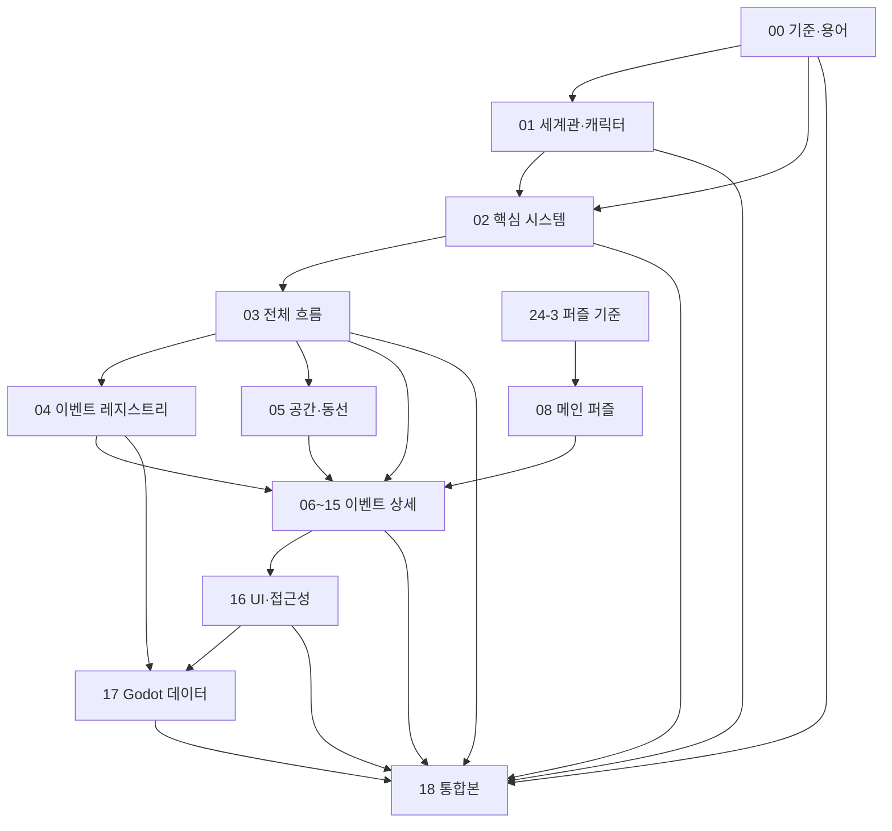

# GGB v0.4 문서 목록 및 확정 사항

## 1. 목적

본 폴더는 GGB v0.4의 독립 기획 문서 세트다. `ideas/md`의 이전 문서를 읽지 않아도 세계관, 시스템, 공간, 이벤트와 엔딩을 이해할 수 있게 구성한다.

### 1.1 문서 세트의 역할

본 문서 세트는 다음 질문에 답한다.

1. 플레이어는 어떤 정보를 언제 얻고 무엇을 추론하는가.
2. `NORMAL_RESET`, `BROKEN_RESET`, `POST_BROKEN_REST` 전후에 무엇이 초기화되고 무엇이 유지되는가.
3. 사용인들은 무엇을 기억하며 왜 주인공을 항상 막지 못하는가.
4. 관계 이벤트가 메인 진행과 퍼즐 난이도에 어느 정도 영향을 주는가.
5. 마라 2와 색상 서명이 기존 흐름에 어떻게 결합되는가.
6. 관계 이벤트를 건너뛰어도 F0와 두 엔딩에 도달할 수 있는가.
7. 색상·음향 정보를 제거해도 동일한 추론이 가능한가.
8. 추후 Godot 데이터로 옮길 때 어떤 상태와 이벤트 ID가 필요한가.

### 1.2 대상 독자

| 독자 | 이 문서 세트에서 확인할 내용 |
| --- | --- |
| 게임 기획 | 전체 흐름, 상태 전환, 퍼즐과 관계 이벤트의 영향 범위 |
| 시나리오 | 인물별 감정선, 정보 공개 순서, 일지와 대사 역할 |
| 레벨 디자인 | 공간 연결, 잠금·해금, 리셋 전후 동선과 숏컷 |
| UI·UX | 수첩, 색상 서명, 힌트, 상태 피드백 |
| 아트·사운드 | 고딕/SF 전환, 인격 서명, 감각적 이질감 |
| 프로그래밍 | 이벤트 ID, 상태 변수, 저장 범위, Godot 데이터 구조 |
| QA | 필수·선택 경로, 실패 복구, 접근성 대체 경로 |

### 1.3 범위

포함:

- 세계관과 5인 사용인 체계.
- 프롤로그부터 두 엔딩까지의 전체 이벤트.
- 루프, 영구 정보, 숏컷, 관계와 색상 서명.
- 공간 구조, 퍼즐 정답, 조사와 오브젝트 반응.
- 접근성 원칙과 Godot 구현을 위한 데이터 계약.

제외:

- 플레이 가능한 프로토타입.
- Godot 프로젝트와 실행 코드.
- 확정 아트, 애니메이션, 음원 제작.
- 성우 캐스팅과 녹음 대본.
- 플랫폼·가격·마케팅·출시 일정.
- DOCX 편집본.

## 2. 기준과 우선순위

- 장르: 포인트 앤 클릭 루프 어드벤처.
- 주인공: 이름 미정의 소녀. 문서에서는 `주인공`으로 표기.
- 배경: 멸망 이후 지구의 냉각 시설과 고딕 저택 시뮬레이션.
- 엔진: 추후 Godot 사용.
- 시간제: 실시간 제한이 아닌 행동 기반 유연한 시간제.
- 리셋: D5 전 잠들면 같은 침실의 같은 아침으로 물리 상태가 초기화.
- 영구 상태: 수첩, 일지, 지식, 실패 기록, 관계, 사용인 잔류 기억.
- D5 이후: `BROKEN_RESET`. 잠은 휴식과 동기화이며 정상 리셋 불가.
- 퍼즐 기준: 고난도 퍼즐 체계. 무작위 정답과 반사 신경 QTE를 사용하지 않음.
- 관계 이벤트: 메인 진행을 영구 차단하지 않는 선택형 콘텐츠.
- 출력: Markdown과 Mermaid. 프로토타입과 DOCX는 범위 제외.

### 2.1 기준 자료 우선순위

충돌이 발생하면 아래 순서를 적용한다.

| 우선 | 자료 | 적용 범위 |
| --- | --- | --- |
| 1 | 사용자가 가장 최근에 확정한 지시 | 모든 설정과 구조 |
| 2 | v0.4 개별 상세 문서 `01~17` | 각 문서가 담당하는 전문 영역 |
| 3 | `24-3_메인퍼즐_고난도개정안.md` | 메인 퍼즐 정답과 F0 메타퍼즐 |
| 4 | v0.4 통합본 `18` | 전체 내용을 빠르게 확인하는 요약·통합 기준 |
| 5 | `ideas/md`의 v0.3 이하 문서 | 배경과 변경 이력을 확인하는 참고 자료 |

개별 상세 문서끼리 충돌하면 다음 영역 소유권을 적용한다.

| 영역 | 기준 문서 |
| --- | --- |
| 세계관·캐릭터 | `01` |
| 리셋·관계·기억·색상 시스템 | `02` |
| 진행 순서와 분기 | `03` |
| 이벤트 ID와 상태 입출력 | `04`, `17` |
| 공간과 동선 | `05`, `10` |
| 퍼즐 정답 | `08` |
| 조사·일지 정보 | `09` |
| 사용인 관계 장면 | `11`, `12` |
| 파열·결산·엔딩 | `13`, `14` |
| 오브젝트 반응 | `15` |
| UI·접근성 | `16` |

### 2.2 이전 문서의 사용 범위

이전 문서의 상세한 사례를 v0.4로 가져올 때는 그대로 복사하지 않는다.

- 4인 기준 기록 수는 5인 기준으로 다시 계산한다.
- `연구원 기록 3개 이상` 같은 메인 게이트는 적용하지 않는다.
- 사용인 영향으로 퍼즐 정답, 필수 순찰 공백, 엔딩 선택지가 사라지지 않는다.
- `bond`가 높다고 정답을 직접 제공하지 않는다.
- `alert`가 높아도 추가 확인이나 우회 동선만 발생하며 진행은 보장한다.
- `24-3`과 다른 퍼즐 수치·정답은 폐기한다.

### 2.3 시간 표기

게임의 시간은 실제 시각보다 사건 단계로 관리한다.

```text
아침
→ 필수 일과
→ 낮·자유 조사
→ 저녁 조건 이벤트
→ 수면 가능
```

- 특정 시각에 늦어 필수 이벤트가 영구 소실되는 구조는 사용하지 않는다.
- `시간 감소`는 남은 클릭 횟수나 실제 타이머가 아니라 추가 확인 절차와 동선으로 표현한다.
- 실패 뒤 숏컷은 검증된 준비 작업과 이동을 줄이지만 퍼즐의 핵심 추론은 남긴다.

## 3. v0.4 핵심 변경

1. 사용인을 4명에서 5명으로 확장.
2. 기존 마라는 `마라 1`, 신규 인물은 `마라 2(가칭)`로 구분.
3. 마라 2는 별도 연구원이며 기록·초상화 관리와 인격 아카이브를 담당.
4. 북쪽 기록 회랑, 초상화 보관실, 색분해실, 인격 아카이브 추가.
5. 사용인별 색·문양·소리로 구성된 `인격 데이터 서명` 도입.
6. 프롤로그에 `P3B 초상화 이름표 정리` 추가.
7. D5 이후 선택형 핵심 관계 이벤트 `E3_5 마라 2 원본 대조` 추가.
8. J4 완전 복원 조건을 연구원 기록 5개로 확장.
9. F0 메타퍼즐은 고난도 구조와 주체 권한 복구를 유지.

### 3.1 변경하지 않는 핵심 축

- 수면은 D5 이전 비가역 실패를 되돌리는 세계 내 시스템이다.
- 리셋은 세이브포인트 이동이 아니라 같은 하루의 물리 상태 재생성이다.
- 수첩, 일지, 관계, 사용인 잔류 기억은 리셋 뒤에도 유지된다.
- D5는 퍼즐 실패가 아니라 위장 필터가 해제되는 예정된 전환이다.
- D5 이후 정상 리셋은 복구되지 않는다.
- J4는 과거 사건의 결산, J5는 현재 선택 권한의 복원이다.
- 현실과 잔류 어느 쪽도 정답·오답 엔딩으로 판정하지 않는다.

### 3.2 마라 2 추가로 변하는 범위

변경:

- 프롤로그 필수 일과에 P3B 추가.
- 사용인·연구원 기록·관계 결산을 5인 기준으로 확장.
- 북쪽 기록 구역과 색분해 퍼즐 추가.
- E5, F2, 엔딩에 마라 2 조건 반응 추가.

유지:

- B3, C3, C4, D0-A, D1, D4의 정답.
- F0-A~E의 메타퍼즐 구조.
- B2 최초 서재 접근 경로.
- 관계 이벤트 비필수 원칙.
- 두 엔딩의 선택 조건.

## 4. 문서 목록

| 번호 | 문서 | 책임 | 주요 입력 | 주요 출력 |
| --- | --- | --- | --- | --- |
| 00 | 본 문서 | 범위·기준·용어·충돌 해결 | 사용자 확정안 | 문서 세트 계약 |
| 01 | [세계관·캐릭터·사용인 5인 체계](01_세계관_캐릭터_사용인5인체계.md) | 인물과 세계관 | 세계관 초안, 5인 설정 | 인물 동기·지식·감정선 |
| 02 | [루프·관계·기억·색상 서명 시스템](02_루프_관계_기억_색상서명시스템.md) | 핵심 시스템 | 01, 리셋 규칙 | 상태 전환·관계 영향 |
| 03 | [전체 이벤트 흐름도](03_전체이벤트흐름도.md) | 전체 진행과 분기 | 02, 04, 06~14 | 메인·관계 통합 흐름 |
| 04 | [전체 이벤트 리스트·상태표](04_전체이벤트리스트_상태표.md) | 이벤트 레지스트리 | 03, 06~15 | ID·선행·결과·저장 범위 |
| 05 | [공간 구성 지도·동선](05_공간구성지도_및_동선.md) | 저택 공간 | 03, 10 | 지도·이동·이벤트 배치 |
| 06 | [이벤트 상세 01](06_이벤트상세_01_튜토리얼_일상.md) | 튜토리얼·일상 | 01~05 | P구간 상세 |
| 07 | [이벤트 상세 02](07_이벤트상세_02_루프_영구정보_숏컷.md) | 루프·영구 정보 | 02~04 | RESET·ROUTE·숏컷 상세 |
| 08 | [이벤트 상세 03](08_이벤트상세_03_메인퍼즐.md) | 메인 퍼즐 | `24-3`, 03 | 정답·실패·힌트 |
| 09 | [이벤트 상세 04](09_이벤트상세_04_정보조사_일지복원.md) | 정보·일지 | 01, 03, 08 | 증거·공개 순서·J1~J5 |
| 10 | [이벤트 상세 05](10_이벤트상세_05_공간잠금_해금_동선.md) | 잠금·해금 | 03, 05, 08 | 게이트·우회·복구 |
| 11 | [이벤트 상세 06](11_이벤트상세_06_사용인짧은반응.md) | 짧은 관계 반응 | 01~04 | 조건형 짧은 장면 |
| 12 | [이벤트 상세 07](12_이벤트상세_07_사용인핵심관계.md) | 핵심 관계 | 01~04, 11 | E3_1~E3_5 |
| 13 | [이벤트 상세 08](13_이벤트상세_08_파열_전환_결산.md) | 파열·결산 | 02~04, 12 | D5·D6·E1·E5·F2·F3 상세 |
| 14 | [이벤트 상세 09](14_이벤트상세_09_엔딩.md) | 엔딩 | 01~04, 12~13 | 현실·잔류 변형 |
| 15 | [이벤트 상세 10](15_이벤트상세_10_공통오브젝트반응.md) | 오브젝트 반응 | 02, 05~14 | 상태별 조사 텍스트 |
| 16 | [색상 연출·UI·접근성](16_색상연출_UI_접근성규칙.md) | 시청각 문법 | 01~15 | 토큰·UI·대체 단서 |
| 17 | [상태 변수·이벤트 ID·Godot 데이터](17_상태변수_이벤트ID_Godot데이터구조.md) | 구현 계약 | 02~16 | 스키마·저장·검증 |
| 18 | [GGB 게임 기획서 v0.4 통합본](18_GGB_게임기획서_v0.4_통합본.md) | 최종 통합 | 00~17 | 전체 기획 요약 |

### 4.1 문서 의존 구조



화살표는 내용을 그대로 복제한다는 뜻이 아니라, 후행 문서가 선행 문서의 결정을 위반하지 않아야 한다는 뜻이다.

### 4.2 목적별 권장 읽기 순서

| 목적 | 순서 |
| --- | --- |
| 전체 기획 파악 | `00 → 18 → 03 → 05` |
| 시나리오 검토 | `01 → 03 → 09 → 11 → 12 → 13 → 14` |
| 퍼즐 검토 | `02 → 07 → 08 → 09 → 10` |
| 레벨 디자인 | `03 → 05 → 06~15` |
| UI·접근성 | `02 → 08 → 15 → 16` |
| Godot 구현 준비 | `02 → 04 → 05 → 16 → 17` |
| QA 경로 작성 | `03 → 04 → 07~17` |

## 5. 명칭

| 문서 표기 | 의미 |
| --- | --- |
| `에드가` | 집사장·보안 연구원 인격 |
| `마라 1` | 청소·표층 유지 연구원 인격 |
| `루카` | 주방·생명 유지 연구원 인격 |
| `이리스` | 온실·외부 환경 연구원 인격 |
| `마라 2` | 기록·인격 아카이브 연구원 인격 |
| `bond` | 유대·신뢰·애틋함 |
| `alert` | 경계·감시·제지 욕구 |
| `NORMAL_RESET` | D5 이전 정상 물리 초기화 |
| `BROKEN_RESET` | D5 이후 리셋 실패 상태 |
| `POST_BROKEN_REST` | BROKEN_RESET 이후 세계를 재생성하지 않는 휴식 |
| `FINAL_SLEEP_LOCK` | F3 진입부터 EDC 확정까지 세계 내 수면을 차단하는 상태 |
| `색상 서명` | 색, 문양, 선, 소리로 된 사용인 고유 데이터 표식 |
| `영구 정보` | 정상 리셋 뒤에도 수첩·일지·상태에 남는 정보 |
| `검증 부분` | 실패 뒤 정답임이 확인되어 다음 루프에 보존되는 하위 단계 |
| `숏컷` | 이미 증명한 준비·이동·일과를 축약하는 영구 권한 |
| `개입 예산` | 사용인이 한 루프에서 사용할 수 있는 제지·질문·보고 횟수 |
| `짧은 반응` | 메인 진행 중 조건부로 발생하는 20~90초 관계 장면 |
| `핵심 관계` | E구간의 사용인별 연구원 기록 복원 사건 |
| `관계 결산` | 완료 수에 따라 E5·F2·엔딩 연출이 달라지는 판정 |
| `LOCAL RETRY` | 수면 없이 현장에서 재조작하는 실패 처리 |
| `HARD FAILURE` | 물리 상태가 비가역적으로 변해 정상 리셋이 필요한 실패 |
| `SUBJECT` | 시뮬레이션 결과를 실제로 겪고 최종 선택하는 주인공 권한 |

`마라 1`, `마라 2`는 가칭이며 서로 다른 연구원이다.

### 5.1 표기 규칙

- 인물 표기는 `에드가`, `마라 1`, `루카`, `이리스`, `마라 2`로 통일한다.
- `애드가`, `마라2`, `MARA_2` 표기는 사용하지 않는다.
- 이벤트 ID는 문장 안에서도 영문·숫자 원형을 유지한다.
- `B3-A`, `F0-D`는 기획 표기, 데이터에서는 `B3_A`, `F0_D`를 사용할 수 있다.
- `J4 기본/확장/완전`은 정보량, `LOW/MID/HIGH`는 관계 연출 단계다.
- `기록 수`와 `핵심 관계 완료 수`는 별도 값이다.
- 주인공의 이름이 확정되기 전에는 대사 외 기획 문서에서 `주인공`으로 표기한다.

### 5.2 이벤트 ID 접두어

| 접두어 | 의미 | 예시 |
| --- | --- | --- |
| `P` | 프롤로그 | `P3B` |
| `A~D` | 정상 리셋 구간 메인 진행 | `B3`, `C4`, `D1` |
| `J` | 일지 복원 | `J1`, `J4`, `J5` |
| `E` | 파열 이후 관계·결산 | `E3_5`, `E5` |
| `F` | 코어·최종 진실 | `F0_D`, `F2` |
| `ED` | 엔딩 | `ED_REALITY` |
| `MARA2_*` | 마라 2 전용 관계 반응 | `MARA2_S1` |
| `CLR-*` | 색상 서명 학습 단계 | `CLR-04` |
| `NORTH_ARCHIVE_*` | 북쪽 기록 구역 콘텐츠·전환 | `NORTH_ARCHIVE_PORTRAIT_LABEL` |

## 6. 관계 기준

| 완료 인원 | 결산 단계 | 기능 |
| --- | --- | --- |
| 0~1 | LOW | 차갑고 기능적인 반응 |
| 2~3 | MID | 원망과 이해가 혼재 |
| 4 | HIGH | 사용인들이 선택권을 명확히 인정 |
| 5 | ALL | 다섯 사용인이 선택권을 공동 승인 |

- 권장 진행: 핵심 관계 이벤트 3명 이상.
- J4 기본: 연구원 기록 0~1개.
- J4 확장: 연구원 기록 2~4개.
- J4 완전: 연구원 기록 5개.
- 관계 상태와 무관하게 F0, F1, EDC, 두 엔딩에 진입 가능.

### 6.1 기록 수와 관계 완료 수

두 판정은 비슷해 보이지만 목적이 다르다.

```text
researcher_record_count
→ J4에서 과거 사건을 얼마나 자세히 읽는가

relationship_complete_count
→ E5·F2·엔딩에서 사용인들이 얼마나 직접 감정을 표현하는가
```

현재 설계에서는 핵심 관계 완료와 해당 연구원 기록 획득이 같은 이벤트에서 처리되므로 수치가 대체로 같지만, 데이터와 서사 역할은 분리한다. 추후 기록을 다른 경로로 획득해도 관계 완료가 자동으로 설정되어서는 안 된다.

### 6.2 `bond`와 `alert`

| 값 | 의미 | 허용 영향 | 금지 영향 |
| --- | --- | --- | --- |
| `bond` | 신뢰·애착·솔직함 | 추가 대사, 준비 동작 도움, 개입 축소 | 정답 직접 제공, 엔딩 선택지 해금 |
| `alert` | 경계·감시·제지 욕구 | 질문, 확인 절차, 추가 동선 | 필수 경로 영구 봉쇄, 랜덤 정답 변경 |

- 두 값은 반대축이 아니다. 동시에 높을 수 있다.
- `bond`가 높아도 사용인이 주인공을 보내고 싶어 한다는 뜻은 아니다.
- `alert`가 높아도 적대 관계로 단정하지 않는다.
- 관계 UI에서 숫자를 직접 공개하지 않고 대사·행동·개입 방식으로 피드백한다.

### 6.3 비필수 진행 보장

다음 조건을 항상 만족해야 한다.

1. 핵심 관계 이벤트를 0개 완료해도 J4 기본을 읽는다.
2. 에드가 핵심 이벤트 미완료 시 E3_4M으로 운영 권한만 복구한다.
3. 마라 2 미완료 시 익명 보라 아카이브 인덱스를 제공한다.
4. F0의 `RESIDENT` 슬롯은 연구원 기록이 부족해도 기본 인덱스로 해결한다.
5. 두 엔딩 선택지는 관계값과 기록 수로 잠기지 않는다.

## 7. 색상 서명

| 사용인 | 색 | 문양 | 음향 |
| --- | --- | --- | --- |
| 에드가 | 남색 `#1F2A5A` | 수직 잠금선 | 낮은 시계음 |
| 마라 1 | 주황 `#E9782D` | 대각선 닦임 | 마른 솔 소리 |
| 루카 | 검정 `#111317` + 연두 `#B7F34A` | 이중 맥박 | 생체 신호음 |
| 이리스 | 흰색 `#F4F1E8` + 연노랑 `#F5D978` | 꽃잎·후광 | 유리·바람 소리 |
| 마라 2 | 보라 `#8D5BD6` | 겹친 액자·이중 윤곽 | 빠른 3음 신호 |

색상은 단독 정답으로 사용하지 않는다.

### 7.1 색상 서명의 서사 단계

| 단계 | 상태 | 플레이어가 이해하는 의미 |
| --- | --- | --- |
| P3B | 의상·이름표 장식 | 사용인을 구분하는 표식 |
| A~B | 리셋 뒤 수첩에 유지 | 반복을 넘어 남는 식별 정보 |
| C5 | 진단 패널 채널 | 사용인과 장치가 데이터로 연결됨 |
| D5 | 몸 밖 데이터 잔상 | 색이 외형이 아니라 인격 데이터임 |
| E3_5 | 분리·체크섬 | 기록 출처와 손상 범위를 추적 |
| F0 | RESIDENT 출처 | 역할 정답이 아닌 기록 소유자 |
| 엔딩 | 분리·공존·소실 | 각 인격의 자율성과 관계 결산 |

### 7.2 비색상 대체

| 사용인 | 문양·선 | 음향 | 문자 |
| --- | --- | --- | --- |
| 에드가 | 수직 잠금선 | 낮은 시계음 | `LOCK` |
| 마라 1 | 대각 닦임 | 마른 솔 | `MAINT` |
| 루카 | 이중 맥박 | 생체 신호 | `BIO` |
| 이리스 | 꽃잎·후광 | 유리·바람 | `CLIMATE` |
| 마라 2 | 겹친 액자·이중 윤곽 | 빠른 3음 | `ARCHIVE` |

필수 퍼즐은 색 제거와 음량 0 설정을 동시에 적용해도 문양·선·텍스트로 해결할 수 있어야 한다.

## 8. 상태와 저장 범위

### 8.1 상태 계층

| 계층 | 예시 | 정상 리셋 | BROKEN_RESET | 게임 저장 |
| --- | --- | --- | --- | --- |
| 물리 상태 | 문, 도구, 약품, 장치 위치 | 초기화 | `BROKEN_RESET_ONCE`에서 S3 기준 1회 생성 | 현재 루프만 |
| 시간 상태 | 아침·낮·저녁 | 아침으로 초기화 | E구간 기준 | 저장 |
| 지식 상태 | 수첩, 퍼즐 검증, 색 식별 | 유지 | 유지 | 영구 |
| 서사 상태 | J단계, D5, F0 | 유지 | 유지 | 영구 |
| 관계 상태 | bond, alert, 완료 이벤트 | 유지 | 유지 | 영구 |
| 사용인 표층 역할 | 당일 위치·업무 | 초기화 | 손상 상태 재생성 | 현재 루프 |
| 사용인 잔류 기억 | 이전 행동·감정 로그 | 유지 | 유지·부분 노출 | 영구 |

`BROKEN_RESET`은 시스템 이벤트 ID이며, `BROKEN_RESET_ONCE`는 그 이벤트 안에서 S3를 한 번만 생성하는 전환 동작이다. 이후 휴식은 `POST_BROKEN_REST`로만 처리해 현재 수리·공간 상태를 유지한다.

### 8.2 정상 리셋 계약

```text
현재 루프에서 새로 얻은 영구 정보 커밋
→ 인벤토리·물리 오브젝트·시간 폐기
→ S0 아침 템플릿 생성
→ 수첩·관계·숏컷·사용인 잔류 기억 재결합
→ ROUTE 우선순위 판정
```

### 8.3 파열 이후 계약

```text
D5 위장 필터 해제
→ D6 FRACTURE_SLEEP
→ BROKEN_RESET
→ S3 손상 템플릿 생성
→ E1 같은 침실의 다른 아침
```

- `BROKEN_RESET`은 플레이어 실패가 아니다.
- E1 이후 잠은 정상 세계 복구가 아니라 휴식·장면 전환 기능이다.
- D5 이전 퍼즐 실패를 E구간에서 다시 정상 리셋하는 경로는 없다.

## 9. 핵심 서사 정보 공개 순서

| 단계 | 공개 정보 | 아직 숨길 정보 |
| --- | --- | --- |
| P | 저택의 아가씨와 다섯 사용인 | 시뮬레이션, 현실 |
| A | 수첩이 리셋 뒤에도 남음 | 리셋 주체 |
| B | 열세 번째 신호와 일지 변조 | 냉각 장치의 정체 |
| C | 진단 패널, 회로, 다섯 채널 | 아버지의 배신 전모 |
| D | 고딕 위장 필터와 기계 골격 | 사용인별 동의 범위 |
| E | 연구원 인격, 감금 책임, 보존 계획 | 아버지의 마지막 미완성 권한 |
| F | SUBJECT 권한과 아버지의 마지막 기록 | 엔딩 결과 |
| 엔딩 | 현실 또는 잔류의 직접 결과 | 장기 생존과 영원한 지속 여부 |

정보 공개를 앞당기는 관계 대사는 감정과 관점만 추가해야 하며, 후속 퍼즐의 필수 정답을 먼저 말해서는 안 된다.

## 10. 확정·미확정 사항

### 10.1 확정

- 가칭 `GGB`.
- 포인트 앤 클릭 루프 어드벤처.
- Godot 예정.
- 주인공은 소녀 연령대이며 문서에서는 `주인공`.
- 사용인은 에드가, 마라 1, 루카, 이리스, 마라 2의 5명.
- 마라 2는 별도 연구원 인격.
- 색상 서명은 인격 데이터 출처.
- D5 이전 정상 리셋, D5 이후 BROKEN_RESET.
- J4 3단계와 관계 결산 4단계(LOW/MID/HIGH/ALL).
- F0와 두 엔딩은 관계 비필수.

### 10.2 의도적으로 미확정

| 항목 | 현재 처리 | 확정 시 영향 문서 |
| --- | --- | --- |
| 프로젝트 정식명 | `GGB(가칭)` | 전 문서 |
| 주인공 이름 | `주인공` | 01, 대사 문서, UI |
| 주인공 정확한 나이 | 소녀 연령대 | 01, 아트, 표현 등급 |
| 마라 1·2 정식 이름 | 임시 구분명 | 전 문서·ID 마이그레이션 |
| 마라 2 외형 연령 | 미확정 | 01, 아트·애니메이션 |
| 외부 지구의 정확한 연도 | 비공개 | 01, 09, 14 |
| 외부 생존 가능성 | 열린 결말 | 09, 13, 14 |
| 최종 HEX | 임시 토큰 | 16, 아트 리소스 |
| 목표 플랫폼 | 미확정 | UI·입력·성능 |

미확정 항목을 추론해 확정 설정처럼 서술하지 않는다.

## 11. 충돌 해결과 변경 관리

### 11.1 충돌 분류

| 등급 | 예시 | 처리 |
| --- | --- | --- |
| C0 표기 | 이름·ID 오탈자 | 기준 표기로 즉시 수정 |
| C1 참조 | 링크, 선행 조건, 상태명 불일치 | 영역 기준 문서에 맞춤 |
| C2 기능 | 리셋·관계·퍼즐 결과 충돌 | 사용자 최신 확정과 기준 문서 우선 |
| C3 서사 | 동기·정보 공개 순서 충돌 | 영향 문서 목록을 만든 뒤 수정 |
| C4 범위 | 새로운 엔딩·퍼즐·인물 필요 | 사용자 승인 전 확정하지 않음 |

### 11.2 한 문서씩 보강하는 작업 규칙

1. 해당 문서와 직접 의존 문서를 먼저 읽는다.
2. 누락, 중복, 충돌을 `문제 → 영향 → 해결` 순서로 판단한다.
3. 한 회차에는 대상 Markdown 파일 하나만 수정한다.
4. 다른 문서의 후속 수정점은 기록하되 같은 회차에 수정하지 않는다.
5. 수정 뒤 제목, 링크, 이벤트 ID, 상태 플래그, Mermaid를 검사한다.
6. 다음 문서로 넘어가기 전에 변경 범위와 남은 교차 참조 위험을 보고한다.

## 12. 문서별 최소 상세 기준

### 12.1 시스템·흐름 문서

- 상태 정의.
- 진입·종료 조건.
- 성공·실패·중도 이탈.
- 리셋 전후 처리.
- 관계와 접근성 영향.
- 예외와 진행 보장.

### 12.2 이벤트 상세 문서

각 이벤트는 가능한 한 다음 항목을 가진다.

| 항목 | 필수 내용 |
| --- | --- |
| 위치·시간 | 공간, 시간 구간, 예상 길이 |
| 선행 조건 | 필수 플래그와 금지 플래그 |
| 목적 | 플레이어 목표와 서사 기능 |
| 진입 | 자동·수동·조건형 |
| 상호작용 | 클릭 대상, 조작, 선택 |
| 정보 | 획득 지식과 공개 제한 |
| 성공 | 완료 플래그와 다음 목표 |
| 실패 | `LOCAL RETRY`·`NORMAL_RESET`·파열 이후 진행 보장 |
| 관계 | bond·alert·기억 변화 |
| 색상 | 색·문양·음향·텍스트 대체 |
| 감각 | 시각 외 온도·향·촉감·소리 |
| 구현 | ID, 저장 범위, 재진입 |

### 12.3 흐름도

- 선택과 필수 연결을 선 종류 또는 라벨로 구분한다.
- 조건 노드는 질문형으로 작성한다.
- 실패 노드는 복구 경로까지 연결한다.
- 선택 관계 이벤트는 메인 경로에 다시 합류한다.
- 보조 흐름도와 메인 흐름도의 ID를 동일하게 유지한다.
- 큰 흐름도는 챕터별 `subgraph`로 구분하되 전체 연결을 한 블록에서 확인할 수 있게 한다.

## 13. 검증 기준

- 5명 사용인의 필수 등장과 선택형 관계 이벤트가 구분되어야 한다.
- 기록 회랑은 B2 서재 접근을 우회하지 않아야 한다.
- 마라 2 이벤트 미완료 상태에서도 메인 진행이 가능해야 한다.
- 색을 제거해도 문양·패턴·음향·문자 정보로 모든 퍼즐을 해결할 수 있어야 한다.
- 메인 퍼즐의 고정 정답과 F0 주체 권한 구조를 바꾸지 않는다.
- `FINAL DECISION: UNSET`은 EDC 전까지 유지한다.
- F3 진입부터 `FINAL_SLEEP_LOCK`이 적용되며, EDC 취소 뒤에도 정상·파열·휴식 수면은 다시 열리지 않는다.

### 13.1 구조 검증

| 검사 | 통과 조건 |
| --- | --- |
| 파일 | `00~18` 19개 Markdown 존재 |
| 링크 | 상대 링크 대상이 모두 존재 |
| 코드 펜스 | 파일별 여닫힘 개수가 일치 |
| Mermaid | 블록 종료, 괄호, 따옴표 균형 |
| ID | 같은 의미에 다른 ID를 중복 사용하지 않음 |
| 용어 | 에드가·마라 1·마라 2 표기 통일 |

### 13.2 진행 검증

필수 시나리오:

1. 관계 이벤트 0개 완료로 F0와 두 엔딩 진입.
2. 마라 2 미완료로 익명 인덱스를 사용해 F0-D 해결.
3. 에드가 핵심 미완료로 E3_4M을 거쳐 E6 진입.
4. B3, C4, D1 실패 뒤 정상 리셋과 숏컷 재도전.
5. D5 이후 정상 리셋으로 돌아가지 않고 E1 진입.
6. 임의 3명 완료로 J4 확장과 MID 결산.
7. 임의 4명 완료로 J4 확장과 HIGH 결산.
8. 5명 완료로 J4 완전과 전원 추가 장면.

### 13.3 접근성 검증

다음 조합으로 필수 진행이 가능해야 한다.

| 조건 | 확인 대상 |
| --- | --- |
| 색 제거 | P3B, C5, E3_5, F0-D |
| 음량 0 | 방향·리듬 단서 자막 |
| 글리치 0 | D5 전환과 데이터 잔상 |
| 힌트 최대 | 정답 자동 입력 없이 변환 규칙 제공 |
| 반복 축약 | P3B와 필수 일과의 5~12초 숏컷 |

## 14. 완료 정의

v0.4 상세화가 완료되려면 다음을 모두 만족해야 한다.

- `00~17`의 개별 책임과 세부 내용이 충돌하지 않는다.
- `03`의 모든 메인 노드가 `04` 이벤트 목록에 대응한다.
- `04`의 상세 대상 이벤트가 `06~15` 중 한 문서에 정의된다.
- `05`의 모든 주요 공간이 잠금·동선 상태를 가진다.
- `08`이 `24-3`의 정답과 F0 구조를 유지한다.
- `11~14`의 관계 변형이 비필수 진행 원칙을 지킨다.
- `16`의 대체 단서가 모든 색상 퍼즐에 연결된다.
- `17`의 상태·ID가 흐름도와 상세 이벤트를 표현할 수 있다.
- `18`이 최종 개별 문서와 동기화된다.

## 15. 순차 상세화 순서

```text
00 기준
→ 01 세계관·캐릭터
→ 02 핵심 시스템
→ 03 전체 흐름
→ 04 이벤트 레지스트리
→ 05 공간·동선
→ 06~15 이벤트 상세
→ 16 접근성
→ 17 Godot 데이터
→ 18 통합본
```

각 단계에서 새 설정을 임의로 추가하기보다 앞 문서의 확정 내용을 구체화한다. 새 인물, 엔딩, 메인 퍼즐 정답 변경처럼 범위가 커지는 결정은 별도 승인 대상으로 남긴다.
