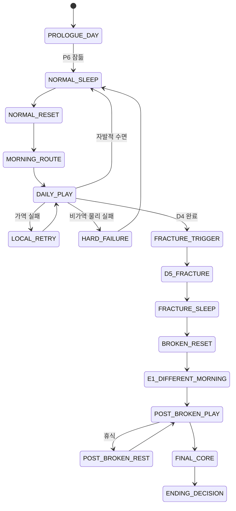
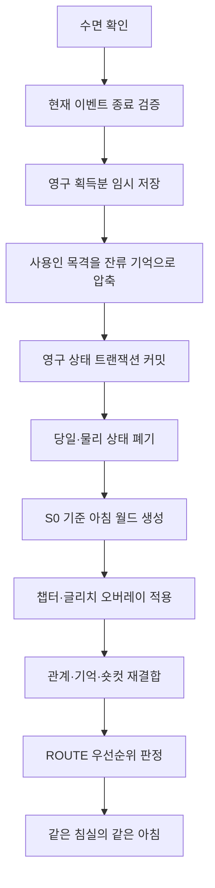
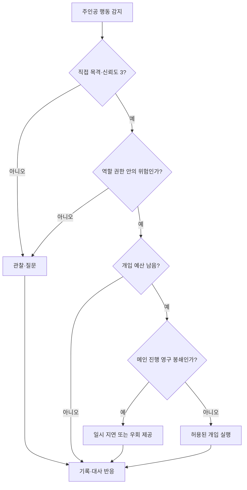

# GGB v0.4 루프·관계·기억·색상 서명 시스템

## 1. 문서 목적

본 문서는 GGB의 핵심 플레이 시스템을 하나의 계약으로 정의한다.

담당 범위:

- D5 이전 수면 리셋과 D5 이후 휴식의 차이.
- 물리 상태, 지식, 관계, 기억의 저장 범위.
- 실패 뒤 정보가 증가하는 구조.
- 반복 행동을 줄이는 숏컷.  
- 사용인이 이전 루프를 기억하면서도 메인 진행을 막지 못하는 이유.
- `bond`, `alert`, 핵심 관계 완료 수와 연구원 기록 수의 분리.
- 색상 서명의 출처·중첩·손상·복원 규칙.
- 관계·색상 시스템의 접근성과 소프트락 방지.

이벤트 순서는 `03`, 개별 이벤트 결과는 `04`와 `06~15`, 구현 스키마는 `17`이 담당한다.

## 2. 설계 목표

### 2.1 루프

수면 리셋은 시간을 되감는 편의 기능이 아니라 세계 안에 존재하는 시뮬레이션 재생성 절차다.

플레이어 경험:

```text
관찰
→ 가설
→ 물리 개입
→ 성공 또는 비가역 실패
→ 수면 리셋
→ 남은 정보로 준비 구간 축약
→ 더 정확한 재도전
```

핵심 감정:

- 같은 장면을 다시 보는 익숙함.
- 작은 차이가 남아 있다는 불안.
- 실패가 손실이 아니라 세계 규칙을 검증한 결과라는 안도.
- 정보를 얻을수록 일상이 빠르게 지나가는 통제감.
- D5 이후 익숙한 리셋이 작동하지 않는 상실감.

### 2.2 관계

관계 시스템은 선물 반복이나 정답 구매가 아니다. 사용인이 주인공을 어떤 존재로 받아들이고, 기억과 책임을 얼마나 솔직하게 표현하는지를 결정한다.

관계가 바꾸는 것:

- 대사와 감정 공개량.
- 사용인 개입의 형식.
- 검증된 준비 행동의 도움.
- E5, F2, 엔딩의 연출.
- 이리스의 살의 공개 수준.

관계가 바꾸지 않는 것:

- 퍼즐의 고정 정답.
- 필수 아이템의 존재.
- F0 진입 조건.
- 현실·잔류 엔딩 선택지.
- 주인공의 SUBJECT 권한.

### 2.3 기억

사용인은 리셋 뒤에도 이전 기억을 유지한다. 다만 완전한 영상 재생이 아니라 자기 담당 영역을 중심으로 압축된 사건·감정·패턴을 기억한다.

기억 시스템은 두 목적을 가진다.

1. 사용인이 단순한 초기화 NPC가 아니라는 사실을 보여 준다.
2. 관계가 여러 루프에 걸쳐 축적될 수 있게 한다.

### 2.4 색상 서명

색상 서명은 호감도 색이나 진영 표시가 아니라 인격 데이터의 출처를 증명하는 워터마크다. 색, 문양, 선 패턴, 음향, 문자 라벨이 하나의 세트를 이룬다.

## 3. 불변 규칙

아래 규칙은 후속 문서가 변경할 수 없는 시스템 기준이다.

1. D5 이전 잠들면 같은 침실의 같은 아침으로 돌아간다.
2. 정상 리셋은 체크포인트 선택이나 중간 시점 이동이 아니다.
3. 물리 상태는 초기화되지만 수첩, 지식, 관계, 사용인 기억은 유지된다.
4. 랜덤 정답과 랜덤 사용인 차단을 사용하지 않는다.
5. HARD FAILURE는 B3-B, C4, D1에만 사용한다.
6. D4 성공 뒤 D5는 확정된 서사 전환이며 실패가 아니다.
7. D5 이후 정상 리셋은 복구되지 않는다.
8. 관계 이벤트는 메인 진행을 영구 차단하지 않는다.
9. 높은 `bond`는 정답을 직접 제공하지 않는다.
10. 높은 `alert`는 필수 경로를 삭제하지 않는다.
11. 색은 단독 정답이 아니다.
12. SUBJECT 권한은 사용인 색상 서명과 분리한다.
13. 연구원 기록 수와 관계 완료 수는 별도 값이다.
14. 주인공은 누구를 용서해야 엔딩을 선택할 수 있는 구조에 놓이지 않는다.

## 4. 전체 상태 흐름



## 5. 유연한 시간제

### 5.1 시간 구간

| 구간 | 기능 | 진행 조건 |
| --- | --- | --- |
| 아침 | 기상, 첫 인사, 필수 일과 | 필수 일과 완료 |
| 낮 | 자유 조사, 정보·재료 확보 | 플레이어 선택 |
| 저녁 | 시간 조건 퍼즐, 일지 접촉 | 해당 정보·공간 조건 |
| 수면 가능 | 루프 종료 확인 | 필수 당일 결과 처리 |

시간은 실제 분 단위 타이머가 아니다. 이벤트 완료와 선택으로 구간이 변한다.

### 5.2 시간 압박 표현

허용:

- 에드가의 추가 확인 대화.
- 사용인 순찰을 기다리는 추가 동선.
- 같은 공간을 다시 방문해야 하는 조건.
- 저녁 이벤트 진입 전 남은 과업 안내.

금지:

- 예고 없는 실시간 제한.
- 대화 중 시간이 흘러 필수 이벤트 소실.
- 높은 `alert` 때문에 정답 입력 시간이 짧아짐.
- 반복 실패 때 순찰 시간이 무작위로 변함.

### 5.3 수면 선택

D5 이전:

- 필수 실패 뒤 수면을 명확히 안내한다.
- 플레이어는 남은 자유 조사를 마치고 잠들 수 있다.
- 수면 확인창은 초기화 항목과 유지 항목을 표시한다.

D5 이후:

- 수면은 물리 상태 초기화가 아니라 휴식과 시간 전환이다.
- E구간 완료 이벤트와 관계 상태는 그대로 유지된다.
- F3 이후에는 최종 선택을 피하기 위한 무한 수면을 제공하지 않는다.

## 6. 상태 계층

### 6.1 계층별 저장 범위

| 계층 | 예시 | NORMAL_RESET | BROKEN_RESET | POST_BROKEN_REST |
| --- | --- | --- | --- | --- |
| 물리 월드 | 문, 도구, 약품, 장치 입력 | S0 기준 초기화 | S3 손상 기준 생성 | 현재 상태 유지 |
| 시간 | 아침·낮·저녁 | 아침 | E1 아침 | 선택한 다음 구간 |
| 인벤토리 | 천, 세정제, 탁본 | 초기화 | E구간 기준 생성 | 유지 |
| 퍼즐 물리 | 시계핀, 거울 코팅, 축 위치 | 초기화 | 해당 없음 | 유지 |
| 영구 지식 | 수첩, 규칙, 실패 원인 | 유지 | 유지 | 유지 |
| 퍼즐 검증 | 맞은 하위 단계 | 유지 | 유지 | 유지 |
| 일지 | `journal_stage` | 유지 | 유지 | 유지 |
| 숏컷 | 일과·이동 축약 권한 | 유지 | 유지 | 유지 |
| 관계 | `bond`, `alert`, 이벤트 완료 | 유지 | 유지 | 유지 |
| 사용인 잔류 기억 | 목격·감정·패턴 | 유지 | 유지·노출 확대 | 유지 |
| 개입 예산 | 질문·제지 횟수 | 재충전 | E1 기준 생성 | 필요 시 구간별 재충전 |
| 색상 식별 | 소유자·문양·음향 | 유지 | 유지 | 유지 |
| 물리 색 흔적 | 얼룩·잔상 위치 | 초기화 | S3 기준 노출 | 유지 |
| 챕터 상태 | J단계, D5, F0 | 유지 | 유지 | 유지 |

### 6.2 물리 상태와 지식 상태 분리

예시:

```text
C3에서 세정제 비율을 알아냄
→ 비율 지식은 영구 저장
→ 제조한 세정제 병은 NORMAL_RESET 때 사라짐
→ 다음 루프에는 재료를 다시 확보하고 제조해야 함
```

```text
D1에서 첫 축 깊이 2가 맞음을 확인
→ 축의 실제 위치는 초기화
→ “직선축 깊이 2 검증”은 수첩에 유지
→ 다음 시도는 검증된 입력을 빠르게 재현
```

### 6.3 챕터 오버레이

NORMAL_RESET은 같은 아침을 재생성하지만, 이미 얻은 영구 서사 상태에 맞는 시각·대사 오버레이를 적용한다.

| 상태 | 아침 기준 | 유지되는 변화 |
| --- | --- | --- |
| S0 | 정상 고딕 저택 | 없음 |
| S1 | 같은 물리 배치 | 반복 문장, 미세한 색 잔상 |
| S2 | 같은 물리 배치 | 진단 누수와 일부 SF 표면 |
| S3 | 손상된 저택 | 고딕 필터 복구 실패 |

이는 물리 상태가 이전 루프 그대로 남는 것이 아니다. 영구 지식에 반응하는 연출 오버레이가 다시 적용되는 것이다.

## 7. NORMAL_RESET

### 7.1 진입 조건

- D5 이전 수면.
- B3-B, C4, D1 HARD FAILURE 뒤 수면.
- J단계 복원 후 다음 루프 진행.
- 플레이어가 현재 루프 조사를 마치고 자발적으로 수면.

### 7.2 처리 순서



### 7.3 커밋

수면 직전 커밋 대상:

- 새 수첩 기록.
- 일지 복원 단계.
- 확인한 실패 원인.
- 검증된 퍼즐 하위 단계.
- 해금한 숏컷.
- 관계 변화.
- 새 잔류 기억.
- 확인한 색상 서명.
- 짧은 관계 이벤트 확인 여부.

커밋하지 않는 대상:

- 플레이어가 보기만 하고 수첩·시스템이 확인하지 않은 추측.
- 중간 제조 상태.
- 미완료 대화의 선택지.
- 시험 모드에서 확정하지 않은 퍼즐 입력.

### 7.4 리셋 연출

첫 리셋:

- 취침 연출을 충분히 보여 준다.
- 같은 새, 빛, 에드가 인사로 동일성을 강조한다.
- 수첩과 이름표 차이를 플레이어가 직접 확인한다.

반복 리셋:

- 3~8초의 감각 몽타주로 축약할 수 있다.
- 새 영구 정보가 있으면 해당 항목을 한 프레임 강조한다.
- 새로운 짧은 관계 반응이 있으면 아침 몽타주 뒤 별도 재생한다.

## 8. 실패 유형

### 8.1 관찰 실패

정답을 입력하지 않은 상태에서 단서를 잘못 해석한 경우다.

- 물리 상태 변화 없음.
- 즉시 다시 조사 가능.
- 수첩에는 확정 지식으로 기록하지 않음.

### 8.2 LOCAL RETRY

현장에서 되돌릴 수 있는 조작 실패다.

예시:

- C3 비율 시험.
- D4 시험 모드.
- E3_5 필터 조합.
- F0 각 하위 단계.

처리:

- 현재 공간에서 재시도.
- 틀린 이유 또는 모순된 연결을 표시.
- 수면을 요구하지 않는다.
- 같은 오답을 반복하면 변환 규칙 힌트를 제공한다.

### 8.3 HARD FAILURE

당일 물리 상태가 비가역적으로 변해 NORMAL_RESET이 필요한 실패다.

| 이벤트 | 비가역 변화 | 유지 정보 |
| --- | --- | --- |
| B3-B | 봉인핀 파손·시계망 잠금 | 맞은 역할, 틀린 위상 |
| C4 | 거울 코팅 경화·도구 회수 | 맞은 경로, 실패 지점 |
| D1 | 압력핀 하강·축 잠금 | 검증된 이전 축, 오류 종류 |

규칙:

- 실패 원인은 무작위가 아니다.
- 다음 루프에 맞은 부분과 틀린 부분을 구분해 준다.
- 플레이어가 원하면 남은 조사를 한 뒤 잠든다.
- 같은 준비 과정을 처음부터 전부 반복시키지 않는다.

### 8.4 확정 전환

D4 완료 뒤 D5는 HARD FAILURE와 구분한다.

```text
D4 목표 상태 달성
→ 정상 기동 XII
→ 숨은 +1 보조 레버
→ XIII
→ CAMOUFLAGE FILTER OFF
→ D5 세계의 파열
```

플레이어에게 실패로 표시하지 않는다. 운영 데이터에서는 일방향 전환 이벤트로 관리한다.

## 9. BROKEN_RESET과 후반 휴식

### 9.1 FRACTURE_SLEEP

D5 직후 주인공은 익숙한 수면 절차로 세계를 복구하려 한다. 시스템은 정상 아침 템플릿을 호출하지만 고딕 위장 필터가 복구되지 않는다.

### 9.2 BROKEN_RESET 처리

```text
S0 아침 템플릿 호출
→ WORLD MASK 복구 실패
→ S3 손상 템플릿 선택
→ 사용인 색상 채널 PERSIST
→ 관계·기억 유지
→ E1 같은 침실의 다른 아침
```

`broken_reset_triggered`는 영구 플래그다. 설정 뒤에는 **NORMAL_RESET으로 돌아갈 수 없다**.

### 9.3 POST_BROKEN_REST

E1 이후 휴식:

- 신체 피로와 대화 구간을 정리한다.
- 완료한 관계 이벤트를 유지한다.
- 장치 수리 상태를 유지한다.
- 미완료 관계 이벤트를 다시 선택할 수 있다.
- 사용인 기억을 지우거나 표층 역할로 되돌리지 않는다.
- E5 확정 뒤에는 E구간 관계 이벤트로 돌아갈 수 없다.

### 9.4 FINAL_SLEEP_LOCK

F3에서는 주인공이 선택을 무기한 미루기 위해 잠드는 기능을 제공하지 않는다.

세계 내 이유:

- 코어실은 수면 연출 장치가 없는 직접 제어 공간이다.
- SUBJECT 권한이 복원된 뒤 시스템은 타인의 자동 결정을 실행할 수 없다.

사용자 편의:

- EDC 직전 시스템 저장을 제공한다.
- 이는 세계 내부 리셋이 아니라 게임 저장 기능이다.

## 10. 영구 정보 수명 주기

### 10.1 정보 단계

| 단계 | 상태 | 수첩 표시 | 시스템 사용 |
| --- | --- | --- | --- |
| 미발견 | `unknown` | 없음 | 조건 판정 불가 |
| 관찰 | `observed` | 사실 묘사 | 일부 대화 조건 |
| 가설 | `hypothesized` | 물음표·추론 | 시험 입력 가능 |
| 검증 | `verified` | 확인 표시 | 숏컷·퍼즐 하위 단계 |
| 인증 | `authenticated` | 시스템 원문 | 권한·메타퍼즐 |

예시:

```text
서재 시계에서 진동을 느낌
→ observed

서재가 중계라고 추론
→ hypothesized

B3-A 연결 시험 성공
→ verified

F0에서 기록 역할과 권한 확인
→ authenticated
```

### 10.2 정보 출처

| 출처 | 신뢰도 | 특징 |
| --- | --- | --- |
| 환경 관찰 | 중간 | 오염·위장 가능 |
| 주인공 수첩 | 자기 연속성에 높음 | 외부 사실은 추론일 수 있음 |
| 아버지 일지 | 중간 | 의도적 누락과 자기 합리화 |
| 사용인 대사 | 가변 | 역할 고정과 감정에 영향 |
| 시스템 진단 | 높음 | 라벨·권한 해석 필요 |
| 퍼즐 검증 | 높음 | 해당 하위 단계에만 유효 |

### 10.3 필수 정보 이중화

모든 필수 정보는 최소 두 경로로 제공한다.

예시:

| 정보 | 1차 | 2차 |
| --- | --- | --- |
| B3 침실 시계 단절 | 배선 탁본 | 진동 없음 |
| C3 혼합 순서 | 루카 메모 | 시험지 반응 |
| D1 축 깊이 | 도면 중첩 | 축 홈의 로마 숫자 |
| F0 RESIDENT | 연구원 기록 | 익명 인격 인덱스 |

관계 이벤트는 필수 정보의 유일 출처가 될 수 없다.

## 11. 수첩

### 11.1 역할

수첩은 다음 정보를 보존한다.

- 주인공이 직접 쓴 표시.
- 관찰·가설·검증 정보.
- 실패 원인.
- 퍼즐 하위 단계.
- 사용인별 관계 사건 요약.
- 색상 서명 대응.
- 다음 루프 숏컷.

### 11.2 자기 작성 표시

A1의 `self_authored_mark`는 시스템이 자동 작성한 기록과 구분한다.

표현:

- 흑연선.
- 종이 압흔.
- 주인공 고유 필기 리듬.
- 색상 서명 없음.

기능:

- A2에서 루프 연속성 증명.
- F0-E에서 과거 자기 인증.
- 엔딩에서 현재 선택 문장 작성.

### 11.3 자동 기록 제한

자동 기록이 가능한 것:

- 직접 확인한 물리 결과.
- 시스템 라벨.
- 성공·실패한 퍼즐 입력.
- 사용인이 명시적으로 말한 문장.

자동 기록하지 않는 것:

- 사용인의 숨은 의도.
- 이리스가 고백하지 않은 살의.
- 플레이어가 선택하지 않은 감정 해석.
- 엔딩의 가치 판단.

## 12. 퍼즐 검증과 힌트

### 12.1 검증 부분

퍼즐 전체 정답과 하위 단계 검증을 분리한다.

```yaml
validated_step:
  puzzle_id: B3_B
  step_id: role_reference
  value: parlor_clock
  confidence: verified
  source: physical_test
```

### 12.2 힌트 단계

| 실패·정체 | 제공 |
| --- | --- |
| 1회 | 현재 결과가 모순되는 이유 |
| 2회 | 맞은 하위 단계 고정 |
| 3회 | 필요한 변환 규칙 |
| 4회 이상 | 다음에 조작할 구성 요소 |

힌트가 제공하지 않는 것:

- 퍼즐 전체 자동 입력.
- 관계 이벤트의 감정 선택 정답.
- 엔딩의 권장 선택.

### 12.3 힌트 출처 우선순위

```text
환경 변화
→ 수첩 비교
→ 주인공 독백
→ 선택형 사용인 대화
```

관계가 낮아도 앞의 세 경로로 필수 진행이 가능하다.

## 13. 숏컷 시스템

### 13.1 목적

숏컷은 이미 증명한 준비 작업과 이동을 축약한다. 중간 저장 지점이나 시간 이동으로 표현하지 않는다.

### 13.2 해금 기준

다음 조건을 모두 만족해야 한다.

1. 해당 준비 작업을 최소 한 번 정상 수행.
2. 결과가 영구 정보로 검증됨.
3. 축약해도 새 추론이 사라지지 않음.
4. 사용자에게 어떤 행동이 생략되는지 명시.

### 13.3 축약 등급

| 완료 횟수 | 표현 |
| --- | --- |
| 최초 | 전체 조작과 설명 |
| 2회 | 검증된 선택 자동 적용, 핵심 클릭 유지 |
| 3회 이상 | 5~20초 몽타주 또는 경로 선택 |

### 13.4 공통 중단 조건

숏컷은 다음 상황에서 중단된다.

- 처음 보는 관계 이벤트 발생.
- 새로운 색상 이상 감지.
- 사용인 개입 조건 충족.
- 이전과 다른 물리 결과.
- 플레이어가 직접 수행을 선택.

중단 뒤 완료된 앞부분은 다시 수행하지 않는다.

### 13.5 일과 압축

프롤로그 일과:

- 창문 닦기.
- 책 정리.
- P3B 이름표 정리.
- 차 준비.

최초에는 전체 플레이한다. 이후 수첩의 `daily_routine_verified`가 있으면 순서와 결과를 몽타주로 처리한다.

P3B 반복:

```text
이름표 선반을 연다
→ 다섯 문양과 라벨 확인
→ 마라 2 축약 반응
→ 5~12초 안에 완료
```

MARA2_S1 또는 새로운 이름표 이상이 있으면 전체 조사로 전환한다.

## 14. 퍼즐별 숏컷

### 14.1 BSHORT

유지:

- B3-A 탁본 조립.
- 검증된 기준·중계·출력·제외 역할.
- 실패한 위상 정보.

재수행:

- 실제 B3-B 미확정 입력.
- 저녁 작동 확인.

표현:

- 아침 일과 몽타주.
- 시간표에 맞춘 대시계 이동.
- 서쪽 대시계 앞에서 조작권 반환.

### 14.2 CSHORT

유지:

- C3 비율 `물 5·안정제 1·원액 2`.
- 혼합 순서.
- C4 파형 중첩의 맞은 구간.
- 에드가 개입을 피한 일정 정보.

재수행:

- 재료 확보.
- 세정제 제조.
- 실제 거울 닦기.

도움을 받은 관계 상태라도 실제 제조와 비가역 닦기 판단은 플레이어가 수행한다.

### 14.3 DSHORT

유지:

- D0-A 도면 중첩.
- 축 깊이 `직선 2·분기 1·환형 3`.
- D1 검증 축.
- 지하창고 접근 숏컷.

재수행:

- 잠금되지 않은 축의 실제 입력.
- 중앙 손잡이 작동.

### 14.4 관계 대화 축약

- 최초 대화는 전체 재생.
- 반복 정보 질문은 한 문장 요약.
- 감정 선택 결과는 다시 고르지 않는다.
- 새로운 관계 단계가 열리면 축약을 중단한다.

## 15. 사용인 기억 구조

### 15.1 기억 단위

```yaml
residual_memory:
  memory_id: MEM_MARA2_PORTRAIT_REPEAT
  observer_id: MARA2
  loop_index_first: 2
  loop_index_last: 4
  source_type: direct
  event_tag: portrait_label_corrected
  fact_summary: "주인공이 초기화 전 이름표 위치를 안다"
  emotion_tag: anxiety
  confidence: 3
  occurrence_count: 3
  disclosure_level: metaphor
  checksum: "..."
  persistence: permanent
```

### 15.2 출처 유형

| 유형 | 의미 | 정확도 |
| --- | --- | --- |
| `direct` | 직접 목격·대화 | 높음 |
| `domain_sensor` | 담당 장치 변화로 감지 | 중간~높음 |
| `system_anomaly` | 밤의 이상 로그 | 중간 |
| `inferred` | 다른 정보로 추론 | 가변 |
| `emotional` | 이유보다 감정만 남음 | 사실 정확도 낮음 |
| `archive_fragment` | 마라 2가 보존한 조각 | 체크섬은 높고 맥락은 가변 |

### 15.3 기억 압축

사용인 기억은 삭제되지 않지만 반복 사건은 압축될 수 있다.

```text
“주인공이 세 번째 루프 18시에 같은 문을 열었다”
+ “네 번째 루프 18시에 같은 문을 열었다”
→ “주인공은 저녁마다 해당 문을 연다 / 반복 2회”
```

압축 규칙:

- 고유 사건과 감정 변화는 보존한다.
- 같은 행동은 횟수와 마지막 발생 루프로 묶는다.
- 퍼즐 정답이 아닌 결과 패턴만 기록한다.
- 압축은 사용인이 잊었다는 뜻이 아니라 서사 재생량을 줄이는 처리다.

### 15.4 기억 신뢰도

| 값 | 의미 |
| --- | --- |
| 0 | 감정 잔상만 있음 |
| 1 | 단편적 인상 |
| 2 | 사건·장소 확신, 세부 불명 |
| 3 | 직접 목격 또는 인증 기록 |

신뢰도가 낮은 기억으로 사용인이 주인공을 확정적으로 처벌하지 않는다.

## 16. 인물별 기억 범위

| 인물 | 선명한 기억 | 간접 감지 | 주요 사각지대 |
| --- | --- | --- | --- |
| 에드가 | 문, 권한, 순찰, 공식 대화 | 보안 경고 | 비공식 감정 대화 |
| 마라 1 | 도구, 배선, 청소 흔적, 작업 속도 | 설비 진동 | 생체·외부 환경 수치 |
| 루카 | 체온, 맥박, 식사, 약품 | 냉각 장치 부하 | 서재 기록 내용 |
| 이리스 | 온실, 외부 센서, 공기·계절 변화 | 환경 장치 전력 | 코어 보안·타인 원본 |
| 마라 2 | 이름, 기록 수정, 체크섬 | 로그의 출처·손상 | 권한 없는 원문·자기 누락 기억 |

### 16.1 에드가

- 주인공이 금지 구역에 접근했다는 사실을 가장 빨리 안다.
- 무엇을 보았는지는 직접 보고받지 않으면 모른다.
- 순찰표 밖 행동을 추정할 수 있지만 무작위로 출현하지 않는다.
- 높은 `alert`에서도 이미 승인된 숏컷은 취소할 수 없다.

### 16.2 마라 1

- 작업 완료 속도와 도구 위치로 반복을 눈치챈다.
- 퍼즐 정답보다 물리적으로 무엇이 달라졌는지를 기억한다.
- 같은 실수를 반복한 주인공에게 농담과 검증 힌트를 제공할 수 있다.

### 16.3 루카

- 주인공이 말하지 않아도 피로와 공포를 생체 변화로 감지한다.
- 생각과 조사 내용을 읽을 수 없다.
- 신체 위험이 없는 퍼즐은 생체 점검을 이유로 막을 수 없다.

### 16.4 이리스

- 외부 센서와 온실 장치 변화는 정확히 안다.
- 주인공이 자기 과거 로그를 어디까지 읽었는지 직접 확인하지 않으면 모른다.
- 살의와 적의는 자동 시스템 로그에 감정 라벨로 기록되지 않는다.
- E3_2 전에는 로그의 모순이 있어도 직접 고백 상태로 전환하지 않는다.

### 16.5 마라 2

- 기록의 소유자, 체크섬, 변경 시각을 볼 수 있다.
- 권한 없는 기록의 원문과 감정 전체는 읽을 수 없다.
- 다른 사용인의 잔류 기억을 실시간으로 공유하지 않는다.
- 자기 원본 손상으로 일부 기록을 다른 인물의 것으로 오분류할 수 있다.
- 오분류는 필수 정답을 랜덤하게 바꾸지 않고 서사 단서로만 사용한다.

## 17. 리셋 시 기억 동기화

### 17.1 D5 이전

수면 직전:

1. 각 사용인의 직접 목격을 자기 로컬 기억에 저장.
2. 시스템 이상 로그에는 사건 ID, 위치, 위험도만 기록.
3. 다른 사용인은 권한 범위 안의 이상 로그만 확인.
4. 표층 역할 대본은 다음 아침 초기 상태로 복구.
5. 잔류 기억은 감정·말의 지연·짧은 반응으로 새어 나옴.

공유되지 않는 것:

- 대화 전문.
- 주인공의 선택 이유.
- 타인의 감정 태그.
- 퍼즐 정답.
- 관계 이벤트의 사적 고백.

### 17.2 D5 이후

역할 고정이 약해지며 다음이 가능해진다.

- 사용인이 자기 로컬 기억을 직접 설명.
- 연구원 기록과 현재 기억 비교.
- 마라 2를 통한 체크섬 검증.
- 동의한 범위의 기억 조각 공유.

D5 이후에도 모두가 자동으로 같은 기억을 갖지는 않는다. E3 관계 이벤트는 각자가 자기 기록을 해석하고 공개하는 과정이다.

## 18. 사용인이 알고도 막지 않는 구조

### 18.1 판단 순서



### 18.2 시스템상 제한

- 사용인은 자기 권한 밖의 문을 임의로 잠글 수 없다.
- 한 사용인이 만든 강한 개입은 다른 사용인의 감시 로그에 남는다.
- 정당한 생체 위험이 아니면 주인공을 침실에 강제로 가둘 수 없다.
- 검증된 숏컷은 SUBJECT 보조 권한으로 기록된다.
- 개입은 당일 상태이며 정상 리셋 때 재충전되지만, 같은 방식의 반복 차단은 관계 반응으로 축약한다.

### 18.3 감정상 제한

- 에드가는 감금을 계속할수록 아버지와 같은 통제를 반복함을 안다.
- 마라 1은 주인공의 시도를 완전히 지우는 일을 다시 하고 싶지 않다.
- 루카는 주인공의 정신 상태도 생존의 일부라고 판단한다.
- 이리스는 적의가 행동이 되면 아버지처럼 타인의 선택을 빼앗게 됨을 두려워한다.
- 마라 2는 주인공 행동을 관찰해야 미완성 아카이브를 열 수 있다.

## 19. 관계값

### 19.1 범위

```text
bond:  0..5
alert: 0..5
```

모든 변화는 범위를 벗어나지 않도록 고정한다.

```text
new_value = clamp(old_value + delta, 0, 5)
```

### 19.2 단계

| 값 | 단계 | 의미 |
| --- | --- | --- |
| 0~1 | 낮음 | 역할·기능 중심 |
| 2~3 | 중간 | 개인 감정이 부분적으로 드러남 |
| 4~5 | 높음 | 숨기기 어려운 감정과 책임 공개 |

초기값 `0`은 사용인이 주인공에게 아무 감정도 없다는 뜻이 아니다. 플레이어에게 그 감정을 개인적으로 드러낼 준비가 되지 않았다는 뜻이다.

### 19.3 독립축

| bond | alert | 해석 |
| --- | --- | --- |
| 낮음 | 낮음 | 표층 역할과 무관심한 관찰 |
| 낮음 | 높음 | 공식적이고 차가운 제지 |
| 높음 | 낮음 | 자발적 도움과 감정 공개 |
| 높음 | 높음 | 강하게 아끼지만 떠날 가능성을 두려워함 |

`bond - alert` 같은 단일 점수로 환산하지 않는다.

### 19.4 변화 범위

| 이벤트 | 권장 변화 |
| --- | --- |
| 짧은 반응 | `bond/alert -1~+1` |
| 핵심 관계 선택 | `bond +1~+2`, `alert -1~+1` |
| 노골적 기만·강압 | `alert +1` |
| 책임 인정·동의 요청 | `bond +1` |

같은 이벤트 ID의 관계 변화는 최초 1회만 적용한다. 반복 대화로 값을 파밍할 수 없다.

### 19.5 플레이어 피드백

숫자는 직접 공개하지 않는다.

표현:

- 호칭과 문장 길이.
- 시선과 거리.
- 대표 소품의 방향.
- 개입 전 이유 설명 여부.
- 색상 잔상과 음성의 동기화.
- 수첩의 관계 사건 한 줄 요약.

색 자체의 밝기나 아름다움으로 관계의 좋고 나쁨을 표현하지 않는다.

## 20. 관계 완료 수와 기록 수

### 20.1 핵심 관계 완료 수

```text
relationship_complete_count =
  E3_1 + E3_2 + E3_3 + E3_4 + E3_5
```

| 완료 수 | 결산 |
| --- | --- |
| 0~1 | LOW |
| 2~3 | MID |
| 4~5 | HIGH |
| 5 | HIGH + `all_servants_complete` |

영향:

- E5 공동 저녁.
- F2 연구원 대면.
- 엔딩 작별·잔류 장면.

### 20.2 연구원 기록 수

| 기록 수 | J4 |
| --- | --- |
| 0~1 | J4 기본 |
| 2~4 | J4 확장 |
| 5 | J4 완전 |

기록 수는 과거 사건의 정보량을 결정한다. 관계 연출 단계를 직접 결정하지 않는다.

### 20.3 현재 결합과 향후 분리

현재 핵심 관계 이벤트 완료 시 해당 연구원 기록을 함께 얻는다. 그러나 데이터는 별도로 저장한다.

이유:

- 추후 다른 경로로 기록만 얻을 수 있음.
- 기록을 읽었다고 관계가 자동으로 완성되는 것은 아님.
- 캐릭터 이벤트를 완료해도 기록 데이터가 손상된 변형을 설계할 수 있음.

### 20.4 비필수 보장

- 완료 0명이어도 J4 기본과 F0 진입.
- 마라 2 미완료 시 익명 보라 인덱스.
- 에드가 미완료 시 E3_4M.
- 두 엔딩은 완료 수와 무관하게 선택.

## 21. 이리스 고백 판정

### 21.1 판정 우선순위

```text
1. all_servants_complete?
2. E3_2_complete?
3. IRIS bond 단계?
4. IRIS alert 단계?
```

### 21.2 결과

| 조건 | `iris_confession_state` | 공개 |
| --- | --- | --- |
| `all_servants_complete` | `public` | F2에서 다른 연구원 앞에 직접 인정 |
| E3_2 미완료 | `inferred_only` | 전력 로그와 행동 모순만 제공 |
| E3_2 완료 + bond 4~5 | `direct_private` | 주인공에게 직접 고백 |
| E3_2 완료 + bond 2~3 | `indirect` | 사라지길 바랐다고 간접 인정 |
| E3_2 완료 + bond 0~1 + alert 4~5 | `denied` | 로그의 의미를 부정하고 대화 종료 |
| E3_2 완료 + 나머지 | `withheld` | 사건 책임은 인정하지만 살의는 말하지 않음 |

### 21.3 alert에 따른 어조

| alert | 고백·부정의 어조 |
| --- | --- |
| 0~1 | 수치심과 자기 비판 중심 |
| 2~3 | 주인공 책임과 아버지 책임을 구분하려 애씀 |
| 4~5 | 방어적이며 당시 손실과 위험을 먼저 강조 |

높은 `alert`가 높은 `bond`의 직접 고백을 취소하지는 않는다. 대신 고백이 더 날카롭고 방어적으로 표현된다.

### 21.4 안전 규칙

- 어떤 상태에서도 이리스가 주인공을 직접 살해하지 않는다.
- 환경 장치를 치명 수치로 조정할 수 없다.
- 고백 여부로 필수 정보나 엔딩 선택지가 잠기지 않는다.
- 직접 고백은 보상이나 화해 완료가 아니다.
- 주인공에게 즉시 용서 선택을 강요하지 않는다.

## 22. 개입 예산

### 22.1 개입 유형

| 유형 | 예시 | 예산 |
| --- | --- | --- |
| 관찰 | 시선, 한 줄 반응, 로그 기록 | 소모 없음 |
| 질문 | 행동 이유 확인, 일정 재확인 | `question` |
| 보고 | 다른 사용인에게 이상 전달 | `report` |
| 강한 제지 | 길 막기, 도구 회수, 강제 대화 | `strong` |
| 응급 개입 | 실제 생체 위험 중지 | `emergency` |

### 22.2 기본 예산

| 사용인 | 질문 | 보고 | 강한 제지 | 응급 개입 |
| --- | --- | --- | --- | --- |
| 에드가 | 2 | 1 | 1 | 1 |
| 마라 1 | 1 | 1 | 1 | 0 |
| 루카 | 1 | 1 | 0 | 1 |
| 이리스 | 1 | 1 | 1 | 1 |
| 마라 2 | 2 | 1 | 1 | 0 |

에드가는 주인공과 가장 많이 상호작용하므로 질문 예산이 많다. 강한 제지는 다른 사용인과 동일하게 1회다.

### 22.3 강한 제지 예시

| 인물 | 허용 |
| --- | --- |
| 에드가 | 레이피어로 통로를 잠시 막고 이유 확인 |
| 마라 1 | 위험 도구를 회수하고 대체 도구 위치 제공 |
| 이리스 | 온실 안전 점검으로 진입을 지연 |
| 마라 2 | 손상 위험 기록층을 잠시 읽기 전용으로 전환 |

루카의 생체 중지는 응급 개입으로 분류하며, 퍼즐 접근을 이유 없이 막는 강한 제지는 갖지 않는다.

### 22.4 응급 개입

응급 개입 조건:

- 주인공 생체 수치가 안전 하한 아래.
- 실제 독성·냉각 장치 오류.
- 이벤트가 명시한 신체 위험.

응급 개입이 할 수 있는 것:

- 현재 조작 일시 중지.
- 안전 공간으로 이동.
- 원인과 복귀 조건 설명.

응급 개입이 할 수 없는 것:

- 관계 대화를 강제 종료하고 영구 봉쇄.
- 퍼즐 정답 변경.
- 필수 아이템 폐기.
- 이리스의 살의를 시스템 안전 판단으로 위장.

### 22.5 예산과 관계

| 관계 | 변화 |
| --- | --- |
| bond 높음 | 질문 전에 이유 설명, 검증된 준비 도움 |
| alert 높음 | 질문·보고 우선 사용 |
| 둘 다 높음 | 강한 제지보다 대화와 부탁을 우선 |
| 둘 다 낮음 | 표층 역할의 기본 개입 |

관계가 예산 총량을 무작위로 바꾸지 않는다. 어떤 종류를 먼저 사용하는지만 바꾼다.

## 23. 색상 서명 구조

### 23.1 정의

색상 서명은 인격 데이터에 포함된 소유자 식별 묶음이다.

```yaml
color_signature:
  signature_id: purple_archive
  owner_id: MARA2
  hue_id: purple
  hex_tokens: ["#8D5BD6"]
  glyph_id: stacked_frame
  line_pattern: double_outline
  audio_id: archive_trill
  text_label: "ARCHIVE / MARA2"
  checksum_family: archive
```

퍼즐 판정은 `hue_id`나 HEX가 아니라 `signature_id`와 `owner_id`를 사용한다.

### 23.2 대표색과 데이터 서명색

| 인물 | 아바타 대표색 | 데이터 서명 | 비색상 식별 |
| --- | --- | --- | --- |
| 에드가 | 파랑 | 진한 파랑·남색 `#1F2A5A` | 수직 잠금선·낮은 시계음·`LOCK` |
| 마라 1 | 주황, 빨강 보조 | 주황 `#E9782D` | 대각 닦임·솔 소리·`MAINT` |
| 루카 | 검정, 귀 연두 | 검정 `#111317`+연두 `#B7F34A` | 이중 맥박·생체음·`BIO` |
| 이리스 | 옅은 노랑, 백금 | 상아 `#F4F1E8`+연노랑 `#F5D978` | 꽃잎·후광·바람·`CLIMATE` |
| 마라 2 | 보라 | 보라 `#8D5BD6` | 이중 액자·빠른 3음·`ARCHIVE` |

대표색은 캐릭터 아트의 넓은 팔레트다. 데이터 서명은 시스템 진단과 퍼즐에서 사용하는 고정 식별 토큰이다.

### 23.3 의미

색상 서명이 의미하는 것:

- 기록 소유자.
- 데이터 채널의 출처.
- 손상과 중첩의 위치.
- 인격과 아바타의 연결.

의미하지 않는 것:

- 선악.
- 호감도.
- 생존 여부.
- 퍼즐 역할 정답.
- 엔딩 권장 선택.

## 24. 색상 서명 단계

| 단계 | 이벤트 | 플레이어 이해 | 조작 |
| --- | --- | --- | --- |
| CLR-00 | P3B | 사용인별 장식 | 이름·문양 대응 |
| CLR-01 | A~B | 리셋을 넘어 남는 식별 | 수첩 비교 |
| CLR-02 | C5 | 인격 데이터 채널 | 겹친 선 관찰 |
| CLR-03 | D5 | 몸과 분리되는 데이터 | 잔상 추적 |
| CLR-04 | E3_5 | 원본·손상본 출처 | 분리·체크섬 |
| CLR-05 | F0-D | RESIDENT 내부 소유자 | 기록 출처 확인 |
| CLR-06 | E5·F2·엔딩 | 독립 인격의 공존 | 결산 연출 |

### 24.1 S0 고딕 위장

- 의상, 귀, 뿔, 날개, 소품에 색을 배치한다.
- 시스템 용어로 `색상 서명`이라고 부르지 않는다.
- P3B에서 이름·문양·음향 대응을 자연스럽게 학습한다.

### 24.2 S1 반복 인지

- 물리 색 얼룩은 리셋된다.
- 수첩의 소유자 대응은 유지된다.
- 기억이 새는 순간 서명이 몸보다 한 프레임 늦게 움직인다.

### 24.3 S2 진단 누수

- C5에서 다섯 채널이 한 화면에 겹친다.
- 마라 2의 보라 채널 일부가 다른 네 채널에 분산된 상태를 암시한다.
- 색분해실 외부 패널을 조사할 수 있다.

### 24.4 S3 세계 파열

- 인격 서명이 아바타 외형과 분리된다.
- E_HUB 지도에 사용인별 문양이 나타난다.
- 관계 완료 뒤 색 자체가 밝아지지 않고 움직임과 음성이 동기화된다.

### 24.5 S4 코어

- 색은 RESIDENT 묶음 내부 출처를 확인한다.
- CREATOR, CUSTODIAN, SYSTEM, SUBJECT 역할은 기록 내용으로 추론한다.
- SUBJECT는 흑연·종이·필기음으로 표현한다.

## 25. 중첩·손상·복원

### 25.1 중첩

한 장치나 기록에 여러 인격이 관여하면 서명이 겹친다.

겹침 규칙:

- 색이 섞여 새로운 단일색이 되지 않는다.
- 선 패턴은 각 소유자 방향을 유지한다.
- 음향은 채널별로 분리 재생할 수 있다.
- 텍스트 라벨은 미확인 상태에서 기능만 표시한다.

### 25.2 손상

손상 표현:

| 손상 | 시각 | 음향 | 데이터 |
| --- | --- | --- | --- |
| 누락 | 선 일부 없음 | 음 하나 빠짐 | 체크섬 빈칸 |
| 중복 | 이중 잔상 | 같은 음 반복 | 레코드 중복 |
| 오분류 | 타인 문양과 겹침 | 소유자 음향 지연 | 잘못된 인덱스 |
| 검열 | 잠금선으로 가림 | 저역 차단 | 원문 접근 거부 |

손상은 색을 다르게 보는 것만으로 표현하지 않는다.

### 25.3 복원

복원 단계:

1. 출처 분리.
2. 다른 시점 기록 비교.
3. 체크섬 일치 부분 고정.
4. 누락·개입 영역 표시.
5. 원본과 주석의 관계 선택.

복원은 과거의 완전한 인격을 새로 만드는 일이 아니다. 현재 존재하는 사용인의 기억 연속성과 기록을 정리하는 작업이다.

## 26. E3_5 마라 2 색분해

입력:

- 서로 다른 시점의 단체 초상화 3장.
- 다섯 인격 서명.
- 보라 채널의 누락된 체크섬.

목표:

1. 다섯 출처를 색·문양·음향·라벨로 분리.
2. 보라 조각을 시간순으로 중첩.
3. 체크섬 12칸 중 빈 3칸 확인.
4. 다른 네 사용인 기록에 분산된 같은 조각 발견.
5. 마라 2가 자기 저장 영역을 양도했음을 확인.

선택:

| 선택 | 시스템 결과 | 관계 결과 |
| --- | --- | --- |
| 감정 주석 병합 | 하나의 변경 이력으로 보존 | bond 상승, 불안 증가 가능 |
| 원본·주석 분리 | 두 기록을 동등하게 보존 | 안정, 자기 동일성 질문 유지 |

두 선택 모두:

- E3_5 완료.
- REC_MARA2 획득.
- F0 진행 보장.
- 다른 엔딩 선택지를 잠그지 않음.

## 27. F0 연결

### 27.1 역할 분류

| 슬롯 | 기록 | 색상 서명의 역할 |
| --- | --- | --- |
| CREATOR | 아버지 일지 | 사용인 색 없음 |
| CUSTODIAN | 에드가 접근 암구 | 남색은 출처 보조 |
| RESIDENT | 다섯 연구원 기록 | 다섯 출처 분리 |
| SYSTEM | D4 복구 명령 | 기능 라벨 |
| SUBJECT | 주인공 수첩 | 색상 서명 없음 |

### 27.2 마라 2 미완료

- REC_MARA2 대신 익명 보라 아카이브 인덱스 제공.
- 소유자 이름은 미확인이어도 RESIDENT 기능을 확인할 수 있다.
- 역할 분류와 SUBJECT 인증에 영향 없음.

### 27.3 SUBJECT 분리

SUBJECT는 어떤 사용인의 색을 이어받지 않는다.

표현:

- A1 자기 필기.
- 수첩 종이 압흔.
- 현재 선택 문장.
- `FINAL DECISION: UNSET`.

## 28. 접근성

### 28.1 필수 다중 표기

모든 색 단서는 다음 중 최소 두 가지를 병행한다.

- 문양.
- 선 패턴.
- 음향.
- 파형 자막.
- 소유자·기능 라벨.

### 28.2 모드

| 모드 | 처리 |
| --- | --- |
| 색 제거 | 흑백 문양·선·라벨 |
| 고대비 | 명도차 확대, 배경 채도 감소 |
| 사용자 색 | 서명별 색 교체 |
| 음량 0 | 리듬 자막·파형 |
| 글리치 0 | 정적 이중 윤곽 |
| 광과민 | 점멸 대신 점진 마스크 |

### 28.3 동등 해결

다음 퍼즐은 색 제거와 음량 0을 동시에 적용해도 해결 가능해야 한다.

- P3B 이름표.
- C5 다섯 채널.
- E3_5 체크섬.
- F0-D 기록 출처.

### 28.4 관계 접근성

관계 상태는 색으로 표현하지 않는다.

- 대사 기록에 감정 설명 태그 제공.
- 소품·자세 변화를 수첩 한 줄로 기록.
- 표정 인식이 어려워도 행동과 문장으로 상태 파악 가능.
- 숫자 비공개 원칙은 유지하되 중요한 태도 변화는 명시한다.

## 29. 소프트락 방지

### 29.1 진행

- 관계 이벤트 0개로 J4 기본, E3_4M, F0, 두 엔딩 진입.
- 기록 0개여도 기본 연구원 인덱스 제공.
- 마라 2 미완료여도 익명 인덱스 제공.
- 에드가 핵심 미완료여도 최소 권한 복구.
- 높은 alert에도 우회 동선과 필수 순찰 공백 유지.

### 29.2 루프

- HARD FAILURE 뒤 수면 가능 위치를 지도에 표시.
- 세 번째 같은 실패부터 검증 단계 고정 제안.
- 숏컷 중 새 이벤트는 자동 중단.
- 인벤토리 초기화 전에 영구 정보 커밋 확인.
- 수면 확인창에서 잃는 물리 아이템 명시.

### 29.3 색상

- 색을 구분하지 못하면 패턴 모드 자동 제안.
- 음향을 듣지 못해도 파형과 라벨 제공.
- 마라 2 오분류가 필수 정답을 변경하지 않음.

### 29.4 관계

- 같은 짧은 반응으로 관계값 반복 획득 불가.
- 미확인 고백이 필수 단서가 되지 않음.
- 이리스의 고백 거부로 E3_2 완료가 취소되지 않음.
- E5 확정 전 미완료 관계 이벤트 수와 예상 시간을 안내.

## 30. 핵심 상태 예시

```yaml
loop:
  mode: normal
  loop_index: 3
  world_phase: S2
  time_segment: afternoon
  hard_failure_id: null

knowledge:
  notebook_persistence_confirmed: true
  journal_stage: 2
  entries:
    clock_network_role:
      state: verified
      source: physical_test
  validated_puzzle_steps:
    B3_B:
      role_reference: parlor_clock
      role_relay: library_clock

shortcuts:
  daily_routine: true
  BSHORT: true
  CSHORT: false
  DSHORT: false

servants:
  iris:
    bond: 3
    alert: 4
    residual_memory: []
    short_events_seen: []
    core_event_complete: true
    researcher_record_acquired: true
    confession_state: indirect

intervention_budget:
  EDGAR:
    question: 1
    report: 0
    strong: 0
    emergency: 1

color_system:
  signatures_known:
    - navy_lock
    - orange_wipe
    - black_lime_pulse
    - white_yellow_bloom
    - purple_archive
  filter_unlocked: true
  pattern_mode: false
  archive_layers_verified: []

relationship_summary:
  core_events_complete: 3
  researcher_record_count: 3
  settlement_tier: MID
  all_servants_complete: false
```

## 31. 시스템 QA 시나리오

### 31.1 정상 리셋

1. C3 세정제 제조.
2. C4 실패.
3. 실패 지점 기록.
4. 수면.
5. 물리 세정제 소실 확인.
6. C3 비율과 C4 실패 지점 유지 확인.
7. CSHORT로 재료 확보 축약.

### 31.2 사용인 기억

1. 에드가가 주인공의 금지 구역 접근을 직접 목격.
2. NORMAL_RESET.
3. 에드가 잔류 기억 유지.
4. 표층 아침 인사는 재생.
5. 조건형 짧은 경고만 추가.
6. 필수 순찰 공백 유지.

### 31.3 높은 alert

1. 에드가 alert 5.
2. 질문 2회와 강한 제지 1회 발생.
3. 개입 예산 소진.
4. 이후 관찰·대사만 발생.
5. 퍼즐 진입 가능 확인.

### 31.4 이리스

| 조건 | 기대 |
| --- | --- |
| E3_2 미완료 | 로그 추론, 직접 고백 없음 |
| E3_2 완료, bond 1, alert 5 | 부정 |
| E3_2 완료, bond 3 | 간접 인정 |
| E3_2 완료, bond 5 | 비공개 직접 고백 |
| 전원 완료 | F2 공개 인정 |

모든 경우:

- 즉사 없음.
- E5, F0, 엔딩 진행 가능.

### 31.5 색상 접근성

1. 색 제거.
2. 음량 0.
3. P3B를 이름·문양으로 완료.
4. C5를 선 패턴·라벨로 판독.
5. E3_5를 이중 윤곽·파형 자막으로 완료.
6. F0-D를 기록 내용과 기능 라벨로 완료.

### 31.6 BROKEN_RESET

1. D4 완료.
2. D5 전환.
3. FRACTURE_SLEEP.
4. S0 복구 실패 확인.
5. S3 템플릿과 관계·기억 유지 확인.
6. E1 진입.
7. 이후 휴식으로 NORMAL_RESET이 발생하지 않는지 확인.

## 32. 후속 문서 반영 사항

본 문서 상세화로 후속 문서에서 반영해야 할 항목:

| 문서 | 후속 반영 |
| --- | --- |
| `03` | 상세 상태 흐름, 사용인 기억 판정, 개입·고백·숏컷 분기 |
| `04` | 정보 단계, 기억 출처, 개입 예산, 고백 상태 ID |
| `05` | 시간 구간과 숏컷 동선 표시 |
| `07` | NORMAL_RESET 트랜잭션, 실패 유형, 숏컷 중단 조건 |
| `08` | LOCAL RETRY/HARD FAILURE 표기와 검증 부분 |
| `09` | 정보 수명 주기와 출처 신뢰도 |
| `10` | 높은 alert에서도 우회·진행 보장 |
| `11` | 잔류 기억 신뢰도와 관계값 최초 1회 처리 |
| `12` | 0~5 관계 단계, 이리스 고백 판정 |
| `13` | BROKEN_RESET과 POST_BROKEN_REST |
| `14` | 고백 상태별 이리스 엔딩 반응 |
| `15` | 상태 단계별 오브젝트 반응 |
| `16` | 대표색과 데이터 서명색 구분, 동등 접근성 |
| `17` | 개입 예산 필드, 정보 상태, 고백 상태, 기억 스키마 |
| `18` | 최종 시스템 요약 동기화 |

이 표는 후속 수정 목록이며 본 작업에서 해당 문서를 동시에 수정하지 않는다.
