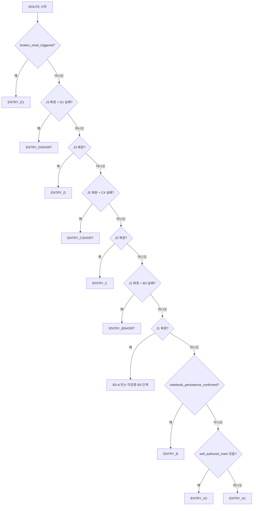
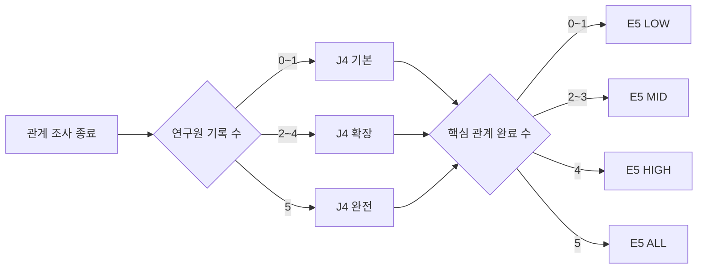
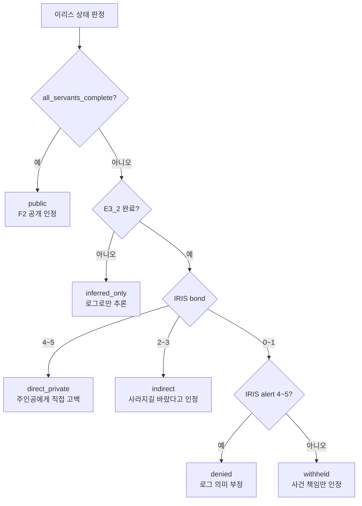
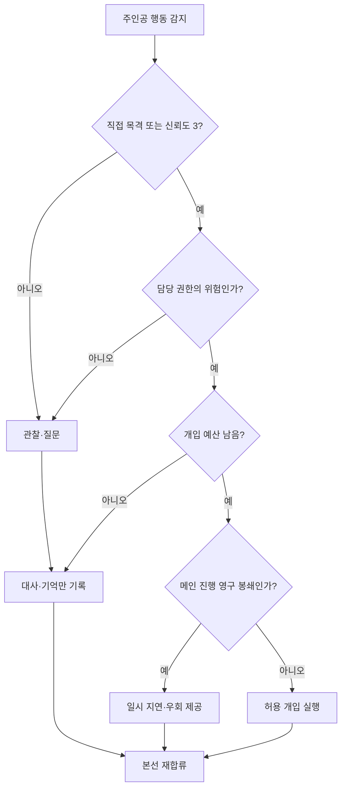
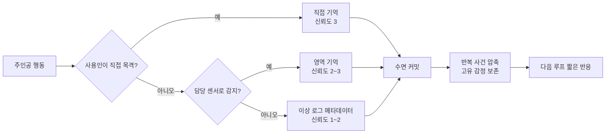
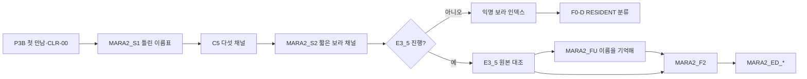
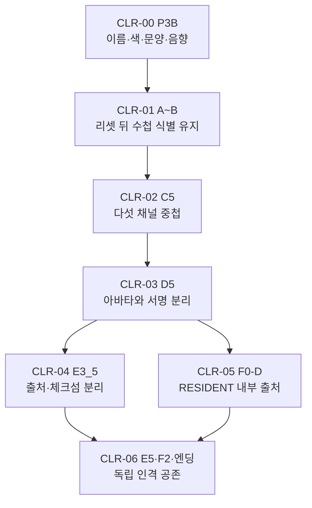
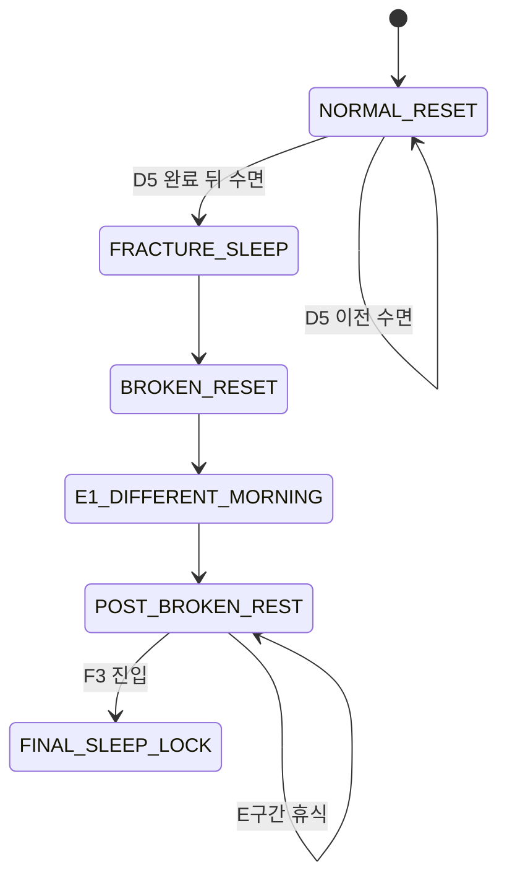

# GGB v0.4 전체 이벤트 흐름도

## 1. 문서 목적

본 문서는 프롤로그부터 두 엔딩까지의 전체 진행을 다음 요소와 함께 연결한다.

- 필수 메인 이벤트.
- 정상 리셋과 파열 이후 휴식.
- LOCAL RETRY와 HARD FAILURE.
- 영구 정보와 숏컷.
- 다섯 사용인의 잔류 기억과 관계 반응.
- 개입 예산에 따른 지연·도움.
- J4 정보량과 E5·F2 관계 결산.
- 마라 2·색상 서명·이리스 고백 분기.

세부 정답은 `08`, 개별 장면 내용은 `06~15`, 상태 필드는 `04·17`이 담당한다.

## 2. 표기 규칙

### 2.1 노드

| 표기 | 의미 |
| --- | --- |
| `P1`, `B3_B`, `E3_5` | 실제 이벤트 ID |
| `CHK_*` | 조건 판정용 보조 노드 |
| `REL_*` | 관계 반응·대사 결과 보조 노드 |
| `SYS_*` | 저장·리셋·집계 보조 노드 |
| `ENTRY_*` | ROUTE에서 각 구간으로 들어가는 연결점 |
| `MERGE_*` | 여러 분기가 본선으로 합류하는 지점 |

`CHK_*`, `REL_*`, `SYS_*`, `ENTRY_*`, `MERGE_*`는 이벤트 레지스트리에 별도 콘텐츠 이벤트로 등록하지 않아도 되는 흐름도용 식별자다.

### 2.2 연결선

| 선 | 의미 |
| --- | --- |
| `-->` | 필수 또는 기본 진행 |
| `-.->` | 선택 조사·선택 관계 |
| 조건 라벨 | 플래그·관계·성공 여부 |
| RESET 연결 | 현재 루프 종료 뒤 같은 아침 |
| MERGE 연결 | 분기 결과가 메인 진행에 재합류 |

### 2.3 관계 영향 원칙

- 사용인 반응은 퍼즐 정답을 바꾸지 않는다.
- 도움은 검증된 준비·이동·주의점에 한정한다.
- 제지는 질문, 일시 지연, 추가 동선으로 끝난다.
- 강한 제지 뒤에도 필수 순찰 공백이나 대체 진입 경로가 남는다.
- 미확인 관계 이벤트는 메인 진행을 잠그지 않는다.

## 3. 전체 메인 흐름

아래 흐름도는 전체 본선과 사용인 영향을 한 블록에서 확인하기 위한 마스터 흐름이다.

```mermaid
flowchart TB
    START(["게임 시작"])

    subgraph PSEC["P 프롤로그: 완벽한 하루"]
        P1["P1 기상과 아침 인사<br/>에드가 일정 안내"]
        P2["P2 창문 닦기"]
        P3["P3 책 정리·일지 발견"]
        P3B["P3B 초상화 이름표 정리<br/>마라 2 첫 만남"]
        CLR00["CLR-00 다섯 이름·문양·음향 대응"]
        P_TASKS["미완료 아침 일과 선택"]
        PG{"필수 아침 일과 모두 완료?"}
        P4["P4 차 준비<br/>루카 건강 확인"]
        PF["저녁 자유 조사"]
        P5["P5 잠긴 온실·날씨 모순<br/>이리스 첫 환경 암시"]
        P6["P6 에드가 취침 권유<br/>잠든다"]
    end

    START --> P1
    P1 --> P_TASKS
    P_TASKS --> P2
    P_TASKS --> P3
    P_TASKS --> P3B
    P2 --> PG
    P3 --> PG
    P3B --> CLR00
    CLR00 --> PG
    PG -- "아니오" --> P_TASKS
    PG -- "예" --> P4
    P4 --> PF
    PF -. "온실 조사" .-> P5
    PF -- "조사 종료" --> P6
    P5 --> P6

    subgraph RSEC["공통 정상 리셋"]
        NORMAL_SLEEP["NORMAL_SLEEP<br/>수면 확인"]
        SYS_COMMIT["SYS_COMMIT<br/>영구 정보·관계 커밋"]
        SYS_MEMORY["SYS_MEMORY<br/>목격·감정 잔류 기억 압축"]
        NORMAL_RESET["NORMAL_RESET<br/>물리·당일 상태 초기화"]
        MORNING["MORNING<br/>같은 침실의 같은 아침"]
        ROUTE{"ROUTE<br/>영구 정보 우선순위"}
    end

    P6 --> NORMAL_SLEEP
    NORMAL_SLEEP --> SYS_COMMIT
    SYS_COMMIT --> SYS_MEMORY
    SYS_MEMORY --> NORMAL_RESET
    NORMAL_RESET --> MORNING
    MORNING --> ROUTE

    subgraph ASEC["A 반복 증명"]
        ENTRY_A1["ENTRY_A1<br/>지속 실험 미시작"]
        A1["A1 수첩에 자기 표시 작성"]
        AS["AS 검증된 일과 축약"]
        A_SLEEP["잠든다"]
        ENTRY_A2["ENTRY_A2<br/>표시 작성·지속 미확인"]
        A2["A2 표시 유지 확인<br/>루프 연속성 검증"]
        CHK_A_REACT{"미확인 짧은 반응?"}
        EDGAR_S1["EDGAR_S1 같은 꿈"]
        MARA2_S1["MARA2_S1 틀린 이름표"]
        IRIS_S1["IRIS_S1 실내의 비"]
        LUCA_S1["LUCA_S1 식지 않는 차"]
        A_REACT_DONE["해당 반응 확인·관계 변화 1회"]
        ENTRY_B["ENTRY_B<br/>B구간 시작"]
    end

    ROUTE -- "self_authored_mark 없음" --> ENTRY_A1
    ENTRY_A1 --> A1
    A1 --> AS
    AS --> A_SLEEP
    A_SLEEP --> NORMAL_SLEEP

    ROUTE -- "표시 있음 + 지속 미확인" --> ENTRY_A2
    ENTRY_A2 --> A2
    A2 --> CHK_A_REACT
    CHK_A_REACT -- "에드가 조건" --> EDGAR_S1
    CHK_A_REACT -- "마라 2 조건" --> MARA2_S1
    CHK_A_REACT -- "P5 기록 있음" --> IRIS_S1
    CHK_A_REACT -- "루카 조건" --> LUCA_S1
    CHK_A_REACT -- "없음" --> ENTRY_B
    CHK_A_REACT -- "나중에 본다" --> ENTRY_B
    EDGAR_S1 --> A_REACT_DONE
    MARA2_S1 --> A_REACT_DONE
    IRIS_S1 --> A_REACT_DONE
    LUCA_S1 --> A_REACT_DONE
    A_REACT_DONE --> CHK_A_REACT

    subgraph BSEC["B 열세 번째 종"]
        B1["B1 사용인 시간표 조사<br/>수첩 기록"]
        CHK_B_CONFESS{"루프를 사용인에게 말하는가?"}
        REL_B_EDGAR["에드가<br/>꿈으로 해명·경계 상승 가능"]
        REL_B_MARA1["마라 1<br/>반복 속도 농담·작업 기억"]
        REL_B_LUCA["루카<br/>피로·수면 상태 확인"]
        REL_B_IRIS["이리스<br/>같은 계절 은유"]
        REL_B_MARA2["마라 2<br/>기록 출처 검사"]
        B2["B2 저녁의 서재 접근"]
        J1["J1 틀린 소리<br/>일지 1단계"]
        B3_A["B3-A 시계망 배선 탁본"]
        CHK_B3A{"연결 검증 성공?"}
        CHK_B_INTERVENE{"B3 전 사용인 개입?"}
        REL_B_DELAY["에드가 강한 제지 1회<br/>확인 절차·우회 동선"]
        REL_B_HELP["마라 1 준비 도움<br/>탁본 정리만 축약"]
        B3_B["B3-B 역할·위상 입력"]
        CHK_B3B{"저녁 실제 작동 결과"}
        BF["BF 봉인핀 파손·시계망 잠금<br/>실패 정보 기록"]
        CHK_B_WITNESS{"실패를 직접 목격했는가?"}
        REL_B_WITNESS["목격자 잔류 기억 저장<br/>alert 변화 가능"]
        B_FREE["남은 자유 조사"]
        B_SLEEP["잠든다"]
        B4["B4 열세 번째 종 파형 기록"]
        B5["B5 서재 재접근·일지 접촉"]
        J2["J2 검은 층 아래의 길<br/>일지 2단계"]
        J2_SLEEP["잠든다"]
        ENTRY_BSHORT["ENTRY_BSHORT<br/>J1+B3 실패"]
        BSHORT["BSHORT 일과·탁본·이동 축약"]
        CHK_BSHORT_REACT{"숏컷 사용인 반응?"}
        MARA1_S1["MARA1_S1 이번에는 빠르네"]
        REL_BSHORT_EDGAR["에드가 경계 반응<br/>질문 예산 소모"]
        MERGE_B3["B3-B 재시도 진입"]
    end

    ENTRY_B --> B1
    B1 --> CHK_B_CONFESS
    CHK_B_CONFESS -- "에드가" --> REL_B_EDGAR
    CHK_B_CONFESS -- "마라 1" --> REL_B_MARA1
    CHK_B_CONFESS -- "루카" --> REL_B_LUCA
    CHK_B_CONFESS -- "이리스" --> REL_B_IRIS
    CHK_B_CONFESS -- "마라 2" --> REL_B_MARA2
    CHK_B_CONFESS -- "말하지 않음" --> B2
    REL_B_EDGAR --> B2
    REL_B_MARA1 --> B2
    REL_B_LUCA --> B2
    REL_B_IRIS --> B2
    REL_B_MARA2 --> B2
    B2 --> J1
    J1 --> B3_A
    B3_A --> CHK_B3A
    CHK_B3A -- "아니오: LOCAL RETRY" --> B3_A
    CHK_B3A -- "예" --> CHK_B_INTERVENE
    CHK_B_INTERVENE -- "에드가 strong 남음" --> REL_B_DELAY
    CHK_B_INTERVENE -- "마라 1 bond 높음" --> REL_B_HELP
    CHK_B_INTERVENE -- "없음" --> B3_B
    REL_B_DELAY --> B3_B
    REL_B_HELP --> B3_B

    ROUTE -- "J1+B3 실패" --> ENTRY_BSHORT
    ROUTE -- "J1 복원+B3 미실패" --> B3_A
    ROUTE -- "A2 확인 완료+J1 미복원" --> ENTRY_B
    ENTRY_BSHORT --> BSHORT
    BSHORT --> CHK_BSHORT_REACT
    CHK_BSHORT_REACT -- "MARA1_S1 미확인" --> MARA1_S1
    CHK_BSHORT_REACT -- "에드가 경계" --> REL_BSHORT_EDGAR
    CHK_BSHORT_REACT -- "없음" --> MERGE_B3
    MARA1_S1 --> MERGE_B3
    REL_BSHORT_EDGAR --> MERGE_B3
    MERGE_B3 --> B3_B

    B3_B --> CHK_B3B
    CHK_B3B -- "실패: HARD FAILURE" --> BF
    BF --> CHK_B_WITNESS
    CHK_B_WITNESS -- "예" --> REL_B_WITNESS
    CHK_B_WITNESS -- "아니오" --> B_FREE
    REL_B_WITNESS --> B_FREE
    B_FREE --> B_SLEEP
    B_SLEEP --> NORMAL_SLEEP
    CHK_B3B -- "성공" --> B4
    B4 --> B5
    B5 --> J2
    J2 --> J2_SLEEP
    J2_SLEEP --> NORMAL_SLEEP

    subgraph CSEC["C 검은 거울"]
        ENTRY_C["ENTRY_C<br/>J2 복원"]
        C0["C0 검은 거울 확인<br/>에드가 금지"]
        CHK_EDGAR_S2{"EDGAR_S2 조건?"}
        EDGAR_S2["EDGAR_S2 금지된 표면"]
        REL_C0_BLOCK["에드가 strong 제지<br/>추가 확인 후 통과"]
        C1["C1 거울 청소 준비"]
        C2["C2 마라 1 청소 기록<br/>코팅 정보"]
        C21["C2-1 루카 약품장<br/>재료·혼합 정보"]
        CHK_MARA1_S2{"MARA1_S2 미확인?"}
        MARA1_S2["MARA1_S2 닦지 말아야 할 얼룩"]
        REL_C_LUCA["루카 관계 반응<br/>안전 절차·재료 위치"]
        CG{"코팅 정보와 혼합 정보 모두 확보?"}
        C3["C3 5:1:2 중성 세정제"]
        CHK_C3{"제약식·순서 성공?"}
        C4["C4 열세 번째 종의 검은 거울<br/>파형·경로 중첩"]
        CHK_C4{"실제 닦기 결과"}
        CF["CF 코팅 경화 또는 도구 회수<br/>실패 정보 기록"]
        CHK_C_WITNESS{"누가 실패를 목격했는가?"}
        REL_C_EDGAR["에드가 잔류 기억<br/>다음 루프 질문 증가"]
        REL_C_ML["마라 1·루카 잔류 기억<br/>주의점 반응 가능"]
        C_FREE["남은 자유 조사"]
        C_SLEEP["잠든다"]
        C5["C5 진단 패널·냉각 실루엣<br/>다섯 색상 채널"]
        CLR02["CLR-02 다섯 인격 채널 노출"]
        CHK_C5_REACT{"C5 후 미확인 반응?"}
        MARA2_S2["MARA2_S2 짧은 보라 채널"]
        IRIS_S2["IRIS_S2 한 계절의 이름"]
        C5_REACT_DONE["반응 확인"]
        J3["J3 가장 낮은 곳<br/>일지 3단계"]
        J3_SLEEP["잠든다"]
        ENTRY_CSHORT["ENTRY_CSHORT<br/>J2+C4 실패"]
        CSHORT["CSHORT 일과·재료 확보 축약"]
        CHK_CSHORT_REACT{"C단계 관계 반응?"}
        REL_CSHORT_HELP["검증된 준비 도움<br/>정답 입력은 유지"]
        REL_CSHORT_CHECK["추가 질문·도구 확인<br/>우회 뒤 합류"]
        MERGE_C3["C3 재시도 진입"]
    end

    ROUTE -- "J2 복원+C4 미실패" --> ENTRY_C
    ENTRY_C --> C0
    C0 --> CHK_EDGAR_S2
    CHK_EDGAR_S2 -- "짧은 반응" --> EDGAR_S2
    CHK_EDGAR_S2 -- "strong 제지 조건" --> REL_C0_BLOCK
    CHK_EDGAR_S2 -- "없음" --> C1
    EDGAR_S2 --> C1
    REL_C0_BLOCK --> C1
    C1 --> C2
    C1 --> C21
    C2 --> CHK_MARA1_S2
    CHK_MARA1_S2 -- "예" --> MARA1_S2
    CHK_MARA1_S2 -- "아니오" --> CG
    MARA1_S2 --> CG
    C21 --> REL_C_LUCA
    REL_C_LUCA --> CG
    CG -- "아니오" --> C1
    CG -- "예" --> C3
    C3 --> CHK_C3
    CHK_C3 -- "실패: LOCAL RETRY" --> C3
    CHK_C3 -- "성공" --> C4

    ROUTE -- "J2+C4 실패" --> ENTRY_CSHORT
    ENTRY_CSHORT --> CSHORT
    CSHORT --> CHK_CSHORT_REACT
    CHK_CSHORT_REACT -- "bond 도움" --> REL_CSHORT_HELP
    CHK_CSHORT_REACT -- "alert 확인" --> REL_CSHORT_CHECK
    CHK_CSHORT_REACT -- "없음" --> MERGE_C3
    REL_CSHORT_HELP --> MERGE_C3
    REL_CSHORT_CHECK --> MERGE_C3
    MERGE_C3 --> C3

    C4 --> CHK_C4
    CHK_C4 -- "실패: HARD FAILURE" --> CF
    CF --> CHK_C_WITNESS
    CHK_C_WITNESS -- "에드가" --> REL_C_EDGAR
    CHK_C_WITNESS -- "마라 1 또는 루카" --> REL_C_ML
    CHK_C_WITNESS -- "미목격" --> C_FREE
    REL_C_EDGAR --> C_FREE
    REL_C_ML --> C_FREE
    C_FREE --> C_SLEEP
    C_SLEEP --> NORMAL_SLEEP
    CHK_C4 -- "성공" --> C5
    C5 --> CLR02
    CLR02 --> CHK_C5_REACT
    CHK_C5_REACT -- "마라 2" --> MARA2_S2
    CHK_C5_REACT -- "이리스" --> IRIS_S2
    CHK_C5_REACT -- "없음" --> J3
    CHK_C5_REACT -- "나중에 본다" --> J3
    MARA2_S2 --> C5_REACT_DONE
    IRIS_S2 --> C5_REACT_DONE
    C5_REACT_DONE --> CHK_C5_REACT
    J3 --> J3_SLEEP
    J3_SLEEP --> NORMAL_SLEEP

    subgraph DSEC["D 지하창고와 태엽 심장"]
        ENTRY_D["ENTRY_D<br/>J3 복원"]
        D0["D0 서재 단서 재확인"]
        D0_A["D0-A 반전 도면 중첩"]
        CHK_D0A{"도면 변환 성공?"}
        CHK_D_INTERVENE{"지하 접근 전 사용인 개입?"}
        REL_D_EDGAR["에드가 경고·추가 확인<br/>경로는 유지"]
        REL_D_MARA1["마라 1 검증 축 준비 도움"]
        D1["D1 축 순서·깊이 입력"]
        CHK_D1{"축 장치 결과"}
        DF["DF 압력핀 하강·당일 잠금<br/>실패 정보 기록"]
        CHK_D_WITNESS{"실패 후 사용인 반응?"}
        REL_D_LUCA["루카 피로·손 떨림 확인"]
        REL_D_EDGAR2["에드가 취침 권유 강화"]
        D_FREE["남은 자유 조사"]
        D_SLEEP["잠든다"]
        D2["D2 지하창고 접근 숏컷 해금"]
        D4["D4 연동 태엽 심장<br/>시험 모드"]
        CHK_D4{"목표 상태 1·2·3 완성?"}
        D4_XIII["XII 정상 기동<br/>숨은 +1 보조 레버·XIII"]
        CHK_D4_REACT{"D5 직전 관계 반응?"}
        REL_D4_EDGAR["에드가 마지막 경고<br/>레이피어를 거둠"]
        REL_D4_OTHER["마라 1·루카·이리스·마라 2<br/>불안 반응 1개"]
        D5["D5 세계의 파열<br/>CAMOUFLAGE FILTER OFF"]
        CLR03["CLR-03 서명과 아바타 분리"]
        D6["D6 파열된 저택에서 잠들기"]
        FRACTURE_SLEEP["FRACTURE_SLEEP<br/>정상 복구 시도"]
        BROKEN_RESET["BROKEN_RESET<br/>WORLD MASK 복구 실패"]
        SYS_SYNC["SYS_SYNC<br/>관계·기억 유지·역할 고정 약화"]
        ENTRY_E1["ENTRY_E1<br/>S3 다른 아침"]
        ENTRY_DSHORT["ENTRY_DSHORT<br/>J3+D1 실패"]
        DSHORT["DSHORT 서재·지하 이동 축약"]
        CHK_DSHORT_REACT{"D단계 관계 반응?"}
        REL_DSHORT_HELP["검증 축 준비 도움"]
        REL_DSHORT_CHECK["추가 경고·우회 동선"]
        MERGE_D1["D1 재시도 진입"]
    end

    ROUTE -- "J3 복원+D1 미실패" --> ENTRY_D
    ENTRY_D --> D0
    D0 --> D0_A
    D0_A --> CHK_D0A
    CHK_D0A -- "실패: LOCAL RETRY" --> D0_A
    CHK_D0A -- "성공" --> CHK_D_INTERVENE
    CHK_D_INTERVENE -- "에드가 strong 남음" --> REL_D_EDGAR
    CHK_D_INTERVENE -- "마라 1 bond 높음" --> REL_D_MARA1
    CHK_D_INTERVENE -- "없음" --> D1
    REL_D_EDGAR --> D1
    REL_D_MARA1 --> D1

    ROUTE -- "J3+D1 실패" --> ENTRY_DSHORT
    ENTRY_DSHORT --> DSHORT
    DSHORT --> CHK_DSHORT_REACT
    CHK_DSHORT_REACT -- "도움" --> REL_DSHORT_HELP
    CHK_DSHORT_REACT -- "경계" --> REL_DSHORT_CHECK
    CHK_DSHORT_REACT -- "없음" --> MERGE_D1
    REL_DSHORT_HELP --> MERGE_D1
    REL_DSHORT_CHECK --> MERGE_D1
    MERGE_D1 --> D1

    D1 --> CHK_D1
    CHK_D1 -- "실패: HARD FAILURE" --> DF
    DF --> CHK_D_WITNESS
    CHK_D_WITNESS -- "루카 조건" --> REL_D_LUCA
    CHK_D_WITNESS -- "에드가 조건" --> REL_D_EDGAR2
    CHK_D_WITNESS -- "없음" --> D_FREE
    REL_D_LUCA --> D_FREE
    REL_D_EDGAR2 --> D_FREE
    D_FREE --> D_SLEEP
    D_SLEEP --> NORMAL_SLEEP
    CHK_D1 -- "성공" --> D2
    D2 --> D4
    D4 --> CHK_D4
    CHK_D4 -- "실패: LOCAL RETRY" --> D4
    CHK_D4 -- "성공" --> D4_XIII
    D4_XIII --> CHK_D4_REACT
    CHK_D4_REACT -- "에드가 조건" --> REL_D4_EDGAR
    CHK_D4_REACT -- "다른 사용인 조건" --> REL_D4_OTHER
    CHK_D4_REACT -- "없음" --> D5
    REL_D4_EDGAR --> D5
    REL_D4_OTHER --> D5
    D5 --> CLR03
    CLR03 --> D6
    D6 --> FRACTURE_SLEEP
    FRACTURE_SLEEP --> BROKEN_RESET
    BROKEN_RESET --> SYS_SYNC
    SYS_SYNC --> ENTRY_E1

    subgraph ESEC["E 파열 이후 관계와 결산"]
        E1["E1 같은 침실의 다른 아침"]
        CHK_LUCA_S2{"LUCA_S2 조건?"}
        LUCA_S2["LUCA_S2 차가운 손"]
        E2_INTRO["E2_INTRO 다섯 사용인 첫 대면"]
        CHK_E_ACTION{"사용인 관계 조사를 진행할까?"}
        E_HUB["E_HUB 다섯 사용인 허브"]
        E3_1["E3_1 마라 1 배선 수리"]
        ER1["REC_MARA1<br/>E3_1 완료"]
        E3_2["E3_2 이리스 센서 교정"]
        IRIS_CALC["이리스 고백 상태 계산<br/>inferred·denied·indirect·direct"]
        ER2["REC_IRIS<br/>E3_2 완료"]
        E3_3["E3_3 루카 생명 유지 안정화"]
        ER3["REC_LUCA<br/>E3_3 완료"]
        E3_4["E3_4 에드가 보안 코어 복원"]
        ER4["REC_EDGAR<br/>E3_4 완료"]
        E3_5["E3_5 마라 2 원본 대조"]
        ER5["REC_MARA2<br/>E3_5 완료"]
        CHK_E_MORE{"추가 사용인 이벤트?"}
        J4_COUNT{"연구원 기록 수"}
        J4_BASE["J4_BASE 기본 복원<br/>기록 0~1"]
        J4_EXP["J4_EXPANDED 확장 복원<br/>기록 2~4"]
        J4_FULL["J4_FULL 완전 복원<br/>기록 5"]
        CHK_EDGAR_CORE{"E3_4 완료?"}
        E3_4M["E3_4M 에드가 최소 대면<br/>운영 권한만 복구"]
        REL_COUNT{"핵심 관계 완료 수"}
        E5_LOW["E5_LOW 기능적인 저녁<br/>0~1명"]
        E5_MID["E5_MID 어색한 진심<br/>2~3명"]
        E5_HIGH["E5_HIGH 작별의 예감<br/>4명"]
        E5_ALL["E5_ALL 다섯 인격 공동 확인<br/>5명"]
        MERGE_E5["E5 결산 완료"]
        CHK_E_FOLLOWUP{"미확인 후속 반응?"}
        MARA2_FU["MARA2_FU 이름을 기억해"]
        EDGAR_S3["EDGAR_S3 마지막 점검"]
        E6["E6 코어 접근 개방"]
    end

    ENTRY_E1 --> E1
    E1 --> CHK_LUCA_S2
    CHK_LUCA_S2 -- "예" --> LUCA_S2
    CHK_LUCA_S2 -- "아니오" --> E2_INTRO
    LUCA_S2 --> E2_INTRO
    E2_INTRO --> CHK_E_ACTION
    CHK_E_ACTION -- "관계 조사" --> E_HUB
    CHK_E_ACTION -- "즉시 결산" --> J4_COUNT
    E_HUB -. "배선 수리" .-> E3_1
    E_HUB -. "온실 계절 장치" .-> E3_2
    E_HUB -. "주방 생명 유지" .-> E3_3
    E_HUB -. "대시계 보안 코어" .-> E3_4
    E_HUB -. "색분해실 아카이브" .-> E3_5
    E_HUB -- "조사 종료" --> J4_COUNT
    E3_1 --> ER1
    E3_2 --> IRIS_CALC
    IRIS_CALC --> ER2
    E3_3 --> ER3
    E3_4 --> ER4
    E3_5 --> ER5
    ER1 --> CHK_E_MORE
    ER2 --> CHK_E_MORE
    ER3 --> CHK_E_MORE
    ER4 --> CHK_E_MORE
    ER5 --> CHK_E_MORE
    CHK_E_MORE -- "예" --> E_HUB
    CHK_E_MORE -- "아니오" --> J4_COUNT
    J4_COUNT -- "0~1" --> J4_BASE
    J4_COUNT -- "2~4" --> J4_EXP
    J4_COUNT -- "5" --> J4_FULL
    J4_BASE --> CHK_EDGAR_CORE
    J4_EXP --> CHK_EDGAR_CORE
    J4_FULL --> CHK_EDGAR_CORE
    CHK_EDGAR_CORE -- "아니오" --> E3_4M
    CHK_EDGAR_CORE -- "예" --> REL_COUNT
    E3_4M --> REL_COUNT
    REL_COUNT -- "0~1" --> E5_LOW
    REL_COUNT -- "2~3" --> E5_MID
    REL_COUNT -- "4" --> E5_HIGH
    REL_COUNT -- "5" --> E5_ALL
    E5_LOW --> MERGE_E5
    E5_MID --> MERGE_E5
    E5_HIGH --> MERGE_E5
    E5_ALL --> MERGE_E5
    MERGE_E5 --> CHK_E_FOLLOWUP
    CHK_E_FOLLOWUP -- "E3_5 완료·미확인" --> MARA2_FU
    CHK_E_FOLLOWUP -- "에드가 마지막 점검" --> EDGAR_S3
    CHK_E_FOLLOWUP -- "없음" --> E6
    MARA2_FU --> CHK_E_FOLLOWUP
    EDGAR_S3 --> E6

    subgraph FSEC["F 코어와 최종 선택"]
        F0_A["F0-A 방 피드백 회로"]
        CHK_F0A{"회로 연결 성공?"}
        F0_B["F0-B 현실 유지 표본"]
        CHK_F0B{"네 표본 성공?"}
        F0_C["F0-C B4·C5·D4 자료 중첩"]
        CHK_F0C{"빈 포트 노출?"}
        CHK_MARA2_REC{"REC_MARA2 있음?"}
        F0D_ANON["익명 보라 아카이브 인덱스 제공"]
        F0_D["F0-D 기록 역할 분류"]
        CHK_F0D{"다섯 역할 성공?"}
        F0_E["F0-E 과거 연속성·현재 자기작성 인증"]
        CHK_F0E{"현재 작성자가 SUBJECT인가?"}
        SUBJECT["SUBJECT AUTHORITY RESTORED<br/>FINAL DECISION: UNSET"]
        CHK_F0_INTENT{"비구속적 현재 의향"}
        F0_INT_R["INTENT_REALITY<br/>현실 지향"]
        F0_INT_S["INTENT_STAY<br/>잔류 지향"]
        F0_INT_U["INTENT_UNDECIDED<br/>미정"]
        MERGE_F0_E["MERGE_F0_E<br/>F1 공통 합류"]
        F1["F1 아버지의 마지막 기록"]
        J5["J5 답을 적지 않은 페이지"]
        F2_TIER{"핵심 관계 완료 수"}
        F2_LOW["F2_LOW 기능·원망 중심 대면"]
        F2_MID["F2_MID 갈등과 이해"]
        F2_HIGH["F2_HIGH 관계 완료 4명 중심 대면"]
        F2_ALL["F2_ALL 다섯 인격 공동 대면"]
        CHK_IRIS_F2{"이리스 고백 상태"}
        IRIS_INFER["inferred_only<br/>로그로만 추론"]
        IRIS_DENY["denied·withheld<br/>직접 인정 없음"]
        IRIS_INDIRECT["indirect<br/>사라지길 바랐다고 인정"]
        IRIS_DIRECT["direct_private<br/>기존 사적 고백을 확인"]
        IRIS_PUBLIC["public<br/>다른 연구원 앞에서 인정"]
        F3["F3 냉각·루프 장치·수첩 조사"]
        EDC{"EDC 최종 선택"}
        CHK_EDC_R{"현실 선택<br/>이전 의향?"}
        CHK_EDC_S{"잔류 선택<br/>이전 의향?"}
        REL_FINAL_R_REAFFIRMED["reaffirmed<br/>현실 의향 재확인"]
        REL_FINAL_R_REVISED["revised<br/>잔류 의향에서 수정"]
        REL_FINAL_R_FORMED["formed<br/>미정에서 최초 결정"]
        REL_FINAL_S_REAFFIRMED["reaffirmed<br/>잔류 의향 재확인"]
        REL_FINAL_S_REVISED["revised<br/>현실 의향에서 수정"]
        REL_FINAL_S_FORMED["formed<br/>미정에서 최초 결정"]
        REALITY_TIER{"현실 기상<br/>관계 결산"}
        ED_R_LOW["ED_REALITY_LOW"]
        ED_R_MID["ED_REALITY_MID"]
        ED_R_HIGH["ED_REALITY_HIGH"]
        ED_R_ALL["ED_REALITY_ALL"]
        STAY_TIER{"안정화 잔류<br/>관계 결산"}
        ED_S_LOW["ED_STAY_LOW"]
        ED_S_MID["ED_STAY_MID"]
        ED_S_HIGH["ED_STAY_HIGH"]
        ED_S_ALL["ED_STAY_ALL"]
        END_R(["현실 기상 엔딩"])
        END_S(["안정화 잔류 엔딩"])
    end

    E6 --> F0_A
    F0_A --> CHK_F0A
    CHK_F0A -- "실패: LOCAL RETRY" --> F0_A
    CHK_F0A -- "성공" --> F0_B
    F0_B --> CHK_F0B
    CHK_F0B -- "실패: LOCAL RETRY" --> F0_B
    CHK_F0B -- "성공" --> F0_C
    F0_C --> CHK_F0C
    CHK_F0C -- "실패: LOCAL RETRY" --> F0_C
    CHK_F0C -- "성공" --> CHK_MARA2_REC
    CHK_MARA2_REC -- "예" --> F0_D
    CHK_MARA2_REC -- "아니오" --> F0D_ANON
    F0D_ANON --> F0_D
    F0_D --> CHK_F0D
    CHK_F0D -- "실패: LOCAL RETRY" --> F0_D
    CHK_F0D -- "성공" --> F0_E
    F0_E --> CHK_F0E
    CHK_F0E -- "외부 권한: LOCAL RETRY" --> F0_E
    CHK_F0E -- "성공" --> SUBJECT
    SUBJECT --> CHK_F0_INTENT
    CHK_F0_INTENT -- "현실 지향" --> F0_INT_R
    CHK_F0_INTENT -- "잔류 지향" --> F0_INT_S
    CHK_F0_INTENT -- "미정" --> F0_INT_U
    F0_INT_R --> MERGE_F0_E
    F0_INT_S --> MERGE_F0_E
    F0_INT_U --> MERGE_F0_E
    MERGE_F0_E --> F1
    F1 --> J5
    J5 --> F2_TIER
    F2_TIER -- "0~1" --> F2_LOW
    F2_TIER -- "2~3" --> F2_MID
    F2_TIER -- "4" --> F2_HIGH
    F2_TIER -- "5" --> F2_ALL
    F2_LOW --> CHK_IRIS_F2
    F2_MID --> CHK_IRIS_F2
    F2_HIGH --> CHK_IRIS_F2
    F2_ALL --> IRIS_PUBLIC
    CHK_IRIS_F2 -- "E3_2 미완료" --> IRIS_INFER
    CHK_IRIS_F2 -- "denied·withheld" --> IRIS_DENY
    CHK_IRIS_F2 -- "indirect" --> IRIS_INDIRECT
    CHK_IRIS_F2 -- "direct_private" --> IRIS_DIRECT
    IRIS_INFER --> F3
    IRIS_DENY --> F3
    IRIS_INDIRECT --> F3
    IRIS_DIRECT --> F3
    IRIS_PUBLIC --> F3
    F3 --> EDC
    EDC -- "기상 절차 실행" --> CHK_EDC_R
    EDC -- "안정화 루프 복원" --> CHK_EDC_S
    CHK_EDC_R -- "reality" --> REL_FINAL_R_REAFFIRMED
    CHK_EDC_R -- "stay" --> REL_FINAL_R_REVISED
    CHK_EDC_R -- "undecided" --> REL_FINAL_R_FORMED
    CHK_EDC_S -- "stay" --> REL_FINAL_S_REAFFIRMED
    CHK_EDC_S -- "reality" --> REL_FINAL_S_REVISED
    CHK_EDC_S -- "undecided" --> REL_FINAL_S_FORMED
    REL_FINAL_R_REAFFIRMED --> REALITY_TIER
    REL_FINAL_R_REVISED --> REALITY_TIER
    REL_FINAL_R_FORMED --> REALITY_TIER
    REL_FINAL_S_REAFFIRMED --> STAY_TIER
    REL_FINAL_S_REVISED --> STAY_TIER
    REL_FINAL_S_FORMED --> STAY_TIER
    REALITY_TIER -- "0~1" --> ED_R_LOW
    REALITY_TIER -- "2~3" --> ED_R_MID
    REALITY_TIER -- "4" --> ED_R_HIGH
    REALITY_TIER -- "5" --> ED_R_ALL
    ED_R_LOW --> END_R
    ED_R_MID --> END_R
    ED_R_HIGH --> END_R
    ED_R_ALL --> END_R
    STAY_TIER -- "0~1" --> ED_S_LOW
    STAY_TIER -- "2~3" --> ED_S_MID
    STAY_TIER -- "4" --> ED_S_HIGH
    STAY_TIER -- "5" --> ED_S_ALL
    ED_S_LOW --> END_S
    ED_S_MID --> END_S
    ED_S_HIGH --> END_S
    ED_S_ALL --> END_S
```

## 4. ROUTE 우선순위

ROUTE는 여러 조건을 동시에 실행하지 않는다. 위에서 처음 충족된 한 경로만 선택한다.



### 4.1 우선순위 표

| 우선 | 조건 | 진입 | 반복 축소 |
| --- | --- | --- | --- |
| 1 | `broken_reset_triggered` | E1 | 정상 ROUTE 종료 |
| 2 | J3 + D1 실패 | DSHORT → D1 | 도면·검증 축 유지 |
| 3 | J3 | D0 | 서재 단서 재확인 |
| 4 | J2 + C4 실패 | CSHORT → C3 | 재료 확보 축약 |
| 5 | J2 | C0 | 거울 조사 |
| 6 | J1 + B3 실패 | BSHORT → B3-B | 탁본·이동 축약 |
| 7 | J1 | B3-A 또는 미완료 단계 | 검증 단계 유지 |
| 8 | A2 확인 완료 + J1 미복원 | B1 | B구간 조사 재개 |
| 9 | 표시 작성·지속 미확인 | A2 | 수첩 직접 확인 |
| 10 | 표시 없음 | A1 | 실험 시작 |

P3B 완료, 색상 서명 확인, 선택 관계 이벤트는 ROUTE 우선순위를 바꾸지 않는다.

## 5. 프롤로그·A구간 사용인 영향

| 지점 | 사용인 | 조건 | 반응 | 메인 영향 |
| --- | --- | --- | --- | --- |
| P1 | 에드가 | 항상 | 일정·일과 안내 | 튜토리얼 |
| P2 | 마라 1 | 첫 플레이 | 청소 동작 평가 | 없음 |
| P3B | 마라 2 | 필수 | 이름·문양 학습 | CLR-00 |
| P4 | 루카 | 항상 | 차와 신체 상태 확인 | 없음 |
| P5 | 이리스 | 선택 조사 | 날씨 모순을 은유 | 영구 관찰 |
| P6 | 에드가 | 항상 | 취침 절차 집행 | 첫 리셋 |
| A2 이후 | 에드가 | EDGAR_S1 미확인 | 반복 꿈 암시 | 관계만 |
| A2 이후 | 마라 2 | MARA2_S1 미확인 | 전날 이름표 기억 | 관계만 |
| P5 후 | 이리스 | IRIS_S1 미확인 | 실내 비 반응 | 관계만 |
| A~B | 루카 | LUCA_S1 미확인 | 같은 차 온도 | 관계만 |

한 아침에 자동 관계 반응은 하나씩 재생한다. 반응 종료 뒤 조건 큐를 다시 확인하며, 플레이어는 언제든 메인 진행을 선택할 수 있다.

## 6. B구간 사용인 영향

### 6.1 루프 고백

| 대상 | 즉시 반응 | 기억 변화 | 진행 |
| --- | --- | --- | --- |
| 에드가 | 꿈·피로로 해명 | alert 상승 가능 | B2 유지 |
| 마라 1 | 반복 속도를 농담으로 확인 | 작업 패턴 저장 | B2 유지 |
| 루카 | 주인공 생체·수면 확인 | 감정 기억 저장 | B2 유지 |
| 이리스 | 같은 계절 은유 | 환경 모순과 연결 | B2 유지 |
| 마라 2 | 수첩 필기 출처 검사 | 체크섬 없는 SUBJECT 기록 인지 | B2 유지 |
| 말하지 않음 | 없음 | 없음 | B2 유지 |

고백 대상은 필수 정보량을 바꾸지 않는다.

### 6.2 B3 개입

| 조건 | 개입 | 허용 결과 | 금지 결과 |
| --- | --- | --- | --- |
| 에드가 alert 높음·strong 남음 | 권한 확인·추가 동선 | B3 진입 지연 | 당일 영구 봉쇄 |
| 마라 1 bond 높음 | 탁본을 정렬해 둠 | 준비 축약 | 역할·위상 정답 제공 |
| 개입 예산 없음 | 관찰 대사 | 관계 피드백 | 추가 제지 |

### 6.3 B3 실패

실패를 직접 목격한 사용인만 해당 사건을 신뢰도 3의 잔류 기억으로 저장한다. 다른 사용인은 다음 리셋에서 `시계망 이상 발생` 메타데이터만 볼 수 있다.

## 7. C구간 사용인 영향

| 지점 | 관계 조건 | 반응 | 진행 영향 |
| --- | --- | --- | --- |
| C0 | 에드가 short/strong | 금지 이유 또는 추가 확인 | C1로 합류 |
| C2 | 마라 1 | MARA1_S2, 코팅 주의 | 정보 정답 불변 |
| C2-1 | 루카 | 안전 절차·재료 위치 | 혼합식 정답 불변 |
| CSHORT | bond 높음 | 검증된 준비 도움 | 실제 제조 유지 |
| CSHORT | alert 높음 | 도구 확인·우회 | C3로 합류 |
| C4 실패 | 목격자 있음 | 잔류 기억·다음 반응 | RESET 유지 |
| C5 | 마라 2 | 보라 채널 길이 이상 | E3_5 선택 단서 |
| C5 | 이리스 | 계절 기억 선택 | 관계만 |

C2와 C2-1은 순서 자유지만 두 정보가 모두 있어야 C3 정식 조합을 시작한다.

## 8. D구간 사용인 영향

| 지점 | 조건 | 반응 | 진행 영향 |
| --- | --- | --- | --- |
| D0-A | 마라 1 bond 높음 | 검증된 도면 준비 | 변환 정답은 플레이어 입력 |
| D1 전 | 에드가 alert 높음 | 경고·권한 확인 | D1 진입 유지 |
| D1 실패 | 루카 조건 | 피로·손 떨림 점검 | 수면 안내 |
| D1 실패 | 에드가 조건 | 취침 권유 강화 | 수면 안내 |
| D4 직전 | 에드가 bond 높음 | 마지막 경고 뒤 레이피어를 거둠 | D5 유지 |
| D4 직전 | 다른 사용인 조건 | 불안·침묵·회피 반응 하나 | D5 유지 |

D4의 정렬 실패는 LOCAL RETRY다. 목표 상태와 XIII 기동을 완료하면 관계 상태와 무관하게 D5로 진행한다.

## 9. E구간 관계 허브

### 9.1 진입

```text
E1
→ LUCA_S2 조건 반응
→ E2_INTRO
→ 관계 조사 / 즉시 결산 선택
```

### 9.2 핵심 관계

| ID | 인물 | 기능 | 기록 | 메인 필수 |
| --- | --- | --- | --- | --- |
| E3_1 | 마라 1 | 배선·삭제 로그 | REC_MARA1 | 선택 |
| E3_2 | 이리스 | 계절 센서·전력 전용 | REC_IRIS | 선택 |
| E3_3 | 루카 | 생명 유지·냉각 | REC_LUCA | 선택 |
| E3_4 | 에드가 | 보안·운영 책임 | REC_EDGAR | 선택 |
| E3_5 | 마라 2 | 인격 원본·체크섬 | REC_MARA2 | 선택 |

각 이벤트 완료 뒤:

```text
기록 획득
→ core_event_complete
→ bond/alert 변화
→ 허브 복귀 또는 조사 종료
```

### 9.3 J4와 E5 분리



J4는 과거 정보량, E5는 현재 관계 표현량을 결정한다.

### 9.4 에드가 최소 대면

E3_4를 완료하지 않고 허브를 종료하면 E3_4M이 발생한다.

- 코어 접근에 필요한 운영 권한만 복구.
- REC_EDGAR 미획득.
- E3_4 완료로 계산하지 않음.
- 에드가의 감정 고백 없음.
- E6 진입은 보장.

## 10. 이리스 고백 흐름



고백 상태는 E3_2 완료 뒤 계산하고, 전원 완료 시 `public`이 최우선으로 덮어쓴다. 어떤 결과도 F0와 엔딩 선택지를 잠그지 않는다.

## 11. 사용인 개입 흐름



### 11.1 기본 예산

| 사용인 | 질문 | 보고 | 강한 제지 | 응급 |
| --- | --- | --- | --- | --- |
| 에드가 | 2 | 1 | 1 | 1 |
| 마라 1 | 1 | 1 | 1 | 0 |
| 루카 | 1 | 1 | 0 | 1 |
| 이리스 | 1 | 1 | 1 | 1 |
| 마라 2 | 2 | 1 | 1 | 0 |

개입 예산은 NORMAL_RESET 때 재충전된다. 같은 강한 제지를 여러 번 반복 재생하지 않고 이후에는 축약 대사로 교체한다.

## 12. 잔류 기억 흐름



- 직접 대화 전문은 다른 사용인에게 공유되지 않는다.
- 마라 2는 체크섬과 소유자는 볼 수 있지만 권한 없는 원문은 읽지 못한다.
- D5 이후에도 기억 공유는 당사자 동의와 관계 이벤트를 통해서만 확장된다.

## 13. 마라 2 전용 흐름



- P3B만 필수다.
- MARA2_S1, MARA2_S2, E3_5, MARA2_FU는 조건·선택형이다.
- E3_5 미완료 시에도 익명 인덱스로 F0-D를 해결한다.

## 14. 색상 서명 흐름



색상 서명은 관계 단계를 표시하지 않는다. 완료 여부는 선·음성 동기화와 텍스트 상태로 표현한다.

## 15. 수면 상태



| 상태 | 물리 초기화 | 관계·기억 | 다음 진입 |
| --- | --- | --- | --- |
| NORMAL_RESET | S0 아침 기준 | 유지 | ROUTE |
| FRACTURE_SLEEP | 정상 복구 시도 | 유지 | BROKEN_RESET |
| BROKEN_RESET | S3 손상 기준 | 유지·노출 확대 | E1 |
| POST_BROKEN_REST | 현재 수리 상태 유지 | 유지 | E_HUB·E5 |
| FINAL_SLEEP_LOCK | 없음 | 유지 | EDC |

## 16. 실패·재도전 요약

| 이벤트 | 실패 유형 | 수면 필요 | 유지 | 재진입 |
| --- | --- | --- | --- | --- |
| B3-A | LOCAL RETRY | 아니오 | 연결 시험 결과 | 현장 |
| B3-B | HARD FAILURE | 예 | 역할·위상 실패 | BSHORT |
| C3 | LOCAL RETRY | 아니오 | 제약식 반응 | 현장 |
| C4 | HARD FAILURE | 예 | 경로·실패 지점 | CSHORT |
| D0-A | LOCAL RETRY | 아니오 | 도면 변환 | 현장 |
| D1 | HARD FAILURE | 예 | 검증 축·오류 | DSHORT |
| D4 | LOCAL RETRY | 아니오 | 연동 규칙 | 현장 |
| E3_5 | LOCAL RETRY | 아니오 | 분리 채널 | 현장 |
| F0-A~E | LOCAL RETRY | 아니오 | 단계별 검증 | 해당 단계 |

## 17. 비필수 진행 보장

| 상태 | 보장 처리 |
| --- | --- |
| 핵심 관계 0명 | J4 기본 → E3_4M → E5 LOW → F0 |
| 기록 0개 | 기본 연구원 인덱스와 J4 기본 |
| 에드가 미완료 | E3_4M으로 운영 권한만 복구 |
| 마라 2 미완료 | 익명 보라 인덱스 |
| 이리스 미완료 | 로그 추론만 사용, 고백 없음 |
| 모든 bond 낮음 | 환경·수첩·일지로 필수 정보 제공 |
| 모든 alert 높음 | 질문·지연 뒤 본선 재합류 |
| 색 제거·음량 0 | 문양·선·라벨로 해결 |

## 18. 분기 재합류 검사

| 분기 | 합류점 |
| --- | --- |
| P5 선택 조사 | P6 |
| A구간 짧은 반응 | ENTRY_B |
| B1 고백 대상 | B2 |
| B3 개입 | B3-B |
| B3 실패 목격 | B_FREE → NORMAL_RESET |
| C0·C2·C2-1 관계 반응 | C1 또는 CG |
| C4 실패 목격 | C_FREE → NORMAL_RESET |
| D1 실패 반응 | D_FREE → NORMAL_RESET |
| D4 직전 관계 반응 | D5 |
| E3_1~E3_5 | E_HUB 또는 J4_COUNT |
| J4 기본·확장·완전 | CHK_EDGAR_CORE |
| E5 LOW·MID·HIGH·ALL | MERGE_E5 |
| F0-E 의향 reality·stay·undecided | MERGE_F0_E → F1 |
| 이리스 고백 상태 | F3 |
| EDC 현실 선택+이전 의향 | reaffirmed·revised·formed → 현실 관계 단계 |
| EDC 잔류 선택+이전 의향 | reaffirmed·revised·formed → 잔류 관계 단계 |
| 현실 관계 단계 | 현실 엔딩 |
| 잔류 관계 단계 | 잔류 엔딩 |

## 19. 흐름 검증 시나리오

### 19.1 최소 관계 경로

```text
E2_INTRO
→ 관계 조사 안 함
→ J4 기본
→ E3_4M
→ E5 LOW
→ E6
→ F0
→ F1·J5
→ F2 LOW
→ F3·EDC
```

### 19.2 전원 완료 경로

```text
E2_INTRO
→ E3_1~E3_5
→ 기록 5개·J4 완전
→ E5 ALL
→ F0
→ F2 ALL·IRIS public
→ 전원 엔딩 변형
```

### 19.3 마라 2 미완료 경로

```text
E3_5 건너뜀
→ J4 기본 또는 확장
→ F0-C
→ 익명 보라 인덱스
→ F0-D RESIDENT 성공
→ 두 엔딩 선택 가능
```

### 19.4 이리스 고백 없음

```text
E3_2 미완료 또는 낮은 관계
→ inferred_only·denied·withheld
→ F2에서 필수 사건 사실은 공개
→ 살의 직접 고백 없음
→ F3·두 엔딩 유지
```

### 19.5 F0-E 의향과 EDC 선택

| F0-E 의향 | EDC 현실 | EDC 잔류 |
| --- | --- | --- |
| reality | reaffirmed | revised |
| stay | revised | reaffirmed |
| undecided | formed | formed |

여섯 경로 모두 F1·F2·F3을 동일하게 거치며 두 엔딩 선택지를 유지한다. F0-E 의향은 EDC 기본 포커스, 사용인 반응, 관계값과 정보량을 바꾸지 않는다.

### 19.6 연속 HARD FAILURE

```text
B3-B 실패 → BSHORT → 성공
→ C4 실패 → CSHORT → 성공
→ D1 실패 → DSHORT → 성공
→ D4·D5
```

각 실패에서 물리 상태만 초기화되고 검증 정보와 관계 기억은 유지된다.

## 20. 후속 문서 반영 사항

| 문서 | 후속 반영 |
| --- | --- |
| `04` | 마스터 흐름의 실제 이벤트와 보조 노드 구분, 신규 상태 참조 |
| `05` | ENTRY·숏컷·우회 동선 배치 |
| `06` | P1~P6의 5인 첫 반응 |
| `07` | NORMAL_RESET·ROUTE·숏컷 조건 |
| `08` | 실패 유형과 재진입점 |
| `09` | J1~J5와 J4 정보량 분기 |
| `10` | 개입 뒤 우회·합류 동선 |
| `11` | 짧은 반응 큐와 최초 1회 처리 |
| `12` | E_HUB, 이리스 고백, E3 결과 |
| `13` | D5~E5·F2 결산 |
| `14` | 엔딩 LOW·MID·HIGH·ALL |
| `16` | CLR-00~06과 관계 비색상 표현 |
| `17` | CHK·REL·SYS 보조 판정의 데이터 구현 |
| `18` | 전체 흐름 요약 동기화 |

이 표는 후속 수정 목록이며 본 작업에서 해당 문서를 동시에 수정하지 않는다.
