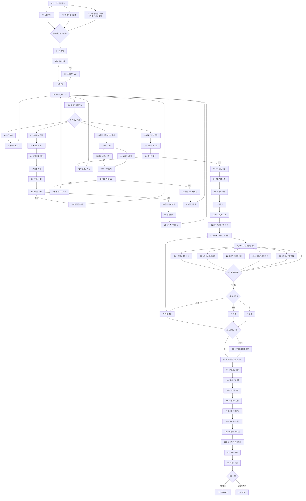
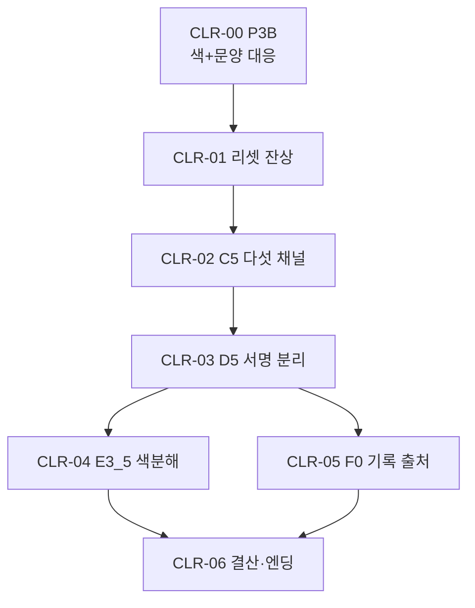
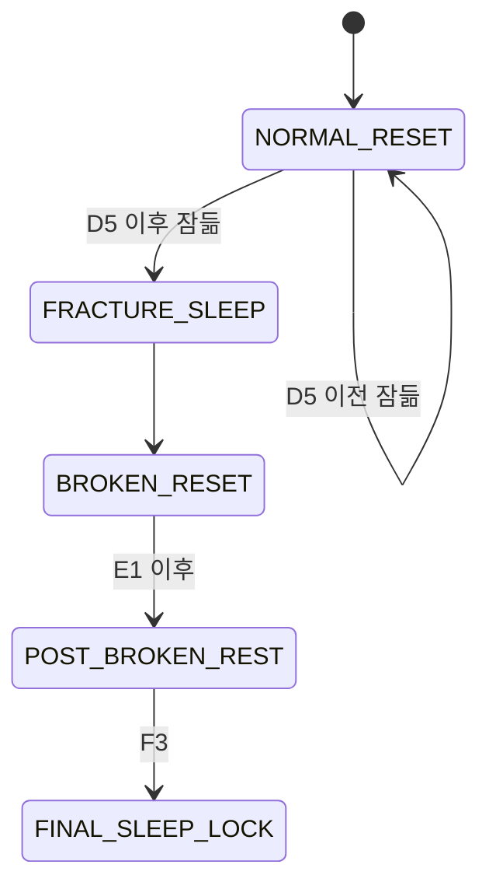

# GGB v0.4 전체 이벤트 흐름도

## 1. 전체 메인 흐름

## 2. ROUTE 우선순위

| 우선 | 조건 | 진입 |
| --- | --- | --- |
| 1 | BROKEN_RESET | E1 |
| 2 | J3 + D1 실패 | DSHORT → D1 |
| 3 | J3 | D0 |
| 4 | J2 + C4 실패 | CSHORT → C3 |
| 5 | J2 | C0 |
| 6 | J1 + B3 실패 | BSHORT → B3-B |
| 7 | J1 | B3-A |
| 8 | 표시 작성·미확인 | A2 |
| 9 | 표시 지속 미확인 | A1 |

P3B 완료 상태와 색상 서명 수첩 기록은 ROUTE를 변경하지 않는다.

## 3. 마라 2 흐름

- P3B는 필수.
- MARA2_S1, S2는 조건형 짧은 반응.
- E3_5는 선택형.
- 미완료 시 F0에 익명 아카이브 인덱스 제공.

## 4. 색상 기믹 흐름

## 5. 관계 이벤트 비필수 보장

| 상태 | 처리 |
| --- | --- |
| 핵심 이벤트 0명 | J4 기본, 에드가 최소 대면, F0 진행 |
| 마라 2 미완료 | 익명 보라 아카이브 인덱스 제공 |
| 에드가 미완료 | E3_4M 자동 발생 |
| 기록 2~4개 | J4 확장 |
| 기록 5개 | J4 완전 + 전원 결산 |

## 6. 수면 상태

