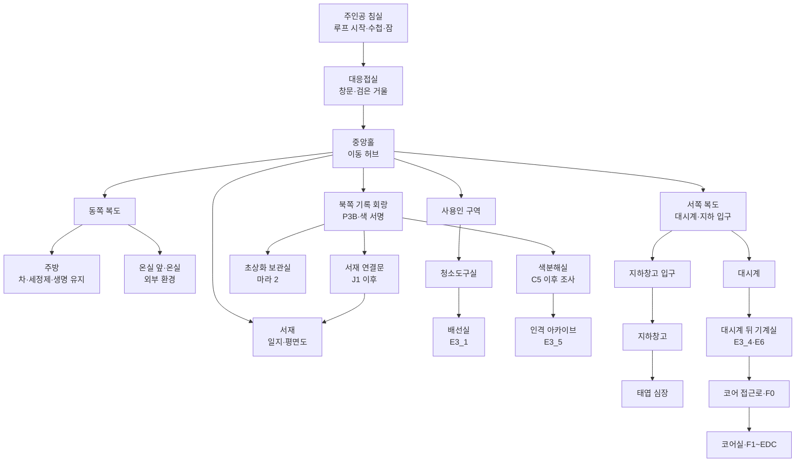
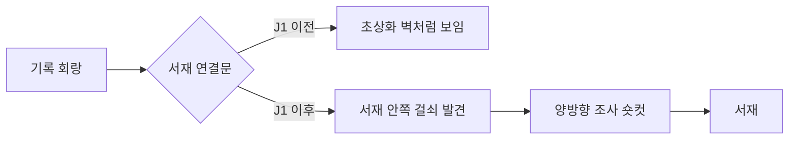

# GGB v0.4 공간 구성 지도 및 동선

## 1. 전체 지도



## 2. 공간 방향성

| 방향 | 기능 |
| --- | --- |
| 중앙 | 일상과 역할극 |
| 서쪽 | 시간, 보안, 지하 진실 |
| 동쪽 | 신체, 생명 유지, 외부 환경 |
| 북쪽 | 기록, 인격 출처, 기억 손상 |
| 지하 | 위장 필터 |
| 코어 | 책임과 선택 |

## 3. 북쪽 기록 회랑

### 기록 회랑

| 항목 | 내용 |
| --- | --- |
| 접근 | 프롤로그부터 |
| 기능 | P3B, 색·문양 튜토리얼, 마라 2 기본 동선 |
| 오브젝트 | 단체 초상화, 이름표 선반, 보라 러너, 기록 종 |
| D5 전 | 따뜻한 회랑과 정돈된 초상화 |
| D5 후 | 인격 인덱스와 데이터 프레임 노출 |

### 초상화 보관실

- 마라 2의 표층 작업실.
- 수정된 이름표와 삭제된 연구원 이름.
- MARA2_S1 발생.
- 반복 후 초상화 인물의 시선과 색 서명이 어긋남.

### 색분해실

| 상태 | 접근 |
| --- | --- |
| P~B | 잠긴 현상실. 문틈 조사만 가능 |
| C5 이후 | 외부 조사 가능, 색 필터 장치 확인 |
| BROKEN_RESET | 내부 진입 가능 |
| E3_5 완료 | 인격 아카이브 접근과 후속 대화 |

### 인격 아카이브

- 다섯 연구원 인격의 체크섬 보관.
- E3_5 전용 핵심 공간.
- 메인 진행 필수 자료는 익명 인덱스로 별도 보장.
- 완료 후 F0 RESIDENT 기록의 감정 정보 강화.

## 4. 서재 연결문 잠금

기록 회랑에서 서재로 이어지는 문은 B2를 우회할 수 없다.



- J1 이전에는 이동 핫스폿 없음.
- B2에서 일지를 복원한 뒤 서재 안쪽에서 걸쇠를 해제.
- 이후 기록 회랑과 서재 사이의 조사 왕복을 축약.
- 에드가의 B2 시간표 퍼즐은 최초 1회 유지.

## 5. 챕터별 동선

### 프롤로그

```text
침실
→ 대응접실 P2
→ 서재 P3
→ 기록 회랑 P3B
→ 주방 P4
→ 선택 온실 P5
→ 침실 P6
```

P2, P3, P3B는 원하는 순서로 수행한다.

### 1챕터

```text
침실 → 사용인 시간표 조사 → 서재 B2/J1
→ 저택 시계 탁본 → 서쪽 대시계 B3
→ 서재 B5/J2
```

### 2챕터

```text
대응접실 거울
→ 청소도구실·주방
→ 대응접실 C4/C5
→ 서재 D0/D0-A
→ 서쪽 복도 D1
→ 지하창고 D4/D5
```

C5 이후 색분해실 문에서 MARA2_S2를 볼 수 있으나 필수는 아니다.

### 3챕터

중앙홀 E_HUB에서 다섯 색 서명과 문양을 따라 선택형 이벤트로 이동한다.

| 사용인 | 경로 |
| --- | --- |
| 마라 1 | 사용인 구역→배선실 |
| 이리스 | 동쪽 복도→온실 |
| 루카 | 주방→생명 유지실 |
| 에드가 | 서쪽 대시계→기계실 |
| 마라 2 | 북쪽 회랑→색분해실→아카이브 |

### 4챕터

```text
대시계 기계실 E6
→ 코어 접근로 F0-A~E
→ 코어실 F1/J5/F2/F3
→ EDC
```

## 6. 잠금·해금 표

| 대상 | 초기 잠금 | 해금 |
| --- | --- | --- |
| 서재 일지 장기 조사 | 에드가 감시 | B1 시간표·B2 |
| 기록 회랑→서재 | 벽으로 위장 | J1 후 내부 걸쇠 |
| 검은 거울 | 코팅·에드가 | J2, C3, C4 |
| 색분해실 외부 조사 | 잠긴 현상실 | C5 |
| 색분해실 내부 | 역할 고정 | BROKEN_RESET |
| 인격 아카이브 | 체크섬 잠금 | E3_5 진행 |
| 지하창고 | 좌표·압력 장치 | J3, D0-A, D1 |
| 대시계 기계실 | 고딕 위장 | BROKEN_RESET |
| 코어 접근 | J4·에드가 권한 | E3_4 또는 E3_4M, E6 |

## 7. Godot Scene 권장

```text
res://scenes/mansion/
  bedroom.tscn
  parlor.tscn
  central_hall.tscn
  library.tscn
  west_hall.tscn
  kitchen.tscn
  greenhouse.tscn
  servant_quarters.tscn
  north_archive_hall.tscn
  portrait_storage.tscn
  color_separation_room.tscn
  personality_archive.tscn
  basement.tscn
  clock_machine_room.tscn
  core_path.tscn
  core_room.tscn
```

## 8. 공간 검증

- 기록 회랑 추가로 중앙홀 이동 선택지가 과도해지지 않게 북쪽 문을 시각적으로 구분.
- P3B 이후 반복 방문은 숏컷 제공.
- 색분해실과 서재 모두 기록 공간이지만, 전자는 인격 출처, 후자는 아버지 기록으로 기능 분리.
- 지하창고는 위장 해제, 코어는 최종 책임으로 기능 분리.
