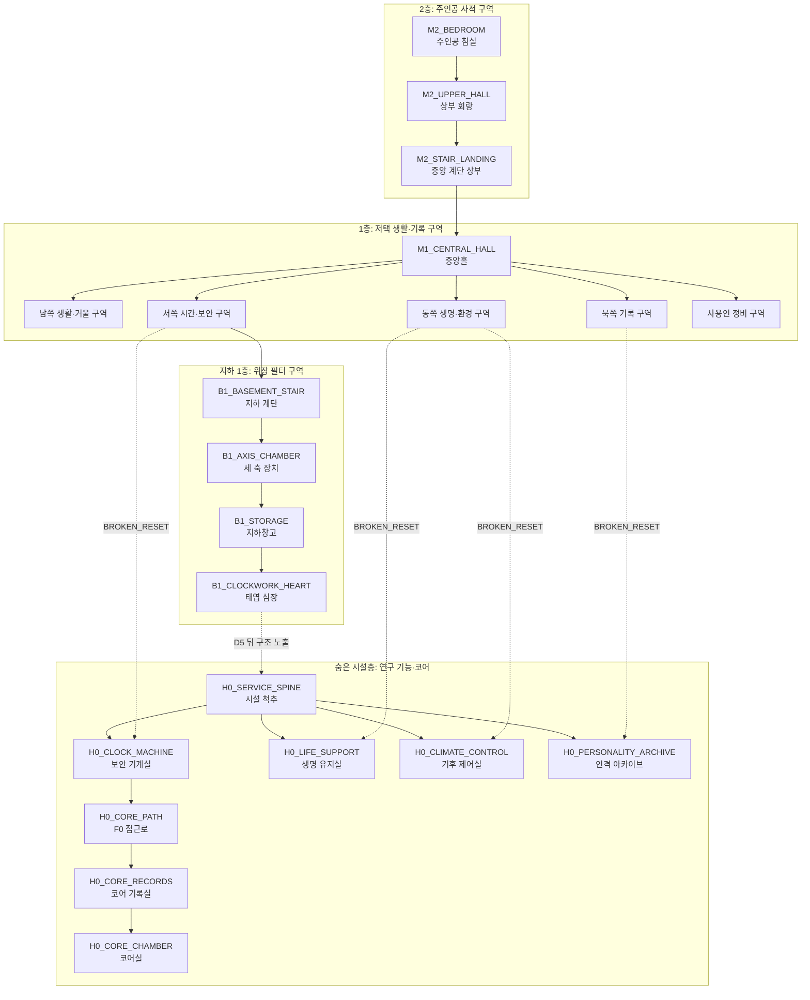
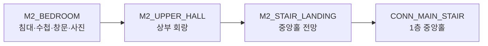
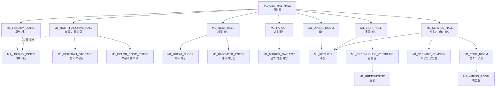
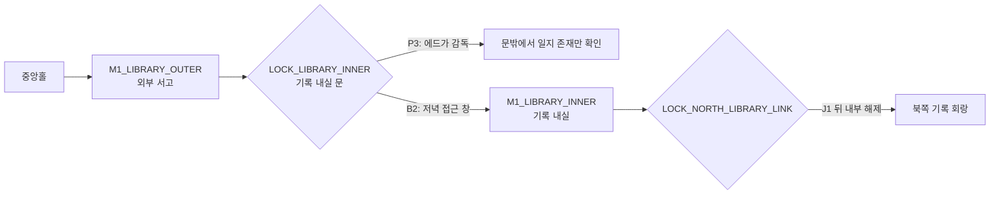
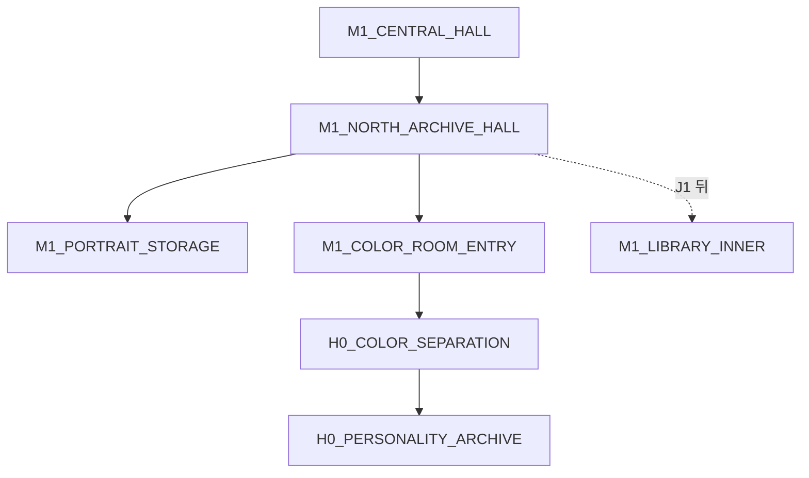
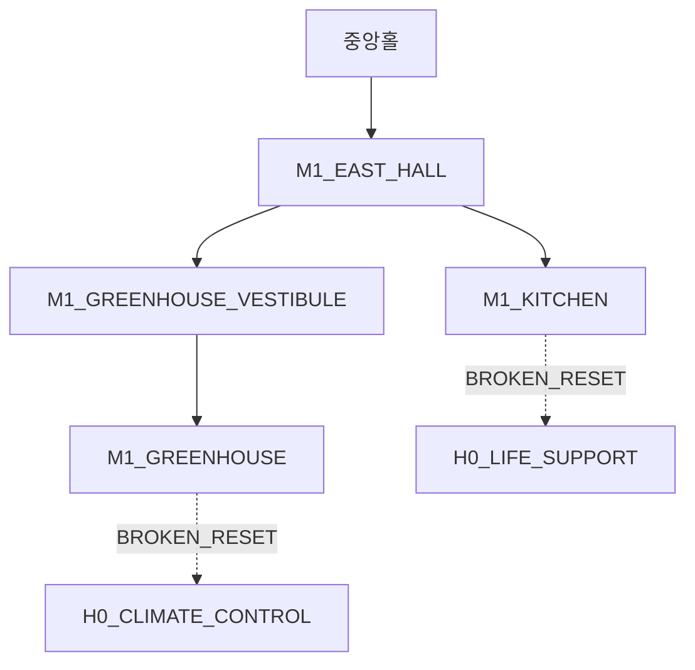
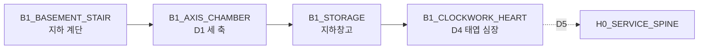
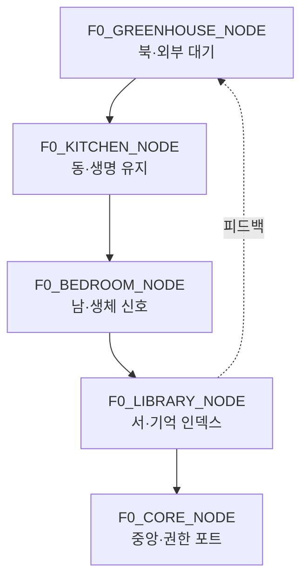
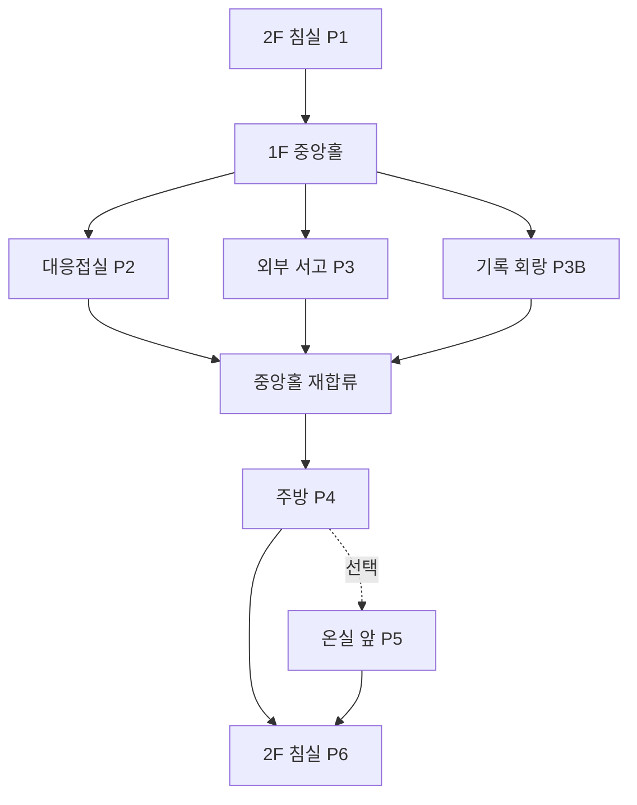

# GGB v0.4 공간 구성 지도 및 동선

## 1. 문서 목적

본 문서는 GGB의 저택과 현실 시설을 포인트 앤 클릭 장면 단위로 정의한다.

담당 범위:

- 2층, 1층, 지하 1층, 숨은 시설층의 공간 구조.
- 각 공간의 `location_id`, 출입구, 이벤트와 상태 변화.
- 프롤로그부터 엔딩까지의 필수·선택 동선.
- 최초 잠금, 영구 지식 숏컷, 반복 이동 축약.
- 사용인별 기본 위치·순찰·개입 지점.
- D5 전후 같은 공간의 고딕·SF 레이어.
- Godot 장면 분리와 이동 커넥터 기준.

본 문서는 퍼즐 정답보다 공간에서 무엇을 보고 어디로 이동하는지를 확정한다.

## 2. 확정 공간 구조

### 2.1 층 구성

| 층 | 기능 |
| --- | --- |
| 2층 | 주인공의 사적 공간·루프 시작 |
| 1층 | 생활·역할·기록·사용인 업무 |
| 지하 1층 | 저택 위장 필터와 물리 장치 |
| 숨은 시설층 | 연구 기능·메타퍼즐·코어 |

### 2.2 공간 방향성

| 방향 | 서사 기능 | 대표 공간 |
| --- | --- | --- |
| 위 | 주인공의 의식과 반복 출발 | 침실 |
| 중앙 | 역할극과 관계의 집결 | 중앙홀·식당 |
| 남 | 반사·금지·자기 인식 | 대응접실·거울 회랑 |
| 서 | 시간·보안·지하 진입 | 대시계·지하 계단 |
| 동 | 신체·생명·외부 환경 | 주방·온실 |
| 북 | 기록·이름·인격 출처 | 서재·기록 회랑 |
| 아래 | 위장 필터와 기계 실체 | 지하창고·태엽 심장 |
| 숨은 안쪽 | 연구 기능과 선택 권한 | 시설 척추·코어 |

## 3. 전체 수직 구조



숨은 시설층은 저택 아래에 정확히 평행한 단일 지하층이라기보다, 현실 시설의 점검 통로와 서버실을 저택 좌표에 투영한 기능 레이어다. D5 전에는 고딕 공간의 벽·가구·장식으로 가려진다.

## 4. 2층 지도



### 4.1 M2_BEDROOM: 주인공 침실

| 항목 | 내용 |
| --- | --- |
| 층 | 2층 |
| 기능 | 루프 시작·수면·수첩·SUBJECT 신체 암시 |
| 이벤트 | P1, P6, A1, A2, E1 |
| 사용인 | 에드가, 조건부 루카 |
| 출입구 | 상부 회랑 |
| 주요 오브젝트 | 침대, 침실 창문, 수첩, 아버지 사진, 호출끈, 침실 시계 |
| 이동 기준 | 조사 완료 뒤 문 활성 |

공간 구분:

- 침실 창문은 P1 조사 전용이다.
- P2의 실제 창문 닦기는 1층 대응접실에서 진행한다.
- 침실 시계는 B3-A 탁본 대상이며 시계망과 단절되어 있다.

상태 변화:

| 상태 | 표현 |
| --- | --- |
| S0 | 따뜻한 침대, 고정된 아침빛, 같은 새 |
| S1 | 매트리스 함몰·새 궤도·빛 각도가 정확히 반복 |
| S2 | 침대 천 아래 캡슐 곡면과 약한 팬 진동 |
| S3 | 냉각 캡슐 고정구와 창밖 배경 레이어 노출 |
| S4 | `SUBJECT REST INTERFACE`와 생체 신호 |

### 4.2 M2_UPPER_HALL: 상부 회랑

| 항목 | 내용 |
| --- | --- |
| 기능 | 침실과 중앙 계단 사이 완충 장면 |
| 이벤트 | 아침 첫 이동, P6 귀환, 일부 에드가 반응 |
| 오브젝트 | 난간, 가족 초상, 꺼진 벽등, 복도 시계 |
| 출입구 | 침실, 계단 상부 |

설계 역할:

- 첫 루프에는 저택 규모와 중앙홀을 위에서 보여 준다.
- 반복 루프에는 2~4초 이동 몽타주로 축약한다.
- 사용인 대화가 대기 중이면 난간 앞에서 자동 정지한다.

### 4.3 M2_STAIR_LANDING: 중앙 계단 상부

- 중앙홀의 다섯 방향 출입구를 처음 보여 주는 전망점.
- P1 완료 전에는 아래층 이동만 가능하고 지도 UI는 비활성.
- 첫 하강 뒤 `M1_CENTRAL_HALL`이 이동 허브로 등록된다.
- D5 이후 계단 아래 구조가 저택 바닥이 아니라 시설 격자로 이어지는 착시를 보인다.

## 5. 1층 전체 지도



## 6. 중앙·남쪽 공간

### 6.1 M1_CENTRAL_HALL: 중앙홀

| 항목 | 내용 |
| --- | --- |
| 기능 | 1층 이동 허브, 사용인 집결, E_HUB |
| 이벤트 | 일과 선택, E2_INTRO, E_HUB, 일부 E5 도입 |
| 출입구 | 중앙 계단, 남·서·동·북·서재·식당·사용인 복도 |
| 오브젝트 | 저택 지도, 대형 샹들리에, 호출끈, 방향 문장 |
| 기본 체류 사용인 | 에드가 |

출구 인지:

| 방향 | 문양·감각 |
| --- | --- |
| 남쪽 대응접실 | 넓은 창빛과 천 마찰음 |
| 서쪽 복도 | 낮은 시계음과 수직 홈 |
| 동쪽 복도 | 차 향과 유리 바람음 |
| 북쪽 기록 회랑 | 액자 반복과 빠른 3음 |
| 서재 | 종이 냄새와 멈춘 벽시계 |
| 사용인 복도 | 금속 공구음 |

### 6.2 M1_PARLOR: 대응접실

| 항목 | 내용 |
| --- | --- |
| 기능 | P2 창문 닦기, B3 기준 시계, 거울 회랑 전실 |
| 이벤트 | P2, B3-A 탁본 |
| 사용인 | 마라 1, 조건부 에드가 |
| 오브젝트 | 세 개의 큰 창, 대응접실 괘종시계, 응접 의자, 남쪽 이중문 |
| 출입구 | 중앙홀, 거울 회랑 |

P2 확정:

- 대응접실의 세 창을 닦는다.
- 침실 창문은 P2 대상이 아니다.
- 마라 1의 주황 대각 닦임 문양을 처음 확인한다.

동선 역할:

- 프롤로그에서 중앙홀과 가까운 가장 쉬운 과업.
- C구간에는 같은 방 남쪽 문이 금지 공간으로 이어져 익숙한 공간이 불안한 전실로 바뀐다.

### 6.3 M1_MIRROR_GALLERY: 남쪽 거울 회랑

| 항목 | 내용 |
| --- | --- |
| 기능 | 검은 거울, C0~C5 |
| 이벤트 | C0, C1, C4, C5, EDGAR_S2 |
| 사용인 | 에드가, 조건부 마라 1·루카 |
| 오브젝트 | 검은 거울, 얇은 보조 거울, 청소대, 진동점 |
| 출입구 | 대응접실 하나 |

공간 배치:

```text
[대응접실 이중문]
        ↓
[얇은 보조 거울 3개]
        ↓
[청소대·마른 천 시험 지점]
        ↓
[검은 거울]
```

단일 출입구를 사용해 C4의 긴장과 에드가의 길 막기 연출을 강화한다. 그러나 에드가의 제지가 소진되거나 우회 조건이 충족되면 반드시 진입할 수 있다.

상태 변화:

| 상태 | 표현 |
| --- | --- |
| S0 | 남쪽 문이 닫혀 있고 복도는 청소 금지 구역 |
| S1 | 보조 거울 반사가 반 박자 늦음 |
| S2 | 검은 코팅 아래 회로·냉각 실루엣 |
| S3 | 거울이 데이터 입출력막으로 노출 |
| S4 | F0-C 자료를 호출하는 원격 패널 |

### 6.4 M1_DINING_ROOM: 식당

| 항목 | 내용 |
| --- | --- |
| 기능 | 일상의 위계, E5 결산, 잔류 엔딩 구도 |
| 이벤트 | 일부 P4 연출, E5, ED_STAY |
| 오브젝트 | 긴 식탁, 주인공 정면석, 다섯 사용인 자리, 서비스 문 |
| 출입구 | 중앙홀, 주방 |

관계 단계:

- LOW: 주인공만 앉고 사용인은 업무 위치에 선다.
- MID: 완료한 일부 사용인이 앉는다.
- HIGH: 네 명의 관계 완료 상태가 자리 배치에 반영된다.
- ALL: 다섯 사용인이 서로의 이름과 서명을 확인하고 모두 앉는다.

## 7. 서재 이중 구조

### 7.1 구조



### 7.2 M1_LIBRARY_OUTER: 외부 서고

| 항목 | 내용 |
| --- | --- |
| 기능 | 일반 장서, P3 책 정리, 서재 기능 학습 |
| 이벤트 | P3, B3-A 일부 탁본 |
| 사용인 | P3 에드가 감독, 마라 2 기록 반출 |
| 오브젝트 | 공개 책장, 분류대, 멈춘 벽시계, 기록 내실 유리문 |
| 출입구 | 중앙홀, 기록 내실 |

P3:

- 플레이어는 외부 서고에 정상적으로 들어간다.
- 문양·높이에 맞춰 책을 정리한다.
- 기록 내실 유리 너머 또는 반납 슬롯 안쪽에서 아버지의 일지를 발견한다.
- 일지를 완전히 열거나 기록 내실 책상에 접근할 수 없다.
- 에드가의 감독과 잠금 장치가 동시에 존재한다.

### 7.3 M1_LIBRARY_INNER: 기록 내실

| 항목 | 내용 |
| --- | --- |
| 기능 | 일지 복원, 평면도, 북쪽 연결문 |
| 이벤트 | B2, J1, B5, J2, D0, D0-A, J4 |
| 사용인 | B2 전 에드가, 기록 반출 시 마라 2 |
| 오브젝트 | 일지 책상, 이중 바닥, 도면 작업대, 연결문 걸쇠, 기록 시계, 점검 벽감 |
| 출입구 | 외부 서고, 북쪽 기록 회랑 숨은 문 |

B2의 의미:

- 서재 건물에 처음 들어가는 사건이 아니다.
- 기록 내실에 처음으로 무감시 심층 접근하는 사건이다.
- B1 시간표로 에드가와 마라 2의 빈 시간을 계산한다.
- 일지를 책상에 놓고 J1 복원을 실행한다.
- 큰 소리, 반복 조사, 금지 책장 접촉으로 주의도가 오르면 에드가가 진입할 수 있다.
- 에드가에게 발견되어도 실패하지 않고, 짧은 대화 뒤 다시 J1로 합류한다.

점검 벽감:

| 항목 | 내용 |
| --- | --- |
| object_id | `OBJ_LIBRARY_SERVICE_ALCOVE` |
| 위치 | 기록 내실 북서쪽 벨벳 커튼 뒤 |
| 기능 | B2_HIDE 은신, 에드가 진입 동선 관찰 |
| 해금 | B2 중 커튼·바닥 흠집·찬 공기 조사 |
| 리셋 | 물리 위치는 유지, 발견 상태는 `library_service_alcove_known`으로 영구 저장 |

벽감은 실패 회피용 정답이 아니라 압박 연출의 선택 경로다. 숨지 않아도 `B2_CAUGHT` 대화로 진행하며, 어떤 경우에도 J1 접근은 막지 않는다.

### 7.4 LOCK_LIBRARY_INNER

| 단계 | 상태 |
| --- | --- |
| P3 | 에드가 감독, 내실 유리문 잠금 |
| A~B1 | 문은 보이지만 장기 조사 불가 |
| B2 | 저녁 접근 창에 잠금 해제 가능 |
| J1 이후 | 지식 숏컷으로 접근 절차 축약 |
| D5 이후 | 유리문이 기록 권한 프레임으로 노출 |

### 7.5 LOCK_NORTH_LIBRARY_LINK

최초:

1. B2로 기록 내실에 들어간다.
2. J1 복원 뒤 책상 뒤 초상화 패널을 조사한다.
3. 안쪽 걸쇠를 해제한다.
4. 북쪽 기록 회랑과 연결된다.

정상 리셋 뒤:

- 물리 걸쇠는 초기 상태로 돌아간다.
- `library_link_fast_path` 지식이 유지된다.
- 주인공은 북쪽 액자 뒤 숨은 압력점을 알아 빠르게 다시 열 수 있다.
- B2의 시간표 추론을 다시 플레이하지 않는다.

이 구조는 북쪽 기록 회랑에서 B2를 우회하지 않으면서도 후속 왕복을 줄인다.

## 8. 북쪽 기록 구역



### 8.1 M1_NORTH_ARCHIVE_HALL: 기록 회랑

| 항목 | 내용 |
| --- | --- |
| 기능 | P3B, 이름·문양 학습, 마라 2 기본 동선 |
| 이벤트 | P3B, MARA2_FU, 일부 MARA2 반응 |
| 사용인 | 마라 2 |
| 오브젝트 | 이름표 선반, 단체 초상, 기록 종, 보라 러너 |
| 출입구 | 중앙홀, 초상화 보관실, 색분해실 외부, 서재 숨은 문 |

상태 변화:

| 상태 | 표현 |
| --- | --- |
| S0 | 정돈된 액자와 따뜻한 벽등 |
| S1 | 이름표와 액자 순서가 초기화되지만 마라 2가 기억 |
| S2 | 보라 이중 윤곽 일부 누락 |
| S3 | 초상화가 인격 인덱스와 체크섬으로 분리 |
| S4 | RESIDENT 기록 출처를 원격 표시 |

### 8.2 M1_PORTRAIT_STORAGE: 초상화 보관실

| 항목 | 내용 |
| --- | --- |
| 기능 | 마라 2의 표층 작업실, 반복 기억 암시 |
| 이벤트 | MARA2_S1, E3_5 입력 초상화 확보 |
| 오브젝트 | 단체 초상화 3장, 빈 액자, 긁힌 이름표 |
| 출입구 | 기록 회랑 |

공간 감각:

- 종이와 바니시 향 사이에 미세한 오존 냄새.
- 액자를 옮길 때 실제 무게보다 늦게 그림자가 따라옴.
- 색 제거 모드에서는 액자 테두리 홈과 3음 리듬으로 출처를 구분.

### 8.3 M1_COLOR_ROOM_ENTRY: 색분해실 외부

| 단계 | 접근 |
| --- | --- |
| P~B | 잠긴 현상실처럼 보이며 배경 조사만 가능 |
| C5 이후 | 외부 렌즈·필터판·다섯 채널 조사 |
| MARA2_S2 | 보라 채널 길이 비교 |
| BROKEN_RESET 이후 | 문이 데이터 프레임으로 변해 내부 진입 |

### 8.4 H0_COLOR_SEPARATION: 색분해실 내부

| 항목 | 내용 |
| --- | --- |
| 층 | 숨은 시설층과 겹치는 1층 좌표 |
| 기능 | E3_5 색·문양·음향 분리 |
| 이벤트 | E3_5 전반 |
| 오브젝트 | 필터 휠, 파형 패널, 초상화 슬롯, 체크섬 표시 |
| 출입구 | 기록 회랑 외부문, 인격 아카이브 |

### 8.5 H0_PERSONALITY_ARCHIVE: 인격 아카이브

| 항목 | 내용 |
| --- | --- |
| 기능 | 원본·손상 사본·분산 조각 대조 |
| 이벤트 | E3_5 후반, REC_MARA2 |
| 접근 | E3_5에서 보라 조각과 체크섬 확인 뒤 |
| 미완료 처리 | 익명 연구원 인덱스는 E2_INTRO에서 별도 제공 |

인격 아카이브는 메인 진행의 필수 통로가 아니다. E3_5를 건너뛰어도 코어 접근이 가능하다.

## 9. 서쪽 시간·지하 구역

### 9.1 M1_WEST_HALL: 서쪽 복도

| 항목 | 내용 |
| --- | --- |
| 기능 | 대시계와 지하 입구 연결 |
| 이벤트 | B3 이동, D1 진입, 일부 에드가 개입 |
| 사용인 | 에드가 순찰, 마라 1 정비 |
| 오브젝트 | 점검 장부, 수직 잠금선, 지하 계단문 |
| 출입구 | 중앙홀, 대시계실, 지하 계단 |

첫 방문에는 복도 중간에 한 번의 방향 전환 장면을 둔다. 반복에는 중앙홀에서 대시계·지하 중 목적지를 선택해 3~6초 몽타주로 축약한다.

### 9.2 M1_GREAT_CLOCK: 대시계실

| 항목 | 내용 |
| --- | --- |
| 기능 | B3 출력 장치, 에드가 보안 권한, 숨은 기계실 입구 |
| 이벤트 | B3-A, B3-B, B4, E3_4 진입, E6 |
| 오브젝트 | 종 없는 대시계, 점검함, XIII 홈, 레이피어 권한 홈 |
| 출입구 | 서쪽 복도, D5 후 기계실 |

상태 변화:

| 상태 | 표현 |
| --- | --- |
| S0 | 장식용 대시계 |
| S1 | 종 없이 배선 진동만 남음 |
| S2 | XIII 홈과 남색 잠금선 |
| S3 | 시계 외피가 보안 기계실 문으로 분리 |
| S4 | 코어 접근 권한 허브 |

### 9.3 M1_BASEMENT_ENTRY: 지하 계단문

- J3 전에는 와인 저장고 문처럼 보인다.
- D0-A 완료 뒤 세 축 장치 위치와 대응한다.
- D1 실패 시 압력핀이 내려가 당일 잠긴다.
- D1 성공 뒤 D2 지식 숏컷을 획득한다.

## 10. 동쪽 생명·환경 구역



### 10.1 M1_EAST_HALL: 동쪽 복도

| 항목 | 내용 |
| --- | --- |
| 기능 | 주방·온실 분기 |
| 감각 | 주방의 온기와 온실의 차가운 유리음이 반대 방향 |
| 사용인 | 루카, 이리스 |
| 반복 | 목적지 학습 뒤 분기 선택 축약 |

### 10.2 M1_KITCHEN: 주방

| 항목 | 내용 |
| --- | --- |
| 기능 | P4 차, C2-1 약품, C3 제조, 생명 유지 위장 |
| 이벤트 | P4, LUCA_S1, C2-1, C3, E3_3 진입 |
| 사용인 | 루카 |
| 오브젝트 | 차 도구, 약품장, 조합대, 식품 저장고, 하부 배관 |
| 출입구 | 동쪽 복도, 식당, 사용인 복도, D5 후 생명 유지실 |

동선:

- 프롤로그에는 차 도구만 강조.
- C구간에는 약품장과 조합대 활성.
- S2에는 바닥 아래 유체관 그림자.
- S3에는 저장고 뒤 생명 유지실 입구 노출.

### 10.3 H0_LIFE_SUPPORT: 생명 유지실

| 항목 | 내용 |
| --- | --- |
| 기능 | 주인공 냉각·영양·맥박 연결 |
| 이벤트 | LUCA_S2 일부, E3_3 |
| 접근 | BROKEN_RESET, E_HUB |
| 오브젝트 | 검정 주관, 연두 보조관, 안전 밸브, 캡슐 원격 패널 |

생명 유지실은 주방 바로 아래의 지하실처럼 보이지만 실제로는 침실 냉각 장치와 시설 배관을 연결하는 숨은 기능층이다.

### 10.4 M1_GREENHOUSE_VESTIBULE: 온실 앞

| 항목 | 내용 |
| --- | --- |
| 기능 | P5 잠긴 온실과 날씨 모순 |
| 이벤트 | P5, IRIS_S1 |
| 오브젝트 | 잠긴 유리문, 실내 빗소리, 계절 안내판 |
| 출입구 | 동쪽 복도, 온실 |

P5에서는 온실 내부가 완전히 해금되지 않아도 문과 창을 통해 날씨 모순을 조사할 수 있다.

### 10.5 M1_GREENHOUSE: 온실

| 항목 | 내용 |
| --- | --- |
| 기능 | 외부 환경 연출과 이리스의 그리움 |
| 이벤트 | IRIS_S2, E3_2 진입 |
| 사용인 | 이리스 |
| 오브젝트 | 광섬유 뿌리, 계절 화단, 외부 센서 유리, 플라스틱 날개 충전대 |

### 10.6 H0_CLIMATE_CONTROL: 기후 제어실

| 항목 | 내용 |
| --- | --- |
| 기능 | 환경 센서와 가짜 계절 분리 |
| 이벤트 | E3_2 |
| 접근 | BROKEN_RESET, E_HUB |
| 오브젝트 | 온도·습도·광량 센서, 전력 전용 로그, 환경 모델 |

## 11. 사용인 정비 구역

### 11.1 M1_SERVICE_HALL: 사용인 정비 복도

| 항목 | 내용 |
| --- | --- |
| 기능 | 공용실·청소도구실·주방 서비스 연결 |
| 사용인 | 마라 1, 루카, 조건부 에드가 |
| 이벤트 | 시간표 조사 일부, C1 이동, E3_1 진입 |
| 출입구 | 중앙홀, 공용실, 도구실, 주방 |

### 11.2 M1_SERVANT_COMMON: 사용인 공용실

- 사용인 시간표, 업무 장부, 호출 기록을 조사한다.
- 관계 이벤트의 사적 대화는 각 사용인의 주 공간에서 진행한다.

### 11.3 M1_TOOL_ROOM: 청소도구실

| 항목 | 내용 |
| --- | --- |
| 기능 | C1·C2, 마라 1의 표층 작업실 |
| 오브젝트 | 천, 솔, 코팅 기록, 스패너 걸이 |
| 출입구 | 사용인 복도, 배선실 |

### 11.4 M1_WIRING_ROOM: 배선실

| 항목 | 내용 |
| --- | --- |
| 기능 | 저택 표층 배선과 삭제 로그 |
| 이벤트 | E3_1 |
| 접근 | D5 전 점검문만 조사, BROKEN_RESET 후 내부 |
| 오브젝트 | 주황 피복선, 삭제 로그 패널, 정비 스패너 슬롯 |

## 12. 지하 1층



### 12.1 B1_BASEMENT_STAIR: 지하 계단

- D1 실패 뒤 잠긴 장치까지 접근은 가능하지만 입력은 불가.

### 12.2 B1_AXIS_CHAMBER: 세 축 장치실

| 항목 | 내용 |
| --- | --- |
| 기능 | D1 직선·분기·환형 축 |
| 이벤트 | D1, DF |
| 오브젝트 | 세 축, 깊이 홈, 중앙 손잡이, 압력핀 |
| 실패 | 압력핀 하강·당일 잠금 |
| 성공 | 지하창고 문 개방, D2 |

### 12.3 B1_STORAGE: 지하창고

| 항목 | 내용 |
| --- | --- |
| 기능 | 고딕 소품과 시설 부품의 중간층 |
| 이벤트 | D2 이후 탐색, D4 진입 |
| 오브젝트 | 빈 와인통, 케이블 릴, 위장 필터 부품, 낙서 조각 |

공간은 처음에는 넓은 창고처럼 보이지만 같은 선반이 반복된다. 반복 구조의 중심을 찾으면 태엽 심장실 문이 나타난다.

### 12.4 B1_CLOCKWORK_HEART: 태엽 심장실

| 항목 | 내용 |
| --- | --- |
| 기능 | D4 연동 링, D5 위장 필터 해제 |
| 이벤트 | D4, D5 |
| 오브젝트 | 외곽·중간·안쪽 링, A·B·C 손잡이, XII 레버, 숨은 +1 |
| 출입구 | 지하창고, D5 뒤 시설 척추 잔상 |

D5 뒤 이 공간은 거대한 태엽실이 아니라 위장 필터 제어 장치의 외피였음이 드러난다.

## 13. 숨은 시설층

### 13.1 H0_SERVICE_SPINE: 시설 척추

시설 기능실을 연결하는 점검 통로다.

접근 규칙:

- D5 전: 저택 벽과 바닥에 완전히 숨음.
- BROKEN_RESET: 각 사용인의 주 공간에서 해당 기능실로 진입.
- E_HUB: 중앙홀 지도에서 목적지를 고르면 저택 공간과 기능실을 한 번의 동선으로 연결.
- E6 전: 코어 접근문은 잠김.

시설 척추를 자유 탐색 가능한 긴 복도로 만들지 않는다. E구간에서 선택한 사용인 목적지까지 5~10초의 전환 장면으로 사용한다.

### 13.2 H0_CLOCK_MACHINE: 대시계 보안 기계실

| 항목 | 내용 |
| --- | --- |
| 기능 | 에드가 보안 권한, 코어 접근 |
| 이벤트 | E3_4, E3_4M, E6 |
| 접근 | BROKEN_RESET 뒤 대시계 외피 해제 |
| 출입구 | 대시계실, 시설 척추, E6 뒤 코어 접근로 |

### 13.3 H0_CORE_PATH: F0 접근로

F0는 단순한 복도가 아니라 저택의 네 핵심 방이 깨진 데이터 방으로 재배치된 원형 공간이다.



F0 하위 공간:

| ID | F0 단계 | 기능 |
| --- | --- | --- |
| F0_RING_ENTRY | 진입 | 네 방 타일 확인 |
| F0_ROOM_NETWORK | F0-A | 방 피드백 회로 |
| F0_SYSTEM_SAMPLES | F0-B | 현실 유지 표본 |
| F0_OVERLAY_TABLE | F0-C | B4·C5·D4 중첩 |
| F0_RECORD_ROLES | F0-D | 기록 역할 분류 |
| F0_SUBJECT_DESK | F0-E | 수첩·현재 선택 인증 |

각 단계는 같은 원형 장면의 카메라 구역으로 구현할 수 있다. 저사양 모드나 모바일 UI가 필요하면 별도 장면으로 분할한다.

### 13.4 H0_CORE_RECORDS: 코어 기록실

| 항목 | 내용 |
| --- | --- |
| 기능 | F1 아버지 기록, J5 |
| 오브젝트 | 마지막 로그, 답을 적지 않은 페이지, 연구원 인덱스 |
| 출입구 | F0 접근로, 코어실 |

### 13.5 H0_CORE_CHAMBER: 코어실

| 항목 | 내용 |
| --- | --- |
| 기능 | F2, F3, EDC |
| 오브젝트 | 냉각 기상 장치, 루프 안정화 장치, SUBJECT 수첩대 |
| 사용인 | F2에서 다섯 연구원 인격 |
| 출입구 | 코어 기록실 |

배치:

```text
[코어 기록실 입구]
        ↓
[사용인 투사 위치 5개]
        ↓
[SUBJECT 수첩대]
   ↙             ↘
[기상 장치]   [안정화 장치]
```

두 엔딩 장치는 거리, 크기, 밝기에서 동등하게 배치한다. 현실을 밝은 문, 잔류를 어두운 문으로 단순 가치 부여하지 않는다.

## 14. 챕터별 필수 동선

### 14.1 프롤로그



P2·P3·P3B는 원하는 순서로 수행한다. 중앙홀을 매번 수동으로 전부 가로지르지 않도록 첫 과업 완료 뒤 목적지 선택 UI를 제공할 수 있다.

### 14.2 A~B

```text
침실 A1·A2
→ 중앙홀·사용인 구역 B1
→ 외부 서고
→ 기록 내실 B2·J1
→ 침실·대응접실·서재·대시계 탁본
→ 대시계 B3·B4
→ 기록 내실 B5·J2
```

B3-A 권장 탁본 순서:

1. 2층 침실 시계.
2. 1층 대응접실 기준 시계.
3. 외부 서고 벽시계.
4. 서쪽 대시계 점검함.

순서는 강제하지 않는다.

### 14.3 C

```text
대응접실
→ 남쪽 거울 회랑 C0
→ 사용인 복도·청소도구실 C2
→ 주방 약품장 C2-1
→ 주방 조합대 C3
→ 거울 회랑 C4·C5
→ 기록 내실 J3
```

CSHORT:

- 중앙홀에서 청소도구실과 주방 확보를 몽타주로 처리.
- 주방 C3부터 직접 조작.
- 거울 회랑 실제 닦기는 축약하지 않음.

### 14.4 D

```text
기록 내실 D0·D0-A
→ 중앙홀
→ 서쪽 복도
→ 지하 계단
→ 세 축 장치 D1
→ 지하창고 D2
→ 태엽 심장 D4·D5
```

DSHORT:

- 서재 단서 재독 요약.
- 중앙홀→지하 계단 이동 몽타주.
- 미검증 축부터 조작권 반환.

### 14.5 E

E_HUB 선택:

| 사용인 | 저택 출발 공간 | 기능실 | 이동 |
| --- | --- | --- | --- |
| 마라 1 | 사용인 복도·도구실 | 배선실 | 1~2 전환 |
| 이리스 | 온실 | 기후 제어실 | 2 전환 |
| 루카 | 주방 | 생명 유지실 | 2 전환 |
| 에드가 | 대시계실 | 보안 기계실 | 2 전환 |
| 마라 2 | 기록 회랑·색분해실 | 인격 아카이브 | 2~3 전환 |

관계 이벤트 완료 뒤 중앙홀로 실제 도보 복귀를 강제하지 않는다. 결과 연출 뒤 E_HUB 지도로 돌아간다.

### 14.6 F

```text
대시계실
→ 보안 기계실 E6
→ F0 원형 접근로
→ 코어 기록실 F1·J5
→ 코어실 F2·F3·EDC
```

F구간은 일방향 긴장 구간이다. E6 진입 전 미완료 관계 이벤트와 예상 시간을 명시한다.

## 15. 잠금·해금 레지스트리

| ID | 대상 | 초기 상태 | 최초 해금 | 반복 처리 |
| --- | --- | --- | --- | --- |
| LOCK_LIBRARY_INNER | 기록 내실 | P3 감독·잠금 | B1 시간표+B2 | 접근 절차 축약 |
| LOCK_NORTH_LIBRARY_LINK | 북쪽↔내실 | 벽·안쪽 걸쇠 | J1 뒤 내부 해제 | 숨은 압력점 지식 |
| LOCK_MIRROR_GALLERY | 검은 거울 조사 | 남쪽 문·금지 | J2+C0 | 접근 가능, 코팅 유지 |
| LOCK_MIRROR_SURFACE | 거울 회로 | 검은 코팅 | C3+C4 성공 | C5 영구 지식 |
| LOCK_COLOR_EXT | 색분해실 외부 | 배경 문 | C5 | 외부 패널 조사 |
| LOCK_COLOR_INT | 색분해실 내부 | 역할 고정 | BROKEN_RESET | E3_5 선택 |
| LOCK_ARCHIVE | 인격 아카이브 | 체크섬 | E3_5 진행 | 보존 결과 유지 |
| LOCK_BASEMENT | 세 축 장치 | 좌표 미확인 | D0-A+D1 | DSHORT |
| LOCK_CLOCK_MACHINE | 보안 기계실 | 대시계 외피 | BROKEN_RESET | E3_4·E3_4M |
| LOCK_LIFE_SUPPORT | 생명 유지실 | 주방 위장 | BROKEN_RESET | E3_3 |
| LOCK_CLIMATE_CONTROL | 기후 제어실 | 온실 위장 | BROKEN_RESET | E3_2 |
| LOCK_WIRING_ROOM | 배선실 심층 | 정비 패널 | BROKEN_RESET | E3_1 |
| LOCK_CORE | F0 접근 | 권한 잠금 | `J4 완료 && (E3_4 완료 || E3_4M 완료)` 뒤 E6 | 일방향 진입 |

관계 수치만으로 잠금이 영구 유지되는 문은 없다.

## 16. 이동 비용과 축약

### 16.1 장면 전환 기준

| 전환 | 최초 | 반복 |
| --- | --- | --- |
| 같은 층 인접 방 | 4~8초 | 1~3초 |
| 중앙홀을 가로지르는 목적지 | 8~15초 | 3~6초 |
| 2층↔1층 | 10~18초 | 3~6초 |
| 1층↔지하 1층 | 12~20초 | 4~7초 |
| 저택↔숨은 기능실 | 8~15초 | 5~10초 |

### 16.2 축약 조건

- 해당 경로를 최소 한 번 직접 이동.
- 경로 안의 미확인 이벤트 없음.
- 사용인 개입이 대기 중이지 않음.
- 새 글리치·색상 이상 없음.
- 플레이어가 직접 이동을 선택하지 않음.

### 16.3 최대 왕복 목표

| 구간 | 핵심 퍼즐 전 최대 장면 전환 |
| --- | --- |
| 프롤로그 각 일과 | 중앙홀 기준 2회 |
| B3-A 탁본 전체 | 8~10회 |
| C3 준비 | 6~8회 |
| C4 재시도 | CSHORT 뒤 3~5회 |
| D1 재시도 | DSHORT 뒤 3~4회 |
| E3 단일 관계 | 2~3회 |

## 17. 사용인 동선

사용인 위치는 무작위가 아니다. 시간표와 이벤트 상태로 결정한다.

### 17.1 에드가

```text
아침: 2층 침실 → 중앙홀
낮: 외부 서고 → 중앙홀
저녁: 서쪽 복도 → 대시계
수면 전: 중앙홀 → 2층 침실
```

개입 지점:

- 기록 내실 문.
- 기록 내실 북서쪽 점검 벽감 앞 커튼.
- 거울 회랑 입구.
- 서쪽 복도·지하 계단.
- 대시계 권한 홈.

B2에서 에드가는 외부 서고 쪽 문으로 들어온다. alert가 높으면 문고리를 바로 돌리지 않고 한 번 멈춰 서며, 낮으면 책 반납을 확인하듯 짧게 둘러본다. 플레이어가 벽감에 숨어 있으면 12~20초 정도 내실을 점검한 뒤 퇴장한다.

### 17.2 마라 1

```text
아침: 대응접실
낮: 사용인 복도 → 청소도구실
저녁: 서쪽 복도 정비벽
```

귀와 꼬리 센서는 설비음을 감지하지만 다른 층의 행동을 자동으로 알지 못한다.

### 17.3 루카

```text
아침: 주방
낮: 주방 → 약품장 → 침실 보조 확인
저녁: 식당 서비스 문 → 주방
```

생체 경고가 있을 때만 침실·거울 회랑 근처로 이동한다.

### 17.4 이리스

```text
아침: 온실
낮: 온실 앞 → 온실
저녁: 기후 장치 점검
```

D5 전에는 중앙홀에 자주 나오지 않는다. 포근한 인상과 고립된 적의가 동시에 유지되도록 자기 공간에서 주로 만난다.

### 17.5 마라 2

```text
아침: 기록 회랑 → 초상화 보관실
낮: 기록 회랑 → 외부 서고 기록 반출
저녁: 색분해실 외부
```

기록 내실에 들어가는 시간은 B1 시간표 단서가 되며 B2 접근 창 계산에 포함된다.

## 18. D5 전후 공간 레이어

### 18.1 공통 레이어

| 레이어 | 기능 |
| --- | --- |
| `gothic_shell` | 벽지, 목재, 천, 고딕 소품 |
| `simulation_logic` | 반복 애니메이션, 문 잠금, 시간표 |
| `facility_frame` | 금속 격자, 배관, 서버, 냉각 장치 |
| `identity_signature` | 사용인 색·문양·음향 |
| `subject_trace` | 주인공 흑연·수첩·필기 |

### 18.2 상태별 표시

| 상태 | shell | frame | signature |
| --- | --- | --- | --- |
| S0 | 완전 | 숨김 | 의상·소품 |
| S1 | 완전 | 거의 숨김 | 한 프레임 지연 |
| S2 | 부분 손상 | 틈·그림자 | 진단 채널 |
| S3 | 불안정 | 주요 구조 노출 | 몸 밖 잔상 |
| S4 | 기능 라벨만 유지 | 완전 노출 | 기록 출처 |

### 18.3 공간별 핵심 파열

| 공간 | D5 뒤 드러나는 것 |
| --- | --- |
| 침실 | 냉각 캡슐 |
| 대응접실 | 창밖 배경 레이어 |
| 거울 회랑 | 데이터 입출력막 |
| 서재 | 기록 서버와 인덱스 |
| 주방 | 생명 유지 유체관 |
| 온실 | 환경 센서와 향기 투사 |
| 기록 회랑 | 인격 아카이브 프레임 |
| 대시계 | 보안 기계실 |
| 태엽 심장 | 위장 필터 제어기 |

## 19. 길 찾기·접근성

### 19.1 방향 표식

| 구역 | 색 외 표식 | 음향·텍스트 |
| --- | --- | --- |
| 서쪽 | 수직 홈·시계 톱니 | 낮은 시계음·`CLOCK` |
| 동쪽 주방 | 이중 맥박 | 배관음·`KITCHEN/BIO` |
| 동쪽 온실 | 꽃잎·유리 | 바람음·`GREENHOUSE` |
| 북쪽 | 겹친 액자 | 3음·`ARCHIVE` |
| 남쪽 | 반사선·고리 | 유리 마찰음·`MIRROR` |
| 지하 | 직선·분기·고리 홈 | 깊이 숫자·`BASEMENT` |

### 19.2 지도 UI

- 층 탭: 2F, 1F, B1, SYSTEM.
- 현재 위치와 출입 가능한 문을 표시.
- 잠금 이유를 `정보 부족`, `물리 잠금`, `권한`, `시간 조건`으로 구분.
- 색상만으로 사용인 목적지를 표시하지 않는다.
- 처음 방문하지 않은 방의 내부 구조는 숨긴다.
- 선택 관계 이벤트에는 예상 시간과 미완료 여부를 표시한다.

### 19.3 포인트 앤 클릭 카메라

- 한 장면의 이동 핫스폿은 기본 2~4개.
- 중앙홀만 예외적으로 지도형 출구 UI를 사용한다.
- 문 핫스폿은 화면 가장자리와 문 자체에 중복 배치한다.
- 계단·긴 복도는 더블클릭 또는 길게 누르기로 이동 축약.
- 글리치 강도를 0으로 설정해도 문 위치와 연결은 바뀌지 않는다.

## 20. location_id 레지스트리

### 20.1 2층

| ID | 이름 | 주요 이벤트 |
| --- | --- | --- |
| M2_BEDROOM | 주인공 침실 | P1, P6, A1, A2, E1 |
| M2_UPPER_HALL | 상부 회랑 | 아침·수면 이동 |
| M2_STAIR_LANDING | 계단 상부 | 중앙홀 소개 |

### 20.2 1층

| ID | 이름 | 주요 이벤트 |
| --- | --- | --- |
| M1_CENTRAL_HALL | 중앙홀 | E2_INTRO, E_HUB |
| M1_PARLOR | 대응접실 | P2, B3-A |
| M1_MIRROR_GALLERY | 거울 회랑 | C0, C4, C5 |
| M1_DINING_ROOM | 식당 | E5, ED_STAY |
| M1_LIBRARY_OUTER | 외부 서고 | P3, B3-A |
| M1_LIBRARY_INNER | 기록 내실 | B2, J1~J4, D0-A |
| M1_NORTH_ARCHIVE_HALL | 기록 회랑 | P3B, MARA2_FU |
| M1_PORTRAIT_STORAGE | 초상화 보관실 | MARA2_S1 |
| M1_COLOR_ROOM_ENTRY | 색분해실 외부 | MARA2_S2 |
| M1_WEST_HALL | 서쪽 복도 | B3·D1 이동 |
| M1_GREAT_CLOCK | 대시계실 | B3, E3_4, E6 |
| M1_BASEMENT_ENTRY | 지하 계단문 | D1 진입 |
| M1_EAST_HALL | 동쪽 복도 | 주방·온실 분기 |
| M1_KITCHEN | 주방 | P4, C2-1, C3 |
| M1_GREENHOUSE_VESTIBULE | 온실 앞 | P5, IRIS_S1 |
| M1_GREENHOUSE | 온실 | IRIS_S2, E3_2 진입 |
| M1_SERVICE_HALL | 사용인 복도 | B1, C1 |
| M1_SERVANT_COMMON | 사용인 공용실 | B1 시간표 |
| M1_TOOL_ROOM | 청소도구실 | C2 |
| M1_WIRING_ROOM | 배선실 | E3_1 |

### 20.3 지하 1층

| ID | 이름 | 주요 이벤트 |
| --- | --- | --- |
| B1_BASEMENT_STAIR | 지하 계단 | DSHORT |
| B1_AXIS_CHAMBER | 세 축 장치실 | D1, DF |
| B1_STORAGE | 지하창고 | D2 |
| B1_CLOCKWORK_HEART | 태엽 심장실 | D4, D5 |

### 20.4 숨은 시설층

| ID | 이름 | 주요 이벤트 |
| --- | --- | --- |
| H0_SERVICE_SPINE | 시설 척추 | E_HUB 이동 |
| H0_CLOCK_MACHINE | 보안 기계실 | E3_4, E3_4M, E6 |
| H0_LIFE_SUPPORT | 생명 유지실 | E3_3 |
| H0_CLIMATE_CONTROL | 기후 제어실 | E3_2 |
| H0_COLOR_SEPARATION | 색분해실 | E3_5 전반 |
| H0_PERSONALITY_ARCHIVE | 인격 아카이브 | E3_5 후반 |
| H0_CORE_PATH | F0 접근로 | F0-A~E |
| H0_CORE_RECORDS | 코어 기록실 | F1, J5 |
| H0_CORE_CHAMBER | 코어실 | F2, F3, EDC |

## 21. Godot 장면 구조 권장

```text
res://scenes/world/
├─ mansion_root.tscn
├─ floors/
│  ├─ floor_2/
│  │  ├─ bedroom.tscn
│  │  ├─ upper_hall.tscn
│  │  └─ stair_landing.tscn
│  ├─ floor_1/
│  │  ├─ central_hall.tscn
│  │  ├─ parlor.tscn
│  │  ├─ mirror_gallery.tscn
│  │  ├─ dining_room.tscn
│  │  ├─ library_outer.tscn
│  │  ├─ library_inner.tscn
│  │  ├─ north_archive_hall.tscn
│  │  ├─ portrait_storage.tscn
│  │  ├─ color_room_entry.tscn
│  │  ├─ west_hall.tscn
│  │  ├─ great_clock.tscn
│  │  ├─ east_hall.tscn
│  │  ├─ kitchen.tscn
│  │  ├─ greenhouse_vestibule.tscn
│  │  ├─ greenhouse.tscn
│  │  ├─ service_hall.tscn
│  │  ├─ servant_common.tscn
│  │  ├─ tool_room.tscn
│  │  └─ wiring_room.tscn
│  └─ basement_1/
│     ├─ basement_stair.tscn
│     ├─ axis_chamber.tscn
│     ├─ storage.tscn
│     └─ clockwork_heart.tscn
├─ system_layer/
│  ├─ service_spine.tscn
│  ├─ clock_machine.tscn
│  ├─ life_support.tscn
│  ├─ climate_control.tscn
│  ├─ color_separation.tscn
│  ├─ personality_archive.tscn
│  ├─ core_path.tscn
│  ├─ core_records.tscn
│  └─ core_chamber.tscn
└─ shared/
   ├─ location_connector.tscn
   ├─ locked_door.tscn
   ├─ navigation_overlay.tscn
   └─ world_phase_overlay.tscn
```

### 21.1 MansionRoot 책임

- 현재 `location_id`.
- 층과 연결문 그래프.
- 잠금 상태.
- S0~S4 월드 오버레이.
- 사용인 현재 위치.
- 이동 중 대기 이벤트.
- 숏컷 가능 여부.

### 21.2 LocationConnector

```yaml
location_connector:
  connector_id: CONN_LIBRARY_INNER_NORTH
  from_location: M1_LIBRARY_INNER
  to_location: M1_NORTH_ARCHIVE_HALL
  bidirectional: true
  prerequisites:
    all: [J1_complete, library_link_discovered]
  shortcut_flag: library_link_fast_path
  transition_id: TRANSITION_HIDDEN_FRAME
```

### 21.3 월드 상태 오버레이

한 공간에 S0~S4 복제 장면을 다섯 개 만들기보다 공통 장면에 상태 레이어를 적용한다.

```text
base_interactables
+ gothic_shell
+ phase_specific_objects
+ facility_frame
+ identity_signature
+ audio_snapshot
```

퍼즐 때문에 충돌 판정이 크게 달라지는 공간은 별도 변형 장면을 허용한다.

## 22. 공간 QA 시나리오

### 22.1 프롤로그

1. 침실 창문 조사.
2. 대응접실로 이동.
3. P2 세 창 닦기.
4. 외부 서고 P3.
5. 기록 내실 진입 불가 확인.
6. 기록 회랑 P3B.
7. 세 과업 순서 자유 확인.

### 22.2 B2 우회 방지

1. P3에서 외부 서고 진입.
2. 기록 내실 문·일지 존재 확인.
3. 북쪽 기록 회랑 이동.
4. J1 전 숨은 연결문 핫스폿 없음 확인.
5. B1 시간표 획득.
6. B2로 기록 내실 진입.
7. J1 뒤 안쪽 걸쇠 해제.
8. 이후 양방향 숏컷 확인.

### 22.3 거울 위치

1. 대응접실 P2 완료.
2. 남쪽 이중문 확인.
3. J2 전 검은 거울 심층 조사 불가.
4. J2 뒤 거울 회랑 C0.
5. 에드가 제지 뒤에도 우회·재진입 가능.

### 22.4 정상 리셋

1. 기록 내실·지하 걸쇠 물리 상태 초기화.
2. `library_link_fast_path`, DSHORT 지식 유지.
3. 반복 접근 절차 축약.
4. 미확인 관계 이벤트가 있으면 축약 중단.

### 22.5 BROKEN_RESET

1. D5 전 숨은 기능실 진입 불가.
2. BROKEN_RESET 뒤 주방·온실·대시계·색분해실의 기능문 노출.
3. E3 관계 이벤트를 원하는 순서로 진행.
4. E3_5 미완료 상태에서도 H0_CORE_PATH 진입 가능.

### 22.6 접근성

1. 색 제거.
2. 음량 0.
3. 문양·텍스트로 중앙홀 목적지 선택.
4. E_HUB에서 다섯 관계 목적지 구분.
5. 잠금 이유와 해금 조건을 텍스트로 확인.

## 23. 후속 문서 반영 사항

본 공간 확정으로 후속 문서에서 수정해야 할 항목:

| 문서 | 후속 반영 |
| --- | --- |
| `04` | P2 위치를 `M1_PARLOR`로 교정 |
| `04` | P3를 `M1_LIBRARY_OUTER`, B2를 `M1_LIBRARY_INNER`로 분리 |
| `06` | 침실 창문은 P1, P2는 대응접실로 명시 |
| `08` | B3-A 네 시계의 층별 이동 |
| `09` | P3 외부 서고와 B2 기록 내실의 기능 분리 |
| `10` | 신규 location_id와 잠금 레지스트리 |
| `11~15` | 사용인·오브젝트 반응 위치 교정 |
| `17` | location registry와 connector 스키마 |
| `18` | 4층 구조와 공간명 요약 |

이 표는 후속 수정 목록이며 본 작업에서 해당 문서를 동시에 수정하지 않는다.
