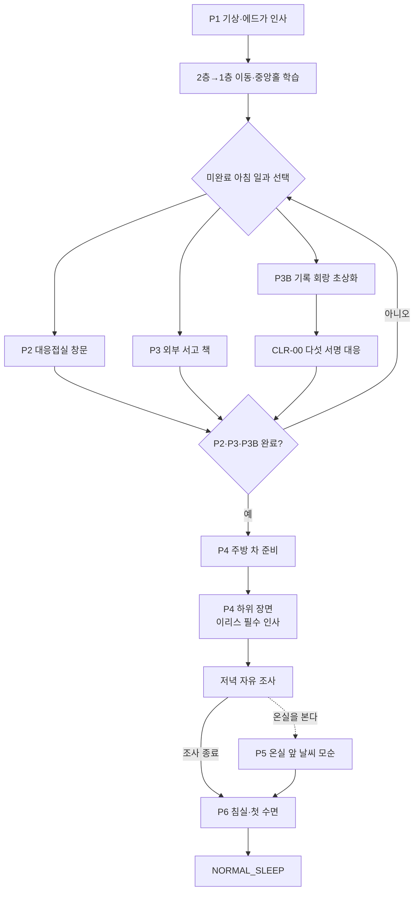

# GGB v0.4 이벤트 상세 01: 튜토리얼·일상

## 1. 문서 목적

본 문서는 첫 기상부터 첫 NORMAL_RESET 직전까지의 프롤로그 이벤트를 상세히 정의한다.

담당 이벤트:

- P1 기상과 아침 인사.
- P2 대응접실 창문 닦기.
- P3 외부 서고 책 정리와 일지 발견.
- P3B 초상화 이름표 정리.
- P4 차 준비와 이리스 필수 인사.
- P5 잠긴 온실과 날씨 모순.
- P6 취침 권유와 첫 수면.

프롤로그의 목표는 플레이어에게 규칙을 설명하는 동시에, 규칙이 어딘가 잘못되어 있다는 감각을 남기는 것이다.

## 2. 설계 원칙

### 2.1 학습

첫 루프에서 학습할 조작:

1. 조사 핫스폿 선택.
2. 대화 선택지.
3. 수첩 열기.
4. 방과 층 이동.
5. 인벤토리 도구 선택.
6. 오브젝트 순차 조작.
7. 문양·형태·음향 비교.
8. 아이템 조합.
9. 선택 조사를 건너뛰는 방법.
10. 수면으로 하루를 종료하는 방법.

### 2.2 심리적 이질감 유도

첫 루프에는 시뮬레이션, 냉각 장치, 연구원 인격을 직접 언급하지 않는다.

사용하는 이질감:

- 같은 온도.
- 지나치게 정확한 물건 배치.
- 반복 궤도의 새.
- 현재 공간과 맞지 않는 소리 방향.
- 사용인의 외형 장식과 장치가 같은 리듬으로 반응.
- 자신도 모르게 익숙한 이동 동작.

사용하지 않는 것:

- 갑작스러운 점프 스케어.
- 화면 전체 글리치.
- 직접적인 SF 라벨.
- 첫 루프에서의 살해 위협.
- 사용인의 연구원 시절 설명.

### 2.3 실패

프롤로그에는 HARD FAILURE가 없다.

- 모든 조작 실패는 LOCAL RETRY.
- 실패할 때 올바른 부분이 조금씩 확인된다.
- P3B를 제외한 퍼즐은 1~3분 안에 원리를 이해할 수 있어야 한다.
- 순서에 상관없이 P2·P3·P3B를 완료할 수 있다.

### 2.4 관계

첫 루프에서는 `bond`, `alert`를 증감하지 않는다.

저장하는 것:

- 사용인 소개 여부.
- 플레이어가 선택한 질문.
- 감각 모순 관찰.
- 다음 루프 짧은 반응에 사용할 기억 씨앗.

이유:

- 첫 과업 순서를 관계 최적화 문제로 만들지 않는다.
- 플레이어가 인물을 알기 전에 수치 선택을 강요하지 않는다.
- 관계는 반복을 인지한 A구간부터 본격적으로 시작한다.

## 3. 전체 흐름



## 4. 플레이타임 목표

| 구간 | 목표 시간 |
| --- | --- |
| P1·첫 이동 | 4~6분 |
| P2 | 3~5분 |
| P3 | 4~6분 |
| P3B | 4~7분 |
| 과업 사이 이동 | 총 3~5분 |
| P4·이리스 인사 | 5~7분 |
| P5 | 선택 2~4분 |
| P6 | 2~3분 |
| 전체 | 25~35분 |

P3B를 여러 번 실패하거나 모든 선택 대사를 읽을 경우 35분을 넘을 수 있다. 메인 기준은 첫 시도 평균이다.

## 5. 튜토리얼 학습표

| 이벤트 | 주 조작 | 보조 학습 | 후반 재사용 |
| --- | --- | --- | --- |
| P1 | 조사·대화 | 수첩·이동 | 전 구간 |
| P2 | 도구 선택·순서 | 환경 반복 관찰 | C4 |
| P3 | 비교·슬롯 배치 | 숨은 오브젝트·잠긴 공간 | B2·D0 |
| P3B | 다중 감각 대응 | 검증·고정 힌트 | C5·E3_5·F0-D |
| P4 | 아이템 조합 | 대화 중 정보 선택 | C3 |
| P5 | 자유 조사 | 모순을 수첩에 기록 | E3_2·현실 엔딩 |
| P6 | 행동 종료 확인 | 물리·영구 상태 예고 | 모든 NORMAL_RESET |

## 6. 공통 프롤로그 상태

```yaml
prologue_state:
  P1_complete: false
  P2_complete: false
  P3_complete: false
  P3B_complete: false
  P4_complete: false
  P5_complete: false
  iris_greeting_seen: false
  P6_complete: false
  introduced_servants: []
  selected_questions: []
  sensory_observations: []
```

일과 게이트:

```text
P2_complete
&& P3_complete
&& P3B_complete
→ P4 available
```

P5는 P4 뒤 선택이며 P6 필수 조건이 아니다.

## 7. P1 기상과 아침 인사

### 7.1 기본 정보

| 항목 | 내용 |
| --- | --- |
| 이벤트 ID | P1 |
| 위치 | `M2_BEDROOM` |
| 시간 | 아침 |
| 예상 길이 | 3~5분 |
| 등장 | 에드가 |
| 선행 조건 | 새 게임 |
| 목표 | 침실을 조사하고 첫 일과를 받음 |
| 학습 | 조사, 대화, 수첩, 이동 |
| 실패 | 없음 |
| 반복 | 첫 루프 전체, 이후 아침 인사 축약 |

### 7.2 시작 연출 (어떻게 할지 매우 고민중)

화면은 주인공의 시점 높이에서 천천히 밝아진다.

연출 순서:

1. 커튼 사이의 고정된 아침빛.
2. 새가 창문 왼쪽에서 오른쪽으로 한 번 이동.
3. 침대보가 주인공이 움직이기 전부터 같은 주름으로 정리됨.
4. 문밖에서 레이피어 끝이 바닥에 닿는 짧은 금속음.
5. 에드가가 정확히 세 번 노크.

에드가:

```text
“기상 시각입니다, 아가씨.
오늘 일정은 준비되어 있습니다.”
```

### 7.3 에드가 첫인상

숨길 요소:

- 레이피어의 보안 키 기능.
- 뿔의 신호 수신 기능.
- 인간 연구원 시절.
- 이전 루프 기억.

### 7.4 필수 조사

아래 네 오브젝트 중 두 개를 조사하면 대화가 진행된다. 나머지는 선택 조사로 남는다.

| 오브젝트 | 최초 반응 | 감각 단서 | 후반 기능 |
| --- | --- | --- | --- |
| 침대 | “막 일어난 자리인데도 반듯하다.” | 천 아래 단단한 곡면 | 냉각 캡슐 |
| 침실 창문 | 맑은 정원과 새 | 유리가 햇빛보다 미지근함 | C5 기준점 |
| 아버지 사진 | 익숙하지만 장면 기억 없음 | 사진 표면만 차가움 | 아버지 서사 |
| 수첩 | 낙서와 빈 페이지 | 연필 압흔 | A1·F0-E |

침실 창문은 P1 조사 대상이다. P2 창문 닦기는 1층 대응접실에서 진행한다.

### 7.5 선택 대화

주인공:

```text
[오늘도 같은 일인가요?]
[아버지는 어디 있나요?]
[조금 더 자고 싶어요.]
```

에드가 답변:

```text
오늘도 같은 일인가요?
“일과는 유지되는 편이 안전합니다.”

아버지는 어디 있나요?
“주인님의 기록은 서재에 보관되어 있습니다.”

조금 더 자고 싶어요.
“수면 시간은 충분했습니다. 몸이 불편하십니까.”
```

선택은 관계값을 바꾸지 않는다. `selected_questions`에만 기록한다.

### 7.6 일과 제시

에드가:

```text
“대응접실의 창문,
외부 서고의 책,
북쪽 기록 회랑의 초상화를 부탁드립니다.
순서는 정하지 않겠습니다.”
```

외부 서고라는 표현을 사용해 P3 공간과 B2 기록 내실을 구분한다.

### 7.7 이동 학습

진행:

```text
M2_BEDROOM
→ M2_UPPER_HALL
→ M2_STAIR_LANDING
→ M1_CENTRAL_HALL
```

첫 방문:

- 문 핫스폿.
- 복도 가장자리 이동.
- 계단 더블클릭 축약.
- 중앙홀에서 방향 라벨 확인.

중앙홀 도착 시 세 목적지를 지도에 등록한다.

```text
남쪽: 대응접실 P2
서재: 외부 서고 P3
북쪽: 기록 회랑 P3B
```

### 7.8 완료

```yaml
event_id: P1
completed: true
outputs:
  set_flags: [P1_complete]
  add_servants: [EDGAR]
  add_locations:
    - M2_BEDROOM
    - M2_UPPER_HALL
    - M2_STAIR_LANDING
    - M1_CENTRAL_HALL
  objectives: [P2, P3, P3B]
```

### 7.9 구현 메모

- 에드가 대사 중에도 침실 조사 가능 핫스폿을 가리지 않는다.
- 두 필수 조사를 끝내기 전에 문을 누르면 남은 조사를 강제하지 않고 에드가가 한 번 확인한다.
- 자막은 레이피어 금속음의 방향을 `[문밖]`으로 표기한다.
- 첫 이동 튜토리얼은 설정에서 생략 가능하다.

## 8. P2 대응접실 창문 닦기

### 8.1 기본 정보

| 항목 | 내용 |
| --- | --- |
| 이벤트 ID | P2 |
| 위치 | `M1_PARLOR` |
| 시간 | 아침 |
| 예상 길이 | 3~5분 |
| 등장 | 마라 1 |
| 선행 조건 | P1 |
| 목표 | 세 창을 올바른 순서로 닦음 |
| 학습 | 도구 선택, 순차 상호작용 |
| 실패 | LOCAL RETRY |
| 반복 | 첫 루프 전체, 이후 일과 축약 가능 |

### 8.2 진입

대응접실에는 천을 어깨에 걸친 마라 1이 높은 창틀에 기대 서 있다. 큰 스패너는 청소 수레에 비스듬히 꽂혀 있다.

마라 1:

```text
“오셨슴까, 아가씨.
전 위쪽을 맡을 테니 아래쪽 세 장만 부탁드림다.
스패너는 쓰지 마십쇼. 저도 방금 쓸 뻔했으니까.”
```

### 8.3 오브젝트

| 오브젝트 | 기능 |
| --- | --- |
| 부드러운 천 | 정답 도구 |
| 거친 솔 | 먼지를 퍼뜨리는 오답 도구 |
| 물병 | 마지막 물기 제거 전 사용 가능 |
| 스패너 | 조사 대사 전용, 창문에 사용 불가 |
| 세 창 | 위·중간·아래의 오염 상태 |
| 대응접실 시계 | B3 기준 시계의 사전 배치 |

### 8.4 조작 순서

각 창은 세 영역을 가진다.

```text
위쪽 먼지
→ 가운데 얼룩
→ 아래쪽 물기
```

기본 정답:

1. 부드러운 천 선택.
2. 위쪽 먼지를 아래로 모음.
3. 가운데 얼룩을 원형으로 닦음.
4. 물병을 사용한 경우 아래 물기를 마른 면으로 제거.

세 창의 오염 위치는 같지만 얼룩 모양이 조금 다르다. 순서는 학습을 위한 고정 규칙이며 랜덤화하지 않는다.

### 8.5 오답

| 오답 | 결과 | 힌트 |
| --- | --- | --- |
| 거친 솔 사용 | 먼지가 양옆으로 퍼짐 | 마라 1이 천을 가리킴 |
| 아래부터 닦음 | 위 먼지가 다시 떨어짐 | 떨어지는 먼지 애니메이션 |
| 젖은 채 종료 | 창 아래에 물방울 | 마른 면 아이콘 강조 |

오답은 즉시 복구할 수 있다. 아이템은 소실되지 않는다.

### 8.6 반복하는 새

세 번째 창을 닦기 시작하면 같은 새가 같은 궤도를 두 번 지난다.

첫 통과:

- 자연스러운 새소리.
- 왼쪽 나무에서 오른쪽 지붕으로 이동.

두 번째 통과:

- 18초 뒤 같은 날갯짓 프레임.
- 같은 소리 길이.
- 같은 지붕 위치에서 사라짐.

조사 선택:

```text
[새를 따라 본다]
[창문 닦기를 계속한다]
```

따라 보면 수첩에 확정 사실이 아니라 감각 관찰이 남는다.

```yaml
observation_id: OBS_REPEATING_BIRD
state: observed
```

### 8.7 마라 1 반응

```text
“일은 천천히 하시는데 눈은 좋으심다.
저 새까지 닦아낼 생각은 하지 마십쇼.
...농담입니다. 아마도.”
```

마라 1의 주황 대각 닦임 자국은 천이 지나가기 전에 한 프레임 먼저 나타난다. 첫 루프에는 단순한 연출 효과로 보이게 한다.

### 8.8 완료

```yaml
event_id: P2
completed: true
outputs:
  set_flags: [P2_complete]
  add_servants: [MARA1]
  add_locations: [M1_PARLOR]
  add_observations:
    - orange_wipe_glyph_seen
```

### 8.9 접근성·구현

- 드래그 대신 영역 선택 버튼을 지원한다.
- 먼지·얼룩·물기는 색뿐 아니라 질감과 아이콘이 다르다.
- 새소리 없이도 반복 궤도 표시를 켤 수 있다.
- 세 번 오답이면 올바른 다음 영역에 윤곽선을 표시한다.
- 스패너를 창문에 사용할 때 캐릭터 비하가 아니라 마라 1의 자조 농담으로 처리한다.

## 9. P3 외부 서고 책 정리와 일지 발견

### 9.1 기본 정보

| 항목 | 내용 |
| --- | --- |
| 이벤트 ID | P3 |
| 위치 | `M1_LIBRARY_OUTER` |
| 인접 잠금 구역 | `M1_LIBRARY_INNER` |
| 시간 | 아침 |
| 예상 길이 | 4~6분 |
| 등장 | 에드가, 조건부 마라 2의 기록 흔적 |
| 선행 조건 | P1 |
| 목표 | 책 3권 정리 후 잠긴 일지 발견 |
| 학습 | 비교, 슬롯 배치, 숨은 오브젝트, 잠금 |
| 실패 | LOCAL RETRY |
| 반복 | 첫 루프 전체, 이후 일과 축약 |

### 9.2 공간 구분

P3에서 들어가는 곳은 외부 서고다.

보이는 것:

- 공개 책장.
- 분류 문양.
- 멈춘 벽시계.
- 반납 슬롯.
- 기록 내실 유리문.
- 유리 너머의 일지 책상.

접근할 수 없는 것:

- 기록 내실.
- 아버지 일지 원문.
- 평면도 이중 바닥.
- 북쪽 기록 회랑 걸쇠.

B2는 서재 건물 최초 접근이 아니라 기록 내실 최초 심층 접근이다.

### 9.3 에드가 감독

에드가는 기록 내실 문 가까이에 서서 장부를 확인한다. 레이피어 끝은 문틀의 세로 홈과 정확히 겹친다.

에드가:

```text
“외부 서고의 반납분입니다.
책등 문양과 선반 표식을 맞춰 주십시오.
기록 내실은 정리 대상이 아닙니다.”
```

### 9.4 책 정리

| 책 | 책등 문양 | 선반 | 촉감 단서 |
| --- | --- | --- | --- |
| 기계 도면집 | 시계·수직선 | 기계공학 | 표지가 미세하게 진동 |
| 온실 식물지 | 꽃잎·후광 | 식물·환경 | 종이에서 젖지 않은 흙냄새 |
| 식탁 업무록 | 찻잔·이중 고리 | 생활 기록 | 같은 페이지가 두 번 접힘 |

조작:

1. 책 조사.
2. 책등 문양과 선반 홈 비교.
3. 책을 슬롯에 배치.
4. 세 권을 모두 넣으면 선반 내부 장치가 움직임.

오답:

- 책이 들어가지만 책등 높이가 맞지 않음.
- 선반 시계가 한 번 거꾸로 움직임.
- 에드가가 정답을 말하지 않고 분류 기준을 반복.

### 9.5 일지 발견

기계 도면집을 올바르게 꽂으면 반납 슬롯 안쪽에서 낡은 일지 한 권이 떨어진다.

주인공이 집으면:

- 표지는 읽히지 않는다.
- 안쪽 면에 어린 주인공의 고딕 저택 낙서.
- 본문 글자는 잉크가 한 방향으로 밀린 것처럼 겹침.
- 남색 수직선이 잠금쇠와 한 번 겹친 뒤 사라짐.

에드가:

```text
“오래된 연구 장부입니다.
현재는 열람 대상이 아닙니다.
제자리에 두시는 편이 좋겠습니다.”
```

선택:

```text
[누가 쓴 장부입니까?]
[왜 잠겨 있습니까?]
[말없이 내려놓는다]
```

답변:

```text
누가 쓴 장부입니까?
“주인님의 기록입니다.”

왜 잠겨 있습니까?
“손상된 기록은 잘못 읽히기 쉽습니다.”
```

### 9.6 기록 내실 예고

플레이어가 유리문을 조사하면:

```text
문 안쪽 책상 위에 일지와 같은 크기의 빈 자국이 있다.
문틀에는 열쇠구멍이 없고, 레이피어 날처럼 가는 홈만 있다.
```

P3에서는 문을 열 수 없다. 핫스폿은 `잠김` 정보를 주고 종료한다.

### 9.7 완료

```yaml
event_id: P3
completed: true
outputs:
  set_flags:
    - P3_complete
    - journal_object_found
  add_knowledge:
    - note_journal
    - library_inner_exists
  add_locations:
    - M1_LIBRARY_OUTER
  observations:
    - navy_lock_glyph_seen
```

### 9.8 접근성·구현

- 문양, 책 이름, 선반 라벨을 함께 제공한다.
- 책을 잘못 꽂아도 인벤토리에서 사라지지 않는다.
- 세 번 오답이면 한 권의 정답 선반을 고정한다.
- 기록 내실 문은 P3에서 이동 커서로 바뀌지 않는다.
- 에드가의 몸이 문 핫스폿을 완전히 가리지 않게 배치한다.

## 10. P3B 초상화 이름표 정리

### 10.1 기본 정보

| 항목 | 내용 |
| --- | --- |
| 이벤트 ID | P3B |
| 오버레이 | CLR-00 |
| 위치 | `M1_NORTH_ARCHIVE_HALL` |
| 보조 위치 | `M1_PORTRAIT_STORAGE` 문 앞 |
| 시간 | 아침 |
| 예상 길이 | 4~7분 |
| 등장 | 마라 2 |
| 선행 조건 | P1 |
| 목표 | 다섯 초상화에 올바른 이름표 배치 |
| 학습 | 색·문양·선·음향·라벨 대응 |
| 실패 | LOCAL RETRY |
| 반복 | 5~12초 숏컷 |

### 10.2 진입

마라 2는 사다리 위에서 액자 순서를 바꾸고 있다. 접힌 박쥐 날개는 망토처럼 보이고, 귀는 기록 종이 울리기 전에 먼저 움직인다.

이름표 하나가 떨어진다. 마라 2는 잡을 수 있었지만 주인공 발앞까지 내려오는 것을 보고 그대로 둔다.

마라 2:

```text
“늦었어! 엄청 늦었어!
다섯 장밖에 안 되는데 설마 못 맞히는 건 아니지?!
못 맞혀도 괜찮아. 내가 아주 오래 놀릴 수 있으니까!”
```

### 10.3 수행 순서 변형

P3B를 먼저 수행:

```text
“아직 얼굴도 모른다고?
그러니까 이름표가 있는 거잖아! 아주 친절하지!”
```

다른 일과를 먼저 수행:

```text
“벌써 몇 명은 봤네?
그럼 틀릴 핑계가 줄었어. 유감이야!”
```

과업 순서가 정답이나 관계 수치에 영향을 주지 않는다.

### 10.4 초상화와 이름표

| 소유자 | 초상화 외형 | 프레임·문양 | 음향 | 라벨 |
| --- | --- | --- | --- | --- |
| 에드가 | 용의 뿔, 레이피어, 파란 집사복 | 남색 수직 잠금선 | 낮은 한 음 | `LOCK` |
| 마라 1 | 여우 귀·꼬리, 스패너 | 주황 대각 닦임, 빨강 보조선 | 마른 솔 | `MAINT` |
| 루카 | 둥근 쥐 귀, 검정 의상 | 연두 이중 맥박 | 두 번 맥박·한 번 응답 | `BIO` |
| 이리스 | 백금발, 플라스틱 날개 | 옅은 노랑 꽃잎·후광 | 유리음 뒤 바람 | `CLIMATE` |
| 마라 2 | 박쥐 귀·날개, 고딕 목깃 | 보라 이중 액자 | 빠른 세 음 | `ARCHIVE` |

이름표에는 이름, 문양 홈, 기능 라벨이 함께 있다. 색을 제거해도 해결할 수 있다.

### 10.5 조작

1. 초상화 조사.
2. 외형·소품·프레임 문양 확인.
3. 이름표 조사.
4. 문양 홈·기능 라벨·음향 재생.
5. 이름표를 액자 아래 슬롯에 배치.
6. 다섯 개를 놓은 뒤 기록 종을 울림.

### 10.6 검증 단계

| 실패 횟수 | 피드백 |
| --- | --- |
| 1회 | 맞은 개수만 표시 |
| 2회 | 잘못 사용한 분류 기준을 마라 2가 지적 |
| 3회 | 맞은 이름표 최대 2개 고정 가능 |
| 4회 이상 | 남은 이름표의 문양·라벨 대응선을 표시 |

고정은 선택 기능이다. 플레이어가 직접 다시 풀 수 있다.

### 10.7 마라 2의 지성

오답 유형별 대사:

```text
색만 보고 배치:
“색만 봤지?! 그래서 틀린 거야!
선이 닫혔는지 갈라졌는지부터 봐. 기본이잖아!”

소품만 보고 배치:
“스패너가 있다고 전부 정비 기록은 아니야.
...아니, 이번 건 정비 기록 맞는데! 방식이 틀렸어!”

음향을 무시:
“귀도 쓰라고 달려 있는 거야.
내 귀가 특별히 더 훌륭하긴 하지만!”
```

### 10.8 취약성 전조

마라 2 이름표를 올바르게 놓으면 즉시 가까이 와서 이름을 손가락으로 따라 읽는다.

```text
“그건 거기 맞아!
마라 2. 기록실. 보라 이중 프레임.
...맞지? 내가 쓴 이름이니까 당연히 맞지!”
```

말이 끝난 뒤 빠른 3음의 셋째 음이 아주 작게 끊긴다. 첫 루프에는 오류인지 연출인지 확정하지 않는다.

### 10.9 완료 연출

다섯 프레임이 순서대로 반응한다.

```text
수직 잠금선
→ 대각 닦임
→ 이중 맥박
→ 꽃잎 후광
→ 이중 액자
```

색이 아닌 문양과 음향도 같은 순서로 출력한다.

마라 2:

```text
“정답!
이제 여기 있는 이름은 전부 알겠네.
잊어버리면 다시 물어봐. 내가 기억하고 있을 테니까!”
```

마지막 문장 뒤 짧은 침묵을 둔다.

### 10.10 완료 상태

```yaml
event_id: P3B
completed: true
outputs:
  set_flags: [P3B_complete]
  add_servants: [MARA2]
  add_locations:
    - M1_NORTH_ARCHIVE_HALL
    - M1_PORTRAIT_STORAGE
  add_signatures:
    - navy_lock
    - orange_wipe
    - black_lime_pulse
    - white_yellow_bloom
    - purple_archive
  overlay_complete: CLR_00
```

### 10.11 반복 숏컷

다음 루프:

```text
이름표 선반 열기
→ 다섯 문양·라벨 빠르게 확인
→ 자동 배치
→ 마라 2 한 줄 반응
```

목표: 5~12초.

숏컷 중단:

- MARA2_S1 활성.
- 새 이름표 이상.
- 색상·문양 불일치.
- 플레이어가 직접 수행 선택.

## 11. 아침 일과 완료 게이트

### 11.1 판정

```yaml
morning_tasks_complete:
  all:
    - P2_complete
    - P3_complete
    - P3B_complete
```

미완료 상태에서 중앙홀 에드가에게 보고:

```text
“아직 남은 일과가 있습니다.
순서는 자유지만, 확인 없이 넘길 수는 없습니다.”
```

지도에는 미완료 과업과 위치만 표시한다. 정답이나 사용 도구는 표시하지 않는다.

### 11.2 세 과업 순서

가능한 순서:

```text
P2→P3→P3B
P2→P3B→P3
P3→P2→P3B
P3→P3B→P2
P3B→P2→P3
P3B→P3→P2
```

모든 순서에서:

- 동일한 필수 정보 획득.
- 동일한 P4 진입.
- 관계값 변화 없음.
- 소개 대사만 현재 만난 사용인에 맞춰 변경.

## 12. P4 차 준비

### 12.1 기본 정보

| 항목 | 내용 |
| --- | --- |
| 이벤트 ID | P4 |
| 위치 | `M1_KITCHEN` |
| 시간 | 낮 |
| 예상 길이 | 4~6분 |
| 등장 | 루카, 종료 시 이리스 |
| 선행 조건 | P2·P3·P3B 완료 |
| 목표 | 차를 올바른 순서로 준비 |
| 학습 | 아이템 조합, 순서, 대화 조사 |
| 실패 | LOCAL RETRY |
| 반복 | 첫 루프 전체, 이후 일과 축약 |

### 12.2 루카 첫인상

루카는 주전자 옆에서 찻잔 손잡이를 같은 각도로 맞추고 있다.

루카:

```text
“아, 아가씨... 오셨네요...
차는 제가 준비하려고 했는데,
오늘 일과에 들어 있다고 해서요... 같이 해도 괜찮을까요?”
```

주인공이 긍정하면 루카는 안도하지만 손에 든 계량 숟가락을 떨어뜨린다. 떨어진 순간에는 당황하고, 뜨거운 물이 움직이면 즉시 안정된 손으로 주전자를 잡는다.

### 12.3 차 준비 도구

| 아이템 | 기능 |
| --- | --- |
| 빈 찻잔 | 먼저 데워야 함 |
| 뜨거운 물 | 잔 데우기·우림 |
| 찻잎 | 정량 1스푼 |
| 계량 숟가락 | 찻잎 양 확인 |
| 모래시계 | 우림 시간 시각화 |
| 찻주전자 | 조합 용기 |

### 12.4 정답 순서

```text
1. 빈 잔을 뜨거운 물로 데운다.
2. 데운 물을 버린다.
3. 찻주전자에 찻잎 1스푼을 넣는다.
4. 뜨거운 물을 붓는다.
5. 모래시계 한 칸을 기다린다.
6. 잔에 따른다.
```

실패:

| 오답 | 반응 | 복구 |
| --- | --- | --- |
| 차가운 잔에 바로 따름 | 향이 약함 | 잔 데우기부터 재시도 |
| 찻잎 과다 | 쓴맛 아이콘 | 찻주전자 비우기 |
| 기다리지 않음 | 색이 옅고 향 없음 | 모래시계 강조 |
| 너무 오래 기다림 | 루카가 즉시 주전자 분리 | 새 물로 재시도 |

아이템은 소실되지 않는다.

### 12.5 생명 유지 전조

차가 우러나는 동안:

- 주전자 바닥에서 두 번의 낮은 맥박.
- 루카 귀의 연두 부분이 같은 간격으로 점멸.
- 바닥 아래에서 한 번 늦은 응답음.
- 주인공 손목 맥박과 완전히 같지는 않지만 비슷함.

수첩에는 `주방의 규칙적인 진동`으로만 기록할 수 있다.

### 12.6 아버지 질문

한 개를 선택할 수 있다.

```text
[아버지가 좋아한 차인가요?]
[이 저택은 언제부터 있었나요?]
[루카는 여기서 오래 일했나요?]
```

루카 답변:

```text
아버지가 좋아한 차인가요?
“네... 비슷한 향을 좋아하셨어요.
정확히 같은지는... 이제 자신이 없지만요.”

이 저택은 언제부터 있었나요?
“아가씨가 기억하는 만큼 오래됐다고... 들었어요.”

루카는 여기서 오래 일했나요?
“오래요... 아주 오래요.
그런데 며칠이라고 세면, 늘 같은 수가 나와서...”
```

마지막 문장은 루카가 스스로 이상함을 느끼고 찻잔 정리로 화제를 바꾼다.

### 12.7 완료

```yaml
event_id: P4
completed: true
outputs:
  set_flags: [P4_complete]
  add_servants: [LUCA]
  add_locations:
    - M1_EAST_HALL
    - M1_KITCHEN
  add_observations:
    - black_lime_pulse_seen
    - kitchen_regular_pulse
  time_segment: evening_free
```

## 13. P4 하위 장면: 이리스 필수 인사

### 13.1 목적

P5를 건너뛰어도 프롤로그에서 이리스를 실제로 만나게 한다.

본 장면은 P4 종료 연출이며 별도 메인 이벤트 ID를 만들지 않는다.

```yaml
parent_event_id: P4
sub_beat_id: P4_IRIS_GREETING
required: true
```

### 13.2 진입

차 준비가 끝나면 동쪽 복도 쪽 서비스 문이 열린다. 이리스가 작은 허브 바구니를 들고 들어온다.

첫인상:

- 옅은 노랑이 도는 백금발.
- 웃는 눈과 부드러운 자세.
- 성녀를 연상시키는 밝은 의상.
- 깃털이 아니라 얇은 판으로 된 반투명 플라스틱 날개.
- 날개 관절이 움직일 때 나는 작은 유리·플라스틱 마찰음.

이리스:

```text
“우후후, 루카. 잎이 마르기 전에 쓰세요.
아가씨도 계셨네요.
오늘도 참 평온한 얼굴이라 다행이에요.”
```

루카:

```text
“고, 고마워요... 이리스.
아가씨께도 인사드려야...”
```

이리스:

```text
“이미 했답니다.
눈을 마주치고 웃었으니까요.”
```

### 13.3 미세한 불일치

- 이리스는 주인공을 처음 보는 것처럼 소개하지 않는다.
- `오늘도`라는 표현을 사용한다.
- 주인공이 대답하기 전 이름과 차 취향을 아는 듯 행동한다.
- 미소가 끝난 뒤에도 플라스틱 날개의 후광 투사는 반 박자 유지된다.
- 허브 바구니는 향이 강하지만 잎 표면은 완전히 건조하다.

첫 루프에는 장기 반복을 확정할 수 없게 한다.

### 13.4 온실 초대

이리스:

```text
“시간이 남으면 온실 앞에 들러 보세요.
오늘은 안쪽에만 비가 와서, 제법 예쁘답니다.”
```

이 문장으로 P5를 지도에 선택 목표로 추가한다.

주인공 선택:

```text
[안쪽에만 비가 온다는 게 무슨 뜻인가요?]
[나중에 들를게요.]
[고개만 끄덕인다.]
```

답변:

```text
“보면 바로 알게 될 거예요.
설명보다 계절이 더 친절할 때도 있으니까요.”
```

### 13.5 상태

```yaml
sub_beat_id: P4_IRIS_GREETING
completed: true
outputs:
  set_flags: [iris_greeting_seen]
  add_servants: [IRIS]
  add_observations:
    - white_yellow_bloom_seen
    - iris_said_today_again
  optional_objective: P5
```

살의와 전력 전용 사건은 전혀 공개하지 않는다. 첫인상은 보호받고 싶은 모성적 안정감이 우선이다.

## 14. P5 잠긴 온실과 날씨 모순

### 14.1 기본 정보

| 항목 | 내용 |
| --- | --- |
| 이벤트 ID | P5 |
| 위치 | `M1_GREENHOUSE_VESTIBULE` |
| 시간 | 저녁 자유 조사 |
| 예상 길이 | 2~4분 |
| 등장 | 이리스 |
| 필수 | 아니오 |
| 선행 조건 | P4·이리스 인사 |
| 목표 | 세 가지 날씨 단서를 비교 |
| 학습 | 선택 조사, 모순 기록 |
| 실패 | 없음 |
| 반복 | 첫 확인 once, 이후 IRIS_S1 조건 |

### 14.2 조사 대상

| 대상 | 관찰 |
| --- | --- |
| 동쪽 복도 창 | 맑은 하늘, 마른 난간 |
| 온실 유리문 안쪽 | 빗줄기와 젖은 잎 |
| 온실 문턱 | 물기가 없고 흙도 마름 |
| 천장 | 빗소리가 온실 안이 아니라 위쪽 배관에서 들림 |
| 계절 안내판 | `봄·맑음`으로 고정 |

필수 비교:

1. 복도 창.
2. 온실 유리문.
3. 문턱 또는 계절 안내판.

세 개를 보면 모순 기록 선택이 열린다.

### 14.3 이리스 대화

이리스는 온실 안쪽 유리문 너머에 있다. 문을 열지 않고도 대화할 수 있다.

```text
“우후후, 정말 오셨네요.
비는 안쪽에서만 오는 날도 있어요.
밖이 언제나 바깥인 건 아니니까요.”
```

질문:

```text
[복도 밖은 맑아요.]
[문턱은 젖지 않았어요.]
[이 비는 진짜인가요?]
```

답변:

```text
복도 밖은 맑아요.
“그쪽 하늘은 맑게 보이도록 되어 있나 봐요.”

문턱은 젖지 않았어요.
“비가 넘어오지 않게 잘 가르쳤거든요.”

이 비는 진짜인가요?
“아가씨가 차갑다고 느끼면 진짜고,
아무것도 느끼지 못하면... 다른 이름이 필요하겠죠.”
```

마지막 답변은 이리스가 여전히 웃지만 눈을 잠깐 뜨는 연출과 함께 사용한다.

### 14.4 기록

수첩 선택:

```text
[온실 안에만 비가 온다.]
[소리는 나지만 문턱이 젖지 않는다.]
[복도와 온실의 날씨가 동시에 다르다.]
```

어느 문장을 선택해도 `weather_contradiction_seen`을 설정한다. 문장만 후속 독백에 사용한다.

### 14.5 완료

```yaml
event_id: P5
completed: true
outputs:
  set_flags:
    - P5_complete
    - weather_contradiction_seen
  add_locations:
    - M1_GREENHOUSE_VESTIBULE
  add_knowledge:
    - OBS_WEATHER_CONTRADICTION
  add_memory_seeds:
    IRIS:
      - protagonist_questioned_indoor_rain
```

P5를 건너뛰면:

- 이리스 소개는 유지.
- 메인 진행에 손실 없음.
- IRIS_S1이 열리지 않음.
- 외부 환경 모순은 후속 C·E구간에서 다시 제공.

## 15. P6 취침 권유와 첫 수면

### 15.1 기본 정보

| 항목 | 내용 |
| --- | --- |
| 이벤트 ID | P6 |
| 위치 | `M2_BEDROOM` |
| 이동 | 중앙홀→계단→상부 회랑→침실 |
| 시간 | 밤 |
| 예상 길이 | 2~3분 |
| 등장 | 에드가 |
| 선행 조건 | P4, 저녁 자유 조사 종료 |
| 목표 | 오늘을 끝내고 첫 NORMAL_SLEEP 진입 |
| 학습 | 행동 종료, 수면 확인 |
| 실패 | 없음 |
| 반복 | per_loop, 이후 축약 |

### 15.2 밤 전환

저녁 자유 조사를 마치면:

- 중앙홀 샹들리에가 순서대로 꺼진다. (이런 거 넣고는 싶은데 일단 많이 후순위)
- 사용인 대사는 짧아진다.
- 배경음의 고음역이 줄어든다.
- 지도에 침실 목표가 표시된다.
- 아직 조사하지 않은 P5는 선택 목표로 남지만 필수로 강조하지 않는다.

### 15.3 에드가의 귀환

침실 앞에서 에드가가 기다린다. 아침과 같은 위치지만 꼬리 각도와 레이피어 손잡이 방향까지 동일하다.

에드가:

```text
“오늘 일정은 종료되었습니다.
침실 상태도 확인했습니다.
이제 쉬시는 편이 좋겠습니다.”
```

선택:

```text
[매일 이렇게 확인합니까?]
[조금 더 둘러보고 싶어요.]
[알겠습니다.]
```

답변:

```text
매일 이렇게 확인합니까?
“필요한 절차입니다.”

조금 더 둘러보고 싶어요.
“허용하겠습니다. 돌아오시면 호출해 주십시오.”

알겠습니다.
“좋은 밤 되시기 바랍니다.”
```

`조금 더 둘러본다`를 선택하면 1층 자유 조사로 돌아간다. P6는 완료되지 않는다.

### 15.4 침대 조사

```text
오늘을 끝내고 잠든다.

[잠든다]
[조금 더 조사한다]
```

첫 수면에서는 초기화·유지 항목을 직접 설명하지 않는다. 플레이어가 리셋을 아직 모르기 때문이다.

대신 다음 감각을 보여 준다.

1. 침대가 몸을 감싸기 전에 시야가 먼저 어두워짐.
2. 멀리서 낮은 시계음.
3. 두 번의 생체 맥박.
4. 빠른 세 음 중 마지막 음이 잘림.
5. 새가 우는 소리로 전환.

### 15.5 상태 커밋

`잠든다` 선택:

```yaml
event_id: P6
completed: true
outputs:
  set_flags:
    - P6_complete
    - prologue_complete
  time_segment: sleep
  next_event: NORMAL_SLEEP
```

후속:

```text
P6
→ NORMAL_SLEEP
→ SYS_COMMIT
→ SYS_MEMORY
→ NORMAL_RESET
→ MORNING
```

기존 `SYS-01` 표기는 사용하지 않는다.

### 15.6 첫 커밋 대상

유지:

- `introduced_servants`.
- P3 일지 존재.
- P3B 색상 서명 대응.
- P5를 했다면 날씨 모순.
- 선택 질문.
- 감각 관찰.

초기화:

- 창문 얼룩.
- 책 위치.
- 이름표 위치.
- 차 상태.
- 당일 사용인 위치.
- 조명과 시간대.

관계값:

- 모든 사용인의 `bond`, `alert`는 초기 기본값 유지.
- 기억 씨앗은 다음 루프의 짧은 반응 조건으로 사용할 수 있다.

## 16. 일과 순서별 대사 변형

### 16.1 P3B 이전에 사용인을 만난 경우

| 먼저 완료 | 마라 2 반응 |
| --- | --- |
| P2 | “주황 스패너는 봤겠네. 그럼 하나는 공짜야!” |
| P3 | “서재 문 지키는 파란 집사도 봤지?” |
| P2·P3 | “둘이나 봤으면 세 개만 추리하면 돼. 너무 쉽다!” |

정답 슬롯을 실제로 공짜로 채우지는 않는다. 대사만 달라진다.

### 16.2 P3B 이후 첫 만남

| 인물 | 반응 |
| --- | --- |
| 마라 1 | 주인공이 이름을 먼저 알면 귀가 잠깐 움직임 |
| 루카 | 이름을 불러 주면 안도했다가 왜 아는지 궁금해함 |
| 이리스 | “초상화가 저보다 더 얌전했죠?”라고 웃음 |
| 에드가 | 이름표 정리를 업무 결과로만 확인 |

### 16.3 P5 여부

| 상태 | P6 전 반응 |
| --- | --- |
| P5 완료 | 수첩에 온실 모순 표시 |
| P5 미완료 | 온실 목표는 다음 루프에서 사라지지 않고 선택 조사로 재제안 가능 |

P5 미완료가 메인 진행이나 이리스 소개를 막지 않는다.

## 17. 감각 연출표

| 이벤트 | 시각 | 소리 | 촉감·온도·향 |
| --- | --- | --- | --- |
| P1 | 고정된 빛·정돈된 주름 | 노크 3회·금속음 | 미지근한 창문 |
| P2 | 반복 새·선행 닦임 자국 | 같은 새소리 | 천의 마찰 |
| P3 | 멈춘 시계·잠긴 유리문 | 책보다 늦는 낙하음 | 차가운 사진·진동 표지 |
| P3B | 다섯 프레임·보라 누락 | 5종 서명음 | 바니시·오존 냄새 |
| P4 | 귀의 맥박·주전자 김 | 2회 맥박+응답 | 금속 뒷맛 |
| 이리스 인사 | 미소 뒤 남는 후광 | 플라스틱 날개음 | 마른 허브 향 |
| P5 | 실내 비·마른 문턱 | 천장 방향 빗소리 | 젖지 않는 흙냄새 |
| P6 | 아침과 같은 자세 | 낮은 시계·3음 누락 | 천 아래 단단한 곡면 |

## 18. 수첩 기록

프롤로그 수첩 탭:

| 탭 | 내용 |
| --- | --- |
| 일과 | P2·P3·P3B 완료 상태 |
| 인물 | 다섯 사용인의 이름·표층 역할 |
| 관찰 | 반복 새, 주방 맥박, 날씨 모순 |
| 문양 | 다섯 색상 서명의 비색상 대응 |
| 미해결 | 잠긴 기록 내실, 읽히지 않는 일지 |

수첩은 해석을 확정하지 않는다.

나쁜 기록:

```text
이 세계는 시뮬레이션이다.
```

권장 기록:

```text
새가 같은 궤도를 같은 속도로 두 번 날았다.
온실 안쪽에 비가 오지만 문턱은 마르다.
일지 잠금쇠와 에드가의 장식이 같은 선으로 보였다.
```

## 19. 힌트 체계

### 19.1 공통

| 정체 시간·실패 | 지원 |
| --- | --- |
| 첫 오답 | 결과 애니메이션 |
| 두 번째 | 주인공 독백으로 규칙 질문 |
| 세 번째 | 올바른 구성 요소 일부 강조 |
| 네 번째 이상 | 다음 조작 대상 표시 |

### 19.2 과업 위치

중앙홀에서 에드가 또는 지도 선택:

```text
대응접실 창문
외부 서고 책장
북쪽 기록 회랑 초상화
```

목적지 이름과 방향만 표시하고 퍼즐 정답은 표시하지 않는다.

### 19.3 P3B

색을 기준으로 두 번 실패하면 패턴 탭을 자동 제안한다. 음향을 듣지 못해도 라벨과 선 패턴으로 해결할 수 있다.

## 20. 접근성

### 20.1 입력

- 드래그 앤 드롭 대신 선택→배치 지원.
- 더블클릭 이동 대신 버튼 이동 지원.
- 순서 퍼즐에 현재 단계 표시.
- 마우스 오버 없이도 모든 핫스폿 순환 가능.

### 20.2 시각

- 색 제거 모드. (이거는 기술적으로 가능 한지 체크해봐야 함. 안되면 그냥 에셋 변환으로 해결해도 되긴 해)
- 문양·선 패턴 강화.
- 상호작용 윤곽선 굵기 조절.
- 반복 새 궤도에 선택형 이동선 표시.
- 플라스틱 날개 후광 점멸 제거.

### 20.3 청각

- 방향성 자막.
- 서명음 파형.
- 새·빗소리 반복 횟수 자막.
- 음량 0에서도 P3B 검증 가능.

### 20.4 인지

- 필수와 선택 목표를 다른 아이콘·텍스트로 표시.
- 한 번에 활성 필수 목표 최대 3개.
- 과업 완료 뒤 중앙홀 복귀 안내.
- 수면 전 미완료 필수 과업이 없음을 확인.

## 21. 구현 데이터

### 21.1 이벤트 공통

```yaml
event_definition:
  event_id: P3B
  chapter: P
  location_id: M1_NORTH_ARCHIVE_HALL
  time_rule: morning
  required: true
  repeat_policy: once_then_shortcut
  fail_policy: local_retry
  prerequisites:
    all: [P1_complete]
  completion_effects:
    set_flags: [P3B_complete]
    add_signatures:
      - navy_lock
      - orange_wipe
      - black_lime_pulse
      - white_yellow_bloom
      - purple_archive
```

### 21.2 과업 게이트

```yaml
objective_group:
  group_id: PROLOGUE_MORNING_TASKS
  order: free
  required_events: [P2, P3, P3B]
  completion_event: P4
```

### 21.3 이리스 인사

```yaml
sub_event:
  sub_event_id: P4_IRIS_GREETING
  parent_event_id: P4
  required: true
  plays_after_parent_interaction: true
  completion_flag: iris_greeting_seen
  relationship_changes: {}
```

### 21.4 프롤로그 완료

```yaml
prologue_completion:
  required:
    - P1_complete
    - P2_complete
    - P3_complete
    - P3B_complete
    - P4_complete
    - iris_greeting_seen
    - P6_complete
  optional:
    - P5_complete
```

## 22. 소프트락 방지

- P2 도구는 버리거나 소진할 수 없다.
- P3 책은 잘못 배치해도 회수 가능.
- P3 기록 내실 문은 정답 없는 가짜 퍼즐처럼 보이지 않게 `현재 열 수 없음` 표시.
- P3B 3회 실패 뒤 맞은 슬롯 최대 2개 고정.
- P4 재료는 무한 재공급.
- P5를 건너뛰어도 이리스 소개와 P6 유지.
- P6에서 자유 조사로 돌아갔다가 언제든 다시 잠들 수 있음.
- 모든 필수 과업 완료 뒤 목표가 사라지지 않게 P4 자동 안내.

## 23. QA 시나리오

### 23.1 과업 순서

여섯 순서를 모두 확인한다.

```text
P2→P3→P3B
P2→P3B→P3
P3→P2→P3B
P3→P3B→P2
P3B→P2→P3
P3B→P3→P2
```

검증:

- P4가 정확히 한 번 열린다.
- 소개 대사가 현재 만난 인물 상태에 맞는다.
- 색상 서명 다섯 개가 중복 등록되지 않는다.

### 23.2 P5

| 경로 | 기대 |
| --- | --- |
| P5 완료 | 날씨 모순·IRIS_S1 조건 저장 |
| P5 미완료 | P6·NORMAL_RESET 진행, 이리스 소개 유지 |

### 23.3 P3B 실패

1. 전부 오답.
2. 맞은 개수 표시.
3. 색만 기준으로 다시 오답.
4. 패턴 힌트.
5. 세 번째 실패 뒤 슬롯 2개 고정.
6. 남은 이름표로 완료.

### 23.4 접근성

- 색 제거·음량 0으로 P3B 완료.
- 드래그 없이 P2·P3·P3B·P4 완료.
- 방향성 소리 없이 P5 모순 확인.
- 글리치 0에서도 모든 이질감 텍스트 제공.

### 23.5 첫 수면

1. P2·P3·P3B·P4·이리스 인사 완료.
2. P5 미완료 상태로 P6 진입.
3. 자유 조사 복귀.
4. 다시 P6 진입.
5. 잠들기 선택.
6. 영구 정보 커밋.
7. 물리 일과 상태 초기화.
8. 같은 침실 아침 로드.

## 24. 완료 기준

- 다섯 사용인을 첫 루프에서 실제로 만난다.
- P2·P3·P3B는 순서 자유다.
- P3은 외부 서고, B2는 기록 내실이라는 구분이 보인다.
- P5는 선택이지만 이리스 소개는 필수다.
- 첫 루프 관계값은 변하지 않는다.
- P3B는 색 없이 해결 가능하다.
- 프롤로그에 HARD FAILURE가 없다.
- 첫 수면은 NORMAL_SLEEP으로 연결된다.
- 평균 플레이타임은 25~35분이다.

## 25. 후속 문서 반영 사항

| 문서 | 후속 반영 |
| --- | --- |
| `04` | P2·P3 정확한 location_id, P4_IRIS_GREETING 하위 장면 |
| `07` | 첫 NORMAL_SLEEP 커밋과 반복 일과 축약 |
| `09` | P3 외부 서고·잠긴 기록 내실·일지 발견 |
| `11` | 첫 루프 기억 씨앗과 A구간 짧은 반응 |
| `15` | 프롤로그 오브젝트 상태별 반응 |
| `17` | objective_group, sub_event 데이터 |
| `18` | 이리스 필수 소개와 프롤로그 요약 |

이 표는 후속 수정 목록이며 본 작업에서 해당 문서를 동시에 수정하지 않는다.
