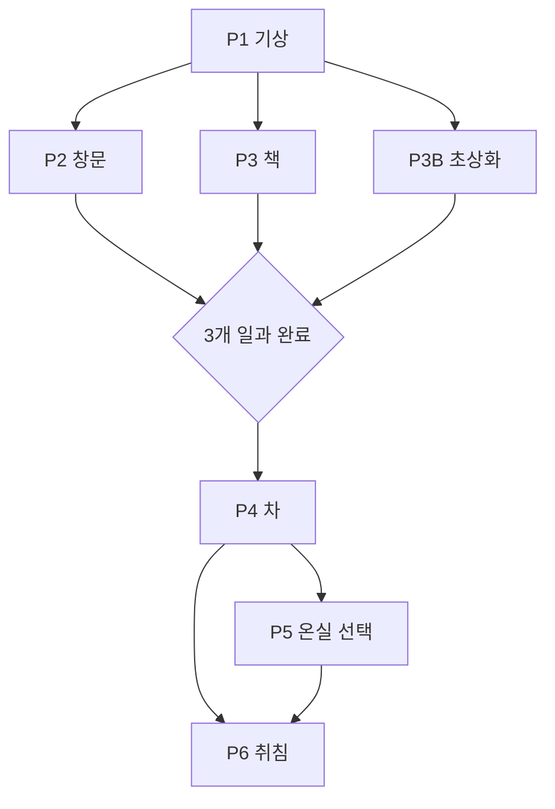

# GGB v0.4 이벤트 상세 01: 튜토리얼·일상

## 1. 전체 흐름



## 2. 공통 목표

- 이동, 조사, 아이템 사용, 기록 비교를 학습.
- 다섯 사용인을 일상 역할로 소개.
- 수첩, 일지, 색·문양을 후속 시스템의 원자료로 배치.
- 공포를 직접 설명하지 않고 반복 가능한 미세 모순으로 조성.

## 3. P1 기상과 아침 인사

| 항목 | 내용 |
| --- | --- |
| 위치 | 침실 |
| 등장 | 에드가 |
| 목표 | 방 조사 후 문으로 이동 |
| 학습 | 클릭 조사, 대화, 수첩 |

필수 조사 2개:

- 침대: 지나치게 같은 온기.
- 창문: 맑은 날씨와 반복 궤도의 새.
- 아버지 사진: 익숙하지만 구체적 기억이 없음.
- 수첩: 낙서와 빈 기록 페이지.

에드가는 세 아침 일과를 제시한다.

```text
에드가:
대응접실의 창문, 서재의 책,
그리고 북쪽 회랑의 초상화를 부탁드립니다.
```

완료:

```yaml
event_P1_complete: true
time_phase: morning
objectives: [P2, P3, P3B]
```

## 4. P2 창문 닦기

| 위치 | 대응접실 |
| --- | --- |
| 담당 | 마라 1 |
| 목표 | 위에서 아래로 세 창 닦기 |
| 학습 | 도구 선택, 순서 상호작용 |

정답:

1. 부드러운 천 선택.
2. 위쪽 먼지 제거.
3. 가운데 얼룩 제거.
4. 아래 물기 닦기.

오답은 즉시 재시도한다. 세 번째 창에서 새가 같은 궤도를 두 번 지나간다.

마라 1:

```text
마라 1:
일은 느린데 눈은 좋네.
그 새까지 닦아낼 생각은 하지 마.
```

보상:

- `event_P2_complete`
- 마라 1 주황 대각선 닦임 문양 최초 기록.

## 5. P3 책 정리와 일지 발견

| 위치 | 서재 |
| --- | --- |
| 담당 | 에드가 |
| 목표 | 문양·높이에 맞춰 책 3권 배치 |
| 학습 | 오브젝트 비교, 숨은 오브젝트 |

책:

- 시계 문양: 기계공학 선반.
- 꽃 문양: 식물·환경 선반.
- 찻잔 문양: 생활 기록 선반.

시계 문양 책을 꽂으면 낡은 일지가 떨어진다. 일지는 읽히지 않으며 어린 주인공의 집 낙서가 표지 안쪽에 있다.

에드가:

```text
에드가:
오래된 장부입니다.
제자리에 두시는 편이 좋겠습니다.
```

보상:

- `journal_object_found`
- `note_journal`
- 에드가 남색 수직선이 일지 잠금쇠에 잠깐 겹침.

## 6. P3B 초상화 이름표 정리

### 기본 정보

| 항목 | 내용 |
| --- | --- |
| 위치 | 북쪽 기록 회랑 |
| 등장 | 마라 2 |
| 첫 플레이 | 4~7분 |
| 반복 | 5~12초 |
| 목표 | 초상화 5점에 올바른 이름표 배치 |
| 학습 | 색·문양·소리의 다중 대응 |

### 시작

마라 2는 사다리 위에서 이름표를 뒤섞어 놓고 주인공에게 정리를 떠넘긴다.

```text
마라 2:
늦었어! 엄청 늦었어!
다섯 장밖에 안 되는데 설마 못 맞히는 건 아니지?!
```

### 초상화 단서

| 초상화 장식 | 이름표 문양 | 담당 |
| --- | --- | --- |
| 남색 직선 프레임 | 잠금선 | 에드가 |
| 주황 대각 붓자국 | 닦임 | 마라 1 |
| 검정 바탕·연두 귀 장식 | 이중 맥박 | 루카 |
| 흰 옷·연노랑 머리 | 꽃잎 | 이리스 |
| 보라 이중 액자 | 겹친 프레임 | 마라 2 |

색상 접근성 모드에서는 이름표 테두리 패턴과 짧은 음향을 재생한다.

### 조작

1. 초상화 조사.
2. 이름표 선택.
3. 문양과 프레임 홈 비교.
4. 다섯 장 배치 후 종을 울려 검증.

첫 검증은 맞은 개수만 알려준다. 두 번째 실패부터 맞는 이름표를 고정할 수 있다.

### 마라 2의 지성

주인공이 오답을 내면 마라 2는 단순히 놀리지 않고 어떤 분류 오류인지 정확히 말한다.

```text
마라 2:
색만 봤지?! 그래서 틀린 거야!
선이 닫혔는지 갈라졌는지부터 봐야지. 기본이잖아!
```

### 취약성 전조

자기 이름표를 배치하면 마라 2가 즉시 확인한다.

```text
마라 2:
그건 거기 맞아!
...맞지? 내가 쓴 이름이니까 당연히 맞지!
```

표기된 이름 일부는 긁혀 있지만 자세히 읽을 수 없다.

### 완료

```yaml
event_P3B_complete: true
color_signatures_known:
  - navy_lock
  - orange_wipe
  - black_lime_pulse
  - white_yellow_bloom
  - purple_archive
servants.mara2.introduced: true
```

## 7. P4 차 준비

| 위치 | 주방 |
| --- | --- |
| 담당 | 루카 |
| 목표 | 찻잎, 물, 잔 순서로 차 준비 |
| 학습 | 아이템 조합과 순서 |

정답:

1. 잔 데우기.
2. 찻잎 계량.
3. 뜨거운 물 붓기.
4. 짧게 기다린 뒤 따르기.

아버지 질문 선택:

- 아버지가 좋아한 차.
- 저택을 지은 시기.
- 루카가 오래 일했는지.

루카의 귀 부분 연두색이 생체 신호처럼 두 번 점멸하지만 캐릭터 디자인으로 받아들이게 한다.

## 8. P5 잠긴 온실과 날씨 모순

| 위치 | 온실 앞 |
| --- | --- |
| 담당 | 이리스 |
| 필수 | 아니오 |
| 목표 | 창밖과 온실의 날씨 비교 |

온실 안에는 비가 내리지만 복도 창밖은 맑다. 이리스는 `오늘도 비가 온다`고 말한다.

```text
이리스:
비는 안쪽에서만 오는 날도 있어요.
밖이 언제나 바깥인 건 아니니까.
```

보상:

- `noted_weather_conflict`
- 이리스 흰 꽃잎·연노랑 후광 기록.

## 9. P6 취침 권유

| 위치 | 침실 |
| --- | --- |
| 시간 | 밤 |
| 등장 | 에드가, 조건별 사용인 |
| 목표 | 잠들어 첫 리셋 진입 |

이동 제한은 문 잠금보다 사용인들의 반복 권유와 소리 감소로 표현한다.

침대 확인:

```text
오늘을 끝내고 잠든다.
[잠든다] [조금 더 조사한다]
```

첫 취침은 `SYS-01`로 연결한다.

## 10. 완료 기준

- P2, P3, P3B가 모두 완료되어야 P4 진행.
- P3B 실패로 진행이 막히지 않도록 3회 실패 후 문양 두 개 고정.
- 색상만으로 이름표를 구분하지 않음.
- P3B 반복은 숏컷 가능.
- 프롤로그 총 플레이타임 25~35분.

