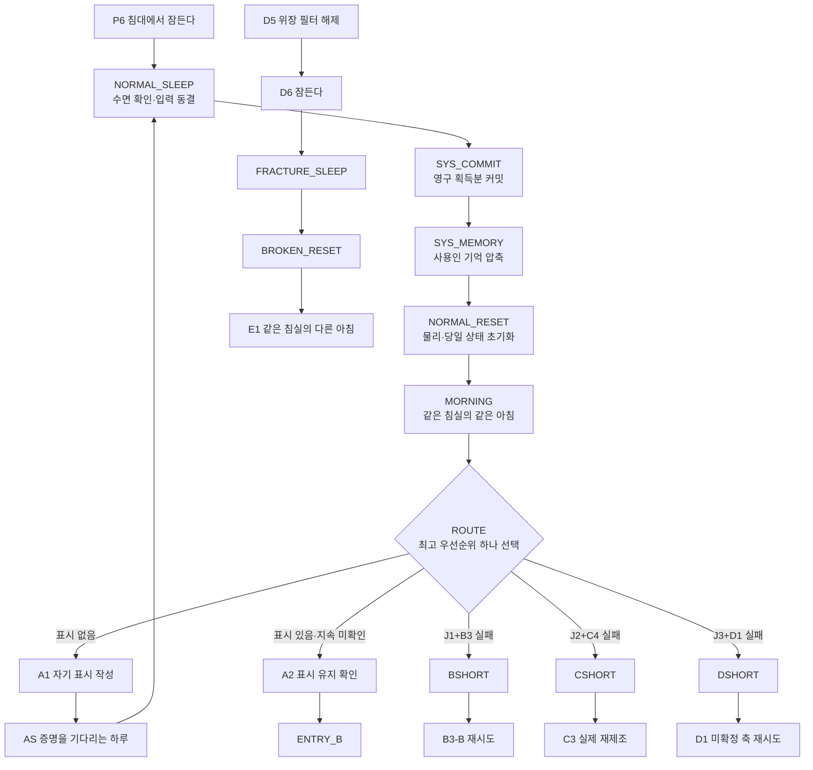
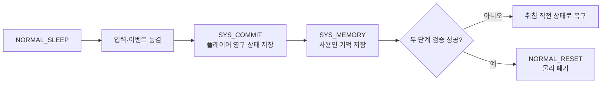
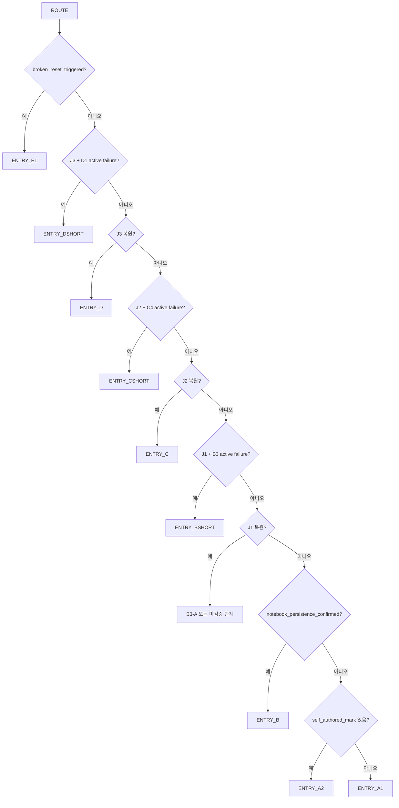

# GGB v0.4 이벤트 상세 02: 루프·영구 정보·숏컷

## 1. 문서 목적

본 문서는 D5 이전의 수면 리셋, 리셋 뒤 영구 정보 판정, 반복 일과 압축, 하드 실패 뒤 재도전 숏컷을 장면·상태·구현 단위로 정의한다.

담당 범위:

- `NORMAL_SLEEP`부터 `ROUTE`까지의 정상 리셋 트랜잭션.
- 첫 리셋의 감각 연출과 주인공의 루프 인지.
- `A1`, `AS`, `A2`의 자기 연속성 검증.
- 수첩·일지·퍼즐 검증·관계·잔류 기억의 영구 저장.
- P2·P3·P3B·P4 반복 일과의 압축.
- `BSHORT`, `CSHORT`, `DSHORT`의 해금·실행·중단·재개.
- 사용인이 이전 루프를 기억하면서도 필수 진행을 막지 못하는 규칙.
- 반복 대화, 목표 복구, 수면 UI, 접근성, 오류 복구.
- D5 이후 수면 체계로 넘기는 시스템 경계.

본 문서가 담당하지 않는 범위:

| 영역 | 담당 문서 |
| --- | --- |
| 퍼즐 정답·입력 규칙 | `08_이벤트상세_03_메인퍼즐.md` |
| 일지 원문·정보 조사 | `09_이벤트상세_04_정보조사_일지복원.md` |
| 공간 잠금·해금 | `10_이벤트상세_05_공간잠금_해금_동선.md` |
| 사용인 짧은 관계 장면 | `11_이벤트상세_06_사용인짧은반응.md` |
| D5·BROKEN_RESET의 감정 장면 | `13_이벤트상세_08_파열_전환_결산.md` |
| 실제 Godot 리소스 구조 | `17_상태변수_이벤트ID_Godot데이터구조.md` |

## 2. 기준 문서와 우선순위

| 우선 | 문서 | 적용 영역 |
| --- | --- | --- |
| 1 | `03_전체이벤트흐름도.md` | 실제 진행 순서와 합류점 |
| 2 | `04_전체이벤트리스트_상태표.md` | 이벤트 ID·플래그·실패 정책 |
| 3 | `02_루프_관계_기억_색상서명시스템.md` | 시스템 불변 규칙 |
| 4 | `05_공간구성지도_및_동선.md` | 위치 ID와 이동 경로 |
| 5 | `06_이벤트상세_01_튜토리얼_일상.md` | 첫 수면 직전 상태 |
| 6 | `24-3_메인퍼즐_고난도개정안.md` | 하드 실패 뒤 유지할 퍼즐 검증 |

충돌 시 최신 확정 흐름인 `03·04·06`의 다음 체인을 사용한다.

```text
NORMAL_SLEEP
→ SYS_COMMIT
→ SYS_MEMORY
→ NORMAL_RESET
→ MORNING
→ ROUTE
```

## 3. ID 정리

### 3.1 사용하지 않는 구식 ID

| 구식 표기 | 처리 |
| --- | --- |
| `RESET` | `NORMAL_SLEEP`부터 `NORMAL_RESET`까지의 체인으로 분해 |
| `SYS-01` | 별도 이벤트로 사용하지 않고 MORNING의 첫 리셋 변형으로 흡수 |
| `SYS-02` | 반복 일과 압축 정책으로 흡수 |
| `SYS-03` | 반복 대화 라우팅 정책으로 흡수 |
| `SYS-04` | 목표 복구 힌트 정책으로 흡수 |

구식 ID는 신규 상태·이벤트 리소스·세이브 데이터에 기록하지 않는다.

### 3.2 실제 콘텐츠·시스템 ID

| 분류 | ID |
| --- | --- |
| 수면·리셋 | NORMAL_SLEEP, SYS_COMMIT, SYS_MEMORY, NORMAL_RESET, MORNING, ROUTE |
| 루프 증명 | A1, AS, A2 |
| 실패 결과 | BF, CF, DF |
| 재도전 숏컷 | BSHORT, CSHORT, DSHORT |
| 후반 경계 | FRACTURE_SLEEP, BROKEN_RESET, POST_BROKEN_REST, FINAL_SLEEP_LOCK |

## 4. 불변 설계 규칙

1. D5 이전에 잠들면 언제나 같은 침실의 같은 아침으로 돌아간다.
2. 정상 리셋에는 플레이어가 선택하는 중간 체크포인트가 없다.
3. 물리 상태는 초기화되지만 수첩·일지·검증 지식·관계·사용인 기억은 유지된다.
4. 리셋 정답이나 사용인 동선에 무작위성을 사용하지 않는다.
5. HARD FAILURE는 B3-B, C4, D1에만 사용한다.
6. HARD FAILURE 뒤에도 남은 자유 조사를 마치고 잠들 수 있다.
7. 실패한 시도는 다음 루프에 새로운 정보 또는 실행상 이점을 남긴다.
8. 숏컷은 이미 해결한 준비를 압축하지만 최종 판단과 물리 실행을 대신하지 않는다.
9. 사용인의 높은 bond는 정답을 말하지 않는다.
10. 사용인의 높은 alert는 질문·확인·우회 동선을 만들 수 있지만 필수 경로를 없애지 않는다.
11. 선택 관계 이벤트는 ROUTE의 필수 진입점을 바꾸지 않는다.
12. 색상 서명은 소유자 식별을 돕지만 퍼즐 정답을 단독으로 제공하지 않는다.
13. D5 이후에는 NORMAL_RESET으로 복귀하지 않는다.
14. 게임 저장·불러오기는 서사상의 수면 리셋과 구분한다.
15. 같은 조건의 반복 수면으로 관계값이나 기록을 무한 획득할 수 없다.

## 5. 전체 흐름



### 5.1 한 루프의 플레이 리듬

```text
같은 아침
→ 영구 정보 확인
→ 필요한 준비만 수행
→ 새 조사 또는 실제 퍼즐 입력
→ 성공 또는 비가역 실패
→ 남은 자유 조사
→ 잠들기
→ 정보와 기억만 남기고 물리 세계 재생성
```

### 5.2 감정 리듬

| 단계 | 주인공의 중심 감정 | 플레이어가 얻는 감각 |
| --- | --- | --- |
| 첫 리셋 | 부정·기시감 | 완벽하게 같은 장면의 불쾌함 |
| A1 | 검증 충동 | 자기 손으로 흔적을 남기는 통제감 |
| A2 | 안도와 공포 | 자신은 이어지고 세계는 되감긴다는 확신 |
| BSHORT | 능숙함의 불쾌함 | 실패가 후보를 줄였다는 이해 |
| CSHORT | 촉각 기억 | 물질은 사라졌지만 몸이 실패를 기억함 |
| DSHORT | 안전장치 의존 | 잠이 세계를 고친다는 마지막 신뢰 |
| D5 이후 | 안전장치 상실 | 익숙한 리셋이 작동하지 않는 공포 |

## 6. 목표 플레이타임

| 구간 | 첫 실행 | 반복·재시도 |
| --- | --- | --- |
| NORMAL_SLEEP~MORNING | 45~70초 | 5~15초 |
| ROUTE | 즉시 | 즉시 |
| A1 | 3~5분 | once |
| AS | 1~3분 | once |
| A2 | 2~4분 | once |
| 반복 일과 전체 압축 | 35~90초 | 20~60초 |
| BSHORT | 2~5분 | 1~3분 |
| CSHORT | 3~7분 | 2~5분 |
| DSHORT | 2~6분 | 1~4분 |

시간은 실시간 제한이 아니라 예상 체류 시간이다.

## 7. 상태 계층

### 7.1 리셋 범위

| 계층 | 예시 | NORMAL_RESET |
| --- | --- | --- |
| 물리 월드 | 문, 물체 위치, 유리 얼룩, 코팅 | S0 기준 초기화 |
| 인벤토리 | 천, 약품, 탁본지, 세정제 | 초기화 |
| 퍼즐 물리 | 시계 카드, 위상 다이얼, 축 깊이 | 초기화 |
| 당일 진행 | 시간대, 완료 일과, 자유 조사 소비 | 초기화 |
| 사용인 당일 위치 | 순찰 위치, 길 막기, 도구 소지 | 초기화 |
| 영구 지식 | 수첩, 실패 원인, 검증 단계 | 유지 |
| 일지 | `journal_stage` | 유지 |
| 숏컷 권한 | 준비·이동 축약 조건 | 유지 |
| 관계 | bond, alert, 완료 이벤트 | 유지 |
| 잔류 기억 | 목격·감정·행동 패턴 | 유지 |
| 색상 식별 | 소유자·문양·음향 | 유지 |
| 물리 색 잔상 | 당일 얼룩·글리치 | 초기화 |
| 챕터 오버레이 | S0~S2 연출 단계 | 영구 진행에 맞춰 재적용 |

### 7.2 물리와 지식 분리

```text
C3 비율을 검증함
→ 5:1:2 제약식 지식 유지
→ 제조한 세정제는 리셋 때 소실
→ CSHORT에서 재료 확보만 압축
→ C3의 실제 제조는 다시 수행
```

```text
D1의 첫 축이 맞았음을 검증함
→ 실제 축은 원위치
→ 검증된 깊이·순서는 수첩에 유지
→ 다음 시도는 미확정 축부터 판단
```

### 7.3 챕터 오버레이

| 오버레이 | 조건 | 아침 변화 |
| --- | --- | --- |
| S0 | 프롤로그·A 초반 | 정상 고딕 저택 |
| S1 | J1 이후 | 반복 문장, 미세한 서명 잔상 |
| S2 | J2·J3 이후 | 진단 누수, SF 재질 한 프레임 |
| S3 | BROKEN_RESET | 고딕 위장 복구 실패 |

S1·S2는 이전 루프의 물리 손상이 남은 상태가 아니다. 영구 진행을 읽어 새로 적용한 연출 오버레이다.

## 8. 영구 정보 수명 주기

### 8.1 단계

| 단계 | 상태 | 수첩 | 시스템 사용 |
| --- | --- | --- | --- |
| 미발견 | unknown | 없음 | 불가 |
| 관찰 | observed | 사실 묘사 | 대화 조건 일부 |
| 가설 | hypothesized | 물음표 | 시험 입력 가능 |
| 검증 | verified | 확인 표시 | 숏컷·입력 고정 가능 |
| 인증 | authenticated | 시스템 원문 | F0 권한 판정 |

### 8.2 영구 저장 조건

영구 정보로 커밋하려면 하나 이상을 만족해야 한다.

- 수첩에 명시적으로 기록했다.
- 퍼즐의 가역 시험으로 하위 단계가 검증됐다.
- HARD FAILURE 결과가 원인을 구분했다.
- 일지 복원 이벤트가 완료됐다.
- 사용인 관계 이벤트가 완료 결과를 냈다.
- 시스템 패널이 소유자·권한을 인증했다.

다음은 영구 정보가 아니다.

- 플레이어가 화면만 보고 추측한 내용.
- 완료하지 않은 대화 선택지.
- 제조 중간 상태.
- 시험하지 않은 퍼즐 배치.
- 우연히 맞췄지만 검증 피드백을 받지 않은 하위 입력.

### 8.3 실패 기록 상태

```yaml
failure_record:
  failure_id: FAIL_B3_PHASE_EARLY
  source_event_id: B3_B
  status: active
  observed_result: "중계 신호가 열두 번째 종과 동시에 도착했다"
  validated_steps:
    - clock_role_reference
    - clock_role_relay
    - clock_role_output
  invalidated_steps:
    - relay_phase_zero
  first_loop: 3
  occurrence_count: 1
```

| 상태 | 의미 |
| --- | --- |
| active | 다음 ROUTE와 숏컷이 읽음 |
| resolved | 퍼즐 성공 뒤 기록 보관함으로 이동 |
| superseded | 더 높은 단계의 검증 정보가 대체 |

성공한 퍼즐의 과거 실패 기록은 삭제하지 않지만 현재 목표에는 표시하지 않는다.

## 9. 정상 리셋 트랜잭션

### 9.1 처리 장벽

물리 상태를 폐기할 수 있는 시점은 `SYS_COMMIT`과 `SYS_MEMORY`가 모두 성공한 뒤다.



### 9.2 트랜잭션 원칙

- 각 수면 시도에 고유 `reset_transaction_id`를 부여한다.
- 같은 ID로 재시도할 때 지식·관계·기억을 중복 적용하지 않는다.
- `NORMAL_RESET`은 두 커밋 완료 플래그를 확인한 뒤에만 실행한다.
- 물리 폐기 중 오류가 나면 S0 월드를 다시 생성하고 같은 ROUTE 결과를 복원한다.
- 세이브 파일은 마지막 완료 단계와 다음 재개 단계를 함께 기록한다.

## 10. NORMAL_SLEEP

### 10.1 기본 정보

| 항목 | 내용 |
| --- | --- |
| 이벤트 ID | NORMAL_SLEEP |
| 위치 | 현재 수면 가능 지점, 기본 `M2_BEDROOM` |
| 시간 | 수면 가능 |
| 선행 조건 | D5 이전, `loop_mode=normal` |
| 첫 진입 | P6, `iris_greeting_seen=true` |
| 목표 | 당일 결과를 확인하고 잠들기 |
| 실패 | 없음 |
| 취소 | 확인창에서 가능 |
| 다음 | SYS_COMMIT |

### 10.2 수면 가능 조건

허용:

- 프롤로그 일과와 필수 소개가 완료됨.
- A1 표시가 작성됨.
- J단계 복원 뒤 다음 루프가 필요함.
- HARD FAILURE로 당일 장치가 잠김.
- 플레이어가 현재 자유 조사를 끝내고 자발적으로 잠듦.

일시 차단:

- 필수 결과 연출 재생 중.
- 관계 변화 커밋 선택지가 열려 있음.
- 퍼즐 확인창이 열려 있음.
- 인벤토리 이동 트랜잭션 진행 중.
- D5 뒤 정상 수면 호출.

### 10.3 확인창 변형

첫 수면:

```text
오늘의 일과를 마쳤다.
잠드시겠습니까?

[잠든다]
[조금 더 둘러본다]
```

루프 확정 뒤:

```text
잠들면 오늘의 물건 배치와 장치 상태가 되돌아간다.

남는 것:
수첩·일지·검증한 정보·사용인과의 기억

되돌아가는 것:
소지품·문·도구·장치 입력·현재 시간

[잠든다]
[돌아간다]
```

HARD FAILURE 뒤:

```text
이 장치는 오늘 다시 움직이지 않는다.
실패 원인과 확인한 단계는 수첩에 남아 있다.

[남은 조사를 마친다]
[잠들어 다시 시도한다]
```

### 10.4 남은 자유 조사

- 실패 장치와 연결된 필수 입력은 비활성화한다.
- 실패 결과·소리·파손 부위를 다시 조사할 수 있다.
- 목격한 사용인과 짧은 반응을 볼 수 있다.
- 이미 열린 다른 선택 조사와 공통 오브젝트 반응은 유지한다.
- 강제 시간 제한을 두지 않는다.
- 조사 가능한 신규 정보가 없으면 침실 목표를 지도에서 강조한다.

### 10.5 상태 출력

```yaml
event_id: NORMAL_SLEEP
outputs:
  create_reset_transaction: true
  freeze_player_input: true
  close_open_interactions: true
  next_event: SYS_COMMIT
guards:
  - loop_mode == normal
  - camouflage_filter_disabled == false
```

### 10.6 감각 연출

- 침대에 누우면 저택의 모든 시계가 한 번씩 다른 속도로 멎는다.
- 마지막까지 남는 소리는 사용인 구역의 낮은 기계음이다.
- 첫 수면은 따뜻한 이불 감촉을 강조한다.
- 루프 확정 뒤에는 이불의 무게가 매번 같은 위치를 누른다는 사실을 강조한다.
- HARD FAILURE 뒤에는 손에 남지 않은 금속 충격이나 코팅의 끈적함을 먼저 떠올린다.

## 11. SYS_COMMIT

### 11.1 기본 정보

| 항목 | 내용 |
| --- | --- |
| 이벤트 ID | SYS_COMMIT |
| 위치 | 비가시 시스템 처리 |
| 선행 조건 | NORMAL_SLEEP 승인 |
| 목표 | 플레이어 측 영구 획득분 저장 |
| 플레이 시간 | 0.1~1초, 암전 안에서 처리 |
| 실패 | 취침 직전 상태 복구 |
| 다음 | SYS_MEMORY |

### 11.2 커밋 대상

- 새 수첩 항목.
- `self_authored_mark`.
- `journal_stage`.
- verified·authenticated 지식.
- 활성 실패 기록.
- 검증된 퍼즐 하위 단계.
- 해금한 공간·이동 숏컷.
- bond·alert 변화.
- 관계 이벤트 완료 여부.
- 연구원 기록.
- 확인한 색상 서명.
- 짧은 이벤트 최초 확인 여부.

커밋하지 않는 대상:

- 당일 인벤토리와 물리 퍼즐 입력.
- 현재 사용인 위치.
- 미완료 대화.
- 검증되지 않은 추론.
- 제조 중간 상태.

### 11.3 중복 적용 방지

```yaml
persistent_delta:
  transaction_id: RESET_0004
  applied_event_results:
    - BF
    - MARA1_S1
  knowledge_updates:
    - knowledge_id: b3_relay_phase
      from: hypothesized
      to: verified
  relationship_updates:
    MARA1:
      bond_delta: 1
      source_once_key: MARA1_S1_COMPLETE
```

같은 `source_once_key`는 두 번 적용하지 않는다.

### 11.4 오류 처리

| 오류 | 처리 |
| --- | --- |
| 세이브 쓰기 실패 | NORMAL_RESET 금지, 취침 직전 복구 |
| 이벤트 결과 누락 | 해당 결과 보류, 오류 로그, 플레이 상태 유지 |
| 중복 transaction_id | 결과 재적용 없이 SYS_MEMORY로 이동 |
| 손상된 지식 단계 | 직전 정상 세이브의 낮은 단계로 복원 |

## 12. SYS_MEMORY

### 12.1 기본 정보

| 항목 | 내용 |
| --- | --- |
| 이벤트 ID | SYS_MEMORY |
| 위치 | 비가시 시스템 처리 |
| 선행 조건 | SYS_COMMIT 성공 |
| 목표 | 당일 목격·감정·패턴을 사용인별 잔류 기억으로 압축 |
| 실패 | NORMAL_RESET 금지, 동일 transaction_id로 재시도 |
| 다음 | NORMAL_RESET |

### 12.2 기억 후보

수집:

- 사용인이 직접 본 금지 구역 접근.
- B2에서 에드가가 직접 본 기록 내실 체류, 숨기 시도, 발각 뒤 반응.
- HARD FAILURE의 파손·소리·주인공 반응.
- 자신에게 한 질문과 선택 답변.
- 반복된 일과 속도 변화.
- 관계 이벤트의 핵심 선택.
- 자기 담당 영역 센서로 감지한 이상.

수집하지 않음:

- 다른 층에서 일어난 세부 행동.
- 사용인이 접근할 수 없는 수첩 원문.
- 미선택 대화와 플레이어 전용 UI 정보.
- 다른 사용인의 사적 기억 원문.

### 12.3 기억 압축

```yaml
residual_memory:
  memory_id: MEM_EDGAR_B3_FAILURE_01
  transaction_id: RESET_0004
  observer_id: EDGAR
  source_type: direct
  event_tag: B3_FAILURE
  fact_summary: "주인공이 대시계 실제 작동 뒤 봉인핀 파손을 보았다"
  emotion_tag: fear
  confidence: 3
  occurrence_count: 1
  disclosure_level: metaphor
```

동일한 `observer_id+event_tag+핵심 결과`는 새 항목을 만들지 않고 `occurrence_count`와 감정 강도만 갱신한다.

### 12.4 기억 한계와 진행 보호

1. 기억은 담당 영역 중심으로 압축된다.
2. 표층 역할 스크립트는 아침마다 다시 적용된다.
3. 역할을 벗어난 직접 고백은 D5 전까지 언어 필터에 막힌다.
4. 개입에는 루프별 예산이 있다.
5. 높은 alert도 한 번 확인·제지한 뒤 우회 경로를 남긴다.
6. 필수 정보는 수첩과 환경에서 독립적으로 확보된다.

### 12.5 사용인별 기억 편향

| 사용인 | 잘 남는 기억 | 흐려지는 기억 |
| --- | --- | --- |
| 에드가 | 규칙 위반, 시간, 동선, 위험 | 감정의 원인 |
| 마라 1 | 수리 순서, 손의 움직임, 실수 | 공식 명칭 |
| 루카 | 생체 반응, 떨림, 통증, 피로 | 정확한 공간 좌표 |
| 이리스 | 계절, 환경 변화, 주인공 표정 | 자신에게 불리한 책임 서술 |
| 마라 2 | 이름, 체크섬, 기록 출처 | 삭제된 자기 개인 기억 |

## 13. NORMAL_RESET

### 13.1 기본 정보

| 항목 | 내용 |
| --- | --- |
| 이벤트 ID | NORMAL_RESET |
| 위치 | 시스템 처리 후 `M2_BEDROOM` |
| 선행 조건 | SYS_COMMIT·SYS_MEMORY 성공 |
| 목표 | 물리·당일 상태 폐기와 같은 아침 재생성 |
| 플레이 시간 | 첫 10~20초, 이후 2~5초 |
| 실패 | S0 생성 재시도 |
| 다음 | MORNING |

### 13.2 처리 순서

1. `loop_index`를 한 번 증가시킨다.
2. 당일 이벤트 큐를 닫는다.
3. 인벤토리를 비운다.
4. 오브젝트·문·퍼즐 물리 상태를 S0 기준으로 되돌린다.
5. 사용인 표층 위치와 일과를 아침 기준으로 배치한다.
6. `journal_stage`에 맞는 S0·S1·S2 오버레이를 적용한다.
7. 관계·잔류 기억·색상 식별을 다시 결합한다.
8. 개입 예산을 재충전한다.
9. `M2_BEDROOM`을 로드한다.
10. MORNING을 호출한다.

```yaml
clear:
  - inventory
  - object_states
  - puzzle_physical_state
  - completed_daily_tasks
  - daily_dialogue_counts
  - servant_locations
  - hard_failure_id
  - physical_color_residue
  - daily_intervention_usage
  - b2_attention_level
  - b2_edgar_entry_used
  - b2_hide_discovered
  - b2_caught_once
reset:
  time_segment: morning
  player_location: M2_BEDROOM
  world_template: S0
```

### 13.3 초기화 예시

| 이전 밤 | 다음 아침 |
| --- | --- |
| P2 창문이 깨끗함 | 원래 얼룩 복원 |
| P3 책이 정리됨 | 원래 책 배치 |
| P3B 이름표 정렬 | 원래 이름표 배치 |
| 제조한 세정제 소지 | 인벤토리에서 소실 |
| C4 코팅 경화 | 정상 검은 코팅 복원 |
| D1 압력핀 하강 | 세 축 원위치 |
| B2에서 에드가 진입 | `b2_attention_level`과 당일 진입 여부 초기화 |
| 에드가의 강한 제지 사용 | 개입 예산 재충전 |

물리 상태는 완전히 초기화되지만 수첩, 사용인의 말 멈춤, 색상 서명 잔상, J단계 SF 누수는 영구 진행 오버레이로 다시 적용한다.

## 14. MORNING

### 14.1 기본 정보

| 항목 | 내용 |
| --- | --- |
| 이벤트 ID | MORNING |
| 위치 | `M2_BEDROOM` |
| 시간 | 아침 |
| 선행 조건 | NORMAL_RESET 완료 |
| 목표 | 동일한 아침 확인, 새 영구 정보 알림, ROUTE 호출 |
| 첫 실행 | 45~70초 |
| 반복 | 5~20초 |
| 다음 | ROUTE |

### 14.2 첫 리셋 변형

별도 `SYS-01` 이벤트를 만들지 않는다.

```yaml
event_id: MORNING
variant_id: FIRST_NORMAL_RESET
condition:
  all:
    - loop_index == 1
    - loop_awareness != confirmed
```

### 14.3 첫 리셋 연출

1. 암전이 끝나기 전 냉각 장치의 흰 선이 한 프레임 보인다. (넣을지 말지 고민)
2. P1과 같은 새소리가 같은 박자에 재생된다.
3. 커튼 빛과 먼지가 같은 궤도로 움직인다.
4. 에드가가 같은 위치와 억양으로 인사한다.
5. 마지막 단어 뒤에만 한 박자 공백이 생긴다.
6. 비교 가능한 오브젝트가 강조 없이 활성화된다.

| 비교 대상 | 확인 |
| --- | --- |
| 침실 창문 | 닦기 전과 같은 얼룩 |
| 수첩 | 전날 기록 유지 |
| 서랍 | 원래 물건 위치 |
| 복도 새소리 | 같은 시점·횟수 |
| P3B 이름표 | 원래 물리 배치 |

하나를 비교하면 `loop_awareness=suspected`로 바뀐다.

### 14.4 에드가 반응

```text
“좋은 아침입니다, 아가씨.
오늘의 일과를 확인하시겠습니까?”
```

선택:

```text
[어제도 같은 말을 하지 않았나요?]
[오늘이 며칠인가요?]
[아무 말 없이 수첩을 확인한다.]
```

```text
“피로가 남으신 듯합니다.
오늘은 오늘의 일과부터 확인하시지요.”
```

첫 리셋에는 에드가가 직접 기억을 고백하지 않는다.

### 14.5 정체 힌트와 반복 길이

| 조건 | 처리 |
| --- | --- |
| 20초 정체 | 같은 새소리 반복 |
| 비교 없이 이탈 | 주인공이 수첩을 바라봄 |
| 에드가 세 번 대화 | 흔적을 남겨야 한다는 독백 |
| 새 영구 정보 없음 | 3~5초 기상 |
| 새 실패 기록 | 실패 아이콘과 한 줄 |
| 새 관계 기억 | 해당 사용인의 말 멈춤 |
| 새 J단계 | 오버레이 5~8초 |

```yaml
event_id: MORNING
outputs:
  apply_chapter_overlay: true
  restore_intervention_budget: true
  display_new_persistent_results: true
  next_event: ROUTE
```

## 15. ROUTE

### 15.1 기본 정보

| 항목 | 내용 |
| --- | --- |
| 이벤트 ID | ROUTE |
| 위치 | 비가시 판정, 결과는 침실 목표 UI에 반영 |
| 선행 조건 | MORNING 완료 |
| 목표 | 가장 높은 진행 단계 하나만 선택 |
| 플레이 시간 | 즉시 |
| 실패 | 안전 기본 경로로 복구 |

### 15.2 우선순위



| 우선 | 조건 | 진입 | 축약 |
| --- | --- | --- | --- |
| 1 | broken_reset_triggered | ENTRY_E1 | 정상 ROUTE 종료 |
| 2 | J3 + D1 active failure | DSHORT | D0-A·검증 축 유지 |
| 3 | J3 | ENTRY_D | D0 재확인 |
| 4 | J2 + C4 active failure | CSHORT | 정보 조사·재료 확보 축약 |
| 5 | J2 | ENTRY_C | C0 |
| 6 | J1 + B3 active failure | BSHORT | 탁본·이동 축약 |
| 7 | J1 | B3-A 또는 미검증 단계 | 검증 단계 유지 |
| 8 | A2 완료, J1 미복원 | ENTRY_B | B1 |
| 9 | 표시 있음, 지속 미확인 | ENTRY_A2 | 수첩 확인 |
| 10 | 표시 없음 | ENTRY_A1 | 실험 시작 |

### 15.3 판정 규칙

- 위에서 처음 충족한 경로 하나만 활성화한다.
- 더 높은 J단계가 낮은 장의 실패 기록보다 우선한다.
- 퍼즐 성공 시 해당 failure를 resolved로 바꾼다.
- 관계 이벤트와 색상 선택 조사는 `pending_reactions`로 분리한다.
- ROUTE는 퍼즐을 해결하지 않고 목표와 진입점만 선택한다.

숏컷 활성 시 선택:

```text
[기록한 순서대로 준비한다.]
[직접 다시 둘러본다.]
[먼저 다른 조사를 한다.]
```

직접 진행을 선택해도 숏컷 권한과 실패 정보는 유지된다.

### 15.4 저장·복구

```yaml
route_snapshot:
  loop_index: 4
  selected_entry: ENTRY_CSHORT
  reason_flags:
    - journal_stage_2
    - c4_hard_failure_seen
  consumed: false
```

로드 시 같은 영구 상태라면 같은 ENTRY를 복원한다. 데이터가 불명확하면 가장 높은 J단계의 안전한 조사 시작점으로 보낸다.

## 16. A1 자기 표시 작성

### 16.1 기본 정보

| 항목 | 내용 |
| --- | --- |
| 이벤트 ID | A1 |
| 위치 | `M2_BEDROOM` |
| 시간 | 아침 |
| 선행 조건 | 첫 NORMAL_RESET, self_authored_mark 없음 |
| 목표 | 다음 아침의 자신이 식별할 표시 작성 |
| 플레이 시간 | 3~5분 |
| 실패 | 없음 |
| 다음 | AS |

주인공:

```text
“다시 돌아온다면,
남는 게 우연인지 내가 정한 건지 확인해야 해.”
```

### 16.2 표시

| 선택 | 후속 감각 | F0-E 사용 |
| --- | --- | --- |
| `내일 아침, 이 문장을 읽어.` | 문장 의미 | 자기 지시 |
| 어린 시절 집 도형 | 연필 압력·획 순서 | 개인 습관 |
| 페이지 모서리 잉크 얼룩 | 위치·번짐 | 자기 표식 |

세 선택 모두 유효하다.

오답 실험:

- 침실 벽 낙서는 물리 월드라 리셋된다.
- 서랍 물건 이동은 물리 위치라 리셋된다.
- 사용인에게만 전달한 말은 자기 인증이 아니다.

이 실험을 허용하되 수첩 표시를 최종 목표로 유지한다.

```yaml
event_id: A1
outputs:
  set:
    self_authored_mark: selected_mark
  add_knowledge:
    - notebook_may_persist
  set_objective:
    - wait_for_next_morning
  next_event: AS
```

감각:

- 펜촉 소리를 주변보다 크게 재생한다.
- 마지막 획에서 호흡이 잠깐 안정된다.
- 내일의 자신을 타인처럼 부르는 공포를 강조한다.
- 종이에 닿은 손끝에 미세한 정전기가 느껴진다.

## 17. AS 증명을 기다리는 하루

### 17.1 기본 정보

| 항목 | 내용 |
| --- | --- |
| 이벤트 ID | AS |
| 위치 | `M2_BEDROOM` 시작, 저택 일과 몽타주 |
| 시간 | 아침→수면 가능 |
| 선행 조건 | A1 완료 |
| 목표 | 다음 리셋까지 하루를 보내고 잠들기 |
| 플레이 시간 | 1~3분 |
| 실패 | 없음 |
| 다음 | NORMAL_SLEEP |

### 17.2 압축 제안

```text
어제와 같은 일과가 기다리고 있다.

[익숙한 순서대로 마친다.]
[직접 다시 확인한다.]
```

압축:

1. P2 창문 닦기 2~3컷.
2. P3 외부 서고 책등 정렬 2컷.
3. P3B 이름표 문양 점등 1컷.
4. P4 차 준비의 물·모래시계 2컷.
5. 저녁 침실 귀환.

`P4_IRIS_GREETING`은 전체 재생하지 않는다. 이리스가 주방 문가에 있는 짧은 배경 컷만 허용하며 `iris_greeting_seen`을 다시 쓰지 않는다. P5 미완료라면 선택 조사만 다시 제안한다.

직접 진행을 선택하면 같은 일과를 조작할 수 있지만 정답은 바뀌지 않고 같은 완료로 관계값을 다시 올리지 않는다.

### 17.3 사용인 반응

| 사용인 | 반응 |
| --- | --- |
| 에드가 | 일과 속도를 기록하듯 바라봄 |
| 마라 1 | “벌써 손에 익으셨슴까?” |
| 루카 | 차 순서를 먼저 준비하려다 넘김 |
| 이리스 | “오늘도 익숙하시네요.” |
| 마라 2 | 이름표를 틀리게 놓으려다 멈춤 |

```yaml
event_id: AS
completion:
  all:
    - self_authored_mark != null
    - time_segment == sleep_available
next_event: NORMAL_SLEEP
```

## 18. A2 표시 유지 확인

### 18.1 기본 정보

| 항목 | 내용 |
| --- | --- |
| 이벤트 ID | A2 |
| 위치 | `M2_BEDROOM` |
| 시간 | 아침 |
| 선행 조건 | self_authored_mark 있음, 지속 미확인 |
| 목표 | 이전 자신이 쓴 표시의 동일성 확인 |
| 플레이 시간 | 2~4분 |
| 실패 | 없음 |
| 다음 | 짧은 반응 또는 ENTRY_B |

### 18.2 상호작용

1. 수첩을 연다.
2. 표식 위치를 확인한다.
3. 획·도형 순서·얼룩 번짐 중 개인 특징을 비교한다.
4. `내가 남긴 표시다`를 확정한다.

```text
“나는 어제에서 이어졌다.
그런데 방은 이어지지 않았다.”
```

### 18.3 수첩 해금

| 탭 | 기능 |
| --- | --- |
| 관찰 | observed 정보 |
| 가설 | hypothesized 정보 비교 |
| 검증 | verified 단계·퍼즐 고정 |
| 실패 기록 | active failure와 다음 시도 차이 |
| 인물 | 사용인 기억·관계 반응 |
| 서명 | 색·문양·음향 대응 |

한 사용인에게 먼저 보여 줄 수 있으나 필수는 아니다. 상세 반응은 `11`에서 다룬다.

```yaml
event_id: A2
outputs:
  set:
    notebook_persistence_confirmed: true
    loop_awareness: confirmed
  promote_knowledge:
    notebook_self_continuity: verified
  unlock_ui:
    - failure_log
    - verified_steps
    - signature_index
  next_event: ENTRY_B
```

## 19. 반복 일과 압축 정책

### 19.1 정의

주인공은 실제로 같은 행동을 수행하고 플레이어에게 이미 해결한 부분만 몽타주로 보여 준다.

사용:

- `익숙한 순서대로 마친다.`
- `기록한 절차대로 준비한다.`
- `확인한 동선으로 이동한다.`

금지:

- `스킵한다.`
- `해결된 것으로 처리한다.`
- `체크포인트로 이동한다.`

### 19.2 단계

| 완료 횟수 | 방식 |
| --- | --- |
| 최초 | 전체 조작 |
| 2회 | 핵심 입력 1~2개 |
| 3회 이상 | 5~20초 몽타주 |
| 새 이상 발생 | 해당 지점에서 중단 |

| 이벤트 | 초기화 | 압축 표현 | 길이 |
| --- | --- | --- | --- |
| P2 | 창문 얼룩 | 첫 닦임·마지막 광택 | 8~15초 |
| P3 | 책 배치 | 세 문양 일치 | 10~20초 |
| P3B | 이름표 배치 | 다섯 문양 점등 | 5~12초 |
| P4 | 차 도구 | 잔 데우기·모래시계 | 12~20초 |

### 19.3 압축 가능 조건

- 해당 행동을 한 번 직접 완료했다.
- 정답·순서가 고정됐다.
- 새로운 필수 이벤트가 없다.
- 새 글리치·색상 이상이 없다.
- 미처리 강한 개입이 없다.
- 플레이어가 직접 수행을 선택하지 않았다.

### 19.4 중단·재개

| 우선 | 원인 | 처리 |
| --- | --- | --- |
| 1 | 새 필수 장면 | 즉시 조작권 반환 |
| 2 | 안전·HARD FAILURE 경고 | 해당 공간 정지 |
| 3 | 최초 짧은 관계 이벤트 | 선택 카드 후 재개 |
| 4 | 새 색상·글리치 | 관찰 기회 |
| 5 | 반복 잡담 | 몽타주 자막 |

```yaml
shortcut_resume:
  shortcut_id: DAILY_CHORES
  completed_beats: [P2, P3]
  interrupted_at: P3B
  interruption_id: MARA2_S1
  resume_target: P3B_COMPACT_END
```

이미 완료한 비트는 재생하지 않는다.

## 20. 숏컷 공통 계약

### 20.1 해금

1. 해당 J단계 복원.
2. 해당 퍼즐의 active HARD FAILURE.
3. 준비 단계의 verified 정보.
4. NORMAL_RESET 완료.
5. D5 이전.

### 20.2 허용·금지

| 허용 | 금지 |
| --- | --- |
| 반복 일과·기록 재독·이동 압축 | 최종 정답 자동 입력 |
| 검증 단계 빠른 재현 | 미검증 후보 제거 |
| 물리 재료 빠른 재확보 | 제조 물질 영구 보존 |
| 미확정 입력 직전 반환 | 관계 수치로 정답 구매 |

플레이어는 숏컷을 거절하고 직접 진행할 수 있다. 권한과 실패 정보는 사라지지 않는다.

### 20.3 실패 횟수 보호

| 횟수 | 지원 |
| --- | --- |
| 첫 실패 | 원인 범주와 맞은 단계 |
| 두 번째 | verified 단계 고정 선택 |
| 세 번째 이상 | 관련 단서 한 화면 비교 |

정답은 자동 선택하지 않는다.

## 21. BSHORT

### 21.1 기본 정보

| 항목 | 내용 |
| --- | --- |
| 이벤트 ID | BSHORT |
| 위치 | `M2_BEDROOM`→B3-A 경유지→`M1_GREAT_CLOCK` |
| 시간 | 아침→저녁 |
| 선행 조건 | J1, B3-A 검증, B3-B active failure |
| 목표 | 준비·탁본·이동을 축약하고 B3-B 재시도 |
| 플레이 시간 | 2~5분 |
| 합류 | MERGE_B3→B3-B |

| 유지 | 초기화 |
| --- | --- |
| 탁본 조립 결과 | 실제 탁본 종이 |
| verified 역할 | 역할 카드 배치 |
| 실패 위상 결과 | 위상 다이얼 |
| B1 시간표 | 당일 사용인 위치 |
| 내실 접근 지식 | 문·걸쇠 물리 상태 |

실행:

```text
침실 기상
→ 일과 압축
→ M2_BEDROOM 침실 시계
→ M1_PARLOR 대응접실 기준 시계
→ M1_LIBRARY_OUTER 외부 서고 벽시계
→ M1_GREAT_CLOCK 서쪽 대시계 점검함
→ B3-B 조작권 반환
```

탁본지는 당일 다시 준비된 물리 아이템이다. verified 역할은 고정할 수 있으나 위상은 직접 선택한다.

### 21.2 사용인 영향

| 조건 | 반응 | 영향 |
| --- | --- | --- |
| MARA1_S1 미확인 | 빠른 준비를 알아봄 | 장면 뒤 합류 |
| 에드가 alert 높음 | 출처·시간 질문 | question 1, 진행 유지 |
| 마라 1 bond 높음 | 종이·핀 정리 | 준비만 축약 |
| 없음 | 바로 점검함 | 없음 |

감각:

- 같은 손동작이 기계적인 박자로 이어진다.
- 주인공은 기억인지 역할인지 구분하지 못한다.
- 대시계 앞에서 일상음이 끊기고 저주파만 남는다.
- 봉인핀 파손음이 실제 작동 전에 떠오른다.

```yaml
event_id: BSHORT
prerequisites:
  all:
    - journal_stage >= 1
    - clock_network_layout_solved
    - b3_hard_failure_seen
    - failure_B3.status == active
outputs:
  create_loop_items: [B3_RUBBING_SET]
  set_time_segment: evening
  handoff_location: M1_GREAT_CLOCK
  next_event: MERGE_B3
```

## 22. CSHORT

### 22.1 기본 정보

| 항목 | 내용 |
| --- | --- |
| 이벤트 ID | CSHORT |
| 위치 | `M2_BEDROOM`→`M1_TOOL_ROOM`→`M1_KITCHEN` |
| 시간 | 아침→낮 |
| 선행 조건 | J2, C3 공식 검증, C4 active failure |
| 목표 | 정보 재조사를 줄이고 재료 확보 뒤 C3 재제조 |
| 플레이 시간 | 3~7분 |
| 합류 | MERGE_C3→C3 |

| 유지 | 초기화 |
| --- | --- |
| C2 코팅 정보 | 기록의 물리 위치 |
| C2-1 재료 정보 | 약품병·계량 도구 |
| 5:1:2 제약식 | 제조한 세정제 |
| 투입 순서 | 조합대 상태 |
| C4 실패 경로 | 거울 코팅·흔적 |
| B4 파형 | 당일 투명지 배치 |

```text
침실 기상
→ 반복 일과 압축
→ M1_TOOL_ROOM 천·안정제 확보
→ M1_KITCHEN 물·원액·계량 도구 확보
→ C3 앞 조작권 반환
→ 실제 5:1:2 제조
→ 거울 회랑 직접 이동
→ 마른 천 시험·중첩·실제 닦기
```

C3 제조는 물질 초기화를 체감시키기 위해 다시 수행한다.

### 22.2 사용인과 감각

| 조건 | 반응 | 범위 |
| --- | --- | --- |
| 마라 1 bond 높음 | 천·안정제 정리 | 재료 이동 |
| 루카 bond 높음 | 약품 라벨 정돈 | 비율 미제공 |
| 에드가 alert 높음 | 도구 목록 확인 | 우회 뒤 합류 |
| C4 목격 기억 | 실패 지점 은유 | 정답 미제공 |

- 약품병을 열기 전에 냄새를 떠올린다.
- 손에 묻지 않았는데 손가락이 달라붙는 느낌이 든다.
- 거울 회랑에서 반사된 손만 반 박자 늦는다.

```yaml
event_id: CSHORT
prerequisites:
  all:
    - journal_stage >= 2
    - c3_formula_verified
    - c4_hard_failure_seen
    - failure_C4.status == active
outputs:
  create_loop_items:
    - CLEAN_CLOTH
    - WATER_MEASURE
    - STABILIZER_MEASURE
    - CLEANER_CONCENTRATE
  set_time_segment: day
  handoff_location: M1_KITCHEN
  next_event: MERGE_C3
```

## 23. DSHORT

### 23.1 기본 정보

| 항목 | 내용 |
| --- | --- |
| 이벤트 ID | DSHORT |
| 위치 | `M2_BEDROOM`→`M1_LIBRARY_INNER`→`M1_BASEMENT_ENTRY` |
| 시간 | 아침→낮 |
| 선행 조건 | J3, D0-A 검증, D1 active failure |
| 목표 | 도면 재독과 이동을 줄이고 미확정 축부터 재시도 |
| 플레이 시간 | 2~6분 |
| 합류 | MERGE_D1→D1 |

### 23.2 수면이 필요한 이유

```text
잘못된 축 입력
→ 압력 분배 실패
→ 핀 하강
→ 역회전 방지 걸쇠 체결
→ 장치 당일 잠금
→ 실패 축·검증 축 기록
→ 수면 리셋 필요
```

| 유지 | 초기화 |
| --- | --- |
| D0-A 중첩 결과 | 투명 도면 배치 |
| 축 순서 가설 | 실제 축 위치 |
| verified 깊이 | 압력핀 |
| 실패 단계 범주 | 중앙 손잡이 |
| 지하 입구 동선 | 잠금판 |

실행:

```text
침실 기상
→ 반복 일과 압축
→ 기록 내실 D0 단서 요약
→ D0-A 완성 도면
→ verified 축 체크
→ 중앙홀·서쪽 복도 몽타주
→ 지하 계단문
→ D1 미확정 축 앞 조작권 반환
```

`basement_access_fast_path`는 D1 성공 뒤 D2에서 해금된다. DSHORT는 지하창고 내부를 우회하지 않는다.

### 23.3 적용과 반응

- verified 축은 빠르게 적용할 수 있다.
- 원하면 verified 축도 수동 입력할 수 있다.
- 실패 단계 이후 축은 자동 확정하지 않는다.
- 중앙 손잡이 방향은 별도 검증이다.

| 조건 | 반응 | 영향 |
| --- | --- | --- |
| 마라 1 bond 높음 | 고정구 준비 | 손동작 축약 |
| 에드가 alert 높음 | 지하 진입 확인 | 대사 뒤 허용 |
| 루카가 실패 목격 | 손목·피로 확인 | 기억만 반영 |
| 없음 | 바로 D1 | 없음 |

- 기록 종이에서 지하 녹 냄새가 난다고 느낀다.
- 실패 전보다 계단 수를 먼저 센다.
- 이전 충격이 손목에 환각처럼 돌아온다.

```yaml
event_id: DSHORT
prerequisites:
  all:
    - journal_stage >= 3
    - basement_overlay_solved
    - d1_hard_failure_seen
    - failure_D1.status == active
outputs:
  apply_validated_steps: true
  set_time_segment: day
  handoff_location: M1_BASEMENT_ENTRY
  next_event: MERGE_D1
guards:
  - basement_access_fast_path == false
```

## 24. 사용인 기억과 개입

### 24.1 우선순위와 예산

```text
실제 안전 위협
→ 현재 메인 이벤트
→ 최초 관계 이벤트
→ 잔류 기억
→ 색상 이상
→ 반복 대사
```

| 사용인 | question | report | strong | emergency |
| --- | --- | --- | --- | --- |
| 에드가 | 2 | 1 | 1 | 1 |
| 마라 1 | 1 | 1 | 1 | 0 |
| 루카 | 1 | 1 | 0 | 1 |
| 이리스 | 1 | 1 | 1 | 1 |
| 마라 2 | 2 | 1 | 1 | 0 |

NORMAL_RESET 때 재충전한다.

### 24.2 진행 보호

- strong 개입은 같은 루프·대상에 한 번만 사용한다.
- strong 뒤에는 우회·설명·대기 중 하나로 합류한다.
- 예산 소진 뒤에는 관찰 대사만 출력한다.
- emergency는 실제 위험에만 사용한다.
- 높은 alert는 입력 시간을 줄이지 않는다.
- 낮은 bond는 필수 정보를 숨기지 않는다.

B2 기록 내실 예외:

- `b2_attention_level`, `b2_edgar_entry_used`, `b2_hide_discovered`, `b2_caught_once`는 루프 상태로만 저장한다.
- `library_service_alcove_known`은 수첩 지식이므로 리셋 뒤 유지한다.
- 에드가가 본 행동은 `MEM_EDGAR_LIBRARY_ENCOUNTER` 계열 잔류 기억 후보가 될 수 있다.
- 잔류 기억은 다음 루프의 말투와 경계 문구를 바꾸지만 B2·J1 접근을 차단하지 않는다.

### 24.3 알고도 완전히 막지 않는 이유

| 이유 | 표현 |
| --- | --- |
| 역할 고정 | 아침마다 일과 우선 |
| 압축 기억 | 정답보다 패턴·감정이 남음 |
| 언어 필터 | 리셋 대신 꿈·피로·계절 은유 |
| 개입 예산 | 한 번 제지 뒤 반복 불가 |
| 감정 양가성 | 가두고 싶지만 다치길 원하지 않음 |
| 연구원 윤리 | 관찰·검증을 완전히 파괴하지 못함 |
| 상호 감시 | 과도한 봉쇄를 다른 사용인이 완화 |

## 25. 반복 대화 라우팅

우선순위:

1. 현재 필수 이벤트.
2. 처음 보는 관계 이벤트.
3. 새 잔류 기억.
4. 새 색상·글리치 반응.
5. 반복 요약.
6. 기본 역할 대사.

| 횟수 | 출력 |
| --- | --- |
| 1 | 전체 설명 |
| 2 | 핵심 문장과 기억 균열 |
| 3 이상 | 1~2문장 요약 |
| 새 상태 | 해당 부분만 확장 |

| 사용인 | 반복 표현 |
| --- | --- |
| 에드가 | 같은 문장을 더 짧게 말함 |
| 마라 1 | “또”라고 했다가 농담으로 덮음 |
| 루카 | 준비물을 먼저 꺼내 놓음 |
| 이리스 | 오늘·어제 대신 계절 표현 |
| 마라 2 | 이전 선택을 맞히고 장난으로 덮음 |

반복 대사는 관계값을 바꾸지 않는다.

## 26. 목표 복구 힌트

### 26.1 발동

- 무관한 오브젝트를 세 번 조사.
- 목적지 반대 방향을 두 번 왕복.
- active failure 뒤 유지 정보를 확인하지 않음.
- 숏컷 거절 뒤 세 공간에서 진행 없음.
- 수첩 목표를 닫은 채 반복 행동.

실시간 제한보다 행동 횟수를 우선한다.

### 26.2 단계

| 단계 | 출처 | 내용 |
| --- | --- | --- |
| 1 | 환경 | 목적지 소리·빛·문양 |
| 2 | 수첩 | 현재 목표 강조 |
| 3 | 독백 | 유지 정보와 초기화 물질 구분 |
| 4 | 사용인 | 절차·위치만 안내 |
| 5 | UI | 다음 상호작용 위치 |

실패별 문구:

```text
B3-B: 역할은 검증됐다. 위상 결과만 다르게 시험할 수 있다.
C4: 제조법은 남았다. 재료와 실제 닦기는 다시 수행해야 한다.
D1: 도면과 확인한 축은 남았다. 미확정 단계만 다시 판단한다.
```

사용인에게 묻지 않아도 환경과 수첩으로 필수 힌트를 얻는다.

## 27. D5 전후 수면 경계

| 상태 | 구간 | 기능 |
| --- | --- | --- |
| NORMAL_SLEEP | P~D4 | 영구 저장 뒤 물리 초기화 |
| FRACTURE_SLEEP | D5 직후 | 정상 복구 시도 실패 |
| BROKEN_RESET | D6 | S3 다른 아침 |
| POST_BROKEN_REST | E~F | 휴식·시간 전환, 물리 유지 |
| FINAL_SLEEP_LOCK | F3 이후 | 선택 회피용 수면 비활성 |

```yaml
sleep_router:
  if:
    - final_sleep_lock: EDC
    - broken_reset_triggered: POST_BROKEN_REST
    - camouflage_filter_disabled: FRACTURE_SLEEP
  else: NORMAL_SLEEP
```

D5 이후 금지:

- NORMAL_RESET 호출.
- S0 생성.
- 물리 색 채널 초기화.
- 표층 역할 완전 복원.
- E구간 수리 상태 초기화.

감정 장면은 `13`이 담당한다.

## 28. 감각·심리 연출

| 감각 | 기준 반복 | 변화 |
| --- | --- | --- |
| 시각 | 같은 빛·먼지·커튼 | 서명 한 프레임 누수 |
| 청각 | 같은 새·시계·발걸음 | 사용인의 반 박자 |
| 후각 | 꽃·차 향 | 소독약·금속 인지 |
| 촉각 | 이불·손잡이 온도 | 실패 촉감 선행 |
| 신체 | 기상 호흡 | 루프 뒤 먼저 긴장 |

| 인지 | 표현 |
| --- | --- |
| unaware | 익숙함을 피로로 설명 |
| suspected | 위치·문장을 반복 확인 |
| confirmed | 수첩부터 확인 |
| dependent | 잠을 안전장치로 인식 |
| deprived | D5 뒤 안전장치 상실 |

첫 리셋은 화면 노이즈보다 정확한 반복을 우선한다. 영구 진행과 무관한 랜덤 글리치는 사용하지 않는다.

## 29. UI·접근성

### 29.1 수면·수첩

- 유지·초기화 항목을 아이콘과 텍스트로 표시한다.
- 첫 수면에는 스포일러를 피한 확인창을 쓴다.
- HARD FAILURE 뒤에는 남은 조사 선택을 먼저 둔다.
- observed·hypothesized·verified를 색만으로 구분하지 않는다.
- 실패 기록은 `맞음·틀림·미확정`으로 나눈다.
- resolved 기록은 보관함으로 이동한다.

### 29.2 몽타주

| 설정 | 처리 |
| --- | --- |
| 모션 감소 | 정지 카드 3~5장 |
| 번쩍임 감소 | 흰 플래시 대신 페이드 |
| 반복 최소화 | 결과 카드 뒤 조작권 |
| 음량 0 | 시계·서명 음향 자막 |
| 색각 보조 | 문양·선·명칭 유지 |

- 시작 전 도착 지점을 표시한다.
- 직접 진행을 선택할 수 있다.
- 중단 뒤 완료 비트를 반복하지 않는다.
- 자동 이동이 필수 선택을 대신 누르지 않는다.

## 30. 데이터 계약

### 30.1 리셋

```yaml
reset_state:
  transaction_id: RESET_0004
  phase: memory_committed
  loop_mode: normal
  source_event_id: BF
  player_commit_complete: true
  memory_commit_complete: true
  physical_reset_complete: false
  route_snapshot_id: null
```

`phase`:

```text
idle
sleep_confirmed
player_committed
memory_committed
physical_reset_complete
morning_loaded
route_selected
```

### 30.2 지식·숏컷

```yaml
knowledge_entry:
  knowledge_id: d1_straight_axis_depth
  state: verified
  value: 2
  source_event_id: DF
  first_loop: 5
  notebook_entry_id: NOTE_D1_AXIS_STRAIGHT
```

```yaml
shortcut_state:
  shortcut_id: CSHORT
  unlocked: true
  active_failure_id: FAIL_C4_PATH_02
  required_knowledge:
    - c3_formula_verified
    - b4_waveform_acquired
  completed_beats: []
  interrupted_by: null
  resume_target: null
```

### 30.3 ROUTE 의사 코드

```gdscript
func select_route(persistent: Dictionary) -> StringName:
    if persistent.broken_reset_triggered:
        return &"ENTRY_E1"
    if persistent.journal_stage >= 3:
        return &"ENTRY_DSHORT" if persistent.has_active_failure(&"D1") else &"ENTRY_D"
    if persistent.journal_stage >= 2:
        return &"ENTRY_CSHORT" if persistent.has_active_failure(&"C4") else &"ENTRY_C"
    if persistent.journal_stage >= 1:
        if persistent.has_active_failure(&"B3_B"):
            return &"ENTRY_BSHORT"
        return &"B3_B" if persistent.clock_network_layout_solved else &"B3_A"
    if persistent.notebook_persistence_confirmed:
        return &"ENTRY_B"
    if persistent.self_authored_mark != null:
        return &"ENTRY_A2"
    return &"ENTRY_A1"
```

이는 구현 계약 예시이며 프로토타입 제작 범위가 아니다.

## 31. 저장·불러오기와 오류 복구

### 31.1 게임 저장과 수면

| 기능 | 게임 저장 | 수면 리셋 |
| --- | --- | --- |
| 목적 | 플레이 중단·재개 | 세계 내부 재생성 |
| 위치 | 안전 지점 자동 저장 | 수면 가능 지점 |
| 물리 | 현재 상태 복원 | S0 초기화 |
| loop_index | 유지 | 증가 |
| 연출 | 아이콘 | 취침·기상 |

### 31.2 단계별 복구

| 마지막 단계 | 재개 |
| --- | --- |
| sleep_confirmed | SYS_COMMIT |
| player_committed | SYS_MEMORY |
| memory_committed | NORMAL_RESET |
| physical_reset_complete | MORNING |
| morning_loaded | ROUTE |
| route_selected | 저장된 ENTRY |

중복 방지:

- 관계 변화는 `source_once_key`.
- 기억은 `transaction_id+observer_id+event_tag`.
- 지식은 현재보다 높은 단계만 적용.
- loop_index는 한 번만 증가.
- ROUTE snapshot은 같은 loop_index에 하나.

## 32. 소프트락·악용 방지

| 위험 | 해결 |
| --- | --- |
| SYS_COMMIT 뒤 종료 | SYS_MEMORY부터 재개 |
| 물리 아이템 소실 | 숏컷 또는 원래 장소에서 재획득 |
| active failure 누락 | 수첩·ROUTE가 재검증 |
| 높은 alert 길 봉쇄 | 예산·우회·합류 |
| 낮은 bond 힌트 소실 | 환경·수첩 동등 제공 |
| 숏컷 중 이벤트 누락 | 중단·resume_target |
| 반복 수면 관계 파밍 | 최초 완료 키 |
| 과거 장 ROUTE 후퇴 | 가장 높은 J단계 우선 |
| 성공 기록 재활성 | resolved 처리 |
| D5 이후 NORMAL_RESET | 이중 가드 |
| 이리스 소개 누락 | P6에서 iris_greeting_seen 검사 |
| 색상만으로 진행 | 문양·라벨·자막 |

## 33. QA 시나리오

### 33.1 첫 리셋

1. P1~P4와 P4_IRIS_GREETING 완료.
2. P5는 건너뜀.
3. P6 수면.
4. 두 커밋 완료.
5. 물리 일과 초기화.
6. 수첩 유지.
7. 같은 침실·새·에드가 인사.
8. 비교 대상 조사.
9. A1 진입.

기대:

- 이리스는 소개된 상태다.
- P5 미완료가 진행을 막지 않는다.
- 첫 일과만으로 관계값이 증가하지 않는다.

### 33.2 A1·A2

1. 수첩 표시 작성.
2. 벽 낙서와 서랍도 실험.
3. AS 일과 압축.
4. 잠듦.
5. 벽·서랍 초기화.
6. 수첩 표시 유지.
7. A2 확정.
8. 실패 기록 UI 해금.

### 33.3 BSHORT

1. B3-A 완료 뒤 B3-B 실패.
2. BF 조사와 목격 상태 저장.
3. NORMAL_RESET.
4. ENTRY_BSHORT 선택.
5. MARA1_S1이 있으면 몽타주 중단.
6. 재개 뒤 B3-B 반환.
7. 역할 유지, 위상 직접 선택.

### 33.4 CSHORT

1. C3 검증 뒤 C4 실패.
2. 코팅 경화·CF 기록.
3. NORMAL_RESET 뒤 세정제 소실.
4. CSHORT 재료 확보.
5. C3 직접 제조.
6. 실패 경로 유지.
7. C4 직접 닦기.

### 33.5 DSHORT

1. D0-A 완료.
2. D1 두 번째 축 실패.
3. 첫 축 verified.
4. NORMAL_RESET.
5. DSHORT 선택.
6. 내실 재독 요약.
7. 지하 입구 이동 축약.
8. 첫 축 빠른 적용.
9. 미확정 축 직접 입력.
10. `basement_access_fast_path=false`.

### 33.6 기억·오류

1. 에드가가 금지 행동 목격.
2. SYS_MEMORY 커밋.
3. 다음 아침 표층 인사와 조건 경고 확인.
4. strong 예산 뒤 영구 봉쇄 없음.

| 오류 | 기대 |
| --- | --- |
| SYS_COMMIT 실패 | 취침 직전 복구 |
| SYS_MEMORY 실패 | 같은 ID로 재시도 |
| NORMAL_RESET 중 종료 | S0 생성부터 재개 |
| MORNING 중 종료 | 같은 변형 재개 |
| ROUTE 뒤 종료 | 같은 ENTRY |

### 33.7 D5·접근성

- D5 뒤 수면은 FRACTURE_SLEEP으로 간다.
- BROKEN_RESET 뒤 S3와 물리 색 채널이 유지된다.
- 이후 NORMAL_RESET은 차단된다.
- 색상 제거·음량 0·모션 감소에서도 세 숏컷을 완료할 수 있다.

## 34. 완료 기준

- 공식 체인이 `NORMAL_SLEEP→SYS_COMMIT→SYS_MEMORY→NORMAL_RESET→MORNING→ROUTE`로 통일된다.
- 구식 `RESET`, `SYS-01~04`는 실제 이벤트 ID로 사용되지 않는다.
- 첫 리셋은 MORNING 변형이다.
- P4_IRIS_GREETING 누락 상태에서는 첫 수면이 시작되지 않는다.
- 영구 정보와 물리 상태가 분리된다.
- 두 커밋 전에는 물리 상태가 폐기되지 않는다.
- ROUTE는 가장 높은 한 경로만 선택한다.
- A1 표시는 A2와 F0-E의 근거가 된다.
- 반복 일과는 실제 수행된 것으로 처리된다.
- BSHORT는 B3-B 판단을 대신하지 않는다.
- CSHORT는 C3 제조와 C4 닦기를 남긴다.
- DSHORT는 미확정 D1 입력을 남긴다.
- 사용인 기억과 개입이 필수 진행을 영구 차단하지 않는다.
- D5 이후 NORMAL_RESET으로 돌아가지 않는다.
- 색·음향·모션을 제거해도 필수 기능을 사용할 수 있다.

## 35. 후속 문서 반영 사항

| 문서 | 반영 필요 |
| --- | --- |
| `02` | 최신 SYS_COMMIT→SYS_MEMORY 체인과 리셋 장벽 동기화 |
| `03` | 변경 없음. 공식 흐름 유지 |
| `04` | loop_awareness, transaction 단계, route_snapshot 등록 검토 |
| `05` | BSHORT 경유 몽타주, CSHORT·DSHORT handoff 확인 |
| `08` | verified 단계·active/resolved failure 명칭 |
| `09` | unknown~authenticated 정보 수명 주기 |
| `11` | 반복 대화 우선순위와 최초 1회 관계 변화 |
| `13` | FRACTURE_SLEEP 이후 감정 연출 |
| `16` | 수면 UI·수첩·몽타주 접근성 |
| `17` | reset_state, failure_record, route_snapshot, shortcut_resume |
| `18` | 공식 리셋 체인과 세 숏컷 요약 |

이 목록은 후속 작업용이며 본 작업에서 다른 문서를 동시에 수정하지 않는다.
