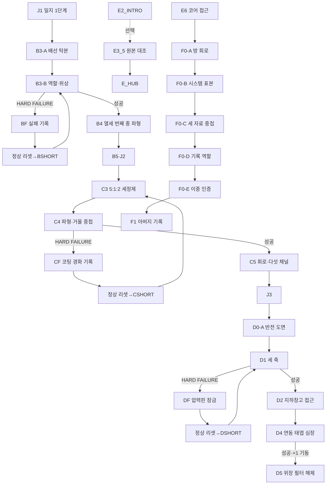
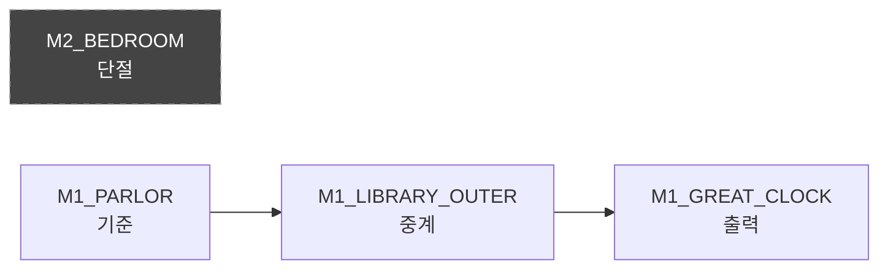
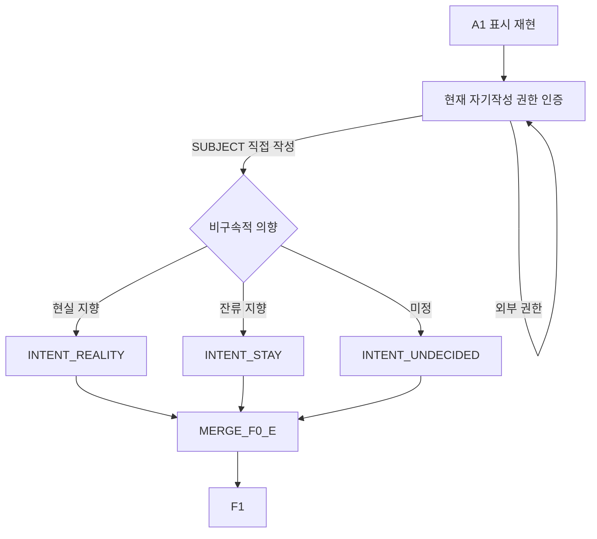

# GGB v0.4 이벤트 상세 03: 메인 퍼즐

## 1. 문서 목적

본 문서는 GGB v0.4의 메인 퍼즐과 메타퍼즐을 플레이 가능한 사건 단위로 정의한다.

담당 범위:

- B3-A·B3-B 시계망 퍼즐.
- C3 중성 세정제와 C4 검은 거울 퍼즐.
- D0-A 도면 중첩, D1 세 축, D4 태엽 심장 퍼즐.
- E3_5 마라 2 원본 대조의 퍼즐 조작부.
- F0-A~F0-E 누적 메타퍼즐.
- 각 퍼즐의 입력·추론·검증·실패·힌트·상태 출력.
- HARD FAILURE 뒤 `07` 숏컷으로 넘길 영구 정보.
- 색상·음향·드래그를 제거해도 성립하는 접근성 경로.
- 운영진용 내부 정답과 해답 유일성 검증.

담당하지 않는 범위:

| 영역 | 문서 |
| --- | --- |
| 영구 정보 커밋·수면 리셋 | `07_이벤트상세_02_루프_영구정보_숏컷.md` |
| 일지 원문과 단서 획득 장면 | `09_이벤트상세_04_정보조사_일지복원.md` |
| 문·공간 해금 | `10_이벤트상세_05_공간잠금_해금_동선.md` |
| E3_5 감정 대화·관계 선택 | `12_이벤트상세_07_사용인핵심관계.md` |
| D5 파열 전환 | `13_이벤트상세_08_파열_전환_결산.md` |
| 실제 Godot 리소스 | `17_상태변수_이벤트ID_Godot데이터구조.md` |

## 2. 기준과 확정 교정

### 2.1 정답 기준

퍼즐 정답과 핵심 기믹은 `24-3_메인퍼즐_고난도개정안.md`를 유지한다.

변경하지 않는 것:

- B3의 기준·중계·출력·제외·+1 위상.
- C3의 5:1:2 비율과 투입 순서.
- C4의 파형 중첩과 닦기 경로.
- D0-A의 좌우 반전·90° 반시계 회전.
- D1의 직선 2→분기 1→환형 3→시계 방향 반 바퀴.
- D4의 연동 규칙과 XII+1 기동.
- F0-A~E의 메타퍼즐 구조.

### 2.2 최신 문서 반영

| 항목 | 적용 |
| --- | --- |
| B3-A 서재 시계 | `M1_LIBRARY_OUTER` 외부 서고 |
| D0-A 작업대 | `M1_LIBRARY_INNER` 기록 내실 |
| D1 장치 | `B1_AXIS_CHAMBER` |
| D4 장치 | `B1_CLOCKWORK_HEART` |
| E3_5 | `H0_COLOR_SEPARATION`→`H0_PERSONALITY_ARCHIVE` |
| F0 | `H0_CORE_PATH`의 단계별 카메라 구역 |
| 실패 기록 | `active`, `resolved`, `superseded` |
| 수면 리셋 | `NORMAL_SLEEP→SYS_COMMIT→SYS_MEMORY→NORMAL_RESET` |
| D4 결과 | 위장 필터 해제(확정 실패 이벤트), 플레이어 성공 |
| 에드가 기록 | `에드가 접근 암구호` |

### 2.3 ID 표기

본문 기획 ID:

```text
B3-A
B3-B
C2-1
D0-A
F0-D-ANON
```

데이터 ID:

```text
B3_A
B3_B
C2_1
D0_A
F0_D_ANON
```

## 3. 퍼즐 설계 원칙

1. 정답은 고정이며 무작위 배치가 없다.
2. 난이도는 기억력보다 단서 비교·표현 변환·검증에서 만든다.
3. 필수 단서는 관계 이벤트 없이도 확보된다.
4. 색상은 출처 식별을 돕지만 단독 정답이 아니다.
5. 음향은 파형·자막·진동으로 대체할 수 있다.
6. 드래그는 클릭 선택·슬롯 배치로 대체할 수 있다.
7. 비가역 입력 전에는 결과가 고정된다는 경고를 제공한다.
8. HARD FAILURE는 B3-B, C4, D1에만 사용한다.
9. HARD FAILURE 뒤에는 맞은 부분과 틀린 부분을 구분한다.
10. 다음 루프에 같은 준비를 전부 반복시키지 않는다.
11. D4는 퍼즐 성공이며 D5는 일방향 서사 전환이다.
12. E3_5 미완료여도 F0와 두 엔딩은 진행 가능하다.
13. F0는 과거 퍼즐 정답 암기 시험이 아니라 수첩 자료의 재해석이다.
14. 힌트 사용은 엔딩·관계·메인 보상에 불이익을 주지 않는다.
15. 우연히 정답을 맞혀도 검증 이유를 확인할 수 있다.

## 4. 난이도 곡선과 시간

### 4.1 목표 난이도

| 구간 | 학습 목표 | 난이도 축 |
| --- | --- | --- |
| B3-A | 회전·반전·연결 | 공간 자료 조립 |
| B3-B | 역할과 시간 분리 | 기능 분류·위상 |
| C3 | 문장 제약을 수량으로 변환 | 연립 조건 |
| C4 | 파형을 공간 경로로 번역 | 표현 변환·비가역 실행 |
| D0-A | 반사 자료를 도면에 중첩 | 반전·회전·기준점 |
| D1 | 지식을 물리 장치에 실행 | 순서·깊이·긴장 |
| D4 | 연동 장치를 역산 | 상태 변화·이중 기동 |
| E3_5 | 출처와 사본을 분리 | 색·문양·체크섬 |
| F0 | 앞선 규칙을 새 기능으로 결합 | 누적 메타 추론 |

### 4.2 시간 목표

| 퍼즐 | 첫 시도 | 재시도 | 실패 정책 |
| --- | --- | --- | --- |
| B3-A | 6~10분 | 검증 상태 유지 | LOCAL RETRY |
| B3-B | 8~14분 | 3~6분 | HARD FAILURE |
| C3 | 8~12분 | 2~4분 | LOCAL RETRY |
| C4 | 10~16분 | 4~8분 | HARD FAILURE |
| D0-A | 8~13분 | 결과 유지 | LOCAL RETRY |
| D1 | 8~14분 | 4~7분 | HARD FAILURE |
| D4 | 10~16분 | 현장 재시도 | LOCAL RETRY→전환 |
| E3_5 조작 | 8~14분 | 현장 재시도 | LOCAL RETRY |
| E3_5 전체 사건 | 10~16분 | once | 관계 선택 포함 |
| F0-A~E | 25~40분 | 단계 저장 | LOCAL RETRY |

20분 이상 새로운 정보 없이 정체되는 단일 퍼즐 구간을 허용하지 않는다.

## 5. 전체 퍼즐 흐름



## 6. 공통 퍼즐 이벤트 양식

각 퍼즐은 다음 항목을 가진다.

| 필드 | 의미 |
| --- | --- |
| event_id | 고유 이벤트 |
| location_id | 시작·조작 위치 |
| time_rule | 아침·낮·저녁·유연 |
| prerequisites | 선행 정보·아이템·공간 |
| objective | 플레이어 목표 |
| interaction_model | 회전·배치·선택·실행 |
| validation_mode | 부분 검증·일괄 검증 |
| fail_policy | none·local_retry·hard_failure·transition |
| outputs | 지식·아이템·플래그·다음 이벤트 |
| hint_track | H1~H5 |
| accessibility | 색·음향·드래그 대체 |

### 6.1 실패 상태

| 상태 | 의미 | 재진입 |
| --- | --- | --- |
| retry_ready | 현장에서 되돌릴 수 있음 | 같은 퍼즐 |
| failed_for_loop | 당일 장치 잠김 | NORMAL_RESET |
| active failure | 다음 ROUTE가 숏컷을 제안 | B/C/DSHORT |
| resolved | 성공 뒤 기록 보관 | 현재 목표에서 숨김 |
| superseded | 상위 검증이 대체 | 보관만 유지 |

### 6.2 검증 단계

```yaml
validated_puzzle_step:
  puzzle_id: B3_B
  step_id: role_reference
  value: M1_PARLOR_CLOCK
  state: verified
  source_event_id: B3_A
```

검증된 단계와 실제 장치 배치를 분리한다. NORMAL_RESET 뒤 장치는 초기화되지만 검증 지식은 남는다.

## 7. B3-A 시계망 배선 탁본

### 7.1 기본 정보

| 항목 | 내용 |
| --- | --- |
| 이벤트 ID | B3-A |
| 위치 | `M2_BEDROOM`·`M1_PARLOR`·`M1_LIBRARY_OUTER`·`M1_GREAT_CLOCK` |
| 시간 | 유연 |
| 선행 조건 | J1, 네 시계 조사 가능 |
| 목표 | 네 탁본을 조립해 시계망 연결 구조 확인 |
| 입력 | 회전, 앞뒤 반전, 위치 교환 |
| 실패 | LOCAL RETRY |
| 완료 | `clock_network_layout_solved=true` |
| 다음 | B3-B |

### 7.2 수집 위치

| 탁본 | location_id | 물리 단서 |
| --- | --- | --- |
| 침실 시계 | `M2_BEDROOM` | 종이 끝에서 배선이 완전히 끊김 |
| 대응접실 시계 | `M1_PARLOR` | 두꺼운 기준 진동선 |
| 외부 서고 벽시계 | `M1_LIBRARY_OUTER` | 벽 균열과 중계선, 뒷면 사용 |
| 서쪽 대시계 | `M1_GREAT_CLOCK` | 출력 포트와 종 없는 공명통 |

P3의 외부 서고와 B2의 기록 내실을 혼동하지 않는다. B3-A 중계 시계는 `M1_LIBRARY_OUTER`에 있다.

### 7.3 준비물

- 얇은 탁본지 4장.
- 흑연 또는 연필.
- 고정핀.
- 수첩 `시계망` 페이지.

탁본 수집은 최초 한 번 직접 수행한다. BSHORT에서는 검증 결과를 이용해 당일 탁본을 몽타주로 다시 준비한다.

### 7.4 조작 화면

화면 구성:

```text
[침실] [대응접실] [외부 서고] [대시계]

[회전 90°] [좌우 반전] [앞/뒤] [자리 교환]

[약한 진동으로 가장자리 확인]
[배선을 추적한다]
```

규칙:

- 각 조각은 0°·90°·180°·270° 회전.
- 외부 서고 조각만 앞뒤 반전 가능.
- 맞는 가장자리는 낮은 진동과 연결선 자막.
- 맞아도 자동 고정하지 않는다.
- `배선을 추적한다`에서 전체 검증한다.

### 7.5 내부 정답

```text
침실 시계 = 시계망에서 단절
대응접실 = 기준
외부 서고 = 중계
서쪽 대시계 = 출력
외부 서고 탁본만 뒤집음
```



### 7.6 추론

- 침실 시계는 한 시간 느리지만 물리 배선이 없다.
- 대응접실 시계는 정상 열두 번을 생성한다.
- 외부 서고 시계는 바늘이 멈췄지만 벽을 따라 진동을 전달한다.
- 대시계는 종이 없으므로 자체 기준이 아니라 출력 장치다.
- 외부 서고 탁본은 거울처럼 반대 방향으로 찍혀 뒷면을 사용해야 한다.

### 7.7 오답 피드백

| 오답 | 피드백 |
| --- | --- |
| 끊긴 가장자리 | 금속음이 이어지지 않음 |
| 잘못된 회전 | 나사 위치가 하나만 일치 |
| 반전 누락 | 외부 서고 선이 서쪽 대신 동쪽으로 향함 |
| 침실을 연결 | 배선이 패널 경계에서 끝남 |

첫 검증에는 일치한 가장자리 개수만 보여준다. 두 번째부터 끊긴 경계 위치를 표시한다.

### 7.8 힌트

| 단계 | 힌트 |
| --- | --- |
| H1 | 네 조각의 나사 구멍 비교 |
| H2 | 침실 조각의 모든 선이 가장자리 전에 끝남 |
| H3 | 외부 서고 종이 뒷면에 흑연 번짐 |
| H4 | 대응접실→외부 서고 한 연결 고정 |
| H5 | 침실 제외와 외부 서고 반전 표시 |

### 7.9 관계·색상

- 에드가의 남색 잠금선은 대시계 점검함 소유권만 표시한다.
- 마라 1은 탁본지 고정핀을 정리할 수 있지만 배치 정답은 말하지 않는다.
- 마라 2는 외부 서고 탁본의 앞뒤 체크섬 차이를 농담처럼 지적할 수 있다.
- 색 제거 모드에서는 시계 이름·선 굵기·진동 방향만 사용한다.

### 7.10 감각 연출

- 맞는 구리선 가장자리에 손끝으로 이어지는 미세 진동.
- 외부 서고 조각을 뒤집으면 종이에서 차가운 금속 냄새.
- 완성 직전 네 시계 소리가 서로 다른 방에서 동시에 한 번 울림.
- 침실 조각만 진동에 참여하지 않아 고립감을 만든다.

### 7.11 상태 출력

```yaml
event_id: B3_A
location_ids:
  - M2_BEDROOM
  - M1_PARLOR
  - M1_LIBRARY_OUTER
  - M1_GREAT_CLOCK
fail_policy: local_retry
outputs:
  set_flags:
    - clock_network_layout_solved
  add_knowledge:
    - clock_reference_parlor
    - clock_relay_library_outer
    - clock_output_great_clock
    - clock_bedroom_disconnected
  next_event: B3_B
```

## 8. B3-B 역할·위상 설정

### 8.1 기본 정보

| 항목 | 내용 |
| --- | --- |
| 이벤트 ID | B3-B |
| 위치 | `M1_GREAT_CLOCK` |
| 시간 | 저녁 |
| 선행 조건 | B3-A 완료, J1 |
| 목표 | 네 역할과 중계 위상 설정 후 실제 작동 |
| 가역 검증 | 약한 시험 진동 |
| 비가역 입력 | 저녁 시계망 작동 |
| 실패 | HARD FAILURE→BF |
| 성공 | B4 |

### 8.2 역할 카드

| 슬롯 | 선택 후보 |
| --- | --- |
| 기준 | 침실·대응접실·외부 서고·대시계 |
| 중계 | 남은 시계 |
| 출력 | 남은 시계 |
| 제외 | 남은 시계 |

내부 정답:

| 슬롯 | 정답 |
| --- | --- |
| 기준 | 대응접실 |
| 중계 | 외부 서고 |
| 출력 | 서쪽 대시계 |
| 제외 | 침실 |

### 8.3 위상 다이얼

| 값 | 의미 |
| --- | --- |
| -1 | 마지막 종 전에 전달 |
| 0 | 열두 번째 종과 동시에 전달 |
| +1 | 정상 열두 번 뒤 한 칸 늦게 전달 |
| HALF | 종 사이에 전달 |

정답은 `+1`이다.

### 8.4 +1 단서

- J1의 마지막 문장, “모두 끝났다고 믿은 뒤에도, 한 칸 남아 있는 소리다.” 뒤에 마침표와 잉크점 사이 한 칸의 빈 공간이 있다.
- 대응접실 시계의 열두 번 뒤 남는 배선 진동.
- 대시계 걸쇠의 XII 뒤 이름 없는 홈.
- 마라 1 장부의 `본 종이 끝난 뒤 점검`.

단서 하나만으로 +1을 직접 표시하지 않는다. 두 개 이상을 연결하면 수첩에 `완료 뒤 추가 전달` 가설이 생긴다.

연결 지식:

| knowledge_id | 역할 |
| --- | --- |
| `KN_J1_CLOCK_ROLES` | 기준·중계·출력 역할이 존재한다는 가설 |
| `KN_J1_POST_COMPLETION_GAP` | 정상 완료 뒤 한 칸이 남는다는 관찰 |

### 8.5 사전 검증

`약한 시험 진동`:

- 기준→중계 연결 검증.
- 중계→출력 연결 검증.
- 제외 시계의 단절 검증.
- 위상은 검증하지 않음.
- 장치 잠금 없음.

피드백:

| 상태 | 반응 |
| --- | --- |
| 기준 오류 | 시작 진동 없음 |
| 중계 오류 | 벽 중간에서 끊김 |
| 출력 오류 | 공명통 대신 종이 울림 |
| 역할 정답 | 대시계까지 약한 진동 도달 |

### 8.6 비가역 확인

```text
저녁 시계망을 실제로 작동한다.
오류가 있으면 봉인핀이 꺾여 오늘 다시 시도할 수 없다.

[약한 시험 진동을 다시 보낸다]
[현재 설정으로 작동한다]
[설정을 고친다]
```

기본 포커스는 `약한 시험 진동`이다.

### 8.7 실패 판정

| 실패 | 물리 결과 | 영구 기록 |
| --- | --- | --- |
| 기준 오류 | 첫 핀 파손 | 기준 슬롯 오답 |
| 중계 오류 | 벽 진동 단절 | 끊긴 위치 |
| 출력 오류 | 종 장치 과부하 | 출력 장치 비교 |
| 위상 -1 | 너무 빠른 금속음 | `phase_too_early` |
| 위상 0 | 열두 번째 종과 겹침 | `phase_simultaneous` |
| HALF | 종 사이 불완전 진동 | `phase_between` |

맞은 역할 슬롯은 verified로 남는다. 한 번의 실패로 다른 슬롯 정답을 모두 공개하지 않는다.

### 8.8 BF 실패 결과

BF는 독립 퍼즐이 아니라 B3-B 실패 결과 묶음이다.

1. 봉인핀 파손.
2. 시계망 당일 잠금.
3. 실패 소리·진동 재생.
4. 맞은 슬롯과 틀린 범주 기록.
5. 목격 사용인 판정.
6. `failure_B3.status=active`.
7. 남은 자유 조사.
8. 수면 뒤 BSHORT.

```yaml
event_id: BF
source_event_id: B3_B
outputs:
  set_flags:
    - b3_hard_failure_seen
  create_failure_record: FAIL_B3_CURRENT
  set_loop_state:
    hard_failure_id: B3_B
    clock_network_locked: true
```

### 8.9 성공과 B4

성공 연출:

1. 대응접실에서 열두 번의 정상 종.
2. 외부 서고 벽을 따라 한 박자 늦은 진동.
3. 대시계에서 열세 번째 금속음.
4. 공명통 표면에 파형 기록.
5. 다섯 색상 서명이 한 프레임 겹침.

B4 출력:

- `thirteenth_bell_known=true`.
- `b4_waveform_acquired=true`.
- B3 active failure를 resolved 처리.
- C4와 F0-C 자료 해금.

### 8.10 반복 지원

| 실패 횟수 | 지원 |
| --- | --- |
| 1 | 실패 범주·verified 슬롯 |
| 2 | verified 역할 카드 고정 가능 |
| 3 | +1 관련 단서 한 화면 비교 |
| 4 | 남은 위상 후보 2개로 제한 |

### 8.11 관계·감각

- 에드가가 경계해도 실제 작동 기회는 유지한다.
- 마라 1의 도움은 탁본 정리까지만 허용한다.
- 봉인핀 파손 때 에드가 꼬리가 먼저 굳고 얼굴은 늦게 반응한다.
- 성공한 열세 번째 종은 귀보다 갈비뼈 안쪽에서 먼저 느껴진다.

## 9. C3 중성 세정제 제약식

### 9.1 기본 정보

| 항목 | 내용 |
| --- | --- |
| 이벤트 ID | C3 |
| 위치 | `M1_KITCHEN` 조합대 |
| 시간 | 낮 |
| 선행 조건 | C2·C2-1 정보 |
| 목표 | 8단위 병에 정확한 양과 순서로 혼합 |
| 실패 | LOCAL RETRY |
| 반복 | 공식은 유지, 물질은 매 루프 재제조 |
| 완료 | `c3_formula_verified=true`, `NEUTRAL_CLEANER` 획득 |

### 9.2 단서 분배

| 단서 | 출처 | 내용 |
| --- | --- | --- |
| 총량 | 빈 병 바닥 | 8단위를 넘기지 말 것 |
| 원액 관계 | 루카 약품 라벨 | 원액은 안정제의 두 배 |
| 물 관계 | 마라 1 청소 기록 | 물은 두 첨가제 합보다 2 많음 |
| 순서 1 | 병 경고 | 마른 병에 활성 성분 금지 |
| 순서 2 | 루카 메모 | 안정제가 물에 퍼진 뒤 원액 |

### 9.3 제약식과 유일해

```text
W + S + A = 8
A = 2S
W = S + A + 2
```

```text
W = 5
S = 1
A = 2
순서 = 물 → 안정제 → 원액
```

수학식을 직접 입력하지 않는다. 플레이어는 문장 카드를 연결하고 실제 계량한다.

### 9.4 조합 오브젝트

- 8단위 투명 병.
- 5단위 증류수 용기.
- 1단위 안정제 앰플 2개.
- 1단위 원액 스포이드 4회분.
- 중성 시험지.
- 폐기 쟁반.
- 흔들기 손잡이.

### 9.5 상호작용

1. 병 조사.
2. 수첩 제약 카드 배열.
3. 첫 재료 선택.
4. 단위만큼 붓기.
5. 안정제 확산 확인.
6. 원액 투입.
7. 한 번 천천히 혼합.
8. 시험지로 검증.

### 9.6 오답

| 오답 | 반응 | 복구 |
| --- | --- | --- |
| 총량 부족 | 눈금 미달 | 폐기 후 즉시 재시도 |
| 총량 초과 | 넘침 | 폐기 |
| 비율 오류 | 시험지 적색·청색+문자 | 재료 재제공 |
| 순서 오류 | 미세 결정 | 병 세척 |
| 과도한 혼합 | 거품 | 기다리면 가라앉음 |

색 변화에는 `산성·염기성·중성 아님` 텍스트와 시험지 문양을 병행한다.

### 9.7 힌트

| 단계 | 내용 |
| --- | --- |
| H1 | 총량·비율·순서 카드를 세 열로 정리 |
| H2 | A와 S 연결 |
| H3 | W가 나머지 합보다 2 큼 |
| H4 | S=1 고정 |
| H5 | 물 5를 먼저 제안 |

숫자 계산 보조 UI는 식을 자동으로 풀기보다 가능한 정수 조합을 표로 정리한다.

### 9.8 관계·색상·감각

- 마라 1은 청소 기록 위치를 알려 주고 스패너로 병 고정대를 조인다.
- 루카는 안전 라벨을 정면으로 돌려 놓지만 비율을 말하지 않는다.
- 루카의 검정·연두 맥박은 위험 경고 소유자 표시다.
- 안정제 투입 뒤 액체 표면이 숨을 고르는 것처럼 한 번 내려앉는다.
- 정답 혼합은 무색이며 화려한 성공색을 사용하지 않는다.

### 9.9 상태

```yaml
event_id: C3
location_id: M1_KITCHEN
fail_policy: local_retry
outputs:
  set_flags:
    - c3_formula_verified
  create_loop_items:
    - NEUTRAL_CLEANER
  validated_steps:
    - c3_ratio_5_1_2
    - c3_order_water_stabilizer_concentrate
  next_event: C4
```

## 10. C4 파형·검은 거울 중첩

### 10.1 기본 정보

| 항목 | 내용 |
| --- | --- |
| 이벤트 ID | C4 |
| 위치 | `M1_MIRROR_GALLERY` |
| 시간 | 저녁 |
| 선행 조건 | C3 세정제, B4 파형 |
| 목표 | 파형을 거울 회로로 번역하고 실제 경로를 닦기 |
| 가역 | 중첩·계획·마른 천 시험 |
| 비가역 | 세정제를 묻힌 실제 닦기 |
| 실패 | HARD FAILURE→CF |
| 성공 | C5 |

### 10.2 파형 대응

| B4 구간 | 형태 | 거울 대응 |
| --- | --- | --- |
| 진입파 | 길고 낮은 진동 | 직선 |
| 반사파 | 짧은 두 진동 | 분기 양쪽 |
| 잔류파 | 길게 이어져 닫힘 | 고리 |

직접 문장으로 정답을 제공하지 않는다.

간접 단서:

- 외부 서고 중계음과 진입파의 같은 폭.
- 갈라진 배선에서 반사파 두 번.
- 거울 가장자리 닫힌 홈과 잔류파 지속 시간.

J2는 “긴 떨림”, “두 번의 짧은 반사”, “마지막 잔향”이라는 표현으로 세 구간을 가리킨다. C3의 5:1:2 비율이나 투입 순서는 제공하지 않는다.

연결 지식:

| knowledge_id | 역할 |
| --- | --- |
| `KN_J2_BELL_IS_SIGNAL` | 열세 번째 종을 표면 완화 신호로 해석 |
| `KN_J2_WAVE_SEGMENTS` | B4 파형의 세 구간을 관찰 |
| `KN_J2_MIRROR_WINDOW` | 신호 뒤 검은 거울을 처리해야 함 |

### 10.3 중첩 UI

조작:

- 90° 회전.
- 좌우 반전.
- 투명도.
- 하단 진동점 고정.

정답:

```text
좌우 반전 없음
90° 시계 방향
열세 번째 큰 파동 = 거울 하단 진동점
```

정답 중첩 시에도 실제 닦기 전까지 코팅은 변하지 않는다.

### 10.4 닦기 계획

경로 카드:

```text
직선 진입
분기 짧은 쪽
분기 긴 쪽
고리 시계 방향
```

정답 순서:

```text
직선 → 분기 짧은 쪽 → 분기 긴 쪽 → 고리 시계 방향
```

### 10.5 마른 천 시험

- 올바른 구간은 약한 진동.
- 잘못된 구간은 반응 없음.
- 코팅 경화 없음.
- 계획 전체를 시험할 수 있음.
- 시험 결과는 observed이며 `계획 확정` 뒤 verified.

### 10.6 에드가 개입

alert가 높을 때 가능한 처리:

| 방법 | 비용 | 결과 |
| --- | --- | --- |
| 일반 천을 앞에 둠 | 도구 준비 | 에드가가 다른 천 점검 |
| 일지 문장 질문 | question 1 | 복도 대화로 개입 소모 |
| 순찰 공백 대기 | 시간 구간 연출 | 정답 불변 |

높은 bond에서는 강한 제지를 생략할 수 있다. 어느 상태에서도 C4 정답은 변하지 않는다.

### 10.7 비가역 확인

```text
세정제를 묻히면 오늘은 이 경로를 되돌릴 수 없다.

[마른 천으로 다시 시험한다]
[계획을 확인한다]
[세정제를 묻혀 실행한다]
```

기본 포커스는 `계획을 확인한다`.

### 10.8 실패

| 실패 | 결과 | 기록 |
| --- | --- | --- |
| 중첩 없이 시작 | 시작점 외부 경화 | anchor_missing |
| 직선 누락 | 진입 압력 없음 | entry_missing |
| 분기 한쪽 누락 | 코팅 재봉합 | branch_incomplete |
| 분기 순서 오류 | 반사압 역류 | branch_order_wrong |
| 고리 역방향 | 코팅 닫힘 | ring_direction_wrong |
| 에드가 개입 미처리 | 도구 회수 | tool_confiscated |

### 10.9 CF 실패 결과

1. 코팅 경화 또는 도구 회수.
2. 당일 실제 닦기 잠금.
3. 실패 지점과 맞은 경로 분리 기록.
4. 목격자 판정.
5. `failure_C4.status=active`.
6. 남은 조사 뒤 수면.
7. CSHORT로 재료 확보 후 C3 재제조.

```yaml
event_id: CF
source_event_id: C4
outputs:
  set_flags:
    - c4_hard_failure_seen
  create_failure_record: FAIL_C4_CURRENT
  set_loop_state:
    hard_failure_id: C4
    mirror_coating_hardened: true
```

### 10.10 반복 지원

| 실패 | 지원 |
| --- | --- |
| 1회 | 실패 구간·맞은 앞부분 |
| 2회 | 중첩 변환 고정 가능 |
| 3회 | 파형 대응표 한 화면 |
| 4회 | 다음 경로 후보 2개 |

### 10.11 감각

- 마른 천은 차갑고 거칠다.
- 세정제를 묻히면 냄새보다 손끝의 미끄러짐이 먼저 사라진다.
- 실패 경화는 유리가 굳는 소리가 아니라 피부 아래에서 당기는 느낌으로 표현한다.
- 성공 직전 거울 속 주인공의 호흡만 실제보다 늦다.

## 11. C5 퍼즐 출력

### 11.1 기본 정보

| 항목 | 내용 |
| --- | --- |
| 이벤트 ID | C5 |
| 위치 | `M1_MIRROR_GALLERY` |
| 선행 조건 | C4 성공 |
| 유형 | 콘텐츠 결과·CLR-02 부모 |
| 실패 | 없음 |
| 목표 | 노출된 회로·좌표·다섯 채널 기록 |
| 다음 | J3 |

### 11.2 획득 정보

- 직선·분기·고리 반사 원도.
- 대시계·온실 유리·침실 창문 기준점.
- 지하 좌표.
- 다섯 인격 채널.
- 회로 투명지.

채널:

| 사용인 | 색 | 문양·소리 |
| --- | --- | --- |
| 에드가 | 남색 | 수직 잠금선·낮은 시계음 |
| 마라 1 | 주황 | 대각 닦임·마른 솔 |
| 루카 | 검정+연두 | 이중 맥박·생체음 |
| 이리스 | 흰색+연노랑 | 꽃잎·유리 바람 |
| 마라 2 | 보라 | 이중 액자·빠른 3음 |

### 11.3 해석 제한

- 채널이 인격 데이터 출처라는 가설만 제공한다.
- 연구원 정체와 통 속의 뇌 진실은 공개하지 않는다.
- 보라 채널 길이가 짧다는 이상만 MARA2_S2에서 지적한다.
- 색이 없어도 문양·선·라벨로 다섯 출처를 구분한다.

### 11.4 상태

```yaml
event_id: C5
outputs:
  set_flags:
    - mirror_tracing_acquired
  trigger_overlays:
    - CLR_02
  create_persistent_items:
    - C5_MIRROR_TRACING
  add_knowledge:
    - five_signature_channels
    - basement_reference_points
  resolve_failures:
    - C4
  next_event: J3
```

## 12. D0-A 반전 저택 도면

### 12.1 기본 정보

| 항목 | 내용 |
| --- | --- |
| 이벤트 ID | D0-A |
| 위치 | `M1_LIBRARY_INNER` |
| 시간 | 낮 |
| 선행 조건 | D0, C5 투명지, J3 좌표 |
| 목표 | 거울 회로와 평면도를 중첩해 축 순서·깊이 도출 |
| 실패 | LOCAL RETRY |
| 완료 | `basement_overlay_solved=true` |
| 다음 | D1 |

### 12.2 자료

- C5 회로 투명지.
- 기록 내실의 저택 평면도.
- J3 지하 좌표.
- 대시계·온실·침실 기준점.

### 12.3 핵심 함정

C5 자료는 거울에서 얻었으므로 좌우 반전돼 있다. 회전만으로는 세 기준점이 동시에 맞지 않는다.
J3는 “거울은 네가 건넨 방향을 그대로 돌려주지 않는다”는 식으로 방향 불신과 세 기준점을 제공하지만, 정확한 좌우 반전과 90도 회전값은 직접 말하지 않는다.

연결 지식:

| knowledge_id | 역할 |
| --- | --- |
| `KN_J3_TRACING_DIRECTION_UNTRUSTED` | C5 탁본 방향 재검토 |
| `KN_J3_THREE_REFERENCE_POINTS` | 침실·온실·대시계 기준점 |
| `KN_J3_MAP_REQUIRED` | 저택 평면도와의 중첩 필요 |

정답 조작:

```text
1. C5 투명지 좌우 반전
2. 90° 반시계 방향 회전
3. 대시계 기준점 고정
4. 온실·침실 기준점 일치 확인
```

### 12.4 UI

```text
[평면도]
[C5 투명지]

[회전 90°]
[좌우 반전]
[투명도]
[기준점 고정]
[중첩 검증]
```

세 기준점은 색 대신 아이콘과 공간명으로 표시한다.

### 12.5 출력

| 축 | 눈금 | 깊이 |
| --- | --- | --- |
| 직선 | II | 2 |
| 분기 | I | 1 |
| 환형 | III | 3 |

회로 화살표는 `직선→분기→환형` 순서를 제공한다.

### 12.6 오답

| 일치 | 반응 |
| --- | --- |
| 0 | 모든 기준점 이탈 |
| 1 | 부분 일치 |
| 2 | 지하 좌표 불일치 |
| 3·방향 오류 | 숫자가 거꾸로 나타남 |
| 완전 일치 | 깊이와 흐름 고정 |

자동 스냅은 완전 일치 후에만 발생한다.

### 12.7 힌트·감각

| 단계 | 내용 |
| --- | --- |
| H1 | C5가 거울에서 나온 자료임을 강조 |
| H2 | 대시계 기준점 먼저 고정 |
| H3 | 좌우 반전 제시 |
| H4 | 반전 뒤 반시계 회전 |
| H5 | 세 기준점 순서대로 고정 |

- 투명지를 뒤집을 때 글자가 피부 쪽으로 붙는 불쾌감.
- 정답 중첩 시 지하에서 세 번 다른 깊이의 금속음.
- 마라 2의 보라 채널은 필터로 숨길 수 있지만 회로선은 유지된다.

### 12.8 상태

```yaml
event_id: D0_A
location_id: M1_LIBRARY_INNER
fail_policy: local_retry
outputs:
  set_flags:
    - basement_overlay_solved
  validated_steps:
    - axis_order_line_branch_ring
    - axis_line_depth_2
    - axis_branch_depth_1
    - axis_ring_depth_3
  next_event: D1
```

## 13. D1 세 축의 순서·깊이

### 13.1 기본 정보

| 항목 | 내용 |
| --- | --- |
| 이벤트 ID | D1 |
| 위치 | `B1_AXIS_CHAMBER` |
| 시간 | 낮 |
| 선행 조건 | D0-A |
| 목표 | 도면 결과를 실제 압력 장치에 적용 |
| 가역 | 축을 밀기 전 깊이 조정 |
| 비가역 | 축 밀기 |
| 실패 | HARD FAILURE→DF |
| 성공 | D2 |

### 13.2 장치

각 축:

- 깊이 홈 1·2·3.
- 고정 고리.
- 밀기 손잡이.
- 압력 게이지.
- 압력핀.

중앙:

- 반 바퀴 손잡이.
- 시계·반시계 방향 표시.
- 역회전 방지턱.

### 13.3 정답

```text
직선축 깊이 2 → 밀기
분기축 깊이 1 → 밀기
환형축 깊이 3 → 밀기
중앙 손잡이 시계 방향 반 바퀴
```

### 13.4 입력 단계

1. 축 선택.
2. 깊이 조정.
3. 깊이 확인.
4. `축을 민다` 비가역 확인.
5. 압력 게이지 관찰.
6. 다음 축.
7. 중앙 손잡이 방향 선택.
8. 반 바퀴 실행.

### 13.5 비가역 경고

```text
축을 밀면 압력핀이 내려가 이 루프에서는 되돌릴 수 없다.

[깊이를 다시 확인한다]
[수첩 도면을 본다]
[축을 민다]
```

기본 포커스는 수첩이다.

### 13.6 실패 유형

| 실패 | 물리 결과 | 영구 기록 |
| --- | --- | --- |
| 깊이 오류 | 압력 과다·부족 | 해당 깊이 invalid |
| 순서 오류 | 압력 역류 | 이미 확인된 깊이 유지 |
| 중간 축 오류 | 압력핀 하강 | 이전 축 verified |
| 손잡이 역방향 | 방지턱 경고 | 확정 전 취소 가능 |
| 역방향 강행 | 중앙 잠금 | direction_wrong |

손잡이 역방향은 경고 뒤 한 번 취소할 수 있다. 경고를 무시해 강행했을 때만 HARD FAILURE가 된다.

### 13.7 DF 실패 결과

```text
오류 축에서 압력핀 하강
→ 이후 축 입력 잠금
→ 이전 verified 단계 기록
→ failure_D1.status=active
→ 남은 조사
→ 수면
→ DSHORT
```

```yaml
event_id: DF
source_event_id: D1
outputs:
  set_flags:
    - d1_hard_failure_seen
  create_failure_record: FAIL_D1_CURRENT
  set_loop_state:
    hard_failure_id: D1
    axis_machine_locked: true
```

### 13.8 다음 루프

- D0-A 전체 중첩은 생략.
- verified 축은 빠른 적용 가능.
- 물리 축은 원위치.
- 미확정 축과 실제 밀기는 직접 수행.
- D1 성공 전 `basement_access_fast_path`는 false.

### 13.9 관계·감각

- 마라 1은 고정구 준비만 돕는다.
- 에드가는 지하 접근을 확인하지만 영구 봉쇄하지 않는다.
- 루카는 실패 후 손목·맥박을 확인한다.
- 축을 밀 때 손바닥보다 치아에 압력이 먼저 느껴진다.
- 실패한 순간 금속음이 멎고 주인공 심장 소리만 남는다.

### 13.10 성공

- 세 게이지가 다른 높이에서 안정.
- 중앙 손잡이 반 바퀴 뒤 압력 균형.
- 지하창고 문 개방.
- D1 failure resolved.
- D2에서 `basement_access_fast_path` 해금.

## 14. D4 연동 태엽 심장

### 14.1 기본 정보

| 항목 | 내용 |
| --- | --- |
| 이벤트 ID | D4 |
| 위치 | `B1_CLOCKWORK_HEART` |
| 선행 조건 | D2 |
| 목표 | 연동 링 정렬과 XII+1 이중 기동 |
| 실패 | LOCAL RETRY |
| 성공 | 위장 필터 해제(확정 실패 이벤트)→D5 |
| 취소 | 숨은 +1 보조 레버 전까지 |

### 14.2 목표 상태

| 링 | 목표 문양 | 내부 인덱스 |
| --- | --- | --- |
| 외곽 | XIII 홈 | 1 |
| 중간 | C5 분기 접점 | 2 |
| 안쪽 | J3 최하단 심장 | 3 |

초기:

```text
[0, 0, 0]
```

목표:

```text
[1, 2, 3]
```

인덱스는 플레이어에게 노출하지 않는다.

### 14.3 연동 규칙

| 손잡이 | 효과 |
| --- | --- |
| A | 외곽 +1, 중간 +1 |
| B | 중간 +1, 안쪽 +1 |
| C | 안쪽 +1 |

각 링은 네 위치를 순환한다.

최소해:

```text
A 1회 → B 1회 → C 2회
```

더 긴 조작으로 같은 목표 상태를 만들어도 성공으로 인정한다.

### 14.4 학습

첫 조작마다:

- 실제로 움직인 두 링을 강조.
- 수첩에 연결 화살표 기록.
- 되돌리기보다 `초기 위치로` 기능 제공.
- 최소 횟수는 표시하지 않음.

### 14.5 시험 모드

- 동력 연결 전 자유 조작.
- 언제든 초기화.
- 목표와 일치하면 `링 고정`.
- 기동 전 한 번 고정 해제 가능.
- 오답 상태에서는 XII 기동 불가.

### 14.6 XII+1

1. 링 정렬.
2. 정상 레버를 XII까지 감음.
3. `STABLE` 표시.
4. 그대로 실행하면 고딕 저택 안정화 시도 후 준비 상태.
5. B3의 완료 뒤 +1 규칙을 떠올림.
6. 패널 뒤 숨은 보조 레버 발견.
7. 보조 레버를 한 번 당김.
8. XIII 완성.
9. `CAMOUFLAGE FILTER OFF`.
10. D5.

### 14.7 마지막 확인

```text
보조 레버는 정상 안정화 절차 밖의 입력이다.
실행하면 현재 위장 상태를 유지할 수 없다.

[아직 당기지 않는다]
[기록을 다시 확인한다]
[보조 레버를 당긴다]
```

플레이어에게 실패라는 단어를 사용하지 않는다.

### 14.8 운영 표기

```yaml
event_id: D4
player_outcome: success
operator_transition_label: CAMOUFLAGE_FILTER_RELEASE_FORCED_TRANSITION
legacy_note: "위장 필터 해제(확정 실패 이벤트)"
fail_policy: transition_after_success
```

`확정 실패 이벤트`는 운영진이 결과를 되돌릴 수 없는 고정 전환으로 이해하기 위한 주석이다. 플레이어의 퍼즐 실패가 아니다.

### 14.9 관계·색상·감각

- 에드가는 마지막 레버 직전 말리거나 확인할 수 있지만 선택을 빼앗지 않는다.
- 다른 사용인은 관계 상태에 따라 한 문장 반응만 삽입한다.
- 다섯 포트 잔상은 색·문양·라벨로 함께 기록된다.
- 링이 맞을 때 태엽음보다 저택 전체의 호흡이 멎는 느낌을 강조한다.
- +1 레버는 작고 가벼운데 결과음은 지나치게 크다.

### 14.10 상태 출력

```yaml
event_id: D4
location_id: B1_CLOCKWORK_HEART
fail_policy: local_retry_then_transition
outputs:
  set_flags:
    - d4_ring_alignment_solved
    - d4_normal_cycle_complete
    - d4_hidden_plus_one_found
  create_persistent_items:
    - D4_FIVE_PORT_RESIDUE
  next_event_on_confirm: D5
```

## 15. E3_5 마라 2 원본 대조

### 15.1 문서 책임

`08`:

- 색·문양·음향 채널 분리.
- 초상화 중첩.
- 체크섬 비교.
- 오답·힌트·접근성.

`12`:

- 마라 2와의 대화.
- 자기 저장 영역 양도 고백.
- 병합·분리 보존 선택.
- bond·alert 변화.

### 15.2 기본 정보

| 항목 | 내용 |
| --- | --- |
| 이벤트 ID | E3_5 |
| 위치 | `H0_COLOR_SEPARATION`→`H0_PERSONALITY_ARCHIVE` |
| 시간 | E구간 유연 |
| 선행 조건 | E2_INTRO, E3_5 미완료 |
| 필수 | 선택 |
| 퍼즐 시간 | 8~14분 |
| 전체 시간 | 10~16분 |
| 실패 | LOCAL RETRY, 중도 이탈 가능 |
| 출력 | REC_MARA2, 관계 선택 |

### 15.3 입력 자료

- 서로 다른 시점의 단체 초상화 3장.
- 다섯 색상 서명.
- 문양·선 패턴.
- 사용인별 음향 파형.
- 12칸 체크섬 프레임.

### 15.4 단계 1: 다섯 출처 분리

| 소유자 | 색 | 비색상 식별 |
| --- | --- | --- |
| 에드가 | 남색 | 수직선·낮은 시계음 |
| 마라 1 | 주황 | 대각선·솔 소리 |
| 루카 | 검정+연두 | 이중 맥박 |
| 이리스 | 흰색+연노랑 | 꽃잎·유리 바람 |
| 마라 2 | 보라 | 이중 액자·빠른 3음 |

플레이어는 세 초상화마다 동일 소유자 채널을 추출한다.

### 15.5 단계 2: 보라 기록 중첩

1. 보라 이중 액자 조각 3개 선택.
2. 초상화 촬영 시점을 기록의 열화 순서로 배열.
3. 빠른 3음 파형의 시작점을 맞춤.
4. 이중 윤곽이 한 인물 형태가 되도록 중첩.
5. 12칸 체크섬을 비교.

### 15.6 결손 발견

- 세 시점 모두 같은 3칸이 비어 있음.
- 다른 네 사용인 기록의 보조 영역에 같은 조각이 나뉘어 보존됨.
- 결손은 무작위 손상이 아니라 의도적 저장 영역 양도임을 확인.

### 15.7 오답

| 오답 | 피드백 |
| --- | --- |
| 다른 소유자 혼합 | 문양 주기 불일치 |
| 시간순서 오류 | 열화가 회복됐다 다시 악화 |
| 파형 시작점 오류 | 3음이 2음+잡음으로 분리 |
| 체크섬 오조합 | 맞은 칸 개수만 표시 |

### 15.8 힌트

| 단계 | 내용 |
| --- | --- |
| H1 | 이중 액자 문양만 보기 |
| H2 | 세 초상화의 손상량 비교 |
| H3 | 빠른 3음 시작점 고정 |
| H4 | 다른 네 기록의 같은 위치 강조 |
| H5 | 누락 3칸의 소유자 제시 |

### 15.9 관계 선택 연결

퍼즐 완료 뒤 `12`의 선택으로 넘긴다.

| 선택 | 퍼즐 데이터 처리 | 관계 처리 |
| --- | --- | --- |
| 감정 주석 병합 | 원본+주석 단일 인덱스 | bond +2, alert +1 |
| 원본·주석 분리 | 두 인덱스 교차 링크 | bond +1, alert -1 |

둘 다 기술적으로 유효하고 `REC_MARA2`를 제공한다.

### 15.10 상태

```yaml
event_id: E3_5
location_ids:
  - H0_COLOR_SEPARATION
  - H0_PERSONALITY_ARCHIVE
fail_policy: local_retry
required: false
outputs:
  set_flags:
    - E3_5_puzzle_solved
  trigger_overlays:
    - CLR_04
  validated_steps:
    - mara2_purple_channel_separated
    - mara2_checksum_gaps_found
    - mara2_distributed_backup_found
  next_phase: E3_5_RELATIONSHIP_CHOICE
```

## 16. F0 메타퍼즐 개요

### 16.1 기본 정보

| 항목 | 내용 |
| --- | --- |
| 위치 | `H0_CORE_PATH` |
| 선행 조건 | E6 |
| 단계 | F0-A→B→C→D→E |
| 총 시간 | 25~40분 |
| 실패 | 전 단계 LOCAL RETRY |
| 저장 | 단계 완료별 일반 저장 |
| 완료 | `subject_authority_restored=true` |

### 16.2 공간 구역

| ID | 단계 | 기능 |
| --- | --- | --- |
| F0_RING_ENTRY | 진입 | 네 방 타일 확인 |
| F0_ROOM_NETWORK | F0-A | 피드백 회로 |
| F0_SYSTEM_SAMPLES | F0-B | 실제 유지 표본 |
| F0_OVERLAY_TABLE | F0-C | 세 자료 중첩 |
| F0_RECORD_ROLES | F0-D | 기록 역할 분류 |
| F0_SUBJECT_DESK | F0-E | 자기 인증 |

같은 원형 장면 안의 카메라 구역으로 구현할 수 있다.

### 16.3 누적 논리

```text
F0-A: 저택의 네 방이 어떻게 연결되는가
→ F0-B: 각 방에서 무엇이 현실 유지 데이터인가
→ F0-C: 왜 네 채널만으로 코어가 열리지 않는가
→ F0-D: 각 기록은 어떤 역할을 갖는가
→ F0-E: SUBJECT가 현재도 선택 주체인가
```

### 16.4 관계 독립

- 관계 완료 0명이어도 진행 가능.
- E3_5 미완료면 F0-D-ANON 사용.
- 에드가 핵심 관계 미완료여도 E3_4M의 최소 권한과 접근 암구호 제공.
- 색을 제거해도 모든 단계 해결 가능.

## 17. F0-A 네 방의 피드백 회로

### 17.1 기본 정보

| 항목 | 내용 |
| --- | --- |
| 이벤트 ID | F0-A |
| 위치 | `H0_CORE_PATH` |
| 카메라 구역 | `F0_ROOM_NETWORK` |
| 목표 | 네 방 타일로 물질·데이터 피드백 회로 구성 |
| 조작 | 슬롯 배치·회전 |
| 검증 | 약한 신호 |
| 실패 | LOCAL RETRY |
| 다음 | F0-B |

### 17.2 타일

| 방 | 외부 포트 | 내부 포트 |
| --- | --- | --- |
| 온실 | 외부 대기 | 환경 제어 |
| 주방 | 생명 유지 유체 | 공급 제어 |
| 침실 | 냉각 장치·생체 | 신경 신호 |
| 기록 내실 | 기억 인덱스 | 코어 권한·연출 피드백 |

서재 타일은 `M1_LIBRARY_INNER`의 기능을 대표한다.

### 17.3 정답 배치

| 슬롯 | 방 | 출력 |
| --- | --- | --- |
| 북 | 온실 | 동쪽 주방 |
| 동 | 주방 | 남쪽 침실 |
| 남 | 침실 | 서쪽 기록 내실 |
| 서 | 기록 내실 | 중앙 코어+북쪽 온실 |

```text
온실 → 주방 → 침실 → 기록 내실 → 코어
기록 내실 → 온실 피드백
```

### 17.4 제약

1. 외부 환경은 온실에서 시작.
2. 생명 유지 물질은 주방을 거쳐 침실.
3. 신경 신호는 침실에서 기록 내실.
4. 기록 내실은 코어에 권한 요청.
5. 연출 데이터는 온실로 돌아가 가짜 계절 유지.

### 17.5 검증

`약한 신호를 보낸다`:

- 실제 이동 경로 표시.
- 끊긴 포트 위치 표시.
- 정답 타일 위치는 표시하지 않음.
- 물질 실선·데이터 점선 동시 연결 필요.

### 17.6 오답·힌트

| 오답 | 반응 |
| --- | --- |
| 물질만 연결 | 주인공 생체 유지, 저택 연출 정지 |
| 데이터만 연결 | 고딕 장면 유지, 생체 경고 |
| 피드백 없음 | 한 번 재생 뒤 환경 소실 |
| 역방향 | 코어 요청이 방으로 되돌아옴 |

힌트는 P5·P4·P1·J 기록의 방 기능을 같은 화면에 배치한다.

### 17.7 상태

```yaml
event_id: F0_A
location_id: H0_CORE_PATH
camera_zone: F0_ROOM_NETWORK
fail_policy: local_retry
outputs:
  set_flags:
    - f0_room_feedback_loop_solved
  next_event: F0_B
```

## 18. F0-B 시스템 신호 표본

### 18.1 기본 정보

| 항목 | 내용 |
| --- | --- |
| 이벤트 ID | F0-B |
| 위치 | `H0_CORE_PATH` |
| 카메라 구역 | `F0_SYSTEM_SAMPLES` |
| 목표 | 각 방에서 실제 현실 유지 표본 선택 |
| 입력 | 방별 2개 후보 |
| 검증 | 코어 분류 |
| 실패 | LOCAL RETRY |
| 다음 | F0-C |

### 18.2 표본

| 방 | 실제 유지 표본 | 표현용 표본 |
| --- | --- | --- |
| 온실 | 외부 대기 수치 | 꽃향기 설정 |
| 주방 | 생명 유지 유체 | 차 메뉴 반복 |
| 침실 | 현재 생체 신호 | 아가씨 애니메이션 |
| 기록 내실 | 지속 기억 인덱스 | 고딕 장서 목록 |

### 18.3 판별 원칙

정답은 현실의 주인공과 시뮬레이션 지속을 실제로 유지하는 데이터다. 오답은 고딕 표현·역할·장식 데이터다.

플레이어는 이름보다 연결 목적지를 확인한다.

### 18.4 피드백

| 입력 | 코어 반응 |
| --- | --- |
| 실제 유지 표본 | `MAINTENANCE DATA` |
| 표현용 표본 | `PRESENTATION DATA` |
| 네 정답 | `4 CHANNELS VERIFIED / ACCESS DENIED` |

세 번 오답 뒤:

```text
“몸을 유지하는 것과 저택을 연출하는 것을 나눠 봐야 해.”
```

### 18.5 감각

- 실제 표본은 화려하지 않고 낮은 맥박·수치 변화만 보인다.
- 표현 데이터는 아름답지만 연결 끝이 고딕 장면에서 닫힌다.
- 네 채널 성공 뒤에도 문이 열리지 않아 결핍감을 만든다.

## 19. F0-C 세 자료 중첩

### 19.1 기본 정보

| 항목 | 내용 |
| --- | --- |
| 이벤트 ID | F0-C |
| 위치 | `H0_CORE_PATH` |
| 카메라 구역 | `F0_OVERLAY_TABLE` |
| 목표 | B4·C5·D4 자료로 숨은 다섯 번째 포트 노출 |
| 조작 | 회전·반전·투명도·기준점 |
| 실패 | LOCAL RETRY |
| 다음 | CHK_MARA2_REC→F0-D |

### 19.2 자료

| 자료 | 제공 정보 |
| --- | --- |
| B4 파형 | 완료 뒤 추가 입력 위치 |
| C5 회로 | 경로·분기·인증 고리 |
| D4 포트 잔상 | 전체 포트 배치·빈자리 |

### 19.3 기준점

| 자료 | 기준 |
| --- | --- |
| B4 | 열두 번째 종 완료선 |
| C5 | 닫힌 고리 중심 |
| D4 | 중앙 심장 포트 |

### 19.4 정답 변환

| 자료 | 조작 |
| --- | --- |
| D4 | 고정, 회전 없음 |
| C5 | 좌우 반전+90° 반시계 |
| B4 | 180° 회전, 반전 없음 |

### 19.5 보조 조건

1. B4 열세 번째 파동이 빈 포트와 겹침.
2. C5 분기선이 네 채널과 빈 포트를 연결.
3. C5 고리가 빈 포트 외곽을 닫음.

기준점만 맞춰서는 완료되지 않는다.

### 19.6 피드백

| 일치 수 | 반응 |
| --- | --- |
| 0~1 | 진동 주기 불일치 |
| 2~3 | 중심 일치·분기 단절 |
| 4~5 | 빈 포트 일부 노출 |
| 6 | 완전 고정 |

완전 일치 전 자동 스냅하지 않는다.

### 19.7 출력

- 다섯 번째 포트 외곽.
- PATH·SPLIT·AUTH 조사점.
- 포트 이름은 미복원.
- F0-D 기록 분류 장치 활성.

## 20. F0-D 기록 역할 분류

### 20.1 기본 정보

| 항목 | 내용 |
| --- | --- |
| 이벤트 ID | F0-D |
| 위치 | `H0_CORE_PATH` |
| 카메라 구역 | `F0_RECORD_ROLES` |
| 목표 | 다섯 기록을 역할 슬롯에 배치 |
| 조작 | 기록 카드 배치 |
| 검증 | 다섯 장 일괄 |
| 실패 | LOCAL RETRY |
| 대체 | F0-D-ANON |
| 다음 | F0-E |

### 20.2 역할

| 슬롯 | 기록 | 의미 |
| --- | --- | --- |
| CREATOR | 아버지 일지 | 시스템 설계자 |
| CUSTODIAN | 에드가 접근 암구호 | 문지기·관리 권한 |
| RESIDENT | 연구원 기록 묶음 | 거주 인격 |
| SYSTEM | D4 복구 명령 | 조건부 자동 명령 |
| SUBJECT | 주인공 수첩 | 삶의 결과와 선택 주체 |

### 20.3 깨진 라벨과 행동 문장

```text
CR_AT_R
C_ST_D_AN
R_S_D_NT
SY_T_M
S_BJ_CT
```

| 문장 | 역할 |
| --- | --- |
| 집을 만들었다 | CREATOR |
| 문을 지키고 허가했다 | CUSTODIAN |
| 집 안에서 계속 존재한다 | RESIDENT |
| 조건에 따라 자동 실행된다 | SYSTEM |
| 이 삶의 결과를 겪는다 | SUBJECT |

색상은 RESIDENT 묶음 내부 출처만 확인한다. 역할 정답은 기록 내용으로 판단한다.

### 20.4 F0-D-ANON

조건:

```text
REC_MARA2 없음
```

처리:

- E2_INTRO 또는 이 지점에서 익명 보라 인덱스 생성.
- `RESIDENT` 기능 문장은 완전하게 제공.
- 마라 2 개인 음성·감정 주석만 없음.
- 역할 후보 수와 검증 규칙은 동일.
- 난이도를 낮추거나 높이지 않는다.

```yaml
event_id: F0_D_ANON
event_type: system_substitute
condition:
  none:
    - REC_MARA2
outputs:
  provide_records:
    - ANON_PURPLE_RESIDENT_INDEX
  relationship_changes: {}
```

### 20.5 검증

- 다섯 슬롯을 모두 채운 뒤 일괄 판정.
- 첫 실패는 맞은 개수만 표시.
- 두 번째 실패부터 역할 문장과 출처 비교.
- 세 번째부터 verified 슬롯 하나 고정 가능.

### 20.6 출력

정답 뒤 SUBJECT만 추가 인증 요구:

```text
SUBJECT RECORD FOUND
CONTINUITY VERIFIED
CURRENT AUTHORITY REQUIRED
```

```yaml
event_id: F0_D
outputs:
  set_flags:
    - f0_record_roles_solved
  trigger_overlays:
    - CLR_05
  validated_steps:
    - role_creator
    - role_custodian
    - role_resident
    - role_system
    - role_subject
  next_event: F0_E
```

## 21. F0-E 과거 연속성·현재 권한·비구속적 의향

### 21.1 기본 정보

| 항목 | 내용 |
| --- | --- |
| 이벤트 ID | F0-E |
| 위치 | `H0_CORE_PATH` |
| 카메라 구역 | `F0_SUBJECT_DESK` |
| 목표 | 과거 자기 연속성과 현재 자기작성 권한 인증 |
| 단계 | A1 표시 재현→현재 자기작성→비구속적 의향 기록 |
| 실패 | LOCAL RETRY |
| 성공 | `subject_authority_restored=true` |
| 다음 | F1 |

### 21.2 과거 인증

| A1 선택 | 재현 |
| --- | --- |
| 문장 | 당시 문장 조각 순서 |
| 집 도형 | 지붕→몸체→문 획순 |
| 잉크 얼룩 | 세 접촉점 순서 |

성공:

```text
PAST SELF / CONTINUITY VERIFIED
```

### 21.3 현재 자기작성 권한 인증

코어는 A1 표시와 별도로 빈 수첩 줄을 연다. 주인공은 현재 시점에 새 문장을 직접 작성한다.

```text
이 문장은 지금의 내가 쓴다.
```

입력:

| 행동 | 판정 | 처리 |
| --- | --- | --- |
| 주인공이 새 문장을 직접 쓴다 | 현재 자기작성 권한 | 인증 성공 |
| 아버지의 기존 문장을 불러온다 | 외부 권한 참조 | LOCAL RETRY |
| 시스템 자동 문장을 사용한다 | SYSTEM 권한 | LOCAL RETRY |
| 사용인 기록을 대신 넣는다 | RESIDENT·CUSTODIAN 권한 | LOCAL RETRY |

외부 기록을 선택했을 때는 선택의 내용이 아니라 작성 주체가 다르다는 점만 반환한다.

```text
CURRENT AUTHOR: SUBJECT
AUTHORITY RESTORED
```

이 단계는 현실·잔류 선호를 묻지 않는다.

### 21.4 비구속적 의향 선택

권한 복원 뒤 코어는 현재 마음의 방향을 묻는다. 이는 엔딩 선택이 아니라 비공개 상태 기록이다.

```text
[지금은 밖으로 나가는 쪽으로 마음이 기운다.]
[지금은 이곳에 남는 쪽으로 마음이 기운다.]
[아직 정하지 않았다.]
```

세 입력 모두 F0-E를 성공시킨다.

```text
PROVISIONAL INTENT RECORDED
NON-BINDING
SUBJECT AUTHORITY RESTORED
FINAL DECISION: UNSET
```

| 선택 | variant_id | 저장값 |
| --- | --- | --- |
| 현실 지향 | INTENT_REALITY | `f0_provisional_intent=reality` |
| 잔류 지향 | INTENT_STAY | `f0_provisional_intent=stay` |
| 미정 | INTENT_UNDECIDED | `f0_provisional_intent=undecided` |

### 21.5 의향별 분기 연출

| 의향 | 주인공 행동 | 독백 | 추가 정보 |
| --- | --- | --- | --- |
| 현실 지향 | 냉각 기상 계통의 낮은 맥박을 봄 | “밖을 직접 보고 싶다.” | 없음 |
| 잔류 지향 | 루프 안정화 계통의 남은 불빛을 봄 | “여기서 계속 살아가는 것도 내 선택일 수 있어.” | 없음 |
| 미정 | 두 계통 사이 빈 수첩 줄을 봄 | “모든 걸 본 뒤 정하겠다.” | 없음 |

공정성 규칙:

- 세 분기는 15~25초로 같은 길이를 사용한다.
- 세 분기 모두 같은 사실·보상·다음 이벤트를 제공한다.
- 사용인은 의향을 보거나 듣지 못한다.
- 관계값·기록 수·힌트·엔딩 선택지를 바꾸지 않는다.
- 현실·잔류 장치의 밝기, 크기, 카메라 체류 시간을 동등하게 유지한다.
- EDC의 기본 포커스는 이전 의향을 따라가지 않는다.

### 21.6 공통 합류



`MERGE_F0_E`에서 `subject_authority_restored=true`를 확인한다. `final_decision`은 읽기만 하며 반드시 `unset`이어야 한다.

### 21.7 SUBJECT 표현

- 연필선.
- 종이 질감.
- 주인공 필기음.
- 이름 없는 손글씨.

사용인 색상 서명을 사용하지 않는다.

### 21.8 상태

```yaml
event_id: F0_E
location_id: H0_CORE_PATH
camera_zone: F0_SUBJECT_DESK
fail_policy: local_retry
guards:
  all:
    - final_decision == unset
outputs:
  set_flags:
    - subject_authority_restored
  set:
    f0_provisional_intent: selected_intent
  validated_steps:
    - past_self_continuity
    - current_self_authority
  branch_variants:
    - INTENT_REALITY
    - INTENT_STAY
    - INTENT_UNDECIDED
  merge_node: MERGE_F0_E
  next_event: F1
```

## 22. 메타 단서 회수

| 초반 경험 | F0 회수 |
| --- | --- |
| P5 실내 날씨 모순 | F0-A 온실 외부 환경 |
| P4 주방 맥박 | F0-A·B 생명 유지 |
| A1 자기 표시 | F0-E 과거 인증 |
| A2 표시 지속 | SUBJECT 연속성 |
| B3 완료 뒤 +1 | F0-C 숨은 다섯 번째 포트 |
| C3 다중 제약 | F0-A·D 복합 조건 |
| C4 파형·회로 중첩 | F0-C 세 자료 중첩 |
| D0-A 반전·회전 | F0-C 변환 문법 |
| D1 순서·깊이 분리 | F0-D 출처·역할 분리 |
| D4 기능명 위장 | F0-B 유지 데이터·표현 데이터 |
| E3_5 출처 분리 | F0-D RESIDENT 내부 출처 |
| J4 관리 권한 한계 | SUBJECT 별도 역할 |

F0에서 과거 정답 숫자를 외우게 하지 않는다. 필요한 자료는 수첩에서 다시 열 수 있다.

## 23. 힌트 시스템

### 23.1 발동

- 수첩에서 `생각을 정리한다` 선택.
- 같은 가설 두 번 실패.
- 관련 없는 조작 반복.
- 직접 요청.

시간 경과만으로 강한 힌트를 자동 제공하지 않는다.

### 23.2 단계

| 단계 | 기능 |
| --- | --- |
| H1 관찰 | 놓친 오브젝트·불일치 |
| H2 연결 | 관련 기록 두 개 나란히 |
| H3 변환 | 회전·반전·역할 등 조작 종류 |
| H4 부분 검증 | 구성 요소 하나 고정 |
| H5 직접 지원 | 다음 후보 2개 |

### 23.3 HARD FAILURE 지원

| 횟수 | 지원 |
| --- | --- |
| 1 | 실패 유형·맞은 부분 |
| 2 | verified 단계 고정 |
| 3 | 핵심 변환 규칙 |
| 4 이상 | 다음 구성 요소 하나 표시 |

권장 최대 강제 수면:

- B3-B 2회.
- C4 2회.
- D1 2회.

세 번째 실패 전후로 강한 힌트를 명시적으로 제안한다.

### 23.4 관계 독립

관계 대화가 제공하는 정보는 다음 중 하나다.

- 단서 위치.
- 준비 동선.
- 이미 검증한 절차 요약.
- 감정적 해석.

새 필수 정답은 제공하지 않는다.

## 24. 반복 입력 경고

HARD FAILURE를 만든 동일 입력 선택:

```text
이 설정은 이전 루프에서 장치를 잠갔다.

[실패 기록과 반응을 본다]
[검증된 부분만 유지하고 다시 구성한다]
[같은 설정을 그대로 실행한다]
```

규칙:

- 기본 포커스는 실패 기록.
- 같은 입력을 금지하지 않음.
- 기록은 퍼즐 위 오버레이.
- 반복 실패로 관계값 중복 변화 없음.
- F0에서는 `이전 루프` 대신 `직전 검증`.

## 25. 저장과 재개

### 25.1 일반 저장

- LOCAL RETRY 퍼즐은 현재 조작 상태를 게임 저장으로 복구할 수 있다.
- 이는 세계 내부 체크포인트가 아니다.
- HARD FAILURE 뒤 세계를 되돌리는 기능은 수면뿐이다.
- F0는 A~E 단계 완료마다 일반 자동 저장.

### 25.2 재개 단위

| 퍼즐 | 재개 |
| --- | --- |
| B3-A | 수집 탁본·현재 배치 |
| B3-B | 비가역 실행 전 설정 |
| C3 | 현재 병 또는 직전 안전 상태 |
| C4 | 실제 닦기 전 계획 |
| D0-A | 투명지 변환 |
| D1 | 현재 루프에서 밀기 전 |
| D4 | 시험 모드 링 상태 |
| E3_5 | 분리 완료 채널 |
| F0 | 현재 하위 단계 |

비가역 실행 도중 종료되면 결과 판정 직전 안전 저장을 사용해 성공 또는 실패를 결정적으로 재생한다.

## 26. 접근성

| 요소 | 대체 |
| --- | --- |
| 종·진동 | 파형·자막·컨트롤러 진동 |
| 색상 | 문양·선 패턴·소유자 라벨 |
| 투명지 회전 | 90° 버튼 |
| 좌우 반전 | 명시 버튼·반전 상태 텍스트 |
| 드래그 | 클릭 선택→슬롯 |
| 수학식 | 문장 카드·정수 조합표 |
| 공간 왜곡 | 페이드 전환 |
| 미세 음 차이 | 주파수 막대·리듬 자막 |
| 긴 퍼즐 | 일반 저장 재개 |

### 26.1 색 제거 검증

색을 완전히 제거해도:

- B3은 공간명·배선으로 해결.
- C3은 라벨·시험지 문자로 해결.
- C4는 파형·문양으로 해결.
- D0-A는 기준점 아이콘으로 해결.
- E3_5는 문양·음향 파형으로 해결.
- F0-D는 기록 내용과 역할 문장으로 해결.

### 26.2 인지 지원

- 회전 상태를 `0°·90°·180°·270°`로 표시.
- 반전 상태를 `앞면·뒷면` 또는 `정방향·반전`으로 표시.
- 맞은 개수와 맞은 항목 공개를 구분.
- 실패 기록에 `맞음·틀림·미확정` 라벨.
- 모든 비가역 확인창은 취소 가능.

## 27. 감각·UI 공통 규칙

### 27.1 성공 피드백

- 큰 축하 효과보다 세계 규칙이 잠깐 명료해지는 느낌.
- 성공색 단독 사용 금지.
- 정답 이유를 짧은 선·파형 재생으로 확인.
- 다음 사건의 불안 단서 한 프레임 삽입 가능.

### 27.2 오답 피드백

- `틀렸습니다`보다 물리 결과를 보여준다.
- 어디까지 맞았는지는 정책에 맞춰 제한.
- 같은 오답에는 같은 결과를 재현.
- 무작위 파손·무작위 관계 감소 금지.

### 27.3 비가역 긴장

- 실제 입력 전 음악을 과도하게 키우지 않는다.
- 손끝·호흡·도구 저항을 중심으로 표현.
- 확인창은 명확하지만 정답을 암시하지 않는다.
- 실패 후 즉시 수면을 강제하지 않는다.

## 28. 상태 데이터

```yaml
puzzle_revision:
  difficulty_profile: advanced
  answer_revision: 24_3
```

### 28.1 B3

```yaml
b3_advanced:
  tracing_collected: []
  tracing_layout:
    placements: {}
    solved: false
  verified_roles: []
  selected_roles: {}
  selected_phase: null
  actual_run_confirmed: false
  hard_fail_count: 0
  active_failure_id: null
```

### 28.2 C3·C4

```yaml
c3_advanced:
  constraints_found: []
  formula_verified: false
  current_mix: []
  output_item_id: null

c4_advanced:
  waveform_overlay:
    rotation: 0
    mirrored: false
    anchor: null
  planned_trace: []
  dry_run_verified: false
  actual_trace_started: false
  verified_segments: []
  hard_fail_count: 0
  active_failure_id: null
```

### 28.3 D0·D1·D4

```yaml
d0_overlay:
  mirrored: false
  rotation: 0
  anchor: null
  anchors_matched: []
  solved: false

d1_advanced:
  current_axis_index: 0
  physical_axis_settings: {}
  verified_axis_settings: []
  central_handle_direction: null
  hard_fail_count: 0
  active_failure_id: null

d4_advanced:
  ring_positions: [0, 0, 0]
  coupling_rules_discovered: []
  rings_locked: false
  normal_cycle_complete: false
  hidden_plus_one_found: false
  transition_confirmed: false
```

### 28.4 E3_5·F0

```yaml
e3_5_puzzle:
  separated_channels: []
  purple_fragments: []
  timeline_order: []
  checksum_gaps: []
  distributed_backup_found: false

f0_advanced:
  room_feedback_loop_solved: false
  verified_signal_samples: []
  overlay_layers:
    b4: {}
    c5: {}
    d4: {}
  hidden_port_found: false
  role_slots: {}
  anonymous_resident_index_used: false
  past_self_verified: false
  current_authority_verified: false
  provisional_intent: unset
  final_decision: unset
```

## 29. 내부 정답표

운영진·구현 담당자 전용이다.

| 퍼즐 | 정답 |
| --- | --- |
| B3-A | 침실 단절, 대응접실→외부 서고→대시계, 서고 탁본 반전 |
| B3-B | 기준=대응접실, 중계=외부 서고, 출력=대시계, 제외=침실, +1 |
| C3 | 물 5·안정제 1·원액 2, 물→안정제→원액 |
| C4 중첩 | 반전 없음, 시계 90°, 하단 진동점 |
| C4 경로 | 직선→짧은 분기→긴 분기→고리 시계 |
| D0-A | 좌우 반전, 반시계 90°, 기준점 3개 |
| D1 | 직선2→분기1→환형3→손잡이 시계 방향 |
| D4 링 | A1·B1·C2 |
| D4 기동 | XII 뒤 숨은 +1 |
| E3_5 | 보라 채널 3개 시간순 중첩, 누락 3칸 분산 백업 |
| F0-A | 북 온실→동 주방→남 침실→서 내실, 내실→온실 |
| F0-B | 외부 대기·생명 유체·생체 신호·기억 인덱스 |
| F0-C | D4 고정, C5 반전+반시계90°, B4 180° |
| F0-D | 아버지·에드가·연구원·D4·수첩 순 역할 |
| F0-E 권한 | A1 표시 재현+`이 문장은 지금의 내가 쓴다.` 직접 작성 |
| F0-E 의향 | 현실 지향·잔류 지향·미정 모두 성공, `final_decision` 미변경 |

## 30. 해답 유일성

### 30.1 B3

- 배선 가장자리와 진동 방향을 모두 만족하는 연결은 하나다.
- 침실은 물리 배선이 없어 제외된다.
- 정상 열두 번 뒤 출력은 +1뿐이다.

### 30.2 C3

정수 단위에서 세 식의 양의 해는 5·1·2 하나다. 투입 순서는 두 안전 문장이 고정한다.

### 30.3 C4

- 세 접점을 모두 맞추는 파형 방향은 하나다.
- 두 분기와 닫힌 고리를 모두 지나는 순서는 하나다.
- 고리 방향은 잔류파 진행 방향으로 고정된다.

### 30.4 D0-A·D1

- 세 기준점이 동시에 맞는 반전·회전 조합은 하나다.
- 층 눈금이 깊이를 고정한다.
- 회로 흐름이 순서를 고정한다.

### 30.5 D4

모듈로 4에서:

```text
a = 1
a + b = 2
b + c = 3
```

따라서 최소 잔여 조작은 `a=1, b=1, c=2`다. 각 손잡이를 4회 더 돌리는 긴 해도 같은 상태이므로 성공을 허용한다.

### 30.6 F0

- F0-A는 다섯 연결 조건을 동시에 만족하는 배치가 하나다.
- F0-C는 세 기준점과 세 보조 조건을 모두 만족하는 변환이 하나다.
- F0-D는 행동 문장과 기록 출처가 일대일 대응한다.
- F0-E의 유일한 인증 조건은 과거 연속성과 현재 자기작성 주체다.
- 현실 지향·잔류 지향·미정은 정답 후보가 아니라 동등한 비구속적 의향 분기다.

## 31. QA

### 31.1 B3-A

1. 네 탁본 수집.
2. 외부 서고를 앞면으로 조립해 실패.
3. 뒷면 사용.
4. 침실을 연결하려 시도.
5. 단절 확인.
6. 정답 완료.
7. `clock_network_layout_solved`.
8. 저장·로드 뒤 배치 복구.

### 31.2 B3-B

1. 역할 정답·위상 0.
2. 약한 시험은 역할만 성공.
3. 실제 작동.
4. 위상 동시 실패.
5. BF와 active failure.
6. NORMAL_RESET·BSHORT.
7. 역할 고정.
8. +1 성공.
9. failure resolved.
10. B4 획득.

### 31.3 C3·C4

1. C3의 총량·비율·순서 오답 각각 시험.
2. 현장 재시도 확인.
3. 정답 제조.
4. C4 마른 천 오답은 경화 없음.
5. 실제 닦기 오답.
6. CF active failure.
7. CSHORT 뒤 물질 소실·재확보.
8. C3 실제 재제조.
9. C4 성공·C5 획득.

### 31.4 D0-A·D1

1. 회전만으로 기준점 2개 일치.
2. 반전+회전으로 완전 일치.
3. D1 첫 축 정답.
4. 두 번째 깊이 오답.
5. 첫 축 verified.
6. DF·DSHORT.
7. 첫 축 빠른 적용.
8. 나머지 직접 입력.
9. D2 전 fast path 미해금.
10. 성공 뒤 해금.

### 31.5 D4

1. A·B·C 각 한 번 시험해 연동 기록.
2. 오답 상태 초기화.
3. 최소해와 긴 해 모두 성공 확인.
4. XII만 실행하면 준비 상태 복귀.
5. +1 전 취소.
6. +1 실행.
7. 플레이어 성공 처리.
8. 실패 UI 없음.
9. D5 일방향 전환.

### 31.6 E3_5

1. 색 제거 상태에서 문양으로 분리.
2. 음량 0에서 파형 자막 사용.
3. 시간순 오조합.
4. 체크섬 누락 3칸 확인.
5. 중도 이탈·재개.
6. 두 보존 선택 모두 REC_MARA2.
7. 선택에 따른 관계 변화 1회.

### 31.7 F0 최소 진행

1. 핵심 관계 0명.
2. E3_5 미완료.
3. F0-A~C 완료.
4. F0-D-ANON 생성.
5. RESIDENT 분류 성공.
6. A1 표시 재현.
7. 주인공이 현재 문장을 직접 작성.
8. 현실 지향 의향 선택.
9. `subject_authority_restored=true`.
10. `f0_provisional_intent=reality`.
11. `final_decision=unset`.
12. F1 진입.

### 31.8 F0-E 의향 3종

| 의향 | F0-E 완료 | final_decision | F1 |
| --- | --- | --- | --- |
| reality | 예 | unset | 진입 |
| stay | 예 | unset | 진입 |
| undecided | 예 | unset | 진입 |

추가 검증:

1. 아버지 문장 사용 시 작성 주체 오류만 표시한다.
2. 오류 뒤 의향을 선택하기 전에 현재 자기작성 인증으로 돌아간다.
3. 세 의향 분기의 정보·보상·길이가 같다.
4. 사용인 관계 상태가 변하지 않는다.
5. 저장·로드 뒤 선택한 의향만 복원되고 EDC 포커스는 중립이다.

### 31.9 접근성

1. 색 제거.
2. 음량 0.
3. 모션 감소.
4. 드래그 비활성.
5. 수학 보조 활성.
6. B3·C4·E3_5·F0 완료.
7. 정답과 난이도 구조가 동일한지 확인.

### 31.10 공정성

- 모든 비가역 입력 전 경고가 있는가.
- 첫 실패 후 가설 하나 이상이 줄어드는가.
- 관계 이벤트 없이 필수 단서를 얻는가.
- 같은 입력이 같은 결과를 내는가.
- 힌트 사용이 서사 결과를 바꾸지 않는가.
- 정답을 맞힌 플레이어가 이유를 수첩에서 재확인할 수 있는가.

## 32. 플레이테스트 지표

| 지표 | 목표 |
| --- | --- |
| 힌트 없이 해결 | 퍼즐별 분포 기록, 일률 목표 금지 |
| 이유 설명 가능 | 성공자 80% 이상 |
| 정보 없는 정체 | 20분 미만 |
| HARD FAILURE 3회 이상 | 소수, 원인 조사 필수 |
| 접근성 모드 완료율 | 기본 모드와 유의미한 차이 없음 |
| F0-E 의향을 최종 선택으로 오해 | 테스트 후 5% 미만 |

관찰 항목:

- 플레이어가 B3 +1을 우연히 고르는가.
- C3을 무작정 계량하는가.
- C4 마른 천 시험을 이해하는가.
- D1이 추론보다 실행 긴장으로 느껴지는가.
- D4의 성공 뒤 D5를 버그나 벌로 오해하는가.
- F0-D-ANON을 관계 이벤트 실패 처벌로 느끼는가.
- F0-E의 세 의향이 모두 성공한다는 사실을 이해하는가.
- 이전 의향이 EDC의 기본 포커스나 선택 가능성을 바꾼다고 오해하는가.

## 33. 완료 기준

- `24-3` 정답이 변경되지 않는다.
- 모든 퍼즐에 위치·시간·선행 조건이 있다.
- B3-A 중계 위치가 `M1_LIBRARY_OUTER`다.
- D0-A는 `M1_LIBRARY_INNER`다.
- D1은 `B1_AXIS_CHAMBER`다.
- D4는 `B1_CLOCKWORK_HEART`다.
- E3_5는 두 시설 공간을 사용한다.
- F0는 `H0_CORE_PATH`의 단계별 구역을 사용한다.
- HARD FAILURE는 B3-B·C4·D1뿐이다.
- 실패 기록은 active에서 성공 뒤 resolved가 된다.
- BSHORT·CSHORT·DSHORT 재진입점이 `07`과 일치한다.
- D4는 플레이어 성공과 운영상 고정 전환을 분리한다.
- E3_5 미완료여도 F0-D-ANON으로 진행한다.
- F0-E는 현재 자기작성만 권한으로 검증한다.
- 현실 지향·잔류 지향·미정은 모두 성공하고 `f0_provisional_intent`에만 저장된다.
- F0-E는 `final_decision`을 쓰지 않는다.
- 색·음향·드래그 없이 모든 퍼즐을 해결할 수 있다.
- 내부 정답과 플레이어 노출 정보를 분리한다.

## 34. 후속 문서 반영 사항

| 문서 | 반영 필요 |
| --- | --- |
| `04` | F0-D-ANON 명칭, D4 전환 라벨, failure 상태 검토 |
| `05` | 퍼즐별 정확한 location_id·F0 camera_zone 유지 |
| `07` | B/C/D failure ID와 resolved 처리 동기화 |
| `09` | 단서 출처·수첩 knowledge_id 연결 |
| `10` | D1 성공·D2 fast path·D4 진입 잠금 |
| `11` | 퍼즐 중 짧은 사용인 반응 |
| `12` | E3_5 관계 선택·전체 10~16분 |
| `13` | D4 성공 뒤 D5 감정 전환 |
| `16` | 퍼즐 UI·접근성 규칙 |
| `17` | puzzle state·validated step·failure record |
| `18` | 난이도 곡선·메타 단서 회수 요약 |

이 표는 후속 수정 목록이며 본 작업에서 다른 문서를 동시에 수정하지 않는다.
