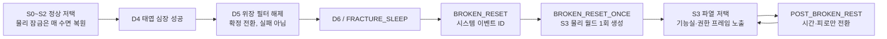
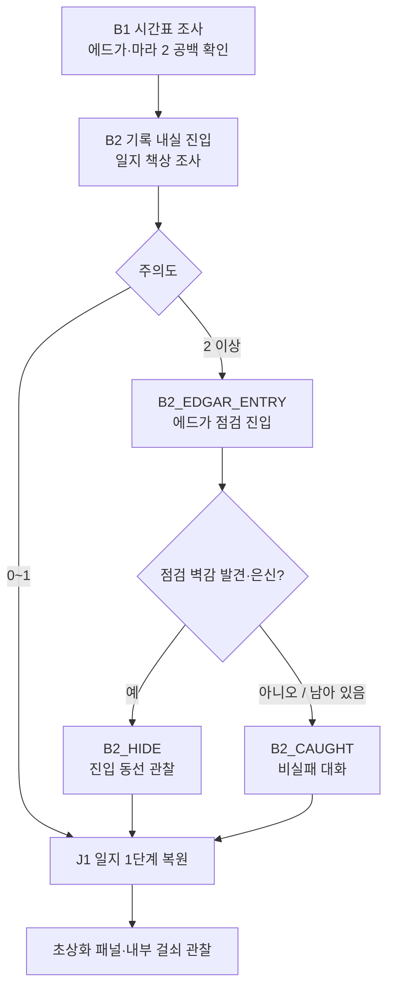
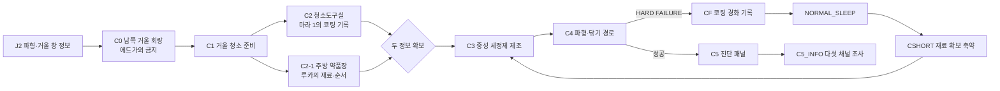
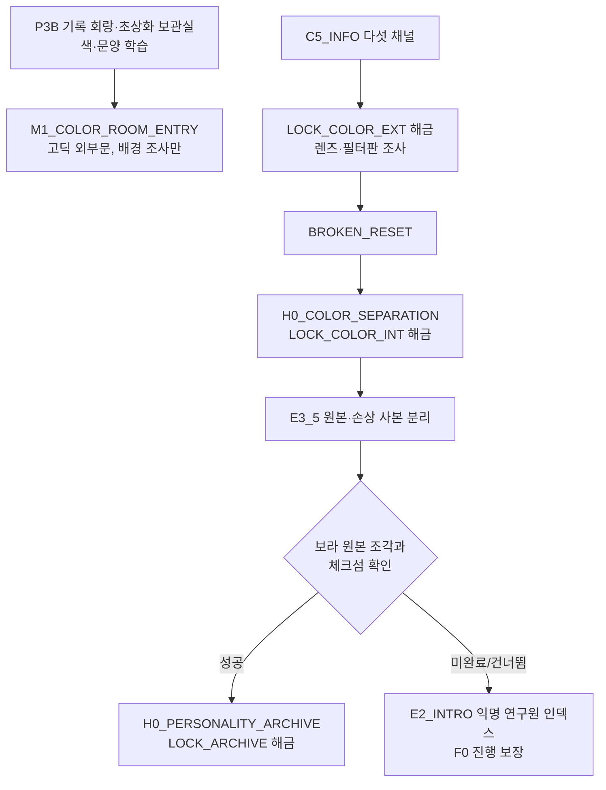
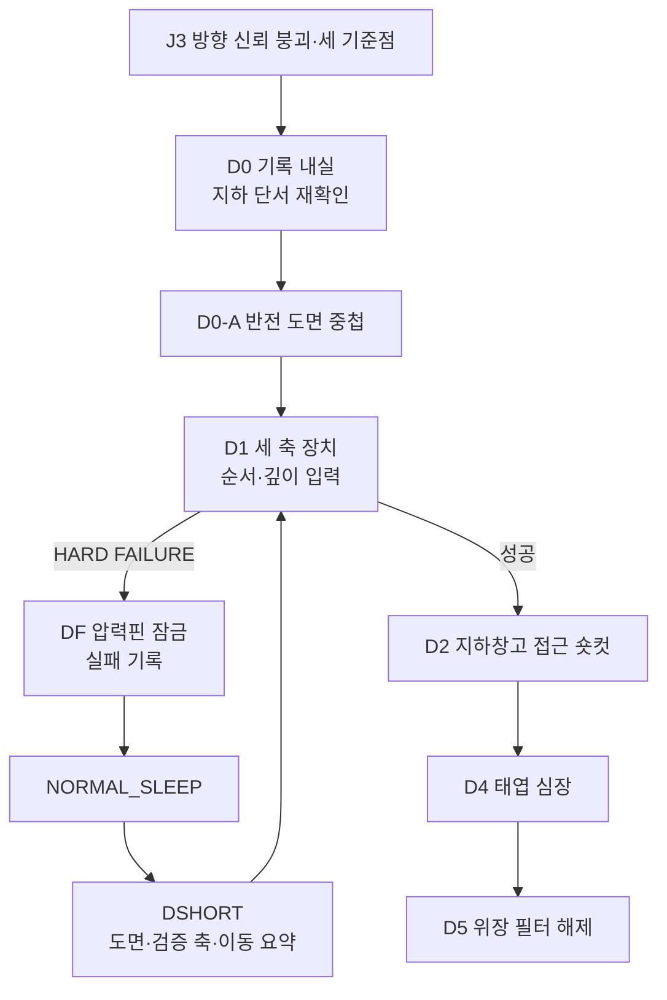
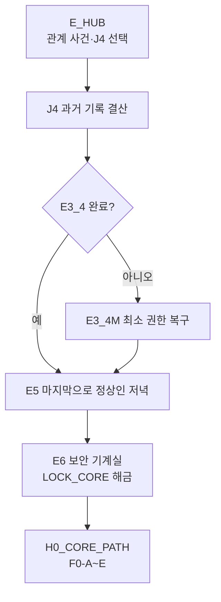

# GGB v0.4 이벤트 상세 05: 공간 잠금·해금·동선

## 1. 문서 목적과 범위

본 문서는 플레이어가 저택 안에서 "왜 지금은 들어갈 수 없는가", "무엇을 알면 다음에는 빨라지는가", "공간이 깨진 뒤에는 무엇이 달라지는가"를 실제 플레이 단위로 정의한다.

담당 범위:

- 문, 위장 벽, 코팅, 권한 프레임, 시설 입구의 잠금 이유와 해금 절차.
- 최초 접근, 정상 리셋 뒤 재접근, HARD FAILURE 뒤 숏컷의 차이.
- B2 기록 내실 압박, 검은 거울 준비 동선, 북쪽 기록 구역, 지하, D5 이후 시설층과 코어 진입.
- 사용인 관계와 경계 상태가 동선에 미치는 영향의 한계.
- 색·문양·음향·텍스트를 함께 쓰는 목적지 안내와 접근성 대체.

담당하지 않는 범위:

| 영역 | 기준 문서 |
| --- | --- |
| 퍼즐의 정답·입력·실패 판정 | `08_이벤트상세_03_메인퍼즐.md` |
| 수면 리셋·영구 정보 커밋 | `07_이벤트상세_02_루프_영구정보_숏컷.md` |
| 일지 원문·정보 조사 대사 | `09_이벤트상세_04_정보조사_일지복원.md` |
| 사용인 핵심 관계 사건 | `12_이벤트상세_07_사용인핵심관계.md` |
| D5·E5·엔딩 전환 | `13_이벤트상세_08_파열_전환_결산.md` |
| 전체 지도와 장면 분리 | `05_공간구성지도_및_동선.md` |

본 문서는 위 문서의 내용을 다시 요약하지 않는다. 공간 잠금이 플레이 시간, 심리적 압박, 반복 피로도에 어떤 형태로 작동하는지에 집중한다.

## 2. 공통 원칙

1. 모든 잠금은 `공간 상태`, `역할`, `권한`, `물리 제약` 중 하나 이상의 이유를 가진다.
2. 관계 수치나 사용인의 호의만으로 메인 진행 문을 영구 차단하지 않는다.
3. 최초 접근은 관찰과 행동으로 열고, 반복 접근은 검증된 지식으로 축약한다.
4. 정상 리셋은 물리 상태를 되돌리지만, 수첩에 기록된 해법과 확인된 접근법을 지우지 않는다.
5. HARD FAILURE는 B3-B, C4, D1에만 적용한다. B2의 발각, C0의 제지, E구간의 관계 미완료는 실패가 아니다.
6. 사용인이 막는 장면에는 반드시 목적이 있다. 경고는 단서의 위험성을 드러내되, 필수 루트를 제거하지 않는다.
7. 색상은 빠른 식별 수단일 뿐 정답이 아니다. 색 제거 모드에서도 문양, 선 패턴, 목적지 이름, 음향 자막으로 같은 길을 찾을 수 있어야 한다.
8. D5 이후에는 정상 리셋이 복귀 수단이 아니다. 이후 공간의 안정성은 수면이 아니라 현재 상태와 관계 결산으로 다룬다.

## 3. 용어와 정식 공간 계약

### 3.1 잠금 유형

| 유형 | 의미 | 예시 | 플레이어 대응 |
| --- | --- | --- | --- |
| 관찰 잠금 | 존재는 보이지만 의미·조작법을 모름 | 기록 내실 유리문, 현상실 문 | 정보 조사, 수첩 기록 |
| 시간·역할 잠금 | 사용인 업무·감시가 접근을 제한 | B2 기록 내실 | 시간표 조사, 대화, 압박 감수 |
| 물리 잠금 | 코팅·걸쇠·압력핀 등 당일 물리 상태가 막음 | 검은 거울, D1 세 축 | 퍼즐, LOCAL RETRY, 수면 뒤 재도전 |
| 권한 잠금 | 시스템이 특정 권한·기록을 요구 | E6 코어 접근 | J4, 에드가 권한, E5 |
| 위장 잠금 | 고딕 외형이 시설 입구 자체를 숨김 | 기능실, 색분해실 내부 | D5/BROKEN_RESET 뒤 레이어 전환 |

### 3.2 잠금 ID

이 문서는 지도 레지스트리의 정식 ID를 사용한다. 과거 초안의 `LOCK_LIB`, `LOCK_LINK`, `LOCK_MIRROR`, `LOCK_BASE`, `LOCK_MACHINE` 표기는 새 기획에 사용하지 않는다.

| 정식 ID | 대상 | 최초 해금 | 반복 규칙 | 핵심 location_id |
| --- | --- | --- | --- | --- |
| `LOCK_LIBRARY_INNER` | 기록 내실 심층 접근 | B1 시간표 조사 뒤 B2 | 접근 창과 대화 요약 | `M1_LIBRARY_OUTER` → `M1_LIBRARY_INNER` |
| `LOCK_NORTH_LIBRARY_LINK` | 북쪽 회랑과 기록 내실 연결 | J1 뒤 내부 걸쇠 해제 | 숨은 압력점으로 재현 | `M1_LIBRARY_INNER` ↔ `M1_NORTH_ARCHIVE_HALL` |
| `LOCK_MIRROR_GALLERY` | 남쪽 거울 회랑 조사 | J2 뒤 C0 관찰 | 거울 회랑 접근 유지 | `M1_MIRROR_GALLERY` |
| `LOCK_MIRROR_SURFACE` | 검은 거울 표면 | C2·C2-1·C3 뒤 C4 성공 | C4 실패 시 CSHORT | `M1_MIRROR_GALLERY` |
| `LOCK_COLOR_EXT` | 색분해실 외부 패널 | C5·C5_INFO | 외부 조사 상태 유지 | `M1_COLOR_ROOM_ENTRY` |
| `LOCK_COLOR_INT` | 색분해실 내부 | BROKEN_RESET | E_HUB에서 재접근 | `H0_COLOR_SEPARATION` |
| `LOCK_ARCHIVE` | 인격 아카이브 | E3_5의 체크섬 확인 | 완료 뒤 후속 대화만 | `H0_PERSONALITY_ARCHIVE` |
| `LOCK_BASEMENT` | 세 축 장치와 지하창고 | D0-A 뒤 D1 성공 | DSHORT·D2 빠른 접근 | `M1_BASEMENT_ENTRY` → `B1_AXIS_CHAMBER` → `B1_STORAGE` |
| `LOCK_CLOCK_MACHINE` | 대시계 보안 기계실 | BROKEN_RESET | E_HUB 목적지 전환 | `M1_GREAT_CLOCK` → `H0_CLOCK_MACHINE` |
| `LOCK_WIRING_ROOM` | 배선실 심층 | BROKEN_RESET | E_HUB 목적지 전환 | `M1_WIRING_ROOM` |
| `LOCK_LIFE_SUPPORT` | 생명 유지실 | BROKEN_RESET | E_HUB 목적지 전환 | `M1_KITCHEN` → `H0_LIFE_SUPPORT` |
| `LOCK_CLIMATE_CONTROL` | 기후 제어실 | BROKEN_RESET | E_HUB 목적지 전환 | `M1_GREENHOUSE` → `H0_CLIMATE_CONTROL` |
| `LOCK_CORE` | F0 접근로 | J4 뒤 E3_4 또는 E3_4M, E5, E6 | 일방향 F구간 | `H0_CLOCK_MACHINE` → `H0_CORE_PATH` |

### 3.3 검은 거울과 마라 2 경로의 위치 규칙

다음 위치는 혼용하지 않는다.

```text
C0~C5: M1_MIRROR_GALLERY
색분해실의 고딕 외부문·렌즈 조사: M1_COLOR_ROOM_ENTRY
E3_5 전반의 분리 조작: H0_COLOR_SEPARATION
E3_5 후반의 원본·사본 대조: H0_PERSONALITY_ARCHIVE
```

`M1_COLOR_ROOM_ENTRY`는 기록 회랑에 있는 고딕 외부문이다. `H0_COLOR_SEPARATION`은 같은 좌표에 겹쳐 있던 시설 기능실이 위장 필터 해제 뒤 드러난 공간이다. 따라서 플레이어가 "북쪽 회랑의 문을 열었으니 곧바로 아카이브에 들어간다"고 오해하지 않도록, 두 공간 사이에는 데이터 프레임 전환과 E3_5의 필터 휠 조작을 둔다.

## 4. 리셋·상태·숏컷 계약

### 4.1 공간 상태 전환



| 상태·전환 | 물리 공간 | 영구 정보 | 수면 처리 | 금지 사항 |
| --- | --- | --- | --- | --- |
| `NORMAL_RESET` | S0 기준으로 문·코팅·장치가 복원 | 수첩, 일지 단계, 검증 지식, 관계, 실패 기록 유지 | `NORMAL_SLEEP → SYS_COMMIT → SYS_MEMORY → NORMAL_RESET` | 물리 물품·당일 장치 상태의 영구화 |
| `BROKEN_RESET` → `BROKEN_RESET_ONCE` | S3 기준으로 한 번만 생성 | 정상 구간 영구 정보 유지 | `FRACTURE_SLEEP` 완료 뒤 이벤트 ID가 단발 전환을 호출 | S0으로 되돌리기 |
| `POST_BROKEN_REST` | 현재 수리·공간·관계 상태 유지 | 같은 영구 상태 유지 | 시간·피로만 전환 | S3 재생성, E3 수리 초기화 |
| `FINAL_SLEEP_LOCK` | EDC 앞 상태 고정 | 최종 선택 전 상태 유지 | 수면 비활성 | 선택 회피용 휴식 |

`BROKEN_RESET`은 콘텐츠·흐름도에서 쓰는 시스템 이벤트 ID이고, `BROKEN_RESET_ONCE`는 그 안에서 S3를 단 한 번 만드는 전환 동작이다. `POST_BROKEN_REST`는 이 동작을 다시 호출하지 않는다. 이 규칙은 D5 이후의 불안이 "매일 더 망가지는 랜덤 상태"가 아니라, 이미 깨진 세계에서 더는 과거의 안전장치에 숨을 수 없다는 감각이 되도록 한다.

### 4.2 잠금별 유지 항목

| 잠금 | 정상 리셋 뒤 사라지는 것 | 유지되는 것 | 재접근 방식 |
| --- | --- | --- | --- |
| 기록 내실 | 당일 감시 공백, B2 주의도 | 시간표 지식, 벽감 발견, 잔류 기억 | 접근 창 요약 뒤 B2 또는 J1 목적지 |
| 북쪽 연결문 | 걸쇠가 열린 물리 상태 | `library_link_fast_path` | 액자 뒤 압력점 한 번 조작 |
| 검은 거울 | 제조된 세정제, C4 표면 변화 | 5:1:2 검증, 파형 지식, 실패 기록 | CSHORT 뒤 C3·C4 직접 수행 |
| 지하 | 열린 압력핀, 세 축 배치 | 도면 중첩, 검증 축, `basement_access_fast_path` | DSHORT 또는 D2 빠른 접근 |
| 시설 기능실 | 해당 없음. S3부터 현재 상태 유지 | E3 완료·기록·관계 | E_HUB 목적지 선택 |
| 코어 | E6 전에는 권한 프레임 닫힘 | J4, 에드가 최소 권한, E5 완료 | E6 한 번 개방 후 F구간 일방향 진입 |

### 4.3 숏컷의 제한

숏컷은 이동과 이미 검증된 준비를 줄일 뿐, 아직 검증하지 않은 판단을 대신하지 않는다.

| 숏컷 | 줄이는 것 | 남기는 것 | 차단하지 않는 이유 |
| --- | --- | --- | --- |
| `library_link_fast_path` | 기록 회랑↔내실 왕복 | 걸쇠 한 번 조작 | B2 최초 접근 뒤에만 생성 |
| `BSHORT` | 탁본 재수집·일과 이동 | B3-B 위상 판단 | 실패의 핵심 판단은 다시 요구 |
| `CSHORT` | 도구·약품 확보 | C3 제조, C4 닦기 | 비가역 표면 입력은 다시 체험 |
| `DSHORT` | D0 재독과 지하 이동 | D1 미확정 축 입력 | 검증되지 않은 축은 플레이어가 선택 |
| E_HUB 목적지 전환 | 기능실까지의 반복 도보 | 관계 사건의 조작·선택 | 대화와 관계 결과를 축약하지 않음 |

## 5. LOCK_LIBRARY_INNER: 기록 내실

### 5.1 이벤트 카드

| 항목 | 내용 |
| --- | --- |
| 관련 이벤트 | P3, B1, B2, B2_EDGAR_ENTRY, B2_HIDE, B2_CAUGHT, J1 |
| 위치·시간 | `M1_LIBRARY_OUTER`·`M1_LIBRARY_INNER`, B구간 저녁 |
| 선행 조건 | A2 완료, `servant_schedule_known=true` |
| 목표 | 에드가의 업무 공백을 이용해 일지를 책상에 놓고 J1을 복원 |
| 잠금 이유 | 기록 내실은 저택의 기억을 직접 수정할 수 있는 공간이며, 에드가의 보호·감시 역할이 출입을 제어 |
| 성공 | 어떤 B2 분기든 J1 실행, `journal_stage=1` |
| 실패 | 없음. 발각은 대화·경계 변화이며 J1 합류를 막지 않음 |
| 권장 체류 | 첫 접근 7~12분, 반복 2~4분 |

P3에서 플레이어는 외부 서고의 유리문 너머로 일지와 책상을 본다. 이때 막히는 감각은 문이 없어서가 아니라, 문이 너무 가까운데도 "허가된 아이"로만 취급되는 데서 온다. B1은 그 답답함을 시간표라는 관찰 행동으로 바꾸며, B2는 처음으로 그 역할을 벗어나는 저녁이다.

### 5.2 최초 접근 흐름



### 5.3 주의도와 에드가 진입

주의도는 확률이 아니라 당일 행동에 따라 정해지는 결정적 값이다. 같은 입력은 같은 결과를 내야 한다.

| 행동 | `b2_attention_level` 변화 | 피드백 |
| --- | ---: | --- |
| 일지 책상·기록 시계만 조사 | +0 | 종이 넘기는 소리, 복도 밖 낮은 시계음 |
| 같은 잠긴 서랍을 두 번째로 강하게 조사 | +1 | 문고리 뒤의 금속 마찰음 |
| 금지 책장·이중 바닥을 J1 전 강제 조사 | +2 | 남색 잠금선이 문틈에 짧게 드러남 |
| 벽감·커튼·찬 공기 조사 | +0 | 숨은 공간의 존재만 확인 |
| 에드가 진입 뒤 대화 선택 | 변화 없음 | 경계 수치는 별도 `alert`로만 반영 가능 |

| 당일 주의도 | 처리 | 에드가 대사 톤 |
| --- | --- | --- |
| 0~1 | 진입 없음. J1 뒤 짧은 순찰 소리만 남김 | 없음 또는 사무적 인사 |
| 2 | 다음 중요 조사 뒤 `B2_EDGAR_ENTRY` 실행. 은신 선택을 명확히 제시 | "정리할 물건이 있습니까?" |
| 3 이상 | 에드가가 즉시 들어옴. 벽감에 숨지 않았다면 `B2_CAUGHT` | `alert`가 높을수록 돌려 말하는 의심 강화 |

`alert` 0~1에서는 업무 확인, 2~3에서는 우회 경고, 4~5에서는 "기록은 읽는 사람도 기록합니다."와 같은 의심 문구를 사용한다. 어느 단계에서도 에드가는 일지를 빼앗거나 주인공을 내실 밖으로 강제 이동시키지 않는다.

### 5.4 점검 벽감과 발각 처리

| 항목 | 내용 |
| --- | --- |
| object_id | `OBJ_LIBRARY_SERVICE_ALCOVE` |
| 위치 | 기록 내실 북서쪽, 벨벳 커튼과 책장 사이 |
| 발견 조건 | 커튼 주름, 바닥 흠집, 찬 공기 중 둘 이상 조사 |
| 영구 출력 | `library_service_alcove_known=true` |
| 당일 출력 | `b2_hide_discovered=true` |
| 은신 결과 | 에드가의 레이피어 손잡이와 남색 수직선이 벽감 앞을 지나감. 12~20초 뒤 퇴장 |
| 발각 결과 | 보고 싶은 책이 있는지 묻는 대화 뒤 에드가 퇴장. J1로 합류 |

벽감은 "안 들키는 정답"이 아니다. 숨으면 에드가가 먼저 내실에 들어와 기록을 대하는 태도를 관찰할 수 있고, 숨지 않으면 주인공이 보호와 감시 사이의 모호함을 직접 대면한다. 두 경로 모두 다른 감정 정보를 주되, 퍼즐 정답과 메인 진행은 같다.

### 5.5 리셋·관계·감각 연출

- NORMAL_RESET은 `b2_attention_level`, `b2_edgar_entry_used`, `b2_hide_discovered`, `b2_caught_once`를 지운다.
- `library_inner_pressure_seen`, `library_service_alcove_known`, 에드가의 `MEM_EDGAR_LIBRARY_ENCOUNTER` 계열 잔류 기억은 유지할 수 있다.
- 재진입 시 긴 침묵, 에드가의 문 손잡이, 벽감 탐색 장면은 요약한다. 플레이어가 원하면 전체 장면을 다시 볼 수 있다.
- 에드가의 관계가 높으면 경고는 더 솔직해질 수 있으나, 감시가 사라지지는 않는다. 낮은 관계에서는 규정 언어가 강해진다.
- 남색 수직 잠금선, 종이 냄새 사이의 얇은 금속 냄새, 멀리서 한 번 늦게 울리는 시계음을 반복 감각으로 사용한다.

### 5.6 LOCK_NORTH_LIBRARY_LINK

| 항목 | 내용 |
| --- | --- |
| 위치·시간 | `M1_LIBRARY_INNER` ↔ `M1_NORTH_ARCHIVE_HALL`, J1 뒤·유연 |
| 선행 조건 | J1 완료 |
| 목표 | 초상화 패널 뒤 내부 걸쇠를 풀어 두 공간의 왕복 경로 확보 |
| 상호작용 | 액자 가장자리의 반대 방향 흠집을 따라 눌러 걸쇠를 당김 |
| 성공 | `library_link_fast_path=true`, 양방향 숏컷 활성 |
| 실패 | LOCAL RETRY. 패널을 잘못 누르면 액자가 제자리로 돌아갈 뿐 당일 진행은 막히지 않음 |
| 감각 | 액자 뒤에서 종이 대신 차가운 공기가 새고, 고딕 벽지 아래에 격자 무늬가 한 프레임 보임 |

정상 리셋 뒤 물리 걸쇠는 다시 잠긴다. 그러나 주인공은 북쪽 액자 뒤 압력점을 알고 있으므로 B2 시간표 추론을 다시 하지 않고 한 번의 조작으로 문을 연다. 이 숏컷은 북쪽 회랑에서 기록 내실로 들어가 B2를 먼저 완료하는 순서를 우회하지 않는다.

## 6. LOCK_MIRROR_GALLERY·LOCK_MIRROR_SURFACE: 검은 거울

### 6.1 이벤트 카드

| 항목 | 거울 회랑 접근 | 거울 표면 해금 |
| --- | --- | --- |
| 관련 이벤트 | J2, C0, C1 | C2, C2-1, C3, C4, CF, C5, C5_INFO |
| 위치·시간 | `M1_MIRROR_GALLERY`, C구간·저녁 | `M1_MIRROR_GALLERY`, C구간·저녁 |
| 잠금 이유 | 대응접실 남쪽의 별도 회랑이 J2 전에는 일상 동선으로 인식되지 않음 | 검은 코팅이 진단·냉각 흔적을 감추고 있음 |
| 목표 | 거울이 단순 장식이 아니라 입력면임을 확인 | 세정제를 제조하고 파형에 맞춰 코팅을 닦음 |
| 실패 | 없음 | C4만 HARD FAILURE, CF 뒤 수면 필요 |
| 영구 출력 | 거울 회랑 조사 가능 | C5·C5_INFO, `mirror_tracing_acquired` |

### 6.2 접근과 준비 동선



C0은 대응접실 안의 거울을 보는 장면이 아니다. 플레이어는 `M1_PARLOR` 남쪽 문을 통해 별도 `M1_MIRROR_GALLERY`로 들어간다. 문턱을 넘을 때 저택의 나무 바닥 소리가 유리 바닥의 둔탁한 울림으로 바뀌어, 공간이 이미 일상 저택 바깥에 있다는 느낌을 준다.

### 6.3 에드가의 금지

| 항목 | 내용 |
| --- | --- |
| 발생 | J2 뒤 C0에서 검은 거울을 처음 조사 |
| 에드가의 표면 이유 | "균열이 심합니다. 가까이 가지 않는 편이 좋습니다." |
| 실제 기능 | 주인공이 냉각·진단 장치에 너무 일찍 접근하는 것을 지연 |
| 플레이어 처리 | 대화 후에도 회랑에서 쫓겨나지 않음. C1 핫스폿 유지 |
| 관계 영향 | bond가 높으면 단호함 뒤의 불안이 보이고, alert가 높으면 규정 언어가 늘어남 |
| 진행 보장 | 마라 1·루카의 재료 정보는 모든 관계 상태에서 획득 가능 |

금지는 "하지 마라"라는 벽이 아니라, 플레이어가 왜 금지되는지 의심하게 하는 장치다. 에드가가 떠난 뒤 거울 테두리에만 남색 수직 잠금선이 잠깐 남고, 화면에는 목적지 `청소도구실`과 `주방 약품장`이 동시에 표시된다.

### 6.4 표면 해금과 실패 처리

| 단계 | 플레이어 행동 | 잠금 변화 | 리셋 처리 |
| --- | --- | --- | --- |
| C2 | 마라 1의 코팅 기록에서 표면 보호 원리 확인 | 제거 방식이 `observed` | 기록 유지, 천은 소실 |
| C2-1 | 루카의 약품장으로 재료·순서 확인 | 제조 조건이 `observed` | 재료 소실, 정보 유지 |
| C3 | 5:1:2 비율과 투입 순서로 제조 | `c3_formula_verified=true` | 세정제 소실, 검증 유지 |
| C4 성공 | 파형을 경로로 번역해 코팅 제거 | `LOCK_MIRROR_SURFACE` 해금 | C5 정보 유지 |
| C4 실패 | 잘못된 경로로 코팅 경화 | `failure_C4=active` | 수면 뒤 CSHORT, C3부터 재시작 |

마라 1의 관계가 높으면 천을 도구실 바깥에 두고, 루카의 관계가 높으면 시험지를 추가로 건넨다. 이는 이동과 검증의 부담을 줄일 뿐 C3 비율·C4 경로의 정답을 제공하지 않는다.

### 6.5 C5 이후의 공간 변화

- 거울 표면은 진단 패널·냉각 장치 실루엣·다섯 채널로 바뀐다.
- `C5_INFO`를 완료하면 `M1_COLOR_ROOM_ENTRY`의 외부 렌즈와 필터판을 조사할 수 있다.
- 이 단계에서는 색분해실 안으로 들어갈 수 없다. 보라 이중 윤곽은 마라 2의 존재를 암시하는 관찰 정보일 뿐 E3_5 접근권이 아니다.
- 검은 코팅의 손끝 감각은 사라지지만, 유리 뒤에서 들리는 3음 신호와 얇은 냉각 바람은 이후 F0-C의 기억을 준비한다.

## 7. LOCK_COLOR_EXT·LOCK_COLOR_INT·LOCK_ARCHIVE: 북쪽 기록 구역

### 7.1 단계별 접근 구조



### 7.2 LOCK_COLOR_EXT: 색분해실 외부

| 항목 | 내용 |
| --- | --- |
| 위치·시간 | `M1_COLOR_ROOM_ENTRY`, 프롤로그~D구간·유연 |
| 선행 조건 | P3B로 외부문 인지. 실제 조사 해금은 C5_INFO |
| 목표 | 마라 2의 보라 채널이 다른 사용인의 색과 다르게 겹쳐 있다는 사실 관찰 |
| 상호작용 | 렌즈 회전, 필터판 비교, 초상화 프레임과 채널 길이 대조 |
| 성공 | `MARA2_S2` 조건, E3_5의 관찰 단서 확보 |
| 실패 | 없음. 잘못된 필터 조합은 각 사용인의 문양·음향만 재생 |
| 관계 변화 | 마라 2는 플레이어가 자신의 누락을 알아챘는지 기억할 수 있으나, 입구를 열어 주거나 막지는 않음 |
| 감각 | 바니시 냄새 아래 오존이 더 짙어지고, 보라 신호만 빠른 세 음으로 끊김 |

P3B에서 이 문은 비어 있는 현상실처럼 보인다. C5_INFO 뒤에는 "열 수 없는 문"이 아니라 "읽을 수는 있지만 아직 들어갈 수 없는 장치"가 된다. 이 구분은 마라 2가 접근 가능한 사용인이면서도 자신의 원본에 접근할 권한은 없는 존재임을 반영한다.

### 7.3 LOCK_COLOR_INT: 색분해실 내부

| 항목 | 내용 |
| --- | --- |
| 위치·시간 | `H0_COLOR_SEPARATION`, BROKEN_RESET 뒤 E구간·유연 |
| 선행 조건 | E2_INTRO, E3_5 미완료, E5 진입 전 |
| 해금 이유 | 위장 필터가 사라져 `M1_COLOR_ROOM_ENTRY`가 데이터 프레임으로 전환 |
| 목표 | 다섯 서명의 출처와 마라 2의 보라 체크섬을 분리 |
| 상호작용 | 필터 휠, 초상화 슬롯, 파형 패널, 문양·음향 대조 |
| 성공·실패 | LOCAL RETRY. 오배치는 잔상이 겹친 채 남아 이유를 보여 줌 |
| 메인 진행 | 선택형. E3_5 미완료여도 E2_INTRO의 익명 인덱스로 F0-D 진행 가능 |

E_HUB에서 마라 2 목적지를 고르면 기록 회랑의 외부문 앞에 잠깐 도착한 뒤, 액자의 보라 이중 윤곽이 시설 프레임으로 펼쳐진다. 이 전환은 긴 로딩 복도가 아니라 2~3초의 시점 이동으로 처리한다. 공간을 자유 탐색 가능한 미로로 만들지 않아 관계 사건의 밀도를 유지한다.

### 7.4 LOCK_ARCHIVE: 인격 아카이브

| 항목 | 내용 |
| --- | --- |
| 위치·시간 | `H0_PERSONALITY_ARCHIVE`, E3_5 후반·유연 |
| 선행 조건 | 색분해실에서 원본 조각 세 개와 보라 체크섬의 일치 확인 |
| 목표 | 마라 2의 원본·손상 복사본·타인의 기억 저장분을 대조하고 보존 방식을 선택 |
| 상호작용 | 체크섬 비교, 기록 조각 배치, 대화 선택 |
| 성공 | `REC_MARA2`, `E3_5_complete`, `archive_resolution` 저장 |
| 실패 | 없음. 퍼즐은 LOCAL RETRY이며 선택은 한 번만 확정 |
| 후속 | `MARA2_FU`, F2·엔딩의 마라 2 반응 변형 |

아카이브가 열리지 않아도 주인공은 갇히지 않는다. 미완료 상태에서는 이름 없는 보라 인덱스가 남아 있고, 그 결손 자체가 마라 2를 돕지 않았을 때의 감정적 빈자리로 작동한다. 이 대체값은 정답을 쉽게 만들지 않으며 F0-D의 출처 식별만 보장한다.

## 8. LOCK_BASEMENT: 지하와 태엽 심장

### 8.1 이벤트 카드

| 항목 | 내용 |
| --- | --- |
| 관련 이벤트 | D0, D0-A, D1, DF, DSHORT, D2, D4, D5, D6 |
| 위치·시간 | `M1_LIBRARY_INNER` → `M1_BASEMENT_ENTRY` → `B1_AXIS_CHAMBER` → `B1_STORAGE` → `B1_CLOCKWORK_HEART`, D구간·낮~저녁 |
| 선행 조건 | J3, C5 투명지, D0 단서 재확인 |
| 목표 | 도면 중첩으로 지하 좌표를 얻고 세 축 장치를 열어 태엽 심장에 도달 |
| 잠금 이유 | 지하창고는 위치 정보와 압력 축의 순서를 모두 요구하는 시설 위장 구역 |
| 성공 | D2 빠른 접근, D4, D5 전환 |
| 실패 | D1만 HARD FAILURE. DF 기록 후 해당 루프의 D1은 잠김 |

### 8.2 최초 동선과 DSHORT



| 단계 | 잠금 변화 | 재시도 규칙 | 감각 연출 |
| --- | --- | --- | --- |
| D0 | 서재의 평면 단서가 지하 좌표 후보가 됨 | 반복에는 일지 요약 | 종이가 습기를 먹은 듯 손끝에 붙음 |
| D0-A | `basement_overlay_solved=true` | LOCAL RETRY | 거울 방향과 도면 방향이 어긋나 머리가 늦게 따라오는 감각 |
| D1 | 세 축 장치 접근 | 틀리면 DF, 수면 뒤 DSHORT | 압력핀이 손목까지 진동을 전달 |
| D2 | `basement_access_fast_path=true` | 성공 뒤 지하 입구 접근 절차 축약 | 문이 아니라 저택 바닥 자체가 숨을 들이마심 |
| D4 | 태엽 심장 조작 | 현장 LOCAL RETRY | 낮은 시계음이 심장 박동과 겹침 |

`DSHORT`는 D0-A의 도면과 검증된 축만 적용한다. 실제 압력핀은 초기 위치로 돌아가며, 플레이어는 미확정 축부터 다시 입력한다. D2의 빠른 접근은 D1을 성공한 뒤의 지하창고 이동에만 적용되고, D1의 최초 해법이나 D4의 장치를 건너뛰지 않는다.

### 8.3 D5의 공간 전환

D4는 퍼즐 성공이다. D5는 그 성공에 의해 발생하는 위장 필터 해제이며, 플레이어에게 실패로 표시하지 않는다.

| 항목 | 내용 |
| --- | --- |
| 위치·시간 | `B1_CLOCKWORK_HEART`, D4 성공 직후 |
| 입력 | 시선 이동·관찰만 허용. 조작권은 전환이 끝난 뒤 반환 |
| 공간 변화 | 태엽 외피가 보안·위장 장치의 인터페이스로 드러나고, 다섯 색 서명이 의상 장식에서 배선·인격 잔상으로 분리 |
| 다음 동선 | 3~8분의 제한 없는 파열 저택 조사 → D6 수면 유도 |
| 수면 결과 | `FRACTURE_SLEEP → BROKEN_RESET → BROKEN_RESET_ONCE → E1` |
| 금지 | D5 이후 `NORMAL_RESET` 호출, S0 물리 배치 복원 |

파열 뒤에는 같은 통로가 조금 더 멀고 차갑게 느껴진다. 저택이 새 지도로 교체된 것이 아니라, 주인공이 이미 있던 시설 좌표를 뒤늦게 보는 느낌을 우선한다.

## 9. BROKEN_RESET 뒤 기능실 동선

### 9.1 E_HUB의 역할

`E_HUB`는 자유 탐색형 던전 선택 화면이 아니다. 중앙홀에서 사용인 또는 J4를 고르면, 저택 표층 공간과 해당 기능실을 짧은 전환 장면으로 연결하는 관계·조사 허브다.

| 목적지 | 표층 출발점 | 시설/심층 공간 | 잠금 해제 기준 | 메인 진행 영향 |
| --- | --- | --- | --- | --- |
| 마라 1 | `M1_SERVICE_HALL`·`M1_WIRING_ROOM` | 배선실 심층 | BROKEN_RESET | E3_1 선택, 미완료 허용 |
| 이리스 | `M1_GREENHOUSE` | `H0_CLIMATE_CONTROL` | BROKEN_RESET | E3_2 선택, 미완료 허용 |
| 루카 | `M1_KITCHEN` | `H0_LIFE_SUPPORT` | BROKEN_RESET | E3_3 선택, 미완료 허용 |
| 에드가 | `M1_GREAT_CLOCK` | `H0_CLOCK_MACHINE` | BROKEN_RESET | E3_4 선택, E3_4M 대체 가능 |
| 마라 2 | `M1_NORTH_ARCHIVE_HALL`·`M1_COLOR_ROOM_ENTRY` | `H0_COLOR_SEPARATION`·`H0_PERSONALITY_ARCHIVE` | BROKEN_RESET | E3_5 선택, 익명 인덱스 대체 가능 |

각 목적지는 색 선 하나만으로 표시하지 않는다. 색상, 문양, 선 패턴, 목적지 텍스트, 음향 자막을 함께 제시한다.

| 사용인 | UI 표식 | 색 제거 모드의 핵심 표식 |
| --- | --- | --- |
| 에드가 | 남색 수직 눈금 | 수직 잠금선·낮은 시계음 |
| 마라 1 | 주황 대각선 닦임 | 대각선 홈·마른 솔 소리 |
| 루카 | 검정 선 위 연두 맥박 | 이중 맥박·생체 신호 자막 |
| 이리스 | 흰 꽃잎과 연노랑 점 | 꽃잎 문양·유리 바람 소리 |
| 마라 2 | 보라 이중 프레임 | 겹친 액자·빠른 3음 신호 |

### 9.2 관계가 바꾸는 것과 바꾸지 않는 것

| 상태 | 바뀌는 것 | 바뀌지 않는 것 |
| --- | --- | --- |
| bond 높음 | 먼저 말하는 힌트, 이동 전 확인 대사, 감정 정보 | 기능실 출입 가능 여부, 퍼즐 정답 |
| alert 높음 | 경고 문구, 안전 확인, 대화 길이 | 필수 조사물, E_HUB 목적지, E6 대체 루트 |
| 핵심 이벤트 완료 | REC, J4 변형, E5·F2·엔딩 장면 | 이미 열린 다른 기능실, F0 정답 |
| 핵심 이벤트 미완료 | 익명 인덱스·최소 권한·추론 상태 | J4, E5, E6, F0, 엔딩 선택지 |

이 규칙으로 사용인은 주인공의 행동을 기억하고 반응하지만, 플레이어를 영구히 감금할 수 있는 전능한 관리자처럼 보이지 않는다. 그들은 시스템의 일부이면서도 서로 다른 책임과 죄책감을 가진 사람들이다.

### 9.3 E3_4M과 LOCK_CORE

| 항목 | 내용 |
| --- | --- |
| J4의 역할 | 연구원 기록 결산. 핵심 관계 완료 수에 따라 BASE·EXPANDED·FULL 변형 |
| E3_4의 역할 | 에드가의 감금 책임과 보안 권한을 다루는 선택 핵심 관계 사건 |
| E3_4M의 역할 | E3_4를 완료하지 않은 경우 운영 권한만 최소 복구하는 반필수 사건 |
| E5의 역할 | 마지막 저녁에서 F구간 진입을 확인하는 일방향 경계 |
| E6의 역할 | 보안 기계실에서 코어 접근로를 여는 공간 해금 |



`LOCK_CORE`의 정식 조건은 `J4 완료 && (E3_4 완료 || E3_4M 완료) && E5 완료`이다. 에드가의 호감도나 다른 사용인 관계 완료 수는 이 문을 잠그는 조건이 아니다. E6 진입 전에는 남은 선택 관계 이벤트와 예상 시간을 알리고, 진입 후에는 E_HUB로 돌아갈 수 없음을 명확히 표시한다.

## 10. 공통 공간 반응과 이동 UX

### 10.1 잠긴 오브젝트의 네 단계 반응

| 단계 | 플레이어가 보는 것 | 상호작용 결과 |
| --- | --- | --- |
| `unreadable` | 장식·벽·잠긴 문처럼 보임 | 감각 묘사와 "아직 알 수 없다" 기록 |
| `observed` | 문양·틈·이상한 음향이 보임 | 수첩에 질문 형태의 단서 추가 |
| `actionable` | 조작점과 목적이 드러남 | 현재 목표·필요 정보·대체 경로 표시 |
| `resolved` | 기능이 명확해지고 반복 요약 가능 | 숏컷·후속 대화·보관 정보 제공 |

플레이어가 아무런 단서 없이 잠긴 문을 여러 번 클릭하지 않도록, `unreadable` 상태에서도 재질·소리·문양 중 최소 하나는 남긴다. 단, 현재 목표와 무관한 모든 문을 즉시 설명하지는 않는다.

### 10.2 반복 이동의 길이

| 상황 | 첫 방문 | 반복 방문 | 구현 메모 |
| --- | --- | --- | --- |
| 침실→중앙홀 | 실제 계단 이동 | 2~4초 몽타주 | 공간 구조 학습 뒤 적용 |
| 기록 회랑↔내실 | 숨은 문 발견 | 압력점 한 번 | B2 최초 접근 우회 금지 |
| CSHORT | 도구실·주방 이동 | 준비 몽타주 | C3 제조와 C4 닦기 유지 |
| DSHORT | 서재→지하 | 도면 요약·이동 몽타주 | D1 미확정 입력 유지 |
| E_HUB→기능실 | 표층과 시설 레이어 전환 | 목적지 전환 5~10초 | 관계 사건 뒤 자동 E_HUB 복귀 |
| E6 이후 | 보안 기계실→F0 | 일방향 짧은 전환 | F구간 이탈 불가를 명시 |

### 10.3 구현 메모

- Godot에서는 `location_id`와 `lock_id`를 분리한다. 장면은 위치를 알고, 잠금 판정은 이벤트·지식·월드 상태를 읽는다.
- 잠금 UI는 일반 열쇠 아이콘만 사용하지 않는다. 각 잠금의 원인에 맞춰 걸쇠, 코팅, 압력핀, 권한 프레임, 위장 노이즈를 사용한다.
- `interactable=false`로 끝내지 않는다. 잠긴 이유, 다음 조사 장소, 현재 부족한 정보 중 하나를 수첩 또는 관찰문으로 제공한다.
- B2와 E_HUB는 사용인 AI의 자유 행동에 맡기지 않고 이벤트 상태에 따라 결정적으로 배치한다. 재현 가능한 긴장 연출을 우선한다.
- C4·D1 HARD FAILURE 직전에는 "이 입력은 오늘의 물리 상태를 되돌리기 어렵습니다."라는 문구와 취소 선택을 제공한다.
- E6과 F구간은 별도 저장 지점과 진입 경고를 제공하되, 서사상 수면 리셋과 저장·불러오기를 혼동하지 않는다.

## 11. 검증 시나리오

| QA ID | 시나리오 | 기대 결과 |
| --- | --- | --- |
| `QA-LOCK-01` | P3에서 북쪽 회랑을 먼저 탐색 | 기록 내실 심층 접근과 J1을 우회하지 못함 |
| `QA-LOCK-02` | B2에서 주의도 3, 은신하지 않음 | B2_CAUGHT 뒤 J1 접근 유지 |
| `QA-LOCK-03` | B2에서 벽감 발견 뒤 리셋 | 벽감 위치는 재조사 없이 알지만 당일 은신 상태는 초기화 |
| `QA-LOCK-04` | C4 실패 뒤 수면 | CSHORT가 재료만 축약하고 C3·C4 직접 조작을 남김 |
| `QA-LOCK-05` | C5 뒤 북쪽 외부문 조사 | `M1_COLOR_ROOM_ENTRY`만 조사 가능, H0 내부 진입 불가 |
| `QA-LOCK-06` | BROKEN_RESET 뒤 E3_5 미완료 | 익명 인덱스로 J4·E5·E6·F0 진입 가능 |
| `QA-LOCK-07` | D1 실패 뒤 DSHORT | 검증 축은 수첩에 남고 압력핀은 초기화, 미확정 축은 재입력 |
| `QA-LOCK-08` | D5 뒤 두 번 휴식 | S3와 E3 수리 상태가 유지되고 BROKEN_RESET이 재실행되지 않음 |
| `QA-LOCK-09` | E3_4 미완료로 J4 도달 | E3_4M 뒤 E5·E6 진행 가능 |
| `QA-LOCK-10` | 색 제거·음량 0·모션 감소 | 모든 목적지와 필수 잠금을 문양·텍스트·자막으로 식별 가능 |

## 12. 동기화 이력

2026-07-10에 아래 후속 동기화를 반영했다. 검증 ID와 이슈 상태는 이 문서가 아니라 `issues/`의 레지스트리에서 관리한다.

| 대상 | 반영 내용 |
| --- | --- |
| `03_전체이벤트흐름도.md` | B2 압박의 에드가 진입·은신·발각 합류, C0~C5의 `M1_MIRROR_GALLERY`, C5_INFO, BROKEN_RESET 단발 전환 |
| `04_전체이벤트리스트_상태표.md` | 정식 lock_id, `library_link_fast_path`, C5_INFO 외부문 조사, E3_5 2단계 location_id, E6 조건 |
| `05_공간구성지도_및_동선.md` | 색분해실·마라 2 이동 경로, 연결문 숏컷 플래그, S3 기능문과 이후 휴식 규칙 |
| `07_이벤트상세_02_루프_영구정보_숏컷.md` | `BROKEN_RESET` 이벤트 ID와 `BROKEN_RESET_ONCE` 단발 전환, POST_BROKEN_REST 보존 계약 |
| `08_이벤트상세_03_메인퍼즐.md` | C4·D1 잠금 맥락, C5 → C5_INFO → 색분해실 외부 조사 연결 |
| `12_이벤트상세_07_사용인핵심관계.md` | E3_4M·E6의 최소 권한 조건, E3_5의 정확한 공간 흐름과 익명 인덱스 대체 |
| `17_상태변수_이벤트ID_Godot데이터구조.md` | `library_link_fast_path`, 정식 E3_5 location_id, E6 계약, D5 이후 단발 전환 가드 |
| `00`, `11`, `15`, `18` | 구식 북쪽 위치 ID와 거울 회랑 명칭 교정 |
| 이슈 관리 | `GGB-CNF-2026-0002`, `GGB-CNF-2026-0005`의 해결 근거·검증 이력 반영 |
