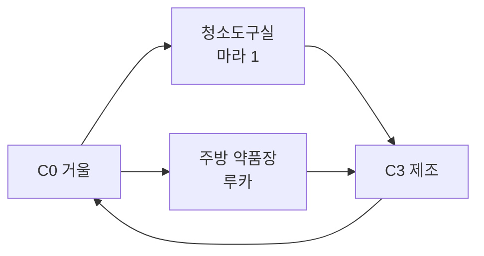

# GGB v0.4 이벤트 상세 05: 공간 잠금·해금·동선

## 1. 원칙

- 잠금 이유를 공간, 역할, 권한 중 하나로 설명.
- 관계 수치로 메인 문을 영구 잠그지 않음.
- 최초 해법은 플레이하고 반복은 지식 숏컷 제공.
- 새 북쪽 공간이 기존 서재 퍼즐을 우회하지 않음.

## 2. 공간 잠금표

| ID | 대상 | 잠금 | 해금 | 영구 결과 |
| --- | --- | --- | --- | --- |
| LOCK_LIB | 서재 장기 조사 | 에드가 | B1·B2 | 시간표 지식 |
| LOCK_LINK | 북쪽→서재 | 위장 벽 | J1 후 내부 걸쇠 | 양방향 숏컷 |
| LOCK_MIRROR | 검은 거울 | 코팅·감시 | J2·C3·C4 | C5 패널 |
| LOCK_COLOR_EXT | 색분해실 조사 | 현상실 문 | C5 | 외부 장치 조사 |
| LOCK_COLOR_INT | 색분해실 내부 | 역할 고정 | BROKEN_RESET | E3_5 가능 |
| LOCK_ARCHIVE | 인격 아카이브 | 체크섬 | E3_5 진행 | 후속 대화 |
| LOCK_BASE | 지하창고 | 좌표·압력 | D0-A·D1 | D2 숏컷 |
| LOCK_MACHINE | 대시계 뒤 | 위장 필터 | BROKEN_RESET | E3_4·E6 |
| LOCK_CORE | 코어 | J4·에드가 권한 | E3_4 또는 E3_4M | F0 |

## 3. C0 검은 거울 금지

발생:

- J2 이후 대응접실 거울 조사.

에드가가 즉시 등장해 금지한다. 이유는 낡은 유리라고 설명하지만 남색 잠금선이 거울 가장자리와 연결된다.

해금 정보:

- 마라 1에게 코팅 질문.
- 루카에게 약품 질문.
- 에드가 순찰 공백.

## 4. C1·C2·C2-1 준비 동선



관계 변형:

- 마라 1 bond 높음: 천을 밖에 둠.
- 루카 bond 높음: 시험지 제공.
- alert 높음: 대화·안전 확인 추가.
- 어떤 상태에서도 재료 접근 가능.

## 5. 북쪽 기록 회랑

### 프롤로그

- 중앙홀 북쪽 문 개방.
- 기록 회랑·초상화 보관실 접근.
- 색분해실은 배경 문.
- 서재 연결문은 초상화 벽으로 위장.

### J1 이후

B2에서 서재 안쪽 초상화 패널의 걸쇠를 발견한다.

```text
[걸쇠를 푼다]
→ 기록 회랑과 서재 양방향 이동 해금
```

이 숏컷은 B2 완료 뒤에만 생긴다.

### C5 이후

- 색분해실 문 표면에 보라 이중 윤곽.
- 외부 렌즈와 필터판 조사 가능.
- MARA2_S2 조건 충족.
- 내부 진입 불가.

### BROKEN_RESET 이후

- 현상실 문이 데이터 프레임으로 변형.
- E_HUB에서 보라 서명을 따라 내부 진입.
- E3_5는 선택형.

## 6. 인격 아카이브 접근

E3_5 중 세 원본 조각을 확보하면 체크섬 문이 열린다.

미완료:

- 아카이브 내부 접근 불가.
- 메인 진행에 필요한 `익명 연구원 인덱스`는 E2_INTRO에서 자동 확보.

완료:

- REC_MARA2.
- MARA2_FU.
- F0 RESIDENT 기록 감정 정보 강화.

## 7. D2 지하 접근 숏컷

D1 성공 후 입구 여는 방법을 수첩에 기록한다.

- 문은 리셋 시 닫힘.
- 지식으로 축·걸쇠를 빠르게 재현.
- 물리 영구 개방이 아님.

## 8. E6 코어 접근

필수:

- J4 기본 이상.
- 에드가 핵심 이벤트 또는 최소 대면.

선택 관계 이벤트 수는 게이트가 아니다.

마라 2 완료 시:

- 코어 접근 기록의 다섯 RESIDENT 서명이 완전.

미완료 시:

- 보라 익명 인덱스.
- F0 정답 동일.

## 9. 동선 압축

| 반복 | 숏컷 |
| --- | --- |
| 침실→기록 회랑 | 중앙홀 이동 몽타주 |
| 기록 회랑→서재 | J1 이후 연결문 |
| C3 재료 | CSHORT |
| D1 재시도 | DSHORT |
| E_HUB 사용인 이동 | 색+문양 지도 선택 |

## 10. 색상 동선 UI

E_HUB에서 바닥에 색 선만 표시하지 않는다.

| 목적지 | 선 |
| --- | --- |
| 에드가 | 남색 수직 눈금 |
| 마라 1 | 주황 대각선 |
| 루카 | 검정 선 위 연두 맥박 |
| 이리스 | 흰 꽃잎·연노랑 점 |
| 마라 2 | 보라 이중 프레임 |

텍스트 목적지와 문양 아이콘 병행.

## 11. 검증

- 북쪽 연결문은 J1 이전 핫스폿이 없어야 함.
- E3_5 미완료로 F0가 잠기지 않아야 함.
- 색상 비활성화 시 목적지 이름과 문양으로 이동 가능.
- 리셋 후 물리 문은 복원되지만 지식 숏컷은 유지.
