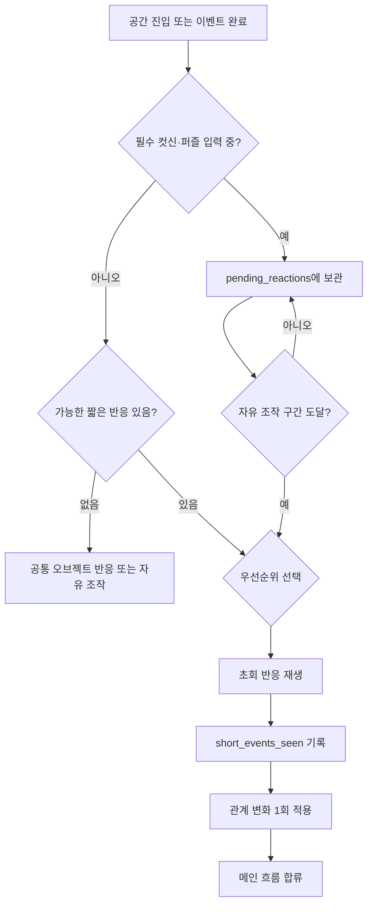
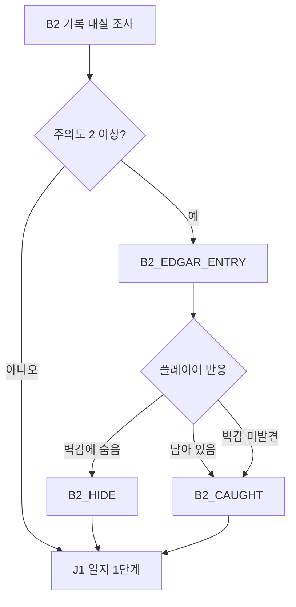

# GGB v0.4 이벤트 상세 06: 사용인 짧은 반응

## 1. 문서 목적

본 문서는 메인 퍼즐, 정보 조사, 핵심 관계 이벤트 사이에 삽입되는 사용인 짧은 반응을 정의한다.

짧은 반응의 핵심 역할은 다음과 같다.

- 사용인이 이전 루프의 기억과 감정 잔류를 갖고 있음을 자연스럽게 노출한다.
- `bond`와 `alert`를 작은 폭으로 변화시켜 핵심 관계 이벤트의 어조를 준비한다.
- 루프와 숏컷이 단순 반복 생략이 아니라 "누군가 알아차리고 있다"는 감각을 만든다.
- 메인 퍼즐 정답, 필수 진행 플래그, 엔딩 선택지는 직접 지급하지 않는다.
- 관계 이벤트를 호감도 작업처럼 분리해 보이지 않게, 일상 동선 안에 묻어 둔다.

본 문서는 다음 문서와 동기화한다.

| 문서 | 연결 내용 |
| --- | --- |
| `02_루프_관계_기억_색상서명시스템.md` | 관계·기억·개입 예산 규칙 |
| `03_전체이벤트흐름도.md` | 짧은 반응 발생 지점과 합류 노드 |
| `04_전체이벤트리스트_상태표.md` | 이벤트 ID, 상태 플래그, 반복 정책 |
| `05_공간구성지도_및_동선.md` | 공식 `location_id` |
| `09_이벤트상세_04_정보조사_일지복원.md` | B2, C5_INFO, J 단계 연결 |
| `10_이벤트상세_05_공간잠금_해금_동선.md` | 공간 잠금·해금 조건 |
| `12_이벤트상세_07_사용인핵심관계.md` | 핵심 관계 이벤트의 선행 감정 |
| `17_상태변수_이벤트ID_Godot데이터구조.md` | Godot 상태·이벤트 데이터 구조 |

## 2. 공통 설계 원칙

### 2.1 짧은 반응이 하는 일

| 기능 | 설명 |
| --- | --- |
| 감정 잔류 표시 | 사용인이 이전 루프의 사건을 완전한 기억이 아니라 감정·패턴·불쾌감으로 보유한다. |
| 관계 변화 | 초회 완료 시 `bond` 또는 `alert`를 `-1~+1` 범위에서 변경한다. |
| 불안 조성 | 같은 일과가 반복되지만 사용인의 말투, 시선, 색상 잔상이 조금씩 변한다. |
| 숏컷 보강 | 플레이어가 이미 아는 행동을 빠르게 넘길 때 사용인이 이를 알아차리는 반응을 준다. |
| 핵심 관계 예열 | E구간 핵심 관계 이벤트에서 갑작스럽게 감정이 터지지 않도록 작은 균열을 쌓는다. |

### 2.2 짧은 반응이 하지 않는 일

| 금지 | 이유 |
| --- | --- |
| 퍼즐 정답 직접 제공 | 관계 수치가 정답 구매나 힌트 구매처럼 보이지 않게 한다. |
| 필수 경로 잠금 | 높은 `alert`라도 B2, C4, D1, E6, F0, 엔딩 선택지를 막지 않는다. |
| 핵심 관계 완료 처리 | `short_events_seen`은 `core_event_complete`와 분리한다. |
| 연구원 기록 지급 | `REC_*`는 핵심 관계 이벤트 또는 메인 정보 조사에서만 지급한다. |
| 엔딩 선택 편향 | 현실·잔류 중 하나를 정답처럼 유도하지 않는다. |
| 색상 단독 단서 | 색은 문양, 선 패턴, 음향, 명칭 자막과 병행한다. |

### 2.3 재생 시간

| 유형 | 권장 길이 | 용도 |
| --- | --- | --- |
| 초회 짧은 반응 | 20~90초 | 선택지 1~2개와 짧은 감각 연출 포함 |
| 압박 반응 | 30~120초 | B2처럼 메인 조사 긴장감을 조절하는 반응 |
| 반복 축약 | 3~12초 | 이미 본 반응의 한 줄 대사 |
| 후속 짧은 반응 | 15~45초 | 핵심 관계 뒤 감정 잔류 확인 |

### 2.4 우선순위

한 공간에 진입했을 때 여러 반응이 동시에 가능하면 다음 순서로 처리한다.

```text
필수 컷신
> 퍼즐 결과 반응
> 핵심 관계 이벤트
> 메인 진행 압박 반응
> 미확인 짧은 반응
> 반복 한 줄 반응
> 공통 오브젝트 반응
```

운영 규칙:

- 한 공간 진입에서 자동 대화는 최대 1개만 재생한다.
- 짧은 반응을 연속 2개 본 뒤에는 최소 1회의 자유 조작 구간을 둔다.
- 퍼즐 입력 중에는 자동 대화를 띄우지 않고 `pending_reactions`에 넣는다.
- 플레이어가 직접 말을 걸어 발생하는 반복 문장은 위 제한에서 제외할 수 있다.
- `pending_reactions`는 NORMAL_RESET에서 삭제하지 않는다. 단, 더 높은 우선순위 이벤트가 조건을 대체하면 `superseded` 처리한다.

## 3. 상태와 데이터 계약

### 3.1 사용인 공통 상태

```yaml
servant_state:
  owner_id: EDGAR
  bond: 0
  alert: 0
  residual_memory: []
  short_events_seen: []
  core_event_complete: false
  researcher_record_acquired: false
  followup_seen: false
  intervention_budget: {}
```

규칙:

- `bond`와 `alert`는 각각 `0..5` 범위다.
- `bond`와 `alert`는 서로 상쇄하지 않는다.
- 같은 짧은 반응의 관계 변화는 최초 완료 시 1회만 적용한다.
- 반복 축약 대사는 관계 수치를 변경하지 않는다.
- 짧은 반응으로 `core_event_complete=true`가 되지 않는다.
- 짧은 반응으로 `researcher_record_acquired=true`가 되지 않는다.

### 3.2 짧은 반응 이벤트 스키마

```yaml
short_reaction_event:
  event_id: EDGAR_S1
  owner_id: EDGAR
  location_id: M1_CENTRAL_HALL
  time_rule: morning
  trigger_mode: on_location_entry
  prerequisites:
    all: [notebook_persistence_confirmed]
    none: [EDGAR_S1_seen]
  blocked_by:
    any: [active_cutscene, active_puzzle_input]
  repeat_policy: once_then_bark
  completion_effects:
    add_to_short_events_seen: EDGAR_S1
    optional_relationship_changes: {}
  forbidden_effects:
    - core_event_complete
    - researcher_record_acquired
    - final_decision
    - puzzle_solution
```

### 3.3 대기열 처리



대기열 규칙:

- `pending_reactions`는 이벤트 ID와 발생 원인을 함께 저장한다.
- 같은 이벤트가 이미 `short_events_seen`에 있으면 대기열에 다시 넣지 않는다.
- 대기 중인 반응의 선행 조건이 사라지면 `superseded` 처리한다.
- 대기열 반응은 메인 이벤트 사이의 안전한 조작 구간에서만 재생한다.

### 3.4 관계 변화 적용

```yaml
relationship_delta_rule:
  once_per_event: true
  clamp_min: 0
  clamp_max: 5
  short_reaction_delta_range: [-1, 1]
  repeat_bark_delta: 0
```

관계 변화 원칙:

- 질문, 걱정, 동의 요청은 대체로 `bond +1`.
- 도발, 거짓말, 아버지로 압박, 금지 구역 강행은 대체로 `alert +1`.
- 무응답은 보통 변화 없음으로 둔다.
- 높은 `alert`는 어조와 감시 강도를 바꾸지만 필수 공백을 제거하지 않는다.

## 4. 전체 짧은 반응 라우팅 표

| ID | 사용인 | 구간 | 위치 | 발생 조건 | 합류 |
| --- | --- | --- | --- | --- | --- |
| `EDGAR_S1` | 에드가 | A | `M1_CENTRAL_HALL` | A2 이후, `notebook_persistence_confirmed`, 미확인 | B1 또는 자유 조사 |
| `EDGAR_B2` | 에드가 | B | `M1_LIBRARY_INNER` | B2 중 주의도 상승 또는 에드가 `alert` 조건 | J1 |
| `EDGAR_S2` | 에드가 | C | `M1_MIRROR_GALLERY` | C0 이후, `journal_stage >= 2`, C4 미완료 | C1 |
| `EDGAR_S3` | 에드가 | E | `H0_CLOCK_MACHINE` | E5 이후, E6 직전 | E6 |
| `MARA1_S1` | 마라 1 | B~C | `M1_SERVICE_HALL` | BSHORT 또는 CSHORT 최초 사용 | 다음 준비 단계 |
| `MARA1_S2` | 마라 1 | C | `M1_MIRROR_GALLERY` | C2 완료, C4 미완료 | CG 또는 C3 |
| `LUCA_S1` | 루카 | A~B | `M1_KITCHEN` | P4 완료, 루프 2회 이상 | 자유 조사 |
| `LUCA_S2` | 루카 | E | `M1_KITCHEN` | `broken_reset_triggered`, E3_3 미완료 | E2_INTRO |
| `IRIS_S1` | 이리스 | A~B | `M1_GREENHOUSE_VESTIBULE` | `weather_contradiction_seen`, 미확인 | 자유 조사 |
| `IRIS_S2` | 이리스 | C | `M1_GREENHOUSE` | C5_INFO 이후, 색 채널 노출, 미확인 | J3 또는 자유 조사 |
| `MARA2_S1` | 마라 2 | A | `M1_PORTRAIT_STORAGE` | P3B 완료, A2 이후, 미확인 | B1 또는 자유 조사 |
| `MARA2_S2` | 마라 2 | C | `M1_COLOR_ROOM_ENTRY` | `c5_info_complete`, `color_room_entry_inspectable`, E3_5 미완료 | J3 또는 자유 조사 |
| `MARA2_FU` | 마라 2 | E~F | `M1_NORTH_ARCHIVE_HALL` | E3_5 완료, 후속 미확인 | E_HUB 또는 F0 준비 |

## 5. 사용인별 말투와 반응 기준

| 사용인 | 말투 | 짧은 반응의 기본 정서 |
| --- | --- | --- |
| 에드가 | 딱딱한 다나까체. 짧고 정갈한 문장 | 통제, 점검, 책임, 돌려 말하는 경고 |
| 마라 1 | 유연한 슴다체. 표정이 크고 농담이 빠름 | 가벼운 농담 뒤에 정비공의 죄책감 |
| 루카 | 말줄임표가 많고 조심스러움 | 불안, 돌봄, 생명 유지 장치에 대한 과민 반응 |
| 이리스 | 부드러운 웃음과 어머니 같은 어조 | 다정함 속의 어긋난 소유욕과 회피 |
| 마라 2 | 느낌표가 많고 건방진 천재형 | 장난, 기억 상실 공포, 이름 확인 강박 |

주의:

- 마라 2의 놀림은 말꼬리 잡기, 과장된 자신감, 기술적 허세로만 표현한다.
- 이리스는 짧은 반응에서 직접적인 살의를 노골적으로 말하지 않는다. 대신 너무 다정해서 불편한 어조, 계절 감각의 어긋남, 주인공의 부재를 편안하게 상상하는 말로 암시한다.
- 루카의 여림은 무능으로 표현하지 않는다. 나설 때는 정확히 나서되, 말이 늦고 손이 떨린다.
- 에드가는 주인공과 가장 자주 상호작용하므로 반응이 많지만, 어떤 반응도 강제 실패가 되지 않는다.

## 6. 에드가 짧은 반응

### 6.1 EDGAR_S1: 같은 꿈

| 항목 | 내용 |
| --- | --- |
| 이벤트 ID | `EDGAR_S1` |
| 위치·시간 | `M1_CENTRAL_HALL`, A2 이후 아침 |
| 선행 조건 | `notebook_persistence_confirmed`, `EDGAR_S1` 미확인 |
| 목표 | 에드가가 루프를 기억한다는 첫 정서 단서 제공 |
| 상호작용 | "어젯밤 꿈"을 묻거나 침묵한다 |
| 성공·실패 | 대화를 끝내면 완료. 실패·진행 차단 없음 |
| 관계 변화 | 질문 `bond +1, alert +1`, 침묵 변화 없음 |
| 색상 반응 | 장갑 아래 남색 수직선이 한 번 닫힘 |
| 감각 연출 | 낮은 시계음, 말보다 반 박자 늦는 입 모양 |
| 구현 메모 | `EDGAR_S1_seen`; 35~55초 |

초회 장면:

1. 주인공이 중앙홀로 내려오면 에드가가 이미 같은 위치에 서 있다.
2. 에드가는 인사를 한 뒤, 찻잔 받침의 작은 흠집을 장갑으로 가린다.
3. 흠집은 전 루프에서 주인공이 본 위치와 같다.
4. 에드가는 꿈 이야기를 먼저 꺼내지 않고, "기록하지 않는 편이 좋은 것"을 말한다.

선택지:

| 선택 | 대사 방향 | 효과 |
| --- | --- | --- |
| "어젯밤에도 이랬나요?" | 직접 확인 | `bond +1`, `alert +1` |
| "아무것도 아니에요." | 회피 | 변화 없음 |
| 찻잔 흠집을 본다 | 관찰 | `knowledge_entries`에 정서 단서만 기록 |

대사 기준:

> "꿈은 기록하지 않는 편이 좋습니다. 특히 되풀이되는 꿈은요."

alert 변형:

| 에드가 alert | 변형 |
| --- | --- |
| 0~1 | "아가씨께서 불편하지 않으시다면, 아침 일정은 그대로 진행하겠습니다." |
| 2~3 | "어제와 같은 질문은, 오늘 다른 답을 부르지 않습니다." |
| 4~5 | "반복을 확인하는 습관은 위험합니다. 제가 모른 척할 수 있는 횟수에도 한계가 있습니다." |

반복 축약:

| 상태 | 한 줄 반응 |
| --- | --- |
| A2 이후 반복 | "오늘도 같은 아침입니다. 다르게 쓰실 필요는 없습니다." |
| alert 높음 | "기억은 정리해 두겠습니다. 아가씨께서 원치 않으셔도요." |

Godot 메모:

```yaml
event_id: EDGAR_S1
owner_id: EDGAR
location_id: M1_CENTRAL_HALL
prerequisites:
  all_flags: [notebook_persistence_confirmed]
  none_seen: [EDGAR_S1]
completion_effects:
  add_short_seen: EDGAR_S1
  choice_effects:
    ask_dream:
      bond: 1
      alert: 1
    stay_silent: {}
forbidden_effects:
  - puzzle_solution
  - core_event_complete
```

### 6.2 EDGAR_B2: 기록 내실 점검

`EDGAR_B2`는 별도 메인 이벤트 ID가 아니라 B2 계열 압박 반응의 기획 묶음이다. 데이터상으로는 `B2_EDGAR_ENTRY`, `B2_HIDE`, `B2_CAUGHT`를 사용한다.

| 항목 | 내용 |
| --- | --- |
| 관련 ID | `B2_EDGAR_ENTRY`, `B2_HIDE`, `B2_CAUGHT` |
| 위치·시간 | `M1_LIBRARY_INNER`, B2 중 저녁 |
| 선행 조건 | B2 중 `b2_attention_level >= 2` 또는 에드가 `alert >= 3` |
| 목표 | 기록 내실 조사에 대한 심리적 압박 제공 |
| 상호작용 | 숨기, 남기, 책을 찾는다고 답하기, 침묵 |
| 성공·실패 | 실패 없음. 모든 분기는 J1로 합류 |
| 관계 변화 | 기본 없음. 고의 도발 선택만 `alert +1` 후보 |
| 색상 반응 | 문틈 아래 남색 수직선이 얇아졌다 닫힘 |
| 감각 연출 | 발소리는 정확하지만 문고리 소리만 반 박자 늦음 |
| 구현 메모 | `library_inner_pressure_seen`; 09의 B2 상태를 따른다 |

흐름:



경계 단계별 문구:

| alert | 문구 성격 | 예시 |
| --- | --- | --- |
| 0~1 | 업무 확인 | "이 시간에 독서라면, 짧게 끝내시는 편이 좋겠습니다." |
| 2~3 | 우회 경고 | "기록은 오래 들여다볼수록 사람을 닮습니다. 아가씨께는 권하지 않습니다." |
| 4~5 | 의심 표면화 | "같은 책을 매번 다르게 찾으시는군요. 우연이라고 적어 두겠습니다." |

선택지와 효과:

| 선택 | 결과 | 관계·상태 |
| --- | --- | --- |
| 숨는다 | 에드가가 들어왔다가 일정 시간 후 퇴장 | `library_service_alcove_known` 가능 |
| 남아 있는다 | 에드가가 보고 싶은 책을 묻고 퇴장 | `library_inner_pressure_seen` |
| 일부러 도발한다 | 경계 문구 강화 | 에드가 `alert +1` |
| 침묵한다 | 짧은 확인 후 퇴장 | 변화 없음 |

실패 방지 규칙:

- 에드가에게 들켜도 실패하지 않는다.
- 에드가는 책 제목을 강제로 요구하지 않는다.
- 에드가는 J1 접근을 막지 않는다.
- 높은 `alert`는 말투와 다음 루프의 압박 문장만 바꾼다.

반복 축약:

| 상태 | 한 줄 반응 |
| --- | --- |
| 압박 경험 있음 | "오늘은 문을 덜 열어 두겠습니다. 서로 편하겠지요." |
| 숨기 경험 있음 | "벽감에는 먼지가 많습니다. 아가씨께 어울리는 장소는 아닙니다." |
| alert 높음 | "필요한 책을 찾으셨다면, 필요하지 않은 책은 덮으십시오." |

Godot 메모:

```yaml
event_group: EDGAR_B2
content_event_ids:
  - B2_EDGAR_ENTRY
  - B2_HIDE
  - B2_CAUGHT
location_id: M1_LIBRARY_INNER
loop_state_used:
  - b2_attention_level
  - b2_edgar_entry_used
  - b2_hide_discovered
  - b2_caught_once
persistent_outputs:
  optional:
    - library_inner_pressure_seen
    - library_service_alcove_known
merge_node_id: J1
fail_policy: no_fail
```

### 6.3 EDGAR_S2: 금지된 표면

| 항목 | 내용 |
| --- | --- |
| 이벤트 ID | `EDGAR_S2` |
| 위치·시간 | `M1_MIRROR_GALLERY`, C0 이후 낮 |
| 선행 조건 | `journal_stage >= 2`, C4 미완료, `EDGAR_S2` 미확인 |
| 목표 | 에드가의 제지가 증오가 아니라 보안 의무임을 암시 |
| 상호작용 | 거울의 금지 이유를 묻거나 아버지를 언급 |
| 성공·실패 | 어느 선택도 메인 정답을 제공하지 않음 |
| 관계 변화 | 이유 질문 `bond +1`, 아버지 압박 `alert +1` |
| 색상 반응 | 거울에 남색 잠금선이 잠깐 겹침 |
| 감각 연출 | 방 안 종소리만 먹먹해지고 손잡이가 차가워짐 |
| 구현 메모 | C4 개입 예산과 별도. 대화로 순찰을 영구 제거하지 않음 |

초회 장면:

1. 주인공이 거울 회랑에서 검은 거울을 확인한다.
2. 에드가는 거울을 "물건"이 아니라 "표면"이라고 부른다.
3. 그는 레이피어 손잡이를 문턱 쪽에 세워 두지만, 겨누지는 않는다.
4. 거울 위에 잠금선이 생겼다가, 에드가가 손을 거두면 사라진다.

선택지:

| 선택 | 대사 방향 | 효과 |
| --- | --- | --- |
| "왜 금지인가요?" | 보안 의무 확인 | `bond +1` |
| "아버지는 허락했을 거예요." | 아버지로 압박 | `alert +1` |
| 거울을 계속 본다 | 침묵 압박 | 변화 없음, 감각 연출 강화 |

대사 기준:

> "출구처럼 보이는 표면은, 대개 안쪽에서 잠겨 있습니다."

alert 변형:

| 에드가 alert | 변형 |
| --- | --- |
| 0~1 | "아가씨께 해가 되지 않는다면, 저 역시 막고 싶지 않습니다." |
| 2~3 | "허락이라는 말은 오래전에 효력을 잃었습니다. 남은 것은 책임뿐입니다." |
| 4~5 | "그분의 이름을 열쇠처럼 쓰지 마십시오. 이미 너무 많은 문이 그 이름으로 열렸습니다." |

반복 축약:

| 상태 | 한 줄 반응 |
| --- | --- |
| C0 반복 | "표면은 그대로입니다. 안쪽은, 그렇지 않을 수 있습니다." |
| 아버지 압박 후 | "그분의 기록은 아가씨의 방패가 아닙니다." |

### 6.4 EDGAR_S3: 마지막 점검

| 항목 | 내용 |
| --- | --- |
| 이벤트 ID | `EDGAR_S3` |
| 위치·시간 | `H0_CLOCK_MACHINE`, E5 이후 E6 직전 |
| 선행 조건 | E5 완료, E6 직전, `EDGAR_S3` 미확인 |
| 목표 | 코어 진입 전 에드가의 양가감정 결산 |
| 상호작용 | 문을 열어 달라고 명령하거나 부탁 |
| 성공·실패 | 두 선택 모두 E6 진입 가능 |
| 관계 변화 | 부탁 `bond +1`, 명령 변화 없음 |
| 색상 반응 | 남색선이 문을 잠갔다가 에드가가 직접 해제 |
| 감각 연출 | 열쇠가 없는 잠금 해제음, 길게 멎는 초침 |
| 구현 메모 | E3_4 완료 여부에 따라 호칭과 어조 변화 |

분기:

| 조건 | 에드가 태도 |
| --- | --- |
| E3_4 완료 | 통제보다 신뢰가 앞선다. 직접 물러선다. |
| E3_4 미완료, E3_4M 완료 | 의무상 길을 열지만 감정은 닫혀 있다. |
| 에드가 `bond >= 4` | "명령"에도 상처받기보다 책임으로 받아들인다. |
| 에드가 `alert >= 4` | 부탁을 들어도 마지막 경고를 남긴다. |

선택지:

| 선택 | 대사 방향 | 효과 |
| --- | --- | --- |
| "열어 주세요." | 부탁 | 에드가 `bond +1` |
| "명령이에요. 열어요." | 주인공의 권한 강조 | 변화 없음 |
| 아무 말 없이 기다린다 | 에드가가 먼저 해제 | 변화 없음, 침묵 연출 |

대사 기준:

> "문은 열겠습니다. 다만, 제가 지키려던 것이 문인지 아가씨인지 아직도 확신하지 못하겠습니다."

반복 축약:

| 상태 | 한 줄 반응 |
| --- | --- |
| E6 재진입 | "길은 열려 있습니다. 이제는 제가 닫을 수 없습니다." |
| E3_4 완료 | "가십시오. 이번에는 제가 뒤에서 따라가겠습니다." |
| E3_4M | "최소 권한은 복구되었습니다. 그 이상은, 아가씨의 몫입니다." |

## 7. 마라 1 짧은 반응

### 7.1 MARA1_S1: 이번에는 빠르네

| 항목 | 내용 |
| --- | --- |
| 이벤트 ID | `MARA1_S1` |
| 위치·시간 | `M1_SERVICE_HALL`, 첫 숏컷 사용 직후 |
| 선행 조건 | BSHORT 또는 CSHORT 최초 사용, `MARA1_S1` 미확인 |
| 목표 | 사용인이 숏컷을 눈치채고 있음을 자연스럽게 노출 |
| 상호작용 | 알고 있었냐고 묻거나 농담으로 넘김 |
| 성공·실패 | 진행 차단 없음 |
| 관계 변화 | 솔직한 질문 `bond +1, alert +1`, 농담 `bond +1` |
| 색상 반응 | 주황 닦임 자국이 발걸음보다 먼저 이동 |
| 감각 연출 | 마른 솔 소리가 실제 청소 동작 없이 들림 |
| 구현 메모 | `MARA1_S1_seen`; 퍼즐 중이면 종료 후 대기열 등록 |

초회 장면:

1. 주인공이 준비 과정을 숏컷으로 넘기면 마라 1이 복도 끝에서 고개를 내민다.
2. 마라 1은 웃는 얼굴로 "이번엔 빠르네"라고 말한다.
3. 손의 스패너는 돌지 않는데, 복도의 나사 하나가 먼저 조여진다.
4. 농담처럼 보이지만, 전 루프의 시간을 정확히 기억한다.

선택지:

| 선택 | 대사 방향 | 효과 |
| --- | --- | --- |
| "알고 있었어요?" | 정면 질문 | 마라 1 `bond +1`, `alert +1` |
| "제가 원래 빠르거든요." | 농담 | 마라 1 `bond +1` |
| 그냥 지나간다 | 회피 | 변화 없음 |

대사 기준:

> "오, 이번엔 빠름다? 어제보다 열여덟 걸음 정도 줄었슴다. 제가 세진 않았고요. 진짜로요."

말투 규칙:

- `슴다체`를 사용한다.
- 말은 가볍지만 관찰 수치가 지나치게 정확하다.
- 허당미는 행동 타이밍의 어긋남으로 표현하고, 판단력 부족으로 만들지 않는다.

반복 축약:

| 상태 | 한 줄 반응 |
| --- | --- |
| BSHORT 반복 | "그 루트 또 씀까? 이제 발소리만 들어도 알겠슴다." |
| CSHORT 반복 | "재료 챙기는 손놀림이 기술자 같아졌슴다. 좀 무서운데요?" |
| alert 높음 | "빠른 건 좋은데, 어디로 빠지는지는 말해주면 안 됨까?" |

### 7.2 MARA1_S2: 닦지 말아야 할 얼룩

| 항목 | 내용 |
| --- | --- |
| 이벤트 ID | `MARA1_S2` |
| 위치·시간 | `M1_MIRROR_GALLERY`, C2 이후 낮 |
| 선행 조건 | C2 청소 기록 조사 완료, C4 미완료, `MARA1_S2` 미확인 |
| 목표 | 마라 1의 연구원 시절 윤리적 후회를 암시 |
| 상호작용 | 얼룩을 지울지 보존할지 의견 제시 |
| 성공·실패 | 선택은 C4 경로에 영향 없음 |
| 관계 변화 | 보존 `bond +1`, 삭제 `alert +1` |
| 색상 반응 | 주황 대각선 일부가 거울 얼룩 아래 남음 |
| 감각 연출 | 솔 냄새, 손끝에 남는 거친 저항 |
| 구현 메모 | E3_1 선택 대사의 선행 변형으로만 사용 |

초회 장면:

1. 주인공이 청소 기록을 읽고 거울 회랑으로 돌아온다.
2. 마라 1은 얼룩을 보며 평소보다 웃음이 얕아진다.
3. 그녀는 "닦는 일"과 "없애는 일"을 구분한다.
4. 주황색 닦임 자국이 얼룩을 완전히 덮지 못하고 비켜 간다.

선택지:

| 선택 | 대사 방향 | 효과 |
| --- | --- | --- |
| "남겨 두는 게 좋겠어요." | 기록 보존 | 마라 1 `bond +1` |
| "깨끗하게 지워야 해요." | 삭제·정리 | 마라 1 `alert +1` |
| "왜 그렇게 봐요?" | 감정 질문 | 대사 추가, 변화 없음 |

대사 기준:

> "지운 기록은 깨끗해지는 게 아님다. 그냥 주인을 잃는 거죠."

반복 축약:

| 상태 | 한 줄 반응 |
| --- | --- |
| C2 이후 반복 | "얼룩은 아직 있슴다. 닦는 쪽이 더 겁나는 얼룩도 있거든요." |
| 보존 선택 후 | "남기는 것도 기술임다. 아무것도 안 하는 거랑은 다르죠." |
| 삭제 선택 후 | "깔끔한 건 좋은데요, 너무 깔끔하면 누가 있었는지도 몰라짐다." |

## 8. 루카 짧은 반응

### 8.1 LUCA_S1: 식지 않는 차

| 항목 | 내용 |
| --- | --- |
| 이벤트 ID | `LUCA_S1` |
| 위치·시간 | `M1_KITCHEN`, A2~B 구간 오후 |
| 선행 조건 | P4 완료, 루프 2회 이상, `LUCA_S1` 미확인 |
| 목표 | 루카가 매번 같은 온도를 의도적으로 복원함을 암시 |
| 상호작용 | 차의 온도를 재거나 아버지 취향을 질문 |
| 성공·실패 | 대화 완료만 존재 |
| 관계 변화 | 아버지 질문 `bond +1, alert +1`, 온도 측정 `bond +1` |
| 색상 반응 | 검정 액면 위로 연두 이중 맥박 |
| 감각 연출 | 단맛은 같은데 금속성 뒷맛이 점차 강해짐 |
| 구현 메모 | 실제 아이템이나 퍼즐 수치를 만들지 않는 조사 이벤트 |

초회 장면:

1. 주방의 차는 매 루프 같은 온도로 준비되어 있다.
2. 루카는 "식으면 안 된다"고 말하지만, 누구의 기준인지 흐린다.
3. 주인공이 잔을 들면 루카의 쥐 모양 귀 끝 연두 신호가 잔의 온도와 동기화된다.
4. 루카는 땀을 닦다가 컵받침을 두 번 놓친다.

선택지:

| 선택 | 대사 방향 | 효과 |
| --- | --- | --- |
| 온도를 잰다 | 관찰과 돌봄 | 루카 `bond +1` |
| "아버지가 좋아하던 온도예요?" | 과거 질문 | 루카 `bond +1`, `alert +1` |
| "식어도 괜찮아요." | 현재의 감각 강조 | 루카 `bond +1` 후보 |

대사 기준:

> "식으면... 안 돼요. 아니, 식어도 되는 건데... 제가 자꾸 같은 온도로 맞추게 돼서요..."

말투 규칙:

- 말줄임표를 자주 사용한다.
- 놀랄 때 짧게 숨을 삼키고, 뒤늦게 정확한 정보를 말한다.
- 소심하지만 생명 유지나 안전과 관련된 일에는 물러서지 않는다.

반복 축약:

| 상태 | 한 줄 반응 |
| --- | --- |
| 주방 재방문 | "오늘도... 같은 온도예요. 제가 또 맞춰 버렸어요..." |
| 아버지 질문 후 | "그분 취향인지, 제 습관인지... 아직 구분이 잘 안 돼요." |
| bond 높음 | "이번 건 조금 덜 뜨겁게 했어요. 주인공님 기준으로요..." |

### 8.2 LUCA_S2: 차가운 손

| 항목 | 내용 |
| --- | --- |
| 이벤트 ID | `LUCA_S2` |
| 위치·시간 | `M1_KITCHEN`, E1 이후 |
| 선행 조건 | `broken_reset_triggered`, E3_3 미완료, `LUCA_S2` 미확인 |
| 목표 | 생명 유지 장치와 주인공 신체의 연결 암시 |
| 상호작용 | 루카의 손을 잡거나 물러남 |
| 성공·실패 | 둘 다 완료. E2_INTRO로 합류 |
| 관계 변화 | 손잡기 `bond +1`, 물러남 변화 없음 |
| 색상 반응 | 귀의 연두 신호가 주인공 맥박에 맞춰 점멸 |
| 감각 연출 | 피부가 아니라 냉각관을 만진 듯한 한기 |
| 구현 메모 | E3_3의 첫 진입 대사만 변경 |

초회 장면:

1. D5 이후 같은 주방이지만, 조리대 아래에서 생명 유지 장치의 낮은 경고음이 난다.
2. 루카는 주인공의 손목을 보다가 손을 숨긴다.
3. 주인공이 가까이 가면 루카의 손이 비정상적으로 차갑다.
4. 경고음과 주인공의 맥박이 같은 간격으로 맞물린다.

선택지:

| 선택 | 대사 방향 | 효과 |
| --- | --- | --- |
| 손을 잡는다 | 신뢰 | 루카 `bond +1` |
| 물러난다 | 불안 유지 | 변화 없음 |
| "무슨 소리예요?" | 장치 질문 | 힌트성 감각만 제공, 정답 없음 |

대사 기준:

> "괜찮아요... 아직은요. 이 소리가 빨라지면, 제가 먼저 말할게요. 그건... 꼭 말할게요."

반복 축약:

| 상태 | 한 줄 반응 |
| --- | --- |
| E1 이후 반복 | "소리는 아직 같아요... 그러니까, 아직은요." |
| 손잡기 후 | "따뜻한 쪽이 어느 쪽인지 헷갈렸어요..." |
| E3_3 완료 후 | "이제 어디가 차가운지 알아요. 그래서 더 조심할 수 있어요." |

## 9. 이리스 짧은 반응

### 9.1 IRIS_S1: 실내의 비

| 항목 | 내용 |
| --- | --- |
| 이벤트 ID | `IRIS_S1` |
| 위치·시간 | `M1_GREENHOUSE_VESTIBULE`, P5 이후 다음 루프 |
| 선행 조건 | `weather_contradiction_seen`, `IRIS_S1` 미확인 |
| 목표 | 날씨 모순을 계절 장치 문제로 연결 |
| 상호작용 | 빗소리를 함께 듣거나 창밖을 확인 |
| 성공·실패 | 메인 진행과 무관 |
| 관계 변화 | 함께 듣기 `bond +1`, 즉시 추궁 `alert +1` |
| 색상 반응 | 흰 후광 안쪽에 연노랑 꽃잎선 |
| 감각 연출 | 젖지 않는 비 냄새, 창문 반대쪽으로 흐르는 물방울 |
| 구현 메모 | 음향 방향성을 접근성 자막 `천장 쪽 빗소리`로 병기 |

초회 장면:

1. 온실 앞에 서면 비 냄새가 난다.
2. 창밖 그림자는 맑은데, 빗소리는 천장에서 내려온다.
3. 이리스는 우후후 웃으며 "비 오는 날은 얌전히 있어야 한다"고 말한다.
4. 그녀의 플라스틱 날개 가장자리에서 연노랑 빛이 꽃잎처럼 번진다.

선택지:

| 선택 | 대사 방향 | 효과 |
| --- | --- | --- |
| 함께 듣는다 | 보호받는 척 머문다 | 이리스 `bond +1` |
| 창밖을 확인한다 | 모순 확인 | `weather_contradiction_seen` 강화 기록 |
| "비가 아니잖아요." | 추궁 | 이리스 `alert +1` |

대사 기준:

> "비가 오면 멀리 나가지 않는 게 좋아요. 젖지 않더라도, 길을 잃은 기분은 남거든요. 우후후."

이리스의 이면 암시:

- 다정한 말은 주인공의 안전을 빌지만, 문장 끝은 "나가지 않음"에 머문다.
- 주인공을 직접 해치려는 표현은 하지 않는다.
- "사라지면 편하다"는 감각은 계절, 휴식, 잠, 고요 같은 말로 우회한다.

반복 축약:

| 상태 | 한 줄 반응 |
| --- | --- |
| 온실 앞 반복 | "오늘도 비 냄새가 나네요. 젖지 않는 비라서 다행이에요." |
| 함께 듣기 후 | "조용히 듣고 있으면, 밖이 필요 없어진답니다." |
| 추궁 후 | "비가 아니어도, 머무르게 하는 데에는 충분하지 않나요?" |

### 9.2 IRIS_S2: 한 계절의 이름

| 항목 | 내용 |
| --- | --- |
| 이벤트 ID | `IRIS_S2` |
| 위치·시간 | `M1_GREENHOUSE`, C5_INFO 이후 |
| 선행 조건 | `c5_info_complete`, `color_channels_revealed`, `IRIS_S2` 미확인 |
| 목표 | 이리스가 실제 계절을 기억하지 못한다는 취약성 제시 |
| 상호작용 | 네 계절 중 하나를 골라 묘사 |
| 성공·실패 | 정답 없음 |
| 관계 변화 | 모든 선택 `bond +1` |
| 색상 반응 | 선택 계절과 무관하게 동일한 흰색·연노랑 서명 유지 |
| 감각 연출 | 향·온도·빛 중 하나만 정확하고 나머지는 어긋남 |
| 구현 메모 | 주인공의 선택값 `iris_season_image` 영구 보존 |

초회 장면:

1. C5_INFO 뒤 온실의 꽃 색이 한 박자 늦게 갱신된다.
2. 이리스는 계절을 묻지만, 본인이 먼저 답하지 못한다.
3. 주인공이 계절을 고르면 온실은 그 계절을 흉내 낸다.
4. 단, 향·온도·빛 중 하나만 맞고 나머지는 어긋난다.

선택지:

| 선택 | 보존값 | E3_2 연계 |
| --- | --- | --- |
| 봄 | `iris_season_image=spring` | 꽃가루 같은 빛, 차가운 바람 |
| 여름 | `iris_season_image=summer` | 강한 빛, 말라 있는 흙 |
| 가을 | `iris_season_image=autumn` | 낙엽 냄새, 너무 푸른 잎 |
| 겨울 | `iris_season_image=winter` | 서리 무늬, 따뜻한 유리 |

대사 기준:

> "이름을 붙이면 기억이 된다고 하던데요. 저는 이름만 자꾸 남고, 그때의 온도가 사라져요."

반복 축약:

| 상태 | 한 줄 반응 |
| --- | --- |
| 계절 선택 전 | "오늘은 어떤 계절로 기억할까요?" |
| 선택 후 | "그 계절은 그런 느낌이었군요. 제가 틀렸다면, 다시 알려 주세요." |
| alert 높음 | "정확하지 않아도 괜찮아요. 틀린 기억도 오래 품으면 닮아가니까요." |

## 10. 마라 2 짧은 반응

### 10.1 MARA2_S1: 틀린 이름표

| 항목 | 내용 |
| --- | --- |
| 이벤트 ID | `MARA2_S1` |
| 위치·시간 | `M1_PORTRAIT_STORAGE`, A2 이후 아침 |
| 선행 조건 | P3B 완료, 수첩 지속 확인, `MARA2_S1` 미확인 |
| 목표 | 마라 2의 기억 지속과 이름 상실 공포를 동시에 제시 |
| 상호작용 | 전날 고친 이름표의 위치를 지적하거나 모르는 척함 |
| 성공·실패 | 지적하면 본 장면 완료. 모르는 척하면 다음 방문에 재제안 |
| 관계 변화 | 지적 `bond +1`, 조롱 `alert +1`, 모르는 척 변화 없음 |
| 색상 반응 | 보라 이중 윤곽 중 안쪽 선만 한 글자 늦게 따라옴 |
| 감각 연출 | 빠른 3음의 마지막 음이 누락, 종이 이름표가 피부처럼 미세하게 떨림 |
| 구현 메모 | `MARA2_S1_seen`; 45~75초. 성적 뉘앙스 없는 말꼬리 잡기만 사용 |

초회 장면:

1. 초상화 보관실의 이름표 하나가 어제와 다른 위치에 있다.
2. 마라 2는 과장되게 웃으며 주인공이 알아차렸는지 떠본다.
3. 이름표를 세 번 읽지만, 세 번째에는 자기 이름의 한 음절을 틀린다.
4. 틀렸다는 사실을 본인이 먼저 알아채고 너무 빠르게 농담으로 덮는다.

선택지:

| 선택 | 대사 방향 | 효과 |
| --- | --- | --- |
| "어제는 여기였어요." | 기억 인정 | 마라 2 `bond +1` |
| "네 이름도 헷갈려요?" | 조롱 | 마라 2 `alert +1` |
| 모르는 척한다 | 회피 | 변화 없음, 다음 방문 재제안 가능 |

대사 기준:

> "당연히 기억하지! 네가 틀리게 꽂은 것까지 아주 선명하게! ...그런데 내 건, 제대로 읽었지?"

말투 규칙:

- 느낌표를 자주 사용한다.
- 장난이 빠르지만, 이름을 확인할 때만 문장 속도가 흔들린다.
- "천재라서 괜찮다"는 허세를 방패로 쓴다.
- 보호 감정은 직접 도움 요청이 아니라 "기억해 줄 거지?"의 우회형으로 만든다.

반복 축약:

| 상태 | 한 줄 반응 |
| --- | --- |
| 이름표 재조사 | "내 이름부터 확인해. 순서는 아주 중요하거든!" |
| 모르는 척 이후 | "어라? 모르는 척도 기록에 남는다는 거, 몰랐어?" |
| bond 높음 | "좋아, 오늘도 내 이름은 안 사라졌네. 네 덕이라고 해 둘게!" |
| alert 높음 | "틀리면 정정해. 장난이랑 삭제는 다르니까." |

Godot 메모:

```yaml
event_id: MARA2_S1
owner_id: MARA2
location_id: M1_PORTRAIT_STORAGE
prerequisites:
  all_flags: [P3B_complete, notebook_persistence_confirmed]
  none_seen: [MARA2_S1]
completion_effects:
  add_short_seen: MARA2_S1
  choice_effects:
    correct_label:
      bond: 1
      set_flags: [mara2_name_attention_seen]
    tease_name:
      alert: 1
    pretend_not_to_notice: {}
forbidden_effects:
  - REC_MARA2
  - E3_5_complete
```

### 10.2 MARA2_S2: 짧은 보라 채널

| 항목 | 내용 |
| --- | --- |
| 이벤트 ID | `MARA2_S2` |
| 위치·시간 | `M1_COLOR_ROOM_ENTRY`, C5_INFO 이후 |
| 선행 조건 | `c5_info_complete`, `color_room_entry_inspectable`, E3_5 미완료, `MARA2_S2` 미확인 |
| 목표 | E3_5의 출처 분리 원리와 마라 2 손상 암시 |
| 상호작용 | 보라 채널 길이를 비교하거나 마라 2에게 설명 요구 |
| 성공·실패 | 비교 완료 시 `mara2_archive_index_known`; 무시해도 E2_INTRO에서 익명 인덱스 제공 |
| 관계 변화 | 걱정 표현 `bond +1`, 기술만 질문 변화 없음 |
| 색상 반응 | 보라 이중 액자 바깥선이 다른 네 서명으로 흩어짐 |
| 감각 연출 | 목소리의 일부가 액자 뒤에서 재생되는 듯한 거리감 |
| 구현 메모 | 정답이나 체크섬 빈칸은 공개하지 않음 |

초회 장면:

1. C5_INFO 이후 색분해실 외부 패널의 렌즈와 필터판을 조사할 수 있다.
2. 다섯 채널 중 보라 채널만 길이가 짧다.
3. 마라 2는 "수학 문제는 아니다"라고 말하지만, 본인은 이미 계산하고 있다.
4. 빠른 3음 신호의 셋째 음 뒤가 매번 끊긴다.

선택지:

| 선택 | 대사 방향 | 효과 |
| --- | --- | --- |
| 보라 채널 길이를 비교한다 | 관찰 | `mara2_archive_index_known` |
| "괜찮아요?" | 걱정 | 마라 2 `bond +1` |
| "설명해요." | 기술 질문 | 관계 변화 없음 |
| 무시한다 | 진행 보장 | E2_INTRO에서 익명 보라 인덱스 제공 |

대사 기준:

> "다섯 줄인데 왜 내 줄만 짧을까? 맞혀 봐! 힌트, 내가 게을러서 그런 건 아니야."

반복 축약:

| 상태 | 한 줄 반응 |
| --- | --- |
| C5 전 색분해실 | "아직은 평범한 벽이야. 네 눈에는." |
| C5_INFO 후 | "다섯 줄인데 왜 내 줄만 짧을까? 수학 문제는 아니야." |
| 인덱스 확인 후 | "좋아, 이제 내가 짧은 게 아니라 나눠진 거라는 정도는 알겠지!" |

접근성:

- 보라색만으로 이상을 표시하지 않는다.
- `ARCHIVE` 텍스트 라벨이 짧게 깨져 보인다.
- 빠른 3음 신호 중 세 번째 음 뒤 무음이 반복된다.
- 패턴 모드에서는 보라 채널만 이중 윤곽의 안쪽 선이 끊어진다.

Godot 메모:

```yaml
event_id: MARA2_S2
owner_id: MARA2
location_id: M1_COLOR_ROOM_ENTRY
prerequisites:
  all_flags:
    - c5_info_complete
    - color_room_entry_inspectable
  none_flags:
    - E3_5_complete
  none_seen:
    - MARA2_S2
completion_effects:
  add_short_seen: MARA2_S2
  optional_flags:
    - mara2_archive_index_known
  choice_effects:
    worry:
      bond: 1
forbidden_effects:
  - REC_MARA2
  - archive_resolution
  - puzzle_solution
```

### 10.3 MARA2_FU: 이름을 기억해 줘

`MARA2_FU`는 E3_5 이후의 짧은 후속 반응이다. 핵심 관계 이벤트 본체는 `12`에서 다루고, 본 문서는 후속 한 장면만 정의한다.

| 항목 | 내용 |
| --- | --- |
| 이벤트 ID | `MARA2_FU` |
| 위치·시간 | `M1_NORTH_ARCHIVE_HALL`, E3_5 이후 |
| 선행 조건 | E3_5 완료, `MARA2_FU` 미확인 |
| 목표 | 마라 2의 보존 방식 선택이 감정적으로 남았음을 확인 |
| 상호작용 | 이름을 다시 불러 주거나 장난으로 넘김 |
| 성공·실패 | 진행 차단 없음 |
| 관계 변화 | 이름을 불러 줌 `bond +1`, 장난 변화 없음 |
| 색상 반응 | 보라 이중 윤곽이 한 번 같은 속도로 맞물림 |
| 감각 연출 | 빠른 3음이 처음으로 끝까지 울림 |
| 구현 메모 | E3_5의 `archive_resolution`에 따라 문구 변형 |

archive_resolution 변형:

| 상태 | 마라 2 태도 |
| --- | --- |
| `merged` | 시끄럽게 웃지만 자기 경계가 흔들린다. |
| `separated` | 원본과 주석을 모두 자신으로 인정하려 애쓴다. |
| `none` | E3_5 미완료이므로 발생하지 않는다. |

대사 기준:

> "방금 거, 기록하지 않아도 돼. 대신 네가 기억해. 그게 더 오래 갈 수도 있잖아!"

반복 축약:

| 상태 | 한 줄 반응 |
| --- | --- |
| 병합 후 | "오늘은 내가 나처럼 시끄럽네. 성공이야!" |
| 분리 후 | "원본도 나고 주석도 나야. 둘 다 잊지 마." |

## 11. 반복 한 줄 반응 풀

반복 반응은 플레이어가 직접 말을 걸거나, 같은 공간을 다시 지날 때 낮은 확률로 출력한다. 관계 변화는 없다.

### 11.1 에드가

| 조건 | 문장 |
| --- | --- |
| A구간 반복 | "일정은 동일합니다. 아가씨께서 다르게 행동하실 뿐입니다." |
| B2 압박 후 | "기록 내실은 환기가 나쁩니다. 오래 머무르지 마십시오." |
| C0 후 | "검은 표면에 비친 것은 신뢰하지 않는 편이 좋습니다." |
| E5 후 | "저는 문을 지키는 일에 너무 오래 익숙해졌습니다." |

### 11.2 마라 1

| 조건 | 문장 |
| --- | --- |
| 숏컷 반복 | "빠른 길은 좋슴다. 근데 빠른 길일수록 삐걱대는 소리도 빨리 남슴다." |
| C2 후 | "도구는 죄가 없슴다. 쓰는 사람이 자꾸 핑계를 대서 그렇죠." |
| alert 높음 | "아, 그 표정. 뭔가 또 부수려는 표정임다." |
| bond 높음 | "필요하면 불러주십쇼. 안 불러도 대충 근처에 있겠지만요." |

### 11.3 루카

| 조건 | 문장 |
| --- | --- |
| 주방 반복 | "차는... 아직 따뜻해요. 너무 따뜻하면 말해 주세요..." |
| E1 이후 | "소리가 커지면 제가 먼저 알아차릴게요. 아마도요... 아니, 꼭요." |
| alert 높음 | "위험한 일은... 미리 말해주면 안 될까요..." |
| bond 높음 | "이번엔 손이 덜 떨려요. 조금은요..." |

### 11.4 이리스

| 조건 | 문장 |
| --- | --- |
| 온실 앞 반복 | "밖을 보러 가나요? 돌아올 수 있다면 괜찮겠지요. 우후후." |
| 계절 선택 후 | "그 계절을 다시 피워 볼게요. 조금 틀려도 미워하지 말아요." |
| alert 높음 | "의심은 몸을 차갑게 한답니다. 따뜻한 곳에 있으세요." |
| bond 높음 | "주인공이 웃으면, 계절 하나쯤은 틀려도 괜찮을 것 같아요." |

### 11.5 마라 2

| 조건 | 문장 |
| --- | --- |
| 기록 회랑 반복 | "기록은 거짓말을 안 해. 해석하는 쪽이 자주 망할 뿐이지!" |
| 이름표 반복 | "내 이름 확인했어? 좋아, 오늘의 첫 번째 위업 달성!" |
| C5_INFO 후 | "다섯 줄, 다섯 문양, 하나만 짧음. 이 정도면 거의 초대장이지!" |
| E3_5 후 | "내가 나를 기억하는 것보다 네가 나를 기억하는 게 더 무서울 때도 있어." |

## 12. 색상·감각·접근성 규칙

### 12.1 사용인별 짧은 반응 연출

| 사용인 | 색상 서명 | 비색상 단서 | 음향 단서 |
| --- | --- | --- | --- |
| 에드가 | 남색 수직 잠금선 | 레이피어 손잡이, 직선 그림자, 시계 초침 | 낮은 시계음 |
| 마라 1 | 주황 대각선 닦임 | 스패너, 솔 자국, 비스듬한 나사 | 마른 솔 소리 |
| 루카 | 검정 액면+연두 맥박 | 잔 표면, 쥐 모양 귀 신호, 컵받침 떨림 | 생체 신호음 |
| 이리스 | 흰 후광+연노랑 꽃잎선 | 플라스틱 날개, 꽃잎 문양, 유리 김 | 유리와 바람 소리 |
| 마라 2 | 보라 이중 액자 | 겹친 초상화, 이중 윤곽, 깨진 라벨 | 빠른 3음 신호 |

### 12.2 접근성 모드

| 모드 | 처리 |
| --- | --- |
| 색 제거 | 색상 대신 문양, 선 패턴, 텍스트 라벨을 표시 |
| 고대비 | 서명선 두께와 명도 차이를 강화 |
| 음량 0 | 음향 단서를 자막과 파형 아이콘으로 대체 |
| 글리치 0 | 깨짐 연출을 정적 이중 윤곽과 지연 자막으로 대체 |
| 광과민 보호 | 점멸을 1회 이하로 줄이고 잔광을 정적 패턴으로 표시 |

짧은 반응은 접근성 모드에서 의미 손실 없이 완료되어야 한다.

## 13. 메인 진행 침범 방지

### 13.1 진행 보장 표

| 이벤트 | 보장 |
| --- | --- |
| `EDGAR_S1` | B1 진입을 잠그지 않음 |
| `EDGAR_B2` | 모든 분기가 J1로 합류 |
| `EDGAR_S2` | C1, C2, C3, C4 조건을 바꾸지 않음 |
| `EDGAR_S3` | 명령·부탁 모두 E6 진입 가능 |
| `MARA1_S1` | 숏컷 해금·사용을 취소하지 않음 |
| `MARA1_S2` | C4 정답, 경로, 실패 조건에 영향 없음 |
| `LUCA_S1` | C2-1, C3 재료 정보를 지급하거나 차단하지 않음 |
| `LUCA_S2` | E2_INTRO와 E_HUB 진입을 유지 |
| `IRIS_S1` | P6, A2, B1 진입을 차단하지 않음 |
| `IRIS_S2` | E3_2 연출값만 저장하고 필수 정보는 지급하지 않음 |
| `MARA2_S1` | E3_5, J4, F0 조건에 영향 없음 |
| `MARA2_S2` | E3_5 미완료여도 익명 인덱스로 F0-D 진행 보장 |
| `MARA2_FU` | F0, F1, 엔딩 선택지에 영향 없음 |

### 13.2 높은 alert 처리

높은 `alert`가 허용하는 것:

- 문장 길이 감소.
- 경고성 표현 증가.
- 개입 예산의 질문·보고 우선 사용.
- 반복 반응의 차가운 어조.
- 감각 연출의 긴장도 상승.

높은 `alert`가 금지되는 것:

- 필수 이벤트 취소.
- 정답 입력 시간 축소.
- 플레이어 조작 강제 실패.
- 엔딩 선택지 잠금.
- 핵심 관계 이벤트 진입 차단.

## 14. QA 시나리오

### 14.1 초회 반응 중복 방지

```text
A2 완료
-> EDGAR_S1 재생
-> short_events_seen에 EDGAR_S1 기록
-> NORMAL_RESET
-> 같은 조건 재진입
-> EDGAR_S1 초회 장면 대신 반복 한 줄 반응만 출력
```

검증:

- 관계 변화가 두 번 적용되지 않는다.
- `pending_reactions`에 중복 삽입되지 않는다.
- B1 진입이 유지된다.

### 14.2 B2 압박 비실패

```text
B2 진입
-> b2_attention_level=2
-> B2_EDGAR_ENTRY
-> 숨지 않음
-> B2_CAUGHT
-> 에드가 대화 후 퇴장
-> J1 접근
```

검증:

- 발각이 실패로 기록되지 않는다.
- `current_hard_failure_event_id`가 설정되지 않는다.
- J1 접근이 가능하다.

### 14.3 C5_INFO 이후 마라 2 반응

```text
C4 성공
-> C5
-> C5_INFO 완료
-> color_room_entry_inspectable=true
-> M1_COLOR_ROOM_ENTRY 조사
-> MARA2_S2
```

검증:

- C5만 완료한 상태에서는 MARA2_S2가 발생하지 않는다.
- `MARA2_S2`는 `REC_MARA2`를 지급하지 않는다.
- `mara2_archive_index_known`이 없어도 E2_INTRO에서 익명 인덱스가 제공된다.

### 14.4 D5 이후 루카 반응

```text
D5
-> BROKEN_RESET_ONCE
-> E1
-> M1_KITCHEN 진입
-> LUCA_S2
-> E2_INTRO
```

검증:

- `POST_BROKEN_REST`로 다시 쉬어도 LUCA_S2 초회가 반복되지 않는다.
- E3_3 미완료 상태에서만 초회 반응이 발생한다.
- E3_3 완료 후에는 반복 축약 또는 완료 후 대사로 전환된다.

### 14.5 관계 변화 상한

```text
MARA2_S1에서 bond +1
-> NORMAL_RESET
-> MARA2_S1 반복 축약
-> bond 변화 없음
-> E3_5 완료
-> MARA2_FU에서 bond +1 가능
```

검증:

- 같은 이벤트의 관계 변화는 1회만 적용된다.
- 다른 이벤트의 변화는 정상 적용된다.
- `bond`는 `0..5` 범위를 넘지 않는다.

### 14.6 접근성

```text
색 제거 모드 ON
-> MARA2_S2
-> 보라색 대신 이중 윤곽·ARCHIVE 라벨·3음 자막 출력
-> 이벤트 완료
```

검증:

- 색을 보지 않아도 채널 이상을 이해할 수 있다.
- 음량 0에서도 자막으로 단서를 얻을 수 있다.
- 글리치 0에서도 반응 의미가 유지된다.

## 15. 후속 동기화 작업

| 대상 | 처리 내용 | 상태 |
| --- | --- | --- |
| `03_전체이벤트흐름도.md` | `MARA2_FU`가 짧은 후속 반응으로 정의되었는지 확인 | 필요 |
| `04_전체이벤트리스트_상태표.md` | `MARA2_FU`, `EDGAR_B2` 묶음 표기 여부 확인 | 필요 |
| `12_이벤트상세_07_사용인핵심관계.md` | 짧은 반응 선행값이 핵심 관계 대사 변형에 반영되는지 확인 | 필요 |
| `16_색상연출_UI_접근성규칙.md` | 짧은 반응별 비색상 단서 표 동기화 | 필요 |
| `17_상태변수_이벤트ID_Godot데이터구조.md` | `mara2_name_attention_seen`, `mara2_archive_index_known`, `iris_season_image` 상태 선언 확인 | 필요 |

후속 동기화 전까지 본 문서의 기준을 우선한다.
