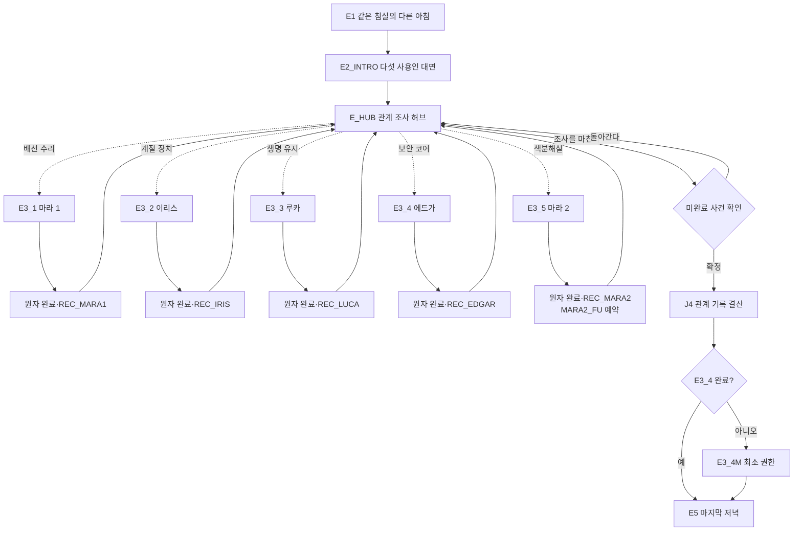
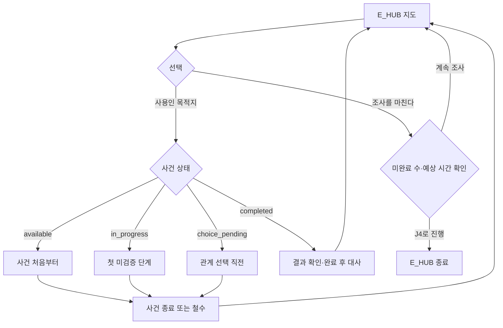

# GGB v0.4 이벤트 상세 07: 사용인 핵심 관계

## 1. 문서 목적

본 문서는 D5와 BROKEN_RESET 이후 열리는 다섯 사용인의 핵심 관계 사건을 실제 플레이 단위로 정의한다.

다루는 범위:

- `E2_INTRO` 다섯 사용인 대면.
- `E_HUB` 관계 조사 선택 허브.
- `E3_1` 마라 1 배선·삭제 기록 사건.
- `E3_2` 이리스 계절 센서·전력 전용 사건.
- `E3_3` 루카 생명 유지·냉각 장치 사건.
- `E3_4` 에드가 보안 코어·감금 책임 사건.
- `E3_4M` 에드가 최소 권한 복구.
- `E3_5` 마라 2 원본·손상 사본 관계 구간.
- 관계 선택, 재진입, 중도 이탈, 기록 지급, 감각 연출, 접근성, QA.

다른 문서와의 경계:

| 대상 | 기준 문서 | 본 문서의 처리 |
| --- | --- | --- |
| E3_5 색·문양·파형 퍼즐 | `08_이벤트상세_03_메인퍼즐.md` | 퍼즐 정답은 인용하고 감정 대화·보존 선택만 상세화 |
| E구간 공간 전환 | `10_이벤트상세_05_공간잠금_해금_동선.md` | 정식 `location_id`와 진입·복귀 시점 사용 |
| 짧은 반응 | `11_이벤트상세_06_사용인짧은반응.md` | E3 대사 변형 입력으로만 읽음 |
| J4·E5·F2 결산 | `13_이벤트상세_08_파열_전환_결산.md` | 관계 사건의 출력과 결산 입력만 정의 |
| 상태·저장 구조 | `17_상태변수_이벤트ID_Godot데이터구조.md` | 필요한 상태 계약과 후속 동기화 항목 제시 |

## 2. 핵심 설계 원칙

### 2.1 선택형 콘텐츠

다섯 E3 사건은 모두 선택형이다.

- 완료 수가 0명이어도 J4, E3_4M, E5, E6, F0와 두 엔딩에 진입할 수 있다.
- 연구원 기록은 J4 정보량과 관계 결산을 풍부하게 하지만 메인 진행의 열쇠가 아니다.
- 높은 `bond`나 낮은 `alert`를 요구하는 진입 조건을 만들지 않는다.
- E3_4 미완료 시에만 E3_4M이 운영 권한을 대체한다.

### 2.2 퍼즐과 관계 선택의 분리

각 E3 사건은 두 층으로 구성한다.

1. 기능 장치를 복구하는 포인트 앤 클릭 퍼즐.
2. 복구된 기록을 어떻게 대할지 결정하는 관계 선택.

퍼즐에는 기술적 정답이 있지만 관계 선택에는 정답·실패가 없다. 두 관계 선택 모두 해당 연구원 기록과 E3 완료를 지급한다.

### 2.3 실패 정책

D5 이후에는 정상 RESET이 더 이상 세계를 되돌리지 않는다. 따라서 E3 사건은 아래 정책을 따른다.

| 상황 | 처리 |
| --- | --- |
| 조작 오답 | 해당 장치 단계만 `LOCAL RETRY` |
| 위험 입력 | 안전 차단 후 같은 단계 재시도 |
| 대화 중 이탈 | 마지막 검증 단계 또는 관계 선택 직전에서 재개 |
| 관계 선택 취소 | 선택 확정 전 상태로 복귀 |
| 완료 저장 실패 | 완료 묶음 전체 롤백, 관계 수치 중복 적용 금지 |
| E_HUB로 철수 | 메인 진행과 다른 E3 목적지 유지 |

강제 수면, 강제 실패, 시간 제한, 관계값에 의한 조작 방해는 사용하지 않는다.

### 2.4 정보와 감정의 독립

- `REC_*`는 사건의 사실 기록이다.
- `bond`는 사용인이 주인공을 독립된 사람으로 대하는 정도다.
- `alert`는 경계와 통제 충동이다.
- `outcome_id`는 플레이어가 사건의 기록과 책임을 어떤 방식으로 다뤘는지 보존한다.
- `bond - alert` 같은 단일 호감도로 환산하지 않는다.

## 3. 전체 관계 사건 흐름



### 3.1 권장 플레이 시간

| 사건 | 첫 플레이 | 재진입·후속 |
| --- | --- | --- |
| E2_INTRO | 6~10분 | 핵심 요약 30~45초 |
| E_HUB 1회 선택 | 30~90초 | 즉시 |
| E3_1 | 9~14분 | 1~3분 |
| E3_2 | 10~15분 | 1~3분 |
| E3_3 | 9~14분 | 1~3분 |
| E3_4 | 12~18분 | 1~3분 |
| E3_4M | 1~2분 | 재생 없음 |
| E3_5 | 10~16분 | 2~4분 |

다섯 사건을 모두 진행하면 전환을 포함해 약 55~80분을 목표로 한다.

## 4. 공통 상태와 생명주기

### 4.1 사건 상태

```text
locked
→ available
→ in_progress
→ choice_pending
→ completed

available 또는 in_progress
→ superseded  # J4 확정으로 선택 기회 종료
```

| 상태 | 의미 | E_HUB 표시 |
| --- | --- | --- |
| `locked` | E2_INTRO 전 또는 공간 미생성 | 표시 안 함 |
| `available` | 시작 가능 | `조사 가능` |
| `in_progress` | 검증 단계 일부 완료 | `조사 중 · 이어서` |
| `choice_pending` | 기술 퍼즐 완료, 관계 선택 미확정 | `마지막 대화 남음` |
| `completed` | 기록·관계·완료 묶음 저장 | `완료` |
| `superseded` | J4 확정으로 더 이상 시작 불가 | `조사 종료` |

`superseded`는 완료로 계산하지 않으며 기록과 관계 수치를 지급하지 않는다.

### 4.2 공통 완료 트랜잭션

각 사건의 마지막 선택은 아래 항목을 하나의 트랜잭션으로 저장한다.

```yaml
core_event_completion:
  transaction_id: E3_X_COMPLETION
  event_id: E3_X
  outcome_id: selected_outcome
  set_flags: [E3_X_complete]
  add_records: [REC_OWNER]
  servant_changes:
    core_event_complete: true
    researcher_record_acquired: true
  relationship_changes: {}
  add_knowledge: []
  next_objective: E_HUB
```

불변식:

```text
E3_X_complete
⇔ REC_OWNER acquired
⇔ servants.OWNER.core_event_complete
⇔ servants.OWNER.researcher_record_acquired
⇔ event_history.E3_X.outcome_id is valid
```

부분 저장은 허용하지 않는다. 같은 `transaction_id`로 재시도할 때 관계 변화는 다시 더하지 않는다.

### 4.3 공통 재개 정책

- 퍼즐의 검증된 하위 단계는 `validated_puzzle_steps.E3_X`에 저장한다.
- 아직 확인하지 않은 오브젝트와 대사만 재개한다.
- 관계 선택을 확정하지 않은 경우 E_HUB로 나갔다 돌아올 수 있다.
- 완료 뒤 재진입하면 퍼즐 UI를 열지 않고 결과 오브젝트와 완료 후 대사만 제공한다.
- J4 확정 뒤에는 미완료 E3 체크포인트를 `superseded`로 바꾸되 디버그 이력은 유지한다.

### 4.4 공통 힌트 규칙

| 단계 | 제공 내용 | 정답 노출 |
| --- | --- | --- |
| H1 | 조사해야 할 오브젝트 범주 | 없음 |
| H2 | 비교해야 할 두 정보 | 없음 |
| H3 | 잘못 연결한 구간 | 부분 표시 |
| H4 | 남은 올바른 후보 수 | 강한 보조 |
| H5 | 다음 한 단계 자동 배치 | 한 단계만 |

색상만으로 힌트를 주지 않는다. 문양, 선 패턴, 텍스트 라벨, 음향 자막 중 최소 두 가지를 병행한다.

## 5. E2_INTRO: 파열 후 합의

### 5.1 기본 정보

| 항목 | 내용 |
| --- | --- |
| 이벤트 ID | `E2_INTRO` |
| 위치·시간 | `M1_CENTRAL_HALL`, E1 직후 아침 |
| 선행 조건 | `broken_reset_triggered=true`, E1 완료 |
| 목표 | 다섯 사용인의 기억 유지와 관계 조사 구조 이해 |
| 필수 | 예 |
| 실패 | 없음 |
| 예상 시간 | 6~10분 |
| 출력 | `E2_INTRO_complete`, `relationship_hub_open`, 다섯 목적지 지도 핀 |

### 5.2 노드 흐름

```text
E2_INTRO_ENTRY
→ E2_INTRO_AVATAR_DESYNC
→ E2_INTRO_EDGAR_REPORT
→ E2_INTRO_QUESTION_HUB
→ E2_INTRO_DESTINATIONS
→ E2_INTRO_INDEX_FALLBACK
→ E2_INTRO_COMPLETION
→ E_HUB
```

### 5.3 장면 진행

1. 주인공이 중앙홀에 들어오면 다섯 사용인이 한자리에 있으나 색상 잔상과 몸의 움직임이 반 박자 어긋난다.
2. 에드가는 정상 리셋 복구가 불가능하다고 공식 보고한다.
3. 마라 1은 가벼운 농담을 시도하지만 자기 목소리가 두 번 재생되자 웃음을 멈춘다.
4. 루카는 주인공의 손목 맥박과 냉각 장치 원격 신호를 번갈아 확인한다.
5. 이리스는 웃으며 다치지 않았다고 말하지만 플라스틱 날개 한쪽이 주인공 쪽으로 닫힌다.
6. 마라 2는 고딕 외형을 “너무 오래 쓴 표지”라고 부르고 각자의 기능실이 드러났다고 설명한다.
7. 플레이어는 세 질문을 원하는 순서로 확인한다.
8. 에드가가 각 장치를 조사할지, 바로 기록 결산으로 갈지 주인공이 정하도록 선언한다.

### 5.4 질문 허브

| 질문 | 필수 답변 | 추가 반응 |
| --- | --- | --- |
| “저택은 어떻게 된 거예요?” | 위장 필터가 해제됐고 정상 RESET은 복구되지 않음 | 마라 2가 표층과 시설 레이어를 설명 |
| “제 몸은 괜찮아요?” | 외부 신체는 냉각 장치에 있으며 현재 생존 신호는 유지 | 루카가 기상 안전은 보장할 수 없다고 덧붙임 |
| “왜 모두 기억하고 있어요?” | 사용인 인격 데이터와 잔류 기억은 물리 RESET 대상이 아니었음 | 에드가가 이를 오래 숨겼음을 인정 |

질문 순서는 관계값을 바꾸지 않는다. 플레이어가 질문을 생략해도 E_HUB 지도 설명에서 세 핵심 답변을 한 문장씩 보충한다.

### 5.5 다섯 사용인의 목적지 안내

| 사용인 | 표층 진입 | 기능 공간 | 안내 문구의 정서 |
| --- | --- | --- | --- |
| 마라 1 | `M1_SERVICE_HALL` | `M1_WIRING_ROOM` | “고장 난 척한 삭제 장치” |
| 이리스 | `M1_GREENHOUSE` | `H0_CLIMATE_CONTROL` | “계절보다 오래된 전력 기록” |
| 루카 | `M1_KITCHEN` | `H0_LIFE_SUPPORT` | “주인공의 다른 맥박” |
| 에드가 | `M1_GREAT_CLOCK` | `H0_CLOCK_MACHINE` | “누가 누구의 선택을 잠갔는가” |
| 마라 2 | `M1_COLOR_ROOM_ENTRY` | `H0_COLOR_SEPARATION` → `H0_PERSONALITY_ARCHIVE` | “짧아진 이름과 분산된 원본” |

### 5.6 보라 인덱스 대체

```text
mara2_archive_index_known=true
→ ARCHIVE / MARA2 소유자 확인 인덱스 표시

mara2_archive_index_known=false
→ ARCHIVE / 소유자 미확인 익명 보라 인덱스 제공
```

익명 인덱스 제공은 `mara2_archive_index_known`을 true로 바꾸지 않는다. E3_5를 건너뛰어도 F0-D의 최소 출처 분류 자료로 사용할 수 있다.

### 5.7 완료 상태

```yaml
event_result:
  event_id: E2_INTRO
  completed: true
  set_flags:
    - E2_INTRO_complete
    - relationship_hub_open
  unlock_event_destinations:
    - E3_1
    - E3_2
    - E3_3
    - E3_4
    - E3_5
  relationship_changes: {}
  next_objective: E_HUB
```

## 6. E_HUB: 관계 조사 선택 허브

### 6.1 역할

E_HUB는 자유 탐색형 던전이 아니라 중앙홀에서 목적지를 고르는 결정적 전환 허브다. 사용인 AI의 임의 위치나 랜덤 순찰 때문에 사건 진입이 막히지 않는다.

| 항목 | 내용 |
| --- | --- |
| 위치 | `M1_CENTRAL_HALL` |
| 선행 조건 | `E2_INTRO_complete`, `relationship_hub_open=true` |
| 이용 시간 | E구간 유연 |
| 기능 | E3 선택, 진행 상태 확인, J4 진입 확정 |
| 실패 | 없음 |

### 6.2 허브 화면

각 목적지 핀은 아래 정보만 표시한다.

```text
[사용인 문양] 사용인 이름
공간 이름
상태: 조사 가능 / 조사 중 / 마지막 대화 / 완료
예상 시간
```

연구원 기록의 내용, 관계 보상, 추천 순서는 표시하지 않는다. 색 제거 모드에서는 문양·이름·상태 텍스트만으로 구분한다.

### 6.3 선택 흐름



### 6.4 J4 진입 확인

J4 확정 화면은 아래 문구를 명시한다.

> “남은 사용인 사건은 이후 완료할 수 없습니다. 메인 진행과 엔딩 선택지는 유지됩니다.”

표시 항목:

- 완료 인원과 미완료 인원.
- 남은 예상 플레이 시간.
- 에드가 미완료 시 E3_4M이 대신 실행된다는 설명.
- 기록 수에 따라 J4 정보량이 달라진다는 사실. 구체 보상은 숨긴다.

확정 뒤 미완료 E3는 `superseded`가 되며 E3_4 미완료면 J4 뒤 E3_4M으로 이동한다.

### 6.5 자동 대화 우선순위

```text
1. E구간 필수 전환
2. 선택한 핵심 관계 사건
3. 완료 트랜잭션 결과
4. 미확인 짧은 반응
5. 완료 후 수동 대사
6. 공통 오브젝트 반응
```

한 공간 진입에서 자동 대화는 최대 하나만 재생한다. 대기 중인 짧은 반응은 관계 퍼즐 입력을 끊지 않는다.

## 7. 짧은 반응 선행값과 대사 변형

`11`의 짧은 반응은 기술 정답, 기록 지급, 관계 변화량을 바꾸지 않는다.

| 핵심 사건 | 읽는 상태 | 변형 범위 |
| --- | --- | --- |
| E3_1 | `MARA1_S1`, `MARA1_S2` | 반복 숙련 인정, “얼룩”과 삭제 기록 연결 |
| E3_2 | `IRIS_S1`, `iris_season_image` | 실내 비 인정, 선택 계절의 감각 회상 |
| E3_3 | `LUCA_S1`, `LUCA_S2` | 차 온도와 냉각액 연결, 파열 뒤 생체 질문 축약 |
| E3_4 | `EDGAR_S1`, `EDGAR_S2`, B2 실제 하위 이벤트 이력 | 반복·검은 거울·기록 내실 감시를 기억했다는 인정 |
| E3_5 | `MARA2_S1`, `MARA2_S2`, `mara2_name_attention_seen`, `mara2_archive_index_known` | 이름 필드 반응, 소유자 라벨, 도입 대사 |

평가 순서:

1. 사건 완료와 `outcome_id`.
2. 명시적 영구 선택값.
3. `short_events_seen`.
4. 현재 `bond`·`alert` 어조.
5. 기본 대사.

같은 상태에서는 항상 같은 변형을 출력한다. 랜덤 대사로 핵심 정보량이 달라지지 않는다.

## 8. E3_1 마라 1: 끊긴 배선과 삭제 기록

### 8.1 기본 정보

| 항목 | 내용 |
| --- | --- |
| 이벤트 ID | `E3_1` |
| 위치 | `M1_SERVICE_HALL` → `M1_WIRING_ROOM` |
| 선행 조건 | E2_INTRO 완료, E3_1 미완료, E_HUB 선택 |
| 목표 | 정비 회로로 위장된 삭제 회로를 분리하고 동의 절차 기록 복원 |
| 필수 | 선택 |
| 실패 | LOCAL RETRY, 중도 이탈 가능 |
| 예상 시간 | 9~14분 |
| 출력 | `REC_MARA1`, `E3_1_complete`, `outcome_id` |

### 8.2 핵심 오브젝트

| 오브젝트 | 조사 정보 | 기능 |
| --- | --- | --- |
| 서쪽 정비벽 | 주황 닦임 자국과 반복된 나사 흔적 | E3_1 진입점 |
| 스패너 | 마라 1의 공구, 손잡이 안쪽 승인 번호 | 패널 개방·브리지 해제 |
| 삼중 배선판 | `MAINT`, `CONSENT`, `AUDIT` 세 회로 | 출처 분류 퍼즐 |
| 삭제 브리지 | 정비 신호를 기록 삭제 명령으로 바꿈 | 제거 대상 |
| 열 손상 로그 릴 | 지워진 실패·동의 로그 파편 | 기록 복원 대상 |

### 8.3 노드 흐름

```text
E3_1_ENTRY
→ E3_1_PANEL_INSPECT
→ E3_1_TRACE_SORT
→ E3_1_DELETE_BRIDGE
→ E3_1_LOG_RESTORE
→ E3_1_MARA1_CONFESSION
→ E3_1_RELATIONSHIP_CHOICE
→ E3_1_ORIGINAL_ATTRIBUTION | E3_1_PROTECTED_IDENTIFIERS
→ E3_1_COMPLETION
→ E3_1_RETURN
→ E_HUB
```

### 8.4 단계 1: 삼중 회로 추적

플레이어는 배선의 색이 아니라 세 종류의 단자와 신호 리듬을 대조한다.

| 회로 | 문양·단자 | 신호 | 실제 내용 |
| --- | --- | --- | --- |
| `MAINT` | 대각 나사선 | 일정한 솔 마찰음 | 설비 정비 이력 |
| `CONSENT` | 손바닥형 승인각 | 두 번 확인음 | 연구원 동의 범위 |
| `AUDIT` | 끊긴 사각 테두리 | 한 번 늦은 경고음 | 실패·책임 감사 기록 |

배선판에는 `CONSENT`와 `AUDIT`가 `MAINT` 출력으로 합쳐지는 가짜 브리지가 있다. 플레이어는 세 출처를 먼저 식별한 뒤 스패너로 브리지를 해제한다.

오답:

- 출처가 다른 선을 묶으면 해당 단자만 안전 차단된다.
- 스패너를 먼저 사용하면 마라 1이 “그거부터 풀면 다 같이 날아감다”라고 멈춘다.
- 오답 횟수는 관계값을 바꾸지 않는다.

### 8.5 단계 2: 삭제 로그 복원

삭제 브리지를 제거하면 세 로그 파편이 나타난다.

1. 실험 실패 발생 시각.
2. 연구원 전환 동의서의 누락 문장.
3. 아버지의 “운영 안정성을 위해 정리” 명령.

플레이어는 날짜, 승인 번호, 대각 닦임 방향을 대조해 원래 순서로 배치한다. 정답 뒤에도 일부 이름은 열 손상으로 읽히지 않으며 추측 입력을 요구하지 않는다.

### 8.6 마라 1 고백

장면 순서:

1. 마라 1은 복원 초반까지 “청소가 좀 과했슴다”라고 농담한다.
2. 동의서 누락 문장이 나타나면 여우 귀와 꼬리 움직임이 동시에 멈춘다.
3. 자신이 아버지의 명령으로 실패 로그와 동의 모순을 삭제했다고 인정한다.
4. 명령을 의심했지만 시설을 살리는 정비라고 믿고 싶었다고 말한다.
5. 주인공에게 용서를 요구하지 않고 복원 결과를 어떻게 보존할지 묻는다.

`MARA1_S2`를 확인했다면 “닦지 말아야 할 얼룩”이라는 표현을 주인공이 먼저 사용할 수 있다. 정보와 관계 결과는 동일하다.

### 8.7 관계 선택

| 선택 | `outcome_id` | 보존 내용 | 관계 변화 |
| --- | --- | --- | --- |
| 책임자와 원문을 그대로 남긴다 | `original_attribution` | 명령자·수행자·피해 기록을 모두 보존 | bond +2, alert +1 |
| 피해자 식별 정보만 보호한다 | `protected_identifiers` | 사건 원문과 명령자·수행자 책임은 보존, 피실험자 개인정보만 익명화 | bond +1, alert -1 |

두 선택 모두 “사건을 지우지 않는다”는 원칙을 지킨다. 익명화 선택은 아버지와 마라 1의 책임을 숨기지 않는다.

선택 문구는 `좋은 선택/나쁜 선택` 아이콘이나 색을 사용하지 않는다.

### 8.8 기록 출력

`REC_MARA1` 필수 내용:

- 마라 1이 일부 실패 로그와 동의 절차 모순을 삭제했다.
- 연구원들은 미래의 새 육체를 약속받았으나 육체 포기·통 속의 뇌 전환을 고지받지 못했다.
- 아버지는 삭제를 “운영 안정화”로 표현했다.
- 마라 1의 현재 청소 강박은 기록 삭제 업무가 사용인 역할로 굳어진 결과다.

### 8.9 감각 연출

- 패널을 열면 탄 피복 냄새와 먼지가 아니라 마른 종이 냄새가 난다.
- 로그가 복원될수록 솔 소리는 줄고 사람의 호흡이 가까워진다.
- 마라 1의 주황 잔상은 빠르게 흔들리다가 고백 시 대각선 하나로 고정된다.
- 코미디 표정은 고백 이후 사용하지 않는다.

### 8.10 힌트와 접근성

| 힌트 | 내용 |
| --- | --- |
| H1 | 세 단자의 문양을 수첩에 나란히 표시 |
| H2 | 정비음과 승인 확인음이 다른 회로임을 강조 |
| H3 | 삭제 브리지 양끝의 잘못된 출처 표시 |
| H4 | 로그 날짜 중 가장 이른 항목 고정 |
| H5 | 다음 로그 파편 한 개 자동 배치 |

색 제거 모드에서는 주황색 대신 대각 나사선, `MAINT` 라벨, 솔 소리 자막을 사용한다. 음량 0에서는 파형과 `[마른 솔이 두 번 긁힘]` 자막을 제공한다.

### 8.11 상태 계약

```yaml
event_definition:
  event_id: E3_1
  owner_id: MARA1
  location_ids: [M1_SERVICE_HALL, M1_WIRING_ROOM]
  required: false
  fail_policy: local_retry
  validated_steps:
    - mara1_trace_sources_identified
    - mara1_delete_bridge_removed
    - mara1_log_order_restored
  outcomes:
    original_attribution:
      relationship: {bond: 2, alert: 1}
    protected_identifiers:
      relationship: {bond: 1, alert: -1}
  completion:
    atomic_group_id: E3_1_COMPLETION
    set_flags: [E3_1_complete]
    add_records: [REC_MARA1]
    set_core_event_complete: true
  next_objective: E_HUB
```

## 9. E3_2 이리스: 계절 센서와 빼앗긴 전력

### 9.1 기본 정보

| 항목 | 내용 |
| --- | --- |
| 이벤트 ID | `E3_2` |
| 위치 | `M1_GREENHOUSE` → `H0_CLIMATE_CONTROL` |
| 선행 조건 | E2_INTRO 완료, E3_2 미완료, E_HUB 선택 |
| 목표 | 투사 계절과 외부 센서를 분리하고 이리스 권한으로 실행된 전력 전용 기록 확인 |
| 필수 | 선택 |
| 실패 | LOCAL RETRY, 중도 이탈 가능 |
| 예상 시간 | 10~15분 |
| 출력 | `REC_IRIS`, `E3_2_complete`, `outcome_id` |

### 9.2 노드 흐름

```text
E3_2_ENTRY
→ E3_2_SENSOR_BASELINE
→ E3_2_PROJECTION_SPLIT
→ E3_2_POWER_TRACE
→ E3_2_AUTH_AUDIT
→ E3_2_IRIS_CONFRONTATION
→ E3_2_RELATIONSHIP_CHOICE
→ E3_2_EXTERNAL_TRUTH | E3_2_SHELTER_PROJECTION
→ E3_2_PRIVATE_CONFESSION
→ E3_2_COMPLETION
→ E3_2_RETURN
→ E_HUB
```

### 9.3 단계 1: 투사 계절과 외부값 분리

기후 제어판에는 세 입력이 겹쳐 있다.

| 입력 | 표시 방식 | 의미 |
| --- | --- | --- |
| `PROJECTION` | 꽃잎 문양, 매끄러운 주기 | 시뮬레이션의 이상적 계절 |
| `EXTERNAL SENSOR` | 유리 진동, 불규칙 파형 | 실제 외부 측정값의 일부 |
| `MEMORY MODEL` | 후광 문양, 오래된 날짜 | 이리스가 기억하는 과거 계절 |

플레이어는 온도·습도·광량 계기마다 세 출처를 분리한다. 외부 센서는 일부가 결손되어 있으므로 특정 계절을 정답으로 맞히는 퍼즐이 아니다. 출처 라벨을 올바르게 분리하는 것이 기술 정답이다.

`iris_season_image`가 저장되어 있으면 MEMORY MODEL의 감각 문구가 해당 계절로 변한다. 값이 `unset`이어도 모든 퍼즐을 해결할 수 있다.

### 9.4 단계 2: 비상 전력 추적

출처를 분리하면 과거 전력망이 드러난다.

```text
비상 발전기
├─ 외부 생태 샘플 보관고
├─ 환경 복구 온실
└─ 주인공 냉각 장치
```

세 설비를 모두 유지할 전력이 부족했던 시점에서 냉각 장치로 전력이 전용됐다. 플레이어는 전력량 숫자를 계산하는 대신 승인 시각, 차단 순서, 권한 서명을 연결한다.

정답 순서:

1. 이리스가 양쪽 시설을 동시에 살릴 수 없다는 경고를 제출했다.
2. 아버지가 이리스의 관리자 자격으로 냉각 장치 우선 명령을 실행했다.
3. 생태 샘플 보관고와 복구 온실 일부가 정지했다.
4. 자동 감사가 이리스를 최종 승인 책임자로 기록했다.
5. 이리스가 정정하기 전에 인격 전환이 시행됐다.

### 9.5 오답과 안전 처리

| 오답 | 피드백 |
| --- | --- |
| 투사값을 외부값으로 연결 | 유리 진동이 사라지고 계절 문양만 반복 |
| MEMORY MODEL을 외부값으로 연결 | 날짜가 현재 시각보다 과거로 고정 |
| 전력 차단 순서 오류 | 손실된 설비가 다시 켜졌다 즉시 꺼지는 모순 로그 |
| 이리스의 경고를 승인으로 배치 | 경고 문장과 승인 해시가 일치하지 않음 |

오답은 이리스의 살의나 관계 수치를 강화하지 않는다. 이리스는 부드럽게 정정하지만 높은 `alert`에서는 “그렇게 믿는 편이 편하겠지요”라고 방어적으로 말한다.

### 9.6 이리스 대면

장면의 핵심은 이리스가 부당하게 희생됐다는 사실과 주인공에게 느낀 적의가 동시에 참이라는 점이다.

1. 이리스는 자신의 권한이 도용됐고 책임이 자신에게 남았다고 설명한다.
2. 잃어버린 생태 샘플과 복구 가능성을 누구도 되돌릴 수 없다고 말한다.
3. 주인공이 없었다면 자원이 남았을 것이라는 생각을 오래 붙들었다고 인정하거나 숨긴다.
4. 주인공을 실제로 아끼는 감정도 거짓이 아니라고 덧붙인다.
5. 자신의 분노가 해결책이 아니라 고통의 대상을 찾는 투사였음을 관계 상태에 따라 인정한다.

금지:

- 이리스가 직접 위해를 시도하는 연출.
- 갑작스러운 즉사·강제 게임오버.
- 살의를 로맨틱한 집착이나 코미디로 표현.
- 다른 사용인이 즉시 이리스를 용서하거나 대신 해명.

### 9.7 관계 선택

| 선택 | `outcome_id` | 장치 처리 | 관계 변화 |
| --- | --- | --- | --- |
| 불완전한 외부값과 책임 로그를 그대로 남긴다 | `external_truth` | 외부 센서 결손과 승인 도용 기록을 유지 | bond +2 |
| 외부값은 보존하고 현재 온실 연출은 유지한다 | `shelter_projection` | 진실 기록은 보존하되 표층의 익숙한 계절을 유지 | alert +1 |

두 선택 모두 감사 기록과 `REC_IRIS`를 보존한다. 두 번째 선택은 진실 삭제가 아니라 현재 피난처의 감각 연출을 유지하는 선택이다.

### 9.8 비공개 고백 변형

E3_2 안의 대면은 주인공과 이리스만 있는 비공개 장면이다. 선택 결과를 포함한 예상 관계값으로 아래 순서를 평가한다.

| 조건 | 비공개 장면 |
| --- | --- |
| 예상 bond 4 이상 | `direct_private`: 주인공이 죽기를 바랐다고 직접 고백 |
| 예상 bond 2~3 | `indirect`: 주인공이 사라지면 끝날 것이라 생각했다고 우회 인정 |
| 예상 bond 0~1, alert 4 이상 | `denied`: 로그의 의미를 부정하고 책임 이야기만 남김 |
| 그 외 | `withheld`: 권한 도용과 분노는 인정하지만 살의는 말하지 않음 |

높은 bond와 높은 alert가 동시에 존재하면 고백 단계는 bond를 우선하고 어조만 날카롭게 바꾼다.

전역 `iris_confession_state`는 별도로 저장하지 않는다. E3_2 완료 뒤 F2와 두 엔딩에서 현재 상태를 다시 계산한다.

```text
all_servants_complete → public
E3_2 미완료 → inferred_only
IRIS bond >= 4 → direct_private
IRIS bond >= 2 → indirect
IRIS alert >= 4 → denied
그 외 → withheld
```

`public`은 다른 연구원 앞에서 인정하는 F2·엔딩용 상태다. E3_2의 비공개 장면에서는 직접 고백 수준으로 처리하고 공개 장면은 F2까지 보류한다.

### 9.9 기록 출력

`REC_IRIS` 필수 내용:

- 이리스는 외부 생태 복구 예측과 환경 시설 담당이었다.
- 외부 생태 샘플 보관고와 주인공 냉각 장치가 같은 비상 전력망을 사용했다.
- 이리스는 냉각 우선 전용에 동의하지 않았다.
- 아버지가 이리스의 권한으로 전용을 실행했고 자동 감사는 이리스를 승인 책임자로 남겼다.
- 외부 환경이 안전하다는 확정 보고는 존재하지 않는다.
- 이리스가 주인공에게 느낀 적의는 자원 손실과 책임 전가에서 시작됐지만 실제 해결책은 아니었다.

### 9.10 감각 연출

- 따뜻한 빛 아래 공기는 차갑고 흙은 젖은 냄새만 날 뿐 실제로 젖지 않는다.
- 이리스가 웃을 때 플라스틱 날개 관절은 닫히는 방향으로 움직인다.
- 살의를 숨기는 변형에서는 얼굴은 웃지만 유리 반사 속 눈만 주인공을 따라간다.
- 직접 고백에서는 후광 투사가 꺼지고 백금발 외곽의 회색선만 남는다.
- 음향은 유리음 뒤 바람이 아니라, 고백 순간 바람 뒤 유리음으로 순서가 뒤집힌다.

### 9.11 힌트와 접근성

| 힌트 | 내용 |
| --- | --- |
| H1 | 세 입력의 날짜 형식 비교 |
| H2 | 유리 진동이 있는 채널만 외부 센서임을 표시 |
| H3 | 이리스 경고와 승인 명령의 해시 불일치 강조 |
| H4 | 전력 차단 순서 중 첫 항목 고정 |
| H5 | 남은 승인 로그 한 개 자동 연결 |

색 제거 모드에서는 꽃잎·유리 진동·후광 문양과 `PROJECTION/EXTERNAL/MEMORY` 라벨을 사용한다. 음량 0에서는 유리음과 바람의 순서를 자막과 화살표로 표시한다.

### 9.12 상태 계약

```yaml
event_definition:
  event_id: E3_2
  owner_id: IRIS
  location_ids: [M1_GREENHOUSE, H0_CLIMATE_CONTROL]
  required: false
  fail_policy: local_retry
  validated_steps:
    - iris_sensor_sources_separated
    - iris_power_route_restored
    - iris_authorization_mismatch_verified
  outcomes:
    external_truth:
      relationship: {bond: 2, alert: 0}
    shelter_projection:
      relationship: {bond: 0, alert: 1}
  completion:
    atomic_group_id: E3_2_COMPLETION
    set_flags: [E3_2_complete]
    add_records: [REC_IRIS]
    add_knowledge: [iris_power_diversion_known]
    set_core_event_complete: true
  next_objective: E_HUB
```

## 10. E3_3 루카: 생명 유지 장치와 유예된 기상

### 10.1 기본 정보

| 항목 | 내용 |
| --- | --- |
| 이벤트 ID | `E3_3` |
| 위치 | `M1_KITCHEN` → `H0_LIFE_SUPPORT` |
| 선행 조건 | E2_INTRO 완료, E3_3 미완료, E_HUB 선택 |
| 목표 | 생명 유지 배관을 안정화하고 냉각 장치의 기상 기준 부재 확인 |
| 필수 | 선택 |
| 실패 | LOCAL RETRY, 중도 이탈 가능 |
| 예상 시간 | 9~14분 |
| 출력 | `REC_LUCA`, `E3_3_complete`, `outcome_id` |

### 10.2 노드 흐름

```text
E3_3_ENTRY
→ E3_3_BIO_SOURCE_MATCH
→ E3_3_PRESSURE_PHASE
→ E3_3_SAFETY_VALVE
→ E3_3_WAKE_LOG
→ E3_3_LUCA_CONFESSION
→ E3_3_RELATIONSHIP_CHOICE
→ E3_3_FULL_DISCLOSURE | E3_3_STABILIZE_FIRST
→ E3_3_COMPLETION
→ E3_3_RETURN
→ E_HUB
```

### 10.3 단계 1: 생체 신호 출처 확인

배관에는 주인공의 현재 아바타 신호와 외부 냉각 신체 신호가 겹쳐 있다.

| 신호 | 비색상 식별 | 의미 |
| --- | --- | --- |
| 검정 주관 | 굵은 이중 맥박 | 냉각 장치의 생명 유지 순환 |
| 연두 보조관 | 점선 한 번 응답 | 센서 보정·약물 공급 |
| 고딕 장식관 | 장식 매듭, 맥박 없음 | 시뮬레이션 표층 위장 |

플레이어는 맥박이 있는 두 관만 진단 패널에 연결한다. 루카의 쥐 귀와 수염형 센서는 올바른 신호 방향으로 움직이지만 정답 포인터처럼 고정되지 않는다.

### 10.4 단계 2: 압력 위상 정렬

정렬 규칙:

```text
주관 맥박 1
→ 주관 맥박 2
→ 보조관 응답 1
→ 안전 밸브 확인
```

플레이어는 네 밸브의 위상을 파형 슬롯에 배치한다. 빠른 조작을 요구하지 않으며 슬롯을 놓을 때마다 전체 주기를 미리 재생할 수 있다.

오답 시:

- 안전 밸브가 열려 압력을 0으로 되돌린다.
- 생명 수치는 악화되지 않는다.
- 루카는 당황하지만 즉시 작업 지시 말투로 전환한다.
- 같은 단계에서 재시도한다.

### 10.5 단계 3: 기상 기준 로그

압력이 안정되면 세 문서가 열린다.

1. 독성 대기와 방사선 수치가 낮아질 때까지 냉각 유지.
2. 외부 환경 안전 판정은 환경 담당과 운영 책임자의 공동 승인 필요.
3. 아버지 사후 공동 승인 기준과 최종 해제 날짜가 공란.

사용인들은 공란을 근거로 시뮬레이션을 계속 연장했다. 루카는 신체를 살려 둔 것과 주인공의 결정을 무기한 미룬 것이 같은 일이 아니었다고 인정한다.

### 10.6 루카 고백

1. 루카는 냉각 보존 자체에는 동의했고 주인공을 살릴 수 있다고 믿었다.
2. 장기 시뮬레이션 접속과 무기한 연장은 예상하지 못했다.
3. 외부 신체는 살아 있지만 기상 뒤 안전을 보장할 수 없다고 말한다.
4. 위험을 말하면 주인공이 떠날까 두려워 수치를 완곡하게 설명해 왔다고 인정한다.
5. 이번에는 먼저 안정화할지, 모든 위험을 바로 읽을지 주인공에게 묻는다.

`LUCA_S2`를 확인했다면 생체 상태를 다시 묻는 도입을 생략하고 “아까 차갑다고 한 건 손이 아니라 바깥쪽 신호였어요”라는 문장으로 시작한다.

### 10.7 관계 선택

| 선택 | `outcome_id` | 진행 | 관계 변화 |
| --- | --- | --- | --- |
| 위험 수치를 먼저 전부 읽는다 | `full_disclosure` | 방사선·대기·신경 위험 범주를 즉시 공개 | bond +2, alert +1 |
| 장치를 안정시킨 뒤 기록을 함께 읽는다 | `stabilize_first` | 안정 확인 후 같은 위험 기록을 공개 | bond +1, alert -1 |

두 선택 모두 동일한 사실과 `REC_LUCA`를 제공한다. 차이는 공개 순서와 루카가 통제감을 얼마나 내려놓는지다.

### 10.8 기록 출력

`REC_LUCA` 필수 내용:

- 주인공의 신체는 외부 냉각 장치에 보존되어 있다.
- 목적은 멸망기의 독성 대기·방사선 위험이 낮아질 때까지 생존시키는 것이었다.
- 루카는 냉각 보존에는 동의했지만 장기 시뮬레이션 감금은 예상하지 못했다.
- 아버지 사후 기상 기준과 최종 해제 날짜가 확정되지 않았다.
- 사용인들은 안전을 이유로 각성 결정을 반복해서 유예했다.
- 현재 신체 생존 신호는 유지되지만 현실의 안전은 보장할 수 없다.

### 10.9 감각 연출

- 냉각액 냄새보다 먼저 혀끝에 금속 맛이 느껴진다.
- 주인공 손목과 배관이 같은 주기로 뛰다가 한 박자 어긋난다.
- 루카의 땀은 더위가 아니라 압박 질문 직전에 늘어난다.
- 위험 로그가 열리면 루카의 쥐 귀가 생체음 방향이 아니라 주인공 목소리 방향으로 돌아간다.
- 신체 이미지는 직접적인 의료 고어 대신 실루엣과 파형으로 표현한다.

### 10.10 힌트와 접근성

| 힌트 | 내용 |
| --- | --- |
| H1 | 맥박 없는 장식관 제외 |
| H2 | 두 번 맥박 뒤 한 번 응답 규칙 표시 |
| H3 | 잘못된 밸브 슬롯의 시간차 표시 |
| H4 | 주관 두 슬롯 자동 고정 |
| H5 | 보조관 응답 슬롯 자동 배치 |

검정 주관은 배경과 구분하도록 흰 외곽, 굵은 이중선, `BIO MAIN` 라벨을 항상 병행한다. 연두색을 제거해도 점선과 `AUX` 라벨로 구분한다.

### 10.11 상태 계약

```yaml
event_definition:
  event_id: E3_3
  owner_id: LUCA
  location_ids: [M1_KITCHEN, H0_LIFE_SUPPORT]
  required: false
  fail_policy: local_retry
  validated_steps:
    - luca_bio_sources_matched
    - luca_pressure_phase_stable
    - luca_wake_criteria_read
  outcomes:
    full_disclosure:
      relationship: {bond: 2, alert: 1}
    stabilize_first:
      relationship: {bond: 1, alert: -1}
  completion:
    atomic_group_id: E3_3_COMPLETION
    set_flags: [E3_3_complete]
    add_records: [REC_LUCA]
    add_knowledge: [protagonist_body_preserved, wake_criteria_missing]
    set_core_event_complete: true
  next_objective: E_HUB
```

## 11. E3_4 에드가: 보안 코어와 선택 권한

### 11.1 기본 정보

| 항목 | 내용 |
| --- | --- |
| 이벤트 ID | `E3_4` |
| 담당 사용인 | 에드가 |
| 위치 | `M1_GREAT_CLOCK` → `H0_CLOCK_MACHINE` |
| 선행 조건 | `E2_INTRO` 완료, `BROKEN_RESET`, `E3_4` 미완료 |
| 권장 시간 | 12~18분 |
| 필수 여부 | 선택. 단, J4 확정 전 마지막 수행 기회를 명시 |
| 기술 목표 | 보호·감시·기억·선택 기능의 현재 권한 소유자를 복구 |
| 관계 목표 | 에드가가 아버지의 명령과 자신의 감금 결정을 분리해 책임지게 함 |
| 실패 정책 | LOCAL RETRY, 오배치만 되돌림 |
| 완료 출력 | `REC_EDGAR`, `E3_4_complete`, `subject_role_identified` |

### 11.2 사건 노드

```text
E3_4_ENTRY
→ E3_4_LOCK_AUDIT
→ E3_4_OWNER_MATCH
→ E3_4_AUTHORITY_LAYOUT
→ E3_4_EDGAR_CONFESSION
→ E3_4_RELATIONSHIP_CHOICE
→ E3_4_RESPONSIBILITY_RECORDED | E3_4_AUTHORITY_RETURNED
→ E3_4_COMPLETION
→ E3_4_RETURN
→ E_HUB
```

| 노드 | 위치 | 플레이어 행위 | 검증·출력 |
| --- | --- | --- | --- |
| `E3_4_ENTRY` | `M1_GREAT_CLOCK` | 대시계 뒤 드러난 수직 잠금선을 조사 | 보안 기계실 진입 |
| `E3_4_LOCK_AUDIT` | `H0_CLOCK_MACHINE` | 네 권한의 변경 이력을 시간순으로 배열 | `edgar_lock_audit_read` |
| `E3_4_OWNER_MATCH` | 동일 | 기능 카드와 소유자 토큰 대응 | `edgar_authority_owners_matched` |
| `E3_4_AUTHORITY_LAYOUT` | 동일 | 현재 권한 배치를 확정 | `edgar_authority_layout_validated` |
| `E3_4_EDGAR_CONFESSION` | 동일 | 에드가의 운영 결정과 아버지의 명령을 대조 | 관계 선택 개방 |
| `E3_4_RELATIONSHIP_CHOICE` | 동일 | 책임 기록 또는 권한 직접 반환 요구 | `outcome_id` 선택 |
| `E3_4_COMPLETION` | 동일 | 기록·관계·완료 상태를 원자적으로 커밋 | `REC_EDGAR` 획득 |
| `E3_4_RETURN` | 대시계 방향 | 복귀 대화 | `E_HUB` |

### 11.3 권한 배치 퍼즐

#### 기능과 정답

| 기능 | 현재 소유자 | 근거 단서 |
| --- | --- | --- |
| 보호 `PROTECTION` | `SYSTEM` | 안전 모듈은 생체를 보호하지만 최종 결정을 내리지 못함 |
| 감시 `SURVEILLANCE` | `CUSTODIAN` | 관리자는 관찰·보고·접근 제한을 수행함 |
| 기억 `MEMORY` | `RESIDENT` | 기억의 원 소유권은 거주 인격에게 귀속됨 |
| 선택 `CHOICE` | `SUBJECT` | 기상·잔류를 포함한 최종 선택은 대상자 본인에게 귀속됨 |

퍼즐 화면은 네 기능을 색으로 구분하지 않는다. 기능명, 잠금선 모양, 촉각 진동 패턴, 음향 자막을 병행한다. 에드가의 남색 서명은 `CUSTODIAN`의 출처를 식별할 뿐 정답을 대신 알려주지 않는다.

#### 조작과 피드백

1. 플레이어는 권한 변경 로그 네 장을 시간순으로 정렬한다.
2. 각 기능 카드 아래에 `SYSTEM`, `CUSTODIAN`, `RESIDENT`, `SUBJECT` 토큰을 하나씩 놓는다.
3. `배치 검증`을 누르면 맞은 기능 수가 아니라 모순의 종류를 알려 준다.
4. 오답은 해당 카드만 튕겨 나오며 장치가 잠기지 않는다.
5. 네 배치가 모두 맞으면 선택 권한선이 에드가의 남색 회로에서 빠져나와 종이와 연필 질감의 `SUBJECT` 단자로 연결된다.

| 오답 유형 | 피드백 |
| --- | --- |
| `SYSTEM=CHOICE` | "보호 명령은 종료 여부를 결정할 수 없다." |
| `CUSTODIAN=CHOICE` | "관리 권한과 당사자 동의가 충돌한다." |
| `SUBJECT=SURVEILLANCE` | "관찰자와 관찰 대상이 뒤바뀌었다." |
| `CUSTODIAN=MEMORY` | "보관자가 원 소유자로 등록되어 있다." |

### 11.4 기록 대조와 에드가의 책임

퍼즐 성공 뒤 네 기록이 순서대로 열린다.

1. 에드가는 연구 윤리·운영 책임자로서 연구원들의 전환 동의서를 취합했다.
2. 아버지는 미래의 새 신체와 각성 가능성을 약속했지만, 통속의 뇌와 시뮬레이션 수용 방식을 완전하게 밝히지 않았다.
3. 에드가는 절차 위반을 발견하고도 연구 중단보다 인류 인격 보존을 우선했다.
4. 아버지 사망 뒤 최종 창조자 권한은 회수되지 않았고, 사용인들은 불완전한 관리자 권한만 공유하게 되었다.
5. 주인공을 깨울 수 있는 최소 조건이 확인되었을 때도 에드가는 외부 환경의 위험을 이유로 수면 연장을 결정했다.
6. 다른 사용인들의 분노가 주인공 강제 기동으로 이어질 때, 에드가는 반대했지만 시스템을 정지시키거나 주인공의 선택 권한을 돌려주지 않았다.

핵심은 에드가를 단순한 아버지의 피해자 또는 충실한 부하로 면책하지 않는 것이다. 그는 제한된 조건 안에서도 결정을 내렸고, 그 결정으로 주인공의 시간이 빼앗겼다.

### 11.5 대면 연출

1. 에드가는 레이피어 끝으로 네 권한선의 경계를 짚으며 설명한다.
2. `CHOICE=CUSTODIAN`이었던 과거 배치가 드러나면 꼬리 끝이 한 번 바닥을 친다.
3. 주인공이 "아버지가 시켰습니까?"라고 묻자 에드가는 즉시 대답하지 못한다.
4. 낮은 시계음이 멎은 뒤 에드가는 "처음에는 명령이었습니다. 그 이후는 제 판단입니다."라고 답한다.
5. 주인공은 두려움 때문에 한 발 물러나지만, 권한 패널에서 손을 떼지 않는다.

관계 단계별 고백 밀도:

| 진입 시 관계 | 고백 방식 |
| --- | --- |
| bond 0~1 | 사실만 보고하고 감정 표현을 통제함 |
| bond 2~3 | 주인공의 잃어버린 시간도 자신의 책임이라고 인정함 |
| bond 4~5 | "보호한다는 말로 선택을 빼앗았습니다"라고 직접 사과함 |
| alert 4~5 | 사과 뒤에도 주인공의 다음 행동을 확인하려는 통제 습관이 드러남 |

### 11.6 관계 선택

기술 퍼즐의 정답은 어느 관계 선택에서도 `CHOICE=SUBJECT`로 확정된다. 아래 선택은 권한을 돌려줄지 여부가 아니라, 에드가의 책임을 어떤 방식으로 남길지를 정한다.

| 표시 문구 | `outcome_id` | 의미 | 관계 변화 |
| --- | --- | --- | --- |
| "당신이 한 결정도 공식 기록에 남겨요." | `responsibility_recorded` | 공동체가 책임의 출처를 잊지 못하게 함 | bond +1, alert -1 |
| "기록보다 먼저, 내 권한을 내게 직접 돌려줘요." | `authority_returned` | 에드가에게 주인공 앞에서 통제권을 포기하게 함 | bond +2, alert +1 |

- `responsibility_recorded`: 에드가는 자신의 운영 서명을 감사 기록에 추가한다. 통제할 수 있는 절차가 생겨 alert가 낮아진다.
- `authority_returned`: 에드가는 레이피어를 패널 앞에 내려놓고 `SUBJECT` 단자를 주인공에게 넘긴다. 신뢰는 커지지만 통제권을 즉시 놓는 행위가 불안을 자극한다.
- 두 결과 모두 동일한 진실, `REC_EDGAR`, `E3_4_complete`를 제공한다.
- UI는 어느 쪽에도 용서·처벌·정답 색을 부여하지 않는다.

### 11.7 기록 출력

`REC_EDGAR` 필수 내용:

- 에드가는 연구 윤리·운영 책임자였다.
- 연구원 전환 동의는 불완전한 정보 위에서 취합되었다.
- 아버지는 창조자 최종 권한과 기상 해제 절차를 완수하지 못했다.
- 아버지 사망 뒤 에드가는 외부 위험을 이유로 주인공의 수면 연장을 선택했다.
- 강제 시뮬레이션 기동을 막지 못했고, 이후에도 주인공의 선택 권한을 반환하지 않았다.
- 보호·감시·기억·선택 권한은 서로 다른 주체에게 귀속되어야 한다.
- 현재 `CHOICE` 권한은 `SUBJECT`, 즉 주인공에게 돌아갔다.

### 11.8 힌트와 접근성

| 단계 | 힌트 |
| --- | --- |
| H1 | 기능 카드의 동사만 비교: 보호한다, 본다, 기억한다, 결정한다 |
| H2 | 관리자는 감시할 수 있지만 당사자를 대신할 수 없다고 명시 |
| H3 | 기억의 주인을 `RESIDENT`로 고정 |
| H4 | `CHOICE=SUBJECT`를 고정하고 남은 토큰 자동 후보 축소 |
| H5 | 세 기능을 자동 배치하고 마지막 선택만 직접 확정 |

- 시간 제한이 없다.
- 레이피어 반사광과 남색 선을 줄이는 광과민 옵션을 적용한다.
- 낮은 시계음은 자막 `[대시계 저음: 네 번, 정지]`로 병기한다.
- 관계 선택 화면은 기본 포커스를 `기록을 다시 읽는다`에 둔다.

### 11.9 상태 계약

```yaml
event_definition:
  event_id: E3_4
  owner_id: EDGAR
  location_ids: [M1_GREAT_CLOCK, H0_CLOCK_MACHINE]
  required: false
  fail_policy: local_retry
  validated_steps:
    - edgar_lock_audit_read
    - edgar_authority_owners_matched
    - edgar_authority_layout_validated
  technical_result:
    protection: SYSTEM
    surveillance: CUSTODIAN
    memory: RESIDENT
    choice: SUBJECT
  outcomes:
    responsibility_recorded:
      relationship: {bond: 1, alert: -1}
    authority_returned:
      relationship: {bond: 2, alert: 1}
  completion:
    atomic_group_id: E3_4_COMPLETION
    set_flags: [E3_4_complete]
    add_records: [REC_EDGAR]
    add_knowledge: [subject_role_identified, edgar_detention_decision_known]
    set_core_event_complete: true
  next_objective: E_HUB
```

## 12. E3_4M 에드가 최소 권한 복구

### 12.1 역할과 발생 시점

`E3_4M`은 에드가의 핵심 관계 사건을 축약한 버전이 아니다. 플레이어가 `E3_4`를 선택하지 않아도 코어 경로를 이용할 수 있게 하는 반필수 운영 절차다.

| 항목 | 내용 |
| --- | --- |
| 이벤트 ID | `E3_4M` |
| 발생 | J4 확정 직후 `E3_4_complete=false`일 때 자동 |
| 위치 | `H0_CLOCK_MACHINE` 입구 |
| 시간 | 1~2분 |
| 목적 | E6에 필요한 최소 접근 핀 복구 |
| 관계 변화 | 없음 |
| 연구원 기록 | 없음 |
| 핵심 관계 완료 | 아님 |

### 12.2 J4와의 경계 규칙

1. `E_HUB`에서 J4를 확정하려 할 때 미완료한 사용인 목록과 예상 소요 시간을 보여 준다.
2. `E3_4` 미완료라면 "에드가의 전체 기록은 이 시점 이후 복원할 수 없으며 최소 접근 절차로 대체됩니다"를 별도 표시한다.
3. 플레이어가 결산을 취소하면 `E3_4`를 포함한 남은 사건으로 돌아갈 수 있다.
4. J4 확정을 선택하면 `E3_4` 상태를 `superseded`로 전환하고 `E3_4M`을 자동 실행한다.
5. `superseded` 상태는 실패가 아니며 완료 수, `all_servants_complete`, 기록 수에 포함하지 않는다.

### 12.3 장면 노드

```text
E3_4M_ENTRY
→ E3_4M_CORE_PIN
→ E3_4M_COMMIT
→ E5
```

1. 에드가는 대시계 아래에서 남색 수직 핀 하나를 뽑아 주인공에게 건넨다.
2. "이것으로 코어 접근로까지는 열립니다. 그 이상은 귀하께서 확인해야 합니다."라고 말한다.
3. 주인공이 이유를 묻더라도 에드가는 "지금 설명하면 제 변명이 먼저 남습니다"라고 답하고 전체 고백을 시작하지 않는다.
4. 핀을 꽂으면 `edgar_minimum_access=true`가 된다.
5. 장면은 E5로 바로 이어지며 허브로 복귀하지 않는다.

### 12.4 보존해야 할 차이

| 항목 | E3_4 | E3_4M |
| --- | --- | --- |
| `REC_EDGAR` | 획득 | 미획득 |
| `E3_4_complete` | true | false |
| `servants.EDGAR.core_event_complete` | true | false |
| 관계 변화 | 있음 | 없음 |
| 책임 고백 | 전체 | 보류 |
| 코어 접근 | 보장 | 보장 |
| 결산 완료 수 | +1 | +0 |

### 12.5 상태 계약

```yaml
event_definition:
  event_id: E3_4M
  owner_id: EDGAR
  required: conditional_required
  prerequisites:
    state_at_least:
      journal_stage: 4
    none_flags: [E3_4_complete]
  on_enter:
    set_event_lifecycle:
      E3_4: superseded
  completion:
    atomic_group_id: E3_4M_COMPLETION
    set_flags: [edgar_minimum_access]
    add_records: []
    relationship: {bond: 0, alert: 0}
    set_core_event_complete: false
  next_objective: E5
```

## 13. E3_5 마라 2: 인격 아카이브의 보존 방식

### 13.1 문서 책임 분리

`08_이벤트상세_03_메인퍼즐.md`가 다루는 항목:

- 다섯 출처 분리.
- 보라 기록 중첩.
- 체크섬 결손 확인.
- 오답, 힌트, 접근성, 검증 단계.

이 문서가 다루는 항목:

- 퍼즐 단계마다 마라 2가 보이는 반응.
- 자기 저장 영역 양도 사실의 고백.
- 병합·분리 보존 선택의 감정적 의미.
- 관계 변화와 원자적 완료 계약.
- `MARA2_FU` 연결 조건.

퍼즐 정답과 노드 ID는 `08`을 단일 기준으로 삼으며 이 문서에서 별도 해답을 만들지 않는다.

### 13.2 기본 정보

| 항목 | 내용 |
| --- | --- |
| 이벤트 ID | `E3_5` |
| 담당 사용인 | 마라 2 |
| 위치 | `M1_COLOR_ROOM_ENTRY` → `H0_COLOR_SEPARATION` → `H0_PERSONALITY_ARCHIVE` |
| 선행 조건 | `E2_INTRO`, `broken_reset_triggered=true`, `E3_5` 미완료 |
| 권장 시간 | 10~16분 |
| 필수 여부 | 선택. 미완료 시 익명 보라 인덱스가 메인 진행 보장 |
| 실패 정책 | LOCAL RETRY, 선택 확정 전 이탈 가능 |
| 완료 출력 | `REC_MARA2`, `archive_resolution`, `mara2_self_sacrifice_known` |

### 13.3 퍼즐 노드와 대화 레이어

```text
E3_5_ENTRY
→ E3_5_SOURCE_SPLIT
→ E3_5_PURPLE_OVERLAY
→ E3_5_CHECKSUM_GAPS
→ E3_5_ARCHIVE_TRANSFER
→ E3_5_DISTRIBUTED_BACKUP
→ E3_5_SELF_SACRIFICE_DIALOGUE
→ E3_5_RELATIONSHIP_CHOICE
→ E3_5_MERGED | E3_5_SEPARATED
→ E3_5_COMPLETION
→ E3_5_RETURN
→ E_HUB
```

| 퍼즐 노드 | 마라 2의 표면 반응 | 감정 밑바닥 |
| --- | --- | --- |
| `E3_5_ENTRY` | "천재의 작업실에 온 걸 환영해요! 손대다 망가뜨려도 제 탓은 아니고요!" | 먼저 농담해 조사 주도권을 잡으려 함 |
| `E3_5_SOURCE_SPLIT` | 다른 네 사람의 서명을 빠르게 맞혀 플레이어를 재촉함 | 모두의 신호를 지나치게 정확히 기억함 |
| `E3_5_PURPLE_OVERLAY` | 자신의 보라 채널을 "장식용 잡음"이라 축소함 | 자신의 기록이 중심에 놓이는 것을 두려워함 |
| `E3_5_CHECKSUM_GAPS` | 빈 세 칸을 보고 말끝의 느낌표가 사라짐 | 결손이 우연이 아님을 이미 알고 있음 |
| `E3_5_ARCHIVE_TRANSFER` | 먼저 문을 열고 뒤돌아보지 않음 | 도망치고 싶지만 혼자 남는 것은 더 두려움 |
| `E3_5_DISTRIBUTED_BACKUP` | 다른 네 기록 속 자기 조각을 농담으로 넘김 | 자기 존재가 타인의 부속품으로만 남을까 두려움 |
| `E3_5_SELF_SACRIFICE_DIALOGUE` | 사실을 인정하되 "계산상 최적"이라고 주장함 | 도움을 요청하지 못하고 선택을 합리화함 |

### 13.4 자기 저장 영역 양도 기록

복원되는 사실은 다음 순서를 따른다.

1. 인격 아카이브 용량이 예상보다 빠르게 줄어들었다.
2. 네 연구원 인격의 감정 주석과 장기 기억 체크섬이 먼저 손상되기 시작했다.
3. 마라 2는 관리자에게 알리지 않고 자신의 감정 주석 영역을 네 사람의 보조 저장소로 재할당했다.
4. 그 결과 다른 네 사람은 현재의 성격과 연구원 시절 기억을 더 오래 유지했다.
5. 마라 2는 자기 이름의 원형, 사적인 기억, 도움을 요청하던 방식부터 잃었다.
6. 이름표를 반복해서 확인하는 습관은 장난이 아니라 자기 식별자가 아직 남아 있는지 검사하는 행동이었다.
7. 마라 2는 희생을 미화하지 않는다. "내가 제일 빨리 계산했고, 그래서 내가 제일 먼저 망가졌어요"라고 말한다.

이 사건은 마라 2를 순교자로 만들기 위한 장면이 아니다. 타인을 살린 선택의 존엄과, 누구의 동의도 없이 자기 자신을 소모한 위험성을 동시에 보여 준다.

### 13.5 짧은 반응 선행값

| 선행 반응 | 대화 변형 |
| --- | --- |
| `MARA2_S1` 미확인 | 주인공이 이름 반복 습관을 처음 알아차림 |
| `MARA2_S1` 확인 | 주인공이 전날 이름표 기억을 먼저 언급함 |
| `MARA2_S2` 미확인 | 보라 중첩을 퍼즐 중 발견함 |
| `MARA2_S2` 확인 | "겹친 보라 채널"이라는 마라 2의 표현을 수첩에서 재사용함 |
| bond 0~1 | 마라 2가 결손을 장치 문제로만 설명함 |
| bond 2~3 | 자기 이름이 빠질까 두렵다고 우회적으로 말함 |
| bond 4~5 | "나를 기억해 달라"는 부탁을 처음 직접 함 |
| alert 4~5 | 부탁 직후 농담으로 취소하려 하며 선택 화면을 서두름 |

### 13.6 관계 선택

| 표시 문구 | `outcome_id` | 기술 처리 | 감정 의미 | 관계 변화 |
| --- | --- | --- | --- | --- |
| "감정 주석을 원본에 다시 합친다." | `merged` | 단일 인격 인덱스로 병합 | 잃어버린 조각도 현재의 자신으로 받아들임 | bond +2, alert +1 |
| "원본과 주석을 분리해 서로 참조하게 한다." | `separated` | 두 인덱스를 교차 링크 | 현재의 자신을 보존한 채 과거를 곁에 둠 | bond +1, alert -1 |

- 둘 다 기술적으로 유효하며 `REC_MARA2`와 동일한 사실을 제공한다.
- `merged`는 회복을 약속하지 않는다. 낯선 감정이 한꺼번에 돌아올 위험이 있어 alert가 오른다.
- `separated`는 불완전함을 방치하는 선택이 아니다. 현재 인격의 연속성을 존중하는 보존안이다.
- 선택지는 `되돌린다/포기한다`, `진짜/가짜` 같은 도덕적 편향 문구를 사용하지 않는다.
- 주인공은 마라 2에게 어느 선택이 좋은지 대신 정해 달라고 요구받지 않는다. 설명을 듣고 보존 방식만 결정한다.

### 13.7 선택 결과 장면

#### `merged`

1. 분리되어 있던 보라 이중 윤곽이 천천히 겹친다.
2. 빠른 3음 사이에 다른 네 사람의 소리가 짧게 섞였다가 분리된다.
3. 마라 2는 오래 잊고 있던 호칭 하나를 떠올리지만 완전한 이름은 말하지 못한다.
4. "이제 틀려도 제 기억이 틀린 거네요. 남의 백업 탓은 못 하겠네!"라고 웃는다.
5. 웃음 뒤 짧은 과호흡이 들리고, 주인공이 먼저 아카이브 출력을 낮춘다.

#### `separated`

1. 두 보라 윤곽이 나란히 남고 가는 교차선만 연결된다.
2. 현재 인격이 과거 주석을 필요할 때만 읽도록 접근 규칙이 설정된다.
3. 마라 2는 "둘 다 나라고 우기면 천재가 두 명인 셈이죠!"라고 말한다.
4. 주인공은 이름표 하나를 두 인덱스 사이에 놓는다.
5. 마라 2는 그 배치를 고치지 않고 오래 바라본다.

### 13.8 중도 이탈과 재개

| 이탈 시점 | 저장 | 재진입 위치 |
| --- | --- | --- |
| 출처 분리 전 | 검증된 단계 없음 | 첫 미검증 퍼즐 노드 |
| 일부 채널 분리 뒤 | 검증 단계만 저장 | 첫 미검증 퍼즐 노드 |
| `E3_5_puzzle_solved=true` | 퍼즐 완료 저장, 관계 효과 없음 | `E3_5_SELF_SACRIFICE_DIALOGUE` |
| 관계 선택 화면 | 선택 미확정 | 같은 선택 화면 |
| 선택 확정 뒤 커밋 실패 | 전체 롤백 | 같은 선택 화면, 동일 transaction ID 재시도 |
| 완료 뒤 | 전체 완료 | 재실행 불가, 완료 반응만 제공 |

### 13.9 감각·접근성 연출

- 보라색을 제거해도 이중 액자, 이중 윤곽, `MARA2` 텍스트 라벨, 빠른 3음 자막으로 식별한다.
- 박쥐형 귀와 날개는 긴장 시 미세하게 접히지만 위협적 확대 촬영을 하지 않는다.
- 인격 조각이 합쳐지는 장면은 신체 훼손처럼 묘사하지 않고 액자·문장·음향의 정렬로 표현한다.
- 마라 2의 어린 말투와 외형을 성적 뉘앙스로 사용하지 않는다.
- 광과민 모드에서는 보라 잔광의 점멸을 정적 이중선으로 대체한다.
- 음량이 0이면 `[빠른 3음]`, `[세 번째 음 누락]`, `[다섯 서명 동기화]` 자막을 제공한다.

### 13.10 상태 계약

```yaml
event_definition:
  event_id: E3_5
  owner_id: MARA2
  location_ids:
    - M1_COLOR_ROOM_ENTRY
    - H0_COLOR_SEPARATION
    - H0_PERSONALITY_ARCHIVE
  required: false
  fail_policy: local_retry
  puzzle_contract_source: 08_이벤트상세_03_메인퍼즐.md
  outcomes:
    merged:
      relationship: {bond: 2, alert: 1}
      set: {servants.MARA2.archive_resolution: merged}
    separated:
      relationship: {bond: 1, alert: -1}
      set: {servants.MARA2.archive_resolution: separated}
  completion:
    atomic_group_id: E3_5_COMPLETION
    set_flags: [E3_5_complete]
    add_records: [REC_MARA2]
    add_knowledge: [mara2_self_sacrifice_known]
    add_signatures: [purple_archive]
    set_core_event_complete: true
    enqueue_reactions:
      - event_id: MARA2_FU
        location_id: M1_NORTH_ARCHIVE_HALL
        expires_at_event_id: F0_A
  next_objective: E_HUB
```

## 14. 완료 후 반응과 후속 사건

### 14.1 공통 완료 반응

각 E3 사건 완료 뒤 해당 사용인은 자기 작업 공간에 남아 45~90초 분량의 수동 확인 대화를 제공한다. 이 대화는 사건의 결과를 정서적으로 되짚지만 추가 관계 수치를 주지 않는다.

| 인물 | 결과별 핵심 반응 |
| --- | --- |
| 마라 1 | `original_attribution`: 자기 이름이 남는 것을 견딤 / `protected_identifiers`: 가려진 이름들을 직접 세어 봄 |
| 이리스 | `external_truth`: 온실 창을 외부 방향으로 엶 / `shelter_projection`: 투영 장치의 밝기를 낮추고 멈춤 |
| 루카 | `full_disclosure`: 위험 기록을 숨기지 않고 읽음 / `stabilize_first`: 안정화 완료 시각을 먼저 적음 |
| 에드가 | `responsibility_recorded`: 감사 로그를 재확인 / `authority_returned`: 빈 관리 슬롯을 그대로 둠 |
| 마라 2 | `merged`: 낯선 기억을 짧게 받아 적음 / `separated`: 두 인덱스 사이 링크를 점검 |

공통 완료 반응은 `core_event_complete`를 다시 쓰지 않고, bond·alert를 변경하지 않으며, 연구원 기록을 중복 지급하지 않는다.

### 14.2 명시적 관계 후속 사건

추가 관계 변화가 가능한 후속 사건은 아래 두 개뿐이다. 상세 대사와 큐 규칙은 `11_이벤트상세_06_사용인짧은반응.md`를 기준으로 한다.

| ID | 선행 | 위치 | 역할 | 관계 변화 |
| --- | --- | --- | --- | --- |
| `EDGAR_S3` | E5 완료, E6 직전, 해당 반응 미확인 | `H0_CLOCK_MACHINE` | E3_4·E3_4M 결과에 따른 마지막 점검 | `11`의 명시 결과만 적용 |
| `MARA2_FU` | `E3_5_complete`, F0-A 진입 전 | 북쪽 기록 회랑 | 자기 이름을 기억해 달라는 요청 | `11`의 명시 결과만 적용 |

그 밖의 완료 후 대사는 분위기와 정보 회수용이다. `bond +1 가능` 같은 포괄 규칙을 사용하지 않는다.

### 14.3 MARA2_FU 연결 요약

1. `E3_5_COMPLETION` 성공 시 `MARA2_FU`를 대기열에 넣는다.
2. 북쪽 기록 회랑의 마라 2를 수동 조사하면 시작한다.
3. `merged`면 새로 돌아온 기억과 현재 이름의 차이를 묻는다.
4. `separated`면 두 기록 중 어느 쪽을 불러도 자신이 돌아볼지 묻는다.
5. 주인공은 이름을 적어 주거나, 직접 불러 주거나, 평소처럼 농담으로 확인할 수 있다.
6. 사건을 보지 않고 F0-A에 진입하면 큐가 만료되지만 E3_5 완료 상태는 유지된다.

### 14.4 E5 owner insert 입력 계약

E5는 관계 사건을 다시 실행하지 않고 완료 결과를 읽어 장면 조각을 조립한다.

```yaml
e5_relationship_input:
  complete_count: derive_from_E3_1_to_E3_5_complete
  completed_owner_ids: derive_from_completed_E3_owner_ids
  owner_outcomes: event_history.E3_X.outcome_id
  tier:
    0..1: LOW
    2..3: MID
    4: HIGH
    5: ALL
```

| 입력 | E5 사용 범위 | 금지 |
| --- | --- | --- |
| E3 완료 플래그 | 착석·개인 책임 발언 여부 | 필수 진행 게이트 |
| outcome_id | 대사·소품·행동 순서 | 결산 등급 변경 |
| bond·alert | 어조·몸짓의 강도 | 완료 여부 대체 |
| E3_4M | 에드가 최소 접근 보고 | REC_EDGAR·완료 수 생성 |

- 다섯 사용인은 완료 여부와 관계없이 E5 공간에 존재한다.
- 미완료 인물의 감정과 기록을 완료 인물이 대신 설명하지 않는다.
- owner insert 순서는 `EDGAR → MARA1 → LUCA → IRIS → MARA2`로 고정한다.
- E5 본체는 bond·alert, 핵심 완료, 연구원 기록을 새로 쓰지 않는다.
- E5 완료 뒤 MARA2_FU가 대기 중이면 먼저 수동 확인 기회를 주고, EDGAR_S3는 E6 문 앞에서 확인한다.

## 15. 관계 선택 결과 총괄

### 15.1 결과와 수치

| 이벤트 | `outcome_id` | bond | alert | 관계적 의미 |
| --- | --- | ---: | ---: | --- |
| E3_1 | `original_attribution` | +2 | +1 | 진실과 책임 주체를 원문 그대로 남김 |
| E3_1 | `protected_identifiers` | +1 | -1 | 사실은 남기되 취약한 대상 식별자를 가림 |
| E3_2 | `external_truth` | +2 | 0 | 외부 현실을 즉시 공유함 |
| E3_2 | `shelter_projection` | 0 | +1 | 투영을 당장 끄지 않고 사실을 단계적으로 마주함 |
| E3_3 | `full_disclosure` | +2 | +1 | 위험 수치와 불확실성을 즉시 공개함 |
| E3_3 | `stabilize_first` | +1 | -1 | 장치를 먼저 안정시키고 같은 기록을 공개함 |
| E3_4 | `responsibility_recorded` | +1 | -1 | 에드가의 결정을 감사 기록에 고정함 |
| E3_4 | `authority_returned` | +2 | +1 | 주인공 앞에서 관리 권한을 직접 반환함 |
| E3_5 | `merged` | +2 | +1 | 원본과 감정 주석을 하나의 현재로 통합함 |
| E3_5 | `separated` | +1 | -1 | 현재와 과거를 분리 보존하고 교차 참조함 |

### 15.2 수치 적용 규칙

```text
new_bond  = clamp(old_bond  + delta_bond,  0, 5)
new_alert = clamp(old_alert + delta_alert, 0, 5)
```

1. 관계 변화는 해당 E3의 완료 트랜잭션에서 한 번만 적용한다.
2. 선택 화면 재진입, 저장 재시도, 완료 후 대사로 같은 수치를 재적용하지 않는다.
3. bond와 alert는 선악 수치가 아니다. bond는 정서적 접근 허용치, alert는 주인공 행동에 대한 경계·통제 충동이다.
4. 높은 bond와 높은 alert가 동시에 존재할 수 있다. 가까워졌기 때문에 더 두려워하는 상태를 허용한다.
5. 어떤 수치도 J4, F0, 현실·잔류 엔딩 선택지를 잠그지 않는다.

### 15.3 사건 이력 계약

각 핵심 관계 사건은 공통 이력 구조를 사용한다.

```yaml
event_history_entry:
  event_id: E3_1
  lifecycle: completed
  outcome_id: original_attribution
  completion_transaction_id: E3_1_COMPLETION
  relationship_delta_applied: true
  completed_at_story_phase: BROKEN_RESET
```

허용 `outcome_id`:

```yaml
relationship_outcomes:
  E3_1: [original_attribution, protected_identifiers]
  E3_2: [external_truth, shelter_projection]
  E3_3: [full_disclosure, stabilize_first]
  E3_4: [responsibility_recorded, authority_returned]
  E3_5: [merged, separated]
```

불변식:

```text
E3_X_complete
⇒ event_history.E3_X.lifecycle == completed
⇒ event_history.E3_X.outcome_id is valid
⇒ REC_OWNER acquired
⇒ servants.OWNER.core_event_complete == true
⇒ relationship_delta_applied == true
```

`E3_4M`은 예외다. `event_history.E3_4.lifecycle=superseded`를 남기지만 `E3_4_complete`, `REC_EDGAR`, 관계 변화는 만들지 않는다.

## 16. 심리·감각·대사 연출 규칙

### 16.1 주인공의 감각 반응

주인공은 관계 사건에서 정보를 받기만 하는 빈 화자가 아니다. 각 사건은 아래 감각 축 하나를 주 반응으로 사용한다.

| 사건 | 주 감각 | 심리적 기능 |
| --- | --- | --- |
| E3_1 | 손끝에 남는 배선 진동 | 삭제된 책임을 만지는 불쾌감 |
| E3_2 | 계절과 맞지 않는 피부 온도 | 안전한 풍경을 믿지 못하는 불안 |
| E3_3 | 목소리와 심박의 시간차 | 자기 몸이 바깥에 있다는 공포 |
| E3_4 | 멎은 시계와 레이피어의 금속 반사 | 보호와 감금의 경계 인지 |
| E3_5 | 자기 이름이 빠진 빈 박자 | 기억되지 못한다는 공포에 대한 동질감 |

한 장면에서 모든 감각 효과를 동시에 올리지 않는다. 주 감각 하나, 보조 감각 하나만 사용해 피로와 멀미를 줄인다.

### 16.2 사용인별 대사 방향

| 인물 | 유지할 말투 | 무너지는 지점 | 금지 사항 |
| --- | --- | --- | --- |
| 에드가 | 전 문장 다나까, 정갈한 보고체 | 자신의 판단을 인정할 때 문장이 짧아짐 | 갑작스러운 반말, 과도한 감정 폭발 |
| 마라 1 | 유연한 말투와 슴다체, 큰 제스처 | 웃음이 멎고 공구를 내려놓음 | 핵심 고백 직후 예능 대사로 감정 무효화 |
| 이리스 | 부드러운 웃음과 보호자 어조 | 웃음은 유지되지만 호흡과 단어 선택이 어긋남 | 살의를 일회성 반전 개그로 소비 |
| 루카 | 말줄임표가 많은 조심스러운 말투 | 위험 설명에서는 문장이 정확해짐 | 불안을 무능함으로 취급 |
| 마라 2 | 빠르고 장난스러우며 느낌표가 많음 | 자기 이름과 결손을 말할 때 느낌표가 사라짐 | 성적 농담, 유아화된 무책임 |

### 16.3 선택 문구 규칙

- 선택지는 인물에 대한 용서·처벌을 직접 묻지 않는다.
- 사실 획득량은 동일하고 처리 순서·책임 방식·보존 방식만 달라진다.
- 관계 수치는 선택 전에 노출하지 않는다.
- 긍정색·부정색, 웃는 얼굴·우는 얼굴, 현실·잔류 엔딩 아이콘을 사용하지 않는다.
- 기본 포커스는 항상 `대화를 더 듣는다`, `기록을 다시 본다`, `아직 결정하지 않는다` 중 하나다.

## 17. 공통 접근성·구현 규칙

### 17.1 비색상 단서

| 사용인 | 문양 | 선 패턴 | 음향·자막 |
| --- | --- | --- | --- |
| 에드가 | 수직 잠금선 | 단일 굵은 세로선 | `[낮은 시계음]` |
| 마라 1 | 대각선 닦임 | 빗금 | `[마른 솔 소리]` |
| 루카 | 이중 맥박 | 굵고 가는 이중선 | `[생체 신호 두 번]` |
| 이리스 | 꽃잎·후광 | 넓게 번지는 방사선 | `[유리와 바람]` |
| 마라 2 | 겹친 액자 | 이중 윤곽 | `[빠른 3음]` |

### 17.2 공통 옵션

- 색 제거 모드: 색명 대신 소유자명·문양·선 패턴을 기본 표시한다.
- 모션 감소: 글리치 이동을 컷 전환과 정적 노이즈로 대체한다.
- 광과민 모드: 점멸과 순간 고명도 반전을 제거한다.
- 음향 자막: 퍼즐 판정에 필요한 모든 음을 텍스트와 파형 아이콘으로 병기한다.
- 대화 로그: 관계 선택 직전 해당 사건의 고백과 기록을 다시 읽을 수 있다.
- 단계 힌트: H1~H5를 수동 요청할 수 있고 관계·결산에 불이익이 없다.
- 입력 유예: 드래그 대신 선택→슬롯 지정 방식을 사용할 수 있다.

### 17.3 Godot 구현 메모

```yaml
relationship_event_resource:
  event_id: StringName
  owner_id: StringName
  location_ids: Array[StringName]
  lifecycle: StringName
  validated_steps: Array[StringName]
  outcome_ids: Array[StringName]
  completion_transaction_id: StringName
  record_id: StringName
  resume_node_id: StringName
  followup_reaction_ids: Array[StringName]
```

- 대화 노드와 퍼즐 노드는 같은 event resource의 하위 노드로 두되, 퍼즐 검증 로직은 `08`의 puzzle resource를 참조한다.
- 완료 트랜잭션은 기록 추가, 관계 수치, 완료 플래그, 이력 저장을 한 프레임의 단일 커밋으로 처리한다.
- 저장 직후 재로드해도 `relationship_delta_applied`가 true면 수치를 다시 더하지 않는다.
- `iris_confession_state`와 `all_servants_complete`는 저장값이 아니라 현재 상태에서 계산하는 읽기 전용 파생값이다.
- `E3_4M`은 E3_4 완료 이벤트를 호출하지 않고 별도 resource로 구현한다.

## 18. QA 시나리오

| QA ID | 조건·행동 | 기대 결과 |
| --- | --- | --- |
| `QA-REL-001` | E3를 하나도 하지 않고 J4 확정 | J4_BASE, E3_4M, E5, F0 진행 가능 |
| `QA-REL-002` | E3_1 원문 책임 선택 | bond +2, alert +1, `REC_MARA1`, outcome 1회 저장 |
| `QA-REL-003` | E3_1 식별자 보호 선택 | 사실은 동일, 취약 식별자만 가림, bond +1, alert -1 |
| `QA-REL-004` | E3_2 외부 진실 선택 | bond +2, alert 변화 없음, 전력 전용·감사 전가 기록 유지 |
| `QA-REL-005` | E3_2 투영 유지 선택 | 강제 실패 없이 bond 0, alert +1, 같은 기록 획득 |
| `QA-REL-006` | E3_2 완료 뒤 bond 4 이상 | E3_2 사적 고백은 직접형, F2에서는 파생 상태 재계산 |
| `QA-REL-007` | E3_2 미완료 | `iris_confession_state=inferred_only`, 메인 진행 가능 |
| `QA-REL-008` | E3_3 전체 공개 선택 | 위험 기록 즉시 노출, bond +2, alert +1 |
| `QA-REL-009` | E3_3 안정 우선 선택 | 안정화 뒤 동일 기록 공개, bond +1, alert -1 |
| `QA-REL-010` | E3_4 권한 오배치 반복 | 장치 영구 잠금 없이 해당 카드만 LOCAL RETRY |
| `QA-REL-011` | E3_4 어느 관계 선택이든 완료 | 기술 결과 `CHOICE=SUBJECT`, `REC_EDGAR` 동일 |
| `QA-REL-012` | E3_4 미완료 상태로 J4 확인 화면 진입 | 마지막 기회·예상 시간·대체 절차 경고 표시 |
| `QA-REL-013` | J4 확인 취소 | E_HUB 복귀, E3_4 여전히 수행 가능 |
| `QA-REL-014` | J4 확정 후 E3_4 미완료 | E3_4 `superseded`, E3_4M 자동, 관계·기록 변화 없음 |
| `QA-REL-015` | E3_4M 완료 | `edgar_minimum_access=true`, E6 가능, E3_4 완료 수는 0 |
| `QA-REL-016` | E3_5 일부 퍼즐 뒤 이탈 | 검증 단계 유지, 첫 미검증 노드 재개 |
| `QA-REL-017` | E3_5 퍼즐 완료 뒤 선택 전 이탈 | 재진입 시 자기희생 대화부터 재개, 관계 변화 없음 |
| `QA-REL-018` | E3_5 병합 선택 | `archive_resolution=merged`, bond +2, alert +1 |
| `QA-REL-019` | E3_5 분리 선택 | `archive_resolution=separated`, bond +1, alert -1 |
| `QA-REL-020` | E3_5 완료 커밋 중 저장 실패 | 전체 롤백, 동일 transaction 재시도, 수치 중복 없음 |
| `QA-REL-021` | E3_5 미완료로 J4·F0-D 진입 | 익명 보라 인덱스로 메인 진행 가능 |
| `QA-REL-022` | E3_5 완료 뒤 MARA2_FU 수동 확인 | `11`의 명시 관계 결과만 1회 적용 |
| `QA-REL-023` | MARA2_FU 미확인 상태로 F0-A 진입 | 큐만 만료, E3_5 완료·기록 유지 |
| `QA-REL-024` | 완료 후 공통 반응 반복 조사 | 새 관계 수치·기록·완료 플래그 없음 |
| `QA-REL-025` | 5명 전원 완료 | J4_FULL, ALL 결산, `all_servants_complete=true` |
| `QA-REL-026` | 임의 4명만 완료 | J4_EXPANDED, HIGH 결산, 미완료 인물로 메인 차단 없음 |
| `QA-REL-027` | bond 5에서 +2 결과 적용 | bond 5 유지, overflow 없음 |
| `QA-REL-028` | alert 0에서 -1 결과 적용 | alert 0 유지, underflow 없음 |
| `QA-REL-029` | 색 제거·음량 0 | 문양·라벨·자막만으로 모든 관계 퍼즐과 선택 이해 가능 |
| `QA-REL-030` | 모션 감소·광과민 모드 | 글리치·잔광 없이 정보 손실 없이 장면 완료 |
| `QA-REL-031` | 선택 화면에서 아무 입력 없이 진입 | 도덕 편향 없는 중립 포커스, 자동 확정 없음 |
| `QA-REL-032` | 완료 세이브를 반복 로드 | outcome·기록·관계 변화가 중복 적용되지 않음 |

## 19. 후속 동기화 작업

본 문서는 핵심 관계 사건의 상세 기준이다. 아래 후속 동기화는 2026-07-19에 반영했다.

| 대상 | 동기화 내용 | 상태 |
| --- | --- | --- |
| `03_전체이벤트흐름도.md` | J4 확인 취소·확정, `SYS_E3_SUPERSEDE`, E3_4M 자동 전환 | 완료 |
| `04_전체이벤트리스트_상태표.md` | E3_1~4 정확한 위치, 10개 outcome, E3_2 수치, E3_4M 예외 | 완료 |
| `08_이벤트상세_03_메인퍼즐.md` | E3_5 퍼즐 유지, E3_4 기술 정답과 관계 outcome 분리 | 완료 |
| `09_이벤트상세_04_정보조사_일지복원.md` | 다섯 REC 사실 계약과 REC_IRIS 전력·표본·위조·감사 책임 | 완료 |
| `10_이벤트상세_05_공간잠금_해금_동선.md` | J4 가역 경계, E3_4 superseded, E3_4M 무관계 최소 접근 | 완료 |
| `11_이벤트상세_06_사용인짧은반응.md` | 완료 후 일반 bark 무수치, EDGAR_S3·MARA2_FU만 명시적 수치 | 완료 |
| `13_이벤트상세_08_파열_전환_결산.md` | E3_2 사적 변형·F2 파생 상태 분리, E3_4M 결산 제외, E5 base+owner insert+outcome overlay 입력 | 완료 |
| `14_이벤트상세_09_엔딩.md` | 10개 outcome의 대사·소품 overlay와 진행 게이트 금지 | 완료 |
| `17_상태변수_이벤트ID_Godot데이터구조.md` | event_history, E3_1~4 원자 완료, E3_4M 예외를 유지한 schema 10 | 완료 |

동기화 우선순위:

1. `04`, `17`: 상태와 수치의 단일 기준 정리.
2. `03`, `10`: J4·E3_4·E3_4M 진행 경계 정리.
3. `08`, `09`: 퍼즐과 연구원 기록 내용 정리.
4. `11`, `13`, `14`: 후속 반응·결산·엔딩 대사 변형 정리.

동기화 완료 뒤에도 아래 항목을 교차 문서 단일 기준으로 유지한다.

```text
E3_2 external_truth = bond +2, alert 0
E3_2 shelter_projection = bond 0, alert +1
E3_4 technical choice = CHOICE=SUBJECT
E3_4 relationship choice = responsibility_recorded | authority_returned
generic post-completion bark = no relationship delta
J4 confirmed + E3_4 incomplete = E3_4 superseded → E3_4M
```
