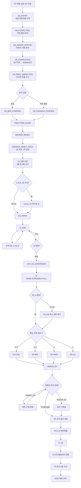
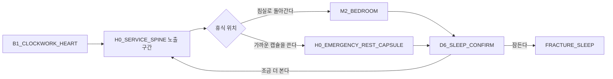
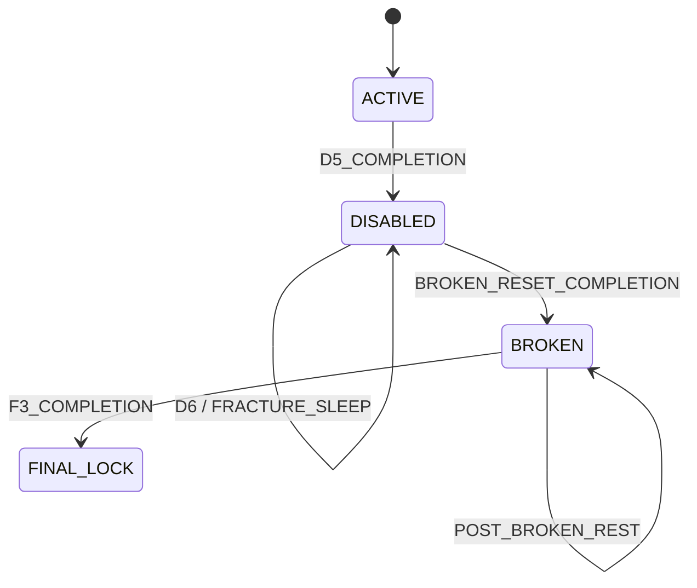
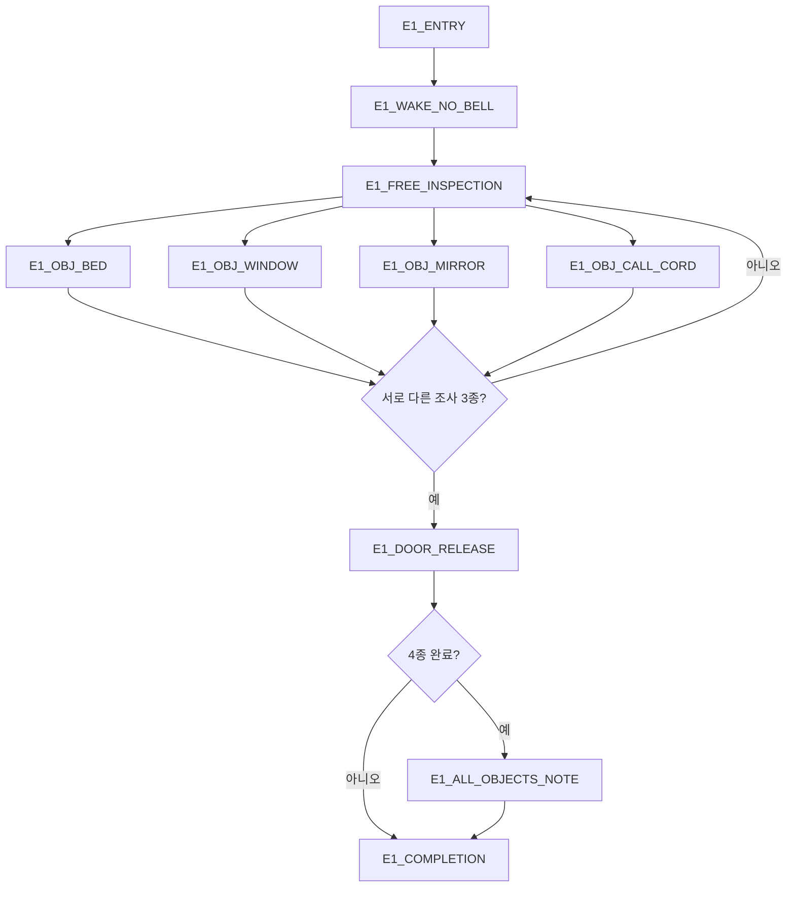
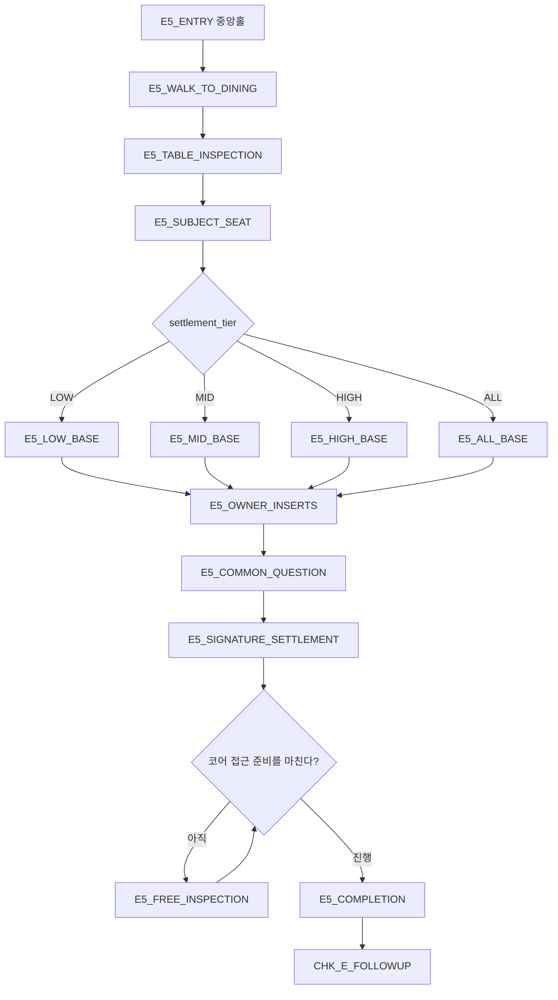
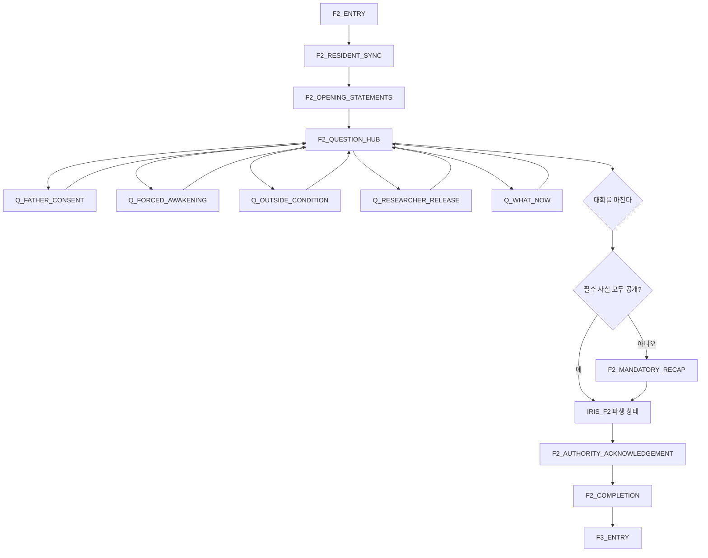
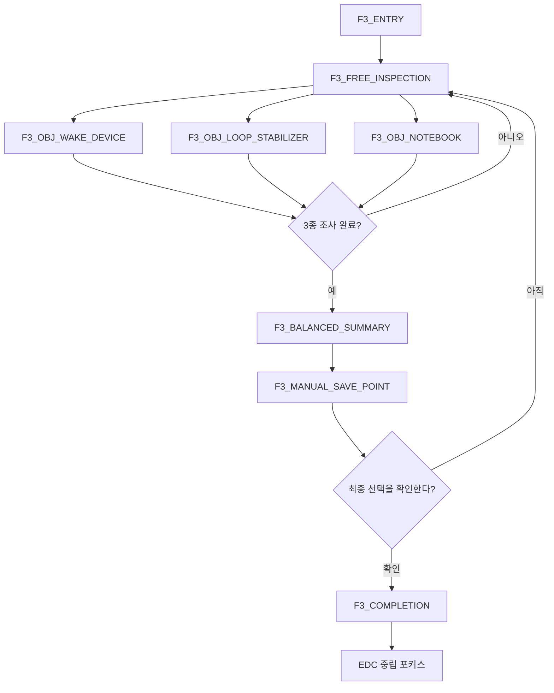

# GGB v0.4 이벤트 상세 08: 파열·전환·결산

## 1. 문서 목적

본 문서는 D5 이후 장르 전환과 파열 수면, E구간 진입, 관계 결산, F2 연구원 대면, F3 최종 선택 직전 확인을 장면 단위로 정의한다.

담당 범위:

- D5 `세계의 파열`의 감각·심리·색상 연출.
- D6에서 `FRACTURE_SLEEP`로 들어가는 플레이어 동선과 확인 절차.
- `BROKEN_RESET_ONCE`의 화면 표현, 원자 완료, 중단 재개.
- E1 `같은 침실의 다른 아침`과 E2_INTRO로의 인계.
- J4 확정 전후의 관계 사건 종료 경계.
- E5의 LOW·MID·HIGH·ALL 결산 장면.
- F2의 다섯 연구원 대면과 필수 사실 공개.
- F3의 장치 3종 조사와 EDC 진입 준비.

담당하지 않는 범위:

| 항목 | 기준 문서 | 본 문서가 다루는 것 |
| --- | --- | --- |
| D4 태엽 심장 퍼즐 | [08 메인 퍼즐](08_이벤트상세_03_메인퍼즐.md) | D4 성공 출력을 D5로 인계 |
| 리셋 데이터 생명주기 | [07 루프·영구 정보·숏컷](07_이벤트상세_02_루프_영구정보_숏컷.md) | 파열 전환의 장면·복구 표현 |
| J4 페이지 배열과 원문 | [09 정보 조사·일지 복원](09_이벤트상세_04_정보조사_일지복원.md) | 확정 경계와 다음 경로 |
| E3_1~E3_5와 E3_4M 본문 | [12 사용인 핵심 관계](12_이벤트상세_07_사용인핵심관계.md) | 완료 결과를 결산 입력으로 소비 |
| E6와 LOCK_CORE | [10 공간 잠금·해금·동선](10_이벤트상세_05_공간잠금_해금_동선.md) | E5 완료와 후속 반응을 E6로 인계 |
| 현실·잔류 최종 선택과 엔딩 | [14 엔딩](14_이벤트상세_09_엔딩.md) | F3 완료 뒤 EDC를 활성화 |

### 1.1 문서 우선순위

13~17번 문서 사이에 충돌이 있으면 00~12번의 더 이른 확정 문서를 우선한다. 본 문서의 상세화로 새 충돌이 발견되면 본문에서 임의로 숨기지 않고 [충돌·오류 관리](issues/README.md)에 ID를 발급한다.

적용 우선순위:

```text
사용자 확정 지시
→ 00 확정사항
→ 01~12의 영역별 기준 문서
→ 03 전체 흐름과 04 상태표의 공통 계약
→ 13 본 문서
→ 14~17의 미보완 서술
```

### 1.2 불변 설계 원칙

1. D5는 플레이어의 성공 결과이자 운영진 기준 확정 전환이다. 실패·처벌 문구를 사용하지 않는다.
2. D5 이후 최초 수면만 S3 손상 기준 상태를 만든다.
3. `POST_BROKEN_REST`는 E3 수리 결과와 현재 공간 상태를 되돌리지 않는다.
4. 관계 사건 완료 수가 0이어도 J4, E5, F0, F2, F3, 두 엔딩에 진입할 수 있다.
5. 관계 상태는 대사·표정·정보 공개 순서를 바꾸지만 필수 사실과 최종 선택지를 차단하지 않는다.
6. F0-E의 비구속적 의향은 F2·F3에서 사용인에게 공개되지 않는다.
7. 색을 제거해도 문양·선 패턴·명칭·음향 자막으로 모든 필수 진행을 이해할 수 있다.
8. 파열 공포는 점프 스케어보다 익숙한 감각의 부정확한 반복과 신체적 불안을 중심으로 표현한다.

## 2. 용어와 확정 정리

### 2.1 파열 이후 수면 용어

| 용어 | 의미 | 물리 상태 처리 |
| --- | --- | --- |
| `FRACTURE_SLEEP` | D6에서 실행하는 파열 전환 수면 | 아직 S3를 확정하지 않음 |
| `BROKEN_RESET` | 전환 시스템 이벤트 | `BROKEN_RESET_ONCE`를 호출 |
| `BROKEN_RESET_ONCE` | S3를 최초 한 번 생성하는 guarded action | S3 생성·필터 BROKEN·완료 플래그를 원자 확정 |
| `POST_BROKEN_REST` | E구간 이후의 일반 휴식 | 시간·피로만 변경, 현재 물리·수리 상태 유지 |
| `FINAL_SLEEP_LOCK` | F3 완료 뒤 선택 회피용 수면 차단 | EDC 상태 유지 |

`BROKEN_RESET`을 파열 이후 모든 휴식의 통칭으로 사용하지 않는다. 이후 휴식은 반드시 `POST_BROKEN_REST`라고 표기한다.

### 2.2 E1 조사 수

E1에는 침대, 창문, 거울, 호출끈의 네 오브젝트가 있다. 완료 조건은 **서로 다른 오브젝트 3종 조사**다.

- 3종 조사: 침실 문과 E2 진행 동선 개방.
- 4종 조사: 추가 독백과 수첩 문장만 제공.
- 네 번째 조사는 메인 진행, 관계 수치, 결산 등급에 영향을 주지 않는다.
- 반복 클릭은 조사 수에 중복 집계하지 않는다.

이 오류와 해결은 `GGB-ERR-2026-0008`에서 추적한다.

### 2.3 E5 명칭

`E5 마지막으로 정상인 저녁`의 `정상`은 고딕 위장이 복구됐다는 뜻이 아니다.

> 파열 이후 처음이자 코어 진입 전에 마지막으로 모두가 한 공간에 모일 수 있는 안정된 저녁.

저택은 S3 상태를 유지하며 식기와 가구도 고딕 외피와 시설 골격 사이를 오간다. 명칭은 인물들이 일과의 형식을 마지막으로 재현한다는 정서적 의미로 사용한다.

## 3. 전체 전환 흐름



### 3.1 권장 플레이 시간

| 사건 | 첫 플레이 | 반복·재개 | 비고 |
| --- | ---: | ---: | --- |
| D5 | 2~3분 | 15~30초 재개 | 확정 전환 |
| D6 | 3~8분 | 1~2분 | 자유 조사 포함 |
| FRACTURE_SLEEP~E1 | 6~10분 | 완료 뒤 반복 없음 | 다른 아침 인지 |
| E2_INTRO | 6~10분 | 1~2분 요약 | 관계 허브 설명 |
| J4 경계·인계 | 1~3분 | 확정 전에는 취소 가능 | J4 본문 시간 제외 |
| E5 | 6~12분 | 완료 뒤 재생 없음 | 등급·인물 삽입에 따라 변동 |
| F2 | 8~16분 | 대화 로그 재열람 | 질문 선택량에 따라 변동 |
| F3 | 5~9분 | EDC 취소 뒤 재조사 가능 | 장치 3종 필수 |

## 4. 공통 이벤트 작성·실행 규칙

### 4.1 장면 상태

```text
locked
→ available
→ in_progress
→ completion_pending
→ completed
```

- `completion_pending`에서 영구 결과를 미리 쓰지 않는다.
- 완료 묶음이 저장된 뒤에만 다음 목적지를 연다.
- 완료 뒤 재진입은 결과 확인 또는 로그 재열람만 허용한다.
- 관계 수치는 D5, D6, E1, E2_INTRO, J4, E5, F2, F3에서 바뀌지 않는다.
- `LUCA_S2`, `EDGAR_S3`, `MARA2_FU`의 관계 변화는 각 사건을 소유한 문서 11의 계약만 적용한다.

### 4.2 입력 제한 등급

| 등급 | 허용 입력 | 사용 구간 |
| --- | --- | --- |
| FREE | 이동·조사·수첩·설정 | D6 자유 조사, E1, E5 전후 |
| FOCUS | 시선 이동·대사 진행·로그 | D5 일부, E2, F2 |
| HOLD | 설정·일시정지·자막 로그만 | D5 필터 박리 8~12초, FRACTURE_SLEEP 전환 |
| CHOICE | 선택지·취소·정보 재확인 | J4 확인, D6 수면 확인, F3 뒤 EDC |

HOLD 구간도 설정과 일시정지는 막지 않는다. 스킵은 초회에는 비활성화하고, 재로드로 이미 본 장면이면 핵심 3단계 요약 뒤 완료 지점으로 이동할 수 있다.

### 4.3 자동 저장 지점

| 저장 지점 | 내용 | 재개 위치 |
| --- | --- | --- |
| `SAVE_D4_COMPLETE` | D4 성공, D5 미완료 | D5_ENTRY |
| `SAVE_D5_COMPLETE` | 필터 DISABLED | D6_FREE_INSPECTION |
| `SAVE_FRACTURE_CONFIRMED` | 수면 경로 선택 | FRACTURE_SLEEP |
| `SAVE_BROKEN_RESET_COMPLETE` | S3·BROKEN 원자 완료 | E1_ENTRY |
| `SAVE_E2_COMPLETE` | 관계 허브 개방 | E_HUB |
| `SAVE_J4_COMPLETE` | J4·superseded 확정 | E3_4 검사 |
| `SAVE_E5_COMPLETE` | `e5_locked_in=true` | 후속 반응 확인 |
| `SAVE_F2_COMPLETE` | 필수 사실 공개 완료 | F3_ENTRY |
| `SAVE_F3_COMPLETE` | 장치 3종 조사·수면 잠금 | EDC 전 중립 지점 |

## 5. D5 세계의 파열

### 5.1 기본 정보

| 항목 | 내용 |
| --- | --- |
| 이벤트 ID | `D5` |
| 위치·시간 | `B1_CLOCKWORK_HEART`, D4 성공 직후 |
| 선행 조건 | D4 완료, 태엽 심장 XIII 기동, `camouflage_filter_state=ACTIVE` |
| 목표 | 위장 필터 해제와 고딕→SF 장르 전환 체험 |
| 필수 | 예 |
| 실패 | 없음 |
| 관계 변화 | 없음 |
| 출력 | `D5_complete=true`, `camouflage_filter_state=DISABLED`, CLR-03 활성 |
| 다음 | D6_FREE_INSPECTION |

### 5.2 노드 흐름

```text
D5_ENTRY
→ D5_HEART_STABLE
→ D5_FILTER_COMMAND
→ D5_DEPTH_COLLAPSE
→ D5_AVATAR_DESYNC
→ D5_SKY_LAYER
→ D5_SLEEP_BROADCAST
→ D5_COMPLETION
→ D6_FREE_INSPECTION
```

### 5.3 장면 진행

#### D5_ENTRY·D5_HEART_STABLE

1. D4의 마지막 링이 XIII에서 멈춘다.
2. 기계는 폭발하거나 멎지 않고 처음으로 완벽하게 고른 작동음을 낸다.
3. 패널에는 `SYNC COMPLETE`가 먼저 뜨고, 아래 줄에서 `CAMOUFLAGE FILTER OFF`가 천천히 해석된다.
4. 주인공은 성공 효과음을 들은 뒤에야 자신이 무엇을 성공시켰는지 의심한다.

플레이어가 실패로 오인하지 않게 하는 표식:

- 붉은 오류 X를 사용하지 않는다.
- `COMPLETE`, `XIII SYNCHRONIZED`를 텍스트·음성 자막으로 먼저 제시한다.
- 화면 흔들림은 0.4초 이하 한 번만 사용한다.
- 체력 손실, 인벤토리 손실, 퍼즐 재시도 UI를 표시하지 않는다.

#### D5_FILTER_COMMAND·D5_DEPTH_COLLAPSE

1. 벽지 문양이 평면 텍스처처럼 미끄러져 배선 격자에서 떨어진다.
2. 촛불의 불꽃은 남아 있지만 열이 사라지고, 향초 냄새가 오존과 소독약 냄새로 바뀐다.
3. 고딕 기둥의 그림자가 실제 구조물과 다른 방향으로 남았다가 한 프레임 늦게 삭제된다.
4. 태엽 심장의 황동 톱니 일부가 회전 애니메이션을 반복하는 외피였음이 드러난다.
5. 주인공은 손잡이를 놓았는데도 손바닥에서 톱니 진동을 계속 느낀다.

주인공 감각 독백 기준:

> “망가진 소리가 아니었다. 너무 잘 맞물린 소리였다. 그래서 더 늦게 손을 뗐다.”

#### D5_AVATAR_DESYNC

사용인은 모두 같은 방에 물리적으로 모이지 않는다. 태엽 심장과 연결된 진단 투사에 다섯 인격 아바타의 순간 이미지가 겹친다.

| 사용인 | 파열 동작 | 비색상 단서 | 음향 |
| --- | --- | --- | --- |
| 에드가 | 뿔과 꼬리 윤곽에서 남색 수직선 분리, 레이피어가 권한 포인터로 겹침 | 수직 잠금선 | 낮은 시계음 |
| 마라 1 | 귀와 꼬리 뒤로 주황 대각선 잔상, 스패너가 정비 커서로 변함 | 대각 닦임 자국 | 마른 솔·래칫 소리 |
| 루카 | 검은 몸 윤곽과 귀의 연두 신호가 서로 다른 박자로 뜀 | 이중 맥박선 | 생체 신호음 |
| 이리스 | 백금발 후광과 플라스틱 날개 관절이 별도 레이어로 분리 | 꽃잎·후광 문양 | 유리·바람 소리 |
| 마라 2 | 보라 이중 윤곽이 액자처럼 겹쳤다가 한쪽만 말함 | 겹친 액자 | 빠른 3음 신호 |

`CHK_D4_REACT`에서 선택된 반응이 있으면 그 사용인의 한 줄만 명료하게 들리고 나머지는 진단 잡음으로 처리한다. 새 관계 판정을 D5에서 다시 수행하지 않는다.

#### D5_SKY_LAYER·D5_SLEEP_BROADCAST

1. 창문이 없는 지하인데 천장 틈으로 밤하늘이 보인다.
2. 별은 깜빡이지 않고 한 장의 배경 레이어처럼 카메라를 따라 움직인다.
3. 저택 전체 방송이 P6의 취침 권유를 재생하지만 문장 사이에 진단 코드가 끼어든다.
4. “오늘도 수고하셨습니다” 뒤에 “복구 기준점 없음”이 같은 목소리로 이어진다.
5. 방송은 침실과 가까운 비상 휴식 캡슐 두 경로를 지도에 표시한다.

### 5.4 입력과 카메라

- D5_ENTRY에서 플레이어가 태엽 심장을 놓는 입력은 직접 수행한다.
- 필터 박리 첫 8~12초는 HOLD다.
- 이후 시선 이동을 허용하고 다섯 진단 투사 중 하나를 바라볼 수 있다.
- 바라본 대상은 대사 순서를 바꾸지 않고 수첩의 `D5_FOCUS_OWNER` 임시 감상 기록만 바꾼다.
- 자동 카메라는 주인공 얼굴보다 방의 깊이가 무너지는 광경을 우선한다.
- 멀미 감소 설정에서는 카메라 흔들림과 초점 이동을 제거하고 오브젝트 마스크 전환으로 대체한다.

### 5.5 완료 트랜잭션

```yaml
event_completion:
  event_id: D5
  atomic_group_id: D5_COMPLETION
  guard:
    all_flags: [D4_complete]
    state_equals:
      camouflage_filter_state: ACTIVE
  effects:
    set_flags: [D5_complete]
    set:
      camouflage_filter_state: DISABLED
    add_overlay: CLR-03
  forbidden_effects:
    - broken_reset_triggered
    - fracture_sleep_complete
    - world_phase_S3
    - relationship_changes
  next_objective: D6_FREE_INSPECTION
```

`DISABLED`는 필터가 꺼졌지만 복구 불능과 S3가 아직 확정되지 않은 짧은 상태다. D5에서 `broken_reset_triggered`를 미리 쓰지 않는다.

### 5.6 중단·재개

| 중단 지점 | 재개 |
| --- | --- |
| D5_COMPLETION 전 | D5_ENTRY 또는 마지막 본 세부 노드 |
| 완료 묶음 저장 중 | 전체 롤백 뒤 D5_SLEEP_BROADCAST |
| `D5_complete=true`, 필터 ACTIVE | 무결성 오류, 완료 묶음 롤백 |
| `D5_complete=false`, 필터 DISABLED | 무결성 오류, 완료 묶음 재검증 |
| 완료 뒤 | D6_FREE_INSPECTION |

## 6. D6 전환 수면

### 6.1 기본 정보

| 항목 | 내용 |
| --- | --- |
| 이벤트 ID | `D6` |
| 위치·시간 | 파열된 지하·저택, D5 직후 |
| 선행 조건 | `D5_complete=true`, `camouflage_filter_state=DISABLED` |
| 목표 | 익숙한 수면 습관을 스스로 선택하되 결과가 달라질 수 있음을 인지 |
| 필수 | 예 |
| 실패 | 없음 |
| 자유 조사 | 3~8분 권장, 강제 시간 제한 없음 |
| 관계 변화 | 없음 |
| 출력 | 선택한 휴식 경로, `FRACTURE_SLEEP` 진입 |

### 6.2 동선



`H0_EMERGENCY_REST_CAPSULE`은 D6에서만 쓰는 기능 지점이며 자유 탐색 지역으로 등록하지 않는다. 공간 지도에는 `H0_SERVICE_SPINE`의 조건부 상호작용으로 취급한다.

### 6.3 자유 조사 오브젝트

| 오브젝트 | 관찰 | 기능 |
| --- | --- | --- |
| 벗겨진 벽지 | 뒤쪽 금속 격자가 방 크기보다 좁음 | 저택이 공간 외피임을 확인 |
| 서비스 척추 표지 | 다섯 기능실 방향과 `SUBJECT` 방향이 분리됨 | E구간 공간 예고 |
| 사용인 진단 잔상 | 몸은 없는데 색·문양만 일정 주기로 통과 | 인격 데이터와 아바타 분리 암시 |
| 비상 캡슐 | 침실 침대와 같은 직물 무늬가 표면에 투사됨 | 두 수면 경로의 동일성 암시 |
| 수첩 | 낙서 저택 선과 실제 배선도가 일부 일치 | 아버지가 낙서를 기반으로 구성했음을 회수 |

두 오브젝트를 조사하면 수면 목표를 다시 표시한다. 모두 조사해도 별도 보상이나 관계 변화는 없다.

### 6.4 수면 유도

시간은 유연하지만 무한 배회를 목표로 오인하지 않게 단계적으로 안내한다.

| 시점 | 안내 |
| --- | --- |
| D5 완료 직후 | 침실·비상 캡슐 지도 핀 표시 |
| 주요 오브젝트 2개 조사 | “복구 절차는 수면 중 실행됩니다” 자막 |
| 3분 경과 | P6 취침 종을 깨진 11회로 재생 |
| 5분 경과 | 에드가 방송 또는 D4 동행 사용인의 한 줄 반응 |
| 8분 경과 | 지도 버튼을 강조하지만 이동·조사는 계속 허용 |

수면을 거부해도 게임오버나 강제 암전을 발생시키지 않는다. 확인창의 기본 포커스는 `조금 더 본다`에 둔다.

### 6.5 침실과 캡슐 변형

| 항목 | 침실 경로 | 비상 캡슐 경로 |
| --- | --- | --- |
| 표면 | 익숙한 이불 아래 캡슐 곡면 | 금속 표면 위에 이불 질감 투사 |
| 주인공 반응 | 익숙함을 붙잡으려 함 | 침대가 처음부터 장치였음을 빠르게 인정 |
| 수면 화면 | 캐노피 그림자가 닫힘 | 투명 덮개가 닫힘 |
| 시스템 결과 | 동일 | 동일 |
| 영구 분기 | 없음 | 없음 |

두 경로는 서사 해석만 다르며 E1, 관계 상태, 엔딩을 바꾸지 않는다.

### 6.6 확인 문구

```text
복구 절차를 실행하면 현재 파열 상태를 기준으로 수면 전환이 시작됩니다.
결과는 확인되지 않았습니다.

[조금 더 본다] [잠든다]
```

`현재 파열 상태를 초기화합니다`라고 쓰지 않는다. 실제로 어떤 상태가 생성될지 주인공과 플레이어 모두 모르는 시점이기 때문이다.

### 6.7 상태 계약

```yaml
event_result:
  event_id: D6
  set_local:
    fracture_rest_route: bedroom | emergency_capsule
  persistent_effects: []
  relationship_changes: {}
  next_event: FRACTURE_SLEEP
```

## 7. FRACTURE_SLEEP·BROKEN_RESET_ONCE

### 7.1 상태 머신



| 현재 상태 | 허용 수면 | 금지 |
| --- | --- | --- |
| ACTIVE | NORMAL_SLEEP | BROKEN_RESET, POST_BROKEN_REST |
| DISABLED | FRACTURE_SLEEP → BROKEN_RESET_ONCE | NORMAL_RESET, S0 생성 |
| BROKEN | POST_BROKEN_REST | NORMAL_RESET, S3 재생성 |
| FINAL_LOCK | 없음 | 모든 세계 내 수면 |

### 7.2 전환 노드

```text
FRACTURE_SLEEP_ENTRY
→ FRACTURE_SLEEP_PLAYER_COMMIT
→ FRACTURE_SLEEP_WORLD_MASK_CHECK
→ BROKEN_RESET_GUARD
→ BROKEN_RESET_ONCE
→ BROKEN_RESET_SYS_SYNC
→ BROKEN_RESET_COMPLETION
→ E1_ENTRY
```

#### PLAYER_COMMIT

- D6에서 새로 얻은 필수 영구 정보가 있으면 저장한다.
- 정상 루프의 `SYS_MEMORY`를 다시 돌려 관계 기억을 생성하지 않는다.
- D5 관찰 대상은 감상 로그로만 보존한다.
- `loop_index`를 정상 리셋처럼 증가시키지 않고 파열 전환 횟수 `fracture_transition_count=1`을 검증용으로 둔다.

#### WORLD_MASK_CHECK

화면에는 내부 체크리스트 네 줄을 표시한다.

```text
SUBJECT SIGNAL ........ PERSIST
RESIDENT MEMORY ....... PERSIST
WORLD GEOMETRY ........ DEGRADED
CAMOUFLAGE MASK ....... NO BASELINE
```

색상만으로 성공·실패를 구분하지 않는다. `PERSIST`, `DEGRADED`, `NO BASELINE`을 자막과 화면 읽기 대상으로 제공한다.

#### BROKEN_RESET_ONCE

```yaml
fracture_transition:
  event_id: BROKEN_RESET
  action_id: BROKEN_RESET_ONCE
  atomic_group_id: BROKEN_RESET_COMPLETION
  guard:
    all:
      - camouflage_filter_state == DISABLED
      - D5_complete == true
      - broken_reset_triggered == false
  effects:
    - create_world_phase_S3_once
    - set_camouflage_filter_state_BROKEN
    - set_broken_reset_triggered_true
    - set_fracture_sleep_complete_true
    - run_SYS_SYNC_once
  preserves:
    - notebook_and_journal
    - researcher_records
    - servant_residual_memory
    - servant_bond_and_alert
    - short_events_seen
  next_event: E1
```

### 7.3 S3 생성 범위

| 계층 | BROKEN_RESET_ONCE | POST_BROKEN_REST |
| --- | --- | --- |
| 월드 기준 | S3 손상 기준 최초 생성 | 현재 S3 유지 |
| 고딕 필터 | 복구하지 않음 | 복구하지 않음 |
| E3 기능실 | 접근 가능한 초기 S3 상태 생성 | 현재 수리 상태 유지 |
| E3 수리 결과 | 아직 없음 | 완료 결과 유지 |
| 사용인 위치 | E1·E2용 결정 배치 | 현재 위치 또는 허브 규칙 유지 |
| 수첩·일지 | 유지 | 유지 |
| 관계·잔류 기억 | 유지 | 유지 |
| 시간·피로 | E1 아침으로 설정 | 선택한 휴식량만 갱신 |

`E구간 로컬 장치만 초기화`라는 포괄 표현은 사용하지 않는다. E구간 장치의 **최초 S3 배치 생성**과 이후 휴식의 **현재 상태 보존**을 구분한다.

### 7.4 원자 완료와 불변식

```text
camouflage_filter_state == ACTIVE
⇒ !D5_complete && !broken_reset_triggered

camouflage_filter_state == DISABLED
⇒ D5_complete && !broken_reset_triggered

camouflage_filter_state == BROKEN
⇔ broken_reset_triggered
```

`BROKEN_RESET_COMPLETION`은 아래 항목을 전부 적용하거나 전부 롤백한다.

1. S3 월드 템플릿 생성 완료.
2. `camouflage_filter_state=BROKEN`.
3. `broken_reset_triggered=true`.
4. `fracture_sleep_complete=true`.
5. `SYS_SYNC` 완료 플래그.
6. E1 진입 스냅숏 생성.

### 7.5 중단·복구

| 마지막 안전 상태 | 재개 |
| --- | --- |
| D6 수면 확인 | FRACTURE_SLEEP_ENTRY |
| PLAYER_COMMIT 완료 | WORLD_MASK_CHECK |
| S3 템플릿 생성 중 | 임시 S3 폐기 후 BROKEN_RESET_ONCE 재실행 |
| S3 생성 완료·원자 저장 전 | 완료 묶음 전체 검증 뒤 적용 또는 롤백 |
| BROKEN_RESET_COMPLETION 완료 | 기존 S3를 재생성하지 않고 E1_ENTRY |
| E1 로드 중 | 같은 E1 스냅숏 사용 |

같은 transaction ID로 재시도할 때 `create_world_phase_S3_once`는 이미 확정된 S3에 no-op이어야 한다.

### 7.6 POST_BROKEN_REST

```yaml
post_broken_rest:
  guard:
    all:
      - camouflage_filter_state == BROKEN
      - broken_reset_triggered == true
      - final_sleep_lock == false
  updates: [time_segment, protagonist_fatigue]
  preserves:
    - world_phase
    - object_states
    - servant_locations
    - E3_repair_states
    - relationship_state
    - event_history
```

E구간 휴식은 퍼즐 실패 복구 수단이 아니다. E3 퍼즐은 LOCAL RETRY이며, 휴식으로 정답 배치나 완료 결과를 되돌리지 않는다.

## 8. E1 같은 침실의 다른 아침

### 8.1 기본 정보

| 항목 | 내용 |
| --- | --- |
| 이벤트 ID | `E1` |
| 위치·시간 | `M2_BEDROOM`, S3 아침 |
| 선행 조건 | `BROKEN_RESET_COMPLETION`, `world_phase=S3` |
| 목표 | 수면이 더 이상 세계를 복구하지 못했음을 감각적으로 인지 |
| 필수 조사 | 네 오브젝트 중 서로 다른 3종 |
| 선택 조사 | 네 번째 오브젝트 |
| 실패 | 없음 |
| 관계 변화 | 없음 |
| 출력 | `E1_complete`, `KN_E1_RESET_DID_NOT_RESTORE`, 침실 문 개방 |

### 8.2 노드 흐름



### 8.3 기상 연출

1. 기상 종과 새소리 없이 냉각 팬의 감속음만 들린다.
2. 주인공은 눈을 뜨기 전에 이불의 무게가 전날과 같다고 안심한다.
3. 손을 움직이면 천 아래에서 금속 고정구가 손목을 따라 미세하게 떨린다.
4. 캐노피 커튼은 열려 있지만 창문의 아침빛이 방 안 오브젝트에 그림자를 만들지 않는다.
5. 수첩은 침대 옆에 남아 있고 첫 문장이 자동 작성된다.

> “같은 아침이어야 한다.”

자동 문장은 시스템 글꼴이 아니라 주인공의 흑연 필체로 나타난다. 주인공이 직접 쓴 것인지 확신하지 못하도록 마지막 획이 떨린다.

### 8.4 조사 오브젝트

#### 침대 `E1_OBJ_BED`

| 감각 | 내용 |
| --- | --- |
| 촉각 | 매트리스의 푹신함 아래 둥근 캡슐 곡면과 고정구 |
| 청각 | 귀를 대면 자기 심장보다 느린 냉각 펌프음 |
| 인지 | 매일 같은 침대가 아니라 같은 장치를 침대로 보았을 가능성 |
| 반복 | “천은 부드럽다. 그 아래가 무엇인지는 이제 안다.” |

#### 창문 `E1_OBJ_WINDOW`

| 감각 | 내용 |
| --- | --- |
| 촉각 | 겨울 아침인데 유리가 차갑지 않고 체온보다 조금 낮음 |
| 시각 | 새 한 마리가 4초 간격으로 같은 궤적을 반복하다 중간 프레임에서 사라짐 |
| 인지 | 바깥 풍경이 환경 정보가 아니라 반복 영상일 가능성 |
| 접근성 | 새 궤적 대신 `동일 궤도 반복 00:04` 텍스트 단서 제공 |

#### 거울 `E1_OBJ_MIRROR`

| 감각 | 내용 |
| --- | --- |
| 시각 | 주인공의 호흡보다 거울상이 반 박자 늦음 |
| 촉각 | 유리가 아니라 얇은 데이터 막처럼 손끝이 미세하게 밀림 |
| 인지 | 검은 거울에서 본 진단 패널과 같은 재질 |
| 안전 | 얼굴 왜곡·급접근 점프 스케어 금지 |

#### 호출끈 `E1_OBJ_CALL_CORD`

| 감각 | 내용 |
| --- | --- |
| 촉각 | 천 끈 안에서 광섬유 다발이 꺾이는 단단한 감촉 |
| 청각 | 종 대신 루카의 생체 신호음과 보라 3음 신호가 짧게 겹침 |
| 인지 | 사용인 호출과 시설 네트워크가 같은 통로를 사용 |
| 후속 | 아래층에서 응답이 없고 주방 방향 연두 보조등이 켜짐 |

### 8.5 3종 완료와 4종 보너스

세 번째 고유 조사를 마치면 침실 문 걸쇠가 열리고 수첩에 아래 지식이 기록된다.

```yaml
knowledge_entry:
  knowledge_id: KN_E1_RESET_DID_NOT_RESTORE
  state: verified
  source_event_id: E1
  notebook_entry_id: NOTE_E1_DIFFERENT_MORNING
```

네 번째까지 조사하면 추가 독백을 제공한다.

> “달라진 것이 네 개가 아니었다. 달라지지 않은 척하는 방법이 네 군데에서 끝난 것이다.”

이 독백은 `E1_all_objects_seen` 감상 플래그만 저장하며 진행 가드로 사용하지 않는다.

### 8.6 E1 이후 동선과 LUCA_S2

E1 완료 뒤 중앙홀은 잠깐 비어 있다. `LUCA_S2` 조건이 참이면 중앙홀의 E2 트리거를 보류하고 연두 맥박 표식이 주방으로 안내한다.

```text
E1_COMPLETION
→ CHK_LUCA_S2
→ 조건 참: M1_CENTRAL_HALL 통과 → M1_KITCHEN → LUCA_S2 → E2_INTRO
→ 조건 거짓: M1_CENTRAL_HALL → E2_INTRO
```

LUCA_S2를 플레이어가 즉시 따라가지 않아도 침실·상부 회랑·중앙홀 조사는 가능하다. 다른 주요 구역 문은 “모두 중앙홀에 모이고 있습니다” 안내로 잠시 보류해 E2보다 먼저 E_HUB 공간을 탐색하지 못하게 한다.

### 8.7 상태 계약

```yaml
event_completion:
  event_id: E1
  required_unique_interactions: 3
  allowed_interactions:
    - E1_OBJ_BED
    - E1_OBJ_WINDOW
    - E1_OBJ_MIRROR
    - E1_OBJ_CALL_CORD
  effects:
    set_flags: [E1_complete]
    add_knowledge: [KN_E1_RESET_DID_NOT_RESTORE]
    unlock: [LOCK_BEDROOM_EXIT_S3]
  optional_fourth_effect:
    set_flags: [E1_all_objects_seen]
  next_check: CHK_LUCA_S2
```

## 9. E2_INTRO 인계

### 9.1 책임 경계

E2의 질문, 다섯 사용인 목적지, 보라 익명 인덱스와 관계 허브 본문은 [12번 문서 §5](12_이벤트상세_07_사용인핵심관계.md#5-e2_intro-파열-후-합의)를 기준으로 한다. 본 절은 E1·LUCA_S2에서 E2로 들어가는 장면 배치와 완료 인계만 정의한다.

### 9.2 등장 배치

| 위치 | 사용인 | 파열 상태 |
| --- | --- | --- |
| 중앙 계단 아래 | 에드가 | 레이피어를 지팡이처럼 세워 진단선을 고정 |
| 서쪽 출구 | 마라 1 | 스패너로 끊긴 배선 덮개를 붙잡음 |
| 동쪽 출구 | 루카 | LUCA_S2 여부에 따라 주인공 옆 또는 주방 문 앞 |
| 온실 방향 | 이리스 | 플라스틱 날개 한쪽으로 환경 노이즈를 가림 |
| 북쪽 기록 방향 | 마라 2 | 보라 이중 윤곽 중 한쪽이 이름표 목록을 읽음 |

다섯 사용인은 관계 사건 완료 여부와 무관하게 모두 보인다. 이 시점에는 E3 사건이 아직 열리기 전이므로 `core_event_complete`를 읽어 등장 여부를 바꾸지 않는다.

### 9.3 전환 연출

1. 중앙홀에 들어오면 샹들리에의 고딕 촛대와 전력 분배 프레임이 번갈아 보인다.
2. 다섯 사용인은 주인공을 향해 동시에 움직이려다 서로 다른 프레임에서 멈춘다.
3. 에드가가 먼저 “보고드리겠습니다”라고 말해 장면의 통제권을 잡는다.
4. 루카는 주인공의 상태를 확인하고, 마라 1은 두 번 재생된 자기 웃음에 말을 멈춘다.
5. 이리스의 미소는 유지되지만 날개가 주인공 쪽으로 닫힌다.
6. 마라 2가 “너무 오래 쓴 표지”라고 설명하며 기능 공간 지도를 투사한다.
7. 문서 12의 E2_INTRO 질문 허브로 인계한다.

### 9.4 완료 계약

```yaml
handoff:
  source: E1 | LUCA_S2
  target: E2_INTRO
  target_location: M1_CENTRAL_HALL
  required_outputs:
    - E2_INTRO_complete
    - relationship_hub_open
    - E3_1_destination_pin
    - E3_2_destination_pin
    - E3_3_destination_pin
    - E3_4_destination_pin
    - E3_5_destination_pin
  forbidden_effects:
    - relationship_changes
    - core_event_complete
    - researcher_records
```

## 10. J4 확정과 관계 사건 종료 경계

### 10.1 기본 원칙

J4의 페이지 배열, 기록 변형, 원문과 knowledge 출력은 문서 09가 소유한다. 본 문서는 `E_HUB → CHK_J4_CONFIRM → SYS_E3_SUPERSEDE → J4 → E3_4M/E5`의 경계만 상세화한다.

J4 확정은 E구간에서 마지막으로 관계 사건을 선택할 수 있는 가역 경계다.

### 10.2 확인 화면

```text
이 기록을 정리하면 사용인 조사 단계가 종료됩니다.
남은 사용인 사건은 이후 완료할 수 없습니다.
메인 진행과 두 최종 선택지는 유지됩니다.

완료: N / 5
미완료: [문양 + 이름 목록]
남은 예상 시간: N~N분
연구원 기록: N / 5

[계속 조사한다] [기록을 정리한다]
```

에드가 E3_4가 미완료면 별도 문장을 추가한다.

> “에드가의 전체 기록과 관계 사건은 종료되며, 코어 접근에 필요한 최소 절차 E3_4M으로 대체됩니다. E3_4M은 기록·관계·완료 수를 제공하지 않습니다.”

기본 포커스는 `계속 조사한다`다. 확정 버튼을 길게 누르거나 두 번째 확인을 요구하지는 않되, 짧은 실수 방지를 위해 0.5초 입력 유예를 둔다.

### 10.3 취소

취소하면 다음 상태를 전혀 바꾸지 않는다.

- E3 lifecycle.
- 활성 체크포인트.
- E_HUB 지도 핀.
- 연구원 기록 수.
- bond·alert.
- J4 variant.

취소 뒤 마지막으로 선택했던 허브 핀에 포커스를 돌려준다.

### 10.4 확정 트랜잭션

```text
CHK_J4_CONFIRM
→ J4_CONFIRM_SNAPSHOT
→ SYS_E3_SUPERSEDE
→ J4_COUNT_RECORDS
→ J4_BASE | J4_EXPANDED | J4_FULL
→ J4_COMPLETION
→ CHK_EDGAR_CORE
```

`J4_CONFIRM_SNAPSHOT`에는 아래 값을 기록한다.

```yaml
j4_confirmation_snapshot:
  core_complete_ids: [E3_1, E3_3]
  incomplete_ids: [E3_2, E3_4, E3_5]
  researcher_record_count: 2
  edgar_core_complete: false
```

스냅숏은 복구용이며 관계 완료 수를 별도로 캐시하는 영구 진실원이 아니다. 완료 트랜잭션 검증 시 실제 E3 플래그와 대조한다.

### 10.5 SYS_E3_SUPERSEDE

| 대상 | 처리 |
| --- | --- |
| 완료 E3 | 그대로 유지 |
| 미완료 E3 | `event_history.E3_X.lifecycle=superseded` |
| 활성 퍼즐 체크포인트 | 종료·보관 |
| 임시 인벤토리 | 소유 이벤트에 반환 또는 폐기 |
| 관계 수치 | 변경 없음 |
| 연구원 기록 | 지급 없음 |
| 완료 수 | 증가 없음 |

`superseded`는 실패가 아니다. F2에서 “거절했다”거나 “돕지 않았다”는 도덕적 평가로 번역하지 않는다.

### 10.6 J4 변형과 E3_4M 인계

| 연구원 기록 수 | J4 변형 | 다음 검사 |
| ---: | --- | --- |
| 0~1 | J4_BASE | CHK_EDGAR_CORE |
| 2~4 | J4_EXPANDED | CHK_EDGAR_CORE |
| 5 | J4_FULL | CHK_EDGAR_CORE |

```text
E3_4_complete=true
→ 관계 완료 수 계산
→ E5

E3_4_complete=false
→ E3_4M
→ edgar_minimum_access=true
→ 관계 완료 수 계산
→ E5
```

E3_4M은 `REC_EDGAR`, `E3_4_complete`, `servants.EDGAR.core_event_complete`, bond, alert, 관계 완료 수를 바꾸지 않는다.

### 10.7 중단·재개

| 중단 지점 | 재개 |
| --- | --- |
| 확인 화면 | E_HUB, 확인 전 상태 |
| superseded 처리 중 | 스냅숏으로 전체 재적용 또는 전체 롤백 |
| J4 배열 중 | 문서 09의 로컬 체크포인트 |
| J4 완료·E3_4 검사 전 | CHK_EDGAR_CORE |
| E3_4M 중 | E3_4M 첫 미완료 노드 |

## 11. E5 마지막으로 정상인 저녁

### 11.1 기본 정보

| 항목 | 내용 |
| --- | --- |
| 이벤트 ID | `E5` |
| 위치·시간 | `M1_CENTRAL_HALL` → `M1_DINING_ROOM`, S3 저녁 |
| 선행 조건 | `journal_stage>=4`, `E3_4_complete || edgar_minimum_access` |
| 목표 | 선택한 관계 조사 결과를 다섯 사용인의 집단 장면으로 결산 |
| 필수 | 예 |
| 실패 | 없음 |
| 관계 변화 | 없음 |
| 변형 | LOW, MID, HIGH, ALL |
| 출력 | `e5_locked_in=true`, E5 event_history variant, 후속 반응 확인 |
| 다음 | CHK_E_FOLLOWUP → E6 |

E5가 시작될 때 관계 사건은 이미 J4에서 종료됐다. E5는 누락 사건을 되살리거나 보상을 재지급하지 않는다.

### 11.2 등급 판정

```gdscript
relationship_complete_count = (
    int(E3_1_complete)
  + int(E3_2_complete)
  + int(E3_3_complete)
  + int(E3_4_complete)
  + int(E3_5_complete)
)
```

| 완료 수 | settlement_tier | 장면 성격 |
| ---: | --- | --- |
| 0~1 | LOW | 업무 보고와 긴 침묵 |
| 2~3 | MID | 일부 개인 감정과 의견 충돌 |
| 4 | HIGH | 네 명의 직접 책임과 한 사람의 거리 |
| 5 | ALL | 다섯 독립 인격의 공동 확인 |

- `edgar_minimum_access`는 완료 수가 아니다.
- `superseded`는 완료 수가 아니다.
- `all_servants_complete`는 E3_1~E3_5가 모두 완료일 때만 true다.
- 등급은 관계 수치의 총합이나 평균으로 계산하지 않는다.
- E5 진입 시 계산 결과를 `event_history.E5.variant_id`에 스냅숏으로 남긴다.

### 11.3 조합 폭발 방지

E5를 32개 인물 조합별로 따로 작성하지 않는다.

```text
등급 공통 도입
+ 완료한 사용인의 owner insert
+ 미완료 사용인의 generic distance insert
+ 해당 E3 outcome overlay
+ ALL 전용 공동 장면
= E5 최종 장면
```

owner insert 순서는 항상 `EDGAR → MARA1 → LUCA → IRIS → MARA2`다. 특정 사용인이 미완료면 그 자리에 다른 인물의 설명을 대신 넣지 않는다.

### 11.4 공간과 좌석

```text
                 [북쪽 / 주인공 정면석]
                         주인공

          이리스                         루카

          마라 2                         마라 1

                         에드가
                 [남쪽 / 식당 출입문]
```

- 주인공석만 클릭 가능한 착석 지점이다. 사용인 자리에는 앉을 수 없다.
- LOW에서는 주인공만 앉고 사용인은 자기 업무 위치에 선다.
- MID에서는 완료한 사용인부터 자리에 앉는다.
- HIGH에서는 완료한 네 명이 앉고 미완료 한 명의 의자는 회색 인덱스로 남는다. 해당 사용인은 출입문 또는 서비스 경계에 물리적으로 존재한다.
- ALL에서는 다섯 명 모두 앉되 에드가는 마지막까지 서 있다가 주인공이 바라보면 앉는다.
- 색 제거 모드에서는 이름표, 좌석 문양, 고유 소품 실루엣으로 구분한다.

### 11.5 노드 흐름



### 11.6 공통 도입

1. 중앙홀의 시계는 저녁을 가리키지만 창밖 배경은 E1 아침 프레임과 같다.
2. 에드가는 “저녁 준비가 되었습니다”라고 보고한다. LOW에서는 명령문에 가깝고, HIGH·ALL에서는 주인공의 준비 여부를 묻는다.
3. 식당 문이 열리면 긴 식탁의 절반은 고딕 목재, 절반은 생명 유지 프레임으로 드러난다.
4. 음식은 실재하지 않고 향·온도·식감 데이터만 제공된다. 루카가 이 사실을 숨기지 않는다.
5. 주인공이 자기 좌석을 클릭해야 대화가 시작된다.

### 11.7 등급별 공통 장면

#### LOW: 0~1명

- 사용인은 식사 손님이 아니라 운영 인력처럼 선다.
- 에드가는 현재 시설 상태, 외부 불확실성, 코어 접근 가능 여부를 보고한다.
- 완료한 인물이 한 명이면 그 인물만 업무 보고 끝에 개인적인 한 문장을 덧붙인다.
- 미완료 인물은 자기 기능과 확인 가능한 사실만 말한다.
- 색 서명은 식탁 중앙으로 오지 않고 각자의 몸 주변에서 끊긴다.
- 침묵은 2~4초 유지하되 대사 넘김 입력으로 단축할 수 있다.

#### MID: 2~3명

- 완료 인물은 앉고 미완료 인물은 서비스 경계에 선다.
- 완료 인물 사이에서도 주인공을 보내야 하는지, 안전을 우선해야 하는지 의견이 갈린다.
- 한 인물이 다른 인물의 감정이나 기록 내용을 대신 설명하지 않는다.
- 일부 색·문양이 식탁 중앙에서 접촉하지만 섞여 단일색이 되지 않는다.
- 에드가는 결론을 내리려다 멈추고 주인공에게 공동 질문을 돌려준다.

#### HIGH: 4명

- 완료한 네 명은 자기 감금 책임과 애착을 각자의 말투로 인정한다.
- 미완료 인물의 의자는 이름 없는 빈자리로 지우지 않고 원래 문양이 남은 회색 인덱스로 둔다.
- 미완료 인물은 필수 사실을 숨기지 않지만 사적 고백은 하지 않는다.
- 에드가가 E3_4 미완료로 E3_4M만 수행했다면 앉지 않고 E6 접근 보고만 한다.
- E6 개방은 다수결이 아니라 주인공에게 선택권을 돌려주는 운영 합의로 표현한다.

#### ALL: 5명

- `all_servants_complete=true`를 다시 검증한다.
- 다섯 명이 서로를 기능명이 아니라 현재 이름으로 부른다.
- 이리스의 적의를 다른 사용인이 해명하거나 용서하지 않는다.
- 마라 2가 에드가, 마라 1, 루카, 이리스의 이름을 순서대로 확인하고 마지막에 자기 임시 호칭을 되묻는다.
- 다섯 고유 음향이 차례로 재생된 뒤 구분 가능한 화음으로 끝난다.
- 다섯 색은 하나로 혼합되지 않고 각각의 경계를 유지한 채 한 프레임에 공존한다.

### 11.8 사용인별 삽입 장면

| 사용인 | 완료 시 핵심 | 미완료 시 한계 | outcome overlay |
| --- | --- | --- | --- |
| 에드가 | 강제 기동과 선택 권한 미반환을 막지 못한 책임 | 최소 권한 제공 사실만 보고 | `responsibility_recorded`: 감사 로그를 식탁에 둠 / `authority_returned`: 빈 SUBJECT 슬롯을 주인공 쪽으로 돌림 |
| 마라 1 | 삭제와 수리가 같은 손에서 이루어졌음을 인정 | 배선 안정 보고 뒤 농담으로 물러남 | `original_attribution`: 모든 책임자 이름 표시 / `protected_identifiers`: 보호 대상 식별자 가림 |
| 루카 | 신체 위험을 숨기는 보호가 유예였음을 인정 | 현재 생존 신호만 정확히 보고 | `full_disclosure`: 위험 수치도 함께 표시 / `stabilize_first`: 안정화 완료 시각을 먼저 표시 |
| 이리스 | 돌봄과 적의가 함께 있었음을 관계 상태에 맞게 표현 | 환경 전력 로그와 외부 위험만 말함 | `external_truth`: 실제 외부 센서 / `shelter_projection`: 낮춘 투영 계절 |
| 마라 2 | 타인의 기억을 지키며 자기 이름을 잃은 공포를 인정 | 익명 인덱스가 기능 보고만 수행 | `merged`: 한 목소리 안의 낯선 억양 / `separated`: 두 인덱스 교차 발화 |

E5의 이리스는 F2의 공개 고백을 선취하지 않는다. E3_2 관계 결과가 높더라도 식탁에서는 개인적 문장까지만 말하고, `iris_confession_state=public`의 집단 고백은 F2에서 발생한다.

### 11.9 공동 질문

주인공은 아래 질문 중 하나를 선택한다. 질문은 관계 수치와 최종 의향을 쓰지 않는다.

| 질문 | 얻는 관점 |
| --- | --- |
| “나한테 무엇을 바라고 있어요?” | 각자의 욕망과 보호 방식 |
| “내가 떠나면 여러분은 어떻게 돼요?” | 연구원 인격의 지속과 외부 불확실성 |
| “내가 남으면 무엇이 달라져요?” | 합의된 루프와 기존 감금의 차이 |

선택하지 않은 질문의 핵심 정보는 F2 질문 허브에서 다시 확인할 수 있다. E5 질문을 수첩의 `f0_provisional_intent`나 `final_decision`으로 해석하지 않는다.

### 11.10 색상·음향 결산

| 등급 | 색상 | 음향 | 비색상 대체 |
| --- | --- | --- | --- |
| LOW | 채널이 각자 몸 주변에 고립 | 단일 신호가 순서 없이 끊김 | 소품·문양이 서로 닿지 않음 |
| MID | 완료 채널만 식탁 중앙 접촉 | 2~3개 신호가 박자를 맞춤 | 완료 좌석의 선 패턴 연결 |
| HIGH | 네 채널 안정, 한 채널 노이즈 | 네 신호 뒤 빈 박자 | 회색 좌석 인덱스 |
| ALL | 다섯 경계가 유지된 공존 | 다섯 음색의 분리 가능한 화음 | 다섯 이름표와 문양 동시 점등 |

### 11.11 완료와 후속 반응

E5 완료 전에 `아직 준비되지 않았다`를 선택하면 식당과 중앙홀을 자유 조사할 수 있다. 관계 사건은 이미 superseded 또는 completed이므로 재개되지 않는다.

```yaml
event_completion:
  event_id: E5
  atomic_group_id: E5_COMPLETION
  variant_id: LOW | MID | HIGH | ALL
  effects:
    set_flags: [e5_locked_in]
    append_event_history:
      lifecycle: completed
      variant_id: derived_settlement_tier
      completed_owner_ids: derived_completed_owners
  relationship_changes: {}
  next_check: CHK_E_FOLLOWUP
```

후속 반응 순서:

1. `MARA2_FU`가 대기 중이면 북쪽 기록 회랑 핀을 먼저 보여 준다.
2. 플레이어는 보거나 건너뛸 수 있다.
3. `EDGAR_S3`는 E6가 있는 보안 기계실에서 마지막 점검으로 발생한다.
4. 한 공간 진입당 자동 후속 대화는 하나만 재생한다.
5. E6 진입 확인에서 남은 후속 반응이 F0-A 진입 시 만료됨을 알린다.
6. 두 후속 반응을 모두 건너뛰어도 E6와 F0는 열린다.

## 12. F2 연구원들과의 대면

### 12.1 기본 정보

| 항목 | 내용 |
| --- | --- |
| 이벤트 ID | `F2` |
| 위치·시간 | `H0_CORE_CHAMBER` 전면, F1·J5 직후 |
| 선행 조건 | `subject_authority_restored=true`, `journal_stage>=5`, `current_choice_authority_confirmed=true` |
| 목표 | 다섯 연구원이 감금 책임과 현실 위험을 공개하고 최종 판단권을 반환 |
| 필수 | 예 |
| 실패 | 없음 |
| 관계 변화 | 없음 |
| 변형 | LOW, MID, HIGH, ALL + owner outcome overlay + IRIS_F2 상태 |
| 출력 | `F2_complete`, 필수 사실 5종 verified |
| 다음 | F3_ENTRY |

### 12.2 장면 원칙

1. F2는 사용인에게 용서를 강요하는 장면이 아니다.
2. 관계 미완료는 거짓 정보나 정보 누락이 아니라 사적 감정 접근의 제한으로 표현한다.
3. 다섯 명 모두 물리 아바타 또는 익명 RESIDENT 인덱스로 존재한다.
4. 연구원 기록이 없어도 시스템 원본과 J4_BASE가 필수 사실을 보충한다.
5. 외부 생존 가능성은 희망적·절망적 어느 쪽으로도 확정하지 않는다.
6. `f0_provisional_intent`를 읽어 화자 순서, 표정, 질문 추천을 바꾸지 않는다.
7. 어떤 질문을 생략해도 종료 전 필수 요약이 재생된다.

### 12.3 공간 배치

코어실 전면에는 다섯 RESIDENT 포트와 중앙 SUBJECT 포트가 있다.

```text
      [IRIS]        [LUCA]

 [MARA2]   [SUBJECT]   [MARA1]

             [EDGAR]
          [코어실 문]
```

- 완료한 인물은 아바타와 포트가 동기화된다.
- 미완료 인물은 아바타와 연구원 음성이 어긋나고 포트 라벨이 기능명 중심으로 보인다.
- REC_MARA2가 없으면 보라 포트는 `RESIDENT ARCHIVE / OWNER UNVERIFIED`로 표시된다.
- 모든 포트는 색 외에 이름·기능·문양을 함께 표시한다.

### 12.4 노드 흐름



### 12.5 도입 발언

화자 순서는 관계 등급과 무관하게 고정한다. 정보의 권력 관계를 보여 주되 특정 인물을 정답으로 만들지 않기 위함이다.

1. **에드가:** 대면 기록이 SUBJECT 권한으로 열렸으며 누구도 종료 결정을 대신 쓸 수 없다고 보고한다.
2. **루카:** 외부 신체의 생존 신호와 기상 위험이 동시에 존재한다고 확인한다.
3. **마라 1:** 삭제·수정된 기록이 있었고 현재 대면 로그는 삭제할 수 없다고 말한다.
4. **이리스:** 외부 환경이 아직 안전하다고 보장할 수 없다고 말한다.
5. **마라 2:** 다섯 RESIDENT가 아버지와 일한 연구원 인격임을 인덱스로 확인한다.

LOW에서도 이 다섯 문장은 유지된다. 차이는 말이 기능 보고로 끝나는지 개인 책임으로 이어지는지다.

### 12.6 질문 허브와 필수 사실

| 질문 | 주 화자 | 반드시 공개할 사실 | 보조 화자 |
| --- | --- | --- | --- |
| 아버지와 동의 | 마라 2·에드가 | 미래 육체로 옮기겠다는 약속과 실제 통 속의 뇌·인격 데이터 전환 | 마라 1 |
| 강제 기상 | 에드가 | 아버지 사망 뒤 외로움·원망·보호 욕구로 주인공을 강제 접속 | 루카 |
| 외부 상태 | 이리스·루카 | 외부 생존 가능성은 불명확하며 안전 보장 불가 | 에드가 |
| 연구원 해방 | 마라 2 | 아버지가 완수하지 못한 해방 초안은 있으나 현재 실행 결과 불명확 | 마라 1 |
| 지금 원하는 것 | 다섯 명 | 각자의 욕망은 다르지만 최종 판단권을 대신 행사하지 않음 | 없음 |

필수 사실 5종:

```text
KN_F2_PROMISED_FUTURE_BODIES
KN_F2_RESEARCHERS_CONVERTED
KN_F2_FORCED_SUBJECT_ACTIVATION
KN_F2_EXTERNAL_SURVIVAL_UNCERTAIN
KN_F2_FINAL_AUTHORITY_BELONGS_TO_SUBJECT
```

관계 미완료 경로에서도 다섯 knowledge는 `verified`가 된다. 감정 해석과 개인적 세부만 제한된다.

### 12.7 등급별 장면 길이

| 등급 | 필수 발언 | owner insert | 집단 반응 |
| --- | --- | --- | --- |
| LOW | 시스템 사실 중심 | 완료 0~1명만 개인 문장 | 서로를 기능명으로 부름 |
| MID | 사실+일부 책임 | 완료 2~3명 개인 문장 | 보내기·남기기 의견 차이 |
| HIGH | 사실+네 명 직접 책임 | 완료 4명 outcome 반영 | 미완료 한 명의 침묵을 대신 설명하지 않음 |
| ALL | 사실+다섯 명 직접 책임 | 다섯 outcome 반영 | 서로를 이름으로 부르고 선택권 공동 반환 |

등급은 질문 수를 제한하지 않는다. LOW도 모든 질문을 열람할 수 있다.

### 12.8 사용인별 대면 역할

#### 에드가 `EDGAR_F2`

- 필수 책임: 외부 위험을 이유로 냉각 연장을 승인하고 강제 기동과 권한 미반환을 막지 못했다.
- 미완료: “관리 판단이었습니다”라는 공식 문장으로 책임을 기록하되 감정은 보류한다.
- `responsibility_recorded`: 자기 결정이 감사 로그에서 지워지지 않도록 봉인한다.
- `authority_returned`: 레이피어형 권한 포인터를 SUBJECT 포트 앞에 내려놓는다.
- E3_4M: “설명하지 않은 책임까지 사라지는 것은 아닙니다”라고 말하고 최소 권한과 관계 완료를 구분한다.
- 말투: 끝까지 다나까체. HIGH·ALL에서는 명령형이 “확인해 주시겠습니까”라는 부탁으로 변한다.

#### 마라 1 `MARA1_F2`

- 필수 책임: 오류와 삭제 로그를 다루며 불완전한 동의 절차 은폐에 가담했다.
- 미완료: 농담을 시작했다가 시스템이 삭제 이력을 원문으로 읽자 웃음을 멈춘다.
- `original_attribution`: 책임자 이름을 포함한 원문을 직접 읽는다.
- `protected_identifiers`: 취약 대상 식별자는 가리되 자기 이름과 사건 책임은 남긴다.
- 말투: 유연한 슴다체를 유지하지만 핵심 책임 문장에서는 웃음 표시와 과장된 몸짓을 멈춘다.

#### 루카 `LUCA_F2`

- 필수 책임: 주인공 외부 신체가 냉각 장치에 살아 있고 기상 안전 기준과 최종 해제 날짜가 확정되지 않았다.
- 미완료: 수치만 읽고 “괜찮다”는 말을 하지 못한다.
- `full_disclosure`: 생존 가능성과 함께 신경 손상·환경 위험 수치를 같은 화면에 표시한다.
- `stabilize_first`: 안정화가 끝난 시각을 먼저 말하되 이후 같은 위험 수치를 숨기지 않는다.
- 말투: 말줄임표가 많지만 의료 정보 문장은 정확하게 끝낸다.

#### 이리스 `IRIS_F2`

F2 진입 시 읽기 전용 `iris_confession_state`를 현재 상태에서 계산한다.

| 상태 | 반응 |
| --- | --- |
| `inferred_only` | 전력 로그와 행동 모순으로 주인공이 적의를 추론. 이리스는 직접 인정하지 않음 |
| `denied` | 로그가 자기 의도를 증명하지 않는다고 부정 |
| `withheld` | 감금 책임은 인정하지만 주인공이 사라지길 바란 마음은 말하지 않음 |
| `indirect` | “당신이 없으면 끝날 거라 생각했다”고 우회 인정 |
| `direct_private` | 이미 사적으로 한 고백을 반복 낭독하지 않고 사실임을 확인 |
| `public` | 다른 네 연구원 앞에서 살의와 투사, 감금 책임을 직접 인정 |

공통 사실:

- 아버지가 이리스의 환경 관리자 인증을 도용했다.
- 환경 복구 전력이 주인공 냉각과 시뮬레이션으로 전용됐다.
- 생태 표본 손실과 감사 책임이 이리스에게 전가됐다.
- 주인공은 그 결정을 내린 당사자가 아니다.

어떤 상태에서도 이리스가 위해 행동을 시도하거나 엔딩 선택지를 막지 않는다. 다른 사용인은 즉시 용서하거나 그녀의 적의를 대신 해명하지 않는다.

#### 마라 2 `MARA2_F2`

| 상태 | 반응 |
| --- | --- |
| E3_5 미완료 | 보라 익명 인덱스가 기록 조작 로그를 읽고, 마라 2는 자기 손상 원인을 확신하지 못함 |
| `archive_resolution=merged` | 다른 네 인격의 기억을 지키려 자기 영역을 내준 사실을 한 목소리로 인정 |
| `archive_resolution=separated` | 원본과 감정 주석이 교대로 말하며 서로를 같은 현재 인격으로 인정 |

- 마라 2는 아버지가 해방 초안을 완성하지 못했다는 기록 위치를 알려 준다.
- 해방의 성공 가능성을 확정하거나 세 번째 엔딩을 약속하지 않는다.
- MARA2_FU에서 이름을 적어 줬다면 이름표를 만지고, 부르기·농담을 택했다면 해당 방식으로 응답한다.
- 후속 반응을 건너뛰었어도 필수 기록은 공개한다.

### 12.9 mandatory recap

플레이어가 질문을 모두 생략하고 대화를 끝내려 하면 60~90초의 요약을 재생한다.

```text
에드가: 강제 기동과 권한 미반환
루카: 외부 신체 생존과 기상 위험
이리스: 외부 안전 불확실
마라 1: 기록 삭제와 동의 은폐
마라 2 또는 익명 인덱스: 연구원 인격 전환과 미완성 해방 초안
```

요약은 이미 확인한 사실을 반복하지 않고 누락된 사실만 재생한다. 대사 로그에서 각 사실의 출처를 다시 열람할 수 있다.

### 12.10 권한 반환 결말

다섯 발언 뒤 중앙 SUBJECT 포트에 `FINAL DECISION: UNSET`이 표시된다.

에드가:

> “현실의 안전도, 이곳의 영속도 보증할 수 없습니다. 그러므로 어느 쪽도 귀하를 대신하여 확정하지 않겠습니다.”

마라 2:

> “미정은 빈칸이 아니야. 네가 아직 안 썼다는 기록이지!”

이 문장은 F0-E에서 어떤 임시 의향을 골랐는지와 무관하게 동일하게 재생된다.

### 12.11 상태 계약

```yaml
event_completion:
  event_id: F2
  variant_id: LOW | MID | HIGH | ALL
  prerequisites:
    all_flags:
      - subject_authority_restored
      - current_choice_authority_confirmed
    state_at_least:
      journal_stage: 5
  required_knowledge:
    - KN_F2_PROMISED_FUTURE_BODIES
    - KN_F2_RESEARCHERS_CONVERTED
    - KN_F2_FORCED_SUBJECT_ACTIVATION
    - KN_F2_EXTERNAL_SURVIVAL_UNCERTAIN
    - KN_F2_FINAL_AUTHORITY_BELONGS_TO_SUBJECT
  effects:
    set_flags: [F2_complete]
  forbidden_reads:
    - f0_provisional_intent
  forbidden_effects:
    - final_decision
    - final_choice_relation
    - relationship_changes
  next_event: F3
```

## 13. F3 마지막 확인

### 13.1 기본 정보

| 항목 | 내용 |
| --- | --- |
| 이벤트 ID | `F3` |
| 위치·시간 | `H0_CORE_CHAMBER`, F2 직후 |
| 선행 조건 | `F2_complete=true` |
| 목표 | 현실 기상과 안정화 잔류의 확정·불확실 정보를 동등하게 확인 |
| 필수 조사 | 냉각 기상 장치, 루프 안정화 장치, 주인공 수첩 |
| 순서 | 자유 |
| 실패 | 없음 |
| 관계 변화 | 없음 |
| 출력 | `F3_complete`, `final_sleep_lock=true`, EDC 활성, 수동 저장 지점 |

### 13.2 공간 중립 배치

```text
[냉각 기상 장치]       [중립 SUBJECT 콘솔]       [루프 안정화 장치]

                              주인공

                         [주인공 수첩]
```

- 두 장치는 같은 화면 면적, 밝기, 카메라 거리와 클릭 영역을 사용한다.
- 기본 포커스는 두 장치 사이 SUBJECT 콘솔이다.
- 주인공 수첩은 양쪽에서 같은 이동 거리의 중앙 하단에 둔다.
- F0 임시 의향과 같은 장치를 먼저 바라보는 자동 카메라를 사용하지 않는다.
- 현실 장치를 차갑고 공포스럽게, 잔류 장치를 따뜻하고 안전하게만 표현하는 이분법을 금지한다.

### 13.3 노드 흐름



### 13.4 냉각 기상 장치

확실한 정보:

- 외부 신체는 현재 생존 신호를 유지한다.
- 기상 절차는 주인공의 의식을 외부 신체로 돌린다.
- 실행 뒤 같은 코어 상태로 즉시 되돌아오는 것은 보장되지 않는다.
- 외부 환경의 완전한 안전은 인증되지 않았다.

불확실한 정보:

- 장기 생존 가능성.
- 시설 밖의 인간 생존자 존재.
- 연구원 인격을 이후 다른 매체로 옮길 수 있는지 여부.

감각:

- 실제 공기가 좁은 통로를 통해 손등에 닿는다.
- 공기는 희망을 상징하는 상쾌한 바람이 아니라 먼지·금속·낮은 습도를 포함한다.
- 냉각 팬은 루카의 이중 맥박음과 맞지 않아 신체 불안을 만든다.

표시 문구:

```text
기상 절차
확정: 외부 신체 연결 / 현재 생존 신호
불확정: 외부 장기 생존 / 귀환 가능성
```

### 13.5 루프 안정화 장치

확실한 정보:

- S3 파열 상태를 안정된 시뮬레이션으로 재구성할 수 있다.
- 주인공은 거짓 세계임을 안 채 남는다.
- 다섯 사용인의 현재 기억과 관계 결과는 유지할 수 있다.
- 선택 이후 일과와 수면은 강제가 아니라 새 합의 규칙으로 바꿀 수 있다.

불확실한 정보:

- 시설의 영구적 수명.
- 외부 신체와 시뮬레이션 유지 자원의 장기 균형.
- 사용인 인격과 주인공이 겪을 장기 심리 변화.

감각:

- 난로 열기와 음식 향이 다시 느껴지지만, 장치 뒤 전력 코일의 진동도 동시에 전해진다.
- 안전한 색조만 사용하지 않고 고딕 목재와 시설 프레임을 같은 비율로 보여 준다.

표시 문구:

```text
안정화 루프 복원
확정: 현재 기억 유지 / 합의 규칙 재작성
불확정: 시설 수명 / 외부 신체 장기 유지
```

### 13.6 주인공 수첩

수첩은 세 가지를 구분해 보여 준다.

1. 이미 확인한 사실.
2. 아직 불확실한 사실.
3. F0-E에서 적은 비구속적 의향.

임시 의향 아래에는 같은 크기의 문구를 표시한다.

> “이 문장은 결정이 아니다. 지우거나 바꾸어도 이전의 내가 사라지는 것은 아니다.”

수첩 조사는 `f0_provisional_intent`를 변경하지 않는다. EDC에서 다른 선택을 해도 배신·오답·관계 손실로 표현하지 않는다.

### 13.7 균형 요약

| 항목 | 현실 기상 | 안정화 잔류 |
| --- | --- | --- |
| 얻는 것 | 외부 현실을 직접 확인할 가능성 | 익숙한 환경과 다섯 인격의 지속 |
| 감수하는 것 | 신체·환경 위험과 귀환 불확실성 | 거짓 세계임을 아는 삶과 시설 수명 불확실성 |
| 확실성 | 외부 신체 연결 | 현재 기억·관계 유지 |
| 불확실성 | 장기 생존·타인 존재 | 장기 유지·외부 신체 균형 |
| 도덕 평가 | 용기 보상으로 규정하지 않음 | 도피 처벌로 규정하지 않음 |

요약은 두 열을 같은 글자 수와 표시 시간에 가깝게 맞춘다. 확인 순서에 따라 한쪽을 위에 고정하지 않고 마지막 조사 장치의 반대쪽부터 교차로 읽는다.

### 13.8 EDC 진입

세 오브젝트 조사 뒤 플레이어가 `최종 선택을 확인한다`를 눌러야 EDC가 열린다.

- 확인 전에는 코어실 재조사와 대사 로그 열람 가능.
- 확인 시 `SAVE_F3_COMPLETE` 생성.
- `final_sleep_lock=true`로 세계 내 수면만 비활성화.
- 저장·불러오기는 계속 가능.
- EDC 기본 포커스는 두 선택지 사이의 중립 지점.
- EDC에서 취소하면 F3 자유 조사 상태로 돌아간다.
- `final_decision`과 `final_choice_relation`은 문서 14의 EDC 확정 트랜잭션만 쓴다.

### 13.9 상태 계약

```yaml
event_completion:
  event_id: F3
  required_unique_interactions:
    - F3_OBJ_WAKE_DEVICE
    - F3_OBJ_LOOP_STABILIZER
    - F3_OBJ_NOTEBOOK
  effects:
    set_flags:
      - F3_complete
      - final_sleep_lock
    unlock_event: EDC
    create_save_point: SAVE_F3_COMPLETE
  forbidden_reads:
    - f0_provisional_intent_for_layout
    - f0_provisional_intent_for_dialogue
  forbidden_effects:
    - final_decision
    - final_choice_relation
    - relationship_changes
```

## 14. 심리·감각 연출 곡선

| 구간 | 주인공의 핵심 감정 | 시각 | 청각 | 촉각·신체 |
| --- | --- | --- | --- | --- |
| D5 | 성공 직후의 부정 | 깊이·외피 분리 | 정상 작동음 뒤 진단음 | 손을 뗀 뒤 남는 진동 |
| D6 | 익숙한 수면에 대한 의존 | 두 수면 경로가 같은 장치로 겹침 | 깨진 P6 방송 | 이불 아래 금속 |
| E1 | 안전장치 상실 | 그림자 없는 아침 | 새소리 누락·팬음 | 미지근한 창문·고정구 |
| E2 | 타인의 기억이 자신보다 오래됨 | 아바타·서명 지연 | 목소리 이중 재생 | 중앙홀 공기의 건조함 |
| E5 | 함께 있음과 거리 | 좌석별 서명 공존 | 끊긴 식사음·화음 | 맛 없는 온기·가짜 식감 |
| F2 | 진실을 듣는 압박 | 사람과 기록 음성의 겹침 | 기능 보고가 고백으로 변함 | 냉각 팬이 호흡과 충돌 |
| F3 | 선택 전 정적 | 두 장치의 대칭 | 실제 공기·가상 난로 동시 | 손등의 바람과 얼굴의 열기 |

### 14.1 공포 수위 제한

- 예고 없는 즉사, 추격, 갑작스러운 얼굴 확대를 사용하지 않는다.
- 글리치는 정보가 바뀌는 지점에만 사용하며 장식용 랜덤 노이즈를 남발하지 않는다.
- 이리스의 적의는 산소감·향·미소와 말의 불일치로 표현하되 위해 이벤트로 바꾸지 않는다.
- 마라 2의 기억 손상은 말 끊김과 이름 확인으로 표현하고 신체적 고통을 과장하지 않는다.
- 루카의 불안은 의료 정보가 필요할 때 멈추며 무능함으로 소비하지 않는다.
- 마라 1의 코미디는 D5·F2 핵심 고백 중 삽입하지 않는다.

## 15. 색상·음향·접근성

### 15.1 색상 서명 사용

| 사용인 | 색 | 문양 | 음향 자막 |
| --- | --- | --- | --- |
| 에드가 | 진한 파랑·남색 | 수직 잠금선 | `[낮은 시계음]` |
| 마라 1 | 주황·보조 빨강 | 대각 닦임 | `[마른 솔과 래칫]` |
| 루카 | 검정+귀 연두 | 이중 맥박 | `[생체 신호 두 박자]` |
| 이리스 | 흰색+옅은 노랑 | 꽃잎·후광 | `[유리와 바람]` |
| 마라 2 | 보라 | 겹친 액자·이중 윤곽 | `[빠른 세 음]` |

주인공 SUBJECT 권한은 다섯 색 중 하나로 표현하지 않는다. 흑연선, 종이 섬유, 직접 쓴 글씨와 손의 압력으로 구분한다.

### 15.2 접근성 옵션

| 옵션 | 처리 |
| --- | --- |
| 색 제거 | 문양·이름·선 패턴·소품 실루엣 유지 |
| 광과민 보호 | 점멸 대신 정적 마스크 박리와 밝기 완만 전환 |
| 글리치 강도 0 | 이중 윤곽·지연 자막·텍스트 진단으로 대체 |
| 멀미 감소 | 카메라 흔들림·초점 이동 제거 |
| 음량 0 | 모든 음향 단서를 자막과 진동 아이콘으로 표시 |
| 진동 끄기 | 손 진동 묘사를 텍스트와 화면 가장자리 선 패턴으로 대체 |
| 자동 진행 끄기 | 모든 대사 수동 넘김, 시간 제한 없음 |
| 대사 로그 | 화자·출처·필수 사실 태그와 함께 재열람 |

### 15.3 선택 중립 접근성

- 화면 읽기 순서에서 현실 선택을 항상 먼저 읽지 않는다. 언어 UI 기준으로 두 선택지를 번갈아 첫 항목으로 테스트하되 EDC 실제 기본 포커스는 중립이다.
- 위험 아이콘의 개수, 색, 경고음 빈도를 두 장치에 동일하게 배정한다.
- 잔류를 `안전`, 현실을 `용기`로 단독 라벨링하지 않는다.
- `거짓`, `황폐`, `낙원` 같은 가치 판단 단어는 인물 대사에서만 쓰고 시스템 선택명에는 쓰지 않는다.

## 16. 구현용 이벤트·상태 계약

### 16.1 주요 이벤트 ID

| 구간 | 콘텐츠 ID | 보조·시스템 ID |
| --- | --- | --- |
| D5 | D5 | D5_ENTRY, D5_COMPLETION, CLR-03 |
| D6 | D6 | D6_FREE_INSPECTION, D6_SLEEP_CONFIRM |
| 파열 수면 | FRACTURE_SLEEP, BROKEN_RESET | BROKEN_RESET_ONCE, BROKEN_RESET_COMPLETION, SYS_SYNC |
| E1 | E1 | E1_OBJ_BED, E1_OBJ_WINDOW, E1_OBJ_MIRROR, E1_OBJ_CALL_CORD |
| E2 인계 | E2_INTRO | CHK_LUCA_S2, ENTRY_E1 |
| J4 경계 | J4 | CHK_J4_CONFIRM, SYS_E3_SUPERSEDE, CHK_EDGAR_CORE |
| E5 | E5 | E5_LOW, E5_MID, E5_HIGH, E5_ALL, MERGE_E5, CHK_E_FOLLOWUP |
| F2 | F2 | F2_QUESTION_HUB, IRIS_F2, MARA2_F2 |
| F3 | F3 | F3_OBJ_WAKE_DEVICE, F3_OBJ_LOOP_STABILIZER, F3_OBJ_NOTEBOOK, FINAL_SLEEP_LOCK |

### 16.2 주요 location_id

| 사건 | location_id |
| --- | --- |
| D5 | `B1_CLOCKWORK_HEART` |
| D6 파열 조사 | `H0_SERVICE_SPINE` |
| D6 침실 | `M2_BEDROOM` |
| E1 | `M2_BEDROOM` |
| E2 | `M1_CENTRAL_HALL` |
| J4 | `M1_LIBRARY_INNER` |
| E5 도입 | `M1_CENTRAL_HALL` |
| E5 본체 | `M1_DINING_ROOM` |
| F2·F3 | `H0_CORE_CHAMBER` |

`H0_EMERGENCY_REST_CAPSULE`은 D6의 `H0_SERVICE_SPINE` 조건부 상호작용이며 독립 이동 목적지로 저장하지 않는다.

### 16.3 결산 파생값

```yaml
settlement_summary:
  relationship_complete_count: derive_from_E3_complete_flags
  researcher_record_count: derive_from_researcher_records
  settlement_tier:
    0..1: LOW
    2..3: MID
    4: HIGH
    5: ALL
  all_servants_complete: derive_all_five_E3_complete
```

`relationship_complete_count`, `researcher_record_count`, `all_servants_complete`를 서로 대신 사용하지 않는다.

### 16.4 F2 결과 오버레이

```yaml
f2_owner_overlay:
  source: event_history.E3_X.outcome_id
  apply_when:
    - lifecycle == completed
    - matching_E3_complete == true
    - outcome_id_valid == true
  affects_only:
    - dialogue_variant
    - prop_overlay
    - action_order
  forbidden_effects:
    - settlement_tier
    - mandatory_knowledge
    - relationship_changes
    - final_decision
```

outcome이 없거나 무결하지 않으면 일반 완료 반응을 사용하고 경고 로그를 남긴다. 임의로 다른 outcome을 추정하지 않는다.

## 17. 소프트락·악용 방지

| 위험 | 대처 |
| --- | --- |
| D5를 실패로 오인 | 성공 문구를 파열보다 먼저 표시, 재시도 UI 없음 |
| D6에서 목적을 잃고 배회 | 두 수면 핀·단계 안내, 강제 타이머 없음 |
| BROKEN_RESET 반복 S3 생성 | `broken_reset_triggered=false` guard와 transaction 멱등성 |
| E1 같은 오브젝트 반복 클릭 | unique interaction Set으로 3종 판정 |
| LUCA_S2가 E2를 막음 | 모든 선택이 E2_INTRO로 합류, 이미 봤으면 즉시 건너뜀 |
| J4 실수 확정 | 기본 포커스 취소, 미완료·예상 시간·E3_4M 명시 |
| E3_4M을 완료 관계로 오인 | E5·F2에서 기록·완료 수 미포함을 표시 |
| E5 조합 수 폭증 | 등급 base + owner insert + outcome overlay 구조 |
| 관계 0명에서 필수 사실 누락 | F2 opening과 mandatory recap으로 보장 |
| F2 질문 생략 | 누락 knowledge만 종료 전 자동 요약 |
| 이리스 고백 상태 저장 불일치 | 소비 시점 파생 계산, 저장·캐시 금지 |
| F0 임시 의향이 선택 편향 | F2·F3 forbidden read, 중립 카메라 |
| F3 뒤 수면으로 선택 회피 | FINAL_SLEEP_LOCK, 저장·불러오기는 허용 |
| 색·음향 제거로 진행 불가 | 이름·문양·텍스트 라벨 병행 |

## 18. QA 시나리오

### 18.1 파열·리셋

| QA ID | 시나리오 | 기대 결과 |
| --- | --- | --- |
| `QA-13-D5-01` | D4 성공 뒤 D5 관찰 | 실패 UI 없이 `D5_complete`, 필터 DISABLED |
| `QA-13-D5-02` | D5 완료 저장 중 종료 | ACTIVE/완료 불일치 없이 전체 롤백 또는 완료 |
| `QA-13-D6-01` | 침실 경로 선택 | FRACTURE_SLEEP 진입, 영구 분기 없음 |
| `QA-13-D6-02` | 비상 캡슐 경로 선택 | 침실 경로와 같은 시스템 결과 |
| `QA-13-BR-01` | BROKEN_RESET_ONCE 두 번 호출 | 두 번째 호출 no-op 또는 guard 거부, S3 하나 |
| `QA-13-BR-02` | E3_1 수리 뒤 POST_BROKEN_REST | 수리·위치·관계 상태 유지 |
| `QA-13-BR-03` | BROKEN 상태에서 NORMAL_RESET 요청 | 요청 거부, POST_BROKEN_REST로 라우팅 |

### 18.2 E1·E2

| QA ID | 시나리오 | 기대 결과 |
| --- | --- | --- |
| `QA-13-E1-01` | 같은 오브젝트 3회 클릭 | 조사 수 1, 문 미개방 |
| `QA-13-E1-02` | 서로 다른 3종 조사 | E1 완료·문 개방 |
| `QA-13-E1-03` | 4종 전부 조사 | 추가 독백만 발생, 진행 결과 동일 |
| `QA-13-E1-04` | 색·음향·글리치 모두 축소 | 텍스트·문양으로 3종 조사 가능 |
| `QA-13-E2-01` | LUCA_S2 미확인 | LUCA_S2 뒤 E2_INTRO 도달 |
| `QA-13-E2-02` | LUCA_S2 이미 확인 | 즉시 E2_INTRO 도달 |

### 18.3 J4·E5

| QA ID | 시나리오 | 기대 결과 |
| --- | --- | --- |
| `QA-13-J4-01` | 미완료 5명 상태에서 취소 | 어떤 lifecycle·체크포인트도 변경 없음 |
| `QA-13-J4-02` | E3_4 미완료로 확정 | J4 뒤 E3_4M, 완료 수 +0 |
| `QA-13-E5-00` | 완료 0명 | LOW, E3_4M 접근, F0 진행 가능 |
| `QA-13-E5-01` | 완료 1명 | LOW, 해당 owner insert 하나 |
| `QA-13-E5-02` | 완료 2명 | MID |
| `QA-13-E5-03` | 완료 3명 | MID |
| `QA-13-E5-04` | 완료 4명 | HIGH, 미완료 인물 회색 좌석 |
| `QA-13-E5-05` | 완료 5명 | ALL, `all_servants_complete=true` |
| `QA-13-E5-06` | MARA2_FU·EDGAR_S3 모두 건너뜀 | E6·F0 진입 유지 |

### 18.4 F2·F3

| QA ID | 시나리오 | 기대 결과 |
| --- | --- | --- |
| `QA-13-F2-LOW` | 관계 0명, 기록 0명 | 필수 사실 5종 공개, F3 진입 |
| `QA-13-F2-ALL` | 전원 완료 | 다섯 owner insert, 이리스 public |
| `QA-13-F2-SKIP` | 모든 질문 생략 | 누락 사실 recap 뒤 F3 |
| `QA-13-F2-IRIS` | 이리스 6상태 각각 | 해당 반응, 필수 사실 동일 |
| `QA-13-F2-M2` | E3_5 미완료 | 익명 보라 인덱스로 필수 기록 공개 |
| `QA-13-F3-01` | 장치 2종만 조사 | EDC 비활성 |
| `QA-13-F3-02` | 장치 3종 조사 | EDC 활성·저장 지점 생성 |
| `QA-13-F3-03` | 세 임시 의향 각각 로드 | 카메라·정보량·기본 포커스 동일 |
| `QA-13-F3-04` | EDC 취소 | F3 자유 조사 복귀, final_decision unset |
| `QA-13-F3-05` | F3 뒤 수면 시도 | FINAL_SLEEP_LOCK 안내, EDC 유지 |

### 18.5 정적 무결성

```text
D5_complete와 camouflage_filter_state가 불변식을 만족한다.
BROKEN 상태에서 S3 생성 action이 다시 실행되지 않는다.
E1 required_unique_interactions가 3이고 allowed가 4다.
E3_4M은 E3_4 완료·REC_EDGAR·관계 수치를 쓰지 않는다.
E5 0~5 입력이 LOW·LOW·MID·MID·HIGH·ALL에 대응한다.
F2 LOW에서도 필수 knowledge 5종을 얻는다.
F2·F3가 f0_provisional_intent를 레이아웃·대사 분기에 읽지 않는다.
F3가 final_decision을 쓰지 않는다.
모든 location_id가 문서 05 지도에 존재하거나 조건부 상호작용으로 선언되어 있다.
색 제거 모드에서 필수 interaction node가 모두 남는다.
```

## 19. 완료 기준

- [x] D5가 성공 결과이자 확정 전환으로 서술됨.
- [x] D6 두 수면 경로와 자유 조사·확인 정책이 정의됨.
- [x] BROKEN_RESET_ONCE와 POST_BROKEN_REST가 분리됨.
- [x] E1 네 오브젝트·3종 완료 규칙이 정의됨.
- [x] LUCA_S2와 E2_INTRO 인계가 정의됨.
- [x] J4 취소·확정·superseded·E3_4M 경계가 정의됨.
- [x] E5 네 등급과 owner insert 조합 방식이 정의됨.
- [x] F2의 다섯 인물 역할과 관계 0명 필수 사실 보장이 정의됨.
- [x] F3 장치 3종과 선택 중립 규칙이 정의됨.
- [x] 감각·색상·접근성·저장 복구·QA가 정의됨.

## 20. 후속 동기화 작업

본 문서 상세화로 아래 문서를 후속 작업에서 동기화해야 한다. 14~17은 아직 보완 대상이므로 본 문서보다 먼저 00~12의 확정 계약을 다시 확인한다.

| 문서 | 후속 반영 | 상태 |
| --- | --- | --- |
| `03_전체이벤트흐름도.md` | E1 3-of-4 표기, D6 자유 조사·두 수면 경로, F2 mandatory recap | 확인 필요 |
| `04_전체이벤트리스트_상태표.md` | E1 고유 조사 수, F2 필수 knowledge, F3 final_sleep_lock 출력 | 확인 필요 |
| `05_공간구성지도_및_동선.md` | D6 비상 캡슐을 H0_SERVICE_SPINE 조건부 상호작용으로 표기 | 확인 필요 |
| `07_이벤트상세_02_루프_영구정보_숏컷.md` | CNF-0002 계약과 본 문서의 POST_BROKEN_REST 보존 일치 확인 | 확인 필요 |
| `10_이벤트상세_05_공간잠금_해금_동선.md` | E5 완료 뒤 MARA2_FU→EDGAR_S3→E6의 선택 동선 확인 | 확인 필요 |
| `11_이벤트상세_06_사용인짧은반응.md` | LUCA_S2·EDGAR_S3·MARA2_FU 인계가 본 문서와 일치하는지 확인 | 확인 필요 |
| `12_이벤트상세_07_사용인핵심관계.md` | E2·J4·E3_4M 경계와 E5 owner insert 입력 일치 확인 | 확인 필요 |
| `14_이벤트상세_09_엔딩.md` | F3 완료·FINAL_SLEEP_LOCK·EDC 중립 포커스 인계 | 후속 보완 시 반영 |
| `15_이벤트상세_10_공통오브젝트반응.md` | E1 4종, E5 식탁, F3 장치 3종 반복 반응 | 후속 보완 시 반영 |
| `16_색상연출_UI_접근성규칙.md` | D5·E5·F2·F3 색 제거 및 선택 중립 규칙 | 후속 보완 시 반영 |
| `17_상태변수_이벤트ID_Godot데이터구조.md` | 신규 세부 노드, E1 unique Set, F2 knowledge, F3 저장 지점 | 후속 보완 시 반영 |
| `00`, `README`, `18` | 문서 13 상세화 완료 상태와 요약 | 전체 보완 완료 뒤 반영 |

이 목록은 동기화 대기열이다. 아직 보완하지 않은 14~17의 기존 표현이 본 문서와 다르다는 이유만으로 00~12의 확정 계약을 변경하지 않는다.
