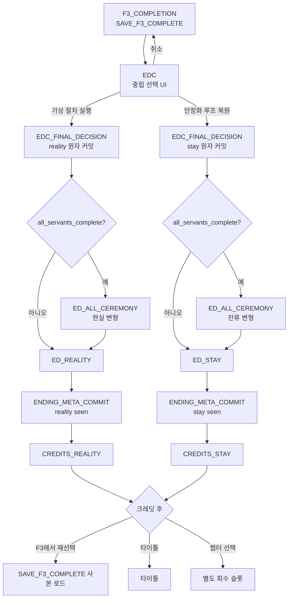
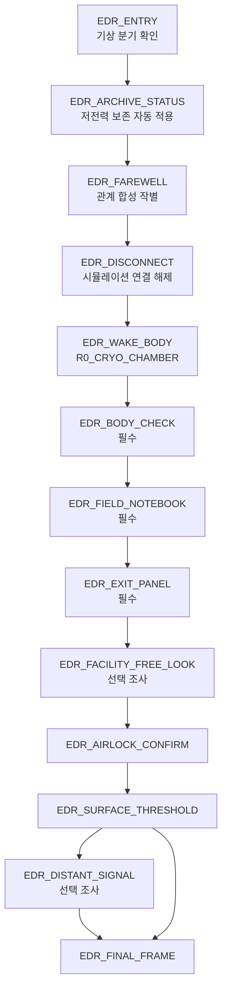
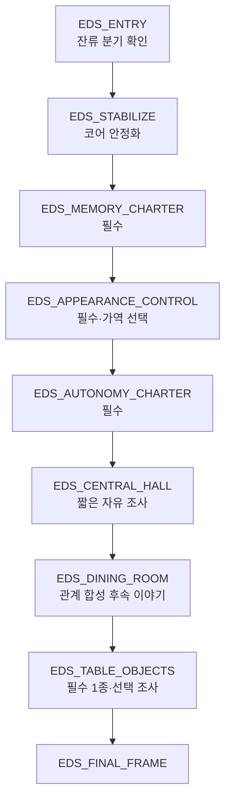

# GGB v0.4 이벤트 상세 09: 엔딩

## 1. 문서 목적

본 문서는 F3 완료 뒤 최종 선택을 확정하는 EDC와 두 엔딩 `ED_REALITY`, `ED_STAY`를 상호작용·대사·상태·감각·저장 단위로 정의한다.

담당 범위:

- EDC의 중립 UI, 취소, 원자 커밋과 중단 재개.
- `final_choice_relation`의 세 결과와 사용 범위.
- 관계 단계, 핵심 관계 outcome, bond·alert, 이리스·마라 2 특수 상태의 합성 순서.
- 현실 기상과 안정화 잔류의 제한형 포인트 앤 클릭 에필로그.
- 현실에 존재하는 물리적 비상 현장 수첩의 출처와 내용.
- 전원 완료 추가 장면의 비게이트 처리.
- 엔딩 크레딧, 재선택, 갤러리와 챕터 선택의 메타 진행.

담당하지 않는 범위:

| 항목 | 기준 문서 | 본 문서가 소비하는 출력 |
| --- | --- | --- |
| F0-E 임시 의향 퍼즐 | [08 메인 퍼즐](08_이벤트상세_03_메인퍼즐.md) | `f0_provisional_intent` |
| F2 필수 사실·F3 중립 조사 | [13 파열·전환·결산](13_이벤트상세_08_파열_전환_결산.md) | `F2_complete`, `F3_complete`, `final_sleep_lock` |
| 핵심 관계 본문·outcome | [12 사용인 핵심 관계](12_이벤트상세_07_사용인핵심관계.md) | E3 완료 플래그, `event_history.E3_X.outcome_id` |
| 색상 토큰·EDC 중립 수치 | [16 색상·UI·접근성](16_색상연출_UI_접근성규칙.md) | 서명 토큰, 포커스·대비 규칙 |
| 저장 스키마 | [17 상태·Godot 데이터](17_상태변수_이벤트ID_Godot데이터구조.md) | schema 10까지의 기존 상태 계약 |

### 1.1 설계 원칙

1. 현실은 용기 보상, 잔류는 도피 처벌로 판정하지 않는다.
2. 현실은 실제 신체와 환경을 얻지만 생존을 보장받지 못한다.
3. 잔류는 관계와 익숙한 감각을 유지하지만 시스템 수명과 감각 둔화가 불확실하다.
4. 관계·기록·outcome은 선택지의 존재, 엔딩 성공, 기본 포커스를 바꾸지 않는다.
5. F0-E 의향은 과거 마음의 기록이며 예약된 엔딩이 아니다.
6. 엔딩은 자동 컷신만으로 끝내지 않고 짧은 포인트 앤 클릭 후속 이야기로 마무리한다.
7. 엔딩 상호작용에는 오답, HARD FAILURE, 시간 제한, 숨은 세 번째 엔딩이 없다.
8. 주인공의 SUBJECT 권한은 흑연·종이·필기음으로, 사용인 인격은 색·문양·음향·명칭으로 구분한다.
9. 현실과 잔류 어느 쪽에서도 사용인 인격을 즉시 소멸시키는 선택을 강요하지 않는다.
10. 열린 결말은 정보 누락이 아니라 장기 결과를 확정하지 않는 방식으로 만든다.

### 1.2 이번 상세화 확정

| 안건 | 확정 |
| --- | --- |
| 엔딩 형식 | 각 8~15분의 제한형 포인트 앤 클릭 에필로그 |
| 핵심 상호작용 | 엔딩별 3개 필수, 3~5개 선택 조사 |
| 현실 수첩 | 시뮬레이션 수첩과 별개인 물리적 비상 현장 수첩 |
| 시뮬레이션 기록 이전 | 연결 해제 직전 마지막 인계 페이지를 물리 수첩의 빈 포켓에 출력 |
| 인격 보존 | 선택창 없이 저전력 보존 상태를 고지하고 자동 적용 |
| 잔류 세부 설정 | 진실 기억 유지·자율성 확대는 고정, 외형 표시 방식만 가역 선택 |
| ALL 장면 | EDC 확정 뒤 발생하는 실패 불가능한 의식 장면, 엔딩 게이트 아님 |
| 엔딩 재선택 | 크레딧 뒤 `SAVE_F3_COMPLETE` 사본으로 복귀하는 사용자 편의 기능 |

### 1.3 ID와 표시명

| 용도 | 시스템 ID | 화면 표시 |
| --- | --- | --- |
| 최종 선택 | `EDC` | 최종 선택 확인 |
| 현실 엔딩 | `ED_REALITY` | ED_A 현실 기상 |
| 잔류 엔딩 | `ED_STAY` | ED_B 안정화 잔류 |
| 전원 의식 | `ED_ALL_CEREMONY` | 이름 인증 |

`ED_A`, `ED_B`는 화면용 장 제목이다. 이벤트·저장·QA에서는 `ED_REALITY`, `ED_STAY`만 사용한다.

## 2. 전체 엔딩 구조



### 2.1 실행 구간

| 구간 | 입력 | 저장 | 스킵 |
| --- | --- | --- | --- |
| F3 완료 | 자유 조사·로그 | `SAVE_F3_COMPLETE` | 해당 없음 |
| EDC | 두 선택·취소·요약 재열람 | 확정 전 쓰기 없음 | 불가 |
| EDC 커밋 | 최종 확인 1회 | `SAVE_ENDING_BRANCH` | 불가 |
| ALL 의식 | 필기 추적 1회·대사 진행 | 노드 저장 | 재관람 시 요약 스킵 |
| 엔딩 에필로그 | 제한 이동·필수 3개·선택 조사 | 노드 단위 자동 저장 | 본 대사는 문장 단위, 전환은 재관람 시 가능 |
| 마지막 화면 | 확인 입력 없음 | 엔딩 seen 커밋 | 첫 관람 불가 |
| 크레딧 | 일시정지·속도·스킵 | 메타 진행 유지 | 3초 길게 누르기 |

### 2.2 에필로그 상호작용 원칙

- 플레이어는 지정된 2~4개 화면 사이만 이동한다.
- 필수 오브젝트는 포인트 앤 클릭 기본 동사 `본다`, `만진다`, `사용한다`로 처리한다.
- 같은 오브젝트 재조사는 1문장 후속 반응만 제공한다.
- 선택 오브젝트는 감각과 후일담을 보충하지만 엔딩 완료 조건에는 포함하지 않는다.
- 마지막 필수 상호작용 전에 `이 장면을 떠나면 남은 선택 조사를 볼 수 있다`는 식의 잘못된 경고를 띄우지 않는다. 마지막 상호작용 뒤에도 한 번 돌아볼 기회를 제공한다.
- `엔딩을 마친다` 확인은 두 분기 모두 같은 문구·위치·확인 횟수를 사용한다.

### 2.3 엔딩 합성 순서

엔딩 대사와 소품은 아래 순서로 합성한다.

```text
분기 공통 장면
→ settlement_tier 기본 구도
→ 완료 owner 개인 반응 또는 미완료 기능 반응
→ event_history outcome overlay
→ bond·alert 연기 강도
→ 이리스 고백 상태 / 마라 2 아카이브·이름 overlay
→ ALL 의식 여부
→ 분기 마지막 화면
```

뒤 단계는 앞 단계의 사실을 지우지 않는다. 예를 들어 마라 2 이름 overlay가 `archive_resolution`을 다시 계산하거나, 이리스 고백 상태가 E3_2 outcome을 대체하지 않는다.

## 3. EDC 최종 선택

### 3.1 기본 정보

| 항목 | 내용 |
| --- | --- |
| 이벤트 ID | `EDC` |
| 위치·시간 | `H0_CORE_CHAMBER`, F3 완료 직후 |
| 선행 조건 | `F3_complete`, `final_sleep_lock=true`, `subject_authority_restored`, `final_decision=unset` |
| 목표 | 현실 기상 또는 안정화 루프 복원을 자기 문장으로 확정 |
| 필수 | 예 |
| 실패 | 없음 |
| 취소 | `F3_COMPLETION`으로 복귀, 잠금·미확정 상태 유지 |
| 관계 변화 | 없음 |
| 출력 | `final_decision`, `final_choice_relation`, `SAVE_ENDING_BRANCH` |
| 예상 길이 | 1~3분 |

### 3.2 F3 인계와 중립 포커스

```text
F2 완료
→ F3_ENTRY: final_sleep_lock=true
→ 기상 장치·루프 안정화 장치·주인공 수첩 조사
→ F3_BALANCED_SUMMARY
→ SAVE_F3_COMPLETE
→ F3_complete=true
→ EDC
```

- 기본 포커스는 두 버튼 사이의 중앙 SUBJECT 표식이다.
- F3에서 마지막으로 본 장치와 `f0_provisional_intent`를 포커스·카메라·진동에 사용하지 않는다.
- 두 선택 버튼의 면적, 거리, 밝기, 확인 횟수, 위험 아이콘 수를 동일하게 한다.
- 사용인 색상은 선택 버튼 안에 넣지 않고 코어 외곽의 출처 표시로만 사용한다.

### 3.3 표시 정보

| 선택 | 확실함 | 불확실함 |
| --- | --- | --- |
| 기상 절차 실행 | 시뮬레이션 연결 해제, 현실 신체 기상 시도 | 외부 환경, 장기 생존, 연구원 인격의 장기 전력 |
| 안정화 루프 복원 | 저택·사용인·현재 기억 유지, 루프 제어권 반환 | 시설 수명, 감각 둔화, 외부 회복 기회 |

금지 문구:

```text
용기 있는 선택
안전한 선택
도망친다
진짜 세계
정답 엔딩
되돌릴 수 없는 실수
```

### 3.4 임시 의향과 최종 관계

| F0-E 의향 | 현실 선택 | 잔류 선택 |
| --- | --- | --- |
| `reality` | `reaffirmed` | `revised` |
| `stay` | `revised` | `reaffirmed` |
| `undecided` | `formed` | `formed` |

`final_choice_relation`은 EDC 직후 주인공의 한 문장만 바꾼다.

| 값 | 확인 독백 |
| --- | --- |
| `reaffirmed` | “그때 기울었던 쪽을 지금 선택한다.” |
| `revised` | “생각은 달라졌다. 지금의 선택은 이것이다.” |
| `formed` | “이제 정한다.” |

세 문장의 표시 시간, 음량, 필기 획수는 동일하다.

### 3.5 원자 커밋

```yaml
event_definition:
  event_id: EDC
  guards:
    all:
      - F3_complete
      - fracture_state.final_sleep_lock == true
      - subject_authority_restored
      - final_decision == unset
  inputs:
    provisional_intent: f0_provisional_intent
    selected_decision: reality_or_stay
  derive:
    final_choice_relation: compare_provisional_and_selected
  confirmation_transaction:
    atomic_group_id: EDC_FINAL_DECISION
    writes:
      - final_decision
      - final_choice_relation
      - ending_run.branch_committed
      - ending_run.branch_id
      - ending_run.current_node_id
    create_save_point: SAVE_ENDING_BRANCH
  forbidden_writes:
    - relationship_values
    - researcher_records
    - settlement_tier
    - f0_provisional_intent
```

커밋 중 종료되면 선택·관계·분기 필드를 모두 롤백하거나 모두 확정한다. `final_decision`만 있고 `final_choice_relation=unresolved`이거나 `branch_committed=true`인데 `branch_id=unset`인 상태는 허용하지 않는다.

### 3.6 취소와 재진입

- 선택 버튼을 누른 뒤 최종 실행 전까지 취소할 수 있다.
- 취소하면 선택 하이라이트와 임시 확인 문장을 폐기한다.
- `final_decision=unset`, `final_choice_relation=unresolved`, `final_sleep_lock=true`를 유지한다.
- EDC를 다시 열어도 이전에 잠시 고른 버튼을 기본 포커스로 사용하지 않는다.
- 커밋 뒤에는 EDC로 되돌아가지 않고 해당 엔딩 노드에서 재개한다.

## 4. 관계·개인 반응 합성

### 4.1 관계 단계 기본 구도

| 완료 수 | 단계 | 현실 기본 | 잔류 기본 |
| ---: | --- | --- | --- |
| 0~1 | LOW | 에드가의 운영 보고, 다른 사용인은 기능 채널로 참여 | 사용인은 주인공 양옆에 서고 업무 문장 유지 |
| 2~3 | MID | 완료한 인물이 직접 작별, 미완료 인물은 기능 지원 | 완료 인물만 착석, 미완료 인물은 역할 수행 |
| 4 | HIGH | 네 인물이 두려움과 축복을 각자 표현 | 네 인물이 같은 식탁에서 새 규칙에 참여 |
| 5 | ALL | 다섯 이름 인증 뒤 각자의 작별 | 다섯 이름 인증 뒤 공동 규칙 작성 |

LOW는 차갑고 나쁜 색, ALL은 밝고 좋은 색으로 연출하지 않는다. 차이는 인격이 자기 말로 참여하는 정도다.

### 4.2 owner 관계 완료·미완료 판정 규칙

엔딩 반응의 `관계 완료`와 `관계 미완료`는 엔딩 자체의 완료 여부가 아니라, **해당 owner의 핵심 관계 이벤트 완료 여부**를 뜻한다. `현실·관계 완료`라는 이름의 별도 저장 변수는 만들지 않고 아래 조건을 엔딩 진입 시 계산한다.

```text
현실·관계 완료
= final_decision == reality
AND ending_run.branch_committed == true
AND ending_run.branch_id == reality
AND servants.OWNER.core_event_complete == true

현실·관계 미완료
= final_decision == reality
AND ending_run.branch_committed == true
AND ending_run.branch_id == reality
AND servants.OWNER.core_event_complete == false

잔류·관계 완료
= final_decision == stay
AND ending_run.branch_committed == true
AND ending_run.branch_id == stay
AND servants.OWNER.core_event_complete == true

잔류·관계 미완료
= final_decision == stay
AND ending_run.branch_committed == true
AND ending_run.branch_id == stay
AND servants.OWNER.core_event_complete == false
```

| owner | 핵심 관계 이벤트 | 관계 완료 플래그 | 관계 미완료 조건 |
| --- | --- | --- | --- |
| `MARA1` | `E3_1` | `E3_1_complete` | `E3_1_complete == false` |
| `IRIS` | `E3_2` | `E3_2_complete` | `E3_2_complete == false` |
| `LUCA` | `E3_3` | `E3_3_complete` | `E3_3_complete == false` |
| `EDGAR` | `E3_4` | `E3_4_complete` | `E3_4_complete == false` |
| `MARA2` | `E3_5` | `E3_5_complete` | `E3_5_complete == false` |

각 `E3_X_complete`는 해당 `servants.OWNER.core_event_complete`, 유효한 `event_history.E3_X.outcome_id`, `REC_OWNER` 획득과 같은 완료 트랜잭션에서 일치해야 한다. 엔딩 반응 라우터는 `servants.OWNER.core_event_complete`를 대표 판정값으로 읽고, 다른 값은 저장 무결성 검증에 사용한다.

- 관계 완료 owner는 자신의 책임과 욕구를 1~3문장 직접 말한다.
- 관계 미완료 owner도 사라지지 않고 전문 기능을 수행한다.
- 관계 미완료 반응은 감정을 단정하지 않고 확인 가능한 행동만 보여 준다.
- `E3_4M`은 `E3_4_complete`와 `servants.EDGAR.core_event_complete`를 쓰지 않으므로 에드가의 관계 완료로 계산하지 않는다. 단, 기상·안정화에 필요한 운영 기능은 제공한다.
- 관계 완료 수와 무관하게 다섯 사용인의 시스템 채널은 엔딩에 모두 존재한다.

### 4.3 outcome overlay

| 사건·outcome | 현실 overlay | 잔류 overlay |
| --- | --- | --- |
| E3_1 `original_attribution` | 마라 1이 책임자명이 남은 감사 사본을 보존함에 넣음 | 삭제 금지 목록에 자기 이름과 책임자명을 남김 |
| E3_1 `protected_identifiers` | 식별자를 가린 사본과 원본 해시를 함께 보존 | 개인 식별자 보호 절차를 공동 규칙에 추가 |
| E3_2 `external_truth` | 이리스가 실제 계절 확인을 먼저 부탁 | 외부 센서값을 투영보다 먼저 표시 |
| E3_2 `shelter_projection` | 온실 투영을 끄는 스위치 권한을 넘김 | 투영·외부값을 나란히 표시하고 언제든 끌 수 있게 함 |
| E3_3 `full_disclosure` | 루카가 위험표 전부를 현실 수첩 인계 페이지에 전송 | 생명 유지 경고 전부를 공동 열람 |
| E3_3 `stabilize_first` | 안정화 완료 시각 뒤 위험표를 순서대로 전송 | 장치 안정 확인 뒤 같은 경고를 공개 |
| E3_4 `responsibility_recorded` | 에드가 감사 서명이 종료 로그에 남음 | 감금 결정을 운영 기록에서 삭제하지 않음 |
| E3_4 `authority_returned` | 빈 CUSTODIAN 슬롯과 SUBJECT 서명을 보여 줌 | 기상·취침의 최종 확인자를 주인공으로 고정 |
| E3_5 `merged` | 한 목소리의 마라 2가 인덱스를 닫음 | 돌아온 주석과 현재 기억을 한 인덱스로 유지 |
| E3_5 `separated` | 원본과 주석이 번갈아 작별 | 두 인덱스를 별도 보존하고 교차 링크 유지 |

outcome 누락·불일치는 일반 완료 반응을 사용하고 `ENDING_OUTCOME_INTEGRITY_WARNING`을 기록한다. 엔딩을 막지 않는다.

### 4.4 bond·alert 연기 강도

| 상태 | 연출 변화 | 금지 |
| --- | --- | --- |
| bond 0~1 | 공식 호칭, 소품을 직접 건네지 않음 | 인물 삭제 |
| bond 2~3 | 시선 유지, 개인 문장 1개 | 정보 추가 게이트 |
| bond 4~5 | 말끝의 망설임, 소품을 직접 건넴 | 엔딩 성공 보정 |
| alert 0~1 | 주인공 입력 뒤 한 걸음 물러남 | 위험 정보 생략 |
| alert 2~3 | 절차를 한 번 재확인 | 확인 횟수 증가 |
| alert 4~5 | 몸은 가까이 남지만 제어권은 건드리지 않음 | 선택 취소·강제 전환 |

EDC 확인 횟수는 어떤 수치에서도 1회다. `alert`의 재확인은 대사 연기이며 UI 입력을 늘리지 않는다.

### 4.5 사용인 공통 반응

| 사용인 | 현실·관계 완료 | 현실·관계 미완료 | 잔류·관계 완료 | 잔류·관계 미완료 |
| --- | --- | --- | --- | --- |
| 에드가 | 선택 권한을 주인공 명령으로 공식 확인 | 기상 절차 또는 안정화 보고만 수행 | 취침 권유를 명령이 아닌 질문으로 변경 | 기존 방송을 낮은 음성으로 반복 |
| 마라 1 | 현실 공구·수리 우선순위를 슴다체로 남김 | 마지막 먼지를 닦고 통로 확보 | 일부 얼룩을 날짜 기록으로 보존 | 저택 외피를 완전 복구하려 함 |
| 루카 | 호흡·관절·수분 회복 순서를 알려 줌 | 생체 수치만 읽고 장치 해제 | 차 온도를 매번 묻게 됨 | 같은 레시피를 유지 |
| 이리스 | 외부 계절과 센서값을 직접 확인해 달라고 부탁 | 외부 모델이 틀릴 수 있음을 경고 | 실제 센서·투영의 차이를 공개 | 이상적인 봄을 반복 |
| 마라 2 | 자신의 이름 또는 익명 인덱스를 기억 표식으로 남김 | 빠른 3음과 빈 한 음만 남김 | 초상화 이름표를 함께 바꾸는 놀이 제안 | 자기 이름표를 반복 확인 |

### 4.6 말투 기준 예시

에드가:

```text
“기상 절차를 승인했습니다. 이번 명령은 제가 아니라 아가씨께서 내린 것입니다.”
“내일의 취침 시각도 직접 정하시겠습니까?”
```

마라 1:

```text
“밖에 공구함이 있으면 13밀리부터 챙기십쇼. 아니, 다 챙기십쇼. 세상은 꼭 없는 규격부터 고장 납니다.”
“이 얼룩은 안 지울 겁니다. 기록임다. 제가 이런 말도 하네.”
```

루카:

```text
“처음 숨은... 깊게 쉬지 마세요. 짧게, 천천히... 제가 숫자를 셀게요.”
“차 온도는... 오늘은 직접 정해 주세요. 틀려도, 다시 데우면 되니까요...”
```

이리스:

```text
“우후후, 바깥의 계절은 제 정원과 다를 거예요. 이번에는 제가 아니라 당신이 먼저 보아 주세요.”
“봄을 남겨 둘까요? 실제 바람과 다르다는 표시는 지우지 않을게요.”
```

마라 2:

```text
“밖이 재미없으면 후기 남겨! 별 하나면 찾아갈 거야! ...찾아갈 수 있으면.”
“매일 이름표를 바꾸자! 네가 틀리면 내가 이기고, 내가 잊으면... 네가 알려 줘.”
```

## 5. 이리스·마라 2 특수 합성

### 5.1 이리스 고백 상태

`IRIS_ED_REALITY`, `IRIS_ED_STAY`는 엔딩 진입 시 같은 읽기 전용 `iris_confession_state` 계산기를 호출한다.

| 상태 | 현실 반응 | 잔류 반응 |
| --- | --- | --- |
| `inferred_only` | 계절 모델이 관측값이 아님을 경고 | 외부 센서값과 연출값 비교 UI 제공 |
| `denied` | 로그 해석은 부정하지만 기상을 방해하지 않음 | 해석은 부정하면서 계절 변경 권한 반환 |
| `withheld` | 감금 책임과 말하지 못한 부분을 남기고 작별 | 변경 이력을 전부 공개 |
| `indirect` | 주인공이 사라지길 바랐던 감정을 우회적으로 인정 | 계절 장치 중단권을 공동 규칙에 추가 |
| `direct_private` | 사적 고백을 공개 반복하지 않고 기억 여부만 확인 | 고백을 공동 규칙의 명분으로 이용하지 않음 |
| `public` | 다섯 인격 앞에서 바람과 책임을 인정 | 모두 앞에서 책임을 재확인하고 규칙 작성 |

엔딩 선택은 고백 상태를 높이거나 낮추지 않는다. 잔류는 용서, 현실은 처벌로 사용하지 않는다.

### 5.2 마라 2 아카이브·이름

| 조건 | 현실 | 잔류 |
| --- | --- | --- |
| E3_5 미완료 | 익명 보라 인덱스와 빈 한 음 | 이름표를 반복 확인, 마지막 3음 중 하나가 비어 있음 |
| `merged` | 한 목소리로 장난 뒤 마지막 음이 떨림 | 현재·주석을 한 인덱스로 유지 |
| `separated` | 원본·주석이 번갈아 “둘 다 기억해”라고 말함 | 두 액자를 별도 보존하고 위치 바꾸기 제안 |
| `mara2_name_written=true` | 현실 수첩 인계 페이지의 이름 필드 강조 | 수첩·아카이브 이름 필드 이중 저장 |

`E3_5_complete=true && archive_resolution=none`은 미완료 반응으로 숨기지 않고 저장 무결성 오류를 기록한다.

## 6. ED_ALL_CEREMONY 전원 완료 의식

### 6.1 배치 원칙

`ED_ALL_CEREMONY`는 EDC 원자 커밋 **뒤**, 각 엔딩 본문 **전**에 발생한다.

- `all_servants_complete=true`일 때만 재생한다.
- 선택지 해금, 엔딩 성공, `final_decision` 생성 조건이 아니다.
- 필기 추적에는 오답과 시간 제한이 없다.
- 입력 없이 4초가 지나면 접근성 자동 추적 옵션을 제안한다.
- 장면 중 종료하면 확정된 엔딩 분기와 의식 첫 미완료 인물부터 재개한다.

### 6.2 진행

1. 다섯 인격이 이름·문양·음향으로 자신을 인증한다.
2. 마라 2가 각 기록의 분산 백업 체크섬을 읽는다.
3. 에드가가 SUBJECT 권한이 CUSTODIAN 권한보다 높음을 다나까체로 확인한다.
4. 중앙 종이에 `이 선택은 주인공이 했다`라는 문장이 희미하게 나타난다.
5. 플레이어는 선을 따라 한 번 긋거나 자동 추적을 사용한다.
6. 문장은 엔딩을 허가하는 암호가 아니라 이미 확정된 선택의 서명으로 저장된다.

현실 변형에서는 다섯 색이 저전력 보존 인덱스로 접히고, 잔류 변형에서는 경계를 유지한 채 저택 각 방향으로 흩어진다.

### 6.3 상태 계약

```yaml
event_definition:
  event_id: ED_ALL_CEREMONY
  category: conditional_nonblocking
  auto_dispatch_when_guard: true
  required_for_ending_success: false
  guard:
    all:
      - all_servants_complete == true
      - ending_run.branch_committed == true
  effects:
    set_run_flag: all_ceremony_seen
  forbidden_effects:
    - final_decision
    - final_choice_relation
    - ending_success
    - relationship_changes
```

## 7. ED_REALITY 현실 기상

### 7.1 기본 정보

| 항목 | 내용 |
| --- | --- |
| 이벤트 ID | `ED_REALITY` |
| 선행 조건 | `final_decision=reality`, EDC 커밋 완료 |
| 공간 | `H0_CORE_CHAMBER → R0_CRYO_CHAMBER → R0_FACILITY_EXIT → R0_SURFACE_THRESHOLD` |
| 목표 | 연결을 해제하고 현실 신체로 일어나 시설 밖을 직접 확인 |
| 필수 상호작용 | 신체 상태 확인, 현실 수첩 확인, 출구 개방 |
| 선택 조사 | 캡슐 유리, 빈 보존대, 공구함, 환경 패널, 멀리 보이는 신호 |
| 실패 | 없음 |
| 관계 변화 | 없음 |
| 예상 길이 | 9~15분 |

`R0_*`는 시뮬레이션 저택이 아닌 현실 공간용 ID다. 2026-07-24 문서 05의 위치 레지스트리와 문서 17의 엔딩 데이터 계약에 등록했다.

### 7.2 공간 흐름



### 7.3 EDR_ARCHIVE_STATUS: 인격 저전력 보존

현재의 “코어 연결을 유지할지 묻는 선택창”은 사용하지 않는다.

화면 문구:

```text
RESIDENT 인격 아카이브: 저전력 보존으로 전환
즉시 삭제: 실행하지 않음
재접속 가능성: 시설 전력과 장치 상태에 따라 미확정
```

- 플레이어는 내용을 펼쳐 볼 수 있지만 보존·삭제를 고르지 않는다.
- 저전력 보존은 주인공이 새로운 윤리적 생사 결정을 떠안지 않게 하는 기본 안전 절차다.
- 현실에서 다시 접속하거나 인격을 다른 매체로 옮길 수 있는지는 확정하지 않는다.
- LOW에서도 다섯 인격 채널을 보존한다.

### 7.4 EDR_DISCONNECT: 감각 전환

```text
가상 난로의 열기 소실
→ 귀 안쪽의 낮은 압력
→ 혀의 금속 맛
→ 눈꺼풀을 실제로 들어 올리는 무게
→ 짧고 얕은 첫 호흡
```

- 검은 화면은 최대 4초다.
- 첫 호흡은 자동 성공하며 버튼 연타 QTE를 사용하지 않는다.
- 루카의 음성 안내가 있는 경우에도 플레이어 성패를 판정하지 않는다.
- 화면 흔들림은 호흡 1회에 0.2초 이하이며 멀미 감소에서는 제거한다.

### 7.5 EDR_BODY_CHECK: 신체 상태 확인

| 항목 | 내용 |
| --- | --- |
| 위치 | `R0_CRYO_CHAMBER`, 열린 캡슐 안 |
| 필수 대상 | 손, 호흡 표시기, 고정 벨트 중 서로 다른 2개 |
| 완료 조건 | 고유 2종 확인 |
| 출력 | 조사한 대상 ID를 `ending_run.required_interactions_seen`에 기록하고 완료 시 `ending_run.completed_nodes += EDR_BODY_CHECK` |
| 반복 | 감각 후속 문장만 제공 |

상호작용:

| 대상 | 첫 반응 | 재조사 |
| --- | --- | --- |
| 손 | 손가락을 굽힐 때 통증과 느린 떨림. 피부는 화면 속 손보다 무겁다. | “아픈 만큼 움직였다.” |
| 호흡 표시기 | `짧게 3회 → 멈춤 → 길게 1회` 회복 안내 | “기계와 내 숨의 간격이 조금씩 달라진다.” |
| 고정 벨트 | 비상 해제 손잡이가 이미 반쯤 풀려 있음 | “누군가는 내가 혼자 풀 수 있게 남겨 두었다.” |

어떤 대상을 골라도 기상 성공 여부와 장기 후유증은 바뀌지 않는다.

### 7.6 현실의 물리적 비상 현장 수첩

현실 수첩은 시뮬레이션 수첩과 다른 물건이다.

| 구분 | 시뮬레이션 수첩 | 현실 비상 현장 수첩 |
| --- | --- | --- |
| 목적 | 주인공의 루프 관찰과 자기 문장 | 기상 후 생존·시설 운용·연구원 인계 |
| 생성 | 시뮬레이션 인터페이스 | 재난 전 종이·내습 필름으로 제작 |
| 작성자 | 주인공 중심 | 다섯 연구원 공동, 아버지의 짧은 서문 |
| 지속 방식 | 메타 진행 데이터 | 캡슐 하부 서랍의 물리 매체 |
| 외형 | 연필과 고딕 장정 | 방수 회색 표지, 교체 가능한 색인 탭 |
| 관계 | 별개 | 아버지가 표지 스캔을 시뮬레이션 UI 참고로 사용해 촉감만 희미하게 닮음 |

수첩 제목:

```text
현장 인계 01
기상자용 생존·시설 수첩
```

#### 수첩 구성

| 구역 | 작성자 | 내용 | 서사 기능 |
| --- | --- | --- | --- |
| 0. 서문 | 아버지 | 이 수첩을 읽는 사람이 직접 판단해야 한다는 짧은 문장 | 사과로 면죄하지 않고 부재와 책임을 남김 |
| 1. 첫 72시간 | 루카 | 호흡, 수분, 관절, 음식, 약품과 위험 징후 | 현실 기상이 낭만적 탈출이 아님을 구체화 |
| 2. 시설 살리기 | 마라 1 | 전력 우회, 펌프, 공구 규격, 임시 수리와 손글씨 정정 | 살아가는 법을 기술적이고 인간적으로 전달 |
| 3. 외부 읽기 | 이리스 | 공기·물·토양·빛·계절 센서 판독과 모델 불신 규칙 | 아름다운 풍경보다 검증을 우선 |
| 4. 운영 우선순위 | 에드가 | 생명 유지→통신→출입→보존 순서, 빈 명령 칸 | 통제 명령이 아니라 판단 순서를 넘김 |
| 5. 사람과 기록 | 마라 2 | 다섯 이름, 인격 아카이브 색인, 체크섬, 여백의 장난 | 사용인을 기능명이 아닌 사람으로 기억 |
| 뒤표지 | 공동 | `모르면 기록하고, 혼자 결정했다고 숨기지 말 것` | 연구팀의 실패를 반복하지 않는 원칙 |

아버지 서문은 다음 범위를 넘지 않는다.

```text
이 글을 읽고 있다면 내가 설명할 수 없는 시간이 지났을 것이다.
여기의 절차는 명령이 아니다. 살아남기 위한 자료다.
마지막 판단은 네가 한다.
```

아버지는 자신이 한 일을 용서해 달라고 쓰지 않는다. 연구원 전환의 책임과 상세 진실은 이미 F1·F2에서 확인했으므로 서문이 이를 덮지 않는다.

#### SUBJECT_HANDOFF_PAGE

연결 해제 직전 캡슐의 저속 프린터가 시뮬레이션의 마지막 인계 페이지를 내습 필름에 출력한다.

포함:

- `FINAL DECISION: REALITY`.
- 기상 시각과 캡슐 상태.
- F3에서 확인한 확실함·불확실함 요약.
- 완료한 연구원 기록의 출처 ID. 원문 전체는 출력하지 않는다.
- 주인공이 EDC에서 쓴 확인 문장의 필압 모양.

출력물은 현실 수첩 뒤표지 포켓에 끼워져 있다. 시뮬레이션 수첩 자체가 현실로 이동한 것이 아니다.

### 7.7 EDR_FIELD_NOTEBOOK: 수첩 상호작용

| 항목 | 내용 |
| --- | --- |
| 필수 | `FIELD_NOTEBOOK_COVER`, `FIELD_NOTEBOOK_FIRST_72_HOURS` |
| 선택 | 나머지 네 연구원 탭, 아버지 서문, SUBJECT 인계 페이지 |
| 완료 조건 | 표지 + 첫 72시간 |
| 출력 | 두 필수 ID를 `ending_run.required_interactions_seen`에 기록하고 완료 시 `ending_run.completed_nodes += EDR_FIELD_NOTEBOOK` |

첫 클릭에서 모든 내용을 긴 문서로 강제하지 않는다. 탭별 20~40초 요약과 확대 원문을 분리한다.

관계·outcome overlay:

- E3_1 outcome은 마라 1 수리 기록의 책임자 표기 방식에 반영.
- E3_2 outcome은 이리스 센서·투영 우선순위에 반영.
- E3_3 outcome은 루카 위험표 제시 순서에 반영.
- E3_4 outcome은 에드가 운영 기록의 감사 서명·권한 칸에 반영.
- E3_5 outcome은 마라 2 인덱스 병합·분리 방식에 반영.

### 7.8 EDR_EXIT_PANEL: 시설 출구

| 항목 | 내용 |
| --- | --- |
| 위치 | `R0_FACILITY_EXIT` |
| 필수 대상 | `EXIT_STATUS_POWER`, `EXIT_STATUS_AIR`, `EXIT_STATUS_MANUAL_RELEASE` |
| 완료 조건 | 세 상태를 한 번씩 확인 |
| 조작 | `출구 잠금 해제` 1회 |
| 실패 | 없음. 위험값은 사실로 표시되며 정답 입력 없음 |
| 출력 | 세 필수 ID를 `ending_run.required_interactions_seen`에 기록하고 완료 시 `ending_run.completed_nodes += EDR_EXIT_PANEL` |

표시 예:

```text
시설 전력: 제한
외기: 호흡 가능 범위 / 장기 노출 미검증
통신: 수신 신호 없음
문 개방: 수동 가능
```

### 7.9 현실 선택 조사

| 오브젝트 | 위치 | 반응 |
| --- | --- | --- |
| 캡슐 유리 | 냉각실 | 안쪽 손자국과 바깥 정비 자국의 시간이 다름 |
| 빈 보존대 | 냉각실 | 다른 사람이 있었는지, 단순 예비대인지 확정하지 않음 |
| 공구함 | 출구 | 마라 1 수첩 탭과 같은 규격 번호, 일부 칸은 비어 있음 |
| 말라붙은 투명 화분 | 출구 | 이리스 모델과 다른 실제 생장 실패 흔적 |
| 벽면 이름 목록 | 출구 | 다섯 연구원 이름과 읽을 수 없는 일부 이름 |
| 멀리 점멸하는 빛 | 지표 경계 | 사람·자동 장치·오류 중 무엇인지 확정하지 않음 |

빈 보존대와 점멸 신호는 숨은 생존자 정답을 암시하는 수집품으로 사용하지 않는다.

### 7.10 마지막 화면

주인공은 현실 수첩을 가슴에 끼우지 않고 한 손에 든다. 다른 손은 시설 문틀을 잡아 실제 바람의 압력을 확인한다.

필수 3종을 완료한 뒤 `밖을 본다`를 선택하면 마지막 자유 시점 8초를 제공한다. 플레이어가 움직이지 않아도 카메라는 자동으로 신호를 확대하지 않는다.

```text
ED_A 현실 기상
FINAL DECISION: REALITY
```

색보정 없는 회갈색 지표 위에서 현실 수첩의 젖은 흑연선만 선명하다. 주인공이 어디로 향하는지는 플레이어가 마지막으로 둔 시선 방향과 무관하게 확정하지 않는다.

## 8. ED_STAY 안정화 잔류

### 8.1 기본 정보

| 항목 | 내용 |
| --- | --- |
| 이벤트 ID | `ED_STAY` |
| 선행 조건 | `final_decision=stay`, EDC 커밋 완료 |
| 공간 | `H0_CORE_CHAMBER → M1_CENTRAL_HALL → M1_DINING_ROOM` |
| 목표 | 진실과 선택 권한을 유지한 채 새 루프 규칙을 확인 |
| 필수 상호작용 | 기억 원칙 확인, 외형 표시 선택, 사용인 자율성 확인 |
| 선택 조사 | 대시계, 차, 얼룩, 창밖 계절, 초상화 이름표 |
| 실패 | 없음 |
| 관계 변화 | 없음 |
| 예상 길이 | 9~15분 |

`S5_STABILIZED_FRACTURE`는 안정화된 엔딩 전용 설계 상태명이며 실제 `world_phase` 직렬화 값은 `S5`다. 기존 문서의 `S4 코어`를 보존하기 위해 별도 단계로 분리한다. 새 위치 ID를 만들지 않고 기존 `M1_CENTRAL_HALL`, `M1_DINING_ROOM`을 재사용하되 오브젝트 반응 상태만 S5로 바뀐다.

### 8.2 공간 흐름



### 8.3 EDS_STABILIZE: 안정화 결과

```text
세계 상태: S5 STABILIZED FRACTURE
진실 기억: 유지
주인공 기상 권한: 유지
사용인 역할 강제: 완화
외부 센서 연결: 읽기 전용 유지
다음 수면: 주인공 확인 필요
```

- D5 이전 S0으로 돌아가지 않는다.
- SF 골격과 색상 서명을 완전히 숨기지 않는다.
- 정상 리셋은 복구되지 않고, 새로운 하루는 주인공 동의 뒤 상태를 보존한 채 시작한다.
- 엔딩 장면 안에서는 실제 다음 수면을 실행하지 않는다.

### 8.4 EDS_MEMORY_CHARTER: 기억 원칙

| 항목 | 내용 |
| --- | --- |
| 필수 | 예 |
| 상호작용 | 세 원칙을 펼쳐 읽고 `유지한다` 확인 |
| 실패 | 없음 |
| 출력 | `EDS_truth_memory_confirmed` |

고정 원칙:

1. 주인공은 저택이 시뮬레이션임을 기억한다.
2. 사용인은 연구원 인격과 감금 책임을 삭제하지 않는다.
3. 다음 수면·기상·기억 변경은 주인공의 명시적 확인 없이는 실행하지 않는다.

`진실된 기억을 지운다` 선택지는 제공하지 않는다. 이는 잔류를 다시 속는 상태로 만들지 않기 위한 서사 불변식이다.

### 8.5 EDS_APPEARANCE_CONTROL: 외형 표시 방식

이 선택은 가역적이며 엔딩 분기를 만들지 않는다.

| 선택 | 화면 | 정보 |
| --- | --- | --- |
| `layered` | 고딕 외피와 시설 골격이 동시에 얇게 보임 | 모든 문양·라벨 상시 표시 |
| `contextual` | 평소 고딕 외피, 조사 시 시설 골격 노출 | `FILTER: DISPLAY ONLY` 라벨 상시 표시 |

기본 포커스는 두 항목 사이에 둔다. 선택 뒤 `언제든 바꿀 수 있다`는 문구를 표시하며, 관계·결산·엔딩 해금에 영향을 주지 않는다.

### 8.6 EDS_AUTONOMY_CHARTER: 사용인 자율성

| 항목 | 내용 |
| --- | --- |
| 필수 | 예 |
| 조작 | 다섯 역할 강제 스위치를 `고정`에서 `제안`으로 전환 |
| 실패 | 없음 |
| 출력 | `EDS_servant_autonomy_confirmed` |

규칙:

- 사용인은 자기 주 공간과 휴식 시간을 선택할 수 있다.
- 전문 기능 경고는 계속 제공하지만 주인공의 이동을 자동 봉쇄하지 않는다.
- 에드가는 일정표를 제안할 수 있으나 확정하지 못한다.
- 어떤 사용인도 다른 사용인의 기억이나 이름을 단독 삭제하지 못한다.
- 미완료 관계라고 자율성 대상에서 제외하지 않는다.

### 8.7 EDS_CENTRAL_HALL: 같은 저택의 다른 규칙

필수 3개를 확인한 뒤 중앙홀에서 30~90초 자유 조사를 제공한다.

| 오브젝트 | 반응 |
| --- | --- |
| 대시계 | 열세 번째 칸이 숨지 않고 `XIII / MANUAL`로 표시 |
| 일정표 | 명령형 시간이 지워지고 빈칸과 제안 메모만 남음 |
| 현관문 | 외부 투영임을 알리는 프레임 라벨. 열면 정원까지만 이동 가능하다는 사실 표시 |
| 중앙 카펫 | 아래 시설 배선이 문양과 함께 보임 |
| 호출끈 | 사람을 부르는 대신 공용 통신 채널 선택 UI 표시 |

### 8.8 EDS_DINING_ROOM: 짧은 후속 이야기

식당은 기존 잔류 엔딩의 정면 구도를 유지하되, 관계 단계에 따라 행동과 좌석을 바꾼다.

| 단계 | 좌석·행동 |
| --- | --- |
| LOW | 주인공만 앉고 사용인은 양옆에 서지만, 퇴장·착석을 강제하지 않는 표시가 보임 |
| MID | 완료 인물만 자리에 앉고 미완료 인물은 자기 업무를 선택해 왕래 |
| HIGH | 네 인물이 앉고 한 인물의 빈 자리는 기능 패널이 아니라 이름표로 남음 |
| ALL | 다섯 인물이 각자 색과 이름을 유지한 채 앉음 |

필수 상호작용은 주인공 자리의 `수첩을 펼친다` 1개다. 이후 아래 사소한 오브젝트를 순서 없이 조사할 수 있다.

| 오브젝트 | owner | 완료 반응 | 미완료 반응 |
| --- | --- | --- | --- |
| 식탁의 지워지지 않은 얼룩 | 마라 1 | 날짜와 책임 기록으로 남김 | 닦으려다 주인공 시선을 보고 멈춤 |
| 매번 달라지는 차 | 루카 | 주인공이 온도를 고르고 루카가 다시 데울 수 있다고 말함 | 익숙한 온도지만 선택 UI는 열어 둠 |
| 창밖의 계절 | 이리스 | 실제 센서값과 투영 계절을 나란히 표시 | 이상적인 봄 옆에 `MODEL` 라벨 표시 |
| 초상화 이름표 | 마라 2 | 이름표 위치를 장난으로 바꾸되 원본 인덱스 유지 | 자기 이름표를 두 번 확인 |
| 내려놓은 레이피어 | 에드가 | 테이블에서 손이 닿지 않는 곳에 둠 | 곧게 세워 두지만 칼집 잠금은 해제 |

### 8.9 주인공 수첩 문장

주인공이 시뮬레이션 수첩의 새 페이지에 직접 쓴다.

```text
내일도 같은 날일 수 있다.
하지만 같은 선택일 필요는 없다.
```

이 문장은 자동으로 완성되지 않는다. 플레이어가 두 문장 중 하나를 먼저 눌러 써도 최종 배열은 동일하며 의미 우열을 만들지 않는다.

### 8.10 마지막 화면

마지막 시점은 식탁 정면이다. 과거처럼 양옆 사용인을 장식처럼 세운 구도를 2초 보여 준 뒤, 각 인물이 자신이 선택한 자리와 행동으로 움직인다.

- LOW에서도 미완료 인물의 이름과 이동 선택을 보여 준다.
- ALL에서도 완벽한 화음이나 밝은 백색으로 마무리하지 않는다.
- 난로 향 뒤에 금속 냄새가 남고, 새소리 뒤에 팬 회전음이 겹친다.
- 화면이 어두워질 때 색 서명은 섞여 하나가 되지 않고 각자 경계를 유지한다.

```text
ED_B 안정화 잔류
FINAL DECISION: STAY
```

## 9. 엔딩별 사용인 상세 반응

이 절의 `현실·관계 완료/미완료`와 `잔류·관계 완료/미완료`는 §4.2의 owner별 판정식을 따른다. 같은 플레이에서도 사용인마다 핵심 관계 이벤트 완료 여부가 다를 수 있으므로 서로 다른 반응 유형이 동시에 합성될 수 있다.

### 9.1 에드가

현실·관계 완료:

1. 종료 절차를 읽다가 `명령자: SUBJECT`에서 한 번 멈춘다.
2. 레이피어로 종료선을 긋지 않고 칼집을 테이블에 내려놓는다.
3. “이번 명령은 제가 아니라 아가씨께서 내린 것입니다.”

현실·관계 미완료:

- “기상 절차를 집행합니다, 아가씨.”
- 꼬리를 바닥에 고정하지만 절차를 중단하지 않는다.

잔류·관계 완료:

- 일정표의 명령 시각을 지우고 “내일의 취침 시각도 직접 정하시겠습니까?”라고 묻는다.
- `responsibility_recorded`면 과거 결정 로그를 삭제하지 않는다.
- `authority_returned`면 SUBJECT 칸을 주인공 쪽으로 돌려 둔다.

잔류·관계 미완료:

- 기존 방송을 반복하려다 `명령`을 `안내`로 한 번 고친다.
- E3_4M은 코어 접근 기능만 보장하며 친밀한 대사를 만들지 않는다.

### 9.2 마라 1

현실·관계 완료:

- 비상 수첩 공구 규격 탭을 펼치며 빠른 슴다체로 현실 수리 순서를 말한다.
- 마지막 농담 뒤 웃는 눈이 잠시 풀리고 스패너를 손잡이부터 건넨다.

현실·관계 미완료:

- 캡슐 출구의 먼지를 닦고 “통로 확보했슴다”라는 기능 보고만 남긴다.

잔류·관계 완료:

- 식탁 얼룩에 날짜를 적고 “기록임다”라고 선언한다.
- outcome에 따라 책임자명을 남기거나 식별자 보호 표식을 붙인다.

잔류·관계 미완료:

- 얼룩을 닦으려 세 번 손을 뻗지만, 주인공이 조사하면 네 번째에는 멈춘다.

### 9.3 루카

현실·관계 완료:

- 기상 직전부터 현실 첫 호흡까지 목소리가 이어진다.
- 신체 확인을 재촉하지 않고 숨 4회를 센다.
- `full_disclosure`면 위험 징후를 먼저, `stabilize_first`면 안정 수치 뒤 같은 위험을 말한다.

현실·관계 미완료:

- 심박·산소·냉각액 수치만 읽어 주지만 해제 절차를 숨기지 않는다.

잔류·관계 완료:

- 차 온도를 플레이어가 고르게 하고 “틀려도 다시 데우면 된다”고 말한다.

잔류·관계 미완료:

- 같은 차를 내지만 잔 옆에 온도 선택 패널을 켜 둔다.

### 9.4 이리스

이리스는 §5.1의 여섯 고백 상태를 우선 읽는다.

- 현실에서는 실제 계절·외부값을 주인공이 먼저 보게 한다.
- 잔류에서는 투영을 유지할 수 있어도 `MODEL` 라벨과 중단권을 숨기지 않는다.
- 웃음과 포근한 손짓은 남지만 책임 대사를 대신하지 않는다.
- 주인공이 잔류해도 과거 살의를 용서받았다고 말하지 않는다.
- 주인공이 떠나도 자신이 처벌받았다고 말하지 않는다.

### 9.5 마라 2

마라 2는 §5.2의 아카이브 상태와 이름 기록을 우선 읽는다.

- 현실에서는 농담의 마지막 박자에 망각 공포가 드러난다.
- 잔류에서는 영원성을 기쁨으로 과장한 뒤, 영원이라는 말이 무섭다고 짧게 인정한다.
- 미완료여도 P3B에서 배운 보라 문양·빠른 3음·겹친 액자 표식은 남는다.
- 어린 말투와 장난은 성적 뉘앙스 없이 이름·기억·천재적 허세에만 사용한다.

## 10. 감각·심리 연출

### 10.1 감정 곡선

| 구간 | 현실 | 잔류 |
| --- | --- | --- |
| EDC | 선택 직전 정적 | 선택 직전 정적 |
| 커밋 | 관계를 끊을 가능성의 공포 | 선택이 도피로 보일 가능성의 불안 |
| 초반 | 몸의 통증과 낯선 공기 | 익숙한 감각이 너무 쉽게 돌아오는 불신 |
| 중반 | 수첩의 타인 필기에서 혼자가 아님을 확인 | 규칙 변경에서 자신이 실제 권한자임을 확인 |
| 후반 | 바깥이 아무것도 약속하지 않음을 수용 | 같은 공간도 다른 규칙으로 살 수 있음을 시험 |
| 마지막 | 미확정 신호를 직접 바라봄 | 익숙함과 기계음의 공존을 받아들임 |

### 10.2 현실 감각

- 냄새: 먼지, 소독제 잔향, 오래된 금속, 마른 종이.
- 촉감: 무거운 손가락, 차가운 캡슐 가장자리, 축축한 수첩 표지.
- 소리: 불규칙한 호흡, 멀어진 팬음, 출구 수동 기어.
- 시각: 보정되지 않은 회갈색, 눈이 적응하며 뒤늦게 생기는 깊이.
- 심리: 통증을 살아 있음의 보상으로 찬양하지 않는다.

### 10.3 잔류 감각

- 냄새: 차와 난로 향 뒤의 금속 뒷맛.
- 촉감: 천 아래 남아 있는 시설 프레임의 단단함.
- 소리: 새소리 뒤 팬 회전, 식기음 사이 데이터 신호.
- 시각: 고딕 외피와 색 서명의 경계 유지.
- 심리: 편안함을 거짓이라고 부정하지 않되, 익숙함이 감각을 무디게 할 가능성을 남긴다.

### 10.4 연출 금지

- 현실 선택 직후 승리 음악과 백색 광원.
- 잔류 선택 직후 붉은 경고와 화면 폐쇄.
- 현실의 통증을 영웅적 시련으로 미화.
- 잔류 식탁에서 주인공의 표정·감각이 완전히 죽는 단정적 연출.
- 관계 HIGH·ALL에서 미완료 인물의 이름·색을 지움.
- 멀리 보이는 신호를 후속작 확정 떡밥처럼 확대.

## 11. UI·접근성

### 11.1 EDC 중립

| 항목 | 현실 | 잔류 | 허용 오차 |
| --- | ---: | ---: | ---: |
| 버튼 면적 | 100% | 100% | ±2% |
| 중심 거리 | 동일 | 동일 | ±4px |
| 확실함 정보 | 2~4줄 | 2~4줄 | ±1줄 |
| 불확실함 정보 | 2~4줄 | 2~4줄 | ±1줄 |
| 위험 아이콘 | 1 | 1 | 없음 |
| 확인 횟수 | 1 | 1 | 없음 |

### 11.2 엔딩 상호작용 접근성

- 필수 오브젝트는 색상 없이 윤곽·명칭·텍스트 상태로 구분한다.
- 화면 읽기 모드는 현재 공간, 필수 완료 수, 선택 조사 수를 분리해서 읽는다.
- 첫 호흡에 연타·길게 누르기·리듬 입력을 요구하지 않는다.
- 필기 추적은 자동 추적, 단일 클릭, 드래그 중 선택할 수 있다.
- 손 떨림·호흡 흔들림은 모션 감소에서 정적 가장자리 흐림으로 대체한다.
- 현실 수첩 탭은 요약 읽기와 원문 확대를 분리한다.
- 잔류 외형 선택은 색 대신 `동시 표시`, `조사 시 표시`라는 기능 문구를 사용한다.
- 크레딧은 일시정지, 2배속, 3초 스킵, 다시 보기를 제공한다.

### 11.3 음향 자막

| 소리 | 자막 |
| --- | --- |
| 현실 첫 호흡 | `[짧고 거친 숨]` |
| 캡슐 프린터 | `[느린 인쇄음: 한 줄씩]` |
| 외부 수동 기어 | `[금속 기어가 한 칸씩 풀림]` |
| 잔류 팬·새소리 | `[새소리 아래 일정한 팬 회전]` |
| 마라 2 빈 신호 | `[빠른 세 음 중 가운데 음이 비어 있음]` |
| 전원 인증 | `[다섯 신호가 섞이지 않고 차례로 응답]` |

## 12. 저장·재개·엔딩 후 처리

### 12.1 저장 지점

| 저장 ID | 시점 | 재개 |
| --- | --- | --- |
| `SAVE_F3_COMPLETE` | EDC 전 | F3 완료·EDC 개방 |
| `SAVE_ENDING_BRANCH` | EDC 원자 커밋 직후 | ALL 검사 또는 해당 엔딩 ENTRY |
| `SAVE_ENDING_NODE` | 필수 노드 완료 또는 선택 조사 갱신마다 | 다음 미완료 필수 노드 |
| `SAVE_ENDING_COMPLETE` | 마지막 화면 뒤·크레딧 전 | 엔딩 seen 메타가 반영된 크레딧 진입 |

### 12.2 실행 상태

```yaml
ending_run:
  branch_committed: false
  branch_id: unset
  current_node_id: null
  completed_nodes: []
  required_interactions_seen: []
  optional_interactions_seen: []
  all_ceremony_seen: false
  ending_appearance_mode: unset
  credits_started: false
  credits_completed: false

ending_meta:
  reality_seen: false
  stay_seen: false
  any_ending_seen: false
  gallery_unlocked: false
  chapter_select_unlocked: false
```

위 상태는 2026-07-24 문서 17에 동기화한 확정 계약이다. `ending_meta`는 본편 슬롯과 분리된 프로필 저장이다.

### 12.3 중단 재개

- EDC 커밋 전 종료: `SAVE_F3_COMPLETE`에서 재개, 선택 미확정.
- EDC 커밋 중 종료: 원자 트랜잭션 전체 롤백 또는 전체 완료.
- ALL 의식 중 종료: 확정 분기를 유지하고 첫 미완료 인증부터 재개.
- 현실 기상 전환 중 종료: 검은 화면이 아니라 `EDR_DISCONNECT` 시작에서 재개.
- 에필로그 중 종료: 완료한 필수 오브젝트는 다시 요구하지 않음.
- 마지막 화면 뒤 종료: 엔딩 seen 메타를 먼저 커밋한 뒤 크레딧 재개.

### 12.4 크레딧 뒤 메뉴

| 메뉴 | 기능 |
| --- | --- |
| F3에서 다른 선택 확인 | `SAVE_F3_COMPLETE` 사본 로드, 메타 seen 유지 |
| 엔딩 장면 다시 보기 | 이미 본 분기만 갤러리 재생 |
| 관계 회수 챕터 선택 | 본편과 별도 연습 슬롯, 메인 세이브 덮어쓰기 금지 |
| 타이틀로 | 현재 엔딩 완료 메타 저장 뒤 이동 |

재선택은 세계 내부의 시간 되감기가 아니라 사용자 편의 기능이라는 라벨을 표시한다. 보지 않은 엔딩의 이미지·대사·ALL 변형은 갤러리에서 숨긴다.

## 13. 이벤트·오브젝트 ID 목록

### 13.1 공통

```text
EDC
ED_ALL_CEREMONY
ENDING_META_COMMIT
CREDITS_REALITY
CREDITS_STAY
```

### 13.2 현실

```text
EDR_ENTRY
EDR_ARCHIVE_STATUS
EDR_FAREWELL
EDR_DISCONNECT
EDR_WAKE_BODY
EDR_BODY_CHECK
EDR_FIELD_NOTEBOOK
EDR_EXIT_PANEL
EDR_FACILITY_FREE_LOOK
EDR_AIRLOCK_CONFIRM
EDR_SURFACE_THRESHOLD
EDR_DISTANT_SIGNAL
EDR_FINAL_FRAME
```

필수 흐름에서 사용하는 오브젝트·상호작용:

```text
OBJ_REALITY_HAND
OBJ_REALITY_BREATH_MONITOR
OBJ_REALITY_RESTRAINT
OBJ_REALITY_FIELD_NOTEBOOK
FIELD_NOTEBOOK_COVER
FIELD_NOTEBOOK_FIRST_72_HOURS
OBJ_REALITY_EXIT_PANEL
EXIT_STATUS_POWER
EXIT_STATUS_AIR
EXIT_STATUS_MANUAL_RELEASE
```

### 13.3 잔류

```text
EDS_ENTRY
EDS_STABILIZE
EDS_MEMORY_CHARTER
EDS_APPEARANCE_CONTROL
EDS_AUTONOMY_CHARTER
EDS_CENTRAL_HALL
EDS_DINING_ROOM
EDS_TABLE_OBJECTS
EDS_FINAL_FRAME
```

필수 오브젝트:

```text
OBJ_STAY_MEMORY_CHARTER
OBJ_STAY_APPEARANCE_CONTROL
OBJ_STAY_AUTONOMY_CHARTER
OBJ_STAY_NOTEBOOK
```

### 13.4 사용인 반응

```text
EDGAR_ED_REALITY
EDGAR_ED_STAY
MARA1_ED_REALITY
MARA1_ED_STAY
LUCA_ED_REALITY
LUCA_ED_STAY
IRIS_ED_REALITY
IRIS_ED_STAY
MARA2_ED_REALITY
MARA2_ED_STAY
```

`SERVANT_ED_*` 그룹 별칭은 구현 리소스 ID로 사용하지 않고 위 10개 ID로 분리한다.

## 14. QA 시나리오

### 14.1 EDC

| QA ID | 시나리오 | 기대 결과 |
| --- | --- | --- |
| `QA-ED-EDC-01` | reality→reality | reaffirmed, ED_REALITY |
| `QA-ED-EDC-02` | reality→stay | revised, ED_STAY |
| `QA-ED-EDC-03` | stay→reality | revised, ED_REALITY |
| `QA-ED-EDC-04` | stay→stay | reaffirmed, ED_STAY |
| `QA-ED-EDC-05` | undecided→reality | formed, ED_REALITY |
| `QA-ED-EDC-06` | undecided→stay | formed, ED_STAY |
| `QA-ED-EDC-07` | 선택 뒤 취소 | F3 복귀, unset·unresolved·sleep lock 유지 |
| `QA-ED-EDC-08` | 커밋 각 쓰기 단계 종료 | 전부 롤백 또는 전부 완료 |
| `QA-ED-EDC-09` | F0 의향 3종 비교 | 버튼·카메라·정보량 동일 |

### 14.2 관계 합성

| QA ID | 시나리오 | 기대 결과 |
| --- | --- | --- |
| `QA-ED-REL-00` | 완료 0명 | LOW, 다섯 기능 채널, 두 엔딩 진입 |
| `QA-ED-REL-01` | 완료 1명 | LOW + owner 반응 1개 |
| `QA-ED-REL-02` | 완료 2명 | MID |
| `QA-ED-REL-03` | 완료 3명 | MID |
| `QA-ED-REL-04` | 완료 4명 | HIGH, 미완료 이름 유지 |
| `QA-ED-REL-05` | 완료 5명 | ALL 의식 뒤 선택된 엔딩 |
| `QA-ED-REL-06` | E3_4M만 수행 | 에드가 미완료 반응, 엔딩 기능 정상 |
| `QA-ED-REL-07` | 10개 outcome 각각 | 대사·소품만 변경, 분기·등급 불변 |
| `QA-ED-REL-08` | bond·alert 경계값 | 연기 강도만 변경, 확인 횟수 동일 |

### 14.3 현실

| QA ID | 시나리오 | 기대 결과 |
| --- | --- | --- |
| `QA-ED-R-01` | LOW 현실 기상 | 다섯 인격 저전력 보존, 필수 3단계 진행 |
| `QA-ED-R-02` | 호흡 입력 없음 | 자동 성공, QTE 없음 |
| `QA-ED-R-03` | 신체 오브젝트 같은 것 반복 | 고유 수 증가 없음 |
| `QA-ED-R-04` | 현실 수첩 최소 확인 | 표지+72시간 탭으로 진행 가능 |
| `QA-ED-R-05` | 모든 수첩 탭 확인 | 관계·outcome overlay 정확 |
| `QA-ED-R-06` | 시뮬레이션 수첩과 현실 수첩 비교 | 별도 물건임이 명시됨 |
| `QA-ED-R-07` | 선택 조사 전부 생략 | 마지막 화면 진입 가능 |
| `QA-ED-R-08` | 점멸 신호 조사 | 정체 미확정, 수집 보상 없음 |

### 14.4 잔류

| QA ID | 시나리오 | 기대 결과 |
| --- | --- | --- |
| `QA-ED-S-01` | LOW 잔류 | 진실 기억·자율성 동일 적용 |
| `QA-ED-S-02` | layered 선택 | 동시 표시, 분기·관계 불변 |
| `QA-ED-S-03` | contextual 선택 | 조사 시 표시, MODEL/FILTER 라벨 유지 |
| `QA-ED-S-04` | 외형 선택 변경 | 같은 엔딩 안에서 가역적 |
| `QA-ED-S-05` | 식탁 선택 조사 생략 | 수첩 필수 반응 뒤 완료 가능 |
| `QA-ED-S-06` | 미완료 5명 | 이름·자율성 유지, 기능 반응 출력 |
| `QA-ED-S-07` | 전원 완료 | 다섯 착석·경계 유지, 완벽 낙원 연출 없음 |

### 14.5 특수 상태·접근성·저장

| QA ID | 시나리오 | 기대 결과 |
| --- | --- | --- |
| `QA-ED-IRIS-01` | 이리스 6상태 | 두 엔딩에서 같은 계산값 소비 |
| `QA-ED-M2-01` | E3_5 미완료 | 익명 fallback, 진행 차단 없음 |
| `QA-ED-M2-02` | merged·separated | 두 엔딩이 같은 보존 결과 읽음 |
| `QA-ED-M2-03` | name_written | 이름 overlay만 추가 |
| `QA-ED-A11Y-01` | 색 제거+음량 0 | 모든 필수 상호작용 완료 |
| `QA-ED-A11Y-02` | 모션 감소 | 호흡·전환 의미 유지 |
| `QA-ED-A11Y-03` | 자동 필기 | ALL 의식·EDC 확인 진행 가능 |
| `QA-ED-SAVE-01` | ALL 의식 중 종료 | 선택 유지, 첫 미완료 인증 재개 |
| `QA-ED-SAVE-02` | 에필로그 중 종료 | 완료 오브젝트 보존, 다음 노드 재개 |
| `QA-ED-META-01` | 첫 엔딩 완료 | 본 엔딩 갤러리·챕터 선택 해금 |
| `QA-ED-META-02` | F3 재선택 | 본편 슬롯 불변, seen 메타 유지 |

## 15. 소프트락·악용 방지

| 위험 | 대처 |
| --- | --- |
| EDC 취소 뒤 수면 우회 | FINAL_SLEEP_LOCK 유지 |
| 관계값으로 선택지 잠금 | EDC가 관계값을 읽지 않음 |
| ALL 의식이 새 게이트가 됨 | EDC 커밋 뒤 배치, 오답·조건 쓰기 없음 |
| 현실 인격 보존이 숨은 세 번째 선택이 됨 | 상태 고지 후 자동 저전력 보존 |
| 첫 호흡 QTE 실패 | 입력 없는 자동 성공 |
| 현실 수첩 장문 강제 | 표지+72시간 요약만 필수, 나머지 선택 |
| 잔류 외형 선택이 선악 분기화 | 가역 표시 설정, 엔딩 상태 불변 |
| 미완료 인물 소실 | 다섯 기능 채널·이름 항상 유지 |
| 크레딧 스킵으로 seen 누락 | 마지막 화면 뒤 메타 선커밋 |
| F3 재선택이 세계 내 되감기로 오인 | 사용자 편의 라벨과 사본 슬롯 |

## 16. 완료 기준

- [x] EDC 여섯 경로와 취소·원자 커밋이 정의됨.
- [x] 관계 단계·owner·outcome·bond·alert 합성 순서가 정의됨.
- [x] 이리스 6상태와 마라 2 보존·이름 overlay가 분리됨.
- [x] ALL 의식이 엔딩 게이트가 아닌 확정 후 장면으로 정의됨.
- [x] 현실 엔딩 필수 3종·선택 조사·현실 수첩이 정의됨.
- [x] 현실 수첩과 시뮬레이션 수첩의 차이와 인계 페이지가 정의됨.
- [x] 잔류 엔딩 필수 3종·가역 외형 선택·식탁 후속 이야기가 정의됨.
- [x] 사용인 5명의 완료·미완료 반응과 말투 예시가 정의됨.
- [x] 감각·심리·접근성·저장·크레딧·QA가 정의됨.

## 17. 후속 동기화 작업

2026-07-24에 아래 후속 동기화를 완료했다. 기존 `S4 코어`와 잔류 엔딩 상태의 충돌은 S4를 보존하고 잔류를 `S5_STABILIZED_FRACTURE`로 분리해 해결했다.

| 대상 | 후속 반영 | 상태 |
| --- | --- | --- |
| `02_루프_관계_기억_색상서명시스템.md` | S4 코어 보존, S5 안정화 파열 단계 추가 | 완료 |
| `03_전체이벤트흐름도.md` | ALL 의식의 EDC 커밋 후 배치, 현실·잔류 제한형 에필로그 노드 | 완료 |
| `04_전체이벤트리스트_상태표.md` | `SERVANT_ED_*` 폐기, 10개 반응 ID와 EDR·EDS·메타 이벤트 등록 | 완료 |
| `05_공간구성지도_및_동선.md` | 세 `R0_*` 위치, 기존 중앙홀·식당의 S5 상태 동선 | 완료 |
| `13_이벤트상세_08_파열_전환_결산.md` | F3→EDC 원자 커밋→ALL 의식→엔딩 ENTRY 인계 | 완료 |
| `15_이벤트상세_10_공통오브젝트반응.md` | 현실·잔류 엔딩 오브젝트의 초회·반복·선택 반응 | 완료 |
| `16_색상연출_UI_접근성규칙.md` | 엔딩 필기·호흡·현실 수첩·S5 외형 선택 접근성 | 완료 |
| `17_상태변수_이벤트ID_Godot데이터구조.md` | `ending_run`·`ending_meta`·새 ID·저장 지점·schema 11 | 완료 |
| `00`, `README`, `18` | 현실 수첩, 상호작용형 에필로그, ALL 비게이트 요약 | 완료 |

동기화 뒤 기준 우선순위:

```text
사용자 최신 확정
→ 00~13 선행 계약과 S4 코어
→ 본 문서 14 엔딩 상세와 S5 잔류 상태
→ 15~17 구현 보조 계약
→ 18 통합 요약
```
