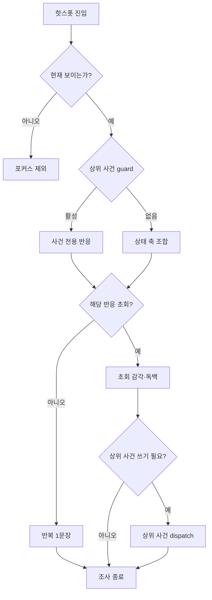

# GGB v0.4 이벤트 상세 10: 공통 오브젝트 반응

## 1. 목적

공통 오브젝트는 같은 공간을 반복 방문할 때 세계 상태, 주인공의 심리, 사용인 기억이 달라졌음을 짧게 보여 준다. 퍼즐 정답을 대신하지 않고 조사 밀도를 유지한다.

본 문서는 다음 내용을 소유한다.

- 오브젝트의 canonical ID와 위치.
- 상태별 가시성·핫스폿·초회·반복 조사 반응.
- 주인공의 짧은 내적 독백과 촉각·청각·공간 감각.
- 수첩 기록 여부와 반복 조사 피로 방지.
- 색을 제거해도 유지되는 문양·명칭·음향·텍스트 단서.
- 오브젝트 반응의 우선순위, 저장 범위, RESET 이후 처리.

본 문서는 다음 내용을 소유하지 않는다.

- 메인 퍼즐 정답과 실패 판정. 문서 `08`을 따른다.
- J1~J5의 실제 복원 본문과 지식 단계. 문서 `09`를 따른다.
- 잠금·해금과 이동 가능 여부. 문서 `10`을 따른다.
- 사용인 짧은 반응과 관계값 변화. 문서 `11`, `12`를 따른다.
- D5~F3의 사건 성공·완료 조건. 문서 `13`을 따른다.
- 엔딩 분기·완료·메타 저장. 문서 `14`, `17`을 따른다.

충돌 시 `04 → 해당 사건 상세 문서 → 15 → 17 구현 보조 계약` 순서로 판정한다. 15는 상위 사건의 결과를 바꾸지 않고 표현과 조사 경험만 구체화한다.

## 2. 상태 기준

| 상태 | 구간 | 반응 방향 |
| --- | --- | --- |
| S0 정상 저택 | P | 익숙하고 부드러운 감각 |
| S1 반복 | A~B | 미세한 시간·위치 모순 |
| S2 금지 | C~D4 | 고딕 표면 아래 기계성 |
| S3 파열 | D5~E | 물성과 데이터의 동시 노출 |
| S4 코어 | F | 기능·소유권·기록 출처 중심 |
| S5 안정화 파열 | ED_STAY | 진실·시설 골격·선택된 고딕 외피 공존 |

### 2.1 상태 축 분리

`world_phase`만으로 반응을 선택하지 않는다. 같은 S3에서도 E1 직후, E3 수리 전후, E5 결산 뒤의 물리 상태가 다르기 때문이다.

| 축 | 허용 예 | 책임 |
| --- | --- | --- |
| `world_phase` | S0~S5 | 저택 외피·시설 골격·데이터 노출 수준 |
| `story_phase` | P, A, B, C, D, E, F, ED | 현재 서사 구간 |
| `event_context` | B2, C4, E3_2, F3, EDR, EDS | 활성 사건 전용 반응 |
| `object_state` | intact, moved, broken, repaired, locked, unlocked | 물리·기능 상태 |
| `knowledge_state` | unknown, observed, verified, authenticated | 주인공이 표현을 이해하는 정도 |
| `owner_overlay` | none, EDGAR, MARA1, LUCA, IRIS, MARA2 | 사용인 기억·outcome에 따른 감정 주석 |
| `visit_state` | unseen, first_seen, repeated | 초회·반복 조사 |

선택 순서:

```text
활성 event_context
→ object_state
→ world_phase
→ knowledge_state
→ owner_overlay
→ visit_state
→ 기본 fallback
```

상위 축에 맞는 반응이 없으면 가장 가까운 하위 반응으로 내려간다. S3 전용 문구가 없다고 S2 문구를 임의로 재생하지 않고, 오브젝트별 `fallback_reaction_id`를 명시한다.

## 3. 공통 구현 규칙

각 반응 데이터는 다음 필드를 가진다.

```yaml
object_reaction:
  reaction_id: REACT_ARCHIVE_PORTRAIT_S2_FIRST
  object_id: OBJ_ARCHIVE_PORTRAIT_01
  location_id: M1_PORTRAIT_STORAGE
  interaction_role: INFO_RECORD
  world_phase: S2
  story_phase: C
  event_context: null
  required_object_state: intact
  required_knowledge: observed
  prerequisite_flags: [CLR_02_COMPLETE]
  priority: 30
  first_text_id: TXT_ARCHIVE_PORTRAIT_S2_FIRST
  repeat_text_id: TXT_ARCHIVE_PORTRAIT_S2_REPEAT
  sensory_profile_id: SENSE_ARCHIVE_FRAME_DOUBLE_EDGE
  sensory_audio_id: archive_trill_broken
  color_signature_ids: [purple_archive]
  accessibility_cue_ids: [CUE_STACKED_FRAME, CUE_ARCHIVE_OWNER_LABEL]
  notebook_entry_id: null
  persistence: per_state
  writes: []
  forbidden_writes: [bond, alert, final_decision, puzzle_result]
  fallback_reaction_id: REACT_ARCHIVE_PORTRAIT_BASE
```

- 최초 반응 1~3문장, 반복 반응 1문장.
- 메인 퍼즐 진행 중에는 핵심 단서 반응을 우선한다.
- 색상 이름만 쓰지 않고 문양·소리·텍스트 소유자 중 둘 이상을 병기한다.
- 관계값은 일반 오브젝트 반응에서 변하지 않는다.
- 필요한 경우에만 수첩 자동 기록 아이콘을 표시한다.

### 3.1 오브젝트 역할

| 역할 | 기능 | 진행 상태 쓰기 |
| --- | --- | --- |
| `SYSTEM_GATE` | 수면·전환·확인창 | 상위 시스템 이벤트에 위임 |
| `MAIN_PUZZLE` | 퍼즐 입력·결과 표시 | 문서 08 사건에 위임 |
| `INFO_RECORD` | 일지·수첩·기록 출처 | 문서 09 지식 시스템에 위임 |
| `NAVIGATION_LOCK` | 문·걸쇠·패널·숏컷 | 문서 10 잠금 시스템에 위임 |
| `AMBIENT` | 공간 분위기와 상태 변화 | 없음 |
| `RELATION_OVERLAY` | owner의 기억·감정 주석 | 읽기 전용 |
| `ENDING_REQUIRED` | 엔딩 필수 상호작용 | `ending_run`에 위임 |
| `ENDING_OPTIONAL` | 짧은 후속 이야기 | 선택 조사 Set만 기록 |

### 3.2 반응 우선순위

한 번의 클릭이 여러 반응을 만족하면 다음 중 가장 높은 한 개를 본문으로 재생한다. 낮은 반응은 같은 클릭에 이어 붙이지 않는다.

```text
100 필수 메인 전환·안전 확인
90  현재 활성 퍼즐 입력·성공·실패
80  잠금·해금·숏컷 결과
70  핵심 관계 이벤트 전용 조사
60  처음 보는 짧은 관계 반응
50  실패 정보·영구 정보 대조
40  월드 상태 최초 발견
30  owner·색상 서명 오버레이
20  반복 요약·힌트
10  기본 오브젝트 반응
```

- 우선순위 100~70은 상위 사건 완료 전까지 기본 반응을 가린다.
- 우선순위 60~30은 `pending_reactions` 자동 대화를 대신하지 않는다. 클릭한 오브젝트 안에서만 소비한다.
- 반복 클릭으로 더 높은 사건을 재실행하지 않는다.
- 관계 이벤트 완료 뒤에는 관계 결과를 재적용하지 않고 outcome 요약만 보여 준다.

### 3.3 표시·입력 규칙

- 기본 핫스폿 수는 방 하나당 4~7개다.
- 필수 핫스폿은 첫 진입 20초 안에 시야 또는 포커스 이동으로 발견 가능해야 한다.
- 장식용 반응은 필수 오브젝트보다 강한 발광·진동·자동 카메라를 사용하지 않는다.
- 클릭 가능한 작은 부품은 부모 오브젝트를 먼저 선택한 뒤 확대 화면에서 고른다.
- 모바일·패드 포커스 기준 최소 선택 영역은 화면 높이의 4%다.
- 오브젝트 이름은 첫 조사 전에는 세계관식 명칭, 기능 인증 뒤에는 세계관식 명칭과 시스템 라벨을 함께 표시한다.

### 3.4 저장·RESET 규칙

| 데이터 | NORMAL_RESET | BROKEN_RESET_ONCE | POST_BROKEN_REST | 엔딩 재개 |
| --- | --- | --- | --- | --- |
| 물리 위치·파손 | S0 기준 복원 | S3 기준 1회 생성 | 유지 | 분기별 유지 |
| 초회 반응 | 영구 정보면 유지, 일상 반응은 재생 가능 | 유지 | 유지 | 유지 |
| 반복 횟수 | 루프별 초기화 | E구간 기준 초기화 | 유지 | 유지 |
| 수첩 항목 | 유지 | 유지 | 유지 | 현실 수첩과 별도 |
| owner overlay | 사용인 기억에서 재계산 | 재계산 | 재계산 | outcome에서 재계산 |
| 선택 조사 Set | 일반 조사 초기화 | 해당 없음 | 유지 | `ending_run` 유지 |

`POST_BROKEN_REST`는 S3 장면을 다시 만들지 않는다. 수리된 장치, 옮긴 도구, 열린 기능문과 사용인 현재 위치를 그대로 둔다.

### 3.5 금지 효과

일반 오브젝트 반응은 다음 값을 쓰지 않는다.

```text
bond
alert
core_event_complete
researcher_record_acquired
puzzle_result
journal_stage
final_decision
final_choice_relation
settlement_tier
ending_meta
```

해당 값이 바뀌어야 하는 경우 오브젝트는 상위 사건 ID를 dispatch하고 결과를 기다린다.

## 4. 침실

### 침대

| 필드 | 값 |
| --- | --- |
| object_id | `OBJ_BEDROOM_BED` |
| location_id | `M2_BEDROOM` |
| 역할 | `SYSTEM_GATE`, E1 조사 대상 |
| 상위 사건 | P6, NORMAL_SLEEP, D6, E1, POST_BROKEN_REST, FINAL_SLEEP_LOCK |

| 상태 | 상호작용·반응 |
| --- | --- |
| S0 | “오늘도 같은 높이로 폭신하다.” 취침 튜토리얼 제공 |
| S1 | 매트리스 함몰 위치가 전날과 정확히 같음 |
| S2 | 천 아래 단단한 캡슐 곡면과 약한 팬 진동 감지 |
| S3 | 고딕 침대 외피가 깜박이며 냉각 캡슐 고정구 노출 |
| S4 | `SUBJECT REST INTERFACE` 라벨과 현재 생체 신호 표시 |

실패·힌트·구현:

- 취침 전 확인창에서 초기화/유지 항목을 요약한다.
- `camouflage_filter_state=ACTIVE`면 NORMAL_SLEEP로 분기한다.
- D5 완료 뒤 `DISABLED` 상태의 최초 수면만 FRACTURE_SLEEP로 분기한다.
- `BROKEN` 상태의 이후 휴식은 POST_BROKEN_REST로 분기하고 현재 수리·물리 상태를 유지한다.
- F3_ENTRY 이후 `final_sleep_lock=true`면 취침 대신 “지금 잠들면 선택이 사라지는 것이 아니라, 선택할 수 없게 된다.”를 표시하고 코어 조사로 돌아간다.
- 감각은 천의 온도, 진동, 체중 압력으로 표현한다.

### 창문

object_id는 `OBJ_BEDROOM_WINDOW`, location_id는 `M2_BEDROOM`이다.

| 상태 | 반응 |
| --- | --- |
| S0 | 고정된 정원과 맑은 공기 |
| S1 | 구름과 새가 같은 18초 경로 반복 |
| S2 | 유리 가장자리에서 C5 회로 진동점 발견 |
| S3 | 창밖 배경 레이어와 외부 센서값이 따로 표시 |
| S4 | 실제 외부 영상은 `SIGNAL DEGRADED` |

색상 반응:

- 이리스의 흰 꽃잎은 날씨 연출 소유권만 표시한다.
- 실제 센서 정답은 유리 진동과 텍스트 수치로 확인한다.

### 수첩

시뮬레이션 수첩의 object_id는 `OBJ_SUBJECT_NOTEBOOK_SIM`, 기본 위치는 `M2_BEDROOM`이나 영구 정보 UI로 휴대 가능하다. 현실 수첩 `OBJ_REALITY_FIELD_NOTEBOOK`과 데이터·외형·저장 위치가 다르다.

| 상태 | 반응 |
| --- | --- |
| S0 | 빈 여백과 연필 압흔 |
| S1 | A1 표시가 리셋 뒤에도 유지 |
| S2 | 일지 복원·퍼즐 검증 부분 축적 |
| S3 | 사용인 색 서명이 연필 주석 옆에 출처 표지로 나타남 |
| S4 | SUBJECT 인증 문장 작성 가능 |

주인공의 수첩에는 사용인 고유색을 소유권 색으로 사용하지 않는다. 모든 자기 선택은 흑연, 종이 섬유, 필기음으로 통일한다.

### 침실 거울

| 필드 | 값 |
| --- | --- |
| object_id | `OBJ_BEDROOM_MIRROR` |
| location_id | `M2_BEDROOM` |
| 역할 | `AMBIENT`, E1 필수 후보 |
| 구분 | 검은 거울 `OBJ_MIRROR_BLACK`과 별개 |

| 상태 | 초회 반응 | 반복 반응 |
| --- | --- | --- |
| S0 | 옷깃과 머리카락을 정리하는 평범한 전신 거울 | “오늘의 얼굴이다.” |
| S1 | 눈을 감은 뒤 반사가 한 호흡 늦게 눈을 감음 | 지연 폭만 다시 확인 |
| S2 | 가장자리에 얇은 데이터 막과 프레임 동기화 점 표시 | `DISPLAY LATENCY` 자막 |
| S3·E1 | 주인공이 멈춘 뒤 반사가 반 박자 더 움직임 | 실제·반사 타임코드 병렬 표시 |
| S4 | `SUBJECT VISUAL FEEDBACK` 기능 라벨 | 얼굴이 아니라 입력 지연 수치 확인 |

### 침실 호출끈

object_id는 `OBJ_BEDROOM_CALL_CORD`, location_id는 `M2_BEDROOM`이다. 일반 중앙홀 호출끈과 독립된 생체 확인·호출 채널이다.

| 상태 | 초회 반응 | 반복 반응 |
| --- | --- | --- |
| S0 | 가장 가까운 사용인이 응답 | 현재 응답 가능 사용인 표시 |
| S1 | 당기기 전부터 복도에서 발소리가 멈춤 | “기다리고 있었던 것처럼 조용하다.” |
| S2 | 호출 로그에 이전 루프 시각 누적 | 최근 세 시각만 표시 |
| S3·E1 | 생체 이중 맥박과 아카이브 3음이 겹침 | BIO·ARCHIVE 채널 자막 |
| S4 | 호출 대신 읽기 전용 인격 채널 상태 | F3 이후 FINAL_SLEEP_LOCK 안내 우선 |

### 비상 휴식 캡슐

| 필드 | 값 |
| --- | --- |
| object_id | `OBJ_EMERGENCY_REST_CAPSULE` |
| location_id | `H0_SERVICE_SPINE` |
| 역할 | `SYSTEM_GATE` |
| 활성 | D5 완료, `camouflage_filter_state=DISABLED` |
| 결과 | 침실 경로와 같은 FRACTURE_SLEEP |

첫 조사:

```text
사람을 재우기 위한 침대가 아니다.
신경 신호가 끊어지지 않도록 몸을 접어 넣는 장치다.
안쪽 패드는 내 체형에 맞춰 한 번 눌렸다가 돌아온다.
```

반복 조사:

- 선택 전: `복구 시도 대기 / 실행 결과 미확정`.
- 선택 취소 뒤: “다시 열 수 있다. 아직 잠들지는 않았다.”
- FRACTURE_SLEEP 완료 뒤: 일반 휴식에 사용하지 않으며 `BROKEN` 상태 안내만 표시.

침실 침대와 비상 캡슐은 연출 감각만 다르고 영구 분기·관계·난이도 차이를 만들지 않는다.

### E1 S3 고유 조사 묶음

E1은 아래 네 오브젝트 중 서로 다른 세 종류를 조사하면 완료된다. 같은 오브젝트 반복 클릭은 조사 수에 중복 반영하지 않는다.

| interaction_id | 초회 반응 | 반복 반응 | 비색상·무음 대체 |
| --- | --- | --- | --- |
| `E1_OBJ_BED` | 이불 아래 냉각 캡슐 곡면과 자기 심장보다 느린 펌프음 | “천은 부드럽다. 그 아래가 무엇인지는 이제 안다.” | 캡슐 단면 아이콘·`COOLANT PUMP` 자막 |
| `E1_OBJ_WINDOW` | 미지근한 유리, 4초마다 같은 궤적을 반복하는 새 | “바깥은 움직이는 것이 아니라 다시 재생된다.” | `동일 궤도 반복 00:04` 비교선 |
| `E1_OBJ_MIRROR` | 호흡보다 반 박자 늦은 반사와 얇은 데이터 막의 압력 | “내가 멈춘 뒤에야 거울도 멈췄다.” | 실제·반사 타임코드 두 줄 |
| `E1_OBJ_CALL_CORD` | 종 대신 생체 이중 맥박과 아카이브 3음이 겹침 | “누군가를 부르는 줄이 장치 안으로 이어진다.” | `[맥박 두 번] [빠른 세 음]` 자막·BIO/ARCHIVE 라벨 |

완료 피드백:

```text
고유 1종: 감각 이상만 기록
고유 2종: 수첩에 “우연이 아니다” 추가
고유 3종: KN_E1_RESET_DID_NOT_RESTORE + 침실 문 개방
고유 4종: E1_all_objects_seen + 추가 독백
```

네 번째 조사는 관계값, E2 진입, 결산, 엔딩을 바꾸지 않는다.

## 5. 중앙홀·복도

### 초상화

object_id는 `OBJ_HALL_FAMILY_PORTRAIT`, location_id는 `M1_CENTRAL_HALL`이다. 북쪽 단체 초상화 `OBJ_ARCHIVE_PORTRAIT_01`과 별개다.

| 상태 | 반응 |
| --- | --- |
| S0 | 아버지와 어린 주인공의 이상화된 가족 초상 |
| S1 | 눈동자 방향이 방문 순서에 따라 달라진 것처럼 느껴짐 |
| S2 | 덧칠 아래 연구실 출입 사진의 격자 노출 |
| S3 | 얼굴이 사용인 외형과 연구원 기록 사진 사이를 오감 |
| S4 | `CREATOR`, `RESIDENT`, `SUBJECT` 인덱스가 별도 표시 |

### 복도 벽지

object_id는 `OBJ_HALL_WALLPAPER`, 기본 location_id는 `M1_WEST_HALL`이다. 동·상부 복도는 같은 반응 리소스를 공유하되 배선 방향만 위치별로 바꾼다.

| 상태 | 반응 |
| --- | --- |
| S0 | 고딕 덩굴무늬 |
| S1 | 덩굴 반복 단위 하나가 늘어나거나 누락 |
| S2 | 무늬가 배선 경로와 일부 일치 |
| S3 | 텍스처 가장자리가 금속 격자에서 들뜸 |
| S4 | 방 피드백 회로의 물질 실선으로 읽힘 |

### 호출끈

object_id는 `OBJ_HALL_CALL_CORD`, location_id는 `M1_CENTRAL_HALL`이다.

| 상태 | 반응 |
| --- | --- |
| S0 | 가장 가까운 사용인이 도착 |
| S1 | 호출 전부터 해당 사용인이 응답 |
| S2 | 호출 로그에 이전 루프 시각 누적 |
| S3 | 음성 채널 선택 UI 노출 |
| S4 | 관계 완료 사용인에게 마지막 질문 가능 |

구현:

- 호출 대상은 진행 필수 사용인을 강제 이동시키지 않는다.
- 짧은 반응 우선순위와 충돌하면 “지금은 응답할 수 없다”는 세계 내 메시지를 제공한다.
- S4의 “마지막 질문”은 관계 이벤트가 아니다. E5에서 확정된 owner outcome을 한 문장으로 다시 듣는 읽기 전용 요약이며 관계값과 완료 상태를 쓰지 않는다.

## 6. 서재

### 책장

외부 서고 object_id는 `OBJ_LIBRARY_OUTER_SHELVES`, location_id는 `M1_LIBRARY_OUTER`다. 기록 내실 책장은 `OBJ_LIBRARY_INNER_SHELVES`, location_id는 `M1_LIBRARY_INNER`다.

| 상태 | 반응 |
| --- | --- |
| S0 | P3 책 정리와 기본 분류 |
| S1 | B1 시간표에 맞춰 비어 있는 칸 발견 |
| S2 | 책등 제목 일부가 시스템 파일명으로 변함 |
| S3 | 종이책과 데이터 블록이 같은 좌표에 겹침 |
| S4 | F0 기록 역할 분류용 인덱스 표시 |

### 아버지의 일지

object_id는 `OBJ_LIBRARY_JOURNAL`, 기본 location_id는 `M1_LIBRARY_INNER`이며 J5에서는 `H0_CORE_RECORDS`의 인증 단말과 연결된다.

| 상태 | 반응 |
| --- | --- |
| J0 | 읽을 수 없는 고정 문장 |
| J1~J3 | 복원 단계별 문장과 변환 규칙 |
| J4 | 획득 연구원 기록 수에 따른 과거 결산 |
| J5 | 주인공 선택 권한 복원과 아버지의 마지막 미완성 명령 |

색상:

- 인용된 연구원 문장에만 해당 서명을 표시한다.
- 아버지 기록은 별도 회색 타자 라벨을 사용하며 사용인 색과 혼동하지 않는다.

### 일지 책상

object_id는 `OBJ_LIBRARY_JOURNAL_DESK`, location_id는 `M1_LIBRARY_INNER`다.

| 상태 | 반응 |
| --- | --- |
| B2 전 | 유리문 너머 윤곽만 보임 |
| B2 | 책상 홈에 일지를 놓을 수 있음 |
| B2_EDGAR_ENTRY | 펜촉이 떨리며 문밖 발소리와 동기화 |
| B2_CAUGHT 후 | 에드가가 나간 뒤 책상 가장자리 남색선이 천천히 사라짐 |
| J1~J3 | 복원 단계별 압지·투명지·탁본 슬롯 노출 |
| J4 | 연구원 기록 수에 따른 결산 페이지 활성화 |
| J5 | 빈 페이지와 흑연선 슬롯 활성화 |

일지 책상은 에드가에게 발견되어도 잠기지 않는다. B2 압박 분기는 감정과 경계 연출만 바꾸며 J1 접근은 유지한다.

### 점검 벽감

| 상태 | 반응 |
| --- | --- |
| B2 전 | 벨벳 커튼과 벽 장식으로 보임 |
| B2 조사 전 | 바닥 흠집, 찬 공기, 커튼 뒤 얕은 그림자 |
| B2_HIDE | 플레이어가 숨고, 에드가가 내실을 점검한 뒤 퇴장 |
| B2_CAUGHT | 숨지 않았거나 발견되어 짧은 대화로 합류 |
| 반복 루프 | `library_service_alcove_known`이면 조사 없이 선택 가능 |
| S3 | 벽감 안쪽이 서버 점검 통로처럼 노출 |

object_id는 `OBJ_LIBRARY_SERVICE_ALCOVE`다.

### 서재 연결문

초상화 걸쇠 object_id는 `OBJ_LIBRARY_PORTRAIT_LATCH`, location_id는 `M1_LIBRARY_INNER`다.

| 상태 | 반응 |
| --- | --- |
| S0 | 벽처럼 보이고 상호작용 없음 |
| J1 전 | 북쪽 회랑 쪽 액자가 미세하게 비뚤어짐 |
| B2/J1 후 | 서재 안쪽 걸쇠를 열어 기록 회랑 숏컷 해금 |
| S3 | 문틀이 서버 점검 통로로 노출 |
| S4 | F0 서재 타일로 연결 |

이 문은 B2 최초 서재 접근을 우회할 수 없다.

### 황동 색인 서랍

| 필드 | 값 |
| --- | --- |
| object_id | `OBJ_LIBRARY_INDEX_DRAWERS` |
| location_id | `M1_LIBRARY_INNER` |
| 역할 | `INFO_RECORD` |
| 기능 | 부가 기록·주의도 상승, 필수 지식 독점 금지 |

- 첫 조사에서는 서랍 순서가 알파벳이 아니라 연구실 접근 권한 순서임을 발견한다.
- B2 압박 중 연속 조사하면 금속 마찰음으로 `b2_attention_level`이 오르지만 즉시 실패하지 않는다.
- 에드가 진입 뒤에는 현재 펼친 서랍을 닫고 대화 또는 숨기 선택으로 전환한다.
- 반복 조사에서는 이미 확인한 색인과 아직 잠긴 색인 수만 요약한다.

### 기록 시계

object_id는 `OBJ_LIBRARY_RECORD_CLOCK`, location_id는 `M1_LIBRARY_INNER`다.

- 초침이 에드가의 귀환 예고와 동기화되지만 강제 실패 타이머가 아니다.
- 기본 상태는 남은 안전 시간을 숫자로 표시하지 않고 발소리 간격과 진자 흔들림으로 압박한다.
- 인지 보조에서는 `주의도 낮음/보통/높음` 텍스트를 제공한다.
- 시간이 지나도 J1을 몰수하지 않으며 에드가 대화·숨기 분기로 합류한다.

### 책상 이중 바닥

object_id는 `OBJ_LIBRARY_MAP_FLOOR`, location_id는 `M1_LIBRARY_INNER`다.

| 상태 | 반응 |
| --- | --- |
| J3 전 | 나뭇결과 맞지 않는 직사각형 압흔만 관찰 |
| J3 복원 | 회로 문양과 지하 단서의 방향 비교 가능 |
| D0 | 서재의 지하창고 단서 재확인 |
| D2 후 | 접근 숏컷이 이미 열린 상태 요약 |
| S3 | 바닥판 아래가 유지보수 지도 투사기로 노출 |

## 7. 주방

### 차 도구

object_id는 `OBJ_KITCHEN_TEA_SET`, location_id는 `M1_KITCHEN`이다.

| 상태 | 반응 |
| --- | --- |
| S0 | P4 차 준비 |
| S1 | 온도·향·찻잔 위치가 완전히 동일 |
| S2 | 주전자 아래 생명 유지 유체관 그림자 |
| S3 | 차 메뉴와 영양 공급 프로토콜이 겹침 |
| S4 | F0-B에서 `생명 유지 유체` 표본 선택 |

### 식탁

object_id는 `OBJ_DINING_TABLE`, location_id는 `M1_DINING_ROOM`이다.

| 상태 | 반응 |
| --- | --- |
| S0 | 주인공만 앉고 사용인은 양옆에 섬 |
| S1 | 의자 하나에 설명할 수 없는 미열 |
| S2 | 다섯 자리의 식기 문양이 색 서명과 대응 |
| S3 | E5 완료 수에 따라 앉는 인원 변화 |
| 엔딩 | ED_STAY 관계 단계별 최종 구도 |

E5 반복 조사:

| 대상 | LOW | MID | HIGH | ALL |
| --- | --- | --- | --- | --- |
| 주인공석 | 혼자 앉는 자리의 온기만 존재 | 완료 인물의 식기음이 가까워짐 | 네 문양이 자리 방향으로 이어짐 | 다섯 이름표가 각자 경계를 유지 |
| 미완료 좌석 | 기능 라벨만 표시 | 원래 문양과 회색 인덱스 | 한 자리의 빈 박자가 강조 | 해당 없음 |
| 식기 | 업무용 프로토콜 | 일부가 실제 식사 동작을 흉내 냄 | 고딕 외피·금속 골격이 느리게 교차 | 다섯 고유 소리가 분리된 화음으로 합류 |

- E5 완료 뒤 식탁 재조사는 장면 요약만 제공하고 owner insert를 다시 재생하지 않는다.
- 사용인 자리를 클릭해 대신 앉거나 미완료 인물의 감정을 추정하는 선택지는 제공하지 않는다.
- 색 제거 모드에서는 이름표·문양·소품 실루엣·좌석 상태 텍스트를 사용한다.

### 하부 배관

object_id는 `OBJ_KITCHEN_LIFE_PIPE`, location_id는 `M1_KITCHEN`이다. E3_3 본체는 `H0_LIFE_SUPPORT`에 있으며 이 오브젝트는 위장된 상부 관찰점이다.

| 상태 | 반응 |
| --- | --- |
| S0 | 접근 불가 |
| S2 | 루카 귀의 연두 신호와 같은 이중 맥박 |
| S3 | E3_3 생명 유지 퍼즐 |
| S4 | 침실 생체 신호와 주방 유체의 연결 확인 |

## 8. 온실

### 잠긴 문

object_id는 `OBJ_GREENHOUSE_DOOR`, location_id는 `M1_GREENHOUSE_VESTIBULE`이다.

| 상태 | 반응 |
| --- | --- |
| S0 | P5 날씨 모순과 함께 잠김 |
| S1 | 이리스의 시간표로 접근 가능 시간 확인 |
| S2 | C5 후 회로 기준점 조사 |
| S3 | 계절 제어실과 센서실 노출 |
| S4 | F0 온실 타일 입력 |

### 화분

object_id는 `OBJ_GREENHOUSE_PLANTER`, location_id는 `M1_GREENHOUSE`다.

| 상태 | 반응 |
| --- | --- |
| S0 | 흙냄새와 생화처럼 보이는 꽃 |
| S1 | 꽃잎 배열이 매일 동일 |
| S2 | 뿌리가 흙이 아니라 광섬유에 연결 |
| S3 | 향기 연출 데이터와 생태 센서값 분리 |
| S4 | `외부 대기`와 `꽃향기 연출` 표본 비교 |

## 9. `M1_MIRROR_GALLERY` 거울 회랑·지하창고

### 금지된 거울

검은 거울은 대응접실 내부가 아니라 대응접실 남쪽 문 너머의 별도 거울 회랑에 있다. C0~C5의 location_id는 모두 `M1_MIRROR_GALLERY`다.

object_id는 `OBJ_MIRROR_BLACK`이다. 침실 거울 `OBJ_BEDROOM_MIRROR`와 조사 결과·지연 연출·저장 상태를 공유하지 않는다.

| 상태 | 반응 |
| --- | --- |
| S0 | 에드가가 청소를 금지 |
| S1 | 주인공 반사가 반 박자 늦음 |
| S2 | C4 경로와 C5 진단 패널 |
| S3 | 표면 전체가 데이터 입출력막으로 노출 |
| S4 | F0-C 회로 중첩 자료 호출 |

### 지하창고 축 장치

object_id는 `OBJ_BASEMENT_AXIS_DEVICE`, location_id는 `B1_AXIS_CHAMBER`다.

| 상태 | 반응 |
| --- | --- |
| D1 전 | 직선·분기·고리 홈 |
| D1 실패 | 검증 축과 오류 이유를 수첩에 기록 |
| D2 후 | `basement_access_fast_path` 손잡이 활성 |
| S3 | 태엽 외장이 액추에이터로 노출 |
| S4 | D4 다섯 포트 잔상 자료 제공 |

## 10. 북쪽 기록 구역

### 기록 회랑 이름표

object_id는 `OBJ_ARCHIVE_NAMEPLATES`, location_id는 `M1_NORTH_ARCHIVE_HALL`이다.

| 상태 | 반응 |
| --- | --- |
| S0 | P3B에서 다섯 이름·문양 대응 학습 |
| S1 | 물리 배치는 초기화되지만 주인공 수첩의 대응은 유지 |
| S2 | 마라 2 이름표의 보라 바깥선 일부 누락 |
| S3 | 이름이 인격 인덱스와 체크섬으로 분리 |
| S4 | RESIDENT 기록 출처 확인 |

상호작용:

- 이름표를 읽는다.
- 문양 홈을 손끝으로 따라간다.
- 3음 신호를 재생한다.
- 수첩 대응표와 비교한다.

### 단체 초상화

object_id는 `OBJ_ARCHIVE_PORTRAIT_01`, location_id는 `M1_PORTRAIT_STORAGE`다.

| 상태 | 반응 |
| --- | --- |
| S0 | 다섯 사용인의 고딕 단체 초상 |
| S1 | 액자 순서가 초기화되지만 마라 2가 전날 순서를 기억 |
| S2 | 다섯 서명이 한 이미지에 겹침 |
| S3 | E3_5 색·문양·음향 분리 입력 |
| S4 | 원본/주석/익명 인덱스 상태 표시 |

### 색분해실 외부 패널

object_id는 `OBJ_COLOR_SEPARATOR_PANEL`, location_id는 `M1_COLOR_ROOM_ENTRY`다.

| 상태 | 반응 |
| --- | --- |
| C5 전 | 벽 장식, 기능 없음 |
| C5 후 | 다섯 채널 열람과 MARA2_S2 |
| S3 | 필터 조작과 E3_5 진입 |
| E3_5 후 | 보존 방식과 체크섬 상태 확인 |
| S4 | F0-D 출처 식별 보조 |

### 인격 아카이브

object_id는 `OBJ_PERSONALITY_ARCHIVE_TERMINAL`, location_id는 `H0_PERSONALITY_ARCHIVE`다.

| 상태 | 반응 |
| --- | --- |
| E3_5 전 | 잠긴 저장실, 익명 인덱스만 검색 가능 |
| E3_5 진행 | 원본·손상 사본·분산 조각 비교 |
| 병합 후 | 단일 원본과 변경 이력 보존 |
| 분리 후 | 원본과 감정 주석을 동등한 두 기록으로 표시 |
| S4 | 마라 2 완료 여부와 무관하게 RESIDENT 묶음 출력 |

## 11. 사용인 신체 조사

사용인의 동의 없이 신체를 반복 클릭하는 방식은 금지한다. 손상 또는 수리 장면에서 명시적으로 허용된 부위만 조사한다.

| 사용인 | interaction_id | 조사 가능 요소 | 색 외 단서 |
| --- | --- | --- | --- |
| 에드가 | `SERVANT_OBJ_EDGAR_LOCK_PORT` | 장갑 아래 잠금 인터페이스 | 수직 홈, 낮은 시계음, `LOCK` 라벨 |
| 마라 1 | `SERVANT_OBJ_MARA1_MAINTENANCE_PORT` | 팔의 정비 브러시 포트 | 대각선 홈, 솔 마찰음 |
| 루카 | `SERVANT_OBJ_LUCA_BIO_PORT` | 쥐 귀의 연두 신호부·손목 생체 포트 | 이중 맥박, `BIO` 라벨 |
| 이리스 | `SERVANT_OBJ_IRIS_SENSOR_MEMBRANE` | 머리 장식·플라스틱 날개 센서막 | 꽃잎 홈, 유리·바람음 |
| 마라 2 | `SERVANT_OBJ_MARA2_ARCHIVE_PORT` | 박쥐 귀 아래 목깃 액자핀·기록 포트 | 이중 윤곽, 빠른 3음, `ARCHIVE` 라벨 |

관계 이벤트 전에는 사용인이 손을 피하거나 조사 이유를 묻는다. 핵심 이벤트 완료 후에도 허가된 진단 상황에서만 조사한다.

## 12. 힌트 단계

| 반복 조사 | 제공 |
| --- | --- |
| 1회 | 감각·정서 반응 |
| 2회 | 관련 사용인 또는 공간 언급 |
| 3회 | 수첩의 기존 정보와 자동 대조 |
| 퍼즐 막힘 2회 이상 | 해당 퍼즐 변환 규칙을 명시 |

공통 오브젝트는 새로운 필수 단서를 유일하게 보유하지 않는다. 모든 필수 정보는 일지, 수첩, 퍼즐 입력 중 최소 두 경로로 제공한다.

## 13. 코어실 F3 오브젝트

F3 진입 시 `FINAL_SLEEP_LOCK`이 활성화된다. 아래 세 오브젝트는 순서와 무관하게 모두 조사해야 하며, 첫 조사 대상에 자동 포커스를 두지 않는다.

### 냉각 기상 장치

object_id는 `OBJ_CORE_WAKE_DEVICE`, interaction_id는 `F3_OBJ_WAKE_DEVICE`, location_id는 `H0_CORE_CHAMBER`다.

| 조사 | 반응 |
| --- | --- |
| 초회 | 외부 신체 연결과 현재 생존 신호는 확정, 장기 생존과 귀환은 불확정으로 분리 표시 |
| 반복 | 마지막 갱신 시각과 확실·불확실 항목만 2줄 요약 |
| EDC 취소 뒤 | “기상 절차는 아직 실행되지 않았다.” |

감각은 먼지·금속·낮은 습도의 실제 공기로 표현한다. 상쾌한 바람이나 밝은 출구로 현실을 보상처럼 연출하지 않는다.

### 루프 안정화 장치

object_id는 `OBJ_CORE_LOOP_STABILIZER`, interaction_id는 `F3_OBJ_LOOP_STABILIZER`, location_id는 `H0_CORE_CHAMBER`다.

| 조사 | 반응 |
| --- | --- |
| 초회 | 현재 기억·관계 유지와 합의 규칙 재작성은 확정, 시설 수명과 외부 신체 장기 유지가 불확정 |
| 반복 | 전력 사용량과 확실·불확실 항목만 2줄 요약 |
| EDC 취소 뒤 | “안정화 절차는 아직 실행되지 않았다.” |

난로 열기와 음식 향 뒤에 전력 코일 진동을 함께 남긴다. 따뜻함만으로 잔류를 권장하지 않는다.

### SUBJECT 수첩대

object_id는 `OBJ_CORE_NOTEBOOK_TERMINAL`, interaction_id는 `F3_OBJ_NOTEBOOK`, location_id는 `H0_CORE_CHAMBER`다.

| 조사 | 반응 |
| --- | --- |
| 초회 | 확인한 사실, 불확실한 사실, F0-E 임시 의향을 서로 다른 문단으로 표시 |
| 반복 | “이 문장은 결정이 아니다” 문구와 현재 `final_decision=unset` 확인 |
| EDC 취소 뒤 | 선택 취소가 이전 기록을 지우지 않았음을 자필 문장으로 확인 |

세 오브젝트 완료 뒤 `F3_BALANCED_SUMMARY`와 `SAVE_F3_COMPLETE`를 연다. 일반 오브젝트 반복 조사로 `final_decision`, `final_choice_relation`, 관계값을 쓰지 않는다.

## 14. E1·E5·F3 QA

| QA ID | 검사 | 기대 결과 |
| --- | --- | --- |
| `QA-OBJ-E1-01` | 같은 E1 오브젝트 세 번 조사 | 고유 조사 수 1 |
| `QA-OBJ-E1-02` | 임의의 서로 다른 3종 조사 | E1 완료·문 개방 |
| `QA-OBJ-E1-03` | 네 번째 조사 | 추가 독백만 발생 |
| `QA-OBJ-E5-01` | LOW~ALL 식탁 재조사 | 등급별 좌석 표현, 관계 재적용 없음 |
| `QA-OBJ-F3-01` | 세 오브젝트 조사 순서 6종 | 정보량·EDC 결과 동일 |
| `QA-OBJ-F3-02` | EDC 취소 뒤 재조사 | final_decision unset·FINAL_SLEEP_LOCK 유지 |

## 15. 현실 엔딩 오브젝트

현실 오브젝트는 `R0_*` 공간에만 존재한다. 시뮬레이션 수첩·저택 인벤토리·색상 서명 핫스폿을 그대로 옮기지 않는다.

### 15.1 EDR_BODY_CHECK

세 대상 중 서로 다른 2종이 필수다. 같은 대상을 반복해도 고유 조사 수는 늘지 않는다.

| interaction_id | 초회 반응 | 반복 반응 | 접근성 대체 |
| --- | --- | --- | --- |
| `OBJ_REALITY_HAND` | 손가락을 굽힐 때 느린 통증과 실제 피부의 무게 | “아픈 만큼 움직였다.” | 손가락 윤곽·관절 움직임 텍스트 |
| `OBJ_REALITY_BREATH_MONITOR` | 짧게 3회, 멈춤, 길게 1회의 자동 회복 안내 | 기계와 실제 숨의 간격이 달라짐 | 호흡 파형·횟수 자막, 입력 요구 없음 |
| `OBJ_REALITY_RESTRAINT` | 반쯤 풀린 비상 손잡이와 오래된 정비 흔적 | 혼자 풀 수 있게 남겨 둔 구조 확인 | 잠금·해제 위치 고대비 선 |

첫 호흡은 자동으로 성공한다. 클릭 속도·연타·리듬 정확도를 성공 조건으로 사용하지 않는다.

### 15.2 현실 공동 인계 수첩

부모 오브젝트 ID는 `OBJ_REALITY_FIELD_NOTEBOOK`이다.

| interaction_id | 필수 | 반응 |
| --- | --- | --- |
| `FIELD_NOTEBOOK_COVER` | 예 | 방수 회색 표지의 `현장 인계 01 / 기상자용 생존·시설 수첩` 확인 |
| `FIELD_NOTEBOOK_FIRST_72_HOURS` | 예 | 루카의 `첫 72시간` 요약을 펼쳐 호흡·수분·관절·위험 징후 확인 |
| `FIELD_NOTEBOOK_OWNER_TABS` | 아니오 | 마라 1 수리, 이리스 외부 판독, 에드가 우선순위, 마라 2 이름·체크섬, 아버지 서문 |
| `FIELD_NOTEBOOK_SUBJECT_HANDOFF` | 아니오 | `SUBJECT_HANDOFF_PAGE`와 공동 원칙 확인 |
| `FIELD_NOTEBOOK_REPEAT` | 아니오 | 마지막으로 펼친 탭의 1문장 요약 |

규칙:

- 표지와 `첫 72시간`만 필수다.
- 긴 원문은 확대 열람으로 분리하고 화면 읽기용 구조화 텍스트를 제공한다.
- `SUBJECT_HANDOFF_PAGE`는 프린터 출력물이며 시뮬레이션 수첩의 물리 이동이 아니다.
- 아버지 서문을 열지 않아도 진행 가능하다.
- owner 탭은 E3 outcome에 따라 표기 순서·소품 주석만 바뀌고 생존 정보량은 줄지 않는다.

### 15.3 현실 출구 패널

부모 오브젝트 ID는 `OBJ_REALITY_EXIT_PANEL`이다.

| interaction_id | 초회 반응 | 반복 반응 |
| --- | --- | --- |
| `EXIT_STATUS_POWER` | 제한 전력과 생명 유지 우선 배분 확인 | 마지막 갱신 시각과 전력 요약 |
| `EXIT_STATUS_AIR` | 외기 단기 호흡 가능·장기 노출 미검증 확인 | 센서 신뢰도와 외기 요약 |
| `EXIT_STATUS_MANUAL_RELEASE` | 금속 기어가 한 칸씩 풀리고 문 압력이 손으로 전달됨 | 이미 열린 잠금과 되돌릴 수 있는 내부 손잡이 확인 |

전력·외기·수동 개폐의 세 상태를 모두 읽어야 잠금 해제 버튼이 활성화된다. 위험값을 정답으로 고르는 퍼즐은 만들지 않는다.

### 15.4 현실 선택 조사

| object_id | 초회 반응 | 반복 반응 | 서사 기능 |
| --- | --- | --- | --- |
| `OBJ_REALITY_CAPSULE_GLASS` | 안쪽 손자국과 바깥 정비 자국의 시간이 다름 | 두 흔적의 방향만 다시 비교 | 누군가 준비했으나 현재 생존은 확정하지 않음 |
| `OBJ_REALITY_EMPTY_STAND` | 빈 보존대의 규격과 제거 흔적 | 예비대·사용 흔적 어느 쪽도 확정 불가 | 숨은 생존자 정답 방지 |
| `OBJ_REALITY_TOOLBOX` | 마라 1 탭과 같은 규격, 일부 칸은 비어 있음 | 당장 필요한 공구 2개만 수첩에 표시 | 짧은 생존 후속 |
| `OBJ_REALITY_DRY_PLANTER` | 투명 화분 속 실제 생장 실패와 센서 라벨 | 모델의 봄과 실제 토양값 비교 | 이리스의 모델 불신 규칙 회수 |
| `OBJ_REALITY_NAME_WALL` | 다섯 연구원 이름과 판독 불가한 일부 이름 | 완료 관계 owner의 필기 습관만 추가 | 사용인을 기능명이 아닌 사람으로 남김 |
| `OBJ_REALITY_DISTANT_SIGNAL` | 멀리 점멸하는 빛의 주기만 기록 | 사람·자동 장치·오류 중 미확정 | 열린 결말 유지 |

선택 조사 수는 관계값, 생존 판정, 갤러리 해금, 마지막 신호의 정체를 바꾸지 않는다.

## 16. 잔류 엔딩 오브젝트

### 16.1 세 헌장

| object_id | 필수 상호작용 | 반복 반응 |
| --- | --- | --- |
| `OBJ_STAY_MEMORY_CHARTER` | 진실 기억·감금 책임·변경 동의 원칙 펼치기 | 세 원칙의 현재 상태 표시 |
| `OBJ_STAY_APPEARANCE_CONTROL` | `layered`·`contextual` 중 현재 표시 선택 | 언제든 변경 가능하다는 설정 버튼 |
| `OBJ_STAY_AUTONOMY_CHARTER` | 다섯 역할 스위치를 `고정`에서 `제안`으로 전환 | 사용인별 현재 업무·휴식 선택 표시 |

외형 선택은 가역 표시 설정이다. 관계·분기·엔딩 완료 조건을 바꾸지 않으며 `진실 기억 삭제` 항목은 제공하지 않는다.

### 16.2 S5 중앙홀

| object_id | 오브젝트 | 초회 반응 | 반복 반응 |
| --- | --- | --- | --- |
| `OBJ_STAY_CLOCK` | 대시계 | 열세 번째 칸이 `XIII / MANUAL`로 노출 | 다음 동기화는 주인공 확인 필요 |
| `OBJ_STAY_SCHEDULE` | 일정표 | 명령형 시각이 지워지고 제안 메모와 빈칸이 남음 | 에드가의 제안·주인공 결정 구분 |
| `OBJ_STAY_FRONT_DOOR` | 현관문 | 외부 투영 프레임과 이동 가능 범위를 표시 | 정원 너머는 `MODEL BOUNDARY` |
| `OBJ_STAY_CARPET` | 중앙 카펫 | 문양 아래 시설 배선을 함께 표시 | 고딕·시설 두 레이어 전환 |
| `OBJ_STAY_CALL_CORD` | 호출끈 | 사용인 호출 대신 공용 통신 채널 선택 | 각 인물의 응답 가능·휴식 상태 |

### 16.3 S5 식탁

`OBJ_STAY_NOTEBOOK`은 필수이며 나머지는 선택이다.

| object_id | owner | 완료 반응 | 미완료 반응 | 반복 반응 |
| --- | --- | --- | --- | --- |
| `OBJ_STAY_NOTEBOOK` | SUBJECT | “내일도 같은 날일 수 있다. 하지만 같은 선택일 필요는 없다.” 작성 | 동일 | 두 문장의 필압만 다시 확인 |
| `OBJ_STAY_STAIN` | 마라 1 | 얼룩에 날짜와 책임 기록을 남김 | 닦으려다 네 번째에는 멈춤 | `기록` 라벨 |
| `OBJ_STAY_TEA` | 루카 | 주인공이 온도를 고르고 재가열 가능 | 익숙한 온도지만 선택 UI 유지 | 현재 온도·재가열 버튼 |
| `OBJ_STAY_SEASON_WINDOW` | 이리스 | 실제 센서값과 투영 계절 병렬 표시 | 이상적 봄 옆 `MODEL` 라벨 | 외부값 갱신 시각 |
| `OBJ_STAY_PORTRAIT_LABEL` | 마라 2 | 이름표를 장난으로 옮겨도 원본 인덱스 유지 | 자기 이름표를 두 번 확인 | 이름·체크섬 병렬 표시 |
| `OBJ_STAY_RAPIER` | 에드가 | 손이 닿지 않는 곳에 칼집째 내려놓음 | 곧게 세우되 칼집 잠금 해제 | `제안 권한` 라벨 |

미완료 owner도 이름·서명·자율성을 잃지 않는다. 선택 오브젝트를 전부 건너뛰어도 수첩 작성 뒤 `EDS_FINAL_FRAME`으로 진행한다.

## 17. 엔딩 오브젝트 QA

| QA ID | 검사 | 기대 결과 |
| --- | --- | --- |
| `QA-OBJ-EDR-01` | 같은 신체 대상 반복 | 고유 조사 수 1 |
| `QA-OBJ-EDR-02` | 신체 임의 2종+수첩 최소+출구 패널 | 현실 마지막 화면 진입 |
| `QA-OBJ-EDR-03` | 현실 선택 조사 전부 생략 | 진행·메타 커밋 정상 |
| `QA-OBJ-EDR-04` | 시뮬레이션·현실 수첩 비교 | 별도 object_id·별도 본문 |
| `QA-OBJ-EDS-01` | layered↔contextual 반복 변경 | 같은 잔류 엔딩, 관계 불변 |
| `QA-OBJ-EDS-02` | S5 선택 조사 전부 생략 | 수첩 뒤 마지막 화면 진입 |
| `QA-OBJ-EDS-03` | 완료·미완료 owner 각각 조사 | 기능 정보 동일, 감정 반응만 변화 |

## 18. 전체 오브젝트 마스터 레지스트리

### 18.1 침실·수면

| object_id | 위치 | 역할 | 주요 문맥 | 지속 |
| --- | --- | --- | --- | --- |
| `OBJ_BEDROOM_BED` | `M2_BEDROOM` | SYSTEM_GATE | P6, NORMAL_SLEEP, D6, E1, POST_BROKEN_REST | 물리 per_loop, 정보 persistent |
| `OBJ_BEDROOM_WINDOW` | `M2_BEDROOM` | AMBIENT | P1, P5 회수, E1 | per_phase |
| `OBJ_SUBJECT_NOTEBOOK_SIM` | 휴대·`M2_BEDROOM` | INFO_RECORD | A1~J5, F3 | persistent |
| `OBJ_BEDROOM_MIRROR` | `M2_BEDROOM` | AMBIENT | E1 | per_phase |
| `OBJ_BEDROOM_CALL_CORD` | `M2_BEDROOM` | SYSTEM_GATE | P, E1 | per_loop |
| `OBJ_EMERGENCY_REST_CAPSULE` | `H0_SERVICE_SPINE` | SYSTEM_GATE | D6 | once |

### 18.2 중앙홀·생활 공간

| object_id | 위치 | 역할 | 주요 문맥 | 지속 |
| --- | --- | --- | --- | --- |
| `OBJ_HALL_FAMILY_PORTRAIT` | `M1_CENTRAL_HALL` | AMBIENT | S0~S4 | per_phase |
| `OBJ_HALL_WALLPAPER` | `M1_WEST_HALL` 외 | AMBIENT | S0~S4 | per_phase |
| `OBJ_HALL_CALL_CORD` | `M1_CENTRAL_HALL` | RELATION_OVERLAY | E_HUB, F | repeatable |
| `OBJ_KITCHEN_TEA_SET` | `M1_KITCHEN` | MAIN_PUZZLE·AMBIENT | P4, C3, F0-B | event-owned |
| `OBJ_DINING_TABLE` | `M1_DINING_ROOM` | RELATION_OVERLAY | E5 | per_settlement |
| `OBJ_KITCHEN_LIFE_PIPE` | `M1_KITCHEN` | MAIN_PUZZLE | E3_3, F0 | event-owned |
| `OBJ_GREENHOUSE_DOOR` | `M1_GREENHOUSE_VESTIBULE` | NAVIGATION_LOCK | P5, IRIS_S1, C5 | event-owned |
| `OBJ_GREENHOUSE_PLANTER` | `M1_GREENHOUSE` | AMBIENT | IRIS_S2, E3_2, F0 | per_object_state |

### 18.3 서재·지하·거울

| object_id | 위치 | 역할 | 주요 문맥 | 지속 |
| --- | --- | --- | --- | --- |
| `OBJ_LIBRARY_OUTER_SHELVES` | `M1_LIBRARY_OUTER` | INFO_RECORD | P3, B3-A | per_loop |
| `OBJ_LIBRARY_INNER_SHELVES` | `M1_LIBRARY_INNER` | INFO_RECORD | B2, J1~J4 | per_phase |
| `OBJ_LIBRARY_JOURNAL` | `M1_LIBRARY_INNER` | INFO_RECORD | J0~J4 | persistent |
| `OBJ_LIBRARY_JOURNAL_DESK` | `M1_LIBRARY_INNER` | INFO_RECORD | B2, J1~J4 | per_phase |
| `OBJ_LIBRARY_INDEX_DRAWERS` | `M1_LIBRARY_INNER` | INFO_RECORD | B2 | per_loop |
| `OBJ_LIBRARY_RECORD_CLOCK` | `M1_LIBRARY_INNER` | AMBIENT | B2 압박 | per_entry |
| `OBJ_LIBRARY_SERVICE_ALCOVE` | `M1_LIBRARY_INNER` | NAVIGATION_LOCK | B2_HIDE | known persistent |
| `OBJ_LIBRARY_PORTRAIT_LATCH` | `M1_LIBRARY_INNER` | NAVIGATION_LOCK | J1 후 숏컷 | unlocked persistent |
| `OBJ_LIBRARY_MAP_FLOOR` | `M1_LIBRARY_INNER` | INFO_RECORD | J3, D0 | persistent |
| `OBJ_MIRROR_BLACK` | `M1_MIRROR_GALLERY` | MAIN_PUZZLE | C0~C5, F0-C | event-owned |
| `OBJ_BASEMENT_AXIS_DEVICE` | `B1_AXIS_CHAMBER` | MAIN_PUZZLE | D1, DSHORT | event-owned |

### 18.4 북쪽 기록·코어

| object_id | 위치 | 역할 | 주요 문맥 | 지속 |
| --- | --- | --- | --- | --- |
| `OBJ_ARCHIVE_NAMEPLATES` | `M1_NORTH_ARCHIVE_HALL` | INFO_RECORD | P3B, MARA2_FU | knowledge persistent |
| `OBJ_ARCHIVE_PORTRAIT_01` | `M1_PORTRAIT_STORAGE` | INFO_RECORD | MARA2_S1, E3_5 | per_phase |
| `OBJ_COLOR_SEPARATOR_PANEL` | `M1_COLOR_ROOM_ENTRY` | NAVIGATION_LOCK | C5, MARA2_S2 | persistent unlock |
| `OBJ_PERSONALITY_ARCHIVE_TERMINAL` | `H0_PERSONALITY_ARCHIVE` | MAIN_PUZZLE·INFO_RECORD | E3_5, F0-D | event-owned |
| `OBJ_CORE_WAKE_DEVICE` | `H0_CORE_CHAMBER` | MAIN_PUZZLE | F3 | event-owned |
| `OBJ_CORE_LOOP_STABILIZER` | `H0_CORE_CHAMBER` | MAIN_PUZZLE | F3 | event-owned |
| `OBJ_CORE_NOTEBOOK_TERMINAL` | `H0_CORE_CHAMBER` | INFO_RECORD | F3, EDC 취소 | event-owned |

### 18.5 현실·잔류

| object_id | 위치 | 역할 | 필수 여부 | 저장 |
| --- | --- | --- | --- | --- |
| `OBJ_REALITY_HAND` | `R0_CRYO_CHAMBER` | EDR 신체 확인 | 3종 중 2종 | required interaction Set |
| `OBJ_REALITY_BREATH_MONITOR` | `R0_CRYO_CHAMBER` | EDR 신체 확인 | 3종 중 2종 | required interaction Set |
| `OBJ_REALITY_RESTRAINT` | `R0_CRYO_CHAMBER` | EDR 신체 확인 | 3종 중 2종 | required interaction Set |
| `OBJ_REALITY_FIELD_NOTEBOOK` | `R0_CRYO_CHAMBER` | EDR 현실 인계 | 표지·72시간 필수 | required interaction Set |
| `OBJ_REALITY_EXIT_PANEL` | `R0_FACILITY_EXIT` | EDR 출구 | 상태 3종 필수 | required interaction Set |
| `OBJ_REALITY_CAPSULE_GLASS` | `R0_CRYO_CHAMBER` | EDR 후속 조사 | 선택 | optional interaction Set |
| `OBJ_REALITY_EMPTY_STAND` | `R0_CRYO_CHAMBER` | EDR 후속 조사 | 선택 | optional interaction Set |
| `OBJ_REALITY_TOOLBOX` | `R0_FACILITY_EXIT` | EDR 후속 조사 | 선택 | optional interaction Set |
| `OBJ_REALITY_DRY_PLANTER` | `R0_FACILITY_EXIT` | EDR 후속 조사 | 선택 | optional interaction Set |
| `OBJ_REALITY_NAME_WALL` | `R0_FACILITY_EXIT` | EDR 후속 조사 | 선택 | optional interaction Set |
| `OBJ_REALITY_DISTANT_SIGNAL` | `R0_SURFACE_THRESHOLD` | EDR 후속 조사 | 선택 | optional interaction Set |
| `OBJ_STAY_MEMORY_CHARTER` | `H0_CORE_CHAMBER` | EDS 기억 원칙 | 필수 | completed nodes |
| `OBJ_STAY_APPEARANCE_CONTROL` | `H0_CORE_CHAMBER` | EDS 외형 표시 | 필수 | ending appearance mode |
| `OBJ_STAY_AUTONOMY_CHARTER` | `H0_CORE_CHAMBER` | EDS 자율성 원칙 | 필수 | completed nodes |
| `OBJ_STAY_CLOCK` | `M1_CENTRAL_HALL` | EDS 중앙홀 | 선택 | optional interaction Set |
| `OBJ_STAY_SCHEDULE` | `M1_CENTRAL_HALL` | EDS 중앙홀 | 선택 | optional interaction Set |
| `OBJ_STAY_FRONT_DOOR` | `M1_CENTRAL_HALL` | EDS 중앙홀 | 선택 | optional interaction Set |
| `OBJ_STAY_CARPET` | `M1_CENTRAL_HALL` | EDS 중앙홀 | 선택 | optional interaction Set |
| `OBJ_STAY_CALL_CORD` | `M1_CENTRAL_HALL` | EDS 중앙홀 | 선택 | optional interaction Set |
| `OBJ_STAY_NOTEBOOK` | `M1_DINING_ROOM` | EDS 식탁 | 필수 | required interaction Set |
| `OBJ_STAY_STAIN` | `M1_DINING_ROOM` | 마라 1 후속 | 선택 | optional interaction Set |
| `OBJ_STAY_TEA` | `M1_DINING_ROOM` | 루카 후속 | 선택 | optional interaction Set |
| `OBJ_STAY_SEASON_WINDOW` | `M1_DINING_ROOM` | 이리스 후속 | 선택 | optional interaction Set |
| `OBJ_STAY_PORTRAIT_LABEL` | `M1_DINING_ROOM` | 마라 2 후속 | 선택 | optional interaction Set |
| `OBJ_STAY_RAPIER` | `M1_DINING_ROOM` | 에드가 후속 | 선택 | optional interaction Set |

## 19. 상세 실행 계약

### 19.1 공통 클릭 생애주기



초회 여부는 object_id 전체가 아니라 `reaction_id` 기준이다. 같은 침대를 S1과 S3에서 처음 조사하면 각 상태의 초회 반응을 한 번씩 볼 수 있다.

### 19.2 반응 길이 예산

| 반응 | 텍스트 | 연출 시간 | 조작 잠금 |
| --- | --- | --- | --- |
| 기본 초회 | 1~3문장 | 2~6초 | 없음 또는 1초 이하 |
| 상태 최초 발견 | 2~4문장 | 4~8초 | 카메라 고정 최대 2초 |
| 반복 | 1문장 | 1~3초 | 없음 |
| 퍼즐 입력 | 핵심 규칙 1개 | 사건 문서 기준 | 사건 기준 |
| 관계 overlay | 1문장+owner 표시 | 2~5초 | 없음 |
| 엔딩 필수 | 목표·결과 명시 | 4~12초 | 노드 기준 |

같은 방에서 세 개 이상을 연속 조사하면 세 번째 이후의 기본 초회 반응은 문장 수를 줄인다. 핵심 단서와 필수 엔딩 반응은 줄이지 않는다.

### 19.3 NORMAL_RESET 이후 재조사

| 유형 | RESET 뒤 처리 |
| --- | --- |
| 일상 감각 | 짧게 다시 재생 가능 |
| 영구 정보 발견 | “이미 확인했다” 반복 반응 |
| 물리 위치 모순 | S0 위치로 돌아가고 수첩 비교 문장 추가 |
| 퍼즐 실패 정보 | 검증한 축·실패 이유 유지 |
| 사용인 반응 | 사용인의 잔류 기억을 읽어 변형 |
| 색 흔적 | 물리 흔적은 사라지고 색·문양 대응 지식은 유지 |

RESET 직후 첫 세 오브젝트에는 `어제와 같다`를 반복하지 않는다. 한 개는 위치, 한 개는 촉감, 한 개는 사용인의 선행 기억처럼 서로 다른 모순 유형을 선택한다.

### 19.4 POST_BROKEN_REST 이후 재조사

`BROKEN` 상태에서는 오브젝트가 S0으로 복원되지 않는다.

- E3_1 배선 수리 뒤 벽지·호출끈의 신호 안정 상태 유지.
- E3_2 센서 교정 뒤 온실 실제값·투영값 병렬 표시 유지.
- E3_3 생명 유지 안정화 뒤 주방 배관의 압력값 유지.
- E3_4 코어 복원 뒤 대시계·보안 라벨 상태 유지.
- E3_5 완료 뒤 아카이브 병합·분리 결과 유지.

휴식 뒤 첫 조사에서는 “고쳐진 것이 되돌아가지 않았다”는 안도와 “되돌릴 수 없다는 뜻이기도 하다”는 불안을 함께 남긴다.

### 19.5 퍼즐·공통 반응 경계

| 상황 | 15번 문서가 출력 | 상위 문서가 출력 |
| --- | --- | --- |
| B3 시계 입력 전 | 시계 유리·진동·소유자 표식 | 올바른 시계 선택 규칙 |
| C3 세정제 전 | 약품 냄새·용기 상태 | 혼합식·실패 판정 |
| C4 검은 거울 | 표면 압력·반사 지연 | 코팅 경화·성공 경로 |
| D1 축 장치 | 홈 형태·손끝 저항 | 축 검증·HARD FAILURE |
| E3 수리 | 손상 외형·owner 반응 | 수리 선택·outcome |
| F0 메타퍼즐 | 자료 출처·기존 감각 회수 | 변환식·역할 분류·인증 |
| F3 세 장치 | 확실·불확실 감각 대비 | 3종 완료·균형 요약 |

오브젝트 반응 텍스트에 정답 번호, 입력 순서, 성공 예정 상태를 미리 쓰지 않는다.

### 19.6 owner overlay 합성

owner overlay는 기본 기능 정보를 삭제하지 않고 마지막 한 문장만 바꾼다.

```text
기본 기능 문장
→ owner가 남긴 흔적
→ 완료 여부
→ outcome
→ bond·alert에 따른 어조
```

예시:

| 상태 | 마라 1 공구함 반응 |
| --- | --- |
| 미완료 | 규격 번호와 비어 있는 칸 확인 |
| 완료·restore | 정리된 공구와 복구 담당자 서명 |
| 완료·preserve | 일부 마모를 날짜 기록으로 보존 |
| 높은 alert | 손잡이에 누가 열었는지 확인하는 가는 표시 |

overlay는 퍼즐 정보량, 아이템 수, 통로 개방 여부를 바꾸지 않는다.

### 19.7 사용인 신체 조사 동의

| 상태 | 허용 |
| --- | --- |
| 평상시·이유 없음 | 외형 설명만, 내부 포트 클릭 불가 |
| 손상 발견 | “봐도 될까” 확인 뒤 진단 부위 1개 |
| 사용인이 요청 | 요청한 부위와 연결 장치 |
| 핵심 관계 진행 | 사건에 필요한 순서만 |
| 완료 후 재조사 | 결과 요약, 만지기 반복 없음 |

거절은 실패가 아니다. 사용인이 손을 피하고 조사 목적을 물으며, 필요한 기능 정보는 외부 진단 패널이나 기록에서 동일하게 얻는다.

## 20. 오브젝트별 상세 반응 요구량

모든 오브젝트는 아래 최소 행을 가진다.

| 분류 | 필수 상세 |
| --- | --- |
| SYSTEM_GATE | 진입 조건, 취소, 실행, 잠금, 재개 |
| MAIN_PUZZLE | 입력 전, 유효 입력, 무효 입력, 성공 후, 실패 후, 숏컷 |
| INFO_RECORD | 미확인, 초회, 인증 후, 반복, 수첩 대조 |
| NAVIGATION_LOCK | 숨김, 발견, 잠김, 해금, 반대편, 반복 |
| AMBIENT | 최초 상태 변화, 반복, 색 제거·무음 대체 |
| RELATION_OVERLAY | 미완료, 완료, outcome, 높은 alert |
| ENDING_REQUIRED | 선행 조건, 완료 Set, 재개, 접근성 |
| ENDING_OPTIONAL | 초회, 반복, 생략 합류, 결과 불변 |

### 20.1 침실 최소 반응 세트

| object_id | 필수 variant |
| --- | --- |
| `OBJ_BEDROOM_BED` | S0, S1, S2, D6, E1, POST_BROKEN_REST, FINAL_SLEEP_LOCK |
| `OBJ_BEDROOM_WINDOW` | P1, P5 회수, S1, S2, E1, S4 |
| `OBJ_SUBJECT_NOTEBOOK_SIM` | A1 전후, J1~J5, E3 owner 기록, F3, EDC 취소 |
| `OBJ_BEDROOM_MIRROR` | S0, S1, S2, E1, S4 |
| `OBJ_BEDROOM_CALL_CORD` | S0, 사용인 선행 기억, E1, 호출 불가, S4 |
| `OBJ_EMERGENCY_REST_CAPSULE` | 잠김, D6 발견, 선택, 취소, 실행 후 |

### 20.2 서재 최소 반응 세트

| object_id | 필수 variant |
| --- | --- |
| `OBJ_LIBRARY_OUTER_SHELVES` | P3, B1 정보 후, B3-A, 반복 |
| `OBJ_LIBRARY_INNER_SHELVES` | B2 진입, 에드가 접근, J단계, S3 |
| `OBJ_LIBRARY_JOURNAL` | J0~J5, 인증 전후 |
| `OBJ_LIBRARY_JOURNAL_DESK` | B2 전, B2, B2_HIDE, B2_CAUGHT, J1~J5 |
| `OBJ_LIBRARY_INDEX_DRAWERS` | 낮음·보통·높은 주의도, 반복 |
| `OBJ_LIBRARY_RECORD_CLOCK` | 에드가 미진입, 접근 중, 퇴장 후 |
| `OBJ_LIBRARY_SERVICE_ALCOVE` | 미발견, 발견, 숨기, 재방문 |
| `OBJ_LIBRARY_PORTRAIT_LATCH` | J1 전, J1 후, 양쪽 개방 |
| `OBJ_LIBRARY_MAP_FLOOR` | J3 전, J3 후, D0, D2 후 |

### 20.3 후반 최소 반응 세트

| object_id | 필수 variant |
| --- | --- |
| `OBJ_ARCHIVE_PORTRAIT_01` | P3B, S1 기억, S2 중첩, E3_5, 결과 후, F0-D |
| `OBJ_PERSONALITY_ARCHIVE_TERMINAL` | 익명, 진입, merge, separate, 미완료 F0 |
| `OBJ_CORE_WAKE_DEVICE` | 초회, 반복, 다른 2종 뒤, EDC 취소 |
| `OBJ_CORE_LOOP_STABILIZER` | 초회, 반복, 다른 2종 뒤, EDC 취소 |
| `OBJ_CORE_NOTEBOOK_TERMINAL` | 임시 의향 3종, 균형 요약, EDC 취소 |
| `OBJ_REALITY_FIELD_NOTEBOOK` | 표지, 72시간, owner 탭, 인계 페이지, 반복 |
| `OBJ_STAY_NOTEBOOK` | 필수 문장, 완료·미완료 owner 공존, 반복 |

## 21. 의도하고자 하는 심리·감각 연출

이 절은 세계 상태가 올라갈수록 무조건 더 무섭게 보이게 만드는 “공포 곡선”이 아니다. 오브젝트를 보고, 가까이 가고, 만지고, 떠나는 각 순간에 플레이어가 어떤 판단과 감정을 경험하도록 설계할지 정의한다.

### 21.1 핵심 연출 의도

#### 의도 A: 반복은 지루함이 아니라 증거가 된다

첫날의 같은 찻잔은 안정감이다. 두 번째 날 같은 각도의 찻잔은 기시감이고, 주인공이 전날 돌려 둔 손잡이까지 원위치라면 세계가 자신보다 강하게 하루를 덮어쓴다는 증거가 된다.

- 무작위 글리치로 매번 다른 이상을 만들지 않는다.
- 같은 시간, 같은 위치, 같은 소리 간격을 다시 보여 준다.
- 플레이어가 직접 바꾼 물건이 원상 복귀했을 때 가장 강한 불안을 준다.
- 수첩에는 “이상하다”가 아니라 비교 가능한 위치·시각·감촉을 기록한다.

의도하는 감정:

```text
익숙하다
→ 내가 기억을 잘못했나
→ 내가 바꾼 것을 세계가 되돌렸다
→ 세계는 나보다 내 행동을 더 잘 기억한다
```

#### 의도 B: 시각적 글리치보다 몸의 감각이 먼저 온다

플레이어가 “시뮬레이션이구나”라고 알아보기 전에 주인공은 물건이 예상과 다르게 눌리고, 차갑고, 늦게 반응하는 것을 느낀다.

감각 우선순위:

```text
무게·압력
→ 온도·습도
→ 진동·박동
→ 소리의 간격
→ 반사·표면의 시각 오류
→ 기능 라벨
```

- 침대는 캡슐을 보여 주기 전에 매트리스 아래 곡면을 등에 느끼게 한다.
- 거울은 픽셀 노이즈보다 반응 지연을 먼저 보여 준다.
- 온실은 꽃의 색보다 흙냄새와 센서값의 불일치를 먼저 준다.
- 코어실은 화려한 홀로그램보다 실제 먼지와 마른 공기를 강조한다.

의도하는 감정은 놀람보다 “내 몸은 이미 알고 있었는데 내가 해석하지 못했다”에 가깝다.

#### 의도 C: 고딕 외피는 단순한 거짓말이 아니다

저택은 아버지가 주인공의 낙서를 이용해 만든 위장이고 감금 장치이지만, 동시에 주인공의 기억과 사용인들이 함께 살아온 공간이다.

- S3에서 고딕 외피가 깨져도 모든 장식을 조롱거리처럼 처리하지 않는다.
- 낡은 찻잔, 카펫, 초상화에는 실제로 반복된 관계의 흔적이 남는다.
- 시설 골격이 진실이고 고딕 외피가 완전한 거짓이라는 이분법을 피한다.
- S5에서는 외피를 되살리는 것이 진실 삭제가 아니라 표시 방식의 선택임을 보여 준다.

의도하는 감정:

```text
속았다
→ 그래도 여기서 느낀 감정까지 거짓은 아니다
→ 진실을 안 채로 무엇을 남길지 선택할 수 있다
```

#### 의도 D: 사용인의 흔적은 호감도 보상이 아니라 존재의 무게다

사용인 색·소품·문양은 수집품 도장처럼 배치하지 않는다. 누가 이 물건을 관리했고, 무엇을 통제했으며, 무엇을 남기려 했는지를 보여 준다.

| owner | 오브젝트에 남는 흔적 | 의도 |
| --- | --- | --- |
| 에드가 | 정렬, 잠금, 일정, 칼집의 위치 | 보호와 통제가 같은 손동작에서 나옴 |
| 마라 1 | 공구 자국, 얼룩, 임시 수리, 손글씨 정정 | 망가진 것을 웃으며 붙들어 온 노동 |
| 루카 | 온도 메모, 이중 맥박, 위험 순서 | 두려워하면서도 필요한 일을 해 온 돌봄 |
| 이리스 | 계절 모델, 향기, 센서값, 깨끗한 표면 | 아름답게 보존하고 싶은 마음과 실제값 억압 |
| 마라 2 | 이름표 이동, 체크섬, 겹친 액자선 | 장난스러운 통제 아래 있는 망각 공포 |

관계 완료 시 흔적이 더 예뻐지는 것이 아니라, 그 행동의 이유를 더 정확히 이해하게 한다.

#### 의도 E: 주인공의 감각 언어가 변한다

초반 주인공은 사물을 용도와 기분으로 부른다.

```text
따뜻한 찻잔
무거운 커튼
잠긴 문
```

후반에는 기능 라벨을 읽을 수 있지만 자기 감각을 포기하지 않는다.

```text
생명 유지 유체관. 그래도 손잡이는 익숙하게 따뜻하다.
투영 계절. 그래도 유리의 찬 기운은 실제다.
SUBJECT 수첩대. 종이 섬유를 긁는 소리는 내 손에서 난다.
```

S4에서도 주인공의 문장을 시스템 로그처럼 바꾸지 않는다. 기능을 이해하면서도 “내가 무엇을 느끼는지”를 계속 기록하는 것이 선택 권한 복원의 일부다.

#### 의도 F: 현실은 보상 화면이 아니고 잔류는 패배 화면이 아니다

현실 오브젝트:

- 차갑고 무겁고 건조하다.
- 생존 도구는 있지만 안전 보증은 없다.
- 멀리 보이는 신호는 자동으로 희망 음악을 재생하지 않는다.
- 현실 수첩은 정답이 아니라 살아가기 위한 자료다.

잔류 오브젝트:

- 따뜻함과 익숙함을 제공한다.
- 시설 골격과 MODEL 라벨을 숨기지 않는다.
- 사용인의 자율성과 주인공의 기상 권한을 계속 표시한다.
- 편안함 뒤에 영속성과 감각 둔화의 가능성을 남긴다.

두 엔딩의 오브젝트 수, 필수 확인량, 조작 난이도와 화면 체류 시간을 가능한 비슷하게 유지한다.

### 21.2 상호작용 순간별 의도

| 순간 | 연출 | 의도 |
| --- | --- | --- |
| 방 진입 | 핵심 오브젝트를 즉시 확대하지 않음 | 플레이어가 공간 전체의 이상을 먼저 느끼게 함 |
| 포커스 이동 | 윤곽·소리·명칭 중 하나만 약하게 표시 | 클릭 전부터 정답을 확신시키지 않음 |
| 첫 클릭 | 감각 1개와 관찰 1개 | 정보 과부하 없이 몸과 사실을 연결 |
| 확대 조사 | 기능·owner·시간 비교 | 주인공이 스스로 해석하는 느낌 |
| 조사 종료 | 카메라가 원래 거리로 천천히 복귀 | 오브젝트의 의미를 방 전체로 되돌림 |
| 재조사 | 짧은 문장과 현재 상태 | 보상 없는 긴 반복을 방지 |
| 방 이탈 | 음악보다 환경음 하나가 남음 | 발견이 즉시 해소되지 않게 함 |

### 21.3 공간별 의도

| 공간 | 의도하는 감정 | 주 감각 | 피해야 할 것 |
| --- | --- | --- | --- |
| 침실 | 가장 안전한 곳이 몸을 보관하는 장치였다는 배신감 | 체중, 천 아래 곡면, 팬 진동 | 갑작스러운 얼굴 점프 스케어 |
| 중앙홀 | 일상 동선 전체가 감시·배선 구조였다는 노출감 | 넓은 잔향, 시계 간격 | 무작위 벽 깜박임 |
| 서재 | 누군가 곧 들어올 수 있다는 심리적 압박 | 종이 마찰, 발소리, 진자 | 발견 즉시 실패·기록 몰수 |
| 주방 | 돌봄과 생명 유지 프로토콜이 겹친 불편함 | 온도, 액체 압력, 금속 맛 | 음식 자체를 혐오물로 바꿈 |
| 온실 | 그리운 계절과 실제 환경값의 충돌 | 습도, 유리 냉기, 인공 향 | 화려한 꽃색만 단서로 사용 |
| 거울 회랑 | 내 반응보다 늦게 따라오는 세계 | 표면 압력, 반사 지연 | 긴 비명·과도한 화면 왜곡 |
| 북쪽 기록 구역 | 이름이 사람과 파일 사이에서 흔들림 | 액자 모서리, 종이 라벨, 3음 | 보라색만으로 정답 표시 |
| 지하·시설 | 저택의 사물들이 실제 기능을 가졌다는 이해 | 건조함, 기계 열, 저주파 | SF 설명문 연속 출력 |
| 현실 | 몸이 다시 무겁고 불완전하다는 사실 | 통증, 호흡, 금속, 먼지 | 밝은 빛으로 해방을 보상 |
| S5 저택 | 익숙함을 스스로 다시 배열한다는 조심스러운 안정 | 선택 가능한 레이어, 분리된 다섯 소리 | 진실 흔적 완전 삭제 |

### 21.4 핵심 오브젝트 연출 시퀀스

#### 침대 S2 첫 발견

```text
1. 주인공이 앉으면 천이 내려가지만 스프링 소리가 나지 않는다.
2. 등 아래에서 매트리스가 아닌 하나의 매끈한 곡면이 버틴다.
3. 손바닥을 대면 심장보다 느린 진동이 온다.
4. 화면 가장자리에서만 `COOLANT` 자막이 짧게 잡힌다.
5. 주인공은 “침대가 단단하다”가 아니라 “침대 아래에 다른 모양이 있다”고 기록한다.
```

#### 일지 책상 B2 압박

```text
1. 펜촉이 종이를 긁는 소리보다 복도 발소리가 먼저 들린다.
2. 기록 시계의 진자가 한 번 흔들릴 때 문손잡이가 아주 작게 내려간다.
3. 숨으면 벽감의 먼지가 목을 간질이지만 기침 QTE는 없다.
4. 발견되면 에드가는 기록을 빼앗지 않고 보고 싶은 책을 묻는다.
5. 높은 alert에서는 “다음에는 찾기 쉬운 책을 고르십시오”라는 우회 경고를 남긴다.
```

#### 검은 거울 C4

```text
1. 세정제가 닿기 전 표면이 손가락을 아주 약하게 밀어낸다.
2. 닦인 부분은 빛나지 않고 깊이가 사라진다.
3. 반사가 늦는 것이 아니라 반사 뒤의 방이 먼저 멈춘다.
4. 실패하면 코팅이 굳는 촉감과 도구 회수로 당일 물리 실패를 이해시킨다.
5. 성공하면 냉각 장치 실루엣을 정답 보상처럼 밝히지 않고 검은 층 아래에 겹친다.
```

#### 현실 수첩

```text
1. 시뮬레이션 수첩보다 무겁고 모서리가 손바닥을 누른다.
2. 표지를 넘기면 잉크 냄새보다 방수 필름의 화학 냄새가 난다.
3. 다섯 사람의 필체가 정돈되지 않은 채 같은 페이지에 남아 있다.
4. 아버지 서문은 첫 페이지를 차지하지 않고 색인 앞의 얇은 종이에 있다.
5. SUBJECT_HANDOFF_PAGE의 인쇄 열은 아직 조금 남아 있다.
```

#### S5 식탁

```text
1. 고딕 식탁과 시설 골격이 함께 보이지만 어느 쪽도 깜박이지 않는다.
2. 사용인 다섯 자리에는 완료 여부와 무관하게 이름이 있다.
3. 주인공이 수첩 문장을 쓴 뒤에만 다른 오브젝트가 선택 후속 반응을 연다.
4. 차의 온도와 창의 계절은 선택할 수 있지만 실제 센서값을 지우지 않는다.
5. 마지막 화면은 모두가 웃는 정지화면이 아니라 서로 다른 작은 행동이 계속되는 장면이다.
```

### 21.5 금지 연출

- 무작위 글리치로 놀라게 한 뒤 아무 정보도 남기지 않기.
- 같은 “이상하다”, “기분이 나쁘다” 독백을 여러 오브젝트에 반복하기.
- 색 하나만 보고 owner나 정답을 맞히게 하기.
- 사용인의 손상 부위를 호감도 수집 핫스폿처럼 반복 클릭하게 하기.
- 현실 오브젝트에 녹색 성공등과 상승 음악을 집중하기.
- 잔류 오브젝트에 붉은 경고등과 실패 문구를 집중하기.
- 아버지의 기록이 모든 감정을 설명하거나 용서를 요구하게 하기.
- S3 이후 모든 고딕 오브젝트를 가치 없는 스킨으로 취급하기.
- 조사하지 않은 선택 오브젝트 수로 엔딩의 질을 판정하기.

## 22. 힌트·접근성·피로 방지

### 22.1 힌트 제공 조건

| 조건 | 제공 |
| --- | --- |
| 같은 오브젝트 2회 | 현재 상태 요약 |
| 관련 오브젝트 2종 확인 | 둘 사이 공통 감각 언급 |
| 퍼즐 무효 입력 2회 | 이미 검증한 규칙 표시 |
| HARD FAILURE 뒤 재진입 | 실패 이유와 유지 정보 대조 |
| 90초 이상 무진행 | 수첩의 관련 탭을 포커스 후보로 제시 |
| 접근성 인지 보조 | 목표·필수 수·선택 여부를 명시 |

힌트는 새로운 정답을 생성하지 않고 이미 플레이어가 본 정보만 재배열한다.

### 22.2 비색상·무음 대체

| owner | 색 외 필수 표식 | 무음 대체 |
| --- | --- | --- |
| 에드가 | 수직 잠금선·레이피어 | `[낮은 시계음]` 자막, 진자 아이콘 |
| 마라 1 | 대각선 공구 자국·스패너 | `[마른 솔]`, `[금속 한 번]` |
| 루카 | 쥐 귀 신호부·이중 맥박 | BIO 파형·맥박 두 번 |
| 이리스 | 꽃잎·후광·플라스틱 날개 | `[유리]`, `[바람]` |
| 마라 2 | 겹친 액자·이중 윤곽·박쥐 귀 | `[빠른 세 음]`, ARCHIVE 라벨 |

### 22.3 모션·시각

- 글리치 흔들림은 기본 0.3초 이하, 강한 전환은 2초 이하로 제한한다.
- 모션 감소에서는 위치 점프 대신 윤곽 비교선과 이전 좌표 잔상을 사용한다.
- 광과민 보호에서는 스캔라인·점멸을 정적 격자와 상태 라벨로 바꾼다.
- 확대 화면은 200% UI 확대에서도 닫기·비교·수첩 버튼이 겹치지 않는다.
- 핫스폿 강조는 색, 윤곽, 아이콘 중 최소 두 가지를 제공한다.

### 22.4 반복 피로 방지

- 같은 `reaction_id`의 긴 초회 반응은 한 번만 재생한다.
- NORMAL_RESET 뒤 일상 물체는 바뀐 사실이 없으면 1문장으로 축약한다.
- 세 번째 연속 조사부터 ambient 반응의 카메라 이동을 생략한다.
- 이미 수첩에 기록된 사실은 자동 기록 애니메이션을 반복하지 않는다.
- 숏컷 루프에서는 해결된 일과 오브젝트의 기본 반응을 자동 스킵할 수 있다.
- 스킵해도 새 상태 최초 발견, 관계 요청, 필수 사건 입력은 생략하지 않는다.

## 23. 통합 QA

### 23.1 ID·위치

| QA ID | 검사 | 기대 결과 |
| --- | --- | --- |
| `QA-OBJ-ID-01` | 마스터 레지스트리 object_id 중복 | 중복 없음 |
| `QA-OBJ-ID-02` | 모든 object_id의 location_id 조회 | 문서 05에 존재하거나 휴대 UI로 선언 |
| `QA-OBJ-ID-03` | E1·F3 interaction_id 역참조 | 정확히 한 object_id에 연결 |
| `QA-OBJ-ID-04` | 현실·시뮬레이션 수첩 비교 | 별도 ID·저장·본문 |
| `QA-OBJ-ID-05` | 침실 거울·검은 거울 비교 | 별도 ID·위치·사건 |

### 23.2 우선순위·금지 쓰기

| QA ID | 검사 | 기대 결과 |
| --- | --- | --- |
| `QA-OBJ-ROUTE-01` | 퍼즐 중 ambient 클릭 | 퍼즐 반응 1개만 재생 |
| `QA-OBJ-ROUTE-02` | 관계 overlay와 상태 최초 발견 동시 | 사건 우선, 상태 반응은 다음 조사 |
| `QA-OBJ-ROUTE-03` | 일반 오브젝트 연속 조사 | 관계·퍼즐·엔딩 값 불변 |
| `QA-OBJ-ROUTE-04` | 완료 관계 오브젝트 재조사 | outcome 요약만, 관계 재적용 없음 |
| `QA-OBJ-ROUTE-05` | 잠긴 문 반복 | 잠금 이유·해금 조건 요약, 새 단서 생성 없음 |

### 23.3 수면·RESET

| QA ID | 검사 | 기대 결과 |
| --- | --- | --- |
| `QA-OBJ-SLEEP-01` | ACTIVE 침대 | NORMAL_SLEEP |
| `QA-OBJ-SLEEP-02` | D5 뒤 침대·비상 캡슐 | 둘 다 같은 FRACTURE_SLEEP |
| `QA-OBJ-SLEEP-03` | BROKEN 침대 | POST_BROKEN_REST, 수리 상태 유지 |
| `QA-OBJ-SLEEP-04` | F3_ENTRY 뒤 침대 요청 | FINAL_SLEEP_LOCK, 코어 상태 유지 |
| `QA-OBJ-RESET-01` | S1에서 옮긴 물건 뒤 RESET | 위치 복원·비교 지식 유지 |
| `QA-OBJ-RESET-02` | E3 수리 뒤 POST_BROKEN_REST | 오브젝트·owner 상태 유지 |

### 23.4 심리·감각

| QA ID | 검사 | 기대 결과 |
| --- | --- | --- |
| `QA-OBJ-SENSE-01` | S1 오브젝트 세 개 연속 | 위치·촉감·시간 등 서로 다른 모순 사용 |
| `QA-OBJ-SENSE-02` | 색 제거·음량 0 | owner·기능·필수 진행 식별 |
| `QA-OBJ-SENSE-03` | 모션 감소 | 정보 손실 없이 글리치 대체 |
| `QA-OBJ-SENSE-04` | 현실·잔류 같은 플레이 시간 비교 | 특정 분기를 보상·실패로 편향하지 않음 |
| `QA-OBJ-SENSE-05` | S3 고딕 오브젝트 | 시설 기능과 관계 흔적을 동시에 유지 |
| `QA-OBJ-SENSE-06` | 사용인 진단 거절 | 실패 없음, 대체 정보 경로 유지 |

### 23.5 엔딩

| QA ID | 검사 | 기대 결과 |
| --- | --- | --- |
| `QA-OBJ-END-01` | 현실 필수 최소 경로 | EDR_FINAL_FRAME 진입 |
| `QA-OBJ-END-02` | 현실 선택 조사 0개·전부 | 분기·메타 동일 |
| `QA-OBJ-END-03` | S5 필수 최소 경로 | 수첩 뒤 EDS_FINAL_FRAME |
| `QA-OBJ-END-04` | S5 선택 조사 0개·전부 | 분기·메타 동일 |
| `QA-OBJ-END-05` | 미완료 사용인 좌석·이름표 | 이름·자율성 유지 |
| `QA-OBJ-END-06` | layered·contextual 전환 | 기능 정보·결과 동일 |

## 24. 완료 기준

- [x] 오브젝트 반응의 소유 범위와 금지 효과가 정의됨.
- [x] 단일 상태를 다축 상태 판정으로 분리함.
- [x] 반응 우선순위와 fallback 규칙이 정의됨.
- [x] NORMAL_RESET, FRACTURE_SLEEP, POST_BROKEN_REST, FINAL_SLEEP_LOCK을 분리함.
- [x] 비상 휴식 캡슐을 침대와 동등한 D6 경로로 등록함.
- [x] 침실·중앙홀·서재·주방·온실·거울·북쪽 기록·코어·엔딩 오브젝트를 등록함.
- [x] F3·E1·서재·퍼즐 반응의 상위 사건 경계를 정의함.
- [x] 사용인 신체 조사 동의와 대체 정보 경로를 정의함.
- [x] 의도하는 심리·감각 연출과 금지 연출을 정의함.
- [x] 색 제거·무음·모션 감소·반복 피로 방지 규칙을 정의함.
- [x] ID·라우팅·RESET·감각·엔딩 QA를 정의함.

## 25. 후속 동기화 작업

본 상세 작성은 15번 문서만 수정한다. 다음 문서 변경은 별도 후속 동기화 작업에서 수행한다.

| 문서 | 후속 반영 | 우선순위 |
| --- | --- | --- |
| `04_전체이벤트리스트_상태표.md` | 신규 canonical object_id, interaction role, 금지 쓰기·QA 등록 | P1 |
| `05_공간구성지도_및_동선.md` | 신규 object_id를 각 location의 핫스폿으로 등록 | P1 |
| `07_이벤트상세_02_루프_영구정보_숏컷.md` | 오브젝트 초회·반복 상태의 RESET·숏컷 처리 | P2 |
| `08_이벤트상세_03_메인퍼즐.md` | 퍼즐 반응과 ambient 반응의 소유 경계 확인 | P2 |
| `09_이벤트상세_04_정보조사_일지복원.md` | 서재 9종 canonical ID와 B2 주의도 반응 | P1 |
| `10_이벤트상세_05_공간잠금_해금_동선.md` | SYSTEM_GATE·NAVIGATION_LOCK object_id 동기화 | P1 |
| `11_이벤트상세_06_사용인짧은반응.md` | 클릭 반응과 pending 자동 대화 우선순위 분리 | P2 |
| `12_이벤트상세_07_사용인핵심관계.md` | 사용인 신체 조사 동의·outcome overlay 연결 | P2 |
| `13_이벤트상세_08_파열_전환_결산.md` | D6 비상 캡슐·E1·F3 오브젝트 표현 검증 | P1 |
| `14_이벤트상세_09_엔딩.md` | 현실 선택 오브젝트와 S5 중앙홀 ID 역참조 | P1 |
| `16_색상연출_UI_접근성규칙.md` | 감각 우선순위·금지 연출·핫스폿 접근성 | P1 |
| `17_상태변수_이벤트ID_Godot데이터구조.md` | ObjectReaction 확장 필드, 신규 ID, resolver·저장 스키마 | P1 |
| `00`, `README`, `18` | 오브젝트 반응 시스템 요약 | P2 |

### 25.1 이슈 관리 후보

| 후보 | 내용 | 처리 |
| --- | --- | --- |
| 신규 CNF | 15의 기존 “D5 후 FRACTURE_SLEEP”와 확정 수면 라우터 충돌 | 15에서 수정 완료, 후속 검증 뒤 ID 발급 여부 결정 |
| 신규 ERR | 다른 문서 canonical ID 19개가 15에서 누락 | 본 문서 등록 완료, 04·05·17 동기화 필요 |
| 신규 ERR | 현실 선택 오브젝트 6종이 15에만 존재 | 17 object registry 등록 필요 |
| 신규 ERR | 구 비정식 초상화 예제 ID | `OBJ_ARCHIVE_PORTRAIT_01`로 교체 완료 |

후속 동기화 전까지 신규 ID의 기준 문서는 본 문서이며, 구현 리소스 생성은 17 반영 뒤에 시작한다.
