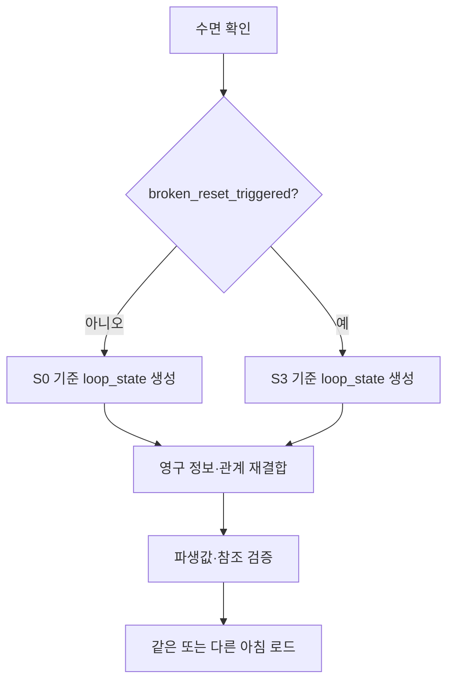

# GGB v0.4 상태 변수·이벤트 ID·Godot 데이터 구조

## 1. 목적

본 문서는 기획 데이터를 Godot으로 이전할 때 필요한 식별자, 상태 소유권, 저장 범위를 정의한다. 프로토타입 코드는 작성하지 않지만 데이터 계약은 v0.4에서 고정한다.

## 2. ID 규칙

| 대상 | 규칙 | 예시 |
| --- | --- | --- |
| 메인 이벤트 | 흐름도 ID | `P3B`, `B3_B`, `E3_5`, `F0_D` |
| 인물 반응 | `인물_구간번호` | `MARA2_S1`, `EDGAR_S3` |
| 엔딩 반응 | `인물_ED_분기` | `MARA2_ED_REALITY` |
| 색 이벤트 | `CLR-번호` | `CLR-04` |
| 북쪽 구역 | `NORTH_ARCHIVE_기능` | `NORTH_ARCHIVE_COLOR_ROOM` |
| 기록 | `REC_인물` | `REC_MARA2` |
| 오브젝트 | `OBJ_공간_명칭_번호` | `OBJ_ARCHIVE_PORTRAIT_01` |
| 텍스트 | `TXT_이벤트_분기` | `TXT_MARA2_S1_ASK` |

Godot 리소스 파일명은 소문자 snake_case를 사용한다.

```text
event_e3_5.tres
signature_mara2.tres
reaction_archive_portrait_s2.tres
```

## 3. 상태 소유권

### 영구 저장

```yaml
meta_progress:
  notebook_persistence_confirmed: false
  journal_stage: 0
  knowledge_flags: []
  validated_puzzle_steps: {}
  shortcut_flags: []
  color_signatures_known: []
  researcher_records: []
  servant_states: {}
  final_decision: unset
```

### 루프 저장

```yaml
loop_state:
  loop_index: 0
  world_phase: S0
  time_segment: morning
  completed_daily_tasks: []
  inventory: []
  object_states: {}
  servant_locations: {}
  intervention_budget: {}
  pending_reactions: []
```

### 파열 상태

```yaml
fracture_state:
  broken_reset_triggered: false
  camouflage_filter_enabled: true
  fracture_sleep_complete: false
  relationship_hub_open: false
  e5_locked_in: false
```

정상 RESET은 `loop_state`만 초기화한다. `broken_reset_triggered` 이후에는 S3 기준 템플릿으로 `loop_state`를 재생성한다.

## 4. 사용인 상태

```yaml
servants:
  mara2:
    owner_id: MARA2
    bond: 0
    alert: 0
    residual_memory: []
    short_events_seen: []
    core_event_complete: false
    researcher_record_acquired: false
    followup_seen: false
    archive_resolution: none
```

공통 제약:

```text
bond: 0..5
alert: 0..5
archive_resolution: none | merged | separated
```

- `bond`와 `alert`는 독립값이다.
- `core_event_complete`는 짧은 반응으로 설정하지 않는다.
- 기록 획득과 핵심 이벤트 완료는 같은 트랜잭션으로 저장한다.
- 핵심 이벤트 완료 뒤 저장 실패가 발생하면 둘 다 롤백한다.

## 5. 색상 서명

```yaml
color_signature:
  signature_id: purple_archive
  owner_id: MARA2
  hue_id: purple
  hex_tokens: ["#8D5BD6"]
  glyph_id: stacked_frame
  line_pattern: double_outline
  audio_id: archive_trill
  text_label: "ARCHIVE / MARA2"
  accessibility_order: [glyph, line_pattern, text_label, audio]
```

다섯 기본 ID:

```text
navy_lock
orange_wipe
black_lime_pulse
white_yellow_bloom
purple_archive
```

퍼즐 저장값은 HEX나 `hue_id`가 아니라 `signature_id`다.

## 6. 이벤트 정의

```yaml
event_definition:
  event_id: E3_5
  category: servant_core
  required: false
  location_id: NORTH_ARCHIVE_COLOR_ROOM
  time_rule: flexible
  prerequisites:
    all: [E2_INTRO_complete]
    none: [E3_5_complete, e5_locked_in]
  interaction_nodes: []
  completion_effects:
    set_flags: [E3_5_complete]
    add_records: [REC_MARA2]
    servant_changes:
      MARA2:
        core_event_complete: true
        researcher_record_acquired: true
  fail_policy: local_retry
  hint_track_id: HINT_E3_5
  color_signature_ids: [purple_archive]
  next_objective_id: E_HUB
```

## 7. 이벤트 결과

```yaml
event_result:
  event_id: E3_5
  outcome_id: merged
  completed: true
  persistent_flags: [E3_5_complete]
  loop_flags: []
  relationship_changes:
    MARA2:
      bond: 2
      alert: 1
  knowledge_gained: [mara2_self_sacrifice_known]
  records_gained: [REC_MARA2]
  signatures_gained: [purple_archive]
  validated_steps: []
  next_objective: E_HUB
```

## 8. 주요 플래그

### 진행

```text
P3B_complete
notebook_persistence_confirmed
servant_schedule_known
clock_network_layout_solved
thirteenth_bell_known
mirror_tracing_acquired
basement_overlay_solved
basement_access_fast_path
broken_reset_triggered
subject_authority_restored
```

### 마라 2·북쪽 구역

```text
NORTH_ARCHIVE_HALL_open
NORTH_ARCHIVE_PORTRAIT_ROOM_open
NORTH_ARCHIVE_LIBRARY_LATCH_open
NORTH_ARCHIVE_COLOR_ROOM_inspectable
NORTH_ARCHIVE_COLOR_ROOM_open
NORTH_ARCHIVE_PERSONALITY_ARCHIVE_open
mara2_archive_index_known
MARA2_S1_seen
MARA2_S2_seen
E3_5_complete
mara2_name_written
```

### 관계·결산

```text
E3_1_complete
E3_2_complete
E3_3_complete
E3_4_complete
E3_5_complete
edgar_minimum_access
all_servants_complete
J4_BASE_complete
J4_EXPANDED_complete
J4_FULL_complete
settlement_tier
```

`all_servants_complete`는 직접 저장하지 않고 로드 시 재계산한 뒤 캐시한다.

```text
all_servants_complete =
  E3_1 && E3_2 && E3_3 && E3_4 && E3_5
```

## 9. 파생값

```gdscript
relationship_complete_count =
    int(E3_1_complete)
  + int(E3_2_complete)
  + int(E3_3_complete)
  + int(E3_4_complete)
  + int(E3_5_complete)

researcher_record_count = researcher_records.size()
```

판정:

```text
records 0..1 → J4_BASE
records 2..4 → J4_EXPANDED
records 5    → J4_FULL

core complete 0..1 → LOW
core complete 2..3 → MID
core complete 4..5 → HIGH
core complete 5    → all_servants_complete
```

연구원 기록 수는 메인 게이트가 아니다.

## 10. Godot 권장 구조

```text
res://
├─ autoload/
│  ├─ game_state.gd
│  ├─ event_bus.gd
│  ├─ save_manager.gd
│  └─ accessibility_settings.gd
├─ data/
│  ├─ events/
│  ├─ dialogue/
│  ├─ color_signatures/
│  ├─ object_reactions/
│  └─ maps/
├─ scenes/
│  ├─ locations/
│  ├─ puzzles/
│  ├─ ui/
│  └─ endings/
└─ resources/
   ├─ event_definition.gd
   ├─ color_signature.gd
   ├─ servant_state.gd
   └─ object_reaction.gd
```

책임:

| 구성 | 책임 |
| --- | --- |
| `GameState` | 영구·루프·파열 상태와 파생값 |
| `EventBus` | 이벤트 시작·완료·실패 신호 |
| `SaveManager` | 트랜잭션 저장, 버전 마이그레이션 |
| `AccessibilitySettings` | 색·문양·음향·글리치 표시 |
| `EventDefinition` | 선행 조건과 결과 데이터 |
| `ObjectReaction` | 월드 상태별 조사 텍스트 |

## 11. 리셋 처리 순서



정상 리셋:

1. 현재 루프 결과 중 영구 획득분을 커밋한다.
2. 인벤토리·물리 오브젝트·시간대를 폐기한다.
3. S0 템플릿으로 새 루프를 만든다.
4. 영구 숏컷과 수첩 정보를 다시 적용한다.

파열 리셋:

1. `broken_reset_triggered`를 확인한다.
2. S3 손상 템플릿으로 새 루프를 만든다.
3. 고딕 필터는 재적용하지 않는다.
4. E구간 관계 허브와 완료된 장치 상태를 복구한다.

## 12. 개입 예산

사용인이 이전 루프를 기억해도 퍼즐을 항상 막지 않는 시스템 근거다.

```yaml
intervention_budget:
  EDGAR:
    question: 1
    physical_block: 1
    report: 1
```

- 관리 프로토콜은 사용인에게 제한된 횟수의 개입만 허용한다.
- 사용인끼리 서로 감시하므로 근거 없는 강제 구금은 보안 위반이다.
- 높은 `alert`는 개입 종류를 바꾸지만 필수 순찰 공백을 삭제하지 않는다.
- 검증된 숏컷은 시스템 승인으로 간주되어 재차 막을 수 없다.
- D5 이후에는 관리 프로토콜이 손상되어 관계 이벤트로 책임이 이동한다.

## 13. 저장 버전

```yaml
save_header:
  schema_version: 4
  game_version: "0.4-design"
  timestamp: ""
  checksum: ""
```

마이그레이션 원칙:

- 없는 마라 2 상태는 기본값으로 생성한다.
- 기존 4인 완료 상태는 유지한다.
- `all_servants_complete`는 5인 기준으로 다시 계산한다.
- 색상 값이 직접 저장되어 있으면 소유자 기반 `signature_id`로 변환한다.

## 14. 참조 무결성 검사

빌드 전 검사 항목:

```text
모든 event_id가 유일하다.
모든 prerequisite 플래그가 선언되어 있다.
모든 location_id가 지도에 존재한다.
모든 signature_id가 색상 표에 존재한다.
모든 기록 ID가 정확히 한 사용인에게 귀속된다.
선택 이벤트가 F0 또는 엔딩 진입 조건에 포함되지 않는다.
색 제거 모드에서 필수 interaction_nodes가 남는다.
```

## 15. 기획 QA 시나리오

1. 마라 2를 제외한 0명 완료 후 F0와 두 엔딩 진입.
2. 마라 2만 완료 후 J4_BASE와 LOW 결산.
3. 임의 3명 완료 후 J4_EXPANDED와 MID 결산.
4. 임의 4명 완료 후 J4_EXPANDED와 HIGH 결산.
5. 5명 완료 후 J4_FULL, `all_servants_complete`, 추가 장면.
6. E3_5 미완료 상태에서 익명 보라 인덱스로 F0-D 해결.
7. 색 제거·음량 0 상태에서 P3B, E3_5, F0-D 해결.
8. D5 전 정상 RESET과 D5 후 BROKEN_RESET 데이터 비교.

