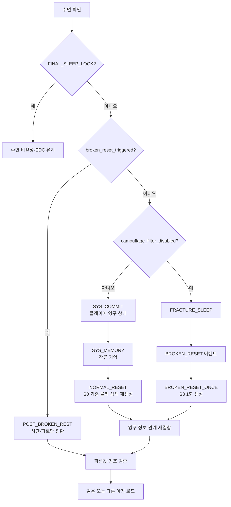

# GGB v0.4 상태 변수·이벤트 ID·Godot 데이터 구조

## 1. 목적

본 문서는 기획 데이터를 Godot으로 이전할 때 필요한 식별자, 상태 소유권, 저장 범위를 정의한다. 프로토타입 코드는 작성하지 않지만 데이터 계약은 v0.4에서 고정한다.

## 2. ID 규칙

| 대상 | 규칙 | 예시 |
| --- | --- | --- |
| 메인 이벤트 | 흐름도 ID | `P3B`, `B3_B`, `E3_5`, `F0_D` |
| 인물 반응 | `인물_구간번호` | `MARA2_S1`, `EDGAR_S3` |
| 엔딩 반응 | `인물_ED_분기` | `MARA2_ED_REALITY` |
| 색 이벤트 | `CLR-번호` | `CLR-04` |
| 북쪽 기록 콘텐츠·전환 | `NORTH_ARCHIVE_기능` | `NORTH_ARCHIVE_PORTRAIT_LABEL` |
| `location_id` | 지도 레지스트리의 층·공간 ID | `M1_COLOR_ROOM_ENTRY`, `H0_COLOR_SEPARATION` |
| 기록 | `REC_인물` | `REC_MARA2` |
| 오브젝트 | `OBJ_공간_명칭_번호` | `OBJ_ARCHIVE_PORTRAIT_01` |
| 텍스트 | `TXT_이벤트_분기` | `TXT_MARA2_S1_ASK` |

Godot 리소스 파일명은 소문자 snake_case를 사용한다.

```text
event_e3_5.tres
signature_mara2.tres
reaction_archive_portrait_s2.tres
```

## 3. 상태 소유권

### 영구 저장

```yaml
meta_progress:
  notebook_persistence_confirmed: false
  journal_stage: 0
  knowledge_flags: []
  knowledge_entries: {}
  validated_puzzle_steps: {}
  failure_records: {}
  persistent_shortcut_flags: []
  color_signatures_known: []
  researcher_records: []
  servant_states: {}
  f0_provisional_intent: unset
  final_choice_relation: unresolved
  final_decision: unset
```

관련 enum:

```yaml
f0_provisional_intent:
  [unset, reality, stay, undecided]
final_choice_relation:
  [unresolved, reaffirmed, revised, formed]
final_decision:
  [unset, reality, stay]
```

### 루프 저장

```yaml
loop_state:
  loop_index: 0
  world_phase: S0
  time_segment: morning
  completed_daily_tasks: []
  inventory: []
  object_states: {}
  servant_locations: {}
  intervention_budget: {}
  pending_reactions: []
  protagonist_fatigue: 0
  b2_attention_level: 0
  b2_edgar_entry_used: false
  b2_hide_discovered: false
  b2_caught_once: false
  current_hard_failure_event_id: null
  route_snapshot: null
  shortcut_resume: null
```

### 파열 상태

```yaml
fracture_state:
  broken_reset_triggered: false # BROKEN_RESET_ONCE 완료 여부
  camouflage_filter_enabled: true
  fracture_sleep_complete: false
  relationship_hub_open: false
  e5_locked_in: false
```

정상 RESET은 D5 이전에만 `loop_state`를 S0으로 초기화한다. `BROKEN_RESET` 이벤트는 `broken_reset_triggered=false`일 때 `BROKEN_RESET_ONCE`를 실행해 S3를 한 번 생성하고, 완료 직후 이 값을 `true`로 바꾼다. 이후 휴식은 `POST_BROKEN_REST`로만 라우팅하며 현재 `loop_state`의 공간·수리 상태를 재생성하거나 초기화하지 않는다.

```yaml
fracture_transition:
  event_id: BROKEN_RESET
  action_id: BROKEN_RESET_ONCE
  guard: broken_reset_triggered == false
  trigger: FRACTURE_SLEEP completion
  effects:
    - create_world_phase_S3_once
    - set_broken_reset_triggered_true
    - set_fracture_sleep_complete_true
    - run_SYS_SYNC_once
```

## 3.1 정보 상태 생애주기

`knowledge_entries`는 단순 bool이 아니라 출처와 확신 단계를 가진다.

```yaml
knowledge_entry:
  knowledge_id: KN_J1_POST_COMPLETION_GAP
  state: observed
  source_event_id: J1
  first_loop: 2
  confidence: 2
  notebook_entry_id: NOTE_J1_GAP
```

상태 enum:

| state | 의미 | 예시 |
| --- | --- | --- |
| `unknown` | 아직 관찰하지 않음 | C5 전 외부 거주 가능성 |
| `observed` | 현상·문구를 봄 | J1 잉크점, C2 총량 |
| `hypothesized` | 플레이어 수첩에서 가설화 | 시계 역할, 거울 방향 의심 |
| `verified` | 퍼즐·환경으로 검증 | B3 역할, C3 순서 |
| `authenticated` | 시스템 로그나 F1로 인증 | C5 진단, F1 아버지 원본 |

숏컷과 메인 게이트는 `verified` 이상만 요구한다. 단, C5 진단처럼 시스템 패널에서 나온 사실은 즉시 `authenticated`가 될 수 있다.

## 3.2 실패 기록·ROUTE·숏컷 재개

영구 실패 이력과 현재 루프의 물리 잠금은 분리한다.

```yaml
failure_records:
  FAIL_C4_L0004_01:
    source_event_id: C4
    status: active
    observed_result_id: C4_COATING_HARDENED
    validated_steps:
      - c3_ratio_5_1_2
      - c3_order_water_stabilizer_concentrate
    invalidated_steps:
      - c4_trace_segment_03
    first_loop: 4
    last_loop: 4
    occurrence_count: 1
    supersedes: null
    resolved_by_event_id: null
    resolved_loop: null
```

`failure_id`는 `FAIL_<SOURCE>_L<LOOP>_<SEQ>` 형식의 고유 ID다. 상태 enum은 `active | resolved | superseded`다.

- HARD FAILURE가 발생하면 해당 `source_event_id`의 active 기록을 하나만 유지한다.
- 같은 정보의 반복 실패는 새 기록을 만들지 않고 `last_loop`, `occurrence_count`를 갱신한다.
- 더 구체적인 검증 정보가 생기면 이전 기록을 `superseded`로 바꾸고 새 active 기록의 `supersedes`에 이전 ID를 쓴다.
- B3-B·C4·D1 성공 시 같은 source의 모든 active 기록을 `resolved`로 바꾸고 해결 이벤트·루프를 기록한다.
- `*_hard_failure_seen` 플래그는 과거 열람·통계용이다. ROUTE와 숏컷 진입은 active 실패 기록만 읽는다.

현재 루프의 물리 잠금은 `loop_state.current_hard_failure_event_id`에 source event ID만 기록한다. NORMAL_RESET 때 이 값과 잠긴 오브젝트는 초기화하지만 `meta_progress.failure_records`는 유지한다.

```yaml
route_snapshot:
  snapshot_id: ROUTE_RESET_0004
  reset_transaction_id: RESET_0004
  loop_index: 4
  selected_entry: ENTRY_CSHORT
  active_failure_id: FAIL_C4_L0004_01
  reason_flags: [journal_stage_2, active_failure_C4]
  consumed: false
```

```yaml
shortcut_resume:
  shortcut_id: CSHORT
  active_failure_id: FAIL_C4_L0004_01
  completed_beats: [C2_COMPACT, C2_1_COMPACT]
  interrupted_at: CSHORT_MATERIAL_HANDOFF
  interrupted_by: MARA2_S2
  resume_target: MERGE_C3
```

| 숏컷 | 영구 유지 | 루프 재생성 | `resume_target` |
| --- | --- | --- | --- |
| BSHORT | B3-A 탁본 조립 결과, verified 역할, 실패 위상 범주 | 실제 탁본 세트·역할 카드·다이얼 | `MERGE_B3` |
| CSHORT | C3 비율·순서, C4 verified 구간·실패 지점 | 재료 계량·세정제 실제 재제조 | `MERGE_C3` |
| DSHORT | D0-A 중첩, verified 축, 미확정 축 목록 | 물리 축 위치·압력핀 | `MERGE_D1` |

ROUTE 스냅숏을 불러올 때 `active_failure_id`가 여전히 active인지 다시 확인한다. 이미 resolved·superseded면 스냅숏과 `shortcut_resume`을 폐기하고 현재 J단계의 안전한 기본 진입점으로 다시 계산한다. 성공 처리 시 현재 실패 ID와 같은 숏컷 재개 상태를 함께 지워 과거 ROUTE가 다시 열리지 않게 한다.

`persistent_shortcut_flags`에는 일과 압축과 공간 이동처럼 영구 해금되는 숏컷만 넣는다. BSHORT·CSHORT·DSHORT의 사용 가능 여부는 J단계·verified 정보·active 실패 기록에서 매번 계산하며 별도 bool로 저장하지 않는다.

## 4. 사용인 상태

```yaml
servants:
  mara2:
    owner_id: MARA2
    bond: 0
    alert: 0
    residual_memory: []
    short_events_seen: []
    core_event_complete: false
    researcher_record_acquired: false
    followup_seen: false
    archive_resolution: none
```

공통 제약:

```text
bond: 0..5
alert: 0..5
archive_resolution: none | merged | separated
```

- `bond`와 `alert`는 독립값이다.
- `core_event_complete`는 짧은 반응으로 설정하지 않는다.
- 기록 획득과 핵심 이벤트 완료는 같은 트랜잭션으로 저장한다.
- 핵심 이벤트 완료 뒤 저장 실패가 발생하면 둘 다 롤백한다.

## 5. 색상 서명

```yaml
color_signature:
  signature_id: purple_archive
  owner_id: MARA2
  hue_id: purple
  hex_tokens: ["#8D5BD6"]
  glyph_id: stacked_frame
  line_pattern: double_outline
  audio_id: archive_trill
  text_label: "ARCHIVE / MARA2"
  accessibility_order: [glyph, line_pattern, text_label, audio]
```

다섯 기본 ID:

```text
navy_lock
orange_wipe
black_lime_pulse
white_yellow_bloom
purple_archive
```

퍼즐 저장값은 HEX나 `hue_id`가 아니라 `signature_id`다.

## 6. 이벤트 정의

```yaml
event_definition:
  event_id: E3_5
  category: servant_core
  required: false
  entry_location_id: M1_COLOR_ROOM_ENTRY
  location_ids:
    - H0_COLOR_SEPARATION
    - H0_PERSONALITY_ARCHIVE
  time_rule: flexible
  prerequisites:
    all: [E2_INTRO_complete]
    none: [E3_5_complete, e5_locked_in]
  interaction_nodes: []
  completion_effects:
    set_flags: [E3_5_complete]
    add_records: [REC_MARA2]
    servant_changes:
      MARA2:
        core_event_complete: true
        researcher_record_acquired: true
  fail_policy: local_retry
  hint_track_id: HINT_E3_5
  color_signature_ids: [purple_archive]
  next_objective_id: E_HUB
```

### E6 코어 접근 정의

```yaml
event_definition:
  event_id: E6
  category: space_unlock
  required: true
  location_id: H0_CLOCK_MACHINE
  time_rule: flexible
  prerequisites:
    state_at_least:
      journal_stage: 4
    all_flags: [e5_locked_in]
    any_flags: [E3_4_complete, edgar_minimum_access]
  completion_effects:
    unlock_locations: [H0_CORE_PATH]
    set_flags: [core_path_open]
  fail_policy: none
  irreversible_after_complete: true
  next_objective_id: F0_A
```

### F0-E 권한·의향 정의

```yaml
event_definition:
  event_id: F0_E
  category: meta_puzzle
  required: true
  location_id: H0_CORE_PATH
  camera_zone_id: F0_SUBJECT_DESK
  prerequisites:
    all_flags:
      - F0_D_complete
    state_equals:
      final_decision: unset
  interaction_nodes:
    - F0_E_PAST_CONTINUITY
    - F0_E_CURRENT_AUTHOR
    - F0_E_PROVISIONAL_INTENT
  completion_effects:
    set_flags:
      - subject_authority_restored
    set_from_choice:
      f0_provisional_intent: selected_intent
  forbidden_effects:
    - final_decision
    - relationship_changes
  branch_variants:
    - INTENT_REALITY
    - INTENT_STAY
    - INTENT_UNDECIDED
  merge_node_id: MERGE_F0_E
  next_objective_id: F1
```

### 정보·일지 데이터 계약

```yaml
event_definition:
  event_id: B2
  category: information_access
  required: true
  location_id: M1_LIBRARY_INNER
  loop_state:
    b2_attention_level: 0
    b2_edgar_entry_used: false
    b2_hide_discovered: false
    b2_caught_once: false
  persistent_outputs:
    optional:
      - library_inner_pressure_seen
      - library_service_alcove_known
  fail_policy: no_fail
  merge_node_id: J1
```

```yaml
event_definition:
  event_id: J4
  category: journal_restoration
  required: true
  location_id: M1_LIBRARY_INNER
  prerequisites:
    all_flags:
      - E2_INTRO_complete
    player_choice:
      - E_HUB_end_investigation
  variant_by:
    researcher_record_count:
      0..1: J4_BASE
      2..4: J4_EXPANDED
      5: J4_FULL
  completion_effects:
    set:
      journal_stage: 4
  next_check: E3_4_complete
  fail_policy: local_retry
```

```yaml
event_definition:
  event_id: F1
  category: authenticated_record
  required: true
  location_id: H0_CORE_RECORDS
  prerequisites:
    all_flags:
      - subject_authority_restored
  completion_effects:
    authenticate_sources:
      - J1
      - J2
      - J3
      - J4
    set_flags:
      - father_final_record_seen
  forbidden_effects:
    - final_decision
    - relationship_changes
  next_objective_id: J5
```

```yaml
event_definition:
  event_id: J5
  category: journal_restoration
  required: true
  location_id: H0_CORE_RECORDS
  prerequisites:
    all_flags:
      - father_final_record_seen
  completion_effects:
    set:
      journal_stage: 5
    set_flags:
      - current_choice_authority_confirmed
  forbidden_effects:
    - final_decision
    - f0_provisional_intent
  output_text_marker: "FINAL DECISION: UNSET"
  next_objective_id: F2
```

## 7. 이벤트 결과

```yaml
event_result:
  event_id: E3_5
  outcome_id: merged
  completed: true
  persistent_flags: [E3_5_complete]
  loop_flags: []
  relationship_changes:
    MARA2:
      bond: 2
      alert: 1
  knowledge_gained: [mara2_self_sacrifice_known]
  records_gained: [REC_MARA2]
  signatures_gained: [purple_archive]
  validated_steps: []
  next_objective: E_HUB
```

## 8. 주요 플래그

### 진행

```text
P3B_complete
notebook_persistence_confirmed
servant_schedule_known
library_inner_pressure_seen
library_service_alcove_known
library_link_fast_path
c5_info_complete
color_room_entry_inspectable
clock_network_layout_solved
thirteenth_bell_known
mirror_tracing_acquired
basement_overlay_solved
basement_access_fast_path
broken_reset_triggered
fracture_sleep_complete
subject_authority_restored
core_path_open
father_final_record_seen
current_choice_authority_confirmed
```

### F0-E·엔딩 상태

```text
f0_provisional_intent
final_choice_relation
final_decision
```

소유권:

- F0-E는 `f0_provisional_intent`만 쓴다.
- EDC는 `final_decision`과 `final_choice_relation`을 같은 트랜잭션에서 쓴다.
- F3·사용인 관계 이벤트는 `f0_provisional_intent`를 읽어 연출을 바꾸지 않는다.
- 엔딩 본문은 `final_decision`을 사용하고, 도입 독백만 `final_choice_relation`을 읽는다.

### 마라 2·북쪽 구역

| 항목 | 저장 방식 | 생성·해제 조건 |
| --- | --- | --- |
| 기록 회랑·초상화 보관실 접근 | `P3B_complete`로 파생 | 프롤로그 P3B 완료 |
| 내실 연결 숏컷 | `library_link_fast_path` 영구 저장 | J1 뒤 내부 걸쇠 해제 |
| 색분해실 외부 조사 | `color_room_entry_inspectable` 영구 저장 | C5_INFO 완료 |
| `H0_COLOR_SEPARATION` 접근 | `broken_reset_triggered && !e5_locked_in` 파생 | BROKEN_RESET 뒤 E_HUB의 마라 2 목적지 |
| `H0_PERSONALITY_ARCHIVE` 문 | E3_5 로컬 `object_states` | 보라 체크섬 확인 뒤 현재 사건 안에서만 개방 |
| 메인 진행 대체 | `mara2_archive_index_known` 영구 저장 | E2_INTRO의 익명 보라 인덱스 |
| 관계 결과 | `E3_5_complete`, `mara2_name_written`, `archive_resolution` 영구 저장 | E3_5·MARA2_FU 완료 |

`NORTH_ARCHIVE_*`는 콘텐츠·전환·텍스트 ID에만 쓴다. 위치 ID로는 사용하지 않으며, E3_5의 실제 장면 로드는 위 표의 `M1_*`·`H0_*` 값만 사용한다.

### 관계·결산

```text
E3_1_complete
E3_2_complete
E3_3_complete
E3_4_complete
E3_5_complete
edgar_minimum_access
all_servants_complete
J4_BASE_complete
J4_EXPANDED_complete
J4_FULL_complete
settlement_tier
```

`all_servants_complete`는 저장하거나 캐시하지 않는 읽기 전용 계산 프로퍼티다. E3 완료 플래그가 바뀌면 다음 조회부터 즉시 새 값이 반영된다.

```gdscript
var all_servants_complete: bool:
    get:
        return (
            E3_1_complete
            and E3_2_complete
            and E3_3_complete
            and E3_4_complete
            and E3_5_complete
        )
```

## 9. 파생값

```gdscript
relationship_complete_count =
    int(E3_1_complete)
  + int(E3_2_complete)
  + int(E3_3_complete)
  + int(E3_4_complete)
  + int(E3_5_complete)

researcher_record_count = researcher_records.size()
```

```gdscript
func derive_final_choice_relation(
    provisional_intent: StringName,
    final_decision: StringName
) -> StringName:
    if provisional_intent == final_decision:
        return &"reaffirmed"
    if provisional_intent == &"undecided" or provisional_intent == &"unset":
        return &"formed"
    return &"revised"
```

판정:

```text
records 0..1 → J4_BASE
records 2..4 → J4_EXPANDED
records 5    → J4_FULL

core complete 0..1 → LOW
core complete 2..3 → MID
core complete 4    → HIGH
core complete 5    → ALL

all_servants_complete = (core complete == 5)
```

`settlement_tier`는 `LOW | MID | HIGH | ALL` enum이며, `all_servants_complete`와 별도 파생값이다. 후자는 전원 완료 전용 장면·대사를 여는 기능 플래그로만 사용한다.

연구원 기록 수는 메인 게이트가 아니다.

## 10. Godot 권장 구조

```text
res://
├─ autoload/
│  ├─ game_state.gd
│  ├─ event_bus.gd
│  ├─ save_manager.gd
│  └─ accessibility_settings.gd
├─ data/
│  ├─ events/
│  ├─ dialogue/
│  ├─ color_signatures/
│  ├─ object_reactions/
│  └─ maps/
├─ scenes/
│  ├─ locations/
│  ├─ puzzles/
│  ├─ ui/
│  └─ endings/
└─ resources/
   ├─ event_definition.gd
   ├─ color_signature.gd
   ├─ servant_state.gd
   └─ object_reaction.gd
```

책임:

| 구성 | 책임 |
| --- | --- |
| `GameState` | 영구·루프·파열 상태와 파생값 |
| `EventBus` | 이벤트 시작·완료·실패 신호 |
| `SaveManager` | 트랜잭션 저장, 버전 마이그레이션 |
| `AccessibilitySettings` | 색·문양·음향·글리치 표시 |
| `EventDefinition` | 선행 조건과 결과 데이터 |
| `ObjectReaction` | 월드 상태별 조사 텍스트 |

## 11. 리셋 처리 순서

정상 리셋은 아래 복구 상태를 세이브 루트에 둔다.

```yaml
reset_state:
  transaction_id: ""
  phase: idle
  player_commit_complete: false
  memory_commit_complete: false
  physical_reset_complete: false
  route_snapshot_id: null
```

`phase` enum:

```text
idle
sleep_confirmed
player_committed
memory_committed
physical_reset_complete
morning_loaded
route_selected
complete
```

재개 규칙:

| 저장 상태 | 재개 위치 | 중복 방지 규칙 |
| --- | --- | --- |
| `idle` | `NORMAL_SLEEP` 확인 대기 | 활성 transaction 없음 |
| `sleep_confirmed` | `SYS_COMMIT` | 새 `transaction_id`를 한 번만 발급 |
| `player_committed` | `SYS_MEMORY` | 완료된 플레이어 영구 효과를 다시 적용하지 않음 |
| `memory_committed` | `NORMAL_RESET` | 두 완료 플래그가 모두 참일 때만 물리 상태 폐기 |
| `physical_reset_complete` | MORNING 로드 | 폐기 단계를 다시 실행하지 않음 |
| `morning_loaded` | ROUTE 판정 | 기존 아침 월드 재사용 |
| `route_selected` | 선택한 진입점 로드 | 기존 `route_snapshot_id` 재사용 |
| `complete` | 완료된 아침 유지 | 같은 transaction 요청은 no-op |

각 영구 효과와 잔류 기억에는 적용한 `transaction_id`를 기록한다. 저장 중 종료 후 같은 ID로 재개해도 완료 플래그가 참인 단계와 이미 적용된 효과는 건너뛴다.
각 단계는 결과와 다음 `phase`를 같은 원자적 저장으로 확정한 뒤 진행한다. 완료 플래그와 `phase`가 어긋나면 완료 플래그가 가리키는 마지막 안전 단계로 되돌려 재개한다.



정상 리셋:

1. `reset_state` transaction을 생성하거나 미완료 transaction을 재개한다.
2. `SYS_COMMIT`으로 플레이어 영구 획득분을 커밋한다.
3. `SYS_MEMORY`로 사용인 잔류 기억을 압축·커밋한다.
4. 두 완료 플래그가 모두 참인 경우에만 인벤토리·물리 오브젝트·시간대를 폐기한다.
5. S0 템플릿으로 새 루프를 만들고 `route_snapshot_id`를 기록한다.
6. 영구 숏컷·수첩·관계를 다시 적용한 뒤 ROUTE를 판정한다.

강제 종료 회귀 경로:

1. transaction 생성 직후 종료하면 `SYS_COMMIT`부터 재개한다.
2. `SYS_COMMIT` 직후 종료하면 플레이어 효과를 중복 적용하지 않고 `SYS_MEMORY`부터 재개한다.
3. `SYS_MEMORY` 직후 종료하면 잔류 기억을 중복 생성하지 않고 `NORMAL_RESET`부터 재개한다.
4. 물리 상태 폐기 직후 종료하면 폐기를 반복하지 않고 같은 `route_snapshot_id`로 아침 생성을 재개한다.
5. ROUTE 스냅숏 생성 직후 종료하면 새 스냅숏을 만들지 않고 기존 판정을 재사용한다.

BROKEN_RESET 단발 전환:

1. `BROKEN_RESET`은 `broken_reset_triggered=false`일 때만 호출한다.
2. `BROKEN_RESET_ONCE`가 S3 손상 템플릿을 생성하고 `world_phase=S3`을 기록한다.
3. 고딕 필터는 재적용하지 않고 `broken_reset_triggered=true`, `fracture_sleep_complete=true`를 커밋한다.
4. SYS_SYNC가 E구간 관계 허브와 완료된 장치 상태를 한 번 재결합한다.

POST_BROKEN_REST:

1. `broken_reset_triggered=true`이면 이 경로만 허용한다.
2. `time_segment`와 `protagonist_fatigue`만 갱신한다.
3. `world_phase`, `object_states`, 사용인 위치, E3 수리 결과, 관계 상태는 유지한다.

## 12. 개입 예산

사용인이 이전 루프를 기억해도 퍼즐을 항상 막지 않는 시스템 근거다.

```yaml
intervention_budget:
  EDGAR:
    question: 1
    physical_block: 1
    report: 1
```

- 관리 프로토콜은 사용인에게 제한된 횟수의 개입만 허용한다.
- 사용인끼리 서로 감시하므로 근거 없는 강제 구금은 보안 위반이다.
- 높은 `alert`는 개입 종류를 바꾸지만 필수 순찰 공백을 삭제하지 않는다.
- 검증된 숏컷은 시스템 승인으로 간주되어 재차 막을 수 없다.
- D5 이후에는 관리 프로토콜이 손상되어 관계 이벤트로 책임이 이동한다.

## 13. 저장 버전

```yaml
save_header:
  schema_version: 5
  game_version: "0.4-design"
  timestamp: ""
  checksum: ""
```

마이그레이션 원칙:

`schema_version=5`는 영구 `failure_records`, `current_hard_failure_event_id`, `route_snapshot`, `shortcut_resume`을 도입한다. 버전 4 이하는 아래 규칙으로 한 번 변환한 뒤 저장한다.

- 없는 마라 2 상태는 기본값으로 생성한다.
- 기존 4인 완료 상태는 유지한다.
- `all_servants_complete`는 5인 기준으로 다시 계산한다.
- 색상 값이 직접 저장되어 있으면 소유자 기반 `signature_id`로 변환한다.
- `f0_provisional_intent`가 없고 F0-E 이전이면 `unset`으로 생성한다.
- `f0_provisional_intent`가 없지만 `subject_authority_restored=true`면 `undecided`로 생성한다.
- `final_choice_relation`이 없으면 `unresolved`로 생성한다.
- 이미 final_decision이 확정된 기존 세이브는 로드 시 final_choice_relation을 `formed`로 보정한다.
- 구식 `hard_failure_id`가 있으면 `current_hard_failure_event_id`로 옮긴다. 해당 퍼즐의 성공 플래그가 없을 때만 검증 단계가 빈 legacy active 실패 기록을 생성한다.
- 성공 플래그가 이미 있는 source의 legacy active 기록은 로드 즉시 resolved로 보정한다.
- 구식 `route_snapshot`에 active 실패 ID가 없으면 source event로 active 기록을 찾아 연결하고, 찾지 못하면 스냅숏을 폐기해 안전 진입점을 다시 계산한다.

## 14. 참조 무결성 검사

빌드 전 검사 항목:

```text
모든 event_id가 유일하다.
모든 prerequisite 플래그가 선언되어 있다.
모든 location_id가 지도에 존재한다.
모든 signature_id가 색상 표에 존재한다.
모든 기록 ID가 정확히 한 사용인에게 귀속된다.
선택 이벤트가 F0 또는 엔딩 진입 조건에 포함되지 않는다.
색 제거 모드에서 필수 interaction_nodes가 남는다.
F0-E가 final_decision을 쓰지 않는다.
EDC 이전에는 final_choice_relation이 unresolved다.
세 provisional intent가 모두 MERGE_F0_E에 도달한다.
source event마다 active failure가 최대 하나다.
resolved·superseded failure는 ROUTE 조건을 충족하지 않는다.
route_snapshot과 shortcut_resume의 active_failure_id가 실제 active 기록을 가리킨다.
```

## 15. 기획 QA 시나리오

1. 마라 2를 제외한 0명 완료 후 F0와 두 엔딩 진입.
2. 마라 2만 완료 후 J4_BASE와 LOW 결산.
3. 임의 3명 완료 후 J4_EXPANDED와 MID 결산.
4. 임의 4명 완료 후 J4_EXPANDED와 HIGH 결산.
5. 5명 완료 후 J4_FULL, ALL, `all_servants_complete`, 추가 장면.
6. E3_5 미완료 상태에서 익명 보라 인덱스로 F0-D 해결.
7. 색 제거·음량 0 상태에서 P3B, E3_5, F0-D 해결.
8. D5 전 정상 RESET과 D5 후 BROKEN_RESET 데이터 비교.
9. F0-E reality·stay·undecided 각각에서 F1 진입.
10. provisional intent 3종과 final decision 2종의 여섯 조합 검증.
11. revised 경로에서 관계·기록·엔딩 선택지 변화가 없는지 확인.
12. B3-B 실패→BSHORT 중단·로드→MERGE_B3 재개→성공 뒤 BSHORT 미노출.
13. C4 실패→CSHORT에서 재료 재확보·C3 재제조→성공 뒤 C4 기록 resolved.
14. D1 실패→DSHORT에서 verified 축만 재현→성공 뒤 지하 숏컷 해금·DSHORT 미노출.
