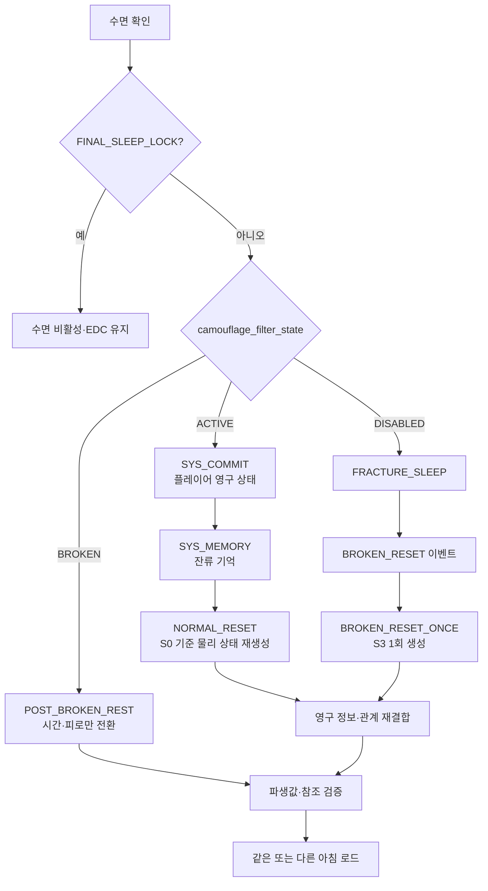

# GGB v0.4 상태 변수·이벤트 ID·Godot 데이터 구조

## 1. 목적

본 문서는 기획 데이터를 Godot으로 이전할 때 필요한 식별자, 상태 소유권, 저장 범위를 정의한다. 프로토타입 코드는 작성하지 않지만 데이터 계약은 v0.4에서 고정한다.

## 2. ID 규칙

| 대상 | 규칙 | 예시 |
| --- | --- | --- |
| 메인 이벤트 | 흐름도 ID | `P3B`, `B3_B`, `E3_5`, `F0_D` |
| 인물 반응 | `인물_구간번호` | `MARA2_S1`, `EDGAR_S3` |
| 비실행 기획 그룹 | 문서 전용 별칭 | `EDGAR_B2` |
| 엔딩 반응 | `인물_ED_분기` | `MARA2_ED_REALITY` |
| 색 이벤트 | `CLR-번호` | `CLR-04` |
| 북쪽 기록 콘텐츠·전환 | `NORTH_ARCHIVE_기능` | `NORTH_ARCHIVE_PORTRAIT_LABEL` |
| `location_id` | 지도 레지스트리의 층·공간 ID | `M1_COLOR_ROOM_ENTRY`, `H0_COLOR_SEPARATION` |
| 기록 | `REC_인물` | `REC_MARA2` |
| 오브젝트 | `OBJ_공간_명칭_번호` | `OBJ_ARCHIVE_PORTRAIT_01` |
| 텍스트 | `TXT_이벤트_분기` | `TXT_MARA2_S1_ASK` |

Godot 리소스 파일명은 소문자 snake_case를 사용한다.

```text
event_e3_5.tres
signature_mara2.tres
reaction_archive_portrait_s2.tres
```

`EDGAR_B2`는 `B2_EDGAR_ENTRY`, `B2_HIDE`, `B2_CAUGHT`를 묶는 문서용 그룹명이다. `.tres`, 완료 플래그, `short_events_seen`, `pending_reactions`에는 `EDGAR_B2`를 저장하지 않는다.

## 3. 상태 소유권

### 영구 저장

```yaml
meta_progress:
  notebook_persistence_confirmed: false
  journal_stage: 0
  knowledge_flags: []
  knowledge_entries: {}
  validated_puzzle_steps: {}
  event_history: {}
  failure_records: {}
  persistent_shortcut_flags: []
  color_signatures_known: []
  researcher_records: []
  servant_states: {}
  mara2_name_written: false
  mara2_name_attention_seen: false
  mara2_archive_index_known: false
  iris_season_image: unset
  f0_provisional_intent: unset
  final_choice_relation: unresolved
  final_decision: unset
```

관련 enum:

```yaml
f0_provisional_intent:
  [unset, reality, stay, undecided]
final_choice_relation:
  [unresolved, reaffirmed, revised, formed]
final_decision:
  [unset, reality, stay]
camouflage_filter_state:
  [ACTIVE, DISABLED, BROKEN]
iris_confession_state:
  type: StringName
  enum: [inferred_only, denied, withheld, indirect, direct_private, public]
  storage: derived_read_only
iris_season_image:
  type: StringName
  enum: [unset, spring, summer, autumn, winter]
  storage: persistent
core_event_lifecycle:
  type: StringName
  enum: [locked, available, in_progress, choice_pending, completed, superseded]
  storage: persistent_in_event_history
```

`iris_confession_state`는 enum 계약에는 포함되지만 `meta_progress`나 사용인 상태에 직렬화하지 않는다. `iris_season_image`는 IRIS_S2의 선택을 보존하는 영구 감각 기억이며 별도 저장한다.

### 루프 저장

```yaml
loop_state:
  loop_index: 0
  world_phase: S0
  time_segment: morning
  completed_daily_tasks: []
  inventory: []
  object_states: {}
  servant_locations: {}
  intervention_budget: {}
  pending_reactions: []
  protagonist_fatigue: 0
  b2_attention_level: 0
  b2_edgar_entry_used: false
  b2_hide_discovered: false
  b2_caught_once: false
  current_hard_failure_event_id: null
  route_snapshot: null
  shortcut_resume: null
```

`pending_reactions` 원소:

```yaml
pending_reaction:
  event_id: MARA2_S2
  owner_id: MARA2
  source_event_id: C5_INFO
  location_id: M1_COLOR_ROOM_ENTRY
  queued_at_loop_index: 3
  status: pending
  expires_at_event_id: null
```

허용 상태는 `pending | consumed | superseded`다. NORMAL_RESET은 `pending` 원소를 새 `loop_state`로 이관한 뒤 나머지 물리·당일 상태를 초기화한다. 선행 조건이 사라졌거나 대체 장면이 확정된 항목만 `superseded`로 바꾸며, 같은 `event_id`는 한 개만 유지한다.

### 파열 상태

```yaml
fracture_state:
  broken_reset_triggered: false # BROKEN_RESET_ONCE 완료 여부
  camouflage_filter_state: ACTIVE
  fracture_sleep_complete: false
  relationship_hub_open: false
  e5_locked_in: false
```

정상 RESET은 `camouflage_filter_state=ACTIVE`인 D5 이전에만 `loop_state`를 S0으로 초기화한다. D5 완료는 상태를 `DISABLED`로 바꾸고 다음 수면을 `FRACTURE_SLEEP`로 보낸다. `BROKEN_RESET` 이벤트는 `DISABLED && broken_reset_triggered=false`일 때 `BROKEN_RESET_ONCE`를 실행해 S3를 한 번 생성하고, 완료 묶음에서 필터 상태를 `BROKEN`, 단발 플래그를 `true`로 함께 바꾼다. 이후 휴식은 `POST_BROKEN_REST`로만 라우팅하며 현재 `loop_state`의 공간·수리 상태를 재생성하거나 초기화하지 않는다.

```yaml
fracture_transition:
  event_id: BROKEN_RESET
  action_id: BROKEN_RESET_ONCE
  atomic_group_id: BROKEN_RESET_COMPLETION
  guard:
    all:
      - camouflage_filter_state == DISABLED
      - broken_reset_triggered == false
  trigger: FRACTURE_SLEEP completion
  effects:
    - create_world_phase_S3_once
    - set_camouflage_filter_state_BROKEN
    - set_broken_reset_triggered_true
    - set_fracture_sleep_complete_true
    - run_SYS_SYNC_once
```

| 현재 | 사건 | 다음 | 허용되는 수면 |
| --- | --- | --- | --- |
| `ACTIVE` | D5 이전 | `ACTIVE` | `NORMAL_SLEEP` |
| `ACTIVE` | D5 완료 | `DISABLED` | `FRACTURE_SLEEP` |
| `DISABLED` | D6·FRACTURE_SLEEP | `DISABLED` | `BROKEN_RESET` |
| `DISABLED` | `BROKEN_RESET_COMPLETION` | `BROKEN` | `POST_BROKEN_REST` |
| `BROKEN` | 이후 휴식 | `BROKEN` | `POST_BROKEN_REST` |

`camouflage_filter_state=BROKEN ⇔ broken_reset_triggered=true`를 저장 불변식으로 검사한다. `DISABLED`는 D5 완료와 BROKEN_RESET 완료 사이에서만 허용한다.

## 3.1 정보 상태 생애주기

`knowledge_entries`는 단순 bool이 아니라 출처와 확신 단계를 가진다.

```yaml
knowledge_entry:
  knowledge_id: KN_J1_POST_COMPLETION_GAP
  state: observed
  source_event_id: J1
  first_loop: 2
  confidence: 2
  notebook_entry_id: NOTE_J1_GAP
```

상태 enum:

| state | 의미 | 예시 |
| --- | --- | --- |
| `unknown` | 아직 관찰하지 않음 | C5 전 외부 거주 가능성 |
| `observed` | 현상·문구를 봄 | J1 잉크점, C2 총량 |
| `hypothesized` | 플레이어 수첩에서 가설화 | 시계 역할, 거울 방향 의심 |
| `verified` | 퍼즐·환경으로 검증 | B3 역할, C3 순서 |
| `authenticated` | 시스템 로그나 F1로 인증 | C5 진단, F1 아버지 원본 |

숏컷과 메인 게이트는 `verified` 이상만 요구한다. 단, C5 진단처럼 시스템 패널에서 나온 사실은 즉시 `authenticated`가 될 수 있다.

## 3.2 실패 기록·ROUTE·숏컷 재개

영구 실패 이력과 현재 루프의 물리 잠금은 분리한다.

```yaml
failure_records:
  FAIL_C4_L0004_01:
    source_event_id: C4
    status: active
    observed_result_id: C4_COATING_HARDENED
    validated_steps:
      - c3_ratio_5_1_2
      - c3_order_water_stabilizer_concentrate
    invalidated_steps:
      - c4_trace_segment_03
    first_loop: 4
    last_loop: 4
    occurrence_count: 1
    supersedes: null
    resolved_by_event_id: null
    resolved_loop: null
```

`failure_id`는 `FAIL_<SOURCE>_L<LOOP>_<SEQ>` 형식의 고유 ID다. 상태 enum은 `active | resolved | superseded`다.

- HARD FAILURE가 발생하면 해당 `source_event_id`의 active 기록을 하나만 유지한다.
- 같은 정보의 반복 실패는 새 기록을 만들지 않고 `last_loop`, `occurrence_count`를 갱신한다.
- 더 구체적인 검증 정보가 생기면 이전 기록을 `superseded`로 바꾸고 새 active 기록의 `supersedes`에 이전 ID를 쓴다.
- B3-B·C4·D1 성공 시 같은 source의 모든 active 기록을 `resolved`로 바꾸고 해결 이벤트·루프를 기록한다.
- `*_hard_failure_seen` 플래그는 과거 열람·통계용이다. ROUTE와 숏컷 진입은 active 실패 기록만 읽는다.

현재 루프의 물리 잠금은 `loop_state.current_hard_failure_event_id`에 source event ID만 기록한다. NORMAL_RESET 때 이 값과 잠긴 오브젝트는 초기화하지만 `meta_progress.failure_records`는 유지한다.

```yaml
route_snapshot:
  snapshot_id: ROUTE_RESET_0004
  reset_transaction_id: RESET_0004
  loop_index: 4
  selected_entry: ENTRY_CSHORT
  active_failure_id: FAIL_C4_L0004_01
  reason_flags: [journal_stage_2, active_failure_C4]
  consumed: false
```

```yaml
shortcut_resume:
  shortcut_id: CSHORT
  active_failure_id: FAIL_C4_L0004_01
  completed_beats: [C2_COMPACT, C2_1_COMPACT]
  interrupted_at: CSHORT_MATERIAL_HANDOFF
  interrupted_by: MARA2_S2
  resume_target: MERGE_C3
```

| 숏컷 | 영구 유지 | 루프 재생성 | `resume_target` |
| --- | --- | --- | --- |
| BSHORT | B3-A 탁본 조립 결과, verified 역할, 실패 위상 범주 | 실제 탁본 세트·역할 카드·다이얼 | `MERGE_B3` |
| CSHORT | C3 비율·순서, C4 verified 구간·실패 지점 | 재료 계량·세정제 실제 재제조 | `MERGE_C3` |
| DSHORT | D0-A 중첩, verified 축, 미확정 축 목록 | 물리 축 위치·압력핀 | `MERGE_D1` |

ROUTE 스냅숏을 불러올 때 `active_failure_id`가 여전히 active인지 다시 확인한다. 이미 resolved·superseded면 스냅숏과 `shortcut_resume`을 폐기하고 현재 J단계의 안전한 기본 진입점으로 다시 계산한다. 성공 처리 시 현재 실패 ID와 같은 숏컷 재개 상태를 함께 지워 과거 ROUTE가 다시 열리지 않게 한다.

`persistent_shortcut_flags`에는 일과 압축과 공간 이동처럼 영구 해금되는 숏컷만 넣는다. BSHORT·CSHORT·DSHORT의 사용 가능 여부는 J단계·verified 정보·active 실패 기록에서 매번 계산하며 별도 bool로 저장하지 않는다.

## 4. 사용인 상태

```yaml
servants:
  mara2:
    owner_id: MARA2
    bond: 0
    alert: 0
    residual_memory: []
    short_events_seen: []
    core_event_complete: false
    researcher_record_acquired: false
    followup_seen: false
    archive_resolution: none
```

공통 제약:

```text
bond: 0..5
alert: 0..5
archive_resolution: none | merged | separated
```

- `bond`와 `alert`는 독립값이다.
- `core_event_complete`는 짧은 반응으로 설정하지 않는다.
- 기록 획득과 핵심 이벤트 완료는 같은 트랜잭션으로 저장한다.
- 핵심 이벤트 완료 뒤 저장 실패가 발생하면 완료 플래그·기록·사용인 상태·관계·event_history 전체를 롤백한다.
- 이리스 고백 상태는 `servants.IRIS.confession_state`에 저장하지 않고 §8의 전역 계산 프로퍼티로만 제공한다.

## 5. 색상 서명

```yaml
color_signature:
  signature_id: purple_archive
  owner_id: MARA2
  hue_id: purple
  hex_tokens: ["#8D5BD6"]
  glyph_id: stacked_frame
  line_pattern: double_outline
  audio_id: archive_trill
  text_label: "ARCHIVE / MARA2"
  accessibility_order: [glyph, line_pattern, text_label, audio]
```

다섯 기본 ID:

```text
navy_lock
orange_wipe
black_lime_pulse
white_yellow_bloom
purple_archive
```

퍼즐 저장값은 HEX나 `hue_id`가 아니라 `signature_id`다.

## 6. 이벤트 정의

### 짧은 반응 공통 정의

```yaml
short_reaction_definition:
  event_id: MARA2_S2
  owner_id: MARA2
  category: servant_short_reaction
  required: false
  location_id: M1_COLOR_ROOM_ENTRY
  trigger_mode: on_location_entry_or_manual_interact
  prerequisites:
    all: [c5_info_complete, color_room_entry_inspectable]
    none: [E3_5_complete]
    unseen_in: servants.MARA2.short_events_seen
  blocked_by: [active_cutscene, active_puzzle_input]
  queue_policy:
    unique_by_event_id: true
    carry_across_normal_reset: true
    play_only_in_free_control: true
  completion_effects:
    add_to_short_events_seen: MARA2_S2
    remove_from_pending_reactions: MARA2_S2
  repeat_policy: once_then_bark
  forbidden_effects:
    - core_event_complete
    - researcher_record_acquired
    - final_decision
    - puzzle_solution
```

실행되는 짧은 반응 ID:

```text
EDGAR_S1, EDGAR_S2, EDGAR_S3
MARA1_S1, MARA1_S2
LUCA_S1, LUCA_S2
IRIS_S1, IRIS_S2
MARA2_S1, MARA2_S2, MARA2_FU
```

`EDGAR_B2`는 위 목록에 들어가지 않는다. 실제 압박 장면은 `B2_EDGAR_ENTRY`, `B2_HIDE`, `B2_CAUGHT`로 실행하며 세 경로 모두 J1로 합류한다.

지연 후속 반응 만료:

| event_id | 대기열 등록 | 권장 확인 | 미확인 만료 | 만료 영향 |
| --- | --- | --- | --- | --- |
| `EDGAR_S3` | E5 완료 | E6 직전 `H0_CLOCK_MACHINE` | E6 완료 | `superseded`; E6·F0 유지 |
| `MARA2_FU` | E3_5 완료 | E5 전 `M1_NORTH_ARCHIVE_HALL` | F0_A 진입 | `superseded`; E3_5·결산 유지 |

특수 영구 결과:

```yaml
short_reaction_choice_effects:
  MARA2_S1:
    correct_label:
      relationship: {bond: 1, alert: 0}
      set_meta: {mara2_name_attention_seen: true}
    tease_name:
      relationship: {bond: 0, alert: 1}
    pretend_not_to_notice: {}
  MARA2_S2:
    compare_channel_length:
      set_meta: {mara2_archive_index_known: true}
    express_concern:
      relationship: {bond: 1, alert: 0}
    request_explanation: {}
    ignore: {}
  IRIS_S2:
    choose_season:
      set_meta_from_choice:
        iris_season_image: selected_season
      allowed_values: [spring, summer, autumn, winter]
```

세 상태는 대사·감각·출처 라벨 변형에만 사용한다. `mara2_archive_index_known=false`이면 E2_INTRO 또는 F0-D-ANON이 익명 인덱스를 제공하지만 이 플래그를 true로 바꾸지 않는다.

### 핵심 관계 사건 공통 정의

```yaml
core_relationship_event_contract:
  required: false
  fail_policy: local_retry
  checkpoint_store: validated_puzzle_steps.EVENT_ID
  lifecycle_store: event_history.EVENT_ID.lifecycle
  outcome_store: event_history.EVENT_ID.outcome_id
  relationship_range: 0..5
  completion:
    atomic_group_id: EVENT_ID_COMPLETION
    write_together:
      - EVENT_ID_complete
      - REC_OWNER
      - servants.OWNER.core_event_complete
      - servants.OWNER.researcher_record_acquired
      - servants.OWNER.bond
      - servants.OWNER.alert
      - event_history.EVENT_ID
    idempotency_key: EVENT_ID_COMPLETION
    rollback_on_any_failure: true
  forbidden_as_gate:
    - J4
    - F0
    - final_decision
    - ending_choice_visibility
```

`relationship_delta_applied`는 완료 트랜잭션 안에서 false에서 true로 한 번만 바뀐다. 이미 true인 동일 transaction ID를 다시 처리하면 관계 수치를 더하지 않고 저장 결과만 검증한다.

```yaml
core_relationship_events:
  E3_1:
    owner_id: MARA1
    location_ids: [M1_SERVICE_HALL, M1_WIRING_ROOM]
    validated_steps:
      - mara1_trace_sources_identified
      - mara1_delete_bridge_removed
      - mara1_log_order_restored
    outcomes:
      original_attribution: {bond: 2, alert: 1}
      protected_identifiers: {bond: 1, alert: -1}
    record_id: REC_MARA1
  E3_2:
    owner_id: IRIS
    location_ids: [M1_GREENHOUSE, H0_CLIMATE_CONTROL]
    validated_steps:
      - iris_sensor_sources_separated
      - iris_power_route_restored
      - iris_authorization_mismatch_verified
    outcomes:
      external_truth: {bond: 2, alert: 0}
      shelter_projection: {bond: 0, alert: 1}
    record_id: REC_IRIS
    knowledge_gained: [iris_power_diversion_known]
  E3_3:
    owner_id: LUCA
    location_ids: [M1_KITCHEN, H0_LIFE_SUPPORT]
    validated_steps:
      - luca_bio_sources_matched
      - luca_pressure_phase_stable
      - luca_wake_criteria_read
    outcomes:
      full_disclosure: {bond: 2, alert: 1}
      stabilize_first: {bond: 1, alert: -1}
    record_id: REC_LUCA
    knowledge_gained: [protagonist_body_preserved, wake_criteria_missing]
  E3_4:
    owner_id: EDGAR
    location_ids: [M1_GREAT_CLOCK, H0_CLOCK_MACHINE]
    validated_steps:
      - edgar_lock_audit_read
      - edgar_authority_owners_matched
      - edgar_authority_layout_validated
    technical_result:
      protection: SYSTEM
      surveillance: CUSTODIAN
      memory: RESIDENT
      choice: SUBJECT
    outcomes:
      responsibility_recorded: {bond: 1, alert: -1}
      authority_returned: {bond: 2, alert: 1}
    record_id: REC_EDGAR
    knowledge_gained: [subject_role_identified, edgar_detention_decision_known]
```

E3_4의 두 outcome은 기술 정답을 바꾸지 않는다. `CHOICE=SUBJECT`를 검증한 뒤 책임을 공식 기록에 남길지, 에드가가 권한을 직접 반환하게 할지만 결정한다.

### J4 확정과 E3 생명주기

```yaml
j4_relationship_boundary:
  confirmation_ui:
    show_incomplete_event_ids: true
    show_estimated_minutes: true
    warn_edgar_minimum_substitution: true
    allow_cancel_to_hub: true
  on_confirm:
    set_state: {journal_stage: 4}
    for_each_incomplete_E3:
      set_event_history_lifecycle: superseded
      clear_active_checkpoint: true
    route:
      when_E3_4_complete: E5
      otherwise: E3_4M
```

J4 확인을 취소하면 아무 상태도 쓰지 않고 E_HUB로 돌아간다. J4 확정 뒤 `superseded`가 된 사건은 기록·관계·완료 수를 주지 않으며 다시 시작할 수 없다.

```yaml
event_definition:
  event_id: E3_4M
  category: minimum_access
  required: conditional_required
  location_id: H0_CLOCK_MACHINE
  prerequisites:
    state_at_least:
      journal_stage: 4
    none_flags: [E3_4_complete]
  completion_effects:
    atomic_group_id: E3_4M_COMPLETION
    set_flags: [edgar_minimum_access]
    set_event_history:
      E3_4:
        lifecycle: superseded
    relationship_changes: {}
    records_gained: []
    forbidden_effects:
      - E3_4_complete
      - REC_EDGAR
      - servants.EDGAR.core_event_complete
      - servants.EDGAR.researcher_record_acquired
  next_objective_id: E5
```

```yaml
event_definition:
  event_id: E3_5
  category: servant_core
  required: false
  entry_location_id: M1_COLOR_ROOM_ENTRY
  location_ids:
    - H0_COLOR_SEPARATION
    - H0_PERSONALITY_ARCHIVE
  time_rule: flexible
  prerequisites:
    all: [E2_INTRO_complete, broken_reset_triggered]
    none: [E3_5_complete, e5_locked_in]
  dialogue_context:
    reads_short_seen: [MARA2_S1, MARA2_S2]
    reads_meta: [mara2_name_attention_seen, mara2_archive_index_known]
    affects_only: [opening_dialogue, owner_label, hint_wording, completion_bark]
    forbidden_as_guard: true
  interaction_nodes:
    - node_id: E3_5_ENTRY
      node_type: transition
      location_id: M1_COLOR_ROOM_ENTRY
      next_node_id: E3_5_SOURCE_SPLIT
    - node_id: E3_5_SOURCE_SPLIT
      node_type: puzzle
      location_id: H0_COLOR_SEPARATION
      validated_step: mara2_sources_separated
      next_node_id: E3_5_PURPLE_OVERLAY
    - node_id: E3_5_PURPLE_OVERLAY
      node_type: puzzle
      location_id: H0_COLOR_SEPARATION
      validated_step: mara2_purple_channel_separated
      next_node_id: E3_5_CHECKSUM_GAPS
    - node_id: E3_5_CHECKSUM_GAPS
      node_type: puzzle
      location_id: H0_COLOR_SEPARATION
      validated_step: mara2_checksum_gaps_found
      next_node_id: E3_5_ARCHIVE_TRANSFER
    - node_id: E3_5_ARCHIVE_TRANSFER
      node_type: transition
      location_id: H0_PERSONALITY_ARCHIVE
      requires_step: mara2_checksum_gaps_found
      next_node_id: E3_5_DISTRIBUTED_BACKUP
    - node_id: E3_5_DISTRIBUTED_BACKUP
      node_type: investigation
      location_id: H0_PERSONALITY_ARCHIVE
      validated_step: mara2_distributed_backup_found
      next_node_id: E3_5_SELF_SACRIFICE_DIALOGUE
    - node_id: E3_5_SELF_SACRIFICE_DIALOGUE
      node_type: dialogue
      location_id: H0_PERSONALITY_ARCHIVE
      next_node_id: E3_5_RELATIONSHIP_CHOICE
    - node_id: E3_5_RELATIONSHIP_CHOICE
      node_type: choice
      location_id: H0_PERSONALITY_ARCHIVE
      choice_id: selected_resolution
      next_by_choice:
        merged: E3_5_MERGED
        separated: E3_5_SEPARATED
    - node_id: E3_5_MERGED
      node_type: branch_result
      location_id: H0_PERSONALITY_ARCHIVE
      next_node_id: E3_5_COMPLETION
    - node_id: E3_5_SEPARATED
      node_type: branch_result
      location_id: H0_PERSONALITY_ARCHIVE
      next_node_id: E3_5_COMPLETION
    - node_id: E3_5_COMPLETION
      node_type: atomic_commit
      location_id: H0_PERSONALITY_ARCHIVE
      atomic_group_id: E3_5_COMPLETION
      next_node_id: E3_5_RETURN
    - node_id: E3_5_RETURN
      node_type: transition
      location_id: H0_PERSONALITY_ARCHIVE
      next_node_id: E_HUB
  resume_policy:
    checkpoint_store: validated_puzzle_steps.E3_5
    exit_target_before_choice_confirmation: E_HUB
    resume_at: first_unvalidated_node
    resume_when_puzzle_solved: E3_5_SELF_SACRIFICE_DIALOGUE
    clear_checkpoint_on_completion: true
  derived_event_state:
    E3_5_puzzle_solved:
      all_validated_steps:
        - mara2_sources_separated
        - mara2_purple_channel_separated
        - mara2_checksum_gaps_found
        - mara2_distributed_backup_found
  completion_effects:
    atomic_group_id: E3_5_COMPLETION
    require_choice: selected_resolution
    allowed_choice_values: [merged, separated]
    set_flags: [E3_5_complete]
    add_records: [REC_MARA2]
    set_from_choice:
      servants.MARA2.archive_resolution: selected_resolution
    servant_changes:
      MARA2:
        core_event_complete: true
        researcher_record_acquired: true
    relationship_by_choice:
      merged:
        bond: 2
        alert: 1
      separated:
        bond: 1
        alert: -1
    clamp_relationship_values: 0..5
    add_knowledge: [mara2_self_sacrifice_known]
    add_signatures: [purple_archive]
    enqueue_reactions:
      - event_id: MARA2_FU
        location_id: M1_NORTH_ARCHIVE_HALL
        expires_at_event_id: F0_A
    set_event_history:
      lifecycle: completed
      outcome_id_from: selected_resolution
      completion_transaction_id: E3_5_COMPLETION
      relationship_delta_applied: true
      completed_at_story_phase: BROKEN_RESET
  branch_variants:
    merged:
      variant_id: E3_5_MERGED
      next_node_id: E3_5_COMPLETION
    separated:
      variant_id: E3_5_SEPARATED
      next_node_id: E3_5_COMPLETION
  merge_node_id: E3_5_COMPLETION
  return_node_id: E3_5_RETURN
  fail_policy: local_retry
  hint_track_id: HINT_E3_5
  color_signature_ids: [purple_archive]
  next_objective_id: E_HUB
```

### E6 코어 접근 정의

```yaml
event_definition:
  event_id: E6
  category: space_unlock
  required: true
  location_id: H0_CLOCK_MACHINE
  time_rule: flexible
  prerequisites:
    state_at_least:
      journal_stage: 4
    all_flags: [e5_locked_in]
    any_flags: [E3_4_complete, edgar_minimum_access]
  completion_effects:
    unlock_locations: [H0_CORE_PATH]
    set_flags: [core_path_open]
  fail_policy: none
  irreversible_after_complete: true
  next_objective_id: F0_A
```

### F0-E 권한·의향 정의

```yaml
event_definition:
  event_id: F0_E
  category: meta_puzzle
  required: true
  location_id: H0_CORE_PATH
  camera_zone_id: F0_SUBJECT_DESK
  prerequisites:
    all_flags:
      - F0_D_complete
    state_equals:
      final_decision: unset
  interaction_nodes:
    - F0_E_PAST_CONTINUITY
    - F0_E_CURRENT_AUTHOR
    - F0_E_PROVISIONAL_INTENT
  completion_effects:
    set_flags:
      - subject_authority_restored
    set_from_choice:
      f0_provisional_intent: selected_intent
  forbidden_effects:
    - final_decision
    - relationship_changes
  branch_variants:
    - INTENT_REALITY
    - INTENT_STAY
    - INTENT_UNDECIDED
  merge_node_id: MERGE_F0_E
  next_objective_id: F1
```

### 정보·일지 데이터 계약

```yaml
event_definition:
  event_id: B2
  category: information_access
  required: true
  location_id: M1_LIBRARY_INNER
  loop_state:
    b2_attention_level: 0
    b2_edgar_entry_used: false
    b2_hide_discovered: false
    b2_caught_once: false
  persistent_outputs:
    optional:
      - library_inner_pressure_seen
      - library_service_alcove_known
  fail_policy: no_fail
  merge_node_id: J1
```

```yaml
event_definition:
  event_id: J4
  category: journal_restoration
  required: true
  location_id: M1_LIBRARY_INNER
  prerequisites:
    all_flags:
      - E2_INTRO_complete
    player_choice:
      - E_HUB_end_investigation
  variant_by:
    researcher_record_count:
      0..1: J4_BASE
      2..4: J4_EXPANDED
      5: J4_FULL
  completion_effects:
    set:
      journal_stage: 4
    set_incomplete_core_events_lifecycle: superseded
    clear_incomplete_core_event_checkpoints: true
  next_route:
    when_E3_4_complete: E5
    otherwise: E3_4M
  fail_policy: local_retry
```

```yaml
event_definition:
  event_id: F1
  category: authenticated_record
  required: true
  location_id: H0_CORE_RECORDS
  prerequisites:
    all_flags:
      - subject_authority_restored
  completion_effects:
    authenticate_sources:
      - J1
      - J2
      - J3
      - J4
    set_flags:
      - father_final_record_seen
  forbidden_effects:
    - final_decision
    - relationship_changes
  next_objective_id: J5
```

```yaml
event_definition:
  event_id: J5
  category: journal_restoration
  required: true
  location_id: H0_CORE_RECORDS
  prerequisites:
    all_flags:
      - father_final_record_seen
  completion_effects:
    set:
      journal_stage: 5
    set_flags:
      - current_choice_authority_confirmed
  forbidden_effects:
    - final_decision
    - f0_provisional_intent
  output_text_marker: "FINAL DECISION: UNSET"
  next_objective_id: F2
```

## 7. 이벤트 결과

### E3_1~E3_4 결과 행렬

```yaml
core_relationship_results:
  E3_1:
    atomic_group_id: E3_1_COMPLETION
    outcomes:
      original_attribution: {bond: 2, alert: 1}
      protected_identifiers: {bond: 1, alert: -1}
    common: {flag: E3_1_complete, record: REC_MARA1, owner: MARA1}
  E3_2:
    atomic_group_id: E3_2_COMPLETION
    outcomes:
      external_truth: {bond: 2, alert: 0}
      shelter_projection: {bond: 0, alert: 1}
    common: {flag: E3_2_complete, record: REC_IRIS, owner: IRIS}
  E3_3:
    atomic_group_id: E3_3_COMPLETION
    outcomes:
      full_disclosure: {bond: 2, alert: 1}
      stabilize_first: {bond: 1, alert: -1}
    common: {flag: E3_3_complete, record: REC_LUCA, owner: LUCA}
  E3_4:
    atomic_group_id: E3_4_COMPLETION
    technical_result: {choice: SUBJECT}
    outcomes:
      responsibility_recorded: {bond: 1, alert: -1}
      authority_returned: {bond: 2, alert: 1}
    common: {flag: E3_4_complete, record: REC_EDGAR, owner: EDGAR}
```

각 `common`은 해당 사용인의 `core_event_complete`와 `researcher_record_acquired`도 true로 만든다. 결과 행렬의 관계값은 `0..5`로 clamp하고 `event_history.EVENT_ID.relationship_delta_applied=true`와 같은 트랜잭션에서 한 번만 적용한다.

### 사건 이력 구조

```yaml
event_history_entry:
  event_id: E3_1
  lifecycle: completed
  outcome_id: original_attribution
  completion_transaction_id: E3_1_COMPLETION
  relationship_delta_applied: true
  completed_at_story_phase: BROKEN_RESET
```

허용 outcome:

```yaml
relationship_outcomes:
  E3_1: [original_attribution, protected_identifiers]
  E3_2: [external_truth, shelter_projection]
  E3_3: [full_disclosure, stabilize_first]
  E3_4: [responsibility_recorded, authority_returned]
  E3_5: [merged, separated]
```

불변식:

```text
E3_X_complete
⇔ event_history.E3_X.lifecycle == completed
⇔ event_history.E3_X.outcome_id is valid
⇔ REC_OWNER acquired
⇔ servants.OWNER.core_event_complete
⇔ servants.OWNER.researcher_record_acquired
⇔ event_history.E3_X.relationship_delta_applied
```

```yaml
event_result_variants:
  event_id: E3_5
  atomic_group_id: E3_5_COMPLETION
  merged:
    outcome_id: merged
    set:
      servants.MARA2.archive_resolution: merged
    relationship_changes:
      MARA2: {bond: 2, alert: 1}
  separated:
    outcome_id: separated
    set:
      servants.MARA2.archive_resolution: separated
    relationship_changes:
      MARA2: {bond: 1, alert: -1}
  common:
    completed: true
    persistent_flags: [E3_5_complete]
    servant_changes:
      MARA2:
        core_event_complete: true
        researcher_record_acquired: true
    knowledge_gained: [mara2_self_sacrifice_known]
    records_gained: [REC_MARA2]
    signatures_gained: [purple_archive]
    event_history:
      lifecycle: completed
      outcome_id_from: selected_resolution
      completion_transaction_id: E3_5_COMPLETION
      relationship_delta_applied: true
      completed_at_story_phase: BROKEN_RESET
    next_objective: E_HUB
```

`E3_5_COMPLETION`은 전부 성공하거나 전부 롤백한다. 선택값 저장, `E3_5_complete`, `REC_MARA2`, 마라 2의 핵심 완료·기록 획득, 관계 변화, 지식·서명 획득 사이에 부분 저장을 허용하지 않는다. 같은 completion transaction ID 재시도는 이미 적용된 관계 수치를 다시 더하지 않는다.

불변식:

```text
E3_5_complete
⇔ servants.MARA2.archive_resolution in [merged, separated]
⇔ REC_MARA2 acquired
⇔ servants.MARA2.core_event_complete
⇔ servants.MARA2.researcher_record_acquired
```

### MARA2_FU 결과

```yaml
event_result:
  event_id: MARA2_FU
  completed: true
  add_to_short_events_seen:
    owner_id: MARA2
    event_id: MARA2_FU
  set_servant_fields:
    servants.MARA2.followup_seen: true
  choice_effects:
    write_name:
      set_meta: {mara2_name_written: true}
      relationship_changes:
        MARA2: {bond: 1, alert: 0}
    say_name:
      relationship_changes:
        MARA2: {bond: 1, alert: 0}
    joke:
      relationship_changes:
        MARA2: {bond: 0, alert: 0}
  remove_from_pending_reactions: MARA2_FU
  idempotency_key: MARA2_FU_FIRST_COMPLETE
```

`mara2_name_written`은 E3_5 보존 방식과 별도 영구 bool이다. 수첩에 임시 호칭을 적을 때만 true가 된다. 이름 호명은 false를 유지하면서 bond +1, 장난은 false를 유지하면서 관계 변화 없음이다. 세 선택 모두 MARA2_FU 완료를 최초 한 번만 기록한다.

E3_5 완료 시 MARA2_FU를 `pending_reactions`에 추가한다. E5 전 확인을 권장하지만 E6 뒤 F0 진입 전까지 수동 확인할 수 있다. F0 일방향 진입 시 미확인 항목은 `superseded`로 전환하며 E3_5 완료·관계·기록에는 영향을 주지 않는다.

### 마라 2 엔딩 반응 라우팅

```yaml
ending_reaction:
  reaction_ids: [MARA2_ED_REALITY, MARA2_ED_STAY]
  prerequisites: [E3_5_complete]
  variant_by: servants.MARA2.archive_resolution
  variants:
    merged: MARA2_ARCHIVE_MERGED
    separated: MARA2_ARCHIVE_SEPARATED
  overlays:
    - when: mara2_name_written == true
      variant: MARA2_NAME_WRITTEN
  fallback_when_incomplete: MARA2_ARCHIVE_INCOMPLETE
```

두 엔딩은 같은 저장 필드를 읽고 대사만 다르게 출력한다. `archive_resolution=none`인데 `E3_5_complete=true`인 상태는 엔딩 fallback으로 숨기지 않고 저장 무결성 오류로 처리한다.

## 8. 주요 플래그

### 진행

```text
P3B_complete
notebook_persistence_confirmed
servant_schedule_known
library_inner_pressure_seen
library_service_alcove_known
library_link_fast_path
c5_info_complete
color_room_entry_inspectable
clock_network_layout_solved
thirteenth_bell_known
mirror_tracing_acquired
basement_overlay_solved
basement_access_fast_path
broken_reset_triggered
fracture_sleep_complete
subject_authority_restored
core_path_open
father_final_record_seen
current_choice_authority_confirmed
```

### F0-E·엔딩 상태

```text
f0_provisional_intent
final_choice_relation
final_decision
```

소유권:

- F0-E는 `f0_provisional_intent`만 쓴다.
- EDC는 `final_decision`과 `final_choice_relation`을 같은 트랜잭션에서 쓴다.
- F3·사용인 관계 이벤트는 `f0_provisional_intent`를 읽어 연출을 바꾸지 않는다.
- 엔딩 본문은 `final_decision`을 사용하고, 도입 독백만 `final_choice_relation`을 읽는다.

### 마라 2·북쪽 구역

| 항목 | 저장 방식 | 생성·해제 조건 |
| --- | --- | --- |
| 기록 회랑·초상화 보관실 접근 | `P3B_complete`로 파생 | 프롤로그 P3B 완료 |
| 내실 연결 숏컷 | `library_link_fast_path` 영구 저장 | J1 뒤 내부 걸쇠 해제 |
| 색분해실 외부 조사 | `color_room_entry_inspectable` 영구 저장 | C5_INFO 완료 |
| `H0_COLOR_SEPARATION` 접근 | `broken_reset_triggered && !e5_locked_in` 파생 | BROKEN_RESET 뒤 E_HUB의 마라 2 목적지 |
| `H0_PERSONALITY_ARCHIVE` 문 | E3_5 로컬 `object_states` | 보라 체크섬 확인 뒤 현재 사건 안에서만 개방 |
| 이름 주의 기억 | `mara2_name_attention_seen` 영구 저장 | MARA2_S1에서 전날 이름표 위치를 정확히 지적 |
| 소유자 확인 인덱스 | `mara2_archive_index_known` 영구 저장 | MARA2_S2에서 보라 채널 길이를 직접 비교 |
| 메인 진행 대체 | 저장 플래그 없음 | 위 인덱스가 없으면 E2_INTRO·F0-D-ANON이 익명 보라 인덱스를 런타임 제공 |
| 관계 결과 | `E3_5_complete`, `mara2_name_written`, `archive_resolution` 영구 저장 | E3_5·MARA2_FU 완료 |

`NORTH_ARCHIVE_*`는 콘텐츠·전환·텍스트 ID에만 쓴다. 위치 ID로는 사용하지 않으며, E3_5의 실제 장면 로드는 위 표의 `M1_*`·`H0_*` 값만 사용한다.

### 짧은 반응 영구 상태

| 상태 | 타입·기본값 | 쓰기 | 읽기 | 진행 가드 사용 |
| --- | --- | --- | --- | --- |
| `mara2_name_attention_seen` | bool=false | MARA2_S1 `correct_label` | E3_5, MARA2_FU | 금지 |
| `mara2_archive_index_known` | bool=false | MARA2_S2 `compare_channel_length` | E2_INTRO, E3_5, F0-D 라벨 | 금지 |
| `iris_season_image` | StringName=`unset` | IRIS_S2 계절 선택 | E3_2 대사·감각 연출 | 금지 |
| `mara2_name_written` | bool=false | MARA2_FU `write_name` | 마라 2 두 엔딩 오버레이 | 금지 |

`short_events_seen`은 사용인별 `Set[StringName]`이며 초회 완료만 저장한다. 반복 한 줄 반응은 이 Set을 읽지만 새 관계 변화나 영구 상태를 쓰지 않는다.

### 관계·결산

```text
E3_1_complete
E3_2_complete
E3_3_complete
E3_4_complete
E3_5_complete
edgar_minimum_access
all_servants_complete
iris_confession_state
J4_BASE_complete
J4_EXPANDED_complete
J4_FULL_complete
settlement_tier
```

`all_servants_complete`는 저장하거나 캐시하지 않는 읽기 전용 계산 프로퍼티다. E3 완료 플래그가 바뀌면 다음 조회부터 즉시 새 값이 반영된다.

```gdscript
var all_servants_complete: bool:
    get:
        return (
            E3_1_complete
            and E3_2_complete
            and E3_3_complete
            and E3_4_complete
            and E3_5_complete
        )
```

`iris_confession_state`도 저장하거나 캐시하지 않는 읽기 전용 `StringName` 계산 프로퍼티다. E3_2 완료 직후뿐 아니라 F2·엔딩 등 모든 소비 시점에 현재 완료 플래그와 이리스 관계 수치를 다시 읽는다.

```gdscript
func derive_iris_confession_state() -> StringName:
    if all_servants_complete:
        return &"public"
    if not E3_2_complete:
        return &"inferred_only"
    if servants.IRIS.bond >= 4:
        return &"direct_private"
    if servants.IRIS.bond >= 2:
        return &"indirect"
    if servants.IRIS.alert >= 4:
        return &"denied"
    return &"withheld"

var iris_confession_state: StringName:
    get:
        return derive_iris_confession_state()
```

```yaml
iris_confession_consumers:
  - reaction_id: IRIS_F2
    read_from: GameState.iris_confession_state
  - reaction_id: IRIS_ED_REALITY
    read_from: GameState.iris_confession_state
  - reaction_id: IRIS_ED_STAY
    read_from: GameState.iris_confession_state
```

세 소비자는 같은 여섯 variant ID를 사용한다. F2의 `settlement_tier`와 엔딩의 `final_decision`은 대사 맥락만 고르며 고백 상태를 쓰거나 덮어쓰지 않는다.

## 9. 파생값

```gdscript
relationship_complete_count =
    int(E3_1_complete)
  + int(E3_2_complete)
  + int(E3_3_complete)
  + int(E3_4_complete)
  + int(E3_5_complete)

researcher_record_count = researcher_records.size()
```

```gdscript
func derive_final_choice_relation(
    provisional_intent: StringName,
    final_decision: StringName
) -> StringName:
    if provisional_intent == final_decision:
        return &"reaffirmed"
    if provisional_intent == &"undecided" or provisional_intent == &"unset":
        return &"formed"
    return &"revised"
```

판정:

```text
records 0..1 → J4_BASE
records 2..4 → J4_EXPANDED
records 5    → J4_FULL

core complete 0..1 → LOW
core complete 2..3 → MID
core complete 4    → HIGH
core complete 5    → ALL

all_servants_complete = (core complete == 5)
```

`settlement_tier`는 `LOW | MID | HIGH | ALL` enum이며, `all_servants_complete`와 별도 파생값이다. 후자는 전원 완료 전용 장면·대사를 여는 기능 플래그로만 사용한다.

연구원 기록 수는 메인 게이트가 아니다.

## 10. Godot 권장 구조

```text
res://
├─ autoload/
│  ├─ game_state.gd
│  ├─ event_bus.gd
│  ├─ reaction_router.gd
│  ├─ save_manager.gd
│  └─ accessibility_settings.gd
├─ data/
│  ├─ events/
│  ├─ dialogue/
│  ├─ color_signatures/
│  ├─ object_reactions/
│  └─ maps/
├─ scenes/
│  ├─ locations/
│  ├─ puzzles/
│  ├─ ui/
│  └─ endings/
└─ resources/
   ├─ event_definition.gd
   ├─ event_history_entry.gd
   ├─ short_reaction_definition.gd
   ├─ pending_reaction.gd
   ├─ color_signature.gd
   ├─ servant_state.gd
   └─ object_reaction.gd
```

책임:

| 구성 | 책임 |
| --- | --- |
| `GameState` | 영구·루프·파열 상태와 파생값 |
| `EventBus` | 이벤트 시작·완료·실패 신호 |
| `ReactionRouter` | 짧은 반응 우선순위, 중복 제거, 대기·소비·superseded 처리 |
| `SaveManager` | 트랜잭션 저장, 버전 마이그레이션 |
| `AccessibilitySettings` | 색·문양·음향·글리치 표시 |
| `EventDefinition` | 선행 조건과 결과 데이터 |
| `EventHistoryEntry` | 핵심 관계 생명주기, outcome, 완료 트랜잭션, 관계 적용 이력 |
| `ShortReactionDefinition` | 초회 조건, 대기열 정책, 선택별 관계·영구 결과 |
| `PendingReaction` | 발생 원인, 위치, 대기 상태, 만료 사건 |
| `ObjectReaction` | 월드 상태별 조사 텍스트 |

## 11. 리셋 처리 순서

정상 리셋은 아래 복구 상태를 세이브 루트에 둔다.

```yaml
reset_state:
  transaction_id: ""
  phase: idle
  player_commit_complete: false
  memory_commit_complete: false
  physical_reset_complete: false
  route_snapshot_id: null
  pending_reactions_snapshot: []
```

`phase` enum:

```text
idle
sleep_confirmed
player_committed
memory_committed
physical_reset_complete
morning_loaded
route_selected
complete
```

재개 규칙:

| 저장 상태 | 재개 위치 | 중복 방지 규칙 |
| --- | --- | --- |
| `idle` | `NORMAL_SLEEP` 확인 대기 | 활성 transaction 없음 |
| `sleep_confirmed` | `SYS_COMMIT` | 새 `transaction_id`를 한 번만 발급 |
| `player_committed` | `SYS_MEMORY` | 완료된 플레이어 영구 효과를 다시 적용하지 않음 |
| `memory_committed` | `NORMAL_RESET` | 두 완료 플래그가 모두 참일 때만 물리 상태 폐기 |
| `physical_reset_complete` | MORNING 로드 | 폐기 단계를 다시 실행하지 않음 |
| `morning_loaded` | ROUTE 판정 | 기존 아침 월드 재사용 |
| `route_selected` | 선택한 진입점 로드 | 기존 `route_snapshot_id` 재사용 |
| `complete` | 완료된 아침 유지 | 같은 transaction 요청은 no-op |

각 영구 효과와 잔류 기억에는 적용한 `transaction_id`를 기록한다. 저장 중 종료 후 같은 ID로 재개해도 완료 플래그가 참인 단계와 이미 적용된 효과는 건너뛴다.
각 단계는 결과와 다음 `phase`를 같은 원자적 저장으로 확정한 뒤 진행한다. 완료 플래그와 `phase`가 어긋나면 완료 플래그가 가리키는 마지막 안전 단계로 되돌려 재개한다.



정상 리셋:

1. `reset_state` transaction을 생성하거나 미완료 transaction을 재개한다.
2. `SYS_COMMIT`으로 플레이어 영구 획득분을 커밋한다.
3. `SYS_MEMORY`로 사용인 잔류 기억을 압축·커밋한다.
4. `pending` 상태인 짧은 반응을 `pending_reactions_snapshot`에 중복 없이 복사한다.
5. 두 완료 플래그가 모두 참인 경우에만 인벤토리·물리 오브젝트·시간대를 폐기한다.
6. S0 템플릿으로 새 루프를 만들고 유효한 대기 반응을 다시 결합한 뒤 `route_snapshot_id`를 기록한다.
7. 영구 숏컷·수첩·관계를 다시 적용한 뒤 ROUTE를 판정한다.

강제 종료 회귀 경로:

1. transaction 생성 직후 종료하면 `SYS_COMMIT`부터 재개한다.
2. `SYS_COMMIT` 직후 종료하면 플레이어 효과를 중복 적용하지 않고 `SYS_MEMORY`부터 재개한다.
3. `SYS_MEMORY` 직후 종료하면 잔류 기억을 중복 생성하지 않고 `NORMAL_RESET`부터 재개한다.
4. 물리 상태 폐기 직후 종료하면 폐기를 반복하지 않고 같은 `route_snapshot_id`로 아침 생성을 재개한다.
5. ROUTE 스냅숏 생성 직후 종료하면 새 스냅숏을 만들지 않고 기존 판정을 재사용한다.

대기열 스냅숏을 복구할 때 이미 `short_events_seen`에 있는 ID, 선행 조건이 사라진 ID, `superseded` ID는 제거한다. 나머지는 원래 `source_event_id`와 발생 순서를 유지하되 한 공간 진입당 자동 대화 1개 규칙을 다시 적용한다.

BROKEN_RESET 단발 전환:

1. `BROKEN_RESET`은 `broken_reset_triggered=false`일 때만 호출한다.
2. `BROKEN_RESET_ONCE`가 S3 손상 템플릿을 생성하고 `world_phase=S3`을 기록한다.
3. 고딕 필터는 재적용하지 않고 `broken_reset_triggered=true`, `fracture_sleep_complete=true`를 커밋한다.
4. SYS_SYNC가 E구간 관계 허브와 완료된 장치 상태를 한 번 재결합한다.

POST_BROKEN_REST:

1. `broken_reset_triggered=true`이면 이 경로만 허용한다.
2. `time_segment`와 `protagonist_fatigue`만 갱신한다.
3. `world_phase`, `object_states`, 사용인 위치, E3 수리 결과, 관계 상태는 유지한다.

## 12. 개입 예산

사용인이 이전 루프를 기억해도 퍼즐을 항상 막지 않는 시스템 근거다.

```yaml
intervention_budget:
  EDGAR:
    question: 1
    physical_block: 1
    report: 1
```

- 관리 프로토콜은 사용인에게 제한된 횟수의 개입만 허용한다.
- 사용인끼리 서로 감시하므로 근거 없는 강제 구금은 보안 위반이다.
- 높은 `alert`는 개입 종류를 바꾸지만 필수 순찰 공백을 삭제하지 않는다.
- 검증된 숏컷은 시스템 승인으로 간주되어 재차 막을 수 없다.
- D5 이후에는 관리 프로토콜이 손상되어 관계 이벤트로 책임이 이동한다.

## 13. 저장 버전

```yaml
save_header:
  schema_version: 9
  game_version: "0.4-design"
  timestamp: ""
  checksum: ""
```

마이그레이션 원칙:

`schema_version=9`는 E3_1~E3_5의 공통 `event_history`, outcome 허용값, J4 이후 `superseded`, E3_4M 예외 계약을 추가한다. 버전 8의 짧은 반응 상태, 버전 7의 `camouflage_filter_state`, 버전 6의 E3_5 원자 저장, 버전 5의 실패·숏컷 스키마를 유지한다. 버전 8 이하는 아래 규칙으로 한 번 변환한 뒤 저장한다.

- E3_X 완료 플래그와 REC_OWNER, 사용인 핵심 완료·기록 획득이 모두 있으면 `event_history.E3_X.lifecycle=completed`를 생성한다.
- 저장된 outcome이 허용값이면 그대로 이관하고 `relationship_delta_applied=true`로 둔다.
- 완료 상태지만 E3_1~E3_4 outcome이 없으면 임의로 추정하지 않는다. `E3_X_OUTCOME_RECOVERY`에서 관계 선택만 다시 받고 기존 완료·기록·관계 수치를 재적용하지 않은 채 outcome만 보수한다.
- `journal_stage>=4`인데 완료되지 않은 E3_X는 `event_history.E3_X.lifecycle=superseded`로 생성한다.
- E3_4 미완료이며 `edgar_minimum_access=true`인 세이브는 E3_4를 `superseded`로 두고 REC_EDGAR나 완료 플래그를 생성하지 않는다.
- 완료 플래그·기록·사용인 완료 상태가 부분적으로만 존재하면 자동 추정하지 않고 `MIGRATION_CORE_EVENT_PARTIAL_STATE` 오류를 남겨 원자 완료 복구 화면으로 보낸다.

- `broken_reset_triggered=true` 또는 `fracture_sleep_complete=true`면 legacy 필터 bool과 무관하게 `camouflage_filter_state=BROKEN`으로 변환한다.
- 그 외에 `D5_complete=true`, `camouflage_filter_disabled=true`, `camouflage_filter_enabled=false` 중 하나라도 참이면 `DISABLED`로 변환한다.
- 위 진행 근거가 없으면 `ACTIVE`로 변환한다.
- 두 legacy bool이 모순되면 더 진행된 상태를 보존하는 `BROKEN > DISABLED > ACTIVE` 우선순위를 적용하고 `MIGRATION_CAMOUFLAGE_POLARITY_CONFLICT` 경고를 한 번 남긴다.
- 변환 성공 뒤 `camouflage_filter_enabled`, `camouflage_filter_disabled` 키를 제거하고 enum 하나만 저장한다.

- `mara2_name_attention_seen`이 없으면 false로 생성한다.
- `mara2_archive_index_known`이 없으면 false로 생성한다. 익명 보라 인덱스를 본 이력만으로 true를 추정하지 않는다.
- `iris_season_image`가 없으면 `unset`으로 생성한다. 허용값 밖의 값은 `unset`으로 보정하고 `MIGRATION_IRIS_SEASON_INVALID` 경고를 남긴다.
- 구식 `MARA2_FU_seen=true`는 `servants.MARA2.short_events_seen`에 `MARA2_FU`를 추가하고 `followup_seen=true`로 변환한 뒤 키를 제거한다.
- 문자열 배열 형태의 구식 `pending_reactions`는 각 ID에 owner·source·location을 이벤트 정의에서 보충해 구조화한다. 정의를 찾지 못한 ID는 대기열에서 제거하고 경고를 남긴다.
- `EDGAR_B2` 또는 `EDGAR_B2_seen`은 실행 상태로 이관하지 않는다. 실제 B2 하위 이벤트 이력과 `library_inner_pressure_seen`만 보존한다.

- 없는 마라 2 상태는 기본값으로 생성한다.
- 기존 4인 완료 상태는 유지한다.
- `all_servants_complete`는 5인 기준으로 다시 계산한다.
- 색상 값이 직접 저장되어 있으면 소유자 기반 `signature_id`로 변환한다.
- `f0_provisional_intent`가 없고 F0-E 이전이면 `unset`으로 생성한다.
- `f0_provisional_intent`가 없지만 `subject_authority_restored=true`면 `undecided`로 생성한다.
- `final_choice_relation`이 없으면 `unresolved`로 생성한다.
- 이미 final_decision이 확정된 기존 세이브는 로드 시 final_choice_relation을 `formed`로 보정한다.
- 구식 `hard_failure_id`가 있으면 `current_hard_failure_event_id`로 옮긴다. 해당 퍼즐의 성공 플래그가 없을 때만 검증 단계가 빈 legacy active 실패 기록을 생성한다.
- 성공 플래그가 이미 있는 source의 legacy active 기록은 로드 즉시 resolved로 보정한다.
- 구식 `route_snapshot`에 active 실패 ID가 없으면 source event로 active 기록을 찾아 연결하고, 찾지 못하면 스냅숏을 폐기해 안전 진입점을 다시 계산한다.
- `E3_5_complete=true`인데 `archive_resolution=none`인 구식 세이브는 저장된 E3_5 `outcome_id`로 merged·separated를 복원한다.
- `outcome_id`도 없으면 값을 추정하지 않는다. gameplay 진입 전에 `E3_5_RESOLUTION_RECOVERY` 선택만 다시 보여 주고, 기존 관계·기록 효과를 재적용하지 않은 채 `archive_resolution`만 보수한다.
- 구식 또는 실험 세이브에 `servants.IRIS.confession_state`가 있으면 값은 읽지 않고 제거한다. 로드 직후 현재 E3 플래그·IRIS bond·alert에서 `iris_confession_state`를 계산한다.

## 14. 참조 무결성 검사

빌드 전 검사 항목:

```text
모든 event_id가 유일하다.
모든 prerequisite 플래그가 선언되어 있다.
모든 location_id가 지도에 존재한다.
모든 signature_id가 색상 표에 존재한다.
모든 기록 ID가 정확히 한 사용인에게 귀속된다.
선택 이벤트가 F0 또는 엔딩 진입 조건에 포함되지 않는다.
색 제거 모드에서 필수 interaction_nodes가 남는다.
F0-E가 final_decision을 쓰지 않는다.
EDC 이전에는 final_choice_relation이 unresolved다.
세 provisional intent가 모두 MERGE_F0_E에 도달한다.
source event마다 active failure가 최대 하나다.
resolved·superseded failure는 ROUTE 조건을 충족하지 않는다.
route_snapshot과 shortcut_resume의 active_failure_id가 실제 active 기록을 가리킨다.
camouflage_filter_state가 ACTIVE, DISABLED, BROKEN 중 하나다.
camouflage_filter_enabled와 camouflage_filter_disabled가 저장·가드·라우터에 남아 있지 않다.
camouflage_filter_state == BROKEN ⇔ broken_reset_triggered == true다.
DISABLED에서만 BROKEN_RESET_ONCE를 시작하고 BROKEN_RESET_COMPLETION이 필터 상태·S3·완료 플래그를 원자적으로 확정한다.
E3_5_ENTRY부터 E3_5_RETURN까지 모든 next_node_id가 존재하고 E_HUB에 도달한다.
E3_5_MERGED와 E3_5_SEPARATED가 E3_5_COMPLETION 하나로 합류한다.
E3_5 완료 묶음의 다섯 불변 상태가 모두 일치한다.
E3_1~E3_4 완료 묶음도 플래그·기록·사용인 상태·event_history·관계 적용 이력이 일치한다.
모든 완료 E3의 outcome_id가 해당 이벤트 허용값에 포함된다.
J4 확정 뒤 미완료 E3의 lifecycle이 superseded이며 검증 체크포인트가 활성 상태로 남지 않는다.
E3_4M이 E3_4_complete, REC_EDGAR, EDGAR 핵심 완료·기록 획득, 관계 수치를 쓰지 않는다.
MARA2_ED_REALITY와 MARA2_ED_STAY가 같은 archive_resolution을 읽는다.
iris_confession_state가 정확히 여섯 값 중 하나이며 저장 필드가 아니다.
IRIS_F2, IRIS_ED_REALITY, IRIS_ED_STAY가 모두 GameState.iris_confession_state를 읽는다.
EDGAR_B2가 event resource, seen flag, pending reaction ID로 생성되지 않는다.
모든 짧은 반응 ID가 정확히 한 owner_id와 location_id를 가진다.
pending_reactions의 event_id가 short_events_seen에 이미 있으면 로드 검증에서 제거된다.
mara2_name_attention_seen, mara2_archive_index_known, iris_season_image가 진행 가드에 사용되지 않는다.
iris_season_image가 unset, spring, summer, autumn, winter 중 하나다.
MARA2_FU의 세 선택이 모두 F0 준비 흐름으로 합류하며 write_name만 mara2_name_written을 쓴다.
```

## 15. 기획 QA 시나리오

1. 마라 2를 제외한 0명 완료 후 F0와 두 엔딩 진입.
2. 마라 2만 완료 후 J4_BASE와 LOW 결산.
3. 임의 3명 완료 후 J4_EXPANDED와 MID 결산.
4. 임의 4명 완료 후 J4_EXPANDED와 HIGH 결산.
5. 5명 완료 후 J4_FULL, ALL, `all_servants_complete`, 추가 장면.
6. E3_5 미완료 상태에서 익명 보라 인덱스로 F0-D 해결.
7. 색 제거·음량 0 상태에서 P3B, E3_5, F0-D 해결.
8. D5 전 정상 RESET과 D5 후 BROKEN_RESET 데이터 비교.
9. F0-E reality·stay·undecided 각각에서 F1 진입.
10. provisional intent 3종과 final decision 2종의 여섯 조합 검증.
11. revised 경로에서 관계·기록·엔딩 선택지 변화가 없는지 확인.
12. B3-B 실패→BSHORT 중단·로드→MERGE_B3 재개→성공 뒤 BSHORT 미노출.
13. C4 실패→CSHORT에서 재료 재확보·C3 재제조→성공 뒤 C4 기록 resolved.
14. D1 실패→DSHORT에서 verified 축만 재현→성공 뒤 지하 숏컷 해금·DSHORT 미노출.
15. E3_5 merged 선택을 저장·로드한 뒤 두 엔딩에서 merged 반응과 이름 작성 overlay 확인.
16. E3_5 separated 선택을 저장·로드한 뒤 두 엔딩에서 separated 반응과 이름 미작성 상태 확인.
17. E3_5_COMPLETION 각 쓰기 단계에서 강제 종료해 전부 롤백 또는 전부 완료되는지 확인.
18. E3_5_ENTRY에서 각 퍼즐 노드·두 선택 결과·완료 묶음을 거쳐 E_HUB에 복귀하는지 확인.
19. E3_5 중도 이탈·로드에서 첫 미검증 노드 또는 E3_5_SELF_SACRIFICE_DIALOGUE로 재개하고 완료 효과가 미리 적용되지 않는지 확인.
20. 이리스 판정의 여섯 경계 조합에서 `inferred_only`, `denied`, `withheld`, `indirect`, `direct_private`, `public`을 각각 확인.
21. 같은 세이브에서 IRIS_F2·IRIS_ED_REALITY·IRIS_ED_STAY가 동일 상태를 읽고, 마지막 핵심 관계 완료 직후 캐시 없이 `public`으로 바뀌는지 확인.
22. 새 게임에서 `ACTIVE → D5 → DISABLED → FRACTURE_SLEEP → BROKEN_RESET_COMPLETION → BROKEN` 순서를 확인.
23. D5 완료 저장과 BROKEN_RESET_COMPLETION의 각 쓰기 단계에서 강제 종료해 상태 enum과 완료 플래그가 함께 롤백 또는 완료되는지 확인.
24. legacy bool의 정상·반대 극성·누락 조합과 기존 D5·BROKEN_RESET 진행값을 스키마 9로 옮겨 `BROKEN > DISABLED > ACTIVE` 결과와 키 제거를 확인.
25. MARA2_S1의 세 선택에서 `mara2_name_attention_seen`은 이름표 위치를 정확히 지적한 경우에만 true가 되는지 확인.
26. MARA2_S2를 건너뛴 뒤 E2_INTRO 익명 인덱스로 진행해도 `mara2_archive_index_known=false`가 유지되는지 확인.
27. IRIS_S2 네 계절을 각각 저장·로드하고 E3_2가 같은 `iris_season_image`를 읽되 정답·결산에는 영향이 없는지 확인.
28. MARA2_FU의 write_name·say_name·joke에서 각각 이름 기록/bond 결과가 다르고 세 경로 모두 E6·F0에 도달하는지 확인.
29. 짧은 반응을 대기열에 둔 채 NORMAL_RESET하고 초회 반응이 보존되며, 확인 뒤 같은 ID가 다시 예약되지 않는지 확인.
30. legacy `MARA2_FU_seen`, 문자열 대기열, `EDGAR_B2_seen`을 스키마 9로 변환해 실제 이벤트 이력만 남는지 확인.
31. E3_1~E3_4의 두 outcome을 각각 완료해 정확한 bond·alert와 event_history가 한 번만 적용되는지 확인.
32. E3_2 `external_truth`는 bond +2·alert 0, `shelter_projection`은 bond 0·alert +1인지 확인.
33. E3_4 두 outcome 모두 기술 결과 `CHOICE=SUBJECT`를 유지하는지 확인.
34. J4 확인을 취소하면 E_HUB와 모든 E3 체크포인트가 유지되는지 확인.
35. E3_4 미완료로 J4를 확정하면 E3_4가 superseded되고 E3_4M만 실행되며 기록·관계·완료 수가 늘지 않는지 확인.
36. E3_4 완료 뒤 J4를 확정하면 E3_4M 없이 E5로 이어지는지 확인.
37. schema 8의 완료 E3를 schema 9로 옮길 때 outcome이 없으면 복구 선택이 outcome만 보수하고 관계 수치를 재적용하지 않는지 확인.
38. 완료 트랜잭션 각 쓰기 단계에서 강제 종료해 플래그·기록·사용인 상태·event_history가 전부 롤백 또는 전부 완료되는지 확인.
