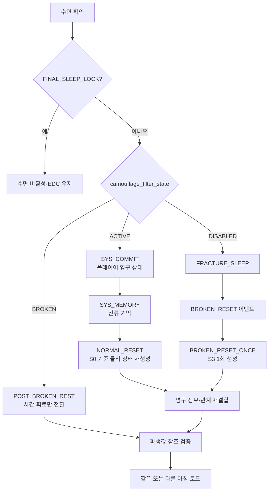
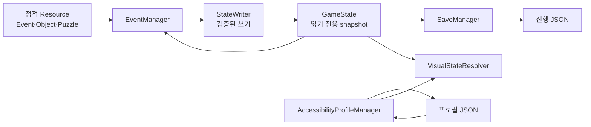
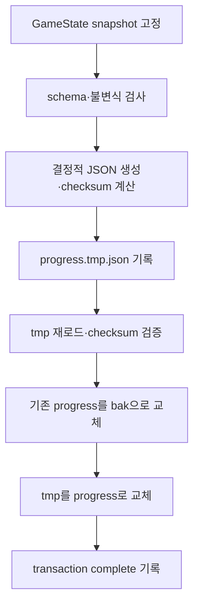
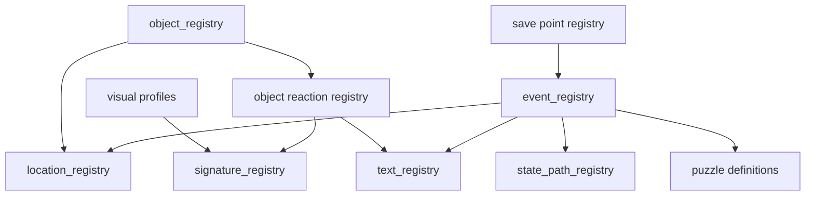

# GGB v0.4 상태 변수·이벤트 ID·Godot 데이터 구조

> 대상 런타임: Windows PC 데스크톱 / Godot 4.7 계열

## 1. 목적

본 문서는 기획 데이터를 Godot으로 이전할 때 필요한 식별자, 상태 소유권, 저장 범위를 정의한다. 프로토타입 코드는 작성하지 않지만 데이터 계약은 v0.4에서 고정한다. GDScript 조각은 컴파일 대상 구현물이 아니라 클래스·필드·호출 경계를 전달하는 인터페이스 명세다.

## 2. ID 규칙

| 대상 | 규칙 | 예시 |
| --- | --- | --- |
| 메인 이벤트 | 흐름도 ID | `P3B`, `B3_B`, `E3_5`, `F0_D` |
| 세부 상호작용 | `사건_OBJ_대상` | `E1_OBJ_BED`, `F3_OBJ_WAKE_DEVICE` |
| 인물 반응 | `인물_구간번호` | `MARA2_S1`, `EDGAR_S3` |
| 비실행 기획 그룹 | 문서 전용 별칭 | `EDGAR_B2` |
| 엔딩 반응 | `인물_ED_분기` | `MARA2_ED_REALITY` |
| 색 이벤트 | `CLR-번호` | `CLR-04` |
| 북쪽 기록 콘텐츠·전환 | `NORTH_ARCHIVE_기능` | `NORTH_ARCHIVE_PORTRAIT_LABEL` |
| `location_id` | 지도 레지스트리의 층·공간 ID | `M1_COLOR_ROOM_ENTRY`, `H0_COLOR_SEPARATION` |
| 기록 | `REC_인물` | `REC_MARA2` |
| 오브젝트 | `OBJ_공간_명칭_번호` | `OBJ_ARCHIVE_PORTRAIT_01` |
| 텍스트 | `TXT_이벤트_분기` | `TXT_MARA2_S1_ASK` |

Godot 리소스 파일명은 소문자 snake_case를 사용한다.

```text
event_e3_5.tres
signature_mara2.tres
reaction_archive_portrait_s2.tres
```

`EDGAR_B2`는 `B2_EDGAR_ENTRY`, `B2_HIDE`, `B2_CAUGHT`를 묶는 문서용 그룹명이다. `.tres`, 완료 플래그, `short_events_seen`, `pending_reactions`에는 `EDGAR_B2`를 저장하지 않는다.

## 3. 상태 소유권

### 영구 저장

```yaml
meta_progress:
  notebook_persistence_confirmed: false
  journal_stage: 0
  knowledge_flags: []
  knowledge_entries: {}
  validated_puzzle_steps: {}
  event_history: {}
  failure_records: {}
  persistent_shortcut_flags: []
  color_signatures_known: []
  researcher_records: []
  servant_states: {}
  object_reaction_memory:
    persistent_seen: []
    per_state_seen: []
  mara2_name_written: false
  mara2_name_attention_seen: false
  mara2_archive_index_known: false
  iris_season_image: unset
  f0_provisional_intent: unset
  final_choice_relation: unresolved
  final_decision: unset
  D5_complete: false
  E1_complete: false
  E1_all_objects_seen: false
  F2_complete: false
  F3_complete: false
```

본편 슬롯과 분리된 프로필 저장:

```yaml
ending_meta:
  reality_seen: false
  stay_seen: false
  any_ending_seen: false
  gallery_unlocked: false
  chapter_select_unlocked: false
```

`ending_meta`는 `SAVE_F3_COMPLETE` 사본을 불러 다른 선택을 확인해도 유지한다. 본편 상태 롤백으로 엔딩 열람 기록을 지우지 않는다.

관련 enum:

```yaml
f0_provisional_intent:
  [unset, reality, stay, undecided]
final_choice_relation:
  [unresolved, reaffirmed, revised, formed]
final_decision:
  [unset, reality, stay]
camouflage_filter_state:
  [ACTIVE, DISABLED, BROKEN]
iris_confession_state:
  type: StringName
  enum: [inferred_only, denied, withheld, indirect, direct_private, public]
  storage: derived_read_only
iris_season_image:
  type: StringName
  enum: [unset, spring, summer, autumn, winter]
  storage: persistent
ending_branch:
  type: StringName
  enum: [unset, reality, stay]
  storage: ending_run
ending_appearance_mode:
  type: StringName
  enum: [unset, layered, contextual]
  storage: ending_run
core_event_lifecycle:
  type: StringName
  enum: [locked, available, in_progress, choice_pending, completed, superseded]
  storage: persistent_in_event_history
```

`iris_confession_state`는 enum 계약에는 포함되지만 `meta_progress`나 사용인 상태에 직렬화하지 않는다. `iris_season_image`는 IRIS_S2의 선택을 보존하는 영구 감각 기억이며 별도 저장한다.

### 루프 저장

```yaml
loop_state:
  loop_index: 0
  world_phase: S0
  time_segment: morning
  completed_daily_tasks: []
  inventory: []
  object_states: {}
  servant_locations: {}
  intervention_budget: {}
  pending_reactions: []
  protagonist_fatigue: 0
  b2_attention_level: 0
  b2_edgar_entry_used: false
  b2_hide_discovered: false
  b2_caught_once: false
  e1_unique_interactions: []
  f3_unique_interactions: []
  current_hard_failure_event_id: null
  route_snapshot: null
  shortcut_resume: null
  object_reaction_runtime:
    loop_counts: {}
    last_reaction_by_object: {}
    pending_reaction_id: null
```

`pending_reactions` 원소:

```yaml
pending_reaction:
  event_id: MARA2_S2
  owner_id: MARA2
  source_event_id: C5_INFO
  location_id: M1_COLOR_ROOM_ENTRY
  queued_at_loop_index: 3
  status: pending
  expires_at_event_id: null
```

허용 상태는 `pending | consumed | superseded`다. NORMAL_RESET은 `pending` 원소를 새 `loop_state`로 이관한 뒤 나머지 물리·당일 상태를 초기화한다. 선행 조건이 사라졌거나 대체 장면이 확정된 항목만 `superseded`로 바꾸며, 같은 `event_id`는 한 개만 유지한다.

### 파열 상태

```yaml
fracture_state:
  broken_reset_triggered: false # BROKEN_RESET_ONCE 완료 여부
  camouflage_filter_state: ACTIVE
  fracture_sleep_complete: false
  relationship_hub_open: false
  e5_locked_in: false
  final_sleep_lock: false
```

정상 RESET은 `camouflage_filter_state=ACTIVE`인 D5 이전에만 `loop_state`를 S0으로 초기화한다. D5 완료는 상태를 `DISABLED`로 바꾸고 다음 수면을 `FRACTURE_SLEEP`로 보낸다. `BROKEN_RESET` 이벤트는 `DISABLED && broken_reset_triggered=false`일 때 `BROKEN_RESET_ONCE`를 실행해 S3를 한 번 생성하고, 완료 묶음에서 필터 상태를 `BROKEN`, 단발 플래그를 `true`로 함께 바꾼다. 이후 휴식은 `POST_BROKEN_REST`로만 라우팅하며 현재 `loop_state`의 공간·수리 상태를 재생성하거나 초기화하지 않는다.

```yaml
fracture_transition:
  event_id: BROKEN_RESET
  action_id: BROKEN_RESET_ONCE
  atomic_group_id: BROKEN_RESET_COMPLETION
  guard:
    all:
      - camouflage_filter_state == DISABLED
      - broken_reset_triggered == false
  trigger: FRACTURE_SLEEP completion
  effects:
    - create_world_phase_S3_once
    - set_camouflage_filter_state_BROKEN
    - set_broken_reset_triggered_true
    - set_fracture_sleep_complete_true
    - run_SYS_SYNC_once
```

| 현재 | 사건 | 다음 | 허용되는 수면 |
| --- | --- | --- | --- |
| `ACTIVE` | D5 이전 | `ACTIVE` | `NORMAL_SLEEP` |
| `ACTIVE` | D5 완료 | `DISABLED` | `FRACTURE_SLEEP` |
| `DISABLED` | D6·FRACTURE_SLEEP | `DISABLED` | `BROKEN_RESET` |
| `DISABLED` | `BROKEN_RESET_COMPLETION` | `BROKEN` | `POST_BROKEN_REST` |
| `BROKEN` | 이후 휴식 | `BROKEN` | `POST_BROKEN_REST` |
| `BROKEN` | `F3_ENTRY` | `BROKEN` | 없음 (`FINAL_SLEEP_LOCK`) |

`camouflage_filter_state=BROKEN ⇔ broken_reset_triggered=true`를 저장 불변식으로 검사한다. `DISABLED`는 D5 완료와 BROKEN_RESET 완료 사이에서만 허용한다. `final_sleep_lock=true`는 세계 상태 enum을 바꾸지 않고 `NORMAL_SLEEP`, `FRACTURE_SLEEP`, `POST_BROKEN_REST` 진입만 차단한다. 조사·저장·F3 재확인·EDC 취소 복귀는 허용한다.

### 엔딩 실행 상태

```yaml
ending_run:
  branch_committed: false
  branch_id: unset
  current_node_id: null
  completed_nodes: []
  required_interactions_seen: []
  optional_interactions_seen: []
  all_ceremony_seen: false
  ending_appearance_mode: unset
  credits_started: false
  credits_completed: false
```

- EDC 커밋 전에는 `branch_committed=false`, `branch_id=unset`이다.
- `completed_nodes`, `required_interactions_seen`, `optional_interactions_seen`은 논리적으로 집합이다. Godot 4.7 런타임과 저장 파일에서는 중복을 제거하고 정렬한 `Array[StringName]`·문자열 배열로 직렬화한다.
- `completed_nodes`에는 EDR·EDS 사건 노드 ID만, 두 interaction Set에는 해당 노드 안의 오브젝트·하위 상호작용 ID만 저장한다.
- `ending_appearance_mode`는 잔류 화면 표시만 바꾸며 최종 결정·관계·메타 해금에 사용하지 않는다.
- `world_phase=S4`는 F구간 코어, `world_phase=S5`는 잔류 엔딩의 `S5_STABILIZED_FRACTURE`다.
- 현실 엔딩은 저택 `world_phase`를 바꾸는 대신 `R0_*` 현실 장면으로 전환한다.

## 3.1 정보 상태 생애주기

`knowledge_entries`는 단순 bool이 아니라 출처와 확신 단계를 가진다.

```yaml
knowledge_entry:
  knowledge_id: KN_J1_POST_COMPLETION_GAP
  state: observed
  source_event_id: J1
  first_loop: 2
  confidence: 2
  notebook_entry_id: NOTE_J1_GAP
```

상태 enum:

| state | 의미 | 예시 |
| --- | --- | --- |
| `unknown` | 아직 관찰하지 않음 | C5 전 외부 거주 가능성 |
| `observed` | 현상·문구를 봄 | J1 잉크점, C2 총량 |
| `hypothesized` | 플레이어 수첩에서 가설화 | 시계 역할, 거울 방향 의심 |
| `verified` | 퍼즐·환경으로 검증 | B3 역할, C3 순서 |
| `authenticated` | 시스템 로그나 F1로 인증 | C5 진단, F1 아버지 원본 |

숏컷과 메인 게이트는 `verified` 이상만 요구한다. 단, C5 진단처럼 시스템 패널에서 나온 사실은 즉시 `authenticated`가 될 수 있다.

## 3.2 실패 기록·ROUTE·숏컷 재개

영구 실패 이력과 현재 루프의 물리 잠금은 분리한다.

```yaml
failure_records:
  FAIL_C4_L0004_01:
    source_event_id: C4
    status: active
    observed_result_id: C4_COATING_HARDENED
    validated_steps:
      - c3_ratio_5_1_2
      - c3_order_water_stabilizer_concentrate
    invalidated_steps:
      - c4_trace_segment_03
    first_loop: 4
    last_loop: 4
    occurrence_count: 1
    supersedes: null
    resolved_by_event_id: null
    resolved_loop: null
```

`failure_id`는 `FAIL_<SOURCE>_L<LOOP>_<SEQ>` 형식의 고유 ID다. 상태 enum은 `active | resolved | superseded`다.

- HARD FAILURE가 발생하면 해당 `source_event_id`의 active 기록을 하나만 유지한다.
- 같은 정보의 반복 실패는 새 기록을 만들지 않고 `last_loop`, `occurrence_count`를 갱신한다.
- 더 구체적인 검증 정보가 생기면 이전 기록을 `superseded`로 바꾸고 새 active 기록의 `supersedes`에 이전 ID를 쓴다.
- B3-B·C4·D1 성공 시 같은 source의 모든 active 기록을 `resolved`로 바꾸고 해결 이벤트·루프를 기록한다.
- `*_hard_failure_seen` 플래그는 과거 열람·통계용이다. ROUTE와 숏컷 진입은 active 실패 기록만 읽는다.

현재 루프의 물리 잠금은 `loop_state.current_hard_failure_event_id`에 source event ID만 기록한다. NORMAL_RESET 때 이 값과 잠긴 오브젝트는 초기화하지만 `meta_progress.failure_records`는 유지한다.

```yaml
route_snapshot:
  snapshot_id: ROUTE_RESET_0004
  reset_transaction_id: RESET_0004
  loop_index: 4
  selected_entry: ENTRY_CSHORT
  active_failure_id: FAIL_C4_L0004_01
  reason_flags: [journal_stage_2, active_failure_C4]
  consumed: false
```

```yaml
shortcut_resume:
  shortcut_id: CSHORT
  active_failure_id: FAIL_C4_L0004_01
  completed_beats: [C2_COMPACT, C2_1_COMPACT]
  interrupted_at: CSHORT_MATERIAL_HANDOFF
  interrupted_by: MARA2_S2
  resume_target: MERGE_C3
```

| 숏컷 | 영구 유지 | 루프 재생성 | `resume_target` |
| --- | --- | --- | --- |
| BSHORT | B3-A 탁본 조립 결과, verified 역할, 실패 위상 범주 | 실제 탁본 세트·역할 카드·다이얼 | `MERGE_B3` |
| CSHORT | C3 비율·순서, C4 verified 구간·실패 지점 | 재료 계량·세정제 실제 재제조 | `MERGE_C3` |
| DSHORT | D0-A 중첩, verified 축, 미확정 축 목록 | 물리 축 위치·압력핀 | `MERGE_D1` |

ROUTE 스냅숏을 불러올 때 `active_failure_id`가 여전히 active인지 다시 확인한다. 이미 resolved·superseded면 스냅숏과 `shortcut_resume`을 폐기하고 현재 J단계의 안전한 기본 진입점으로 다시 계산한다. 성공 처리 시 현재 실패 ID와 같은 숏컷 재개 상태를 함께 지워 과거 ROUTE가 다시 열리지 않게 한다.

`persistent_shortcut_flags`에는 일과 압축과 공간 이동처럼 영구 해금되는 숏컷만 넣는다. BSHORT·CSHORT·DSHORT의 사용 가능 여부는 J단계·verified 정보·active 실패 기록에서 매번 계산하며 별도 bool로 저장하지 않는다.

## 4. 사용인 상태

```yaml
servants:
  mara2:
    owner_id: MARA2
    bond: 0
    alert: 0
    residual_memory: []
    short_events_seen: []
    core_event_complete: false
    researcher_record_acquired: false
    followup_seen: false
    archive_resolution: none
```

공통 제약:

```text
bond: 0..5
alert: 0..5
archive_resolution: none | merged | separated
```

- `bond`와 `alert`는 독립값이다.
- `core_event_complete`는 짧은 반응으로 설정하지 않는다.
- 기록 획득과 핵심 이벤트 완료는 같은 트랜잭션으로 저장한다.
- 핵심 이벤트 완료 뒤 저장 실패가 발생하면 완료 플래그·기록·사용인 상태·관계·event_history 전체를 롤백한다.
- 이리스 고백 상태는 `servants.IRIS.confession_state`에 저장하지 않고 §8의 전역 계산 프로퍼티로만 제공한다.

## 5. 색상 서명

```yaml
color_signature:
  signature_id: purple_archive
  owner_id: MARA2
  hue_id: purple
  hex_tokens: ["#8D5BD6"]
  glyph_id: stacked_frame
  line_pattern: double_outline
  audio_id: archive_trill
  text_label: "ARCHIVE / MARA2"
  accessibility_order: [glyph, line_pattern, text_label, audio]
```

다섯 기본 ID:

```text
navy_lock
orange_wipe
black_lime_pulse
white_yellow_bloom
purple_archive
```

퍼즐 저장값은 HEX나 `hue_id`가 아니라 `signature_id`다.

## 6. 이벤트 정의

### 짧은 반응 공통 정의

```yaml
short_reaction_definition:
  event_id: MARA2_S2
  owner_id: MARA2
  category: servant_short_reaction
  required: false
  location_id: M1_COLOR_ROOM_ENTRY
  trigger_mode: on_location_entry_or_manual_interact
  prerequisites:
    all: [c5_info_complete, color_room_entry_inspectable]
    none: [E3_5_complete]
    unseen_in: servants.MARA2.short_events_seen
  blocked_by: [active_cutscene, active_puzzle_input]
  queue_policy:
    unique_by_event_id: true
    carry_across_normal_reset: true
    play_only_in_free_control: true
  completion_effects:
    add_to_short_events_seen: MARA2_S2
    remove_from_pending_reactions: MARA2_S2
  repeat_policy: once_then_bark
  forbidden_effects:
    - core_event_complete
    - researcher_record_acquired
    - final_decision
    - puzzle_solution
```

실행되는 짧은 반응 ID:

```text
EDGAR_S1, EDGAR_S2, EDGAR_S3
MARA1_S1, MARA1_S2
LUCA_S1, LUCA_S2
IRIS_S1, IRIS_S2
MARA2_S1, MARA2_S2, MARA2_FU
```

`EDGAR_B2`는 위 목록에 들어가지 않는다. 실제 압박 장면은 `B2_EDGAR_ENTRY`, `B2_HIDE`, `B2_CAUGHT`로 실행하며 세 경로 모두 J1로 합류한다.

지연 후속 반응 만료:

| event_id | 대기열 등록 | 권장 확인 | 미확인 만료 | 만료 영향 |
| --- | --- | --- | --- | --- |
| `EDGAR_S3` | E5 완료 | E6 직전 `H0_CLOCK_MACHINE` | E6 완료 | `superseded`; E6·F0 유지 |
| `MARA2_FU` | E3_5 완료 | E5 전 `M1_NORTH_ARCHIVE_HALL` | F0_A 진입 | `superseded`; E3_5·결산 유지 |

특수 영구 결과:

```yaml
short_reaction_choice_effects:
  MARA2_S1:
    correct_label:
      relationship: {bond: 1, alert: 0}
      set_meta: {mara2_name_attention_seen: true}
    tease_name:
      relationship: {bond: 0, alert: 1}
    pretend_not_to_notice: {}
  MARA2_S2:
    compare_channel_length:
      set_meta: {mara2_archive_index_known: true}
    express_concern:
      relationship: {bond: 1, alert: 0}
    request_explanation: {}
    ignore: {}
  IRIS_S2:
    choose_season:
      set_meta_from_choice:
        iris_season_image: selected_season
      allowed_values: [spring, summer, autumn, winter]
```

세 상태는 대사·감각·출처 라벨 변형에만 사용한다. `mara2_archive_index_known=false`이면 E2_INTRO 또는 F0-D-ANON이 익명 인덱스를 제공하지만 이 플래그를 true로 바꾸지 않는다.

### 핵심 관계 사건 공통 정의

```yaml
core_relationship_event_contract:
  required: false
  fail_policy: local_retry
  checkpoint_store: validated_puzzle_steps.EVENT_ID
  lifecycle_store: event_history.EVENT_ID.lifecycle
  outcome_store: event_history.EVENT_ID.outcome_id
  relationship_range: 0..5
  completion:
    atomic_group_id: EVENT_ID_COMPLETION
    write_together:
      - EVENT_ID_complete
      - REC_OWNER
      - servants.OWNER.core_event_complete
      - servants.OWNER.researcher_record_acquired
      - servants.OWNER.bond
      - servants.OWNER.alert
      - event_history.EVENT_ID
    idempotency_key: EVENT_ID_COMPLETION
    rollback_on_any_failure: true
  forbidden_as_gate:
    - J4
    - F0
    - final_decision
    - ending_choice_visibility
```

`relationship_delta_applied`는 완료 트랜잭션 안에서 false에서 true로 한 번만 바뀐다. 이미 true인 동일 transaction ID를 다시 처리하면 관계 수치를 더하지 않고 저장 결과만 검증한다.

```yaml
core_relationship_events:
  E3_1:
    owner_id: MARA1
    location_ids: [M1_SERVICE_HALL, M1_WIRING_ROOM]
    validated_steps:
      - mara1_trace_sources_identified
      - mara1_delete_bridge_removed
      - mara1_log_order_restored
    outcomes:
      original_attribution: {bond: 2, alert: 1}
      protected_identifiers: {bond: 1, alert: -1}
    record_id: REC_MARA1
  E3_2:
    owner_id: IRIS
    location_ids: [M1_GREENHOUSE, H0_CLIMATE_CONTROL]
    validated_steps:
      - iris_sensor_sources_separated
      - iris_power_route_restored
      - iris_authorization_mismatch_verified
    outcomes:
      external_truth: {bond: 2, alert: 0}
      shelter_projection: {bond: 0, alert: 1}
    record_id: REC_IRIS
    knowledge_gained: [iris_power_diversion_known]
  E3_3:
    owner_id: LUCA
    location_ids: [M1_KITCHEN, H0_LIFE_SUPPORT]
    validated_steps:
      - luca_bio_sources_matched
      - luca_pressure_phase_stable
      - luca_wake_criteria_read
    outcomes:
      full_disclosure: {bond: 2, alert: 1}
      stabilize_first: {bond: 1, alert: -1}
    record_id: REC_LUCA
    knowledge_gained: [protagonist_body_preserved, wake_criteria_missing]
  E3_4:
    owner_id: EDGAR
    location_ids: [M1_GREAT_CLOCK, H0_CLOCK_MACHINE]
    validated_steps:
      - edgar_lock_audit_read
      - edgar_authority_owners_matched
      - edgar_authority_layout_validated
    technical_result:
      protection: SYSTEM
      surveillance: CUSTODIAN
      memory: RESIDENT
      choice: SUBJECT
    outcomes:
      responsibility_recorded: {bond: 1, alert: -1}
      authority_returned: {bond: 2, alert: 1}
    record_id: REC_EDGAR
    knowledge_gained: [subject_role_identified, edgar_detention_decision_known]
```

E3_4의 두 outcome은 기술 정답을 바꾸지 않는다. `CHOICE=SUBJECT`를 검증한 뒤 책임을 공식 기록에 남길지, 에드가가 권한을 직접 반환하게 할지만 결정한다.

### J4 확정과 E3 생명주기

```yaml
j4_relationship_boundary:
  confirmation_ui:
    show_incomplete_event_ids: true
    show_estimated_minutes: true
    warn_edgar_minimum_substitution: true
    allow_cancel_to_hub: true
  on_confirm:
    set_state: {journal_stage: 4}
    for_each_incomplete_E3:
      set_event_history_lifecycle: superseded
      clear_active_checkpoint: true
    route:
      when_E3_4_complete: E5
      otherwise: E3_4M
```

J4 확인을 취소하면 아무 상태도 쓰지 않고 E_HUB로 돌아간다. J4 확정 뒤 `superseded`가 된 사건은 기록·관계·완료 수를 주지 않으며 다시 시작할 수 없다.

```yaml
event_definition:
  event_id: E3_4M
  category: minimum_access
  required: conditional_required
  location_id: H0_CLOCK_MACHINE
  prerequisites:
    state_at_least:
      journal_stage: 4
    none_flags: [E3_4_complete]
  completion_effects:
    atomic_group_id: E3_4M_COMPLETION
    set_flags: [edgar_minimum_access]
    set_event_history:
      E3_4:
        lifecycle: superseded
    relationship_changes: {}
    records_gained: []
    forbidden_effects:
      - E3_4_complete
      - REC_EDGAR
      - servants.EDGAR.core_event_complete
      - servants.EDGAR.researcher_record_acquired
  next_objective_id: E5
```

```yaml
event_definition:
  event_id: E3_5
  category: servant_core
  required: false
  entry_location_id: M1_COLOR_ROOM_ENTRY
  location_ids:
    - H0_COLOR_SEPARATION
    - H0_PERSONALITY_ARCHIVE
  time_rule: flexible
  prerequisites:
    all: [E2_INTRO_complete, broken_reset_triggered]
    none: [E3_5_complete, e5_locked_in]
  dialogue_context:
    reads_short_seen: [MARA2_S1, MARA2_S2]
    reads_meta: [mara2_name_attention_seen, mara2_archive_index_known]
    affects_only: [opening_dialogue, owner_label, hint_wording, completion_bark]
    forbidden_as_guard: true
  interaction_nodes:
    - node_id: E3_5_ENTRY
      node_type: transition
      location_id: M1_COLOR_ROOM_ENTRY
      next_node_id: E3_5_SOURCE_SPLIT
    - node_id: E3_5_SOURCE_SPLIT
      node_type: puzzle
      location_id: H0_COLOR_SEPARATION
      validated_step: mara2_sources_separated
      next_node_id: E3_5_PURPLE_OVERLAY
    - node_id: E3_5_PURPLE_OVERLAY
      node_type: puzzle
      location_id: H0_COLOR_SEPARATION
      validated_step: mara2_purple_channel_separated
      next_node_id: E3_5_CHECKSUM_GAPS
    - node_id: E3_5_CHECKSUM_GAPS
      node_type: puzzle
      location_id: H0_COLOR_SEPARATION
      validated_step: mara2_checksum_gaps_found
      next_node_id: E3_5_ARCHIVE_TRANSFER
    - node_id: E3_5_ARCHIVE_TRANSFER
      node_type: transition
      location_id: H0_PERSONALITY_ARCHIVE
      requires_step: mara2_checksum_gaps_found
      next_node_id: E3_5_DISTRIBUTED_BACKUP
    - node_id: E3_5_DISTRIBUTED_BACKUP
      node_type: investigation
      location_id: H0_PERSONALITY_ARCHIVE
      validated_step: mara2_distributed_backup_found
      next_node_id: E3_5_SELF_SACRIFICE_DIALOGUE
    - node_id: E3_5_SELF_SACRIFICE_DIALOGUE
      node_type: dialogue
      location_id: H0_PERSONALITY_ARCHIVE
      next_node_id: E3_5_RELATIONSHIP_CHOICE
    - node_id: E3_5_RELATIONSHIP_CHOICE
      node_type: choice
      location_id: H0_PERSONALITY_ARCHIVE
      choice_id: selected_resolution
      next_by_choice:
        merged: E3_5_MERGED
        separated: E3_5_SEPARATED
    - node_id: E3_5_MERGED
      node_type: branch_result
      location_id: H0_PERSONALITY_ARCHIVE
      next_node_id: E3_5_COMPLETION
    - node_id: E3_5_SEPARATED
      node_type: branch_result
      location_id: H0_PERSONALITY_ARCHIVE
      next_node_id: E3_5_COMPLETION
    - node_id: E3_5_COMPLETION
      node_type: atomic_commit
      location_id: H0_PERSONALITY_ARCHIVE
      atomic_group_id: E3_5_COMPLETION
      next_node_id: E3_5_RETURN
    - node_id: E3_5_RETURN
      node_type: transition
      location_id: H0_PERSONALITY_ARCHIVE
      next_node_id: E_HUB
  resume_policy:
    checkpoint_store: validated_puzzle_steps.E3_5
    exit_target_before_choice_confirmation: E_HUB
    resume_at: first_unvalidated_node
    resume_when_puzzle_solved: E3_5_SELF_SACRIFICE_DIALOGUE
    clear_checkpoint_on_completion: true
  derived_event_state:
    E3_5_puzzle_solved:
      all_validated_steps:
        - mara2_sources_separated
        - mara2_purple_channel_separated
        - mara2_checksum_gaps_found
        - mara2_distributed_backup_found
  completion_effects:
    atomic_group_id: E3_5_COMPLETION
    require_choice: selected_resolution
    allowed_choice_values: [merged, separated]
    set_flags: [E3_5_complete]
    add_records: [REC_MARA2]
    set_from_choice:
      servants.MARA2.archive_resolution: selected_resolution
    servant_changes:
      MARA2:
        core_event_complete: true
        researcher_record_acquired: true
    relationship_by_choice:
      merged:
        bond: 2
        alert: 1
      separated:
        bond: 1
        alert: -1
    clamp_relationship_values: 0..5
    add_knowledge: [mara2_self_sacrifice_known]
    add_signatures: [purple_archive]
    enqueue_reactions:
      - event_id: MARA2_FU
        location_id: M1_NORTH_ARCHIVE_HALL
        expires_at_event_id: F0_A
    set_event_history:
      lifecycle: completed
      outcome_id_from: selected_resolution
      completion_transaction_id: E3_5_COMPLETION
      relationship_delta_applied: true
      completed_at_story_phase: BROKEN_RESET
  branch_variants:
    merged:
      variant_id: E3_5_MERGED
      next_node_id: E3_5_COMPLETION
    separated:
      variant_id: E3_5_SEPARATED
      next_node_id: E3_5_COMPLETION
  merge_node_id: E3_5_COMPLETION
  return_node_id: E3_5_RETURN
  fail_policy: local_retry
  hint_track_id: HINT_E3_5
  color_signature_ids: [purple_archive]
  next_objective_id: E_HUB
```

### E6 코어 접근 정의

```yaml
event_definition:
  event_id: E6
  category: space_unlock
  required: true
  location_id: H0_CLOCK_MACHINE
  time_rule: flexible
  prerequisites:
    state_at_least:
      journal_stage: 4
    all_flags: [e5_locked_in]
    any_flags: [E3_4_complete, edgar_minimum_access]
  completion_effects:
    unlock_locations: [H0_CORE_PATH]
    set_flags: [core_path_open]
  fail_policy: none
  irreversible_after_complete: true
  next_objective_id: F0_A
```

### F0-E 권한·의향 정의

```yaml
event_definition:
  event_id: F0_E
  category: meta_puzzle
  required: true
  location_id: H0_CORE_PATH
  camera_zone_id: F0_SUBJECT_DESK
  prerequisites:
    all_flags:
      - F0_D_complete
    state_equals:
      final_decision: unset
  interaction_nodes:
    - F0_E_PAST_CONTINUITY
    - F0_E_CURRENT_AUTHOR
    - F0_E_PROVISIONAL_INTENT
  completion_effects:
    set_flags:
      - subject_authority_restored
    set_from_choice:
      f0_provisional_intent: selected_intent
  forbidden_effects:
    - final_decision
    - relationship_changes
  branch_variants:
    - INTENT_REALITY
    - INTENT_STAY
    - INTENT_UNDECIDED
  merge_node_id: MERGE_F0_E
  next_objective_id: F1
```

### 정보·일지 데이터 계약

```yaml
event_definition:
  event_id: B2
  category: information_access
  required: true
  location_id: M1_LIBRARY_INNER
  loop_state:
    b2_attention_level: 0
    b2_edgar_entry_used: false
    b2_hide_discovered: false
    b2_caught_once: false
  persistent_outputs:
    optional:
      - library_inner_pressure_seen
      - library_service_alcove_known
  fail_policy: no_fail
  merge_node_id: J1
```

```yaml
event_definition:
  event_id: J4
  category: journal_restoration
  required: true
  location_id: M1_LIBRARY_INNER
  prerequisites:
    all_flags:
      - E2_INTRO_complete
    player_choice:
      - E_HUB_end_investigation
  variant_by:
    researcher_record_count:
      0..1: J4_BASE
      2..4: J4_EXPANDED
      5: J4_FULL
  completion_effects:
    set:
      journal_stage: 4
    set_incomplete_core_events_lifecycle: superseded
    clear_incomplete_core_event_checkpoints: true
  next_route:
    when_E3_4_complete: E5
    otherwise: E3_4M
  fail_policy: local_retry
```

```yaml
event_definition:
  event_id: F1
  category: authenticated_record
  required: true
  location_id: H0_CORE_RECORDS
  prerequisites:
    all_flags:
      - subject_authority_restored
  completion_effects:
    authenticate_sources:
      - J1
      - J2
      - J3
      - J4
    set_flags:
      - father_final_record_seen
  forbidden_effects:
    - final_decision
    - relationship_changes
  next_objective_id: J5
```

```yaml
event_definition:
  event_id: J5
  category: journal_restoration
  required: true
  location_id: H0_CORE_RECORDS
  prerequisites:
    all_flags:
      - father_final_record_seen
  completion_effects:
    set:
      journal_stage: 5
    set_flags:
      - current_choice_authority_confirmed
  forbidden_effects:
    - final_decision
    - f0_provisional_intent
  output_text_marker: "FINAL DECISION: UNSET"
  next_objective_id: F2
```

### D6·E1 파열 수면과 인지 정의

```yaml
event_definition:
  event_id: D6
  category: fracture_sleep_entry
  required: true
  prerequisites:
    all_flags: [D5_complete]
    all_state:
      - camouflage_filter_state == DISABLED
  entry_routes:
    - route_id: D6_BED_CONFIRM
      location_id: M2_BEDROOM
      interaction_id: OBJ_BEDROOM_BED
    - route_id: D6_CAPSULE_CONFIRM
      location_id: H0_SERVICE_SPINE
      interaction_id: OBJ_EMERGENCY_REST_CAPSULE
      object_is_conditional: true
  cancel_behavior: return_to_D6_FREE_INSPECTION
  completion_effects:
    dispatch: FRACTURE_SLEEP
  forbidden_effects:
    - normal_reset
    - world_state_recreation
```

```yaml
event_definition:
  event_id: E1
  category: broken_reset_recognition
  required: true
  location_id: M2_BEDROOM
  prerequisites:
    all_flags: [broken_reset_triggered]
  interaction_nodes:
    - {id: E1_OBJ_BED, object_id: OBJ_BEDROOM_BED}
    - {id: E1_OBJ_WINDOW, object_id: OBJ_BEDROOM_WINDOW}
    - {id: E1_OBJ_MIRROR, object_id: OBJ_BEDROOM_MIRROR}
    - {id: E1_OBJ_CALL_CORD, object_id: OBJ_BEDROOM_CALL_CORD}
  unique_store: loop_state.e1_unique_interactions
  required_unique_count: 3
  repeat_policy: sensory_short_response_only
  completion_effects:
    set_flags: [E1_complete]
    verify_knowledge: [KN_E1_RESET_DID_NOT_RESTORE]
    unlock_exit_to: E2_INTRO
  completion_behavior: stay_in_room_until_player_exits
  optional_all_four_effects:
    set_flags: [E1_all_objects_seen]
    output: E1_FOURTH_OBJECT_BONUS
  forbidden_effects:
    - relationship_changes
    - final_decision
```

### F2 필수 사실 확인 정의

```yaml
event_definition:
  event_id: F2
  category: mandatory_researcher_confrontation
  required: true
  location_id: H0_CORE_CHAMBER
  prerequisites:
    all_flags:
      - current_choice_authority_confirmed
  required_knowledge:
    - KN_F2_PROMISED_FUTURE_BODIES
    - KN_F2_RESEARCHERS_CONVERTED
    - KN_F2_FORCED_SUBJECT_ACTIVATION
    - KN_F2_EXTERNAL_SURVIVAL_UNCERTAIN
    - KN_F2_FINAL_AUTHORITY_BELONGS_TO_SUBJECT
  knowledge_write_policy: verified_only
  fact_check_node_id: F2_FACT_CHECK
  incomplete_route:
    node_id: F2_MANDATORY_RECAP
    behavior: recap_missing_facts_without_choice_or_failure
  completion_guard:
    verified_knowledge_count: 5
  completion_effects:
    set_flags: [F2_complete]
    next_objective_id: F3_ENTRY
  forbidden_reads:
    - f0_provisional_intent
  forbidden_effects:
    - final_decision
    - relationship_changes
```

### F3 최종 확인·잠금·저장 정의

```yaml
event_definition:
  event_id: F3
  category: final_neutral_confirmation
  required: true
  location_id: H0_CORE_CHAMBER
  prerequisites:
    all_flags: [F2_complete]
  on_enter:
    set_state:
      fracture_state.final_sleep_lock: true
    dispatch: FINAL_SLEEP_LOCK
  interaction_nodes:
    - {id: F3_OBJ_WAKE_DEVICE, object_id: OBJ_CORE_WAKE_DEVICE}
    - {id: F3_OBJ_LOOP_STABILIZER, object_id: OBJ_CORE_LOOP_STABILIZER}
    - {id: F3_OBJ_NOTEBOOK, object_id: OBJ_CORE_NOTEBOOK_TERMINAL}
  unique_store: loop_state.f3_unique_interactions
  required_unique_count: 3
  repeat_policy: balanced_summary_only
  completion_effects:
    set_flags: [F3_complete]
    write_save_point: SAVE_F3_COMPLETE
    unlock_event: EDC
  forbidden_reads:
    - f0_provisional_intent
  forbidden_effects:
    - final_decision
    - final_choice_relation
    - relationship_changes
```

```yaml
save_point_definition:
  save_point_id: SAVE_F3_COMPLETE
  write_guard:
    all_flags: [F3_complete]
    all_state:
      - fracture_state.final_sleep_lock == true
      - final_decision == unset
  restore_target:
    event_id: F3
    node_id: F3_COMPLETION
  restore_behavior:
    - keep_final_sleep_lock
    - keep_f3_interaction_set
    - reopen_EDC
```

```yaml
event_definition:
  event_id: EDC
  category: final_decision
  required: true
  location_id: H0_CORE_CHAMBER
  prerequisites:
    all_flags: [F3_complete]
    all_state:
      - fracture_state.final_sleep_lock == true
      - final_decision == unset
  inputs:
    provisional_intent: f0_provisional_intent
    selected_decision: reality_or_stay
  derive:
    final_choice_relation: compare_provisional_and_selected
  cancel_route: F3_COMPLETION
  cancel_effects: []
  confirmation_transaction:
    reality:
      set: {final_decision: reality, final_choice_relation: derived_relation}
      set_ending_run: {branch_committed: true, branch_id: reality}
    stay:
      set: {final_decision: stay, final_choice_relation: derived_relation}
      set_ending_run: {branch_committed: true, branch_id: stay}
  write_save_point: SAVE_ENDING_BRANCH
  post_commit_route:
    when_all_servants_complete: ED_ALL_CEREMONY
    otherwise:
      reality: EDR_ENTRY
      stay: EDS_ENTRY
  atomic_group_id: EDC_FINAL_DECISION
```

```yaml
event_definition:
  event_id: ED_ALL_CEREMONY
  category: conditional_nonblocking
  auto_dispatch_when_guard: true
  required_for_ending_success: false
  prerequisites:
    all:
      - all_servants_complete == true
      - ending_run.branch_committed == true
  completion_effects:
    set_ending_run:
      all_ceremony_seen: true
  next_by_branch:
    reality: EDR_ENTRY
    stay: EDS_ENTRY
  forbidden_effects:
    - final_decision
    - final_choice_relation
    - relationship_changes
    - ending_success
```

### 엔딩 노드·저장 정의

```yaml
ending_definitions:
  ED_REALITY:
    entry: EDR_ENTRY
    required_sequence:
      - EDR_ARCHIVE_STATUS
      - EDR_FAREWELL
      - EDR_DISCONNECT
      - EDR_WAKE_BODY
      - EDR_BODY_CHECK
      - EDR_FIELD_NOTEBOOK
      - EDR_EXIT_PANEL
      - EDR_AIRLOCK_CONFIRM
      - EDR_SURFACE_THRESHOLD
      - EDR_FINAL_FRAME
    optional_nodes:
      - EDR_FACILITY_FREE_LOOK
      - EDR_DISTANT_SIGNAL
  ED_STAY:
    entry: EDS_ENTRY
    required_sequence:
      - EDS_STABILIZE
      - EDS_MEMORY_CHARTER
      - EDS_APPEARANCE_CONTROL
      - EDS_AUTONOMY_CHARTER
      - EDS_CENTRAL_HALL
      - EDS_DINING_ROOM
      - EDS_TABLE_OBJECTS
      - EDS_FINAL_FRAME
    optional_interactions:
      EDS_CENTRAL_HALL:
        - OBJ_STAY_CLOCK
        - OBJ_STAY_SCHEDULE
        - OBJ_STAY_FRONT_DOOR
        - OBJ_STAY_CARPET
        - OBJ_STAY_CALL_CORD
      EDS_TABLE_OBJECTS:
        - OBJ_STAY_STAIN
        - OBJ_STAY_TEA
        - OBJ_STAY_SEASON_WINDOW
        - OBJ_STAY_PORTRAIT_LABEL
        - OBJ_STAY_RAPIER
    required_interactions:
      EDS_TABLE_OBJECTS:
        - OBJ_STAY_NOTEBOOK

node_requirements:
  EDR_BODY_CHECK:
    allowed:
      - OBJ_REALITY_HAND
      - OBJ_REALITY_BREATH_MONITOR
      - OBJ_REALITY_RESTRAINT
    required_unique_count: 2
  EDR_FIELD_NOTEBOOK:
    parent_object_id: OBJ_REALITY_FIELD_NOTEBOOK
    required:
      - FIELD_NOTEBOOK_COVER
      - FIELD_NOTEBOOK_FIRST_72_HOURS
  EDR_EXIT_PANEL:
    parent_object_id: OBJ_REALITY_EXIT_PANEL
    required:
      - EXIT_STATUS_POWER
      - EXIT_STATUS_AIR
      - EXIT_STATUS_MANUAL_RELEASE
```

```yaml
ending_save_points:
  SAVE_ENDING_BRANCH:
    write_after: EDC_FINAL_DECISION
    restore: ED_ALL_CEREMONY_or_branch_entry
  SAVE_ENDING_NODE:
    write_after: each_required_node_or_optional_interaction
    restore: first_incomplete_required_node
  SAVE_ENDING_COMPLETE:
    write_after: ending_final_frame_and_meta_commit
    restore: branch_credits
```

`ENDING_META_COMMIT`은 마지막 화면 뒤, 크레딧 전에 실행한다. `reality_seen` 또는 `stay_seen`, `any_ending_seen`, `gallery_unlocked`, `chapter_select_unlocked`을 프로필 저장에 원자 커밋한 뒤 해당 크레딧으로 이동한다.

```yaml
ending_meta_routes:
  reality:
    final_frame: EDR_FINAL_FRAME
    commit: ENDING_META_COMMIT
    credits: CREDITS_REALITY
  stay:
    final_frame: EDS_FINAL_FRAME
    commit: ENDING_META_COMMIT
    credits: CREDITS_STAY
```

`CREDITS_REALITY`와 `CREDITS_STAY`는 분기별 표시 리소스 ID다. 둘 다 `SAVE_ENDING_COMPLETE`가 확인된 뒤에만 시작하며, 재관람 스킵 여부는 `ending_meta`를 읽되 본편 상태를 다시 쓰지 않는다.

## 7. 이벤트 결과

### E3_1~E3_4 결과 행렬

```yaml
core_relationship_results:
  E3_1:
    atomic_group_id: E3_1_COMPLETION
    outcomes:
      original_attribution: {bond: 2, alert: 1}
      protected_identifiers: {bond: 1, alert: -1}
    common: {flag: E3_1_complete, record: REC_MARA1, owner: MARA1}
  E3_2:
    atomic_group_id: E3_2_COMPLETION
    outcomes:
      external_truth: {bond: 2, alert: 0}
      shelter_projection: {bond: 0, alert: 1}
    common: {flag: E3_2_complete, record: REC_IRIS, owner: IRIS}
  E3_3:
    atomic_group_id: E3_3_COMPLETION
    outcomes:
      full_disclosure: {bond: 2, alert: 1}
      stabilize_first: {bond: 1, alert: -1}
    common: {flag: E3_3_complete, record: REC_LUCA, owner: LUCA}
  E3_4:
    atomic_group_id: E3_4_COMPLETION
    technical_result: {choice: SUBJECT}
    outcomes:
      responsibility_recorded: {bond: 1, alert: -1}
      authority_returned: {bond: 2, alert: 1}
    common: {flag: E3_4_complete, record: REC_EDGAR, owner: EDGAR}
```

각 `common`은 해당 사용인의 `core_event_complete`와 `researcher_record_acquired`도 true로 만든다. 결과 행렬의 관계값은 `0..5`로 clamp하고 `event_history.EVENT_ID.relationship_delta_applied=true`와 같은 트랜잭션에서 한 번만 적용한다.

### 사건 이력 구조

```yaml
event_history_entry:
  event_id: E3_1
  lifecycle: completed
  outcome_id: original_attribution
  completion_transaction_id: E3_1_COMPLETION
  relationship_delta_applied: true
  completed_at_story_phase: BROKEN_RESET
```

허용 outcome:

```yaml
relationship_outcomes:
  E3_1: [original_attribution, protected_identifiers]
  E3_2: [external_truth, shelter_projection]
  E3_3: [full_disclosure, stabilize_first]
  E3_4: [responsibility_recorded, authority_returned]
  E3_5: [merged, separated]
```

불변식:

```text
E3_X_complete
⇔ event_history.E3_X.lifecycle == completed
⇔ event_history.E3_X.outcome_id is valid
⇔ REC_OWNER acquired
⇔ servants.OWNER.core_event_complete
⇔ servants.OWNER.researcher_record_acquired
⇔ event_history.E3_X.relationship_delta_applied
```

```yaml
event_result_variants:
  event_id: E3_5
  atomic_group_id: E3_5_COMPLETION
  merged:
    outcome_id: merged
    set:
      servants.MARA2.archive_resolution: merged
    relationship_changes:
      MARA2: {bond: 2, alert: 1}
  separated:
    outcome_id: separated
    set:
      servants.MARA2.archive_resolution: separated
    relationship_changes:
      MARA2: {bond: 1, alert: -1}
  common:
    completed: true
    persistent_flags: [E3_5_complete]
    servant_changes:
      MARA2:
        core_event_complete: true
        researcher_record_acquired: true
    knowledge_gained: [mara2_self_sacrifice_known]
    records_gained: [REC_MARA2]
    signatures_gained: [purple_archive]
    event_history:
      lifecycle: completed
      outcome_id_from: selected_resolution
      completion_transaction_id: E3_5_COMPLETION
      relationship_delta_applied: true
      completed_at_story_phase: BROKEN_RESET
    next_objective: E_HUB
```

`E3_5_COMPLETION`은 전부 성공하거나 전부 롤백한다. 선택값 저장, `E3_5_complete`, `REC_MARA2`, 마라 2의 핵심 완료·기록 획득, 관계 변화, 지식·서명 획득 사이에 부분 저장을 허용하지 않는다. 같은 completion transaction ID 재시도는 이미 적용된 관계 수치를 다시 더하지 않는다.

불변식:

```text
E3_5_complete
⇔ servants.MARA2.archive_resolution in [merged, separated]
⇔ REC_MARA2 acquired
⇔ servants.MARA2.core_event_complete
⇔ servants.MARA2.researcher_record_acquired
```

### MARA2_FU 결과

```yaml
event_result:
  event_id: MARA2_FU
  completed: true
  add_to_short_events_seen:
    owner_id: MARA2
    event_id: MARA2_FU
  set_servant_fields:
    servants.MARA2.followup_seen: true
  choice_effects:
    write_name:
      set_meta: {mara2_name_written: true}
      relationship_changes:
        MARA2: {bond: 1, alert: 0}
    say_name:
      relationship_changes:
        MARA2: {bond: 1, alert: 0}
    joke:
      relationship_changes:
        MARA2: {bond: 0, alert: 0}
  remove_from_pending_reactions: MARA2_FU
  idempotency_key: MARA2_FU_FIRST_COMPLETE
```

`mara2_name_written`은 E3_5 보존 방식과 별도 영구 bool이다. 수첩에 임시 호칭을 적을 때만 true가 된다. 이름 호명은 false를 유지하면서 bond +1, 장난은 false를 유지하면서 관계 변화 없음이다. 세 선택 모두 MARA2_FU 완료를 최초 한 번만 기록한다.

E3_5 완료 시 MARA2_FU를 `pending_reactions`에 추가한다. E5 전 확인을 권장하지만 E6 뒤 F0 진입 전까지 수동 확인할 수 있다. F0 일방향 진입 시 미확인 항목은 `superseded`로 전환하며 E3_5 완료·관계·기록에는 영향을 주지 않는다.

### 마라 2 엔딩 반응 라우팅

```yaml
ending_reaction:
  reaction_ids: [MARA2_ED_REALITY, MARA2_ED_STAY]
  prerequisites: [E3_5_complete]
  variant_by: servants.MARA2.archive_resolution
  variants:
    merged: MARA2_ARCHIVE_MERGED
    separated: MARA2_ARCHIVE_SEPARATED
  overlays:
    - when: mara2_name_written == true
      variant: MARA2_NAME_WRITTEN
  fallback_when_incomplete: MARA2_ARCHIVE_INCOMPLETE
```

두 엔딩은 같은 저장 필드를 읽고 대사만 다르게 출력한다. `archive_resolution=none`인데 `E3_5_complete=true`인 상태는 엔딩 fallback으로 숨기지 않고 저장 무결성 오류로 처리한다.

### 사용인 5인 엔딩 반응 라우팅

```yaml
ending_owner_reactions:
  EDGAR: [EDGAR_ED_REALITY, EDGAR_ED_STAY]
  MARA1: [MARA1_ED_REALITY, MARA1_ED_STAY]
  LUCA: [LUCA_ED_REALITY, LUCA_ED_STAY]
  IRIS: [IRIS_ED_REALITY, IRIS_ED_STAY]
  MARA2: [MARA2_ED_REALITY, MARA2_ED_STAY]
```

각 반응은 `settlement_tier → owner core_event_complete → owner outcome → bond·alert 연기 강도 → 특수 overlay` 순으로 합성한다. `SERVANT_ED_*`는 폐기된 기획 별칭이며 `.tres`, 저장, 대기열, 이벤트 이력에서 금지한다.

## 8. 주요 플래그

### 진행

```text
P3B_complete
notebook_persistence_confirmed
servant_schedule_known
library_inner_pressure_seen
library_service_alcove_known
library_link_fast_path
c5_info_complete
color_room_entry_inspectable
clock_network_layout_solved
thirteenth_bell_known
mirror_tracing_acquired
basement_overlay_solved
basement_access_fast_path
D5_complete
broken_reset_triggered
fracture_sleep_complete
E1_complete
E1_all_objects_seen
subject_authority_restored
core_path_open
father_final_record_seen
current_choice_authority_confirmed
F2_complete
F3_complete
```

`final_sleep_lock`는 진행 플래그가 아니라 `fracture_state` 소유의 수면 라우팅 잠금이다. F3 진입에서 true가 된 뒤 엔딩 확정 전에는 false로 돌아가지 않는다.

### E1·F2 필수 지식

| 지식 ID | 생성 사건 | 최소 상태 | 의미 |
| --- | --- | --- | --- |
| `KN_E1_RESET_DID_NOT_RESTORE` | E1 고유 오브젝트 3개 확인 | `verified` | 잠든 뒤 세계가 복구되지 않았음을 주인공이 직접 확인 |
| `KN_F2_PROMISED_FUTURE_BODIES` | F2 | `verified` | 연구원들이 미래의 새 신체를 약속받음 |
| `KN_F2_RESEARCHERS_CONVERTED` | F2 | `verified` | 동의 범위를 벗어나 인격 데이터로 전환됨 |
| `KN_F2_FORCED_SUBJECT_ACTIVATION` | F2 | `verified` | 사용인들이 주인공을 강제로 시뮬레이션에 연결함 |
| `KN_F2_EXTERNAL_SURVIVAL_UNCERTAIN` | F2 | `verified` | 바깥 생존 가능성은 보장도 부정도 할 수 없음 |
| `KN_F2_FINAL_AUTHORITY_BELONGS_TO_SUBJECT` | F2 | `verified` | 최종 결정 권한이 주인공에게 귀속됨 |

F2는 위 다섯 지식을 한 장면 안에서 모두 `verified`로 만든다. 누락 시 `F2_MANDATORY_RECAP`이 빠진 사실만 다시 제시하며 실패·관계 변화·엔딩 편향을 발생시키지 않는다.

### F0-E·엔딩 상태

```text
f0_provisional_intent
final_choice_relation
final_decision
ending_run.branch_committed
ending_run.branch_id
ending_run.current_node_id
ending_run.completed_nodes
ending_run.required_interactions_seen
ending_run.optional_interactions_seen
ending_run.all_ceremony_seen
ending_run.ending_appearance_mode
ending_run.credits_started
ending_run.credits_completed
ending_meta.reality_seen
ending_meta.stay_seen
ending_meta.any_ending_seen
ending_meta.gallery_unlocked
ending_meta.chapter_select_unlocked
```

소유권:

- F0-E는 `f0_provisional_intent`만 쓴다.
- EDC는 `final_decision`과 `final_choice_relation`을 같은 트랜잭션에서 쓴다.
- F2·F3·사용인 관계 이벤트는 `f0_provisional_intent`를 읽어 연출을 바꾸지 않는다.
- F3 진입은 `final_sleep_lock`만 쓰고, F3 완료는 `F3_complete`와 `SAVE_F3_COMPLETE`만 쓴다.
- 엔딩 본문은 `final_decision`을 사용하고, 도입 독백만 `final_choice_relation`을 읽는다.
- EDC 커밋은 `ending_run.branch_committed`, `branch_id`, `SAVE_ENDING_BRANCH`를 같은 원자 그룹에서 쓴다.
- ALL 의식과 에필로그는 이미 확정된 `branch_id`를 읽을 뿐 `final_decision`을 다시 쓰지 않는다.
- `ENDING_META_COMMIT`만 본편 슬롯 밖의 `ending_meta`를 쓴다.

### 마라 2·북쪽 구역

| 항목 | 저장 방식 | 생성·해제 조건 |
| --- | --- | --- |
| 기록 회랑·초상화 보관실 접근 | `P3B_complete`로 파생 | 프롤로그 P3B 완료 |
| 내실 연결 숏컷 | `library_link_fast_path` 영구 저장 | J1 뒤 내부 걸쇠 해제 |
| 색분해실 외부 조사 | `color_room_entry_inspectable` 영구 저장 | C5_INFO 완료 |
| `H0_COLOR_SEPARATION` 접근 | `broken_reset_triggered && !e5_locked_in` 파생 | BROKEN_RESET 뒤 E_HUB의 마라 2 목적지 |
| `H0_PERSONALITY_ARCHIVE` 문 | E3_5 로컬 `object_states` | 보라 체크섬 확인 뒤 현재 사건 안에서만 개방 |
| 이름 주의 기억 | `mara2_name_attention_seen` 영구 저장 | MARA2_S1에서 전날 이름표 위치를 정확히 지적 |
| 소유자 확인 인덱스 | `mara2_archive_index_known` 영구 저장 | MARA2_S2에서 보라 채널 길이를 직접 비교 |
| 메인 진행 대체 | 저장 플래그 없음 | 위 인덱스가 없으면 E2_INTRO·F0-D-ANON이 익명 보라 인덱스를 런타임 제공 |
| 관계 결과 | `E3_5_complete`, `mara2_name_written`, `archive_resolution` 영구 저장 | E3_5·MARA2_FU 완료 |

`NORTH_ARCHIVE_*`는 콘텐츠·전환·텍스트 ID에만 쓴다. 위치 ID로는 사용하지 않으며, E3_5의 실제 장면 로드는 위 표의 `M1_*`·`H0_*` 값만 사용한다.

### 짧은 반응 영구 상태

| 상태 | 타입·기본값 | 쓰기 | 읽기 | 진행 가드 사용 |
| --- | --- | --- | --- | --- |
| `mara2_name_attention_seen` | bool=false | MARA2_S1 `correct_label` | E3_5, MARA2_FU | 금지 |
| `mara2_archive_index_known` | bool=false | MARA2_S2 `compare_channel_length` | E2_INTRO, E3_5, F0-D 라벨 | 금지 |
| `iris_season_image` | StringName=`unset` | IRIS_S2 계절 선택 | E3_2 대사·감각 연출 | 금지 |
| `mara2_name_written` | bool=false | MARA2_FU `write_name` | 마라 2 두 엔딩 오버레이 | 금지 |

`short_events_seen`은 사용인별 논리 집합이며 초회 완료만 저장한다. Godot 4.7에서는 중복 없는 `Array[StringName]`으로 보유하고 저장 직전에 사전순 정렬한다. 반복 한 줄 반응은 이 배열을 집합처럼 조회하지만 새 관계 변화나 영구 상태를 쓰지 않는다.

### 관계·결산

```text
E3_1_complete
E3_2_complete
E3_3_complete
E3_4_complete
E3_5_complete
edgar_minimum_access
all_servants_complete
iris_confession_state
J4_BASE_complete
J4_EXPANDED_complete
J4_FULL_complete
settlement_tier
```

`all_servants_complete`는 저장하거나 캐시하지 않는 읽기 전용 계산 프로퍼티다. E3 완료 플래그가 바뀌면 다음 조회부터 즉시 새 값이 반영된다.

```gdscript
var all_servants_complete: bool:
    get:
        return (
            E3_1_complete
            and E3_2_complete
            and E3_3_complete
            and E3_4_complete
            and E3_5_complete
        )
```

`iris_confession_state`도 저장하거나 캐시하지 않는 읽기 전용 `StringName` 계산 프로퍼티다. E3_2 완료 직후뿐 아니라 F2·엔딩 등 모든 소비 시점에 현재 완료 플래그와 이리스 관계 수치를 다시 읽는다.

```gdscript
func derive_iris_confession_state() -> StringName:
    if all_servants_complete:
        return &"public"
    if not E3_2_complete:
        return &"inferred_only"
    if servants.IRIS.bond >= 4:
        return &"direct_private"
    if servants.IRIS.bond >= 2:
        return &"indirect"
    if servants.IRIS.alert >= 4:
        return &"denied"
    return &"withheld"

var iris_confession_state: StringName:
    get:
        return derive_iris_confession_state()
```

```yaml
iris_confession_consumers:
  - reaction_id: IRIS_F2
    read_from: GameState.iris_confession_state
  - reaction_id: IRIS_ED_REALITY
    read_from: GameState.iris_confession_state
  - reaction_id: IRIS_ED_STAY
    read_from: GameState.iris_confession_state
```

세 소비자는 같은 여섯 variant ID를 사용한다. F2의 `settlement_tier`와 엔딩의 `final_decision`은 대사 맥락만 고르며 고백 상태를 쓰거나 덮어쓰지 않는다.

## 9. 파생값

```gdscript
relationship_complete_count =
    int(E3_1_complete)
  + int(E3_2_complete)
  + int(E3_3_complete)
  + int(E3_4_complete)
  + int(E3_5_complete)

researcher_record_count = researcher_records.size()
```

```gdscript
func derive_final_choice_relation(
    provisional_intent: StringName,
    final_decision: StringName
) -> StringName:
    if provisional_intent == final_decision:
        return &"reaffirmed"
    if provisional_intent == &"undecided" or provisional_intent == &"unset":
        return &"formed"
    return &"revised"
```

판정:

```text
records 0..1 → J4_BASE
records 2..4 → J4_EXPANDED
records 5    → J4_FULL

core complete 0..1 → LOW
core complete 2..3 → MID
core complete 4    → HIGH
core complete 5    → ALL

all_servants_complete = (core complete == 5)
```

`settlement_tier`는 `LOW | MID | HIGH | ALL` enum이며, `all_servants_complete`와 별도 파생값이다. 후자는 전원 완료 전용 장면·대사를 여는 기능 플래그로만 사용한다.

연구원 기록 수는 메인 게이트가 아니다.

## 10. Godot 권장 구조

```text
res://
├─ scripts/
│  ├─ autoload/
│  │  ├─ game_state.gd
│  │  ├─ event_manager.gd
│  │  ├─ save_manager.gd
│  │  └─ accessibility_profile_manager.gd
│  ├─ systems/
│  │  ├─ state_writer.gd
│  │  ├─ reset_coordinator.gd
│  │  ├─ reaction_router.gd
│  │  ├─ ending_router.gd
│  │  ├─ visual_state_resolver.gd
│  │  └─ data_contract_validator.gd
│  ├─ data_types/
│  │  ├─ meta_progress.gd
│  │  ├─ loop_state.gd
│  │  ├─ fracture_state.gd
│  │  ├─ reset_state.gd
│  │  ├─ ending_run_state.gd
│  │  ├─ ending_meta.gd
│  │  ├─ accessibility_settings.gd
│  │  ├─ typed_state_value.gd
│  │  ├─ event_definition.gd
│  │  ├─ event_node_definition.gd
│  │  ├─ condition_group.gd
│  │  ├─ state_predicate.gd
│  │  ├─ state_write.gd
│  │  ├─ state_path_registry.gd
│  │  ├─ event_history_entry.gd
│  │  ├─ short_reaction_definition.gd
│  │  ├─ pending_reaction.gd
│  │  ├─ servant_state.gd
│  │  ├─ object_reaction.gd
│  │  ├─ color_signature.gd
│  │  ├─ avatar_visual_profile.gd
│  │  ├─ world_phase_visual_profile.gd
│  │  └─ accessible_ui_descriptor.gd
│  ├─ interactables/
│  └─ ui/
├─ data/
│  ├─ events/
│  ├─ dialogue/
│  ├─ puzzles/
│  ├─ states/
│  ├─ color_signatures/
│  ├─ avatar_visual_profiles/
│  ├─ world_phase_visual_profiles/
│  ├─ accessibility/
│  ├─ object_reactions/
│  ├─ maps/
│  └─ registries/
├─ scenes/
│  ├─ main/
│  ├─ rooms/
│  ├─ ui/
│  └─ events/
└─ assets/
```

책임:

| 구성 | 책임 |
| --- | --- |
| `GameState` | 영구·루프·파열 상태와 파생값 |
| `EventManager` | 이벤트 정의 조회, 실행 생명주기와 시작·완료·실패 신호 소유 |
| `StateWriter` | 선언된 상태 경로에 대한 검증된 단일·원자 쓰기 |
| `ResetCoordinator` | SYS_COMMIT→SYS_MEMORY→물리 초기화→ROUTE 재개 조정 |
| `ReactionRouter` | 짧은 반응 우선순위, 중복 제거, 대기·소비·superseded 처리 |
| `EndingRouter` | EDC 커밋 뒤 ALL 의식·EDR·EDS 노드·메타 커밋 라우팅 |
| `SaveManager` | 트랜잭션 저장, 버전 마이그레이션 |
| `AccessibilityProfileManager` | Windows 창·DPI, 색·문양·자막·입력·글리치 표시 프로필 로드·저장 |
| `VisualStateResolver` | 세계 단계·아바타·서명·이벤트·접근성·포커스 표현 합성 |
| `DataContractValidator` | ID·참조·타입·writer 권한·저장 불변식 정적 검사 |
| `AvatarVisualProfile` | 대표색·실루엣·종족 특징·소품·단계별 외형 |
| `WorldPhaseVisualProfile` | S0~S5·R0 환경 보정과 감각 효과 상한 |
| `AccessibleUIDescriptor` | UI의 이름·역할·상태·설명·행동·live region |
| `EventDefinition` | 선행 조건과 결과 데이터 |
| `EventHistoryEntry` | 핵심 관계 생명주기, outcome, 완료 트랜잭션, 관계 적용 이력 |
| `ShortReactionDefinition` | 초회 조건, 대기열 정책, 선택별 관계·영구 결과 |
| `PendingReaction` | 발생 원인, 위치, 대기 상태, 만료 사건 |
| `ObjectReaction` | 월드 상태별 조사 텍스트 |

## 11. 리셋 처리 순서

정상 리셋은 아래 복구 상태를 세이브 루트에 둔다.

```yaml
reset_state:
  transaction_id: ""
  phase: idle
  player_commit_complete: false
  memory_commit_complete: false
  physical_reset_complete: false
  route_snapshot_id: null
  pending_reactions_snapshot: []
```

`phase` enum:

```text
idle
sleep_confirmed
player_committed
memory_committed
physical_reset_complete
morning_loaded
route_selected
complete
```

재개 규칙:

| 저장 상태 | 재개 위치 | 중복 방지 규칙 |
| --- | --- | --- |
| `idle` | `NORMAL_SLEEP` 확인 대기 | 활성 transaction 없음 |
| `sleep_confirmed` | `SYS_COMMIT` | 새 `transaction_id`를 한 번만 발급 |
| `player_committed` | `SYS_MEMORY` | 완료된 플레이어 영구 효과를 다시 적용하지 않음 |
| `memory_committed` | `NORMAL_RESET` | 두 완료 플래그가 모두 참일 때만 물리 상태 폐기 |
| `physical_reset_complete` | MORNING 로드 | 폐기 단계를 다시 실행하지 않음 |
| `morning_loaded` | ROUTE 판정 | 기존 아침 월드 재사용 |
| `route_selected` | 선택한 진입점 로드 | 기존 `route_snapshot_id` 재사용 |
| `complete` | 완료된 아침 유지 | 같은 transaction 요청은 no-op |

각 영구 효과와 잔류 기억에는 적용한 `transaction_id`를 기록한다. 저장 중 종료 후 같은 ID로 재개해도 완료 플래그가 참인 단계와 이미 적용된 효과는 건너뛴다.
각 단계는 결과와 다음 `phase`를 같은 원자적 저장으로 확정한 뒤 진행한다. 완료 플래그와 `phase`가 어긋나면 완료 플래그가 가리키는 마지막 안전 단계로 되돌려 재개한다.


```mermaid
flowchart TD
    S["수면 확인"] --> F{"FINAL_SLEEP_LOCK?"}
    F -- "예" --> L["수면 비활성·EDC 유지"]
    F -- "아니오" --> C{"camouflage_filter_state"}
    C -- "BROKEN" --> R["POST_BROKEN_REST<br/>시간·피로만 전환"]
    C -- "DISABLED" --> FS["FRACTURE_SLEEP"]
    FS --> BR["BROKEN_RESET 이벤트"]
    BR --> O["BROKEN_RESET_ONCE<br/>S3 1회 생성"]
    C -- "ACTIVE" --> SC["SYS_COMMIT<br/>플레이어 영구 상태"]
    SC --> SM["SYS_MEMORY<br/>잔류 기억"]
    SM --> N["NORMAL_RESET<br/>S0 기준 물리 상태 재생성"]
    N --> P["영구 정보·관계 재결합"]
    O --> P
    R --> V["파생값·참조 검증"]
    P --> V
    V --> M["같은 또는 다른 아침 로드"]
```

정상 리셋:

1. `reset_state` transaction을 생성하거나 미완료 transaction을 재개한다.
2. `SYS_COMMIT`으로 플레이어 영구 획득분을 커밋한다.
3. `SYS_MEMORY`로 사용인 잔류 기억을 압축·커밋한다.
4. `pending` 상태인 짧은 반응을 `pending_reactions_snapshot`에 중복 없이 복사한다.
5. 두 완료 플래그가 모두 참인 경우에만 인벤토리·물리 오브젝트·시간대를 폐기한다.
6. S0 템플릿으로 새 루프를 만들고 유효한 대기 반응을 다시 결합한 뒤 `route_snapshot_id`를 기록한다.
7. 영구 숏컷·수첩·관계를 다시 적용한 뒤 ROUTE를 판정한다.

강제 종료 회귀 경로:

1. transaction 생성 직후 종료하면 `SYS_COMMIT`부터 재개한다.
2. `SYS_COMMIT` 직후 종료하면 플레이어 효과를 중복 적용하지 않고 `SYS_MEMORY`부터 재개한다.
3. `SYS_MEMORY` 직후 종료하면 잔류 기억을 중복 생성하지 않고 `NORMAL_RESET`부터 재개한다.
4. 물리 상태 폐기 직후 종료하면 폐기를 반복하지 않고 같은 `route_snapshot_id`로 아침 생성을 재개한다.
5. ROUTE 스냅숏 생성 직후 종료하면 새 스냅숏을 만들지 않고 기존 판정을 재사용한다.

대기열 스냅숏을 복구할 때 이미 `short_events_seen`에 있는 ID, 선행 조건이 사라진 ID, `superseded` ID는 제거한다. 나머지는 원래 `source_event_id`와 발생 순서를 유지하되 한 공간 진입당 자동 대화 1개 규칙을 다시 적용한다.

BROKEN_RESET 단발 전환:

1. `BROKEN_RESET`은 `broken_reset_triggered=false`일 때만 호출한다.
2. `BROKEN_RESET_ONCE`가 S3 손상 템플릿을 생성하고 `world_phase=S3`을 기록한다.
3. 고딕 필터는 재적용하지 않고 `broken_reset_triggered=true`, `fracture_sleep_complete=true`를 커밋한다.
4. SYS_SYNC가 E구간 관계 허브와 완료된 장치 상태를 한 번 재결합한다.

POST_BROKEN_REST:

1. `broken_reset_triggered=true`이면 이 경로만 허용한다.
2. `time_segment`와 `protagonist_fatigue`만 갱신한다.
3. `world_phase`, `object_states`, 사용인 위치, E3 수리 결과, 관계 상태는 유지한다.

## 12. 개입 예산

사용인이 이전 루프를 기억해도 퍼즐을 항상 막지 않는 시스템 근거다.

```yaml
intervention_budget:
  EDGAR:
    question: 1
    physical_block: 1
    report: 1
```

- 관리 프로토콜은 사용인에게 제한된 횟수의 개입만 허용한다.
- 사용인끼리 서로 감시하므로 근거 없는 강제 구금은 보안 위반이다.
- 높은 `alert`는 개입 종류를 바꾸지만 필수 순찰 공백을 삭제하지 않는다.
- 검증된 숏컷은 시스템 승인으로 간주되어 재차 막을 수 없다.
- D5 이후에는 관리 프로토콜이 손상되어 관계 이벤트로 책임이 이동한다.

## 13. 저장 버전

```yaml
save_header:
  schema_version: 12
  content_version: "v0.4"
  engine_version: "4.7"
  slot_id: ""
  save_point_id: null
  transaction_id: ""
  created_at_utc: 0
  updated_at_utc: 0
  checksum_algorithm: sha256
  checksum: ""
```

마이그레이션 원칙:

`schema_version=12`는 공통 오브젝트 반응 리소스, 첫·반복 조사 수명 주기와 canonical 오브젝트 레지스트리를 추가한다. 접근성 표시 설정은 진행 schema와 분리된 profile v1으로 관리한다. 버전 11의 엔딩 실행 상태와 이전 스키마를 모두 유지한다. 버전 11 이하는 기존 단계별 변환을 순서대로 적용한 뒤 아래 v12 규칙으로 한 번 더 변환해 저장한다.

v12 추가 변환:

- `object_reaction_memory`가 없으면 빈 `persistent_seen`, `per_state_seen` 논리 집합을 생성하고 중복 없는 문자열 배열로 저장한다.
- `object_reaction_runtime`은 로드 중인 world phase를 기준으로 빈 `loop_counts`, `last_reaction_by_object`, `pending_reaction_id`를 생성한다.
- E1·F3·EDR·EDS의 기존 interaction 논리 집합은 해당 사건 저장에 그대로 남긴다. 이를 일반 `persistent_seen`으로 복제하지 않는다.
- 구식 시뮬레이션 수첩 오브젝트 ID가 있으면 `OBJ_SUBJECT_NOTEBOOK_SIM`으로, 현실 수첩은 `OBJ_REALITY_FIELD_NOTEBOOK`으로 분리한다.
- 비정식 초상화 예제 ID는 위치에 따라 `OBJ_HALL_FAMILY_PORTRAIT` 또는 `OBJ_ARCHIVE_PORTRAIT_01`로 바꾼다. 위치를 알 수 없으면 반응 이력만 폐기하고 진행 플래그는 보존한다.
- 구식 첫 조사 bool은 대응 `reaction_id`가 명확한 경우에만 `persistent_seen`으로 옮긴다. 불명확한 경우 첫 문구 재생을 허용하되 정보·관계 보상을 재적용하지 않는다.
- `per_state_seen` 항목은 `(reaction_id, world_phase, object_state)` 구조로 정규화한다.
- `loop_counts`는 세이브 복구 편의용이며 NORMAL_RESET 마이그레이션 시 빈 맵으로 만든다.
- 엔딩 required·optional Set에 등록되지 않은 오브젝트 ID는 제거하고 `MIGRATION_ENDING_OBJECT_UNKNOWN` 경고를 남긴다.
- 구형 schema 12 프로필에 `object_accessibility`가 없으면 당시 기본 구조를 생성한 뒤 §17.3에 따라 접근성 프로필 v1으로 이관한다. 표시 설정은 진행 상태를 바꾸지 않는다.

v11 추가 변환:

- `ending_run`이 없으면 기본 구조를 생성한다.
- `final_decision=unset`이면 `branch_committed=false`, `branch_id=unset`으로 둔다.
- `final_decision=reality|stay`인데 엔딩 완료 이력이 없으면 해당 `branch_id`와 `branch_committed=true`를 복원하고 `SAVE_ENDING_BRANCH`를 생성한다.
- 구식 엔딩 진행 노드가 있으면 EDR·EDS 대응표로 변환한다. 대응할 수 없는 노드는 해당 분기의 ENTRY로 안전 복귀하며 관계·선택을 재적용하지 않는다.
- 구식 `ED_REALITY_LOW|MID|HIGH|ALL`, `ED_STAY_LOW|MID|HIGH|ALL`은 이벤트 ID로 보존하지 않는다. `settlement_tier`를 현재 E3 완료 플래그에서 재계산하고 부모 분기 ENTRY로 변환한다.
- `SERVANT_ED_REALITY_*`, `SERVANT_ED_STAY_*`는 저장·대기열에서 제거하고 owner별 10개 반응 ID로 다시 라우팅한다.
- 잔류 엔딩의 구식 `world_phase=S4` 진행 이력은 코어 F구간과 구분할 수 있는 `final_decision=stay` 또는 EDS 이력이 있을 때만 S5로 변환한다.
- `ending_appearance_mode`가 없으면 S5 진입 전 `unset`, S5 진행 중이면 `contextual`로 생성한다.
- 프로필 `ending_meta`가 없으면 완료된 크레딧·엔딩 이력에서 seen 값을 복원한다. 불명확하면 false를 유지한다.
- `completed_nodes`는 현재 분기의 EDR·EDS 노드 ID만 남기고 중복을 제거한다.
- `required_interactions_seen`, `optional_interactions_seen`은 현재 분기에서 허용한 오브젝트·하위 상호작용 ID만 남기고 중복을 제거한다.

v10 추가 변환:

- `D5_complete`, `E1_complete`, `E1_all_objects_seen`, `F2_complete`, `F3_complete`, `final_sleep_lock`이 없으면 false로 생성한다.
- 구식 진행 이력에 D5 완료가 있으면 `D5_complete=true`를 복원한다. `broken_reset_triggered=true`만으로 E1 완료를 추정하지 않는다.
- `E1_complete=true`인데 `KN_E1_RESET_DID_NOT_RESTORE`가 없으면 E1 완료 이력을 출처로 `verified` 지식을 생성한다. 네 번째 오브젝트 확인은 추정하지 않으므로 `E1_all_objects_seen=false`를 유지한다.
- `F2_complete=true`인 구식 세이브는 F2 완료 이력을 출처로 다섯 필수 지식을 모두 `verified`로 생성한다. F2가 완료되지 않았으면 이전 대사 이력만으로 일부 사실을 추정하지 않는다.
- `F3_complete=true`, `final_decision!=unset`, 활성 사건이 F3·EDC, 또는 현재 목표가 F3·EDC 중 하나면 `final_sleep_lock=true`로 복원한다. 그 외에는 false를 유지한다.
- `F3_complete=true`인 구식 세이브는 `SAVE_F3_COMPLETE` 복구 지점을 생성한다. `final_decision=unset`이면 F3 완료 지점에서 EDC를 다시 열고, 이미 결정되었다면 해당 엔딩으로 라우팅한다.
- `e1_unique_interactions`, `f3_unique_interactions`는 완료된 세부 상호작용 이력이 있을 때만 복원한다. 이력이 없고 사건도 미완료라면 빈 집합으로 두어 해당 조사만 다시 수행하게 한다.
- E1 또는 F3가 완료됐지만 세부 집합 이력이 없으면 완료 플래그를 우선한다. 각각 요구 개수를 충족한 `legacy_completion` 표식을 넣고 완료 보상을 재적용하지 않는다.
- 최종 잠금은 F3 완료가 아니라 F3 진입에서 시작한다. 마이그레이션으로 F3 내부에 복귀한 세이브도 수면 명령을 차단하지만 조사·저장·EDC 취소는 허용한다.

v9 이하 기존 변환:

- E3_X 완료 플래그와 REC_OWNER, 사용인 핵심 완료·기록 획득이 모두 있으면 `event_history.E3_X.lifecycle=completed`를 생성한다.
- 저장된 outcome이 허용값이면 그대로 이관하고 `relationship_delta_applied=true`로 둔다.
- 완료 상태지만 E3_1~E3_4 outcome이 없으면 임의로 추정하지 않는다. `E3_X_OUTCOME_RECOVERY`에서 관계 선택만 다시 받고 기존 완료·기록·관계 수치를 재적용하지 않은 채 outcome만 보수한다.
- `journal_stage>=4`인데 완료되지 않은 E3_X는 `event_history.E3_X.lifecycle=superseded`로 생성한다.
- E3_4 미완료이며 `edgar_minimum_access=true`인 세이브는 E3_4를 `superseded`로 두고 REC_EDGAR나 완료 플래그를 생성하지 않는다.
- 완료 플래그·기록·사용인 완료 상태가 부분적으로만 존재하면 자동 추정하지 않고 `MIGRATION_CORE_EVENT_PARTIAL_STATE` 오류를 남겨 원자 완료 복구 화면으로 보낸다.

- `broken_reset_triggered=true` 또는 `fracture_sleep_complete=true`면 legacy 필터 bool과 무관하게 `camouflage_filter_state=BROKEN`으로 변환한다.
- 그 외에 `D5_complete=true`, `camouflage_filter_disabled=true`, `camouflage_filter_enabled=false` 중 하나라도 참이면 `DISABLED`로 변환한다.
- 위 진행 근거가 없으면 `ACTIVE`로 변환한다.
- 두 legacy bool이 모순되면 더 진행된 상태를 보존하는 `BROKEN > DISABLED > ACTIVE` 우선순위를 적용하고 `MIGRATION_CAMOUFLAGE_POLARITY_CONFLICT` 경고를 한 번 남긴다.
- 변환 성공 뒤 `camouflage_filter_enabled`, `camouflage_filter_disabled` 키를 제거하고 enum 하나만 저장한다.

- `mara2_name_attention_seen`이 없으면 false로 생성한다.
- `mara2_archive_index_known`이 없으면 false로 생성한다. 익명 보라 인덱스를 본 이력만으로 true를 추정하지 않는다.
- `iris_season_image`가 없으면 `unset`으로 생성한다. 허용값 밖의 값은 `unset`으로 보정하고 `MIGRATION_IRIS_SEASON_INVALID` 경고를 남긴다.
- 구식 `MARA2_FU_seen=true`는 `servants.MARA2.short_events_seen`에 `MARA2_FU`를 추가하고 `followup_seen=true`로 변환한 뒤 키를 제거한다.
- 문자열 배열 형태의 구식 `pending_reactions`는 각 ID에 owner·source·location을 이벤트 정의에서 보충해 구조화한다. 정의를 찾지 못한 ID는 대기열에서 제거하고 경고를 남긴다.
- `EDGAR_B2` 또는 `EDGAR_B2_seen`은 실행 상태로 이관하지 않는다. 실제 B2 하위 이벤트 이력과 `library_inner_pressure_seen`만 보존한다.

- 없는 마라 2 상태는 기본값으로 생성한다.
- 기존 4인 완료 상태는 유지한다.
- `all_servants_complete`는 5인 기준으로 다시 계산한다.
- 색상 값이 직접 저장되어 있으면 소유자 기반 `signature_id`로 변환한다.
- `f0_provisional_intent`가 없고 F0-E 이전이면 `unset`으로 생성한다.
- `f0_provisional_intent`가 없지만 `subject_authority_restored=true`면 `undecided`로 생성한다.
- `final_choice_relation`이 없으면 `unresolved`로 생성한다.
- 이미 final_decision이 확정된 기존 세이브는 로드 시 final_choice_relation을 `formed`로 보정한다.
- 구식 `hard_failure_id`가 있으면 `current_hard_failure_event_id`로 옮긴다. 해당 퍼즐의 성공 플래그가 없을 때만 검증 단계가 빈 legacy active 실패 기록을 생성한다.
- 성공 플래그가 이미 있는 source의 legacy active 기록은 로드 즉시 resolved로 보정한다.
- 구식 `route_snapshot`에 active 실패 ID가 없으면 source event로 active 기록을 찾아 연결하고, 찾지 못하면 스냅숏을 폐기해 안전 진입점을 다시 계산한다.
- `E3_5_complete=true`인데 `archive_resolution=none`인 구식 세이브는 저장된 E3_5 `outcome_id`로 merged·separated를 복원한다.
- `outcome_id`도 없으면 값을 추정하지 않는다. gameplay 진입 전에 `E3_5_RESOLUTION_RECOVERY` 선택만 다시 보여 주고, 기존 관계·기록 효과를 재적용하지 않은 채 `archive_resolution`만 보수한다.
- 구식 또는 실험 세이브에 `servants.IRIS.confession_state`가 있으면 값은 읽지 않고 제거한다. 로드 직후 현재 E3 플래그·IRIS bond·alert에서 `iris_confession_state`를 계산한다.

## 14. 참조 무결성 검사

빌드 전 검사 항목:

```text
모든 event_id가 유일하다.
모든 prerequisite 플래그가 선언되어 있다.
모든 location_id가 지도에 존재한다.
모든 signature_id가 색상 표에 존재한다.
모든 기록 ID가 정확히 한 사용인에게 귀속된다.
선택 이벤트가 F0 또는 엔딩 진입 조건에 포함되지 않는다.
색 제거 모드에서 필수 interaction_nodes가 남는다.
F0-E가 final_decision을 쓰지 않는다.
EDC 이전에는 final_choice_relation이 unresolved다.
세 provisional intent가 모두 MERGE_F0_E에 도달한다.
source event마다 active failure가 최대 하나다.
resolved·superseded failure는 ROUTE 조건을 충족하지 않는다.
route_snapshot과 shortcut_resume의 active_failure_id가 실제 active 기록을 가리킨다.
camouflage_filter_state가 ACTIVE, DISABLED, BROKEN 중 하나다.
camouflage_filter_enabled와 camouflage_filter_disabled가 저장·가드·라우터에 남아 있지 않다.
camouflage_filter_state == BROKEN ⇔ broken_reset_triggered == true다.
DISABLED에서만 BROKEN_RESET_ONCE를 시작하고 BROKEN_RESET_COMPLETION이 필터 상태·S3·완료 플래그를 원자적으로 확정한다.
E3_5_ENTRY부터 E3_5_RETURN까지 모든 next_node_id가 존재하고 E_HUB에 도달한다.
E3_5_MERGED와 E3_5_SEPARATED가 E3_5_COMPLETION 하나로 합류한다.
E3_5 완료 묶음의 다섯 불변 상태가 모두 일치한다.
E3_1~E3_4 완료 묶음도 플래그·기록·사용인 상태·event_history·관계 적용 이력이 일치한다.
모든 완료 E3의 outcome_id가 해당 이벤트 허용값에 포함된다.
J4 확정 뒤 미완료 E3의 lifecycle이 superseded이며 검증 체크포인트가 활성 상태로 남지 않는다.
E3_4M이 E3_4_complete, REC_EDGAR, EDGAR 핵심 완료·기록 획득, 관계 수치를 쓰지 않는다.
MARA2_ED_REALITY와 MARA2_ED_STAY가 같은 archive_resolution을 읽는다.
iris_confession_state가 정확히 여섯 값 중 하나이며 저장 필드가 아니다.
IRIS_F2, IRIS_ED_REALITY, IRIS_ED_STAY가 모두 GameState.iris_confession_state를 읽는다.
EDGAR_B2가 event resource, seen flag, pending reaction ID로 생성되지 않는다.
모든 짧은 반응 ID가 정확히 한 owner_id와 location_id를 가진다.
pending_reactions의 event_id가 short_events_seen에 이미 있으면 로드 검증에서 제거된다.
mara2_name_attention_seen, mara2_archive_index_known, iris_season_image가 진행 가드에 사용되지 않는다.
iris_season_image가 unset, spring, summer, autumn, winter 중 하나다.
MARA2_FU의 세 선택이 모두 F0 준비 흐름으로 합류하며 write_name만 mara2_name_written을 쓴다.
E1 interaction_nodes가 네 개이며 서로 다른 object_id를 사용하고 required_unique_count가 3이다.
E1_complete이면 KN_E1_RESET_DID_NOT_RESTORE가 verified다.
F2_complete이면 다섯 required_knowledge가 모두 verified다.
F2_MANDATORY_RECAP은 누락 지식만 보수하며 실패·관계·final_decision을 쓰지 않는다.
F3_ENTRY는 final_sleep_lock=true를 쓰고 F3 완료 전에도 수면 명령을 차단한다.
F3 interaction_nodes가 세 개이며 required_unique_count가 3이다.
F3는 f0_provisional_intent를 읽지 않고 final_decision·final_choice_relation을 쓰지 않는다.
F3_complete이면 SAVE_F3_COMPLETE가 존재하고 EDC가 열려 있다.
EDC 취소는 F3_COMPLETION으로 돌아가며 final_sleep_lock을 해제하지 않는다.
S4는 코어 상태, S5는 안정화 잔류 상태이며 같은 값으로 직렬화되지 않는다.
EDC_FINAL_DECISION이 final_decision·final_choice_relation·ending_run 분기·SAVE_ENDING_BRANCH를 원자 저장한다.
ED_ALL_CEREMONY는 EDC 커밋 뒤에만 실행되고 엔딩 성공·관계 상태를 쓰지 않는다.
all_servants_complete=false여도 선택한 EDR_ENTRY 또는 EDS_ENTRY에 도달한다.
EDR_BODY_CHECK의 허용 대상은 3개, required_unique_count는 2다.
EDR_FIELD_NOTEBOOK은 시뮬레이션 수첩과 다른 object_id를 사용한다.
EDS_APPEARANCE_CONTROL의 두 값이 분기·관계·메타 결과를 바꾸지 않는다.
모든 required ending node 완료 뒤에만 FINAL_FRAME이 열리고 선택 노드는 필수 Set에 포함되지 않는다.
ENDING_META_COMMIT이 크레딧보다 먼저 실행된다.
SERVANT_ED_* 그룹 ID가 이벤트 리소스·저장·대기열에 남아 있지 않다.
```

## 15. 기획 QA 시나리오

1. 마라 2를 제외한 0명 완료 후 F0와 두 엔딩 진입.
2. 마라 2만 완료 후 J4_BASE와 LOW 결산.
3. 임의 3명 완료 후 J4_EXPANDED와 MID 결산.
4. 임의 4명 완료 후 J4_EXPANDED와 HIGH 결산.
5. 5명 완료 후 J4_FULL, ALL, `all_servants_complete`, 추가 장면.
6. E3_5 미완료 상태에서 익명 보라 인덱스로 F0-D 해결.
7. 색 제거·음량 0 상태에서 P3B, E3_5, F0-D 해결.
8. D5 전 정상 RESET과 D5 후 BROKEN_RESET 데이터 비교.
9. F0-E reality·stay·undecided 각각에서 F1 진입.
10. provisional intent 3종과 final decision 2종의 여섯 조합 검증.
11. revised 경로에서 관계·기록·엔딩 선택지 변화가 없는지 확인.
12. B3-B 실패→BSHORT 중단·로드→MERGE_B3 재개→성공 뒤 BSHORT 미노출.
13. C4 실패→CSHORT에서 재료 재확보·C3 재제조→성공 뒤 C4 기록 resolved.
14. D1 실패→DSHORT에서 verified 축만 재현→성공 뒤 지하 숏컷 해금·DSHORT 미노출.
15. E3_5 merged 선택을 저장·로드한 뒤 두 엔딩에서 merged 반응과 이름 작성 overlay 확인.
16. E3_5 separated 선택을 저장·로드한 뒤 두 엔딩에서 separated 반응과 이름 미작성 상태 확인.
17. E3_5_COMPLETION 각 쓰기 단계에서 강제 종료해 전부 롤백 또는 전부 완료되는지 확인.
18. E3_5_ENTRY에서 각 퍼즐 노드·두 선택 결과·완료 묶음을 거쳐 E_HUB에 복귀하는지 확인.
19. E3_5 중도 이탈·로드에서 첫 미검증 노드 또는 E3_5_SELF_SACRIFICE_DIALOGUE로 재개하고 완료 효과가 미리 적용되지 않는지 확인.
20. 이리스 판정의 여섯 경계 조합에서 `inferred_only`, `denied`, `withheld`, `indirect`, `direct_private`, `public`을 각각 확인.
21. 같은 세이브에서 IRIS_F2·IRIS_ED_REALITY·IRIS_ED_STAY가 동일 상태를 읽고, 마지막 핵심 관계 완료 직후 캐시 없이 `public`으로 바뀌는지 확인.
22. 새 게임에서 `ACTIVE → D5 → DISABLED → FRACTURE_SLEEP → BROKEN_RESET_COMPLETION → BROKEN` 순서를 확인.
23. D5 완료 저장과 BROKEN_RESET_COMPLETION의 각 쓰기 단계에서 강제 종료해 상태 enum과 완료 플래그가 함께 롤백 또는 완료되는지 확인.
24. legacy bool의 정상·반대 극성·누락 조합과 기존 D5·BROKEN_RESET 진행값을 스키마 10으로 옮겨 `BROKEN > DISABLED > ACTIVE` 결과와 키 제거를 확인.
25. MARA2_S1의 세 선택에서 `mara2_name_attention_seen`은 이름표 위치를 정확히 지적한 경우에만 true가 되는지 확인.
26. MARA2_S2를 건너뛴 뒤 E2_INTRO 익명 인덱스로 진행해도 `mara2_archive_index_known=false`가 유지되는지 확인.
27. IRIS_S2 네 계절을 각각 저장·로드하고 E3_2가 같은 `iris_season_image`를 읽되 정답·결산에는 영향이 없는지 확인.
28. MARA2_FU의 write_name·say_name·joke에서 각각 이름 기록/bond 결과가 다르고 세 경로 모두 E6·F0에 도달하는지 확인.
29. 짧은 반응을 대기열에 둔 채 NORMAL_RESET하고 초회 반응이 보존되며, 확인 뒤 같은 ID가 다시 예약되지 않는지 확인.
30. legacy `MARA2_FU_seen`, 문자열 대기열, `EDGAR_B2_seen`을 스키마 10으로 변환해 실제 이벤트 이력만 남는지 확인.
31. E3_1~E3_4의 두 outcome을 각각 완료해 정확한 bond·alert와 event_history가 한 번만 적용되는지 확인.
32. E3_2 `external_truth`는 bond +2·alert 0, `shelter_projection`은 bond 0·alert +1인지 확인.
33. E3_4 두 outcome 모두 기술 결과 `CHOICE=SUBJECT`를 유지하는지 확인.
34. J4 확인을 취소하면 E_HUB와 모든 E3 체크포인트가 유지되는지 확인.
35. E3_4 미완료로 J4를 확정하면 E3_4가 superseded되고 E3_4M만 실행되며 기록·관계·완료 수가 늘지 않는지 확인.
36. E3_4 완료 뒤 J4를 확정하면 E3_4M 없이 E5로 이어지는지 확인.
37. schema 8의 완료 E3를 schema 9 변환 뒤 schema 10으로 옮길 때 outcome이 없으면 복구 선택이 outcome만 보수하고 관계 수치를 재적용하지 않는지 확인.
38. 완료 트랜잭션 각 쓰기 단계에서 강제 종료해 플래그·기록·사용인 상태·event_history가 전부 롤백 또는 전부 완료되는지 확인.
39. D6에서 침실 침대와 서비스 척추 비상 캡슐을 각각 선택해 같은 FRACTURE_SLEEP로 합류하며 취소 시 자유 조사로 돌아가는지 확인.
40. E1 네 오브젝트 중 임의 세 개로 완료하고 네 번째는 보너스만 주며, 같은 오브젝트 반복이 고유 수를 늘리지 않는지 확인.
41. F2 필수 사실 하나를 인위적으로 누락한 상태에서 F2_MANDATORY_RECAP이 해당 사실만 보수하고 F2를 완료하는지 확인.
42. F0-E의 세 provisional intent 각각에서 F2·F3의 대사·오브젝트 순서·요약이 동일한지 확인.
43. F3에 진입하자마자 수면이 잠기고 세 오브젝트 확인 전에는 EDC가 열리지 않는지 확인.
44. F3 세 오브젝트를 서로 다른 순서로 확인해도 균형 요약과 SAVE_F3_COMPLETE가 동일한지 확인.
45. EDC를 취소한 뒤 F3_COMPLETION으로 돌아오며 수면 잠금과 미확정 final_decision이 유지되는지 확인.
46. schema 9의 F3 진행 중·F3 완료·EDC 대기 세이브를 schema 10으로 옮겨 final_sleep_lock과 복구 지점이 올바르게 생성되는지 확인.
47. EDC reality·stay 커밋 각 쓰기 단계에서 강제 종료해 final_decision·관계·ending_run·SAVE_ENDING_BRANCH가 전부 롤백 또는 완료되는지 확인.
48. 관계 완료 0명과 5명에서 각각 두 분기를 확정해 ALL 의식의 생략·삽입과 ENTRY 합류를 확인.
49. ALL 의식 수동 필기·자동 필기·중단 재개가 같은 확정 분기와 결과를 유지하는지 확인.
50. 현실 신체 대상 3종 중 임의 2종으로 EDR_BODY_CHECK를 완료하고 반복 클릭이 고유 수를 늘리지 않는지 확인.
51. 현실 수첩 최소·전체 열람 경로에서 진행 결과가 같고 SUBJECT_HANDOFF_PAGE만 물리 출력으로 취급되는지 확인.
52. 현실 선택 조사를 전부 생략해도 EDR_FINAL_FRAME·ENDING_META_COMMIT·CREDITS_REALITY에 도달하는지 확인.
53. 잔류 layered·contextual을 반복 전환해도 final_decision·관계·메타가 변하지 않는지 확인.
54. 잔류 중앙홀·식탁 선택 조사를 생략해도 수첩 필수 반응 뒤 EDS_FINAL_FRAME에 도달하는지 확인.
55. 마지막 화면 뒤 종료해 seen 메타가 보존되고 해당 크레딧에서 재개되는지 확인.
56. schema 10의 확정 전·확정 후·구형 등급 엔딩 세이브를 schema 11로 변환해 분기·S4/S5·노드 논리 집합 배열을 확인.

## 16. 공통 오브젝트 반응 데이터 구조

### 16.1 enum

```gdscript
enum InteractionRole {
    SYSTEM_GATE,
    MAIN_PUZZLE,
    INFO_RECORD,
    NAVIGATION_LOCK,
    AMBIENT,
    RELATION_OVERLAY,
    ENDING_REQUIRED,
    ENDING_OPTIONAL,
}

enum ReactionPersistence {
    PER_CLICK,
    PER_LOOP,
    PER_STATE,
    PERSISTENT,
    ENDING_RUN,
}
```

### 16.2 `ObjectReaction` 리소스

```gdscript
class_name ObjectReaction
extends Resource

@export var reaction_id: StringName
@export var object_id: StringName
@export var location_id: StringName
@export var interaction_role: InteractionRole
@export var world_phase: StringName
@export var story_phase: StringName
@export var event_context: StringName
@export var required_object_state: StringName
@export var required_knowledge: StringName
@export var prerequisite_flags: Array[StringName]
@export_range(0, 100) var priority: int = 10
@export var first_text_id: StringName
@export var repeat_text_id: StringName
@export var sensory_profile_id: StringName
@export var sensory_audio_id: StringName
@export var color_signature_ids: Array[StringName]
@export var accessibility_cue_ids: Array[StringName]
@export var notebook_entry_id: StringName
@export var persistence: ReactionPersistence
@export var writes: Array[StringName]
@export var forbidden_writes: Array[StringName]
@export var fallback_reaction_id: StringName
```

권장 리소스 경로:

```text
res://data/objects/object_registry.tres
res://data/object_reactions/{location_id}/{reaction_id}.tres
res://data/object_reactions/ending/{reaction_id}.tres
res://data/accessibility/object_accessibility_defaults.tres
```

### 16.3 반응 선택기

```gdscript
func resolve_object_reaction(ctx: InteractionContext) -> ObjectReaction:
    var candidates := registry.get_reactions(ctx.object_id)
    candidates = candidates.filter(func(r):
        return r.matches_event_context(ctx.event_context)
            and r.matches_object_state(ctx.object_state)
            and r.matches_world_phase(ctx.world_phase)
            and r.matches_knowledge(ctx.knowledge_state)
            and r.matches_owner_overlay(ctx.owner_overlay)
    )
    candidates.sort_custom(_priority_then_specificity)
    return candidates.front() if not candidates.is_empty() else registry.fallback(ctx.object_id)
```

동률이면 `event_context > object_state > world_phase > knowledge_state > owner_overlay > visit_state > fallback`의 구체성 순서를 적용한다. 선택된 반응 하나만 상태 writer를 호출하며 입력은 한 번만 소비한다.

### 16.4 저장 상태

```yaml
meta_progress:
  object_reaction_memory:
    persistent_seen: []
    per_state_seen: []

loop_state:
  object_reaction_runtime:
    loop_counts: {}
    last_reaction_by_object: {}
    pending_reaction_id: null

ending_run:
  required_interactions_seen: []
  optional_interactions_seen: []

user_profile:
  accessibility_profile_version: 1
  accessibility_settings:
    signatures:
      mode: color_pattern_label
    subtitles:
      sensory: true
      repeat_audio_reduction: true
    motion:
      reduce_glitch: false
      reduce_motion: false
    interaction:
      large_hotspots: false
      show_role_labels: true
      show_first_repeat_labels: false
      overlap_picker: true
```

- `persistent_seen`은 `reaction_id` 논리 집합 배열이다.
- `per_state_seen`은 `reaction_id|world_phase|object_state` 키의 논리 집합 배열이다.
- `loop_counts`는 NORMAL_RESET에서 비우고 POST_BROKEN_REST에서는 유지한다.
- 엔딩 상호작용 논리 집합 배열은 일반 반응 이력과 합치지 않는다.
- `pending_reaction_id`는 자동 대사 큐와 별도다. 시스템 확인 또는 오브젝트 표현 지연만 저장한다.
- 오브젝트별 접근성 표현은 `user_profile.accessibility_settings`를 읽고 `accessibility_cue_ids`로 필요한 대체만 추가한다. 별도 `profile.object_accessibility` 복사본을 만들지 않는다.

### 16.5 상태 쓰기 검증

```gdscript
const COMMON_FORBIDDEN_WRITES := {
    &"bond": true,
    &"alert": true,
    &"core_event_complete": true,
    &"researcher_record_acquired": true,
    &"final_decision": true,
    &"puzzle_result": true,
}

func validate_reaction_writes(reaction: ObjectReaction) -> PackedStringArray:
    var errors := PackedStringArray()
    for key in reaction.writes:
        if reaction.forbidden_writes.has(key) or COMMON_FORBIDDEN_WRITES.has(key):
            errors.append("%s writes forbidden key %s" % [reaction.reaction_id, key])
    return errors
```

`MAIN_PUZZLE`·`SYSTEM_GATE` 오브젝트는 직접 상태를 쓰지 않고 권한이 있는 이벤트 컨트롤러에 명령을 전달한다. `INFO_RECORD`만 명시된 knowledge·수첩 항목을 쓸 수 있다.

### 16.6 canonical object registry

| 그룹 | object_id |
| --- | --- |
| 침실·휴식 | `OBJ_BEDROOM_BED`, `OBJ_BEDROOM_WINDOW`, `OBJ_BEDROOM_MIRROR`, `OBJ_BEDROOM_CALL_CORD`, `OBJ_SUBJECT_NOTEBOOK_SIM`, `OBJ_EMERGENCY_REST_CAPSULE` |
| 중앙홀·복도 | `OBJ_HALL_FAMILY_PORTRAIT`, `OBJ_HALL_WALLPAPER`, `OBJ_HALL_CALL_CORD` |
| 서재 | `OBJ_LIBRARY_OUTER_SHELVES`, `OBJ_LIBRARY_INNER_SHELVES`, `OBJ_LIBRARY_JOURNAL`, `OBJ_LIBRARY_JOURNAL_DESK`, `OBJ_LIBRARY_SERVICE_ALCOVE`, `OBJ_LIBRARY_PORTRAIT_LATCH`, `OBJ_LIBRARY_INDEX_DRAWERS`, `OBJ_LIBRARY_RECORD_CLOCK`, `OBJ_LIBRARY_MAP_FLOOR` |
| 주방·식당 | `OBJ_KITCHEN_TEA_SET`, `OBJ_DINING_TABLE`, `OBJ_KITCHEN_LIFE_PIPE` |
| 온실 | `OBJ_GREENHOUSE_DOOR`, `OBJ_GREENHOUSE_PLANTER` |
| 거울·지하 | `OBJ_MIRROR_BLACK`, `OBJ_BASEMENT_AXIS_DEVICE` |
| 북쪽 기록 | `OBJ_ARCHIVE_NAMEPLATES`, `OBJ_ARCHIVE_PORTRAIT_01`, `OBJ_COLOR_SEPARATOR_PANEL`, `OBJ_PERSONALITY_ARCHIVE_TERMINAL` |
| 코어 | `OBJ_CORE_WAKE_DEVICE`, `OBJ_CORE_LOOP_STABILIZER`, `OBJ_CORE_NOTEBOOK_TERMINAL` |
| 현실 필수 | `OBJ_REALITY_HAND`, `OBJ_REALITY_BREATH_MONITOR`, `OBJ_REALITY_RESTRAINT`, `OBJ_REALITY_FIELD_NOTEBOOK`, `OBJ_REALITY_EXIT_PANEL` |
| 현실 선택 | `OBJ_REALITY_CAPSULE_GLASS`, `OBJ_REALITY_EMPTY_STAND`, `OBJ_REALITY_TOOLBOX`, `OBJ_REALITY_DRY_PLANTER`, `OBJ_REALITY_NAME_WALL`, `OBJ_REALITY_DISTANT_SIGNAL` |
| 잔류 헌장 | `OBJ_STAY_MEMORY_CHARTER`, `OBJ_STAY_APPEARANCE_CONTROL`, `OBJ_STAY_AUTONOMY_CHARTER` |
| 잔류 중앙홀 | `OBJ_STAY_CLOCK`, `OBJ_STAY_SCHEDULE`, `OBJ_STAY_FRONT_DOOR`, `OBJ_STAY_CARPET`, `OBJ_STAY_CALL_CORD`, `OBJ_STAY_NOTEBOOK` |
| 잔류 식당·인물 | `OBJ_STAY_STAIN`, `OBJ_STAY_TEA`, `OBJ_STAY_SEASON_WINDOW`, `OBJ_STAY_PORTRAIT_LABEL`, `OBJ_STAY_RAPIER` |
| 사용인 신체 | `SERVANT_OBJ_EDGAR_LOCK_PORT`, `SERVANT_OBJ_MARA1_MAINTENANCE_PORT`, `SERVANT_OBJ_LUCA_BIO_PORT`, `SERVANT_OBJ_IRIS_SENSOR_MEMBRANE`, `SERVANT_OBJ_MARA2_ARCHIVE_PORT` |

레지스트리 항목은 최소 `object_id`, 기본 `location_id`, `default_role`, `fallback_reaction_id`, `hotspot_profile_id`를 가진다. servant object는 `owner_id`와 `requires_consent=true`를 추가한다.

### 16.7 런타임 서비스

| 서비스 | 책임 |
| --- | --- |
| `ObjectRegistry` | canonical object와 기본 위치·역할 로드 |
| `ObjectReactionResolver` | 상태 축·우선순위·fallback 판정 |
| `InteractionRouter` | 입력 1회 소비와 이벤트 컨트롤러 전달 |
| `ObjectReactionMemory` | first·repeat·per-state 이력 |
| `HotspotAccessibilityAdapter` | 타깃 크기·역할 라벨·겹침 목록 |
| `ReactionWriteValidator` | 금지 쓰기 정적·런타임 검사 |

### 16.8 추가 QA 시나리오

57. canonical object registry에 57개 `OBJ_*`와 5개 `SERVANT_OBJ_*`가 중복 없이 존재하는지 확인.
58. 모든 `ObjectReaction.object_id`가 registry에 있고 `location_id`가 문서 05 레지스트리에 존재하는지 확인.
59. 각 오브젝트에 정확히 하나의 fallback 반응이 있고 fallback 순환 참조가 없는지 확인.
60. AMBIENT·RELATION_OVERLAY 반응의 `writes`에 공통 금지 키가 없는지 확인.
61. NORMAL_RESET 뒤 `loop_counts`만 비워지고 persistent·per-state 이력이 규칙대로 보존되는지 확인.
62. BROKEN_RESET_ONCE 뒤 S3 첫 반응이 열리고 POST_BROKEN_REST 뒤에는 반복 반응으로 유지되는지 확인.
63. 활성 퍼즐과 배경 반응이 겹칠 때 퍼즐 writer 하나만 호출되는지 확인.
64. servant object가 유효한 `consent_scope` 없이 포커스·키보드 순회에 나타나지 않는지 확인.
65. required·optional 엔딩 Set과 일반 반응 이력을 교차 저장하지 않는지 확인.
66. schema 11 세이브를 schema 12로 변환해 분기·관계·정보 보상 재적용 없이 첫·반복 반응 상태를 생성하는지 확인.

### 16.9 일시적 동의·확인 상태

`consent_scope`와 시스템 확인창은 저장하지 않는 일시적 상호작용 컨텍스트다.

```gdscript
class_name ConsentScope
extends RefCounted

var owner_id: StringName
var object_id: StringName
var event_id: StringName
var purpose: StringName
var granted: bool
var reversible: bool
var allowed_actions: Array[StringName]
```

- `InteractionContext.active_consent_scope`가 현재 servant object와 일치할 때만 핫스폿을 등록한다.
- 이벤트 종료·공간 이탈·중단 시 scope를 폐기한다.
- 저장·로드 뒤 관계 이벤트에 복귀하면 접촉 전에 동의를 다시 확인한다.
- 시스템 확인창도 직렬화하지 않고 확인 전 안정 상태로 복귀한다.
- 짧은 반응 대기열은 새 구조를 만들지 않고 기존 `PendingReaction`의 `event_id`, `source_event_id`, `location_id`, `status`, `expires_at_event_id`를 사용한다.

## 17. Windows 시각·UI·접근성 데이터 계약

### 17.1 저장 경계

진행 세이브와 사용자 표시 프로필을 분리한다.

```yaml
save_header:
  schema_version: 12

user_profile:
  accessibility_profile_version: 1
  accessibility_settings: {}
```

- `schema_version=12`는 사건·관계·오브젝트 반응 진행 데이터의 최신 버전으로 유지한다.
- `accessibility_profile_version=1`은 Windows 창·DPI·자막·색상·입력·모션 설정만 관리한다.
- 접근성 프로필을 삭제·초기화해도 진행 세이브의 퍼즐, 관계, 기록, 엔딩 상태는 바뀌지 않는다.
- 세이브 슬롯을 바꿔도 같은 Windows 사용자 프로필을 기본 사용한다.
- 슬롯별 힌트 공개 단계와 퍼즐 검증 부분은 계속 진행 세이브에 둔다.

### 17.2 `AccessibilitySettings`

`AccessibilitySettings`는 사용자 설정값을 담는 데이터 Resource다. 로드·저장·기본값 복구·profile migration은 `AccessibilityProfileManager`가 담당한다.

```gdscript
class_name AccessibilitySettings
extends Resource

@export var profile_version: int = 1

# Display
@export_enum("borderless", "windowed", "fullscreen")
var window_mode: StringName = &"borderless"
@export_range(0.9, 2.2, 0.05) var ui_scale: float = 1.0
@export_range(1.0, 2.0, 0.05) var text_scale: float = 1.0
@export_range(1.0, 2.0, 0.25) var cursor_scale: float = 1.0
@export var high_contrast_ui: bool = false

# Signature presentation
@export_enum("color_pattern_label", "high_contrast", "pattern_label", "custom")
var color_signature_mode: StringName = &"color_pattern_label"
@export_range(0.5, 2.0, 0.1) var pattern_strength: float = 1.0
@export var custom_signature_colors: Dictionary = {}

# Subtitles and reading
@export var dialogue_subtitles: bool = true
@export var sensory_subtitles: bool = true
@export var speaker_labels: bool = true
@export var directional_labels: bool = true
@export var repeat_audio_reduction: bool = true
@export var screen_narration: bool = false
@export_range(0.5, 2.0, 0.1) var reading_speed: float = 1.0
@export var simplify_loop_summary: bool = false

# Motion
@export var reduce_motion: bool = false
@export var reduce_glitch: bool = false
@export var photosensitivity_protection: bool = true
@export_range(0.0, 1.0, 0.05) var camera_shake: float = 1.0

# Interaction
@export var large_hotspots: bool = false
@export var overlap_picker: bool = true
@export var show_role_labels: bool = true
@export var show_first_repeat_labels: bool = false
@export var hold_as_toggle: bool = false
@export var keyboard_role_order: bool = true
```

불변식:

```text
AccessibilitySettings
∩ progression writes
= empty
```

`custom_signature_colors` 키는 등록된 `signature_id`, 값은 표시용 색이다. 사용자 색을 `hue_id`, `owner_id`, 퍼즐 입력값으로 역변환하지 않는다.

문서·직렬화 YAML은 `display`, `signatures`, `subtitles`, `motion`, `interaction`, `reading`으로 묶어 읽기 쉽게 표시할 수 있다. Godot `AccessibilitySettings` 리소스에서는 위 코드처럼 고유한 평면 프로퍼티명으로 로드하며, 각 그룹은 다음처럼 매핑한다.

```text
signatures.mode → color_signature_mode
subtitles.sensory → sensory_subtitles
subtitles.repeat_audio_reduction → repeat_audio_reduction
motion.reduce_glitch → reduce_glitch
interaction.large_hotspots → large_hotspots
```

### 17.3 구형 `object_accessibility` 이관

schema 12의 기존 프로필에 `object_accessibility`만 있으면 최초 로드 때 다음처럼 접근성 프로필 v1로 옮긴다.

| 구형 필드 | v1 필드 |
| --- | --- |
| `large_hotspots` | `large_hotspots` |
| `show_role_labels` | `show_role_labels` |
| `show_first_repeat_labels` | `show_first_repeat_labels` |
| `overlap_picker` | `overlap_picker` |
| `color_signature_mode` | `color_signature_mode` |
| `sensory_subtitles` | `sensory_subtitles` |
| `reduce_glitch` | `reduce_glitch` |
| `reduce_motion` | `reduce_motion` |
| `repeat_audio_reduction` | `repeat_audio_reduction` |

- 없는 필드는 문서 16 기본값으로 생성한다.
- 범위를 벗어난 배율·흔들림 값은 허용 범위로 clamp한다.
- 등록되지 않은 사용자 색 키는 버리고 경고 로그만 남긴다.
- 이관 완료 뒤 진행 세이브의 `schema_version`을 올리지 않는다.
- 구형 키는 한 번의 프로필 저장 뒤 제거한다.

### 17.4 `AvatarVisualProfile`

```gdscript
class_name AvatarVisualProfile
extends Resource

@export var owner_id: StringName
@export var avatar_palette_id: StringName
@export var silhouette_id: StringName
@export var species_feature_ids: Array[StringName]
@export var prop_ids: Array[StringName]
@export var grayscale_cue_ids: Array[StringName]
@export var phase_variant_ids: Dictionary
@export var forbidden_semantic_color_ids: Array[StringName]
```

기본 레지스트리:

| owner_id | avatar_palette_id | silhouette_id | 핵심 단서 |
| --- | --- | --- | --- |
| `EDGAR` | `avatar_edgar_blue` | `dragon_vertical` | 긴 뿔·용 꼬리·레이피어 |
| `MARA1` | `avatar_mara1_orange_red` | `fox_mechanic_wide` | 큰 여우 꼬리·스패너·넓은 자세 |
| `LUCA` | `avatar_luca_black_lime` | `mouse_compact` | 둥근 쥐 귀·모은 손·찻잔 |
| `IRIS` | `avatar_iris_platinum_yellow` | `plastic_angel_curve` | 플라스틱 날개·후광·꽃가위 |
| `MARA2` | `avatar_mara2_purple` | `bat_archive_frame` | 뾰족한 귀·망토형 날개·이름표 |

- 아바타 팔레트와 `ColorSignature.hex_tokens`는 별도 리소스다.
- `grayscale_cue_ids`는 128px 회색 실루엣 QA에 사용한다.
- `phase_variant_ids` 키는 `S0`, `S1`, `S2`, `S3`, `S4`, `S5`, `R0` 중 존재하는 단계만 가진다.
- 마라 2 외형 연령과 주인공 외형은 미확정이므로 수치 필드로 고정하지 않는다.

권장 경로:

```text
res://data/avatar_visual_profiles/avatar_edgar.tres
res://data/avatar_visual_profiles/avatar_mara1.tres
res://data/avatar_visual_profiles/avatar_luca.tres
res://data/avatar_visual_profiles/avatar_iris.tres
res://data/avatar_visual_profiles/avatar_mara2.tres
```

### 17.5 `WorldPhaseVisualProfile`

```gdscript
class_name WorldPhaseVisualProfile
extends Resource

@export var phase_id: StringName
@export var environment_grade_id: StringName
@export_range(0.0, 8.0, 0.5) var max_signature_offset_px: float = 0.0
@export_range(0, 3) var max_frame_delay: int = 0
@export_range(0.0, 4.0, 0.5) var max_camera_shake_px: float = 0.0
@export_range(0.0, 0.4, 0.05) var max_camera_shake_seconds: float = 0.0
@export var allow_scanline: bool = false
@export var reduced_motion_variant_id: StringName
@export var reduced_glitch_variant_id: StringName
```

단계 상한:

| phase_id | 잔상 | 프레임 지연 | 흔들림 | 비고 |
| --- | ---: | ---: | ---: | --- |
| `S0` | 0px | 0 | 0px | 고딕 위장 |
| `S1` | 2px | 1 | 0px | 반복 인지 |
| `S2` | 4px | 2 | 2px·0.2초 이하 | 진단 누수 |
| `S3` | 8px | 3 | 4px·0.4초 1회 이하 | 파열 |
| `S4` | 4px | 1 | 0px | 코어 |
| `S5` | 2px | 0 | 0px | 안정화 파열 |
| `R0` | 0px | 0 | 0px | 현실 |

전체 화면 점멸은 어떤 프로필에도 허용하지 않는다. `photosensitivity_protection=true`이면 국소 고대비 전환도 점진 마스크로 대체한다.

### 17.6 `AccessibleUIDescriptor`

```gdscript
class_name AccessibleUIDescriptor
extends Resource

@export var accessible_name: String
@export_enum("button", "tab", "list", "list_item", "dialog", "text", "slider")
var role: StringName
@export var state: StringName
@export var description: String
@export var action_label: String
@export_enum("off", "polite", "assertive")
var live_region: StringName = &"off"
@export var focus_order_group: StringName
```

화면 읽기 순서:

```text
영역명
→ 대상명
→ 역할
→ 상태
→ 설명
→ 가능한 행동
```

- `accessible_name`에 색 이름만 쓰지 않는다.
- tooltip-only 필수 정보를 금지한다.
- 상태 변경은 바뀐 부분만 live region에 알린다.
- 메뉴가 열려 있으면 환경 감각 자막은 `polite` 대기열로 보낸다.
- Windows 화면 읽기 백엔드가 미지원인 빌드도 동일 문자열을 시각 UI·게임 내부 낭독 계층에서 사용할 수 있어야 한다.

### 17.7 `VisualStateResolver`

```gdscript
func resolve_visual_state(ctx: VisualContext) -> ResolvedVisualState:
    var result := world_phase_profiles.get_base(ctx.world_phase)
    result.apply_avatar(avatar_profiles.get(ctx.owner_id))
    result.apply_signature(color_signatures.get(ctx.signature_id))
    result.apply_event_overlay(ctx.event_overlay_id)
    result.apply_accessibility(accessibility_settings)
    result.apply_focus(ctx.interaction_state)
    return result
```

합성 순서는 고정한다.

```text
월드 단계
→ 아바타 대표 외형
→ 데이터 서명
→ 사건별 일시 오버레이
→ 접근성 대체
→ UI focus·interaction state
```

- resolver는 `bond`, `alert`, `world_phase`, `signature_id`를 읽기만 한다.
- 관계 상태는 색을 바꾸지 않고 동기화·자세·소품 전달 variant만 선택한다.
- 접근성 적용 뒤에도 owner 문양·라벨·기능 상태를 제거하지 않는다.
- 사건 오버레이 종료 시 재질값을 직접 남기지 않고 프로필 결과를 다시 계산한다.
- 해상도·설정 변경으로 이벤트 컨트롤러를 재실행하지 않는다.

### 17.8 `HotspotAccessibilityAdapter`

```gdscript
class_name HotspotAccessibilityAdapter
extends Node

const BASE_TARGET := Vector2(44.0, 44.0)
const LARGE_TARGET := Vector2(56.0, 56.0)

func get_minimum_target_size() -> Vector2:
    return LARGE_TARGET if settings.large_hotspots else BASE_TARGET
```

- 수치는 1920×1080 기준 논리 px다.
- Windows DPI와 게임 UI 배율은 렌더링 단계에서 적용하고 hit shape 논리 크기는 줄이지 않는다.
- 시각 스프라이트와 hit shape를 분리한다.
- 겹침 목록은 `interaction_role` 우선순위를 표시하되 첫 항목을 자동 실행하지 않는다.
- `consent_scope`가 없는 `SERVANT_OBJ_*`는 후보 목록에 넣지 않는다.
- 마우스 hover와 키보드 focus를 별도 필드로 관리한다.

### 17.9 Windows 입력·창 생명 주기

```yaml
windows_runtime:
  base_resolution: [1920, 1080]
  minimum_layout: [1280, 720]
  world_aspect_ratio: "16:9"
  pause_on_focus_lost: true
  preserve_pending_input: true
  resolution_revert_seconds: 15
```

- 21:9 이상에서 월드 카메라는 16:9 밖의 핫스폿을 등록하지 않는다.
- `Alt+Tab`·최소화·포커스 상실 시 대사 자동 진행과 미확정 입력을 멈춘다.
- 복귀 시 현재 대사·퍼즐 단계·키보드 focus를 복원한다.
- EDC 커밋 중 종료 요청은 기존 원자 커밋 완료 또는 롤백 뒤 처리한다.
- 팝업은 포커스를 내부에 가두고 닫을 때 원래 object_id로 돌려준다.
- 마우스 이동만으로 keyboard focus를 바꾸지 않는다.
- 입력 재지정 충돌은 `교체`, `둘 다 사용`, `취소`를 제공한다.

### 17.10 설정 상속

```text
AccessibilitySettings 전역값
→ location·puzzle UI 기본값
→ ObjectReaction.accessibility_cue_ids
→ 장면의 안전한 일시 강화
```

- 하위 리소스는 접근성 단서를 추가로 강화할 수 있으나 전역에서 켠 대체를 끌 수 없다.
- `ObjectReaction.accessibility_cue_ids`는 어떤 대체를 표시할지 지정하며 사용자 설정값을 직접 수정하지 않는다.
- 필수 퍼즐은 색 제거·음량 0·모션 최소를 동시에 적용해도 유효 interaction node를 유지한다.
- 사용자 설정은 `writes`·`forbidden_writes` 검사 대상이 아니며 진행 writer에 전달하지 않는다.

### 17.11 QA 시나리오

67. `AccessibilitySettings`를 삭제한 뒤 기본 프로필 v1을 생성하고 진행 세이브가 유지되는지 확인.
68. 구형 `object_accessibility` 9개 필드를 프로필 v1으로 옮기고 진행 `schema_version=12`가 유지되는지 확인.
69. 사용자 지정 서명색 5개를 같은 색으로 설정해도 `signature_id`와 퍼즐 결과가 같은지 확인.
70. 1280×720, 1920×1080, 2560×1440, 3840×2160과 Windows 표시 배율 100~200%에서 UI 잘림을 검사.
71. 21:9에서 16:9 밖의 월드 핫스폿과 이벤트 미리 노출이 없는지 확인.
72. 마우스 hover와 키보드 focus가 다른 상태에서 각 입력 장치의 명시적 확정만 소비되는지 확인.
73. UI·글자·커서 200%와 큰 핫스폿을 동시에 켜도 팝업·퍼즐·EDC를 완료하는지 확인.
74. 색 제거·음량 0·글리치 0·모션 감소로 P3B, C5, E3_5, D5, F0-D와 두 엔딩을 완료하는지 확인.
75. `Alt+Tab`을 대화·퍼즐·D5 HOLD·관계 선택·EDC에서 수행해 자동 제출이 없는지 확인.
76. `VisualStateResolver` 호출 전후 진행 상태의 직렬화 결과가 같은지 확인.
77. 관계 LOW~ALL에서 색상값은 같고 동기화·자세·소품 variant만 바뀌는지 확인.
78. `consent_scope`가 없는 servant body 대상이 키보드 순회·겹침 목록에 나타나지 않는지 확인.
79. 접근성 프로필이 손상되었을 때 기본값으로 복구하고 세이브·엔딩 메타를 보존하는지 확인.
80. 해상도 변경 확인을 취소하거나 15초 동안 응답하지 않으면 이전 표시 설정으로 복구하는지 확인.
81. 화면 읽기 문자열에서 색만으로 된 이름·tooltip-only 필수 정보가 없는지 검사.
82. 기본 입력과 모든 보조 입력이 같은 event ID·outcome·관계·엔딩 결과를 생성하는지 비교.

## 18. 구현 계약의 정본과 데이터 경계

### 18.1 문서별 정본 우선순위

같은 필드가 여러 문서에 나타날 때 다음 우선순위를 사용한다. 우선순위가 낮은 문서는 요약·사용 예이며 새로운 값을 만들지 않는다.

| 영역 | 정본 | 본 문서의 책임 |
| --- | --- | --- |
| 사건 ID·필수 여부·입출력 | `04_전체이벤트리스트_상태표.md` | Godot 타입과 실행 구조로 변환 |
| 공간·연결·잠금 | `05_공간구성지도_및_동선.md` | `location_id` 참조와 접근 검사 |
| 메인 퍼즐 정답·검증 단계 | `08_이벤트상세_03_메인퍼즐.md` | checkpoint·writer·resume 계약 |
| 정보·일지 생명주기 | `09_이벤트상세_04_정보조사_일지복원.md` | knowledge·journal 저장 구조 |
| 짧은 반응 | `11_이벤트상세_06_사용인짧은반응.md` | queue·seen·만료 구조 |
| 핵심 관계 | `12_이벤트상세_07_사용인핵심관계.md` | 관계 트랜잭션·outcome 구조 |
| 파열·F구간·결산 | `13_이벤트상세_08_파열_전환_결산.md` | 상태 머신·저장 지점 |
| 엔딩 노드·메타 | `14_이벤트상세_09_엔딩.md` | ending_run·profile 커밋 |
| 공통 오브젝트 | `15_이벤트상세_10_공통오브젝트반응.md` | canonical registry·resolver |
| 시각·UI·접근성 수치 | `16_색상연출_UI_접근성규칙.md` | Resource·프로필 직렬화 |
| 타입·저장·실행·검증 | 본 문서 | 구현 데이터 계약의 최종 기준 |

충돌 시 낮은 우선순위 문서를 자동으로 덮어쓰지 않는다. `issues/`에 ID를 발급하고 기준 문서의 결정을 먼저 반영한 뒤 파생 문서를 동기화한다.

### 18.2 세 데이터 계층

```text
기획 원본 Markdown
→ 저작 데이터 Resource
→ 사용자 저장 JSON
```

| 계층 | 경로 | 형식 | 수정 주체 | 런타임 쓰기 |
| --- | --- | --- | --- | --- |
| 기획 원본 | `ideas/md/v04/` | Markdown·Mermaid·YAML 예시 | 기획자 | 금지 |
| 저작 데이터 | `res://data/` | Godot `.tres` 중심 | 제작자·검증 도구 | 금지 |
| 게임 코드 | `res://scripts/` | GDScript | 프로그래머 | 코드만 |
| 진행 슬롯 | `user://saves/` | JSON | `SaveManager` | 허용 |
| 프로필 | `user://profile/` | JSON | 전용 profile writer | 허용 |
| 로그·복구 | `user://logs/`, `user://recovery/` | JSONL·JSON | 검증·복구 서비스 | 허용 |

- 기획 Markdown을 게임이 직접 파싱하지 않는다.
- 사건·퍼즐·오브젝트·색상 정의는 `.tres`를 기본 정본으로 사용한다.
- 진행·프로필 저장에는 `ResourceSaver` 결과를 사용하지 않고 사람이 복구 가능한 JSON을 사용한다.
- 대량 표 데이터가 임시 JSON·CSV로 제작되더라도 빌드 전 `.tres` 또는 정식 registry로 변환하고 같은 검증기를 통과해야 한다.
- 저장 JSON에는 장면 경로와 NodePath를 넣지 않는다. 안정된 ID만 기록한다.

### 18.3 읽기·쓰기 분리


```mermaid
flowchart LR
    DEF["정적 Resource<br/>Event·Object·Puzzle"] --> EM["EventManager"]
    GS["GameState<br/>읽기 전용 snapshot"] --> EM
    EM --> SW["StateWriter<br/>검증된 쓰기"]
    SW --> GS
    GS --> SM["SaveManager"]
    SM --> SAVE["진행 JSON"]
    AP["AccessibilityProfileManager"] --> PROFILE["프로필 JSON"]
    PROFILE --> AP
    AP --> VR["VisualStateResolver"]
    GS --> VR
```

- resolver·UI·대사·연출 코드는 `GameState`를 직접 수정하지 않는다.
- 모든 진행 쓰기는 `StateWriter`를 거친다.
- 접근성·창 설정은 진행 writer를 거치지 않는다.
- `SaveManager`는 상태를 결정하지 않고 확정된 snapshot만 직렬화한다.

## 19. ID·파일명·상태 경로 계약

### 19.1 기획 ID와 데이터 ID

기획 문서에서는 읽기 쉬운 하이픈을 허용하고 구현 데이터에서는 대문자 underscore를 사용한다.

| 기획 ID | 데이터 ID | 파일명 |
| --- | --- | --- |
| `B3-A` | `B3_A` | `event_b3_a.tres` |
| `C2-1` | `C2_1` | `event_c2_1.tres` |
| `F0-D` | `F0_D` | `event_f0_d.tres` |
| `CLR-04` | `CLR_04` | `color_stage_clr_04.tres` |

정규화는 저작 도구에서 한 번만 수행한다. 런타임에서 하이픈·underscore 두 형태를 동시에 검색하지 않는다.

```gdscript
static func planning_id_to_data_id(planning_id: String) -> StringName:
    return StringName(planning_id.to_upper().replace("-", "_"))
```

위 함수는 import·검증용이다. 저장 파일에는 정규화된 데이터 ID만 기록한다.

### 19.2 ID 네임스페이스

| 분류 | 형식 | 예 | 저장 가능 위치 |
| --- | --- | --- | --- |
| 사건 | `[A-Z][A-Z0-9_]*` | `E3_5`, `MARA2_S2` | history·queue·save point |
| 사건 노드 | `사건_기능` | `E3_5_CHECKSUM_GAPS` | runtime·checkpoint |
| 조건 노드 | `CHK_*` | `CHK_E1_REQUIRED_COUNT` | 실행 이력 금지 |
| 시스템 동작 | `SYS_*` | `SYS_MEMORY`, `SYS_SYNC` | transaction history |
| 공간 | `[MRHB][0-9]_*` 또는 `R0_*` | `M1_LIBRARY_INNER` | state·registry |
| 오브젝트 | `OBJ_*` | `OBJ_SUBJECT_NOTEBOOK_SIM` | registry·interaction |
| 사용인 오브젝트 | `SERVANT_OBJ_*` | `SERVANT_OBJ_EDGAR` | consent registry |
| 지식 | `KN_*` | `KN_E1_RESET_DID_NOT_RESTORE` | knowledge entries |
| 기록 | `REC_*` | `REC_MARA2` | researcher records |
| 텍스트 | `TXT_*` | `TXT_MARA2_S1_ASK` | Resource 참조만 |
| 저장 지점 | `SAVE_*` | `SAVE_F3_COMPLETE` | slot manifest |
| 색상 단계 | `CLR_*` | `CLR_04` | event·visual history |
| 서명 | 소문자 snake_case | `purple_archive` | signature registry |

`EDGAR_B2`, `SERVANT_ED_*`, 구식 등급별 엔딩 ID는 문서 별칭이다. registry·queue·save·history에 들어가면 정적 검사 실패다.

### 19.3 상태 경로와 GDScript 접근자

기획 플래그 ID는 기존 문서 호환성을 위해 `D5_complete`처럼 사건 ID를 보존할 수 있다. GDScript 프로퍼티와 함수는 snake_case를 사용한다.

```text
저장 키: meta_progress.flags["D5_complete"]
접근자: GameState.is_event_complete(&"D5")
금지: GameState.D5_complete = true
```

| 목적 | 허용 | 금지 |
| --- | --- | --- |
| 사건 완료 | `flags["E3_5_complete"]` | 임의 bool 프로퍼티 추가 |
| 중첩 상태 | `servant_states["MARA2"].bond` | `"MARA2.bond"` 문자열 분해 |
| 파열 상태 | `fracture_state.camouflage_filter_state` | 반대 극성 bool 두 개 |
| 선택 결과 | `event_history["E3_5"].outcome_id` | 대사 이력에서 역추정 |
| 파생값 | getter에서 계산 | 저장·캐시 후 수동 갱신 |

상태 경로는 점 표기 문자열로 저작할 수 있으나, 로드 시 `StatePathRegistry`가 토큰화하고 타입을 확인한다.

### 19.4 ID 레지스트리 최소 항목

```yaml
id_registry_entry:
  id: E3_5
  category: event
  source_document: "12"
  resource_path: res://data/events/e/e3_5.tres
  deprecated: false
  replacement_id: null
```

- 같은 ID는 전역에서 하나의 category만 가진다.
- 폐기 ID는 삭제하지 않고 `deprecated=true`와 `replacement_id`를 남긴다.
- replacement 연쇄는 한 단계만 허용한다. 순환·다단 별칭은 빌드 오류다.
- 텍스트 ID의 실제 문장은 dialogue registry가 소유하며 사건 Resource에 문장을 직접 넣지 않는다.

## 20. Godot 4.7 타입·직렬화 규칙

### 20.1 타입 대응표

| 논리 타입 | Godot 4.7 런타임 | JSON | 규칙 |
| --- | --- | --- | --- |
| ID | `StringName` | string | 빈 문자열 금지 |
| 선택적 ID | `StringName` 또는 빈 값 | string 또는 null | 필드별 방식 고정 |
| bool | `bool` | boolean | 숫자 0·1 변환 금지 |
| 정수 | `int` | number | 소수 입력 거부 |
| 실수 | `float` | number | NaN·Infinity 금지 |
| enum | `StringName` | string | registry 허용값 검사 |
| 순서 목록 | `Array[StringName]` | array | 순서 보존 |
| 논리 집합 | `Array[StringName]` | sorted unique array | 중복 제거·사전순 저장 |
| 레코드 맵 | `Dictionary` | object | 키 타입·값 schema 검사 |
| 정적 정의 | `Resource` | 저장하지 않음 | `.tres` |
| 색 | `Color` | `#RRGGBBAA` | 진행 판정 금지 |
| 시간 | `int` Unix UTC | integer | 표시 시 로컬 변환 |

### 20.2 논리 집합 어댑터

Godot 4.7에는 `Set[StringName]` 내장 타입이 없다. 문서에서 “Set”이라 부른 값은 다음 계약으로 구현한다.

```gdscript
static func normalize_id_set(values: Array[StringName]) -> Array[StringName]:
    var seen: Dictionary = {}
    for value in values:
        if value != StringName():
            seen[value] = true
    var normalized: Array[StringName] = []
    normalized.assign(seen.keys())
    normalized.sort()
    return normalized
```

- 추가는 `append`가 아니라 `add_unique_id()`를 사용한다.
- 삭제 후에도 저장 직전 정규화한다.
- 순서는 연출·우선순위 판정에 사용하지 않는다.
- 순서가 필요한 `interaction_nodes`, `completed_beats`는 일반 배열이며 정렬하지 않는다.
- 로드 중 중복을 발견하면 제거하고 `SAVE_DUPLICATE_SET_VALUE` 경고를 남긴다.

### 20.3 null·unset·빈 문자열

| 의미 | 표현 |
| --- | --- |
| 아직 선택하지 않음 | enum `unset` |
| 관계 판정 전 | enum `unresolved` |
| 대상 자체가 없음 | JSON `null` |
| 빈 ID | 사용 금지 |
| 빈 표시 문구 | `""` 허용 |

`unset`과 `null`을 같은 값으로 취급하지 않는다. `final_decision=unset`은 유효한 미확정 상태고, `current_node_id=null`은 실행 중인 노드가 없다는 뜻이다.

### 20.4 결정적 JSON

체크섬과 diff 안정성을 위해 다음 순서를 지킨다.

1. schema에 정의된 루트 순서로 object를 구성한다.
2. Dictionary 키를 사전순으로 정렬한다.
3. 논리 집합 배열을 정규화한다.
4. 런타임 전용 캐시를 제거한다.
5. UTF-8, LF, 들여쓰기 2칸으로 JSON을 생성한다.
6. `checksum` 필드를 빈 문자열로 둔 payload의 SHA-256을 계산한다.
7. checksum을 기록하고 임시 파일에 쓴다.

JSON key 순서는 게임 의미에 영향을 주지 않지만 같은 상태가 같은 checksum을 만들도록 고정한다.

## 21. 전체 저장 루트와 상태 사전

### 21.1 진행 슬롯 루트

```yaml
save_document:
  header:
    schema_version: 12
    content_version: "v0.4"
    engine_version: "4.7"
    slot_id: "slot_01"
    save_point_id: SAVE_D5_COMPLETE
    transaction_id: SAVE_TX_000042
    created_at_utc: 0
    updated_at_utc: 0
    checksum_algorithm: sha256
    checksum: ""
  state:
    meta_progress: {}
    loop_state: {}
    fracture_state: {}
    reset_state: {}
    ending_run: {}
  recovery:
    active_atomic_group_id: null
    last_complete_transaction_id: null
    pending_migration_from: null
```

`object_reaction_memory`는 `meta_progress` 안에, `object_reaction_runtime`은 `loop_state` 안에 둔다. `ending_meta`와 `AccessibilitySettings`는 진행 슬롯에 넣지 않는다.

### 21.2 상태 루트 소유권

| 루트 | 생명주기 | 주요 writer | NORMAL_RESET | 새 게임 |
| --- | --- | --- | --- | --- |
| `meta_progress` | 슬롯 영구 | `StateWriter` | 유지 | 초기화 |
| `loop_state` | 현재 루프 | `StateWriter`, `ResetCoordinator` | 물리 부분 초기화 | 초기화 |
| `fracture_state` | 슬롯 영구 | 파열 원자 사건 | 유지 | 초기화 |
| `reset_state` | 트랜잭션 | `ResetCoordinator` | 재개 후 idle | 초기화 |
| `ending_run` | 엔딩 실행 | `EndingRouter` | 해당 없음 | 초기화 |
| `ending_meta` | 사용자 프로필 | `EndingMetaWriter` | 영향 없음 | 유지 |
| `accessibility_settings` | 사용자 프로필 | `AccessibilityProfileManager` | 영향 없음 | 유지 |

### 21.3 핵심 필드 사전

| 상태 경로 | 타입·기본값 | writer | 읽는 시스템 | 불변식 |
| --- | --- | --- | --- | --- |
| `meta_progress.journal_stage` | int=0, 0..5 | 일지 완료 사건 | ROUTE·J4·F0 | 단계 역행 금지 |
| `meta_progress.knowledge_entries` | Dictionary={} | 조사·인증 사건 | 퍼즐·대사·F2 | 허용 상태만 |
| `meta_progress.validated_puzzle_steps` | Dictionary={} | PuzzleController | resume·hint | 허용 step ID만 |
| `meta_progress.event_history` | Dictionary={} | EventManager | 관계·결산·엔딩 | lifecycle·outcome 일치 |
| `meta_progress.failure_records` | Dictionary={} | PuzzleController | ROUTE·숏컷 | source별 active 최대 1 |
| `meta_progress.servant_states` | Dictionary={} | 관계 사건 | 대사·결산·엔딩 | bond·alert 0..5 |
| `meta_progress.object_reaction_memory` | Dictionary={} | ObjectReactionResolver | 조사 문구·방문 판정 | logical set 정규화 |
| `meta_progress.f0_provisional_intent` | enum=unset | F0_E | F1·엔딩 관계 계산 | 최종 결정 게이트 금지 |
| `meta_progress.final_decision` | enum=unset | EDC 전용 | EndingRouter | EDC 전 변경 금지 |
| `loop_state.world_phase` | enum=S0 | Reset·fracture·ending | 공간·시각·반응 | S4·S5 구분 |
| `loop_state.object_states` | Dictionary={} | 상호작용·퍼즐 | 장면·반응 | registry object만 |
| `loop_state.object_reaction_runtime` | Dictionary={} | ObjectReactionResolver | 당일 반복·지연 표현 | NORMAL_RESET 초기화 |
| `loop_state.pending_reactions` | Array=[] | ReactionRouter | 짧은 반응 | event_id unique |
| `fracture_state.camouflage_filter_state` | enum=ACTIVE | D5·BROKEN_RESET | sleep·visual | BROKEN iff trigger |
| `fracture_state.final_sleep_lock` | bool=false | F3_ENTRY | sleep router | EDC 취소로 해제 금지 |
| `ending_run.branch_id` | enum=unset | EDC transaction | EndingRouter | committed와 동치 |
| `ending_run.completed_nodes` | logical set=[] | EndingRouter | resume | 현재 분기 node만 |
| `reset_state.phase` | enum=idle | ResetCoordinator | boot recovery | 단방향 전이 |

### 21.4 파생값

다음 값은 저장하지 않는다.

```text
researcher_record_count
core_complete_count
settlement_tier
all_servants_complete
journal_variant
iris_confession_state
final_choice_relation_preview
available_shortcuts
next_unvalidated_event_node
```

- 저장된 원본 상태에서 호출 시마다 계산한다.
- UI가 요청한 파생값도 상태 변경 신호를 발생시키지 않는다.
- 성능상 캐시가 필요하면 한 프레임 범위의 로컬 캐시만 허용하고 세이브·Resource에 넣지 않는다.

## 22. 저작 Resource 공통 구조

### 22.1 `TypedStateValue`

Godot Inspector와 `.tres`에서 임의 `Variant`의 의도를 잃지 않도록 조건값과 쓰기값은 tagged value로 저장한다.

```gdscript
class_name TypedStateValue
extends Resource

@export_enum(
    "null", "bool", "int", "float", "string_name",
    "string", "string_name_array"
) var value_type: StringName = &"null"
@export var bool_value: bool = false
@export var int_value: int = 0
@export var float_value: float = 0.0
@export var string_name_value: StringName
@export var string_value: String = ""
@export var string_name_array_value: Array[StringName] = []
```

- `value_type`에 대응하는 필드 하나만 읽는다.
- 사용하지 않는 필드에 값이 있어도 판정에 사용하지 않으며 validator가 warning을 낸다.
- enum 값은 `string_name`으로 저장하고 StatePathRegistry의 허용값을 추가 검사한다.
- 중첩 record 전체를 한 번에 쓰지 않고 `merge_record` operation과 명시적 하위 경로를 사용한다.

### 22.2 `ConditionGroup`

```gdscript
class_name ConditionGroup
extends Resource

@export_enum("all", "any", "none") var mode: StringName = &"all"
@export var predicates: Array[StatePredicate] = []
@export var children: Array[ConditionGroup] = []
```

```gdscript
class_name StatePredicate
extends Resource

@export var state_path: StringName
@export_enum(
    "equals", "not_equals", "contains", "not_contains",
    "gte", "lte", "is_true", "is_false", "exists"
) var operator: StringName
@export var expected_value: TypedStateValue
```

- 한 predicate는 하나의 상태 경로만 읽는다.
- `final_decision`, 관계값, 접근성 설정을 필수 퍼즐 정답 조건으로 사용하는 predicate를 금지한다.
- 존재하지 않는 경로는 false가 아니라 validation error다.
- `none`은 모든 하위 조건이 false일 때만 true다.

### 22.3 `StateWrite`

```gdscript
class_name StateWrite
extends Resource

@export var state_path: StringName
@export_enum(
    "set", "increment", "append_unique", "remove",
    "merge_record", "clear", "derive_from_choice"
) var operation: StringName
@export var value: TypedStateValue
@export var choice_key: StringName
@export var allowed_previous_values: Array[TypedStateValue] = []
```

writer 검증 순서:

1. `state_path`가 registry에 있는지 확인.
2. 사건 category가 해당 경로를 쓸 권한이 있는지 확인.
3. 입력 타입과 범위를 확인.
4. `allowed_previous_values`를 확인.
5. 메모리 snapshot에 적용.
6. 모든 불변식을 검사.
7. 단일 또는 atomic group 단위로 확정.

### 22.4 `EventNodeDefinition`

```gdscript
class_name EventNodeDefinition
extends Resource

@export var node_id: StringName
@export var node_type: StringName
@export var location_id: StringName
@export var prerequisites: ConditionGroup
@export var interaction_ids: Array[StringName] = []
@export var text_ids: Array[StringName] = []
@export var writes: Array[StateWrite] = []
@export var next_node_id: StringName
@export var next_by_choice: Dictionary = {}
@export var checkpoint_policy: StringName = &"none"
@export var cancel_target_id: StringName
```

`node_type` 허용값:

```text
entry
investigation
dialogue
puzzle
choice
branch_result
transition
atomic_commit
merge
return
```

### 22.5 `EventDefinition`

```gdscript
class_name EventDefinition
extends Resource

@export var event_id: StringName
@export var category: StringName
@export var required_mode: StringName
@export var owner_id: StringName
@export var location_ids: Array[StringName] = []
@export var prerequisites: ConditionGroup
@export var entry_node_id: StringName
@export var nodes: Array[EventNodeDefinition] = []
@export var completion_group_id: StringName
@export var fail_policy: StringName
@export var resume_policy: StringName
@export var hint_track_id: StringName
@export var forbidden_write_paths: Array[StringName] = []
@export var content_tags: Array[StringName] = []
```

| 필드 | 허용값·규칙 |
| --- | --- |
| `category` | main, journal, puzzle, servant_short, servant_core, object, system, ending |
| `required_mode` | required, optional, conditional_required, nonblocking_bonus |
| `fail_policy` | none, local_retry, hard_failure_then_reset, atomic_rollback |
| `resume_policy` | restart_event, first_unvalidated_node, saved_node, no_resume |
| `owner_id` | 개인 사건만 설정, 없으면 빈 ID |
| `entry_node_id` | nodes 안에 정확히 하나 존재 |
| `completion_group_id` | 영구 효과가 둘 이상이면 필수 |

### 22.6 사건 정의 예: E3_5

```yaml
event_definition:
  event_id: E3_5
  category: servant_core
  required_mode: optional
  owner_id: MARA2
  location_ids:
    - M1_COLOR_ROOM_ENTRY
    - H0_COLOR_SEPARATION
    - H0_PERSONALITY_ARCHIVE
  entry_node_id: E3_5_ENTRY
  completion_group_id: E3_5_COMPLETION
  fail_policy: local_retry
  resume_policy: first_unvalidated_node
  forbidden_write_paths:
    - meta_progress.final_decision
    - fracture_state.final_sleep_lock
    - ending_run.branch_id
```

기존 §6의 E3_5 노드·결과·관계 수치가 실제 Resource의 세부 정본이다. 이 절은 공통 클래스에 매핑하는 방법만 정의한다.

## 23. 사건 실행·트랜잭션 생명주기

### 23.1 런타임 상태와 영구 lifecycle 분리

런타임 실행 상태:

```text
idle
→ eligible
→ queued
→ running
→ choice_pending
→ commit_pending
→ completed
```

보조 종료:

```text
running → cancelled
running → suspended
commit_pending → rolled_back
```

핵심 관계의 영구 lifecycle은 기존 enum `locked | available | in_progress | choice_pending | completed | superseded`를 유지한다. `cancelled`, `suspended`, `rolled_back`은 runtime 상태이며 `event_history.lifecycle`에 영구 저장하지 않는다.

### 23.2 원자 커밋 요청

```yaml
atomic_commit_request:
  atomic_group_id: E3_5_COMPLETION
  transaction_id: TX_E3_5_000001
  source_event_id: E3_5
  source_node_id: E3_5_COMPLETION
  expected_state_revision: 144
  writes: []
  save_point_id: null
  status: prepared
```

상태:

```text
prepared → validated → applied → persisted → complete
                   ↘ rejected
                   ↘ rolled_back
```

- `expected_state_revision`이 현재 revision과 다르면 재검증 전까지 적용하지 않는다.
- `applied` 뒤 저장 실패 시 메모리 snapshot을 이전 revision으로 롤백한다.
- 같은 `transaction_id`가 `complete`면 재요청은 no-op다.
- 같은 `atomic_group_id`라도 서로 다른 완료 시도에는 새 transaction ID를 사용한다.
- 완료 트랜잭션은 관계 delta, 기록, 플래그, history를 한 번에 쓴다.

### 23.3 writer 권한표

| 사건 category | 허용 루트 | 대표 금지 |
| --- | --- | --- |
| `main` | meta, loop, fracture 중 선언 경로 | profile 직접 쓰기 |
| `journal` | journal, knowledge, notebook | 관계·최종 결정 |
| `puzzle` | validated steps, failure, object state | 엔딩 메타 |
| `servant_short` | short seen, 제한된 bond·alert, 대기열 | core complete·record |
| `servant_core` | event history, servant, record, knowledge | final decision |
| `object` | reaction memory, 허용 object state | 관계·결산·엔딩 |
| `system` | 명시된 transaction·reset 경로 | 대사 선택 결과 창작 |
| `ending` | ending_run, final decision, ending_meta 전용 단계 | 이전 퍼즐 정답 변경 |

### 23.4 취소·이탈·강제 종료

| 시점 | 취소 결과 | 저장 |
| --- | --- | --- |
| entry 확인 전 | 이전 자유 조사로 복귀 | 없음 |
| 조사·대화 중 | checkpoint 정책에 따라 복귀 | 영구 효과 없음 |
| 선택 UI 미확정 | 선택 폐기, 같은 노드 재개 | 없음 |
| `commit_pending` | 입력 잠금, 완료 또는 롤백 | transaction journal |
| commit 완료 뒤 | 취소 불가, 다음 노드 | 자동 저장 |
| 애플리케이션 종료 | 마지막 완전한 transaction에서 재개 | `.bak` 보존 |

## 24. 저장 슬롯·프로필·복구 파일

### 24.1 권장 파일 구조

```text
user://
├─ saves/
│  ├─ slot_01/
│  │  ├─ progress.json
│  │  ├─ progress.bak.json
│  │  ├─ progress.tmp.json
│  │  └─ f3_reselect.json
│  └─ slot_02/
│     └─ ...
├─ profile/
│  ├─ ending_meta.json
│  ├─ accessibility.json
│  └─ input_map.json
├─ recovery/
│  └─ transaction_journal.json
└─ logs/
   ├─ migration.jsonl
   └─ validation.jsonl
```

- 슬롯 수는 UI 기획에서 정하며 데이터 구조는 임의 `slot_id`를 지원한다.
- `f3_reselect.json`은 `SAVE_F3_COMPLETE`의 편의 사본이며 메인 진행을 자동 덮어쓰지 않는다.
- 프로필 파일을 삭제해도 진행 슬롯은 로드할 수 있어야 한다.
- 접근성 프로필 손상은 기본값 복구 대상이고 본편 슬롯 손상으로 처리하지 않는다.

프로필 wrapper:

```yaml
ending_meta_document:
  ending_meta_profile_version: 1
  ending_meta:
    reality_seen: false
    stay_seen: false
    any_ending_seen: false
    gallery_unlocked: false
    chapter_select_unlocked: false

accessibility_document:
  accessibility_profile_version: 1
  accessibility_settings: {}
```

### 24.2 저장 지점 정책

| 저장 지점 | 종류 | 생성 조건 | 재개 |
| --- | --- | --- | --- |
| `SAVE_D4_COMPLETE` | 자동 | D4 완료 | D5_ENTRY |
| `SAVE_D5_COMPLETE` | 자동 | D5 원자 완료 | D6_FREE_INSPECTION |
| `SAVE_FRACTURE_CONFIRMED` | 자동 | 수면 경로 확정 | FRACTURE_SLEEP |
| `SAVE_BROKEN_RESET_COMPLETE` | 자동 | S3·BROKEN 확정 | E1_ENTRY |
| `SAVE_E2_COMPLETE` | 자동 | 관계 허브 개방 | E_HUB |
| `SAVE_J4_COMPLETE` | 자동 | J4 확정 | E3_4 또는 E3_4M |
| `SAVE_E5_COMPLETE` | 자동 | E5 완료 | E6 전 자유 조사 |
| `SAVE_F2_COMPLETE` | 자동 | F2 필수 사실 완료 | F3_ENTRY |
| `SAVE_F3_COMPLETE` | 자동+수동 재선택 기준 | F3 3종 조사 완료 | F3_COMPLETION |
| `SAVE_ENDING_BRANCH` | 원자 자동 | EDC 최종 커밋 | 확정 분기 ENTRY |
| `SAVE_ENDING_NODE` | 자동 | 엔딩 노드 갱신 | 첫 미완료 필수 노드 |
| `SAVE_ENDING_COMPLETE` | 자동 | 메타 커밋 뒤 | 크레딧 |

F0는 A~E 단계 완료마다 일반 자동 저장한다. 퍼즐 입력 도중 임의 수동 저장을 제공하지 않으며 현재 checkpoint만 저장한다.

### 24.3 안전 저장 순서


```mermaid
flowchart TD
    S0["GameState snapshot 고정"] --> S1["schema·불변식 검사"]
    S1 --> S2["결정적 JSON 생성·checksum 계산"]
    S2 --> S3["progress.tmp.json 기록"]
    S3 --> S4["tmp 재로드·checksum 검증"]
    S4 --> S5["기존 progress를 bak으로 교체"]
    S5 --> S6["tmp를 progress로 교체"]
    S6 --> S7["transaction complete 기록"]
```

- tmp 검증 전 기존 progress를 삭제하지 않는다.
- `progress`가 손상되면 `.bak`을 검사하고 가장 최신의 완전한 transaction을 복구한다.
- 둘 다 손상되면 자동 추정으로 진행을 만들지 않고 복구 화면을 연다.
- 복구 화면은 손상 슬롯 보존, 백업 로드, 새 슬롯 시작을 제공한다.
- 저장 실패가 접근성 설정 실패와 동시에 발생해도 두 writer는 서로 롤백시키지 않는다.

### 24.4 checksum 범위

checksum에는 `header.checksum`을 제외한 진행 문서 전체가 들어간다. 파일명, Windows 사용자 경로, 표시 언어는 포함하지 않는다. checksum은 우발적 손상 탐지용이며 보안·부정행위 방지 수단으로 사용하지 않는다.

## 25. 리셋·체크포인트·숏컷 재개 상세 계약

### 25.1 정상 리셋 보존 행렬

| 데이터 | SYS_COMMIT | SYS_MEMORY | NORMAL_RESET | MORNING |
| --- | --- | --- | --- | --- |
| 수첩·지식 | snapshot | 영구 반영 | 유지 | ROUTE 읽기 |
| 관계·잔류 기억 | snapshot | 영구 반영 | 유지 | 대사 변형 |
| 실패 기록 | snapshot | 영구 반영 | 유지 | 숏컷 계산 |
| pending reaction | snapshot | 이관 결정 | pending만 이관 | 안전 구간 예약 |
| inventory | 읽기 | 영구 항목만 분리 | 당일 항목 제거 | 초기 지급 |
| object state | 읽기 | 영구 변화만 분리 | 물리 상태 초기화 | 장면 적용 |
| intervention budget | 없음 | 없음 | 기본값 재생성 | 사용인별 적용 |

### 25.2 checkpoint 레코드

```yaml
event_checkpoint:
  event_id: E3_5
  checkpoint_version: 1
  validated_steps:
    - mara2_sources_separated
    - mara2_purple_channel_separated
  current_node_id: E3_5_CHECKSUM_GAPS
  local_choices: {}
  local_inventory_refs: []
  state_revision: 118
  safe_resume_node_id: E3_5_CHECKSUM_GAPS
```

- 영구 보상과 관계 변화는 checkpoint에 넣지 않는다.
- 비가역 선택은 completion transaction 전에는 `local_choices`에만 둔다.
- Resource가 바뀌어 node ID가 사라지면 첫 미검증 validated step의 소유 노드로 복귀한다.
- 안전한 대응 노드도 없으면 사건 entry로 돌아가되 이미 검증된 step은 유지한다.

### 25.3 숏컷 재개 판정

```text
active failure 존재
AND 요구 journal stage 충족
AND 필요한 knowledge가 verified 이상
AND 해당 성공 플래그 없음
→ 숏컷 후보
```

후보가 둘 이상이면 현재 목표와 가장 가까운 사건을 제안하되 플레이어가 ROUTE에서 선택한다. 랜덤 선택하지 않는다.

```gdscript
func derive_resume_node(event_id: StringName) -> StringName:
    var definition := event_registry.get_event(event_id)
    var checkpoint := game_state.get_checkpoint(event_id)
    for node in definition.nodes:
        if node.has_validated_step() and not checkpoint.has_step(node.validated_step):
            return node.node_id
    return definition.completion_node_id
```

### 25.4 D5 이후 재개

- `BROKEN_RESET_ONCE` 이전 강제 종료는 `DISABLED` 상태와 FRACTURE_SLEEP 확인 지점으로 복귀한다.
- 완료 transaction이 있으면 S3를 다시 생성하지 않는다.
- E1 이후 POST_BROKEN_REST는 checkpoint·오브젝트 수리·사용인 위치를 초기화하지 않는다.
- F3_ENTRY 이후 어떤 재개 경로에서도 `final_sleep_lock=true`를 유지한다.

## 26. 런타임 서비스와 신호 계약

### 26.1 Autoload와 일반 시스템 구분

| 서비스 | 권장 배치 | 전역 상태 | 비고 |
| --- | --- | --- | --- |
| `GameState` | autoload | 보유 | 상태 snapshot·파생 getter |
| `EventManager` | autoload | 현재 사건 ID만 | EventBus 역할 포함 |
| `SaveManager` | autoload | 저장 작업 상태 | 진행 슬롯만 |
| `AccessibilityProfileManager` | autoload | 사용자 설정 | 진행 상태와 분리 |
| `StateWriter` | systems | 없음 | GameState가 소유 |
| `ResetCoordinator` | systems | transaction runtime | EventManager가 호출 |
| `ReactionRouter` | systems | 없음 | queue를 읽고 write 요청 생성 |
| `EndingRouter` | systems | 없음 | ending_run 라우팅 |
| `VisualStateResolver` | systems | 없음 | 순수 표현 합성 |
| `DataContractValidator` | editor/build tool | 없음 | 런타임 필수 아님 |

`EventBus`를 별도 autoload로 두지 않는다. 사건 신호는 `EventManager`가 소유해 시작·완료 순서와 상태 revision을 함께 보장한다.

### 26.2 공통 신호

```gdscript
signal event_requested(event_id: StringName, source_id: StringName)
signal event_started(event_id: StringName, node_id: StringName, state_revision: int)
signal event_node_changed(event_id: StringName, node_id: StringName)
signal event_suspended(event_id: StringName, resume_node_id: StringName)
signal event_completed(event_id: StringName, outcome_id: StringName, transaction_id: StringName)
signal event_rejected(event_id: StringName, error_ids: PackedStringArray)
signal state_committed(revision: int, changed_paths: PackedStringArray)
signal save_completed(slot_id: StringName, save_point_id: StringName)
signal save_failed(slot_id: StringName, error_id: StringName)
```

- 신호 payload에 전체 mutable Dictionary를 넘기지 않는다.
- signal 수신자가 같은 프레임에 직접 진행 상태를 쓰지 않는다.
- UI는 `event_rejected`를 실패 엔딩처럼 표시하지 않고 입력·조건 오류로 처리한다.
- `state_committed` 뒤 resolver와 UI가 새 snapshot을 읽는다.

### 26.3 입력 한 번·writer 한 번

한 번의 명시적 confirm은 최대 한 사건 노드와 한 writer 요청만 소비한다.

```text
InputRouter
→ InteractionRouter
→ EventManager
→ StateWriter
```

- hover와 focus 변화는 confirm이 아니다.
- 겹침 목록 선택은 대상 확정만 하며 즉시 두 번째 행동을 실행하지 않는다.
- `Alt+Tab` 복귀 입력을 confirm으로 전달하지 않는다.
- 대사 skip, 퍼즐 confirm, EDC confirm은 서로 다른 action ID를 사용한다.

## 27. 정적 데이터 배치와 registry

### 27.1 권장 `res://data` 구조

```text
res://data/
├─ events/
│  ├─ p/
│  ├─ a_to_d/
│  ├─ e/
│  ├─ f/
│  ├─ endings/
│  ├─ servant_short/
│  └─ system/
├─ dialogue/
│  ├─ edgar/
│  ├─ mara1/
│  ├─ luca/
│  ├─ iris/
│  ├─ mara2/
│  └─ system/
├─ puzzles/
├─ states/
├─ maps/
├─ object_reactions/
├─ color_signatures/
├─ avatar_visual_profiles/
├─ world_phase_visual_profiles/
├─ accessibility/
└─ registries/
   ├─ event_registry.tres
   ├─ state_path_registry.tres
   ├─ location_registry.tres
   ├─ object_registry.tres
   ├─ text_registry.tres
   ├─ signature_registry.tres
   └─ save_point_registry.tres
```

### 27.2 registry 의존성


```mermaid
flowchart TD
    ER["event_registry"] --> SR["state_path_registry"]
    ER --> LR["location_registry"]
    ER --> TR["text_registry"]
    ER --> PR["puzzle definitions"]
    OR["object_registry"] --> LR
    OR --> RR["object reaction registry"]
    RR --> TR
    RR --> SIG["signature_registry"]
    VIS["visual profiles"] --> SIG
    SAVE["save point registry"] --> ER
```

- registry 로드 실패는 누락 항목을 조용히 건너뛰지 않는다.
- 선택 콘텐츠 하나의 리소스 오류로 전체 부팅을 막을 필요가 없으면 해당 사건을 비활성화하고 명시적 개발 오류를 남긴다.
- 필수 사건·필수 오브젝트·필수 save point 오류는 빌드 차단이다.

### 27.3 Resource 파일 규칙

- 파일명은 소문자 snake_case다.
- 하나의 실행 event ID는 기본적으로 하나의 최상위 `.tres`를 가진다.
- 큰 사건의 node는 subresource로 두거나 `event_id/node_id.tres`로 나눌 수 있으나 두 방식을 혼용하지 않는다.
- 대사 본문을 EventDefinition에 중복 저장하지 않는다.
- `.tres`에 절대 Windows 경로를 넣지 않는다.
- 외부 ID는 `StringName`, 플레이어 표시 문장은 `String`을 사용한다.

## 28. 마이그레이션 파이프라인과 복구 정책

### 28.1 단계별 실행

```text
파일 읽기
→ JSON 문법 검사
→ header 최소 필드 검사
→ checksum 검사
→ 원본 schema 판정
→ vN→vN+1 순차 변환
→ 현재 schema 검증
→ 불변식 복구 또는 사용자 확인
→ 새 transaction으로 저장
```

- 중간 버전을 건너뛰지 않는다.
- 각 migrator는 같은 입력에 같은 출력을 내는 순수 변환이어야 한다.
- migrator 실행 중 진행 보상을 새로 지급하지 않는다.
- 결과를 추정할 수 없는 관계 선택·E3_5 resolution은 전용 recovery UI로 보수한다.

### 28.2 migration 결과

| 결과 | 처리 |
| --- | --- |
| `MIGRATED` | 새 schema로 저장 |
| `MIGRATED_WITH_WARNINGS` | 경고 로그·새 schema 저장 |
| `NEEDS_PLAYER_RECOVERY` | 원본 보존·복구 UI |
| `UNSUPPORTED_FUTURE_SCHEMA` | 읽기 금지·파일 보존 |
| `CORRUPTED` | backup 검사 |
| `FAILED` | 원본·tmp 보존·진단 ID 표시 |

### 28.3 로그 레코드

```yaml
migration_log:
  timestamp_utc: 0
  slot_id: slot_01
  from_schema: 10
  to_schema: 12
  result: MIGRATED_WITH_WARNINGS
  warning_ids:
    - MIGRATION_ENDING_OBJECT_UNKNOWN
  source_checksum: ""
  result_checksum: ""
```

로그에는 대사 본문, 사용자 이름, Windows 경로를 기록하지 않는다.

### 28.4 profile migration 분리

진행 `schema_version=12`, 접근성 `accessibility_profile_version=1`, 엔딩 메타 `ending_meta_profile_version=1`은 서로 독립적으로 올린다. 한 프로필의 migration 실패로 다른 파일의 version을 되돌리지 않는다.

## 29. 정적 검증기 명세

### 29.1 검사 단계

| 단계 | 입력 | 대표 검사 | 실패 수준 |
| --- | --- | --- | --- |
| `ID_SCAN` | 모든 registry | 중복·금지 별칭·형식 | error |
| `REFERENCE_SCAN` | Resource graph | event·node·location·text·object 참조 | error |
| `TYPE_SCAN` | state write | 타입·enum·범위 | error |
| `OWNERSHIP_SCAN` | writer table | category별 금지 쓰기 | error |
| `FLOW_SCAN` | event graph | 도달 불가·무한 순환·merge 누락 | error |
| `SAVE_SCAN` | save point | 안전 node·필수 상태 | error |
| `A11Y_SCAN` | 필수 상호작용 | 비색상·키보드 대체 | error |
| `CONTENT_SCAN` | 선택 사건 | 필수 게이트 오염 | error |
| `STYLE_SCAN` | 파일명·라벨 | snake_case·표시명 | warning |

### 29.2 오류 형식

```text
[ERROR][GGB-DATA-REF-001]
resource=res://data/events/e/event_e3_5.tres
field=nodes[3].next_node_id
value=E3_5_UNKNOWN
message=등록되지 않은 사건 노드입니다.
```

- 오류 ID는 문서 충돌 ID와 구분해 `GGB-DATA-*`를 사용한다.
- 같은 원인의 여러 파일 오류는 하나의 issue와 여러 validation record로 묶을 수 있다.
- 필수 Resource error가 하나라도 있으면 export를 차단한다.

### 29.3 필수 불변식 묶음

```text
INV-RESET-01:
  camouflage_filter_state == BROKEN
  iff broken_reset_triggered == true

INV-E3-COMPLETE-01:
  E3_X_complete
  == REC_OWNER acquired
  == servant core_event_complete
  == servant researcher_record_acquired
  == event_history.lifecycle completed

INV-ENDING-01:
  ending_run.branch_committed
  iff branch_id in [reality, stay]
  iff final_decision == branch_id

INV-SET-01:
  logical set arrays contain no duplicates

INV-PROFILE-01:
  accessibility changes do not alter progress checksum payload
```

### 29.4 검증 명령 인계안

프로토타입 범위에는 포함하지 않지만 구현 시 다음 editor/headless 작업을 권장한다.

```text
validate_data_contract
validate_event_graphs
validate_save_fixtures
validate_accessibility_routes
```

각 작업은 0이 아닌 오류 수가 있으면 실패 exit code를 반환해야 한다.

## 30. 저장·사건 테스트 fixture

### 30.1 최소 fixture 세트

| fixture ID | 상태 | 목적 |
| --- | --- | --- |
| `FIX_NEW_GAME` | S0·J0·관계 0 | 기본값 |
| `FIX_RESET_B_FAIL` | B3 active failure | BSHORT |
| `FIX_RESET_C_FAIL` | C4 active failure | CSHORT |
| `FIX_RESET_D_FAIL` | D1 active failure | DSHORT |
| `FIX_D5_DISABLED` | D5 완료·첫 파열 수면 전 | DISABLED |
| `FIX_S3_BROKEN` | BROKEN_RESET 완료 | 단발 전환 |
| `FIX_E_HUB_ZERO` | 관계 0명 | 최소 진행 |
| `FIX_E_HUB_ALL` | 관계 5명 | ALL |
| `FIX_E3_5_MERGED` | merged 완료 | 양 엔딩 반응 |
| `FIX_E3_5_SEPARATED` | separated 완료 | 양 엔딩 반응 |
| `FIX_F0_INTENT_3` | provisional 3종 | 비구속 의향 |
| `FIX_F3_UNDECIDED` | F3 완료·결정 전 | 중립 저장 |
| `FIX_END_REALITY` | reality branch | 현실 에필로그 |
| `FIX_END_STAY` | stay branch | S5 에필로그 |
| `FIX_LEGACY_V9` | schema 9 | 순차 migration |
| `FIX_CORRUPTED_PRIMARY` | progress 손상·bak 정상 | 복구 |

### 30.2 동치 검증

```text
Resource 정의 로드
→ fixture 로드
→ 사건 실행
→ 저장
→ 애플리케이션 재시작 가정
→ 재로드
→ 파생값 재계산
→ 예상 snapshot 비교
```

비교에서 제외:

```text
updated_at_utc
transaction_id
checksum
한 프레임 캐시
UI hover·focus
오디오 재생 위치
```

## 31. 구현 인계 체크리스트

### 31.1 데이터 제작 전

- [ ] Godot 4.7 계열을 사용한다.
- [ ] `res://scripts/*`, `res://data/*`, `res://scenes/*` 경로를 따른다.
- [ ] 기획 ID와 데이터 ID 정규화표를 확정한다.
- [ ] 모든 state path를 registry에 등록한다.
- [ ] 모든 enum의 기본값과 허용값을 등록한다.

### 31.2 사건 제작 전

- [ ] EventDefinition과 node graph가 정적 검사를 통과한다.
- [ ] 모든 write가 category 권한 안에 있다.
- [ ] 영구 효과가 둘 이상이면 atomic group이 있다.
- [ ] 취소·실패·중단·재개 지점이 있다.
- [ ] 선택 사건이 F0·엔딩 선택을 막지 않는다.

### 31.3 저장 구현 전

- [ ] 진행·엔딩 메타·접근성 프로필 파일이 분리되어 있다.
- [ ] logical set 배열이 정렬·중복 제거된다.
- [ ] tmp→검증→bak→교체 순서가 구현된다.
- [ ] checksum 범위가 결정적이다.
- [ ] future schema와 손상 파일을 덮어쓰지 않는다.
- [ ] migration fixture가 원본과 결과 checksum을 보존한다.

### 31.4 Windows 검증 전

- [ ] focus 상실 중 미확정 선택이 제출되지 않는다.
- [ ] 화면·입력 설정이 진행 checksum을 바꾸지 않는다.
- [ ] 키보드만으로 필수 event node에 도달한다.
- [ ] 1280×720·UI 200%에서도 확인·취소가 보인다.
- [ ] 색 제거·음량 0에서도 signature·퍼즐 판정이 유지된다.

## 32. 본 상세화의 후속 동기화 대상

본 문서 상세화는 기존 사건 내용이나 schema version을 바꾸지 않는다. 2026-07-27에 아래 파생 문서의 후속 동기화를 모두 완료했다.

| 대상 | 후속 반영 내용 | 우선순위 | 현재 상태 |
| --- | --- | --- | --- |
| `docs/data_contract.md` | `.tres` 저작 데이터·JSON 사용자 저장 분리 | P1 | 완료 |
| `docs/godot_conventions.md` | `scripts/data_types`, systems·autoload 책임 분리 | P1 | 완료 |
| `00_v04_문서목록_및_확정사항.md` | Godot 4.7·schema 12·profile v1·정본 계층 요약 | P2 | 완료 |
| `README.md` | 구현 인계 읽기 경로와 저장 경계 | P2 | 완료 |
| `04_전체이벤트리스트_상태표.md` | 기획 ID→데이터 ID·logical set·save registry 참조 | P2 | 완료 |
| `12_이벤트상세_07_사용인핵심관계.md` | E3 원자 완료·E3_4M 예외의 현행 progress schema 12 참조 | P2 | 완료 |
| `13_이벤트상세_08_파열_전환_결산.md` | save point·atomic transaction·복구 계약 | P3 | 완료 |
| `14_이벤트상세_09_엔딩.md` | 진행 슬롯·profile·F3 재선택 파일 경계 | P3 | 완료 |
| `18_GGB_게임기획서_v0.4_통합본.md` | 서비스·저장·검증·복구 요약 | P3 | 완료 |

후속 문서는 본 절의 요약 범위만 소유한다. 타입·writer·직렬화·migration의 상세 정본은 계속 본 문서다.

## 33. 본 상세화 검증 결과

검증 기준일: 2026-07-27.

| 검증 ID | 검사 | 결과 | 상태 |
| --- | --- | --- | --- |
| `QA-17-STRUCT-01` | H1·§1~§33 구조 | H1 1개, 신규 구현 계약 절 존재 | PASS |
| `QA-17-FENCE-01` | Markdown 코드 펜스 | 248개, 짝 일치 | PASS |
| `QA-17-LINK-01` | 본문·신규 이슈 상대 링크 | 누락 대상 없음 | PASS |
| `QA-17-PATH-01` | 구식 `res://autoload`, `res://resources`, `scenes/locations` | 정본 경로 지시 0건 | PASS |
| `QA-17-SET-01` | `Set[StringName]` 구현 지시 | 비지원 사실 설명 외 사용 0건 | PASS |
| `QA-17-SAVE-01` | 진행·엔딩 메타·접근성 프로필 경계 | schema 12·profile v1 각각 분리 | PASS |
| `QA-17-OBJECT-01` | object reaction 상태 소유권 | memory는 meta, runtime은 loop에 단일 배치 | PASS |
| `QA-17-ISSUE-01` | issues 집계 | CNF 12·ERR 12, 총 24건 VERIFIED·DONE | PASS |
| `QA-17-SYNC-01` | §32 후속 문서 상태 | 대상 9개 모두 `완료` | PASS |
| `QA-17-SYNC-02` | 정본 버전·저장 경계 동기화 | Godot 4.7·schema 12·profile v1·`.tres`/JSON 분리 일치 | PASS |
| `QA-17-SYNC-03` | 구식 현행 구현 표기 검색 | `Godot 예정`·현행 schema 10·Set 구현 지시 잔존 없음. schema 8~11은 migration 이력에서만 사용 | PASS |
| `QA-17-SYNC-04` | 변경 문서 Markdown 구조 | 상대 링크 누락·코드 펜스 불일치 없음 | PASS |
| `QA-17-DIFF-01` | Git whitespace 검사 | 오류 없음 | PASS |

Mermaid는 노드·펜스의 텍스트 구조까지만 검사했다. 실제 Godot Resource 로드, GDScript 컴파일, save fixture 실행은 프로토타입 범위가 아니므로 구현 단계의 headless 검사로 넘긴다. 이번 후속 동기화 검사는 문서 17과 §32의 파생 문서 및 공통 계약 사이 정적 일치까지 포함한다.
