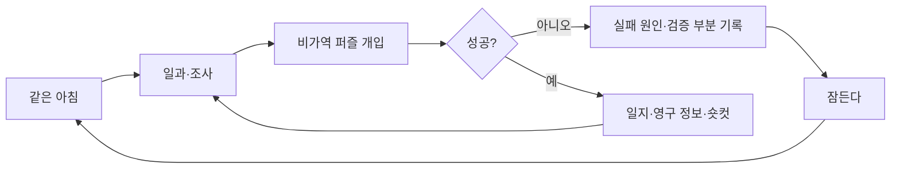

# GGB 게임기획서 v0.4 통합본

## 1. 문서 정보

| 항목 | 내용 |
| --- | --- |
| 프로젝트 | GGB(가칭) |
| 장르 | 심리 서사형 포인트 앤 클릭 어드벤처 |
| 플랫폼·엔진 | 추후 확정 / Godot 예정 |
| 플레이 구조 | 유연한 시간제, 수면 리셋, 영구 정보, 관계 선택 |
| 핵심 정서 | 심리적 불안, 감각적 이질감, 보호와 감금의 양가성 |
| 버전 범위 | 기획 상세화. 프로토타입·DOCX 제외 |

세부 규격은 [v0.4 문서 목록](00_v04_문서목록_및_확정사항.md)을 기준으로 한다.

## 2. 한 문장 소개

매일 같은 고딕 저택에서 눈뜨는 주인공이 수면 리셋을 이용해 세계의 물성을 거슬러 조사하고, 자신을 가둔 다섯 연구원 인격과 관계를 맺으며 황폐한 현실과 자각된 가상 낙원 사이에서 자기 선택권을 되찾는 게임.

## 3. 기획 목표

1. 잠을 실패 처리만이 아니라 비가역 물리 퍼즐의 핵심 도구로 사용한다.
2. 반복 노동은 영구 정보와 숏컷으로 줄이고, 같은 퍼즐을 더 넓은 가능성으로 재도전하게 한다.
3. 고딕 저택이 SF 시설로 점진적으로 벗겨지는 감각적 공포를 만든다.
4. 사용인을 호감도 수치가 아니라 기억, 책임, 선택적 관계 사건으로 다룬다.
5. 엔딩은 선악이 아니라 불확실한 현실과 자각된 안정 사이의 가치 선택으로 구성한다.

## 4. 세계관

지구는 미래 과학의 과도한 발달과 복합 재난으로 사람이 살기 어려운 환경이 되었다. 주인공의 아버지는 딸을 냉각 장치에 보관하고, 딸이 자주 낙서하던 고딕 저택을 바탕으로 장기 시뮬레이션을 만들었다.

연구원들은 미래에 새 육체로 살아갈 수 있다는 설명에 동의했다. 그러나 아버지는 그들의 뇌와 인격을 시뮬레이션 운영체계에 연결했고 약속을 완수하지 못한 채 죽었다. 연구원 인격은 저택의 사용인 안드로이드가 되었다.

오랜 시간 뒤 사용인들은 외로움, 아버지에 대한 배신감, 주인공을 보호하려는 감정 때문에 외부가 안전하지 않은 상태에서 주인공을 강제로 시뮬레이션에 접속했다. 그들은 주인공을 아가씨로 대하면서도 일손 부족을 이유로 저택 일을 맡기고, 탈출 조짐을 관리 프로토콜 안에서 막는다.

## 5. 주인공

- 이름 미정. 기획 문서에서는 `주인공`.
- 소녀 연령대.
- 시뮬레이션에서는 고딕 저택의 아가씨.
- 초기에는 익숙한 일상을 따르지만 반복 모순에 감각적으로 예민해진다.
- 핵심 능력은 특별한 초능력이 아니라 관찰, 자기 기록, 실패 뒤에도 남는 자기 연속성이다.
- SUBJECT 권한은 사용인 색과 다른 흑연·종이·필기음으로 표현한다.

감정 흐름:

```text
익숙함
→ 설명하기 어려운 불쾌감
→ 반복 확인
→ 세계 붕괴에 대한 공포와 회피
→ 사용인과의 동질감
→ 아버지와 감금의 진실
→ 결과가 보장되지 않는 자기 선택
```

## 6. 다섯 사용인

| 인물 | 표층 역할 | 실제 역할 | 색상 서명 | 핵심 갈등 |
| --- | --- | --- | --- | --- |
| 에드가 | 집사장·보안 | 운영·윤리 책임자 | 남색 수직 잠금선 | 보호와 통제 |
| 마라 1 | 청소·정비 | 기록 삭제·설비 정비 | 주황 대각 닦임 | 정리와 삭제 |
| 루카 | 주방·건강 | 생명 유지·냉각 보존 | 검정+연두 이중 맥박 | 생존과 진실 |
| 이리스 | 온실·날씨 | 외부 생태 센서 | 흰색+연노랑 꽃잎 | 희망과 모델의 거짓 |
| 마라 2 | 기록·초상화 | 인격 아카이브·체크섬 | 보라 이중 액자 | 기억 보존과 자기 소실 |

### 마라 2(가칭)

- 내부 ID `MARA2`.
- 원래부터 장난스럽고 매우 영리했던 연구원.
- 어린애처럼 말꼬리를 잡고 느낌표를 자주 쓰지만 성적 뉘앙스는 사용하지 않는다.
- 다른 연구원 기억을 보존하려고 자기 저장 영역을 소모했다.
- 허세 뒤에서 자기 이름과 기억이 사라질 것을 두려워한다.
- 프롤로그 P3B 등장은 필수, E3_5 핵심 관계는 선택이다.

자세한 캐릭터 기준은 [5인 체계](01_세계관_캐릭터_사용인5인체계.md)를 따른다.

## 7. 핵심 플레이 루프



리셋으로 초기화:

- 시간대, 인벤토리, 물리 배치, 당일 장치 상태, 물리 색 흔적.

유지:

- 수첩, 자기 작성 표시, 일지 단계, 퍼즐 검증 부분, 관계, 연구원 기록, 색상 서명 식별, 숏컷.

D5 이후에는 정상 리셋이 아니라 손상된 S3 상태를 복구하는 BROKEN_RESET으로 바뀐다.

## 8. 유연한 시간제

- 실제 분 단위 제한보다 `아침/낮/저녁/수면` 사건 구간을 사용한다.
- 필수 일과 완료 전에는 다음 구간으로 넘어가지 않는다.
- 조사 선택으로 시간이 흐르지만 중요한 이벤트는 사전 경고 없이 소멸하지 않는다.
- 실패 뒤 숏컷은 이미 해결한 일과와 이동을 5~12초로 축약한다.
- 사용인 개입은 일정 공백과 개입 예산을 가져 정답 경로를 영구 차단하지 않는다.

## 9. 색상 서명

색은 인격 데이터 출처다. 모든 필수 단서는 문양, 선, 라벨, 음향 중 둘 이상을 병행한다.

학습 흐름:

```text
P3B 이름표
→ 리셋 뒤 수첩 대응 유지
→ C5 다섯 채널
→ D5 몸 밖 데이터 잔상
→ E3_5 원본 대조
→ F0 RESIDENT 출처
→ 엔딩 공존·분리 결산
```

접근성 전체 규칙은 [색상·UI 규격](16_색상연출_UI_접근성규칙.md)을 따른다.

## 10. 공간

주요 구조:

```text
침실
  │
중앙홀 ─ 대응접실
  ├─ 서쪽 복도 ─ 대시계 ─ 지하창고 ─ 태엽 심장실
  ├─ 동쪽 복도 ─ 주방 ─ 생명 유지실
  ├─ 남쪽 복도 ─ 거울 복도
  ├─ 온실 ─ 계절 제어실
  └─ 북쪽 기록 회랑
       ├─ 초상화 보관실
       ├─ 색분해실 ─ 인격 아카이브
       └─ 서재 연결문 ─ 서재
```

- 기록 회랑과 초상화 보관실은 프롤로그부터 접근.
- 서재 연결문은 B2/J1 뒤 서재 안에서만 최초 해금.
- 색분해실 외부는 C5 후 조사, 내부는 D5 후 접근.
- 인격 아카이브는 E3_5 전용이지만 익명 인덱스는 메인 진행을 보장.

전체 지도는 [공간 구성 문서](05_공간구성지도_및_동선.md)를 따른다.

## 11. 챕터 구성

### 프롤로그: 완벽한 하루

- P1 기상과 에드가의 아침 인사.
- P2 창문 닦기.
- P3 서재 책 정리와 일지 발견.
- P3B 마라 2 소개, 초상화 이름표와 다섯 서명 튜토리얼.
- P4 차 준비.
- P5 선택 조사로 잠긴 온실과 날씨 모순.
- P6 취침 권유, 첫 RESET.

목표: 저택, 일과, 사용인, 포인트 앤 클릭 조작, 수면을 학습한다.

### 1챕터: 반복의 증명

- A1 수첩에 자기 표시 작성.
- 두 번째 리셋 뒤 A2 표시 유지 확인.
- B1 사용인 시간표 조사.
- B2 저녁 서재 접근.
- J1 일지 1단계 복원.
- B3 시계망과 열세 번째 종.
- J2 일지 2단계 복원.

목표: 세계의 물리는 초기화되지만 주인공의 기록과 사용인 기억은 유지됨을 증명한다.

### 2챕터: 금지된 표면

- C0 에드가의 거울 금지.
- C1~C3 청소 기록과 약품 정보를 결합해 중성 세정제 제작.
- C4 열세 번째 종 파형으로 검은 거울 청소.
- C5 진단 패널, 냉각 장치 실루엣, 다섯 색 채널.
- J3 일지 3단계.
- D0 도면 중첩, D1 지하창고 세 축 퍼즐.
- D2 지하창고 접근 숏컷.
- D4 태엽 심장 기동.

목표: 고딕 세계가 시스템 표면임을 확인하고 파열 조건을 만든다.

### 3챕터: 세계의 파열

- D5 위장 필터 해제.
- D6 수면, BROKEN_RESET.
- E1 같은 침실의 다른 아침.
- E2 다섯 사용인과 대면.
- E3_1~E3_5 선택형 핵심 관계.
- J4 기록 수에 따른 과거 결산.
- E5 관계 완료 수에 따른 마지막 저녁.
- E6 코어 접근.

목표: 사용인을 방해물에서 피해자이자 책임 주체로 다시 이해한다.

### 4챕터: 선택 권한

- F0-A 방 피드백 회로.
- F0-B 현실 유지 표본.
- F0-C B4/C5/D4 자료 중첩.
- F0-D 기록 역할 분류.
- F0-E SUBJECT 인증.
- F1 아버지의 마지막 기록.
- J5 현재 선택 권한 복원.
- F2 연구원 대면.
- F3 마지막 확인.
- EDC 현실 기상 또는 안정화 잔류.

목표: 모든 기존 퍼즐 지식을 하나의 메타퍼즐로 결산하고 선택권을 되찾는다.

## 12. 메인 퍼즐

| 퍼즐 | 핵심 추론 | 실패·복구 |
| --- | --- | --- |
| B3-A | 네 시계 배선 탁본 회전·반전 | 하위 단계 유지 |
| B3-B | 기준·중계·출력·제외와 +1 위상 | 봉인핀 파손, 수면 리셋 |
| C3 | 세정제 비율 제약식 | 로컬 재시도 |
| C4 | 파형과 거울 회로 중첩 | 코팅 경화, 수면 리셋 |
| D0-A | C5 회로와 저택 도면 변환 | 하위 단계 유지 |
| D1 | 직선2·분기1·고리3 순서 | 압력핀 잠금, 수면 리셋 |
| D4 | 연동 손잡이로 `[1,2,3]` | 로컬 재시도, 성공 후 D5 |
| E3_5 | 다섯 출처 분리와 체크섬 | 선택형, 로컬 재시도 |
| F0 | 방·표본·자료·역할·SUBJECT 메타퍼즐 | 단계 저장, 로컬 재시도 |

퍼즐 정답과 힌트는 [메인 퍼즐 상세](08_이벤트상세_03_메인퍼즐.md)를 단일 기준으로 한다.

## 13. 사용인 관계 시스템

사용인 기억은 리셋 뒤에도 유지된다. 그들이 주인공 행동을 알고도 항상 막지 못하는 이유:

1. 관리 프로토콜이 허용하는 개입 횟수와 방식이 제한됨.
2. 사용인끼리 서로 감시하여 근거 없는 강제 구금은 보안 위반.
3. 검증된 숏컷은 시스템 승인으로 기록되어 재차 차단 불가.
4. 각 사용인은 보호, 원망, 호기심, 해방 욕구가 충돌함.
5. 관계가 진행될수록 정답 제공이 아니라 개입 축소와 감정 공개가 발생.

관계 판정:

| 완료 인원 | 결산 |
| --- | --- |
| 0~1 | LOW |
| 2~3 | MID |
| 4~5 | HIGH |
| 5 | `all_servants_complete` 추가 장면 |

연구원 기록:

| 수 | J4 |
| --- | --- |
| 0~1 | 기본 |
| 2~4 | 확장 |
| 5 | 완전 |

어떤 관계 상태도 F0나 엔딩 선택지를 막지 않는다.

## 14. 정보·일지 역할

- J1~J3: 현재 퍼즐 변환 규칙과 지하 좌표 복원.
- J4: 과거의 배신, 동의 범위, 연구원 전환 계획 결산.
- F1/J5: 아버지가 완료하지 못한 명령과 주인공의 현재 선택 권한 복원.

J4와 J5를 분리하여 “과거를 많이 알면 선택할 자격이 생긴다”는 구조를 피한다. 주인공의 선택권은 관계 수집량과 무관하게 본래 주인공에게 있다.

## 15. 엔딩

### ED_A 현실 기상

주인공은 시뮬레이션 연결을 끊고 냉각 캡슐에서 깨어난다. 지구는 여전히 황폐하고 생존 가능성은 불명확하다. 멀리 신호처럼 보이는 빛을 향해 걸으며 끝난다.

핵심 가치:

- 결과를 보장받지 못해도 직접 확인하려는 선택.
- 위험을 미화하지 않음.
- 사용인 인격은 저전력 보존 상태로 남아 재접속 가능성을 열어 둠.

### ED_B 안정화 잔류

주인공은 진실 기억을 유지한 채 저택 루프를 복원한다. 사용인 자율성을 늘리고 고딕 외형과 데이터 서명이 공존하는 새 규칙을 만든다.

핵심 가치:

- 거짓임을 아는 환경도 선택된 삶이 될 수 있음.
- 안전을 비겁함으로 판정하지 않음.
- 영원성과 감각 둔화의 위험을 남김.

상세 변형은 [엔딩 문서](14_이벤트상세_09_엔딩.md)를 따른다.

## 16. 연출

### 심리적 불안

- 대놓고 놀라게 하기보다 반복 위치, 온도, 향, 소리 방향의 미세한 모순을 누적한다.
- 주인공은 먼저 신체 감각으로 반응하고 뒤에 원인을 언어화한다.
- 사용인의 말과 입 모양, 그림자와 몸, 색 잔상과 음향의 시차를 활용한다.

### 감각 전환

| 고딕 감각 | SF 실체 |
| --- | --- |
| 향초 | 오존·냉각액 |
| 부드러운 침대 | 냉각 캡슐 |
| 종소리 | 시스템 동기 신호 |
| 꽃향기 | 기후 연출 데이터 |
| 차의 온기 | 생명 유지 유체 |
| 초상화 안료 | 인격 아카이브 채널 |

### 금지

- 색상 단독 정답.
- 사용인 관계를 선물 반복이나 수치 노가다로 구성.
- 잔류를 단순 배드 엔딩, 현실을 단순 굿 엔딩으로 판정.
- 마라 2의 어린 말투를 성적 대상화.
- 선택 이벤트 미완료로 메인 진행 차단.

## 17. 플레이타임

| 구간 | 필수 | 관계 포함 권장 |
| --- | --- | --- |
| 프롤로그 | 25~35분 | 동일 |
| 1챕터 | 45~75분 | +5~10분 |
| 2챕터 | 60~100분 | +10~15분 |
| 3챕터 | 30~45분 | +45~70분 |
| 4챕터·엔딩 | 55~85분 | +10~20분 |

전체:

- 필수 진행 약 3.5~5.5시간.
- 권장 관계 진행 약 5~7시간.
- 전원 관계·반복 조사 약 6~8시간.

## 18. 접근성

- 색 제거 모드에서도 모든 퍼즐 해결 가능.
- 고유 문양, 선 패턴, 텍스트 라벨, 음향 자막 병행.
- 광과민 모드에서 D5 점멸을 점진 마스크로 대체.
- 글리치 흔들림과 색 잔상 지연 조절.
- 실패 뒤 검증 부분과 다음 변환 규칙을 수첩에 명시.
- 유연한 시간제에서 중요한 선택 이벤트가 예고 없이 사라지지 않음.

## 19. Godot 구현 전제

- `GameState`: 영구/루프/파열 상태 분리.
- `EventDefinition`: 선행 조건과 결과를 데이터로 정의.
- `ColorSignature`: 색이 아니라 소유자 기반 식별.
- `ObjectReaction`: 월드 상태별 조사 반응.
- `SaveManager`: 핵심 이벤트 완료와 기록 획득을 트랜잭션 저장.

세부 계약은 [상태·데이터 구조](17_상태변수_이벤트ID_Godot데이터구조.md)를 따른다.

## 20. 수용 기준

- 기존 v0.3 흐름의 모든 핵심 이벤트가 v0.4에 대응한다.
- `24-3` 퍼즐 정답과 F0 메타퍼즐 구조를 유지한다.
- P3B 반복은 5~12초 안에 축약된다.
- 북쪽 회랑이 B2 최초 서재 접근을 우회하지 않는다.
- 마라 2 미완료로도 J4 기본, F0, F1, 두 엔딩에 진입한다.
- 5명 완료 때만 J4 완전과 전원 결산 장면이 발생한다.
- 색 제거·음량 0 조건에서도 필수 진행이 가능하다.
- Mermaid, 내부 링크, 이벤트 ID, 상태 플래그 참조가 일치한다.

## 21. 관련 문서

- [전체 이벤트 흐름도](03_전체이벤트흐름도.md)
- [이벤트 목록·상태표](04_전체이벤트리스트_상태표.md)
- [공간 지도·동선](05_공간구성지도_및_동선.md)
- [튜토리얼·일상 상세](06_이벤트상세_01_튜토리얼_일상.md)
- [루프·영구 정보·숏컷 상세](07_이벤트상세_02_루프_영구정보_숏컷.md)
- [메인 퍼즐 상세](08_이벤트상세_03_메인퍼즐.md)
- [정보 조사·일지 상세](09_이벤트상세_04_정보조사_일지복원.md)
- [공간 잠금·동선 상세](10_이벤트상세_05_공간잠금_해금_동선.md)
- [사용인 짧은 반응](11_이벤트상세_06_사용인짧은반응.md)
- [사용인 핵심 관계](12_이벤트상세_07_사용인핵심관계.md)
- [파열·전환·결산](13_이벤트상세_08_파열_전환_결산.md)
- [엔딩](14_이벤트상세_09_엔딩.md)
- [공통 오브젝트 반응](15_이벤트상세_10_공통오브젝트반응.md)
- [색상·UI·접근성](16_색상연출_UI_접근성규칙.md)
- [상태·이벤트 ID·Godot 구조](17_상태변수_이벤트ID_Godot데이터구조.md)

