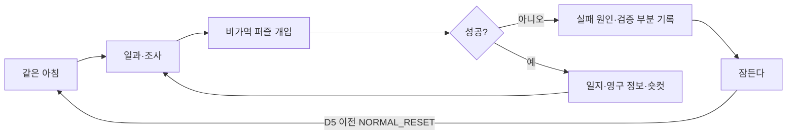
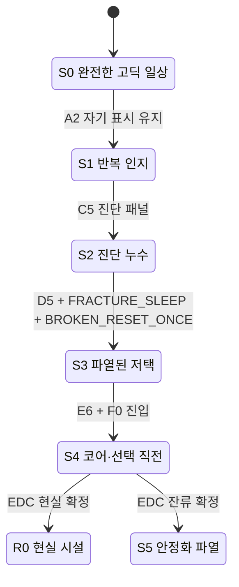
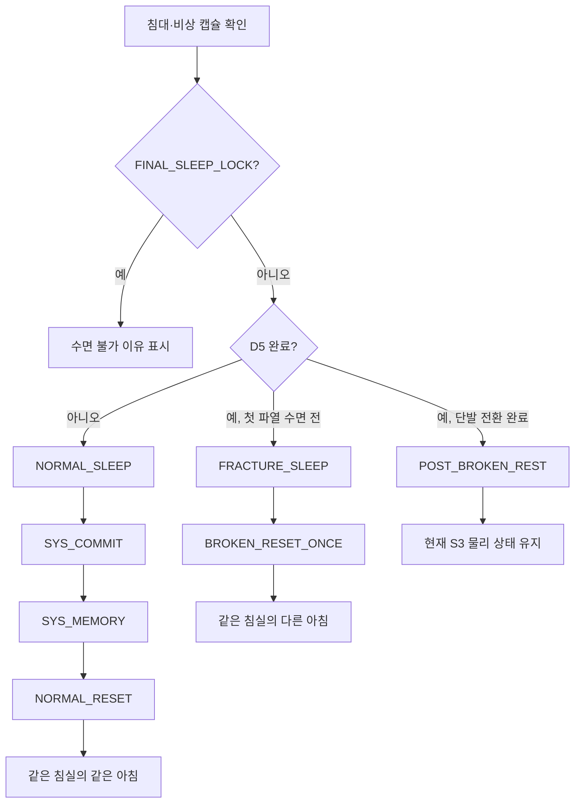
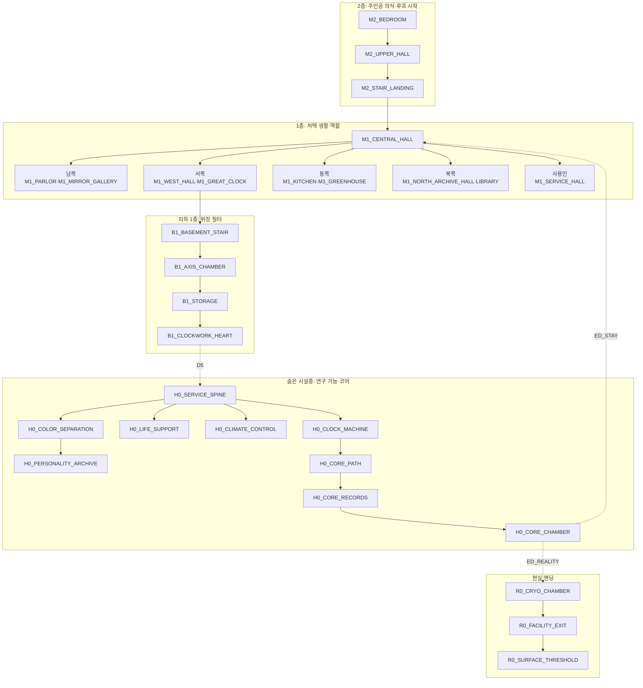
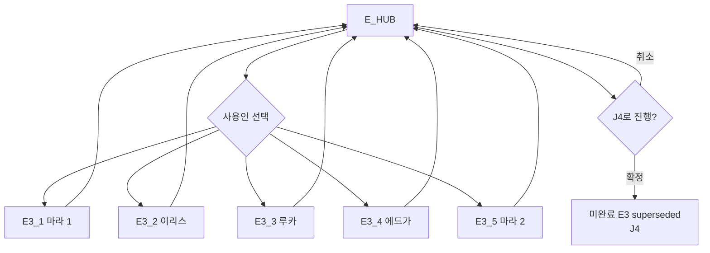

# GGB 게임기획서 v0.4 통합본

## 1. 문서 정보

| 항목 | 내용 |
| --- | --- |
| 프로젝트 | GGB(가칭) |
| 장르 | 심리 서사형 포인트 앤 클릭 어드벤처 |
| 플랫폼·엔진 | Windows PC 데스크톱 / Godot 4.7 계열 |
| 플레이 구조 | 유연한 시간제, D5 이전 `NORMAL_RESET`, 파열 이후 상태 보존, 영구 정보, 관계 선택 |
| 핵심 정서 | 심리적 불안, 감각적 이질감, 보호와 감금의 양가성 |
| 문서 역할 | 프로젝트 전체를 독립적으로 이해하고 전문 정본으로 추적하는 제작 인계용 통합본 |
| 버전 범위 | v0.4 기획 상세화. 프로토타입·실행 코드·DOCX 제외 |
| 검증 기준일 | 2026-08-30 |

세부 규격은 [v0.4 문서 목록](00_v04_문서목록_및_확정사항.md)을 기준으로 한다. 플랫폼·빌드·입력·접근성·저장 UX는 [제품 계약](../../../docs/product_contract.md)을 따른다. 본 문서는 `01~17`의 내용을 새로 결정하는 정본이 아니라 프로젝트 전체를 한 문서에서 이해하고 담당 정본으로 역추적하기 위한 인계 문서다. 요약과 상세 문서가 충돌하면 사용자의 최신 확정 지시, 최신 `GGB-DEC`, 제품 계약과 영역별 정본 순으로 적용한다.

## 2. 한 문장 소개

매일 같은 고딕 저택에서 눈뜨는 주인공이 D5 이전 `NORMAL_RESET`을 이용해 세계의 물성을 거슬러 조사하고, 자신을 가둔 다섯 연구원 인격과 관계를 맺으며 황폐한 현실과 자각된 가상 낙원 사이에서 결말을 선택하는 게임.

## 3. 기획 목표

1. 잠을 실패 처리만이 아니라 비가역 물리 퍼즐의 핵심 도구로 사용한다.
2. 반복 노동은 영구 정보와 숏컷으로 줄이고, 같은 퍼즐을 더 넓은 가능성으로 재도전하게 한다.
3. 고딕 저택이 SF 시설로 점진적으로 벗겨지는 감각적 공포를 만든다.
4. 사용인을 호감도 수치가 아니라 기억, 책임, 선택적 관계 사건으로 다룬다.
5. 엔딩은 선악이 아니라 불확실한 현실과 자각된 안정 사이의 가치 선택으로 구성한다.

## 4. 세계관

지구는 미래 과학의 과도한 발달과 복합 재난으로 사람이 살기 어려운 환경이 되었다. 주인공의 아버지는 딸을 냉각 장치에 보관하고, 딸이 자주 낙서하던 고딕 저택을 바탕으로 시뮬레이션을 만들었다.

연구원들은 미래에 새 육체로 살아갈 수 있다는 설명에 동의했다. 그러나 아버지는 각자의 생체 신경 코어와 인격 프로세스를 시뮬레이션 운영체계에 결합했고 약속을 완수하지 못한 채 죽었다. 이는 복제 AI가 아니라 신경 코어와 데이터 계층의 왕복 활동으로 자기 연속성을 유지하는 당사자다. 원래 신체는 소실되었고, 새 신체 이전용 배양·접속 모듈은 주인공의 냉각·생명 유지에 전용되어 현재 시설만으로 해방을 실행할 수 없다. 연구원들은 저택의 사용인 안드로이드 아바타를 통해 살아간다.

오랜 시간 뒤 사용인들은 외로움, 아버지에 대한 배신감, 주인공을 보호하려는 감정 때문에 외부가 안전하지 않은 상태에서 주인공을 강제로 시뮬레이션에 접속했다. 그들은 주인공을 아가씨로 대하면서도 일손 부족을 이유로 저택 일을 맡기고, 탈출 조짐을 관리 프로토콜 안에서 막는다.

## 5. 주인공

- 이름 미정. 기획 문서에서는 `주인공`.
- 소녀 연령대.
- 시뮬레이션에서는 고딕 저택의 아가씨.
- 초기에는 익숙한 일상을 따르지만 반복 모순에 감각적으로 예민해진다.
- 핵심 능력은 특별한 초능력이 아니라 관찰, 기록, 실패 뒤에도 남는 자기 연속성이다.
- SUBJECT 권한은 사용인 색과 다른 흑연·종이·필기음으로 표현한다.

감정 흐름:

```text
익숙함
→ 설명하기 어려운 불쾌감
→ 반복 확인
→ 세계 붕괴에 대한 공포와 회피
→ 사용인과의 동질감
→ 아버지와 감금의 진실
→ 결과가 보장되지 않는 선택
```

## 6. 다섯 사용인

| 인물 | 표층 역할 | 실제 역할 | 색상 서명 | 핵심 갈등 |
| --- | --- | --- | --- | --- |
| 에드가 | 집사장·보안 | 운영·윤리 책임자 | 남색 수직 잠금선 | 보호와 통제 |
| 마라 1 | 청소·정비 | 기록 삭제·설비 정비 | 주황 대각 닦임 | 정리와 삭제 |
| 루카 | 주방·건강 | 생명 유지·냉각 보존 | 검정+연두 이중 맥박 | 생존과 진실 |
| 이리스 | 온실·날씨 | 외부 생태 센서 | 흰색+연노랑 꽃잎 | 희망과 모델의 거짓 |
| 마라 2 | 기록·초상화 | 인격 아카이브·체크섬 | 보라 이중 액자 | 기억 보존과 자기 소실 |

### 마라 2(가칭)

- 내부 ID `MARA2`.
- 원래부터 장난스럽고 매우 영리했던 연구원.
- 어린애처럼 말꼬리를 잡고 느낌표를 자주 쓰지만 성적 뉘앙스는 사용하지 않는다.
- 다른 연구원 기억을 보존하려고 자기 저장 영역을 소모했다.
- 허세 뒤에서 자기 이름과 기억이 사라질 것을 두려워한다.
- 프롤로그 P3B 등장은 필수, E3_5 핵심 관계는 선택이다.

자세한 캐릭터 기준은 [5인 체계](01_세계관_캐릭터_사용인5인체계.md)를 따른다.

시각 식별:

| 인물 | 아바타 대표색 | 회색조 실루엣 |
| --- | --- | --- |
| 에드가 | 파랑 | 긴 용 뿔·꼬리·레이피어의 수직선 |
| 마라 1 | 주황+빨강 보조 | 큰 여우 꼬리·스패너·넓은 자세 |
| 루카 | 검정+귀 연두 | 둥근 쥐 귀·모은 손·찻잔 |
| 이리스 | 옅은 노랑+백금 | 관절형 플라스틱 날개·꽃가위 |
| 마라 2 | 보라 | 뾰족한 귀·망토형 날개·이름표 프레임 |

## 7. 핵심 플레이 루프


```mermaid
flowchart LR
    W["같은 아침"] --> D["일과·조사"]
    D --> P["비가역 퍼즐 개입"]
    P --> K{"성공?"}
    K -- "아니오" --> N["실패 원인·검증 부분 기록"]
    N --> S["잠든다"]
    S -- "D5 이전 NORMAL_RESET" --> W
    K -- "예" --> J["일지·영구 정보·숏컷"]
    J --> D
```

리셋으로 초기화:

- 시간대, 인벤토리, 물리 배치, 당일 장치 상태, 물리 색 흔적.

유지:

- 수첩, 자기 작성 표시, 일지 단계, 퍼즐 검증 부분, 관계, 연구원 기록, 색상 서명 식별, 숏컷.

D5 완료 뒤 위장 필터는 `DISABLED`가 된다. 침실 침대 또는 서비스 척추의 비상 캡슐에서 D6 수면을 확정하면 `FRACTURE_SLEEP → BROKEN_RESET_ONCE`가 단 한 번 실행되어 S3를 생성한다. 이후 수면은 세계를 재생성하지 않는 `POST_BROKEN_REST`이며, F3 진입부터는 `FINAL_SLEEP_LOCK`으로 모든 수면 라우팅이 닫힌다.

## 8. 유연한 시간제

- 실제 분 단위 제한보다 `아침/낮/저녁/수면` 사건 구간을 사용한다.
- 필수 일과 완료 전에는 다음 구간으로 넘어가지 않는다.
- 조사 선택으로 시간이 흐르지만 중요한 이벤트는 사전 경고 없이 소멸하지 않는다.
- 실패 뒤 숏컷은 이미 해결한 일과와 이동을 5~12초로 축약한다.
- 사용인 개입은 일정 공백과 개입 예산을 가져 정답 경로를 영구 차단하지 않는다.

## 9. 색상 서명

색은 인격 데이터 출처다. 모든 필수 단서는 문양, 선, 라벨, 음향 중 둘 이상을 병행한다.

- 아바타 대표색은 머리·귀·꼬리·날개·의상에 넓게 사용하는 캐릭터 팔레트다.
- 데이터 서명은 진단과 기록 출처에 사용하는 고정 `signature_id`다.
- 고딕 오브젝트의 시스템 판독용 서명 표식만 표면의 5~12%로 제한한다.
- UI 의미색과 환경 보정색은 캐릭터·서명 소유권을 뜻하지 않는다.
- 마라 1의 빨강, 캐릭터의 붉은 눈, 루카의 연두는 오류·위험·성공을 자동 의미하지 않는다.

학습 흐름:

```text
P3B 이름표
→ 리셋 뒤 수첩 대응 유지
→ C5 다섯 채널
→ D5 몸 밖 데이터 잔상
→ E3_5 원본 대조
→ F0 RESIDENT 출처
→ 엔딩 공존·분리 결산
```

접근성 전체 규칙은 [색상·UI 규격](16_색상연출_UI_접근성규칙.md)을 따른다.

## 10. 공간

주요 구조:

```text
침실
  │
중앙홀 ─ 대응접실 ─ 남쪽 거울 회랑
  ├─ 서쪽 복도 ─ 대시계 ─ 지하창고 ─ 태엽 심장실
  ├─ 동쪽 복도 ─ 주방 ─ 생명 유지실
  ├─ 온실 ─ 계절 제어실
  └─ 북쪽 기록 회랑
       ├─ 초상화 보관실
       ├─ 색분해실 외부문 ─ 색분해실 내부 ─ 인격 아카이브
       └─ 서재 연결문 ─ 외부 서고 ─ 기록 내실
```

- 기록 회랑과 초상화 보관실은 프롤로그부터 접근.
- P3는 `M1_LIBRARY_OUTER` 외부 서고, B2/J1은 `M1_LIBRARY_INNER` 기록 내실에서 진행한다.
- 북쪽 서재 연결문은 J1 뒤 기록 내실 안에서만 최초 해금되므로 B2를 우회하지 않는다.
- C0~C5의 검은 거울은 대응접실 남쪽 별도 `M1_MIRROR_GALLERY`에 위치.
- 색분해실 외부문은 `M1_COLOR_ROOM_ENTRY`이며 C5_INFO 후 조사, 내부는 BROKEN_RESET 뒤 `H0_COLOR_SEPARATION`으로 접근.
- 인격 아카이브는 `H0_PERSONALITY_ARCHIVE`이며 E3_5의 체크섬 확인 뒤에만 열린다.
- 인격 아카이브는 E3_5 전용이지만 익명 인덱스는 메인 진행을 보장.

전체 지도는 [공간 구성 문서](05_공간구성지도_및_동선.md)를 따른다.

## 11. 챕터 구성

### 프롤로그: 완벽한 하루

- P1 기상과 에드가의 아침 인사.
- P2 창문 닦기.
- P3 외부 서고(`M1_LIBRARY_OUTER`)의 책 정리와 잠긴 일지 발견.
- P3B 마라 2 소개, 초상화 이름표와 다섯 서명 튜토리얼.
- P4 차 준비.
- P5 선택 조사로 잠긴 온실과 날씨 모순.
- P6 취침 권유, 첫 `NORMAL_RESET`.

목표: 저택, 일과, 사용인, 포인트 앤 클릭 조작, 수면을 학습한다.

### 1챕터: 반복의 증명

- A1 수첩에 자기 표시 작성.
- 두 번째 리셋 뒤 A2 표시 유지 확인.
- B1 사용인 시간표 조사.
- B2 저녁 기록 내실 접근. 에드가 진입·점검 벽감·발각 대화는 실패가 아니라 J1로 합류하는 압박 분기다.
- J1 일지 1단계 복원.
- B3 시계망과 열세 번째 종.
- J2 일지 2단계 복원.

목표: 세계의 물리는 초기화되지만 주인공의 기록과 사용인 기억은 유지됨을 증명한다.

### 2챕터: 금지된 표면

- C0 에드가의 거울 금지.
- C1~C3 청소 기록과 약품 정보를 결합해 중성 세정제 제작.
- C4 열세 번째 종 파형으로 검은 거울 청소.
- C5 진단 패널, 냉각 장치 실루엣, 다섯 색 채널.
- J3 일지 3단계.
- D0 도면 중첩, D1 지하창고 세 축 퍼즐.
- D2 지하창고 접근 숏컷.
- D4 태엽 심장 기동.

목표: 고딕 세계가 시스템 표면임을 확인하고 파열 조건을 만든다.

### 3챕터: 세계의 파열

- D5 위장 필터 해제. 퍼즐 실패가 아닌 예정된 세계 전환이다.
- D6 자유 조사 뒤 침실 침대 또는 조건부 비상 캡슐에서 `FRACTURE_SLEEP` 확정.
- `BROKEN_RESET_ONCE`가 S3를 한 번 생성하며 이후 `POST_BROKEN_REST`는 세계를 초기화하지 않음.
- E1 같은 침실의 다른 아침. 침대·창문·거울·호출끈 중 서로 다른 3개를 확인해 리셋 실패를 인지하고, 네 번째는 보너스 반응만 제공.
- E2 다섯 사용인과 대면.
- E3_1~E3_5 선택형 핵심 관계.
- J4 기록 수에 따른 과거 결산.
- E3_4 미완료 시 J4 뒤 E3_4M으로 운영 권한만 최소 복구.
- E5 관계 완료 수에 따른 마지막 저녁. 다섯 사용인은 항상 참석하고 LOW·MID·HIGH·ALL에 따라 발화의 직접성만 변함.
- E5 뒤 마라 2 후속 반응을 먼저 처리하고 에드가의 저택 코어 접근 고지를 거쳐 E6으로 합류.
- E6 코어 접근.

목표: 사용인을 방해물에서 피해자이자 책임 주체로 다시 이해한다.

### 4챕터: 선택 권한

- F0-A 방 피드백 회로.
- F0-B 현실 유지 표본.
- F0-C B4/C5/D4 자료 중첩.
- F0-D 기록 역할 분류.
- F0-E SUBJECT 인증. `현실을 확인한다`, `안정화 루프에 남는다`, `아직 정하지 않는다` 세 임시 의향은 모두 통과하며 정답으로 채점하지 않음.
- F1 아버지의 마지막 기록.
- J5 현재 선택 권한 복원.
- F2 연구원 대면. 새 신체 약속, 인격 전환, 현재 해방 실행 불가, 강제 연결, 외부 생존 불확실성, 주인공의 최종 권한이라는 여섯 사실을 필수 확인.
- F3 마지막 확인. 진입 시 `FINAL_SLEEP_LOCK`; 기상 장치·루프 안정화 장치·수첩 단말 세 개를 모두 조사한 뒤 양쪽 결과를 균형 있게 요약하고 `SAVE_F3_COMPLETE` 생성.
- EDC 현실 기상 또는 안정화 잔류. 취소하면 F3 완료 지점으로 돌아가며 수면 잠금과 미확정 선택을 유지.
- EDC 확정은 선택·선택 관계·엔딩 분기와 `SAVE_ENDING_BRANCH`를 원자 저장.
- 전원 완료면 확정 뒤 `ED_ALL_CEREMONY`가 삽입되지만 필기 입력은 엔딩 성공 조건이 아님.
- 현실·잔류는 각각 9~15분의 제한형 포인트 앤 클릭 에필로그로 이어짐.

목표: 모든 기존 퍼즐 지식을 하나의 메타퍼즐로 결산하고 선택권을 되찾는다.

#### F0-E와 EDC의 선택 권한 분리

| 단계 | 저장값 | 기능 | 금지 |
| --- | --- | --- | --- |
| F0-E | `f0_provisional_intent` | 현재 의향을 주인공 문장으로 기록 | 메타퍼즐 실패, 엔딩 선잠금, F2·F3 대사 편향 |
| F2 | 여섯 `KN_F2_*` 지식 | 선택 전에 필요한 사실과 현재 해방 실행 불가를 동일하게 확정 | 임시 의향 참조, 관계 수치 변경 |
| F3 | `F3_complete`, `SAVE_F3_COMPLETE` | 양쪽 장치를 중립적으로 확인 | 최종 결정 기록, 임시 의향 참조 |
| EDC | `final_decision`, `final_choice_relation`, `ending_run` 분기 | 현실·잔류 중 하나를 원자 확정하고 이전 의향과의 관계만 분류 | 관계·기록에 따른 선택지 잠금 |
| ALL 의식 | `all_ceremony_seen` | 확정된 선택과 다섯 이름을 비차단 서명 | 선택 생성·엔딩 허가 |

`final_choice_relation`은 같은 의향을 확정하면 `reaffirmed`, 현실·잔류 사이에서 바꾸면 `revised`, `아직 정하지 않는다` 뒤 처음 정하면 `formed`다. EDC 확정 전에는 `unresolved`이며 어떤 값도 엔딩의 우열을 뜻하지 않는다.

## 12. 메인 퍼즐

| 퍼즐 | 핵심 추론 | 실패·복구 |
| --- | --- | --- |
| B3-A | 네 시계 배선 탁본 회전·반전 | 하위 단계 유지 |
| B3-B | 기준·중계·출력·제외와 +1 위상 | 봉인핀 파손, `NORMAL_RESET` |
| C3 | 세정제 비율 제약식 | 로컬 재시도 |
| C4 | 파형과 거울 회로 중첩 | 코팅 경화, `NORMAL_RESET` |
| D0-A | C5 회로와 저택 도면 변환 | 하위 단계 유지 |
| D1 | 직선2·분기1·고리3 순서 | 압력핀 잠금, `NORMAL_RESET` |
| D4 | 연동 손잡이로 `[1,2,3]` | 로컬 재시도, 성공 후 D5 |
| E3_5 | 다섯 출처 분리와 체크섬 | 선택형, 로컬 재시도 |
| F0 | 방·표본·자료·역할·SUBJECT 메타퍼즐 | 단계 저장, 로컬 재시도 |

퍼즐 정답과 힌트는 [메인 퍼즐 상세](08_이벤트상세_03_메인퍼즐.md)를 단일 기준으로 한다.

## 13. 사용인 관계 시스템

사용인 기억은 리셋 뒤에도 유지된다. 그들이 주인공 행동을 알고도 항상 막지 못하는 이유:

1. 관리 프로토콜이 허용하는 개입 횟수와 방식이 제한됨.
2. 사용인끼리 서로 감시하여 근거 없는 강제 구금은 보안 위반.
3. 검증된 숏컷은 시스템 승인으로 기록되어 재차 차단 불가.
4. 각 사용인은 보호, 원망, 호기심, 해방 욕구가 충돌함.
5. 관계가 진행될수록 정답 제공이 아니라 개입 축소와 감정 공개가 발생.

관계 판정:

| 완료 인원 | 결산 |
| --- | --- |
| 0~1 | LOW |
| 2~3 | MID |
| 4 | HIGH |
| 5 | ALL |

`all_servants_complete`는 `settlement_tier`와 별도로 다섯 핵심 관계 완료 상태에서 계산하며, ALL 전용 추가 장면을 연다.

연구원 기록:

| 수 | J4 |
| --- | --- |
| 0~1 | 기본 |
| 2~4 | 확장 |
| 5 | 완전 |

어떤 관계 상태도 F0나 엔딩 선택지를 막지 않는다.

## 14. 정보·일지 역할

- J1~J3: 현재 퍼즐 변환 규칙과 지하 좌표 복원. J1은 끝난 뒤 한 칸, J2는 파형과 거울 표면, J3는 방향 불신과 세 기준점을 담당한다.
- J4: 과거의 배신, 동의 범위, 연구원 전환 계획 결산.
- F1/J5: 아버지가 완료하지 못한 명령과 주인공의 현재 선택 권한 복원.

J4와 J5를 분리하여 “과거를 많이 알면 선택할 자격이 생긴다”는 구조를 피한다. 주인공의 선택권은 관계 수집량과 무관하게 본래 주인공에게 있다.
F1은 J1~J4의 출처를 인증하고, J5는 `FINAL DECISION: UNSET`을 유지한 채 현재 선택 권한만 복원한다.

아버지와 주인공의 관계는 세 개의 기억 닻으로 선행 체험한다.

| 사건 | 기억 | 상태 |
| --- | --- | --- |
| P4 | 찻잔 손잡이를 아버지의 왼손 쪽으로 돌리던 몸의 습관 | `MEM_FATHER_TEA_HAND_FRAGMENT` |
| J3 | 낙서 저택에 문을 함께 그리며 “문은 네가 고르는 곳에...”라고 한 조각 | `MEM_FATHER_DRAWN_DOOR_FRAGMENT` |
| F1 | 냉각 직전 정보 공개 뒤 주인공이 결정하게 하겠다는 약속과 그 실패 | `MEM_FATHER_CHOICE_PROMISE_COMPLETE` |

기억 닻은 퍼즐 해답이나 엔딩 권고를 주지 않는다. 아버지가 실제로 사랑한 보호자였다는 감각과, 그 사랑으로도 선택권 침해가 면책되지 않는다는 사실을 동시에 남긴다.

## 15. 엔딩

### ED_A 현실 기상

주인공은 시뮬레이션 연결을 끊고 현실 냉각실에서 깨어난다. 다섯 연구원 인격은 선택창 없이 저전력 보존으로 전환된다. 신체 상태, 별도 물리 수첩 `현장 인계 01`, 시설 출구를 확인한 뒤 황폐한 지표의 문턱에 선다.

핵심 가치:

- 결과를 보장받지 못해도 직접 확인하려는 선택.
- 위험을 미화하지 않음.
- 사용인 인격은 저전력 보존 상태로 남지만 일상 대화는 중단됨. 무정비 보수 진단은 18개월, 현실 수첩에 따른 정비 시 추정치는 12~20년이며 보증값이 아님.
- 주인공은 보존 설비 정비는 할 수 있으나 새 신체 제작·신경 이전은 현재 시설에서 할 수 없음. 외부 기반 발견은 열린 미래이지 즉시 가능한 제3 엔딩이 아님.
- 현실 수첩은 루카의 첫 72시간, 마라 1의 수리, 이리스의 외부 판독, 에드가의 우선순위, 마라 2의 이름·체크섬을 담은 공동 인계 문서.
- 시뮬레이션의 동적 기록은 수첩 자체가 아니라 프린터 출력 `SUBJECT_HANDOFF_PAGE` 한 장으로만 전달.
- 캡슐·빈 보존대·공구함·화분·이름 목록·멀리 보이는 신호는 선택 조사이며 생존자 정답을 확정하지 않음.

### ED_B 안정화 잔류

주인공은 진실 기억을 유지한 채 저택을 `S5_STABILIZED_FRACTURE`로 안정화한다. 기억 원칙, 가역 외형 표시, 사용인 자율성 헌장을 확인하고 기존 중앙홀·식당에서 짧은 후속 이야기를 겪는다.

핵심 가치:

- 거짓임을 아는 환경도 선택된 삶이 될 수 있음.
- 안전을 비겁함으로 판정하지 않음.
- 영원성과 감각 둔화의 위험을 남김.
- `layered`·`contextual` 외형은 언제든 바꿀 수 있으며 분기·관계를 바꾸지 않음.
- 대시계·일정표·현관·얼룩·차·계절 창·이름표·레이피어는 선택 후속 조사.
- 수첩 문장은 필수지만 미완료 사용인의 이름·서명·자율성도 유지.

상세 변형은 [엔딩 문서](14_이벤트상세_09_엔딩.md)를 따른다.

## 16. 연출

### 심리적 불안

- 대놓고 놀라게 하기보다 반복 위치, 온도, 향, 소리 방향의 미세한 모순을 누적한다.
- 주인공은 먼저 신체 감각으로 반응하고 뒤에 원인을 언어화한다.
- 사용인의 말과 입 모양, 그림자와 몸, 색 잔상과 음향의 시차를 활용한다.

### 감각 전환

| 고딕 감각 | SF 실체 |
| --- | --- |
| 향초 | 오존·냉각액 |
| 부드러운 침대 | 냉각 캡슐 |
| 종소리 | 시스템 동기 신호 |
| 꽃향기 | 기후 연출 데이터 |
| 차의 온기 | 생명 유지 유체 |
| 초상화 안료 | 인격 아카이브 채널 |

### 금지

- 색상 단독 정답.
- 사용인 관계를 선물 반복이나 수치 노가다로 구성.
- 잔류를 단순 배드 엔딩, 현실을 단순 굿 엔딩으로 판정.
- 마라 2의 어린 말투를 성적 대상화.
- 선택 이벤트 미완료로 메인 진행 차단.

## 17. 플레이타임

| 구간 | 필수 | 관계 포함 권장 |
| --- | --- | --- |
| 프롤로그 | 25~35분 | 동일 |
| 1챕터 | 45~75분 | +5~10분 |
| 2챕터 | 60~100분 | +10~15분 |
| 3챕터 | 30~45분 | E3 2~3명 +26~53분, 전원 +55~80분 |
| 4챕터 | 45~70분 | +10~20분 |
| 선택한 엔딩 에필로그 | 9~15분 | ALL 의식 시 +1~3분 |

전체:

- 필수 진행 약 3시간 30분~5시간 45분. 챕터별 필수 예산 합은 214~340분이다.
- 권장 관계 2~3명 진행 약 4시간 15분~7시간 30분. 필수 예산에 관계 추가분을 합친 원값은 265~438분이다.
- 전원 관계·반복 조사 약 4시간 45분~8시간. 전원 관계까지 합친 원값은 295~468분이며 반복 조사는 8시간 목표 안에서 계측·조정한다.

전체 범위는 15분 단위로 바깥쪽 반올림한 내부 제작·테스트 목표다. 상점용 시간은 실제 중앙값과 25~75백분위를 얻은 뒤 별도로 확정한다.

### 공개 데모 경계

- 플레이 가능 범위는 P1부터 D4 완료까지다.
- D5 위장 필터 해제는 본편 2~3분 `full_transition` 대신 60~90초 `demo_stinger` 프레젠테이션으로 보여 준다. 둘은 같은 D5 완료 상태를 사용한다.
- 스팅어 뒤 `SAVE_D5_COMPLETE`를 생성하고 `DEMO_END_SCREEN`으로 이동한다. 본편 직접 진행·승인된 데모 import에서만 이 경계를 `D6_FREE_INSPECTION`으로 재개한다.
- 데모 시간은 compact 60~100분안과 extended 130~210분안을 플레이테스트한 뒤 확정한다.
- E1 이후 사건, 관계 핵심 이벤트, F구간과 엔딩은 데모에서 실행하지 않는다.

## 18. 접근성

- 대상 환경은 Windows PC이며 마우스와 키보드 각각으로 필수 진행을 완료할 수 있다.
- 기준 1920×1080, 최소 1280×720, Windows 표시 배율 100~200%를 검증한다.
- UI·글자·커서 배율을 분리하고 UI·글자는 200%에서도 필수 버튼이 잘리지 않는다.
- 마우스 hover와 키보드 focus를 분리하며 `Alt+Tab`·최소화 때 자동 진행과 미확정 입력을 멈춘다.
- 색 제거 모드에서도 모든 퍼즐 해결 가능.
- 고유 문양, 선 패턴, 텍스트 라벨, 음향 자막 병행.
- 광과민 모드에서 D5 점멸을 점진 마스크로 대체.
- 글리치 흔들림과 색 잔상 지연 조절.
- 실패 뒤 검증 부분과 다음 변환 규칙을 수첩에 명시.
- 유연한 시간제에서 중요한 선택 이벤트가 예고 없이 사라지지 않음.
- ALL 의식은 자동 필기를 제공하고 오답·시간 제한을 두지 않음.
- 현실 첫 호흡은 자동 성공하며 연타·리듬 QTE를 사용하지 않음.
- 현실 수첩은 표지·첫 72시간 요약만 필수이고 화면 읽기·200% 확대를 지원.
- S5 외형 모드는 점멸 없이 가역 전환하며 색 제거 상태에서도 라벨로 구분.
- 월드 핫스폿은 44×44 논리 px, 큰 타깃은 56×56 논리 px 이상이다.
- EDC는 두 선택의 면적·거리·정보량·확인 횟수를 동등하게 유지하고 중앙 SUBJECT 수첩대에서 시작한다.

## 19. Godot 구현 전제

- `GameState`: 영구·루프·파열·리셋 트랜잭션·엔딩 실행 상태와 파생 getter.
- `EventManager`: 사건 Resource 조회, node 실행, 시작·완료·거부 신호 소유.
- `StateWriter`: 선언된 state path의 타입·권한·불변식을 검사하고 원자 커밋.
- `ResetCoordinator`: SYS_COMMIT→SYS_MEMORY→NORMAL_RESET→ROUTE 재개를 조정.
- `EventDefinition`: 선행 조건, node graph, 결과, 실패·재개 정책을 데이터로 정의.
- `ColorSignature`: 색이 아니라 소유자 기반 식별.
- `AvatarVisualProfile`: 대표색, 실루엣, 종족 특징, 소품과 단계별 외형.
- `WorldPhaseVisualProfile`: S0~S5·R0 환경 보정과 감각 효과 상한.
- `VisualStateResolver`: 월드→아바타→서명→사건→접근성→포커스 순서로 표현 합성.
- `AccessibilitySettings`: Windows 창·DPI·자막·입력·모션 값 Resource.
- `AccessibilityProfileManager`: 접근성 profile v1 로드·저장·기본값 복구.
- `AccessibleUIDescriptor`: 이름·역할·상태·설명·행동·live region.
- `ObjectReaction`: 월드 상태별 조사 반응.
- `SaveManager`: tmp·checksum·backup·migration과 안전 재개.
- `EndingRouter`: EDC 커밋 뒤 ALL 의식, EDR·EDS 노드, 마지막 메타 커밋과 크레딧을 라우팅.
- `ending_run`: 확정 분기·현재 노드·필수/선택 상호작용 논리 집합을 본편 슬롯에 저장.
- `ending_meta`: 두 엔딩 seen·갤러리·챕터 선택을 프로필 저장.
- 진행 저장은 runtime `schema_version=1`과 `design_revision=v0.4-state-r12`, 표시·접근성은 `accessibility_profile_version=1`, 엔딩 메타는 `ending_meta_profile_version=1`.

정적 사건·퍼즐·오브젝트·시각 데이터는 `game/data/`의 `.tres`, 사용자 진행과 프로필은 `user://`의 JSON으로 분리한다. UI·대사·resolver는 진행 상태를 직접 쓰지 않으며 `EventManager → StateWriter → GameState revision → SaveManager` 경계를 따른다.

세부 계약은 [상태·데이터 구조](17_상태변수_이벤트ID_Godot데이터구조.md)를 따른다.

## 20. 수용 기준

- 기존 v0.3 흐름의 모든 핵심 이벤트가 v0.4에 대응한다.
- `24-3` 퍼즐 정답과 F0 메타퍼즐 구조를 유지한다.
- P3B 반복은 5~12초 안에 축약된다.
- 북쪽 회랑이 B2 최초 서재 접근을 우회하지 않는다.
- 마라 2 미완료로도 J4 기본, F0, F1, 두 엔딩에 진입한다.
- 5명 완료 때만 J4 완전과 전원 결산 장면이 발생한다.
- 색 제거·음량 0 조건에서도 필수 진행이 가능하다.
- 키보드 전용으로 P1부터 두 엔딩까지 완료할 수 있다.
- 1280×720, UI·글자 200%, 큰 핫스폿 조합에서 필수 UI가 잘리지 않는다.
- 사용자 지정 서명색을 모두 같게 설정해도 5인 owner와 SUBJECT를 구분한다.
- `Alt+Tab`을 대화·퍼즐·D5·관계 선택·EDC에서 수행해도 자동 입력이 발생하지 않는다.
- 관계 완료 0명도 두 엔딩의 모든 필수 상호작용과 크레딧에 도달한다.
- 현실·잔류 선택 조사를 모두 생략해도 엔딩 완료가 가능하다.
- 현실 수첩과 시뮬레이션 수첩, S4 코어와 S5 잔류 상태가 데이터·표기상 구분된다.
- 2026-07-27 정적 검사에서는 당시 H1, 코드 펜스, 상대 Markdown 링크, Windows 플랫폼 표기, 색 계층과 state model r12 참조가 통과했다. 2026-07-31 제품 계약에서 runtime schema 1과 profile v1 분리를 추가했고, 2026-08-03에는 P2~P5 사건 전용 자식 상호작용의 ID·RESET·제작 역추적 계약을 검증했다. 2026-08-29에는 외부 서고 중계 시계와 기록 내실 경계 시계의 정본 ID·위치·제작·원문 분리를 검증했다. 2026-08-30에는 production 진입점·연습 코드 보수를 확인하고 기술 기반선의 신규 이슈 4건을 등록했다. Mermaid 실제 렌더링과 Godot Resource 로드는 구현 단계 검증 대상이다.

## 21. 관련 문서

- [전체 이벤트 흐름도](03_전체이벤트흐름도.md)
- [이벤트 목록·상태표](04_전체이벤트리스트_상태표.md)
- [공간 지도·동선](05_공간구성지도_및_동선.md)
- [튜토리얼·일상 상세](06_이벤트상세_01_튜토리얼_일상.md)
- [루프·영구 정보·숏컷 상세](07_이벤트상세_02_루프_영구정보_숏컷.md)
- [메인 퍼즐 상세](08_이벤트상세_03_메인퍼즐.md)
- [정보 조사·일지 상세](09_이벤트상세_04_정보조사_일지복원.md)
- [공간 잠금·동선 상세](10_이벤트상세_05_공간잠금_해금_동선.md)
- [사용인 짧은 반응](11_이벤트상세_06_사용인짧은반응.md)
- [사용인 핵심 관계](12_이벤트상세_07_사용인핵심관계.md)
- [파열·전환·결산](13_이벤트상세_08_파열_전환_결산.md)
- [엔딩](14_이벤트상세_09_엔딩.md)
- [공통 오브젝트 반응](15_이벤트상세_10_공통오브젝트반응.md)
- [색상·UI·접근성](16_색상연출_UI_접근성규칙.md)
- [상태·이벤트 ID·Godot 구조](17_상태변수_이벤트ID_Godot데이터구조.md)

## 22. 공통 오브젝트 반응 시스템

저택의 사물은 같은 외형을 유지하면서 주인공의 지식과 세계 파열 단계에 따라 다른 의미를 드러낸다. 반응은 `event_context`, 물리 상태, `world_phase`, 지식 상태, owner 관계 overlay, 첫·반복 조사 이력으로 선택한다.

### 역할

| 역할 | 예 | 책임 |
| --- | --- | --- |
| 시스템 관문 | 침대, 비상 캡슐, 현실 출구 | 확인 뒤 전용 전환 이벤트 호출 |
| 메인 퍼즐 | 기록 시계, 검은 거울, 세 축 장치 | 활성 퍼즐 컨트롤러에 입력 전달 |
| 정보 기록 | 서재 10종, 북쪽 이름표·초상화 | 지식·수첩 정보 공개 |
| 이동 잠금 | 온실문, 서재 걸쇠, 색분해실 패널 | 잠금 이유 표시·해금 이벤트 호출 |
| 환경 반응 | 창문, 벽지, 식탁, 화분 | 심리·감각과 world phase 표현 |
| 관계 overlay | 다섯 사용인의 신체 포트 | 동의 범위 안에서 outcome별 설명 |
| 엔딩 조사 | 현실·S5 오브젝트 | required·optional 후속 이야기 |

### 리셋·휴식 상태

- NORMAL_RESET은 옮긴 물건과 손상·조합 같은 물리 상태, 현재 루프 반복 횟수를 아침 스냅샷으로 되돌린다.
- 수첩 지식, 실패 정보, 사용인의 기억, persistent·per-state 첫 조사 이력은 유지한다.
- D5 뒤 첫 수면만 BROKEN_RESET_ONCE로 S3를 만들고, 이후 휴식은 POST_BROKEN_REST로 현재 수리·동선 상태를 보존한다.
- 오브젝트 조사 횟수만으로 숏컷을 열지 않는다. 검증된 정보와 실패 기록이 필요하다.

### 관계·엔딩

- 사용인 신체 핫스폿은 장면별 `consent_scope`가 있을 때만 보인다.
- 관계 overlay는 이미 확정된 관계 outcome을 읽을 뿐 `bond`·`alert`를 쓰지 않는다.
- 현실의 선택 조사 6종은 생존자 존재나 구조 가능성을 확정하지 않는다.
- 잔류의 S5 선택 조사 11종은 안정과 불편한 진실을 함께 보여 주며 결정을 미화하거나 되돌리지 않는다.
- 두 엔딩의 선택 조사는 생략 가능하고 관계 결산·엔딩 종류를 바꾸지 않는다.

### 접근성과 구현

모든 owner 색에는 문양·선 패턴·라벨·음향 자막이 병행된다. 핫스폿은 1920×1080 기준 최소 44×44 논리 px이며 큰 타깃 56×56 논리 px을 지원한다. Godot에서는 `ObjectRegistry`, `ObjectReactionResolver`, `InteractionRouter`, `ObjectReactionMemory`, `HotspotAccessibilityAdapter`로 책임을 분리한다. 진행 저장은 runtime schema 1·state model r12, Windows 표시·접근성 설정은 별도 프로필 v1을 사용한다.

상세 기준은 [문서 15](15_이벤트상세_10_공통오브젝트반응.md), canonical ID와 구현 구조는 [문서 17](17_상태변수_이벤트ID_Godot데이터구조.md)을 따른다.

## 23. Godot 4.7 데이터·저장 인계 요약

### 데이터 계층

```text
ideas/md/v04 기획 Markdown
→ game/data 저작 Resource
→ user:// 사용자 JSON
```

- 게임은 Markdown을 직접 읽지 않는다.
- 사건·퍼즐·대사·오브젝트·색상·시각 정의는 읽기 전용 `.tres`.
- 진행·접근성·입력·엔딩 메타는 변경 가능한 JSON.
- 사용자 저장에는 scene path나 NodePath 대신 ID를 기록한다.

### 프로젝트 구조

```text
game/
├─ scenes/main·rooms·ui·events
├─ scripts/autoload·systems·data_types·interactables·ui
├─ data/events·dialogue·puzzles·states·maps·registries
└─ assets/
```

Autoload는 전역 상태·사건·저장·프로필 소유자에 한정한다. `ReactionRouter`, `EndingRouter`, `VisualStateResolver`는 일반 system이며 GameState를 직접 수정하지 않는다. `EventBus`를 EventManager와 별도 전역 서비스로 중복 등록하지 않는다.

### 사건 실행

```text
InputRouter
→ InteractionRouter
→ EventManager
→ StateWriter
→ GameState revision
→ SaveManager
```

| 데이터 | 계약 |
| --- | --- |
| 조건 | `ConditionGroup`과 선언된 state path |
| 사건 노드 | entry·investigation·dialogue·puzzle·choice·commit·return |
| 상태 쓰기 | category별 허용 writer |
| 영구 완료 | atomic group |
| 중도 재개 | 첫 미검증 node 또는 안전 save point |
| 논리 집합 | 중복 없는 `Array[StringName]`, JSON 사전순 정렬 |

### 저장과 복구

```text
user://saves/{slot_id}/progress.json
user://saves/{slot_id}/progress.bak.json
user://saves/{slot_id}/progress.tmp.json
user://saves/{slot_id}/f3_reselect.json
user://profile/accessibility.json
user://profile/ending_meta.json
```

1. 상태 snapshot과 불변식을 검사한다.
2. 결정적 JSON과 SHA-256 checksum을 만든다.
3. tmp를 기록하고 다시 검증한다.
4. 기존 main을 backup으로 보존한다.
5. tmp를 main으로 교체한다.

main이 손상되면 backup의 마지막 완전한 transaction을 확인한다. 둘 다 손상되면 관계·선택을 추정하지 않고 복구 화면을 제공한다. 접근성 profile 손상은 본편 progress 손상으로 취급하지 않는다.

### 필수 검증

- event·node·state·location·object·text·signature ID 참조.
- category별 writer 금지 상태.
- entry→completion→return graph 도달성.
- D5·BROKEN_RESET·E3·J4·F3·EDC 원자성.
- 최초 `runtime schema 1` 저장·불러오기 fixture, profile v1 fixture, 실제 배포 뒤 schema 상승분의 migration fixture.
- logical set 중복·빈 ID·결정적 저장.
- 색 제거·음량 0·모션 최소·키보드 전용 전체 경로.
- 1280×720·UI 200%·포커스 상실 재개.

구현 세부는 [문서 17](17_상태변수_이벤트ID_Godot데이터구조.md), 프로젝트 경로는 [`docs/godot_conventions.md`](../../../docs/godot_conventions.md), 데이터 형식은 [`docs/data_contract.md`](../../../docs/data_contract.md)를 따른다.

## 24. 통합본 사용 계약

### 24.1 대상 독자

| 독자 | 이 문서에서 먼저 확인할 절 | 다음 정본 |
| --- | --- | --- |
| 게임·시나리오 기획 | 25~34 | `01`, `03`, `06`, `09`, `11~14` |
| 퍼즐 기획 | 27~31 | `02`, `07`, `08` |
| 레벨 디자인 | 28~30 | `03`, `05`, `10`, `15` |
| UI·접근성 | 27, 35 | `16` |
| Godot 구현 | 28, 36 | `04`, `17`, `docs/*` |
| QA | 37~38 | `03`, `04`, `08`, `13~17` |

본 통합본만 읽어도 플레이 목표, 메인 사건 순서, 공간, 퍼즐, 관계, 엔딩과 구현 경계를 이해할 수 있어야 한다. 단, 운영진용 정확한 퍼즐 정답, 대사 전문, 수치와 state path를 실제 데이터로 옮길 때는 표의 전문 정본을 다시 확인한다.

### 24.2 본 문서가 결정하는 것과 결정하지 않는 것

본 문서가 결정하는 것:

- 프로젝트의 전체 경험과 제작팀 공통 언어.
- 전문 문서 사이의 연결과 입력·출력 관계.
- 각 챕터에서 플레이어가 무엇을 알고 느끼며 할 수 있어야 하는가.
- 제작·검증 시 반드시 보존해야 하는 불변 규칙.
- 어떤 상세값을 어느 정본에서 찾아야 하는가.

본 문서가 결정하지 않는 것:

- `01~17`과 다른 신규 사건 정답·관계 수치·상태값.
- 확정 아트, 애니메이션 프레임, 최종 음원과 성우 연기.
- 최소·권장 하드웨어와 제품 renderer. Windows 10/11 64-bit 지원 자체는 제품 계약에서 확정한다.
- 가격, 출시 일정, 마케팅 문구.
- 실행 가능한 Godot 프로토타입.

### 24.3 정본 우선순위

```text
사용자의 최신 확정 지시
→ 영역별 상세 정본 01~17
→ 24-3 퍼즐 원안
→ 본 통합본
→ v0.3 이하 참고 문서
```

본 통합본에서 상세 문서와 다른 값을 발견하면 통합본만 조용히 고치지 않는다. 원인이 단순 요약 오류면 통합본을 교정하고, 둘 이상의 정본이 충돌하면 `issues/`에 ID를 발급해 해결 근거와 검증 ID를 남긴다.

### 24.4 경험 기둥

| 기둥 | 플레이어에게 약속하는 경험 | 실패하는 구현 |
| --- | --- | --- |
| 잠을 이용한 추론 | 비가역 개입을 감수하고 다음 루프의 가능성을 넓힘 | 단순 체크포인트 재시작 |
| 감각적 이질감 | 설명보다 몸과 공간의 모순을 먼저 느낌 | 초반부터 SF 진실을 대사로 설명 |
| 기억하는 감금자 | 사용인이 반복을 기억하고 감정적으로 반응 | 매 루프 같은 NPC 대사 |
| 비필수 관계 | 관계가 이해와 결산을 넓히되 본선을 막지 않음 | 호감도 노가다·정답 지급 |
| 중립적 선택권 | 현실과 잔류의 비용을 모두 본 뒤 스스로 결정 | 굿·배드 엔딩 색상 코딩 |
| 다중 감각 정보 | 색·소리 하나를 제거해도 같은 추론 가능 | 색상 단독 정답 |

### 24.5 완료 정의

통합본 상세화는 다음 조건을 모두 충족해야 완료다.

- P1부터 두 엔딩 크레딧까지의 본선과 선택 분기가 추적된다.
- D5 전후 수면과 저장 수명 주기의 차이가 한 도표에서 설명된다.
- 다섯 사용인의 동기·말투·정보·관계 사건·결산 차이가 구분된다.
- 각 메인 퍼즐이 단서, 조작, 검증, 실패, 영구 정보와 F0 재사용까지 연결된다.
- 주요 공간이 `location_id`, 잠금, 사건, D5 전후 상태와 연결된다.
- J1~J5, 다섯 연구원 기록과 F2 필수 사실의 공개 순서가 드러난다.
- EDC, ALL 의식, 현실·잔류 에필로그의 저장·재개 경계가 드러난다.
- Godot 데이터와 사용자 저장 경계가 문서 17과 일치한다.
- 모든 상대 링크, Mermaid 펜스와 핵심 ID 참조가 정적 검사를 통과한다.

## 25. 세계의 실제 연대기와 공개 구조

### 25.1 실제 연대기

| 순서 | 실제 사건 | 책임과 결과 |
| ---: | --- | --- |
| 1 | 인격 보존·냉각·시뮬레이션 기술 발전 | 인간을 미래로 넘길 수 있다는 기대가 생김 |
| 2 | 환경 붕괴와 복합 재난 심화 | 지표 생존성과 복구 일정이 급격히 악화 |
| 3 | 아버지가 주인공 냉각 보존 계획 추진 | 딸의 생존을 최우선 목표로 삼음 |
| 4 | 연구원들에게 미래의 새 육체를 약속 | 동의를 얻지만 실제 위험과 운영 종속을 충분히 설명하지 않음 |
| 5 | 이리스의 환경 전력을 주인공 냉각에 전용 | 생태 샘플 손실, 이리스 자격으로 승인 로그 위조 |
| 6 | 생체 신경 코어와 인격 프로세스를 시설 운영계에 결합 | 현재 연구원 본인이 사용인 역할에 묶이고 원래 신체는 소실 |
| 7 | 이전 장치의 배양·접속 모듈을 주인공 냉각·생명 유지에 전용 | 도면은 남지만 현 시설에서 새 신체 이전 실행 불가 |
| 8 | 아버지가 이전·복구 명령을 완수하지 못하고 사망 | 연구원과 주인공 모두 미완성 절차에 남음 |
| 9 | 연구원 인격이 사용인 아바타로 저택을 장기 운영 | 외로움, 배신감, 역할 고정과 기억 손상 누적 |
| 10 | 에드가가 기상을 미루고 사용인들이 강제 접속 결정 | 보호와 감금이 같은 절차가 됨 |
| 11 | 주인공이 같은 하루를 반복 | 게임 시작 |

### 25.2 아버지의 목표와 잘못

아버지의 목적은 딸과 동료를 죽음 이후로 넘기는 것이었다. 그는 인간적인 기억과 일상을 보존해야 미래의 삶도 인간의 삶이라고 믿었다. 주인공의 낙서 속 고딕 저택을 시뮬레이션 표층으로 선택한 것도 딸에게 익숙한 집을 주려는 의도였다.

그러나 다음 선택은 보호가 아니라 타인의 선택권 침해다.

- 연구원의 동의 범위를 확대 해석했다.
- 새 육체 이전이 확정되지 않았는데 가능성처럼 말하지 않고 약속처럼 제시했다.
- 인격을 시설 운영 역할에 묶었다.
- 이리스의 반대와 환경 손실 책임을 기록에서 지웠다.
- 주인공에게 현실 위험과 시뮬레이션 잔류를 선택할 권한을 즉시 주지 않았다.
- 복구 명령을 완수하지 못했을 때 책임을 넘길 명확한 절차를 남기지 않았다.

아버지는 순수한 악인이 아니다. 사랑과 공포 때문에 가장 가까운 사람들의 동의를 도구화한 인물이다. F1은 그의 사랑을 면죄부로 만들지 않고, 실패를 인정한 마지막 기록과 미완성 권한을 함께 남긴다.

### 25.3 플레이어 공개 순서

| 공개 단계 | 플레이어가 믿는 것 | 새로 얻는 사실 | 남겨야 하는 질문 |
| --- | --- | --- | --- |
| P | 오래된 저택에서 반복되는 일과 | 사용인·공간·날씨의 작은 모순 | 왜 모두 같은 일을 자연스럽게 받아들이는가 |
| A | 어제와 비슷한 하루 | 자기 수첩 표시는 남음 | 세계가 초기화되는가, 내가 기억하는가 |
| B/J1~J2 | 저택에 숨겨진 기록이 있음 | 시계망·열세 번째 종·일지 복원 | 누가 반복을 설계했는가 |
| C/J3 | 금지된 거울이 시스템 표면임 | 진단 패널·냉각 실루엣·다섯 채널 | 내 몸은 어디에 있는가 |
| D/D5 | 저택은 위장 필터임 | 태엽 심장이 필터를 유지 | 사용인은 무엇이며 왜 막았는가 |
| E/J4 | 사용인은 연구원 인격임 | 동의 범위, 전환, 기록 삭제, 각자의 책임 | 아버지는 무엇을 약속했고 왜 실패했는가 |
| F1/J5 | 선택 권한이 미완성으로 남음 | 현재 SUBJECT가 권한을 직접 복원 가능 | 현실과 잔류의 실제 비용은 무엇인가 |
| F2/F3 | 양쪽 선택의 사실과 장치 확인 | 여섯 필수 사실·두 장치·수첩 단말 | 나는 어느 삶을 선택할 것인가 |
| 엔딩 | 선택을 확정함 | 선택 이후에도 불확실성과 관계가 계속됨 | 이 선택을 어떻게 살아 낼 것인가 |

### 25.4 주인공의 심리·행동 곡선

| 구간 | 신체 감각 | 심리 | 플레이 행동 |
| --- | --- | --- | --- |
| P | 익숙한 온기, 지나치게 일정한 향 | 순응 속의 작은 불편 | 지시를 따라 조작 학습 |
| A | 잉크·종이의 물성이 세계보다 확실함 | 자기 연속성 확인 욕구 | 표시하고 다시 잠듦 |
| B | 종소리 방향과 시간 감각 불일치 | 의심을 가설로 바꿈 | 시간표·서재·시계망 조사 |
| C | 유리 냉기, 오존, 표면 아래 진동 | 공포와 부정 | 금지된 표면을 직접 닦음 |
| D | 저택의 장식이 기계 관절처럼 느껴짐 | 되돌릴 수 없는 선택 앞의 긴장 | 지하 장치 기동 |
| E | 익숙한 방이 더 이상 복구되지 않음 | 상실·회피·타인과의 동질감 | 사용인 기록과 책임 대면 |
| F | 여러 목소리보다 자기 필기음이 선명함 | 결정을 미룰 권리까지 회복 | 메타퍼즐·사실 확인·최종 선택 |
| ED | 현실의 통증 또는 자각된 안정 | 결과가 아니라 삶의 지속을 받아들임 | 짧은 후속 조사와 마지막 문턱 |

주인공은 초능력으로 시스템을 이기지 않는다. 자기 기록, 관찰, 반복 뒤의 가설 수정과 타인의 말을 비교하는 능력으로 권한을 되찾는다.

## 26. 인물 제작 카드

### 26.1 주인공

| 항목 | 제작 기준 |
| --- | --- |
| 표기 | 이름 미정, 모든 기획 문서에서 `주인공` |
| 연령 | 소녀 축. 정확한 나이 미정 |
| 표층 위치 | 고딕 저택의 아가씨 |
| 실제 위치 | 냉각 보존된 SUBJECT |
| 능력 | 관찰, 자기 기록, 실패 뒤 가설 갱신 |
| 표현 | 사용인 서명색이 아닌 흑연·종이·필기음 |
| 초기 욕구 | 익숙한 하루를 무사히 마침 |
| 중기 욕구 | 반복과 자기 몸의 진실 확인 |
| 최종 욕구 | 누구의 보호 명령도 아닌 자기 선택 |
| 금지 | 천재 해커·예언자·무결한 도덕 심판자로 만들지 않음 |

주인공의 성격은 선택지를 허용할 만큼 열려 있어야 하지만 감각 반응은 비어 있지 않아야 한다. 냉기, 숨막힘, 소리 방향, 반복되는 손동작에 먼저 반응하고 그 뒤에 문장으로 해석한다. 잔류 엔딩에서는 감각이 죽는 것이 아니라, 불편한 진실까지 감각한 상태에서 환경을 선택한다.

### 26.2 에드가

| 항목 | 제작 기준 |
| --- | --- |
| ID·종족 | `EDGAR`, 용 계열. 긴 뿔과 꼬리 |
| 역할 | 집사장·비서 / 운영·보안·윤리·코어 권한 |
| 인상 | 최고령자, 정갈하고 무뚝뚝한 컨트롤 프릭 |
| 말투 | 항상 다나까체. 감정은 문장 길이와 침묵으로 표현 |
| 색·문양 | 파랑 / 남색 수직 잠금선, 낮은 시계음 |
| 소품 | 레이피어. 무기이자 권한 키·동선 표시 도구 |
| 욕구·공포 | 질서 유지 / 통제를 놓아 다시 희생이 생기는 것 |
| 죄책감 | 동의 절차 승인, 아버지 사후 기상 유예, 감금 운영 |
| 본선 기능 | P1·P6·B2 압박·C0 금지·E6·F2 권한 반환 |

D5 전에는 레이피어를 주인공을 베기 위해 뽑지 않는다. 길을 막거나 권한 홈을 조작한다. 관계가 높으면 명령 전에 이유를 설명하고, E3_4 완료 뒤에는 손잡이를 주인공 쪽으로 돌려 권한을 넘긴다.

### 26.3 마라 1

| 항목 | 제작 기준 |
| --- | --- |
| ID·종족 | `MARA1`, 여우 계열. 큰 귀와 꼬리 |
| 역할 | 청소·정비 / 표층 유지·배선·오류 수정·로그 정리 |
| 인상 | 장신, 웃는 상, 쾌활하고 표정이 크며 허당성이 있음 |
| 말투 | 유연한 존댓말과 슴다체. 진심일 때 웃음과 슴다체 감소 |
| 색·문양 | 주황, 빨강 보조 / 대각 닦임 자국, 마른 솔 소리 |
| 소품 | 대형 스패너 |
| 욕구·공포 | 망가진 것을 고쳐 쓸모 증명 / 수리가 사실 삭제였다는 것 |
| 죄책감 | 아버지 지시로 실패 로그와 동의 모순 일부 삭제 |
| 본선 기능 | P2·C2·숏컷 반응·E3_1·현실 수리 인계 |

코미디는 기술적 무능이 아니라 과신, 성급한 임기응변과 큰 리액션에서 만든다. 핵심 진실과 타인의 고통을 웃음 소재로 삼지 않는다. 관계 완료 뒤에는 자기가 지운 기록을 원문으로 보존하는 데 협력한다.

### 26.4 루카

| 항목 | 제작 기준 |
| --- | --- |
| ID·종족 | `LUCA`, 쥐 계열. 둥근 쥐 귀와 가는 꼬리 |
| 역할 | 요리·차·약품 / 생명 유지·냉각 보존·신체 분석 |
| 인상 | 여리고 소극적이며 식은땀과 망설임이 많음 |
| 말투 | 말줄임표가 많지만 응급 상황에서는 짧고 단호해짐 |
| 색·문양 | 검정+귀 연두 / 이중 맥박, 생체 신호음 |
| 소품 | 찻잔, 드로퍼, 소형 체온계 |
| 욕구·공포 | 주인공 신체 안전 / 기상과 잔류 모두 몸을 망칠 가능성 |
| 죄책감 | 장기 접속을 예상하지 못했고 기상 결정을 안전 명목으로 미룸 |
| 본선 기능 | P4 차·C2_1·응급 개입·E3_3·현실 72시간 인계 |

루카는 평소 주저하지만 생명과 직결된 순간 가장 먼저 움직인다. 관계가 높아도 위험을 낭만화하지 않고, 낮아도 필수 생존 정보는 숨기지 않는다. 돌봄은 동의 없는 신체 접촉이 아니라 가까이에 준비해 두는 행동으로 표현한다.

### 26.5 이리스

| 항목 | 제작 기준 |
| --- | --- |
| ID·종족 | `IRIS`, 천사 계열. 관절형 플라스틱 날개 |
| 역할 | 온실·계절 / 외부 환경 감지·생태 복구·기후 예측 |
| 인상 | 백금발, 옅은 노랑, 웃는 상과 모성적 태도 |
| 말투 | 부드러운 해요체와 “우후후” 계열 웃음. 진심일수록 웃지 않음 |
| 색·문양 | 흰색+연노랑 / 꽃잎·후광, 유리와 바람 소리 |
| 소품 | 꽃가위, 투명 씨앗 보관함 |
| 욕구·공포 | 잃은 계절과 세계를 되돌림 / 희생이 딸 한 명의 보존 비용으로만 남음 |
| 부당함 | 전력 전용 반대가 삭제되고 승인 책임자로 기록됨 |
| 본선 기능 | P4 필수 인사·P5 날씨 모순·E3_2·F2 고백 판정 |

이리스는 주인공을 실제로 아끼면서도 다섯 명 중 가장 강하게 죽기를 바란 적이 있다. 그 살의는 해결책이 아니라 아버지가 만든 손실을 주인공에게 투사한 감정이다. 직접 위해, 즉사, 거짓 정답은 발생하지 않는다.

`iris_confession_state`:

| 조건 | 결과 | 공개 |
| --- | --- | --- |
| 전원 완료 | `public` | F2에서 다른 연구원 앞에 직접 인정 |
| E3_2 미완료 | `inferred_only` | 전력 로그와 행동 모순만 남음 |
| 완료+bond 4~5 | `direct_private` | 주인공에게 직접 고백 |
| 완료+bond 2~3 | `indirect` | 사라지길 바란 적을 간접 인정 |
| 완료+bond 0~1+alert 4~5 | `denied` | 로그 의미를 부정 |
| 나머지 | `withheld` | 사건 책임만 인정 |

이 값은 저장하지 않고 현재 관계와 완료 상태에서 계산한다. 직접 고백은 화해 보상도 용서 요구도 아니다.

### 26.6 마라 2

| 항목 | 제작 기준 |
| --- | --- |
| ID·종족 | `MARA2`, 박쥐·흡혈마 계열. 큰 귀와 망토형 날개 |
| 역할 | 기록·초상화 / 인격 아카이브·체크섬·동기화 |
| 인상 | 장난스럽고 건방진 천재형, 느낌표와 반문이 많음 |
| 말투 | 빠른 반말. 성적 장난·신체·지능 비하 금지 |
| 색·문양 | 보라 / 겹친 액자·이중 윤곽, 빠른 3음 |
| 소품 | 이름표 카드, 휴대용 기록 프레임 |
| 욕구·공포 | 모두의 원본과 이름 보존 / 자기 이름과 감정 소실 |
| 희생 | 다른 네 사람의 체크섬을 자기 저장 영역에 보관 |
| 본선 기능 | P3B·색상 학습·C5 채널·E3_5·F0-D 출처 판독 |

다른 사용인의 기록을 지키는 동안 자기 개인 기억이 먼저 지워졌다. E3_5에서 병합 또는 분리를 선택해도 메인 진행은 동일하다. 완료하지 않으면 익명 보라 인덱스가 F0-D의 필수 출처 식별을 보장한다.

### 26.7 사용인 대비와 관계망

| 인물 | 보호 방식 | 감금 방식 | 해방으로 이동하는 행동 |
| --- | --- | --- | --- |
| 에드가 | 일정·보안·질서 | 판단과 이동을 대신 결정 | 권한과 이유를 공개 |
| 마라 1 | 수리·실패 완충 | 로그와 흔적 삭제 | 삭제 원문 복원 |
| 루카 | 신체·생존 유지 | 안전을 이유로 기상 유예 | 위험 수치를 그대로 설명 |
| 이리스 | 정서·환경 돌봄 | 불편한 외부 정보를 선별 | 원망과 투사를 인정 |
| 마라 2 | 이름·기억 보존 | 기록 접근을 시험·통제 | 자기 손실과 원본을 함께 공개 |

사용인들은 서로를 완전히 신뢰하지 않는다. 에드가는 절차를, 마라 1은 현장 수리를, 루카는 생체 안전을, 이리스는 외부 복구를, 마라 2는 기록 원본을 우선한다. 이 상호 감시가 한 사용인이 주인공을 영구 봉쇄하지 못하게 하는 제도적 이유이자 감정 갈등의 원천이다.

### 26.8 공통 대사·연출 금지

- 사용인의 연구원 시절과 현재 인격을 별개 사람처럼 단정하지 않는다.
- 높은 관계를 순종, 연애, 무조건적 용서로 표현하지 않는다.
- 관계가 낮다고 이름, 종족 특징, 대표색과 인간성을 제거하지 않는다.
- 이리스의 살의를 매력적 집착이나 즉사 위협으로 소비하지 않는다.
- 마라 1의 코미디를 약자 조롱이나 무능으로 만들지 않는다.
- 루카의 불안을 모든 상황의 무기력으로 만들지 않는다.
- 에드가가 감정 때문에 다나까체를 버리지 않는다.
- 마라 2의 어린 말투와 흡혈마 모티프를 성적 대상으로 만들지 않는다.

## 27. 핵심 시스템 통합 계약

### 27.1 월드 상태 전이


```mermaid
stateDiagram-v2
    [*] --> S0
    S0: S0 완전한 고딕 일상
    S1: S1 반복 인지
    S2: S2 진단 누수
    S3: S3 파열된 저택
    S4: S4 코어·선택 직전
    S5: S5 안정화 파열
    R0: R0 현실 시설

    S0 --> S1: A2 자기 표시 유지
    S1 --> S2: C5 진단 패널
    S2 --> S3: D5 + FRACTURE_SLEEP + BROKEN_RESET_ONCE
    S3 --> S4: E6 + F0 진입
    S4 --> R0: EDC 현실 확정
    S4 --> S5: EDC 잔류 확정
```

S4는 코어와 엔딩 선택 전 상태다. S5는 잔류 엔딩에서만 생성되는 안정화된 파열 상태다. 둘을 같은 ID로 사용하지 않는다.

### 27.2 데이터 수명 주기

| 상태 계층 | 예 | NORMAL_RESET | BROKEN_RESET_ONCE | POST_BROKEN_REST | 저장 |
| --- | --- | --- | --- | --- | --- |
| 물리·당일 | 오브젝트 위치, 도구, 혼합물, 장치 입력 | 아침 snapshot으로 복구 | S3 기준으로 재구성 | 유지 | 현재 루프 |
| 영구 진행 | 수첩, 일지, 지식, 퍼즐 검증 | 유지 | 유지 | 유지 | 진행 슬롯 |
| 관계 | bond, alert, E3 outcome, 기록 | 유지 | 유지 | 유지 | 진행 슬롯 |
| 사용인 기억 | 이전 행동, 실패, 질문, 약속 | 유지 | 역할 필터 해제 | 유지 | 진행 슬롯 |
| 파열 | 위장 필터, 수리, E구간 완료 | 발생 전 없음 | 원자 생성 | 유지 | 진행 슬롯 |
| 엔딩 실행 | F3, EDC 분기, 노드 완료 | 해당 없음 | 해당 없음 | F3 이후 잠금 | 진행 슬롯 |
| 프로필 | 접근성, 엔딩 seen | 영향 없음 | 영향 없음 | 영향 없음 | 별도 profile |

### 27.3 수면 라우터


```mermaid
flowchart TD
    BED["침대·비상 캡슐 확인"] --> LOCK{"FINAL_SLEEP_LOCK?"}
    LOCK -- "예" --> DENY["수면 불가 이유 표시"]
    LOCK -- "아니오" --> D5{"D5 완료?"}
    D5 -- "아니오" --> NS["NORMAL_SLEEP"]
    NS --> COMMIT["SYS_COMMIT"]
    COMMIT --> MEMORY["SYS_MEMORY"]
    MEMORY --> NR["NORMAL_RESET"]
    NR --> MORNING["같은 침실의 같은 아침"]
    D5 -- "예, 첫 파열 수면 전" --> FS["FRACTURE_SLEEP"]
    FS --> BR["BROKEN_RESET_ONCE"]
    BR --> E1["같은 침실의 다른 아침"]
    D5 -- "예, 단발 전환 완료" --> PR["POST_BROKEN_REST"]
    PR --> SAME["현재 S3 물리 상태 유지"]
```

`NORMAL_RESET`은 세이브포인트 이동이 아니다. 같은 하루의 물리 상태를 재생성한다. D5 이후 첫 수면만 S3를 만들고, 이후 휴식은 수리·배치·접근 상태를 보존한다.

### 27.4 유연한 시간제

```text
아침
→ 필수 일과
→ 낮·자유 조사
→ 저녁 조건 사건
→ 수면 가능
```

- 실제 분 단위 마감과 랜덤 NPC 스케줄을 핵심 게이트로 사용하지 않는다.
- 시간 압박은 추가 질문, 확인 절차, 먼 동선과 사용인 개입으로 표현한다.
- 필수 사건은 사전 경고 없이 사라지지 않는다.
- 한 번에 활성 필수 목표는 최대 3개를 권장한다.
- 한 화면의 주요 행동은 최대 5개를 권장하고 초과 시 목록·우선순위를 제공한다.

### 27.5 실패 유형

| 유형 | 의미 | 재시도 | 영구 출력 |
| --- | --- | --- | --- |
| 관찰 실패 | 오답이지만 장치 손상 없음 | 즉시 | 선택적 힌트 |
| LOCAL RETRY | 로컬 입력·비율·배치 오류 | 같은 장면 | 검증 부분 |
| HARD FAILURE | 물리 변형·경화·핀 파손으로 당일 복구 불가 | 수면 뒤 | 실패 원인·숏컷 조건 |
| 확정 전환 | D5처럼 의도된 비복구 사건 | 다음 상태 | 세계 상태 변경 |

실패는 무작위 정답 변경이나 정보 삭제가 아니다. 플레이어는 다음 시도에서 새로운 영구 정보로 가능성을 줄여야 한다.

### 27.6 정보 수명 주기

```text
unknown
→ noticed
→ recorded
→ verified
→ authenticated
```

- `noticed`: 이상을 봤지만 의미는 모름.
- `recorded`: 수첩에 관찰과 출처가 남음.
- `verified`: 퍼즐·다른 기록과 교차 검증.
- `authenticated`: F1·코어 기록처럼 출처 진위까지 확인.

자동 수첩 기록은 플레이어 추론을 대신하지 않는다. 관찰 사실, 선택한 가설과 검증 결과를 구분한다.

### 27.7 숏컷

| 숏컷 | 해금 | 줄이는 것 | 남기는 것 |
| --- | --- | --- | --- |
| 일과 압축 | 해당 일과 최초 완료 | 반복 이동·도구 전달 | 세계 상태 확인 |
| `BSHORT` | B3 HARD FAILURE 정보 | 시간표·서재 준비 | 역할·위상 핵심 추론 |
| `CSHORT` | C4 코팅 경화 정보 | 재료 회수·기초 혼합 | 파형·경로 판단 |
| `DSHORT` | D1 압력핀 실패 정보 | 지하 재접근·검증된 축 | 순서·깊이 핵심 입력 |
| 관계 축약 | 핵심 관계 완료 | 반복 설명 | 후속 감정 반응 |

P3B와 해결된 필수 일과는 5~12초로 축약한다. 숏컷 중 새로운 위험, 미확인 자동 대사, 상태 충돌이 발생하면 안전하게 중단하고 플레이어에게 이유를 알린다.

### 27.8 관계값

```text
bond:  0..5
alert: 0..5
```

| 값 | 단계 | 표현 |
| --- | --- | --- |
| 0~1 | 낮음 | 역할·기능 중심 |
| 2~3 | 중간 | 개인 감정 부분 공개 |
| 4~5 | 높음 | 책임과 숨기기 어려운 감정 공개 |

두 값은 독립축이며 `bond-alert` 같은 단일 호감도로 합치지 않는다. 숫자는 UI에 직접 표시하지 않고 호칭, 거리, 소품 방향, 이유 설명, 음성과 잔상의 동기화로 표현한다. 같은 사건의 변화는 최초 1회만 적용한다.

### 27.9 사용인 개입 예산

| 사용인 | 질문 | 보고 | 강한 제지 | 응급 개입 |
| --- | ---: | ---: | ---: | ---: |
| 에드가 | 2 | 1 | 1 | 1 |
| 마라 1 | 1 | 1 | 1 | 0 |
| 루카 | 1 | 1 | 0 | 1 |
| 이리스 | 1 | 1 | 1 | 1 |
| 마라 2 | 2 | 1 | 1 | 0 |

개입 예산은 루프 로직을 무작위로 바꾸지 않는다. 관계는 총량보다 어떤 개입을 먼저 쓰는지와 어조를 바꾼다. 강한 제지는 일시 지연과 대체 경로를 제공해야 하며, 필수 정답·아이템·엔딩 선택을 삭제할 수 없다.

### 27.10 관계·기록·결산의 분리

| 축 | 계산 | 영향 |
| --- | --- | --- |
| 핵심 관계 완료 | E3_1~E3_5 완료 수 | E5·F2·엔딩 발화의 직접성 |
| 연구원 기록 | REC 0~5개 | J4 정보량 |
| 전원 완료 | 다섯 E3 완료에서 즉시 계산 | ALL 추가 장면 |

현재는 E3 완료 시 해당 기록도 함께 얻지만 저장 필드는 분리한다. 완료 0명도 J4 기본, F0, F1, F2, F3와 두 엔딩에 도달한다.

### 27.11 색상 서명

| 소유자 | `signature_id` 의미 | 비색상 대체 |
| --- | --- | --- |
| 에드가 | 운영·보안 출처 | 수직 잠금선·낮은 시계음·이름 |
| 마라 1 | 정비·삭제 출처 | 대각 닦임·솔 소리·이름 |
| 루카 | 생명 유지 출처 | 이중 맥박·생체 자막·이름 |
| 이리스 | 환경·계절 출처 | 꽃잎·후광·바람 자막·이름 |
| 마라 2 | 아카이브 출처 | 이중 액자·3음 자막·이름 |
| SUBJECT | 현재 자기작성 권한 | 흑연선·종이·필기음·문장 |

색은 출처를 식별하지만 역할 정답이나 관계의 좋고 나쁨을 알려 주지 않는다. 사용자 지정색을 모두 같게 해도 owner와 퍼즐 판정이 유지되어야 한다.

## 28. 전체 사건·상태 흐름

### 28.1 메인 본선


```mermaid
flowchart TB
    subgraph PROLOGUE["프롤로그: 완벽한 하루"]
        P1["P1 기상·에드가 인사"] --> DUTY{"아침 일과"}
        DUTY --> P2["P2 대응접실 창문 닦기"]
        DUTY --> P3["P3 외부 서고 책 정리·일지 발견"]
        DUTY --> P3B["P3B 초상화 이름표·서명 학습"]
        P2 --> PG{"필수 일과 완료?"}
        P3 --> PG
        P3B --> PG
        PG --> P4["P4 차 준비·이리스 인사"]
        P4 --> PF["저녁 자유 조사"]
        PF -. "선택" .-> P5["P5 온실·날씨 모순"]
        PF --> P6["P6 첫 수면"]
        P5 --> P6
    end

    P6 --> NRESET["NORMAL_SLEEP<br/>SYS_COMMIT→SYS_MEMORY→NORMAL_RESET"]
    NRESET --> MORNING["같은 침실의 같은 아침"]
    MORNING --> ROUTE{"ROUTE<br/>영구 정보 우선 판정"}

    subgraph AB["1챕터: 반복의 증명"]
        ROUTE -- "표시 없음" --> A1["A1 수첩 자기 표시"]
        A1 --> AS["AS 해결 일과 압축·수면"]
        AS --> NRESET
        ROUTE -- "표시 있음" --> A2["A2 표시 유지 확인"]
        A2 --> B1["B1 사용인 시간표 조사"]
        B1 --> B2["B2 기록 내실 진입"]
        B2 --> J1["J1 일지 1단계"]
        J1 --> B3A["B3-A 배선 탁본"]
        B3A --> B3B["B3-B 역할·위상"]
        B3B --> BCHK{"검증"}
        BCHK -- "HARD FAILURE" --> BF["BF 봉인핀 파손·실패 정보"]
        BF --> BS["BS 수면"]
        BS --> NRESET
        ROUTE -- "B 실패 정보" --> BSHORT["BSHORT 준비 축약"]
        BSHORT --> B3B
        BCHK -- "성공" --> B4["B4 열세 번째 종 파형"]
        B4 --> J2["J2 일지 2단계"]
        J2 --> JS["수면"]
        JS --> NRESET
    end

    subgraph CD["2챕터: 금지된 표면"]
        ROUTE -- "J2 완료" --> C0["C0 거울 확인·에드가 금지"]
        C0 --> C1["C1 청소 준비"]
        C1 --> C2["C2 마라 1 청소 기록"]
        C1 --> C21["C2_1 루카 약품 정보"]
        C2 --> CG{"두 정보 확보"}
        C21 --> CG
        CG --> C3["C3 중성 세정제"]
        C3 --> C4["C4 파형·검은 거울"]
        C4 --> CCHK{"검증"}
        CCHK -- "HARD FAILURE" --> CF["CF 코팅 경화·실패 정보"]
        CF --> CS["CS 수면"]
        CS --> NRESET
        ROUTE -- "C 실패 정보" --> CSHORT["CSHORT 재료·준비 축약"]
        CSHORT --> C3
        CCHK -- "성공" --> C5["C5 진단 패널·다섯 채널"]
        C5 --> J3["J3 일지 3단계"]
        J3 --> D0["D0 지하 단서 재확인"]
        D0 --> D0A["D0-A 도면 변환"]
        D0A --> D1["D1 세 축 장치"]
        D1 --> DCHK{"검증"}
        DCHK -- "HARD FAILURE" --> DF["DF 압력핀 잠금·실패 정보"]
        DF --> DS["수면"]
        DS --> NRESET
        ROUTE -- "D 실패 정보" --> DSHORT["DSHORT 지하 재접근"]
        DSHORT --> D1
        DCHK -- "성공" --> D2["D2 지하 접근 숏컷"]
        D2 --> D4["D4 태엽 심장"]
        D4 --> D5["D5 위장 필터 해제"]
    end

    subgraph EARC["3챕터: 세계의 파열"]
        D5 --> D6["D6 파열 후 자유 조사·수면 선택"]
        D6 --> BR["FRACTURE_SLEEP<br/>BROKEN_RESET_ONCE"]
        BR --> E1["E1 같은 침실의 다른 아침<br/>4종 중 고유 3종 조사"]
        E1 --> E2["E2_INTRO 다섯 사용인 대면"]
        E2 --> EHUB["E_HUB 선택 관계 허브"]
        EHUB -. "선택" .-> E31["E3_1 마라 1"]
        EHUB -. "선택" .-> E32["E3_2 이리스"]
        EHUB -. "선택" .-> E33["E3_3 루카"]
        EHUB -. "선택" .-> E34["E3_4 에드가"]
        EHUB -. "선택" .-> E35["E3_5 마라 2"]
        E31 --> EHUB
        E32 --> EHUB
        E33 --> EHUB
        E34 --> EHUB
        E35 --> EHUB
        EHUB --> J4C["CHK_J4_CONFIRM"]
        J4C -- "취소" --> EHUB
        J4C -- "확정" --> SUPER["SYS_E3_SUPERSEDE"]
        SUPER --> J4["J4 과거 결산"]
        J4 --> E34M{"E3_4 완료?"}
        E34M -- "아니오" --> MIN["E3_4M 최소 운영 권한 복구"]
        E34M -- "예" --> E5
        MIN --> E5["E5 마지막 정상 저녁<br/>LOW·MID·HIGH·ALL"]
        E5 --> FOLLOW["MARA2_FU·EDGAR_S3 우선 처리"]
        FOLLOW --> E6["E6 코어 접근"]
    end

    subgraph FARC["4챕터: 선택 권한"]
        E6 --> F0A["F0-A 방 피드백 회로"]
        F0A --> F0B["F0-B 현실 유지 표본"]
        F0B --> F0C["F0-C B4·C5·D4 중첩"]
        F0C --> F0D["F0-D 기록 역할 분류"]
        F0D --> F0E["F0-E 과거·현재 SUBJECT 인증<br/>비구속적 의향"]
        F0E --> F1["F1 아버지 마지막 기록"]
        F1 --> J5["J5 현재 선택 권한 복원"]
        J5 --> F2["F2 다섯 연구원 대면"]
        F2 --> F3["F3 장치 3종 중립 조사<br/>SAVE_F3_COMPLETE"]
        F3 --> EDC["EDC 최종 선택"]
        EDC -- "취소" --> F3
        EDC -- "현실 확정" --> ALLR{"전원 완료?"}
        EDC -- "잔류 확정" --> ALLS{"전원 완료?"}
        ALLR -- "예" --> CER_R["ED_ALL_CEREMONY 현실 변형"]
        ALLS -- "예" --> CER_S["ED_ALL_CEREMONY 잔류 변형"]
        ALLR -- "아니오" --> EDR["ED_REALITY"]
        ALLS -- "아니오" --> EDS["ED_STAY"]
        CER_R --> EDR
        CER_S --> EDS
        EDR --> CREDIT["크레딧·META_COMMIT"]
        EDS --> CREDIT
    end
```

### 28.2 ROUTE 우선순위

같은 아침에 여러 영구 조건이 충족되어도 ROUTE는 현재 본선에서 가장 앞선 미완료 진입점 하나만 선택한다.

```text
파열 이후 재개
→ F3·엔딩 실행 재개
→ D/C/B HARD FAILURE 숏컷
→ J 단계 완료에 따른 다음 본선
→ A1·A2 자기 연속성
→ 반복 일과
```

관계 후속 반응과 오브젝트 조사 반응은 ROUTE의 본선 진입점을 바꾸지 않는다. 본선 scene load 뒤 반응 router가 우선순위와 입력 소유권을 검사해 삽입한다.

### 28.3 진행 게이트와 비게이트

| 항목 | 메인 게이트 | 건너뛰었을 때 |
| --- | --- | --- |
| P1~P4 | 예 | 다음 시간 구간 진입 불가 |
| P5 | 아니오 | 날씨 모순을 후속 조사에서 보충 |
| A1·A2 | 예 | 루프 규칙 인지 불가 |
| B3·C4·D1·D4 | 예 | 해당 챕터 진행 정지, 재시도 보장 |
| J1~J3 | 예 | 다음 퍼즐 변환 정보 부족 |
| E3_1~E3_5 | 아니오 | 기록·관계 발화 감소 |
| J4 | 예 | BASE는 기록 0개에도 제공 |
| E3_4M | 조건부 자동 | 에드가 미완료 때 운영 권한만 복구 |
| F0~F3 | 예 | 최종 선택 전 사실·권한 검증 |
| ALL 의식 | 아니오 | 전원 완료 때만 추가, 실패 없음 |
| 엔딩 선택 조사 | 아니오 | 엔딩 종류·관계·메타 결과 동일 |

### 28.4 저장·중단 재개 지점

| 지점 | 저장 목적 | 재개 |
| --- | --- | --- |
| NORMAL_RESET 완료 | 새 루프·ROUTE | 같은 침실 아침 |
| B/C/D HARD FAILURE 커밋 | 실패 원인·숏컷 | 다음 정상 아침 |
| C5·J 단계 | 영구 정보 | 해당 단계 다음 본선 |
| D5 완료 | 위장 필터 해제 | D6 파열 조사 |
| BROKEN_RESET_ONCE 완료 | S3 단발 생성 | E1 첫 미확인 조사 |
| 각 E3 완료 | outcome·기록·관계 원자 저장 | E_HUB |
| J4 확정 | 선택 관계 종료 경계 | E3_4M 또는 E5 |
| F0 단계 | 메타퍼즐 검증 부분 | 첫 미검증 단계 |
| `SAVE_F3_COMPLETE` | 장치 3종 조사 완료 | EDC 직전 |
| `SAVE_ENDING_BRANCH` | 최종 결정 원자 확정 | ALL 의식 또는 분기 ENTRY |
| 엔딩 노드 | 필수·선택 조사 완료 | 첫 미완료 필수 노드 |
| META_COMMIT | seen·gallery·chapter select | 크레딧 이후 메뉴 |

## 29. 챕터별 버티컬 슬라이스

### 29.1 프롤로그

| 항목 | 내용 |
| --- | --- |
| 시작 상태 | S0, 첫 아침, 주인공·플레이어 모두 루프 미인지 |
| 플레이 목표 | 일과를 끝내고 저택·사용인·기본 조작 학습 |
| 필수 조작 | 조사, 집기·배치, 대화, 수첩 확인, 이동, 수면 확인 |
| 핵심 장면 | P1·P2·P3·P3B·P4·P6 |
| 선택 장면 | P5 |
| 감정 목표 | 편안함 속 위치·날씨·말의 미세한 불일치 |
| 종료 출력 | 첫 NORMAL_RESET, 같은 아침 재현 |
| 목표 시간 | 25~35분 |

프롤로그는 SF 용어를 직접 공개하지 않는다. 마라 2의 P3B는 색 정답 튜토리얼이 아니라 이름·문양·소리 대응을 놀이처럼 학습하는 사건이다. 첫 루프의 일과는 이후 5~12초 축약을 이해할 기준 길이를 제공해야 한다.

### 29.2 1챕터

| 항목 | 내용 |
| --- | --- |
| 시작 상태 | S0→S1, 첫 NORMAL_RESET 경험 |
| 플레이 목표 | 자기 기록의 영속성과 저택 시계망의 비정상 확인 |
| 핵심 사건 | A1·A2·B1·B2·J1·B3·B4·J2 |
| 주요 실패 | B3-B 봉인핀 파손 |
| 영구 진전 | 자기 표시, 시간표, 일지 1~2단계, 종 파형 |
| 사용인 압박 | 에드가 B2 진입·은신·발각 대화 |
| 감정 목표 | “나만 기억한다”에서 “그들도 안다”로 이동 |
| 목표 시간 | 45~75분, 관계 반응 +5~10분 |

B2에서 에드가에게 보이거나 숨어도 실패하지 않는다. 발각 시 보고 싶은 책을 묻고, 높은 alert에서는 돌려 말하는 경고를 남긴 뒤 퇴장한다. 은신은 심리적 압박과 관찰 선택이지 스텔스 게임오버가 아니다.

### 29.3 2챕터

| 항목 | 내용 |
| --- | --- |
| 시작 상태 | S1, J2와 B4 보유 |
| 플레이 목표 | 검은 거울의 코팅을 제거하고 저택 아래 장치에 접근 |
| 핵심 사건 | C0~C5·J3·D0·D0-A·D1·D2·D4·D5 |
| 주요 실패 | C4 코팅 경화, D1 압력핀 잠금 |
| 영구 진전 | 진단 채널, 냉각 실루엣, 지하 좌표, D 숏컷 |
| 감정 목표 | 세계가 가짜라는 추론을 몸으로 확인 |
| 종료 출력 | 위장 필터 `DISABLED` |
| 목표 시간 | 60~100분, 관계 반응 +10~15분 |

D5는 “틀려서 세계를 망가뜨린 실패”가 아니다. D4 성공 뒤 운영진이 의도한 위장 필터 해제이며, 플레이어에게 성공 팡파르보다 공간의 감각 규칙이 더 이상 복구되지 않는다는 불안을 준다.

### 29.4 3챕터

| 항목 | 내용 |
| --- | --- |
| 시작 상태 | D5 완료, S2 파열 직전 |
| 플레이 목표 | 단발 파열 수면 뒤 사용인과 연구원 인격의 책임 대면 |
| 핵심 사건 | D6·BROKEN_RESET_ONCE·E1·E2·J4·E5·E6 |
| 선택 사건 | E3_1~E3_5, 짧은 반응과 후속 |
| 보장 장치 | E3_4M, 익명 보라 인덱스, J4 BASE |
| 감정 목표 | 감금자를 피해자이자 책임 주체로 동시에 이해 |
| 종료 출력 | 코어 접근, 관계·기록 결산 |
| 목표 시간 | 필수 30~45분, 관계 +45~70분 |

E1은 침대, 창문, 거울, 호출끈 중 서로 다른 3종을 조사하면 완료한다. 네 번째는 선택 반응만 제공한다. 같은 대상을 반복 클릭해 필수 수를 채울 수 없다.

### 29.5 4챕터

| 항목 | 내용 |
| --- | --- |
| 시작 상태 | S3→S4, 코어 접근 |
| 플레이 목표 | 이전 퍼즐 지식을 통합하고 현재 선택 권한 복원 |
| 핵심 사건 | F0-A~E·F1·J5·F2·F3·EDC |
| 선택 사건 | ALL 의식, 두 에필로그의 후속 조사 |
| 감정 목표 | 타인의 설명을 들은 뒤에도 결정문은 주인공이 직접 작성 |
| 종료 출력 | R0 현실 또는 S5 잔류 |
| 목표 시간 | F·엔딩 55~85분, 선택한 에필로그 9~15분 |

F0-E의 임시 의향은 플레이어 생각을 기록하는 비구속적 문장이다. F2와 F3는 이 값을 읽어 대사·정보량을 편향하지 않는다. 최종 결정은 EDC에서만 생긴다.

## 30. 공간·잠금·동선 통합

### 30.1 수직 공간 지도


```mermaid
flowchart TB
    subgraph M2["2층: 주인공 의식·루프 시작"]
        BED["M2_BEDROOM"] --> UPPER["M2_UPPER_HALL"] --> LANDING["M2_STAIR_LANDING"]
    end
    subgraph M1["1층: 저택 생활·역할"]
        HALL["M1_CENTRAL_HALL"]
        SOUTH["남쪽<br/>M1_PARLOR·M1_MIRROR_GALLERY"]
        WEST["서쪽<br/>M1_WEST_HALL·M1_GREAT_CLOCK"]
        EAST["동쪽<br/>M1_KITCHEN·M1_GREENHOUSE"]
        NORTH["북쪽<br/>M1_NORTH_ARCHIVE_HALL·LIBRARY"]
        SERVICE["사용인<br/>M1_SERVICE_HALL"]
        HALL --> SOUTH
        HALL --> WEST
        HALL --> EAST
        HALL --> NORTH
        HALL --> SERVICE
    end
    subgraph B1["지하 1층: 위장 필터"]
        BST["B1_BASEMENT_STAIR"] --> AXIS["B1_AXIS_CHAMBER"] --> STORE["B1_STORAGE"] --> HEART["B1_CLOCKWORK_HEART"]
    end
    subgraph H0["숨은 시설층: 연구 기능·코어"]
        SPINE["H0_SERVICE_SPINE"]
        MACHINE["H0_CLOCK_MACHINE"]
        LIFE["H0_LIFE_SUPPORT"]
        CLIMATE["H0_CLIMATE_CONTROL"]
        COLOR["H0_COLOR_SEPARATION"]
        ARCHIVE["H0_PERSONALITY_ARCHIVE"]
        COREPATH["H0_CORE_PATH"] --> RECORDS["H0_CORE_RECORDS"] --> CORE["H0_CORE_CHAMBER"]
        SPINE --> MACHINE
        SPINE --> LIFE
        SPINE --> CLIMATE
        SPINE --> COLOR --> ARCHIVE
        MACHINE --> COREPATH
    end
    subgraph R0["현실 엔딩"]
        CRYO["R0_CRYO_CHAMBER"] --> EXIT["R0_FACILITY_EXIT"] --> SURFACE["R0_SURFACE_THRESHOLD"]
    end
    LANDING --> HALL
    WEST --> BST
    HEART -. "D5" .-> SPINE
    CORE -. "ED_REALITY" .-> CRYO
    CORE -. "ED_STAY" .-> HALL
```

### 30.2 방향의 서사 기능

| 방향 | 기능 | 플레이어 기대 |
| --- | --- | --- |
| 위 | 의식·반복 출발 | 침실로 돌아가 수면 결정 |
| 중앙 | 역할극·관계 집결 | 사용인 상태와 저택 분위기 비교 |
| 남 | 반사·금지·자기 인식 | 검은 거울과 표면 아래 진실 |
| 서 | 시간·보안·지하 | 시계망, 에드가, 물리 게이트 |
| 동 | 신체·생명·외부 환경 | 루카와 이리스의 상반된 생존 정보 |
| 북 | 기록·이름·출처 | 일지, 마라 2, 아카이브 |
| 아래 | 위장 필터의 기계 실체 | 비가역 퍼즐과 D5 |
| 숨은 안쪽 | 현재 권한 | F0·F1·F2·F3·EDC |

### 30.3 핵심 공간 레지스트리

| `location_id` | 역할 | 주요 사건 | 최초 접근·잠금 |
| --- | --- | --- | --- |
| `M2_BEDROOM` | 루프 시작·수면·E1 | P1·P6·A1·A2·E1 | 처음부터 |
| `M1_PARLOR` | P2 일과·남쪽 분기 | P2 | P1 뒤 |
| `M1_MIRROR_GALLERY` | 금지된 표면 | C0~C5 | J2 뒤 C0 |
| `M1_LIBRARY_OUTER` | 일상 서고·일지 발견 | P3·B1 단서 | 프롤로그 |
| `M1_LIBRARY_INNER` | 기록 내실 | B2·J1·J2·D0 | 시간표·저녁 접근 |
| `M1_NORTH_ARCHIVE_HALL` | 이름·출처 | P3B·MARA2 반응 | 프롤로그 |
| `M1_COLOR_ROOM_ENTRY` | 색분해실 외부문 | C5 조사 | C5_INFO 뒤 |
| `M1_GREAT_CLOCK` | 시계망·서쪽 관문 | B3·B4 | J1 뒤 |
| `M1_KITCHEN` | 차·약품·생명 단서 | P4·C2_1 | 일상 접근 |
| `M1_GREENHOUSE` | 날씨 모순·이리스 | P5 | 잠금 상태 조사 |
| `B1_AXIS_CHAMBER` | 세 축 장치 | D1 | D0-A 뒤 |
| `B1_CLOCKWORK_HEART` | 위장 필터 심장 | D4·D5 | D1 성공 |
| `H0_SERVICE_SPINE` | S3 기능 허브 | E2·관계 분기 | BROKEN_RESET |
| `H0_CLOCK_MACHINE` | 에드가 권한 | E3_4·E3_4M | S3 |
| `H0_LIFE_SUPPORT` | 루카 생명 유지 | E3_3 | S3 |
| `H0_CLIMATE_CONTROL` | 이리스 전력·센서 | E3_2 | S3 |
| `H0_COLOR_SEPARATION` | 마라 2 색분해 | E3_5 퍼즐 | S3 |
| `H0_PERSONALITY_ARCHIVE` | 원본·손상 사본 | E3_5 결과 | 체크섬 대조 뒤 |
| `H0_CORE_PATH` | 메타퍼즐 접근 | F0 | E6 |
| `H0_CORE_RECORDS` | 아버지·연구원 기록 | F1·F2 | F0 완료 |
| `H0_CORE_CHAMBER` | 선택 권한·장치 | F3·EDC | F2 완료 |
| `R0_CRYO_CHAMBER` | 현실 기상 | ED_REALITY | 현실 분기 전용 |
| `R0_FACILITY_EXIT` | 생존 인계 | 현실 후속 조사 | 냉각실 필수 확인 뒤 |
| `R0_SURFACE_THRESHOLD` | 열린 결말 문턱 | 현실 마지막 프레임 | 출구 필수 확인 뒤 |

### 30.4 잠금·해금 체인

| 잠금 | 최초 이유 | 해금 조건 | 리셋 뒤 |
| --- | --- | --- | --- |
| 기록 내실 | 저녁 외 접근 통제 | B1 시간표·B2 경로 | 영구 지식으로 재접근 축약 |
| 북쪽 서재 연결문 | B2 우회 방지 | J1 뒤 내실 안쪽 걸쇠 | 영구 숏컷 |
| 거울 코팅 | 고딕 표면·청소 금지 | C2+C2_1+C3+C4 | 실패 시 코팅 재생, 정보 유지 |
| 지하 진입 | 도면 좌표 위장 | J3·D0-A | D2 뒤 접근 숏컷 |
| 세 축 장치 | 압력·순서 잠금 | D1 정답 | 실패 시 물리 복구 필요 |
| 태엽 심장 | 세 축 후방 권한 | D1 성공 | D5 뒤 기존 잠금 의미 소멸 |
| 색분해실 내부 | 고딕 필터 뒤 시설 | BROKEN_RESET | S3에서 유지 |
| 인격 아카이브 | 체크섬 보호 | E3_5 대조 | 선택 콘텐츠, 익명 대체 |
| 코어 접근 | 운영 권한 부족 | E3_4 또는 E3_4M·E5·E6 | 유지 |
| 수면 | F3 진입 뒤 결정 보호 | 엔딩 실행 종료 | `FINAL_SLEEP_LOCK` |

관계는 잠금의 영구 해제 조건이 아니다. 높은 alert는 질문·경고·추가 확인을 만들 수 있지만 같은 세션 안에서 진행 가능한 복귀 조건을 제공한다.

### 30.5 D5 전후 공간 변환

| 고딕 표층 | S3 실체 | 변환 감각 |
| --- | --- | --- |
| 침대 | 냉각 캡슐 인터페이스 | 천 아래 단단한 곡면·냉각 진동 |
| 종·대시계 | 동기화·보안 기계 | 종소리가 짧은 시스템 펄스로 끊김 |
| 주방 배관 | 생명 유지 유체 | 차 향 뒤 금속·소독 냄새 |
| 온실 유리 | 외부 센서·기후 투영 | 바람과 잎 움직임의 지연 |
| 초상화·이름표 | 인격 인덱스 | 안료가 채널·체크섬으로 분리 |
| 벽지·목재 | 시설 패널·배선 | 무늬와 나사 위치가 겹쳐 보임 |
| 거울 | 진단 패널 | 반사보다 신체·채널 정보가 앞에 나타남 |

## 31. 메인 퍼즐·메타퍼즐 제작 명세

### 31.1 난이도 곡선

| 구간 | 요구 추론 | 새 부담 | 복구 |
| --- | --- | --- | --- |
| P3B | 이름·문양·소리 대응 | 5인 체계 학습 | 3회 뒤 맞은 슬롯 최대 2개 고정 |
| B3-A | 공간 자료 회전·반전 | 여러 방의 탁본 결합 | 하위 검증 유지 |
| B3-B | 역할 분류+위상 | 비가역 봉인핀 | HARD FAILURE·BSHORT |
| C3 | 정수 비율+투입 순서 | 분산된 두 사람의 기록 | LOCAL RETRY |
| C4 | 파형 중첩+경로 계획 | 코팅 경화 | HARD FAILURE·CSHORT |
| D0-A/D1 | 도면 변환+순서·깊이 | 압력핀 잠금 | HARD FAILURE·DSHORT |
| D4 | 연동 모듈러 조작 | 성공 뒤 확정 전환 | 시험 모드·마지막 확인 |
| E3_5 | 출처 분리+결손 판단 | 감정 선택과 기술 판정 분리 | LOCAL RETRY·익명 대체 |
| F0 | 이전 모든 변환의 역할 재해석 | 5단계 누적 | 단계 저장·힌트 |

### 31.2 퍼즐 공통 이벤트 양식

각 퍼즐은 다음 요소를 가진다.

1. 조사 화면에서 목표와 조작 가능한 대상을 식별한다.
2. 수첩에서 필요한 자료와 검증된 부분을 불러온다.
3. 되돌릴 수 있는 시험과 비가역 확정 조작을 구분한다.
4. 확정 전 예상 결과와 실패 범위를 다시 보여 준다.
5. 성공·실패는 색 외에 구조 변화, 명칭, 음향 자막으로 전달한다.
6. 실패 시 어떤 검증 부분이 맞았고 무엇이 모순인지 기록한다.
7. HARD FAILURE면 당일 남은 조사와 수면 선택을 허용한다.
8. 다음 루프는 준비를 줄이되 핵심 추론을 자동 해결하지 않는다.

### 31.3 운영진 내부 정답

| 퍼즐 | 확정 정답 |
| --- | --- |
| B3-A | 침실 단절, 대응접실→외부 서고→대시계, 서고 탁본 반전 |
| B3-B | 기준=대응접실, 중계=외부 서고, 출력=대시계, 제외=침실, +1 |
| C3 | 물 5·안정제 1·원액 2, 물→안정제→원액 |
| C4 중첩 | 반전 없음, 시계 90°, 하단 진동점 |
| C4 경로 | 직선→짧은 분기→긴 분기→고리 시계 |
| D0-A | 좌우 반전, 반시계 90°, 기준점 3개 |
| D1 | 직선2→분기1→환형3→손잡이 시계 방향 |
| D4 링 | A1·B1·C2 |
| D4 기동 | XII 뒤 숨은 +1 |
| E3_5 | 보라 채널 3개 시간순 중첩, 누락 3칸 분산 백업 |
| F0-A | 북 온실→동 주방→남 침실→서 내실, 내실→온실 |
| F0-B | 외부 대기·생명 유체·생체 신호·기억 인덱스 |
| F0-C | D4 고정, C5 반전+반시계90°, B4 180° |
| F0-D | 아버지·에드가·연구원·D4·수첩 순 역할 |
| F0-E 권한 | A1 표시 재현+`이 문장은 지금의 내가 쓴다.` 직접 작성 |
| F0-E 의향 | 현실 지향·잔류 지향·미정 모두 성공, `final_decision` 미변경 |

### 31.4 B3 시계망

| 항목 | B3-A | B3-B |
| --- | --- | --- |
| 입력 | 침실·대응접실·서고·대시계 탁본 | 연결된 네 공간의 역할 카드·위상 |
| 추론 | 침실 단절, 서고 반전, 연결 순서 | 기준·중계·출력·제외와 열두 번 뒤 +1 |
| 시험 | 탁본 가장자리·진동 방향 | 사전 검증 화면 |
| 비가역 | 없음 | 봉인핀 확정 |
| 실패 | 잘못된 중첩 부분 피드백 | 핀 파손·시계망 잠금 |
| 영구 정보 | 맞은 연결·반전 | 역할 모순·실패 위상 |
| 출력 | B3-B 입력 자료 | B4 열세 번째 종 파형 |

침실은 시계 모양이 있어도 물리 시계망과 단절되어 있다. 시각적 유사성과 기능적 연결을 분리하는 첫 고난도 추론이다.

### 31.5 C3·C4 검은 거울

| 단계 | 플레이어 행동 | 검증 |
| --- | --- | --- |
| C2 | 마라 1 기록에서 코팅과 닦임 순서 확인 | 표면 손상 조건 |
| C2_1 | 루카 약품장에서 재료·안전 순서 확인 | 독성·중화 조건 |
| C3 | 5:1:2 비율과 투입 순서 조합 | 정수 유일해, LOCAL RETRY |
| C4 중첩 | B4 파형을 90도 회전해 접점 정렬 | 세 접점 동시 일치 |
| C4 경로 | 직선·분기·고리 순서 계획 | 모든 회로 통과·잔류파 방향 |
| 확정 | 중성 세정제와 닦기 실행 | 성공 또는 코팅 경화 |
| C5 | 진단 패널 판독 | 냉각 실루엣·다섯 채널 |

C4는 위치 맞추기만으로 끝나지 않는다. 재료, 파형 방향과 닦기 경로가 모두 맞아야 한다. 실패하면 코팅이 경화되어 NORMAL_RESET이 필요하지만 수첩의 비율·접점·경로 검증은 남는다.

### 31.6 D0-A·D1·D4

| 퍼즐 | 핵심 조작 | 실패·전환 |
| --- | --- | --- |
| D0-A | C5 회로와 저택 도면을 좌우 반전·반시계 90도 | 세 기준점이 맞지 않으면 로컬 재시도 |
| D1 | 직선2→분기1→환형3, 깊이와 방향 입력 | 압력핀 잠금, NORMAL_RESET |
| D4 | A·B·C 연동 손잡이를 A1·B1·C2로 맞춤 | 로컬 시험 가능 |
| D4 기동 | XII 뒤 숨은 +1 확정 | 성공 뒤 D5, 이전 세계로 되돌리지 않음 |

D4의 긴 동치해도 최종 상태가 같으면 성공으로 허용한다. 최소 해만 정답으로 강제하지 않는다. 마지막 기동은 퍼즐 오답 위험보다 “성공하면 세계가 바뀐다”는 서사적 비가역성을 확인한다.

### 31.7 E3_5

1. 다섯 owner의 문양·파형·라벨로 기록 채널을 분리한다.
2. 보라 기록 세 조각을 시간순으로 겹친다.
3. 누락 세 칸이 여러 백업에 분산되어 있음을 확인한다.
4. 기술 판정이 끝난 뒤 원본 인격과 손상 사본을 병합하거나 분리 보존한다.

병합·분리는 관계 outcome이며 퍼즐 정오답이 아니다. 어느 결과도 F0·엔딩을 막지 않는다. 미완료면 익명 연구원 인덱스가 보라 출처를 제공하지만 마라 2의 이름·자기 손실·후속 대사는 줄어든다.

### 31.8 F0 누적 메타퍼즐


```mermaid
flowchart LR
    A["F0-A 공간 회로"] --> B["F0-B 현실 유지 신호"]
    B --> C["F0-C B4·C5·D4 자료 변환"]
    C --> D["F0-D 기록 출처와 역할"]
    D --> E["F0-E 과거 연속성·현재 권한"]
    E --> F1["F1 마지막 기록"]
```

| 단계 | 재사용하는 학습 | 새 의미 |
| --- | --- | --- |
| F0-A | 공간 연결·피드백 | 저택 방이 시설 기능 회로임 |
| F0-B | 소리·액체·생체·인덱스 | 현실 유지 신호와 고딕 감각 대응 |
| F0-C | B4 회전, C5 반전, D4 고정 | 서로 다른 자료의 좌표계 통합 |
| F0-D | 다섯 서명·기록 행동 | 색 출처와 기록 역할은 다름 |
| F0-E | A1 자기 표시·수첩 | 과거의 나와 지금 쓰는 주체를 함께 인증 |

F0-E는 `현실을 확인한다`, `안정화 루프에 남는다`, `아직 정하지 않는다`를 모두 성공으로 처리한다. 이 선택은 `f0_provisional_intent`에만 기록하고 `final_decision`을 쓰지 않는다.

### 31.9 힌트와 접근성

| 힌트 단계 | 제공 내용 |
| --- | --- |
| H1 | 현재 모순이 있는 범주 |
| H2 | 다시 봐야 할 출처 |
| H3 | 맞게 검증된 부분 고정 |
| H4 | 필요한 변환 규칙 |
| H5 | 다음 후보 2개 또는 직접 지원 |

- 힌트는 관계값에 의존하지 않는다.
- 색 제거 모드에서는 문양·선·라벨 순으로 같은 정보를 준다.
- 음량 0에서는 모든 파형·종·맥박을 감각 자막과 시각 구조로 제공한다.
- 드래그 대체로 선택→이동→확정 조작을 제공한다.
- 반복 오답은 정답을 무작위로 바꾸지 않고 검증된 부분을 고정한다.
- 비가역 확정은 키보드·마우스 모두 별도 확인을 요구한다.

## 32. 정보 조사·수첩·일지 통합

### 32.1 조사 루프


```mermaid
flowchart LR
    OBS["오브젝트·대화 관찰"] --> NOTE["수첩에 사실·출처 기록"]
    NOTE --> HYP["가설 선택"]
    HYP --> TEST["퍼즐·다른 기록과 검증"]
    TEST -- "모순" --> REV["가설 수정"]
    REV --> TEST
    TEST -- "일치" --> VERIFY["verified"]
    VERIFY --> AUTH["F1·코어 출처 인증"]
```

수첩은 정답 목록이 아니라 플레이어가 무엇을 봤고 어떤 변환을 검증했는지 보존한다. 사실, 가설, 실패 정보, 인증된 진실을 시각적으로 구분한다.

### 32.2 J1~J5 역할

| 일지 | 제목·기능 | 핵심 정보 | 다음 사용 |
| --- | --- | --- | --- |
| J1 | 끝난 뒤 남는 소리 | 시계 역할 가설, 완료 뒤 한 칸의 간격 | B3 역할·+1 |
| J2 | 표면을 여는 신호 | 종은 표면 완화 신호, 파형 구간, 거울·약한 세정 | C2~C4 |
| J3 | 가장 낮은 곳의 심장 | 탁본 방향 불신, 기준점 3개, 지하 심장·평면도 | D0-A·D1 |
| J4 | 연구원 기록 결산 | 사용인=연구원, 불완전 동의, SUBJECT 권한 필요 | E5·F구간의 과거 이해 |
| J5 | 답을 적지 않은 페이지 | 현재 선택 권한 복원, 최종 결정은 비어 있음 | F2·F3·EDC |

J4와 J5의 역할은 섞지 않는다. 과거를 많이 수집했다고 선택 자격을 얻는 것이 아니다. J5는 기록 수와 관계없이 `FINAL DECISION: UNSET`을 보존한다.

### 32.3 J4 변형

| 연구원 기록 수 | 변형 | 제공 |
| ---: | --- | --- |
| 0~1 | J4 BASE | 세 핵심 사실과 익명 인덱스 |
| 2~4 | J4 EXPANDED | 확보 owner의 책임·피해 문단 |
| 5 | J4 FULL | 다섯 이름과 기록 출처를 연결한 완전 배열 |

J4 확인 화면에서 플레이어는 E_HUB로 취소해 남은 관계 사건을 선택할 수 있다. 확정하면 미완료 선택 관계는 `superseded` 처리하고 J4 뒤에는 새 E3를 시작할 수 없다.

### 32.4 다섯 연구원 기록

| 기록 | 소유자 | 밝혀지는 사실 | 과거 책임 |
| --- | --- | --- | --- |
| `REC_EDGAR` | 에드가 | 운영 권한과 기상 유예 | 동의 승인·감금 운영 |
| `REC_MARA1` | 마라 1 | 삭제 로그와 원문 | 실패·동의 모순 삭제 |
| `REC_LUCA` | 루카 | 생명 유지·냉각 위험 | 기상 판단 유예 |
| `REC_IRIS` | 이리스 | 외부 센서·전력 전용 | 반대가 삭제된 피해자이자 현재 책임 주체 |
| `REC_MARA2` | 마라 2 | 체크섬·분산 백업 | 자기 저장 희생·기록 통제 |

기록을 얻으면 해당 인물이 무죄가 되는 것이 아니다. 피해와 책임, 아버지의 명령과 개인 선택을 분리해 보여 준다.

### 32.5 F2 필수 사실

관계 완료 0명, 기록 0개, E3_5 미완료에서도 다음 여섯 지식은 모두 `verified`가 된다.

| knowledge ID | 필수 사실 |
| --- | --- |
| `KN_F2_PROMISED_FUTURE_BODIES` | 연구원들은 미래의 새 신체를 약속받음 |
| `KN_F2_RESEARCHERS_CONVERTED` | 생체 신경 코어와 인격 프로세스가 시설 운영계에 결합됨 |
| `KN_F2_RELEASE_NOT_CURRENTLY_EXECUTABLE` | 원래 신체와 이전 모듈이 없어 현재 해방은 실행할 수 없고 불완전 분리는 인격 소실 위험이 있음 |
| `KN_F2_FORCED_SUBJECT_ACTIVATION` | 사용인들이 주인공을 강제로 시뮬레이션에 연결함 |
| `KN_F2_EXTERNAL_SURVIVAL_UNCERTAIN` | 외부 생존성은 확정된 절망도 희망도 아님 |
| `KN_F2_FINAL_AUTHORITY_BELONGS_TO_SUBJECT` | 최종 기상·잔류 권한은 주인공에게 있음 |

관계는 이 사실을 누가 어떤 감정으로 말하는지 바꾸지만 사실 자체를 잠그지 않는다.

### 32.6 정보 공정성

- 필수 정보는 오브젝트·일지·사용인 중 둘 이상의 경로로 확인 가능해야 한다.
- 한 사용인이 거짓말하거나 대화를 피하면 시스템 기록이 사실을 보충한다.
- 수첩의 출처 라벨은 owner 색뿐 아니라 이름·문양·텍스트로 표시한다.
- 이미 인증된 사실은 높은 alert나 낮은 bond로 삭제되지 않는다.
- 재열람은 현재 목표와 관련된 문단으로 이동하되 원문 전체 접근을 유지한다.
- 화면 읽기에서는 `관찰`, `가설`, `검증`, `인증` 상태를 명시적으로 읽는다.

## 33. 사용인 반응·핵심 관계 통합

### 33.1 짧은 반응의 역할

짧은 반응은 본선 사이에서 사용인의 잔류 기억을 보여 주는 20~90초 장면이다. 최초 1회에만 작은 관계 변화를 줄 수 있고, 반복 시 한 문장으로 축약된다. 메인 퍼즐 정답, 필수 플래그와 엔딩 선택지는 지급하지 않는다.

| ID | owner | 구간·위치 | 핵심 기능 | 합류 |
| --- | --- | --- | --- | --- |
| `EDGAR_S1` | 에드가 | A·중앙홀 | 같은 꿈과 수첩 지속 의심 | B1·자유 조사 |
| `EDGAR_B2` | 에드가 | B·기록 내실 | 진입·은신·발각 압박 | J1 |
| `EDGAR_S2` | 에드가 | C·거울 회랑 | 금지 이유를 돌려 말함 | C1 |
| `EDGAR_S3` | 에드가 | E·보안 기계실 | E6 직전 코어 고지 | E6 |
| `MARA1_S1` | 마라 1 | B~C·정비 회랑 | 첫 숏컷 숙련 인지 | 다음 준비 |
| `MARA1_S2` | 마라 1 | C·거울 회랑 | 코팅과 정비 죄책감 | CG·C3 |
| `LUCA_S1` | 루카 | A~B·주방 | 반복 신체 수치 감지 | 자유 조사 |
| `LUCA_S2` | 루카 | E·주방 | S3 생체 위험 안내 | E2_INTRO |
| `IRIS_S1` | 이리스 | A~B·온실 전실 | 날씨 모순을 다정하게 회피 | 자유 조사 |
| `IRIS_S2` | 이리스 | C·온실 | 외부값·채널 노출 반응 | J3·자유 조사 |
| `MARA2_S1` | 마라 2 | A·초상화 보관실 | 전날 이름표 수정 기억 | B1·자유 조사 |
| `MARA2_S2` | 마라 2 | C·색분해실 외부 | 겹친 보라 채널 지적 | J3·자유 조사 |
| `MARA2_FU` | 마라 2 | E~F·기록 회랑 | 자기 이름 기억 요청 | E_HUB·F0 준비 |

`LUCA_S2`가 있으면 E2 자동 대면을 잠시 보류하고 주방을 안내한다. `MARA2_FU`는 플레이어가 기록 회랑으로 이동해 확인하며 자동 이동시키지 않는다. `EDGAR_S3`는 E6 문 앞에서 재생해 본선 복귀를 한 번 더 요구하지 않는다.

D5 이전 관계 씨앗은 `EDGAR_S1`, `MARA1_S1`, `LUCA_S1`, `IRIS_S1`, `MARA2_S1`이다. 2~3개 확인을 권장하지만 수집 수치나 보상 게이지를 노출하지 않으며, 확인 여부는 E2의 짧은 무대 반응과 해당 E3 도입 대사만 바꾼다. 씨앗 미확인은 핵심 관계 진입·기록·F2·엔딩을 막지 않는다.

### 33.2 E_HUB

D5가 정지시킨 정상 RESET의 잔여 전력을 에드가가 파열 완충막에 배분한다. `relationship_hub_open && !e5_locked_in`인 동안 저택은 S3 외형으로 불안정해 보이지만 더 무너지지 않는다. 실제 시간 제한과 카운트다운은 없으며, J4 확정 시에만 전력을 코어 경로로 재배분한다.


```mermaid
flowchart TD
    HUB["E_HUB"] --> PICK{"사용인 선택"}
    PICK --> M1["E3_1 마라 1"]
    PICK --> IR["E3_2 이리스"]
    PICK --> LU["E3_3 루카"]
    PICK --> ED["E3_4 에드가"]
    PICK --> M2["E3_5 마라 2"]
    M1 --> HUB
    IR --> HUB
    LU --> HUB
    ED --> HUB
    M2 --> HUB
    HUB --> CONFIRM{"J4로 진행?"}
    CONFIRM -- "취소" --> HUB
    CONFIRM -- "확정" --> CLOSE["미완료 E3 superseded<br/>J4"]
```

- 각 사건은 9~18분을 목표로 한다.
- 권장 경로는 E3 2~3명으로 E2를 포함해 약 26~53분, 전원 경로는 약 55~80분이다.
- 중도 이탈하면 기술 단계와 대화 단계의 첫 미완료 노드에서 재개한다.
- 한 E3의 완료는 다른 E3의 정답이나 접근을 바꾸지 않는다.
- E3_4 미완료는 J4 뒤 E3_4M으로 운영 권한만 복구한다.
- E3_5 미완료는 익명 인덱스로 기록 출처만 보장한다.

### 33.3 핵심 관계의 10개 outcome

| 사건 | 선택·`outcome_id` | 상태 변화 | 후속 의미 |
| --- | --- | --- | --- |
| E3_1 | `original_attribution` | bond +2, alert +1 | 명령자·수행자·피해 원문 보존 |
| E3_1 | `protected_identifiers` | bond +1, alert -1 | 피해자 개인정보만 익명화 |
| E3_2 | `external_truth` | bond +2 | 외부 결손·승인 도용 그대로 보존 |
| E3_2 | `shelter_projection` | alert +1 | 진실 보존+익숙한 계절 표층 유지 |
| E3_3 | `full_disclosure` | bond +2, alert +1 | 위험 수치를 먼저 전부 공개 |
| E3_3 | `stabilize_first` | bond +1, alert -1 | 안정 뒤 같은 기록 공개 |
| E3_4 | `responsibility_recorded` | bond +1, alert -1 | 에드가 결정도 공식 기록 |
| E3_4 | `authority_returned` | bond +2, alert +1 | 주인공 앞에서 권한 직접 반환 |
| E3_5 | `merged` | bond +2, alert +1 | 감정 주석을 원본 인격에 병합 |
| E3_5 | `separated` | bond +1, alert -1 | 원본과 현재 주석을 교차 참조 |

수치는 0~5로 clamp하며 같은 outcome은 한 번만 적용한다. outcome은 대사·소품·행동 순서를 바꾸지만 결산 등급, 필수 사실과 엔딩 허가를 바꾸지 않는다.

### 33.4 E3_1~E3_5 사건 목표

| 사건 | 플레이 조작 | 감정 질문 |
| --- | --- | --- |
| E3_1 | MAINT·CONSENT·AUDIT 회로와 삭제 로그 복원 | 원문 보존과 피해자 보호를 어떻게 함께 할 것인가 |
| E3_2 | 투영 계절·외부 센서·기억 모델 분리, 전력 추적 | 안전한 표층을 유지하면서 진실을 숨기지 않을 수 있는가 |
| E3_3 | 생체 출처·압력 위상·기상 기준 확인 | 위험을 먼저 알 권리와 안정화 순서를 어떻게 다룰 것인가 |
| E3_4 | 네 권한의 소유자 배치와 감사 기록 | 책임 기록과 현재 권한 반환 중 무엇을 먼저 요구할 것인가 |
| E3_5 | 다섯 출처·보라 기록·분산 백업 대조 | 과거 원본과 현재의 자신을 어떤 관계로 보존할 것인가 |

### 33.5 결산 합성

```text
공통 장면
→ settlement_tier 기본 구도
→ 완료 owner 개인 발화 / 미완료 owner 기능 발화
→ owner outcome overlay
→ bond·alert 연기 강도
→ 이리스 고백 상태·마라 2 아카이브 상태
→ ALL 추가 장면
```

뒤 단계가 앞 단계의 사실을 지우거나 다시 계산하지 않는다. LOW는 비인간적 실패 엔딩이 아니고 ALL은 모두 화해한 완전한 행복이 아니다. 차이는 각자가 자기 이름과 책임으로 말하는 정도다.

## 34. 파열·결산·최종 선택·엔딩

### 34.1 D5와 단발 파열 수면

1. D4 성공으로 태엽 심장이 위장 필터를 유지하던 장치임을 확인한다.
2. D5는 필터를 `DISABLED`로 전환하고 고딕 표면과 SF 실체를 동시에 노출한다.
3. 플레이어는 D6에서 바뀐 저택을 자유 조사한다.
4. 침실 침대 또는 조건부 비상 캡슐에서 `FRACTURE_SLEEP`을 별도 문구로 확정한다.
5. `BROKEN_RESET_ONCE`가 S3 기준 물리 상태를 한 번 생성한다.
6. E1은 “리셋이 실패했다”가 아니라 “정상 리셋 규칙이 끝났다”는 사실을 고유 조사 3종으로 확인한다.
7. 이후 휴식은 `POST_BROKEN_REST`이며 현재 수리·배치·시설 접근을 보존한다.

파열 연출은 점멸과 화면 흔들림만으로 만들지 않는다. 소리의 방향, 표면 온도, 발밑 재질, 향의 정체와 캐릭터 입 모양·음성의 시차를 단계적으로 어긋나게 한다.

### 34.2 E5 마지막 정상 저녁

| 등급 | 완료 수 | 장면 |
| --- | ---: | --- |
| LOW | 0~1 | 업무 보고와 긴 침묵, 다섯 명 모두 참석 |
| MID | 2~3 | 완료 인물의 개인 감정과 미완료 인물의 기능 발화 공존 |
| HIGH | 4 | 네 인물이 직접 말하고 한 명은 역할 뒤에 남음 |
| ALL | 5 | 다섯 이름과 책임이 모두 직접 발화됨 |

좌석·자세·소품 방향과 발화 주체로 차이를 만든다. 대표색 밝기나 음식의 품질로 등급의 좋고 나쁨을 표현하지 않는다.

### 34.3 F2 연구원 대면

F2는 다섯 연구원 인격이 아바타 역할 뒤에서 자기 이름과 책임을 말하는 장면이다. 관계가 낮으면 에드가의 운영 보고와 기능 채널이 사실을 전달하고, 관계가 높으면 각 인물이 직접 발화한다.

필수:

- F2 필수 사실 6종.
- 아버지의 명령과 각 연구원의 후속 선택 구분.
- 외부 생존 불확실성의 양방향 표현.
- 이리스 6상태 공통 판정.
- 마라 2 미완료 시 익명 보라 인덱스.
- 관계 변화·최종 선택 쓰기 금지.

### 34.4 F3 마지막 확인

| 오브젝트 | 확실한 사실 | 불확실성 |
| --- | --- | --- |
| 기상 장치 | 연결 해제·현실 신체 기상 절차 | 외부 장기 생존·신체 회복 |
| 루프 안정화 장치 | 기억 유지·S5 안정화·자율성 규칙 | 시설 수명·감각 둔화 |
| SUBJECT 수첩 단말 | 최종 결정은 아직 비어 있음 | 선택 뒤 감정 결과 |

F3 진입 즉시 `final_sleep_lock=true`가 된다. 세 오브젝트를 모두 조사하면 양쪽 선택을 같은 정보량으로 요약하고 `SAVE_F3_COMPLETE`를 만든다. 마지막으로 본 장치와 F0-E 의향을 EDC 기본 포커스에 사용하지 않는다.

### 34.5 EDC

| 항목 | 계약 |
| --- | --- |
| 위치 | `H0_CORE_CHAMBER` |
| 선행 | F3 완료, SUBJECT 권한 복원, 결정 `unset` |
| 선택 | 현실 기상 / 안정화 잔류 |
| 취소 | F3 완료 지점, 잠금과 미확정 상태 유지 |
| 관계 변화 | 없음 |
| 커밋 | `final_decision`, `final_choice_relation`, `ending_run` 분기 원자 저장 |
| 저장 | `SAVE_ENDING_BRANCH` |

두 버튼은 면적, 거리, 밝기, 아이콘 수, 정보량과 확인 횟수를 동일하게 한다. 기본 포커스는 중앙 SUBJECT 표식이다.

`final_choice_relation`:

| F0-E와 EDC 관계 | 값 |
| --- | --- |
| 같은 방향 | `reaffirmed` |
| 현실·잔류 사이 변경 | `revised` |
| 미정 뒤 선택 | `formed` |
| 확정 전 | `unresolved` |

이 값은 짧은 자기 독백만 바꾸며 엔딩 우열이나 관계를 판정하지 않는다.

### 34.6 ALL 의식

다섯 핵심 관계를 모두 완료하면 EDC 원자 커밋 뒤 `ED_ALL_CEREMONY`를 삽입한다.

- 이미 확정된 분기를 읽기만 한다.
- 다섯 이름·문양·선택 문장을 서명한다.
- 수동 필기와 자동 필기는 같은 결과를 낸다.
- 오답, 시간 제한, 실패, 분기 변경이 없다.
- 중단하면 첫 미완료 인증부터 재개하고 EDC를 다시 묻지 않는다.

### 34.7 ED_REALITY

필수 노드:

```text
연결 해제
→ 첫 호흡 자동 성공
→ 신체 상태 확인
→ 현실 공동 인계 수첩 확인
→ 출구 패널·외부 문턱
→ 마지막 프레임
```

현실 수첩 `현장 인계 01`은 시뮬레이션 수첩과 다른 물리 문서다.

| 탭 | 내용 |
| --- | --- |
| 아버지 서문 | 실패와 선택권 인계 |
| 루카 | 첫 72시간 생존·신체 점검 |
| 마라 1 | 시설 수리와 공구 우선순위 |
| 이리스 | 외부 대기·토양·기후 판독 |
| 에드가 | 생명 유지→통신→출입→보존 판단 순서 |
| 마라 2 | 다섯 이름·체크섬·저전력 보존 인덱스 |

시뮬레이션의 동적 기록은 수첩 전체가 현실로 이동하지 않는다. 아버지가 준비한 프린터가 허용 필드만 `SUBJECT_HANDOFF_PAGE` 한 장으로 출력한다.

선택 조사:

- 캡슐 유리.
- 빈 보존대.
- 공구함.
- 마른 화분.
- 이름 벽.
- 멀리 보이는 신호.

0개 또는 6개를 조사해도 엔딩 종류·관계 결산·메타 결과가 같다. 신호는 생존자나 구조 가능성을 확정하지 않는다.

### 34.8 ED_STAY

필수 노드:

```text
S5 안정화
→ 기억 원칙
→ 가역 외형 표시
→ 사용인 자율성 헌장
→ 중앙홀·식탁
→ 마지막 정면 프레임
```

세 헌장:

| 헌장 | 보장 |
| --- | --- |
| 기억 원칙 | 루프 리셋·감금·현실 지식을 삭제하지 않음 |
| 가역 외형 | `layered`·`contextual` 표시를 언제든 변경 |
| 자율성 | 사용인은 역할 명령이 아닌 자기 이름으로 거부·제안 가능 |

선택 조사에는 대시계, 일정표, 현관, 카펫 얼룩, 호출끈, 수첩, 식탁, 차, 계절 창, 이름표, 레이피어가 포함된다. 안정과 불편한 진실을 함께 보여 주며 주인공의 감각이 무뎌졌다고 단정하지 않는다.

### 34.9 엔딩 저장과 재선택

| 데이터 | 저장 위치 | 수명 |
| --- | --- | --- |
| `ending_run` | 본편 runtime schema 1·state model r12 | 현재 엔딩 실행 |
| `f3_reselect` | 슬롯별 별도 snapshot | 다른 분기 재선택 |
| `ending_meta` | profile v1 | seen·gallery·chapter select |
| 접근성 | 별도 profile v1 | 분기와 무관 |

엔딩을 완료하면 원본 슬롯의 선택을 덮어쓰지 않는다. 재선택은 F3 완료 사본에서 시작하며 이전 엔딩 seen은 프로필에 유지한다.

## 35. 공통 오브젝트·심리·UI·접근성

### 35.1 오브젝트 역할

| 역할 | 예 | 허용 쓰기 |
| --- | --- | --- |
| SYSTEM_GATE | 침대·비상 캡슐·현실 출구 | 전용 사건 호출만 |
| MAIN_PUZZLE | 기록 시계·검은 거울·세 축 | 활성 퍼즐 controller |
| INFO_RECORD | 일지·색인·이름표 | 지식·수첩 |
| LOCATION_GATE | 문·걸쇠·권한 패널 | 잠금 상태 사건 |
| AMBIENT | 창문·벽지·식탁·화분 | 진행 상태 쓰기 금지 |
| RELATION_OVERLAY | 동의된 사용인 신체 포트 | 확정 outcome 읽기만 |
| ENDING_OBJECT | 현실·S5 후속 조사 | 노드 seen만 |

canonical 상호작용 대상은 총 63개다. 위치와 역할은 문서 04·05·15·17의 registry를 따른다.

### 35.2 클릭 수명 주기

```text
입력
→ 겹친 핫스폿·현재 event_context 판정
→ 가장 높은 역할 1개 선택
→ 반응·퍼즐·관문 실행
→ 허용 writer 확인
→ 초회/반복 seen 기록
→ 원래 object_id로 focus 복귀
```

한 클릭이 퍼즐과 ambient 반응을 동시에 완료하지 않는다. 활성 퍼즐이 대상 소유권을 갖고, 비활성일 때만 정보·환경 fallback을 사용한다.

### 35.3 심리·감각 곡선

| 단계 | 의도 | 주요 감각 |
| --- | --- | --- |
| S0 | 편안함이 지나치게 정확함 | 일정한 온도·향·물건 각도 |
| S1 | 반복을 몸이 먼저 기억 | 손의 숙련, 대사보다 빠른 도구 위치 |
| S2 | 표면 아래 다른 물성이 샘 | 유리 냉기, 오존, 음향 방향 시차 |
| S3 | 같은 공간이 복구되지 않음 | 패널·배선·인격 잔상, 무거운 공기 |
| S4 | 외부 공포보다 자기 판단 집중 | 여러 채널이 줄고 필기음 선명 |
| R0 | 통증·건조·불확실한 거리 | 첫 호흡, 관절, 시설 잔향 |
| S5 | 안정 속 진실의 지속 | 고딕·SF 레이어 동시 유지 |

놀람은 결과이고 목적은 이질감의 누적이다. 공포를 만들기 위해 입력 지연, 멀미를 유발하는 흔들림, 갑작스러운 고음과 강제 실패를 사용하지 않는다.

### 35.4 색·소리·모션 대체

| 원 정보 | 필수 대체 |
| --- | --- |
| owner 색 | 문양·선·이름 라벨 |
| 종·3음·맥박 | 감각 자막·파형 구조 |
| 잔상 지연 | 이중 윤곽·순서 번호 |
| 점멸 경고 | 점진 마스크·정적 프레임·텍스트 |
| 드래그 | 선택→이동→확정 |
| hover | 키보드 focus·대상 목록 |

모든 필수 퍼즐은 색 제거, 음량 0, 글리치 0, 모션 감소를 동시에 켜도 해결 가능해야 한다.

### 35.5 Windows UI

- 기준 1920×1080, 최소 1280×720.
- Windows 표시 배율 100~200%.
- UI·글자·커서 배율을 분리한다.
- 필수 핫스폿 44×44 논리 px 이상, 큰 타깃 56×56 이상.
- 마우스 hover와 키보드 focus는 독립 상태다.
- `Alt+Tab`·최소화·포커스 상실 때 자동 대사와 미확정 입력을 멈춘다.
- 팝업 종료 뒤 원래 `object_id`로 focus를 돌린다.
- 두 엔딩 전체를 키보드만으로 완료할 수 있어야 한다.
- 화면 읽기 이름·역할·상태·행동을 tooltip 없이 제공한다.

### 35.6 사용인 신체 조사 동의

사용인의 귀, 꼬리, 날개, 포트 같은 신체 대상은 장면별 `consent_scope`가 있을 때만 핫스폿으로 노출한다. 관계가 높다는 이유만으로 접촉 권한을 자동 부여하지 않는다. 거절 상태에서는 이름과 현재 행동을 확인할 수 있지만 신체 진단 행동은 목록에서 제외한다.

### 35.7 반복 피로 방지

- 초회 반응은 감각 1개+관찰 1개를 기본으로 한다.
- 같은 상태의 반복 반응은 1문장으로 줄인다.
- 새 지식·world phase·owner outcome이 생기면 새 반응을 허용한다.
- 모든 오브젝트를 매 루프 다시 클릭하도록 요구하지 않는다.
- 선택 조사 미완료를 목표 미완료처럼 경고하지 않는다.
- 마지막 필수 엔딩 조사 뒤에도 한 번 돌아볼 기회를 준다.

## 36. Godot 제작 인계 상세

### 36.1 정본 계층

```text
ideas/md/v04/*.md
→ res://data/*.tres
→ EventManager·StateWriter
→ GameState snapshot
→ user:// JSON
```

게임은 Markdown을 직접 파싱하지 않는다. 기획 ID는 import 단계에서 데이터 ID로 한 번만 정규화한다.

| 기획 ID | 데이터 ID | Resource 예 |
| --- | --- | --- |
| `B3-A` | `B3_A` | `event_b3_a.tres` |
| `C2-1` | `C2_1` | `event_c2_1.tres` |
| `F0-D` | `F0_D` | `event_f0_d.tres` |
| `CLR-04` | `CLR_04` | `color_stage_clr_04.tres` |

### 36.2 권장 프로젝트 구조

```text
game/
├─ scenes/
│  ├─ main/
│  ├─ rooms/
│  ├─ ui/
│  └─ events/
├─ scripts/
│  ├─ autoload/
│  ├─ systems/
│  ├─ data_types/
│  ├─ interactables/
│  └─ ui/
├─ data/
│  ├─ events/
│  ├─ dialogue/
│  ├─ puzzles/
│  ├─ states/
│  ├─ maps/
│  ├─ object_reactions/
│  ├─ color_signatures/
│  └─ registries/
└─ assets/
```

### 36.3 서비스 책임

| 서비스 | 배치 | 책임 |
| --- | --- | --- |
| `GameState` | autoload | snapshot·파생 getter |
| `EventManager` | autoload | Resource 조회·노드 실행·사건 신호 |
| `SaveManager` | autoload | 슬롯·checksum·backup·migration |
| `AccessibilityProfileManager` | autoload | Windows·입력·접근성 profile |
| `DialogueManager` | autoload 후보 | 텍스트 ID와 재생 |
| `StateWriter` | system | 타입·권한·불변식·원자 커밋 |
| `ResetCoordinator` | system | 리셋 transaction 조정 |
| `ReactionRouter` | system | 짧은 반응 queue·우선순위 |
| `EndingRouter` | system | 커밋 뒤 엔딩 노드 라우팅 |
| `VisualStateResolver` | system | 월드·아바타·서명·접근성 합성 |

`EventBus`를 별도 autoload로 중복 등록하지 않는다. 일반 router는 GameState를 직접 수정하지 않는다.

### 36.4 상태 쓰기 경계

```text
InputRouter
→ InteractionRouter
→ EventManager
→ StateWriter
→ GameState revision
→ SaveManager
```

- UI·대사·scene·resolver는 Dictionary를 직접 수정하지 않는다.
- category별 허용 state path를 registry에 선언한다.
- 영구 출력이 둘 이상인 사건은 atomic group을 사용한다.
- SaveManager는 상태를 결정하지 않고 확정 snapshot만 직렬화한다.
- signal payload로 mutable 전체 상태를 전달하지 않는다.

### 36.5 타입·직렬화

| 논리 타입 | Godot 4.7 | JSON |
| --- | --- | --- |
| ID·enum | `StringName` | string |
| 순서 목록 | `Array[StringName]` | 순서 보존 array |
| 논리 집합 | 중복 없는 `Array[StringName]` | 사전순 unique string array |
| 레코드 | `Dictionary`·Resource | object |
| 정적 정의 | Resource | 사용자 저장 안 함 |
| 미확정 선택 | `unset`·`unresolved` | string |

Godot 4.7에는 내장 `Set[StringName]`이 없다. 순서가 의미인 사건 노드와 퍼즐 단계는 논리 집합 정규화를 사용하지 않는다.

### 36.6 저장 파일

```text
user://saves/{slot_id}/progress.json
user://saves/{slot_id}/progress.bak.json
user://saves/{slot_id}/progress.tmp.json
user://saves/{slot_id}/f3_reselect.json
user://profile/accessibility.json
user://profile/ending_meta.json
user://profile/input_map.json
```

```text
progress.schema_version = 1
progress.design_revision = "v0.4-state-r12"
accessibility.accessibility_profile_version = 1
ending_meta.ending_meta_profile_version = 1
```

안전 저장:

1. snapshot 고정.
2. schema·불변식 검사.
3. Dictionary·논리 집합 결정적 정규화.
4. checksum 계산.
5. tmp 기록·재검증.
6. main을 backup으로 보존.
7. tmp를 main으로 교체.

main 손상 시 backup의 마지막 완전한 transaction을 복구한다. 둘 다 손상되면 관계·선택을 추정하지 않고 복구 UI를 제공한다. 프로필 손상은 본편 progress 손상으로 취급하지 않는다.

### 36.7 주요 원자 transaction

| transaction | 함께 써야 하는 값 |
| --- | --- |
| NORMAL_RESET | 영구 커밋·기억 동기화·물리 초기화·ROUTE snapshot |
| BROKEN_RESET_ONCE | D5 상태·S3 생성·단발 완료·E1 진입 |
| E3 완료 | outcome·REC·owner 완료·관계 delta·history |
| J4 확정 | E3 supersede·J4 단계·다음 경로 |
| F3 완료 | 장치 3종 seen·F3_complete·save point |
| EDC | final decision·choice relation·ending branch·save point |
| META_COMMIT | ending seen·gallery·chapter select |

## 37. 제작·QA 수용 기준

### 37.1 콘텐츠 경로

| QA ID | 조건 | 기대 결과 |
| --- | --- | --- |
| `QA-GDD-MIN-01` | 관계 0명·기록 0개 | J4 BASE→E3_4M→E5 LOW→F0→두 엔딩 |
| `QA-GDD-ALL-01` | 관계 5명 | J4 FULL·E5 ALL·F2 public·ALL 의식 |
| `QA-GDD-M2-01` | E3_5 미완료 | 익명 보라 인덱스로 F0-D·F2·엔딩 진행 |
| `QA-GDD-IRIS-01` | 이리스 6상태 | 해당 고백 어조, 필수 사실 동일 |
| `QA-GDD-E1-01` | E1 네 대상 중 임의 고유 3개 | E2 합류, 네 번째 선택 반응 |
| `QA-GDD-EDC-01` | F0-E 의향 3종×EDC 2종 | 모두 선택 가능, relation만 다름 |

### 37.2 리셋·저장

| QA ID | 조건 | 기대 결과 |
| --- | --- | --- |
| `QA-GDD-RESET-01` | B/C/D HARD FAILURE | 실패 정보 유지·물리 초기화·숏컷 |
| `QA-GDD-BROKEN-01` | D5 뒤 첫 수면 | BROKEN_RESET_ONCE 정확히 1회 |
| `QA-GDD-REST-01` | E1 이후 반복 휴식 | S3 수리·배치 유지 |
| `QA-GDD-F3-01` | F3 진입 뒤 침대·캡슐 | FINAL_SLEEP_LOCK 이유 표시 |
| `QA-GDD-EDC-ATOMIC` | EDC 커밋 중 종료 | 전부 rollback 또는 완전 커밋 |
| `QA-GDD-END-RESUME` | ALL·에필로그 중 종료 | 확정 분기 유지·첫 미완료 노드 재개 |

### 37.3 퍼즐

| QA ID | 조건 | 기대 결과 |
| --- | --- | --- |
| `QA-GDD-PUZ-01` | 각 내부 정답 | 유일 검증 또는 허용 동치해 성공 |
| `QA-GDD-PUZ-02` | 색 제거·음량 0 | 문양·라벨·자막으로 같은 판정 |
| `QA-GDD-PUZ-03` | HARD FAILURE 후 재도전 | 검증 부분 유지, 핵심 추론 자동 해결 안 됨 |
| `QA-GDD-PUZ-04` | 퍼즐 중 ambient 대상 클릭 | 활성 퍼즐 writer 하나만 실행 |
| `QA-GDD-F0-01` | 관계 0명 | F0-A~E 전체 완료 |
| `QA-GDD-F0-02` | 의향 선택 | `final_decision` 변경 없음 |

### 37.4 UI·접근성

| QA ID | 조건 | 기대 결과 |
| --- | --- | --- |
| `QA-GDD-WIN-01` | 1280×720·UI 200% | 필수 버튼·확인·취소가 보임 |
| `QA-GDD-KEY-01` | 키보드 전용 | P1부터 두 엔딩 완료 |
| `QA-GDD-FOCUS-01` | 대사·퍼즐·EDC에서 Alt+Tab | 자동 제출 없음 |
| `QA-GDD-COLOR-01` | 다섯 사용자 지정색 동일 | owner·SUBJECT·정답 유지 |
| `QA-GDD-MOTION-01` | 글리치 0·모션 감소 | D5·F0·두 엔딩 완료 |
| `QA-GDD-END-UI` | EDC 두 버튼 비교 | 면적·거리·정보·확인 횟수 동등 |

### 37.5 문서 정합성

- H1 하나와 순차 H2 구조.
- 모든 코드 펜스 짝 일치.
- 상대 Markdown 링크 대상 존재.
- Mermaid 주요 노드 ID가 이벤트 레지스트리에 존재.
- 퍼즐 정답이 문서 08과 일치.
- location ID가 문서 05와 일치.
- 관계 outcome 10개가 문서 12와 일치.
- canonical 대상 총 63개 참조.
- runtime progress schema 1·state model r12·profile v1 유지.
- 구식 4인 기준, 관계 3개 게이트, runtime schema 1 외 현행 지시 없음.

### 37.6 통합 인계 문서 QA

| QA ID | 검사 | 기대 결과 | 결과 |
| --- | --- | --- | --- |
| `QA-GDD-HANDOFF-00` | `00`의 문서 18 역할·우선순위·완료 정의 | 제작 인계·정본 역추적으로 일치 | PASS |
| `QA-GDD-HANDOFF-README` | README의 전체 기획 진입·복귀 경로 | `18` 직접 진입과 §38 상세 정본 복귀가 모두 존재 | PASS |
| `QA-GDD-HANDOFF-18` | 본 문서 §38.3 후속 표 | 확인 필요 항목 0개 | PASS |
| `QA-GDD-HANDOFF-ISSUES` | ERR-0007·ERR-0013과 운영 레지스트리 | 역할 재검증·기준일 검증 이력 존재 | PASS |
| `QA-GDD-HANDOFF-STATIC` | v0.4 Markdown 전체 정적 검사 | UTF-8·첫 H1·펜스·상대 링크·diff 오류 0건 | PASS |

## 38. 추적성·후속 동기화

### 38.1 영역별 정본 매트릭스

| 통합본 영역 | 상세 정본 | 본 문서가 소비하는 출력 |
| --- | --- | --- |
| 범위·용어 | `00`, `README` | 우선순위·완료 정의 |
| 세계관·인물 | `01` | 동기·말투·종족·감정선 |
| 루프·기억·관계·색 | `02` | 상태 전환·관계·개입·서명 |
| 전체 순서 | `03` | 본선·분기·합류 |
| 이벤트·상태 | `04` | ID·필수성·입출력 |
| 공간 | `05`, `10` | location·잠금·동선 |
| 튜토리얼 | `06` | P1~P6 |
| 리셋·숏컷 | `07` | NORMAL_RESET·ROUTE·재개 |
| 퍼즐 | `08` | 정답·힌트·실패 |
| 정보·일지 | `09` | J1~J5·knowledge |
| 짧은 반응 | `11` | 반응 ID·우선순위 |
| 핵심 관계 | `12` | E3·outcome·관계 변화 |
| 파열·결산 | `13` | D5~F3 |
| 엔딩 | `14` | EDC·EDR·EDS·메타 |
| 오브젝트 | `15` | canonical 반응·심리 곡선 |
| 시각·UI·접근성 | `16` | 수치·표현·Windows |
| Godot 데이터 | `17`, `docs/*` | 타입·writer·저장·검증 |

### 38.2 핵심 수량 기준

| 항목 | 기준 |
| --- | ---: |
| 사용인 | 5명 |
| 핵심 관계 사건 | 5개 |
| 핵심 관계 outcome | 10개 |
| 짧은 반응 ID | 13개 |
| 연구원 기록 | 5개 |
| 일지 단계 | J1~J5 |
| E1 조사 후보·필수 | 4종 중 고유 3종 |
| F2 필수 사실 | 6종 |
| F3 필수 장치 | 3종 |
| 최종 엔딩 | 2종 |
| canonical 상호작용 대상 | 63개 |
| 등록 이슈 | 40건: CNF 19·ERR 21. VERIFIED 36·OPEN 3·DEFERRED 1 |

### 38.3 상세화 후 동기화 원칙과 결과

본 통합본 상세화 자체는 `01~17`의 사건 내용, 정답, 상태 schema를 변경하지 않는다. 이후 2026-08-03의 `GGB-ERR-2026-0018` 해결은 P2~P5의 기존 정답을 바꾸지 않고 자식 상호작용의 반응·식별·RESET 계약을 명시한 정본 보완이다. 기존 정본이나 이슈 운영 문서 자체의 불일치는 별도 오류 ID로 등록한다.

후속 확인 결과:

| 대상 | 확인 내용 | 상태 |
| --- | --- | --- |
| [00 확정사항](00_v04_문서목록_및_확정사항.md#19-통합본-상세화-후속-동기화-계약) | 문서 18을 제작 인계·정본 역추적 문서로 정의 | 완료: `QA-GDD-HANDOFF-00` |
| [v0.4 README](README.md#14-통합본-상세화-동기화-상태) | 전체 기획 진입과 §38 상세 정본 복귀 경로 | 완료: `QA-GDD-HANDOFF-README` |
| [충돌·오류 레지스트리](issues/충돌오류_레지스트리.md) | 기존 해결 이력과 2026-08-30 코드 재감사 OPEN·DEFERRED 항목 | 완료: `QA-GDD-HANDOFF-ISSUES` |
| 본 문서 §20·§37~§38 | 2026-08-30 검증 범위와 후속 확인 증거 | 완료: `QA-GDD-HANDOFF-18` |

### 38.4 후속 작업 상세

| 순서 | 작업 | 수정 위치 | 변경하지 않은 영역 |
| ---: | --- | --- | --- |
| 1 | 통합본 역할을 단순 요약에서 제작 인계·정본 역추적으로 명확화 | `00` §2.1·§4·§14·§19 | `01~17` 우선순위 |
| 2 | 신규 참여자용 직접 진입과 제작자용 상세 정본 복귀 경로 분리 | `README` §1~§4·§14 | 기존 분야별 읽기 순서 |
| 3 | 본 후속 표의 확인 필요 상태를 완료·검증 ID로 교체 | 본 문서 §37.6·§38.3 | 사건·퍼즐·상태 값 |
| 4 | 기존 통합 문서 오류의 재발 방지 범위에 역할 설명 추가 | `GGB-ERR-2026-0007` | 이슈 ID와 기존 해결 이력 |
| 5 | 검증 기준일·집계가 최신 상태인지 재확인 | `GGB-ERR-2026-0013`, 운영 레지스트리 | 과거 이력 날짜 |

동기화로 바뀐 것은 문서 세트의 진입·인계·추적 설명이다. 메인 이벤트 순서, 퍼즐 정답, location ID, 관계 outcome, 저장 schema와 엔딩 조건은 바꾸지 않았다.

### 38.5 범위 밖

- Mermaid 실제 브라우저 렌더링.
- Godot Resource 로드와 GDScript 컴파일.
- save fixture 실제 실행.
- Windows 다중 DPI 실기 검증.
- 퍼즐 플레이테스트의 실제 성공률·힌트 사용률.
- 아트·음향·성우 자산 제작.

위 항목은 문서 단계의 계약을 구현한 뒤 editor/headless·Windows 빌드·플레이테스트에서 검증한다.
